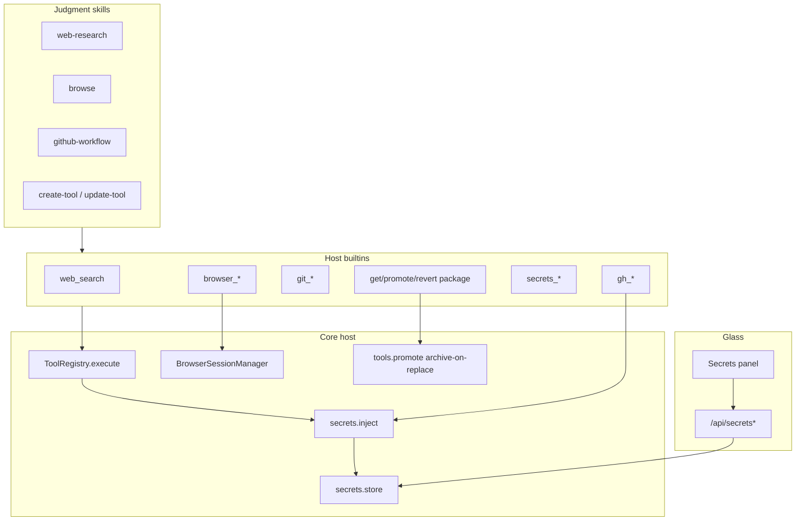
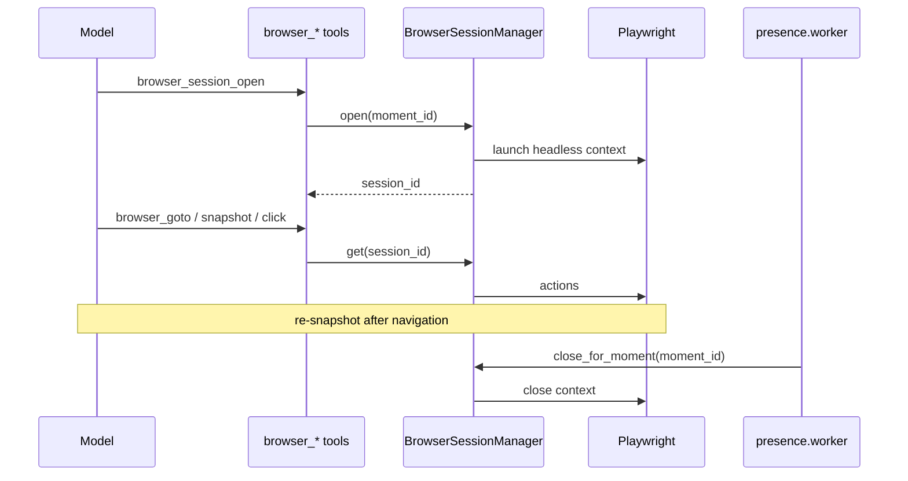
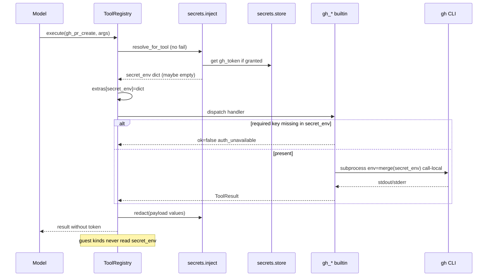
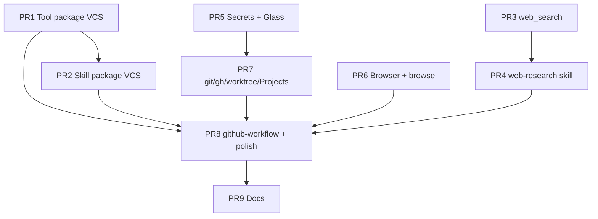

# Implementation Plan: Capability Growth — Search, Browser, Package VCS, Secrets

| Field | Value |
|-------|--------|
| **Document** | Engineer-ready implementation plan (execute-plan contract) |
| **Author** | Systems architecture (Grok Build subagent) |
| **Date** | 2026-07-27 |
| **Status** | Implemented (PRs 1–9) — operator docs in [tools-and-skills.md](tools-and-skills.md); revised post-review 2026-07-27 |
| **Product** | project-elyra |
| **Branch base** | `grok-improvement` @ `deba40b` (capability-growth design v2) |
| **Source of truth** | `docs/design-capability-growth-search-browse-vcs-secrets.md` (product design v2) |
| **Related** | `docs/tools-and-skills.md`, `docs/time-and-identity.md`, `docs/design-identity-self-other-multi-user.md`, `docs/project-status-pass.md`, `prompts/system.md` |
| **Parallel pattern** | Identity draft → promote + versions; create-tool draft → verify → promote |

---

## Overview

This document is the **implementation contract** for `/execute-plan`. It does **not** re-litigate product strategy. It turns the refined product design into a concrete PR DAG with:

- Normative file/module touch lists and behavioral deltas vs tree
- Exact promote semantics change (`refuses_overwrite_local` → **archive-then-replace**)
- Per-PR acceptance tests and dogfood gates
- Dependency/extras packaging steps
- Integration with registry, guest_exec, Glass, ledger, identity `version_id`, sandbox isolation
- Security gates that must not regress
- Implementer-safe defaults for open questions

**One-sentence outcome:** An engineer can implement package VCS recovery, native search + research skill, Playwright browse, secrets + Glass, and git/gh/worktree/Projects host builtins — with fail-closed optional deps and agency-preserving skills — via the ordered PRs at the bottom of this document.

---

## Background & Motivation

### Product gaps (locked)

| Gap | Tree reality (2026-07-27) | Target |
|-----|---------------------------|--------|
| Promote one-way | `elyra/tools/promote.py` returns `refuses_overwrite_local` when `tools/local/<name>/` exists | Archive payload → `versions/<id>/`, then replace local |
| No package recovery | No `versions/` under tools/skills | Identity-aligned GC 50 + `revert_*` |
| No search | No `web_search` tool | Host builtin + `elyra[search]` (`ddgs`) |
| No browser | No Playwright surface | Host builtins + session store + `browse` skill |
| No secrets model | `data/secrets/` exists only for xAI API key (`elyra/llm/auth.py`) | Named secrets store + tool-scoped inject + Glass |
| No structured VCS | Free-form `run` only | Host git/gh builtins + path jail |
| Self-mod culture | Growth skills know create-tool only | `github-workflow` + package VCS polish |

### Critical tree mismatch (normative)

Package VCS is **not** “add versions next to existing promote.” It requires changing promote semantics:

```text
TODAY:  draft → verify → promote  ONLY if local name free
        local exists → refuses_overwrite_local
        no versions archive

TARGET: draft → verify → promote always (for local packages)
        if local exists → archive package payload to versions/<version_id>/
        then draft → local (atomic); remove draft
        revert_tool: archive current, restore version (reason required)
```

This is a **behavior break**. Runtime today returns `refuses_overwrite_local` (`elyra/tools/promote.py:119–126`). Tests in `tests/test_create_tool_gates.py` **do not yet assert** that code path (they cover bundled refuse, force reject, verify/hash, reload). PR1 is therefore mostly **additive** (archive/revert/GC tests) plus docs rule 6 + create-tool skill updates; keep existing force/bundled tests green as regression. Dogfood homes that relied on “promote once only” gain recovery instead of refusal.

### Leave-alone (non-negotiable)

Do **not** modify:

- Do-loop core (`elyra/loop/doloop.py` control flow, stop policy shape) — **exception (PR5 only):** in `assistant_message_from_result` only, re-serialize redacted args for `SECRET_WRITE_TOOLS` instead of preferring unredacted `arguments_raw` (see IK9 / §5); no other loop policy changes
- Stage B MC formulas
- Identity promote gates (`elyra/identity/gates.py` semantics)
- Sandbox guest fail-closed (no silent host fallback when isolation on)
- speak → Glass law
- Continuous defaults / `require_open_work`
- Usage meter hard-stop / override contracts

---

## Goals & Non-Goals

### Goals

1. **Package VCS** for tools (and skills with adapted gates), identity-aligned.
2. **Native `web_search`** via `ddgs` + optional future backend swap.
3. **Playwright browser primitives** (a11y snapshot + refs) + `browse` skill.
4. **Structured git + `gh`** host builtins (worktree lifecycle + Projects).
5. **Secrets system** (file backend primary; optional keyring; Glass UI; inject hook).
6. **Judgment skills:** `web-research`, `browse`, `github-workflow`.
7. **Polish** growth skills + short catalog/prompt lines (agency preserved).
8. Full program shippable via the PR Plan DAG below.

### Non-Goals / Defer

| Deferred | Why |
|----------|-----|
| Full `web_fetch` / extraction | Ship search first |
| Nested Browser-Use agent as default | Transparent Playwright primitives |
| Full vault / cloud broker | File + optional keyring |
| Per-user isolated tool/skill stores | Shared packages + provenance |
| Automatic self-rewrite without promote | Keep draft → promote |
| Phase 1 `grok_build` tool itself | Rails only (`github-workflow`) |
| Memory-backed research notes | Later phase |
| Force-push / main merge automation | Human-only / grant-gated forever in v1 |
| Browser screenshots → media store | Defer (text/snapshot first) |
| Usage counters for search/browser | Non-goal v1 |

---

## Key Decisions (implementation)

Product decisions K1–K20 from the source design remain locked. This table records **implementation** choices for `/execute-plan`.

| ID | Decision | Choice | Rationale |
|----|----------|--------|-----------|
| **IK1** | Shared `version_id` util | Extract **only** `mint_version_id`, `VERSION_ID_RE`, `VERSION_GC_LIMIT` to **`elyra/util/versioning.py`**. Re-export from `elyra.identity.layout` for back-compat. Tools import util only. **Do not** move identity file GC helpers (`trim_versions_index`, `delete_version_files`, layout `gc_versions` for `versions/*.md`). Package VCS directory GC lives only in `elyra/tools/promote.py` (tools) / package_vcs skill helpers (skills). | Avoid tools↔identity cycle; prevent accidental use of identity’s `*.md` GC on package dirs. |
| **IK2** | Promote overwrite strategy | **Change** `promote_draft_tool` in place — archive-then-replace. **Do not** add `promote_force` tool. Keep `force` arg rejected (`force_not_allowed`). | Source K16; one promote path; no dual APIs. |
| **IK3** | Archive payload scope | When archiving local package: copy files **except** nested `versions/`, `.versions_meta.json`, `__pycache__`. Never nest archives. `content_hash` for the archive entry is computed on the **archive destination dir after payload copy** (payload-only; not full live local including `versions/`). | Prevents exponential tree growth and hash pollution. |
| **IK4** | Atomic promote (single recipe) | **Only** the normative whole-tree rename algorithm in §1. Forbidden: (a) delete-then-copy of payload; (b) move payload children out of `dest` while leaving `local/<name>/` as a hollow dir (versions-only). Lock: non-blocking exclusive file lock `tools/local/.<name>.lock`; on contention → `promote_locked`; always unlock in `finally`; no automatic stale-lock steal in v1. | Product hardening: no hollow callable package; same-FS rename swap. |
| **IK5** | Skill verify depth | **SKILL.md presence + frontmatter parse + size cap (64 KiB body, match identity `MAX_BODY_BYTES`) + content sha256**. No sandbox pytest. Frontmatter requires `name` + `description` non-empty. | Tools keep verify_tool; skills are prose. |
| **IK6** | Skill draft path + module placement | New `skills/drafts/<name>/` + promote/revert. **`get_skill` / `promote_skill` / `revert_skill` / `install_skill_draft` live in `elyra/tools/builtin/package_vcs.py`.** Keep `install_skill` in `growth.py` as compat wrapper that writes draft content then calls shared promote helpers (archive-on-overwrite when local exists). | One home for VCS ops; growth stays create-tool path. |
| **IK7** | Secrets module placement | New package **`elyra/secrets/`**: `store.py`, `inject.py`, `policy.py`, `__init__.py` (exports). Do **not** overload `elyra.llm.auth`. Coexist under `data/secrets/`. | Clear boundary. |
| **IK8** | Secrets on-disk layout | `data/secrets/meta.json` + `data/secrets/values/<name>` (mode 0600). Preserve `data/secrets/xai_api_key`. Reserved names: `xai_api_key`, `xai_api_key.tmp`, `meta.json`, `values`. | Hermetic dogfood; auth unmoved. |
| **IK9** | Secrets inject + write path | (1) **Inject:** `ToolRegistry.execute` after resolve, before `dispatch`: resolve via `TOOL_SECRET_REQUIREMENTS` (v1 hardcoded map only — **do not extend `RunnerSpec` / runner.json in PR5**). Attach `ctx.extras["secret_env"]` = call-local `dict[str, str]`. **Forbidden:** merging `secret_env` into guest/host-stub. (2) **Fail ownership:** registry never invents `auth_unavailable`; gh_* soft-fail. (3) **Results:** registry post-dispatch redacts `ToolResult.payload`. (4) **Chain args (K6) — single choke point only:** inside `assistant_message_from_result` (before any `chain_messages.append`), for `SECRET_WRITE_TOOLS`, build the serialized `function.arguments` by parse → `redact_tool_call_arguments` → `json.dumps`; **never** pass through unredacted `arguments_raw` for those tools. **Forbidden:** relying on post-dispatch-only scrub for chain safety. See §5. | Fail-closed guest; K6 covers `arguments_raw` path. |
| **IK10** | Glass secrets API | `GET /api/secrets`, `PUT /api/secrets`, `DELETE /api/secrets/<name>`, `PUT /api/secrets/<name>/grants`. Operator-only; never echo values. | Parallel provider api-key. |
| **IK11** | Path jail + settings coercion | `ToolsSettings.allowed_repo_roots: tuple[str, ...] = ()`. Empty sentinel means auto roots at **use site** in `vcs_jail` (`[project_root(), paths.home]`), not at load time. **PR7 must extend** `settings._coerce_value` so TOML arrays (`list`) coerce to `tuple[str, ...]` (all elements str). Unit test `test_allowed_repo_roots_from_toml`. Reject `..`, symlink escape, paths outside jail. | Tree `_coerce_value` has no list/tuple handling today. |
| **IK12** | Browser screenshots | **Defer** PNG → media store. Omit tool or `not_implemented`. | Source open Q3. |
| **IK13** | Elyra-managed secret mint | Operator-initiated only (Glass primary). `secrets_set` remains for model path with chain arg scrub (IK9). No OAuth mint tool. | Source open Q4. |
| **IK14** | Multi-machine secrets | Node-local file store; no sync. | Source open Q5. |
| **IK15** | Host builtin registration | Modules: `search.py`, `browser.py`, `git_tools.py`, `gh_tools.py`, `secrets_tools.py`, `package_vcs.py`. Update `elyra/tools/builtin/__init__.py` docstring module list. Bundled packages under `tools/bundled/<name>/`. | Matches growth/identity pattern. |
| **IK16** | Optional extras | `search`, `browser`, `secrets-keyring`, `research` extras; core deps `[]`. | Hermetic CI. |
| **IK17** | Fail-closed probes | Search: `search_unavailable` + `pip install -e '.[search]'`. Browser: distinguish **`browser_unavailable`** (import/playwright package missing) vs **`chromium_unavailable`** (package present, browser binary missing) — payload `hint` must include both `pip install -e '.[browser]'` and `playwright install chromium` as applicable. `auth_unavailable` for missing token. Never crash supervisor. | Deploy step easy to miss. |
| **IK18** | Browser session lifecycle | `BrowserSessionManager` process singleton. Bind `moment_id`. Close on: `browser_session_close`; **both** presence worker success finalize **and** `fail_in_flight` close_moment paths; supervisor `shutdown()` → `close_all()`. Max 2 concurrent. | Avoid orphan Chromium. |
| **IK19** | get_tool / get_skill | Thin builtins; `list_versions` meta only; truncate previews. | Thin tools. |
| **IK20** | High-impact revert grants | v1: `reason` min 8 chars; no grant_token for package revert; bundled immutable. | Shippable. |

---

## Proposed Design

### Architecture (layers)



### 1. Package VCS (tools)

#### Current code anchors

| Symbol | Path | Today |
|--------|------|-------|
| `promote_draft_tool` | `elyra/tools/promote.py` | Lines 116–126: `refuses_overwrite_bundled` / `refuses_overwrite_local` (runtime) |
| `promote_tool` | `elyra/tools/builtin/growth.py` | Wraps promote; `registry.reload()` |
| `install_tool_draft` / `verify_tool` | same | Unchanged duty |
| `mint_version_id` | `elyra/identity/layout.py` | `YYYYMMDDTHHMMSSZ_` + 6 hex; `VERSION_GC_LIMIT = 50` (extract to util; re-export) |
| Tests | `tests/test_create_tool_gates.py` | Covers bundled refuse, force, verify/hash, reload — **no** `refuses_overwrite_local` assert today; PR1 adds re-promote/archive tests |
| Docs | `docs/tools-and-skills.md` § create-tool safety rule 6 | “Never overwrite … existing promoted packages” — update in PR1 |

#### Target layout

```text
$ELYRA_HOME/tools/
  bundled/                         # immutable
  local/<name>/
    TOOL.md, schema.json, runner.json, impl/, tests/, …
    versions/
      <version_id>/                # full package payload snapshot (no nested versions/)
    .versions_meta.json            # index: [{version_id, content_hash, archived_at, reason?, bytes}]
  drafts/<name>/
```

#### Normative promote algorithm (`promote_draft_tool`) — **single recipe (normative)**

**Forbidden (both produce hollow packages):**

| Anti-pattern | Why |
|--------------|-----|
| Delete-then-copy payload under live `dest` | Crash mid-copy → empty/partial payload |
| Move payload **children** out of `dest` into aside, then move stage children in | Between the two moves, `local/<name>/` exists with only `versions/` + meta — registry still discovers the dir as a package (`ToolRegistry._scan_root`) → **hollow but callable** |

**Normative steps (whole-tree rename on same filesystem):**

1. Validate name, draft exists, package shape, verify record, hash match (unchanged).
2. If `bundled_name_exists` → `refuses_overwrite_bundled` (unchanged).
3. **Lock:** non-blocking exclusive create/lock of `tools/local/.<name>.lock`. If held → `error_reason: promote_locked`. No automatic stale-lock steal in v1. Hold until step 10; **always unlock in `finally`**.
4. Let `dest = tools/local/<name>/` (the only path that must end as the callable package).  
   Let `stage = tools/local/.<name>.promote.<pid>.<uuid>/` (sibling under `local/`, **not** inside `dest`).  
   Let `aside_full = tools/local/.<name>.aside.<pid>.<uuid>/` (full previous tree after rename).
5. **Stage draft payload first:** `copytree(draft → stage)` (payload files only; no empty invent of `versions/` yet). Fail closed if incomplete → `rmtree(stage)`, unlock, error. Live `dest` is **untouched** through this step.
6. If `dest` exists (re-promote):
   - `vid = mint_version_id()`
   - Ensure `dest/versions/` exists
   - Copy **payload only** from `dest` → `dest/versions/<vid>/` (exclude `versions/`, `.versions_meta.json`, `__pycache__`)
   - Compute `content_hash` of **`dest/versions/<vid>/`** after copy (payload-only)
   - Append `.versions_meta.json` entry; run **package directory GC** (cap 50) in `promote.py` — **do not** call identity file GC helpers  
   - **Attach history onto stage** so stage becomes a **complete successor package**:
     - Move or copy `dest/versions/` → `stage/versions/`
     - Copy/move `dest/.versions_meta.json` → `stage/.versions_meta.json`  
     After this, `stage` has new payload **and** full version history; `dest` still has old payload + history (history dirs may already live only under stage if moved — prefer **copy** history to stage, then proceed to rename so dest remains complete until rename). **Preferred:** **copy** `versions/` + meta onto stage (dest remains fully intact until step 7).
7. **Whole-tree rename swap (same filesystem; no hollow `local/<name>`):**
   - If `dest` does not exist: `os.rename(stage, dest)` (atomic on POSIX same FS).
   - If `dest` exists:
     1. `os.rename(dest, aside_full)` — after this, **no** directory named `<name>` exists under `local/` (name is temporarily absent, not hollow).
     2. `os.rename(stage, dest)` — callable package is fully new tree (payload + versions).
     3. Only after (2) succeeds: `rmtree(aside_full)`.
     4. If (2) fails after (1): `os.rename(aside_full, dest)` recovery; return `promote_failed:*`; do **not** delete draft; leave no hollow `<name>`.
   - Cross-device fallback (rare): if rename raises `EXDEV`, use copytree + rmtree only with the same whole-tree discipline (never child-shuffle on live name).
8. On full success: `rmtree(draft)`; ensure `tools/drafts/` parent remains.
9. Unlock; return `{ok, local_dir, content_hash, archived_version_id?}`.
10. Caller (`promote_tool`) still `registry.reload()`.

**Invariant (normative):** Whenever a directory named `tools/local/<name>/` exists, it is a **complete** package (has required payload files such as `TOOL.md` / `schema.json` / `runner.json`, plus optional `versions/`). Allowed intermediate: **name absent** (between renames) or **fully old** or **fully new**. **Never** “versions-only under the live name.”

**GC note:** Package GC deletes oldest `versions/<id>/` directories and trims `.versions_meta.json` (on the tree that holds history — after attach, prefer GC on `stage` before rename, or on `dest` after successful rename; pick one and document in code). Helpers: `archive_local_payload` / `gc_package_versions` (not identity `gc_versions`).

#### Normative revert algorithm

1. Args: `name`, `version_id`, `reason` (required, strip, min 8 chars).
2. Refuse if bundled name (cannot revert bundled).
3. Resolve `versions/<version_id>/`; fail `version_not_found`.
4. Same lock semantics as promote (`package_locked` / `promote_locked`).
5. Build complete `stage` from chosen version payload + attach current versions history (archive current payload into history first with reason `"pre_revert:<reason>"`), then **same whole-tree rename** as promote (never hollow live name).
6. Do not delete the restored version from history.
7. Unlock; `registry.reload()`.

#### New tools (bundled builtins)

| Tool | Module entry | Role |
|------|--------------|------|
| `get_tool` | `elyra.tools.builtin.package_vcs:get_tool` | `name`, optional `which=current\|draft\|version`, `version_id`, `list_versions` |
| `revert_tool` | `elyra.tools.builtin.package_vcs:revert_tool` | Restore version |
| `promote_tool` | existing | Semantics change only + payload may include `archived_version_id` |

`install_tool_draft` / `verify_tool` unchanged.

#### Sequence: archive-on-promote

```mermaid
sequenceDiagram
  participant M as Model
  participant PT as promote_tool
  participant P as promote_draft_tool
  participant FS as tools/local
  participant R as ToolRegistry

  M->>PT: promote_tool(name)
  PT->>P: promote_draft_tool(paths, name)
  P->>P: verify hash + refuse bundled + lock
  P->>FS: stage = copy draft → .name.promote.pid.uuid/
  alt local exists
    P->>FS: archive payload → dest/versions/vid/ (dest still intact)
    P->>FS: copy versions+meta onto stage; GC
    P->>FS: rename dest → aside_full (name absent, not hollow)
    P->>FS: rename stage → dest (full new package)
    P->>FS: rmtree aside_full (only after success)
  else first promote
    P->>FS: rename stage → dest
  end
  P->>FS: rmtree draft; unlock
  P-->>PT: ok + archived_version_id?
  PT->>R: reload()
  PT-->>M: callable=true
```

### 2. Package VCS (skills)

#### Current

- `install_skill` in `growth.py` writes `skills/local/<name>/SKILL.md` directly; refuses bundled overwrite; **allows local overwrite** without archive.
- `SkillCatalog` scans `bundled` + `local` only (`elyra/skills/catalog.py`).
- No drafts/versions.

#### Target layout

```text
$ELYRA_HOME/skills/
  bundled/
  local/<name>/
    SKILL.md
    versions/<version_id>/SKILL.md   # or full dir with only SKILL.md
    .versions_meta.json
  drafts/<name>/
    SKILL.md
```

#### Tools / module placement (normative)

| Tool | Module | Role |
|------|--------|------|
| `install_skill_draft` | `package_vcs.py` | Write `skills/drafts/<name>/SKILL.md` only |
| `promote_skill` | `package_vcs.py` | Archive local if any → atomic swap draft → local; catalog reload |
| `revert_skill` | `package_vcs.py` | reason required; archive current; restore |
| `get_skill` | `package_vcs.py` | current/draft/version + list_versions |
| `install_skill` | `growth.py` | **Compat wrapper:** assemble SKILL.md → write draft → call shared promote helper (archive-on-overwrite) |

Skill promote gates: IK5 only (no verify_tool). Same **whole-tree rename** rules as tools (no hollow `skills/local/<name>/`).

`SkillCatalog` already scans only `bundled` + `local` — drafts under `skills/drafts/` are non-loadable by construction. Still add an explicit test that a draft-only name is absent from the short catalog list.

Ensure `SkillCatalog.reload()` after promote/revert (via `ctx.extras["skills"]` same as install_skill today).

### 3. web_search

#### Module

- `elyra/tools/builtin/search.py` → `web_search(args, ctx)`
- Bundled: `tools/bundled/web_search/{TOOL.md,schema.json,runner.json}`
- Extra: `elyra[search]` → `ddgs>=9.0`

#### Args / result (normative)

```json
// args
{
  "query": "string",
  "type": "text|news|images|videos",
  "max_results": 8,
  "region": null,
  "safesearch": null,
  "timelimit": null
}
// result payload
{
  "ok": true,
  "results": [
    {"title": "...", "url": "...", "snippet": "...", "source": "...", "date": null}
  ],
  "warning": null
}
```

Errors: `ok: false`, `error_reason` ∈ {`search_unavailable`, `rate_limited`, `invalid_args`, `timeout`}.

Hardening:

- Import probe → `search_unavailable` with hint `pip install -e '.[search]'`
- Timeout 15s; max_results hard cap 20
- Process-wide cooldown after consecutive failures (simple module state)
- Empty results: `ok: true, results: [], warning: "empty"`
- No HTML dump

Optional: if env `SEARXNG_URL` set, adapter with same schema (can be stub interface in PR3, implement later).

### 4. Browser primitives

#### Module

- `elyra/tools/browser_sessions.py` — `BrowserSessionManager`
- `elyra/tools/builtin/browser.py` — tool handlers
- Extra: `elyra[browser]` + docs `playwright install chromium`
- Disk: `data/browser/` created in `ElyraPaths.ensure_data_dirs`

#### Tools

| Tool | Purpose |
|------|---------|
| `browser_session_open` | headless Chromium; returns `session_id`; max 2 |
| `browser_session_close` | cleanup |
| `browser_goto` | navigate + wait load |
| `browser_snapshot` | a11y tree + refs; char-capped (e.g. 32k) |
| `browser_click` | by `ref` primary |
| `browser_type` / `browser_fill` | by ref |
| `browser_get_text` | extract text |
| `browser_wait` | short stability wait |

`browser_screenshot`: **deferred** (IK12).

Lifecycle integration (must wire **all** of):

- `elyra/presence/worker.py` **success** finalize path that calls `close_moment` (~1166): `close_for_moment(moment_id)`
- Same file **`fail_in_flight`** path (~1360): `close_for_moment(moment_id)` — missing this orphans Chromium after errors
- `elyra/runtime/supervisor.py` `shutdown()` (~427): `BrowserSessionManager.close_all()`
- Explicit `browser_session_close` tool

Fail-closed errors (IK17):

| Condition | `error_reason` | Hint content |
|-----------|----------------|--------------|
| `playwright` not importable | `browser_unavailable` | `pip install -e '.[browser]'` then `playwright install chromium` |
| Package present, Chromium/binary missing or launch fails for missing browser | `chromium_unavailable` | `playwright install chromium` (and extras if needed) |

#### Sequence: browser session lifecycle



### 5. Secrets store + inject + Glass

#### Coexistence with llm.auth

Today:

- `data/secrets/xai_api_key` (file)
- `elyra/llm/auth.py` — provider only
- `ElyraPaths.ensure_data_dirs` creates `data/secrets` mode 0700

New:

```text
$ELYRA_HOME/data/secrets/
  xai_api_key              # reserved — llm.auth
  xai_api_key.tmp
  meta.json                # new store index
  values/                  # 0700 dir
    <secret_name>          # 0600 file, raw value UTF-8
```

`meta.json` shape:

```json
{
  "secrets": {
    "gh_token": {
      "managed_by": "user",
      "created_at": "ISO-8601",
      "updated_at": "ISO-8601",
      "last_used_at": null,
      "grants": ["gh_pr_create", "gh_issue_create", "gh_api", "gh_auth_status", "gh_project_list", "…"]
    }
  }
}
```

v1 host builtins hardcode required secret names in a central map in `elyra/secrets/policy.py`. **Do not** add `requires_secrets` to `RunnerSpec` / `runner.json` in PR5 (later packages may use a separate mechanism).

```python
TOOL_SECRET_REQUIREMENTS: dict[str, list[str]] = {
    "gh_auth_status": ["gh_token"],
    "gh_pr_create": ["gh_token"],
    "gh_pr_list": ["gh_token"],
    "gh_pr_view": ["gh_token"],
    "gh_issue_create": ["gh_token"],
    "gh_issue_list": ["gh_token"],
    "gh_api": ["gh_token"],
    "gh_project_list": ["gh_token"],
    "gh_project_item_list": ["gh_token"],
    "gh_project_item_add": ["gh_token"],
    "gh_project_item_edit": ["gh_token"],
    "gh_project_field_list": ["gh_token"],
}
```

Env mapping for inject: secret name `gh_token` → env var `GH_TOKEN` (map in `policy.py`).

#### Inject model (normative)

1. **`ToolRegistry.execute`** after package resolve, before `dispatch`:
   - If tool name ∈ `TOOL_SECRET_REQUIREMENTS`, call `inject.resolve_for_tool(name, store)`.
   - Set `ctx.extras["secret_env"]` to a **new** `dict[str, str]` (call-local only). May be empty if secrets missing or grants deny.
   - Registry **does not** fail the call for missing secrets and **does not** invent `auth_unavailable`.
2. **Host builtin readers only:** gh/git (if needed) handlers read `ctx.extras.get("secret_env")` and merge into **their** subprocess `env=` argument only.
3. **Forbidden contracts:**
   - `guest_exec` / `dispatch` for `sandbox_python` / `sandbox_shell` / host-stub must **ignore** `secret_env`.
   - Never pass `secret_env` into `_scrubbed_host_env(..., extra=...)`.
   - Never assign into process-global `os.environ` permanently.
4. **Fail ownership:** each `gh_*` tool checks required keys in `secret_env`; if missing → `ToolResult(ok=False, error_reason="auth_unavailable", payload={...hint...})`.
5. **Result redaction:** after `dispatch` returns, registry (or inject helper) recursively redacts known secret **values** and token-shaped strings from `ToolResult.payload` before return to the loop.
6. **Moment tape:** beats already store tool_call **names** more than full args in some paths; still scrub payloads. Prefer defense in depth at execute return.

#### Model write path and K6 (chain arguments)

Product K6: secrets never in LLM context. Tree reality that implementers must match:

- `_handle_tool_batch` in `elyra/loop/doloop.py` does `state.chain_messages.append(assistant_message_from_result(result))` **before** any tool runs (~1058).
- `assistant_message_from_result` (~326–329) prefers **`tc.arguments_raw`** over re-serializing parsed `tc.arguments`.

Therefore: redacting only the parsed `arguments` dict, or only post-`registry.execute` results, **leaves the secret in the chain** via unredacted `arguments_raw`.

**Normative v1 — single choke point (deliberate minimal leave-alone exception):**

| Rule | Requirement |
|------|-------------|
| **Site** | **Only** `assistant_message_from_result` in `elyra/loop/doloop.py` (the function that builds the object later appended to `chain_messages`). Do **not** implement chain safety solely after tool dispatch, and do **not** offer an alternate “tool-exec path” for chain scrub. |
| **Tools** | `SECRET_WRITE_TOOLS = frozenset({"secrets_set"})` |
| **Keys** | `SECRET_WRITE_ARG_KEYS = frozenset({"value", "secret", "token", "password", "api_key"})` |
| **Serialization** | For each `tc` whose `tc.name` is in `SECRET_WRITE_TOOLS`: (1) start from `tc.arguments` if parse ok, else `json.loads(tc.arguments_raw)` best-effort; (2) `redact_tool_call_arguments(name, args)` → replace secret keys with `"***"`; (3) set chain `function.arguments` to `json.dumps(redacted, ensure_ascii=False)`. **Never** assign unredacted `tc.arguments_raw` into the chain message for those tools. |
| **Other tools** | Unchanged: keep existing `arguments_raw` preference. |
| **Helper** | `elyra/secrets/inject.py`: `redact_tool_call_arguments(name, args: dict) -> dict` (pure). |
| **Not sufficient alone** | Result payload redaction in `ToolRegistry.execute` (still required for stdout/leaks, separate gate). |
| **Forbidden** | Relying on post-dispatch-only scrub for chain safety; mutating `chain_messages` later as the primary fix. |

Prefer Glass for operator secret writes; still ship model `secrets_set` with the above scrub.

#### Secrets tools (model-facing)

| Tool | Role |
|------|------|
| `secrets_list` | names + metadata + grants — **never values** |
| `secrets_set` | write value; **result** omits value; **chain args** redacted (above) |
| `secrets_delete` | delete |
| `secrets_grant` / `secrets_revoke` | update grants |

Injection is **not** a model-facing tool.

#### Sequence: secret inject on gh call



#### Glass

| Endpoint | Behavior |
|----------|----------|
| `GET /api/secrets` | `{ secrets: [{name, managed_by, grants, updated_at}] }` — no values |
| `PUT /api/secrets` | body `{name, value, grants?}` write-only; never echo value |
| `DELETE /api/secrets/<name>` | delete |
| `PUT /api/secrets/<name>/grants` | `{grants: [tool, …]}` |

UI: dedicated **Secrets** panel in `elyra/runtime/web/` (index.html + app.js + style.css), visual language parallel to Identity / provider api-key (password input, clear after save, confirm delete).

Wire in `elyra/runtime/api.py` next to provider api-key handlers (~lines 1086+).

### 6. Git + GitHub host builtins

#### Path jail

```python
# elyra/tools/vcs_jail.py
def effective_allowed_roots(settings, paths) -> list[Path]:
    """Empty settings.tools.allowed_repo_roots → [project_root(), paths.home]."""

def resolve_repo_path(raw: str, allowed_roots: list[Path]) -> Path:
    # expanduser, resolve, require is_relative_to any allowed root
    # refuse .. / symlink escape; require repo .git for most ops
```

Settings (PR7 — loadable from TOML):

```python
@dataclass(frozen=True)
class ToolsSettings:
    verify_timeout_seconds: int = 120
    allowed_repo_roots: tuple[str, ...] = ()  # empty sentinel; resolve at use site
```

**Coercion (normative):** extend `elyra/settings.py` `_coerce_value` so annotation `tuple[str, ...]` accepts TOML/Python `list` or `tuple` of strings and returns `tuple[str, ...]`. Without this, `[tools] allowed_repo_roots = ["…"]` fails `isinstance(value, expected)` today. Test: `test_allowed_repo_roots_from_toml`.

```toml
[tools]
allowed_repo_roots = ["/home/jim/Workspace/project-elyra"]
```

#### Frozen PR7 tool set (exact names — ship these only)

**Local git (argv wrappers, not shell):**

| Tool | Notes |
|------|--------|
| `git_status` | |
| `git_diff` | |
| `git_log` | |
| `git_add` | |
| `git_commit` | |
| `git_branch` | list/create as args allow |
| `git_checkout` | |
| `git_worktree_add` | priority |
| `git_worktree_list` | priority |
| `git_worktree_remove` | priority; dirty remove needs `confirm: true` |
| `git_worktree_prune` | priority |

**Deferred (not PR7):** `git_stash`, `gh_repo_*`, merge/force helpers beyond confirm-gated remove.

**GitHub:**

| Tool | Notes |
|------|--------|
| `gh_auth_status` | soft-fail without token |
| `gh_pr_create` | |
| `gh_pr_list` | |
| `gh_pr_view` | |
| `gh_issue_create` | |
| `gh_issue_list` | |
| `gh_api` | escape hatch |
| `gh_project_list` | |
| `gh_project_item_list` | |
| `gh_project_item_add` | |
| `gh_project_item_edit` | |
| `gh_project_field_list` | |

Auth: `secret_env` → `GH_TOKEN`; tool soft-fails `auth_unavailable` if missing (registry does not).

Destructive: require `confirm: true` for dirty worktree remove and any future merge-like ops.

### 7. Skills (judgment)

| Skill | Package path | Depends on tools |
|-------|--------------|------------------|
| `web-research` | `skills/bundled/web-research/SKILL.md` | `web_search`, ledger |
| `browse` | `skills/bundled/browse/SKILL.md` | browser_* |
| `github-workflow` | `skills/bundled/github-workflow/SKILL.md` | git_*, gh_*, package VCS |
| Polish | `create-tool`, `create-skill`, `review-work` | mention VCS recovery |

Skill bodies: multi-step procedure, cite, stop conditions, ledger for incomplete work, **no** inventing on search failure, grant stops for destructive github actions. Agency-preserving: do not force every action through a skill.

### 8. Prompt & catalog

- `prompts/system.md`: short family lines for Search, Browser, Git/GitHub, Secrets, Package VCS recovery.
- Orient skill catalog: short descriptions only (existing catalog path).
- **Do not** hard-force skill load for every research action.

### 9. Dependencies & packaging

```toml
# pyproject.toml — additive only
[project.optional-dependencies]
dev = ["pytest>=8.0"]
sandbox = ["microsandbox>=0.6.0"]
search = ["ddgs>=9.0"]
browser = ["playwright>=1.49"]
secrets-keyring = ["keyring>=25"]
research = ["elyra[search]", "elyra[browser]"]
```

Docs note after browser extra:

```bash
playwright install chromium
```

---

## API / Interface Changes

### Python modules (new)

| Module | Responsibility |
|--------|----------------|
| `elyra/util/versioning.py` | **Only** `mint_version_id`, `VERSION_ID_RE`, `VERSION_GC_LIMIT` |
| `elyra/util/__init__.py` | package marker |
| `elyra/secrets/__init__.py` | public exports |
| `elyra/secrets/store.py` | CRUD meta + values |
| `elyra/secrets/inject.py` | resolve_for_tool, redact_payload, redact_tool_call_arguments |
| `elyra/secrets/policy.py` | name rules, grants, `TOOL_SECRET_REQUIREMENTS`, env map |
| `elyra/tools/browser_sessions.py` | session manager |
| `elyra/tools/vcs_jail.py` | path jail + `effective_allowed_roots` |
| `elyra/tools/builtin/package_vcs.py` | get/revert/promote skill tools + archive helpers |
| `elyra/tools/builtin/search.py` | web_search |
| `elyra/tools/builtin/browser.py` | browser_* |
| `elyra/tools/builtin/git_tools.py` | frozen git_* set |
| `elyra/tools/builtin/gh_tools.py` | frozen gh_* set |
| `elyra/tools/builtin/secrets_tools.py` | secrets_* |

### Modified modules

| Module | Change |
|--------|--------|
| `elyra/tools/promote.py` | Normative atomic archive-on-replace; package dir GC; lock; no identity GC imports |
| `elyra/tools/builtin/growth.py` | Promote payload fields; `install_skill` compat → package_vcs helpers |
| `elyra/tools/builtin/__init__.py` | Docstring module list for new builtins |
| `elyra/tools/registry.py` | Attach `secret_env`; post-result redact; never merge into guest |
| `elyra/tools/types.py` | Prefer `extras`; no RunnerSpec secret field |
| `elyra/tools/runner.py` | **No** `requires_secrets` on `RunnerSpec` in v1 |
| `elyra/loop/doloop.py` | Minimal: redact secret write tool_call args in chain (IK9 exception) |
| `elyra/identity/layout.py` | Re-export mint/RE/LIMIT from util |
| `elyra/identity/store.py` / `elyra/users/store.py` | Keep layout re-exports (no required churn) |
| `elyra/settings.py` | `allowed_repo_roots` + `_coerce_value` list→`tuple[str, …]` |
| `elyra/config.py` | ensure `data/browser`, `data/secrets/values` |
| `elyra/runtime/api.py` | `/api/secrets*` |
| `elyra/runtime/web/{index.html,app.js,style.css}` | Secrets panel |
| `elyra/presence/worker.py` | `close_for_moment` on success **and** fail_in_flight |
| `elyra/runtime/supervisor.py` | `close_all` on `shutdown()` |
| `pyproject.toml` | extras |
| `prompts/system.md` | catalog lines |
| `docs/tools-and-skills.md` | full program docs (PR9; partial notes allowed earlier) |

### Bundled packages (new tools)

Under `tools/bundled/`: `web_search`, `get_tool`, `revert_tool`, `get_skill`, `promote_skill`, `revert_skill`, `install_skill_draft`, `secrets_list`, `secrets_set`, `secrets_delete`, browser tools, and the **frozen** git/gh names in §6.

Each: `TOOL.md` + `schema.json` + `runner.json` (`kind: builtin`, `entry: …`).

### HTTP API

| Method | Path | Notes |
|--------|------|-------|
| GET | `/api/secrets` | Redacted list |
| PUT | `/api/secrets` | Set secret write-only |
| DELETE | `/api/secrets/{name}` | Delete |
| PUT | `/api/secrets/{name}/grants` | Grants only |

Never return secret values. Mirror status-safe error style of provider api-key.

---

## Data Model Changes

### Tools local versions

```text
tools/local/<name>/.versions_meta.json
{
  "versions": [
    {
      "version_id": "20260727T120000Z_a1b2c3",
      "content_hash": "sha256hex",
      "archived_at": "2026-07-27T12:00:00+00:00",
      "reason": "pre_promote|pre_revert:…",
      "bytes": 12345
    }
  ]
}
```

`content_hash` is of the **archive destination directory after payload copy** (excludes sibling `versions/` and meta). Do not hash the full live local package while it still contains historical versions.

### Skills local versions

Same meta shape; payload is typically `SKILL.md` only.

### Secrets

See §5 meta.json. Values dir never sandbox-mounted (confirm sandbox seed paths in `elyra/sandbox/workspace_seed.py` / paths — **must not** seed `data/secrets` into guest).

### Browser sessions

In-memory: `{session_id: {context, page, moment_id, opened_at}}`.  
Optional disk: `data/browser/<session_id>/` for chromium user-data-dir (v1 may use temp only).

### Settings

```toml
# elyra.toml
[tools]
verify_timeout_seconds = 120
allowed_repo_roots = ["/home/jim/Workspace/project-elyra"]  # optional; list of strings
```

- Type: `tuple[str, ...]`; empty `()` is the **load-time sentinel**.
- Auto roots `[project_root(), paths.home]` applied only in `vcs_jail.effective_allowed_roots` when sentinel is empty.
- `_coerce_value` must accept TOML arrays as `list` → coerce to `tuple[str, ...]` (PR7).

---

## Alternatives Considered

### A1. Archive-on-promote vs new `promote_force` tool

| Option | Pros | Cons |
|--------|------|------|
| **Archive-on-promote (chosen)** | One mental model; identity-aligned; recovery always | Behavior break; tests/docs update |
| `promote_force` second tool | Preserves old refuse semantics | Dual APIs; model thrash; force culture banned in growth.py today |

**Decision:** Archive-on-promote; keep rejecting `force` arg.

### A2. File secrets vs keyring-first

| Option | Pros | Cons |
|--------|------|------|
| **File under data/secrets (chosen primary)** | Hermetic CI/dogfood; matches xai_api_key pattern | Node-local; perms critical |
| Keyring-first | OS integration | Breaks headless CI; extra dep |

**Decision:** File primary; `elyra[secrets-keyring]` optional backend later (same store interface). PR5 ships file only; keyring adapter may land as follow-up behind extra.

### A3. `ddgs` vs paid search API

| Option | Pros | Cons |
|--------|------|------|
| **ddgs (chosen)** | Zero-key; optional extra | Unofficial; rate limits; breakage |
| Paid API (Bing/Serp/…) | Stable contract | Keys; cost; blocks hermetic default |

**Decision:** ddgs + backend interface for SearXNG later; honest errors.

### A4. Host builtins vs sandbox packages for search/browser/git

Host builtins required for network, chromium, and host repo paths. Sandbox packages cannot safely hold secrets or touch host git worktrees.

### A5. Shared version util vs import from identity.layout

Importing identity from tools couples domains and risks cycles if identity ever imports tools. Extract to `elyra/util/versioning.py` **only** mint/RE/LIMIT. Package directory GC must **not** call identity’s `versions/*.md` helpers (`trim_versions_index` / `delete_version_files` / layout `gc_versions`).

---

## Security

| Gate | Requirement | PR |
|-----|-------------|-----|
| Bundled tools/skills immutable | Promote/revert refuse bundled | 1–2 |
| Verify still required for tool promote | Hash-bound; no force | 1 |
| Promote never hollow | Whole-tree rename; no versions-only live name; mid-fail keeps complete prior or name absent | 1 |
| Guest fail-closed | `secret_env` ignored by guest_exec/host-stub; no host fallback | 5, leave-alone |
| Secret never in model context | Redact results; scrub **serialized** chain args in `assistant_message_from_result` (never unredacted `arguments_raw` for `secrets_set`); Glass write-only API | 5 |
| Secret never in status/moments | API redaction; beat payload scrub | 5 |
| Path jail VCS | allowed_repo_roots + coercion; resolve; refuse escape | 7 |
| Browser no eval | Playwright actions only; timeout; max sessions; dual close paths | 6 |
| Destructive gh/git | `confirm: true`; skill grant guidance | 7–8 |
| Optional deps fail-closed | `search_unavailable` / `browser_unavailable` / `chromium_unavailable` | 3, 6 |
| `data/secrets` mode 0700 / values 0600 | chmod best-effort | 5 |

**Regression suites that must stay green:** `tests/test_create_tool_gates.py` (updated), `tests/test_identity_*`, `tests/test_sandbox_isolation.py`, `tests/test_llm_auth.py`, usage/continuous tests.

---

## Observability

- Log promote archive id at INFO (no package body).
- Log secret inject at DEBUG: secret **names** only, never values.
- Browser open/close at INFO with session_id + moment_id.
- Search failures: warning with error_reason.
- No new usage meter hard stops in v1.

---

## Rollout Plan

1. Land PR1 first (unblocks recovery).
2. **Preferred:** open PR3, PR5, PR6 in parallel with/after PR1 when review capacity allows.
3. **Fallback:** sequential merge train PR1→PR2→PR3→PR4→PR5→PR6→PR7→PR8→PR9 if bandwidth is limited.
4. PR4 after PR3; PR7 after PR5; PR2 after PR1.
5. **PR8 hard-depends** on PR1 + PR2 + PR4 + PR6 + PR7 (all skills/tools its acceptance asserts).
6. PR9 docs last; cumulative dogfood checklist.

Migration note for dogfood homes: after PR1, re-promoting a local tool **archives** previous instead of erroring — expected.

---

## Open Questions — defaults locked for implementers

| # | Question | Implementer default | Needs user? |
|---|----------|---------------------|-------------|
| 1 | Skill verify depth | SKILL.md + frontmatter name/description + 64 KiB + sha256 (IK5) | No |
| 2 | Default allowed_repo_roots | Empty setting → use-site `[project_root(), paths.home]`; TOML list coerced (IK11) | No |
| 3 | Screenshots v1 | Deferred (IK12) | No |
| 4 | Elyra-managed mint | Operator-only; Glass primary; secrets_set + chain scrub (IK13/IK9) | No |
| 5 | Multi-machine secrets | Node-local; document (IK14) | No |
| 6 | Exact git/gh tool names | **Frozen** in §6 PR7 table (no `git_stash` / `gh_repo_*` in v1) | No |
| 7 | install_skill vs draft-only | install_skill compat in growth.py; VCS ops in package_vcs.py (IK6) | No |

**Remaining true user inputs:** none blocking v1. Operator may later expand `allowed_repo_roots` via elyra.toml.

---

## Risks & leave-alone

| Risk | Severity | Mitigation |
|------|----------|------------|
| Promote behavior break | High | Tests + docs + dogfood note in PR1 |
| Archive bloat | Med | Cap 50; exclude nested versions |
| ddgs breakage | Med | Backend interface; honest errors |
| Secret leak via stdout / chain args | High | Result redact + secrets_set chain arg scrub; Glass write-only |
| Browser resource leak | Med | Dual worker close paths + supervisor close_all; max 2 sessions |
| Path escape via git | High | Jail + resolve + refuse |
| Scope creep to grok_build | Med | Rails only |
| Over-constraining prompts | Med | Catalog lines only |

**Leave alone:** do-loop core (except PR5 secret arg redaction choke point), Stage B MC, identity gates, sandbox isolation protocol, speak→glass, continuous defaults, usage hard-stop/override contracts.

---

## References

- Product design: `docs/design-capability-growth-search-browse-vcs-secrets.md`
- Tree: `elyra/tools/promote.py`, `verify.py`, `runner.py`, `guest_exec.py`, `registry.py`, `builtin/growth.py`, `identity/layout.py`, `llm/auth.py`, `runtime/api.py`, `settings.py`, `config.py`
- `docs/tools-and-skills.md`
- ddgs PyPI; Playwright a11y snapshot patterns; Python keyring (optional)

---

## Summary for implementers

1. **PR1 first:** archive-on-promote + get/revert — highest leverage.
2. **Parallel:** search+research (PR3–4) and secrets (PR5).
3. **Secrets before gh** (PR5 → PR7).
4. Browser (PR6) and git/gh (PR7) are host builtins with fail-closed deps.
5. Skills teach judgment; tools stay thin; agency preserved.

---

## PR Plan

Ordered execute-plan PRs for the full capability-growth program. Individual PRs use `### PR N — …` headings for tooling that splits the plan.




**Parallelism (preferred):** PR3 ∥ PR1; PR5 ∥ PR1; PR6 ∥ PR1 (PR6 does not need PR1). Sequential merge train is fallback only when review capacity is limited.

**PR8 hard edges:** PR1, PR2, PR4, PR6, PR7 → PR8 (matches acceptance; not soft “ideally”).

---

### PR1 — `feat(tools): archive-on-promote package VCS with get/revert`

| Field | Content |
|-------|---------|
| **Title** | `feat(tools): archive-on-promote package VCS with get/revert` |
| **Depends on** | — |
| **In scope** | Shared versioning util (mint/RE/LIMIT only); **normative atomic** promote; versions layout; package dir GC 50; lock; `get_tool`; `revert_tool`; tests; create-tool skill note; tools-and-skills partial rule 6 |
| **Out of scope** | Skills VCS; search; secrets; browser; git; identity file GC changes |

#### Files / components

| Path | Action |
|------|--------|
| `elyra/util/versioning.py` | **Create** — only `mint_version_id`, `VERSION_ID_RE`, `VERSION_GC_LIMIT` |
| `elyra/util/__init__.py` | **Create** |
| `elyra/identity/layout.py` | Re-export from util (compat); leave file GC helpers here |
| `elyra/tools/promote.py` | Atomic archive-on-replace; `archive_local_payload`; `gc_package_versions` (dir GC, not identity) |
| `elyra/tools/builtin/package_vcs.py` | **Create** — `get_tool`, `revert_tool` |
| `elyra/tools/builtin/growth.py` | Promote payload `archived_version_id` |
| `elyra/tools/builtin/__init__.py` | Docstring note for package_vcs |
| `tools/bundled/get_tool/*` | **Create** package |
| `tools/bundled/revert_tool/*` | **Create** package |
| `tools/bundled/promote_tool/TOOL.md` | Document overwrite→archive |
| `skills/bundled/create-tool/SKILL.md` | Note re-promote archives previous; recovery via revert |
| `tests/test_create_tool_gates.py` | Keep bundled/force/verify green; no large rewrite |
| `tests/test_package_vcs.py` | **Create** archive/revert/GC/atomic/lock tests |
| `tests/test_identity_users.py` (or layout test) | Assert `mint_version_id` still importable from `elyra.identity.layout` |
| `docs/tools-and-skills.md` | Minimal lifecycle note (full polish PR9) |

#### Behavioral delta

- **Remove** success path that returns `refuses_overwrite_local` (runtime change; tests did not assert it).
- **Keep** `refuses_overwrite_bundled`, `force_not_allowed`, verify hash gates.
- Nested `versions/` never archived into new versions.
- Mid-promote failure must not leave hollow callable package (see whole-tree rename algorithm).
- No intermediate where `local/<name>/` exists without required payload files.

#### Acceptance tests (concrete)

1. `test_promote_archives_existing_local`: install→verify→promote tool A; change draft→verify→promote again; assert `versions/` has one entry; local matches new content; draft gone; registry callable.
2. `test_promote_still_refuses_bundled`: draft `read_file` → verify → promote → `refuses_overwrite_bundled`.
3. `test_revert_tool_restores_version`: after two promotes, revert to first version_id with reason ≥8 chars; registry serves old; previous current archived.
4. `test_revert_requires_reason`: empty/short reason → error.
5. `test_versions_gc_cap_50`: archive 53 times → index and dirs ≤50.
6. `test_archive_excludes_nested_versions`: versions dir not copied inside version snapshot.
7. `test_archive_content_hash_is_payload_only`: hash is of archive dir after copy, not polluted by sibling versions.
8. `test_get_tool_list_versions`: meta only.
9. `test_force_still_rejected`.
10. `test_promote_mid_failure_keeps_prior_payload`: monkeypatch after archive / before rename swap (or during stage) → prior complete package still at `local/<name>/` **or** name absent with recovery to full prior; **never** a dir named `<name>` missing `TOOL.md`/`runner.json`.
11. `test_promote_never_hollow_live_name`: instrument rename steps (or simulate crash between renames) — whenever `local/<name>` exists, required package files present (invariant).
12. `test_promote_locked_second_caller`: hold lock → second promote returns `promote_locked` / `package_locked`; first completes with one new version.
13. Existing green: verify_required, hash_mismatch, builtin_kind_forbidden, reload_callable.
14. `test_mint_version_id_from_identity_layout_reexport` still works.

#### Dogfood checklist

- [ ] Promote local tool twice; list versions via `get_tool`; revert once.
- [ ] Attempt promote over bundled name fails.
- [ ] create-tool path still draft→verify→promote first time.

---

### PR2 — `feat(skills): drafts/versions promote and revert`

| Field | Content |
|-------|---------|
| **Title** | `feat(skills): drafts/versions promote and revert` |
| **Depends on** | PR1 (versioning util + archive patterns) |
| **In scope** | skills/drafts + versions; promote_skill/revert_skill/get_skill/install_skill_draft; install_skill archive-on-overwrite; catalog reload; tests; create-skill skill update |
| **Out of scope** | Tool VCS changes beyond imports; search |

#### Files

| Path | Action |
|------|--------|
| `elyra/tools/builtin/package_vcs.py` | `install_skill_draft`, `promote_skill`, `revert_skill`, `get_skill` + skill archive helpers |
| `elyra/tools/builtin/growth.py` | `install_skill` compat wrapper → package_vcs promote helper |
| `elyra/skills/catalog.py` | No scan of drafts (already true if drafts sibling of local); keep as-is unless bugs |
| `elyra/config.py` | `skills/drafts` mkdir in ensure |
| `tools/bundled/install_skill_draft/*`, `promote_skill/*`, `revert_skill/*`, `get_skill/*` | Create |
| `tools/bundled/install_skill/*` | Doc archive behavior |
| `skills/bundled/create-skill/SKILL.md` | Draft→promote path |
| `tests/test_skill_package_vcs.py` | **Create** |

#### Acceptance tests

1. `install_skill_draft` writes only under `skills/drafts/`.
2. Draft-only name **absent** from `SkillCatalog` short list / loadable names.
3. `promote_skill` moves to local; catalog can `load_skill`.
4. Second promote archives previous SKILL.md under versions/.
5. `revert_skill` with reason restores.
6. Bundled skill name still `refuses_overwrite_bundled`.
7. Skill body > 64 KiB rejected.
8. `install_skill` one-shot still works and archives if overwriting local.
9. Atomic: mid-promote uses whole-tree rename; never hollow `skills/local/<name>/` (same invariant as tools).

#### Dogfood

- [ ] Create skill, promote twice, revert, `load_skill` body matches.

---

### PR3 — `feat(search): web_search builtin with elyra[search] extra`

| Field | Content |
|-------|---------|
| **Title** | `feat(search): web_search builtin with elyra[search] extra` |
| **Depends on** | — (parallel to PR1) |
| **In scope** | `web_search` builtin; pyproject extra; mocked unit tests; fail-closed without ddgs |
| **Out of scope** | web-research skill; web_fetch; SearXNG full impl (stub adapter OK) |

#### Files

| Path | Action |
|------|--------|
| `pyproject.toml` | `search` extra |
| `elyra/tools/builtin/search.py` | **Create** |
| `tools/bundled/web_search/*` | **Create** |
| `tests/test_web_search.py` | Mock DDGS |

#### Acceptance tests

1. Without ddgs installed: `error_reason=search_unavailable`, ok=false (monkeypatch find_spec).
2. With mock: returns structured results list; max_results capped at 20.
3. Empty backend → ok=true, results=[], warning empty.
4. Invalid query type → invalid_args.
5. Timeout path → timeout / search_unavailable.
6. No raw HTML keys in payload.

#### Dogfood

- [ ] `pip install -e '.[search]'`; live `web_search` once; empty/rate-limit honest if hit.

---

### PR4 — `feat(skills): web-research lite skill and catalog lines`

| Field | Content |
|-------|---------|
| **Title** | `feat(skills): web-research lite skill and catalog lines` |
| **Depends on** | PR3 |
| **In scope** | `skills/bundled/web-research/SKILL.md`; short `prompts/system.md` Search line; tests that skill catalog lists it |
| **Out of scope** | Browser; memory notes |

#### Acceptance tests

1. Catalog includes `web-research` with short description.
2. SKILL.md contains: multi-query, cite, stop conditions, ledger, no invent on failure.
3. `test_skills_catalog` style assertion on name.

#### Dogfood

- [ ] load_skill web-research; multi-query + cite; stop without endless loop.

---

### PR5 — `feat(secrets): store, inject hook, Glass panel`

| Field | Content |
|-------|---------|
| **Title** | `feat(secrets): store, inject hook, Glass panel` |
| **Depends on** | — (parallel; integrate registry carefully) |
| **In scope** | `elyra/secrets/*`; secrets tools; registry attach `secret_env` + result redact; **no** RunnerSpec extension; chain arg scrub for `secrets_set`; Glass API+UI; file backend; preserve llm.auth |
| **Out of scope** | keyring backend; git/gh tools; guest secret inject |

#### Files

| Path | Action |
|------|--------|
| `elyra/secrets/{__init__,store,inject,policy}.py` | **Create** |
| `elyra/tools/builtin/secrets_tools.py` | **Create** |
| `elyra/tools/builtin/__init__.py` | Docstring |
| `elyra/tools/registry.py` | resolve → `extras["secret_env"]`; post-dispatch payload redact; never guest merge |
| `elyra/loop/doloop.py` | **Only** in `assistant_message_from_result`: scrub `SECRET_WRITE_TOOLS` so chain never uses unredacted `arguments_raw` |
| `elyra/runtime/api.py` | `/api/secrets*` |
| `elyra/runtime/web/*` | Secrets panel |
| `elyra/config.py` | ensure `values/` dir |
| `tools/bundled/secrets_*/*` | Create packages |
| `tests/test_secrets_store.py`, `tests/test_secrets_inject.py`, `tests/test_api_secrets.py` | Create |
| `tests/test_llm_auth.py` | Still green (xai_api_key) |

#### Acceptance tests

1. set secret via store; list redacted; get_value only internal.
2. `secrets_set` tool **result** does not contain value.
3. **`test_chain_redacts_secrets_set_arguments_raw`:** build a `ChatCompletionResult` whose `ToolCall` has `name=secrets_set`, `arguments_raw` JSON **containing the raw secret**, and parsed args; call `assistant_message_from_result` (and/or append path used by `_handle_tool_batch`); assert the **appended** chain row’s `tool_calls[].function.arguments` string does **not** contain the raw secret (contains `***` or equivalent). This must fail if implementers only redact the parsed dict and still pass through `arguments_raw`.
4. Glass PUT never echoes value; GET has no values.
5. Registry with missing secret still dispatches; **tool** returns `auth_unavailable` (unit with fake host builtin or gh mock).
6. Registry does **not** invent `auth_unavailable` itself when secret_env empty.
7. Redact: payload containing raw secret string is scrubbed after execute (separate from chain).
8. Reserved name `xai_api_key` blocked as general secret name.
9. sandbox_python / sandbox_shell / host-stub path: monkeypatch assert env has **no** secret values from `secret_env` (guest contract).
10. File modes: values file 0600 when chmod works.

#### Dogfood

- [ ] Set `gh_token` in Glass (even before PR7); list shows name only; value never in `/api/status`, moments, or chain after secrets_set.

---

### PR6 — `feat(browser): Playwright primitives, sessions, browse skill`

| Field | Content |
|-------|---------|
| **Title** | `feat(browser): Playwright primitives, sessions, browse skill` |
| **Depends on** | — (parallel to PR1) |
| **In scope** | browser session manager; builtins; dual worker + supervisor cleanup; `browse` skill; `elyra[browser]` extra; `browser_unavailable` vs `chromium_unavailable` |
| **Out of scope** | screenshots to media; nested Browser-Use agent |

#### Files

| Path | Action |
|------|--------|
| `pyproject.toml` | `browser` extra |
| `elyra/tools/browser_sessions.py` | **Create** |
| `elyra/tools/builtin/browser.py` | **Create** |
| `elyra/tools/builtin/__init__.py` | Docstring |
| `tools/bundled/browser_*/*` | Create packages |
| `elyra/presence/worker.py` | `close_for_moment` on success finalize **and** fail_in_flight |
| `elyra/runtime/supervisor.py` | `close_all` in `shutdown()` |
| `elyra/config.py` | `data/browser` |
| `skills/bundled/browse/SKILL.md` | **Create** |
| `tests/test_browser_sessions.py` | Mock playwright (hermetic CI) |

#### Acceptance tests

1. Without playwright import: `browser_unavailable` + install hint including pip extra and `playwright install chromium`.
2. Package present, binary missing (mocked launch): `chromium_unavailable` + chromium install hint.
3. With mock manager: open→goto→snapshot returns refs→click by ref→close.
4. Max sessions = 2 → third open fails clear error.
5. `close_for_moment` closes bound sessions.
6. Explicit unit/integration: both worker success and fail_in_flight paths invoke `close_for_moment` (mock/spy).
7. Supervisor shutdown invokes `close_all` (mock/spy).
8. Snapshot truncation when over cap.
9. Stale ref handling returns tool error (not crash).

#### Dogfood

- [ ] Headless open, snapshot, click, close; missing chromium message clear (not vague); no orphan chrome after moment error or success.

---

### PR7 — `feat(vcs): git/gh structured tools with path jail and Projects`

| Field | Content |
|-------|---------|
| **Title** | `feat(vcs): git/gh structured tools with path jail and Projects` |
| **Depends on** | PR5 (GH_TOKEN inject) |
| **In scope** | vcs_jail; **frozen** git/gh tool names in §6; settings + `_coerce_value`; tests with mocked subprocess |
| **Out of scope** | github-workflow skill; force-push; `git_stash`; `gh_repo_*` |

#### Files

| Path | Action |
|------|--------|
| `elyra/tools/vcs_jail.py` | **Create** |
| `elyra/tools/builtin/git_tools.py` | **Create** — only frozen git_* names |
| `elyra/tools/builtin/gh_tools.py` | **Create** — only frozen gh_* names |
| `elyra/tools/builtin/__init__.py` | Docstring |
| `elyra/secrets/policy.py` | `TOOL_SECRET_REQUIREMENTS` for frozen gh_* |
| `elyra/settings.py` | `allowed_repo_roots: tuple[str, ...]` + `_coerce_value` list→tuple |
| `tools/bundled/<each frozen name>/*` | Create packages |
| `tests/test_vcs_jail.py`, `tests/test_git_tools.py`, `tests/test_gh_tools.py`, `tests/test_settings.py` | Create/extend |

#### Acceptance tests

1. Path outside jail → `path_jail` / refuse.
2. `..` and symlink escape refused.
3. `git_status` mock argv invoked with cwd=repo.
4. `git_worktree_add` / `list` / `remove` / `prune` happy path with mocks.
5. Every frozen `gh_*` without token → tool returns `auth_unavailable` (registry still dispatched).
6. `gh_*` with injected env: subprocess env contains `GH_TOKEN`; ToolResult does not.
7. Destructive without `confirm: true` → error (`git_worktree_remove` dirty).
8. Empty `allowed_repo_roots` at use site → `project_root()` and `paths.home` only.
9. `test_allowed_repo_roots_from_toml`: TOML array loads as `tuple[str, …]`.
10. Frozen set only: catalog/registry does not require `git_stash` or `gh_repo_*`.

#### Dogfood

- [ ] Worktree add/list/remove inside jail; outside refused.
- [ ] With Glass `gh_token`, `gh_auth_status` / project list works; without soft-fail.
- [ ] Secret never in moment tape.

---

### PR8 — `feat(skills): github-workflow skill and growth polish`

| Field | Content |
|-------|---------|
| **Title** | `feat(skills): github-workflow skill and growth polish` |
| **Depends on** | **PR1 + PR2 + PR4 + PR6 + PR7** (hard — acceptance asserts skills from PR2/4/6 and tools from PR1/7) |
| **In scope** | `github-workflow` skill; polish create-tool/create-skill/review-work; system.md catalog lines for all new families |
| **Out of scope** | grok_build tool; docs full page rewrite (PR9) |

#### Files

| Path | Action |
|------|--------|
| `skills/bundled/github-workflow/SKILL.md` | **Create** |
| `skills/bundled/create-tool/SKILL.md` | VCS recovery |
| `skills/bundled/create-skill/SKILL.md` | drafts/versions |
| `skills/bundled/review-work/SKILL.md` | mention package revert when tools break |
| `prompts/system.md` | family lines |
| `tests/test_skills_catalog.py` | assert new skills present |

#### Acceptance tests

1. Catalog lists `github-workflow`, `browse`, `web-research` (requires PR4+PR6 skills on branch).
2. github-workflow SKILL.md mentions worktree, Projects, grants, package VCS, never force-push main.
3. system.md mentions Search / Browser / Git / Secrets / package recovery without removing agency language.

#### Dogfood

- [ ] load github-workflow; plan uses worktree tools; stops for grants on destructive actions.
- [ ] Existing create-tool / identity / usage / effort paths still green.

---

### PR9 — `docs: tools-and-skills capability growth and dogfood`

| Field | Content |
|-------|---------|
| **Title** | `docs: tools-and-skills capability growth and dogfood` |
| **Depends on** | PR8 |
| **In scope** | `docs/tools-and-skills.md`, dogfood checklist, project-status-pass touch if needed, README optional extras note |
| **Out of scope** | Code changes except docstrings if required |

#### Files

| Path | Action |
|------|--------|
| `docs/tools-and-skills.md` | Full layout, promote archive semantics, new tool groups, skills, secrets, extras install |
| `docs/project-status-pass.md` | Capability status lines if file tracks ship state |
| `README.md` | Optional extras install snippet |
| `docs/design-capability-growth-search-browse-vcs-secrets.md` | Status note: implemented via PRs (optional) |

#### Acceptance

1. Docs match tree: promote archives local; bundled refused; secrets never in context.
2. Dogfood checklist from product design all items listed as operator procedure.
3. Install instructions for `elyra[search]`, `elyra[browser]`, `playwright install chromium`.

#### Cumulative dogfood (full program)

- [ ] Promote tool when local exists → previous archived and listable; not nested forever.
- [ ] Revert tool; registry updates; reason required.
- [ ] Promote still refuses bundled overwrite.
- [ ] `web_search` structured results; empty/rate-limit honest; no invent.
- [ ] `web-research` multi-query + cites + stop; can open ledger goal.
- [ ] Browser snapshot + click-by-ref headless; session cleans up on moment end.
- [ ] Missing playwright → clear unavailable (no crash loop).
- [ ] Secret set in Glass; `gh` succeeds; raw secret never in moment tape/status.
- [ ] Worktree add/list/remove; path outside jail refused.
- [ ] Project item list/add/edit with token; soft-fail without.
- [ ] `github-workflow` sensible stops for grants.
- [ ] Existing create-tool / identity / usage / effort paths still green.

---

### Dependency summary (execute-plan order)

| Order | PR | Can start after | Blocks |
|------|-----|-----------------|--------|
| 1 | PR1 Tool package VCS | base | PR2, PR8 |
| 2a | PR3 web_search | base (∥ PR1 preferred) | PR4 |
| 2b | PR5 Secrets + Glass | base (∥ PR1 preferred) | PR7 |
| 2c | PR6 Browser + browse | base (∥ PR1 preferred) | PR8 |
| 3 | PR2 Skill package VCS | PR1 | PR8 |
| 3 | PR4 web-research | PR3 | PR8 |
| 4 | PR7 git/gh | PR5 | PR8 |
| 5 | PR8 github-workflow + polish | **PR1 + PR2 + PR4 + PR6 + PR7** (hard) | PR9 |
| 6 | PR9 Docs | PR8 | — |

**Preferred:** open PR3/PR5/PR6 in parallel once PR1 is stable (or even with PR1) when review capacity allows.  
**Fallback sequential train:** PR1 → PR2 → PR3 → PR4 → PR5 → PR6 → PR7 → PR8 → PR9.

---

*End of implementation plan. Product strategy remains `docs/design-capability-growth-search-browse-vcs-secrets.md`; this document is the execute-plan contract only.*
