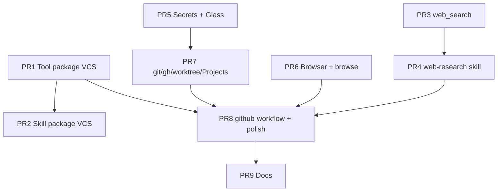

# Design: Capability Growth — Search, Browser, Package VCS, Secrets & Self-Improvement Foundations

| Field | Value |
|-------|--------|
| **Document** | Capability growth: search, browse, package VCS, secrets, workflow skills |
| **Author** | Design (Grok) + research/refinement pass |
| **Date** | 2026-07-27 |
| **Status** | Draft (v2 — research + hardening + tree alignment) |
| **Product** | project-elyra |
| **Branch base** | `grok-improvement` |
| **Related** | `docs/tools-and-skills.md`, `docs/time-and-identity.md`, `docs/design-identity-self-other-multi-user.md`, `docs/project-status-pass.md`, `docs/grok-improvement-plan/harness-sandbox-fitness.md`, `prompts/system.md` |
| **Parallel pattern** | Identity draft → promote + versions; create-tool draft → verify → promote |

---

## Overview

This design expands Elyra’s tool and skill surface so she can research the web, browse pages, work with git/GitHub, manage secrets safely, and recover from broken self-grown packages. It also lays the rails for the larger self-improvement stack (Grok Build, worktrees, branch discipline, GitHub Projects).

**Core stance (locked):**

- **Thin tools + judgment skills.** Tools do one bounded thing. Skills encode when/how/stop/cite.
- **Identity-aligned package VCS.** Tools and skills get draft → (verify) → promote → versions → revert — with an **explicit change** from today’s one-way promote that refuses local overwrite.
- **Secrets never in model context.** Tool-scoped injection / broker pattern; user-managed + Elyra-managed.
- **Agency-preserving.** Harden prompts and skills for safety, verification, and honest stop conditions — do not reduce initiative or invent a second mind.
- **Self-improvement ready.** `github-workflow` skill teaches conventions Phase 1 `grok_build` will use. Worktree lifecycle + Projects item/field ops are first-class structured tools.
- **Fail-closed + optional deps.** Missing Playwright/ddgs/token degrades honestly; isolation-on guest tools never silently host-fallback (existing sandbox law).

**One-sentence outcome:** Elyra gains reliable search, real browser control, versioned package recovery, and secret-safe git/GitHub work, while the skill layer turns those tools into disciplined research and self-improvement loops that Grok Build can later amplify.

---

## Background & Motivation

### Why these capabilities now

Stretch 1 shipped the growth surface (create-tool / create-skill, draft → verify → promote) and identity versioning. The next expansion is research + action + recovery + secret rails for safe self-modification.

| Gap | Impact |
|-----|--------|
| No native search | Research relies on external or hallucinated knowledge |
| No browser primitives | Cannot interact with live pages/forms |
| Promote is one-way and **refuses local overwrite** | Cannot iterate a local package without external delete; no archive |
| No secrets model | `gh` / git auth and future API keys cannot be used safely |
| No disciplined research playbook | Search risks snippet-only or endless loops |
| Self-improvement conventions undocumented | Phase 1 `grok_build` has no ready branch/worktree/Projects culture |

### Current architecture (verified in tree 2026-07-27)

| Area | Reality |
|------|---------|
| Tools | `tools/{bundled,local,drafts}/<name>/` with `TOOL.md` + `schema.json` + `runner.json`; kinds `builtin` \| `sandbox_shell` \| `sandbox_python` |
| Promote | `promote_draft_tool` — hash-bound verify required; **refuses overwrite of local and bundled** (`refuses_overwrite_local`); no `versions/` archive |
| Verify | Stages under `sandboxes/sandbox0/tools/.verify/`; guest pytest when isolation on |
| Skills | `skills/{bundled,local}/`; install is one-shot; **no skill drafts/versions** today |
| Identity | Full draft → promote + `versions/` + `mint_version_id` (`YYYYMMDDTHHMMSSZ_` + 6hex) + GC 50 — **pattern source** |
| Growth builtins | `install_tool_draft`, `verify_tool`, `promote_tool`, `install_skill` |
| Runners | `runner.py` + `guest_exec.py` — env `ELYRA_TOOL_ARGS`; no secret inject path |
| Git / GitHub | No native tools; unstructured `run` / shell only |
| Secrets | None |
| Dependencies | `pyproject.toml` core deps **empty**; optional `sandbox` extra only |
| Glass | Status, Identity panel; no secrets surface |

**Critical tree mismatch:** Package VCS is not “add versions next to existing promote.” It requires **changing promote semantics** from refuse-overwrite-local → archive-then-replace. That is a **behavior break** for any dogfood that relied on “promote once only” and must be tested + documented.

---

## Goals & Non-Goals

### Goals

1. **Package VCS** for tools (and skills with adapted gates), modeled on identity.
2. **Native search** via `ddgs` + later optional `web_fetch`.
3. **Playwright browser primitives** (accessibility-first, headless, session-aware) + `browse` skill.
4. **Structured git + `gh` tools** with secret injection, including worktree lifecycle + Projects item/field ops.
5. **Secrets system** (user-managed + Elyra-managed, tool-scoped, Glass UI).
6. **Judgment skills**: `web-research` (lite), `browse`, `github-workflow`.
7. **Polish** of growth skills + light prompt catalog lines; agency preserved.
8. Design is the source of truth for a **Grok Build** implementation pass on `grok-improvement`.

### Non-Goals / Defer

| Deferred | Why |
|----------|-----|
| Full `web_fetch` / extraction in v1 | Ship search first |
| Nested Browser-Use high-level agent as default | Prefer transparent Playwright primitives |
| Full vault / cloud credential broker product | Start with file + optional OS keyring backend |
| Per-user isolated tool/skill stores | Shared packages + provenance enough |
| Automatic self-rewrite without promote | Keep draft → promote |
| Phase 1 `grok_build` tool itself | Rails only |
| Memory-backed research notes | Phase 3 |
| Heavy prompt constraints that reduce initiative | Explicit non-goal |
| Force-push / main merge automation | Human-only / grant-gated forever in v1 |

---

## Research notes (libraries & practice)

### Search — `ddgs` (formerly `duckduckgo_search`)

| Item | Note |
|------|------|
| Package | **`ddgs`** on PyPI (rename from `duckduckgo_search`); e.g. `9.14.x` |
| Import | `from ddgs import DDGS` |
| Strengths | Zero-key; text/news/images/videos; region/safesearch/timelimit; multi-backend metasearch in current lines |
| Risks | **Unofficial** HTML/API scrape surface — breaks without notice; rate limits; inconsistent empty results |
| Hardening | Timeout + retry with backoff; max_results cap; structured error (`search_unavailable`, `rate_limited`, `empty`); never invent results; optional `SEARXNG_URL` later as first-class backend swap |
| Optional extra | `elyra[search]` → `ddgs>=9.0` |

### Browser — Playwright

| Item | Note |
|------|------|
| Package | `playwright` (Python) + **browser install** (`playwright install chromium`) — binary is a separate deploy step |
| Agent pattern | Accessibility **snapshot + refs** (Playwright MCP / `ariaSnapshot` style): model sees compact tree with `ref=eN`, then click/fill by ref |
| Critical | Refs are **stable only within one snapshot** — always re-snapshot after navigation/DOM change |
| Isolation | Prefer headless Chromium; persistent context optional under `data/browser/<session_id>/` |
| Risks | Large install; memory; session leak across moments; malicious pages; timeout; need network policy |
| Hardening | Session keyed by moment or explicit id; explicit close; max sessions; fail-closed if browser missing (`browser_unavailable`); cap snapshot size; no secrets in page dumps |
| Optional extra | `elyra[browser]` → `playwright>=1.49` + docs for `playwright install chromium` |

### Secrets storage

| Approach | Fit for Elyra |
|----------|----------------|
| **File under `data/secrets/`** (chmod 600, outside sandbox seed) | Primary for hermetic dogfood / server |
| **OS keyring** via `keyring` | Optional backend for operator desktop |
| Env-only | Accept for bootstrap (`GH_TOKEN` once) then import into store |

**Normative:** values never in tool results, moments tape, status JSON, or general sandbox env. Inject only at runner/builtin boundary for allow-listed tools. Redact accidental leakage (token-shaped strings) in result payloads.

### Git / GitHub

| Surface | Library / binary |
|---------|------------------|
| Local git | Host `git` CLI via structured wrappers (not free-form shell); or `GitPython` only if subprocess policy is worse — **prefer argv wrappers** for auditability |
| GitHub | Host `gh` CLI + `GH_TOKEN` injection; GraphQL for Projects fields where needed |
| Worktrees | `git worktree add|list|remove|prune` — requires **host** access to repo path (not guest sandbox) |
| Projects | `gh project …` / `gh api graphql` for field updates |

**Trust model:** git/`gh`/worktree tools are **host builtins** (like identity tools), not sandbox_python packages. They must path-jail to configured roots (e.g. `ELYRA_HOME` parent, explicit `allowed_repos` list). Never allow arbitrary path outside jail.

---

## Feature breakdown (implementation matrix)

| Feature | Libraries / binaries | Elyra integration points | Ship gate |
|---------|----------------------|--------------------------|-----------|
| **Package VCS (tools)** | stdlib only | `promote.py`, `growth.py`, registry reload, identity-style version_id | promote archives local; revert works; tests for refuse-bundled |
| **Package VCS (skills)** | stdlib | `skills` install path, new drafts/versions layout | optional skill drafts; promote/revert with lighter gates (no verify_tool equivalent — **verify is tool-only**) |
| **web_search** | `ddgs` | new **builtin** tool; catalog; optional `elyra[search]` | empty/rate-limit honest; unit tests with mocked DDGS |
| **web-research skill** | — | skill package; ledger goals/tasks; orient/catalog nudge | multi-query + cite + stop in SKILL.md |
| **Browser primitives** | `playwright` + chromium | builtins + session store under `data/browser/`; moment cleanup | snapshot+ref click; session close; fail if missing |
| **browse skill** | — | skill package | snapshot-first playbook |
| **Secrets store** | stdlib + optional `keyring` | `data/secrets/`, Glass API, runner inject hook | list redacted; inject for allow-list; never in tape |
| **git tools** | host `git` | builtins + path jail | status/diff/commit/branch/worktree |
| **gh tools** | host `gh` | builtins + `GH_TOKEN` inject | pr/issue/project soft-fail without token |
| **github-workflow skill** | — | skill; prefers worktree + project tools | grant stops for destructive actions |
| **Prompt polish** | — | `prompts/system.md`, catalog | short lines only |

---

## Key Decisions

| # | Decision | Rationale |
|---|----------|-----------|
| **K1** | Thin tools, judgment in skills | Tools = contract; skills = procedure + stop |
| **K2** | Package VCS mirrors identity | One culture; recovery without external git |
| **K3** | Keep `verify_tool` required for **executable tool** packages | Code ≠ prose; skills have no sandbox verify |
| **K4** | `web_search` primary via `ddgs`; optional SearXNG later | Zero-key default |
| **K5** | Browser = Playwright primitives first (snapshot + refs) | Transparent in moments; lower overhead than nested agent |
| **K6** | Secrets never in LLM context or general sandbox env | Tool-scoped injection only |
| **K7** | User-managed + Elyra-managed secrets | Operator + system under policy |
| **K8** | Glass panel for user-managed secrets | Parallel to Identity (list redacted / set / revoke / grants) |
| **K9** | `github-workflow` skill teaches self-mod now | Branch/worktree/Projects culture before `grok_build` |
| **K10** | Research skill starts as `web-research` lite | Multi-query, triage, cite, stop, ledger |
| **K11** | Agency-preserving prompt changes only | Catalog + skill-first nudges |
| **K12** | Implementation via Grok Build from this design | Design is the contract |
| **K13** | `version_id` matches identity | `{UTC compact}_{6hex}` via shared mint helper (prefer extract shared util from `identity.layout`) |
| **K14** | Promote/revert gates | Local: reason required on revert; optional grant for destructive; **bundled never overwritten** |
| **K15** | Worktree + Projects first-class structured tools | Highest leverage for isolated self-mod |
| **K16** | **Promote semantics change is intentional** | Archive previous local under `versions/<id>/` then replace; remove `refuses_overwrite_local` for normal promote path |
| **K17** | git/`gh`/browser/secrets/search are **host builtins** (v1) | Not model-authored sandbox packages; need host network/binary access under policy |
| **K18** | Optional dependency extras | Core install stays hermetic; `elyra[search]`, `elyra[browser]`, `elyra[secrets-keyring]` |
| **K19** | Path jail for VCS tools | Allowed roots only; refuse `..` and absolute escapes |
| **K20** | Browser sessions bound to moment/process | Close on moment end / supervisor stop; no cross-user session share |

---

## 1. Tools & Skills VCS (Identity-Aligned)

### Current gap (normative)

```text
TODAY:  draft → verify → promote  ONLY if local name free
        local exists → refuses_overwrite_local
        no versions archive

TARGET: draft → verify → promote always (for local packages)
        if local exists → archive entire dir to versions/<version_id>/ + meta
        then copy draft → local; remove draft
        revert_tool: copy version → local (archive current first)
```

### Proposed surface (thin)

| Tool | Role |
|------|------|
| `get_tool` / `get_skill` | current / draft / version + `list_versions` (meta + package summary; **no full secret bodies**) |
| `install_tool_draft` (keep name) | write under drafts only |
| `verify_tool` | **required** for tools (tests + content hash) — unchanged duty |
| `promote_tool` / `promote_skill` | archive previous local (if any) → versions/, then draft → current |
| `revert_tool` / `revert_skill` | archive current, restore previous version (reason required) |

**Process skills:**

- `review-tool` / `review-skill` — read/compare only
- `update-tool` / `update-skill` — draft → verify → promote; honest stops

**Layout**

```text
$ELYRA_HOME/tools/
  bundled/                 # immutable
  local/<name>/            # current callable
    TOOL.md, schema.json, runner.json, …
    versions/
      <version_id>/        # full package snapshot
    .versions_meta.json    # optional index: id, sha, time, reason, size
  drafts/<name>/

$ELYRA_HOME/skills/
  bundled/
  local/<name>/
    SKILL.md
    versions/
  drafts/<name>/           # new: skill drafts (optional but recommended for symmetry)
```

**version_id:** reuse `mint_version_id` / `VERSION_ID_RE` from identity (extract to shared module if needed to avoid identity←tools cycle).

**Promote behaviour (normative):**

1. Validate draft + verify record (tools only).
2. If local exists → `versions/<version_id>/` = full copy of previous local (exclude nested `versions/` to avoid exponential tree — archive **package payload only**, not prior archives).
3. Replace local with draft contents (atomic: stage to temp → rename).
4. Remove draft.
5. `registry.reload()` / skill catalog reload.
6. GC oldest versions (cap **50**, match identity `VERSION_GC_LIMIT`).

**Hardening holes closed in this revision:**

| Hole | Fix |
|------|-----|
| Nested `versions/` copied into archive | Archive payload files only; never nest archives |
| Race promote | File lock or exclusive temp rename under `tools/local/` |
| Partial promote leaves dest empty | Keep previous local until new tree is fully written |
| Skill promote without verify | Skills: content hash of SKILL.md only; no sandbox pytest |
| `refuses_overwrite_local` tests | Update tests; document migration note for dogfood homes |

**Gates:** bundled never promote target; system-critical tool names remain reserved; revert requires non-empty `reason`; optional `grant_token` for revert of high-impact tools (list in policy).

---

## 2. Thin Tools

### 2.1 `web_search` (native ddgs)

**Args (featureful v1):**

| Arg | Notes |
|-----|--------|
| `query` | required string |
| `type` | `text` \| `news` \| `images` \| `videos` (default `text`) |
| `max_results` | int, default 8, hard cap 20 |
| `region` | optional |
| `safesearch` | optional |
| `timelimit` | optional (backend-dependent) |

**Returns:** `{ ok, results: [{title, url, snippet, source, date?}], error_reason? }`

**Hardening:**

- Process-wide rate limit / cooldown after failures.
- Timeout (e.g. 15s).
- On empty: `ok: true, results: []` with optional `warning: empty` — skill decides rephrase.
- On backend failure: `ok: false, error_reason: search_unavailable | rate_limited`.
- **No** raw HTML dump into moments.

**Optional:** if `SEARXNG_URL` set, backend adapter with same result schema.

### 2.2 Browser primitives (Playwright)

| Tool | Purpose |
|------|---------|
| `browser_session_open` | headless; returns `session_id` |
| `browser_session_close` | cleanup |
| `browser_goto` | navigate + wait load |
| `browser_snapshot` | a11y tree + refs (YAML/text); size-capped |
| `browser_click` / `browser_type` / `browser_fill` | **by ref** (primary); selector secondary |
| `browser_get_text` / `browser_screenshot` | extract (screenshot optional, size-capped) |
| `browser_wait` | short stability waits |

**Session model:**

- Stored in supervisor memory + optional disk under `data/browser/<session_id>/`.
- Bound to `moment_id` when opened from a moment; closed on moment end / supervisor stop.
- Max concurrent sessions (e.g. 2).

**Hardening:**

| Risk | Mitigation |
|------|------------|
| Stale refs | Skill + tool docs: re-snapshot after every navigation |
| Huge snapshots | Cap chars; truncate with notice |
| Malicious pages | No `eval`; no download auto-execute; timeout |
| Missing chromium | `browser_unavailable` with install hint |
| Isolation on | Browser is host-side; do not claim guest isolation for browser process |

### 2.3 Git + GitHub

**Host builtins** with path jail (`allowed_repo_roots` from settings; default includes workspace parent + configured project roots).

**Local git (core):**  
`git_status`, `git_diff`, `git_log`, `git_add`, `git_commit`, `git_branch`, `git_checkout`, `git_stash` (as needed)

**Worktree lifecycle (priority):**  
`git_worktree_add`, `git_worktree_list`, `git_worktree_remove`, `git_worktree_prune`

**GitHub (core):**  
`gh_pr_*`, `gh_issue_*`, `gh_repo_*`, `gh_api` (escape hatch), `gh_auth_status`

**Projects (priority):**  
`gh_project_list` / `view`, `gh_project_item_*`, `gh_project_field_list` (+ GraphQL via `gh_api` for complex fields)

**Auth:** `GH_TOKEN` from secrets store (name e.g. `gh_token`). Soft-fail `auth_unavailable` if missing.

**Destructive actions** (`gh_pr_merge`, force-like operations, worktree remove with dirty flag): require explicit arg `confirm: true` and skill-level grant guidance.

### 2.4 Secrets tools

| Tool | Role |
|------|------|
| `secrets_list` | names + metadata + grants (redacted) |
| `secrets_set` | user-managed write (value in args **must not** be echoed in result) |
| `secrets_delete` / revoke grant | operator path |

Injection is **not** a model-facing tool — runner/builtin dispatcher injects for allow-listed tools.

**Schema declaration (normative for packages that need secrets later):**

```json
"requires_secrets": ["gh_token"]
```

v1 host builtins hardcode required secret names in tool metadata.

**Injection model:**

1. Before host builtin / guest env build, resolve allow-listed secret names for this tool.
2. Inject into **call-local env** only (not process-global permanent env if avoidable).
3. Strip secret values from stdout/stderr before `ToolResult` (regex heuristics + known value redact).
4. Never write secrets into moments JSONL.

---

## 3. Skills (Judgment Layer)

### 3.1 `web-research` (lite)

Multi-step research loop (unchanged intent; **harder stops**):

1. Clarify question / success criteria / depth (`quick` \| `standard` \| `deep`)
2. Split into 2–4 sub-queries
3. `web_search` each; triage sources
4. (When fetch exists) fetch top N
5. Cross-check disagreements
6. Answer with **inline citations** + confidence + still-unknown
7. Stop: enough evidence / diminishing returns / time box / search_unavailable
8. Non-trivial incomplete → ledger goal/tasks for continuous resume

**Avoid:** giant know-everything skill; inventing when search fails; duplicating tool contracts in prose.

### 3.2 `browse`

Orchestrates Playwright: snapshot-first, ref interaction, re-snapshot after change, session hygiene, when to speak vs continue.

### 3.3 `github-workflow` (self-improvement bridge)

- Branch on top of `grok-improvement` tip or `feature/<topic>` / `execute-plan/<id>`; never commit to `main` without human.
- Prefer **worktree tools** for isolation.
- Track multi-step work on **Projects** + ledger goals.
- Package changes via VCS tools.
- Prefer `grok_build` when present for multi-file work; else `search_replace` + `run`.
- Person vs instrument: Elyra owns goals/identity/moments; git/`gh`/Build are instruments.
- Stops for grants on high-impact actions.

### 3.4 Polish pass

- Update `create-tool` / `create-skill` / `review-work` to mention VCS recovery.
- Catalog descriptions stay short.

---

## 4. Secrets System + Glass UI

### Storage layout

```text
$ELYRA_HOME/data/secrets/
  meta.json          # names, created_at, managed|user, grants: {tool: [...]}
  values/            # 0600 files or single encrypted blob — never sandbox-mounted
```

- Outside normal RO seed mounts for the guest.
- Optional backend: `keyring` under service name `elyra`.

### Glass UX (refined)

| Element | Behavior |
|---------|----------|
| Panel | **Secrets** (Status sub-card or dedicated panel — prefer dedicated to avoid Status clutter) |
| List | Name, managed badge, last-used (optional), tools granted — **never** values |
| Set | Password input + name; confirm; clear input after save; never re-display |
| Grant | Multi-select tools that may receive injection |
| Revoke / delete | Confirm dialog |
| Multi-user | Operator-only actions (same class as API key provider controls); not per-session user identity |

**UX hardening:** parallel visual language to Identity; empty state with copy (“Secrets never enter model context”); show soft-fail when `gh` tools run without token.

---

## 5. Elyra systems integration

| System | Integration |
|--------|-------------|
| **Do-loop / moments** | Tool results already on tape — ensure redaction; browser session close on moment end |
| **Ledger** | `web-research` may create goals/tasks; github-workflow acceptance = tests + dogfood |
| **Sandbox** | Search/browser/git are host builtins; guest packages still cannot receive secrets in general env |
| **Registry** | Reload after promote/revert |
| **Identity grants** | Reuse grant pattern for destructive package revert if needed |
| **Usage meter** | Browser/search may add optional counters later (non-goal v1); Completions still primary |
| **Supervisor stop** | Close all browser sessions; no orphan chromium |

---

## 6. Prompt & Catalog Hardening (Agency-Preserving)

- `prompts/system.md`: short catalog lines for new families; prefer skills for non-trivial research/browse/github.
- Orient: skill-first **nudge**, not hard force.
- Skill bodies: stop / cite / no invent / ledger.
- **Do not** require every action through a skill.

---

## 7. Dependencies & packaging

```toml
# pyproject.toml (normative extras)
[project.optional-dependencies]
search = ["ddgs>=9.0"]
browser = ["playwright>=1.49"]
secrets-keyring = ["keyring>=25"]
# combined convenience
research = ["elyra[search]", "elyra[browser]"]
```

- Core `pip install elyra` remains hermetic for CI.
- Docs: `playwright install chromium` after browser extra.
- Feature probes at tool call time with clear `*_unavailable` errors.

---

## 8. Implementation pathway (refined PR plan)

| PR | Title | Depends | Notes |
|----|-------|---------|-------|
| **PR1** | Package VCS: archive-on-promote + get/list/revert (tools) | — | **Behavior break** on overwrite; extract shared version_id; GC; tests |
| **PR2** | Skills drafts/versions + promote/revert skill | PR1 patterns | Lighter gates; update growth skills |
| **PR3** | `web_search` builtin + `elyra[search]` + tests (mocked) | — can ∥ PR1 | Fail-closed without extra |
| **PR4** | `web-research` skill + catalog/prompt lines | PR3 | Lite only |
| **PR5** | Secrets store + inject hook + Glass panel | — can ∥ | File backend first |
| **PR6** | Playwright primitives + session lifecycle + `browse` | optional browser extra | Fail-closed without |
| **PR7** | git/gh structured tools + path jail + worktrees + Projects | PR5 for token | Host builtins |
| **PR8** | `github-workflow` skill + growth skill polish | PR1, PR7 | Self-mod bridge |
| **PR9** | Docs (`tools-and-skills.md`, dogfood, status-pass) | PR8 | |
| **Later** | `web_fetch`, SearXNG, keyring backend, fuller broker | | |



### Dogfood checklist

- [ ] Promote tool when local exists → previous version archived and listable; not nested forever.
- [ ] Revert tool; registry updates; reason required.
- [ ] Promote still refuses bundled overwrite.
- [ ] `web_search` structured results; empty/rate-limit honest; no invent.
- [ ] `web-research` multi-query + cites + stop; can open ledger goal.
- [ ] Browser snapshot + click-by-ref headless; session cleans up on moment end.
- [ ] Missing playwright → clear unavailable (no crash loop).
- [ ] Secret set in Glass; `gh` succeeds; raw secret never in moment tape/status.
- [ ] Worktree add/list/remove; path outside jail refused.
- [ ] Project item list/add/edit with token; soft-fail without.
- [ ] `github-workflow` sensible stops for grants.
- [ ] Existing create-tool / identity / usage / effort paths still green.

---

## Risks & leave-alone

| Risk | Severity | Mitigation |
|------|----------|------------|
| Promote behavior break | High | Explicit tests + dogfood note; atomic replace |
| Archive bloat | Med | Cap 50; exclude nested versions |
| ddgs breakage | Med | Backend adapter interface; honest errors |
| Secret leak via tool stdout | High | Redaction + never return set values |
| Browser resource leak | Med | Supervisor close-all; max sessions |
| Path escape via git tools | High | Jail + resolve + refuse |
| Scope creep into grok_build | Med | Rails only in this design |
| Over-constraining prompts | Med | Catalog only; agency preserved |

**Leave alone:** do-loop core, Stage B MC formulas, identity gates, sandbox isolation protocol (guest fail-closed), speak→glass law, continuous defaults, usage meter hard-stop/override contracts.

---

## Open questions (remaining)

1. **Skill verify:** Is SKILL.md hash + size cap enough, or do we want optional frontmatter schema validation only?
2. **Default allowed_repo_roots:** Workspace only vs any path under `$HOME`? Recommend: explicit list + workspace root.
3. **Screenshot in v1 browser:** Include size-capped PNG to media store or defer? Recommend: **defer** text/snapshot first.
4. **Elyra-managed secret minting:** What can she mint without operator (e.g. random tokens only vs OAuth)? Recommend: **operator-initiated mint only** in v1.
5. **Multi-machine secrets:** File store is node-local; document as such.

---

## References

- Tree: `elyra/tools/promote.py` (`refuses_overwrite_local`), `verify.py`, `runner.py`, `guest_exec.py`, `builtin/growth.py`, `identity/layout.py` (`mint_version_id`, GC 50)
- `docs/tools-and-skills.md`, `docs/design-identity-self-other-multi-user.md`
- `ddgs` PyPI / metasearch API (unofficial; backend volatility)
- Playwright agent/MCP accessibility snapshot + ref interaction patterns
- Python `keyring` OS credential backends (optional)
- Operator ideal-case research guidance (2026-07-27)

---

## Summary for implementers

1. **First win that unblocks growth recovery:** Package VCS (change promote to archive-on-replace) — highest leverage before more self-mod.
2. **Parallel track:** `web_search` + `web-research` lite (research quality without waiting for browser).
3. **Secrets before gh:** so GitHub work is secret-safe by construction.
4. **Browser and git/gh** as host builtins with fail-closed optional deps and path jail.
5. Keep tools thin; put judgment and stops in skills; preserve agency.

The highest-leverage early pair remains: **disciplined `web-research` on thin search** + **revert a broken package** when growth goes wrong — with worktrees + Projects ready for the cycles that follow.
