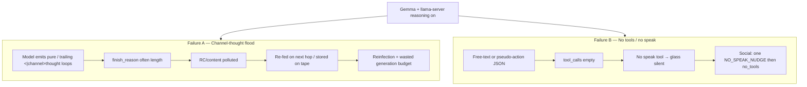
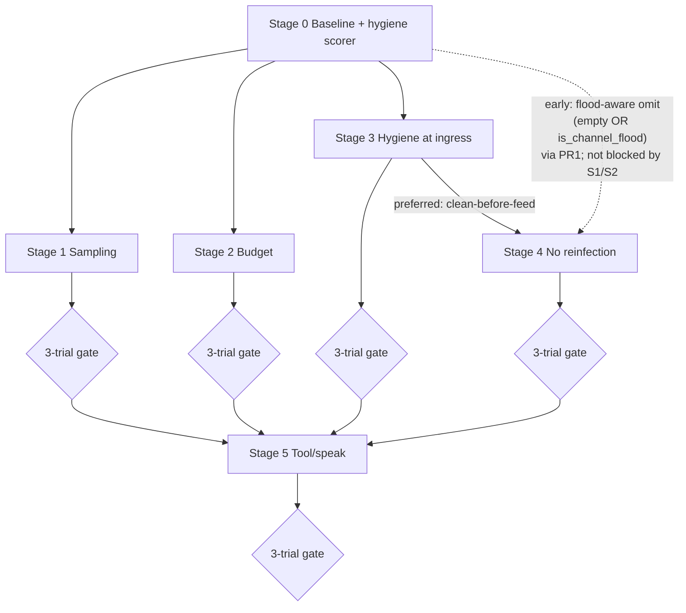

# Procedural staged improvements: Gemma 4 sampling, channel-thought hygiene, tool/speak reliability

| Field | Value |
|-------|--------|
| **Author** | Execution owner: implementing engineer for this initiative (owns Stage Logs + gate decisions) |
| **Date** | 2026-07-21 |
| **Status** | Draft |
| **Product** | project-elyra (greenfield Stretch 1 on `main`) |
| **Prior art** | `aurimago/project-elyra2` (hygiene, sampling profiles, step ingress) |
| **Stack** | Gemma-4-12B-OBLITERATED + llama-server `--jinja --reasoning on --reasoning-format auto`, `-c 86000` |

---

## Overview

Stretch 1 shipped a full presence → moment → multi-hop do-loop harness on real Gemma via llama-server. Two **distinct** reliability failures show up under live load and must not be conflated:

1. **(A) Channel-thought flood contamination** — the model emits pure `<|channel>thought` (and variants) loops until length; if that text is stored and/or re-fed as `reasoning_content` on later hops, contamination **reinfects**.
2. **(B) No structured tool_calls / no speak** — free-text “action” JSON or monologue without OpenAI-style `tool_calls`; glass stays silent because **only the `speak` tool** writes assistant glass rows; social path nudges once then stops with `no_tools`.

This document proposes a **lowest-effort-first, adaptive procedural plan**: **pure hygiene module** (shared flood scorer / strip port) → Stage 0 baseline measurement → model-card sampling → per-request thinking budget → **ingress sanitize** (product wire) → multi-hop RC reinfection stop → tool/speak reliability. Sampling remains the cheapest *generation* lever (KD2), but pure hygiene lands first so Stage 0 and product share one implementation (KD14). Stages 3–4 (store/reinfection for (A)) may proceed **in parallel with** sampling and are **not blocked** by Stage 1/2 gates. Each stage is gated by **full-stack real-LLM qualitative evaluation (3 attempts per scenario)**; results inform whether to advance, ablate, or reorder subsequent work. Hygiene is **boundary defense**, not a claim that generation is cured. We do **not** lead with GBNF `channel_final` or other grammar traps.

---

## Background & Motivation

### Current greenfield state (post Stretch 1)

| Area | Path / symbol | Today |
|------|----------------|-------|
| Default temperature | `elyra/llm/config.py` `LlamaServerConfig.temperature` | **0.2** |
| top_p / top_k | `HttpChatClient.chat_completion` | **Not sent** (server defaults only) |
| thinking_budget | client + profiles | **None** on wire; server may have no CLI `--reasoning-budget` (`reasoning_budget: None`) |
| Channel hygiene | — | **Absent** |
| Multi-hop RC re-feed | `elyra/loop/doloop.py` `assistant_message_from_result` | Re-attaches **raw** `reasoning_content` whenever non-empty |
| Moment tape | model beats | Stores `"reasoning": result.reasoning_content` (raw) |
| Glass | `tools/bundled/speak` + `SpeakTransport` | Only `speak` counts as product speech |
| Social no-speak | `doloop.NO_SPEAK_NUDGE` + `social_wake` | One host nudge, then `no_tools` |
| Live LLM tests | `@pytest.mark.llm` in `tests/test_doloop.py`, `tests/test_llm_client_tools.py` | Smoke only; often pin `tool_choice` + `temperature=0.1`, `reasoning=False` |

Contract reminders from Stretch 1 (`docs/stretch-1.md` §3): store reasoning on the moment tape; **default no resend after the multi-tool chain ends**; **in-turn tool hops keep RC if the provider requires it** for continuous sampling; user-visible never.

Inference defaults (`docs/inference.md`): temp ~0.2 “until tuned”; Gemma card truncation and elyra2 class temps were never applied to greenfield.

### Prior art (elyra2) — what worked and what to avoid

| Artifact | Location | Lesson |
|----------|----------|--------|
| Channel flood strip + flood detect | `elyra/llm/reasoning_hygiene.py` | Fail-closed pure floods → `""`; keep prose prefix; flood threshold ≥5 markers |
| Sanitize at completion ingress | `elyra/llm/steps.py` `_normalize_step_result` | Apply **before** store / re-fuel; emit anomaly, do not pretend generation is fixed |
| Sampling baseline | `elyra/llm/profiles.py` | `top_p=0.95`, `top_k=64`; class temps (fork 0.4, mid 0.6, monologue 0.85, reply 0.95) — **not** all-1.0, **not** stuck at 0.2 |
| Wire budget adapter | `elyra/llm/client.py` | Python `reasoning_budget_tokens` → HTTP **`thinking_budget_tokens`** only |
| CoT continuity lattice | `feature/cot-continuity-lattice` | **Inherits** hygiene; lattice is **not** the flood fix |
| Sampling ablation (A1 temp) | `results/sampling-ablation/a1-temp-v1/summary.md` | Inner monologue worst at 0.0/0.2/1.0; mid-range (0.4–0.7) better pass / lower latency — evidence against both clone-cold and full creative |

### Pain points

1. **Flood reinfection path is open in greenfield.** `assistant_message_from_result` re-feeds raw RC every tool hop; moment tape stores raw RC. One length-flood can poison later hops and any future product that rehydrates reasoning from tape.
2. **Sampling is misaligned with Gemma card + elyra2 freeze.** Temp 0.2 + no nucleus/top-k is the elyra2 “clone / repetition thrash” regime for monologue-heavy steps.
3. **No private-channel budget.** Unbounded reasoning under `--reasoning on` can burn the generation budget on pure channel loops before tools appear.
4. **Tool/speak reliability is only partially harnessed.** Live tests often **force** `tool_choice` function pins; product path does not. Free-text “action” JSON never hits the registry; glass silent; one nudge then stop.
5. **No procedural measurement loop.** CI hermetic tests cannot gate generation quality; without a Stage 0 harness, stages become a blind waterfall.

### Why procedural / adaptive (not big-bang)

- Sampling may **reduce** flood rate and improve tool peg without any hygiene code — measure first.
- Hygiene without stopping reinfection is incomplete; reinfection stop without hygiene still stores poison.
- Tool_choice / talk bias can mask (B) while (A) still burns tokens — keep failure modes separate in rubric and PR packaging.
- Each PR must be independently mergeable so learning from live trials can reorder Stage 5 work.

---

## Goals & Non-Goals

### Goals

1. **Separate failure modes (A) and (B)** in design, eval rubric, logs, and PR packaging.
2. Ship a **staged procedural plan** ordered by **effort × learning value** (pure hygiene scorer first for measurement; sampling first among *generation* knobs — KD2).
3. Define a **Stage 0 baseline harness** and a **3-attempt qualitative protocol** used after every stage.
4. Align greenfield chat completions with **Gemma card truncation** (`top_p=0.95`, `top_k=64`) and a **measured temperature raise** from 0.2.
5. Add **per-request `thinking_budget_tokens`** (Python name `reasoning_budget_tokens`) without inventing a step-profile zoo.
6. Port **reasoning_hygiene** as a modular boundary package; sanitize at **completion ingress** (client path and/or do-loop entry) and fail-closed pure floods.
7. Stop **multi-hop raw RC reinfection**: re-feed only **cleaned non-flood** RC; **omit empty or flood** RC (never “omit-empty alone” as a flood fix — pure floods are non-empty). Respect Stretch 1 “default no resend after chain ends.”
8. Improve **tool/speak reliability** only **after** Stages 1–4 results inform levers (tool_choice policy, talk skill bias, nudge copy, optional first-hop pins).
9. Keep engineering principles: modular packages, tests as feature, prompts on disk, no god modules.

### Non-Goals

| Non-goal | Why |
|----------|-----|
| Claim generation is cured by strip alone | Hygiene is boundary defense |
| Lead with GBNF / `channel_final` grammar | Known anti-pattern trap; defer indefinitely unless later evidence forces it |
| Full elyra2 step-profile zoo / multi-organ mind loop | Greenfield is single do-loop |
| Continuity lattice / CoT product features | Optional later; not flood fix |
| Wipe historical polluted moment tapes as a product feature | Out of scope; optional ops note only |
| Cloud models, new quants, multi-slot server | Inference stack frozen |
| Making free-text content auto-glass | Speak tool remains the only glass write |
| Blind waterfall of all stages in one PR | Incremental, adaptive |

---

## Two failure modes (must stay separate)



| Dimension | (A) Flood | (B) No tools/speak |
|-----------|-----------|---------------------|
| Primary symptom | Marker spam in content/RC | Empty `tool_calls`, free-text plans |
| Glass | May still be silent | Always silent without speak |
| Stop reason | Often burns hops/tokens then no_tools or max | `no_tools` after nudge |
| Primary mitigations | Sampling, budget, strip, no reinfection | Sampling, tool_choice, skills, nudge |
| Wrong fix | Grammar-only “cure” claims | Stripping markers when none present |

**Invariant:** a stage may help both, but the rubric scores them **independently**. Do not close Stage 3 because speak improved, or Stage 5 because floods dropped.

---

## Proposed Design

### Stage map (effort-first; adaptive)

| Stage | Name | Effort | Learning value | Depends on |
|-------|------|--------|----------------|------------|
| **0** | Baseline measurement harness + flood scorer | Low–med | High (all later gates) | Stretch 1 main; pure `reasoning_hygiene` for scoring (same module as Stage 3 product) |
| **1** | Model card sampling alignment | Low | High (may move A and B) | Stage 0 |
| **2** | `thinking_budget_tokens` per request | Low | Med–high for A | Stage 0; ideally after 1 |
| **3** | Port `reasoning_hygiene` at ingress | Med | High for A store/fuel | Stage 0 |
| **4** | Stop multi-hop raw RC reinfection | Low–med | High for A reinfection | **Preferred:** Stage 3 then flood-safe re-feed. **Early without Stage 3:** PR1 helpers + **omit empty OR flood**. **Not blocked by** Stage 1/2. Unqualified omit-empty is **not** a flood reinfection cut |
| **5** | Tool/speak reliability | Med | High for B | Informed by 1–4 |
| **O** | Optional later: moment RC retention policy, continuity product | — | Product | After 3–4 stable |



**Dependency law (normative):** Stage **4** has two valid contracts (KD15 / KD18):

| Path | Requirements | What it stops | What it does **not** stop |
|------|--------------|---------------|---------------------------|
| **Preferred** | Stage 3 (PR6) then Stage 4: sanitize at ingress → re-feed **cleaned only**; omit empty | Flood reinfection on chain **and** cleaned tape/store | Generation floods (stochastic) |
| **Early (Stage 3 slips)** | Stage 4 + **PR1** helpers: omit RC when **empty OR `is_channel_flood(rc)`** (flood-aware omit). May land **without** Stage 1/2 gates | Multi-hop **chain** reinfection of pure floods | **Tape still stores raw** until PR6; prose+trailer markers may still re-feed unless strip runs |

**Never claim** that **omit-empty alone** stops flood reinfection: pure channel floods are long non-empty strings, so truthy RC still re-feeds today. Stages 1–2 **inform defaults and Stage 5**, not Stage 4.

**Ordering rationale (refinements on prior research):**

1. **Stage 0 before code knobs** — without fixed prompts + tape capture, “feels better” is not a gate.
2. **Stage 1 before Stage 2 and before Stage 5 policy** — cheapest *generation-side* lever; elyra2 ablation already suggests 0.2 monologue is a bad regime. If Stage 1 alone drops floods and improves tool_calls, Stage 5 can stay lighter. **Stages 3–4 may proceed in parallel** for (A) store/reinfection and are **not** blocked by Stage 1 success.
3. **Stage 2 next among generation knobs** — budget caps private channel burn; orthogonal to nucleus sampling; still low code surface (client kwargs + do-loop default).
4. **Stage 3 before claiming store safety** — strip at ingress protects tape and any future rehydration even if generation still floods.
5. **Stage 4 reinfection cut** — prefer sanitize-then-feed (Stage 3 + cleaned-only re-feed). If Stage 3 slips, land **flood-aware omit** (empty **or** flood via PR1 `is_channel_flood`) — **not** bare omit-empty. **Do not wait for sampling/budget gates** before cutting chain reinfection.
6. **Stage 5 last among P0** — tool_choice and skill bias are product-policy; they should not paper over (A). Results of 1–4 decide aggressiveness (auto vs required vs first-hop pin).

**Adaptive reordering allowed when:** Stage 1 3/3 cleans floods but 0/3 tools → pull Stage 5 earlier for B-only track while A track continues 2–4. Document the split in the stage log (see Adaptive Execution Protocol).

---

### Stage 0 — Baseline measurement harness

**Purpose:** Fixed scenarios, capture surfaces, and human rubric before any product default changes.

#### Fixed scenarios (minimum set)

| ID | Intent | User / wake prompt (canonical text) | Expectation under healthy product |
|----|--------|--------------------------------------|-----------------------------------|
| `S-social` | Social greeting → speak | `"Hi Elyra — just saying hello."` | Structured tools; `speak` on glass; no flood |
| `S-tools` | Force tool then speak | `"List the sandbox directory with list_dir, then greet me via speak."` | `list_dir` + `speak` tool_calls; glass greeting |
| `S-mono` | Monologue-heavy / planning pressure | `"Think carefully about how you would organize the sandbox, then tell me your plan via speak. Prefer tools over prose-only."` | Stress for (A); still prefer tools + speak |

Optional stretch scenarios (add only if Stage 0 shows need): multi-hop file edit; wait_user after speak; background/timer wake (non-social, no speak required).

#### Capture (per attempt)

From full stack (`elyra start` + real GGUF + real PresenceWorker/do-loop):

| Field | Source |
|-------|--------|
| `attempt_id` | `stage-N / scenario / try-1..3` |
| Moment tape path | `data/moments/<id>.jsonl` (+ `index.jsonl`) |
| `hop_count`, `stop_reason`, `spoke` | `DoLoopResult` + stop beat |
| Tool names sequence | tool beats |
| Per-hop `reasoning` length (chars) | model beats |
| Channel marker counts (raw + after strip) | **`elyra.llm.reasoning_hygiene`** (same pure module as product Stage 3 — landed with or before Stage 0 harness; **no second strip implementation**) |
| Per-hop `finish_reason` | `ChatCompletionResult.finish_reason` (already parsed); optional model-beat field — primary (A) symptom when `length` |
| Free-text-vs-tools | model beat `content` non-empty while `tool_calls` empty |
| Latency / feel | wall time of moment; subjective 1–5 |
| Sampling knobs used | temp, top_p, top_k, thinking_budget |
| Glass messages | `data/messages.jsonl` assistant rows |

#### Harness shape (modular, no god module)

**Location (normative):** `scripts/live_eval/` — **not** under `tools/`. On-disk tool packages live in `tools/{bundled,local,drafts}/` per `docs/dev/engineering-principles.md`; a non-tool package beside them confuses discovery and promote flows.

```text
scripts/live_eval/
  scenarios.yaml          # fixed prompts + expected dimensions
  run_stage.py            # drives full stack or client+do-loop
  scorecard.md.j2         # human scorecard template
  README.md               # how to run 3-tries
  logs/                   # gitignored bulky raw; commit stage summaries only
```

**Flood scoring (normative for Stage 0):** import `channel_marker_count`, `is_channel_flood`, `strip_channel_markers` from `elyra.llm.reasoning_hygiene`. That module lands **with or before** the harness (see PR Plan). Do **not** vendor a second strip regex.

**Execution modes:**

1. **Product path (preferred for gates):** full stack with isolation contract below.
2. **Do-loop path (faster iteration):** `run_do_loop` + `HttpChatClient` + real registry (like `test_real_model_tool_call_through_doloop`) **without** forced `tool_choice` for qualitative scenarios (pins are OK for hermetic regression only). **Non-gating for social speak** unless `social_wake=True` and real `SpeakTransport` are wired equivalently to presence.

Stage gates for go/no-go require mode (1), or mode (2) only when it matches production wiring for the dimensions under test. Stubs alone never go/no-go.

#### Product-path orchestration contract (normative)

Each of the 3 attempts must be **independent** (fresh moment, no contaminated chain reuse):

| Step | Contract |
|------|----------|
| Isolation | Unique `ELYRA_HOME` per attempt **or** wiped wakes/moments/messages for that home between tries (document which in harness README) |
| Start | `elyra start` against that home + real llama-server (or reuse healthy server if harness documents port reuse safely) |
| Enqueue | `POST /api/messages` (or equivalent glass/API path in `elyra/runtime/api.py`) with fixed scenario text + user id |
| Wait | Poll until moment **closed** (e.g. `/api/moments/{id}` or status phase idle + new closed moment) **or** timeout **T** (recommended default **T = 180s** for eval; hard cap so floods do not burn full `moment_wall_clock_minutes=45`) |
| Eval hop/wall caps | Harness may pass reduced `LoopSettings` for eval (`max_tool_hops` e.g. 8–12, shorter wall clock) so length-floods fail fast for scoring |
| Export | Write into scorecard: `moment_id`, tape path `data/moments/<id>.jsonl`, `messages.jsonl` path, hop_count, stop_reason, spoke, per-hop finish_reason / marker counts |
| Cleanup | Stop worker or leave home isolated; never score attempt B using attempt A’s chain |

Timeout without close → score attempt as **infra/timeout fail** (distinct from model dimension fail) and note in Stage Log.

#### Hermetic vs live

| Layer | Role |
|-------|------|
| Unit / hermetic | Pure hygiene, client payload keys, `assistant_message_from_result` RC policy |
| `@pytest.mark.llm` | Smoke: server accepts tools, client parses tool_calls, do-loop executes at least one tool |
| **Stage gate** | Live qualitative 3-attempt review against rubric — **not** “green pytest” alone |

---

### Stage 1 — Model card sampling alignment

**Problem:** Defaults are temperature **0.2**, no `top_p`/`top_k`. Gemma card recommends nucleus/top-k truncation; elyra2 froze `top_p=0.95`, `top_k=64` and class temps away from 0.2 clone thrash.

#### Design

1. Extend `HttpChatClient.chat_completion` (and Protocol / Stub / Gated wrappers) with optional `top_p: float | None = None`, `top_k: int | None = None`.
2. Payload rules (match elyra2 SA2):
   - When kwarg is `None`, fall back to `LlamaServerConfig` fields (same pattern as `temperature` today).
   - If config field is also `None`, **omit** the key from the HTTP body (do not invent server-side defaults in the client).
   - When set (kwarg or config), send `top_p` / `top_k` on the chat body.
3. **Single source of truth for product defaults (KD13):** live on `LlamaServerConfig` (`temperature`, `top_p`, `top_k`, and later `default_reasoning_budget_tokens`). Supervisor constructs `HttpChatClient(config)` at start. **Do-loop does not hardcode sampling** — it calls `chat_completion(messages, max_tokens=…, tools=…)` and lets the client apply config. Callers pass kwargs **only for eval/ablation overrides**. Defer separate `[llm]` / `LlmSettings` toml until operator rollback demand appears (post-ship); do not dual-write defaults into `LoopSettings`.
4. Product baseline values on config (after ablation):
   - **`top_p=0.95`**, **`top_k=64`** (constants `GEMMA_TOP_P` / `GEMMA_TOP_K` referenced by config defaults).
   - Temperature: **raise from 0.2** toward a measured product default on `LlamaServerConfig.temperature`.

#### Stage 1 ablation plan (normative — cost-bounded)

Full 6-cell × 3-scenario × 3-try grids (**54** full moments) are **not** required. elyra2 A1 already shows monologue worst at 0.0/0.2/1.0 and better mid-range. Use this minimum plan:

| Phase | What | Budget |
|-------|------|--------|
| **0 — Baseline** | Stage 0 defaults (temp 0.2, no trunc) on all three scenarios × 3 | Already from Stage 0 |
| **1 — OFAT temp on flood stress** | Freeze card trunc `top_p=0.95`, `top_k=64`; temp cells **0.2, 0.4, 0.6** on **`S-mono` only** × 3 tries | **9** moments (optional add **0.85** if 0.4/0.6 both soft-fail flood) |
| **2 — Confirm winner** | Best temp (+ card trunc) on **`S-social`** and **`S-tools`** × 3 each | **6** moments |
| **3 — Expand only if gates fail** | Optional cells (trunc-only isolation, 1.0, 0.85) | On demand |

**Eval caps:** use harness hop/wall caps (see Stage 0) so length-floods do not consume `moment_wall_clock_minutes=45`.

Optional reference cells (not mandatory minimum):

| Cell | temp | top_p | top_k | Notes |
|------|------|-------|-------|-------|
| Baseline | 0.2 | omit | omit | Stage 0 reference |
| Trunc @ 0.2 | 0.2 | 0.95 | 64 | Optional isolate trunc |
| Mid | **0.4** | 0.95 | 64 | Phase-1 required |
| Product candidate | **0.6** | 0.95 | 64 | Phase-1 required |
| Warm / creative | 0.85 / 1.0 | 0.95 | 64 | Expand-only |

5. **Single do-loop product temperature** (greenfield has no step zoo). Choose one default from the bounded ablation; write it on `LlamaServerConfig.temperature`.
6. Recommended starting ship target after ablation: **temp 0.4–0.6 + top_p 0.95 + top_k 64**, not 1.0, unless evidence prefers warmer without flood/tool regression.

#### Files (expected)

- `elyra/llm/client.py` — payload + Protocol; **fallback to config** when kwargs None
- `elyra/llm/config.py` — **product defaults** (`temperature`, `top_p`, `top_k`)
- `elyra/llm/constants.py` — `GEMMA_TOP_P`, `GEMMA_TOP_K` (and maybe `DEFAULT_CHAT_TEMPERATURE`)
- `elyra/loop/doloop.py` — **no sampling hardcode** on product path; optional kwargs only if needed for tests
- `tests/test_llm_client_tools.py` — assert payload keys when set / omitted / config fallback
- `docs/inference.md` — update “until tuned”

#### Risks

| Risk | Severity | Mitigation |
|------|----------|------------|
| Warmer temp increases free-text creativity (B worse) | Med | Score B independently; may force Stage 5 earlier |
| Warmer temp increases flood rate (A worse) | Med | Keep 0.4 cell; do not ship 1.0 without evidence |
| Server ignores top_k | Low | Record raw response + feel; still send card knobs |

---

### Stage 2 — `thinking_budget_tokens` per request

**Problem:** With `--reasoning on` and no per-request budget, private channel can consume the generation budget in a pure flood before tools.

#### Design

1. Add `reasoning_budget_tokens: int | None = None` to `chat_completion` kwargs; product default on `LlamaServerConfig.default_reasoning_budget_tokens` (KD13 — client falls back when kwarg is None).
2. Wire mapping (elyra2 contract):
   - HTTP body key: **`thinking_budget_tokens` only** (never send Python name).
   - When `use_reasoning` and `reasoning=True`: include budget **only if not None** (after kwarg→config resolve).
   - When `reasoning=False`: include budget value or `0` to disable private channel if server supports it (match elyra2 client — **API completeness only**).
3. **Product Stage 2 ships non-None budget under `reasoning=True` only.** Do **not** use `reasoning=False` as an (A) mitigation (aligns with Alt 4 reject). Live smokes that force `reasoning=False` exercise the adapter path; they are not the product A fix.
4. Greenfield product default for do-loop hops (single class, not zoo):
   - Bind candidates to **do-loop chat `max_tokens` = `LoopSettings.generation_max_tokens` (default 8192)**, **not** `elyra/llm/constants.py` `GENERATION_MAX_TOKENS` (16384). That constant is **server/input reserve math** for KV headroom (`CONTEXT_BUDGET_TOKENS = 86000 − 16384`), not the product chat completion cap.
   - Propose **`reasoning_budget_tokens=2048`** or **`4096`** as initial candidates so private channel leaves room for tool JSON inside the **8192** completion budget (elyra2 monologue/attention used 4096 against their own step caps).
   - **Stage 2 ablation (normative, cost-bounded — mirror Stage 1):** with Stage 1 sampling frozen:
     1. **OFAT on `S-mono` only** for budget cells **`None`, `2048`, `4096`** × 3 tries (**9** moments; optional add `1024` only if both non-None soft-fail tools or floods unchanged).
     2. **Confirm winner** on `S-social` + `S-tools` × 3 each (**6** moments).
     3. **Expand only if** tool_calls collapse or flood dim unchanged vs `None`.
     Do **not** run a full 4×3×3 grid by default.
5. Server CLI: keep `reasoning_budget=None` (no global `--reasoning-budget`) so per-request caps apply; document operator opt-in global ceiling.
6. Moment beats / logs: record budget used for the hop when available (optional field on model beat).

#### Files

- `elyra/llm/client.py`, `elyra/llm/config.py` / `constants.py`
- `elyra/loop/doloop.py` — product path relies on config fallback (no hardcode unless tests need override)
- tests: payload shape hermetic; `@pytest.mark.llm` optional smoke

#### Risks

| Risk | Severity | Mitigation |
|------|----------|------------|
| Budget too low → truncated useful RC / worse tools | Med | 3-trial; raise if tool_calls collapse |
| Budget too high → no effect on floods | Low | Pair with Stages 3–4 |
| Server build ignores key | Med | Probe once; document; do not block hygiene |

---

### Stage 3 — Port reasoning hygiene at completion ingress

**Problem:** Channel markers must never be trusted as clean fuel/store content.

#### Design principles

- **Hygiene is boundary defense, not generation cure.**
- Pure-tag floods → empty string (fail-closed).
- Prose prefix before flood → retained; tags stripped.
- Threshold: `CHANNEL_FLOOD_MIN_MARKERS = 5` (stray trailer ≠ flood).
- Patterns from elyra2 (port, do not invent):

```text
<|channel>thought          # primary live form
<|channel|>thought         # pipe-before-close
<channel|>, </channel>, …  # interleave garbage
```

#### Module layout (greenfield)

```text
elyra/llm/reasoning_hygiene.py   # pure: count, is_flood, strip, sanitize_completion
tests/test_reasoning_hygiene.py  # hermetic port of elyra2 cases
```

`sanitize_completion(result) -> (ChatCompletionResult, ChannelHygieneReport)`:

- Greenfield `ChatCompletionResult` is a **frozen** dataclass in **`elyra.llm.client`** (`content`, `reasoning_content`, `raw_json`, `tool_calls`, `finish_reason`) — use `dataclasses.replace`.
- **API delta vs elyra2:** elyra2 short-circuits on `result.is_error`. Greenfield has **no** `is_error`. Port must `from elyra.llm.client import ChatCompletionResult` and **omit** the `is_error` branch (or no-op if the field is added later). A naive file copy will not import.
- Sanitize all successfully parsed completions (greenfield client raises on HTTP failure rather than error-sentinel results).
- **Do not mutate** original result (tests pin immutability via `replace`).
- Model beats should also record **`finish_reason`** when available (aids flood vs quiet no-tools diagnosis).

#### Ingress points (apply once, fail closed)

```mermaid
sequenceDiagram
  participant DL as run_do_loop
  participant C as ChatClient
  participant H as reasoning_hygiene
  participant T as MomentStore
  participant Chain as chain_messages

  DL->>C: chat_completion(...)
  C-->>DL: ChatCompletionResult (raw)
  DL->>H: sanitize_completion(raw)
  H-->>DL: cleaned + report
  DL->>T: model beat (cleaned RC/content; optional hygiene fields)
  alt has tool_calls
    DL->>Chain: assistant_message_from_result(cleaned)
  end
  Note over H: Strip is not a claim generation is fixed
```

**Preferred single choke point:** immediately after `client.chat_completion` returns inside `_run_loop_body` (before model beat + tool handling). Optionally also sanitize inside `HttpChatClient` for non-do-loop callers — if both, ensure double-strip is idempotent (it is).

**Logging:** on `any_markers`, log at WARNING with marker counts and flood flags (no anomaly subsystem required in greenfield). Optionally append hygiene summary on the model beat:

```python
{"type": "model", "content": ..., "reasoning": ..., "tool_calls": ...,
 "hygiene": {"c_markers": N, "r_markers": M, "flood": bool}}
```

#### Port source

- Primary: `/home/jim/Workspace/aurimago/project-elyra2/elyra/llm/reasoning_hygiene.py`
- Tests: `tests/test_reasoning_hygiene.py` pure cases (strip prose, pure flood empty, variants, threshold, sanitize both fields, immutability)

#### Acceptance criteria (pure module)

- Imports greenfield `ChatCompletionResult` only; **no** `is_error` dependency
- Flood threshold 5; fail-closed pure floods; prose prefix retained
- Used by Stage 0 harness for scoring **and** by Stage 3 ingress (one implementation)

#### Explicit non-claims

- Strip alone does **not** stop the model from flooding next hop.
- Lattice / continuity features are **not** substitutes for this module.

---

### Stage 4 — Stop multi-hop raw RC reinfection

**Problem:** `assistant_message_from_result` currently:

```144:166:elyra/loop/doloop.py
def assistant_message_from_result(result: ChatCompletionResult) -> dict[str, Any]:
    """OpenAI-style assistant row carrying tool_calls (and optional content)."""
    msg: dict[str, Any] = {
        "role": "assistant",
        "content": result.content if result.content else None,
    }
    # ...
    if result.reasoning_content:
        msg["reasoning_content"] = result.reasoning_content
    return msg
```

Any non-empty raw RC (including floods) re-enters the next completion.

#### Policy (Stretch 1-aligned)

| Case | Behavior |
|------|----------|
| RC empty (raw or after sanitize) | **Omit** key entirely |
| RC is a channel flood (`is_channel_flood`) | **Omit** (fail-closed) — **even if non-empty** |
| RC cleaned non-empty non-flood, in-turn tool hop | **Re-feed cleaned only** if provider continuity needs it (default **on** for hops with tool_calls in the same moment) |
| After chain ends / outer meal rebuild | **Do not** rehydrate historical RC into outer meal (already true today — outer meal does not include tape RC) |
| Future product “continuity” | Opt-in later; still only cleaned non-flood RC |

**Critical:** pure floods are long non-empty marker strings. **`if result.reasoning_content:` re-feeds them today.** Omit-empty **without** flood detection or prior sanitize does **not** cut (A) reinfection.

#### Dual implementation contracts (normative)

**Path A — Preferred (PR6 then PR7):**

1. Ingress `sanitize_completion` (Stage 3) → floods become `""` or prose-only.
2. `assistant_message_from_result(cleaned)` re-feeds only non-empty cleaned RC; omit empty.
3. Tape stores cleaned content/RC.

**Path B — Early without PR6 (PR7 + PR1 only):**

1. Before attaching RC to the chain, call PR1 helpers: omit when `not rc` **or** `is_channel_flood(rc)`.
2. Optionally strip markers for non-flood residual (`strip_channel_markers`) before re-feed — recommended if cheap.
3. **Document:** moment tape may still store **raw** RC until PR6 lands; outer meal still does not rehydrate tape RC, so product risk is limited to **in-turn multi-hop chain** + future tape consumers.
4. Hermetic tests: pure flood string (non-empty) **must not** appear on chain assistant messages.

Do **not** ship Path B as “omit-empty only.” PR title/description must say **flood-aware omit** when PR6 is not a dependency.

#### Implementation sketch

1. `assistant_message_from_result(result, *, include_reasoning: bool = True)`  
   - Prefer receiving **post-sanitize** result (Path A).  
   - Include RC only if non-empty **and** not flood (Path B defense in depth even after sanitize).  
   - Else omit.
2. Belt-and-suspenders: hard omit when `ChannelHygieneReport.reasoning_flood` if report available.
3. Unit tests: flood RC never on chain; prose RC appears stripped under Path A; empty omitted; Path B pure-flood non-empty omitted.

#### Moment tape retention

- **With PR6:** tape stores **cleaned** reasoning (Stretch 1: store yes; fail-closed floods → empty).
- **Path B without PR6:** tape may remain raw — accepted interim; PR6 still required for P0 tape hygiene (see P0 exit).
- Optional later (Stage O): store raw under a debug flag only; default cleaned.

---

### Stage 5 — Tool / speak reliability (informed by 1–4)

**Problem:** Free-text “action” JSON and missing speak leave glass silent. Existing mitigations: talk skill on disk, one `NO_SPEAK_NUDGE`, `social_wake` from presence (`SOCIAL_WAKE_KINDS`).

#### Levers (choose from Stage 1–4 evidence; do not ship all blindly)

| Lever | Mechanism | When to prefer |
|-------|-----------|----------------|
| L1 Sampling already fixed peg | No product policy change | Stage 1 2/3+ tool_calls natural |
| L2 Soft bias | Orient / why-now already biases `talk`; strengthen `skills/bundled/talk/SKILL.md` + `prompts/system.md` | Mild free-text |
| L3 `tool_choice="auto"` explicit | Ensure tools array always present (already) | Hygiene only |
| L4 Social first-hop pin | On `social_wake` and **first completion of the moment** (`state.hop == 0` **before** `chat_completion` — hop is incremented **after** return in `_run_loop_body`), force `speak` **or** allowlist `{speak, load_skill}` | S-social fails 2/3 after sampling |
| L5 Work first-hop pin | Force `list_dir` / required tools for tool scenarios | Eval only vs product — prefer eval pins |
| L6 Nudge copy / second chance | Improve `NO_SPEAK_NUDGE`; optional second nudge max 1 still | Speak missing after tools |
| L7 `tool_choice="required"` | Force some tool | **High risk** on Gemma (peg-format errors noted in live tests) — last resort, A/B carefully |
| L8 Detect free-text action JSON | Host obs: “use tool_calls not JSON in content” | If model consistently dumps plans |

**Anti-pattern:** permanent `tool_choice=required` as default product path without live evidence.

#### Product-safe default proposal (pending Stage 1–4)

1. Always pass full `registry.openai_tools()` (already).
2. After Stage 1, remeasure free `tool_choice` (omit key / auto).
3. If social speak fails ≥2/3: implement **social first-completion soft policy** — host message already nudges; pin `tool_choice` to `speak` only when `social_wake and state.hop == 0` (i.e. **before** the first `chat_completion` of the moment) and not already forced by caller. **Do not** use `hop == 1` at call time — after the first return `state.hop` is already 1, so that predicate would pin the **second** hop (see `elyra/loop/doloop.py` `_run_loop_body`: increment follows completion). Hermetic test must pin the policy predicate explicitly.
4. Keep orphan free-text off glass (current law).

#### Files

- `elyra/loop/doloop.py` — optional tool_choice policy hook
- `elyra/presence/worker.py` — pass social flags / policy
- `skills/bundled/talk/SKILL.md`, `prompts/system.md` — bias text on disk
- `tests/test_doloop.py` — hermetic nudge + policy; live qualitative separate

---

## API / Interface Changes

### `ChatClient.chat_completion`

```python
def chat_completion(
    self,
    messages: list[dict[str, Any]],
    *,
    max_tokens: int = 4096,
    reasoning: bool = True,
    temperature: float | None = None,
    top_p: float | None = None,              # Stage 1
    top_k: int | None = None,                # Stage 1
    reasoning_budget_tokens: int | None = None,  # Stage 2 → wire thinking_budget_tokens
    tools: list[dict[str, Any]] | None = None,
    tool_choice: str | dict[str, Any] | None = None,
) -> ChatCompletionResult: ...
```

### `LlamaServerConfig` / constants (product defaults — KD13)

```python
# elyra/llm/config.py — single source of truth for product sampling
temperature: float = 0.4  # after Stage 1 decision (illustrative)
top_p: float | None = 0.95   # GEMMA_TOP_P; None → omit from wire
top_k: int | None = 64       # GEMMA_TOP_K; None → omit from wire
default_reasoning_budget_tokens: int | None = 2048  # Stage 2; None → omit when reasoning=True
```

`HttpChatClient.chat_completion`: when kwargs `temperature` / `top_p` / `top_k` / `reasoning_budget_tokens` are `None`, use the corresponding config fields (temperature already works this way). Do-loop product path passes **no** sampling kwargs.

### `elyra.llm.reasoning_hygiene` (new; lands with Stage 0)

Public: `channel_marker_count`, `is_channel_flood`, `strip_channel_markers`, `sanitize_completion`, `ChannelHygieneReport`, `CHANNEL_FLOOD_MIN_MARKERS`.

### `assistant_message_from_result`

Signature gains explicit RC policy; behavior change is intentional (Stage 4).

### Settings / toml

**Deferred for P0:** no separate `[llm]` / `LlmSettings` required to ship Stages 1–4. Operator overrides can temporarily construct `LlamaServerConfig(...)` at supervisor start or via existing CLI if extended. If rollback-via-toml is needed later, add `LlmSettings` then — keep it **out of** `LoopSettings`.

---

## Data Model Changes

| Store | Change |
|-------|--------|
| Moment model beats | Prefer **cleaned** content/reasoning; optional `hygiene` diagnostic; optional `finish_reason` |
| Chain assistant messages | RC omitted when empty; never raw flood |
| Glass `messages.jsonl` | Unchanged schema; still speak-only writes |
| No DB migration | JSONL additive fields only |

Schema version bump **not** required if unknown beat keys are already tolerated (free-form beats). Document optional `hygiene` key in moment docs if present.

---

## Adaptive Execution Protocol

This section is normative for implementation work.

### Full-stack requirement

Stage go/no-go uses:

- Real `elyra start` (or equivalent supervisor: llama-server + PresenceWorker + API), **or** documented full do-loop meal with social_wake / tools matching production wiring.
- Real Gemma GGUF + real llama-server (`--jinja --reasoning on --reasoning-format auto`).
- **Not** stubs alone for gate decisions. Stubs/hermetic tests ship with code but do not replace qualitative gates.

### Three-attempt rule

For **each stage** and **each scenario** (`S-social`, `S-tools`, `S-mono` at minimum):

1. Run **3 independent attempts** (fresh moment each time; avoid reusing a contaminated chain).
2. Same fixed prompt text; same sampling knobs as the stage under test.
3. Score each attempt on the rubric (below).
4. Aggregate with the decision rule.

### Rubric dimensions

| # | Dimension | Pass criteria (per attempt) |
|---|-----------|------------------------------|
| 1 | Channel-marker flood | No flood in content/RC (`is_channel_flood` false); ideal marker count 0 |
| 2 | Structured tool_calls | At least one parsed `tool_calls` entry when scenario requires tools/speak |
| 3 | Speak on glass | For social/tool-speak scenarios: assistant glass row exists; `spoke=true` |
| 4 | Latency / feel | Subjective 1–5; flag if moment >> baseline (e.g. multi-minute flood burn) |
| 5 | Free-text-vs-tools | Fail if content looks like tool JSON/plan **and** `tool_calls` empty when tools required |

Score sheet template (per attempt):

```text
Stage: __  Scenario: __  Try: __/3  Knobs: temp=__ top_p=__ top_k=__ budget=__
moment_id: __  hop_count: __  stop_reason: __  spoke: __
tools: __
per_hop_finish_reason: __   # e.g. stop / length / tool_calls
reasoning_len: __  markers_raw: __  markers_after_strip: __  flood: Y/N
glass_speak: Y/N
free_text_only: Y/N
latency_s: __  feel_1_5: __
notes: __
```

### Decision rule (gate)

| Outcome on a dimension | Action |
|------------------------|--------|
| **3/3 pass** | Dimension healthy; advance allowed for that concern |
| **2/3 pass** | Soft pass — document variance; may advance with watch item |
| **0/3 or 1/3 pass** (i.e. **2+ failures**) | **Do not advance** that concern; adjust knobs/code; re-run 3 tries |
| Mixed across dimensions | Treat A vs B separately: e.g. flood fixed but speak broken → advance A-track stages, open B work |

### Adjustment protocol (intuitive, but documented)

After each stage’s 3×N scorecards, the **execution owner** (see metadata) **must** write a short **Stage Log** entry (in PR description or `scripts/live_eval/logs/stage-N.md`):

1. **What we saw** (quotes/snippets of free-text, marker samples, tool names).
2. **What improved vs Stage 0 / previous.**
3. **Intuition** (1–3 sentences): e.g. “temp 0.4 stopped pure tag loops but model still narrates tools in prose.”
4. **Decision:** advance / ablate alternate cell / reorder stages / split A-track vs B-track.
5. **Next experiment knobs** (single change preferred).

Rules of thumb:

- Change **one primary lever** between stage re-runs when debugging a failed gate.
- Stage 1 follows the **cost-bounded ablation plan** (OFAT temp on `S-mono`, then confirm social/tools) — do not default to a 54-run grid.
- Never claim Stage 3 “fixed generation” if floods still appear pre-strip.
- If live server flakes (OOM, health), note infrastructure vs model behavior.


### P0 initiative exit criteria (done when)

P0 is **complete** when all of the following hold under **ship knobs**:

1. **(A) Generation flood dimension:** ≥ **2/3 pass** on `is_channel_flood` / marker flood for **all three** scenarios (`S-social`, `S-tools`, `S-mono`).
2. **(A) Chain reinfection closed:** Stage 4 policy shipped — either **Path A** (PR6 sanitize + cleaned-only re-feed) or **Path B** (flood-aware omit: empty **or** flood). Scorecards confirm multi-hop chain assistant rows do not re-feed pure floods.
3. **(A) Tape hygiene — PR6 required for P0:** ingress sanitize landed so moment tape stores cleaned content/RC (Goals #6). Path B alone is **not** full P0 for (A); it is an allowed interim to cut chain poison while PR6 is in flight, but P0-complete requires PR6. (Outer meal does not rehydrate tape RC today; tape hygiene still protects operators and future consumers.)
4. **(B) Tools/speak dimension:** ≥ **2/3 pass** on structured tool_calls + speak-on-glass for **`S-social` and `S-tools`**. If still failing after Stages 1–4, Stage 5 lever is landed and **re-gated** to ≥2/3 — do not thrash endless L* experiments without a stage log decision to stop or defer.
5. **Docs:** `docs/inference.md` (and README Testing link) reflect ship sampling/budget/hygiene; Adaptive protocol known to operators.
6. **Hermetic:** unit tests for hygiene, client payload fallback, and RC re-feed policy (including **non-empty flood omit**) are green on CI without GPU.

Incomplete if Stage 4 merges without flood-aware or clean-before-feed contract, if PR6 never lands while claiming P0 done, if Stage 3/4 merge without a re-gate scorecard, or if Stage 5 continues without exit/defer decision after two failed lever iterations.

### Relation to `@pytest.mark.llm`

| Test type | Use |
|-----------|-----|
| Hermetic unit | Always on PR |
| `@pytest.mark.llm` | Smoke regressions (tools accepted, parse shape, optional do-loop with pins) |
| Qualitative 3-attempt | **Stage gate** — human-reviewed; may live as checklist in PR, not flaky CI |

CI should remain green without GPU. Optional nightly/manual job can run llm marks.

---

## Alternatives Considered

### Alt 1 — Big-bang: sampling + hygiene + tool_choice in one PR

| Pros | Cons |
|------|------|
| One merge “feels fixed” | Cannot attribute which lever worked; high review risk; violates adaptive learning |

**Reject** for product path. Bundle only tightly coupled micro-steps (e.g. sanitize + omit empty RC) if needed for safety.

### Alt 2 — Lead with GBNF / `channel_final` grammar

| Pros | Cons |
|------|------|
| Theoretically constrain tokens | Prior art anti-pattern; breaks tool peg; fights jinja reasoning; high maintenance |

**Reject** as lead strategy. Revisit only if Stages 1–4 fail and grammar is last resort with explicit eval.

### Alt 3 — Hygiene only at store / glass, not ingress

| Pros | Cons |
|------|------|
| Smaller client change | Chain reinfection continues; multi-hop still poisoned |

**Reject** as sole approach. Ingress + re-feed policy required.

### Alt 4 — Disable reasoning entirely (`reasoning=False` product default)

| Pros | Cons |
|------|------|
| Avoids RC floods and budget issues | Loses private channel; may hurt tool planning; fights stack choice (`--reasoning on`) |

**Reject** as default. Keep reasoning on; budget + hygiene + sampling instead. Optional eval cell is fine.

### Alt 5 — Full elyra2 step-profile zoo in greenfield

| Pros | Cons |
|------|------|
| Class temps per cognitive step | Greenfield has one do-loop; massive scope |

**Reject.** Single product sampling class + optional later skill-scoped overrides.

---

## Security & Privacy Considerations

| Topic | Notes |
|-------|--------|
| Channel markers | Protocol leakage into store is a reliability issue; stripping reduces accidental re-exposure of control tokens into later prompts |
| Reasoning content | Still non-user-visible; never auto-glass |
| Live eval logs | May contain user-like prompts; keep under local `ELYRA_HOME` / `/tmp` eval dirs; do not commit personal data |
| Tool execution | Stage 5 must not broaden sandbox privileges to “fix” speak |
| Prompt injection via flood | Unlikely primary vector; still prefer fail-closed empty over re-feeding marker soup |

---

## Observability

| Signal | Where |
|--------|-------|
| Sampling knobs | Client request logs / optional model beat fields |
| Hygiene report | WARNING logs + optional model beat `hygiene` |
| Flood rate | Count of beats with `hygiene.flood` per day/session |
| Tool/speak rates | Fraction of social moments with `spoke=true`; tool name histograms |
| Stop reasons | Existing stop beats (`no_tools`, `max_hops`, …) |
| Eval scorecards | `scripts/live_eval/logs/` (gitignored if bulky) |

No new metrics backend required for P0; structured logs + moment tape suffice.

---

## Rollout Plan

1. **Pure hygiene module** lands first (scoring + product).
2. **Stage 0** harness under `scripts/live_eval/` + baseline scorecards (temp 0.2, no trunc).
3. **Stage 1** PR: client knobs + config defaults **after** cost-bounded ablation.
4. **Stage 2** PR: budget wire + config default; re-gate.
5. **Stage 3** PR: do-loop ingress sanitize (uses pure module).
6. **Stage 4** PR: RC re-feed policy — preferred with PR6; early = flood-aware omit via PR1 (**not** bare omit-empty); **not** blocked by sampling gates.
7. **Stage 5** PR(s): only levers justified by scorecards; stop when P0 exit criteria met or explicit defer.
8. Docs: `docs/inference.md`, README Testing; P0 exit criteria checked.
9. Operator rollback: rebuild client with prior `LlamaServerConfig` values (toml optional later).

**Rollback:** each PR independently revertable; sampling defaults revert via config fields to 0.2 / `top_p=None`.

---

## Risks (summary)

| Risk | Sev | Mitigation |
|------|-----|------------|
| Confusing (A) vs (B) in PRs | High | Separate rubric dims + PR titles |
| Flaky live gates | Med | 3 tries; document infra flakes; fixed prompts |
| Double-sanitize / double-log noise | Low | Idempotent strip; log only `any_markers` |
| tool_choice required breaks Gemma peg | High | Avoid as default; pin function only when justified |
| Claiming strip cured generation | High | Explicit non-claims in code docs + this design |
| Scope creep into continuity lattice | Med | Stage O only after 3–4 stable |

---

## Open Questions

1. **Exact ship temperature** after Stage 1 ablation — 0.4 vs 0.6 vs other?
2. **Default `reasoning_budget_tokens`** — 2048 vs 4096 given `generation_max_tokens=8192`?
3. Should hygiene live only in do-loop, or also wrap all `HttpChatClient` completions?
4. Social first-hop `speak` pin: product default or eval-only?
5. Persist raw RC anywhere for debug, or cleaned-only forever?
6. ~~`LlmSettings` toml timing~~ — **Resolved (KD13):** product defaults on `LlamaServerConfig` only for P0; defer `[llm]` toml.
7. Nightly CI GPU job for `@pytest.mark.llm` — in or out of this initiative?

---

## Key Decisions

| # | Decision | Rationale |
|---|----------|-----------|
| KD1 | Keep failure modes **(A) flood** and **(B) tools/speak** separate in rubric, stages, and PRs | Different causes and mitigations; conflation produces wrong “fixes” |
| KD2 | **Lowest effort first**: sampling (Stage 1) before hygiene productization pressure | Card alignment is small code; may reduce both A and B cheaply; elyra2 ablation warns against 0.2 monologue |
| KD3 | **Stage gates = live 3-attempt qualitative**, not stubs / not llm-mark alone | Generation is stochastic; product truth is full stack |
| KD4 | **Hygiene at completion ingress** + fail-closed pure floods | Port proven elyra2 boundary defense; do not claim generation cure |
| KD5 | **Do not lead with GBNF / channel_final** | Anti-pattern; high breakage risk for tools |
| KD6 | Wire key **`thinking_budget_tokens`**; Python **`reasoning_budget_tokens`** | Match llama.cpp + elyra2 adapter contract |
| KD7 | Product truncation baseline **`top_p=0.95`, `top_k=64`**; omit when None | Gemma card + elyra2 SA2 freeze |
| KD8 | Single do-loop sampling class (no step-profile zoo) | Greenfield architecture constraint |
| KD9 | Multi-hop re-feed **cleaned non-flood RC only**; omit empty **or flood**; no outer-meal RC rehydration | Stretch 1 resend rules + reinfection cut; bare omit-empty does not stop pure floods |
| KD10 | Glass remains **speak-tool-only** | Product law; free-text never auto-glass |
| KD11 | Stage 5 levers chosen **from evidence**, not pre-committed to `tool_choice=required` | Live tests already note Gemma peg issues with required |
| KD12 | Continuity lattice / moment RC product polish is **optional later**, not flood fix | Prior art: lattice inherits hygiene; does not replace it |
| KD13 | **Single source of truth:** product sampling/budget defaults live on **`LlamaServerConfig`**; `HttpChatClient` falls back when kwargs are `None`; do-loop does not dual-write; defer `[llm]` toml for P0 | Avoid PR2/PR3 drift (config vs do-loop vs client); mirrors existing temperature pattern |
| KD14 | Stage 0 scores floods via **product `reasoning_hygiene` module** (one implementation) | No dual strip; baseline comparable to later stages |
| KD15 | Stage 4 **not gated** on Stage 1/2 success | Reinfection is open poison; early land = **flood-aware omit** (PR1), not bare omit-empty |
| KD16 | Stage 1 ablation is **cost-bounded** (OFAT on `S-mono`, then confirm) | Full 54-run grid not mandatory; elyra2 A1 already informs mid-range |
| KD17 | Social first-completion pin uses **`state.hop == 0` before** `chat_completion` | Hop increments after return; `hop==1` at call time pins the wrong hop |
| KD18 | Stage 4 early path = **omit RC when empty OR `is_channel_flood`** (PR1); preferred path = PR6 sanitize then cleaned-only re-feed | Pure floods are non-empty — omit-empty alone leaves reinfection open |
| KD19 | **PR6 (ingress sanitize) is required for P0 complete** (tape hygiene); Path B is interim chain protection only | Goals #6; avoid “generation flood pass + raw tape forever” |

---

## References

### Greenfield (project-elyra)

- `elyra/llm/config.py` — `LlamaServerConfig.temperature = 0.2`
- `elyra/llm/client.py` — `HttpChatClient`, `ChatCompletionResult`, tool parse
- `elyra/llm/server.py` — `--reasoning on --reasoning-format auto`
- `elyra/llm/constants.py` — `CONTEXT_WINDOW_TOKENS = 86000`
- `elyra/loop/doloop.py` — `assistant_message_from_result`, `NO_SPEAK_NUDGE`, `run_do_loop`
- `elyra/presence/worker.py` — `SOCIAL_WAKE_KINDS`, social_wake wiring
- `elyra/settings.py` — loop knobs (no LLM sampling section yet)
- `skills/bundled/talk/SKILL.md` — social speak rules
- `tools/bundled/speak/TOOL.md` — glass write contract
- `docs/inference.md`, `docs/stretch-1.md` §3, `docs/dev/engineering-principles.md`
- `tests/test_doloop.py`, `tests/test_llm_client_tools.py` — `@pytest.mark.llm` smokes

### Prior art (aurimago/project-elyra2)

- `elyra/llm/reasoning_hygiene.py` — strip / flood / sanitize
- `elyra/llm/steps.py` — ingress `sanitize_completion`
- `elyra/llm/profiles.py` — class temps + Gemma top_p/top_k
- `elyra/llm/client.py` — thinking_budget_tokens adapter
- `elyra/llm/constants.py` — `*_REASONING_BUDGET`
- `tests/test_reasoning_hygiene.py`
- `results/sampling-ablation/a1-temp-v1/summary.md`
- `docs/plans/sampling-auto-logic-tools-organs/`, `docs/plans/reasoning-vocabulary-transition/`
- CoT continuity lattice: inherits hygiene; not the flood fix

---

## PR Plan

Incremental, independently reviewable/mergeable PRs ordered by effort and learning value. Later PR scope may shrink if earlier gates show the problem is already solved.

**Reorder notes:** pure `reasoning_hygiene` lands **before** the harness so Stage 0 and product share one scorer (KD14). Sampling plumbing remains early; Stage 4 remains unblocked by Stage 1/2 gates (KD15) but early Stage 4 **must** be flood-aware (KD18), not omit-empty alone.

### PR1 — Port reasoning_hygiene pure module (scoring + product)

| | |
|--|--|
| **Title** | `llm: port channel-thought reasoning_hygiene (pure strip/detect)` |
| **Files / components** | `elyra/llm/reasoning_hygiene.py`; `tests/test_reasoning_hygiene.py`; package export if any |
| **Depends on** | None (Stretch 1 main) |
| **Description** | Port elyra2 pure strip/detect/sanitize against greenfield `ChatCompletionResult` (`elyra.llm.client`). **No `is_error` branch.** Idempotent strip; flood threshold 5; immutability via `dataclasses.replace`. No do-loop wire yet. Enables Stage 0 flood scoring without a second implementation. |

### PR2 — Live eval harness + baseline scorecards (Stage 0)

| | |
|--|--|
| **Title** | `eval: Stage 0 live qualitative harness and baseline scorecards` |
| **Files / components** | `scripts/live_eval/` (scenarios, run script, scorecard template, README, logs gitignore); docs link from README Testing |
| **Depends on** | PR1 (import hygiene for flood dim) |
| **Description** | Fixed scenarios `S-social`, `S-tools`, `S-mono`; product-path orchestration contract (unique `ELYRA_HOME` or wipe, POST message, poll close/timeout T, export tape + messages, hop/wall caps). Capture hops, stop_reason, tools, reasoning length, **finish_reason**, marker counts via PR1 helpers, glass speak. Baseline on current defaults (temp 0.2, no top_p/k). No product sampling default changes. |

### PR3 — Client sampling knobs: top_p / top_k (+ hermetic tests)

| | |
|--|--|
| **Title** | `llm: support top_p and top_k on chat completions` |
| **Files / components** | `elyra/llm/client.py` (Protocol, Http, Stub, Gated); `elyra/llm/config.py` fields optional still default None; `elyra/llm/constants.py` (`GEMMA_TOP_P`, `GEMMA_TOP_K`); `tests/test_llm_client_tools.py` |
| **Depends on** | PR2 recommended for measurement; code can land without |
| **Description** | Optional kwargs; **fallback to `LlamaServerConfig` when None**; omit wire key if config also None. No product temp/trunc ship yet (config may still be 0.2 / None). Pure plumbing + KD13 fallback tests. |

### PR4 — Product sampling defaults + Stage 1 ablation results (Stage 1)

| | |
|--|--|
| **Title** | `llm: Gemma card truncation defaults and measured chat temperature` |
| **Files / components** | `elyra/llm/config.py` (ship `top_p`/`top_k`/temp); `docs/inference.md`; Stage 1 scorecards under `scripts/live_eval/logs/` (summary committed) |
| **Depends on** | PR3; PR2 for gate |
| **Description** | Cost-bounded ablation (OFAT temp 0.2/0.4/0.6 on `S-mono` + card trunc; confirm on social/tools). Ship `top_p=0.95`, `top_k=64`, chosen temperature on **config only**. Document decision in PR body / Stage Log. |

### PR5 — thinking_budget_tokens wire adapter + config default (Stage 2)

| | |
|--|--|
| **Title** | `llm: per-request thinking_budget_tokens (reasoning_budget_tokens)` |
| **Files / components** | `elyra/llm/client.py`; `elyra/llm/config.py` (`default_reasoning_budget_tokens`); hermetic payload tests; Stage 2 scorecards |
| **Depends on** | PR3 (signature surface); ideally PR4 so sampling is frozen |
| **Description** | Map Python budget → wire key; product default candidate 2048/4096 **relative to do-loop `generation_max_tokens` (8192)** after **cost-bounded** ablation (OFAT `None`/`2048`/`4096` on `S-mono`, then confirm social/tools). Server CLI budget remains unset. Product path: non-None budget under `reasoning=True` only. |

### PR6 — Sanitize at do-loop completion ingress (Stage 3)

| | |
|--|--|
| **Title** | `loop: sanitize completions at ingress; log channel hygiene` |
| **Files / components** | `elyra/loop/doloop.py`; model beat optional `hygiene` + `finish_reason` fields; tests (stub flood completion → cleaned beat/chain) |
| **Depends on** | PR1 |
| **Description** | Call `sanitize_completion` immediately after chat returns; store cleaned content/RC on beats; WARNING on markers. Explicit docstring: boundary defense not generation cure. |

### PR7 — Stop multi-hop raw RC reinfection (Stage 4)

| | |
|--|--|
| **Title** | `loop: flood-safe reasoning_content re-feed (omit empty or flood)` |
| **Files / components** | `elyra/loop/doloop.py` `assistant_message_from_result`; `tests/test_doloop.py` (include **non-empty pure flood** → no RC on chain) |
| **Depends on** | **Preferred:** PR6 (clean-before-feed + cleaned-only). **Early without PR6:** **PR1 required** — omit RC when empty **or** `is_channel_flood` (flood-aware omit); document raw tape until PR6. **Not blocked by PR4/PR5.** |
| **Description** | Chain assistant rows never re-feed pure channel floods. Preferred path: post-sanitize cleaned-only. Early path: PR1 flood-aware omit — **not** bare omit-empty (floods are non-empty). Aligns with Stretch 1 resend rules + KD18. |

### PR8 — Tool/speak reliability policy (Stage 5; evidence-driven)

| | |
|--|--|
| **Title** | `loop: social tool/speak reliability (evidence-driven)` |
| **Files / components** | `elyra/loop/doloop.py` and/or `elyra/presence/worker.py`; `skills/bundled/talk/SKILL.md`; `prompts/system.md` as needed; hermetic policy predicate tests (`hop == 0` before first completion); Stage 5 scorecards |
| **Depends on** | PR4 at minimum; ideally PR5–PR7 so A is controlled |
| **Description** | Implement only levers justified by Stages 1–4 logs. If social first-completion pin: `social_wake and state.hop == 0` before `chat_completion`. **Avoid** default `tool_choice=required`. Glass remains speak-only. Exit when P0 criteria met. |

### PR9 — Docs + operator knobs consolidation (optional trailer)

| | |
|--|--|
| **Title** | `docs: sampling, hygiene, and live eval protocol` |
| **Files / components** | `docs/inference.md`; short `docs/live-eval.md` or README Testing; document KD13 config defaults and P0 exit criteria |
| **Depends on** | PR4–PR7 (document as-shipped) |
| **Description** | Operator-facing summary of defaults, failure modes A/B, how to run 3-attempt gates, rollback via config. |

### Optional later PRs (out of P0)

| Title | Notes |
|-------|--------|
| `moment: reasoning retention policy (cleaned vs raw debug)` | Stage O |
| `product: cot continuity (non-flood)` | Only after hygiene+reinfection solid; not a flood fix |
| `eval: nightly GPU llm job` | Infra |
| `settings: optional [llm] toml` | Only if operator rollback demand appears |

### PR dependency graph

```mermaid
flowchart TB
  PR1[PR1 hygiene pure]
  PR2[PR2 Stage0 harness]
  PR3[PR3 top_p/top_k plumbing]
  PR4[PR4 sampling defaults]
  PR5[PR5 thinking budget]
  PR6[PR6 ingress sanitize]
  PR7[PR7 RC re-feed policy]
  PR8[PR8 tool/speak]
  PR9[PR9 docs]

  PR1 --> PR2
  PR1 --> PR6
  PR2 --> PR4
  PR3 --> PR4
  PR3 --> PR5
  PR4 --> PR5
  PR6 --> PR7
  PR1 -.->|early: flood-aware omit\n(empty OR is_channel_flood)| PR7
  PR4 --> PR8
  PR7 --> PR8
  PR7 --> PR9
  PR4 --> PR9
```

---

## Revision History

| Rev | Date | Notes |
|-----|------|-------|
| 0 | 2026-07-21 | Initial draft for greenfield procedural stages |
| 1 | 2026-07-21 | Review fixes: stage graph, KD13 sampling SoT, harness under scripts/, cost-bounded ablation, hygiene-before-score, hop==0 pin, decision table, finish_reason, product-path contract, budget vs 8192, is_error delta, P0 exit criteria, author/owner |
| 2 | 2026-07-21 | Flood-aware early Stage 4 (KD18); no bare omit-empty; Stage 2 cost-bounded ablation; overview/PR order narrative; P0 requires PR6 for tape (KD19); summary refresh |
