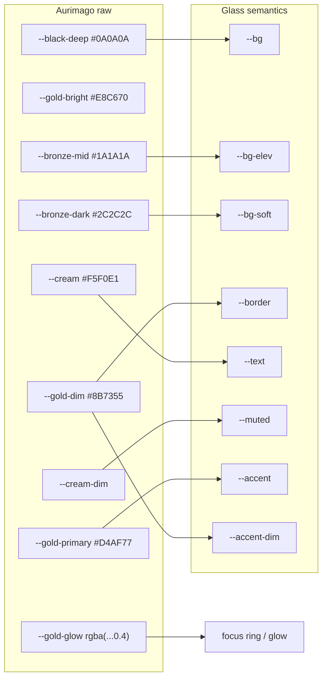
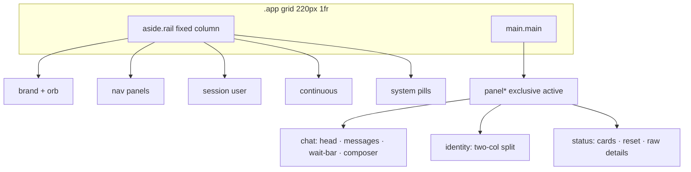
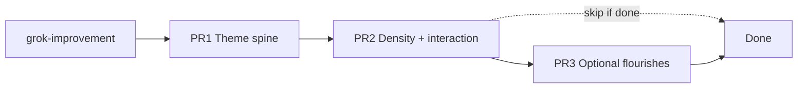

# Design: Elyra glass UI polish — Aurimago gold theme + density

| Field | Value |
|-------|--------|
| **Product** | project-elyra (Stretch 1 glass) |
| **Author** | _TBD_ |
| **Date** | 2026-07-26 |
| **Status** | Draft |
| **Branch base** | `grok-improvement` |
| **Scope** | Visual/UX polish of glass only — **no** identity model changes, no multi-user protocol work |
| **Primary files** | `elyra/runtime/web/style.css`, `index.html`, `app.js` |

---

## Overview

Glass is a functional operator console with a cool blue palette (IBM Plex Sans/Mono, `--accent: #6ea8ff`). Aurimago brand language is gold/bronze/cream/black. This design retokens glass so it reads as **Elyra-in-Aurimago** while remaining an operator console—not a marketing scroll story.

The change is almost entirely CSS custom properties plus a bounded set of hardcoded blue `rgba`/`#hex` replacements, restrained typography (Inter body, optional Cinzel for brand + panel H1 only), button hierarchy (primary gold fill / secondary gold outline), rail density, softer product copy, status raw JSON behind `<details>`, and a clearer identity draft CTA. Layout structure (rail + panels, wait-bar by composer, identity two-col) is preserved. No new npm dependencies; fonts via Google Fonts link or documented system fallbacks.

---

## Background & Motivation

### Current state

Glass lives at:

| File | Role |
|------|------|
| [`elyra/runtime/web/style.css`](elyra/runtime/web/style.css) (~1765 lines) | Full visual system via `:root` tokens + many blue hardcodes |
| [`elyra/runtime/web/index.html`](elyra/runtime/web/index.html) (~432 lines) | Shell markup; **no font imports** today |
| [`elyra/runtime/web/app.js`](elyra/runtime/web/app.js) (~2498 lines) | Behavior; minimal JS for this polish |

Current `:root` (cool console):

```css
:root {
  --bg: #0c0e12;
  --bg-elev: #141820;
  --bg-soft: #1a2030;
  --border: #2a3344;
  --text: #e8ecf4;
  --muted: #8b95a8;
  --accent: #6ea8ff;
  --accent-dim: #3d6fbf;
  --good: #3ecf8e;
  --bad: #f07178;
  --warn: #e6b450;
  --radius: 12px;
  --font: "IBM Plex Sans", "Segoe UI", system-ui, sans-serif;
  --mono: "IBM Plex Mono", ui-monospace, monospace;
}
```

Blue is not only in tokens: ~30+ hardcodes bake in `rgba(110, 168, 255, …)`, `rgba(61, 111, 191, …)`, `#1a2740`, `#7eb4ff`, etc. on `.orb`, `.msg.user`, wait-bar, activity chips, drop overlay, choice buttons, card selection, user chips, markdown tables/blockquotes, and Send.

### Authoritative brand sources

1. `/home/jim/Workspace/aurimago/aurimago-site/src/styles/global.css` — marketing tokens + patterns  
2. `/home/jim/Workspace/aurimago/elyra-ui/src/styles/tokens.css` — packaged design tokens + semantic danger/error  
3. `/home/jim/Workspace/aurimago/elyra-ui/README.md` — Button/Card/Input/Modal conventions  

### Pain points

1. **Brand drift** — Operator dogfooding Aurimago-adjacent work sees a cold IBM-blue console that does not feel like Elyra’s product family.  
2. **Hardcoded blues** — Retokening `--accent` alone leaves user bubbles, wait-bar, chips, and Send still blue.  
3. **Engineering-voice chrome** — Subtitles cite `/api/*` and internal jargon; rail hints are long and dense.  
4. **Status noise** — Full raw JSON (`#status-json`) is always expanded under useful status cards.  
5. **Identity draft affordance** — Draft badge exists, but Promote stays muted secondary even when a draft is present; no primary gold CTA.  
6. **Inconsistent focus** — Some controls use `outline: 1px solid var(--accent-dim)`; no global `focus-visible` gold glow ring as in elyra-ui.

### Principles (locked intent)

| Borrow | Do **not** borrow |
|--------|-------------------|
| Tokens, gold accent, focus rings | Full marketing text-shadows on chat body |
| Primary/secondary button patterns | Filigree, particles, scroll-story |
| Warmer chat bubbles, gold orb | Cinzel on every label |
| Gold links / active nav / wait-bar | Pure black `#000` as default page bg |
| Optional Cinzel for panel H1 + brand name | Recreating canvas orb engine |

**Gold = warm presence + restrained accent; still an operator console.**

---

## Goals & Non-Goals

### Goals

1. Map glass semantic tokens onto Aurimago palette (exact hex values).  
2. Replace blue hardcodes with gold/bronze equivalents (tokenized where practical).  
3. Load Inter (+ optional Cinzel) without npm deps.  
4. Primary gold CTAs (Send, promote-when-draft); secondary gold outline elsewhere.  
5. Improve rail density, panel subtitle voice, status JSON fold, identity draft CTA.  
6. Global `focus-visible` gold ring **in PR1**; modest card hover lift; cream-dim empty/loading.  
7. Preserve layout; WCAG AA for cream and gold-primary as text on shell surfaces; good/bad/warn readable; tool success green / err single warm family.  
8. Ship in 2–3 incremental PRs with a visual dogfood checklist and expanded zero-residue `rg`.

### Non-Goals

- Identity model / promote API / multi-user protocol changes.  
- Porting `@aurimago/ui` Svelte components into glass.  
- Marketing text-shadows, filigree SVG, particle/canvas orb, circuit overlay.  
- Light theme, theming engine, Tailwind.  
- Redesigning rail→panel IA or composer layout grid.  
- Changing server-rendered strings outside glass static files.  
- Automated visual regression suite (optional later).

---

## Proposed Design

### Architecture (token spine)

Glass keeps its own semantic layer (`--bg`, `--accent`, …) so component rules stay stable. Aurimago raw tokens are either aliased into that layer or inlined once at `:root`. Prefer **glass semantics as the single consumer API**; raw Aurimago names optional for documentation / future sync.



### Exact token table (old → new)

| Glass token | Current | New value | Aurimago source |
|-------------|---------|-----------|-----------------|
| `--bg` | `#0c0e12` | `#0A0A0A` | `--black-deep` |
| `--bg-elev` | `#141820` | `#1A1A1A` | `--bronze-mid` |
| `--bg-soft` | `#1a2030` | `#2C2C2C` | `--bronze-dark` |
| `--border` | `#2a3344` | `rgba(139, 115, 85, 0.45)` | `--gold-dim` @ soft opacity |
| `--text` | `#e8ecf4` | `#F5F0E1` | `--cream` |
| `--muted` | `#8b95a8` | `rgba(245, 240, 225, 0.7)` | `--cream-dim` |
| `--accent` | `#6ea8ff` | `#D4AF77` | `--gold-primary` |
| `--accent-dim` | `#3d6fbf` | `#8B7355` | `--gold-dim` |
| `--warn` | `#e6b450` | `#E8C670` | `--gold-bright` (see warn vs accent dogfood; fallback keep `#e6b450`) |
| `--good` | `#3ecf8e` | **keep** `#3ecf8e` | tool success must stay green |
| `--bad` | `#f07178` | `#c98a6b` | elyra-ui `--color-error`; **all** error surfaces retokened in PR1 (KD6/KD15) |
| `--bad-soft` | _(none)_ | `rgba(201, 138, 107, 0.12)` fills / `0.45` borders | derived from `--bad` for chips/banners |
| `--radius` | `12px` | `12px` | matches `--radius-lg` |
| `--font` | IBM Plex Sans | `"Inter", "Segoe UI", system-ui, sans-serif` | `--font-body` |
| `--font-heading` | _(none)_ | `"Cinzel", "Times New Roman", serif` | `--font-heading` |
| `--mono` | IBM Plex Mono | `ui-monospace, "Cascadia Code", "SF Mono", Menlo, monospace` | keep mono for code/status |
| _(new)_ `--gold-glow` | — | `rgba(212, 175, 119, 0.4)` | focus rings (defined once under raw) |
| _(new)_ `--accent-soft` | — | `rgba(212, 175, 119, 0.12)` | tinted surfaces |
| _(new)_ `--accent-mid` | — | `rgba(212, 175, 119, 0.22)` | chips / selection |
| _(new)_ `--danger-bg` | — | `#3f2a2a` | elyra-ui `--color-danger-bg` |
| _(new)_ `--danger-bg-hover` | — | `#5a3a3a` | elyra-ui `--color-danger-bg-hover` |

**Border concrete choice:** `rgba(139, 115, 85, 0.45)` (gold-dim RGB 139,115,85). If panels feel muddy, tighten to `0.35` for hairlines and `0.55` for interactive borders—document both as `--border` and `--border-strong` if needed in PR1.

#### Error / danger hardcode policy (KD15 — Option A)

**In PR1, do not leave “change `--bad` token, keep coral literals.”** Single sweep:

1. Set `--bad: #c98a6b` (elyra-ui `--color-error`).
2. Add soft tokens for fills/borders used by chips, hard-stop, badges:
   - `--bad-soft: rgba(201, 138, 107, 0.12)`
   - `--bad-border: rgba(201, 138, 107, 0.45)` (and `0.55` for stronger where needed)
3. Retoken **all** coral literals (`240, 113, 120`, `#f0a0a4`, `#f07178` hardcodes) in `.btn-danger`, `.activity-chip.kind-tool_err`, `.hard-stop-*`, `.badge-bad`, reset focus, etc. to `var(--bad)` / `--bad-soft` / `--bad-border`.
4. Keep **green** `--good` and its existing green hardcodes **or** retoken greens to `var(--good)` in the same pass when convenient (optional; green is not changing hue).
5. **Dogfood gate:** if operators miss errors with warm brown, flip **only** the token values back to the prior coral family (recompute softs from that hex) — still one family, not mixed warm token + coral chips. Do **not** leave the coral hex in warm-path CSS comments (breaks the empty-`rg` gate).

#### Contrast acceptance (a11y)

**Bar:** WCAG AA for normal text (≥4.5:1) for body, links, and interactive labels on shell surfaces.

| Pair | Approx ratio | Pass? |
|------|--------------|-------|
| `#D4AF77` (gold-primary) on `#0A0A0A` (`--bg`) | ~9.6:1 | AA ✓ |
| `#D4AF77` on `#1A1A1A` (`--bg-elev`) | ~8.5:1 | AA ✓ |
| `#D4AF77` on `#2C2C2C` (`--bg-soft`) | ~6.8:1 | AA ✓ |
| `#0A0A0A` on `#D4AF77` (primary button text) | ~9.6:1 | AA ✓ |
| cream `#F5F0E1` on black-deep / bronze | high | AA ✓ |
| `#8B7355` (gold-dim) as **text** on black | ~4.4:1 | **Fails** AA for normal text |

**Rules:**

- Gold **as text** uses `--accent` / `--gold-primary` (or cream), never `--gold-dim` / `--accent-dim` for ≤14px UI chrome labels.
- Gold-dim is for **borders, hairlines, secondary button borders** only—not label color.
- Primary fill always uses dark text (`var(--black-deep)`), not cream-on-gold.
- Dogfood must tab secondary gold-outline buttons, panel H1, markdown links, and disabled promote and confirm readable (see checklist).

**Recommended `:root` after PR1:**

```css
:root {
  /* Aurimago raw (authoritative; keep in sync with elyra-ui tokens.css) */
  --gold-primary: #D4AF77;
  --gold-bright: #E8C670;
  --gold-dim: #8B7355;
  --gold-glow: rgba(212, 175, 119, 0.4);
  --black-deep: #0A0A0A;
  --black-pure: #000000;
  --cream: #F5F0E1;
  --cream-dim: rgba(245, 240, 225, 0.7);
  --bronze-dark: #2C2C2C;
  --bronze-mid: #1A1A1A;

  /* Glass semantics */
  --bg: var(--black-deep);
  --bg-elev: var(--bronze-mid);
  --bg-soft: var(--bronze-dark);
  --border: rgba(139, 115, 85, 0.45);
  --text: var(--cream);
  --muted: var(--cream-dim);
  --accent: var(--gold-primary);
  --accent-dim: var(--gold-dim);
  --accent-soft: rgba(212, 175, 119, 0.12);
  --accent-mid: rgba(212, 175, 119, 0.22);
  --good: #3ecf8e;
  --bad: #c98a6b; /* elyra-ui --color-error; dogfood may flip to coral family — see Open Q1 */
  --bad-soft: rgba(201, 138, 107, 0.12);
  --bad-border: rgba(201, 138, 107, 0.45);
  --warn: var(--gold-bright); /* if waiting≈accent, set --warn: #e6b450 instead */
  --danger-bg: #3f2a2a; /* elyra-ui --color-danger-bg */
  --danger-bg-hover: #5a3a3a;
  --radius: 12px;
  --font: "Inter", "Segoe UI", system-ui, sans-serif;
  --font-heading: "Cinzel", "Times New Roman", serif;
  --mono: ui-monospace, "Cascadia Code", "SF Mono", Menlo, monospace;
}
```

### Fonts

In `index.html` `<head>` (no npm):

```html
<link rel="preconnect" href="https://fonts.googleapis.com" />
<link rel="preconnect" href="https://fonts.gstatic.com" crossorigin />
<link
  href="https://fonts.googleapis.com/css2?family=Cinzel:wght@400;500;600&family=Inter:wght@300;400;500;600&display=swap"
  rel="stylesheet"
/>
```

**Fallback if offline / air-gapped dogfood:** system stack already listed; Cinzel absence only softens brand name/H1—acceptable.

**FOUT / FOIT:** `display=swap` is already in the Google Fonts URL. Brief FOUT on Cinzel H1/brand is acceptable (console is usable in Inter/serif fallback). Do not block render on fonts. elyra-ui also loads Cinzel 700; glass only needs 400–600 for H1/brand.

**Cinzel application (strict):**

```css
/* Brand name: Cinzel + cream (locked Q2). Orb carries the gold glow — not gold text. */
.brand-name {
  font-family: var(--font-heading);
  font-weight: 500;
  color: var(--cream); /* or var(--text); NOT var(--accent) / gold */
  letter-spacing: 0.04em;
}

/* Panel H1: Cinzel + gold accent (distinct from brand-name cream) */
.panel-head h1 {
  font-family: var(--font-heading);
  font-weight: 500;
  color: var(--accent);
  /* NO marketing multi-layer text-shadow */
}
```

Do **not** apply Cinzel to `.nav-btn`, `.subhead`, labels, badges, or markdown body headings (`.msg-body h1–h4` stay Inter/body weight).

### Blue / cool-cast hardcode inventory → gold mapping

Sweep `style.css` (and any inline styles in JS) for the following. PR1 is incomplete if any cool-cast residue remains (see **PR1 zero-residue `rg`** below).

| Location (approx.) | Current | Replacement |
|--------------------|---------|-------------|
| `.rail` gradient | `#10141c → #0c0e12` | `var(--bronze-mid) → var(--bg)` or solid `var(--bg)` |
| `.orb` radial | `#a8c8ff`, blue dim, `#1a2840` | gold radial (below) |
| `.orb` shadow | `rgba(110,168,255,0.35)` | `var(--gold-glow)` or `0 0 24px rgba(212,175,119,0.35)` |
| `.msg.user` start | `#1a2740` | warm bronze stop (below) |
| `.msg.user` mid-stop | `#152033` | `#1c1814` (warm end of gradient) |
| `.msg.user` border | `#2d4060` | `rgba(139, 115, 85, 0.55)` |
| `.msg.user .role-chip` | blue border | `rgba(212,175,119,0.35)` + `var(--accent)` |
| `.msg-body blockquote` | blue wash | `var(--accent-soft)` + `var(--accent-dim)` border |
| `.msg-body th` | `rgba(110,168,255,0.08)` | `var(--accent-soft)` |
| `.activity-chip` **default** bg | `rgba(12, 14, 18, 0.55)` | `rgba(10, 10, 10, 0.55)` or `color-mix(in srgb, var(--bg) 55%, transparent)` |
| `.activity-chip.is-newest` | blue fill | `var(--accent-mid)` + gold border |
| `.activity-chip.kind-model*` | blue border | gold-dim border |
| `.drop-overlay` | blue wash/dash | gold wash/dash |
| `.wait-bar` | blue border/bg | gold soft (below) |
| `.choice-btn` / hover | `#1c2a44` | `var(--bg-soft)` / gold border |
| `.card-btn.card-selected` | blue ring | `0 0 0 1px var(--gold-glow)` or accent border |
| `.composer #send-btn` gradient | `#7eb4ff` → accent-dim | primary gold (below) |
| `.composer #send-btn` text | `#0a1020` | `var(--black-deep)` (`#0A0A0A`) |
| `.user-chip-active` | blue tint | gold tint |
| `.composer-rich` bg | `rgba(12,14,18,0.94)` | `rgba(10,10,10,0.94)` |
| `.jump-latest` bg | `rgba(20, 24, 32, 0.92)` | bronze-elev translucent e.g. `rgba(26, 26, 26, 0.92)` |
| `.detail-panel` | `rgba(20,24,32,0.6)` | `rgba(26,26,26,0.65)` |
| `#c5d0e0` mono bodies | cool gray (`.beat-body`, `.code-block`) | `var(--text)` at ~0.9 or `rgba(245,240,225,0.85)` |
| pre/code deep bg | `#0a0d12` | `var(--black-deep)` (prefer over pure `#000` except image letterbox) |

#### Error / warn hardcode retoken (same PR1 pass)

| Family | Current literals | Replacement |
|--------|------------------|-------------|
| Error / danger | `rgba(240, 113, 120, …)`, `#f0a0a4`, coral borders on hard-stop/badge/btn-danger | `var(--bad)`, `var(--bad-soft)`, `var(--bad-border)` |
| Warn | `rgba(230, 180, 80, …)` on pulse, draft-badge, pill-busy, waiting chips, notice | Prefer `color-mix` / alpha of `var(--warn)` so when `--warn` is gold-bright (or fallback `#e6b450`) all surfaces move together |
| Good | green `rgba(62, 207, 142, …)` | Keep green hue; optional retoken to `var(--good)` alphas |

**Do not** keep coral chip hardcodes after switching `--bad` to warm brown (KD15).

#### PR1 zero-residue `rg` (mandatory empty)

After PR1, the following must match **nothing** in `elyra/runtime/web/style.css` (intentional pure blacks like `#000` / `#000000` for image letterbox are **allowed** and excluded from the ban):

```bash
rg -n '#1a2740|#152033|#2d4060|#1c2a44|#1a2840|#10141c|#0c0e12|#0a0d12|#7eb4ff|#a8c8ff|#c5d0e0|#0a1020|#6ea8ff|#3d6fbf|110,\s*168,\s*255|61,\s*111,\s*191|rgba\(12,\s*14,\s*18|rgba\(20,\s*24,\s*32' \
  elyra/runtime/web/style.css
# expect: no matches
```

Also verify error family consistency (should use tokens, not orphaned coral):

```bash
rg -n '240,\s*113,\s*120|#f0a0a4|#f07178' elyra/runtime/web/style.css
```

**Coral gate rules (warm default path — PR1 merge bar):**

| Path | Expected `rg` result |
|------|----------------------|
| Warm `--bad: #c98a6b` (default) | **Zero matches** in all of `style.css`, including comments. Do not mention the prior coral hex in comments; say “coral family” or “Open Q1”. |
| Dogfood flipped to coral tokens | Matches **only** on `:root` **property values** that define `--bad` / `--bad-soft` / `--bad-border` (and any soft rgba derived from that hex). **No** coral literals in component rules (`.btn-danger`, chips, hard-stop, etc.). |

The old phrasing “or only inside `:root` if coral fallback” is **not** a free pass for comment hits under the warm path.

---

### Component rules (before → after)

#### 1. Orb

```css
/* BEFORE */
.orb {
  background: radial-gradient(circle at 30% 30%, #a8c8ff, var(--accent-dim) 45%, #1a2840 70%);
  box-shadow: 0 0 24px rgba(110, 168, 255, 0.35);
}

/* AFTER */
.orb {
  background: radial-gradient(
    circle at 30% 30%,
    var(--gold-bright) 0%,
    var(--gold-primary) 38%,
    var(--gold-dim) 62%,
    #1a1510 78%
  );
  box-shadow: 0 0 24px rgba(212, 175, 119, 0.35);
}
```

Static CSS only—**no** canvas orb engine.

#### 2. User message bubble

```css
/* BEFORE */
.msg.user {
  background: linear-gradient(180deg, #1a2740 0%, #152033 100%);
  border-color: #2d4060;
}

/* AFTER */
.msg.user {
  background: linear-gradient(180deg, #2a241c 0%, #1c1814 100%);
  border-color: rgba(139, 115, 85, 0.55);
}
```

Assistant bubbles stay `--bg-elev` (neutral bronze). Optional ultra-subtle gold left edge on assistant is **out of scope** (avoids chat looking “branded”).

#### 3. Buttons

Align with elyra-ui conventions without importing the package.

**Secondary model change (KD16):** Today `.btn-secondary` is **filled** `--bg-soft` + neutral border + cream text. After PR1 it is **transparent + gold outline + gold label** everywhere: New guest, catalog Refresh, Mint grant, provider Save/Clear, modal **Cancel**, session controls. Destructive actions stay **`.btn-danger` only** (never gold-fill Cancel/Reset).

```css
/* Primary — shared fill/border/color (Send + promote-when-draft).
   Do NOT put composer sizing here — Send keeps its own hit target below. */
.btn-primary,
.composer #send-btn {
  appearance: none;
  border: 1px solid var(--gold-primary);
  background: linear-gradient(180deg, var(--gold-bright), var(--gold-primary));
  color: var(--black-deep); /* dark text on gold — never cream-on-gold */
  font-weight: 650;
  cursor: pointer;
  font: inherit;
}
.btn-primary {
  border-radius: 8px;
  padding: 0.5rem 0.9rem;
  font-size: 0.9rem;
}
/* Send: preserve existing glass hit target (style.css ~1043–1044) */
.composer #send-btn {
  border: none; /* current Send is borderless fill; keep unless outline desired */
  border-radius: 12px;
  padding: 0 1.15rem;
  min-height: 44px;
}
.btn-primary:hover:not(:disabled),
.composer #send-btn:hover:not(:disabled) {
  filter: brightness(1.05);
}
.btn-primary:disabled,
.composer #send-btn:disabled {
  opacity: 0.45;
  cursor: not-allowed;
  filter: none;
}
.btn-primary:focus-visible,
.composer #send-btn:focus-visible {
  outline: none;
  box-shadow: 0 0 0 3px var(--gold-glow);
}

/* Size composition: promote keeps btn-sm always; only swap primary/secondary.
   Never apply .btn-sm metrics to #send-btn. */
.btn-primary.btn-sm,
.btn-secondary.btn-sm {
  border-radius: 8px;
  padding: 0.35rem 0.65rem;
  font-size: 0.8rem;
}

/* Secondary — gold outline (replaces filled soft chrome on ALL .btn-secondary) */
.btn-secondary {
  appearance: none;
  border: 1px solid var(--gold-dim);
  background: transparent;
  color: var(--gold-primary); /* not gold-dim — AA text */
  border-radius: 8px;
  padding: 0.5rem 0.9rem;
  font: inherit;
  font-size: 0.9rem;
  cursor: pointer;
}
.btn-secondary:hover:not(:disabled) {
  border-color: var(--gold-primary);
  background: var(--accent-soft);
}
.btn-secondary:disabled {
  opacity: 0.45;
  cursor: not-allowed;
}

/* Danger — warm fills from --danger-bg tokens; destructive only */
.btn-danger {
  border: 1px solid var(--gold-dim);
  background: var(--danger-bg);
  color: var(--bad);
}
.btn-danger:hover:not(:disabled) {
  background: var(--danger-bg-hover);
}
.btn-danger:disabled {
  opacity: 0.45;
  cursor: not-allowed;
}
```

Cinzel on primary buttons is **not** required for glass (console density); Inter/semibold is fine. elyra-ui uses Cinzel on primary marketing CTAs—we deliberately skip that for operator chrome.

**Promote buttons (HTML):** keep `class="… btn-sm"` always; JS only toggles `btn-primary` ↔ `btn-secondary` + `disabled` (never drops `btn-sm`).

#### 4. Focus rings (**PR1 owns the full global rule**)

Ship the complete global `:where(...):focus-visible` gold ring in **PR1**, not a half-migrated “Send only” baseline. Also remove the four existing thin outlines in the same PR to avoid double rings:

| Current site | Today |
|--------------|--------|
| `.composer textarea:focus` | `outline: 1px solid var(--accent-dim)` |
| `.status-select:focus`, `.status-input:focus` | same |
| `.continuous-toggle:focus-visible + .toggle-track` | same |
| `.reset-confirm-label input:focus` | bad-tinted 1px (replace with glow) |

```css
/* Global operator controls — PR1 required */
:where(
  button,
  a,
  input,
  select,
  textarea,
  summary,
  .card-btn,
  .nav-btn,
  .user-chip,
  .choice-btn,
  .link-btn,
  .icon-btn,
  .version-row
):focus-visible {
  outline: none;
  box-shadow: 0 0 0 3px var(--gold-glow);
}

/* Prefer focus-visible over :focus so mouse clicks stay clean */
.composer textarea:focus-visible,
.status-select:focus-visible,
.status-input:focus-visible {
  outline: none;
  border-color: var(--gold-primary);
  box-shadow: 0 0 0 3px var(--gold-glow);
}

.continuous-toggle:focus-visible + .toggle-track {
  outline: none;
  box-shadow: 0 0 0 3px var(--gold-glow);
}

/* Reset modal confirm input — bad-tinted focus glow */
.reset-confirm-label input:focus-visible {
  outline: none;
  border-color: var(--bad);
  box-shadow: 0 0 0 3px rgba(201, 138, 107, 0.35);
}
```

**PR2** only fixes any focus selectors discovered later (edge cases); do not defer the global rule.

#### 5. Active nav

```css
/* BEFORE */
.nav-btn.active {
  color: var(--text);
  background: var(--bg-soft);
  border-color: var(--border);
}

/* AFTER */
.nav-btn.active {
  color: var(--cream);
  background: var(--accent-soft);
  border-color: rgba(212, 175, 119, 0.4);
  box-shadow: inset 2px 0 0 var(--gold-primary); /* optional rail accent bar */
}
```

#### 6. Wait bar

```css
/* BEFORE */
.wait-bar {
  border: 1px solid rgba(110, 168, 255, 0.35);
  background: rgba(61, 111, 191, 0.15);
}

/* AFTER */
.wait-bar {
  border: 1px solid rgba(212, 175, 119, 0.4);
  background: rgba(212, 175, 119, 0.1);
}
```

Keep existing `[hidden] { display: none !important; }` fix (comment about empty blue bar becomes “empty gold bar”—same rule).

#### 7. Links

```css
a, .link-btn, .msg-body a {
  color: var(--accent);
}
a:hover, .link-btn:hover, .msg-body a:hover {
  color: var(--gold-bright);
}
```

---

### P1 — Density & hierarchy

#### Slim rail

Current structure: brand → nav → session block (label, select, New guest, long hint) → continuous toggle → pills.

**Changes (HTML + light CSS):**

1. Shorten session hint (see copy list).  
2. Group system pills in a labeled cluster:

```html
<div class="rail-foot" role="group" aria-label="System status">
  <div class="rail-foot-label muted">System</div>
  <div class="rail-pills">
    <div id="pill-llama" class="pill pill-off">llama</div>
    <!-- … -->
  </div>
</div>
```

```css
.rail {
  gap: 1rem; /* was 1.5rem */
  padding: 1rem 0.85rem;
}
.rail-session {
  padding: 0.4rem 0.15rem;
  gap: 0.28rem;
}
.session-hint {
  font-size: 0.65rem;
  display: -webkit-box;
  -webkit-line-clamp: 2;
  -webkit-box-orient: vertical;
  overflow: hidden;
}
.rail-pills {
  display: flex;
  flex-direction: column;
  gap: 0.3rem;
}
.rail-foot-label {
  font-size: 0.65rem;
  text-transform: uppercase;
  letter-spacing: 0.05em;
  margin-bottom: 0.15rem;
}
```

Mobile (`@media max-width: 720px`): ensure rail `background: var(--bg)` + `border-bottom` still contrast against main; with black-deep both sides, prefer slightly elevated rail:

```css
@media (max-width: 720px) {
  .rail {
    background: var(--bg-elev);
    border-bottom: 1px solid var(--border);
  }
}
```

#### Panel subtitle copy (product voice)

| Panel | Current | Proposed |
|-------|---------|----------|
| Chat | `Markdown glass · attachments listed in your message until vision is wired.` | `Talk with Elyra. Attachments show in your message until vision is ready.` |
| Goals | `Durable ledger from /api/goals.` | `Open goals and progress.` |
| Moments | `Recent do-loops and beats. Reasoning is collapsed by default.` | `Recent work loops. Reasoning stays collapsed until you open it.` |
| Tools | `Live catalog (disk rescan each refresh). Local packages are host-only, not in git.` | `Tools and skills on this host. Refresh reloads the catalog.` |
| Identity | `Current digests + versions (read-only). Drafts via model tools only — no Glass draft editors. Session user ≠ orient USER on pure work.` | `Who Elyra is and who you’re talking as. Drafts come from the model—promote here when ready.` |
| Status | `Runtime snapshot from /api/status.` | `Provider, budget, and runtime health.` |
| Session hint | `Session is who is typing — not orient USER on pure work.` | `Who is typing in this session.` |
| Continuous meta (rail) | keep mono status text | keep |

Copy lives in `index.html` (static). Do not invent new product claims.

#### Status JSON `<details>`

**Current** (`index.html` ~379):

```html
<pre id="status-json" class="code-block">loading…</pre>
```

**Proposed:**

```html
<details class="status-raw-fold">
  <summary>Raw status JSON</summary>
  <pre id="status-json" class="code-block">loading…</pre>
</details>
```

```css
.status-raw-fold {
  margin: 0.75rem 1.5rem 1.5rem;
  max-width: 720px;
  border: 1px solid var(--border);
  border-radius: var(--radius);
  background: var(--bg-elev);
  padding: 0.35rem 0.65rem 0.65rem;
}
.status-raw-fold > summary {
  cursor: pointer;
  color: var(--muted);
  font-size: 0.85rem;
  padding: 0.4rem 0.25rem;
  user-select: none;
}
.status-raw-fold > summary:hover {
  color: var(--text);
}
.status-raw-fold[open] > summary {
  color: var(--accent);
  margin-bottom: 0.35rem;
}
.status-raw-fold .code-block {
  margin: 0;
  border: none;
  background: var(--bg);
}
```

**JS:** `statusJson = $("#status-json")` and `statusJson.textContent = JSON.stringify(...)` in `refreshStatus` / status paint path (~1178–1179) remain valid—**id stays on `<pre>`**. No API change.

Default: **collapsed** so cards dominate. Operators who need raw JSON open once per session.

#### Identity draft CTA

**Current behavior** (`refreshIdentity` ~1854–1898):

- `has_draft` toggles badge + draft `<details>` visibility.  
- Promote buttons always `btn-secondary`; not disabled when no draft.

**Proposed behavior (UI only):**

| State | Badge | Draft fold | Promote button |
|-------|-------|------------|----------------|
| No draft | hidden | hidden; force `open = false` | `btn-secondary btn-sm`, **disabled**, title “No draft to promote” |
| Has draft | visible | visible in DOM; **leave collapsed** by default (do not auto-open); user may expand | **`btn-primary btn-sm`**, enabled, title promote hint |

**Locked (Q3):** discovery is badge + gold Promote only — never auto-open the draft fold on `has_draft`. When draft disappears, force `open = false` so no stale open `<details>`.

```js
// Helper — call for self and user after has*Draft is known
function setPromoteBtnState(btn, hasDraft, titles) {
  if (!btn) return;
  btn.disabled = !hasDraft;
  btn.classList.toggle("btn-primary", hasDraft);
  btn.classList.toggle("btn-secondary", !hasDraft);
  // keep btn-sm always (do not remove)
  btn.title = hasDraft ? titles.enabled : titles.disabled;
}

// In refreshIdentity, after successful fetch + hasSelfDraft / hasUserDraft:
setPromoteBtnState(identityPromoteSelfBtn, hasSelfDraft, {
  enabled: "Promote draft to live self identity",
  disabled: "No draft to promote",
});
setPromoteBtnState(identityPromoteUserBtn, hasUserDraft, {
  enabled: "Promote draft to live user identity",
  disabled: "No draft to promote",
});
// When draft disappears, collapse fold so no stale open details:
if (identitySelfDraftFold && !hasSelfDraft) identitySelfDraftFold.open = false;
if (identityUserDraftFold && !hasUserDraft) identityUserDraftFold.open = false;
```

**Edge cases:**

| When | Promote button state |
|------|----------------------|
| Initial HTML before first `refreshIdentity` | Prefer `disabled` + `btn-secondary btn-sm` in markup (safe default) |
| `refreshIdentity` completes successfully | Always set state from `has_draft` (both self and user) |
| Fetch throws / partial failure | Leave previous button state **or** disable both promotes (prefer **disable both** on hard failure so operators do not promote against stale UI); still `showNotice` as today |
| Draft removed after promote | Next successful refresh → disabled secondary + fold closed |

Mint grant remains **secondary** (procedural step, not the main CTA). When draft exists, visual hierarchy: **gold Promote** > secondary Mint grant.

No API or gate changes—still `window.prompt` for reason + existing endpoints.

---

### P2 — Interaction polish

1. **focus-visible** — **full global rule ships in PR1**; PR2 only patches stragglers.  
2. **Card hover lift** (goals, moments, tools list cards):

```css
.card-btn {
  transition: border-color 0.15s ease, box-shadow 0.15s ease, transform 0.15s ease;
}
.card-btn:hover {
  border-color: var(--gold-dim);
  box-shadow: 0 4px 16px rgba(0, 0, 0, 0.35);
  transform: translateY(-1px);
}
.card-btn.card-selected {
  border-color: var(--gold-primary);
  box-shadow: 0 0 0 1px rgba(212, 175, 119, 0.35);
  transform: none;
}
```

Prefer hover only on interactive `.card-btn`, not static status cards (avoid “clickable” false affordance).

3. **Loading / empty** — already `.muted` / `.empty`; ensure:

```css
.empty,
.list-panel > .muted,
.code-block:empty {
  color: var(--muted); /* cream-dim after token swap */
}
```

Strings stay `loading…` / `No goals yet.` etc.—color inherits.

4. **Mobile rail contrast** — elevated rail bg as above; verify pills and nav active state still readable on narrow wrap.

---

### P3 — Optional flourishes (separate PR or cut)

| # | Flourish | Spec | Priority |
|---|----------|------|----------|
| 14 | Gold hairline under panel heads | `.panel-head { border-bottom-color: rgba(212,175,119,0.35); }` or `border-image` gradient 40% width | low |
| 15 | Composer top border gold-dim | `.composer-rich { border-top: 1px solid rgba(139,115,85,0.55); }` | low |
| 16 | Filigree/particles | **Explicitly out of scope** unless a future “show mode” | no |

If PR3 is too thin, fold 14–15 into PR2.

---

### Layout constraints (must not break)



- Wait bar remains **above composer** (`.wait-bar-composer`), not top chrome.  
- Identity two-col (`.identity-split`) and status card stack unchanged.  
- Viewport-locked shell (`html, body { overflow: hidden }`) unchanged.

---

## API / Interface Changes

**None** for HTTP APIs.

**DOM contracts to preserve:**

| Selector / id | Contract |
|---------------|----------|
| `#status-json` | Still a `<pre>` (may nest under `<details>`); `textContent` assignment |
| `#identity-*-draft-badge`, folds, promote buttons | Existing ids; class toggles only |
| `.nav-btn[data-panel]`, panel ids | Unchanged |
| `#send-btn`, wait-bar, continuous toggles | Unchanged |

**New classes (CSS only):** `.btn-primary`, `.status-raw-fold`, `.rail-pills`, `.rail-foot-label` (optional).

---

## Data Model Changes

N/A (pure presentation + static copy).

---

## Alternatives Considered

### A1. Import `@aurimago/ui` tokens.css + components

| Pros | Cons |
|------|------|
| Single source of truth with marketing/Agent Lab | Glass is static HTML/JS, not Svelte; npm link/build chain for runtime web is out of scope |
| Button/Card primitives for free | Over-imports marketing heading text-shadows harmful to console density |

**Decision:** Copy exact token values; mirror button/focus patterns manually. Revisit package import when glass is rewritten or packaged.

### A2. CSS-only theme via `filter` / hue-rotate on root

| Pros | Cons |
|------|------|
| One-line “gold” | Ruins green/red status semantics; muddy mono; unmaintainable |

**Decision:** Rejected.

### A3. Full marketing treatment (Cinzel everywhere, text-shadows, pure black, filigree)

| Pros | Cons |
|------|------|
| Strong brand | Breaks operator readability; conflicts with locked principles |

**Decision:** Rejected; restrained borrow only.

### A4. Dual theme toggle (blue legacy / gold Aurimago)

| Pros | Cons |
|------|------|
| Rollback without git | Maintenance of two palettes; operator never needs blue brand |

**Decision:** Single gold theme; git revert / PR rollback if needed.

### A5. Sixteen micro-PRs (one backlog item each)

| Pros | Cons |
|------|------|
| Tiny diffs | Review fatigue; broken intermediate states (half blue) |

**Decision:** 2–3 PRs (theme spine → density → optional polish).

---

## Security & Privacy Considerations

| Topic | Assessment |
|-------|------------|
| Fonts CDN | Google Fonts loads in browser; offline fallback via system fonts. No secrets in font URLs. Air-gapped: document fallbacks; optional later vendor of woff2 into `runtime/web/fonts/`. |
| Status JSON fold | Collapsing does not remove data from DOM; still in-page. No new exposure. |
| Identity promote CTA | Enable/disable is cosmetic; server gates still enforce. Disabled button reduces mis-clicks only. |
| Danger/reset styling | Warm danger must remain visually distinct from primary gold (do not gold-fill destructive actions). |
| API key fields | Unchanged styling contract (password inputs, never re-display). |

No new XSS surface if copy stays text in HTML and JS continues to use existing `escapeHtml` / `textContent` paths.

---

## Observability

- No metrics/logging changes.  
- Visual dogfood is the acceptance path.  
- If static string tests exist for panel subtitles or CSS tokens, update them (current search shows **no** unit tests asserting IBM Plex / `#6ea8ff` in glass CSS).  
- API glass tests (`tests/test_api_glass.py`) are behavioral—unaffected unless HTML ids break.

---

## Risks

| Risk | Severity | Mitigation |
|------|----------|------------|
| Cream on bronze contrast insufficient for dense mono status | Medium | Keep code blocks slightly brighter text; verify WCAG AA for body; bump mono to solid cream if needed |
| Gold-as-text / gold-on-bronze contrast | Medium | Documented ratios (gold-primary passes AA on bg/elev/soft); **forbid gold-dim as ≤14px text**; dogfood secondary labels, H1, links |
| Gold accent vs gold-bright warn conflation | Medium | Side-by-side dogfood: newest chip vs waiting chip vs draft badge; if indistinguishable, set `--warn: #e6b450` (keep brand gold for accent only) |
| Warm `--bad: #c98a6b` less alarming than coral | Medium | PR1 retokens **all** error surfaces together (KD15); dogfood hard-stop + tool_err; flip token family to coral if missed — never mixed |
| Cinzel overuse | Low | Hard rule: brand-name + panel H1 only; code review checklist |
| Google Fonts latency / FOUT | Low | `display=swap`; system fallbacks; FOUT on H1 only is OK |
| Mobile rail blends into main | Medium | Elevated rail bg at ≤720px; border-bottom gold-dim |
| Double focus rings during migration | Low | PR1 removes old 1px outlines when adding global gold glow |
| Half-migrated cool hardcodes | High if incomplete PR1 | Expanded zero-residue `rg` (blues + cool navies + `#c5d0e0` + `rgba(12,14,18)` / `rgba(20,24,32)`); do **not** split purge into PR2 |
| Card hover on non-clickable status cards | Low | Scope lift to `.card-btn` only |
| Disabled promote without title confuses | Low | `title` + disabled in initial HTML; collapse draft fold when no draft |
| Secondary outline regression (looks “unfilled / broken”) | Low | Intentional KD16; dogfood all secondary sites including Cancel |

---

## Rollout Plan

1. Branch from `grok-improvement`.  
2. PR1 theme spine → merge after dogfood checklist (theme section).  
3. PR2 density & interaction → dogfood density/a11y.  
4. PR3 optional hairlines or skip.  
5. No feature flag; static assets ship with runtime.  
6. Rollback = revert PR(s).

---

## Open Questions

1. **`--bad` color (resolved policy, open dogfood gate):** PR1 implements Option A (warm `#c98a6b` + full error hardcode retoken). Open only whether dogfood reverts the **token family** to the prior coral palette—not whether hardcodes stay mixed. Warm-path CSS comments must not embed the prior coral hex (coral `rg` gate).  
2. **Brand name color + Cinzel — RESOLVED:** `.brand-name` = **Cinzel + cream text** (`var(--cream)` / `var(--text)`). **Not** gold text. Orb carries the gold glow. Panel H1 remains Cinzel + gold. See KD3 / KD19.  
3. **Identity draft fold open behavior — RESOLVED:** Leave fold **collapsed** when draft appears; discovery via badge + gold Promote only. Force `open = false` when draft disappears. Do **not** auto-open on `has_draft`. See KD20.  
4. **Vendor fonts for offline:** needed for production runtime hosts without CDN? **Recommendation:** defer; document fallbacks.  
5. **`--border` opacity:** 0.45 vs 0.35 after real glass screenshots? Tune in PR1 dogfood.  
6. **`--warn` vs accent:** if side-by-side dogfood cannot tell waiting chip from newest/accent chip, set `--warn: #e6b450` while keeping accent at gold-primary.

---

## References

| Source | Path / note |
|--------|-------------|
| Marketing tokens | `/home/jim/Workspace/aurimago/aurimago-site/src/styles/global.css` |
| Packaged tokens | `/home/jim/Workspace/aurimago/elyra-ui/src/styles/tokens.css` |
| Component conventions | `/home/jim/Workspace/aurimago/elyra-ui/README.md` |
| Glass CSS | `elyra/runtime/web/style.css` |
| Glass HTML | `elyra/runtime/web/index.html` |
| Glass JS | `elyra/runtime/web/app.js` (`refreshIdentity`, status JSON paint ~1178) |
| Cool-cast hardcodes | Expanded PR1 zero-residue `rg` in inventory section (blues + navies + mono + cool rgba) |

---

## Dogfood checklist

### Theme spine (PR1)

- [ ] Page background reads deep black/bronze, not cool navy  
- [ ] No remaining blue **or cool navy/gray** accents on orb, Send, wait-bar, user bubble, active nav, links, chips, choice hover, code mono  
- [ ] Expanded zero-residue `rg` (see inventory section) → **empty**  
- [ ] Coral family `rg` (`240, 113, 120` / `#f0a0a4` / prior coral hex): **zero matches** on warm path (no coral hex in comments either); if dogfood flipped to coral, only `:root` token **values** may match  
- [ ] Brand orb is gold radial with soft glow  
- [ ] Brand name Cinzel + **cream** text (not gold); orb carries gold glow; panel H1 Cinzel gold; nav still Inter  
- [ ] User bubbles warm bronze/gold (both gradient stops); assistant neutral  
- [ ] Activity default chips not cool-cast (`rgba(12,14,18)` gone)  
- [ ] Primary Send: gold fill, **dark** text (`#0A0A0A`), readable; **`min-height: 44px`**, padding `0 1.15rem` (not shrunk to generic `.btn-primary`)  
- [ ] **All** `.btn-secondary` are gold outline (New guest, Refresh, Mint, Save/Clear, Cancel)—not filled soft  
- [ ] Focus keyboard tab: **global** gold glow ring on inputs, nav, buttons, toggles, summary; no double 1px outlines  
- [ ] Contrast: panel H1, secondary labels, markdown links readable on bronze; **no gold-dim body text**  
- [ ] Tool success green / tool err (warm `--bad` family) still obvious; hard-stop still alarming  
- [ ] Side-by-side: **newest** activity chip vs **waiting** warn chip vs **draft** badge — operators can tell waiting ≠ accent; else set `--warn: #e6b450`  
- [ ] Markdown links, blockquote, table headers gold-tinted not blue  
- [ ] Fonts load or graceful system fallback (FOUT on H1 OK)  

### Density (PR2)

- [ ] Rail session hint ≤2 lines; less jargon  
- [ ] System pills grouped/labeled  
- [ ] All panel subtitles product voice (no `/api/` in chrome)  
- [ ] Status raw JSON collapsed by default; expand shows formatted JSON  
- [ ] Identity: initial load promote disabled secondary `btn-sm`  
- [ ] Identity: no draft → promote disabled secondary; draft fold closed  
- [ ] Identity: has draft → badge visible, draft fold **collapsed** (not auto-opened), promote gold primary `btn-sm`, mint still secondary  
- [ ] Identity: draft removed → fold forced closed (`open = false`)  
- [ ] Identity: after failed refresh, promotes not left falsely enabled (disable-both policy)  
- [ ] Card lists hover lift; status cards do not fake lift  
- [ ] Empty/loading cream-dim  
- [ ] Mobile ≤720px: rail contrast OK; nav wrap usable  

### Optional (PR3)

- [ ] Panel head gold hairline subtle (not glitter)  
- [ ] Composer top edge slightly gold  
- [ ] Still no filigree/particles  

### Regression

- [ ] Wait bar hidden when idle (no empty strip)  
- [ ] Continuous / dev-speed toggles work  
- [ ] Reset modal danger still distinct from gold primary; Cancel secondary outline  
- [ ] Attachment tray / drop overlay gold not blue  
- [ ] Activity chips: newest gold; tool green; tool_err bad; waiting warn  

---

## Key Decisions

| ID | Decision | Rationale |
|----|----------|-----------|
| KD1 | Keep glass semantic tokens; alias Aurimago raw under them | Minimizes churn in 1700+ lines of rules; allows future sync with elyra-ui |
| KD2 | Exact Aurimago hex/rgba from marketing + tokens.css | Single brand truth; no “almost gold” drift |
| KD3 | Cinzel only for `.brand-name` + `.panel-head h1` | Operator density; avoid marketing costume |
| KD19 | `.brand-name` = Cinzel + **cream** text; orb carries gold glow (not gold brand text) | Locked Q2 — avoids brand-name competing with orb gold |
| KD20 | Identity draft fold stays collapsed on `has_draft`; force `open=false` when draft gone; discovery = badge + gold Promote | Locked Q3 — less noise; promote is the CTA |
| KD4 | No marketing text-shadows / filigree / canvas orb | Locked principles; console readability |
| KD5 | Primary = gold fill + dark text; secondary = gold outline; danger = warm bronze-red | Matches elyra-ui README without Svelte import |
| KD6 | Preserve `--good` green; PR1 sets `--bad` to `#c98a6b` **and** retokens all coral error hardcodes (Option A) | One error language; dogfood may flip entire family to coral, never mix token vs hardcodes |
| KD7 | Border = gold-dim at ~0.45 alpha, not solid gray-blue | Warm chrome without heavy gold cages |
| KD8 | Full cool-cast hardcode sweep mandatory in **PR1 only** (expanded `rg`); never split purge to PR2 | Token-only / partial purge leaves half-blue intermediate main |
| KD9 | Status JSON behind collapsed `<details>`; keep `#status-json` id | Noise reduction without breaking JS |
| KD10 | Promote becomes `btn-primary` only when `has_draft`; disabled otherwise; keep `btn-sm` | Clear draft affordance; no API change |
| KD11 | Fonts via Google Fonts link + system fallbacks; no npm; `display=swap` | Matches glass static asset model |
| KD12 | Ship 2–3 PRs not 16 | Reviewable, greppable intermediate quality |
| KD13 | Pure black only for code wells / image chip letterbox—not full shell | Prefer `--black-deep` page bg |
| KD14 | Card hover lift only on `.card-btn` | Avoid false affordances on status cards |
| KD15 | Error surfaces: Option A single family via `--bad` / `--bad-soft` / `--bad-border` + `--danger-bg*` | Aligns chips, banners, buttons; matches elyra-ui danger tokens |
| KD16 | **All** `.btn-secondary` migrate filled→gold outline; Cancel/Mint stay secondary; destructive only `.btn-danger` | Broad chrome change is intentional; prevents “only Send got gold” under-implement |
| KD17 | Gold-as-text uses gold-primary only; forbid gold-dim as ≤14px text; WCAG AA bar on bg/elev/soft | a11y; dim is for borders |
| KD18 | Global `focus-visible` gold ring + remove thin accent-dim outlines ships entirely in PR1 | Avoid half-migrated focus for a full dogfood cycle |

---

## PR Plan

### PR1 — Theme spine (P0)

**Branch:** `glass-aurimago-theme` (from `grok-improvement`)  
**Title:** `glass: Aurimago gold theme spine`  
**Files:** `elyra/runtime/web/style.css`, `elyra/runtime/web/index.html` (fonts link only)

**Size expectation:** Large, reviewable **color churn across most of `style.css` in one PR**. That is intentional: splitting the cool-cast purge into PR2 recreates the half-blue intermediate state rejected in A5/KD8. Reviewers should expect a wide CSS diff, not a tiny token-only patch.

**Includes backlog items 1–5 + focus + error retoken:**

1. CSS variables → Aurimago tokens (+ `--accent-soft` / `--accent-mid` / `--danger-bg` / `--bad-soft` / etc.)  
2. Orb gold radial; brand name Cinzel + **cream** text (not gold)  
3. Links, **full global `focus-visible`**, active nav, wait-bar → gold  
4. User chat bubble bronze/gold tint (both stops)  
5. Buttons: primary gold fill (`.btn-primary` + `.btn-primary.btn-sm` / disabled; **Send keeps `min-height: 44px` / `padding: 0 1.15rem`**); **all** secondary gold outline; danger via `--danger-bg`  

**Also in PR1 (blocking completeness):**

- Expanded zero-residue hardcode purge (inventory table + cool navies + activity-chip default + mono `#c5d0e0` + composer/jump/detail rgba)  
- Full error/warn hardcode retoken to `--bad*` / `--warn` (KD15)  
- Remove thin `outline: 1px solid var(--accent-dim)` sites (KD18)  
- Panel H1 Cinzel + gold (no text-shadow); `.brand-name` Cinzel + cream (KD19)  
- Font `<link>` in `index.html`  

**Out of PR1:** subtitle copy, rail slim, status details, promote class toggles (JS), card lift, hairlines.

**Test plan:** Theme dogfood checklist; expanded `rg` empty; keyboard tab focus sample; secondary buttons site-wide; tool good/bad + hard-stop; warn vs accent side-by-side.

**Risk if skipped hardcode sweep:** High visual inconsistency — **do not merge PR1** until expanded `rg` is clean.

---

### PR2 — Density & interaction polish (P1 + remaining P2)

**Branch:** `glass-aurimago-density` (from PR1 merge)  
**Title:** `glass: density, copy, status fold, identity draft CTA`  
**Files:** `style.css`, `index.html`, `app.js` (minimal)

**Includes backlog items 6–13 (item 10 reduced):**

6. Slim rail: shorter hints; group system pills  
7. Soften panel subtitles (copy table)  
8. Status raw JSON in `<details class="status-raw-fold">`  
9. Identity draft: badge + disable/enable + `btn-primary`/`btn-sm` when draft (`refreshIdentity` + edge cases)  
10. Focus stragglers only (global ring already in PR1)  
11. Hover lift on `.card-btn` (goals/moments/tools)  
12. Loading/empty cream-dim verification  
13. Mobile rail contrast check (`background: var(--bg-elev)`)

**Test plan:** Density checklist; promote with/without draft + failed refresh; status expand/collapse; mobile width; no JS console errors on identity refresh.

---

### PR3 — Optional flourishes (P3) — ship or skip

**Branch:** `glass-aurimago-flourishes`  
**Title:** `glass: subtle gold hairlines (optional)`  
**Files:** `style.css` only

**Includes:**

14. Subtle gold hairline under `.panel-head`  
15. Composer top border gold-dim  

**Explicitly not included:** filigree, particles, show-mode orb.

**Decision gate:** If PR2 dogfood already “feels finished,” **close as not planned** rather than force chrome. Prefer skip over gilding.

---

### PR dependency graph



### Not sixteen micro-PRs

Backlog items 1–16 map into the three PRs above. Do not open one PR per bullet.

---

## Implementation notes for engineers

1. **Order of work in PR1:** redefine `:root` (including danger/bad softs) → global focus ring + delete thin outlines → cool-cast hardcode purge → error/warn retoken → buttons/orb/bubbles → fonts → expanded `rg` + visual pass.  
2. **Prefer `var(--accent-soft)` / `var(--bad-soft)` over new magic rgba** once defined.  
3. **Do not** apply global `h1,h2,h3 { font-family: Cinzel; text-shadow: … }` from marketing CSS—glass markdown and subheads would regress.  
4. **Comment debt:** update the wait-bar comment that says “blue bar” to “accent bar” or neutral wording.  
5. **app.js** touch surface is intentionally small and **PR2-only**: promote button class/disabled + fold `open` in `refreshIdentity`; set initial promote `disabled` in HTML.  
6. **No prettier-only drive-bys** outside touched rules.  
7. **Never** use `--gold-dim` / `--accent-dim` as text color for small UI labels.  
8. **Do not** split cool-cast purge out of PR1.

---

*End of design document.*
