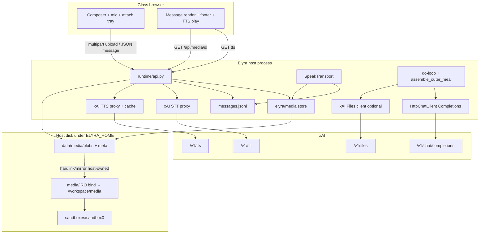
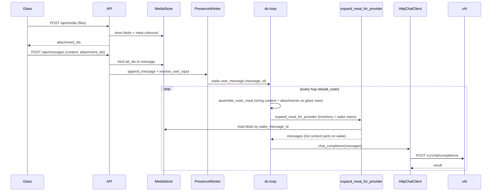
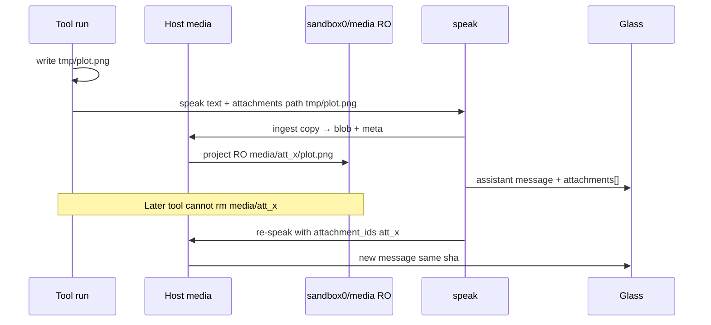
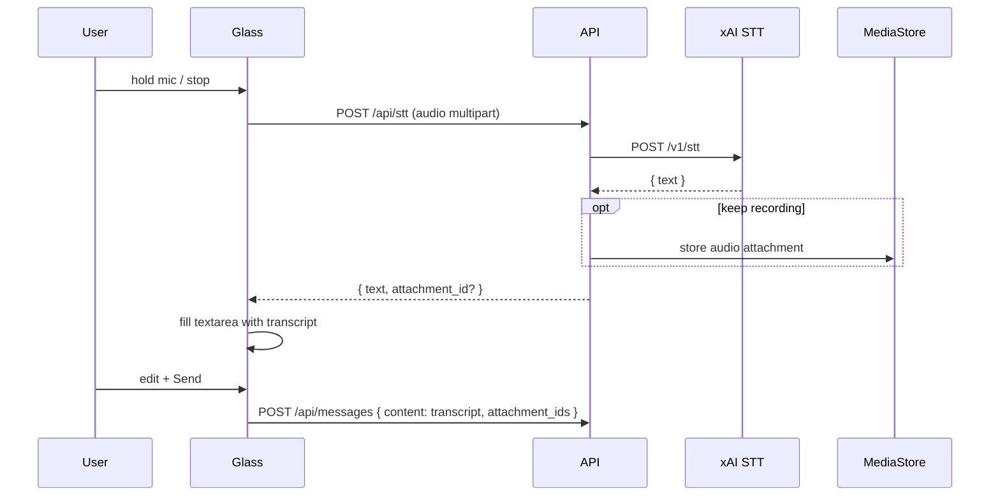
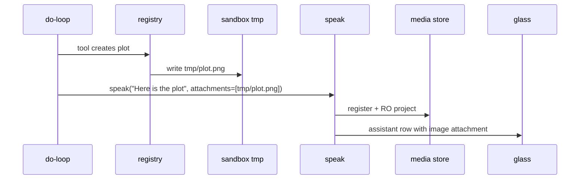
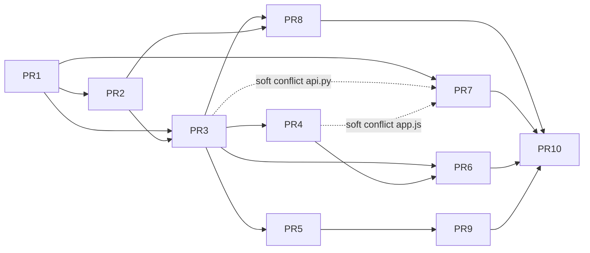

# Design: Enrich glass chat — STT, TTS, attachments (in/out), sandbox-visible write-protected media

| Field | Value |
|-------|--------|
| **Product** | project-elyra |
| **Author** | Grok Build design pass |
| **Date** | 2026-07-26 |
| **Status** | Engineer-ready (rev2; approved) |
| **Branch base** | `grok-improvement` (tip includes remove-Gemma stack; product default xAI Grok) |
| **Primary surfaces** | Glass (`elyra/runtime/web/*`), API (`elyra/runtime/api.py`), messages, speak transport, sandbox mounts, xAI client |
| **Related designs** | Glass Aurimago polish, remove-Gemma, Stretch 1, continuous work / reset |

---

## Overview

Glass today is **text-first**. The composer already has an attach tray (`pendingAttachments`) but only serializes a **text inventory** into the message body — no binary bytes, no vision, no STT, no TTS, and no durable attachment records. The model message shape is a flat `content: str` on `messages.jsonl` rows; `SpeakTransport.deliver` writes assistant rows with text only; the sandbox host tree is `sandboxes/sandbox0/{lib,general,fixtures,tmp,tools}` with RO seed + RW work dirs.

This design enriches glass into a **multimodal operator console**:

1. **STT** — record (or upload) audio → host proxies `POST https://api.x.ai/v1/stt` → transcript becomes chat text (optional audio kept as attachment).
2. **TTS** — play button on messages synthesizes **saved text only** via host-proxied `POST https://api.x.ai/v1/tts`; cache by `(message_id, voice_id, language, output_profile)` so the LLM message is never regenerated.
3. **Attachments in** — user files/images/audio uploaded to a durable host store, linked from the message, and routed into Grok as vision (`image_url` parts) and/or Files API (`attachment_search`) as appropriate.
4. **Attachments out** — Elyra may attach tool-produced or chat media; glass renders them; durable store is **visible inside the sandbox** but **write/delete-protected** from guest/sandbox FS ops so tools cannot wipe chat media and Elyra can re-send the same attachment later.

**Core product invariant:** attachment **records** (metadata + host bytes) are the durable truth; markdown embeds (``) are **views**. No orphan base64-only media in message bodies. TTS is **not** a second chat message.

---

## Background & Motivation

### Current state (code anchors)

| Area | Path / symbol | Today |
|------|----------------|-------|
| Message model | `elyra/messages.py` `Message` | `id, role, content, user_id, created_at, reasoning, moment_id` — **no attachments** |
| Glass history meal | `elyra/loop/context.py` `_glass_to_history` | Maps `content` → OpenAI string; strips reasoning |
| Chat post | `api.py` `_post_messages` | Body `{ content, user_id }` only; `append_message_if_allowed` |
| Speak | `elyra/speak/transport.py`, `tools/builtin/social.py` `speak` | Text → `append_message("assistant", …)` |
| Attach UI | `app.js` `pendingAttachments`, `buildAttachmentInventory` | UI-only; inventory text disclaimer |
| Markdown | `app.js` `renderMarkdown` | Images only `https?:` or `data:image/`; **no** `attachment:` scheme |
| LLM | `elyra/llm/client.py` `HttpChatClient` | Chat Completions; `content` pass-through (string or list already partially coerced on **response**) |
| Credentials | `elyra/llm/auth.py` | Host-only Bearer; never status/browser |
| Sandbox mounts | `elyra/sandbox/paths.py` `MOUNT_SPEC`; `fake.py`/`mount_fingerprint` iterate it; **`client_msb.py` hardcodes five volumes** (does not iterate `MOUNT_SPEC`) | RO: lib/general/fixtures; RW: tmp/tools — live MSB drift risk if only MOUNT_SPEC is edited |
| Product FS | `elyra/sandbox/sandbox.py` | Path jail under `sandboxes/sandbox0`; host tools can write anywhere under root |
| Reset | `elyra/runtime/reset.py` `clear_sandbox` / `clear_messages` | Clears RW tmp/tools + messages; does **not** yet clear a media store |

### Pain

1. Operator cannot show Elyra a screenshot or PDF and get real multimodal reasoning.
2. Voice input/output are missing; product intent is first-class glass media, not a separate app.
3. Tool-generated plots/files cannot appear as rich chat media with durable re-send.
4. If media lived only under `tmp/`, sandbox tools/`run` could delete it — breaking re-attach and glass history.

### xAI ground truth (this design’s API map)

| Capability | Endpoint / mechanism | Notes for Elyra |
|------------|----------------------|-----------------|
| **STT** | `POST https://api.x.ai/v1/stt` multipart (`file` or `url`); WS streaming available | Max ~500 MB; host proxy only |
| **TTS** | `POST https://api.x.ai/v1/tts` JSON `{ text, voice_id, language }`; raw audio bytes | Max **15k chars** unary; cache strongly recommended; host proxy only |
| **Vision** | Chat content parts with image URL / data URL | jpeg/png (typical); size budget ~20 MiB class; not every binary is vision |
| **Files / docs** | Files API upload + attach → server-side `attachment_search` agentic workflow | PDF/code/csv/json/txt/md; ~48 MB class; works with agentic models |
| **Imagine** | Separate image generation API | **Stub only** this pass |
| **Chat path** | Docs prefer Responses API for some file flows; Completions still serve vision | **Stay on Completions for core loop** when possible; Files attach may need Responses or Completions file-attachment shape — see integration strategy |

---

## Goals & Non-Goals

### Goals

1. Normative **message + attachment schema** (JSONL-compatible, forward-compatible memory stubs).
2. **Glass** render matrix: image / audio / video / file; markdown `attachment:` resolve; always-on attachments footer.
3. **STT** path: mic (and optional file) → host STT → transcript as chat text; optional keep recording as attachment.
4. **TTS** path: play on message → host TTS of saved text → cache; never re-call the chat LLM.
5. **Inbound** attachments stored durably, served via glass API, injected into Grok (vision vs files).
6. **Outbound** attachments from speak / tools; durable + glass-visible.
7. **Sandbox-visible, write-protected** media mount so tools can *see* chat media but cannot delete/overwrite host truth.
8. Security: size/mime limits, path jail, no API keys in browser, auth on media URLs.
9. Incremental **PR plan** green after each PR; Stretch 2 memory fields stubbed only.

### Non-goals

| Non-goal | Note |
|----------|------|
| Full Stretch 2 memory graph / real embeddings | Stub `embedding_status` / `embedding_ref` only |
| Full Grok Imagine productization | Host stub endpoint + glass “coming soon” only |
| Native Office convert (docx/xlsx/…) | Parked; document as future with other office formats |
| Bulk rewrite of frozen product docs | Optional later landing of a design copy under `docs/` |
| Local-provider multimodal | xAI-first; local provider **fail-closed** for vision/STT/TTS (clear error, no fake success) |
| Real-time speech-to-speech voice agent | Out of scope (xAI realtime WS exists; not this pass) |
| Streaming STT/TTS WebSockets in v1 | Unary REST only; WS later |
| Multi-sandbox media replication | Single primary `sandbox0` |

---

## Proposed Design

### Architecture summary



### Normative message + attachment schema

#### Message row (`data/messages.jsonl`)

Backward-compatible extension of `elyra/messages.py` `Message`:

```json
{
  "id": "uuid",
  "role": "user | assistant | system",
  "content": "markdown body; may embed attachment: refs",
  "user_id": "operator",
  "created_at": "ISO-8601",
  "reasoning": "",
  "moment_id": "uuid | null",
  "attachments": [
    {
      "id": "att_…",
      "kind": "image | audio | video | file | tts_cache",
      "origin": "user_upload | user_recording | tool | speak | stt_source | tts_cache | system",
      "filename": "plot.png",
      "mime": "image/png",
      "byte_size": 12345,
      "sha256": "hex",
      "created_at": "ISO-8601",
      "role_hint": "primary | inline | source | derived",
      "sandbox_relpath": "media/att_…/plot.png",
      "xai_file_id": null,
      "xai_file_expires_at": null,
      "source_message_id": null,
      "voice_id": null,
      "transcript_of": null,
      "embedding_status": "none",
      "embedding_ref": null
    }
  ],
  "meta": {
    "stt": { "used": false, "model": null },
    "input_mode": "text | voice | mixed"
  }
}
```

**Rules**

| Rule | Detail |
|------|--------|
| R1 | `content` is always a **string** (markdown). **User media-only sends are allowed**: empty/whitespace user text + non-empty `attachments` → store `content: ""` (or stripped empty). **Assistant (speak) always requires non-empty text** (caption required; see Speak policy). |
| R1b | **End-to-end empty-content contract** (see dedicated subsection): API accepts `content` empty iff `attachment_ids` non-empty; `_glass_to_history` keeps rows with non-empty content **or** non-empty `attachments`; meal-time inventory supplies model-visible text when `content` is empty; TTS of empty `content` returns 400 (no xAI call). |
| R2 | `attachments[]` is the **source of truth** for media inventory. Missing/`null` → treat as `[]` (legacy rows). |
| R3 | Inline markdown `` or `[name](attachment:<id>)` is a **view**; renderer resolves via message attachments or store lookup. |
| R4 | TTS audio is a **disk cache** under `data/media/tts/` keyed by `(message_id, voice_id, language, output_profile)` — **not** a second chat message. Optional `kind=tts_cache` attachment is discouraged for v1. |
| R5 | Stretch 2: every message/attachment is a *future* memory. **v1 stubs embedding fields on attachments only** (`embedding_status ∈ {none, pending, ready, failed}`, `embedding_ref` null). **Do not** add message-level embedding fields in this PR train (deferred to Stretch 2 design). |
| R6 | `tts_cache` attachments (if ever used) are **hidden** from the default footer inventory unless debug; play button uses TTS cache API first. |

#### Empty content / media-only contract (normative)

Today’s code drops empty rows and rejects empty posts/speaks. This design **locks option B** (allow empty user content with attachments) with explicit seam fixes:

| Surface | Contract |
|---------|----------|
| **Glass send** | Enable Send when `textarea.trim()` **or** `pendingAttachments.length > 0`. |
| **`POST /api/messages`** | Accept if `content.strip()` **or** non-empty `attachment_ids` (after validate ids exist + unbound-or-owned). Reject with `empty_content` only when both missing. Store user `content` as stripped string (may be `""`). |
| **`append_message` / worker** | Persist `attachments` on the same lock as content; never append attachments after enqueue. |
| **`_glass_to_history`** | Keep a row if `(content non-empty) OR (attachments non-empty)`. Empty-content media rows remain in the sliding history so `wake_message_id` protection and expansion can find them. Carry `id` when present. |
| **Meal inventory** | When building model messages, if content is empty, the host inventory block (Issue 3 format) is still the text part — model always sees at least inventory. |
| **Wake protection** | Prefer `wake_message_id` match; content-equality dedupe only when content non-empty. Empty media-only wakes rely on **id**. Meal path must **retain ids through expand** then strip before Completions wire (option A). |
| **Speak / assistant** | **Reject** empty/whitespace `text` even if attachments present (`empty_text`). Tools must supply a short caption (TOOL.md). No assistant image-only rows without caption. |
| **TTS** | `GET …/tts` requires `message.content.strip()` non-empty → else **400** `empty_text`; never call xAI. Media-only user messages have no playable TTS (hide play button when `!content.trim()`). |
| **Tests (PR1/PR3/PR5)** | Media-only user send → JSONL row with `content:""` + attachments → wake by id → meal includes trigger row + vision expand; two `rebuild_outer` calls yield same vision part count. |

#### Attachment store (host truth)

New package module (recommended): `elyra/media/` (not stuffed into `messages.py` — engineering principles: new capability → new module).

```text
$ELYRA_HOME/data/media/
  blobs/
    <sha256[:2]>/<sha256>          # content-addressed bytes (dedupe)
  meta/
    <att_id>.json                  # Attachment record (normative fields + bound_message_id)
  tts/
    <message_id>__<voice_safe>__<lang>__<profile>.mp3   # sanitized path components
    index.jsonl                    # optional secondary index
  by_message/
    <message_id>.json              # list of att_ids (optional index for serve)
  unbound/                         # optional: track unbound att_ids for GC (or field on meta only)
```

Content-addressed blobs + separate `att_id` allow the **same bytes** to be re-attached later under a new message without re-upload (re-send path).

**Meta ownership fields (normative additions):**

| Field | Meaning |
|-------|---------|
| `bound_message_id` | `null` after upload; set to message id on successful bind; never cleared except reset/GC |
| `created_at` | upload time (for unbound GC) |
| `uploader_user_id` | session user who uploaded (local operator default) |

##### Orphan upload policy (two-step)

1. `POST /api/media` creates meta with `bound_message_id: null` and projects RO mirror.
2. `POST /api/messages` with `attachment_ids` validates each id exists, is unbound **or** already bound to this message (idempotent), then sets `bound_message_id` under the worker lock **before** enqueue.
3. **Unbound GC (PR10, required acceptance):** process-local reconcile deletes unbound attachments older than **24h** or when unbound total bytes exceed **256 MiB** (oldest first). Full reset still wipes all media (KD13).
4. Uploads that fail mid-stream must not leave partial blobs without meta (temp-file + rename).

#### Attachment kinds & origins

| kind | Typical mime | Grok routing |
|------|--------------|--------------|
| `image` | image/jpeg, image/png, image/webp, image/gif | Vision content parts |
| `audio` | audio/webm, audio/wav, audio/mpeg, audio/ogg | STT first if user intent is transcript; else file inventory / Files if supported |
| `video` | video/mp4, video/webm | Footer + download; **no** vision this pass (stub render) |
| `file` | application/pdf, text/*, application/json, code | Files API attach / text extract |
| `tts_cache` | audio/mpeg | Not sent to model |

| origin | Meaning |
|--------|---------|
| `user_upload` | Composer attach / paste / drop |
| `user_recording` | Mic capture kept as attachment |
| `stt_source` | Audio that produced a transcript (may equal recording) |
| `tool` | Produced under sandbox (e.g. plot) then registered |
| `speak` | Explicit speak attachments |
| `tts_cache` | Synthesized play-cache |
| `system` | Host-generated (rare) |

### Glass UI

#### Composer

Extend existing `#attach-btn` / `#attach-input` / `#attach-tray` (`index.html`, `app.js`):

| Control | Behavior |
|---------|----------|
| **Attach (+)** | Multi-file; accept images, audio, pdf, text/code (keep current accept list; add audio). |
| **Mic** | New icon button; `MediaRecorder` → webm/opus; stop → optional STT auto-transcribe into textarea; chip in tray as `audio` with origin recording. |
| **Tray** | Real pending list: local `File`/`Blob` + object URL preview; on send → `FormData` multipart upload then `POST /api/messages` with `attachment_ids`. |
| **Limits (client)** | Max 8 attachments/message (already); per-file soft cap matching host (see Security). |

Replace `buildAttachmentInventory()` text hack in **PR4**: glass **stops** appending inventory prose to `content` once binary path is live (avoids polluting TTS source and display).

**Intermediate dual-path policy (PR3→PR5):**

| Phase | Glass `content` | Model-facing inventory |
|-------|-----------------|------------------------|
| PR3 only (glass still old) | May still append inventory text | Same text in content (legacy) |
| PR4+ (binary glass) | User text only (no inventory prose) | Host meal builder appends inventory from `attachments[]` (**not** written to JSONL) |
| PR5+ | Same | Inventory for history rows; full vision expand for wake |

**Never double-inventory:** if glass still sent inventory prose (legacy dogfood), meal builder detects a trailing `---\n**Attachments**` block and does not append a second block. Prefer PR4 landing before heavy dogfood.

#### Message render matrix

| kind | Body embed | Footer section |
|------|------------|----------------|
| image | `` for `attachment:` and safe https | Thumb + download |
| audio | Optional inline player if embedded | `<audio controls>` + download |
| video | Optional `<video>` if embedded | Player + download |
| file | Link if embedded | Icon + name + size + download |
| tts_cache | Hidden | Hidden (play uses TTS API) |

**Always** render an **Attachments** footer under each message when `attachments.length > 0` (excluding pure `tts_cache` unless debug). Footer is inventory; body embeds are convenience views.

**TTS play button** on every message with **non-empty** `content.trim()` (user + assistant):

- Click → `GET /api/messages/{id}/tts?voice=eve&language=en` (or POST) → blob URL → play.
- Spinner while generating; subsequent plays hit cache (304 / fast blob).
- **Hidden** when content is empty (media-only user rows).
- Does **not** call chat completion; does **not** create a new glass row.
- Assert in tests: TTS handler never constructs/`chat_completion`.

#### Markdown resolver changes (`renderMarkdown`)

Extend image/link allowlists:

```text
attachment:<att_id>     → /api/media/<att_id>
/api/media/<att_id>     → allowed same-origin
https?:…                → existing
data:image/…            → existing (discourage for new writes)
```

Reject `javascript:`, arbitrary `data:` non-image, path traversal in att ids.

### API / Interface Changes

#### New / extended HTTP endpoints (`elyra/runtime/api.py`)

| Method | Path | Purpose |
|--------|------|---------|
| `POST` | `/api/media` | Multipart upload → create attachment(s); returns `{ attachments: [...] }` |
| `GET` | `/api/media/{att_id}` | Stream bytes (`Content-Type` from meta); path-jailed; optional `Content-Disposition` |
| `GET` | `/api/media/{att_id}/meta` | JSON metadata only |
| `POST` | `/api/stt` | Multipart audio → xAI STT → `{ text, language?, duration? }` (optionally create attachment) |
| `GET`/`POST` | `/api/messages/{id}/tts` | TTS of **stored** message text; cache; returns `audio/mpeg` |
| `POST` | `/api/messages` | **Extend** body: `{ content, user_id, attachment_ids?: string[], meta?: {} }`. Accept empty content iff `attachment_ids` non-empty. |
| `GET` | `/api/messages` | Unchanged path; rows include `attachments` when present |
| `GET` | `/api/messages/{id}` | Optional convenience; same as `get_message` (PR1/PR7) — 404 if missing |
| `POST` | `/api/imagine` | **Stub** `{ ok:false, reason:"not_implemented" }` or 501 |

Multipart message alternative (optional single round-trip, **not** v1 required):

```http
POST /api/messages/multipart
Content-Type: multipart/form-data
fields: content, user_id, files[]
```

Prefer **two-step** (upload media → post message with ids) for simpler progress UI and STT reuse. Orphan policy + GC cover abandon-after-upload.

#### Upload size enforcement (before full body read)

`BaseHTTPRequestHandler` today reads entire bodies via `_read_json` with no cap. Normative for PR3+:

| Check | Rule |
|-------|------|
| **JSON posts** | Reject if `Content-Length` missing or `> 1 MiB` (messages/status JSON) **before** `rfile.read` |
| **Media / STT multipart** | Reject if `Content-Length` missing or `> product max` (max single-file + multipart overhead; **25 MiB audio / 20 MiB image / 48 MiB file**, overall **64 MiB** request) **before** full read |
| **Streaming** | Parse multipart with per-part running byte count to a **temp file** under `data/media/tmp/`; abort and delete temp if part exceeds kind cap |
| **Concurrency** | In-process: max **2** concurrent uploads (others 503 `upload_busy`) — local operator, not redis |
| **Timeouts** | Use existing server request handling; document that stdlib `http.server` is not production-hardened — caps prevent OOM first |

Tests: oversized `Content-Length` returns 413 without allocating the claimed body.

#### Binding order (user message + wake)

Normative sequence under `PresenceWorker` lock where noted:

```text
1. Validate attachment_ids (exist, mime ok, unbound or same user)
2. append_message_if_allowed(role=user, content, attachments=resolved_metas, …)  # lock
3. Bind each meta.bound_message_id = msg.id (same lock or immediately after append before unlock)
4. resolve_user_input(content, user_id, message_id=msg.id, …)
5. Wake payload remains {content, user_id, message_id} — expansion loads glass row by message_id
```

**Expansion source of truth:** always `get_message(wake_message_id)` / glass row by id (fallback: `data/media/by_message/{id}.json` + meta). Never require attachments on the wake dict.

**Interject (in-moment user messages):** v1 **supports** attachments on interject the same way (append with attachments → interject buffer carries `message_id`; drain injects text content into chain; full vision expand of interject attachments is **best-effort** — expand if meal rebuild can resolve id, else inventory text only). Explicit test: interject with image does not crash; vision expand of interject is optional stretch, not PR5 blocker.

#### Message append API (Python)

Extend `append_message` / `append_message_if_allowed`:

```python
append_message(
    role, content, *,
    user_id=...,
    reasoning=...,
    moment_id=...,
    attachments: list[dict] | None = None,
    meta: dict | None = None,
    paths=...,
)

get_message(message_id: str, *, paths=...) -> dict | None
# v1: scan messages.jsonl (acceptable). 404 at API if None.
# Note: large logs may need an id index later — out of scope.
```

Worker lock still gates append during reset (`PresenceWorker.append_message_if_allowed`).

#### Speak tool schema

Extend `tools/bundled/speak/schema.json` (additive, `additionalProperties: false` update):

```json
{
  "type": "object",
  "properties": {
    "text": { "type": "string" },
    "user_id": { "type": "string" },
    "attachment_ids": {
      "type": "array",
      "items": { "type": "string" },
      "description": "Host attachment ids already registered (sandbox media or prior upload)"
    },
    "attachments": {
      "type": "array",
      "description": "Optional declare-by-sandbox-path (host copies into media store)",
      "items": {
        "type": "object",
        "properties": {
          "path": { "type": "string", "description": "Sandbox-relative path, e.g. tmp/plot.png" },
          "filename": { "type": "string" },
          "kind": { "type": "string" }
        },
        "required": ["path"]
      }
    }
  },
  "required": ["text"],
  "additionalProperties": false
}
```

`SpeakTransport.deliver` gains optional attachments list; still sole production path for assistant glass rows.

**Speak empty-text policy:** `text` remains **required** and must be non-empty after strip — even when attachments are present. Transport keeps `empty_text` rejection. Product rationale: glass always has a caption; tools that only produce a plot invent one sentence.

**TOOL.md example (PR8):**

```markdown
# After writing tmp/plot.png
speak(
  text="Here is the plot from the run.",
  attachments=[{"path": "tmp/plot.png"}]
)
# Do not call speak with empty text + only attachments — host rejects.
```

#### New tool (recommended): `register_media` / or speak-only path

Prefer **speak path + host helper** first:

- Tools write files under `tmp/` (existing).
- Model calls `speak` with `attachments: [{ path: "tmp/plot.png" }]` **and** a short caption.
- Host copies into `data/media/blobs` (try `os.link` hardlink same FS, else `shutil.copy2`), writes meta, mirrors into RO `media/`, attaches to glass row.

Optional later: dedicated `attach_media` tool if speak becomes overloaded.

#### STT / TTS host clients

New module(s) under `elyra/media/` (preferred) with thin auth injection:

##### STT

```python
# defaults pinned in config
stt_path: str = "/stt"
stt_model: str = "grok-stt"          # multipart field model=
stt_language: str | None = None      # omit unless product sets

class SttResult:
    text: str
    language: str | None
    duration_s: float | None
    raw: dict                     # defensive parse; never log full raw in prod

def transcribe(file_path_or_bytes, *, filename: str, mime: str) -> SttResult:
    # multipart: fields model (+ optional language) BEFORE file (xAI streamable upload note)
    # parse JSON: prefer response["text"]; accept alternates defensively
    # map HTTP 4xx/5xx → structured error_reason (stt_http_N, stt_empty_text, …)
```

Tests mock a fixture shaped like live xAI JSON `{"text": "…"}` (update if docs add fields).

##### TTS

```python
tts_path: str = "/tts"
tts_default_voice: str = "eve"
tts_default_language: str = "en"     # xAI requires language (or auto)
tts_output_profile: str = "mp3_24k_128"  # maps to codec/sample_rate/bit_rate

def synthesize(text: str, *, voice_id: str, language: str, output_profile: str) -> bytes:
    # refuse if not text.strip() or len(text) > 15000
    # POST JSON; return raw audio bytes

# Cache key (normative):
#   (message_id, voice_id, language, output_profile)
# Path: data/media/tts/{safe(message_id)}__{safe(voice_id)}__{safe(language)}__{safe(profile)}.mp3
# safe() = re.sub(r"[^A-Za-z0-9._-]+", "_", s)[:80]
```

`files_path: str = "/files"` when PR9 lands.

Local profile: methods return structured `provider_unsupported` — glass shows notice; no silent fake audio/transcript.

### Data Model Changes

| Store | Change |
|-------|--------|
| `data/messages.jsonl` | Optional `attachments`, `meta` fields |
| `data/media/**` | New durable media store |
| `sandboxes/sandbox0/media/` | Host-owned mirror, RO guest mount |
| TTS cache | `data/media/tts/` |
| Reset | `clear_messages` also clears `data/media` **or** clear media with messages flag (default **yes** with full reset); never leave orphan glass refs |

Full reset (`reset.py`):

- Add `clear_media(paths)` wiping `data/media/**`.
- Re-ensure empty `sandboxes/sandbox0/media/` after clear (like seed dirs).
- Do **not** put media under RW `tmp/` as sole copy.

### How attachments enter the Grok prompt

#### Integration strategy (concrete)

**Stay on Chat Completions** (`HttpChatClient` + `POST /v1/chat/completions`) for the do-loop core.

##### Expansion seam (every hop — normative)

Glass JSONL **never** stores base64. Multimodal wire shape is built only in memory.

**Code fact (today):** `assemble_outer_meal` strips internal ids before return:

```python
# elyra/loop/context.py (current)
clean_history = [{"role": m["role"], "content": m["content"]} for m in history]
return [system_msg, *clean_history, orient_msg]
```

Without a correlation contract, `expand_meal_for_provider(meal, …)` cannot map meal rows → glass `attachments[]` when `content` is empty (media-only) or when captions collide.

###### Correlation strategy (normative — **option A**)

| Step | Contract |
|------|----------|
| 1. Assemble with ids | Media path uses **`assemble_outer_meal(..., retain_ids=True)`** (or sibling `assemble_outer_meal_for_media`) that keeps `id` on history rows after budget drop — **same** slide/protect/dedupe logic as today. Default `retain_ids=False` preserves current wire behavior for non-media callers/tests. |
| 2. Expand by id | `expand_meal_for_provider` correlates each meal history row to glass via **`msg["id"]` → glass row / `get_message` / attachments**. Wake full expand targets the row whose `id == wake_message_id`. Inventory for every history row that has a resolvable id + attachments. |
| 3. Strip before wire | Immediately before `chat_completion`, **`strip_meal_wire_fields(messages)`** drops `id` (and any other host-only keys) so Completions payload is only `role`/`content` (content may be list parts). |
| 4. Empty content | Media-only rows remain in history when retain_ids path also keeps empty+attachments rows (R1b); expand locates them by id, not content equality. |

**Rejected for v1:** option B (re-walk glass and re-implement slide in expand — dual budget logic drift); option C (stuff attachments into meal intermediate — leaks shape into more call sites). Expand may still receive `glass_rows` as a lookup table keyed by id, but must **not** re-apply sliding independently of assemble.

```python
# elyra/media/prompt.py (new) + context.py retain_ids

def assemble_outer_meal_with_media(...) -> list[dict]:
    meal = assemble_outer_meal(..., retain_ids=True)  # system + history(with id) + orient
    expanded = expand_meal_for_provider(
        meal,
        glass_by_id=index_glass(glass_rows),  # id -> full row incl. attachments
        wake_message_id=...,
        media_store=...,
        provider=...,             # xai | local
        expand_last_user_images=False,
    )
    return strip_meal_wire_fields(expanded)  # drop id before HTTP

def expand_meal_for_provider(messages, *, glass_by_id, wake_message_id, media_store, provider) -> list[dict]:
    """Pure-ish: returns NEW message list. Idempotent for same inputs.
    Invoked inside every rebuild_outer. Correlates via msg['id'] only.
    """

def strip_meal_wire_fields(messages: list[dict]) -> list[dict]:
    """role + content only (content may be str or multimodal list)."""
```

| Rule | Detail |
|------|--------|
| **When** | On **every** `rebuild_outer` / outer meal assembly before `chat_completion` |
| **What expands fully** | Protected **wake** user row with `id == wake_message_id` (vision parts + text extracts). Optional last user turn: off by default in v1 |
| **What gets inventory only** | All other history rows with resolvable id + `attachments` (user **and** assistant) |
| **Rows without id** | system/orient: leave as-is; history rows missing id after retain_ids path: inventory skip + log once (should not happen for glass-sourced rows) |
| **JSONL** | Unchanged — string `content` + `attachments[]` only |
| **Idempotence** | Two rebuilds for the same wake must produce **identical vision part counts** and inventory strings (unit-tested) |
| **Local provider** | Skip vision data URLs; inventory + fail-closed notice text only |
| **PR ownership** | **`retain_ids` + strip helper:** land in **PR5** (with expand) *or* a thin **PR5a** context change merged immediately before PR5 — not deferred past expand. Unit tests for retain_ids in `tests/test_loop_context.py` + expand correlation in PR5. |
| **Required test** | Two consecutive media-only user rows (`content:""`, different att_ids); wake = second; expand attaches vision **only** for wake’s images and inventory for **both**, without swapping |

Worker wiring: every rebuild runs `assemble_outer_meal_with_media` (or assemble retain_ids → expand → strip). Do **not** expand once and stash mutated messages across hops without re-running expand after re-outer. Do **not** call expand on a meal that already stripped ids.

##### Meal-time inventory format (KD6 — normative)

Applied **only** in `expand_meal_for_provider` / history walk — **never** written back to `messages.jsonl`, **never** used as TTS source (TTS reads JSONL `content` only).

For each history/wake row with attachments after filtering out `kind=tts_cache`:

```text
{original content string, may be empty}

[attachments]
- {att_id}	{filename}	{kind}	{mime}	{byte_size}	{sandbox_relpath or "-"}
```

Example (media-only user message):

```text

[attachments]
- att_a1b2	screenshot.png	image	image/png	184422	media/att_a1b2/screenshot.png
```

| Rule | Detail |
|------|--------|
| Separator | Exactly one blank line then `[attachments]` header |
| Columns | tab-separated: id, filename, kind, mime, byte_size, sandbox_relpath |
| Exclude | `tts_cache` kinds |
| Assistant media | Same format so model can re-attach by id/path |
| Budget | Inventory text is included in `estimate_messages_tokens` **before** vision expand; vision parts estimated separately (see below) |
| Double-inventory guard | If `content` already ends with a legacy glass inventory disclaimer block, skip append |

##### Vision expand (wake row)

Replace that user message’s `content` string with a **list of parts** (Completions / OpenAI-style):

```json
{
  "role": "user",
  "content": [
    { "type": "text", "text": "<content + inventory block as text>" },
    {
      "type": "image_url",
      "image_url": { "url": "data:image/png;base64,..." }
    }
  ]
}
```

Host builds data URLs from local blobs. Cap: **4 images** per request; total decoded image bytes **≤ 20 MiB**.

##### Documents — two-tier with hard fallback

| Tier | When | Behavior |
|------|------|----------|
| **A. Text extract (always)** | text/*, small code, md, json, csv under **256 KiB**; also best-effort extractors for PDF when available without new hard deps | Inline fenced text with filename header into the **text** part |
| **B. Files API (optional)** | PDF or large docs after smoke verification | Host uploads via Files API; store `xai_file_id` + expiry; attempt Completions attach shape only if verified with tools still working |

**PR9 acceptance (locked):**

1. Tier A always works for supported text and any successful extract.
2. Files upload + persist `xai_file_id` may land even if wire-attach is off.
3. Completions **attach shape** must be verified against live xAI (smoke) **with tool-calling still enabled**.
4. If attach is incompatible with tool-calling Completions → ship **extract + inventory only** for PDFs (inventory notes `file pdf not_inlined`); **no** silent fail; **no** full Responses migration in PR9. Responses helper = explicit follow-up PR only.

##### Token estimation for expanded meals

Current `estimate_messages_tokens` undercounts list content / images.

| Component | Estimate |
|-----------|----------|
| String content / inventory | existing `len//4` |
| Each image part | fixed **1024 tokens** heuristic (or `min(1024, byte_size//750)`) — document as approximate |
| Sliding history budget | Apply drop policy on **string inventory history** (pre-vision). Vision expand runs **after** slide selection on the protected wake row so dropped history never carries base64 |
| Provider 413 | On HTTP 413, log and surface fail; do not infinite-retry with same payload |

##### Audio

| User intent | Behavior |
|-------------|----------|
| Mic default | STT → transcript is `content`; audio attachment optional |
| Explicit “listen to this audio” | Keep audio as attachment; inventory (+ Files only if tier B proven) |

##### Local provider

Multimodal expansion skipped; inventory + notice that vision/STT/TTS require xAI; fail-closed.

#### Prompt construction flow



### Sandbox: visible but write-protected media

#### Problem

Chat media must be:

1. **Visible** to Elyra tools (`list_dir`, `read_file` for text, plots as files).
2. **Protected** from `write_text`, `search_replace`, `run` rm, and guest MSB RW mounts wiping history.

#### Concrete layout

| Layer | Path |
|-------|------|
| Host truth | `$ELYRA_HOME/data/media/blobs/…` + `meta/…` |
| Sandbox mirror | `$ELYRA_HOME/sandboxes/sandbox0/media/<att_id>/<filename>` |
| Guest mount | `/workspace/media` → host `media/` **readonly=True** |

Update `MOUNT_SPEC` in `elyra/sandbox/paths.py` — **single source of truth** for guest binds:

```python
MOUNT_SPEC: tuple[tuple[str, str, bool], ...] = (
    (f"{GUEST_WORKSPACE_ROOT}/lib", "lib", True),
    (f"{GUEST_WORKSPACE_ROOT}/general", "general", True),
    (f"{GUEST_WORKSPACE_ROOT}/fixtures", "fixtures", True),
    (f"{GUEST_WORKSPACE_ROOT}/media", "media", True),  # NEW RO
    (f"{GUEST_WORKSPACE_ROOT}/tmp", "tmp", False),
    (f"{GUEST_WORKSPACE_ROOT}/tools", "tools", False),
)
```

##### PR2 required refactor: derive live MSB volumes from `MOUNT_SPEC`

Today `client_msb.py` `_create_kwargs` **hardcodes** five `Volume.bind` entries; `fake.py` and `mount_fingerprint` already iterate `MOUNT_SPEC`. A PR that only edits `MOUNT_SPEC` can pass fake tests while live guests **lack** `/workspace/media`.

**Normative:**

```python
# client_msb.py — build volumes from MOUNT_SPEC
volumes = {
    guest: Volume.bind(str(root / host_rel), readonly=readonly)
    for guest, host_rel, readonly in MOUNT_SPEC
}
```

**Regression test (required):** create kwargs / fake create must contain **every** `MOUNT_SPEC` guest path with matching `readonly` flags (including `/workspace/media` True).

`mount_fingerprint` already uses `MOUNT_SPEC` — after PR2, fingerprint change forces recreate **and** recreate kwargs include media.

##### Seed / always-dirs / snapshot

| Constant / policy | Change |
|-------------------|--------|
| `_PRIMARY_ALWAYS_DIRS` / seed ensure | Add **`media`** (empty dir on ensure) |
| `_SNAPSHOT_EXCLUDE_TOP` | Add **`media`** (like `tmp`/`tools`) so projection churn does not skew `workspace_snapshot_hash` |
| chmod policy | `media/` dir `0o755`; projected files `0o444` |
| Full reset | Clear `sandbox0/media/**` contents (keep dir); clear `data/media` via `clear_media` |

#### Protection layers (defense in depth)

| Layer | Mechanism | Threat covered |
|-------|-----------|----------------|
| **L1 Guest MSB** | RO bind of `media/` via MOUNT_SPEC-driven volumes | Guest cannot write/delete via virtio mount |
| **L2 Path policy in `Sandbox` FS tools** | Central `assert_mutable` denies **`media/` only** (v1) for all mutators | Host FS tools cannot mutate chat media even without MSB |
| **L3 Host truth** | Canonical blobs only under `data/media/`; mirror is disposable projection | Mirror loss → re-project from meta |
| **L4 `run` residual** | same-UID `run` may still `rm` host paths | Residual risk **Medium** — document; optional later deny-list |

**Central mutability helper (normative — media-only in v1):**

```python
# sandbox.py
def is_media_protected_relpath(self, user_path: str) -> bool:
    """True if path resolves under media/ (chat media projection).
    v1: do NOT treat lib/general/fixtures as host-tool write-denied —
    guest MSB already RO-binds those; host-stub may still write seed dirs
    (existing dogfood/tests). Broaden only with an explicit product decision.
    """

def assert_mutable(self, user_path: str) -> None:
    if self.is_media_protected_relpath(user_path):
        raise PermissionError("media_readonly")  # mapped to error_reason=media_readonly
```

All FS mutators call `assert_mutable` **before** write: `write_text`, `search_replace`, `_atomic_write_text`, and any future delete API.

- `read_file` / `list_dir` / `grep` **allowed** under media (binary → decode_error OK).
- Host-stub writes under `lib/` / `general/` / `fixtures/` remain allowed (guest still RO via MSB bind) — existing trust boundary, not this feature’s scope.
- Tests: write_text/search_replace under `media/` fail with `media_readonly`; write under `fixtures/` still succeeds on host-stub; document `run rm media/...` residual if still possible under host-stub.

#### Mirror algorithm

On attachment create (upload, speak register, tool harvest):

1. Write blob to content-addressed store (if new sha) via temp + rename.
2. Write `meta/<att_id>.json` (`bound_message_id` null until bind).
3. Project: `sandboxes/sandbox0/media/<att_id>/<safe_filename>`:
   - **try** `os.link(blob, dest)` (same filesystem under `ELYRA_HOME` is usual);
   - **except** `OSError` → `shutil.copy2` then `chmod 0o444`.
4. Set `sandbox_relpath` on meta.
5. Unit tests may force the copy path (mock `os.link` raise).

On full reset: wipe `data/media` + `sandbox0/media`.

On process start / ensure (PR10): **reconcile** — re-project missing mirror files from meta; GC unbound attachments per orphan policy.

#### Re-send path

Elyra re-sends without threat of loss:

1. Model references `attachment_id` or `sandbox_relpath` from prior tool output / glass inventory.
2. Host validates id exists in `data/media/meta`.
3. New message (speak) links **same blob** (new attachment record optional, or reuse att_id if product allows shared ids across messages — **prefer new att_id pointing at same sha** for per-message inventory clarity, same bytes).



### Sequence diagrams (required paths)

#### 1. User upload → model

(See “Prompt construction flow” above.)

#### 2. STT path



#### 3. TTS play

```mermaid
sequenceDiagram
  participant U as User
  participant G as Glass
  participant A as API
  participant C as TTS cache
  participant X as xAI TTS

  U->>G: click Play on message
  G->>A: GET /api/messages/{id}/tts?voice=eve&language=en
  A->>A: get_message(id); reject if !content.strip()
  A->>C: lookup (id, voice, language, profile)
  alt cache hit
    C-->>A: bytes
  else miss
    A->>X: POST /v1/tts { text, voice_id, language }
    X-->>A: audio/mpeg bytes
    A->>C: store under sanitized path
  end
  A-->>G: audio/mpeg
  G->>U: play Audio element
  Note over G,X: No chat_completion; no new glass row
```

#### 4. Tool produces file → glass



#### 5. Re-send same attachment

Model calls speak with `attachment_ids: ["att_…"]` already in store → host validates → glass message lists same inventory → optional re-upload to xAI Files if previous `xai_file_id` expired.

### Glass render + CSS notes

- Reuse attach-chip patterns from polish design; audio player compact bar.
- TTS button in `.msg .meta` or trailing toolbar; accessible `aria-label="Play message"`.
- Recording state: pulse on mic (reuse activity pulse tokens).
- Do not block Aurimago gold polish work — media CSS is additive.

### Imagine stub

```python
# POST /api/imagine
{"ok": false, "reason": "imagine_not_enabled", "hint": "Grok Imagine deferred"}
```

Glass: if ever exposed, disable button with tooltip. No model tool required this pass.

---

## Alternatives Considered

| Alternative | Why not (now) |
|-------------|----------------|
| **Base64 only in `content`** | Orphans, bloats JSONL, no sandbox visibility, no re-send integrity |
| **Media only under `tmp/`** | Tools/`run` can wipe; violates protection invariant |
| **COW copy into guest RW** | Guest can delete; host truth still needed — RO bind is cleaner |
| **Full migrate do-loop to Responses API** | Large rewrite; Completions already wired for tools; prefer incremental file helper if required |
| **Browser-direct xAI STT/TTS** | Exposes API keys — forbidden |
| **TTS as second assistant message** | Pollutes glass history and moments; user explicitly rejected |
| **Streaming STT/TTS v1** | Higher complexity; unary meets glass play/record |
| **Symlink media into fixtures/** | Confuses seed snapshot hash; dedicated mount is clearer |

---

## Security & Privacy Considerations

| Control | Spec |
|---------|------|
| **API keys** | Never to browser; STT/TTS/Files/Chat use host `elyra.llm.auth` Bearer only |
| **Media serve** | `GET /api/media/{id}` — att_id must match `^[A-Za-z0-9_-]+$` (or uuid); resolve only under `data/media`; no path concat of user filenames into serve root |
| **Upload limits** | Per-file: images 20 MiB; audio 25 MiB; files 48 MiB; total per message/request 64 MiB; max 8 files. **Enforce Content-Length before body read**; stream parts to temp with running counts |
| **MIME sniff** | **Stdlib magic-byte table only** for PR1–3 (PNG/JPEG/GIF/WEBP/PDF/WAV/RIFF-WEBM/…); do **not** add required runtime deps (`charset-normalizer`/`filetype` not in `pyproject.toml`). Unknown → kind `file` or reject disallowed. Never trust client `Content-Type` alone for kind |
| **Filename sanitization** | Strip path components; max 200 chars; replace `..` |
| **TTS text** | Only from stored message `content` for that id; empty content → 400; cache key includes language + profile; path-safe voice ids |
| **STT** | Process-local rate limit (PR10); max product audio **25 MiB** / ~10 min wall; never accept xAI’s 500 MB product-side |
| **Rate limits (PR10)** | In-process token buckets, e.g. **10 STT/min**, **20 TTS/min** per process; exceed → HTTP **429** JSON `{ok:false, reason:"rate_limited"}`. No redis |
| **CSP / markdown** | Keep markdown sandbox: no arbitrary data: non-image; no javascript: |
| **Auth model** | Glass is local-operator trust (existing); media URLs are same-origin. **If the API ever binds non-localhost**, media GET must not be world-reachable without auth (session/token) — multi-user scope by `user_id` deferred |
| **Privacy** | Audio/images leave host to xAI for STT/vision/files — document in UI hint; do not log raw media or Bearer tokens |
| **Orphans** | Unbound upload GC (24h / 256 MiB); full reset clears all media |
| **Reset** | Clearing chat clears media by default (no silent retention of user uploads after full reset) |

### Risks

| Risk | Severity | Mitigation |
|------|----------|------------|
| Same-UID `run` deletes `media/` despite RO mount | Medium | L2 FS deny; RO MSB; document residual; optional run path deny-list later |
| JSONL row size growth with many attachment metas | Low | Metas are small; blobs out-of-line |
| Vision token blowup in history | High | Expand full images only for wake; inventory elsewhere; fixed image token heuristic |
| xAI Files id expiry | Medium | Re-upload on demand; store `xai_file_expires_at` |
| TTS 15k char limit | Low | Truncate with notice or multi-chunk concatenate cache |
| Mount fingerprint change requires sandbox recreate | Medium | Lifecycle already recreates on fp mismatch after ready |
| Multipart body DoS / OOM | High | Content-Length pre-check + streamed temp + concurrent upload cap |
| Unbound upload disk fill | Medium | GC policy PR10; reset clears |
| Files attach incompatible with tools Completions | Medium | PR9 hard fallback to extract+inventory |

---

## Observability

| Signal | Where |
|--------|-------|
| `media.upload` / `media.serve` / `media.denied` | host logs (no paths with secrets) |
| `stt.ok` / `stt.fail` latency_ms | logs + optional status activity chip “transcribing…” |
| `tts.cache_hit` / `tts.generate` | logs |
| `grok.vision_parts` count / `grok.files_attached` | loop beat optional |
| Status JSON | optional `media: { bytes_total, count }` — no filenames with PII required |
| Glass activity trail | kinds: `stt`, `tts`, `upload` (short labels) |

Never log: Bearer tokens, full base64, raw transcripts of private audio beyond debug flag.

---

## Rollout Plan

1. Land schema + store + RO mount **before** glass depends on them.
2. Wire upload + message attachments (text inventory still works if model expansion lags).
3. Glass render + footer.
4. Grok vision expansion on wake.
5. STT + mic UX.
6. TTS + cache + play button.
7. Speak attachments + tool harvest.
8. Files API tier for PDFs.
9. Imagine stub + polish.

**Feature flags:** Multimodal code paths ship **always present** once merged (no soft-launch default-off). Optional env kill switches for emergencies only:

```text
ELYRA_MEDIA=0          # emergency off: reject upload/expand (default: on / unset = on)
ELYRA_STT=0
ELYRA_TTS=0
ELYRA_VISION=0
```

Unset or `1` = enabled. Fail-closed when provider ≠ xAI for STT/TTS/vision regardless of flags.

---

## Open Questions

All product questions from the conversation are **resolved** for this design. Remaining are implementation-detail defaults (not blockers):

| Item | Default if unstated |
|------|---------------------|
| Default TTS voice | `eve` |
| Default TTS language | **`en`** (not `auto` for cache stability) |
| TTS output profile | `mp3_24k_128` |
| Shared att_id across re-sends vs new id same sha | **New att_id, same sha** |
| Multipart single-shot message API | Defer; two-step first + orphan GC |
| PDF on Completions with tools | Extract + inventory if Files attach unproven; Responses helper = follow-up PR only |
| Empty user content + attachments | **Allowed** (R1b); speak still requires caption |
| Interject vision expand | Best-effort; not PR5 blocker |

No unresolved product open questions.

---

## References

### Code

- `elyra/messages.py` — Message dataclass / JSONL
- `elyra/speak/transport.py` — sole assistant glass write path
- `elyra/tools/builtin/social.py` — `speak`
- `elyra/runtime/api.py` — `_post_messages`, static glass
- `elyra/runtime/web/app.js` — `pendingAttachments`, `renderMessages`, `renderMarkdown`
- `elyra/runtime/web/index.html` — composer attach controls
- `elyra/loop/context.py` — `_glass_to_history`, `assemble_outer_meal`
- `elyra/loop/doloop.py` — `chat_completion` hop
- `elyra/llm/client.py` — `HttpChatClient` Completions
- `elyra/llm/config.py` — `XaiClientConfig` base_url `/v1`
- `elyra/llm/auth.py` — credential resolution
- `elyra/sandbox/paths.py` — `MOUNT_SPEC`, path jail
- `elyra/sandbox/client_msb.py` — volume binds
- `elyra/sandbox/sandbox.py` — host FS tools
- `elyra/runtime/reset.py` — clear_messages / clear_sandbox
- `tools/bundled/speak/schema.json`

### External

- xAI STT: `POST https://api.x.ai/v1/stt`
- xAI TTS: `POST https://api.x.ai/v1/tts` (15k char unary; cache recommended; never browser-direct)
- xAI Files / chat-with-files / image understanding docs
- Responses API preferred in docs for some flows — Completions retained for Elyra tool loop

### Product docs

- `docs/engineering-principles.md` — new capability → new module
- Glass polish design (visual tokens; media CSS additive)

---

## Key Decisions

| ID | Decision | Rationale |
|----|----------|-----------|
| **KD1** | Attachments are first-class structured fields on messages; blobs live in `data/media/` content-addressed store | Avoids JSONL bloat and orphan base64; enables re-send and sandbox projection |
| **KD2** | Markdown `attachment:` embeds are views; `attachments[]` is durable truth | Footer always lists inventory; embeds cannot invent media |
| **KD3** | TTS is play-on-message with disk cache keyed by `(message_id, voice_id, language, output_profile)`; not a new chat message; never regenerates LLM text; empty content → 400 | Matches product requirement; avoids stale cache across language/format; saves xAI TTS cost |
| **KD4** | STT runs on host proxy; transcript becomes message `content`; recording optional attachment; default model `grok-stt` | Mic → text is primary UX; audio retained when useful |
| **KD5** | Stay on **Chat Completions** for do-loop; expand vision as `image_url` parts on wake; text-extract always; Files attach only if smoke-proven with tools — else extract+inventory; Responses helper = follow-up only | Minimizes rewrite; prevents PR9 soft-block |
| **KD6** | History meal uses **meal-time inventory text** (fixed format, not written to JSONL, not TTS source); full multimodal only for protected wake | Protects token budget; avoids polluting glass/TTS |
| **KD7** | Sandbox media via **RO bind** `/workspace/media` + host `assert_mutable` **media/ only** + canonical `data/media/` | Visible + delete-protected; do not broaden host deny to seed RO dirs in v1 |
| **KD8** | Speak gains optional `attachment_ids` / sandbox-path attach; **text still required** (caption); remain sole assistant glass writer | Preserves speak transport ownership + caption UX |
| **KD9** | Local provider fail-closed for STT/TTS/vision | Product is xAI-first post-Gemma removal |
| **KD10** | Imagine is stub only this pass | Explicit non-goal productization |
| **KD11** | Office/docx convert parked | Non-goal; PDF/code/images first |
| **KD12** | Stretch 2: **attachment-only** embedding stubs (`embedding_status` / `embedding_ref`); no message-level embedding fields in this train | Future memory without pipeline or schema churn |
| **KD13** | Full reset clears `data/media` with messages; unbound GC for mid-session orphans | No silent private retention |
| **KD14** | New module `elyra/media/` for store + STT/TTS + prompt expand helpers | Engineering principles: no god-module growth in `api.py` / `messages.py` |
| **KD15** | Max product limits: 8 files/msg; image 20MiB; audio 25MiB; file 48MiB; TTS 15k chars; enforce before full body read | Align with xAI + prevent OOM |
| **KD16** | Re-send creates new att_id pointing at same sha (or reuses id if already on message) | Clear per-message inventory without duplicating bytes |
| **KD17** | `MOUNT_SPEC` is sole volume source for fingerprint, fake, **and** `client_msb` create kwargs; media RO volume included | Prevents live MSB without `/workspace/media` |
| **KD18** | No API keys in browser; all xAI multimodal via host | Security non-negotiable |
| **KD19** | User media-only (empty content + attachments) allowed end-to-end; `_glass_to_history` keeps attachment rows; speak still rejects empty text | Matches image-only UX without breaking meal/wake id protection |
| **KD20** | `expand_meal_for_provider` runs on **every** `rebuild_outer`; glass JSONL stays string+attachments; no base64 in store | Multi-hop vision correctness without double-write bloat |
| **KD25** | Meal **retain_ids through expand**, strip ids immediately before `chat_completion` (option A); expand correlates only by message id | Fixes clean_history id strip; media-only and caption-collision inventory |
| **KD21** | MIME classification via stdlib magic bytes only for v1 — no new required deps | Matches zero-runtime-deps pyproject culture |
| **KD22** | `media/` in always-dirs; excluded from workspace snapshot hash; cleared on reset | Seed/snapshot semantics stay stable |
| **KD23** | Orphan uploads: `bound_message_id` null until bind; GC unbound >24h or >256 MiB unbound | Disk/privacy hygiene without forcing multipart one-shot |
| **KD24** | Multimodal paths default-on once merged; env flags are emergency kill switches only | Avoid ambiguous soft-launch matrix |

---

## PR Plan

Ordered PRs; each leaves `pytest -q` green and dogfoodable.

### PR1 — Media store + message schema (no glass multimodal yet)

| | |
|--|--|
| **Title** | media: attachment store + message.attachments schema |
| **Files / components** | `elyra/media/` (new: store, types, path helpers); `elyra/messages.py`; `elyra/presence/worker.py` `append_message_if_allowed`; `elyra/runtime/reset.py` `clear_media`; `elyra/config.py` ensure dirs; `tests/test_messages.py`, `tests/test_media_store.py`, `tests/test_reset.py` |
| **Depends on** | — |
| **Description** | Normative Attachment record + content-addressed blob store under `data/media/` (`bound_message_id`). Extend Message JSONL with optional `attachments`/`meta`. Add `get_message(id)` (JSONL scan). Reset clears media. `_glass_to_history` keeps rows with attachments even if content empty (unit tests). No HTTP multipart yet. Legacy rows still load. Fixtures dir scaffold `tests/fixtures/media/` (1×1 png) optional in PR1. |

### PR2 — Sandbox RO `media/` mount + FS write protection

| | |
|--|--|
| **Title** | sandbox: RO media mount + write deny |
| **Files / components** | `elyra/sandbox/paths.py` `MOUNT_SPEC` + always-dirs + snapshot exclude; **`client_msb.py` refactor volumes from MOUNT_SPEC**; `fake.py`; `workspace_seed.py` chmod/ensure `media/`; `sandbox.py` `is_readonly_relpath`/`assert_mutable` on all mutators; `tools/builtin/files.py` error mapping; `tests/test_sandbox*.py`, `tests/test_tools_fs.py`, isolation tests |
| **Depends on** | PR1 (projection helpers may live in media package) |
| **Description** | Guest `/workspace/media` readonly. **Required:** live MSB volumes derived from `MOUNT_SPEC` (not hardcoded). Regression: create kwargs contain every MOUNT_SPEC guest+readonly. Host `assert_mutable` **denies media/ only** (not lib/general/fixtures). Projection try-hardlink-except-copy. Snapshot excludes `media`. Fingerprint recreate covered with fake lifecycle. |

### PR3 — Upload + serve API; extend POST /api/messages

| | |
|--|--|
| **Title** | api: media upload/serve + message attachment_ids |
| **Files / components** | `elyra/runtime/api.py`; `tests/test_api_glass.py`, `tests/test_api_routing.py` |
| **Depends on** | PR1, PR2 |
| **Description** | `POST /api/media`, `GET /api/media/{id}`, message post accepts `attachment_ids` (empty content OK with ids), bind order under lock, projects sandbox RO. **Content-Length pre-check** + streamed temp uploads; stdlib magic MIME. Tests: media-only post, oversized Content-Length 413, path jail serve. Glass may still send inventory text until PR4. |

### PR4 — Glass: real attach tray, render matrix, footer, markdown `attachment:`

| | |
|--|--|
| **Title** | glass: durable attachments render + composer upload |
| **Files / components** | `elyra/runtime/web/app.js`, `index.html`, `style.css`; optional API tests for fixtures |
| **Depends on** | PR3 |
| **Description** | Replace inventory-text hack with upload+id flow (no inventory prose in content). Render images/audio/files; footer inventory; resolve `attachment:`. Accept audio. Send enabled for media-only. No mic/TTS yet. Host meal inventory remains source of model inventory (PR5). |

### PR5 — Grok vision expansion on wake (+ text extract for small files)

| | |
|--|--|
| **Title** | llm/loop: multimodal wake expansion for images + small files |
| **Files / components** | `elyra/loop/context.py` `retain_ids` + history keep-attachments; `elyra/media/prompt.py` (`expand_meal_for_provider`, `strip_meal_wire_fields`); worker `rebuild_outer` wire; token heuristics; tests |
| **Depends on** | PR3 (PR4 nice-to-have for dogfood). **Blocked until** empty-content + inventory format contracts implemented. **`retain_ids` lands in this PR (or immediate PR5a before expand)** — not later |
| **Description** | Assemble with `retain_ids=True` → expand by message id → strip ids before Completions. Inventory by id for all attachment rows; full vision only for wake_message_id. Text extract tier A. Local fail-closed. Tests: two rebuilds same vision counts; **two media-only rows, wake=second, no swap**; no base64 in JSONL; wire payload has no `id`. Use `tests/fixtures/media/` png. |

### PR6 — STT proxy + mic UX

| | |
|--|--|
| **Title** | media/glass: STT proxy + composer mic |
| **Files / components** | `elyra/media/stt.py` or `elyra/llm/stt.py`; `api.py` `POST /api/stt`; `app.js`/`index.html` mic button; auth wiring; tests with mocked HTTP |
| **Depends on** | PR3, PR4 |
| **Description** | Host `POST /v1/stt` with `model=grok-stt`; defensive JSON parse; glass MediaRecorder → transcript into composer; optional keep audio. Size caps before read. xAI only. Mock fixtures from response shape. |

### PR7 — TTS proxy + cache + play button

| | |
|--|--|
| **Title** | media/glass: TTS play + cache (message_id, voice, language, profile) |
| **Files / components** | `elyra/media/tts.py`; `api.py` TTS route (+ soft-conflicts with PR3/PR4 on `api.py`/`app.js`); `app.js` play control; `get_message`; cache under `data/media/tts/`; tests |
| **Depends on** | **PR1** (store/get_message). Soft-conflicts / coordinate with **PR3/PR4** on shared files. Backend TTS endpoint mergeable without mic/attach UI |
| **Description** | Load saved text only; empty → 400; cache key complete; sanitized paths; no chat_completion; no new glass rows; 15k guard. Hide play when !content. |

### PR8 — Speak attachments + tool-produced media path

| | |
|--|--|
| **Title** | speak: attachment_ids + sandbox path ingest |
| **Files / components** | `tools/bundled/speak/schema.json`, `TOOL.md`; `elyra/tools/builtin/social.py`; `elyra/speak/transport.py`; media ingest-from-sandbox; `tests/test_speak.py` |
| **Depends on** | PR1–PR3 (PR2 projection) |
| **Description** | Assistant outbound media; tool writes `tmp/…` then speak with **caption** + path attach; RO project try-link/copy; re-send by id. TOOL.md example. Reject empty text. |

### PR9 — Files API tier for PDFs / large docs + Imagine stub

| | |
|--|--|
| **Title** | llm: xAI Files attach for docs + Imagine stub |
| **Files / components** | `elyra/media/xai_files.py`; prompt expansion tier B; `api.py` `POST /api/imagine` stub; tests mocked |
| **Depends on** | PR5 |
| **Description** | **Locked acceptance:** (1) text-extract always; (2) Files upload + `xai_file_id` storage; (3) Completions attach only if smoke proves tools still work; (4) else extract+inventory only — no Responses migration. Imagine stub. Sample pdf fixture. |

### PR10 — Hardening: limits, reconcile, activity chips, docs touch (optional)

| | |
|--|--|
| **Title** | media: reconcile, observability, limit polish |
| **Files / components** | media reconcile on ensure; status optional counters; activity trail kinds; brief `prompts/system.md` note on multimodal speak; tests |
| **Depends on** | PR2–PR9 as landed |
| **Description** | Reconcile mirrors; **unbound GC** (24h / 256 MiB); process-local STT/TTS rate limits (429); activity chips; optional system.md multimodal note; no frozen-doc bulk rewrite. |

---

### Dependency graph



**Parallelism note:** After PR3, glass (PR4), vision (PR5), and TTS (PR7) can proceed in parallel (coordinate `api.py`/`app.js` merges for PR7). STT (PR6) wants PR4 mic UI; speak (PR8) needs PR2 projection. **Do not land PR5** before empty-content + history-keep-attachments + inventory format contracts (PR1/PR3 + context changes).

### Test fixtures (all media PRs)

Add tiny hermetic binaries under `tests/fixtures/media/`:

| File | Use |
|------|-----|
| `1x1.png` | upload, serve Content-Type, vision expand, path jail |
| `tiny.wav` or minimal webm | STT mock input size path |
| `sample.pdf` | extract / Files tier (PR9) |

Explicit negatives: media_readonly write, oversized Content-Length, empty TTS, serve unknown att_id 404, no `chat_completion` in TTS unit test.

---

### Revision history

| Rev | Date | Notes |
|-----|------|-------|
| 0 | 2026-07-26 | Initial design |
| 1 | 2026-07-26 | Address design review: empty-content contract; expand every rebuild_outer; meal inventory format; MOUNT_SPEC-driven MSB volumes; orphan GC; pre-read size caps; PR9 Files hard fallback; STT/TTS contracts; stdlib MIME; always-dirs/snapshot; assert_mutable; get_message; PR deps; intermediate inventory; flags; embedding stubs; hardlink; media auth note; speak caption; token heuristic; rate-limit mechanism; fixtures |
| 2 | 2026-07-26 | Residual review: meal **retain_ids → expand → strip** (KD25); `assert_mutable` **media/ only** (not seed RO dirs) |

---

*End of design.*
