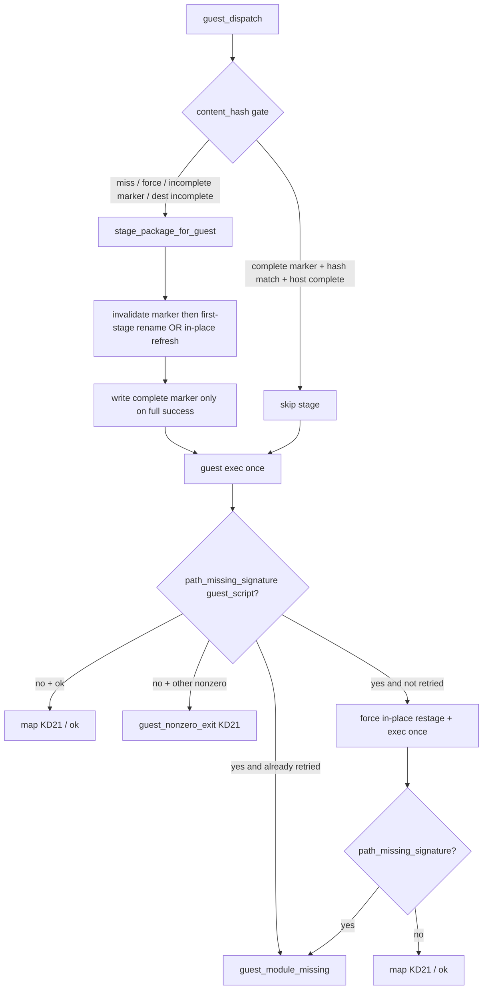

# Design: Guest package stage reliability for all self-made tools

| Field | Value |
|-------|--------|
| **Document** | Guest package stage reliability (stage-once / content-hash gate, in-place restage, reactive retry, verify smoke load) |
| **Author** | Design (Grok Build) |
| **Date** | 2026-07-27 |
| **Status** | Draft (revised post-review) |
| **Product** | project-elyra (Stretch 1 / capability-growth + integrity stack) |
| **Branch** | `grok-improvement` |
| **Workspace** | `/home/jim/Workspace/project-elyra` |
| **Dogfood refs** | Moment `afce4e4d-678f-4ed5-b0e9-e50106709021` (calculator ×7 batch); same class as earlier local `web_search` guest flakes |
| **Related** | [harness-sandbox-fitness.md](grok-improvement-plan/harness-sandbox-fitness.md) (KD10 stage-copy, single-writer, atomic stage), [design-capability-integrity-run-search-browser-sandbox.md](design-capability-integrity-run-search-browser-sandbox.md) (web_search local-delete pattern), [design-tool-thrash-recovery.md](design-tool-thrash-recovery.md), [create-tool/SKILL.md](../skills/bundled/create-tool/SKILL.md), [tools-and-skills.md](tools-and-skills.md) |
| **Durable path** | `docs/design-guest-package-stage-reliability.md` |
| **Out of scope** | Guest browser; converting all tools to host builtins; product-default `tool_choice=required` |

---

## Overview

Self-made tools (`sandbox_python` / `sandbox_shell` under `tools/{local,bundled,drafts}/`) are executed by **staging** the package into the guest-visible tree (`sandboxes/sandbox0/tools/<name>/` → guest `/workspace/tools/<name>/`) and then running inside the warm microsandbox. Today **every** guest invoke re-stages via rename-swap. Under multi-call pressure in a single do-loop hop (serial batch), the **first** invoke succeeds and subsequent invokes fail with guest `FileNotFoundError` for the staged module — mapped as opaque `guest_nonzero_exit`.

This is **not** bad calculator math. It is a **class hole in guest package staging / visibility** that every future `create-tool` package inherits.

**One-sentence outcome:** Guest-staged packages stage once per content hash (re-stage only when bytes change), refresh in place without top-level rename thrash, recover once from guest-missing-path with an honest error reason, and fail closed earlier at `verify_tool` when isolation is on — so multi-call thrash cannot turn a healthy package into a cascade of opaque exits.

---

## Background & Motivation

### Live dogfood evidence (`afce4e4d-678f-4ed5-b0e9-e50106709021`)

| Fact | Detail |
|------|--------|
| Tool | Local package `tools/local/calculator` (`runner.json`: `kind=sandbox_python`, `module=impl.calculator`) |
| Registry | Local wins over bundled (`elyra/tools/registry.py` reload) |
| Hop | One model hop fired **7× `calculator`** (+ web_search) in one `tool_calls` batch |
| Loop | Do-loop executes tools **serially** (`elyra/loop/doloop.py` `_handle_tool_batch` → `_execute_one`) |
| 1st call | **ok** — `executor_backend: microsandbox`, correct math (`54939 * 0.0087` → `477.9693`) |
| Next 6 | **fail** — `error_reason: guest_nonzero_exit`, stderr: |
| | `FileNotFoundError: … '/workspace/tools/calculator/impl/calculator.py'` |
| Timing | ~250 ms between serial failures — not a slow-FS “sleep longer” problem |
| Post-mortem host tree | `sandboxes/sandbox0/tools/calculator/impl/calculator.py` **present** after the moment |
| Args differ | Expressions differed (FX conversions) — thrash `skip_identical` would **not** have blocked this batch |

Same class as earlier local `web_search` (`sandbox_python` DDG Lite) intermittent `guest_nonzero_exit` / staging flakes before that package was removed in favor of the host builtin (capability-integrity PR1). Deleting calculator alone would only hide one instance; **create-tool defaults remain `sandbox_python` / `sandbox_shell`**.

**Thrash policy is not the fix here:** multi-arg calculator batches are **legitimate** product behaviour. Existing thrash recovery (`tool_thrash_policy`, optional `skip_identical`) keys on identical failing fingerprints and would not cover different expressions. Soft skill “prefer one rich call” is manners only; the **hard stage gate** is what keeps legitimate multi-call batches reliable.

### Current architecture (verified in tree)

```mermaid
sequenceDiagram
  participant Loop as DoLoop serial batch
  participant Reg as ToolRegistry.execute
  participant Disp as runner.dispatch
  participant Guest as guest_dispatch
  participant Stage as stage_package_for_guest
  participant MSB as microsandbox guest

  Loop->>Reg: calculator × N
  Reg->>Disp: package_dir=tools/local/calculator
  Disp->>Guest: isolation on
  Guest->>Stage: ALWAYS re-stage
  Note over Stage: copy → tools/.stage/name.pid.token/<br/>rename dest→.old; work→dest; rmtree .old
  Guest->>MSB: python3 -c load /workspace/tools/calculator/impl/…
  MSB-->>Guest: 1st OK; later FileNotFoundError
  Guest-->>Loop: guest_nonzero_exit (opaque)
```

| Component | Path | Behaviour today |
|-----------|------|-----------------|
| Stage | `elyra/tools/guest_exec.py` `stage_package_for_guest` | Symlink-hardened copy into `tools/.stage/<name>.<pid>.<token>/`, then rename-swap into `tools/<name>/` |
| Dispatch | `guest_dispatch` | **Always** calls `stage_package_for_guest` before `_guest_python` / `_guest_shell` |
| Module path | `resolve_module_file` (host package) → `guest_module_path` | Guest script path built from **host** resolution; assumes stage tree matches |
| Runner | `elyra/tools/runner.py` `dispatch` | Isolation on → `guest_dispatch`; off → `host_stub_dispatch` (no stage) |
| Mount | `elyra/sandbox/paths.py` `MOUNT_SPEC` | Guest `/workspace/tools` ← host `sandboxes/sandbox0/tools` (**RW bind**) |
| Return map | `map_python_exec_result` KD21 | Any non-zero exit → `guest_nonzero_exit` (includes import FileNotFoundError) |
| Verify | `elyra/tools/verify.py` | Stages draft under `tools/.verify/<name>/`; guest pytest; host-side `resolve_module_file` shape check only — **no guest smoke load of runner module** |
| Single-writer | PresenceWorker + serial tool batch | Concurrent same-name stage races **out of scope v1** (harness KD10) |
| Content hash | `elyra/tools/verify.py` `content_hash` | SHA-256 of package file bytes (excludes `.verify.json`) — used for promote gates; **import cycle with `guest_exec`** (verify imports guest_exec at module load) |

### Best-supported mechanism under serial re-stage pressure

`stage_package_for_guest` (when `dest` already exists):

1. Build full tree under `tools/.stage/<name>.<pid>.<token>/`
2. `os.rename(dest, backup)` — **live guest path disappears** (inode/dir name replaced)
3. `os.rename(work, dest)` — new directory inode appears as `tools/<name>/`
4. `_safe_rmtree(backup)`

On a **bind-mounted** guest volume, repeatedly replacing the top-level package directory is far more aggressive than “refresh files.” Live evidence is a **strong correlation**, not a traced MSB dentry/inode instrument:

- unconditional rename-swap every call
- first call OK, immediate serial guest FNF on the staged module path
- host post-mortem still has the file

**Best-supported mechanism / smoking gun under serial re-stage pressure:** thrashing the top-level package dentry via rename-swap between serial guest opens. Alternate mechanisms (guest path cache lag, bind visibility lag) lead to the **same** prescriptions: stop unnecessary top-level rename thrash; hash-skip; in-place updates when refresh is required; one honest retry — **not** “sleep longer.”

v1 design assumption (harness):

> Single-writer; atomic replace preferred for crash safety; concurrent races out of scope.

That assumption **does not** authorize unconditional re-stage on every serial call. Serial multi-call is the **normal** model batch pattern. When we move updates to in-place refresh, crash safety **moves** from “atomic dir replace” to “marker must not claim complete until the tree is complete” (see §1b).

### Class blast radius

| Surface | Risk |
|---------|------|
| All `sandbox_python` local/bundled packages | Multi-call batches flake after first success |
| All `sandbox_shell` packages | Same stage path; argv cwd = staged package |
| `create-tool` growth path | Defaults to sandbox runners — **every new tool inherits the hole** |
| Model thrash recovery | Opaque `guest_nonzero_exit` looks like tool logic failure; thrash policy cannot fix legitimate multi-arg batches |
| Operator trust | Model finishes FX by hand and apologizes for calculator — capability looks broken |

### Operator intent (conversation constraints)

| Priority | Direction |
|----------|-----------|
| **Hard** | Stage-once-per-package (re-stage only if content hash changes) |
| **Hard** | Optional guest existence check + **one** retry before opaque `guest_nonzero_exit` |
| **Hard** | Guest smoke load of module on `verify_tool` when isolation on |
| **Soft** | Skill guidance — prefer one call with richer args; don’t thrash N identical package loads |
| Optional | Selective host builtins for kernel tools (search done; calculator optional) — **not** a substitute for fixing guest stage |

Soft Decide hybrid: hard for **channel integrity** (stage/exec); soft for multi-call thrash manners. Do **not** invent product-default `tool_choice=required`.

---

## Goals & Non-Goals

### Goals

1. **Eliminate multi-call stage thrash** for all guest-staged packages: if host package content is unchanged and dest already stages that hash, **skip** re-stage.
2. **Crash-safe refresh:** when re-stage is required and dest exists, refresh **in place** with marker invalidation so incomplete trees are never skippable.
3. **Honest recovery (reactive MVP):** when guest cannot open the resolved **guest_script** path, force re-stage **once**, re-exec **once**, then fail with `guest_module_missing` (not bare `guest_nonzero_exit`).
4. **Earlier fail-closed at verify:** when isolation is on, `verify_tool` guest-smoke-loads the declared `sandbox_python` module under the **verify** stage tree (importability / path resolution) so hollow packages never promote as green. **Not** a substitute for production N-dispatch stage-gate tests.
5. **Class fix only** — no calculator-only special case required for correctness (optional host builtin remains a product choice).
6. **Tests** that would have failed on the dogfood pattern: N serial guest dispatches of the same package with unchanged bytes must all succeed without N rename-swaps; re-stage forced only on hash change / force.
7. **Soft skill text** so models prefer batched args over N identical package loads (manners, not the integrity wall).

### Non-Goals

| Non-goal | Why |
|----------|-----|
| Guest browser | Separate design |
| Making all tools host builtins | Host builtins stay separate; growth tools stay guest-staged |
| Unlimited re-stage every call “fixed by sleeping longer” | Wrong root cause; adds latency and more rename thrash |
| Deleting calculator only | Leaves the class hole for every future create-tool package |
| Parallel multi-worker stage locking | PresenceWorker single-threaded; serial batches only in v1 |
| Product-default `tool_choice=required` | Explicit constraint |
| Changing KD21 return map for real tool logic failures | Only reclassify **stage visibility** failures for the resolved guest_script |
| Hiding `.stage` / `.verify` from `list_dir` | Optional later; not required for reliability |
| Always-on guest preflight in v1 | Deferred micro-opt; reactive-only MVP (KD-G3) |
| Changing promote `content_hash` exclude set for pycache | Promote-gate behaviour change; document intent instead (see §1) |

---

## Proposed Design

### Architecture (target)



**Normative merge order (single source of truth):**

```text
PR1 hash-gate + package_hash extract
  → PR2 in-place restage (crash-safe marker protocol)
  → PR3 reactive retry + guest_module_missing
  → PR4 verify guest smoke
  → PR5 soft skills
  → (PR6 optional calculator host builtin)
```

**Hard rule:** PR3 (retry / force restage) **must not** land on main while force still top-level rename-swaps. Either PR2 is merged first, or PR1 folds in-place restage so force never uses rename-away of an existing dest.

### 1. Content-hash stage gate (hard, primary fix)

**Location:** `elyra/tools/guest_exec.py` — extend `stage_package_for_guest`.

**Hash implementation (hard — KD-G5):** extract `content_hash` (+ shared exclude constants for `.verify.json`) to **`elyra/tools/package_hash.py`** in **PR1**. Point `verify.py`, promote/package_vcs callers, and `guest_exec` at that single module.

Rationale: `verify.py` already imports `EXECUTOR_BACKEND_*` (and more) from `guest_exec` at module load — a normal `from elyra.tools.verify import content_hash` inside `guest_exec` is a **certain cycle**. Lazy import is fragile (partial init / test order). Duplicating the hash helper risks promote-gate drift (stale stage if hash wrong = **High** severity). Extraction is the default path, not a footnote.

**Algorithm (skip gate):**

```text
stage_package_for_guest(paths, package_dir, *, force: bool = False,
                        strip_verify_record: bool = False) -> Path:
  name = package_dir.name
  dest = sandboxes/sandbox0/tools/<name>/
  src_hash = content_hash(package_dir)   # from elyra.tools.package_hash; SOURCE only

  if not force and dest is real dir:
    marker = load_stage_marker(dest)  # None if missing/corrupt
    if (
      marker is not None
      and marker.schema_version == 1
      and marker.get("incomplete") is not True
      and marker.content_hash == src_hash
      and host_stage_looks_complete(dest, package_dir)
    ):
      return dest.resolve()   # SKIP mutate

  # mutate path — see §1b (never leave a complete marker on partial tree)
  perform_stage_or_refresh(...)
  # write complete marker ONLY after full success:
  write dest/.elyra_stage.json = {
    "schema_version": 1,
    "incomplete": false,
    "content_hash": src_hash,
    "staged_at": utc_iso,
    "package_name": name
  }
  return dest
```

#### `host_stage_looks_complete` (precise contract)

Read **source** `runner.json` (not dest’s possibly stale copy when checking completeness of dest tree):

| Source runner kind | Complete iff |
|--------------------|--------------|
| `sandbox_python` | `module` field present and safe; `resolve_module_file(dest, module)` returns a regular file |
| `sandbox_shell` | `dest` is a real directory; if `argv[0]` is a package-relative path (no leading `/`, no `..`), that path exists as a file under `dest`; otherwise (absolute cmd like `python3`) `dest` non-empty of payload files is enough |
| missing / invalid runner.json | **Not complete** → re-stage (fail closed toward refresh) |
| unknown kind | Treat like shell: dest is dir with ≥1 regular payload file (not only marker) |

If incomplete → treat as skip miss (re-stage). Do **not** use “≥1 file anywhere” alone for `sandbox_python` (module-only check is required).

#### Marker file rules

| Rule | Detail |
|------|--------|
| Name | `.elyra_stage.json` at package stage root |
| Hash field | Always `content_hash(**source** package_dir)` — never hash dest for the gate |
| Incomplete | `incomplete: true` or missing marker ⇒ **never skip** |
| Stage copy | Add `.elyra_stage.json` to `_STAGE_IGNORE_NAMES` so it is never copied from a polluted source; write marker only after successful stage/refresh |
| clear_sandbox / reset | Wipe of `sandboxes/sandbox0/tools` clears stages — correct cold start |
| Model visibility | Marker is visible via sandbox FS tools (honesty); document as runtime metadata |

#### Hash vs stage ignore (`__pycache__` / `.pyc`)

`content_hash` (promote + stage gate) hashes **all regular files** except `.verify.json`. Stage copy ignores `__pycache__`, `.pyc`/`.pyo`, `.stage`, `.verify`, and (new) `.elyra_stage.json`.

**Intentional mismatch, documented:** if a local package grows `__pycache__` on host (e.g. after host-stub import), source hash changes → restage. That is rare for clean packages and preferable to changing promote-gate hash excludes in this design (would alter verify/promote semantics). Guidance: keep packages free of `__pycache__` in source trees; stage already strips them from dest copies. **Do not** silently diverge stage-gate hash from promote hash.

#### Scope of skip

- Process-lifetime + on-disk marker (not merely in-memory moment cache). Survives across hops/moments while sandbox tree lives — correct under single-writer.
- Re-stage when: promote rewrites local package bytes, operator edits package, `force=True`, marker missing/corrupt/`incomplete`, dest incomplete, hash mismatch.

**Moment coupling:** “stage-once-per-package-per-moment” is satisfied **operationally** by the hash gate. Hash gate is **strictly better** than pure moment cache: mid-moment promote/edit still picks up new bytes.

### 1b. Safer restage — crash-safe in-place protocol (hard, KD-G2)

Harness KD10 preferred **atomic dir replace** for crash safety. In-place refresh is the right bind-mount tradeoff, so crash safety **moves** to the marker protocol:

> **An incomplete tree must never be skippable.** Marker claims complete only after the tree is complete.

#### Normative restage algorithm

```text
perform_stage_or_refresh(paths, package_dir, dest, src_hash, *, strip_verify_record):
  # 1) Invalidate any complete claim BEFORE mutate
  unlink dest/.elyra_stage.json if present
  # (optional equivalent: write {"schema_version":1,"incomplete":true} then proceed;
  #  unlink is enough — missing marker ⇒ never skip)

  if not dest.exists():
    # First stage: keep atomic-ish rename into place (KD10 spirit for create)
    work = tools/.stage/<name>.<pid>.<token>/
    symlink-hardened copy package_dir → work
    os.rename(work, dest)   # dest did not exist; no rename-away of live package
  else:
    # Update: NEVER os.rename(dest, backup) — preserve top-level dentry
    try:
      in_place_refresh(package_dir, dest, strip_verify_record=...)
      # symlink-hardened copy of each source file into dest
      # per-file: write to dest/<rel>.elyra_tmp.<token> then os.replace → dest/<rel>
      # prune: delete dest files/dirs not in source payload and not in keep-set
    except OSError:
      # leave marker absent (already unlinked); do not write complete marker
      raise   # guest_dispatch maps to stage_failed:<Exc>

  # 2) Write complete marker ONLY after full success (caller)
  write_complete_marker(dest, src_hash, ...)
```

#### In-place refresh details

| Concern | Rule |
|---------|------|
| **Symlink hardening** | Same refuse-symlinks rules as `_safe_copytree_into` |
| **Per-file atomicity** | Copy to sibling temp under same dir, then `os.replace` onto target — guest should not open truncated mid-write |
| **Prune set** | Delete dest paths not present in source payload after copy. **Keep-set (never prune as “orphan”):** `.elyra_stage.json` is rewritten by caller after success (absent during refresh). **Always prune:** `__pycache__`, `*.pyc`/`*.pyo`, stray `.verify.json` under dest, leftover source-deleted modules (e.g. stale `impl/old.py`) |
| **Marker during refresh** | Marker already unlinked at start — prune must not require marker; do not re-create complete marker until end |
| **Partial failure** | No rename-swap fallback in v1 (would reintroduce thrash). Leave dest as-is + marker absent → next call re-stages (cannot skip). Surface `stage_failed:<Exc>` to the current call |
| **First stage (no dest)** | `.stage/` work dir + rename into place remains correct (no live dentry to preserve) |

**Decision:** Ship hash-gate **and** in-place restage before force-retry (PR1 → PR2 → PR3). Combining PR1+PR2 in one PR is allowed if ≤~150–200 LOC and tests stay clear; numbering still documents the dependency.

**Do not** “fix by sleeping longer” between stage and exec.

### 2. Guest path-missing recovery — reactive-only MVP (hard, KD-G3)

**Location:** `_guest_python` (shell: reactive only on package-cwd / argv visibility; see below).

**PR3 MVP is reactive-only.** Always-on preflight is an optional later micro-opt (OQ1 closed for v1). Budget is **exactly one force re-stage + one extra exec**, shared across any detection path — no double force if preflight is added later.

#### Normative control-flow (`_guest_python`)

```text
stage_package_for_guest(..., force=False)   # hash gate; may skip
guest_script = resolved guest path for module  # from host resolve → guest_module_path
result = exec_once(runner_src using guest_script)

if path_missing_signature(result, guest_script) and not stage_retried:
    stage_package_for_guest(..., force=True)  # MUST use in-place if dest exists (PR2)
    stage_retried = True
    result = exec_once(...)

if path_missing_signature(result, guest_script):
    return ToolResult(
      ok=False,
      error_reason="guest_module_missing",
      payload={
        guest_path: guest_script,
        content_hash: src_hash,
        stage_retried: True,
        executor_backend: microsandbox,
        # stderr/stdout tails optional
      },
    )

return map_python_exec_result(...)   # KD21 for real tool failures
```

**Internal-only first failure:** the intermediate FileNotFound before force is **not** surfaced as a final ToolResult reason; only the post-retry outcome is returned.

#### `path_missing_signature` (precise)

Classify **only** when:

1. exit_code ≠ 0, and
2. stderr (or stdout) contains **`FileNotFoundError`** (or errno-2 phrasing), and
3. the resolved **`guest_script` string** appears as a substring (exact path used in `_guest_python_runner_source`).

**Do not** classify on arbitrary paths under `/workspace/tools/<name>/`. Tool-logic `FileNotFoundError` for other package data files continues to map KD21 `guest_nonzero_exit` (force restage once is **not** triggered). False-positive force on exact guest_script is the intended recovery; false-positive on other paths is avoided by the exact-path rule.

Dogfood stderr shape (verified):

```text
FileNotFoundError: [Errno 2] No such file or directory: '/workspace/tools/calculator/impl/calculator.py'
```

(Failure inside `spec.loader.exec_module` / `get_data` — not a host pre-check.)

#### Cross-call hazard (serial batch)

After PR1, hash-identical calls 2..N **skip** stage → stable top-level dentry — primary dogfood fix.

Residual: guest still misses `guest_script` on call *k* (bind lag / cache). Reactive force restage:

| Force path | Hazard |
|------------|--------|
| **Top-level rename-swap** | Recovery on call *k* can break *k+1…N* even though they skip after force — skip after a rename guest has not “settled” **is** the thrash class |
| **In-place refresh (required)** | Recovery mutates files without removing the top-level package dir → safe for the rest of the batch |

**Acceptance test (PR3):** N serial dispatches; Fake injects guest_script FileNotFound **only on call 2** → call 2 recovers via one force; calls 3..N ok **without** further force.

#### Shell runners

Minimum: reactive signature when stderr indicates missing file for a package-relative argv path under `guest_tools_package_path(name)`, same one-force budget. No always-on preflight in v1.

### 3. Error taxonomy (hard honesty)

| `error_reason` | When | Model-facing payload hints |
|----------------|------|----------------------------|
| `stage_failed:<Exc>` | Host stage/refresh OSError (existing + in-place failures) | unchanged |
| `module_not_found` | Host resolve fails before stage/exec (existing) | tried candidates |
| `guest_module_missing` | Guest cannot open **guest_script** after stage + **one** force retry | `guest_path`, `content_hash`, `stage_retried: true`, soft hint: “host stage ok; guest visibility failed” |
| `guest_stage_inconsistent` | After a **successful** stage/refresh API return, host re-check finds dest incomplete vs source runner expectations (should be rare if stage validates); surface once without claiming guest miss | `content_hash`, host paths checked; soft: re-promote / reinstall package |
| `guest_nonzero_exit` | True tool/process failure (KD21) — **not** used for guest_script FileNotFound after retries exhausted; **not** intermediate pre-retry FNF |

**Wiring:**

- Guest miss after force → **`guest_module_missing` only** (host may still look fine — dogfood post-mortem case).
- Host incomplete after stage claimed success → log WARNING; prefer re-entering force once if budget remains, else **`guest_stage_inconsistent`** (do not call this a guest visibility miss).
- First path-missing before retry → internal only.

Thrash recovery can key on distinct reasons later; no new HOST inject required here.

### 4. `verify_tool` guest smoke load (hard)

**Location:** `elyra/tools/verify.py` after draft stage / as part of isolation-on path.

**Scope clarity:** Runtime exec stages via `stage_package_for_guest` → `sandboxes/sandbox0/tools/<name>/`. Verify uses **separate** `stage_draft_for_verify` → `tools/.verify/<name>/` (its own rename-swap today; **not** the production hash gate). Guest smoke under `/workspace/tools/.verify/<name>/...` proves:

- guest can import the **verify-staged** draft tree
- module path resolution + importability before `.verify.json` is written

It is **not** an end-to-end regression for the dogfood production stage-once hole. **PR1 hermetic N-dispatch tests** (and dogfood multi-calc) remain the class gate for production staging.

When isolation **on** and runner kind is `sandbox_python`:

1. Existing: stage draft → `tools/.verify/<name>/`, guest pytest.
2. **Add:** guest smoke **before** pytest (fail-fast):

```text
# Resolve module under verify stage dir;
# guest path: /workspace/tools/.verify/<name>/<rel>
python3 -c '
  import importlib.util
  from pathlib import Path
  script = Path(<guest_script>)
  if not script.is_file():
    raise SystemExit(2)
  spec = importlib.util.spec_from_file_location("_elyra_verify_smoke", script)
  ...
  spec.loader.exec_module(module)   # parity with production loader
  fn = getattr(module, <function>, None)
  if fn is None or not callable(fn):
    raise SystemExit(3)
'
```

| Result | `error_reason` |
|--------|----------------|
| Guest path missing (exit 2) | `verify_guest_module_missing` |
| Import exception | `verify_guest_module_import_failed` (include stderr tail) |
| Function missing (exit 3) | `verify_guest_function_not_found` |
| Isolation down | existing `sandbox_unavailable` / `guest_pytest_unavailable` |

**Import side effects:** smoke uses `exec_module` like production dispatch — correct for “can guest load what dispatch loads.” Packages with import-time network/FS side effects will run at verify. Skill text (PR5): keep module import side-effect free (good practice already). Optional `Path.is_file()`-only check is **weaker** and must **not** replace import smoke if the goal is importability.

Isolation **off:** host smoke-import optional/cheap; do not claim guest visibility.

Smoke is **not** a substitute for pytest.

### 5. Soft skill guidance (soft)

Update `skills/bundled/create-tool/SKILL.md` (and lightly research/do-work if needed):

- Prefer **one** tool call with richer args over N identical package loads when possible — **manners only**.
- Legitimate multi-call batches (different args) must remain reliable via the **hard stage gate**; thrash policy is not the fix.
- On `guest_module_missing`, do **not** spam the same call; surface once and continue with alternate approach.
- Keep `sandbox_python` modules import side-effect free (verify smoke + production load).

Do **not** add a forever-on HOST inject solely for multi-calc thrash.

### 6. Optional: calculator host builtin (soft product, not integrity wall)

Same pattern as `web_search`: if calculator is kernel-stable, a host builtin avoids guest stage entirely. **Allowed** as follow-on; **must not** replace PR1–PR3. Document as optional PR6.

### Data model changes

| Artifact | Location | Purpose |
|----------|----------|---------|
| `.elyra_stage.json` | `sandboxes/sandbox0/tools/<name>/` (runtime only) | `{schema_version, incomplete?, content_hash, staged_at, package_name}` |
| Stage ignore | `_STAGE_IGNORE_NAMES` | Add `.elyra_stage.json` |
| `elyra/tools/package_hash.py` | new shared module | `content_hash` + exclude constants; single implementation |
| ToolResult payload keys | guest failures | `stage_retried`, `guest_path`, `content_hash`, `stage_skipped` (observability; bounded tails) |

No durable identity / goals schema changes. No registry schema changes.

### API / interface changes

| API | Change |
|-----|--------|
| `elyra.tools.package_hash.content_hash` | **New home** (PR1); `verify` re-exports or imports for compat |
| `stage_package_for_guest(..., force: bool = False)` | Skip path; marker invalidate/write protocol; in-place when dest exists (PR2) |
| `guest_dispatch` / `_guest_python` | Reactive path-missing budget (PR3) |
| `map_python_exec_result` | **No** special-case inside mapper; classify in `_guest_python` using `guest_script` signature |
| `verify_draft_tool` | Guest smoke step (PR4) |
| Test helpers | `stage_marker_path`, `read_stage_marker`, `path_missing_signature` exportable for tests |

Host builtins (`speak`, secrets, search, browser host path) unchanged.

### Observability

| Signal | Level | Notes |
|--------|-------|-------|
| `stage skipped name= hash=` | DEBUG | rate can be high |
| `stage wrote name= hash=` | INFO on force/hash miss only | avoid log spam |
| `stage incomplete / marker invalidated` | DEBUG | crash-recovery path |
| `guest_module_missing after retry` | WARNING | dogfood-class signal |
| Payload `stage_skipped` / `stage_retried` | ToolResult | glass / moments tape |

### Security & privacy

| Topic | Stance |
|-------|--------|
| Symlink hardening | Keep existing refuse-symlinks on stage/refresh |
| Marker file | Not secret; hash is of tool source bytes (already on disk under tools/) |
| Guest recovery | Same trust as tool exec; no new network |
| Path escape | Continue `resolve_module_file` / `is_safe_module_rel` |
| Isolation fail-closed | Unchanged KD6 — no silent host fallback when isolation on |

### Risks

| Risk | Severity | Mitigation |
|------|----------|------------|
| Stale stage after promote if hash wrong | **High** | Single `package_hash.content_hash`; promote-then-call tests |
| Crash mid in-place with complete marker left | **High** if ordering wrong | **Unlink marker first**; write complete marker only after full success; skip requires `incomplete is not true` |
| Incomplete tree skippable | **High** if complete check weak | `host_stage_looks_complete` requires module file for sandbox_python |
| Force rename-swap breaks later batch calls | **High** if PR3 before PR2 | Normative order PR2 before PR3; force uses in-place |
| In-place prune deletes needed files | **Med** | Prune only non-source payload; keep symlink rules; tests with stale `impl/old.py` |
| False positive path signature | **Low** | Match exact `guest_script` only |
| `__pycache__` on source changes hash | **Low** | Document; do not change promote excludes in this design |
| Verify smoke side effects | **Low** | Skill: import side-effect free; parity with production intentional |
| Multi-worker future races | **Low now** | Single-writer remains |
| Skill-only “fix” | **High if chosen alone** | Hard stage gate mandatory |

---

## Alternatives Considered

### Alt 1 — Host-builtin every flaky tool (calculator, etc.)

**Approach:** Delete guest package; ship host builtin like `web_search`.

| Pros | Cons |
|------|------|
| No stage path | Does not scale to create-tool growth |
| Proven pattern | Operator explicitly rejected as **substitute** |
| | Leaves hole for next local package |

**Rejected** as primary fix; optional for kernel tools only.

### Alt 2 — Re-stage every call + sleep / sync / drop_caches

**Approach:** Keep unconditional stage; `time.sleep` or guest `sync` after rename.

| Pros | Cons |
|------|------|
| Tiny code | Does not address root thrash; adds latency |
| | Unlimited re-stage still renames away live tree |
| | Explicit non-goal |

**Rejected.**

### Alt 3 — Stage once per process (in-memory set of names only)

**Approach:** `if name in _STAGED: skip` without content hash.

| Pros | Cons |
|------|------|
| Simple | Misses promote/edit mid-process |
| | Moment end does not clear process memory vs disk — inconsistent with reset |
| | Hash gate is almost as simple and correct |

**Rejected** in favor of content-hash marker.

### Alt 4 — Content-hash stage gate + in-place restage + reactive retry + verify smoke (this design)

| Pros | Cons |
|------|------|
| Fixes class for all growth tools | Marker protocol + shared hash extract |
| Honest errors; crash-safe skip | Slightly larger PR surface |
| Aligns with single promote hash | Need Fake sequenced tests |

**Chosen.**

### Alt 5 — Soft skill / thrash HOST only

| Pros | Cons |
|------|------|
| No sandbox code | Model still hits stage thrash when multi-call is **legitimate** (different FX expressions) |
| | Violates hard-for-channel-integrity hybrid |

**Rejected** as primary; retained as soft manners layer only.

### Alt 6 — Always-on preflight + reactive in v1

| Pros | Cons |
|------|------|
| Catches miss before tool body | Double latency; budget ambiguity with reactive |
| | Dogfood is reactive FileNotFound inside `exec_module` |

**Deferred** — reactive-only MVP; preflight optional later under same one-force budget.

---

## Rollout Plan

**Normative order (matches PR Plan numbers):**

1. **PR1** — Extract `package_hash`; stage hash gate + marker + skip path + tests.
2. **PR2** — Crash-safe in-place restage when dest exists (marker invalidation + write-after-success).
3. **PR3** — Reactive path-missing classification + one force re-stage + `guest_module_missing` (**requires PR2 on main**).
4. **PR4** — `verify_tool` guest smoke load when isolation on.
5. **PR5** — create-tool (and light skill) soft guidance.
6. **Optional PR6** — calculator host builtin (product polish, not required for close).

PR1+PR2 may combine if small; **PR3 must not land while force still rename-swaps existing dest.**

**Dogfood gate:** Re-run a multi-calc hop (or live_eval) with isolation on: N≥5 serial `calculator` (or fixture package) calls in one batch all `ok`. Confirm promote of a draft still re-stages when bytes change.

**Feature flags:** Not required if fail-closed and skip is correctness-preserving. If needed: `ELYRA_STAGE_HASH_GATE=0` emergency re-stage-every-call (default on).

---

## Open Questions

| ID | Question | Default if unresolved |
|----|----------|------------------------|
| OQ1 | Always-on preflight? | **Closed for v1:** reactive-only MVP. Preflight later only under shared one-force budget |
| OQ2 | Should `.elyra_stage.json` be visible to model `list_dir` / `read_file`? | Yes (honesty); document as runtime metadata |
| OQ3 | Combine PR1+PR2? | Prefer yes if ≤~200 LOC and tests clear; else separate PR1→PR2 |
| OQ4 | Promote calculator to host builtin? | Defer; optional PR6 |
| OQ5 | Live MSB integration test in CI? | Hermetic Fake proves control flow; optional marked live test if MSB available |
| OQ6 | Align hash excludes with stage ignores for `__pycache__`? | **No in this design** — keep promote hash stable; document pycache hygiene |

---

## References

- `elyra/tools/guest_exec.py` — `stage_package_for_guest`, `guest_dispatch`, `_guest_python`, `guest_module_path`, `resolve_module_file`, `map_python_exec_result`
- `elyra/tools/runner.py` — `dispatch` isolation branch
- `elyra/tools/registry.py` — local over bundled; `package_dir` through execute
- `elyra/loop/doloop.py` — serial `_handle_tool_batch`
- `elyra/tools/verify.py` — `content_hash` (to move), `stage_draft_for_verify`, `verify_draft_tool`, `run_guest_pytest`
- `elyra/sandbox/paths.py` — `MOUNT_SPEC` tools RW bind
- `elyra/sandbox/client_msb.py` — volume binds from `MOUNT_SPEC`
- `docs/grok-improvement-plan/harness-sandbox-fitness.md` — KD10 stage-copy, single-writer, atomic stage, KD19–21
- `docs/design-capability-integrity-run-search-browser-sandbox.md` — web_search local delete pattern
- `skills/bundled/create-tool/SKILL.md` — sandbox_python defaults
- Moment tape: `data/moments/afce4e4d-678f-4ed5-b0e9-e50106709021.jsonl` hops 13–14
- Tests: `tests/test_sandbox_runners.py` (stage atomic, fake guest), `tests/test_create_tool_gates.py`, `tests/test_package_vcs.py` (content_hash)

---

## Key Decisions

| ID | Decision |
|----|----------|
| **KD-G1** | **Content-hash stage gate is mandatory.** Re-stage only when `force`, marker missing/corrupt/`incomplete`, dest incomplete, or `content_hash(source) != marker.content_hash`. “Once per moment” is emergent, not a separate moment-scoped cache. Always hash **source**, never dest. |
| **KD-G2** | **In-place restage when dest exists** (no top-level rename-away). First stage (no dest) may still use `.stage/` + rename into place. **Crash safety:** unlink/invalidate marker **before** mutate; write complete marker **only after** full success; incomplete trees never skippable. |
| **KD-G3** | **Reactive-only MVP:** one force re-stage + one extra exec per `guest_dispatch` on exact-`guest_script` path-missing signature; then `guest_module_missing`. No always-on preflight in v1. Never infinite retry; never sleep-as-fix. |
| **KD-G4** | **Do not map guest_script FileNotFound to bare `guest_nonzero_exit` after retries.** Preserve KD21 for true tool failures and for FNFs on other paths. Intermediate pre-retry FNF is internal only. |
| **KD-G5** | **Extract `content_hash` to `elyra/tools/package_hash.py` in PR1** (hard requirement — import cycle with `verify`↔`guest_exec` is real). Single implementation for promote + stage gate. Marker runtime-only; `.elyra_stage.json` in `_STAGE_IGNORE_NAMES`. Do not change promote hash excludes for pycache in this design. |
| **KD-G6** | **`verify_tool` guest smoke-loads `sandbox_python` module when isolation on** (import parity with production). Proves verify-stage importability — **not** production stage-once gate. Fail closed with `verify_guest_module_*`. |
| **KD-G7** | **Soft skill guidance only** for multi-call thrash manners; no product-default `tool_choice=required`; no new forever-on HOST inject. Legitimate multi-arg batches are fixed by the hard stage gate, not thrash policy. |
| **KD-G8** | **Host builtins for individual tools are optional polish**, not the class fix. Search already migrated; calculator may follow later (PR6). |
| **KD-G9** | **Single-writer assumption remains** (PresenceWorker + serial batches). No multi-worker stage lock in this design. |
| **KD-G10** | **Host stub path (`ELYRA_SANDBOX=0`) does not stage** — unchanged. |
| **KD-G11** | **Normative PR merge order:** PR1 (hash gate + `package_hash`) → PR2 (in-place restage) → PR3 (reactive retry) → PR4 (verify smoke) → PR5 (skills) → (PR6 optional). **PR3 must not land while force restage still top-level rename-swaps.** |
| **KD-G12** | **Path-missing signature matches the resolved `guest_script` string** (plus FileNotFoundError), not any path under the package prefix. |

---

## PR Plan

Ordered mergeable PRs. Numbers match dependency order (KD-G11).

### PR1 — `package_hash` extract + content-hash stage gate + marker

| Field | Value |
|-------|--------|
| **Title** | `tools: extract package_hash; stage-once via content_hash marker` |
| **Depends on** | none |
| **Files** | **New** `elyra/tools/package_hash.py` (`content_hash`, excludes); `elyra/tools/verify.py` (import from package_hash; keep re-export if needed); promote/package_vcs call sites if they import hash from verify only — update imports as needed; `elyra/tools/guest_exec.py` (skip gate, marker helpers, `_STAGE_IGNORE_NAMES` += `.elyra_stage.json`); `tests/test_sandbox_runners.py`; `tests/test_package_vcs.py` / `tests/test_create_tool_gates.py` if import paths break |
| **Description** | Extract shared `content_hash`. Add `.elyra_stage.json` written **only after** successful stage. Skip mutate when complete marker hash matches source and `host_stage_looks_complete`. `force=True` always mutates. **PR1 may still rename-swap on update** if PR2 is separate — skip path alone fixes hash-identical multi-call dogfood. Unit tests: (1) two stages same bytes → second skips (no `.stage` leftovers; probe file mtime stable); (2) assert marker `content_hash == content_hash(source)`; (3) byte change → re-stage + marker hash updates; (4) corrupt/missing/`incomplete` marker → re-stage; (5) `force=True` rewrites `staged_at` / tree even when hash matches; (6) `__pycache__` still excluded from staged dest. |

### PR2 — In-place restage (crash-safe marker protocol)

| Field | Value |
|-------|--------|
| **Title** | `guest_exec: in-place package refresh; marker invalidate-before-mutate` |
| **Depends on** | PR1 |
| **Files** | `elyra/tools/guest_exec.py` (`perform_stage_or_refresh` / `_safe_refresh_tree_into`, per-file temp+replace, prune); `tests/test_sandbox_runners.py` |
| **Description** | When dest exists and re-stage required: **unlink marker first**, in-place refresh (no `os.rename(dest, backup)`), prune stale payload, write complete marker only on success. On OSError: marker remains absent; raise → `stage_failed`. First stage (no dest): keep `.stage/` + rename into place. Tests: (1) refresh does not change top-level dest inode/dir identity if observable; (2) kill/partial simulation: marker absent after failed refresh; next call does not skip; (3) stale `impl/old.py` pruned; (4) per-file replace leaves no truncated permanent file. |

### PR3 — Reactive path-missing retry + honest error_reason

| Field | Value |
|-------|--------|
| **Title** | `guest_exec: one force re-stage on guest_script path-missing` |
| **Depends on** | **PR2** (hard — force must be in-place) |
| **Files** | `elyra/tools/guest_exec.py` (`_guest_python`, `path_missing_signature`, optional shell); `tests/test_sandbox_runners.py` |
| **Description** | Reactive-only MVP control-flow (KD-G3). Signature = FileNotFoundError + exact `guest_script` substring. Budget: one force + one extra exec. Exhausted → `guest_module_missing`. Fake tests: (1) first exec FNF on guest_script → force → second ok; (2) both FNF → `guest_module_missing`; (3) FNF on other package path → **no** force, KD21 `guest_nonzero_exit`; (4) **N serial dispatches**, FNF injected only on call 2 → call 2 recovers, calls 3..N ok without further force; (5) no always-on preflight exec count. |

### PR4 — verify_tool guest smoke load

| Field | Value |
|-------|--------|
| **Title** | `verify: guest smoke-load sandbox_python module when isolation on` |
| **Depends on** | PR1 (hash/infra); PR3 optional for shared error vocabulary only |
| **Files** | `elyra/tools/verify.py`; `tests/test_create_tool_gates.py` / `tests/test_sandbox_h3b_run_verify_pyenv.py`; create-tool skill if listing new error_reasons |
| **Description** | After draft stage to `.verify/`, guest-import declared module + function callable before pytest / before writing passed `.verify.json`. Clarified as verify-stage importability, not production stage gate. Fail reasons: `verify_guest_module_missing`, `verify_guest_module_import_failed`, `verify_guest_function_not_found`. Note import side-effect parity in skill/docs. |

### PR5 — Soft skill guidance

| Field | Value |
|-------|--------|
| **Title** | `skills: prefer single rich tool calls; guest_module_missing manners` |
| **Depends on** | PR3 (accurate error_reason names); can draft earlier |
| **Files** | `skills/bundled/create-tool/SKILL.md`; optionally do-work/research skills; `docs/tools-and-skills.md` short note on stage gate |
| **Description** | Soft-only: batch args when possible; legitimate multi-arg batches rely on stage gate; on `guest_module_missing` surface once; import side-effect free modules. No HOST inject. No `tool_choice=required`. |

### PR6 (optional) — Calculator host builtin

| Field | Value |
|-------|--------|
| **Title** | `optional: host builtin calculator (not a substitute for stage fix)` |
| **Depends on** | PR1–PR3 merged (class fix already on main) |
| **Files** | `elyra/tools/builtin/calculator.py` (or similar); `tools/bundled/calculator/`; remove or stop shipping `tools/local/calculator` if present; registry/tests |
| **Description** | Product polish only. Same pattern as web_search host path. Must not regress local sandbox package staging tests. |

### Suggested merge order

```text
PR1 → PR2 → PR3 → PR4 → PR5 → (PR6 optional)
```

Same as Rollout Plan. **PR2 before PR3** so force re-stage never top-level rename-swaps an existing dest.

### Acceptance criteria (design / implementation complete when)

1. Hermetic tests: N serial `dispatch` of same `sandbox_python` package with Fake/MSB stub all return ok without N rename-swaps when bytes unchanged.
2. Marker: after stage, `marker.content_hash == content_hash(source)`; `incomplete` is false/absent; `force=True` rewrites `staged_at` even when hash matches.
3. Hash change forces re-stage (marker hash updates).
4. Incomplete marker / missing marker / failed mid-refresh (marker absent) → never skip.
5. Simulated guest FileNotFound on **guest_script** once → force in-place restage → success; twice → `guest_module_missing`.
6. FileNotFound on a **different** package path → no force; KD21 `guest_nonzero_exit`.
7. N serial dispatches with FNF only on call 2 → call 2 recovers; 3..N ok without further force.
8. `verify_tool` isolation-on smoke-loads module under `.verify/`; broken path fails closed without `passed: true`.
9. Dogfood: multi-calculator (or equivalent) batch no longer fails calls 2..N with guest_script FileNotFound.
10. No new default `tool_choice=required`; host builtins policy unchanged for growth tools.
