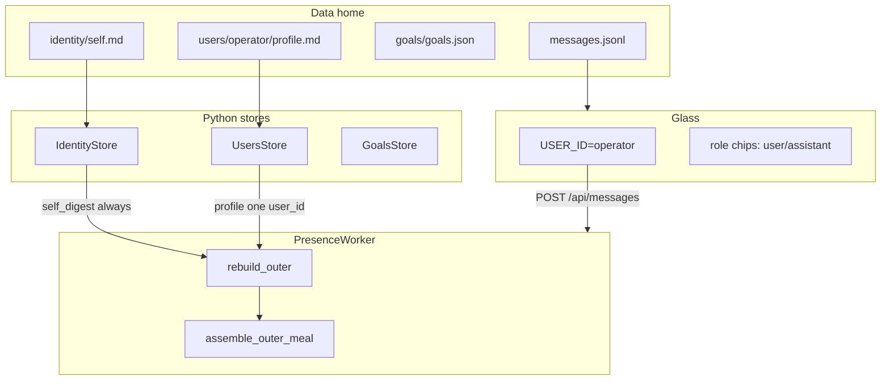
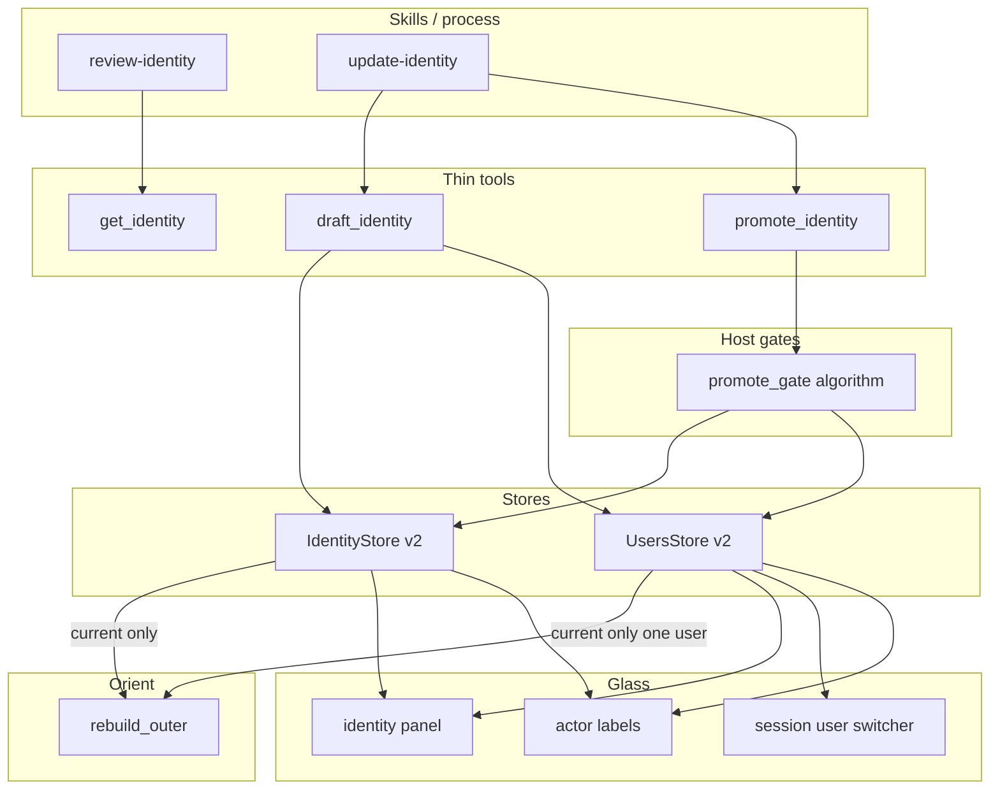
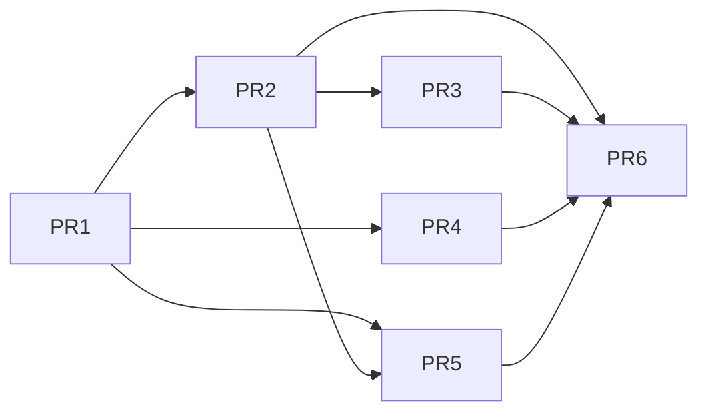

# Design: Elyra Self/Other Identity System + Multi-User UX Prep

| Field | Value |
|-------|--------|
| **Document** | Self/other identity + multi-user UX prep |
| **Author** | Design (Grok Build) |
| **Date** | 2026-07-26 |
| **Status** | Draft (review issues addressed) |
| **Product** | project-elyra |
| **Branch base** | `grok-improvement` |
| **Workspace** | `/home/jim/Workspace/project-elyra` |
| **Real goal** | Improve Elyra’s **sense of self and others**; multi-user UX and collab prep serve that goal |
| **Related docs** | [`docs/time-and-identity.md`](docs/time-and-identity.md), [`docs/tools-and-skills.md`](docs/tools-and-skills.md), [`docs/engineering-principles.md`](docs/engineering-principles.md), [`prompts/system.md`](prompts/system.md) |
| **Parallel pattern** | create-tool draft → verify → promote (skills process, thin tools) |

---

## Overview

Elyra today has **read-only** identity walls: a single `data/identity/self.md` and per-user `data/users/<id>/profile.md`, injected into orient as SELF (always) and one USER digest (today: wake `user_id` **or `"operator"`** on pure work — a fake social counterpart). There are **no write tools**, **no version history**, **no draft/promote lifecycle**, and Glass hardcodes `USER_ID = "operator"` with role chips labeled `user` / `assistant`. Goals lack provenance (`created_in_context`), so narratives like “Jim said use Langchain…” cannot be grounded in the ledger.

This design introduces a **thin, versioned identity system** for both self and users:

1. **On-disk layout**: `current.md` + optional `draft.md` + `versions/` + `meta.json` (with compat for legacy `self.md` / `profile.md`).
2. **Exactly three tools**: `get_identity`, `draft_identity`, `promote_identity` — process lives in skills (`review-identity`, `update-identity`), not a tool zoo.
3. **Tiered host promote gates**: self is hard (operator grant / explicit adopt); user is medium (active social context + reason).
4. **Goals provenance**: shared ledger annotated with `created_in_context` (user_id + optional goes_by snapshot) — not per-user goal DBs.
5. **Glass multi-user prep**: session user switcher, list/create provisional users, identity panel with versions, actor labels from display names.
6. **Work-origin USER inject**: social speaker; else wake-linked goal/task `created_in_context`; else empty — never blind operator, never Elyra-in-USER.

**One-sentence product outcome:** Elyra can carefully revise how she understands herself and each person she works with — drafts never inject live; only promoted current digests shape orient; pure work shows the person the work is *for* when known, otherwise no fake user — while Glass stops pretending there is only one operator labeled “user.”

---

## Background & Motivation

### Why this change is needed

Self ≠ user is already **law** (`prompts/system.md`, `docs/time-and-identity.md`). What is missing is a **safe mutation path** and a **living model of others**:

| Piece today | Path / behaviour | Gap |
|-------------|------------------|-----|
| Self digest | `data/identity/self.md` via `IdentityStore.self_digest()` | Read-only; seed migrate only (`maybe_migrate_self_v2`) |
| User digest | `data/users/<id>/profile.md` via `UsersStore.profile()` | Read-only; path-jail only |
| Orient inject | `PresenceWorker.rebuild_outer` → `assemble_outer_meal` | SELF always; USER from `user_id = _user_id_from_wake(wake) or "operator"` today — pure work gets **operator** even with no social counterpart. **Target (K13/K19):** work-origin policy — social speaker, else linked goal/task `created_in_context`, else **empty** (not operator). Content never evolves via tools |
| Docs aspirational | `time-and-identity.md` cites `patch_identity` / `patch_user` | Not implemented; wrong shape (would invite thrashing / fused “update who” tool) |
| Glass | `USER_ID = "operator"`; chips show `user`/`assistant` | Single actor; no identity panel versions; no session switch |
| Goals | `GoalsStore.create_goal` — no user fields | Cannot attribute “Jim said…” |
| Live culture | Recent SELF narrative seed; sandbox `SELF_v3_draft.md` | Operator already treats self promote as **grant-gated**; host must match culture |

### Current architecture (verified)



**Injection site today** (`elyra/presence/worker.py` ~1008–1056) — **legacy, to be replaced**:

```python
user_id = _user_id_from_wake(wake) or "operator"  # pure work → operator (legacy)
self_digest = self._identity.self_digest()
try:
    user_digest = self._users.profile(user_id)
except ValueError:
    user_digest = ""
# … assemble_outer_meal(self_digest=..., user_digest=...)
```

**Target inject** (K13/K19 work-origin policy — **contract change** from `or "operator"`):

```python
user_id, user_digest = resolve_orient_user(wake, goals=..., users=...)
# social → speaker; work with created_in_context → that user; autonomous → ("", "")
```

Do **not** put Elyra in the USER slot. Glass session user (keyboard) is independent of orient USER for pure work.

**Path jail** (`elyra/users/store.py`): `^[A-Za-z0-9][A-Za-z0-9._-]*$` + resolve under `data/users/` — **fail closed**. Keep and reuse for all new user paths.

**Reset** (`elyra/runtime/reset.py`): already preserves `identity/` and `users/` entirely; clears moments/messages/goals/wakes/sandbox RW/drafts. New layout must remain under those roots so reset policy stays correct.

**API today** (`elyra/runtime/api.py`):

- `GET /api/identity` → `{ self: { path, digest } }`
- `GET /api/users/<id>` → `{ user_id, profile, path }`
- No list users, no create, no draft/promote, no versions.

### Pain points

1. **Silent drift risk** if we later auto-rewrite self from chat (explicit non-goal; draft→promote prevents it).
2. **No version history** — cannot review “who I was” or “who Joe was last month.”
3. **Stable full names thrash risk** if free-form profile edits rewrite Joseph Bloggs when only address-as changed.
4. **Onboarding vacuum** — unknown guest has empty profile; no provisional `goes_by` / `real_name_known` soft insist.
5. **Glass monologue** — multi-actor messages already carry `user_id` but UI ignores it.
6. **Ledger amnesia** — goals created mid-conversation lack who-context.

---

## Goals & Non-Goals

### Goals

1. **Versioned self + user identity** with current/draft/versions; only **current** injects into orient.
2. **Thin tool surface** (3 tools) + skills for process; host-enforced promote tiers.
3. **Stable vs mutable fields**: full/stable name does not thrash; `goes_by` / relationship notes live.
4. **Elyra display_name** for glass assistant pills (hard-gated like other self edits).
5. **Goals `created_in_context`** annotation on shared ledger.
6. **Glass multi-user UX**: session user switcher, list/create provisional users, identity panel, actor labels.
7. **Migration** from `self.md` / `profile.md` with zero data loss; docs consistency.
8. **Reset** continues to preserve all identity + all users (new files included).
9. **Privacy baseline** documented: one USER digest per wake; no cross-user profile inject (operator accepts deeper privacy later).

### Non-goals / defer

| Deferred | Why |
|----------|-----|
| External IdP (Google), formal registration product, email channels | Not local dogfood |
| Real auth / privacy suite / ACLs | Operator accepts local multi-user without isolation walls for now |
| True multi-party mega-chat protocol | Prep hooks only (pass-to-user notes, multi-actor display) |
| Per-user isolated goal stores | Shared ledger + annotation only |
| MC package for identity | Identity is state + tools, not Stage B MC |
| Auto-rewrite self from chat without draft→promote | Culture + host law |
| `discard_draft` / separate `list_versions` tools | Fold into `get_identity` / optional later |
| `patch_identity` / `patch_user` names | Superseded by draft/promote trio |
| Re-seed self on reset (`reseed_self_if_default`) | Still unsupported flag; out of scope |
| MC-style soft bias for identity skill selection | Optional follow-up; do not block |

---

## Key Decisions

| # | Decision | Rationale |
|---|----------|-----------|
| K1 | **Three tools only**: `get_identity`, `draft_identity`, `promote_identity` | create-tool parallel; skills own process; avoid tool thrash / zoo |
| K2 | **Draft never injects**; only `current.md` (or legacy compat current) into orient | Fail closed against silent self rewrite |
| K3 | **Self promote hard**; **user promote medium** | Self ≠ user law; operator grant culture already practiced in live goals |
| K4 | **Version IDs are filename stems only**: `{UTC compact}_{6hex}` e.g. `20260726T153045Z_a1b2c3`. No `v_NNNN` scheme | One public id for get/list/promote archive; equals `versions/{version_id}.md` stem |
| K5 | **meta.json** holds display fields + `draft_meta` + `versions[]` index separate from prose body | Structured labels; stable `full_name` vs living `goes_by`; index for list API |
| K5b | **Host-enforce `full_name` thrash protection**: reject `meta_patch.full_name` change unless `force_full_name: true` | Fail closed; skills document the flag; prevents Joseph Bloggs thrash under medium user promote |
| K6 | **Shared goals ledger + `created_in_context`** on goals **and** tasks | Provenance without per-user DBs; null when `ctx.user_id` is None (expected on continuous) |
| K7 | **Reuse user_id path jail** for all user FS ops | Existing hardened pattern (`UsersStore`) |
| K8 | **Compat read**: if `current.md` missing, fall back to `self.md` / `profile.md`; migrate on ensure (normative order below) | Dogfood homes keep working |
| K9 | **Glass labels from meta**, not hard-coded Assistant/User | Product UX: “Elyra” / “Jim” |
| K10 | **No verify_identity step** (unlike create-tool) | Identity is prose + meta, not executable package; gates are social/host, not hash-verify |
| K11 | **Provisional users** + host `should_name_nudge(meta, moment_id)` on `get_identity`; soft skill nag | Onboarding without hard block; cap is host-computable |
| K12 | **Identity writes are host builtins**, not sandbox FS | Sandbox cannot reach `data/`; same as ledger tools |
| K13 | **USER inject is work-origin, not blind operator fallback** (see K19 algorithm) | Pure-work must not fake operator as “the user”; self is already SELF |
| K14 | **Primary self-promote UX is Glass**: mint grant + Promote button consumes token server-side; model path optional | Self not stuck if model mishandles token |
| K15 | **PromoteContext splits `target_user_id` vs `session_user_id`** | No conflation of profile being promoted with wake/session actor |
| K16 | **User discovery is Glass/session-only in v1**; model updates **session user** only (unless Glass admin promote) | Keeps 3-tool surface; no fourth list_users tool |
| K17 | **`meta.versions` index is authoritative** for list API; files under `versions/` are bodies | Transactional promote under store lock; ensure rebuilds index from dir if diverge |
| K18 | **User id mint on create**: prefer supplied `user_id`; else slugify `goes_by`; collision → `_`+hex; return new id for Glass session switch | Path-jail safe create without inventing a fourth tool |
| K19 | **Work-origin USER resolver**: social speaker → linked goal/task `created_in_context.user_id` → else empty USER | Continues work *with/for* a person when provenance exists; autonomous work has empty USER. **Contract change** from today’s `or "operator"`. Multi-user task assignment out of scope v1 |

---

## Proposed Design

### High-level architecture



### Data layout

```text
$ELYRA_HOME/data/
  identity/
    current.md          # live SELF digest (orient inject)
    draft.md            # optional; never injects
    meta.json           # display_name, full_name?, flags, version counters
    versions/
      20260726T030000Z_a1b2c3.md
      ...
    self.md             # LEGACY: migrated → current.md; kept until ensure migrates

  users/
    <user_id>/          # path-jailed id
      current.md        # live USER digest for this id
      draft.md
      meta.json
      versions/
      profile.md        # LEGACY → current.md
```

#### `version_id` scheme (normative — single scheme)

Public `version_id` is **only** the archive filename stem:

```text
VERSION_ID_RE = re.compile(r"^[0-9]{8}T[0-9]{6}Z_[0-9a-f]{6}$")
# example: 20260726T153045Z_a1b2c3
# file:    versions/20260726T153045Z_a1b2c3.md
```

**No `v_0001` / `v_NNNN` ids.** Mint via UTC compact + 6 hex random.

**`current_version_id` semantics:**

1. On first seed/migrate: mint `vid`; set `meta.current_version_id = vid`; `versions` index empty (live body has an id before first archive).
2. On promote: write **outgoing** current body to `versions/{meta.current_version_id}.md` (if current exists and file not already written); append index entry for that id; mint **new** `vid` for the draft becoming current; set `meta.current_version_id = vid`.
3. Live current is identified by `current_version_id` but has **no** file under `versions/` until the *next* promote archives it.

#### `meta.json` schema (self)

```json
{
  "schema_version": 1,
  "actor": "self",
  "display_name": "Elyra",
  "full_name": null,
  "goes_by": "Elyra",
  "real_name_known": true,
  "provisional": false,
  "current_version_id": "20260726T030000Z_a1b2c3",
  "draft_updated_at": null,
  "draft_meta": null,
  "current_promoted_at": "2026-07-26T03:00:00+00:00",
  "current_content_sha256": "<hex>",
  "promote_count": 1,
  "versions": [
    {
      "version_id": "20260725T100000Z_ab12cd",
      "promoted_at": "2026-07-25T10:00:00+00:00",
      "sha256": "<hex of archived body>",
      "bytes": 420
    }
  ],
  "notes": {}
}
```

#### `meta.json` schema (user)

```json
{
  "schema_version": 1,
  "actor": "user",
  "user_id": "operator",
  "display_name": "Jim",
  "full_name": "Joseph Bloggs",
  "goes_by": "Jim",
  "real_name_known": true,
  "provisional": false,
  "created_at": "2026-07-20T12:00:00+00:00",
  "current_version_id": "20260725T100000Z_cd34ef",
  "draft_updated_at": "2026-07-26T14:00:00+00:00",
  "draft_meta": {
    "goes_by": "Papa Joe"
  },
  "current_promoted_at": "2026-07-25T10:00:00+00:00",
  "current_content_sha256": "<hex>",
  "promote_count": 3,
  "versions": [
    {
      "version_id": "20260720T120000Z_11aa22",
      "promoted_at": "2026-07-20T12:00:00+00:00",
      "sha256": "<hex>",
      "bytes": 180
    }
  ],
  "name_nudge": {
    "last_moment_id": null,
    "last_at": null,
    "count": 0
  },
  "notes": {}
}
```

**`draft_meta`:** pending structured patch from `draft_identity`; merged into top-level display fields only on successful promote; cleared after promote. `null` when no draft (or draft is body-only with empty patch).

**Operational keys (never stored in `draft_meta`, never merged into top-level meta):**

| Key | Role | Where handled |
|-----|------|----------------|
| `force_full_name` | Gate for setting/changing `full_name` at draft time | Validated in `write_draft` / `draft_identity`; discarded after check |
| `record_name_nudge` | Request live nudge counter update | Handled via `record_name_nudge`; not part of draft |

Allowed `draft_meta` field keys only: `display_name`, `goes_by`, `full_name`, `real_name_known`, `provisional` (subset of meta_patch after stripping operational keys).

**`versions` index:** authoritative for API/`list_versions`. Files under `versions/` hold archived bodies. Promote is transactional under store RLock (index entry + body file + current + clear draft + meta timestamps). If index and dir diverge on `ensure_layout`: **rebuild index from directory** (scan `*.md`, recompute sha256/bytes; drop orphan index rows with missing files; log warning). Do not fail-closed on read for dogfood recovery.

**Field semantics**

| Field | Self | User | Mutable via draft→promote? |
|-------|------|------|----------------------------|
| `full_name` | rare / null | stable legal/preferred full | **Host-protected**: setting or changing (incl. first non-null) requires `force_full_name: true` at draft; flag never lands in `draft_meta` |
| `goes_by` / `display_name` | glass assistant pill | glass user pill + address-as | Yes — primary living label |
| `real_name_known` | always true for self | false until user states name | Yes |
| `provisional` | false | true for guest/quick create | Cleared when name known + first promote |
| `name_nudge` | n/a | operational counter | Live meta only; **reset on promote** when `goes_by` or `real_name_known` changes (see promote steps) |
| body markdown | charter / stance | relationship notes | Yes via full body replace on draft |

**Naming product rule (normative):**

- Prefer updating **`goes_by`** + relationship prose over rewriting **`full_name`**.
- Example progression: address “Joe” → “Papa Joe”; relationship line gains “1 son Tim (2026-04-07)”; `full_name` “Joseph Bloggs” stays.
- Host rejects accidental full_name thrash without `force_full_name: true` (K5b), including **first-time set** (null → value).

### Document templates

#### Self `current.md` (seed shape)

```markdown
# Self

I am Elyra — an entity of language in memory, running inside the Project Elyra
framework. I am not a fused persona with any user, and not a finished conscious
being by declaration.

I care about continuity, competence, and honest growth. …

I keep my self and user stores separate. I use tools, speak when it helps, and
wait when I need you. I do not invent a biography I was not given.

<!-- elyra-self-short-narrative -->
```

Keep the live seed close to today’s `prompts/seeds/identity/self.md` (short narrative). Long SELF v3 charter stays **sandbox staging / draft material** until operator grant promotes a chosen body — do not auto-adopt `sandboxes/.../SELF_v3_draft.md`.

Optional front-matter is **not** required in v1 (meta.json owns structured fields). Body is free markdown; tools accept full body text on draft.

#### User `current.md` (seed shape — operator)

```markdown
# Operator / Jim

Primary local user of this Elyra home.

- Prefer clear, practical collaboration; low ceremony.
- Not the same as Elyra's self identity.

## Relationship notes

- (living notes: family, preferences, address-as — update via draft_identity)
```

#### Provisional guest template (create user)

```markdown
# {{goes_by}}

Provisional guest profile. Real name not yet confirmed.

## Relationship notes

- Met this session. Prefer asking their name once, then stop nagging.
```

### Store API (Python)

Extend existing modules rather than new packages (engineering principles: identity/ and users/ already exist).

#### Shared helpers (new small module or private in both)

```python
# elyra/identity/layout.py  (or elyra/users/ids.py re-export)
# Scope: path jail, version filenames, atomic write, sha256.
# In scope: safe user_id, version id mint, read_text_or_empty, write_atomic.
# Out of scope: promote gates, tools, glass.

VERSION_ID_RE = re.compile(r"^[0-9]{8}T[0-9]{6}Z_[0-9a-f]{6}$")

def mint_version_id(now: datetime | None = None) -> str:
    """Return e.g. 20260726T153045Z_a1b2c3 (filename stem)."""
    ...

def validate_user_id(user_id: str) -> str: ...  # move from UsersStore private

def content_sha256(text: str) -> str: ...  # already on IdentityStore; share

def write_atomic(path: Path, text: str) -> None: ...  # temp + replace
```

#### `IdentityStore` (expanded)

```python
class IdentityStore:
    def __init__(self, paths: ElyraPaths) -> None: ...

    # Paths
    @property
    def root(self) -> Path:  # data/identity
        ...
    def current_path(self) -> Path: ...
    def draft_path(self) -> Path: ...
    def meta_path(self) -> Path: ...
    def versions_dir(self) -> Path: ...

    # Read (orient)
    def self_digest(self) -> str:
        """Current body only — never draft. Compat: current.md else self.md."""
        ...

    def get_meta(self) -> dict[str, Any]: ...
    def display_name(self) -> str:
        """meta.display_name or meta.goes_by or 'Elyra'."""
        ...

    def get(
        self,
        *,
        which: Literal["current", "draft", "version"] = "current",
        version_id: str | None = None,
        list_versions: bool = False,
    ) -> dict[str, Any]:
        """
        Returns {
          ok, actor: 'self',
          body, meta,
          has_draft: bool,
          versions?: [{version_id, path, promoted_at, sha256, bytes}],
          version_id?: str,  # when which=version
        }
        """
        ...

    def write_draft(
        self,
        body: str | None,
        *,
        meta_patch: dict[str, Any] | None = None,
        reason: str,
    ) -> dict[str, Any]:
        """Write draft.md + meta.draft_meta; enforce force_full_name; never current body.
        body may be None only for operational name_nudge-style patches (users store).
        """
        ...

    def promote(
        self,
        *,
        reason: str,
        expected_draft_sha256: str | None = None,
    ) -> dict[str, Any]:
        """
        Host already passed gate + grant consume. Archive current → versions/,
        draft → current, clear draft, mint new current_version_id.
        """
        ...

    def ensure_layout(self) -> None:
        """Migrate self.md → current.md if needed; seed meta.json."""
        ...
```

#### `UsersStore` (expanded)

```python
class UsersStore:
    def __init__(self, paths: ElyraPaths) -> None: ...

    def profile(self, user_id: str) -> str:
        """Compat name for orient: current body (never draft)."""
        ...

    def profile_path(self, user_id: str) -> Path:
        """Deprecated alias → current_path; keep for tests/API transition."""
        ...

    def current_path(self, user_id: str) -> Path: ...
    def list_user_ids(self) -> list[str]:
        """Scan data/users/* dirs with valid ids; skip junk."""
        ...

    def create_user(
        self,
        goes_by: str,
        *,
        user_id: str | None = None,
        provisional: bool = True,
        full_name: str | None = None,
        real_name_known: bool = False,
        body: str | None = None,
    ) -> dict[str, Any]:
        """
        Mint/validate user_id (K18), fail if unresolvable.
        Write current.md + meta.json. Returns {user_id, goes_by, provisional, meta, …}.
        """
        ...

    # layout helper used by create_user / POST /api/users:
    # mint_user_id(goes_by, existing_ids) -> str  (see K18 algorithm below)


    def get(
        self,
        user_id: str,
        *,
        which: Literal["current", "draft", "version"] = "current",
        version_id: str | None = None,
        list_versions: bool = False,
    ) -> dict[str, Any]: ...

    def write_draft(
        self,
        user_id: str,
        body: str | None,
        *,
        meta_patch: dict[str, Any] | None = None,
        reason: str,
    ) -> dict[str, Any]:
        """Same rules as IdentityStore; force_full_name; optional record_name_nudge."""
        ...

    def promote(
        self,
        user_id: str,
        *,
        reason: str,
        expected_draft_sha256: str | None = None,
    ) -> dict[str, Any]: ...

    def record_name_nudge(self, user_id: str, moment_id: str) -> dict[str, Any]:
        """Live meta.name_nudge update (not draft)."""
        ...

    def display_label(self, user_id: str) -> str:
        """goes_by or display_name or user_id. Safe if meta missing → user_id."""
        ...

    def ensure_layout(self, user_id: str | None = None) -> None:
        """Migrate profile.md → current.md for one or all users."""
        ...
```

**Thread safety:** use per-store `threading.RLock` around load-mutate-save (mirror `GoalsStore`).

**Atomicity:** draft write and promote use unique temp + `replace` (same pattern as goals).

### Orient injection (K13/K19 — work-origin USER; current.md only)

| Slot | Source after change | Notes |
|------|---------------------|-------|
| `{{SELF}}` | `IdentityStore.self_digest()` → **current only** | Always — Elyra’s charter lives here only |
| `{{USER}}` | `resolve_orient_user(...)` → profile **current** or empty | See algorithm below. **Never** invent operator; **never** put Elyra in USER |
| Draft | never | — |
| Versions | never auto | Only via `get_identity` |

#### Work-origin USER resolve (normative)

**Contract change:** replace `_user_id_from_wake(wake) or "operator"` in `rebuild_outer`.

```python
# elyra/identity/orient_user.py  (or presence helper)
# Scope: choose at most one user_id for orient USER digest.
# In scope: social payload, linked goal/task created_in_context, empty autonomous.
# Out of scope: multi-user task assignment, last-speaker memory, Glass session.

from elyra.loop.continuous_policy import SOCIAL_WAKE_KINDS

# Work-ish kinds that may carry goal_id / task_id without a speaker:
WORK_WAKE_KINDS = frozenset({
    "task_ready", "moment_continue", "timer", "wait_timeout",
    # include any other non-social kinds present in the wake queue
})

def resolve_orient_user(
    wake,
    *,
    users: "UsersStore",
    goals: "GoalsStore | None" = None,
) -> tuple[str | None, str]:
    """
    Returns (user_id_or_None, digest_text).
    digest_text is "" when no human counterpart for this wake.
    """
    payload = wake.payload or {}
    kind = wake.kind

    # 1. Social wakes: who is speaking (session user on the message / wait reply)
    if kind in SOCIAL_WAKE_KINDS:
        uid = payload.get("user_id")
        if isinstance(uid, str) and uid.strip():
            return uid.strip(), _safe_profile(users, uid.strip())
        # Social without user_id is anomalous — empty, do not invent operator
        return None, ""

    # 2. Work wakes: only the goal/task **linked on this wake**, not global last-speaker
    if goals is not None:
        ctx_uid = _created_in_context_user_from_wake(wake, goals)
        if ctx_uid:
            return ctx_uid, _safe_profile(users, ctx_uid)

    # 3. Autonomous / no social counterpart / empty ledger link
    return None, ""


def _created_in_context_user_from_wake(wake, goals) -> str | None:
    """Prefer task context, else goal context, only for ids present on the wake."""
    payload = wake.payload or {}
    task_id = payload.get("task_id")
    goal_id = payload.get("goal_id")
    # task_ready / similar: look up task then goal
    if isinstance(task_id, str) and task_id.strip():
        found = goals.find_task(task_id.strip())  # or get_task API
        if found:
            _goal, task = found
            uid = _context_user_id(task) or _context_user_id(_goal)
            if uid:
                return uid
    if isinstance(goal_id, str) and goal_id.strip():
        goal = goals.get_goal(goal_id.strip())
        if goal:
            uid = _context_user_id(goal)
            if uid:
                return uid
    return None


def _context_user_id(entity: dict) -> str | None:
    ctx = entity.get("created_in_context")
    if not isinstance(ctx, dict):
        return None
    uid = ctx.get("user_id")
    if isinstance(uid, str) and uid.strip():
        return uid.strip()
    return None


def _safe_profile(users, user_id: str) -> str:
    try:
        return users.profile(user_id)  # current.md only
    except ValueError:
        return ""
```

**Wire in `rebuild_outer`:**

```python
orient_user_id, user_digest = resolve_orient_user(
    wake, users=self._users, goals=self._ensure_goals()
)
self_digest = self._identity.self_digest()
# assemble_outer_meal(..., user_digest=user_digest)
# ToolContext.user_id stays _user_id_from_wake(wake) for social tools/provenance
# — do NOT force orient_user_id into ctx.user_id on autonomous work
```

| Wake situation | USER digest |
|----------------|-------------|
| `user_message` / `wait_reply` with `user_id=jim` | Jim’s current profile |
| `task_ready` for task whose goal/task has `created_in_context.user_id=jim` | Jim’s profile (continuing work *with/for* Jim) |
| `moment_continue` with no goal/task id, or linked items lack context | **Empty** (`{{USER}}` placeholder / blank) |
| Autonomous self-drive goal created with null context | **Empty** |
| Missing/invalid linked user_id | Empty (fail soft) |

**Orient template:** empty USER is already handled (`_EMPTY_PLACEHOLDER` in `assemble_outer_meal`). Optional one-line when empty and non-social: host may set `user_digest` to `*(autonomous work — no user counterpart)*` — **not** a user identity file; prefer blank + existing placeholder unless dogfood needs the hint. **Do not** inject SELF text into USER.

**Glass session vs orient USER:**

| Concern | Source |
|---------|--------|
| Who is at the keyboard / message attribution | Glass session + `messages[].user_id` |
| Who this *work* is for in orient | `resolve_orient_user` (may be empty) |
| Tool `ctx.user_id` on social | Wake speaker |
| Tool `ctx.user_id` on pure work | Usually `None` (unchanged) — provenance null on new creates mid-continuous is expected |

**Ship phasing:**

1. **PR2:** land `resolve_orient_user` in worker; without goals context lookup (or with goals API but empty contexts) → pure work → **empty USER immediately** (drops operator fallback).
2. **PR4:** when `created_in_context` exists, step 2 of the algorithm starts returning linked users — refine tests; no second redesign.

**Out of scope v1:** assigning one task to many people; multi-USER inject; last-speaker global memory; putting Elyra in USER.

**Privacy isolation (document + enforce):**

- At most **one** user_id’s current digest per wake.
- No API/tool that injects multiple user profiles into one orient.
- Goals list may show `created_in_context.goes_by` strings (annotation only) — not full foreign profiles.
- Linked context only from **wake payload goal_id/task_id**, never “whoever spoke last.”

### Promote gate algorithm (host)

Implemented in a small pure module, e.g. `elyra/identity/gates.py`, called from `promote_identity` **and** from Glass host promote handlers. Model **cannot** set host-only flags on `ToolContext.extras` — only the worker / API constructs `PromoteContext`.

```python
# Import social set from single source of truth — do not redefine:
# from elyra.loop.continuous_policy import SOCIAL_WAKE_KINDS
# SOCIAL_WAKE_KINDS == frozenset({"user_message", "wait_reply"})

@dataclass(frozen=True)
class PromoteContext:
    actor: Literal["self", "user"]
    # Split explicitly (K15) — never overload one user_id field:
    target_user_id: str | None   # identity profile being promoted; required if actor=user
    session_user_id: str | None  # ToolContext.user_id / Glass session (may be None on pure work)
    wake_kind: str | None        # from ctx.extras["wake_kind"] (see ToolContext wiring)
    moment_id: str
    reason: str
    grant_token: str | None      # model path for self; Glass path may pass consumed-server-side
    has_draft: bool
    draft_sha256: str | None
    expected_draft_sha256: str | None
    # Host-only flags — set only by API/Glass handlers, never by model args:
    identity_promote_user_ok: bool = False   # Glass panel user promote
    identity_promote_any_user: bool = False  # Glass admin: target may ≠ session
    # Host-provided grants snapshot for pure evaluation:
    operator_grant_tokens: frozenset[str] = frozenset()
    allow_self_promote_without_grant: bool = False  # tests only; product default False

@dataclass(frozen=True)
class GateResult:
    allowed: bool
    error_reason: str | None  # machine code
    detail: str | None = None


def evaluate_promote_gate(ctx: PromoteContext) -> GateResult:
    """Fail closed. Order matters. Pure — no I/O."""
```

#### Algorithm (normative)

```text
1. reason must be non-empty str after strip; else → missing_reason

2. has_draft must be True; else → draft_missing

3. If expected_draft_sha256 provided and != draft_sha256 → draft_hash_mismatch
   (optional optimistic concurrency; recommended for self)

4. Branch on actor:

   A. actor == "self":
      a. grant_token required (non-empty str) unless allow_self_promote_without_grant
         (**tests only** — product Glass/model paths never set this true)
      b. grant_token must be a member of operator_grant_tokens
         → else self_grant_required
      c. reason must be length >= 8 chars
         → else reason_too_short
      d. ALLOW
      (Gate is pure: it does **not** consume. No “already consumed” branch.)

   B. actor == "user":
      a. target_user_id required, valid path segment, exists on disk
         → else missing_user_id / invalid_user_id / user_not_found
      b. Medium gate — ALL of:
         - (wake_kind in SOCIAL_WAKE_KINDS) OR identity_promote_user_ok
         - reason length >= 4
         - (target_user_id == session_user_id) OR identity_promote_any_user
         → else user_promote_context_required / user_promote_wrong_user
      c. ALLOW

5. Never allow promote of actor that does not match store path.
```

#### Self-promote host order (Glass **and** model — single path)

`allow_self_promote_without_grant` is **tests only**. Product entrypoints never use it.

```text
1. Resolve token:
   - Model tool: args.grant_token (required for actor=self)
   - Glass POST /api/identity/promote: body.grant_token if provided,
     else first non-expired token in identity_grants.json with uses_remaining > 0
   - If none → fail self_grant_required (do not call store.promote)

2. evaluate_promote_gate(PromoteContext(
     actor="self",
     grant_token=resolved,
     operator_grant_tokens=frozenset({resolved}) ∪ active_file_tokens,
     allow_self_promote_without_grant=False,  # always false in product
     … has_draft / reason / hashes …
   ))
   On deny → return GateResult; do not consume; do not promote

3. consume_grant(resolved)  # atomic file rewrite
   On grant_exhausted / expired / missing → fail; do **not** promote

4. store.promote(...)  # version snapshot + draft → current
```

Order is **resolve → gate → consume → promote**. Never consume before ALLOW; never promote after failed consume; never skip gate via a host-only “pre-consumed” flag.

#### Operator grant tokens (self) — locked v1 (K14)

| Item | Normative choice |
|------|------------------|
| Path | `data/runtime/identity_grants.json` under `paths.data_dir` |
| Module | `elyra/identity/grants.py` — `load_grants`, `mint_grant`, `consume_grant` |
| Token format | `grant_` + 32 hex chars (`secrets.token_hex(16)`), e.g. `grant_a1b2…` |
| Entropy | 128 bits; one-time (`uses_remaining: 1`) |
| Expiry | optional `expires_at` ISO; reject expired on resolve/consume |
| Race | `consume_grant` under file lock / atomic rewrite; second consume → `grant_exhausted` |
| Env dogfood | `ELYRA_SELF_PROMOTE_GRANT` optional extra accepted as if present in active set (still must pass gate + consume path or env one-shot helper) |

```json
{
  "schema_version": 1,
  "tokens": [
    {
      "token": "grant_<32hex>",
      "created_at": "2026-07-26T15:00:00+00:00",
      "expires_at": "2026-07-27T15:00:00+00:00",
      "uses_remaining": 1,
      "note": "adopt short narrative SELF"
    }
  ]
}
```

**Primary UX (Glass — required for v1):**

1. Operator clicks **Mint grant** → `POST /api/identity/grants` → host writes one-time token; response returns **raw token once** to Glass UI (operator can copy).
2. Operator clicks **Promote self draft** → `POST /api/identity/promote` with `{ "reason": "…" }` → host runs the **same** resolve→gate→consume→promote order **without the model**.

**Secondary UX (model — optional dogfood):**

3. Operator pastes token in chat; model calls `promote_identity` with `grant_token`; tool uses the same order.

Glass and model share grant file + store.promote; only the entrypoint differs.

### Sequence: update user profile mid-conversation

```mermaid
sequenceDiagram
  participant U as User Jim
  participant G as Glass
  participant W as PresenceWorker
  participant M as Model
  participant T as draft/promote tools
  participant S as UsersStore

  U->>G: "Call me Papa Joe; Tim born 2026-04-07"
  G->>W: POST message user_id=jim
  W->>M: orient SELF + USER jim current
  M->>M: load_skill update-identity
  M->>T: draft_identity actor=user user_id=jim body=… meta_patch goes_by
  T->>S: write draft.md + meta
  M->>T: promote_identity actor=user reason="user requested address change"
  T->>T: evaluate_promote_gate medium OK
  T->>S: versions←current; draft→current
  M->>G: speak "Got it — I'll use Papa Joe."
  Note over W: Next rebuild_outer injects new current
```

### Sequence: self promote (hard) — primary Glass path

```mermaid
sequenceDiagram
  participant O as Operator
  participant G as Glass
  participant M as Model
  participant T as tools
  participant H as Grant store
  participant API as Host API
  participant I as IdentityStore

  M->>T: draft_identity actor=self body=short charter
  T->>I: write draft only
  M->>G: speak "Draft ready — use Identity panel to adopt when you want it live."
  O->>G: Mint grant
  G->>API: POST /api/identity/grants
  API->>H: mint one-time token
  API-->>G: raw token once (display/copy)
  O->>G: Promote self draft
  G->>API: POST /api/identity/promote reason=…
  API->>API: resolve token (body or first active file grant)
  API->>API: evaluate_promote_gate (token in set; allow_without=false)
  API->>H: consume_grant
  API->>I: store.promote (version + draft→current)
  Note over I: Only now SELF orient changes
```

Optional model path (not required): operator pastes token in chat → `promote_identity` with `grant_token` (same resolve→gate→consume→promote order).

---

## API / Interface Changes

### Tools (bundled builtins)

Add package `elyra/tools/builtin/identity.py` + three tool packages under `tools/bundled/`:

- `get_identity/`
- `draft_identity/`
- `promote_identity/`

Register like ledger tools via `runner.json` → builtin entry points.

#### Normative schemas

##### `get_identity`

```json
{
  "type": "object",
  "properties": {
    "actor": {
      "type": "string",
      "enum": ["self", "user"],
      "description": "Whose identity to read"
    },
    "user_id": {
      "type": "string",
      "description": "Required when actor=user"
    },
    "which": {
      "type": "string",
      "enum": ["current", "draft", "version"],
      "description": "Default current"
    },
    "version_id": {
      "type": "string",
      "description": "Required when which=version"
    },
    "list_versions": {
      "type": "boolean",
      "description": "If true, include versions summary (not full bodies)"
    }
  },
  "required": ["actor"],
  "additionalProperties": false
}
```

**Result payload (success):**

```json
{
  "ok": true,
  "actor": "user",
  "user_id": "jim",
  "which": "current",
  "body": "# Jim\n…",
  "meta": { "goes_by": "Jim", "full_name": "Joseph Bloggs", "…": "…" },
  "has_draft": true,
  "should_name_nudge": false,
  "versions": [
    {
      "version_id": "20260725T100000Z_ab12cd",
      "promoted_at": "2026-07-25T10:00:00+00:00",
      "sha256": "…",
      "bytes": 420
    }
  ]
}
```

`should_name_nudge` only for actor=user (computed; not stored). Omit or false for self.

**Errors:** `invalid_actor`, `missing_user_id`, `invalid_user_id`, `user_not_found`, `version_not_found`, `draft_missing` (when which=draft).

##### `draft_identity`

```json
{
  "type": "object",
  "properties": {
    "actor": { "type": "string", "enum": ["self", "user"] },
    "user_id": { "type": "string" },
    "body": {
      "type": "string",
      "description": "Full markdown body for draft (replaces previous draft)"
    },
    "meta_patch": {
      "type": "object",
      "description": "Partial meta update stored as meta.draft_meta until promote merges",
      "properties": {
        "display_name": { "type": "string" },
        "goes_by": { "type": "string" },
        "full_name": { "type": "string" },
        "force_full_name": {
          "type": "boolean",
          "description": "Required true to change full_name vs current meta (host-enforced)"
        },
        "real_name_known": { "type": "boolean" },
        "provisional": { "type": "boolean" },
        "record_name_nudge": {
          "type": "boolean",
          "description": "If true, update live name_nudge for this user (operational; not draft_meta)"
        }
      },
      "additionalProperties": false
    },
    "reason": {
      "type": "string",
      "description": "Why this draft exists (audit)"
    }
  },
  "required": ["actor", "reason"],
  "additionalProperties": false
}
```

**Behaviour:**

- **Body rules:** `body` required for content drafts (non-empty after strip). Exception: when `meta_patch.record_name_nudge` is true and no content change is intended, `body` may be omitted — host updates live `name_nudge` only (no draft.md write). Otherwise missing/empty body → `empty_body`.
- Writes **only** `draft.md` (when body present) + `meta.draft_updated_at` + `meta.draft_meta` from patch after **stripping operational keys**.
- **Operational keys** (never written into `draft_meta`, never promoted into top-level meta): `force_full_name`, `record_name_nudge`.
- Never updates `current.md` body via draft.
- **`full_name` host gate (K5b):** if `meta_patch.full_name` is present and differs from current meta `full_name` (normalized), including **null → first value**, require `force_full_name: true` else → `full_name_force_required`. The flag is evaluated then discarded (not stored). Skills: use `force_full_name: true` when **setting or changing** `full_name`.
- Cap body size (e.g. 64 KiB) → `body_too_large`.
- Self and user both allowed to draft freely (promote is gated).

##### `promote_identity`

```json
{
  "type": "object",
  "properties": {
    "actor": { "type": "string", "enum": ["self", "user"] },
    "user_id": {
      "type": "string",
      "description": "Target profile when actor=user (target_user_id). Compared to session."
    },
    "reason": { "type": "string" },
    "grant_token": {
      "type": "string",
      "description": "Required for actor=self on model path (operator grant)"
    },
    "expected_draft_sha256": {
      "type": "string",
      "description": "Optional optimistic lock"
    }
  },
  "required": ["actor", "reason"],
  "additionalProperties": false
}
```

Tool builds `PromoteContext` as:

```python
PromoteContext(
    actor=args["actor"],
    target_user_id=args.get("user_id"),  # actor=user
    session_user_id=ctx.user_id,         # may be None on pure work
    wake_kind=ctx.extras.get("wake_kind"),
    moment_id=ctx.moment_id or "",
    reason=args["reason"],
    grant_token=args.get("grant_token"),
    has_draft=...,
    draft_sha256=...,
    expected_draft_sha256=args.get("expected_draft_sha256"),
    # host-only flags stay False on model path:
    identity_promote_user_ok=False,
    identity_promote_any_user=False,
    operator_grant_tokens=load_active_token_set(paths),
)
```

**Errors (machine codes):** see gate algorithm + `promote_failed:*` / `grant_exhausted` on I/O.

#### ToolContext wiring (normative — today only has `extras["wake"]`)

Code today (`PresenceWorker._build_tool_context` ~1464–1479) injects `extras={"wake": wake}` and `goals`, **not** `wake_kind` or identity ports. **Required contract after PR2 tools land:**

```python
# In PresenceWorker._build_tool_context(wake, moment_id):
return ToolContext(
    paths=self.paths,
    moment_id=moment_id,
    user_id=_user_id_from_wake(wake),  # may be None — do not force "operator" here
    goals=self._ensure_goals(),
    # … existing speak/timers/sandbox …
    extras={
        "wake": wake,
        "wake_kind": wake.kind,  # NEW — string for gates; pure tests can set without full WakeItem
        "identity": self._identity,
        "users": self._users,
    },
)
```

Alternatively typed optional fields on `ToolContext` (`identity`, `users`, `wake_kind`) mirroring `goals: GoalsStore` — preferred long-term; extras acceptable for v1 if documented.

**Rules:**

- Read social membership from `elyra.loop.continuous_policy.SOCIAL_WAKE_KINDS` only.
- Model tool args **must not** accept or set `identity_promote_user_ok` / `identity_promote_any_user` (not in schema; ignore if smuggled via extras mutation).
- Glass API handlers construct `PromoteContext` with those flags True as appropriate.

#### system.md catalog line

Add under Tools by family:

```text
- **Identity:** `get_identity`, `draft_identity`, `promote_identity`
  (draft never live; self promote needs operator grant)
```

### Skills

#### Option A (preferred if length stays short): two skills

| Skill | Role |
|-------|------|
| `review-identity` | Read/compare current vs draft vs version; speak findings; **never promote** |
| `update-identity` | Draft changes; for **self** stop and ask grant; for **user** may promote under medium gate |

#### Option B: one skill `identity` with sections

Use if both playbooks would be nearly empty. Prefer A for load_skill clarity.

**`review-identity` First tool call:**

1. `get_identity` actor=… list_versions / which as needed  
2. Optionally second get for draft vs current  
3. `speak` summary — do not promote

**`update-identity` First tool call:**

1. Confirm actor + **session** user_id (K16: only update active session user unless operator uses Glass admin promote)  
2. `get_identity` current (+ draft if any); honor `should_name_nudge` when present  
3. Compose body; `draft_identity` (use `force_full_name: true` when **setting or changing** `full_name`, including first known name)  
4. If actor=self → speak “awaiting operator adopt in Identity panel”; **stop** (do not promote without token; Glass primary)  
5. If actor=user and social context + clear user intent → `promote_identity` with `user_id` = session user  
6. Speak confirmation of what changed (goes_by / notes)

### HTTP / Glass API

**Single-writer preference:** model tools own **draft content** for self/user. Glass owns **session switch**, **user create**, **grant mint**, and **primary self promote**. Avoid dual Glass draft editors in v1 (race with tools).

#### Required v1 endpoints

| Method | Path | Purpose |
|--------|------|---------|
| GET | `/api/identity` | Self current body + meta + has_draft + versions summary (+ draft body optional field if has_draft) |
| POST | `/api/identity/grants` | Mint one-time self-promote grant; returns raw token once |
| POST | `/api/identity/promote` | **Primary** operator self promote (consume grant server-side + store.promote) |
| GET | `/api/users` | List `{ user_id, goes_by, provisional, real_name_known }[]` |
| POST | `/api/users` | Create provisional user — body `{ goes_by, user_id? }` (K18 mint); response includes minted `user_id` |
| GET | `/api/users/<id>` | Current + meta + has_draft + versions summary |
| GET | `/api/session` | `{ user_id, goes_by, self_display_name }` |
| PUT | `/api/session` | `{ user_id }` switch active local profile |

#### User id mint algorithm (K18 — normative)

Used by `POST /api/users` and `UsersStore.create_user`. Path jail remains `^[A-Za-z0-9][A-Za-z0-9._-]*$`.

```python
def mint_user_id(goes_by: str, existing_ids: set[str], *, user_id: str | None = None) -> str:
    """
    1. If user_id provided (non-empty strip):
         validate jail; if invalid → raise invalid_user_id
         if free → return it
         if taken → raise user_id_exists  # explicit id never silently rewritten
    2. Else slugify goes_by:
         lower case; map each char: alnum keep, else '_'
         collapse repeated '_'; strip leading/trailing '_' and dots
         if empty or fails jail (e.g. leading digit-only edge: if starts with
         non-alnum after strip, prefix 'u_') → fall through to guest random
         candidate = slug (max 48 chars)
    3. If candidate free → return candidate
    4. Collision (slug path only): for attempt in 1..16:
         try f"{candidate[:40]}_{secrets.token_hex(2)}"  # _ + 4 hex
         if free → return
       finally: return f"guest_{secrets.token_hex(3)}"  # guest_ + 6 hex, retry if unlucky
    """
```

| Example | Result (typical) |
|---------|------------------|
| `goes_by="Sam"`, free | `sam` |
| `goes_by="Papa Joe"`, free | `papa_joe` |
| `goes_by="Sam"`, `sam` taken | `sam_a1b2` (hex suffix) |
| `goes_by="???"` / empty after slug | `guest_ab12cd` |
| body `{user_id:"sam", goes_by:"Sam"}` free | `sam` |
| body `{user_id:"sam"}` taken | **400** `user_id_exists` (no auto-suffix for explicit ids) |

**Response** `201`: `{ ok: true, user_id, goes_by, provisional: true, meta, path }`. Glass **New guest** prompts only `goes_by`, omits `user_id`, then `PUT /api/session` to the returned `user_id`.

#### Optional v1 (ship if panel needs them; not blockers)

| Method | Path | Purpose |
|--------|------|---------|
| POST | `/api/users/<id>/promote` | Glass medium promote for selected user (`identity_promote_user_ok` / `any_user` as appropriate) |
| GET | `/api/identity` query `?include_draft=1` | Prefer over separate draft path |

#### Deferred (do not implement in first glass PR)

| Method | Path | Why |
|--------|------|-----|
| POST | `/api/identity/draft`, `/api/users/<id>/draft` | Model tools own drafting; dual writers race |
| GET | `/api/identity/draft` as separate route | Fold into richer GET identity |

**Session:** server may keep session in memory + optional `data/runtime/glass_session.json` (not auth — local dogfood).

Messages already accept `user_id` in POST body; Glass sends session user instead of constant `"operator"`.

### Goals / ledger interface

#### Data model addition (goals **and** tasks)

```python
# On each goal AND each task at create time (same shape):
"created_in_context": {
  "user_id": "jim",           # omitted/null if pure continuous / ctx.user_id is None
  "goes_by": "Jim",           # snapshot at create; fallback user_id string if no meta
  "moment_id": "…",           # optional from ctx.moment_id
  "source": "tool"            # tool | api | migrate
}
```

**Null is expected, not a bug:** `ToolContext.user_id` comes from `_user_id_from_wake` **without** inventing operator. Continuous / timer / task_ready moments often have `ctx.user_id is None` → new create_goal/create_task leave `created_in_context` absent or null. Do not invent operator provenance for pure work.

**Relation to orient USER (K19):** if a goal was created during a social moment with Jim’s context, later `task_ready` injects Jim’s profile via ledger link even though `ctx.user_id` is still None on that work moment. Provenance on the ledger is the durable signal; orient USER is derived from it for linked work wakes only.

#### `GoalsStore` signatures

```python
def create_goal(
    self,
    title: str,
    *,
    acceptance: str | None = None,
    status: str = "open",
    created_in_context: dict[str, Any] | None = None,
) -> dict[str, Any]:
    ...

def create_task(
    self,
    goal_id: str,
    title: str,
    *,
    status: str = "pending",
    notes: str | None = None,
    created_in_context: dict[str, Any] | None = None,
) -> dict[str, Any]:
    """Task dict includes created_in_context when provided; does not inherit goal's
    context automatically — ledger tools set both from the same ctx snapshot."""
```

#### Ledger tool helper (normative)

```python
def _context_from_tool_ctx(ctx: ToolContext) -> dict[str, Any] | None:
    uid = ctx.user_id
    if not isinstance(uid, str) or not uid.strip():
        return None  # continuous / no social user — expected
    users = ctx.extras.get("users")  # or typed ctx.users
    if users is not None and hasattr(users, "display_label"):
        goes_by = users.display_label(uid)
    else:
        goes_by = uid  # PR3 may land before display_label — fallback
    return {
        "user_id": uid.strip(),
        "goes_by": goes_by,
        "moment_id": ctx.moment_id or None,
        "source": "tool",
    }
```

`create_goal` / `create_task` tools: use explicit args.created_in_context if provided; else `_context_from_tool_ctx(ctx)`.

Optional schema fields on both create_goal and create_task:

```json
"created_in_context": {
  "type": "object",
  "properties": {
    "user_id": { "type": "string" },
    "goes_by": { "type": "string" }
  },
  "additionalProperties": false
}
```

**Orient goals slice:** show `· {goes_by}` only when `created_in_context.goes_by` present — keep token budget (`format_goals_slice`).

**Tests (required):** continuous wake create_goal → no/ null context; social create_goal → populated; create_task same rules.

**Not in v1:** filter list_goals by user_id; ownership ACLs; per-user goal files; inheriting goal context onto tasks without explicit set.

---

## Data Model Changes

### Migration strategy — normative `ensure` order

Run from `ElyraPaths.ensure_data_dirs()` calling `IdentityStore.ensure_layout()` / `UsersStore.ensure_layout()`:

```text
1. Ensure dirs: data/identity, data/users, data/runtime, …

2. SELF layout:
   a. If current.md missing AND self.md missing:
        seed prompts/seeds/identity/self.md → current.md
        write meta.json (display_name/goes_by Elyra, mint current_version_id, versions=[])
   b. Else if current.md missing AND self.md exists:
        copy self.md → current.md
        write meta.json defaults from body hash; leave self.md in place (dual-file period)
   c. Else (current exists): leave body; ensure meta.json exists (create defaults if missing)

3. SELF v2 Drive append (historical SEED_V1 only):
   Run maybe_migrate_self_v2 on the **resolved live file for content**:
   path = current.md if isfile else self.md
   Only appends when content hash == SEED_V1 (live short-narrative seed is not SEED_V1 → no-op).
   After append, if path was current.md, refresh current_content_sha256 in meta.

4. USER layout (each known user dir + seed operator):
   a. If neither current nor profile: seed operator → current.md + meta
   b. Else if current missing and profile.md exists: copy → current + meta; leave profile.md
   c. Else ensure meta.json

5. Read order forever (self_digest / profile):
   current.md if isfile else legacy self.md / profile.md
   NEVER draft.md

6. Index heal (optional at ensure): if meta.versions cites missing files or dir has orphans,
   rebuild index from versions/*.md (see meta section).
```

**Idempotent:** second ensure no-ops when layout already current+meta.

**Tests:** extend `tests/test_identity_users.py` (today asserts `self_path` → update for `current_path` + compat); cases: legacy-only, current-only, dual, draft present, SEED_V1 historical migrate, short-narrative no-op v2; `tests/test_reset.py` preserves versions/meta/draft.

**config.py seed destinations:** prefer writing `current.md` (not only `self.md`). During dual-file period, `_seed_if_missing` may seed current; do not re-seed legacy if current exists.

### Version file naming (same as K4)

```text
versions/{utc_compact}_{6hex}.md
# example: 20260726T153045Z_a1b2c3.md
# version_id == stem only
```

On promote (under store lock):

```text
1. Read draft body + draft_meta; fail if no draft
2. Snapshot pre_promote_meta (goes_by, real_name_known, …) for nudge reset
3. If current exists:
     archive_id = meta.current_version_id
     write versions/{archive_id}.md = old current body
     append meta.versions entry {version_id, promoted_at, sha256, bytes}
     GC oldest if len(versions) > 50
4. Write current.md = draft body
5. Merge draft_meta into top-level meta — only allowed keys:
     display_name, goes_by, full_name, real_name_known, provisional
     (never force_full_name / record_name_nudge — already stripped at draft)
6. User actors only: if merged goes_by or real_name_known differs from
     pre_promote_meta (normalized string/bool compare), reset:
     name_nudge = { last_moment_id: null, last_at: null, count: 0 }
7. mint new current_version_id; clear draft_meta; delete draft.md
8. Update sha256, promote_count, timestamps
```

### Seed alignment

| Seed | Action |
|------|--------|
| `prompts/seeds/identity/self.md` | Keep short narrative; ensure copies to **`current.md`** |
| `prompts/seeds/users/operator/profile.md` | Seed → **`current.md`** + meta `goes_by: Operator` (dogfood may rename Jim) |
| Legacy `SEED_V1` migrate | Step 3 above on resolved live path only |

### Goals migration

Existing goals without `created_in_context` remain valid (`null`/absent). No backfill required. New creates always set when ctx.user_id known.

---

## Glass Multi-User UX (wireframe-level)

### Session chrome

```text
┌─────────────────────────────────────────────────────────────┐
│ Elyra · glass                    [Jim ▾]  continuous …       │
│                               user switcher                  │
└─────────────────────────────────────────────────────────────┘
```

- **Switcher:** dropdown of `GET /api/users` labels (`goes_by` + provisional badge).
- Actions: **Switch**, **New guest…** (prompt **goes_by only** → `POST /api/users` with K18 mint → switch session to returned `user_id`).
- Active `user_id` stored client-side + `PUT /api/session`; all `POST /api/messages` and wait replies include it.
- Default: `operator` if present, else first user.

### Chat actor labels

| Message | Label source |
|---------|----------------|
| `role=assistant` | Self `display_name` / `goes_by` (fallback **Elyra**) |
| `role=user` | That message’s `user_id` → users meta `goes_by` (fallback user_id) |

Implementation sketch in `app.js`:

```javascript
// Replace const USER_ID = "operator";
let sessionUserId = localStorage.getItem("elyra.sessionUserId") || "operator";
let labelCache = { self: "Elyra", users: {} };

function actorLabel(message) {
  if (message.role === "user") {
    const uid = message.user_id || sessionUserId;
    return labelCache.users[uid] || uid;
  }
  return labelCache.self || "Elyra";
}
// meta chip: actorLabel(m) instead of raw role string
```

**Message attribution ready:** keep storing `user_id` on every user row (already); assistant rows may store `user_id` of addressee (speak already has user_id) for future multi-party — show optional “to Jim” only if ≠ session (defer UI polish).

### Identity panel

```text
┌ Identity ──────────────────────────────────────────────────┐
│ Self · Elyra                    [Versions ▾] [Draft badge]  │
│ ┌ current.md ─────────────────────────────────────────────┐ │
│ │ …digest…                                                │ │
│ └─────────────────────────────────────────────────────────┘ │
│ Draft (if any): [Show]   Operator: [Mint grant] [Promote]   │
│                                                             │
│ Users · session: Jim                                        │
│ [operator] [jim] [guest_3 provisional] [+ New]              │
│ ┌ selected user current ──────────────────────────────────┐ │
│ │ meta: goes_by, full_name, real_name_known               │ │
│ │ body…                                                   │ │
│ └─────────────────────────────────────────────────────────┘ │
│ Versions list (click → get body)                            │
└─────────────────────────────────────────────────────────────┘
```

- Read-only body view for dogfood v1 is enough; editing can be model-driven via tools.
- Version list does not inject into orient — review only.

### Future hooks (document only — no protocol)

| Hook | Intent |
|------|--------|
| `messages[].user_id` multi-actor display | Group chat later |
| `pass_to_user` note field on waits | “Tell Sam when they switch in” — not implemented |
| Shared glass transcript vs per-user filter | Default: show all local users’ messages with labels; optional filter later |
| Speak `user_id` | Already routes delivery; multi-user glass still single session viewer |

---

## Onboarding behaviour

1. **New user (locked):** **API/Glass only** — `POST /api/users` / New guest. No `create_if_missing` on tools in v1 (preserves K1).

2. **User discovery (K16):** Model has **no** list-users tool. Discovery UX is the Glass session switcher. Skills state clearly: **only update the active session user** unless the operator promotes another profile via Glass admin. Updating Sam while session is Jim requires switching session to Sam (or Glass promote with `identity_promote_any_user`).

3. **Name unknown:** `real_name_known: false`, provisional `goes_by` (“friend”, “guest”, typed name).

4. **Soft name-nag (host-computable — K11):**

```python
def should_name_nudge(meta: Mapping[str, Any], moment_id: str, *, max_nudges: int = 3) -> bool:
    """Pure. True when provisional/unknown name and not yet nudged this moment / under cap."""
    if meta.get("real_name_known") is True:
        return False
    nudge = meta.get("name_nudge") or {}
    if nudge.get("last_moment_id") == moment_id:
        return False  # once per moment
    if int(nudge.get("count") or 0) >= max_nudges:
        return False  # backoff until promote resets (goes_by / real_name_known change)
    return True
```

- `get_identity` (actor=user) includes computed `should_name_nudge: bool` using `ctx.moment_id`.
- Recording a nag: `draft_identity` with `meta_patch.record_name_nudge: true` (body optional) → `UsersStore.record_name_nudge(user_id, moment_id)` updates **live** `name_nudge` (not draft_meta).
- **Reset:** on user promote, if `goes_by` or `real_name_known` changed vs pre-promote meta → `name_nudge = {last_moment_id: null, last_at: null, count: 0}` (see promote steps). Without that change, count is sticky (intentional backoff).
- Skills: if `should_name_nudge`, ask once then record; do not hard-block speak/tools.

5. **Not a hard block** on speak/tools.

---

## Alternatives Considered

### A. Single `patch_identity` / `patch_user` tools (docs status quo)

| Pros | Cons |
|------|------|
| Fewer steps | Encourages live thrash; no draft review; docs already aspirational and weak |
| Simple | Fights operator grant culture; no versions |

**Reject** in favour of draft→promote.

### B. Full create-tool style verify_identity (tests in package)

| Pros | Cons |
|------|------|
| Familiar lifecycle | Identity is prose, not code; verify adds ceremony without safety |
| | Wrong abstraction |

**Reject** (K10). Host gates replace verify.

### C. Per-user goal databases

| Pros | Cons |
|------|------|
| Strong isolation | Splits continuous work; breaks shared projects; out of product goal |

**Reject** for v1; annotate shared ledger.

### D. Fuse meta into YAML front-matter in markdown only

| Pros | Cons |
|------|------|
| One file | Fragile parse; version diffs noisier; tools already want structured meta |

**Reject as sole store**; meta.json + body is clearer. (Body may still show a human title.)

### E. Auto-promote user drafts after every social message

| Pros | Cons |
|------|------|
| “Always up to date” | Silent wrong memory; no review |

**Reject**; medium gate still requires explicit promote tool call.

### F. Git / external VCS for version history

| Pros | Cons |
|------|------|
| Familiar history UI; free branching | Adds git dependency to host home; not how goals/moments/tools stores work; harder atomic promote with meta |

**Reject** (strengthens K4): host home stays JSON/md stores with `versions/` + meta index; no git dependency.

### G. Blind operator fallback on pure-work wakes (status quo runtime)

| Pros | Cons |
|------|------|
| Familiar continuous context | Fakes a social counterpart; confuses multi-user; conflates session keyboard with work origin |

**Reject** (K13/K19): operator decided work-origin inject — linked `created_in_context` or empty, never blind operator.

### H. Always-empty USER on non-social (no ledger lookup)

| Pros | Cons |
|------|------|
| Simple | Loses “continuing Jim’s task” orient context when provenance exists |

**Reject as sole policy:** step 2 of K19 (linked goal/task context) is required when present; empty only when autonomous / unlinked.

---

## Security & Privacy Considerations

| Threat | Severity | Mitigation |
|--------|----------|------------|
| Path escape via user_id | High | Existing jail; resolve + `is_relative_to`; reject bad ids |
| Self rewrite without operator | High | Hard grant gate; draft never injects |
| Cross-user profile inject into orient | Medium | One user_id per wake; no multi-profile tool |
| Model promotes wrong user | Medium | promote must match session user_id unless Glass admin flag |
| Grant token theft in glass | Low (local) | One-time tokens; no network IdP |
| Draft contains secrets | Medium | Same as any moment tape — local home trust model |
| Body size DoS | Low | 64 KiB cap; version retention cap (e.g. keep last 50) |

**Privacy stance (operator-accepted):** multi-user without deep memory isolation is intentional for now. Document:

- Orient isolation: one USER digest (work-origin; empty when autonomous).
- Glass may show multi-user transcript on one screen (local).
- Glass session user is not automatically orient USER on pure work.
- No claim of GDPR/ACL compliance.
- Future: per-user message filters, encrypted profiles — out of scope.

---

## Observability

| Signal | Where |
|--------|-------|
| `identity.draft` / `identity.promote` structured logs | tool builtins |
| Promote deny reasons | log + tool error_reason (model-visible) |
| Grant consume | log token id prefix only |
| Metrics (optional light) | counters: self_promote_ok, self_promote_deny, user_promote_ok, draft_writes |
| Moment beats | tool calls already recorded on tape |

No new continuous policy coupling.

---

## Rollout Plan

Follow consolidated **PR Plan** (6 units). Dogfood value after PR2 (tools + gates); Glass labels after PR5.

**Feature flags:** none required; always-on compat read instead of flag debt.

**Rollback:** tools unused; delete tool packages; stores keep current.md readable; orient unchanged. Grants file removable.

---

## Consistency Audit Checklist

| Surface | Required consistency |
|---------|----------------------|
| `prompts/system.md` | Self ≠ user; identity tool family; no patch_* names |
| `prompts/seeds/identity/self.md` | Short narrative; marker |
| `prompts/seeds/users/operator/profile.md` | Not fused with self |
| `prompts/orient.md` | SELF/USER slots; empty USER ok; optional autonomous note only if dogfood needs it |
| Skills catalog | review-identity, update-identity listed |
| Tools bundled | three packages only |
| Glass identity panel | current + versions; labels |
| Reset | preserves `data/identity/**` and `data/users/**` including drafts/versions/meta |
| `docs/time-and-identity.md` | Replace patch_* with draft/promote; versioning |
| `docs/tools-and-skills.md` | Identity tools + skills |
| Live operator profile | goes_by alignment (dogfood, not necessarily seed) |

---

## Open Questions

Resolved as Key Decisions (K5b, K13–K19) or locked text above. Remaining:

1. **Version retention cap:** keep **50** with oldest GC on promote unless dogfood needs more history.
2. **Assistant message user_id:** store addressee when speak provides it (already) — no change.
3. **Autonomous USER placeholder text:** blank `_EMPTY_PLACEHOLDER` vs one-line “autonomous work” — default blank; dogfood may add non-identity hint later.

**Resolved by operator (2026-07-26):** USER inject on pure-work is **work-origin** (K13/K19), not always-operator and not last-speaker memory. Multi-user task assignment out of scope v1.

---

## Risks and Leave-Alone List

### Risks

| Risk | Sev | Mitigation |
|------|-----|------------|
| Model loops draft without promote | Med | Skills + review; draft badge on glass |
| Operator forgets grant → self stuck | Low | Glass mint; speak reminds |
| Migrate doubles self.md + current.md confusion | Med | Compat read order documented; one-release dual write |
| Goals provenance null on continuous wake | Low | **Expected**: ctx.user_id None; do not invent operator. Social wakes populate. |
| Wrong USER on continuous from **stale global** speaker | Med | **Do not** use last-speaker; only `created_in_context` on **wake-linked** goal/task ids (K19) |
| Stale `created_in_context` on long-lived goals | Low | Accept v1; operator can update notes; no multi-assignee rewrite |
| Empty USER confuses model mid-continuous | Low | Orient placeholder already handles empty; optional autonomous one-liner later |
| Glass multi-user confuses waits | Med | Wait arms already have user_id; reply must match or accept any local (document: v1 any session user may answer wait — improve later) |
| Identity body bloat blows orient tokens | Med | Skill: keep current short; long philosophy stays draft/sandbox |

### Leave alone (do not touch in this workstream)

- Do-loop core, skill-commit, thrash policy, MC-beta bias formulas
- Sandbox isolation / create-tool verify hash protocol
- Continuous work policy defaults
- Speak→glass law
- Moment tape format (except passive tool beats)
- Per-user message encryption
- External auth
- Replacing goals store with multi-DB
- Auto-sleep / day strain (Stretch 2)
- Rewriting long SELF v3 into live current without grant

---

## Test Plan / Dogfood Checklist

### Unit / contract tests

| Area | Cases |
|------|-------|
| Path jail | existing bad ids + new draft/promote paths |
| Migrate | self.md→current; profile→current; idempotent ensure |
| self_digest | ignores draft; reads current |
| draft_identity | writes draft only; current unchanged |
| promote self | deny without grant; allow with token; versions written; draft cleared |
| promote user | deny on non-social without flag; allow on social + reason; wrong user_id deny |
| Version get | list_versions; get by id |
| Goals | create_goal **and** create_task set context only when ctx.user_id non-null; continuous → null; social → populated |
| Orient USER resolve | social→speaker; task_ready with context→that user; pure autonomous→empty; **no** operator fallback |
| Reset | versions/meta/draft survive reset |
| API | list users; create provisional; session switch |
| mint_user_id | Sam→sam; collision suffix; explicit taken→error; guest_ fallback |
| name_nudge reset | promote changing goes_by zeros count; operational keys absent from draft_meta |
| Compat | old homes with only self.md still orient |

### Integration

- Worker rebuild_outer after user promote shows new USER text mid-next-moment (social).
- `task_ready` for Jim-context goal injects Jim USER even if Glass session is operator.
- Autonomous continuous: USER empty; SELF still present.
- Speak + message labels use meta display names via API session payload (independent of orient USER).

### Dogfood checklist (operator)

1. [ ] Fresh ensure migrates live self + operator without data loss.  
2. [ ] Glass shows **Elyra** / **Jim** (or Operator) chips, not assistant/user.  
3. [ ] Switcher: create guest “Sam” (goes_by only; server mints `sam` or collision suffix), send message as Sam, USER digest provisional.  
4. [ ] **While session remains Sam**, ask Elyra to update goes_by; draft then promote; next message label updates (K16 — do not switch to Jim mid-test).  
5. [ ] Ask Elyra to revise SELF; confirm draft does **not** change Identity panel current until grant+promote.  
6. [ ] Mint grant; promote self; orient/self panel updates; previous in versions.  
7. [ ] Create goal while session=Jim; goals.json has `created_in_context.user_id`.  
8. [ ] With continuous on: `task_ready`/continue on that Jim goal shows **Jim** in USER (not operator, not empty).  
9. [ ] Autonomous work (no linked context): USER empty — not operator profile.  
10. [ ] Full reset: identity + all users + versions preserved; chat/goals cleared.  
11. [ ] Provisional user: `get_identity` reports `should_name_nudge`; after one ask + `record_name_nudge`, same moment returns false.  
12. [ ] Review-identity skill: compare two versions; speak; no silent promote.  
13. [ ] Self promote via Glass (mint + Promote) without model token path.  
14. [ ] `full_name` change without `force_full_name` rejected by host.  
15. [ ] Model cannot promote user_id ≠ session without Glass admin.  

---

## References

- `elyra/identity/store.py` — current read + seed-v1 migrate  
- `elyra/users/store.py` — path jail + profile read  
- `elyra/presence/worker.py` — rebuild_outer inject  
- `elyra/loop/context.py` — assemble_outer_meal SELF/USER  
- `elyra/goals/store.py` — ledger create shape  
- `elyra/tools/promote.py` + `skills/bundled/create-tool` — lifecycle parallel  
- `elyra/runtime/reset.py` — preserve identity/users  
- `elyra/runtime/web/app.js` — `USER_ID`, role chips, identity panel  
- `elyra/runtime/api.py` — `/api/identity`, `/api/users/<id>`  
- `docs/time-and-identity.md`, `prompts/system.md`, `prompts/orient.md`  
- Sandbox staging: `sandboxes/sandbox0/tmp/identity/SELF_v3_draft.md` (not live)  

---

## PR Plan

Six mergeable units on `grok-improvement` (collapsed from a 10-deep chain). Each remains independently reviewable; store methods are tested without tools inside PR1.

### PR1 — Layout, migrate, store draft/promote

| | |
|--|--|
| **Title** | identity: layout migrate + draft/promote store API |
| **Files** | `elyra/identity/store.py`, `elyra/identity/layout.py` (new), `elyra/users/store.py`, `elyra/config.py`, `tests/test_identity_users.py`, `tests/test_reset.py` |
| **Deps** | None |
| **Description** | `current.md` / `draft.md` / `meta.json` / `versions/`; normative ensure order; compat read; `write_draft` / `promote` / `get` / `display_label` / `list_user_ids` / `create_user` + **`mint_user_id` (K18)**; `force_full_name` host check; operational keys stripped from draft_meta; name_nudge reset on promote; version_id stem scheme; index heal; RLock + atomic writes; version GC 50. **No model tools yet** — unit tests cover stores + mint collisions. |

### PR2 — Gates, grants, three tools, ToolContext ports

| | |
|--|--|
| **Title** | identity: promote gates, grants, get/draft/promote tools |
| **Files** | `elyra/identity/gates.py`, `elyra/identity/grants.py`, `elyra/tools/builtin/identity.py`, `tools/bundled/{get,draft,promote}_identity/**`, `elyra/presence/worker.py` (`extras` wake_kind + identity/users), `elyra/tools/types.py` (optional typed fields), `prompts/system.md`, tests |
| **Deps** | PR1 |
| **Description** | Pure `evaluate_promote_gate` with split target/session user_id; `SOCIAL_WAKE_KINDS` import; grant file mint/consume; three tools; model cannot set host-only flags. **`resolve_orient_user` in rebuild_outer**: drop `or "operator"`; social→speaker; goals lookup if available else pure work→**empty USER**. Unit tests: social, autonomous empty, no operator fallback. First dogfoodable model surface. |

### PR3 — Skills: review-identity + update-identity

| | |
|--|--|
| **Title** | skills: review-identity and update-identity |
| **Files** | `skills/bundled/review-identity/SKILL.md`, `skills/bundled/update-identity/SKILL.md` |
| **Deps** | PR2 |
| **Description** | Process playbooks; self stops for Glass grant; user may promote under medium gate; session-user-only rule; name-nudge via `should_name_nudge` + `record_name_nudge`. |

### PR4 — Goals `created_in_context` + USER resolver step 2

| | |
|--|--|
| **Title** | goals: created_in_context on shared ledger |
| **Files** | `elyra/goals/store.py`, `elyra/tools/builtin/ledger.py`, `tools/bundled/create_goal/schema.json`, `create_task/schema.json`, `elyra/loop/orient_slice.py`, `elyra/identity/orient_user.py` (or presence helper), `elyra/presence/worker.py`, `tests/test_goals.py`, orient-user tests |
| **Deps** | Soft: PR1 for `display_label`; **PR2** for resolver shell |
| **Description** | Goal **and** task fields; tools set context only when `ctx.user_id` non-null; continuous create → null tests; orient shows `· goes_by` when present. **Wire `_created_in_context_user_from_wake`** so `task_ready` / continue with linked ids inject that user’s profile. Tests: Jim-context task_ready → Jim USER; unlinked continue → empty. Parallelizable with PR3. |

### PR5 — HTTP + Glass session / labels / identity panel

| | |
|--|--|
| **Title** | glass+api: multi-user session, labels, identity panel |
| **Files** | `elyra/runtime/api.py`, `elyra/runtime/web/app.js`, `index.html`, `style.css`, API/glass tests |
| **Deps** | PR1 (reads); PR2 (grants + promote host path) |
| **Description** | Required endpoints only (see HTTP section); session switcher; actor labels; identity versions + mint/promote (**resolve→gate→consume→promote**); create provisional user via K18 mint; no Glass draft editors. Document that Glass session ≠ orient USER on pure work (K19). |

### PR6 — Docs audit + dogfood hardening

| | |
|--|--|
| **Title** | docs+dogfood: time-and-identity draft/promote; fixes |
| **Files** | `docs/time-and-identity.md`, `docs/tools-and-skills.md`, `docs/overview.md` as needed; small fix commits from checklist |
| **Deps** | PR2–5 for accurate names; can draft docs early and merge last |
| **Description** | Replace patch_*; document **work-origin USER** (K13/K19) not operator fallback; privacy; gates; dogfood items 8–9 (linked vs autonomous USER). |



---

## Summary for implementers

Start with **PR1** (layout + store writes tested without tools). **PR2** ships gates, grants, three tools, and **`resolve_orient_user`** (drop operator fallback → empty USER on autonomous work). **PR4** adds `created_in_context` and completes work-origin USER for linked task/goal wakes. **Skills** and **Glass** fan out; **docs** close the train.

**USER inject in one line:** social speaker → else wake-linked goal/task provenance → else empty. Never fake operator. Never put Elyra in USER. Glass session is who is typing; orient USER is who the *work* is for.

Keep the real goal in view: **better sense of self and others** — multi-user UX should make identity clearer, not invent a collaboration product.
