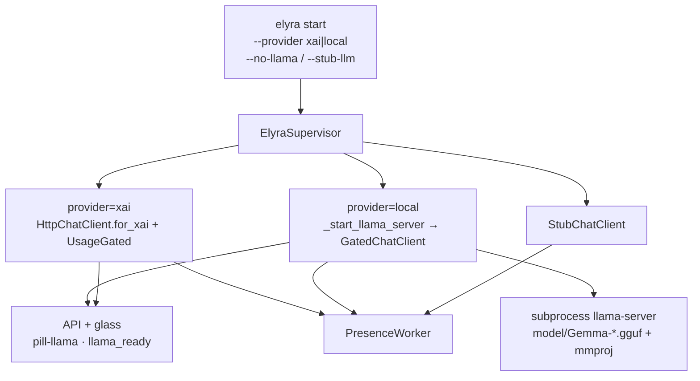
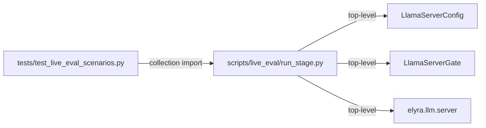
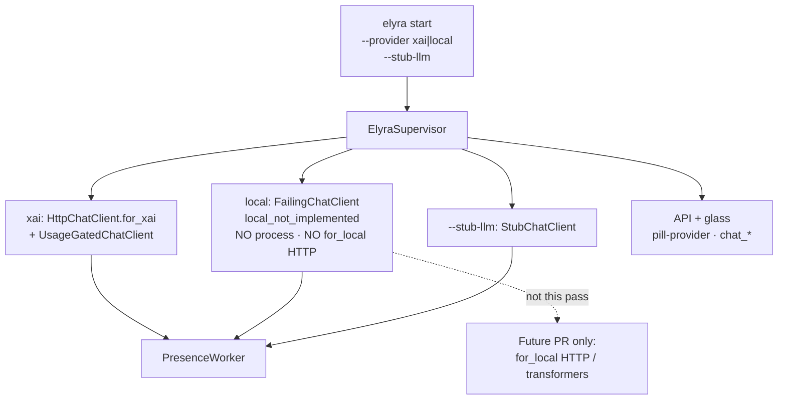
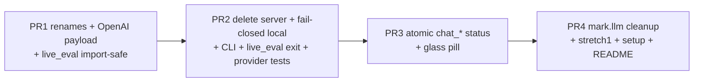

# Design: Modernize project — remove llama.cpp Gemma path; stub local providers

| Field | Value |
|-------|--------|
| **Product** | project-elyra |
| **Workspace** | `/home/jim/Workspace/project-elyra` |
| **Branch base** | `grok-improvement` |
| **Date** | 2026-07-26 |
| **Status** | Engineer-ready (rev 3; approved) |
| **Authors** | design pass (Grok Build) |
| **Implementation docs freeze** | Do **not** bulk-edit existing `docs/` corpus in this pass |

---

## Overview

Elyra’s product path on `grok-improvement` already defaults to **xAI Grok** (`provider.name = "xai"`), with usage metering and continuous work **OFF**. Residual **llama.cpp + Gemma GGUF** infrastructure still ships in product code: process launch, GGUF/mmproj hardcodes, Gemma-named sampling constants, CLI flags (`--no-llama`, `--context-tokens`), glass `pill-llama`, live `@pytest.mark.llm` fixtures, and `scripts/live_eval` orchestration.

This design fully **removes** the Gemma/llama-server consumption path from product code and setup, and **stubs** the `local` provider surface for a future re-implementation behind a thin **OpenAI Chat Completions–compatible** interface (vLLM / Ollama OpenAI mode / llama.cpp-server OpenAI / optional transformers sidecar). No full local stack is implemented in this pass.

**Behavioral break (explicit):** today `provider=local` + no llama → silent `StubChatClient`. After this work, that combo → **`FailingChatClient("local_not_implemented")`**. Hermetic UI dogfood is **`--stub-llm` only** (not `--provider local` alone, and not the removed `--no-llama`).

**Out of scope for implementation PRs:** bulk rewrite of freeze docs under `docs/` (inventory only). Root `README.md`, scripts, product code, and tests **are** in scope.

**CI invariant (every PR):** full `pytest -q` green, including `tests/test_live_eval_scenarios.py` (collection-time import of `run_stage`). No intermediate commit deletes `server.py` or renames types without updating live_eval + all call sites (or temporary aliases). No intermediate commit renames status keys without glass+API in the same PR.

---

## Background & Motivation

### Current architecture (as of exploration)



**Product default is already Grok**, but local still means “start llama-server with hard-coded Gemma weights”:

| Layer | File(s) | Gemma / llama coupling |
|-------|---------|------------------------|
| Launch argv | `elyra/llm/server.py` | `DEFAULT_MODEL_FILENAME = "Gemma-4-12B-OBLITERATED-Q4_K_M.gguf"`, `mmproj-BF16.gguf`, `llama.cpp/llama-server` |
| Config | `elyra/llm/config.py` `LlamaServerConfig` | port 8080, `GEMMA_TOP_P/K`, reasoning/thinking_budget wire fields |
| Constants | `elyra/llm/constants.py` | `GEMMA_TOP_P`, `GEMMA_TOP_K`, llama `-c` ceiling comments |
| Client | `elyra/llm/client.py` | `for_local` + `_build_local_payload` (top_k, reasoning, thinking_budget; **no `model` key today**) |
| Gate | `elyra/llm/queue.py` | `LlamaServerGate` / `LlamaQueueShutdown` |
| Supervisor | `elyra/runtime/supervisor.py` | `_start_llama_server`, health poll, proc lifecycle |
| Runtime config | `elyra/runtime/config.py` | `start_llama_server`, `llama: LlamaServerConfig` |
| State / API | `elyra/runtime/state.py`, `api.py` | `llama_pid/ready/error`, `llama_busy` / `llama_operation` |
| Glass | `runtime/web/index.html`, `app.js` | `id="pill-llama"`, “llama ready/busy/off”; xAI still reads `llama_error === "stub_llm"` |
| CLI | `elyra/cli.py` | `--no-llama`, `--context-tokens` as llama `-c` |
| Settings | `elyra/settings.py` | `context_tokens` only used for llama `-c` |
| Setup | `scripts/setup_venv.sh` | symlink `model/` → `aurimago/project-elyra2/model` |
| Tests | mark.llm fixtures, provider_runtime, stretch1, config | real server on `:8080`; stub-on-no-llama assertion |
| Live eval | `scripts/live_eval/run_stage.py` | **module-level** imports of server/config/gate |
| Live eval tests | `tests/test_live_eval_scenarios.py` | `from run_stage import Scenario, load_scenarios` at collection |

### Import coupling (CI risk)



Any rename of config/gate **or** deletion of `server.py` without updating `run_stage.py` in the **same PR** turns the default pytest suite red (not only live eval runs).

### Why remove now

1. **Product tip is Grok** — dual path confuses setup (`elyra start --no-llama` README still implies “full stack = llama”).
2. **Gemma hardcodes are non-portable** — obliterated GGUF name, mmproj, Vulkan binary layout from project-elyra2.
3. **Future local is not llama.cpp-only** — transformers *or* OpenAI-compat servers behind one adapter.
4. **Maintenance cost** — live eval, mark.llm, health waits, VRAM `-c` knobs are Gemma-era debt.

### What stays

- `ChatClient` protocol, `HttpChatClient.for_xai`, tools wire shape, usage meter, provider prefs, auth (`grok_build` / `api_key`).
- Channel hygiene module (`reasoning_hygiene.py`) as **generic** marker strip (scrub Gemma-only comments; keep behavior).
- Meal policy constants: `DEFAULT_SLIDING_INPUT_TOKENS`, `GENERATION_*`, `CONTEXT_BUDGET_TOKENS` (scrub llama-server comments; see §8).
- Continuous default OFF; xAI usage meter unchanged.

---

## Goals & Non-Goals

### Goals

1. **Fully remove** llama.cpp + Gemma consumption from product code and setup (no subprocess, no GGUF/mmproj, no auto-bind `:8080` llama-server).
2. **Stub** `provider=local` for future backends (OpenAI-compat HTTP and/or transformers) — **interface only this pass**.
3. **Modernize setup**: Grok/auth primary; no `model/` GGUF requirement; README + `setup_venv.sh` + CLI flags.
4. **Remove explicit Gemma references** from code, tests, setup, glass strings, and non-docs comments.
5. Keep product path **xAI Grok** + thin adapter surface for local.
6. **Every stacked PR leaves CI green** (full pytest, including live_eval scenario collection).

### Non-Goals

- Implement transformers, vLLM packaging, GPU installers, or full OpenAI-compat server lifecycle.
- Call `HttpChatClient.for_local` from supervisor / provider_runtime this pass (unit-test the factory only).
- Bulk rewrite of freeze docs under `docs/` — **inventory only**.
- Change xAI auth model, curated model allowlist, or usage meter policy.
- Enable continuous work by default.
- Make live qualitative Gemma stage gates pass again.
- Dual-write status JSON keys for external scrapers.

### Critical constraint on `docs/`

| Allowed this pass | Not allowed without future pass |
|-------------------|----------------------------------|
| Inventory table of superseded / historical docs | Bulk rewrite of freeze designs |
| Optionally **one new** design file under `docs/` when implementing | Edit `stretch-1.md`, `inference.md`, `live-eval.md`, `design-gemma-*`, phase freezes as “source of truth” |
| Root `README.md` updates | Treating old freezes as active product procedure |

Root README must label linked freezes explicitly, e.g. **“historical freeze — do not follow for setup”** next to `docs/inference.md`.

---

## Proposed Design

### 1. Target architecture



### 1.1 Behavior matrix (old → new) — **normative**

| Operator command (old) | Old outcome | New outcome |
|------------------------|-------------|-------------|
| `elyra start` (default xai, creds OK) | Grok HTTP + meter | **Unchanged** |
| `elyra start` (xai, no creds) | `FailingChatClient` | **Unchanged** |
| `elyra start --stub-llm` | `StubChatClient`; may still start llama if local+flags | `StubChatClient` **only**; never starts inference process |
| `elyra start --no-llama` | skip llama; **does not** force stub (Phase 0 footgun) | **Flag removed** — argparse error; use `--stub-llm` |
| `elyra start --provider local` (llama ready) | real Gemma HTTP | **No launch**; `FailingChatClient("local_not_implemented")` |
| `elyra start --provider local --no-llama` | `StubChatClient` + warning | **→** `elyra start --provider local` → Failing; for UI use `--stub-llm` |
| `elyra start --provider local --stub-llm` | stub (+ optional llama start today) | `StubChatClient`; `chat_error=stub_llm`; no process |
| `elyra start --context-tokens N` | llama `-c` | **Flag removed** |

**Hermetic UI path:** `elyra start --stub-llm` only.  
**`--provider local` alone is not a UI dogfood path** — moments refuse (`can_open_model_moment` False because Failing).

| `provider` | `--stub-llm` | Client | `can_open_model_moment` | `chat_ready` | `chat_error` |
|------------|--------------|--------|---------------------------|--------------|--------------|
| `xai` | no | HTTP or Failing(cred) | True only if creds+meter OK | True if HTTP usable | `null` or credential detail via existing fields; not chat_error for creds |
| `xai` | yes | Stub | True\* (stub not Failing) | False | `stub_llm` |
| `local` | no | Failing(`local_not_implemented`) | **False** | False | `local_not_implemented` |
| `local` | yes | Stub | True\* | False | `stub_llm` |

\*Stub is not `FailingChatClient`, so `can_open_model_moment` may be True if usage allows — intentional for hermetic moment/UI tests. Product dogfood with real model remains xAI.

---

### 2. Removal inventory

#### 2.1 Delete entirely

| Symbol / artifact | Location | Notes |
|-------------------|----------|-------|
| `build_server_command` | `elyra/llm/server.py` | Entire module removable |
| `validate_model_paths` | `elyra/llm/server.py` | Tied to GGUF/mmproj layout |
| `DEFAULT_MODEL_FILENAME`, `DEFAULT_MMPROJ_FILENAME`, `DEFAULT_SERVER_BINARY` | `elyra/llm/server.py` | Gemma hardcodes |
| `_start_llama_server`, `_wait_for_llama` | `elyra/runtime/supervisor.py` | subprocess + `/health` |
| `_llama_proc` field + shutdown kill | `elyra/runtime/supervisor.py` | |
| `start_llama_server` | `elyra/runtime/config.py` | Derive no longer needed |
| CLI `--no-llama` | `elyra/cli.py` | Removed; document `--stub-llm` |
| CLI `--context-tokens` | `elyra/cli.py` | Was only llama `-c` |
| `Settings.context_tokens` + merge paths | `elyra/settings.py`, `runtime/config.py` | Dead without CLI/server — **delete** |
| `DEFAULT_REASONING_BUDGET_TOKENS` | `elyra/llm/constants.py` | Dead when local drops thinking_budget wire; **delete** (or leave only if a non-local caller remains — none) |
| `GEMMA_TOP_P` / `GEMMA_TOP_K` | `elyra/llm/constants.py` | Remove |
| setup model symlink block | `scripts/setup_venv.sh` | No GGUF tree required |
| Real live fixtures `live_llama_server` | `tests/test_doloop.py`, `tests/test_llm_client_tools.py` | `@pytest.mark.llm` real Gemma |
| `tests/test_config.py` server-command tests | `build_server_command` only | Drop with module |

#### 2.2 Rename / reframe

| Current | After | Rationale |
|---------|-------|-----------|
| `LlamaServerConfig` | `LocalClientConfig` | Rename PR1 (launch fields retained); final OpenAI-compat base_url shape PR2 |
| `LlamaServerGate` / `LlamaQueueShutdown` | `ChatRequestGate` / `ChatGateShutdown` | Provider-neutral single-flight gate |
| `RuntimeState.llama_ready` / `llama_error` / `llama_pid` | **`chat_ready` / `chat_error`**; drop `llama_pid` | **Provider-neutral inference posture** (not “local-only”) — see §6 |
| API `llama_busy` / `llama_operation` | `chat_busy` / `chat_operation` | Gate is not llama-specific |
| Glass `#pill-llama` | `#pill-provider` | Provider-aware pill |
| `RuntimeConfig.llama` | `RuntimeConfig.local: LocalClientConfig` | Name matches provider; **unused for HTTP this pass** |
| `ProviderRuntime.llama_config` | `local_config` | Same |
| `RuntimeState.set_llama` | `set_chat_posture(ready, error)` | Neutral |
| `HttpChatClient.for_local` | keep; OpenAI-compat payload; **unit-tested only this pass** | Future wire |
| `GatedChatClient` | keep; takes `ChatRequestGate` | Unused on product xAI path this pass |

**Temporary aliases (PR1 only, if not doing a single mechanical rename PR):**

```python
# elyra/llm/config.py — remove in PR2 when server.py dies and all imports updated
LocalClientConfig = ...
LlamaServerConfig = LocalClientConfig  # DEPRECATED alias

# elyra/llm/queue.py
ChatRequestGate = ...
LlamaServerGate = ChatRequestGate  # DEPRECATED alias
LlamaQueueShutdown = ChatGateShutdown
```

Prefer **repo-wide mechanical rename in PR1** without long-lived aliases if the diff stays reviewable; aliases are the safety valve for green CI, not a multi-release compat layer. Aliases **must** be gone by end of PR2.

#### 2.3 Comment / string scrub only

| File | Action |
|------|--------|
| `elyra/llm/reasoning_hygiene.py` | Channel-protocol markers narrative; keep regex |
| `elyra/llm/constants.py` | Meal policy comments; scrub “llama-server -c” / Gemma thrash on `DEFAULT_CHAT_TEMPERATURE` |
| `elyra/tools/schema.py` | “OpenAI function-tools” only |
| `elyra/llm/__init__.py` | “LLM clients and provider adapters” |
| `elyra/settings.py` | Fix “runtime still starts local/llama” |

#### 2.4 Live eval script (code, not docs/)

`scripts/live_eval/run_stage.py` has **module-level** imports of `LlamaServerConfig`, `LlamaServerGate`, `build_server_command`, `validate_model_paths`.  
`tests/test_live_eval_scenarios.py` imports `Scenario` / `load_scenarios` at collection time.

**Normative (KD13):**

1. **Before or in the same PR as type renames / `server.py` deletion:** make `run_stage` **import-safe** for hermetic collection:
   - Keep `Scenario`, `load_scenarios`, and YAML loading free of server imports.
   - Move any remaining server/llama helpers behind functions used only by the (dying) ensure path, **or** remove those helpers entirely and make `main()` print fail-closed and `sys.exit(2)`.
2. **In the launch-removal PR (PR2):** fail-closed operator message: Gemma/llama path removed; use xAI dogfood / future OpenAI-compat eval. Do not import deleted modules.
3. Full stage retarget to xAI is **out of scope** (optional later).
4. Do **not** rewrite `docs/live-eval.md`. Historical logs under `scripts/live_eval/logs/` stay.
5. `scripts/live_eval/scenarios.yaml` may still mention Gemma sampling ablations — inert once runner fail-closes; hermetic loader tests continue to load scenarios.

---

### 3. Local provider stub interface

#### 3.1 LocalClientConfig — interim (PR1) vs final (PR2+) field matrix

**§3.1 end-state sketch is end-of-stack (after PR2), not necessarily end-of-PR1.**  
PR1 keeps `server.py` + supervisor launch alive; those still need launch-compatible fields. Collapsing to base_url-only while launch remains will break CI.

| Field / concern | **PR1** (launch + `server.py` still present) | **PR2+** (server deleted; end-of-stack) |
|-----------------|-----------------------------------------------|------------------------------------------|
| Identity | Rename class → `LocalClientConfig` (aliases OK until PR2) | Same name |
| `host` / `port` | **Keep** (defaults `127.0.0.1` / `8080`) for argv + health | **Drop** |
| `chat_path` | Keep; may still be `/v1/chat/completions` **or** dual-derive from base | Prefer `base_url` + `/chat/completions` join |
| `base_url` | **Optional interim:** property `f"http://{host}:{port}/v1"` for client tests **or** unused until PR2 | **Primary** field (default `http://127.0.0.1:8080/v1`) |
| `health_url` | **Keep** property `http://{host}:{port}/health` for `_wait_for_llama` / live_eval ensure | **Drop** with launch |
| `use_reasoning` / `reasoning_budget` | **Keep** for `build_server_command` argv only | **Delete** with server |
| `default_reasoning_budget_tokens` | May remain on config until payload no longer reads it | **Delete** with thinking_budget wire path / constant |
| Wire HTTP payload | **PR1:** include `model`; omit `reasoning` / `thinking_budget_tokens`; no GEMMA `top_p`/`top_k` product defaults (`top_p`/`top_k` optional None) | Unchanged |
| `api_key` + Bearer on `for_local` | **PR1** unit-test only (optional field) | Unchanged |
| `model` field on config | Add for payload | Keep |
| Process launch | Still via supervisor + `server.py` | **Gone** |
| Runtime `for_local` | Still may be called if local+llama ready (old path) until PR2 | **Never** from supervisor/provider |

**Recommended PR1 strategy (normative):** mechanical rename + OpenAI-compat **payload** + import-safe live_eval; **retain launch-compatible fields** (`host`/`port`/`health_url`/`use_reasoning`/`reasoning_budget`) so `server.py` compiles without URL-parse tax. PR2 deletes server and **reshapes** config to final sketch below.

**Not recommended in PR1:** final base_url-only shape while launch remains (forces awkward `urlparse` in `build_server_command`), or merging full server deletion into PR1 unless the combined diff stays reviewable **and** live_eval is fail-closed in the same PR (then field reshape can land immediately).

#### 3.1b Final LocalClientConfig contract (**end of PR2 / end-of-stack**)

```text
┌─────────────────────────────────────────────────────────────────┐
│ LocalClientConfig — END OF STACK (after PR2)                     │
│ • OpenAI-compat endpoint shape only (no process fields)          │
│ • RuntimeConfig.local always default-constructed                 │
│ • Supervisor / ProviderRuntime NEVER call                        │
│     HttpChatClient.for_local(...)                                │
│ • Cold start + _rebuild_local → FailingChatClient(               │
│     "local_not_implemented") unless --stub-llm                   │
│ • for_local retained and unit-tested against fake HTTP only      │
│ • No process launch, no health poll, no model/ validation        │
└─────────────────────────────────────────────────────────────────┘
```

```python
# elyra/llm/config.py — FINAL sketch (land in PR2 when server.py dies)

@dataclass(frozen=True)
class LocalClientConfig:
    """OpenAI-compatible local/self-hosted chat endpoint (future use).

    After PR2: never launched; not wired from supervisor.
    """

    base_url: str = "http://127.0.0.1:8080/v1"
    chat_path: str = "/chat/completions"  # join like XaiClientConfig
    model: str = "local"
    connect_timeout: float = 10.0
    read_timeout: float = 600.0
    temperature: float = 0.7
    top_p: float | None = None
    top_k: int | None = None  # omit on wire when None
    api_key: str | None = None  # optional Bearer — never log / never status

    @staticmethod
    def _join(base: str, path: str) -> str:
        return base.rstrip("/") + (path if path.startswith("/") else f"/{path}")

    @property
    def chat_url(self) -> str:
        # e.g. http://127.0.0.1:8080/v1/chat/completions
        return self._join(self.base_url, self.chat_path)
```

**URL migration (completes in PR2):**

| Old (`LlamaServerConfig` / PR1 interim) | Final (PR2+) |
|-----------------------------------------|--------------|
| `host` + `port` + `chat_path="/v1/chat/completions"` | `base_url="http://{host}:{port}/v1"` + `chat_path="/chat/completions"` |
| `health_url` → `http://host:port/health` | Dropped (no launch). Future: optional `GET {base_url}/models` |

**Hermetic test construction (PR1 may still use host/port; PR2+ prefer base_url):**

```python
# PR2+ / final:
cfg = LocalClientConfig(base_url=f"http://127.0.0.1:{port}/v1")
client = HttpChatClient.for_local(cfg)
# assert client.chat_url == f"http://127.0.0.1:{port}/v1/chat/completions"

# PR1 interim (launch fields retained) also valid:
# cfg = LocalClientConfig(host="127.0.0.1", port=port)
```

**Bearer rule (unit-test only; PR1+):** when `api_key` is non-empty, `for_local` sets `Authorization: Bearer <api_key>` (same non-logging rule as xAI). When `None`/empty, omit Authorization. Status JSON never includes the key.

**Final removals (PR2):** `use_reasoning`, `reasoning_budget`, `default_reasoning_budget_tokens`, host/port/`health_url`, Gemma `top_p`/`top_k` product defaults.

`XaiClientConfig` stays as today. `ProviderSettings.base_url` remains xAI-oriented; **do not** partially wire it into local HTTP this stack.

#### 3.2 Client payload (OpenAI-compat local)

| Field | xAI | local (after) |
|-------|-----|----------------|
| `model` | required | **required** (`LocalClientConfig.model`) — **intentional wire change** (today local omits `model`) |
| `messages`, `max_tokens`, `temperature`, `stream:false` | yes | yes |
| `tools` / `tool_choice` | yes | yes |
| `top_p` | optional | optional |
| `top_k` | never | omit unless non-None |
| `reasoning` / `thinking_budget_tokens` | never | **never** this pass |

Unit tests **must** assert: local body includes `model`; omits `reasoning` / `thinking_budget_tokens`; omits `top_k` when None.

Prefer shared `_build_openai_payload` or make local payload match xAI field set (+ optional Bearer from `api_key`).

#### 3.3 Supervisor / ProviderRuntime

**After PR2 (end-of-stack):**

```text
if stub_llm:
    chat_client = StubChatClient()
    set_chat_posture(ready=False, error="stub_llm")
elif provider == "xai":
    # existing resolve_bearer + for_xai / Failing path
    # set_chat_posture(ready=credential_ok_and_http, error=None)
    # do NOT set chat_error="provider_xai" — that was a llama_error abuse;
    # xAI "no llama" is implicit (no process). chat_ready reflects client usability.
elif provider == "local":
    chat_client = FailingChatClient("local_not_implemented")
    set_chat_posture(ready=False, error="local_not_implemented")
    # NEVER for_local, NEVER spawn process
```

`ProviderRuntime._rebuild_local` must match after PR2: Failing / Stub only — **never** open HTTP to default `:8080`.

**PR1 only:** launch path may still exist; local + ready server may still use `for_local` + gate (old behavior) so full pytest stays green until PR2 cuts the process.

#### 3.4 Future backends (document only)

```text
ChatClient
  └── HttpChatClient (OpenAI Chat Completions HTTP)  # for_local future-wired
  └── StubChatClient / FailingChatClient
  └── (future) TransformersChatClient
```

Future enablement (not this stack): settings flag or non-default `base_url` + health probe → `for_local` + optional `GatedChatClient`. No Gemma GGUF names.

---

### 4. Setup after change

#### 4.1 `scripts/setup_venv.sh`

Remove model symlink block and `--no-llama` hints. End-user:

```bash
# Grok (product default)
#   grok login   # or set XAI_API_KEY / paste key in glass Status
#   elyra start
# Hermetic UI / no remote calls:
#   elyra start --stub-llm
# Local self-hosted: not implemented (provider=local fails closed)
```

#### 4.2 Root `README.md` (allowed)

- Architecture: LLM = **xAI Grok** (default); local reserved/unimplemented.
- Drop Gemma GGUF / “real local Gemma via llama-server” procedure.
- Flags: remove `--no-llama` / `--context-tokens`; keep `--stub-llm`, `--provider`, …
- **Status JSON field renames** one-liner for operators/scrapers (clean break; no dual-write).
- Next to `docs/inference.md` link: **“historical freeze — do not follow for setup (Gemma/llama.cpp path removed).”**
- Do not bulk-edit freezes.

**Stretch1 / README string pin (PR4 — normative):**  
`tests/test_stretch1_donewhen.py` (`test_readme_documents_llm_marker_and_donewhen`) asserts the README still contains the substring **`pytest -m llm`** (and typically `pytest -m 'not llm'`). PR4 **must** either:

1. **Keep** a short Testing subsection line such as:  
   `pytest -m 'not llm'` (default) · `pytest -m llm` reserved for optional future OpenAI-compat live path (not wired; skips/unavailable without endpoint), **or**  
2. Rewrite that stretch1 test in the **same PR** if the README wording changes enough to drop the substring.

Do not remove every `pytest -m llm` string without updating the test.

#### 4.3 `model/` path

- Keep `ElyraPaths.model_dir` for future weights; no validate-on-start.
- Existing operator symlinks harmless; setup does not create them.

#### 4.4 `pyproject.toml`

```toml
markers = [
    "llm: optional live LLM (OpenAI-compat local/remote); skipped when unavailable",
    "microsandbox: ...",
]
```

No llama/transformers extras this pass.

---

### 5. Test strategy

#### 5.1 Keep green by default

Full `pytest -q` without GPU, without `model/`, without port 8080 — **every PR**.

Always include: `pytest tests/test_live_eval_scenarios.py -q`.

#### 5.2 Real Gemma `@pytest.mark.llm` tests

| Current | Action |
|---------|--------|
| `live_llama_server` + real tests in client_tools / doloop | **Delete** in PR4 |
| Fake HTTP + old config | Retarget to `LocalClientConfig` + OpenAI-compat asserts (PR1) |
| `test_product_defaults_send_gemma_card_truncation` | **Delete** |
| `test_local_payload_still_sends_gemma_fields` | Rewrite: sends `model`; omits reasoning/thinking_budget |
| `test_xai_payload_..._omits_gemma_fields` | Rename to non-OpenAI / extension fields |
| `test_config.py` server command | **Delete** with server.py (PR2) |
| `test_provider_runtime.py` (by name) | **PR2 rewrites** — see list below |
| `test_api_glass.py` `pill-llama` / status keys | **PR3** atomic with renames |
| stretch1 DONE_WHEN claim + `test_llm_marker_registered` | **PR4** per KD6 |

**`test_provider_runtime.py` must-rewrite (PR2):**

- `test_runtime_config_start_llama_derived` → no `start_llama_server`; assert local never starts process
- `test_cli_no_llama_does_not_force_stub` → remove; replace with “no `--no-llama` flag” / stub-only forces stub
- `test_supervisor_local_no_llama_uses_stub_not_failing` → **invert**: local no-launch uses **Failing**, not Stub; `can_open_model_moment is False`
- `test_supervisor_does_not_start_llama_for_xai` → no llama start methods exist / no process for xai

**All `start_llama_server=` / `no_llama=` / `context_tokens=` call sites (PR2 — not only named tests):**

```bash
rg -n 'start_llama_server|no_llama|context_tokens' tests elyra scripts
```

Known extra (easy miss): **`tests/test_sandbox_status.py`** constructs `RuntimeConfig(..., start_llama_server=False)` (~lines 269, 320). Drop the kwarg when the field is removed (PR1 may only rename gate imports; **PR2** clears these kwargs). Any other hits from the rg above are in the same PR2 touch list.

#### 5.3 Marker policy (**KD6 — normative**)

1. Keep `llm` marker **registered** in `pyproject.toml` with OpenAI-compat wording (no “Gemma”).
2. **Do not** require `@pytest.mark.llm` presence in `test_doloop.py` / `test_llm_client_tools.py` after real tests deleted.
3. Rewrite `test_llm_marker_registered` to assert only: marker string in `pyproject.toml` (+ optional README mentions `pytest -m 'not llm'`). Stop requiring “Gemma” / mark decorators in those two modules.
4. **No** forever-skipped empty placeholder tests in doloop/client_tools.
5. Optional future module `tests/test_llm_live_openai_compat.py` (not this stack) skipped without `ELYRA_LOCAL_BASE_URL`.

#### 5.4 Stretch1 DONE_WHEN claim + related asserts (**PR4**)

| Old claim key (code) | New claim key |
|----------------------|---------------|
| `"llama.cpp Gemma path works; context policy documented"` | `"xAI Grok path + local stub surface; sliding context policy in constants"` |

Covering modules map to: `test_llm_provider_client.py` / hermetic client tests, `test_loop_context.py`, `test_provider_runtime.py`, constants/settings tests — **not** live Gemma fixtures.

Update any assertion that greps the old claim text in the same PR.

**Also in PR4 (or same PR that would touch them):**

| Test | Normative handling |
|------|-------------------|
| `test_llm_marker_registered` | Per KD6: pyproject marker only; no `@pytest.mark.llm` required in doloop/client_tools |
| `test_readme_documents_llm_marker_and_donewhen` | Keep README `pytest -m llm` substring (§4.2) **or** edit test same PR |
| `test_context_ceiling_vs_sliding_defaults` | **Keep** `CONTEXT_WINDOW_TOKENS == 86_000` this stack (comment scrub only in constants). Do **not** delete/rename the constant without updating this assert in the **same PR**. Prefer keep value + scrub “llama `-c`” comments. Sliding still must be `< CONTEXT_WINDOW_TOKENS`. |
| `test_inference_docs_document_ceiling_vs_sliding` | Reads frozen `docs/inference.md` only — **do not** rewrite freeze; leave test as historical doc presence check |

#### 5.5 Hermetic coverage replacing live Gemma value

- `HttpChatClient` fake-server: tools parse + local/xai payload shape (incl. local `model` key).
- Scripted `StubChatClient` do-loop tests (existing majority of `test_doloop.py`).
- Provider runtime: local → Failing; rebuild does not HTTP-dial `:8080`.
- Glass pill matrix + status field tests (PR3).

---

### 6. Glass / API — provider-neutral `chat_*` posture

#### 6.1 Why not `local_*`

Today `llama_error` holds **`stub_llm`**, **`provider_xai`**, and local failure strings — **cross-provider inference/client posture**, not “local provider only.” Renaming to `local_error` while retaining those codes would lie in the API. Glass xAI path still checks `s.llama_error === "stub_llm"`.

**Normative (KD14):** provider-neutral fields aligned with `chat_busy`:

| Old field | New field | Semantics |
|-----------|-----------|-----------|
| `llama_ready` | **`chat_ready`** | True when the active chat stack can serve real (non-stub, non-failing) completions |
| `llama_error` | **`chat_error`** | Posture code or `null`: `stub_llm`, `local_not_implemented`, … — **not** xAI credential codes (those stay `credential_detail`) |
| `llama_pid` | **removed** | No inference process this pass |
| `llama_busy` | **`chat_busy`** | Gate busy (false on product xAI while gate unused) |
| `llama_operation` | **`chat_operation`** | Gate label or `null` |

**Stop setting** `chat_error="provider_xai"`. For xAI, absence of a local process is normal; readiness is `chat_ready` from credential/HTTP stack. Credential failures use existing `credential_ok` / `credential_detail`.

**Compatibility:** clean break on `grok-improvement`; no dual-write. In-repo consumer only: `runtime/web/app.js` + tests. Out-of-repo `/api/status` scrapers break — note in root README.

**Atomicity (KD15):** `RuntimeState` fields + `api.py` injection + `app.js` / `index.html` + glass/API tests land in **one PR**. No intermediate merge where snapshot emits `chat_*` while glass still reads `llama_*`.

#### 6.2 Example status JSON fragments

**xai, creds OK, not stub:**

```json
{
  "provider": "xai",
  "credential_ok": true,
  "chat_ready": true,
  "chat_error": null,
  "chat_busy": false,
  "chat_operation": null
}
```

**xai + `--stub-llm`:**

```json
{
  "provider": "xai",
  "chat_ready": false,
  "chat_error": "stub_llm",
  "chat_busy": false
}
```

**local (not stub):**

```json
{
  "provider": "local",
  "credential_ok": true,
  "chat_ready": false,
  "chat_error": "local_not_implemented",
  "chat_busy": false
}
```

**local + `--stub-llm`:**

```json
{
  "provider": "local",
  "chat_ready": false,
  "chat_error": "stub_llm",
  "chat_busy": false
}
```

#### 6.3 Pill matrix (`#pill-provider`)

| provider | stub | credential_ok | chat_error | usage hard_stop | chat_busy | Pill label | CSS class |
|----------|------|---------------|------------|-----------------|-----------|------------|-----------|
| xai | no | false | — | — | — | `xai auth` | pill-off |
| xai | no | true | null | yes, no override | — | `xai limit` | pill-off |
| xai | no | true | null | override | — | `xai ovrd` | pill-busy |
| xai | no | true | null | no | true | `xai busy` | pill-busy |
| xai | no | true | null | no | false | `xai ready` | pill-on |
| xai | yes | * | stub_llm | — | — | `stub llm` | pill-off |
| local | no | * | local_not_implemented | — | — | `local off` | pill-off |
| local | yes | * | stub_llm | — | — | `stub llm` | pill-off |

**This pass:** never show `local ready`. `chat_busy` on product xAI stays false unless a gate is later attached; glass may still branch on `chat_busy` without a dead “always busy” affordance — only show busy when true.

No `.pill-llama` CSS class exists today (id-only); renaming id is sufficient.

#### 6.4 Provider card

- `provider=local` badge: `n/a` / not `ok` while unimplemented.
- Model picker: single `local` or disabled.

---

### 7. Docs inventory (no rewrites)

| Path | Classification | Notes after this work |
|------|----------------|------------------------|
| `docs/inference.md` | **Superseded / historical** | llama.cpp + Gemma 4; README labels “do not follow for setup” |
| `docs/design-gemma-sampling-hygiene-staged.md` | **Historical freeze** | Hygiene code remains |
| `docs/live-eval.md` | **Superseded procedure (Gemma stages)** | Protocol idea reusable |
| `docs/stretch-1.md` | **Historical done-when** | Gemma checkbox true at Stretch 1 ship |
| `docs/design-stretch-1-implementation.md` | **Historical** | Assumed local llama default |
| `docs/design-tool-thrash-recovery.md` | **Historical evidence** | Policies remain |
| `docs/design-continuous-work-orient-ledger-reset.md` | **Historical motivation** | Policies remain |
| `docs/design-post-skill-commitment.md` | **Historical** | Gemma residual wording |
| `docs/project-status-pass.md` | **Partially stale** | Future status pass only |
| `docs/README.md` | **Stale reading order** | Future status pass |
| `docs/engineering-principles.md` | **Mostly valid** | Serialize single-slot local HTTP (conceptually) |
| `docs/tools-and-skills.md` / `time-and-identity.md` | **Mostly valid** | Historical Gemma wording |
| `docs/grok-improvement-plan/*` | **Active direction** | Aligns with this design |
| `docs/design-glass-aurimago-gold-polish.md` | **Historical UI freeze** | `pill-llama` snippet |
| Root `README.md` | **Update in this pass** | not under docs/ freeze |

Optional: land `docs/design-remove-gemma-local-stub.md` as **one new** file when implementing.

---

### 8. Data model / constants cleanup

- `data/runtime/provider.json` — unchanged (`model`, `credential_source`).
- **Delete** `Settings.context_tokens` and all merge/CLI paths; update `tests/test_settings.py`.
- Sliding window: `loop.sliding_input_tokens` / `DEFAULT_SLIDING_INPUT_TOKENS` stay.
- **Delete** `DEFAULT_REASONING_BUDGET_TOKENS` with local thinking_budget path (PR2 when payload no longer reads it; may lag to PR2 even if payload stops in PR1).
- **`CONTEXT_WINDOW_TOKENS = 86_000` — keep this stack** (normative). Scrub comments that say it is llama-server `-c`; treat as product KV/context ceiling documentation still referenced by meal-budget math and stretch1 `test_context_ceiling_vs_sliding_defaults`. Do **not** delete or change the value without updating that assert in the same PR. Product sliding policy remains `DEFAULT_SLIDING_INPUT_TOKENS` + generation reserves.
- `DEFAULT_CHAT_TEMPERATURE`: keep value if still used by configs; scrub Gemma thrash comments (xAI uses `XaiClientConfig.temperature` separately).

---

### 9. Observability

- Startup log: provider, credential_ok, usage posture.
- Local (not stub): one warning — `local provider not implemented — use --provider xai or --stub-llm`.
- No llama health spam.
- Gate unused for xAI this pass → `chat_busy` typically false.

---

## API / Interface Changes

### CLI

| Flag | After |
|------|--------|
| `--provider {xai,local}` | keep |
| `--model` / `--credential-source` | keep |
| `--stub-llm` | keep; **only** hermetic UI path |
| `--no-usage-meter` | keep |
| `--no-llama` | **remove** |
| `--context-tokens` | **remove** |

Posture print: drop `llama:`; show `chat: ready|stub|local_not_implemented` as appropriate.

### Python surfaces

| Before | After |
|--------|-------|
| `elyra.llm.server` | **gone** |
| `LlamaServerConfig` | `LocalClientConfig` |
| `LlamaServerGate` | `ChatRequestGate` |
| `RuntimeConfig.start_llama_server` | removed |
| `RuntimeConfig.llama` | `local: LocalClientConfig` (unused for HTTP) |
| `ProviderRuntime.llama_config` | `local_config` |
| `RuntimeState.set_llama` | `set_chat_posture` |
| `llama_*` status | `chat_ready` / `chat_error` / `chat_busy` / `chat_operation` |

---

## Alternatives Considered

| Option | Decision |
|--------|----------|
| Keep llama forever behind local | **Reject** |
| Remove launch, keep Gemma payload fields | **Reject** |
| Remove Gemma; stub local + OpenAI-compat shape | **Accept** |
| Implement vLLM/transformers now | **Reject this pass** |
| Alias `--no-llama` → `--stub-llm` one release | **Reject** (document in README) |
| Dual-write `llama_*` + `chat_*` status keys | **Reject** (atomic rename only) |
| Name status `local_*` for cross-provider codes | **Reject** — use neutral `chat_*` (KD14) |
| Silent Stub for local without server (old behavior) | **Reject** — Failing (KD2) |
| Leave `Settings.context_tokens` as dead toml key | **Reject** — delete |

---

## Security & Privacy

- No change to secret storage.
- Removing local server reduces bind/argv surface.
- `LocalClientConfig.api_key` / Bearer: never status JSON, never exception strings, never logs.
- Failing detail codes only (`local_not_implemented`).

---

## Risks

| Risk | Severity | Mitigation |
|------|----------|------------|
| CI red mid-stack from live_eval imports | **Critical** | KD13: import-safe run_stage before/with renames & server delete; verify `test_live_eval_scenarios` every PR |
| Glass reads removed status keys mid-stack | **Critical** | KD15: state+API+glass atomic PR |
| Operator `--no-llama` muscle memory | Med | README; help epilog → `--stub-llm` |
| Local alone no longer stubs (UX break) | Med | Explicit matrix §1.1; test rewrite; README |
| Offline dogfood without Grok | Med | `--stub-llm`; future OpenAI-compat |
| Hygiene deleted as “Gemma-only” | Med | Keep module |
| `_rebuild_local` still dials :8080 | Med | Failing only; unit test |
| Out-of-repo status scrapers | Low | README changelog one-liner |
| Dead `context_tokens` / reasoning budget constants | Low | §8 delete normatively |

---

## Rollout Plan

1. Land design (optional `docs/design-remove-gemma-local-stub.md`).
2. Stacked PRs on `grok-improvement` (PR Plan below) — **green after each**.
3. Dogfood: `elyra start` (Grok); `elyra start --stub-llm` (UI).
4. Final product-tree `rg` clean (docs/ exempt).

---

## Open Questions (unresolved only)

1. **Retain `ElyraPaths.model_dir`?** Yes — unused this pass.
2. **Retarget live_eval to xAI this stack?** Later (not required).
3. **Gate wrap xAI?** No this pass.
4. **Rename provider id `local` → `openai_local`?** No — keep `local` string.

*(Failing vs Stub for local: resolved → KD2. Status field naming: resolved → KD14. Marker policy: resolved → KD6. context_tokens: resolved → delete §8 / KD5.)*

---

## References (codebase)

- `elyra/llm/server.py`, `client.py`, `config.py`, `constants.py`, `queue.py`, `reasoning_hygiene.py`
- `elyra/runtime/supervisor.py`, `config.py`, `provider_runtime.py`, `state.py`, `api.py`
- `elyra/runtime/web/index.html`, `app.js`
- `elyra/cli.py`, `elyra/settings.py`
- `scripts/setup_venv.sh`, `scripts/live_eval/run_stage.py`, `scripts/live_eval/scenarios.yaml`
- `tests/test_live_eval_scenarios.py`, `test_llm_*`, `test_doloop.py`, `test_provider_runtime.py`, `test_config.py`, `test_stretch1_donewhen.py`, `test_api_glass.py`, `test_api_routing.py`, `test_settings.py`, `test_reset.py`, `test_sandbox_status.py`, `test_provider_api.py`

---

## Key Decisions

| ID | Decision | Rationale |
|----|----------|-----------|
| **KD1** | Delete `elyra/llm/server.py` and all supervisor llama process lifecycle | Only concrete Gemma consumption path |
| **KD2** | `provider=local` → **no process**; **`FailingChatClient("local_not_implemented")`** (behavior change from silent Stub). Hermetic UI = **`--stub-llm` only** | Honest moments; `can_open_model_moment` False |
| **KD3** | `LocalClientConfig`: **PR1** rename + OpenAI-compat **payload** while **retaining launch fields** (host/port/health/use_reasoning) until server dies; **PR2** reshape to base_url-only final sketch + **never call `for_local` from supervisor/provider_runtime**; unit-test factory only | PR1 stays green with launch; end-state matches OpenAI-compat stub |
| **KD4** | Rename gate → `ChatRequestGate`; glass `#pill-provider`; status → **`chat_*`** (see KD14) | Neutral naming |
| **KD5** | Remove CLI `--no-llama` and `--context-tokens`; **delete `Settings.context_tokens`**; delete `DEFAULT_REASONING_BUDGET_TOKENS` with thinking_budget path | No dead config surface |
| **KD6** | Keep `llm` marker in pyproject (OpenAI-compat wording); **delete** real Gemma fixtures/tests; stretch1 **does not** require mark decorators in doloop/client_tools; rewrite DONE_WHEN claim string | Clear marker policy; no forever-skip theater |
| **KD7** | `docs/` freezes untouched; inventory only; root README + scripts updated; optional one new design file | User constraint |
| **KD8** | Keep `reasoning_hygiene` behavior; scrub Gemma-only comments | Still useful |
| **KD9** | live_eval fail-closed; **import-safe before/with renames and server deletion** (see KD13) | CI + operator clarity |
| **KD10** | Product default xAI Grok; continuous OFF; usage meter unchanged | Product constraints |
| **KD11** | No transformers/vLLM implementation this stack | Scope |
| **KD12** | Keep `ChatClient` + tools parse; thin adapters | Existing harness |
| **KD13** | **CI-safe ordering:** any PR that renames config/gate types or deletes `server.py` must leave `run_stage` + `test_live_eval_scenarios` collection-green in **that same PR**. Prefer live_eval import decoupling + fail-closed in launch-removal PR | Prevents default suite red mid-stack |
| **KD14** | Status fields are provider-neutral **`chat_ready` / `chat_error` / `chat_busy` / `chat_operation`** (not `local_*`). Drop `llama_pid`. Stop abusing error codes for “xai has no llama”. Credential failures stay on `credential_*` | Matches real multi-provider posture |
| **KD15** | **Atomic status rename:** state + API + glass HTML/JS + related tests in **one PR**. No dual-write keys | No broken intermediate dogfood |

---

## PR Plan

Stack on **`grok-improvement`**. **4 PRs.** Constraint: **full `pytest -q` green after each PR**, including `tests/test_live_eval_scenarios.py`. No commit leaves glass reading removed status keys.



### PR1 — Mechanical renames + OpenAI-compat local payload + live_eval import-safe

**Title:** `llm: LocalClientConfig + ChatRequestGate; OpenAI-compat local payload; live_eval import-safe`

**Scope:**

- Rename `LlamaServerConfig` → `LocalClientConfig` (repo-wide **or** define new + temporary aliases removed by PR2).
- Rename gate types similarly (repo-wide or aliases).
- Align local **HTTP payload** with OpenAI subset (`model` required on wire; no reasoning/thinking_budget on wire; drop GEMMA_* product defaults).
- **Config fields (interim — see §3.1 matrix):** **retain** `host`/`port`/`health_url`/`use_reasoning`/`reasoning_budget` so `server.py` `build_server_command` and supervisor health wait still compile. Do **not** force final base_url-only shape in PR1.
- Update **all** product imports that must compile: `server.py` (still present), `supervisor.py`, `provider_runtime.py`, `runtime/config.py`, `api.py`, tests that import gate/config.
- **`scripts/live_eval/run_stage.py`:** decouple collection-safe path — `Scenario` / `load_scenarios` must not depend on modules PR2 will delete; update to new type names; lazy-import server helpers only inside ensure path **or** keep ensure compiling against interim fields.
- Hermetic unit tests: `test_llm_provider_client.py`, `test_llm_client_tools.py` (payload, **not** real mark.llm deletion yet). Fake servers may still use host/port interim construction.
- Gate rename touch: `test_reset.py`, `test_sandbox_status.py`, `test_provider_api.py`, etc. (**do not** remove `start_llama_server=` kwargs until PR2).

**Non-scope:** process deletion, CLI flag removal, final base_url-only reshape, glass id rename, mark.llm real test deletion, README, `Settings.context_tokens` delete.

**Verify:**

```bash
pytest -q
pytest tests/test_live_eval_scenarios.py tests/test_llm_provider_client.py tests/test_llm_client_tools.py -q
```

---

### PR2 — Delete launch path + fail-closed local + CLI + live_eval fail-closed

**Title:** `runtime: remove llama-server/Gemma launch; local Failing; CLI flags; live_eval fail-closed`

**Scope:**

- **Delete** `elyra/llm/server.py`.
- Supervisor: remove `_llama_proc` / start / wait; local → Failing per KD2; `_rebuild_local` never `for_local`.
- **Reshape `LocalClientConfig` to final §3.1b sketch:** drop host/port/`health_url`/`use_reasoning`/`reasoning_budget`; primary `base_url` + `chat_path`; update hermetic tests that constructed host/port-only configs.
- Remove temporary aliases if any remain.
- `RuntimeConfig`: drop `start_llama_server`; `llama` → `local` (default factory only).
- CLI: remove `--no-llama`, `--context-tokens`; posture print.
- **Delete** `Settings.context_tokens` + merge paths; delete `DEFAULT_REASONING_BUDGET_TOKENS` / remaining GEMMA_* if not already gone. **Keep** `CONTEXT_WINDOW_TOKENS = 86_000` (comment scrub only).
- `scripts/live_eval/run_stage.py`: fail-closed `main()` (no imports of deleted server); keep scenario loaders import-safe.
- Rewrite `tests/test_provider_runtime.py` cases listed in §5.2; drop `test_config.py` server tests; settings tests for removed keys.
- **Clear all remaining `start_llama_server=` / `no_llama=` / `context_tokens=`** in tests (including **`tests/test_sandbox_status.py`** RuntimeConfig constructors) — verify with `rg` in §5.2.
- **Do not** rename status JSON keys yet if that would desync glass (prefer keep `llama_*` emission until PR3 **or** do PR3 immediately after — **must not merge PR2 with state renames without glass**).

**Recommended split detail:** PR2 may keep **emitting** old status key names (`llama_ready`, …) while behavior is fail-closed/no process, **or** merge PR2+PR3 if the combined diff is still reviewable. **If PR2 renames state fields, PR3 content must be in the same PR (KD15).** Default plan: **behavior in PR2, field rename+glass in PR3**, with PR2 still setting the old attribute names on `RuntimeState` until PR3 renames them in one atomic commit series.

**Verify:**

```bash
pytest -q
pytest tests/test_provider_runtime.py tests/test_sandbox_status.py tests/test_live_eval_scenarios.py tests/test_settings.py -q
rg -n 'start_llama_server|no_llama|context_tokens' tests elyra scripts   # expect clean (or only fail-closed messages)
# run_stage main fails closed:
python scripts/live_eval/run_stage.py --stage 0 2>&1 | head
```

---

### PR3 — Atomic `chat_*` status + glass pill

**Title:** `glass+api: chat_ready/chat_error/chat_busy; pill-provider`

**Scope:**

- `RuntimeState`: `chat_ready` / `chat_error`; drop `llama_pid`; `set_chat_posture`.
- `api.py`: `chat_busy` / `chat_operation`; snapshot keys.
- `index.html` + `app.js`: `#pill-provider`, `renderProviderPill` per §6.3 matrix; stop reading `llama_*`.
- Tests: `test_api_glass.py`, `test_api_routing.py`, any status assertions.
- Supervisor/provider_runtime: write new field names only (no dual keys).

**Non-scope:** setup_venv/README can wait for PR4.

**Verify:**

```bash
pytest -q
pytest tests/test_api_glass.py tests/test_api_routing.py -q
```

**Invariant:** no intermediate commit on the branch that renames state without glass (squash if needed).

---

### PR4 — Tests cleanup, stretch1 claim, setup, README, grep clean

**Title:** `test+docs: drop Gemma mark.llm fixtures; stretch1 claim; Grok-first setup/README`

**Scope:**

- Delete `live_llama_server` and remaining `@pytest.mark.llm` real tests.
- `pyproject.toml` marker text (if not done); rewrite `test_llm_marker_registered` per KD6.
- Rewrite stretch1 DONE_WHEN claim + covering map (§5.4).
- Root `README.md`: Grok-first; historical freeze labels; status field rename note; no `--no-llama`; **retain `pytest -m llm` substring** per §4.2 (or edit `test_readme_documents_llm_marker_and_donewhen` same PR).
- Do **not** change `CONTEXT_WINDOW_TOKENS` value (stretch1 `test_context_ceiling_vs_sliding_defaults`); comment scrub only if still needed.
- `scripts/setup_venv.sh`.
- Optional: `docs/design-remove-gemma-local-stub.md`.
- `scripts/live_eval/README.md` (scripts allowed): fail-closed note.
- Final product-tree grep (docs/ may still match):

```bash
rg -n 'Gemma|GEMMA_|mmproj|build_server_command|validate_model_paths|--no-llama|pill-llama|LlamaServer|start_llama_server|LlamaQueueShutdown|set_llama|llama_pid|llama_ready|llama_error|llama_busy' \
  elyra tests scripts README.md pyproject.toml
# expect clean outside historical live_eval/logs and intentional fail-closed messages
```

**Verify:** `pytest -q` full suite.

---

### Optional merge

- If PR2+PR3 together stay reviewable (~one behavior+API cut), merge them **only** if status rename is atomic with glass (KD15).
- Optional PR5 only if PR1 mechanical rename must split from payload changes — avoid unless needed.

---

## Implementation checklist (engineer)

- [ ] Every PR: `pytest -q` green including `test_live_eval_scenarios`
- [ ] No import of deleted `elyra.llm.server` after PR2
- [ ] No `for_local` from supervisor/provider_runtime
- [ ] `provider=xai` dogfood unchanged
- [ ] `provider=local` does not bind :8080 or spawn processes
- [ ] `--stub-llm` UI works; `--provider local` alone does not fake completions
- [ ] Status rename atomic with glass (KD15)
- [ ] No bulk edits under `docs/` freezes
- [ ] Product-tree grep clean per PR4 checklist

---

## Appendix A — Complete product-code touch list

```
elyra/llm/server.py                 DELETE (PR2)
elyra/llm/config.py                 rename+interim fields PR1; final base_url shape PR2
elyra/llm/constants.py              scrub; drop GEMMA_*; drop DEFAULT_REASONING_BUDGET_TOKENS (PR1/2)
elyra/llm/client.py                 local OpenAI payload + optional Bearer (PR1)
elyra/llm/queue.py                  ChatRequestGate (PR1)
elyra/llm/__init__.py               docstring
elyra/llm/reasoning_hygiene.py      comments only
elyra/runtime/supervisor.py         remove launch; Failing local (PR2); chat posture writes (PR3)
elyra/runtime/config.py             drop start_llama; local config (PR2)
elyra/runtime/provider_runtime.py   _rebuild_local Failing (PR2); field renames (PR3)
elyra/runtime/state.py              chat_* (PR3)
elyra/runtime/api.py                chat_busy/operation (PR3)
elyra/runtime/web/index.html        pill-provider (PR3)
elyra/runtime/web/app.js            renderProviderPill matrix (PR3)
elyra/cli.py                        flags (PR2)
elyra/settings.py                   delete context_tokens (PR2); comments
elyra/config.py                     model_dir keep
elyra/tools/schema.py               comment
scripts/setup_venv.sh               PR4
scripts/live_eval/run_stage.py      import-safe PR1; fail-closed PR2
scripts/live_eval/README.md         PR4
scripts/live_eval/scenarios.yaml    inert OK; no required edit
README.md                           PR4
pyproject.toml                      marker text PR4 (or PR1)
tests/test_live_eval_scenarios.py   stays green every PR (import coupling)
tests/test_config.py                PR2
tests/test_llm_client_tools.py      PR1 payload; PR4 delete live
tests/test_llm_provider_client.py   PR1
tests/test_doloop.py                PR4 delete live section
tests/test_provider_runtime.py      PR2 (named cases §5.2)
tests/test_api_glass.py             PR3
tests/test_api_routing.py           PR3
tests/test_stretch1_donewhen.py     PR4
tests/test_settings.py              PR2 context_tokens
tests/test_reset.py                 gate rename PR1
tests/test_sandbox_status.py        gate rename PR1; drop start_llama_server= kwargs PR2
tests/test_provider_api.py          gate rename PR1
```

## Appendix B — Final rg checklist symbols

```
Gemma GEMMA_ mmproj build_server_command validate_model_paths
--no-llama pill-llama LlamaServer LlamaServerConfig LlamaServerGate
LlamaQueueShutdown start_llama_server set_llama llama_pid llama_ready
llama_error llama_busy llama_operation DEFAULT_MODEL_FILENAME
DEFAULT_MMPROJ health_url (if only used for llama)
```

docs/ freezes and `scripts/live_eval/logs/**` may still match — OK.

## Appendix C — Docs inventory for future status pass

See §7. Future pass may add one-line “historical — local Gemma path removed” banners without rewriting freeze bodies.
