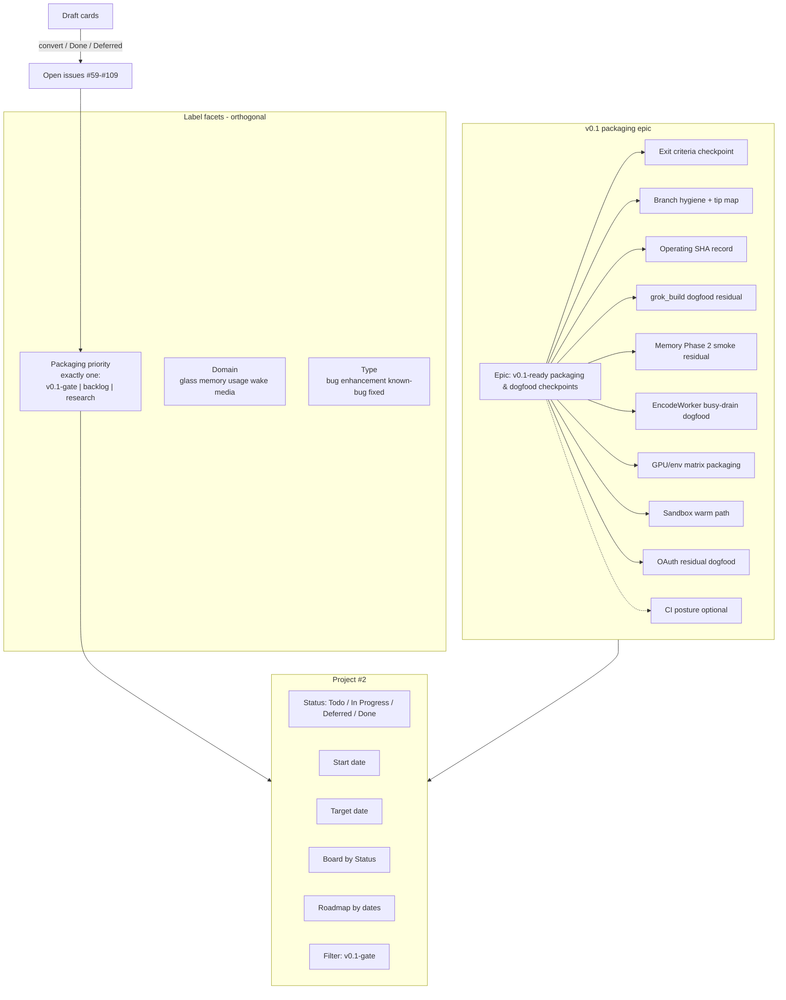
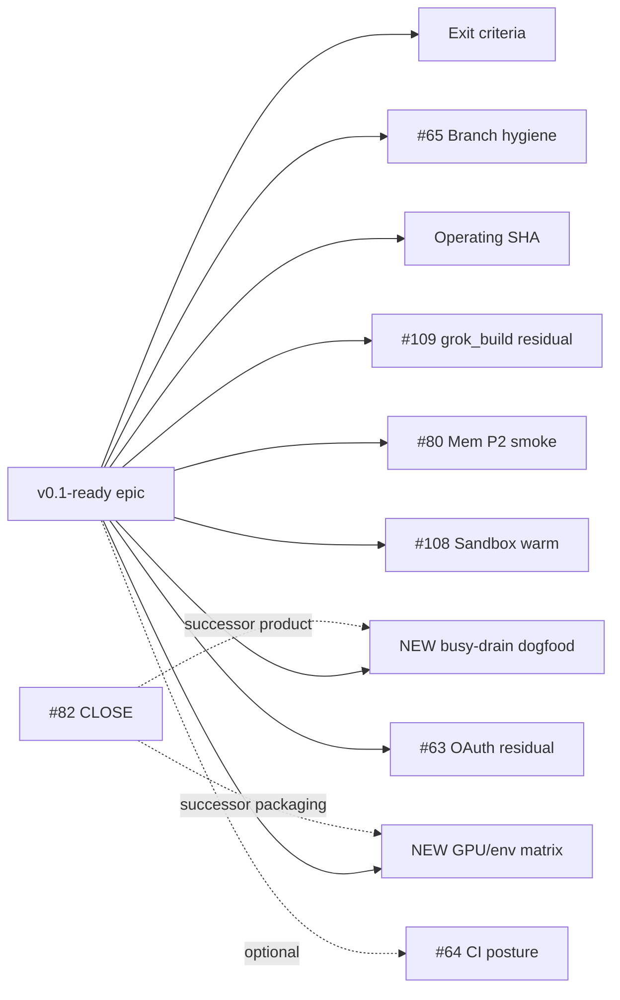
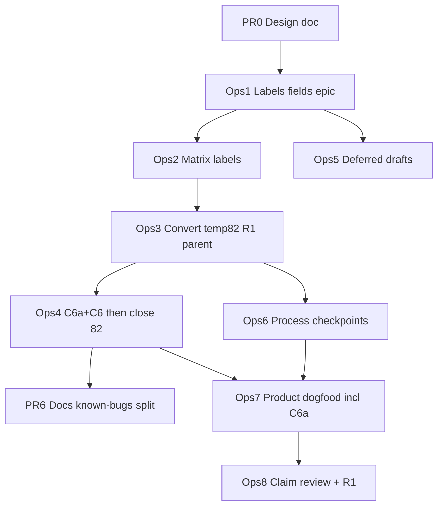

# Design: v0.1-ready board recategorization (issues, labels, epic, roadmap)

| Field | Value |
|-------|--------|
| **Document** | Review, update, and recategorize Project Elyra issues & board items for v0.1 packaging |
| **Author** | design skill (Elyra) |
| **Date** | 2026-08-04 |
| **Status** | Approved (design consensus; board ops pending) (revised post-review 2026-08-04) |
| **Product** | project-elyra |
| **Repo** | [jtwolfe/project-elyra](https://github.com/jtwolfe/project-elyra) |
| **Project** | [#2 Project Elyra — Autopoiesis Commons](https://github.com/users/jtwolfe/projects/2) (`PVT_kwHOACTi484Be2el`) |
| **Landing path** | `docs/design-v0.1-ready-board-recategorization.md` (PR0) |
| **Related** | [docs/branch-law.md](branch-law.md), [docs/promotion-discussion/development-governance.md](promotion-discussion/development-governance.md), [docs/promotion-discussion/README.md](promotion-discussion/README.md), [docs/known-bugs.md](known-bugs.md), [docs/grok-improvement-plan/README.md](grok-improvement-plan/README.md), [docs/design-embed-async-encode-worker.md](design-embed-async-encode-worker.md), [docs/design-grok-build-tool.md](design-grok-build-tool.md) |
| **Inventory source** | `/tmp/grok-1000/board-inventory-e3b74dd3.md` (2026-08-04 live snapshot) |
| **Integration tip** | `working` (normative; see branch-law) |

---

## Overview

Project Elyra’s GitHub Project #2 (“Autopoiesis Commons”) is the institutional **planning surface of record**, but it is operationally under-instrumented for a v0.1 packaging cut: **Status is the only custom workflow field** (Todo / In Progress / Deferred / Done); there is **no Iteration, day field, or Roadmap dates**; open issues mix packaging gates, real backlog, and research; several **In Progress** cards are stale relative to code that already shipped on `working` / `feature/*` (live IP honesty set: **#59, #63, #80, #82, #86**, plus Branch FF and Manual operating SHA drafts — **not** #109, which is board **Todo** with a stale greenfield body); and draft cards absorb work that should either become issues or be explicitly Deferred/Done.

This design specifies a **conservative, ordered board-hygiene programme**: (1) introduce an orthogonal **packaging-priority label triad** (`v0.1-gate` | `backlog` | `research`) with an **idempotent apply recipe** (GitHub has no native mutual exclusion); (2) create a focused **v0.1-ready packaging & dogfood checkpoints epic** whose children are **checkpoints**, not a dump of every open bug; (3) add **Roadmap date fields** so the near horizon is **day-by-day executable** (~5–10 working days); (4) apply honest status/body updates and draft disposition without silent-closing residual work; (5) close #82 only when both successors exist — **EncodeWorker busy-drain dogfood (C6a)** and **GPU/env matrix packaging (C6)** — so continuous-encode live dogfood is not lost. Day 0 is labels + epic + fields only — not mass reparenting or mass status moves.

---

## Background & Motivation

### Current board state (verified 2026-08-04)

| Surface | Reality |
|---------|---------|
| Project fields | **Status only** among workflow fields: Todo, In Progress, Deferred, Done. Native: Title, Assignees, Labels, Linked PRs, Milestone, Repository, Reviewers, Parent issue, Sub-issues progress, Created/Updated/Closed. **No** Iteration, Priority, Size, Start/Target date. |
| Repo milestones | **None** |
| Issue labels today | GitHub defaults + `fixed`, `known-bug`, domain: `glass`, `memory`, `usage`, `wake`, `media` |
| Open issues | **25** (#59–#109 range; listed in § Per-issue triage matrix) |
| Board items | **55** total: In Progress 7, Todo 19, Status null/`?` 12, Deferred 1, Done 16 |
| Integration tip | **`working`** per [docs/branch-law.md](branch-law.md); stacks land on `working`, not auto-`main` |
| Encode path | Continuous EncodeWorker **code** shipped on `feature/embed-async` lineage ([docs/design-embed-async-encode-worker.md](design-embed-async-encode-worker.md)); **live busy dogfood pending**; packaging/Tensile/device matrix still Open — known-bugs: continuous-encode evidence alone does **not** close #82 |
| `deep_research` | Still **`DEEP_RESEARCH_EXPERIMENTAL=True`** / fail-closed `mode_experimental` — not a v0.1 gate |

### Pain points

1. **No packaging orthography.** Domain labels (`memory`, `glass`, …) and type labels (`bug`, `known-bug`) do not answer “must this land before we claim v0.1 dogfood packaging?” Operators cannot filter the critical path. GitHub also cannot enforce “exactly one” packaging label natively — process must.
2. **Stale In Progress (board-true).** Live **In Progress** pollution: **#59, #63, #80, #82, #86**, Branch FF draft (largely done after #66), Manual operating SHA draft. Separately, **#109 is Todo** but its body still reads like greenfield design/implement work despite largely shipped `grok_build` — honesty problem is **body/framing**, not Status.
3. **No day-by-day runway.** Status alone is a kanban, not a schedule. v0.1 packaging needs a **near-horizon calendar** an operator can walk day by day.
4. **Wrong epic shape risk.** #59 (known-bugs break-out) is a **historical meta-epic**, partially done; dumping every open bug under a new “v0.1” parent would recreate #59’s sprawl and hide packaging checkpoints.
5. **Drafts as dark matter.** High-value drafts (exit criteria, Memory Phase 2 dogfood, operating SHA) lack issue numbers and parent linkage; research drafts sit unstatused and crowd the null-status bucket.
6. **#82 honesty gap (split residual).** Product continuous-encode **code** shipped; **live busy dogfood** and **GPU/env packaging** remain. Closing #82 without named homes for both residuals would silently drop packaging-relevant dogfood while overclaiming product path “done.” Prefer **close + two successors** (C6a busy-drain dogfood + C6 packaging matrix), matching known-bugs / embed-async honesty.

### Why now

[docs/promotion-discussion/README.md](promotion-discussion/README.md) already defines v0.1 as *instrument + dogfooded memory path + process gym*, not all research phases closed. Stage 1 governance ([development-governance.md](promotion-discussion/development-governance.md)) made the Project board the planning surface — but without labels, epic shape, and timeline fields, the gym cannot schedule a packaging cut. This design is the **process PR stack** that makes the board honest and day-executable.

---

## Goals & Non-Goals

### Goals

1. Codify and apply the **orthogonal packaging label triad**: exactly one of `v0.1-gate` | `backlog` | `research` on every open issue (and converted drafts).
2. Create a **v0.1-ready packaging & dogfood checkpoints epic** with **checkpoint children** only; leave #59 as historical known-bugs epic (not the packaging parent).
3. Add **Roadmap date fields** (Start date + Target date) and populate a concrete **Day 0…N (~5–10 working days)** near-horizon schedule.
4. Publish a full **per-issue triage matrix** and **draft disposition** table operators can execute without re-litigating intent.
5. Close **#82** only when successors exist: **C6a EncodeWorker busy-drain dogfood** + **C6 GPU/env matrix packaging**, both `v0.1-gate` children of the v0.1 epic; never close #82 without both issue numbers in the close comment.
6. Honest status/body updates for largely-shipped work (#109 body residual framing, #63/#80 status honesty, Branch FF draft Done).
7. Prefer **convert high-value drafts → issues**; mark absorbed/stale drafts Done; research drafts → Deferred + `research`.
8. Document **Execution SOP** with rollback and an ordered **PR Plan** of independently reviewable ops/docs steps.
9. Land this design under `docs/design-v0.1-ready-board-recategorization.md` via a docs PR against `working`.

### Non-goals

| Non-goal | Rationale |
|----------|-----------|
| Mass-close residual bugs on Day 1 | Conservative first; silent close loses real work |
| Reparent every open issue under the v0.1 epic | Epic = packaging checkpoints only |
| Enable `deep_research` beyond experimental | KD16 / `DEEP_RESEARCH_EXPERIMENTAL=True`; not a v0.1 gate |
| Reopen Stretch 2 Phase 3 | Stays Deferred / research |
| Auto-merge to `main` or PE silent pin move | Branch-law: humans promote `working` → `main`; pins human-moved |
| Invent multi-month roadmap fiction | Near horizon 1–2 weeks + unlabeled backlog |
| Rewrite every known-bugs.md entry | Structure only; per-issue GitHub comments carry packaging triage |
| New CI required-checks on Day 0 | #64 may be gate or backlog; design does not force Actions green as Day-0 work |
| Graphite required / change tip law | Tip remains `working`; plain-git default |

---

## Key Decisions

| ID | Decision | Rationale |
|----|----------|-----------|
| **KD1** | **Orthogonal packaging labels** — exactly one of `v0.1-gate` \| `backlog` \| `research` per open issue; domain (`glass`/`memory`/`usage`/`wake`/`media`) and type (`bug`/`enhancement`/`known-bug`/`fixed`) stay independent. **Enforced by ops recipe** (remove triad → add one) + Day 1/2/10 R1 audit, not by GitHub native exclusion | Separates “when/path” from “what area” and “what kind”; GitHub cannot mutual-exclude labels — process must |
| **KD2** | **Epic shape = packaging checkpoints**, not known-bugs dump; title: **“v0.1-ready: packaging & dogfood checkpoints”**; #59 remains historical meta-epic, not packaging parent | Avoids #59 sprawl; board progress bars reflect packaging readiness, not “all bugs closed” |
| **KD3** | **Timeline = Roadmap date fields** (project **Start date** + **Target date**), not weekly Iteration and not a custom Day single-select | Native Roadmap view is day-true; no option explosion (Day 0…∞); null dates = unscheduled backlog; weekly Iteration is coarser than “day by day”; custom Day options go stale after the window |
| **KD4** | **Conservative Day 0** — create labels, epic, fields, views only; apply labels + honest status updates in Day 1–2; product dogfood slots Day 3+ | Reduces blast radius; label removal is easy rollback; mass status moves are riskier and batched later |
| **KD5** | **Close #82 only with two named successors** under the v0.1 epic as `v0.1-gate`: **(C6a)** EncodeWorker busy-drain / continuous-encode **live dogfood** checklist; **(C6)** GPU/env/Tensile **packaging matrix**. Code-path shipped ≠ dogfood done; never close without both issue numbers in the close comment. PR6 known-bugs rewrite must match this split (not a silent policy flip) | Aligns operator close intent with known-bugs + embed-async honesty; avoids silent loss of busy-drain dogfood residual |
| **KD5b** | **Always parent residual gate issues under the v0.1 epic** (#65, #63, #80, #108, #109, C1, C3, C6, C6a) — no “optional parent / tracks-only” for packaging gates | Sub-issue progress bar stays honest; operators have one rule |
| **KD6** | **`deep_research` not scheduled** for v0.1; leave experimental; **not in C4/#109 acceptance** | Explicit operator constraint; avoids false packaging claims |
| **KD7** | **Branch law unchanged** — `main` ← `working` ← `feature/*`; stack/fold to `working`; no auto-`main` | Normative [docs/branch-law.md](branch-law.md); board ops must not invent a tip change |
| **KD8** | **Drafts: convert high-value → issues; absorbed → Done; research → Deferred + `research`** | Issues get numbers, parents, labels; drafts stop being the only home for packaging work |
| **KD9** | **Honest status over aspirational In Progress** — force #59/#86 → Todo (packaging week defaults); residual dogfood gates → Todo unless actively worked that day; #109 stays Todo with body rewrite | Board credibility is a packaging asset; live IP set must shrink after Day 2 |
| **KD10** | **No silent close of residual product work** — residual dogfood gets a **named** checkpoint or stays open under `backlog`/`v0.1-gate` with updated body | Process hygiene ≠ product amnesia; KD5 implements this for #82 |
| **KD11** | **PR4 is the sole atomic step for C6 + C6a create and #82 close**; Day 1 only prepares close-comment text and parents existing issues — never close #82 without both successor numbers | Prevents half-close / double-open across Day 1–2 |

---

## Proposed Design

### Architecture (process system)



### Label taxonomy

#### New packaging-priority labels (create on repo)

**Color is cosmetic only; label name is authority.** Hexes are chosen to **avoid collision with every live repo label** (not only type labels). Live occupied: `bug` `#d73a4a`, `documentation` `#0075ca`, `duplicate` `#cfd3d7`, `enhancement` `#a2eeef`, `good first issue` `#7057ff`, `help wanted` `#008672`, `invalid` `#e4e669`, `question` `#d876e3`, `wontfix` `#ffffff`, `fixed` `#0E8A16`, `known-bug` `#B60205`, `glass` `#1D76DB`, `memory` `#5319E7`, `usage` `#E99695`, `wake` `#FBCA04`, `media` `#D93F0B`.

| Label | Color (hex) | Description | When to use |
|-------|-------------|-------------|-------------|
| `v0.1-gate` | `#FF8C00` (dark orange) | Required to claim packaging / ready for v0.1 dogfood cut | Checkpoint work on the critical packaging path; must complete (or explicitly waive in exit criteria) before “v0.1-ready” narrative |
| `backlog` | `#22863A` (forest green) | Real work, not on critical packaging path | Ship after or beside packaging; may still be high product value |
| `research` | `#6F42C1` (violet) | Experimental / philosophy / future; not scheduled for v0.1 | Consciousness research, ontologizer, Phase 3 procedural, deep_research enablement, large visual inspector, etc. |

#### Existing labels (retain; orthogonal)

| Facet | Labels | Notes |
|-------|--------|-------|
| Domain | `glass`, `memory`, `usage`, `wake`, `media` | Zero or more; describe subsystem |
| Type | `bug`, `enhancement`, `known-bug`, `fixed` | Type of work / bug lifecycle; `fixed` = code fixed, residual dogfood may remain |
| GitHub defaults | `documentation`, `duplicate`, `good first issue`, `help wanted`, `invalid`, `question`, `wontfix` | Use sparingly; `wontfix`/`invalid` still require packaging label removal on close |

#### Mutual exclusion & composition rules

| Rule | Detail |
|------|--------|
| **R1** | Every **open** issue MUST have **exactly one** of: `v0.1-gate`, `backlog`, `research` |
| **R2** | Closed issues: leave labels as-is at close time (historical); do not mass-relabel Done column |
| **R3** | Domain and type labels are **independent** of packaging priority (e.g. `bug` + `memory` + `v0.1-gate` is valid) |
| **R4** | `fixed` + open issue means “code landed; residual smoke/sign-off”; packaging label still required (`v0.1-gate` if residual is packaging-critical, else `backlog`) |
| **R5** | Do **not** use packaging labels on pure PRs unless the PR is the only tracked item (prefer issue cards) |
| **R6** | Drafts converted to issues get packaging label at conversion; Deferred research drafts get `research` when converted, or stay draft Deferred without label until convert |
| **R7** | If an item is both “interesting research” and “blocks packaging,” **packaging wins** (`v0.1-gate`) and research is noted in body — do **not** dual-label packaging priority (R1 still holds) |
| **R8** | GitHub has **no native mutual exclusion**. R1 is process-enforced: every apply uses the **idempotent triad recipe** (§ Label apply recipe); dual packaging labels are a defect, not a policy state |

```text
open issue labels =
  { exactly one packaging priority }
  ∪ { zero or more domain }
  ∪ { zero or more type/default }
```

#### Label apply recipe (idempotent; required for every packaging-label change)

GitHub `gh issue edit --add-label` **does not** remove siblings. Always:

```bash
# set_packaging_label <issue_number> <v0.1-gate|backlog|research>
set_packaging_label() {
  local n="$1" want="$2"
  gh issue edit "$n" --repo jtwolfe/project-elyra \
    --remove-label "v0.1-gate" --remove-label "backlog" --remove-label "research" 2>/dev/null || true
  gh issue edit "$n" --repo jtwolfe/project-elyra --add-label "$want"
}
```

- Re-runs are safe (remove-all-three → add one).
- Never use bare `--add-label` alone for packaging priority after Day 1 initial pass.
- Epic issue (once created) also gets `set_packaging_label <epic> v0.1-gate`.

#### R1 audit (hard checklist Days 1, 2, and 10 — not appendix-only)

**When R1 is a hard gate:** only as a **post-apply** check — after **all** packaging-label mutations and **new open issues** for that session are labeled. It is **not** a mid-batch gate between “label matrix” and “convert drafts.” Failing mid-batch and then creating C1/C3 would pass a stale R1 and immediately violate R1 again.

```bash
# After full Day-1 labeling sequence (see Phase B order) — not after first loop only:
gh issue list --repo jtwolfe/project-elyra --state open --limit 200 \
  --json number,labels --jq '
    def pkg: [.labels[].name | select(.=="v0.1-gate" or .=="backlog" or .=="research")];
    .[] | {n:.number, pkg:(pkg|length), names:(pkg)} |
    select(.pkg != 1)
  '
# Expect empty output. Non-empty = 0 or >1 packaging labels → fix with set_packaging_label.
```

Coverage sum check:

```bash
open=$(gh issue list --repo jtwolfe/project-elyra --state open --json number -q 'length')
g=$(gh issue list --repo jtwolfe/project-elyra --state open --label v0.1-gate --json number -q 'length')
b=$(gh issue list --repo jtwolfe/project-elyra --state open --label backlog --json number -q 'length')
r=$(gh issue list --repo jtwolfe/project-elyra --state open --label research --json number -q 'length')
echo "open=$open gates=$g backlog=$b research=$r sum=$((g+b+r))"
# Expect sum == open. If sum > open: dual labels (jq list above). If sum < open: unlabeled opens.
```

#### Optional follow-up (not Day 0): packaging-label workflow

Document for a later ops PR (non-blocking): small `.github/workflows/label-packaging.yml` on `issues: [labeled, opened]` that detects >1 packaging triad labels and either comments a failure or auto-strips the non-matrix labels. **Out of Day 0–2 scope**; SOP + audit is the enforcement for packaging week.

### Epic definition

#### Title

**`v0.1-ready: packaging & dogfood checkpoints`**

#### Body outline (issue template)

```markdown
## Purpose
Packaging / dogfood readiness for a v0.1 cut of Project Elyra — Autopoiesis Commons.
Children are **checkpoints**, not a dump of every open bug.

## v0.1 claim (draft — finalize in exit-criteria child)
**In:** honest tip map on `working`; branch-law observed; grok_build dogfood sign-off
(residual, C4/#109); Memory Phase 2 product smoke residual (C5/#80); **EncodeWorker
busy-drain / continuous-encode live dogfood (C6a — code shipped ≠ dogfood done)**;
GPU/env packaging matrix documented (C6); operating SHA convention (C3); sandbox path
if isolation is part of the claim (C7/#108); OAuth residual dogfood (C9/#63); optional
CI posture (C8/#64 if elevated).
**Out:** deep_research enabled (stays DEEP_RESEARCH_EXPERIMENTAL); Stretch 2 Phase 3;
Stage C MC package; GI Phase 2 full self-mod continuity; claiming “all known-bugs closed.”

## C4 / #109 acceptance — explicit exclusions
- [x] **Not in scope:** enabling non-experimental `deep_research` / flipping
  `DEEP_RESEARCH_EXPERIMENTAL` (see KD6; dogfood D7 remains experimental-only).
- Residual dogfood = prompt/design/implement/execute_plan/review paths + auth/sandbox
  as listed in `docs/grok-build-dogfood.md` (excluding D7 enablement).

## Acceptance criteria
- [ ] Exit criteria written and operator-agreed (child)
- [ ] All `v0.1-gate` children Done or explicitly waived in exit criteria with comment
- [ ] Branch hygiene tip map current (`working` / `main` / pins) — see docs/branch-law.md
- [ ] Board: every open issue has exactly one of v0.1-gate|backlog|research (R1 audit clean)
- [ ] Near-horizon Roadmap dates populated for gate work
- [ ] No auto-merge to main; promote path human-gated
- [ ] #82 closed only with C6 + C6a successors linked (busy dogfood + packaging matrix)

## Non-children (do not parent under this epic)
- #59 known-bugs meta-epic (historical)
- research / philosophy drafts
- Phase 3 procedural
- deep_research enablement

## References
- docs/branch-law.md
- docs/promotion-discussion/README.md
- docs/design-v0.1-ready-board-recategorization.md
```

#### Acceptance criteria (epic-level)

1. Exit criteria child closed with written, agreed checklist.
2. Every initial checkpoint child is either **Done** or **explicitly waived** in exit criteria with date + reason.
3. Label R1 holds for all open repo issues (audit empty dual/missing list).
4. Roadmap shows gate work on concrete dates for the near horizon.
5. #82 closed with **both** C6a (busy-drain dogfood) and C6 (packaging matrix) resolved or explicitly waived in exit criteria.

#### Parent rule (KD5b)

**Always parent** packaging-gate residual issues under the v0.1 epic via GitHub parent/sub-issue. No “optional parent” or tracks-comment-only for: C1, C3, #65, #109, #80, #63, #108, C6, C6a. #64 stays unparented unless exit criteria elevates it to gate.

#### Initial child checkpoint list (mapping)

| # | Checkpoint title (new or existing) | Source mapping | Packaging label | Notes |
|---|-----------------------------------|----------------|-----------------|-------|
| C1 | **Exit criteria: v0.1 packaging claim** | DRAFT: v0.1 milestone: define exit criteria | `v0.1-gate` | Convert draft → issue; **always parent** epic |
| C2 | **Branch hygiene + tip map prior to v0.1** | #65 (+ branch-law; Branch FF draft → Done) | `v0.1-gate` | **Always parent** epic; update body to reference `working` |
| C3 | **Manual operating SHA record convention** | DRAFT: Manual operating SHA record | `v0.1-gate` | Convert draft → issue; **always parent** epic |
| C4 | **grok_build dogfood residual sign-off** | #109 residual (code largely shipped) | `v0.1-gate` | Keep #109; body residual framing; **always parent** epic; **deep_research enablement not in acceptance** |
| C5 | **Memory Phase 2 product dogfood residual** | #80 + DRAFT: Memory Phase 2 product dogfood | `v0.1-gate` | #80 residual smoke / Gate B only (semantic surface — **not** EncodeWorker busy-drain); absorb Memory draft into #80; **always parent** epic |
| **C6a** | **EncodeWorker busy-drain / continuous-encode live dogfood** | **Successor to #82 product residual** (new issue) | `v0.1-gate` | Checklist: `drain_ok_total` / pending→ready under continuous wakes (busy, not idle-only); cite embed-async dogfood; **always parent** epic; created in **PR4 only** with C6 |
| C6 | **GPU/env matrix packaging checkpoint** | **Successor to #82 packaging residual** (new issue) | `v0.1-gate` | Tensile/device matrix/env docs; CPU soft-fail claim; **always parent** epic; created in **PR4 only** with C6a |
| C7 | **Sandbox warm ensure / isolation dogfood path** | #108 | `v0.1-gate` | Default **include** as gate for sandboxed grok_build narrative; **always parent** epic |
| C8 | **CI required status checks posture** | #64 | default **`backlog`** | Do **not** parent unless exit criteria elevates to gate |
| C9 | **OAuth + sandboxed grok_build residual dogfood** | #63 residual | `v0.1-gate` | OAuth largely landed; residual dogfood only; **always parent** epic |

**Not children (explicit):** #59, #61, #62, #67–#69, #73, #79, #85–#89, #98, #103–#107, research drafts, Phase 3, deep_research enablement.



### Per-issue triage matrix

Legend — **Status action**: board Status field change. **Parent**: link under v0.1 epic / leave / none. **Notes**: body/close actions.

| Issue | Title (short) | Packaging label | Status action | Parent / epic | Notes |
|-------|---------------|-----------------|---------------|---------------|-------|
| **#59** | Break out known-bugs epic | `backlog` | In Progress → **Todo** (forced; packaging week) | **Do not** parent under v0.1 epic | Partially done; not packaging epic. Comment: “packaging tracked under new v0.1-ready epic.” Optional Day 2 body hygiene (stale Active/Todo child lists) |
| **#61** | Visual inspector hypergraph | `research` | null → **Deferred** | none | Large; not v0.1 |
| **#62** | Confirm programme name with Colin | `backlog` | null → **Todo** | none | Process, not code gate |
| **#63** | XAI login + sandboxed grok dogfood | `v0.1-gate` | In Progress → **Todo** (residual) unless actively dogfooding that day | **Always parent** v0.1 epic | OAuth largely landed; residual dogfood only. **Do not close** if residual real |
| **#64** | CI for protected main | `backlog` (default) | Todo → stay | none unless elevated | Required checks currently none |
| **#65** | Branch hygiene prior to v0.1 | `v0.1-gate` | Todo → stay | **Always parent** v0.1 epic | Align body with `docs/branch-law.md`. Branch FF draft → Done |
| **#67** | BUG-wake-01 timer/task_ready storm | `backlog` | Todo → stay | none | known-bug; not packaging-critical |
| **#68** | BUG-wake-02 post-restart sanitation | `backlog` | Todo → stay | none | Related to pin awareness but ≠ C3 |
| **#69** | BUG-usage-01 SuperGrok pacing | `backlog` | Todo → stay | none | Elevate via exit criteria only if dogfood broken |
| **#73** | BUG-mem-ui-02 Atoms list beautify | `backlog` | Todo → stay | none | Polish |
| **#79** | BUG-prompt-01 system prompt too hard | `backlog` | Todo → stay | none | post-memory review |
| **#80** | BUG-mem-p2-01 Phase 2 semantic | `v0.1-gate` | In Progress → **Todo** (residual smoke) | **Always parent** v0.1 epic (C5) | `fixed` stays; residual = Phase 2 semantic smoke / Gate B — **not** EncodeWorker busy-drain (that is C6a) |
| **#82** | BUG-mem-gpu-01 ROCm GPU embed | Day 1: **temp `backlog`** if still open; PR4: close | In Progress → **Done** + **close** (PR4) | none (successors parented) | **No unlabeled window.** Day 1 overnight → temp `backlog`. **CLOSE only in PR4** after C6a + C6 exist; close comment must link both. Code continuous-encode shipped; live busy dogfood → **C6a**; packaging matrix → **C6**. PR6 updates known-bugs |
| **#85** | BUG-tts-01 TTS sanitation | `backlog` | Todo → stay | none | media known-bug |
| **#86** | BUG-glass-03 poll hard-rebuild | `backlog` | In Progress → **Todo** (packaging-week default) | none | Partial on main. Day 2 comment: “parked residual poll architecture.” Re-IP only if assignee actively coding #86 that week |
| **#88** | BUG-chat-03 source links | `backlog` | Todo → stay | none | Add `bug`/`glass` when touching |
| **#89** | BUG-wait-01 multi-choice wait | `backlog` | Todo → stay | none | |
| **#98** | Memory graph source/context edges | `backlog` | Todo → stay | none | After packaging |
| **#103** | Memory traverse cold/timeout seed | `backlog` | Todo → stay | none | |
| **#104** | Directed keep clear path | `backlog` | Todo → stay | none | |
| **#105** | Memory traverse frontier cache | `backlog` | Todo → stay | none | |
| **#106** | Context meal taxonomy design | `backlog` | Todo → stay | none | |
| **#107** | Atom truncation evaluate | `backlog` | Todo → stay | none | |
| **#108** | Sandbox warm microsandbox 0.6.8 | `v0.1-gate` | Todo → stay | **Always parent** v0.1 epic | Isolation dogfood reliability |
| **#109** | Design/implement grok_build | `v0.1-gate` | **Stay Todo** (already Todo on board); body rewrite from greenfield → residual dogfood checklist | **Always parent** v0.1 epic (C4) | Not stale IP — stale **body**. Ship surface + residual dogfood (`docs/grok-build-dogfood.md`). **deep_research enablement not in C4 acceptance** |

#### Closed issues in Done column (#60, #66, #70–#78, #81, #84, #87, #91–#93)

| Action | Detail |
|--------|--------|
| Labels | **No mass relabel** |
| Status | Leave **Done** |
| Notes | #66 Branch FF already Done (supports marking Branch FF **draft** Done). #93 closed on board — do not reopen for packaging |

### Draft disposition

| Draft title | Disposition | Packaging (if converted) | Status action | Notes |
|-------------|-------------|--------------------------|---------------|-------|
| **v0.1 milestone: define exit criteria** | **Convert → issue** (C1) | `v0.1-gate` | Todo | Parent: v0.1 epic; first checkpoint |
| **Memory Phase 2 product dogfood (smoke + Gate B)** | **Convert → issue** OR **absorb into #80 body** then draft **Done** | `v0.1-gate` | Todo → Done if absorbed | Prefer absorb into #80 + C5 checklist to avoid duplicate umbrellas |
| **Manual operating SHA record (per PE instance)** | **Convert → issue** (C3) | `v0.1-gate` | In Progress → Todo until written | Parent: v0.1 epic; aligns branch-law operating pin |
| **Branch FF/merge plan (memory + radeon → product tip)** | **Done** (mark draft Done) | n/a | In Progress → **Done** | Largely done after #66; honest update comment |
| **Context meal: chat-chain → absorbed by #93** | **Done** | n/a | null → **Done** | Absorbed; do not reopen #93 for this |
| **Defer Stretch 2 Phase 3 (experimental)** | **Deferred** (keep) | if convert: `research` | stay **Deferred** | Do not schedule for v0.1; do not reopen Phase 3 |
| **Provider LLM timeouts / rate-limit awareness (future)** | **Deferred** | `research` or `backlog` → **`backlog`** if convert | Todo → **Deferred** | Future reliability; not packaging week |
| **Refactor docs structure (state/goal/design/plan)** | **Deferred** | `research` | null → **Deferred** | Nice-to-have docs programme |
| **Develop extensive research body for chorum…consciousness** | **Deferred** | `research` | null → **Deferred** | Research; not scheduled |
| **Implement dev > main > operational > release branch management rules** | **Done** or **delete** after confirming superseded by `docs/branch-law.md` | n/a | null → **Done** | Branch law is normative; avoid parallel draft law |
| **Common usage features for builtin** | **Deferred** | `research` / `backlog` → **`backlog`** if convert later | null → **Deferred** | |
| **Define/Refine 'Automatic Ontologizer' Concept** | **Deferred** | `research` | null → **Deferred** | |
| **Define GitHub Actions and containerized deployments** | **Deferred** | `research` | null → **Deferred** | Distinct from #64 light CI posture |

**PR #83** (docs: link known-bugs…): Status null → **Done** if merged, else leave; not a packaging child.

### Board field changes

#### Fields to add (exact)

| Field name | Type | Options / config | Purpose |
|------------|------|------------------|---------|
| **Start date** | Date (`ProjectV2FieldType.DATE`) | (none) | Roadmap bar start; day-by-day scheduling |
| **Target date** | Date (`ProjectV2FieldType.DATE`) | (none) | Roadmap bar end; single-day work ⇒ Start = Target |

**Not adding (explicit choice — KD3):**

| Field | Why not |
|-------|---------|
| Iteration (weekly) | Coarser than day-by-day; second cadence system to maintain |
| Custom “Day” single-select (Day 0…N) | Options go stale after the window; Roadmap dates scale |
| Priority / Size / Estimate | Out of scope for this hygiene pass; can add later |

#### Creating date fields (UI + GraphQL)

**UI click-path (default Day 0):** Project #2 → **⋯** / settings → **Fields** (or view field picker → **+ New field**) → type **Date** → name `Start date` → repeat for `Target date`. Then open **Roadmap — near horizon** view → **Date fields** control → bind **Start** = Start date, **Target** = Target date (Roadmap will not chart until bound).

**GraphQL (reproducible; optional if token has `project` scope):**

```bash
# PROJECT_ID = PVT_kwHOACTi484Be2el (user project #2)
# Requires: gh api graphql with project write scope

gh api graphql -f query='
mutation($project:ID!, $name:String!) {
  createProjectV2Field(input: {
    projectId: $project
    dataType: DATE
    name: $name
  }) { projectV2Field { ... on ProjectV2Field { id name dataType } } }
}' -f project='PVT_kwHOACTi484Be2el' -f name='Start date'

gh api graphql -f query='
mutation($project:ID!, $name:String!) {
  createProjectV2Field(input: {
    projectId: $project
    dataType: DATE
    name: $name
  }) { projectV2Field { ... on ProjectV2Field { id name dataType } } }
}' -f project='PVT_kwHOACTi484Be2el' -f name='Target date'
```

Views are still easiest in UI (no stable one-liner in `gh` for all view layouts). After create: **bind** Start/Target under the Roadmap view’s date-field controls — unbound DATE fields do not populate the Roadmap.

#### Status field (unchanged)

Keep **Todo | In Progress | Deferred | Done**. Do not rename.

#### Views to create

| View name | Layout | Config |
|-----------|--------|--------|
| **Board — by Status** | Board | Group by Status (default-like); pin as primary execution board |
| **Roadmap — near horizon** | Roadmap | **Bind** Start date → Target date; filter: `label:v0.1-gate` OR items with non-null Start date; zoom days |
| **Table — packaging gates** | Table | Filter label `v0.1-gate`; columns: Title, Status, Start date, Target date, Parent issue, Assignees |
| **Table — backlog & research** | Table | Filter `label:backlog` OR `label:research`; group by label if supported |
| **Board — Deferred parking** | Board | Filter Status = Deferred (research / future) |

Optional later: Iteration field if weekly planning becomes preferred after the packaging window.

### Day-by-day roadmap

**Calendar assumption:** Day 0 = first operator session after design approval (docs PR may land same day or Day −1). Dates below use relative **Day N**; operator binds to calendar dates in Start/Target fields when executing.

| Day | Focus | Operator actions (gh / UI) | Board dates |
|-----|-------|------------------------------|-------------|
| **Day 0** | **Labels + epic + fields + views** | Create labels with **hexes unused by any live repo label** (`#FF8C00` / `#22863A` / `#6F42C1`); add Start/Target DATE fields (UI or GraphQL) + bind Roadmap; create views; open epic; Status=In Progress; `set_packaging_label` epic only; **do not mass-label open issues** | Epic Start=Target=Day 0 |
| **Day 1** | **Apply labels → convert → temp #82 → R1 → parent** | (1) `set_packaging_label` matrix issues; (2) convert C1/C3 + absorb Memory draft; (3) `set_packaging_label` new converts + epic `v0.1-gate`; (4) if #82 remains open past this session: **required** `set_packaging_label 82 backlog` (temp); if same-session merge into PR4, close #82 after C6a+C6 instead; (5) **R1 post-apply hard gate**; (6) always-parent gates; set dates; prepare #82 close text only if not merging PR4 | Gate issues dated |
| **Day 2** | **Honest status + PR4 atomic #82 split + drafts** | **Open C6a + C6 first**, parent under epic, label `v0.1-gate`, then **close #82** with both numbers; #59/#86 → Todo; #63/#80 → Todo; #109 body residual rewrite; Branch FF + Context meal drafts Done; Deferred research drafts; **R1 audit again** | #82 close event |
| **Day 3** | **Exit criteria write + branch hygiene map** | C1 write/agree draft exit criteria; #65 tip map (`working`/`main`/pins) | C1, #65 |
| **Day 4** | **Operating SHA convention** | C3 write convention (file or lightweight tag process per branch-law) | C3 |
| **Day 5** | **grok_build residual dogfood** | #109 / #63 checklist (`docs/grok-build-dogfood.md`); **not** deep_research enable (not in C4 acceptance) | #109, #63 |
| **Day 6** | **Memory Phase 2 smoke + busy-drain dogfood start** | #80 Gate B residual **and/or** C6a busy-drain checklist (`drain_ok_total` under continuous wakes) | #80, C6a |
| **Day 7** | **GPU/env matrix packaging** | C6: device matrix, Tensile/inject ops pointers, CPU soft-fail claim | C6 |
| **Day 8** | **Sandbox warm path** | #108 repro + fix or packaging waiver in exit criteria | #108 |
| **Day 9** | **Buffer / slip / CI optional** | Catch-up (C6a slip common); #64 only if elevated | buffer |
| **Day 10** | **Packaging claim review** | Walk exit criteria; waive remaining gates with date/reason; **R1 audit hard gate**; epic “ready / not ready” | epic review |

```mermaid
gantt
  title Near-horizon packaging runway (relative days)
  dateFormat  X
  axisFormat  Day %s
  section Process
  Labels epic fields views     :a0, 0, 1d
  Label all + parent gates     :a1, 1, 1d
  C6a+C6 open then close 82    :a2, 2, 1d
  Exit criteria + branch map   :a3, 3, 1d
  Operating SHA convention     :a4, 4, 1d
  section Product dogfood
  grok_build residual          :a5, 5, 1d
  Mem P2 smoke + busy drain    :a6, 6, 1d
  GPU env matrix               :a7, 7, 1d
  Sandbox warm                 :a8, 8, 1d
  section Close
  Buffer                       :a9, 9, 1d
  Packaging claim review       :a10, 10, 1d
```



**Backlog items** (#67–#69, #73, #79, #85–#89, #98, #103–#107, #61 research, #62, #64): **null dates** until after Day 10 or explicit pull-forward.

### Execution SOP

#### Preconditions

- [ ] Operator has `gh` auth with repo + project scope for `jtwolfe/project-elyra` and user project #2
- [ ] Design approved or explicitly “execute draft”
- [ ] Integration tip understanding: work branches → `working` ([docs/branch-law.md](branch-law.md))
- [ ] Snapshot inventory saved (copy of board item-list JSON) for rollback reference

#### Ordered checklist

**Phase A — Day 0 (low risk, reversible)**

1. Snapshot: `gh project item-list 2 --owner jtwolfe --format json > /tmp/elyra-board-snap-$(date +%F).json`
2. Create labels (repo) — **hexes unused by any live label** (see Label taxonomy):
   ```bash
   gh label create "v0.1-gate" --repo jtwolfe/project-elyra --color FF8C00 --description "Required for v0.1 packaging/dogfood cut"
   gh label create "backlog" --repo jtwolfe/project-elyra --color 22863A --description "Real work; not on critical v0.1 packaging path"
   gh label create "research" --repo jtwolfe/project-elyra --color 6F42C1 --description "Experimental/philosophy/future; not scheduled for v0.1"
   ```
3. Add **Start date** / **Target date** DATE fields (UI or GraphQL § Board field changes); create views; **bind** Roadmap date fields.
4. Create epic issue with body from § Epic definition; add to Project #2; Status=In Progress; `set_packaging_label <epic> v0.1-gate`; dates Day 0. **No mass-label of other issues.**

**Phase B — Day 1 (ordered; R1 is last gate before parents / session end)**

Do **not** run the R1 hard gate until steps 5–8 complete. Mid-batch R1 is informational only.

5. Apply packaging labels per matrix using **`set_packaging_label` only** (remove triad → add one) for all **existing** open issues except #82.
6. Convert high-value drafts (C1, C3); absorb Memory Phase 2 draft into #80 (draft → Done if absorbed).
7. `set_packaging_label` on **new** converts (C1, C3 → `v0.1-gate`) and re-confirm epic `v0.1-gate`.
8. **#82 temporary label rule (required unless same-session PR4):**
   - If Day 1 ends with #82 still open (typical split Day 1 / Day 2): **`set_packaging_label 82 backlog`** (temporary packaging priority until PR4 close — **not** “leave unlabeled”).
   - If operator **session-merges PR2–PR4** the same day: open C6a+C6 and **close #82** per Phase B2 **before** final Day-1/session R1; no overnight unlabeled window.
9. **R1 audit hard gate** (§ Label taxonomy) — **post-apply only**. Fix until dual/missing jq is empty and `sum == open`. Do not treat pre-convert R1 as session success.
10. **Always parent** gate issues under epic: #65, #63, #80, #108, #109, C1, C3.
11. Set Start/Target dates for near-horizon gates; prepare #82 close comment text offline if not closing today. **Do not open C6/C6a; do not close #82** unless session-merging PR4 (then follow Phase B2 before final R1).

**Phase B2 — Day 2 (PR4 atomic #82 + honesty)**

12. **Open C6a** (busy-drain dogfood) and **C6** (GPU/env packaging); parent both under epic; `set_packaging_label` both `v0.1-gate`; add to Project #2.
13. **Only then** close #82 with comment template below (both numbers required). Rule: **never close #82 without C6a and C6 issue numbers in the close comment.** Temporary `backlog` on #82 is removed by close.
14. Status honesty: #59 → Todo; #86 → Todo + park comment; #63/#80 → Todo; #109 body residual rewrite (Status already Todo).
15. Draft disposition: Branch FF + Context meal → Done; research drafts → Deferred.
16. **R1 audit hard gate** again (open count dropped by #82 close; new C6/C6a labeled).

**#82 close comment template**

```markdown
## Close rationale (packaging hygiene)

### What shipped (code)
Product **continuous encode path** (EncodeWorker / busy-period drain) **code** has shipped
on the `feature/embed-async` lineage; see `docs/design-embed-async-encode-worker.md`.
This is **not** a claim that live busy dogfood is signed off.

### Why close (scope split)
This issue mixed (a) product continuous-encode code, (b) live busy dogfood residual, and
(c) ROCm/Tensile/device-matrix **packaging**. Closing the umbrella; residuals are named
checkpoints under the v0.1-ready epic (matches known-bugs honesty: continuous-encode
evidence alone does not close the packaging story — we split instead of leaving a muddled #82):

| Residual | Successor | Label |
|----------|-----------|--------|
| Live busy-drain / continuous-encode dogfood (`drain_ok_total`, pending→ready under continuous wakes) | **#C6a** | `v0.1-gate` |
| GPU/env/Tensile packaging matrix + env docs | **#C6** | `v0.1-gate` |

Not claiming “GPU always works without operator setup.” CPU/mock soft-fail remains first-class.
PR6 will update `docs/known-bugs.md` BUG-mem-gpu-01 index to point at #C6a + #C6 (not a silent policy flip).
```

**Phase C — Day 3+ (checkpoint execution / product slots)**

17. Execute day plan; move Status In Progress only for the active day item.
18. On each gate Done: set Status Done, close issue if acceptance met, update epic checklist.
19. Day 10: **R1 audit hard gate** + epic-level packaging claim comment.

#### Rollback

| Action | Rollback |
|--------|----------|
| Label create/apply | `gh label delete` (if unused) or `gh issue edit N --remove-label ...` |
| Epic create | Close epic as not planned; remove parent links |
| Project fields | Fields can remain empty; deleting fields drops dates (export first) |
| Status mass move | Restore from Day 0 JSON snapshot manually |
| #82 close | Reopen if C6/C6a wrong; prefer amend successors. Never leave close without both successors |
| Draft Done | Reopen draft / convert if mistaken |

**Risk note:** Mass Status changes are **higher severity** than labels — batch ≤10, verify board after each batch.

### What NOT to do

1. **Do not** silently close residual dogfood (#63, #80, #109, #108, **C6a**, C6) without a checkpoint or honest residual body.
2. **Do not** dump all open bugs under the v0.1 epic.
3. **Do not** reopen Stretch 2 Phase 3 or convert the Phase 3 defer draft into an active gate.
4. **Do not** schedule or accept **enabling `deep_research`** (`DEEP_RESEARCH_EXPERIMENTAL` stays true); do not list it in C4/#109 acceptance.
5. **Do not** auto-merge to `main` or treat board Done as pin move.
6. **Do not** replace #59 with the packaging epic or close #59 solely for neatness if break-out work remains.
7. **Do not** invent a multi-month Roadmap of fake dates for research items.
8. **Do not** put PE OAuth / `grok_build` credentials on guest/`secret_env` paths (existing product law).
9. **Do not** change tip law away from `working` in this programme.
10. **Do not** mass-relabel closed/Done historical issues.
11. **Do not** close #82 without **both** C6a and C6 issue numbers in the close comment.
12. **Do not** use bare `--add-label` for packaging priority without removing the other two triad members.

### Risks

| Risk | Severity | Mitigation |
|------|----------|------------|
| Over-gating (everything becomes `v0.1-gate`) | Med | Matrix is authoritative; exit criteria may **demote** items to backlog with comment |
| Under-gating (ship claim without smoke) | High | C1 exit criteria + Day 10 review mandatory before narrative “v0.1-ready” |
| #82 close contested / residual drop | Med | **Both** C6a + C6 before close (KD5/KD11); PR6 known-bugs rewrite; close template names both |
| Dual packaging labels | Med | `set_packaging_label` recipe; Day 1/2/10 R1 audit hard gates; optional later workflow |
| Date field neglect | Med | Day 0 creates views that make empty dates obvious; SOP requires dates on gates |
| Duplicate umbrellas (#80 vs Memory draft) | Low | Prefer absorb draft into #80 |
| Operator fatigue Day 1 mass label | Low | Scripted labels from matrix; split across Day 1–2 |

---

## API / Interface Changes

No product runtime API changes. Operator / GitHub surfaces only:

| Surface | Change |
|---------|--------|
| Repo labels | +`v0.1-gate` (`#FF8C00`), +`backlog` (`#22863A`), +`research` (`#6F42C1`) — unused vs all live label hexes |
| Project #2 fields | +Start date (DATE), +Target date (DATE) |
| Project #2 views | +Roadmap near horizon (bound dates), +Table packaging gates, +Table backlog/research, +Deferred board |
| Issues | New epic + **C6a + C6** successors; draft conversions; comments/bodies; always-parent gates |
| Docs | `docs/design-v0.1-ready-board-recategorization.md`; PR6 known-bugs #82 → C6a+C6 |

#### Packaging matrix (checked; apply with `set_packaging_label` only)

| Packaging | Issues (open at Day 1 sequence) |
|-----------|----------------------------------|
| `v0.1-gate` | Epic (once created), #63, #65, #80, #108, #109; **after convert:** C1, C3; **after PR4:** C6, C6a |
| `backlog` | #59, #62, #64, #67, #68, #69, #73, #79, #85, #86, #88, #89, #98, #103, #104, #105, #106, #107; **#82 temporary** if still open at end of Day 1 (removed by PR4 close) |
| `research` | #61 |
| #82 | **No unlabeled window.** Either (a) same-session PR4: close after C6a+C6 before final R1, or (b) overnight: **`set_packaging_label 82 backlog`** before Day-1 R1 hard gate |

```bash
# Idempotent apply (re-run safe). Define set_packaging_label as in § Label apply recipe.
set_packaging_label() {
  local n="$1" want="$2"
  gh issue edit "$n" --repo jtwolfe/project-elyra \
    --remove-label "v0.1-gate" --remove-label "backlog" --remove-label "research" 2>/dev/null || true
  gh issue edit "$n" --repo jtwolfe/project-elyra --add-label "$want"
}

# Step A — matrix (existing issues; #82 not yet)
for n in 63 65 80 108 109; do set_packaging_label "$n" "v0.1-gate"; done
for n in 59 62 64 67 68 69 73 79 85 86 88 89 98 103 104 105 106 107; do set_packaging_label "$n" "backlog"; done
set_packaging_label 61 "research"
# set_packaging_label "$EPIC" "v0.1-gate"

# Step B — after convert C1/C3 (use real numbers):
# set_packaging_label "$C1" "v0.1-gate"
# set_packaging_label "$C3" "v0.1-gate"

# Step C — #82 still open at end of Day 1 (not same-session PR4):
set_packaging_label 82 "backlog"   # temporary until PR4 close

# Step D — R1 post-apply hard gate (must be empty + sum==open)
# (do not run as success criterion before steps B–C)
```

---

## Data Model Changes

| Model | Change | Migration |
|-------|--------|-----------|
| GitHub Issue labels | New triad | Apply to open issues only (R2) |
| Project item dates | Start/Target nullable | Populate gates Day 0–10; leave backlog null |
| Issue graph | New epic parent; sub-issues for checkpoints | Manual parent links; no DB migration |
| Draft issues | Convert / Done / Deferred | No code migration |

No Elyra `data/` schema changes. No Lance/SQLite migrations.

---

## Alternatives Considered

### A1 — Weekly Iteration field instead of Roadmap dates

| Pros | Cons |
|------|------|
| Built-in Iteration cadence; good for ongoing gym | **Not day-by-day**; packaging week needs daily slots |
| Familiar in GH Projects | Still need something for within-iteration order |

**Rejected as primary** (KD3). May add later for post-v0.1 rhythm.

### A2 — Custom single-select “Horizon day” (Day 0…Day 10…Later)

| Pros | Cons |
|------|------|
| Explicit day buckets matching this doc | Options rot after window; poor for next programme |
| Easy board grouping | Not a real calendar; no Roadmap view |

**Rejected** in favor of Start/Target dates.

### A3 — Single mega-epic parenting all open bugs (extend #59)

| Pros | Cons |
|------|------|
| One progress bar | Progress dilutes; packaging claim impossible to read |
| Less issue creation | Repeats #59 sprawl; conflicts with checkpoint epic shape |

**Rejected** (KD2, hard constraint).

### A4 — Milestone-only (repo Milestone “v0.1”) without packaging labels

| Pros | Cons |
|------|------|
| Native GH milestone % | No orthogonal backlog/research split on non-milestone work |
| Simple | Project already has Milestone field empty; labels filter better with domain |

**Rejected as sole mechanism**; optional future Milestone can mirror `v0.1-gate` set but labels remain source of path truth.

### A5 — Leave #82 open until full GPU matrix + busy dogfood done

| Pros | Cons |
|------|------|
| Single bug ID continuity; matches older known-bugs “do not close” line literally | Mixes code-done, live dogfood, and packaging; board cannot show packaging progress; conflicts with operator preference to close with honest successors |

**Rejected** in favor of **close + C6a + C6 split** (KD5). PR6 rewrites known-bugs so the old “do not close on encode evidence alone” rule becomes “close only when both residuals are named issues.”

### A6 — Close #82 with packaging successor only (C6 alone)

| Pros | Cons |
|------|------|
| Smaller Day 2 surface | **Drops** busy-drain dogfood residual (review Issue 1); violates KD10 / known-bugs honesty |

**Rejected.** C6a is mandatory peer of C6.

---

## Security & Privacy Considerations

| Topic | Treatment |
|-------|-----------|
| Credentials | Board hygiene does not touch secrets; reaffirm PE OAuth never guest/`secret_env` for `grok_build` |
| Project visibility | User project #2 permissions unchanged; no public expansion of private notes beyond public repo issues |
| Threat: malicious label as social eng | Labels are non-authz; branch protection and code owners remain authority |
| Threat: closing issues to hide bugs | SOP forbids silent close; #82 requires **C6a + C6** successors; residual dogfood stays open as named gates |
| PII in drafts | Research/consciousness drafts may stay Deferred; no new export |

---

## Observability

| Signal | How |
|--------|-----|
| Packaging progress | Epic sub-issues progress field + Table — packaging gates view |
| Label coverage | R1 audit (§ Label taxonomy) — dual/missing jq list empty; sum == open. **Hard checklist Days 1, 2, 10** |
| Stale In Progress | Board filter Status=In Progress; after Day 2 expect packaging-week parks (#59/#86 Todo); ≤ active day count (~1–3) |
| Roadmap health | Roadmap empty bars = missing dates **or unbound** Start/Target fields |
| #82 residual homes | C6a + C6 open, parented, labeled before #82 closed |
| Audit trail | Issue comments for close/status honesty; inventory JSON snapshots |

**Alerting:** none automated; Day 10 human review is the gate. Optional later: `label-packaging.yml` (non-Day-0).

R1 commands live under § Label taxonomy (apply recipe + dual-label recovery) — do not rely on sum alone without the dual-label jq list.
---

## Rollout Plan

| Stage | What | Rollback |
|-------|------|----------|
| **PR0** | Land design doc on `working` | Revert docs PR |
| **Ops1** | Labels + fields + views + epic (Day 0) | Remove labels; leave fields empty |
| **Ops2** | Matrix label apply (Day 1 step A) | `set_packaging_label` re-run |
| **Ops3** | Convert + #82 temp + R1 + parents (Day 1 steps B–F) | Relabel converts; remove temp #82 on PR4 close |
| **Ops4** | C6a+C6 open + #82 close + honest status (Day 2) | Reopen #82 only if successors wrong |
| **Ops5+** | Day 3–10 checkpoint execution | Normal issue workflow |
| **PR-docs-follow** | known-bugs.md #82 → C6a+C6 + optional exit criteria doc | Standard docs revert |

Feature flags: N/A (process). Staged rollout = day plan above.

---

## Open Questions

| ID | Question | Default if unresolved |
|----|----------|----------------------|
| **OQ1** | Is #64 CI required status checks part of the packaging **claim** or backlog? | **LOCKED 2026-08-04: `backlog`** until exit criteria elevates |
| **OQ2** | Convert Memory Phase 2 draft vs absorb into #80? | **LOCKED: Absorb into #80** + C5 checklist (design default accepted) |
| **OQ3** | Exact calendar start date for Day 0? | **LOCKED: 2026-08-04** (Day 0 executed) |
| **OQ4** | Should repo **Milestone** `v0.1` mirror gates? | Optional; labels primary (default accepted) |
| **OQ5** | Does #108 isolation path block packaging if warm ensure fails but host tools work? | **LOCKED: gate with waiver path** in exit criteria |
| **OQ6** | #69 usage pacing broken enough to gate? | **LOCKED default: `backlog`**; elevate if dogfood Day 5 fails meter |

### Day 0 execution log (2026-08-04)
- Labels created: `v0.1-gate` (#FF8C00), `backlog` (#22863A), `research` (#6F42C1)
- Project #2 fields added: **Start date**, **Target date** (DATE)
- Epic created: **#111** `v0.1-ready: packaging & dogfood checkpoints` — label `v0.1-gate`, Status In Progress, Start 2026-08-04, Target 2026-08-18
- **No** mass labeling of open issues (Day 1+)
- Board snapshot: `/tmp/grok-1000/day0/board-before.json`

---

## References

- Live inventory: `/tmp/grok-1000/board-inventory-e3b74dd3.md` (2026-08-04)
- [docs/branch-law.md](branch-law.md) — `working` / `main` / operating pin
- [docs/promotion-discussion/development-governance.md](promotion-discussion/development-governance.md) — Stage ladder, Project board as planning surface
- [docs/promotion-discussion/README.md](promotion-discussion/README.md) — v0.1 definition
- [docs/known-bugs.md](known-bugs.md) — BUG index / #59 epic
- [docs/grok-improvement-plan/README.md](grok-improvement-plan/README.md) — GI phases; deep_research not Phase 1 gate
- [docs/design-embed-async-encode-worker.md](design-embed-async-encode-worker.md) — EncodeWorker code shipped; live busy dogfood + packaging residual
- [docs/design-grok-build-tool.md](design-grok-build-tool.md) — KD16 deep_research experimental
- [docs/grok-build-dogfood.md](grok-build-dogfood.md) — dogfood checklist including D7 experimental
- Project: https://github.com/users/jtwolfe/projects/2

---

## PR Plan

Process work is split into **docs PRs** (land on `working` via short-lived `feature/*`) and **operator steps** treated as reviewable “PRs.” Each is independently reviewable; later steps depend on earlier as noted.

**Session merging:** An operator may batch **PR2–PR4 in a single session**, but **logical order still applies**: matrix labels → convert + label converts → (#82 temp **or** PR4 close path) → **R1 post-apply** → parents → (if not yet) C6a+C6+#82 close. Same-session PR4 may skip overnight temp `backlog` on #82 by closing before final R1. **Never reorder ahead of PR1.** **Never mass-label on Day 0** (PR1/Ops1 only creates labels + fields + epic).

### PR0 — Design doc land

| Field | Value |
|-------|--------|
| **Title** | `docs: v0.1-ready board recategorization design` |
| **Files / surfaces** | `docs/design-v0.1-ready-board-recategorization.md` (this document); optional one-line link from `docs/promotion-discussion/README.md` index |
| **Dependencies** | None |
| **Description** | Land approved design on `working`. No board mutations. Base PR on `working` per branch-law. |

### PR1 / Ops1 — Labels, project fields, views, epic create

| Field | Value |
|-------|--------|
| **Title** | `ops: create packaging labels, Roadmap dates, v0.1-ready epic` |
| **Files / surfaces** | Labels `v0.1-gate`/`backlog`/`research` (colors FF8C00 / 22863A / 6F42C1); Project #2 Start/Target DATE fields + Roadmap bind; views; new epic issue |
| **Dependencies** | PR0 preferred (design of record); may run same day if design approved in chat |
| **Description** | **Day 0 only.** Create infrastructure. Epic Status=In Progress, `set_packaging_label` epic `v0.1-gate`. **No mass issue labeling.** Snapshot board JSON first. |

### PR2 / Ops2 — Apply packaging labels to all open issues

| Field | Value |
|-------|--------|
| **Title** | `ops: apply v0.1-gate\|backlog\|research to open issues` |
| **Files / surfaces** | All open issues per matrix via **`set_packaging_label`** (remove triad → add one) |
| **Dependencies** | PR1/Ops1 (labels exist) |
| **Description** | **Day 1 step A.** Matrix labels via `set_packaging_label`. **Not** the final R1 hard gate yet (converts + #82 temp still pending). No closes. No C6/C6a yet. |

### PR3 / Ops3 — Convert drafts, #82 temp label, R1, parents

| Field | Value |
|-------|--------|
| **Title** | `ops: v0.1 epic checkpoints + convert high-value drafts` |
| **Files / surfaces** | Convert exit-criteria + operating-SHA drafts; label C1/C3 `v0.1-gate`; **`set_packaging_label 82 backlog`** if #82 still open; **R1 post-apply hard gate**; **always parent** #65/#63/#80/#108/#109/C1/C3; absorb Memory draft into #80 |
| **Dependencies** | PR2/Ops2 |
| **Description** | **Day 1 steps B–F.** Order: convert → label converts → temp #82 backlog (unless same-session PR4) → **R1 hard gate** → parent + dates. **Do not open C6/C6a; do not close #82** unless session-merging PR4. |

### PR4 / Ops4 — #82 dual successors (C6a + C6) + close + honest status

| Field | Value |
|-------|--------|
| **Title** | `ops: open C6a+C6, close #82, honest status pass` |
| **Files / surfaces** | New C6a (busy-drain dogfood) + C6 (GPU/env packaging); #82 close comment with **both** numbers; #109 body residual; #59/#86/#63/#80 → Todo; Branch FF + Context meal drafts → Done |
| **Dependencies** | PR3/Ops3 (epic exists to parent C6a/C6) |
| **Description** | **Day 2 sole atomic step for C6/C6a create + #82 close** (KD11). Order: open C6a → open C6 → parent/label → close #82. Never close without both numbers. R1 audit after. No deep_research enablement. |

### PR5 / Ops5 — Research/deferred draft parking

| Field | Value |
|-------|--------|
| **Title** | `ops: Deferred parking for research and future drafts` |
| **Files / surfaces** | Consciousness, ontologizer, docs refactor, GHA deployments, common usage, provider timeouts, Phase 3 defer confirm; branch-rules draft → Done if superseded by branch-law |
| **Dependencies** | PR1 (Deferred status exists); can parallelize with PR4 after labels |
| **Description** | Clear null-status clutter. No convert required unless operator wants issue numbers. |

### PR6 — Docs follow-through (known-bugs honesty)

| Field | Value |
|-------|--------|
| **Title** | `docs: known-bugs #82 split to C6a+C6 + v0.1 exit criteria pointer` |
| **Files / surfaces** | `docs/known-bugs.md` BUG-mem-gpu-01 index + short resolution: closed umbrella; residuals C6a (busy dogfood) + C6 (packaging); optional exit criteria stub linking C1 |
| **Dependencies** | PR4/Ops4 (#82 closed, C6a + C6 numbers known) |
| **Description** | Keep docs index honest with KD5 — not a silent policy flip vs “do not close on encode evidence alone.” Small docs PR to `working`. Do not re-break every bug entry. |

### PR7 / Ops6 — Day 3–4 process checkpoints execution

| Field | Value |
|-------|--------|
| **Title** | `ops: exit criteria + branch hygiene map + operating SHA convention` |
| **Files / surfaces** | C1 issue body; #65 tip map; C3 convention (optional tiny docs file) |
| **Dependencies** | PR3 children exist |
| **Description** | Execute process gates on calendar Days 3–4. Mark Done when acceptance met. |

### PR8 / Ops7 — Product dogfood slots (Days 5–8)

| Field | Value |
|-------|--------|
| **Title** | `ops: v0.1-gate dogfood — grok_build, mem smoke, busy-drain, GPU matrix, sandbox` |
| **Files / surfaces** | #109, #63, #80, **C6a**, C6, #108 — comments, possible small fix PRs on `feature/*` → `working` |
| **Dependencies** | PR7 process checkpoints ideally drafted; product work may slip earlier if blocked only on labels |
| **Description** | Calendar Days 5–8. C6a = EncodeWorker busy dogfood; C6 = packaging matrix. **Do not** enable deep_research (not in C4 acceptance). |

### PR9 / Ops8 — Packaging claim review (Day 9–10)

| Field | Value |
|-------|--------|
| **Title** | `ops: v0.1 packaging claim review and epic sign-off comment` |
| **Files / surfaces** | Epic checklist; waivers; **R1 audit hard gate**; Roadmap date cleanup |
| **Dependencies** | PR8 dogfood attempted; exit criteria C1 |
| **Description** | Explicit ready / not-ready. Extend dates rather than silent pass. |

### Dependency graph



---

## Appendix: C6a issue body sketch (open in PR4 only)

```markdown
## EncodeWorker busy-drain / continuous-encode live dogfood

**Parent:** v0.1-ready packaging & dogfood checkpoints
**Label:** v0.1-gate
**Successor of:** #82 (product residual only — packaging is peer C6)

### Acceptance
- [ ] With semantic+embed enabled, under continuous wakes / non-idle presence, encode
      queue makes progress (`drain_ok_total` increases; pending→ready on new atoms)
- [ ] Evidence noted in issue comment (metrics snippet or dogfood log pointer)
- [ ] Soft-fail paths (CPU/mock) still documented as first-class

### Non-goals
- Full ROCm/Tensile packaging matrix (→ C6)
- Enabling deep_research
```

---

*End of design document.*
