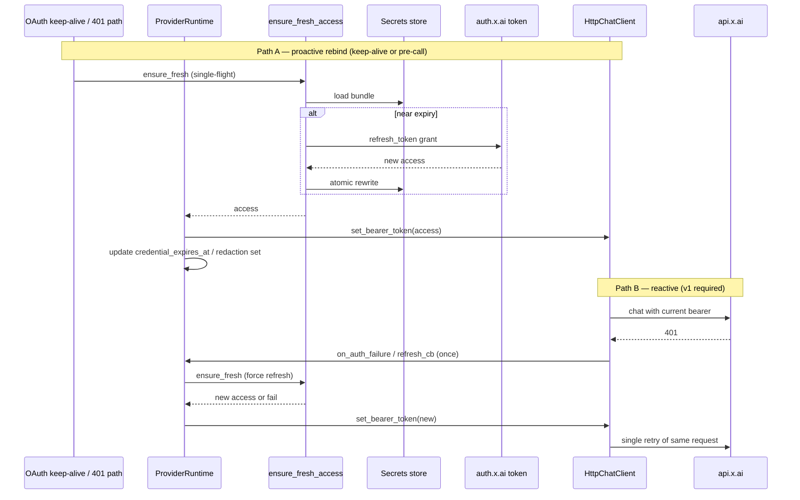

# Design: In-browser xAI / Grok login for Project Elyra

| Field | Value |
|-------|--------|
| **Document** | In-browser xAI OIDC login (device-code + optional PKCE) |
| **Author** | Design (Grok Build subagent) |
| **Date** | 2026-07-30 |
| **Revised** | 2026-07-30 (review 39845e5b) |
| **Status** | Proposed — implement via ordered PRs below |
| **Product** | project-elyra |
| **Branch context** | `grok-improv-radeonvii` product tip; Autopoiesis Commons gym |
| **Related** | `elyra/llm/auth.py`, `elyra/llm/client.py` (`set_bearer_token`), `elyra/secrets/*`, `elyra/runtime/provider_runtime.py`, `elyra/runtime/api.py`, Glass Status provider card, OpenClaw `xai-oauth` (primary protocol reference), `docs/grok-improvement-plan/phase-0.md` |
| **Priority** | QoL + foundation for multi-instance and future `grok_build` tool |

---

## Overview

Implement **in-browser (and CLI-parity) login** for xAI Grok authentication that **does not** depend on hijacking Grok Build’s `~/.grok/auth.json`. Replicate OpenClaw’s **direct authentication** approach: xAI OIDC with **device-code** (preferred) and optionally **localhost PKCE**, store tokens in **Elyra’s own secrets system**, and use the access token as Bearer on `https://api.x.ai/v1`.

**One-sentence outcome:** An operator can complete xAI login from Glass (or CLI), Elyra owns the tokens under `data/secrets/`, **live chat stays fresh overnight** via refresh + rebind (not disk-only), and a future `grok_build` tool can consume a **scoped access handle** without a second login ceremony.

**Consent UI nuance (document for operators):** The OAuth consent screen may still label the application **Grok Build**, because Elyra uses xAI’s **shared public OAuth client** (same `client_id` OpenClaw uses). That is **not** the same as reading or writing `~/.grok/auth.json`. Elyra never writes Grok Build’s home config.

---

## Background & Motivation

### Why now

Phase 0 shipped a solid xAI path with:

| Credential source | Mechanism | Pain |
|-------------------|-----------|------|
| `grok_build` (default) | Parse `~/.grok/auth.json` | Requires Grok Build / `grok login` on the **host**; shared home file across tools; no refresh inside Elyra; multi-instance / multi-user nodes collide |
| `api_key` | `data/secrets/xai_api_key` or `XAI_API_KEY` | Fine for CI / API-key accounts; not SuperGrok **subscription** session semantics |

Operators dogfooding Elyra as a communal teammate need:

1. Login without installing or using Grok Build on every machine.
2. Per-instance credentials (`ELYRA_HOME` / data_dir isolation).
3. Token refresh so overnight presence workers do not die after access-token expiry — **including the live chat client**, not only on-disk secrets.
4. A shared **credential plane** for a future in-sandbox `grok_build` tool.

### Why refresh-on-resolve alone is insufficient (code reality)

Today, `ProviderRuntime.rebuild_chat_stack()` freezes the bearer into `HttpChatClient` at build time (`elyra/runtime/provider_runtime.py`). Each chat request reads `self._bearer_token` (`elyra/llm/client.py`). Call sites that re-call `resolve_bearer` on a hot path are primarily the **credits poller** and some **media** routes — **not** the chat stack.

Therefore: refreshing the on-disk OAuth bundle (or even `resolve_bearer` from credits) **does not** rebind `worker.client`. After access TTL (~1h), chat keeps sending a dead token until something calls `set_bearer_token` or `rebuild_chat_stack`.

`HttpChatClient` already exposes thread-safe **`set_bearer_token(token)`** — this is the preferred rebind primitive (same pattern as `set_model` / `set_reasoning_effort`).

### Primary reference: OpenClaw xAI OAuth

OpenClaw (installed 2026.6.8) implements xAI OAuth **without** reading Grok Build `auth.json`.

**Operator surface (OpenClaw):**

```bash
openclaw models auth login --provider xai --method oauth
# device-code / remote:
openclaw onboard --auth-choice xai-oauth
```

**Two methods (same public client):**

1. **Device code** (preferred for remote/SSH/headless): URL + `user_code` → poll token endpoint.
2. **Localhost OAuth PKCE**: temporary listener `http://127.0.0.1:56121/callback`.

### Protocol constants (OpenClaw `xai-oauth` module — adopt as Elyra constants)

| Item | Value |
|------|--------|
| Issuer | `https://auth.x.ai` |
| Discovery | `https://auth.x.ai/.well-known/openid-configuration` |
| Device code | `https://auth.x.ai/oauth2/device/code` |
| Token | `https://auth.x.ai/oauth2/token` |
| Client ID | `b1a00492-073a-47ea-816f-4c329264a828` (public client; token endpoint auth methods include `none`) |
| Scope | `openid profile email offline_access grok-cli:access api:access` |
| Device grant | `urn:ietf:params:oauth:grant-type:device_code` |
| Refresh | `grant_type=refresh_token` + same `client_id` |

**Provenance caveat:** In-repo evidence today only shows Grok Build nested keys (`https://auth.x.ai::<client_id>` in `auth.py` / smoke script), not the OpenClaw module itself. **PR1 acceptance requires** hermetic mocks **plus** an operator-run smoke that hits discovery + device authorization start (see Testing). Pin observed discovery fields in a fixture comment once verified.

### Current Elyra tree (verified 2026-07-30)

| Area | Reality | Path |
|------|---------|------|
| Credential sources | `grok_build` \| `api_key` only; **no silent fallback** | `elyra/llm/auth.py` |
| Triple validation | Independent frozensets in auth, settings, provider_prefs, CLI | Must unify on `auth.VALID_SOURCES` |
| Grok Build session | Nested or flat `auth.json`; fields `key` / `access_token`; expiry checked; **no refresh** | `load_grok_build_session`, `resolve_bearer` |
| API key store | Atomic write `data/secrets/xai_api_key` (0600); env only when source is `api_key` | `write_stored_api_key` / `read_stored_api_key` |
| Named secrets | `meta.json` + `values/<name>`; grants; reserved names include `xai_api_key` | `elyra/secrets/store.py`, `policy.py` |
| `known_values` redaction | **Only** named `values/` — reserved auth files **not** included | `SecretsStore.known_values`, registry |
| Inject | Call-local `secret_env` for **host** builtins with grants; guest/host-stub **must not** merge | `elyra/secrets/inject.py` |
| Chat client | `HttpChatClient.for_xai(bearer_token=...)`; **`set_bearer_token` exists, unused for refresh** | `elyra/llm/client.py` |
| Live repair | `ProviderRuntime.rebuild_chat_stack()` rebinds `worker.client` | `elyra/runtime/provider_runtime.py` |
| Glass | Status provider card: credential select, API key paste; no login ceremony | `elyra/runtime/web/{index.html,app.js}` |
| API | `PATCH /api/provider`, `PUT|DELETE /api/provider/api-key`, `/api/secrets*`; ThreadingHTTPServer | `elyra/runtime/api.py` |
| CLI | `--credential-source grok_build\|api_key` | `elyra/cli.py` |
| Settings default | `ProviderSettings.credential_source = "grok_build"` | `elyra/settings.py` |
| Credits poller | Uses `resolve_bearer` for SuperGrok billing GET | `elyra/runtime/credits_poller.py` |

**Status-safety invariant (non-negotiable, already law):** `CredentialResolution.token` and all secret values never appear in `/api/status`, Glass, moments, or logs. Status uses only `credential_ok`, `credential_detail` (codes), `credential_expires_at`, `credential_email`, `api_key_configured`, and new non-secret OAuth meta.

---

## Goals & Non-Goals

### Goals

1. **In-browser login in Glass** (device-code primary): start flow, show verification URL + user code, complete when polled token arrives; logout / re-auth when refresh fails.
2. **CLI parity:** `elyra auth login` / `elyra auth logout` / `elyra auth status` in this epic (SSH dogfood).
3. **No Grok Build CLI requirement** and **never write** `~/.grok/auth.json`.
4. **Store OAuth tokens under Elyra secrets** with a clear schema, refresh support, fail-closed resolution.
5. **Live credential plane for chat:** after refresh, the **running** `HttpChatClient` (and thus presence worker) uses the new access token without process restart — via `set_bearer_token` rebind and/or single 401→refresh→retry.
6. **Extend credential sources:** add `xai_oauth` as the preferred subscription path; keep `api_key`; demote `grok_build` to optional legacy.
7. **Secrets system capability:** reserved names (including bare `xai_oauth`), redaction of OAuth access (and API key) in tool results, host vs sandbox inject policy, no leakage to glass/status.
8. **Future `grok_build` sandbox tool:** real inject hook shape now; **not** implementing the tool itself.
9. **Multi-instance:** each PE instance uses its own `ELYRA_HOME` / `data/secrets` + distinct `--api-port`; operator checklist documented.
10. **UX:** status panel source switch; login/logout; re-auth when refresh fails; eligibility messaging; remote-tunnel-friendly device-code.

### Non-goals

| Non-goal | Rationale |
|----------|-----------|
| Full `grok_build` tool implementation | Separate GI Phase 1 design |
| Wholesale model catalog changes | Unrelated |
| Required CI for live OAuth | Hermetic unit tests + operator live smoke only |
| Writing secrets into git | Node-local only |
| Browser cookie scrape / reverse-engineer grok.com session | Fragile, ToS-adjacent, not durable |
| Browser-held `device_code` + client-side poll | Exposes device_code; multi-tab races; worse hygiene (see Alternatives) |
| Replacing SuperGrok billing probe protocol | Continue using existing Bearer + credits endpoints |
| Multi-machine secret sync / OS keyring (v1) | Optional later; file store is dogfood-proven |
| Inventing `inject_class` meta fields on `meta.json` in v1 | Defer schema version bump; use code allowlist hook instead |
| Supervisor PID-file single-instance enforcement (v1) | Prefer flock + last-writer-wins + warning; PID file optional later |

---

## Architecture

### High-level components

```text
┌─────────────────────────────────────────────────────────────────┐
│ Glass (:8787) / CLI                                              │
│  Login wizard · status source switch · logout                    │
└───────────────┬─────────────────────────────────┬───────────────┘
                │ HTTP /api/auth/xai/*              │ elyra auth …
                ▼                                   ▼
┌─────────────────────────────────────────────────────────────────┐
│ ElyraRuntime API + ProviderRuntime                               │
│  device session · complete_oauth_login · rebuild · rebind bearer │
│  oauth keep-alive (skew) · 401 refresh callback                  │
└───────────────┬─────────────────────────────────────────────────┘
                │
        ┌───────┴────────┐
        ▼                ▼
┌───────────────┐  ┌──────────────────────────────────────────────┐
│ XaiOidcClient │  │ Credential plane                              │
│ discovery     │  │  resolve_bearer(source=xai_oauth)              │
│ device_code   │  │  ensure_fresh_access() + single-flight lock    │
│ token poll    │  │  store: data/secrets/xai_oauth.json            │
│ refresh       │  │  rebind: http_client.set_bearer_token(access)  │
└───────┬───────┘  │  redaction: auth reserved secrets in known set │
        │ HTTPS    └───────────────────┬──────────────────────────┘
        ▼                              ▼
 https://auth.x.ai              https://api.x.ai/v1
                                cli-chat-proxy (credits)
```

### Data flow — device-code login

```mermaid
sequenceDiagram
  participant Op as Operator
  participant Glass as Glass / CLI
  participant API as Elyra API
  participant Sess as OAuthDeviceSession
  participant Auth as auth.x.ai
  participant Sec as Secrets (data/secrets)
  participant PR as ProviderRuntime

  Op->>Glass: Start xAI login
  Glass->>API: POST /api/auth/xai/device/start
  API->>Sess: start (cancel previous if any)
  Sess->>Auth: POST /oauth2/device/code
  Auth-->>Sess: device_code, user_code, verification_uri*
  API-->>Glass: user_code, verification_uri* (no device_code)
  Glass-->>Op: Show URL + code

  loop Poll until terminal (Sess thread; stop Event)
    Sess->>Auth: POST /oauth2/token (device_code grant)
    Auth-->>Sess: pending | slow_down | tokens | error
  end

  Sess->>PR: complete_oauth_login(bundle, activate=true)
  PR->>PR: persist_oauth_login (write bundle + prefs; no provider lock)
  PR->>PR: lock: source + redaction; unlock; rebuild_chat_stack
  API-->>Glass: status success, email, expires_at (no tokens)
```

### Data flow — overnight / live refresh (normative v1)



If refresh fails (`invalid_grant`, network terminal after access already expired, missing refresh): fail closed → `credential_ok=false`, detail `oauth_refresh_failed` / `oauth_reauth_required`; **do not** present access as usable; Glass shows re-login CTA. **No silent fallback** to `grok_build` or `api_key`.

---

## Credential sources (extended)

### Enum — single source of truth

**Normative:** `VALID_SOURCES` lives only in `elyra/llm/auth.py`. All other surfaces **import** it:

| Consumer | Today | Required |
|----------|-------|----------|
| `elyra/llm/auth.py` | Own frozenset | Canonical `VALID_SOURCES` |
| `elyra/settings.py` | `_CREDENTIAL_SOURCES` | Import / alias `VALID_SOURCES` |
| `elyra/llm/provider_prefs.py` | `_VALID_CREDENTIAL_SOURCES` | Import `VALID_SOURCES` (today silently ignores unknown on load — must accept `xai_oauth`) |
| `elyra/cli.py` | argparse choices tuple | Derive from `VALID_SOURCES` |
| `elyra/runtime/api.py` | Uses `VALID_SOURCES` from auth | Keep; verify PATCH |

Regression test: `xai_oauth` round-trips prefs save → load → PATCH → status.

```python
SOURCE_XAI_OAUTH = "xai_oauth"
SOURCE_API_KEY = "api_key"
SOURCE_GROK_BUILD = "grok_build"

VALID_SOURCES = frozenset({SOURCE_XAI_OAUTH, SOURCE_API_KEY, SOURCE_GROK_BUILD})
```

### Roles

| Source | Role | Storage | Refresh + live rebind |
|--------|------|---------|------------------------|
| **`xai_oauth`** | Preferred subscription / SuperGrok session | Elyra `xai_oauth.json` | Yes (Elyra-owned) |
| **`api_key`** | Console API key; CI; non-OAuth accounts | `xai_api_key` or `XAI_API_KEY` | N/A |
| **`grok_build`** | **Legacy optional** — read-only `~/.grok/auth.json` | External file | No (out of process) |

### Default migration policy (decided)

| Phase | Default `credential_source` | Notes |
|-------|----------------------------|-------|
| **PR1–PR4** | Settings ship default may remain `grok_build` **or** leave as-is for existing prefs | UI ships in PR4; do not strand empty homes without a login button |
| **PR5b (after Glass PR4)** | New installs / empty prefs → **`xai_oauth`** | Existing `provider.json` preserved |
| **Legacy** | `grok_build` remains selectable | CLI still accepts it |

**No silent fallback:** selecting `xai_oauth` without a stored bundle → `credential_ok=false`, detail `missing_oauth_tokens`. Selecting `api_key` without key → `missing_api_key`. Selecting `grok_build` without auth.json → `missing_auth_json`.

### `CredentialResolution` extensions

| Field | Change |
|-------|--------|
| `source` | May be `xai_oauth` |
| `token` | Always **access** token only (never refresh) |
| `detail` | New status-safe codes (below) |
| `expires_at` | From OAuth bundle |
| `email` | From **id_token claims only** at login (KD24); omit if missing; no userinfo; drop raw id_token after claims |
| `api_key_configured` | Unchanged |

Expose `oauth_configured` via `ProviderRuntime.status_provider_fields()` (boolean only), parallel to `api_key_configured`.

### Status-safe detail codes (add) + CTA table

| Code | Meaning | Operator CTA (CLI + Glass) |
|------|---------|----------------------------|
| `missing_oauth_tokens` | No OAuth bundle on disk | Log in with xAI in Status (or `elyra auth login`) |
| `invalid_oauth_tokens` | Bundle unreadable / schema bad | Log in again; if persists, logout then login |
| `oauth_token_expired` | Access expired and unusable (should be rare if ensure_fresh + rebind work) | Re-login if refresh also failed |
| `oauth_refresh_failed` | Refresh HTTP/network failed (retryable) | Wait / retry; check network; re-login if persistent |
| `oauth_reauth_required` | Refresh rejected (`invalid_grant`) | Log in with xAI again |
| `oauth_denied` | User denied device consent | Retry login and approve |
| `oauth_device_expired` | Device flow timed out | Start login again |
| `oauth_ineligible` | Account not eligible for this client/scopes | Try API key or contact xAI access |
| `oauth_pending` | Device flow in progress (status only) | Complete URL + code in browser |

**Re-auth CTA union for Glass** (show login panel prominently when active source is `xai_oauth` **or** when detail is any of):

```text
missing_oauth_tokens | invalid_oauth_tokens | oauth_token_expired |
oauth_refresh_failed | oauth_reauth_required | oauth_denied |
oauth_device_expired | oauth_ineligible
```

Also keep legacy `token_expired` / `missing_auth_json` CTAs for `grok_build` source (point to Elyra login **or** legacy `grok login`).

Update `credential_detail_message()` in **PR2** (same PR as new detail codes) — not deferred to CLI/default PR.

---

## OAuth module design

### New package layout

```text
elyra/llm/
  auth.py              # VALID_SOURCES, pure resolve_bearer, redaction helpers for reserved secrets
  xai_oauth.py         # NEW: protocol client + constants + pure ensure_fresh (single-flight, rotated)
  oauth_store.py       # NEW: load/save/delete/public_meta + persist_oauth_login
elyra/runtime/
  oauth_session.py     # NEW: OAuthDeviceSession state machine + poller thread
  provider_runtime.py  # complete_oauth_login, on_access_refreshed, keep-alive, 401 refresh_cb
```

**Import rule:** `xai_oauth.py` may use stdlib `urllib` / `json` only (match `HttpChatClient` style); no heavy deps.

### Constants module surface

```python
XAI_OIDC_ISSUER = "https://auth.x.ai"
XAI_OIDC_DISCOVERY = "https://auth.x.ai/.well-known/openid-configuration"
XAI_OAUTH_CLIENT_ID = "b1a00492-073a-47ea-816f-4c329264a828"
XAI_OAUTH_SCOPE = "openid profile email offline_access grok-cli:access api:access"
XAI_DEVICE_GRANT = "urn:ietf:params:oauth:grant-type:device_code"
XAI_DEVICE_CODE_URL = "https://auth.x.ai/oauth2/device/code"  # fallback
XAI_TOKEN_URL = "https://auth.x.ai/oauth2/token"              # fallback
```

Discovery is **preferred** (cache in-process for process lifetime); fallbacks if discovery 5xx/timeout. After first live smoke, pin key discovery fields in `tests/fixtures/` or module comment.

### Device-code algorithm (normative)

1. `GET` discovery → `device_authorization_endpoint`, `token_endpoint`.
2. `POST` device authorization: `client_id`, `scope` (form-urlencoded).
3. Response: `device_code`, `user_code`, `verification_uri`, optional `verification_uri_complete`, `expires_in`, `interval`.
4. Host holds **in-memory** pending session (never write `device_code` to secrets or API responses).
5. Poll `POST` token with device grant + `device_code` + `client_id`.
6. Handle: `authorization_pending` → sleep `interval` (cap 60s); `slow_down` → increase interval (+5s, cap 60s); `access_denied` → `oauth_denied`; `expired_token` → `oauth_device_expired`; success → tokens.
7. On success: if a live `ProviderRuntime` is bound → `complete_oauth_login(...)`; else (CLI paths-only) → `persist_oauth_login(...)` (see Login entry points).
8. Clear session to terminal state.

### OAuthDeviceSession lifecycle (normative — PR3)

**States:** `idle | pending | success | error | cancelled`

| Event | Behavior |
|-------|----------|
| `start()` | If previous `pending`, set stop Event, join old thread (timeout), replace session; mint new device codes; start daemon poller thread |
| Poller loop | Check stop Event before each HTTP and between sleeps; **never** hold `ProviderRuntime` lock during network I/O |
| `expires_in` clock | Wall clock from start (`time.monotonic` deadline = now + expires_in); on deadline → state `error`, detail `oauth_device_expired` |
| Interval | Server `interval`, +5s on `slow_down`, **max sleep 60s** |
| `cancel()` | Set stop Event; state `cancelled`; join thread best-effort |
| Supervisor `stop()` | Cancel pending session (same as cancel) |
| Process restart mid-flow | Memory gone → `/status` is `idle` / not pending; operator must **start again** (document in Glass) |
| Success | Call live `complete_oauth_login` when ProviderRuntime present; else `persist_oauth_login`; state `success` with public meta only |
| Terminal error | state `error` + detail code; no tokens in status |

Second `start` **always** replaces (not 409 by default). Optional `400 oauth_already_pending` only if we add a “don’t replace” flag later — v1 replaces.

### Optional localhost PKCE (optional PR7)

- Bind **ephemeral** port (or config) — never hardcode `56121` for multi-instance.
- PKCE S256; same client_id and scopes.
- **Device-code remains primary** for remote Glass / SSH / tunnel.

### Refresh algorithm (normative)

`FreshAccessResult` fields (auth layer, pure — **no** rebind side effects):

```text
ok: bool
access_token: str | None
expires_at: str | None
email: str | None
detail: str | None
rotated: bool   # True iff this call wrote a new access_token to disk
```

```text
ensure_fresh_access(data_dir, *, skew_s=120, force: bool = False) -> FreshAccessResult
  # single-flight: one refresh in process at a time (threading.Lock)
  # PURE: no ProviderRuntime / set_bearer_token / process-global hooks
  load bundle  # missing → fail missing_oauth_tokens
  if bundle.reauth_required is true:   # durable flag only — not in-memory-only
    return fail(oauth_reauth_required)  # token=None even if access JWT unexpired
  if invalid schema → fail invalid_oauth_tokens
  if not force and access expires_at - now > skew_s:
    return ok(access, rotated=False)
  if no refresh_token:
    return fail(oauth_reauth_required)  # ok=False; token=None
  POST token: grant_type=refresh_token, refresh_token, client_id
  on success:
    update access (+ refresh if rotated), expires_at, updated_at
    set reauth_required = false
    atomic rewrite bundle (flock if available)
    return ok(access, rotated=True)
  on invalid_grant:
    # KD15 — ALWAYS durable before returning fail (never in-memory-only)
    # Keep tokens on disk for forensics; mark unusable for resolve
    atomic rewrite bundle with reauth_required=true (retain access/refresh fields)
    return fail(oauth_reauth_required)  # token=None always
  on transient error:
    if access still not expired: return ok(access, rotated=False)  # grace; no write
    return fail(oauth_refresh_failed)
```

**Cold start:** `resolve_bearer` / `ensure_fresh` **must** read `reauth_required` from disk on every load. There is **no** in-memory-only sticky path. Process exit after `invalid_grant` still leaves `reauth_required: true` on disk so the next start cannot treat a still-unexpired access JWT as usable.

**Bundle retention (KD15):**

| Event | Disk | resolve_bearer / ensure_fresh |
|-------|------|-------------------------------|
| `invalid_grant` | **Keep** file; **atomic rewrite** `reauth_required: true` (before return) | `ok=False`, `oauth_reauth_required`, **token=None** (even if `expires_at` in future) |
| Transient refresh fail, access still valid | Unchanged | `ok=True` with access, `rotated=False` (grace) |
| Transient refresh fail, access expired | Unchanged | `ok=False`, `oauth_refresh_failed` |
| Logout | **Delete** `xai_oauth.json` + `.tmp` | `missing_oauth_tokens` |
| Successful re-login / successful refresh | Overwrite; `reauth_required: false` | `ok=True` |

### Live chat freshness — v1 required (KD17)

Refresh-on-resolve alone is **necessary but not sufficient**. v1 **requires** all three:

| Mechanism | Role | When |
|-----------|------|------|
| **A. `ensure_fresh` + single-flight lock** | Disk + canonical access; returns `rotated` | Any resolve / keep-alive / 401 / credits |
| **B. Proactive rebind** | Callers that own live clients call `ProviderRuntime.on_access_refreshed` → `set_bearer_token` | Keep-alive; credits after rotation; **not** inside `resolve_bearer` |
| **C. Reactive 401 single-retry** | On chat HTTP 401: one `force` refresh → `set_bearer_token` → retry once; then fail | Mid-moment long tool chains |

**Auth vs runtime boundary (normative purity):**

| Layer | May do | Must not do |
|-------|--------|-------------|
| `ensure_fresh_access` / `resolve_bearer` / `_resolve_xai_oauth` | Disk I/O, refresh HTTP, return `CredentialResolution` / `FreshAccessResult` including `rotated` | Call `set_bearer_token`, touch `ProviderRuntime`, register process-global rebind hooks |
| `ProviderRuntime` keep-alive, credits wrapper, 401 `refresh_cb` | Call ensure/resolve, then **if** `rotated` (or force path) invoke `on_access_refreshed` | Put rebind inside auth.py |
| `rebuild_chat_stack` | `resolve_bearer` then **build new client** with returned token | Also fire `on_access_refreshed` for the same resolve (would double-apply); rebind is the new client itself |

**Normative keep-alive (v1 minimum):**

- `ProviderRuntime` (or supervisor-owned timer, similar spirit to credits poller) when `credential_source == xai_oauth` and `credential_ok`:
  - Wake every ~60s **or** when `expires_at - now < skew_s` (whichever sooner after last check).
  - Call `ensure_fresh_access` (not a side-effecting resolve hook).
  - If `result.ok and result.rotated` (or always on force refresh success): **`on_access_refreshed(access, expires_at, email)`** → `set_bearer_token` + status fields + redaction snapshot.
  - **Never** hold provider lock across refresh HTTP; take lock only to swap bearer / fields.

**Credits poller (required when rotation detectable — PR2):**

- Continues to call `resolve_bearer` / `ensure_fresh_access` for billing GETs (disk refresh benefits SuperGrok probe).
- **PR2 required:** after resolve/ensure, if `rotated` is true (or access token string differs from last seen by poller), call `ProviderRuntime.on_access_refreshed(...)` so chat rebinds without waiting for keep-alive skew.
- Keep-alive remains belt-and-suspenders if a path forgets to signal; it is **not** a substitute for the credits signal in PR2 acceptance when credits code is in-tree.
- Implementation: inject `get_provider_runtime` / `on_access_refreshed` callable into `CreditsPoller` (same pattern as existing `resolve_fn` / `get_credential_source` hooks)—not a global in auth.

**401 path (v1 required, not optional hardening):**

Implement **inside** `HttpChatClient.chat_completion` for the xai profile, on the raw urllib failure **before** converting to `RuntimeError`:

```text
HttpChatClient.chat_completion (xai profile):
  for attempt in (0, 1):  # at most one retry
    try:
      perform urlopen with current bearer
      parse success → return ChatCompletionResult
    except urllib.error.HTTPError as exc:
      # MUST intercept here — today code wraps all HTTPError as
      # RuntimeError(f"chat HTTP {exc.code}: ...") (~client.py 568–571).
      # Do NOT parse RuntimeError strings for 401.
      if exc.code == 401 and refresh_cb is not None and attempt == 0:
        new_token = refresh_cb()  # PR: ensure_fresh(force=True); on_access_refreshed; return access or None
        if new_token:
          set_bearer_token(new_token)
          continue  # single retry
      # non-401, or no cb, or retry already used, or refresh failed:
      body = best-effort read (never log Authorization)
      raise RuntimeError(f"chat HTTP {exc.code}: ...") from exc
    except other network errors:
      raise as today
```

Notes:

- `UsageGatedChatClient` delegates to the inner client; **retry on `HttpChatClient` is sufficient**. Meter records only successful completion (no double-count on failed 401).
- ProviderRuntime wires `refresh_cb` only when source is `xai_oauth`. For `api_key` / `grok_build`, `refresh_cb=None`.
- `refresh_cb` itself: `ensure_fresh(force=True)` then `on_access_refreshed` if ok; return access or None. Auth layer stays pure.

**Mid-flight moments:** With C, a moment that crosses access TTL can recover once. If refresh fails mid-moment, hop fails closed; Glass shows re-auth CTA. Success criterion 3 applies to **ongoing presence** (keep-alive + rebind), not to infinite mid-hop survival without network.

### When to call ensure_fresh

| Call site | ensure_fresh / resolve | Rebind (`on_access_refreshed`) |
|-----------|------------------------|--------------------------------|
| `resolve_bearer(source=xai_oauth)` | Always `ensure_fresh`; return resolution; **no** rebind side effects | N/A (caller decides) |
| `rebuild_chat_stack` | Via resolve_bearer; **new** client built with returned token | **No** separate rebind (new client is the rebind) |
| Credits poller | Via resolve/ensure | **Required** if `rotated` (PR2) |
| Media STT/TTS | Via resolve_bearer (inherits oauth) | Not required for chat; media uses returned token for that request only |
| OAuth keep-alive | Direct `ensure_fresh_access` | **Required** if `rotated` or force success |
| Chat 401 `refresh_cb` | `ensure_fresh(force=True)` | **Required** on success before retry |

### Token response → store fields

| Field | Stored? | Notes |
|-------|---------|-------|
| `access_token` | Yes | Bearer for api.x.ai |
| `refresh_token` | Yes | Never status, never inject |
| `expires_in` | → `expires_at` ISO UTC | `now + expires_in` |
| `id_token` | Parse claims only (KD24) | Store `email`/`subject` if present; omit email if claim missing; drop raw id_token; **no userinfo call** |
| `token_type` | Meta | Expect Bearer |
| `scope` | Meta | As returned |
| `reauth_required` | Yes (bool, default false) | Set on invalid_grant; clear on successful login/refresh |

---

## Secrets schema & filesystem layout

### Layout (extended)

```text
$ELYRA_HOME/data/secrets/          # 0700
  xai_api_key                      # reserved — llm.auth api_key source
  xai_api_key.tmp
  xai_oauth.json                   # reserved — OAuth bundle (JSON, 0600)
  xai_oauth.json.tmp               # atomic write temp
  meta.json                        # named secrets index (no values)
  values/                          # 0700 named operator secrets
    <name>                         # 0600
```

### Why a reserved file (not `values/xai_oauth`)

| Option | Pros | Cons |
|--------|------|------|
| **A. Reserved top-level `xai_oauth.json` (chosen)** | Parallel to `xai_api_key`; never listable as operator-named secret; hard reserved; easy atomic rewrite of structured JSON | Special-case path in policy |
| B. Named secret `values/xai_oauth` | Unified store API | Model-facing list; accidental full-bundle inject |
| C. Split access / refresh files | Least privilege | More files; bugs |

**Decision: Option A.**

### Reserved names (normative complete list)

Update `elyra/secrets/policy.py` `RESERVED_SECRET_NAMES`:

```python
RESERVED_SECRET_NAMES = frozenset({
    # llm.auth — API key
    "xai_api_key",
    "xai_api_key.tmp",
    # llm.auth — OAuth bundle (file + bare name + future inject alias)
    "xai_oauth",
    "xai_oauth.json",
    "xai_oauth.json.tmp",
    "xai_access_token",  # future system name; block named-store collisions now
    # store layout
    "meta.json",
    "values",
})
```

`is_reserved_secret_name` already casefolds — tests must assert `secrets_set("xai_oauth")` and `secrets_set("xai_oauth.json")` raise `reserved_secret_name` (mirror `xai_api_key` tests).

### OAuth bundle schema (`xai_oauth.json`)

```json
{
  "version": 1,
  "client_id": "b1a00492-073a-47ea-816f-4c329264a828",
  "access_token": "...",
  "refresh_token": "...",
  "token_type": "Bearer",
  "scope": "openid profile email offline_access grok-cli:access api:access",
  "expires_at": "2026-07-30T18:00:00Z",
  "email": "operator@example.com",
  "subject": "optional-sub-claim",
  "obtained_at": "2026-07-30T12:00:00Z",
  "updated_at": "2026-07-30T12:00:00Z",
  "auth_method": "device_code",
  "reauth_required": false
}
```

**Permissions:** file `0600`, dir `0700`, atomic write (`tmp` + `os.replace` + fsync) mirroring `write_stored_api_key`. Prefer `fcntl.flock` on write when available (same-dir multi-process last-writer-wins with warning log).

**Public meta API** (never tokens):

```python
@dataclass(frozen=True)
class OAuthPublicMeta:
    configured: bool
    email: str | None
    expires_at: str | None
    updated_at: str | None
    auth_method: str | None
    reauth_required: bool
```

### Redaction: reserved auth secrets in `known_values` (normative)

**Gap today:** `SecretsStore.known_values()` only walks `values/`. Registry redaction therefore misses `xai_api_key` and will miss OAuth access.

**Normative fix (PR2 acceptance):**

```text
def auth_secret_values_for_redaction(data_dir) -> list[str]:
  out = []
  # API key file (and env if active? prefer file only to avoid env noise)
  if k := read_stored_api_key(data_dir): out.append(k)
  # OAuth access (+ refresh for belt-and-suspenders if present on disk)
  bundle = load_oauth_bundle_optional(data_dir)
  if bundle:
    if bundle.access_token: out.append(bundle.access_token)
    if bundle.refresh_token: out.append(bundle.refresh_token)
  return out
```

Registry / tool result redaction path must union `store.known_values()` **with** `auth_secret_values_for_redaction(data_dir)`. On every successful refresh/login, the in-memory set used by the worker must update (ProviderRuntime holds last-known access for redaction without re-reading every tool call if desired — still safe to re-read file under lock).

Tests: assert a tool result that echoes the access token is scrubbed to `***`.

**Do not** write access into `values/` solely for redaction.

### Future inject hook (real shape in PR6 — no fictional meta)

**Do not** invent `inject_class` fields on `meta.json` in v1 login writes.

Ship a real code hook (even without the tool):

```python
# elyra/secrets/inject.py (or elyra/llm/auth.py)
GROK_BUILD_TOOL_NAMES = frozenset({"grok_build"})  # allowlist

def resolve_access_token_for_tool(tool_name: str, data_dir: Path) -> str | None:
    """Access-only. Never returns refresh_token. Guest paths must not call this
    into secret_env merge (registry guest/host-stub still ignore secret_env)."""
    if tool_name not in GROK_BUILD_TOOL_NAMES:
        return None
    # ensure_fresh_access → access only; None if reauth/missing
    ...
```

When `grok_build` exists as a **host builtin**, registry attaches `XAI_ACCESS_TOKEN` (or agreed env) from this hook into call-local `secret_env` **in addition to** grant-map named secrets — or the tool uses the hook directly. Guest/sandbox: **default refuse**; host-builtin / broker preferred.

Reserve name `xai_access_token` now so a future system-managed named secret cannot collide if we ever materialize one; preferred path remains in-memory/hook without `values/` write.

---

## Threat model (secrets + sandbox)

### Assets

| Asset | Sensitivity | Location |
|-------|-------------|----------|
| OAuth refresh_token | **Critical** | `data/secrets/xai_oauth.json` only |
| OAuth access_token | High | Bundle; runtime memory; redaction set; optional tool inject |
| API key | High | `xai_api_key` |
| Named secrets | High | `values/` |
| Status / Glass JSON | Operator-local | No secrets |
| Moment tape / model context | Model-visible | No secrets |
| Guest sandbox | Untrusted | Must not receive refresh; access only under explicit future policy |

### Trust boundaries

```text
[ Operator browser ] --HTTP--> [ Glass API :8787 ] --FS--> [ data/secrets 0700 ]
                                      |
                                      +--host builtins (grant-scoped secret_env + oauth access hook)
                                      |
                                      +--guest sandbox: NO secret_env merge (existing law)
                                      |
                                      +--model context: never secrets
```

Glass defaults to `127.0.0.1`. API process compromise = full secret compromise (same as today).

### Threats & mitigations

| Threat | Mitigation |
|--------|------------|
| Refresh token exfiltrated via guest tool | Never inject refresh; guest ignores `secret_env`; access-only hook allowlist |
| Tokens in tool results / HTTP errors | Union redaction set includes oauth access + refresh + api_key |
| Status/Glass leak | Codes, booleans, email, expires_at only |
| Log leak | Never log tokens; prefer never log device_code |
| Device-code interception | Short-lived user_code; TLS to auth.x.ai; device_code server-only |
| Bundle world-readable | 0600/0700; best-effort chmod |
| Confused deputy (`secrets_set` oauth names) | Full reserved set including bare `xai_oauth`, `xai_access_token` |
| CSRF / local process abuse of login API | **Accepted residual v1:** any local process can `POST` device start / logout on loopback. Optional cheap `Origin`/`Referer` loopback check in PR3. Defer full CSRF token to later if binding off-loopback. |
| Same data_dir multi-process | flock on oauth/prefs writes; last-writer-wins; WARNING log; **unsupported** as HA |
| Cross-instance secret copy | Document: do not copy `xai_oauth.json` between homes; re-login per instance (shared client_id makes stolen refresh portable) |
| Sandbox uses stolen access | Residual if inject ever enabled; minimize TTL; prefer host broker |

---

## Runtime integration

### `resolve_bearer` changes (pure — no rebind)

```text
if src == SOURCE_XAI_OAUTH:
    return _resolve_xai_oauth(...)  # ensure_fresh; honor durable reauth_required → token=None
                                    # never calls on_access_refreshed
if src == SOURCE_GROK_BUILD:
    return _resolve_grok_build(...)
if src == SOURCE_API_KEY:
    return _resolve_api_key(...)
```

Optional extension: `CredentialResolution` may carry `rotated: bool = False` for oauth, **or** callers that need rotation call `ensure_fresh_access` directly (preferred for credits/keep-alive) and map to resolution for rebuild.

### Login entry points (disk vs live runtime — KD13)

Two named functions; **no** third fork of write/prefs logic:

| Function | Module | Responsibility |
|----------|--------|----------------|
| **`persist_oauth_login(data_dir, tokens, *, activate: bool = True) -> OAuthPublicMeta`** | `elyra/llm/oauth_store.py` (or auth helpers) | (1) Atomic write bundle with `reauth_required=false`; (2) if `activate`: `update_provider_prefs(data_dir, credential_source=xai_oauth)`; (3) return public meta only. **No** `ProviderRuntime`, **no** rebuild, **no** `set_bearer_token`. |
| **`ProviderRuntime.complete_oauth_login(tokens, *, activate: bool = True) -> status fields`** | `provider_runtime.py` | Calls `persist_oauth_login` then live rebind/rebuild (sequence below). |

| Caller | Which entry |
|--------|-------------|
| CLI `elyra auth login` (paths only, no supervisor) | `persist_oauth_login` only |
| Device session success **with** live ProviderRuntime (Glass / `elyra start`) | `complete_oauth_login` |
| Device session success in unit tests without runtime | `persist_oauth_login` |
| Logout | `delete_oauth_bundle` + if live and source oauth → rebuild |

PR5a tests cover `persist_oauth_login`. PR2/PR3 cover `complete_oauth_login`.

### `ProviderRuntime` (normative methods)

| Method / field | Behavior |
|----------------|----------|
| `oauth_configured: bool` | Status |
| `status_provider_fields()` | + `oauth_configured` |
| `rebuild_chat_stack` | pure `resolve_bearer` → new client with returned token; wire 401 `refresh_cb` when source `xai_oauth`; **no** rebind hook on that resolve |
| `apply_credential_source` | Fail-closed as today; uses shared `VALID_SOURCES` |
| **`complete_oauth_login(...)`** | `persist_oauth_login` + rebuild/rebind (KD13) |
| `logout_xai_oauth()` | Delete bundle + tmp; clear redaction snapshot; if active source oauth → rebuild fail-closed |
| `on_access_refreshed(access, expires_at, email)` | Under short lock: `set_bearer_token` if live http_client; update status fields; update redaction snapshot |
| Keep-alive timer | Start/stop with provider xai + oauth source; calls ensure then `on_access_refreshed` if rotated |
| `start_xai_device_login` / cancel | Delegate to `OAuthDeviceSession` |

### `complete_oauth_login` lock / I/O order (normative)

Login complete is **local FS only** (no OAuth network). Concurrent `PATCH /api/provider` last-writer-wins is **accepted**.

```text
complete_oauth_login(tokens, *, activate: bool = True) -> public status fields
  # (1) Disk + prefs WITHOUT holding ProviderRuntime._lock
  meta = persist_oauth_login(data_dir, tokens, activate=activate)
      # atomic xai_oauth.json write (reauth_required=false)
      # if activate: update_provider_prefs(... credential_source=xai_oauth)

  # (2) Under lock: in-memory source + redaction snapshot only (no FS, no network)
  with self._lock:
    if activate:
      self.credential_source = xai_oauth
    # always refresh redaction snapshot from new tokens (access + refresh)
    self._auth_redaction_values = [access, refresh, ...]
    # do not rebuild under this lock

  # (3) Outside lock: rebuild uses its own lock discipline (same as today)
  if activate or self.credential_source == xai_oauth:
    rebuild_chat_stack()
      # resolve_bearer reads new bundle; builds HttpChatClient with fresh bearer
      # wires refresh_cb; does NOT call on_access_refreshed for that resolve

  # (4) Return public meta / status fields only (no tokens)
  return status fields including oauth_configured, credential_ok, ...
```

If `activate=False` and active source is not `xai_oauth`: persist only; leave previous source/stack intact (operator logs in “for later”).

**v1 default `activate=True`** (KD13). Glass checkbox: “Switch credential source to Elyra login” (checked by default). CLI `--no-activate` → `activate=False`.

### Credits poller

**PR2 required** change: after resolve/ensure, if rotation detected (`FreshAccessResult.rotated` or access string changed), call injected `on_access_refreshed`. Re-auth messaging → Elyra login, not `grok login` (PR2 detail messages). Keep-alive is belt-and-suspenders, not the sole path.

Media STT/TTS paths already use `resolve_bearer` — inherit `xai_oauth` when `VALID_SOURCES` extended; each request uses the returned token for that HTTP call (no long-lived media client bearer freeze today). No separate media design.

### Supervisor cold start

Extended sources; start keep-alive if oauth; cancel device session on shutdown; startup messages for `missing_oauth_tokens` / `oauth_reauth_required` (from **durable** flag) point to Glass / `elyra auth login`.

---

## API design (Glass + machine)

All auth endpoints: **never** return `access_token` / `refresh_token` / `device_code`. Device start returns `user_code` + verification URLs only (public by OAuth design).

### Device flow (server-polled)

| Method | Path | Body / result |
|--------|------|----------------|
| `POST` | `/api/auth/xai/device/start` | Body optional `{ "activate": true }`. → `{ ok, user_code, verification_uri, verification_uri_complete?, expires_in, interval, pending: true }` |
| `GET` | `/api/auth/xai/device/status` | → `{ ok, state: idle\|pending\|success\|error\|cancelled, email?, expires_at?, detail?, credential_source?, credential_ok? }` |
| `POST` | `/api/auth/xai/device/cancel` | → `{ ok, state: cancelled }` |
| `POST` | `/api/auth/xai/logout` | → `{ ok, oauth_configured: false, ... }` |
| `GET` | `/api/auth/xai` | → public meta |

**On success:** only via `complete_oauth_login` (activate from start body or session flag, default true).

**Errors:**

| HTTP | error code |
|------|------------|
| 400 | invalid body |
| 503 | provider unavailable |
| 200 + `state=error` | device terminal failures (preferred mid-flow) |

Replace-on-start is default (no 409).

---

## Glass UX

### Provider card

1. **Credential select order** (after migration):
   1. `xai_oauth` — “xAI login (Elyra)”
   2. `api_key` — “API key”
   3. `grok_build` — “Grok Build auth.json (legacy)”

2. **Login panel** (always available as secondary action; prominent when source is `xai_oauth` or re-auth CTA fires):
   - Button **Log in with xAI** — **disabled / debounced while `state=pending`**
   - On click: `POST .../device/start` with `{ activate: <checkbox> }`
   - Checkbox default checked: “Switch credential source to Elyra login”
   - Display: prefer `verification_uri_complete` as primary openable link; else URI + large monospace **user code** + **Copy** button
   - Poll `/status` every 1–2s; spinner while pending
   - If process restarted mid-flow: status idle → prompt “Start login again”
   - Helper: “Consent screen may say Grok Build — shared xAI app name. Tokens stay in this instance’s data/secrets.”
   - **Remote / tunnel:** Device-code is **supported** when Glass is reached via SSH tunnel or non-loopback; operator completes auth.x.ai on **their** browser; Elyra host only polls token endpoint. Call this out in helper text: “Open the link on any device; you do not need a browser on the Elyra host.”

3. **Logout** when `oauth_configured`

4. **Re-auth CTA** using the detail union table above

5. **Eligibility** for `oauth_ineligible`

6. API key stack unchanged for `api_key`

### Accessibility

- `user_code` exposed to screen readers; buttons labeled; Copy control keyboard-accessible

---

## CLI parity (in epic — KD16)

```bash
elyra auth login [--no-activate] [--timeout-s N]
elyra auth logout
elyra auth status
elyra start --credential-source xai_oauth|api_key|grok_build
```

**`elyra auth login`:** device flow on stdout; may run **without** full supervisor (paths only) so operators login before `start`. On success calls **`persist_oauth_login(data_dir, tokens, activate=not args.no_activate)`** — disk + optional prefs only. Does **not** construct a half-initialized `ProviderRuntime`. After `elyra start`, cold `rebuild_chat_stack` picks up the bundle. If the operator runs login against an **already running** instance’s `data_dir`, they must restart or use Glass login (`complete_oauth_login`) to rebind live chat — document this in CLI help.

---

## Multi-instance (operator checklist)

| Requirement | Rule |
|-------------|------|
| Home | Distinct `ELYRA_HOME` per instance (secrets + `data/runtime/provider.json` are per-home) |
| Port | Distinct `--api-port` (default 8787) |
| Secrets | **No** shared bind-mount of `data/secrets` across instances |
| Login | **Re-login per instance** — do not copy `xai_oauth.json` between homes |
| Glass | Point browser/tunnel at that instance’s host:port |
| Device session | Process-local; instance A cannot finish instance B’s pending device flow |
| PKCE (if used) | Ephemeral port only |
| Same data_dir, two processes | **Unsupported** for correctness; flock + last-writer-wins; WARNING if lock contended; no PID-file required in v1 |
| Grok Build auth.json | Global `~` — avoid for multi-instance; prefer `xai_oauth` |

---

## Migration path (`grok_build` → `xai_oauth`)

### Principles

1. Do not break existing dogfood mid-session without operator action.
2. Login success **defaults to activate** (switch to `xai_oauth`) with visible checkbox.
3. Preserve fail-closed (no silent source switching without successful resolve).
4. **Do not** flip ship default until Glass login UI exists (PR5b after PR4).

### Steps

| Step | Behavior |
|------|----------|
| 1. PR1–PR3 | Code available; prefs still typically `grok_build` |
| 2. PR4 Glass | Banner if `grok_build`: “You can log in with xAI inside Elyra (recommended).” |
| 3. Login success | `complete_oauth_login(activate=true)` by default |
| 4. PR5b | Empty prefs / new install default → `xai_oauth` |
| 5. Startup | Missing tokens → Glass / `elyra auth login` messaging (from PR2) |
| 6. Legacy | `grok_build` remains |

### Settings / prefs

```toml
# elyra.toml — after PR5b
[provider]
credential_source = "xai_oauth"
```

`data/runtime/provider.json` is per-`ELYRA_HOME` and non-secret only.

### Deliberately not done

- Auto-import from `~/.grok/auth.json`
- Delete Grok Build auth on Elyra logout
- Dual-write tokens back to Grok Build

---

## Alternatives considered

| Alternative | Why not chosen |
|-------------|----------------|
| **Keep `grok_build` only** | Blocks multi-instance QoL; no in-process refresh/rebind |
| **Browser cookie scrape** | Fragile, ToS-adjacent |
| **SSO-only external broker** | Worse offline/SSH story |
| **API key only** | Insufficient for SuperGrok session dogfood |
| **Read auth.json + refresh its token** | Couples path/writers; multi-instance unsafe |
| **Browser-held `device_code` + client-side poll** | Exposes `device_code` to Glass; multi-tab races; worse secret hygiene — **rejected** (KD5 server-side poll) |
| **Refresh-on-resolve without chat rebind** | **Rejected for v1** — freezes dead bearer in `HttpChatClient`; fails overnight goal |
| **OS keyring** | Future; file store matches secrets design |
| **Custom confidential client** | We don’t control registration; shared public client matches OpenClaw |
| **Device-only vs PKCE-only** | Device primary; PKCE optional |

---

## Testing strategy

### Hermetic unit tests (required)

| Area | Tests |
|------|-------|
| Device state machine | pending → success; slow_down; denied; expired; cancel stop Event; replace start |
| Refresh single-flight | Concurrent ensure_fresh; invalid_grant → reauth + token None |
| Store | Atomic write; modes; public meta; reserved bare `xai_oauth` |
| `resolve_bearer(xai_oauth)` | Missing / valid / refresh / reauth_required |
| **Live rebind** | After refresh, `HttpChatClient` Authorization uses new token (`set_bearer_token`) |
| **401 retry** | Mock 401 then 200 with refresh_cb; second 401 fails |
| `VALID_SOURCES` | prefs save/load/PATCH round-trip `xai_oauth` |
| Redaction | Access + api_key scrubbed from tool results |
| Status serializers | No secrets |
| Inject hook | `resolve_access_token_for_tool("grok_build")` access-only; other tools None |

### Operator live smoke (PR1 gate for constants — not CI)

Script sibling to `scripts/prototype_xai_grok_auth_smoke.py`:

1. GET discovery; print endpoints; assert device + token URLs present.
2. POST device authorization with pinned client_id + scopes; print user_code (operator may abort).
3. Optional full login + chat completion once.

Pin discovery snapshot fields in fixture comments after first success.

### Regression

`tests/test_llm_auth.py`, `test_provider_api.py`, `test_provider_runtime.py`, `test_api_secrets.py`, credits tests stay green.

---

## Implementation sketch (engineer-ready)

### Files to add

| File | Responsibility |
|------|----------------|
| `elyra/llm/xai_oauth.py` | Constants, discovery, device, refresh, single-flight; pure `ensure_fresh_access` → `FreshAccessResult` |
| `elyra/llm/oauth_store.py` | load/save/delete/public_meta; flock; **`persist_oauth_login`** |
| `elyra/runtime/oauth_session.py` | `OAuthDeviceSession` state machine + poller |
| `scripts/prototype_xai_oauth_device_smoke.py` | Operator discovery + device start smoke |
| `tests/test_xai_oauth.py` | Protocol mocks |
| `tests/test_oauth_store.py` | Persistence + reserved + `persist_oauth_login` |
| `tests/test_oauth_rebind.py` | set_bearer_token + 401 before RuntimeError wrap |

### Files to modify

| File | Change |
|------|--------|
| `elyra/llm/auth.py` | `SOURCE_XAI_OAUTH`, pure resolve, detail codes, `auth_secret_values_for_redaction` |
| `elyra/llm/client.py` | `refresh_cb`; intercept `HTTPError` **before** `RuntimeError` wrap; 401 single-retry; `set_bearer_token` |
| `elyra/llm/provider_prefs.py` | Import `VALID_SOURCES` from auth (replace `_VALID_CREDENTIAL_SOURCES`) |
| `elyra/secrets/policy.py` | Full reserved set |
| `elyra/secrets/inject.py` | `resolve_access_token_for_tool` (PR6); registry union redaction earlier (PR2) |
| `elyra/tools/registry.py` | Union auth secrets into redaction known_values |
| `elyra/settings.py` | Alias `VALID_SOURCES`; default flip only in PR5b |
| `elyra/cli.py` | Choices from `VALID_SOURCES`; `auth` subcommands → `persist_oauth_login` (PR5a) |
| `elyra/runtime/provider_runtime.py` | `complete_oauth_login` (calls persist then rebuild), `on_access_refreshed`, keep-alive, detail messages, wire `refresh_cb` |
| `elyra/runtime/api.py` | `/api/auth/xai/*` (PR3); media already inherits resolve |
| `elyra/runtime/web/*` | Login UX (PR4) |
| `elyra/runtime/supervisor.py` | Session cancel on stop; keep-alive lifecycle |
| `elyra/runtime/credits_poller.py` | **Required (PR2):** after resolve/ensure, if rotated → `on_access_refreshed` (injected callback) |
| `elyra/runtime/config.py` | Only if merge validates credential_source independently — import same set |
| Tests listed above | |

### Pseudocode — pure resolve (no rebind)

```python
def _resolve_xai_oauth(*, data_dir: Path, api_key_configured: bool) -> CredentialResolution:
    # PURE: no set_bearer_token, no ProviderRuntime, no global hooks
    fresh = ensure_fresh_access(data_dir)
    if not fresh.ok:
        return CredentialResolution(
            ok=False, source=SOURCE_XAI_OAUTH, token=None,
            detail=fresh.detail, expires_at=fresh.expires_at, email=fresh.email,
            api_key_configured=api_key_configured,
        )
    return CredentialResolution(
        ok=True, source=SOURCE_XAI_OAUTH, token=fresh.access_token,
        detail=None, expires_at=fresh.expires_at, email=fresh.email,
        api_key_configured=api_key_configured,
        # optional: rotated=fresh.rotated if dataclass extended
    )


def credits_poller_after_resolve(fresh_or_resolution, runtime: ProviderRuntime) -> None:
    if getattr(fresh_or_resolution, "rotated", False):
        runtime.on_access_refreshed(
            fresh_or_resolution.access_token,
            fresh_or_resolution.expires_at,
            fresh_or_resolution.email,
        )
```

---

## Rollout & risk

| Risk | Likelihood | Impact | Mitigation |
|------|------------|--------|------------|
| Wrong client_id/scopes | Med until smoke | High | PR1 live smoke gate |
| xAI endpoint change | Low | High | Discovery + fallbacks |
| Client_id revoked | Low | High | API key path remains |
| “Grok Build” consent confusion | Med | Low | Glass helper |
| Refresh race | Med | Med | Single-flight + flock |
| Overnight chat still stale | Med if rebind skipped | High | KD17; PR2 acceptance tests |
| Default flip strands new home | Med | Med | PR5b only after PR4 UI |
| Local CSRF / malware logout | Low–Med | Med | Accepted residual; optional Origin check |
| Scope creep to grok_build tool | Med | Med | Hook only in PR6 |

---

## Open Questions

Resolved by operator (see KD23–KD24). Remaining non-blocking unknowns:

1. **Credits live confirmation:** Does SuperGrok billing accept Elyra-obtained OAuth access identically? (One operator smoke after first login.)
2. **PKCE demand:** Defer until dogfood asks (default: PR7 optional only).

---

## Key Decisions

| ID | Decision | Rationale |
|----|----------|-----------|
| **KD1** | OpenClaw-compatible public OIDC client; **never** read/write `~/.grok/auth.json` for new path | Proven protocol shape; multi-instance; independence from Grok Build CLI |
| **KD2** | **Device-code is v1 primary**; PKCE optional PR7 | Remote Glass/SSH/tunnel; ephemeral ports if PKCE later |
| **KD3** | New source **`xai_oauth`**; keep `api_key`; demote `grok_build` to legacy | Clear product story; fail-closed preserved |
| **KD4** | Store OAuth as reserved **`data/secrets/xai_oauth.json`**, not `values/` | Parallel to api_key; no model-facing list; no full-bundle inject |
| **KD5** | **Server-side** device poll; never return `device_code` to browser | Secret hygiene; multi-tab simplicity |
| **KD6** | Refresh via `ensure_fresh` with skew + **single-flight lock**; no silent cross-source fallback | Disk truth + concurrency safety |
| **KD7** | Never inject **refresh_token** to tools/sandbox; future `grok_build` **access only** via allowlisted hook | Guest exfil of long-lived session |
| **KD8** | Consent may show **“Grok Build”** — document as shared client branding | Operator expectation |
| **KD9** | Status/Glass never receive raw tokens | Existing security law |
| **KD10** | Migration: preserve prefs; **new-install default `xai_oauth` only after Glass UI (PR5b)** | Non-breaking; no empty-home trap without login UI |
| **KD11** | API key path remains first-class for CI | Hermetic + non-OAuth accounts |
| **KD12** | Stdlib-only OAuth HTTP client | Match `HttpChatClient`; hermetic mocks |
| **KD13** | Login split: **`persist_oauth_login`** (disk+prefs) + **`complete_oauth_login`** (persist then rebuild); default **`activate=True`**; Glass checkbox to opt out | Shared write path for CLI and runtime; no half-init ProviderRuntime for CLI |
| **KD14** | **`VALID_SOURCES` single source of truth** in `elyra.llm.auth`; settings/prefs/CLI/API import it | Prevent prefs silent-drop of `xai_oauth` |
| **KD15** | On `invalid_grant`: **atomic rewrite** bundle with durable **`reauth_required: true`** (never in-memory-only); resolve **ok=False token=None**; logout deletes | Cold start must not resurrect unexpired access JWT |
| **KD16** | **CLI `elyra auth` is in-epic** (PR5a), separate from default flip (PR5b); CLI uses `persist_oauth_login` only | SSH dogfood; smaller reviews |
| **KD17** | **Live chat freshness is v1 required:** `set_bearer_token` rebind + keep-alive + **401 single-retry** (intercept `HTTPError` before `RuntimeError`); not PR6-optional | Overnight presence; bearer frozen at rebuild today |
| **KD18** | Redaction set unions **named values + reserved auth secrets** (access, refresh, api_key) | Close known_values gap |
| **KD19** | Reserve bare **`xai_oauth`**, **`xai_oauth.json`**, **`xai_access_token`** (+ tmps) | Confused-deputy / name collision |
| **KD20** | Future inject: **`resolve_access_token_for_tool`** allowlist; **no** `inject_class` meta in v1 | Real hook vs vapor schema |
| **KD21** | **`resolve_bearer` / `ensure_fresh` are pure** (return `rotated`); rebind only in ProviderRuntime / credits / 401 cb | Avoid double rebind on rebuild; no auth↔runtime import cycles |
| **KD22** | Credits poller **must** call `on_access_refreshed` when rotation detected (PR2 required); keep-alive is belt-and-suspenders | One rule; no must/optional contradiction |
| **KD23** | Glass/API bind remains **loopback-only for now**; no extra API authn for login endpoints in v1 | Operator decision; accepted residual CSRF if bind later opens off-loopback (revisit authn then) |
| **KD24** | Email from **`id_token` claims only in v1**; omit email if claim missing; **no userinfo** HTTP call | Operator decision; simpler login path; status email optional |

---

## Success criteria

1. Operator completes device login from Glass on a machine **without** `~/.grok/auth.json` and can chat on `api.x.ai`.
2. Tokens live only under that instance’s `data/secrets/xai_oauth.json` (0600).
3. After access expiry, **without process restart**, keep-alive or 401 path refreshes and **rebounds** the live `HttpChatClient` so the next (or retried) chat call succeeds; `credential_ok` stays true until refresh revoked.
4. Mid-moment single 401 recovers once via refresh+retry when refresh works.
5. Logout clears OAuth bundle; chat fails closed if source still `xai_oauth`.
6. `api_key` and legacy `grok_build` still work when selected.
7. No secrets in `/api/status` or Glass; tool results redact oauth access and api_key.
8. Documented multi-instance checklist; per-home secrets + ports.
9. Hook `resolve_access_token_for_tool("grok_build")` exists for future tool without second login ceremony.

---

## PR Plan

Each PR independently reviewable. **PR2 is not complete without live rebind** (KD17).

### PR1 — OAuth protocol client + secret store (no Glass)

| Field | Content |
|-------|---------|
| **Title** | `auth: xAI OIDC client + reserved oauth token store` |
| **Files** | `elyra/llm/xai_oauth.py`, `oauth_store.py`, `elyra/secrets/policy.py` (full reserved set incl. bare `xai_oauth`, `xai_access_token`), tests, `scripts/prototype_xai_oauth_device_smoke.py` |
| **Dependencies** | None |
| **Description** | Discovery, device request helpers, token poll helpers, refresh + **single-flight lock**, atomic `xai_oauth.json`, public meta, `reauth_required` field. Hermetic mocks. Operator smoke checklist for discovery + device start (not CI-blocking merge, but required before trusting constants in dogfood). |

### PR2 — `xai_oauth` source + resolve + **live rebind + 401 retry + redaction**

| Field | Content |
|-------|---------|
| **Title** | `auth: xai_oauth source, refresh, chat rebind, 401 retry, redaction` |
| **Files** | `elyra/llm/auth.py` (pure resolve), `elyra/llm/client.py` (401 on `HTTPError` **before** `RuntimeError`; `refresh_cb`; `set_bearer_token`), `elyra/llm/provider_prefs.py` (`VALID_SOURCES` import), `elyra/settings.py` (import set; **no** default flip yet), `elyra/cli.py` (choices only), `elyra/runtime/provider_runtime.py` (`persist` wrapper `complete_oauth_login`, keep-alive, `on_access_refreshed`, detail messages), `elyra/runtime/credits_poller.py` (**required** rotated → rebind), `elyra/tools/registry.py` / inject redaction union, tests: rebind, 401-before-wrap, prefs round-trip, durable `reauth_required` cold start |
| **Dependencies** | PR1 |
| **Description** | Wire source through pure resolve → rebuild. **Acceptance:** (1) overnight-style keep-alive/rebind test; (2) 401 mock retries once with intercept before RuntimeError; (3) credits path signals rebind on `rotated`; (4) cold start after `invalid_grant` disk flag stays `credential_ok=false`; (5) redaction includes oauth + api_key; (6) detail messages updated. |

### PR3 — Device session manager + HTTP API

| Field | Content |
|-------|---------|
| **Title** | `api: xAI device-code login/logout endpoints` |
| **Files** | `elyra/runtime/oauth_session.py`, `elyra/runtime/api.py`, supervisor stop cancel, `tests/test_api_auth_xai.py` |
| **Dependencies** | PR1, PR2 |
| **Description** | Full `OAuthDeviceSession` lifecycle (stop Event, join, cap interval, no lock across HTTP). Endpoints start/status/cancel/logout. Success → `complete_oauth_login` (persist + rebuild order per lock section). Optional loopback Origin check. Never return tokens/device_code. |

### PR4 — Glass UI login/logout + status labels

| Field | Content |
|-------|---------|
| **Title** | `glass: in-browser xAI device login and credential UX` |
| **Files** | `elyra/runtime/web/index.html`, `app.js`, `style.css` |
| **Dependencies** | PR3 |
| **Description** | Source order; login panel; remote-tunnel helper; debounce pending; Copy; activate checkbox; CTA table; logout; legacy banner. |

### PR5a — CLI `elyra auth` (no default flip)

| Field | Content |
|-------|---------|
| **Title** | `cli: elyra auth login/logout/status` |
| **Files** | `elyra/cli.py`, tests, brief README note |
| **Dependencies** | PR1–PR3 (Glass optional) |
| **Description** | Headless device login parity via **`persist_oauth_login`** only (no half-baked ProviderRuntime). Document restart/Glass for live rebind. |

### PR5b — Default credential_source migration

| Field | Content |
|-------|---------|
| **Title** | `settings: default credential_source xai_oauth for new installs` |
| **Files** | `elyra/settings.py`, docs, startup posture if any remain |
| **Dependencies** | **PR4** (login UI must exist); PR2 detail messages already done |
| **Description** | Flip ship default / empty-prefs default only. Existing `provider.json` preserved. |

### PR6 — Future `grok_build` inject hook only

| Field | Content |
|-------|---------|
| **Title** | `secrets: resolve_access_token_for_tool allowlist hook for future grok_build` |
| **Files** | `elyra/secrets/inject.py`, tests asserting access-only + guest non-merge unchanged |
| **Dependencies** | PR2 |
| **Description** | Real hook shape; **no** `inject_class` meta; **no** grok_build tool implementation. Hardening already landed in PR2. |

### PR7 (optional) — Localhost PKCE

| Field | Content |
|-------|---------|
| **Title** | `auth: optional localhost PKCE login method` |
| **Files** | oauth client PKCE, API method, Glass toggle |
| **Dependencies** | PR3–PR4 |
| **Description** | Ephemeral port; same client/scopes. |

### Merge order

```text
PR1 → PR2 → PR3 → PR4 → PR5b
              ↘ PR5a (∥ PR4)
       PR2 → PR6 (∥ anytime after PR2)
       PR3/4 → PR7 optional
```

**Do not ship PR4–PR5b without PR2 rebind acceptance.** PR1 may merge with mocks before live smoke, but dogfood login waits on smoke-confirmed constants.

---

## Appendix A — Mapping OpenClaw → Elyra

| OpenClaw | Elyra |
|----------|-------|
| `openclaw models auth login --provider xai` | Glass login / `elyra auth login` |
| Device code flow | `XaiOidcClient` + `OAuthDeviceSession` |
| Token file in OpenClaw config | `data/secrets/xai_oauth.json` |
| Bearer on api.x.ai | `HttpChatClient.for_xai` + **`set_bearer_token` on refresh** |
| Shared client_id | Same constant (verify via smoke) |

## Appendix B — Example status fragment (non-secret)

```json
{
  "provider": "xai",
  "credential_source": "xai_oauth",
  "credential_ok": true,
  "credential_detail": null,
  "credential_expires_at": "2026-07-30T18:00:00Z",
  "credential_email": "operator@example.com",
  "api_key_configured": false,
  "oauth_configured": true
}
```

## Appendix C — Example device start response

```json
{
  "ok": true,
  "pending": true,
  "user_code": "ABCD-EFGH",
  "verification_uri": "https://auth.x.ai/device",
  "verification_uri_complete": "https://auth.x.ai/device?user_code=ABCD-EFGH",
  "expires_in": 900,
  "interval": 5
}
```

## Appendix D — Revision notes (review 39845e5b)

**Pass 1:** live chat rebind + 401 as v1 (not PR6); PR plan reorder; reserved bare names; redaction; `complete_oauth_login`; multi-instance; device session lifecycle; inject hook; KD13–KD20; CSRF residual; browser device_code rejected; implementation touchpoints.

**Pass 2 (residual 6):** credits rebind **required** when rotated (KD22); durable-only `reauth_required` atomic write on `invalid_grant` (KD15); `persist_oauth_login` vs `complete_oauth_login` (KD13/KD16); pure `resolve_bearer` / no rebind hook in auth (KD21); 401 on `HTTPError` before `RuntimeError` wrap; normative `complete_oauth_login` lock/I/O order.

**Pass 3 (operator OQ resolve):** KD23 loopback-only bind (no login API authn yet); KD24 id_token email only, no userinfo; remaining OQs = SuperGrok credits smoke + PKCE demand.
