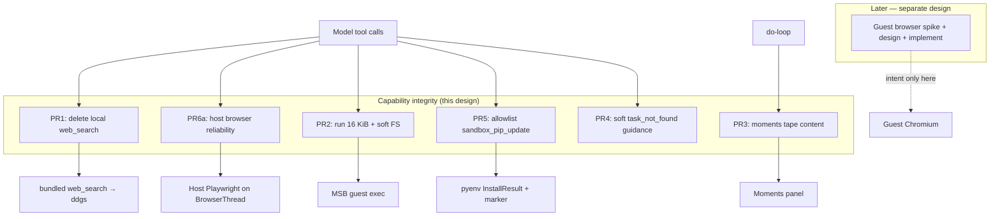
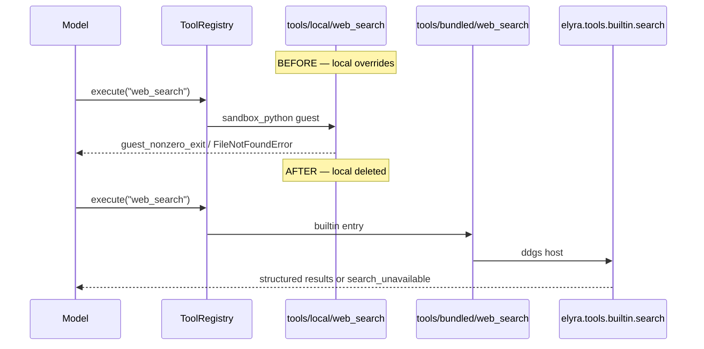
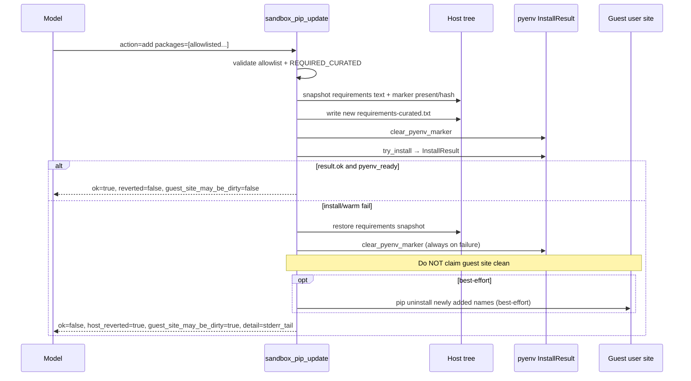
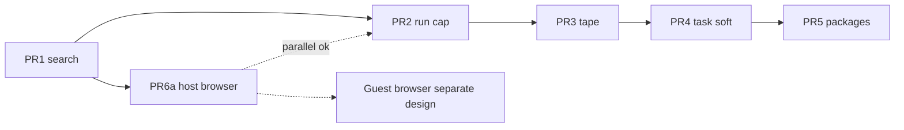

# Design: Capability Integrity Fixes

| Field | Value |
|-------|--------|
| **Class** | DESIGN |
| **Document** | Capability integrity: run cap, web_search cleanup, browser dual-backend intent, sandbox packages, moments tape, task soft guidance |
| **Author** | Design (Grok Build) |
| **Date** | 2026-07-27 |
| **Status** | Draft (revised post-review) |
| **Product** | project-elyra (Stretch 1) |
| **Branch** | `grok-improvement` |
| **Workspace** | `/home/jim/Workspace/project-elyra` |
| **Dogfood refs** | Moments `be49e0ef`, `9aa82c11`, `d0440043` (post capability-growth merge) |
| **Related** | [dev/engineering-principles.md](../../dev/engineering-principles.md), [harness-sandbox-fitness.md](harness-sandbox-fitness.md), [design-capability-growth-search-browse-vcs-secrets.md](design-capability-growth-search-browse-vcs-secrets.md), [stage-b-mc.md](../grok-improvement-plan/stage-b-mc.md), [tools-and-skills.md](../../state/tools-and-skills.md) |
| **Durable path** | `docs/design/capability/design-capability-integrity-run-search-browser-sandbox.md` |
| **Guest browser** | **Out of implementation scope here** — dual-backend *intent* + host fix (PR6a) only; guest path = separate design after spike |

---

## Overview

After the capability-growth merge, live dogfood exposed integrity gaps between **what the model can do**, **what the host enforces**, and **what the operator can see**. Six concrete failures appeared in consecutive moments:

1. Guest `run` command cap at **4 KiB** forced chunked shell file writes that left incomplete Python (`stretch_squeeze.py` ~5299 bytes, mid-function cut).
2. Stale **local** `tools/local/web_search` (sandbox_python DDG Lite scraper) **overrides** the host builtin `elyra.tools.builtin.search:web_search`, producing intermittent `guest_nonzero_exit` / staging `FileNotFoundError`.
3. Host Playwright **Sync API** fails with *inside the asyncio loop* → misclassified as `browser_unavailable` with a misleading install hint (root cause: thread-local running loop at launch time — not proven to be AsyncBridge adjacency; see §6a).
4. Guest packages remain **curated-only** (`lib/requirements-curated.txt` + pyenv warm); the model has no **allowlisted**, fail-closed way to extend the guest env with honest revert semantics.
5. Moment tape tool beats store only `content[:500]` while the model chain receives up to `tool_result_max_chars` (8000) — operators cannot see full errors/hints on Glass.
6. `update_task` / `get_task` return bare `task_not_found` with no soft recovery guidance toward `list_goals` / `get_task`.

This design ships **integrity fixes PR1–PR5 + PR6a** under one theme: **capability tools must be honest, fail-closed, and legible** — without new forever-on HOST ceremony, without unlimited shell / free pip, and with **browser-in-sandbox as long-term intent** (guest implementation = separate design after spike).

**One-sentence outcome:** Elyra’s run, search, host browser, package, tape, and ledger surfaces stop lying under dogfood load — host walls stay small and hard where trust demands it; soft guidance lives in tool payloads and skills.

---

## Background & Motivation

### Dogfood evidence (2026-07-27)

| Symptom | Moment | Tree root cause |
|---------|--------|-----------------|
| `command_too_large` (`limit_bytes: 4096`) then chunked `python3 -c Path.write_text` → incomplete `stretch_squeeze.py` | `be49e0ef`, follow-on `d0440043` | `elyra/tools/builtin/run_cmd.py` `_GUEST_MAX_COMMAND_BYTES = 4 * 1024`; no model-facing `write_file`; `search_replace` cannot create new files (`not_found`) |
| `web_search` ok with `provider: duckduckgo_lite` interleaved with `guest_nonzero_exit` / `FileNotFoundError` staging | `be49e0ef` | `tools/local/web_search/` is `sandbox_python`; registry **local wins over bundled** (`elyra/tools/registry.py` reload) |
| `browser_session_open` → `browser_unavailable` detail: *Playwright Sync API inside the asyncio loop* | `be49e0ef`, `d0440043` | `elyra/tools/browser_sessions.py` `_default_launch` uses Sync API; Playwright checks **thread-local** `asyncio.get_running_loop()`. Mis-hint path maps launch/env failures to `browser_unavailable` + pip install hint |
| Bare `{"error_reason":"task_not_found"}` on `update_task` | `be49e0ef` | `elyra/tools/builtin/ledger.py` returns empty payload — no `hint` / next actions |
| Operator cannot see full tool errors in Moments panel | all | `elyra/loop/doloop.py` tool beat `content[:500]` while chain uses `tool_cap` (8000) |

### Architecture anchors (verified in tree)

| Area | Path | Current behaviour |
|------|------|-------------------|
| Guest run cap | `elyra/tools/builtin/run_cmd.py` | 4 KiB UTF-8; already returns soft `hint` about search_replace / FS tools |
| Harness design | `docs/design/capability/harness-sandbox-fitness.md` | elyra2 guest_shell pattern: **4 KiB command**, 15s default / 30s max (historical) |
| Registry priority | `elyra/tools/registry.py` | Bundled scan first; local overwrites; log once per override |
| Good search | `elyra/tools/builtin/search.py` + `tools/bundled/web_search/` | Host `ddgs` via `elyra[search]`; fail-closed cooldown |
| Bad search | `tools/local/web_search/` | Self-grown DDG Lite HTML scraper; depends on guest staging + bs4 |
| Browser sessions | `elyra/tools/browser_sessions.py` | Process-wide Sync Playwright; `RLock`; `owner_ident`; launch currently **inside** lock |
| Browser tools | `elyra/tools/builtin/browser.py` | Thin wrappers over session manager |
| AsyncBridge | `elyra/sandbox/async_bridge.py` | Dedicated **background** event-loop thread — **not** the PresenceWorker thread |
| Presence worker | `elyra/presence/worker.py` | Sync claim → open → `run_do_loop` → close; single-thread orchestration |
| Glass API | `elyra/runtime/api.py` | `ThreadingHTTPServer` (sync handlers) |
| Curated pyenv | `elyra/sandbox/pyenv.py` | Hash of `lib/requirements-curated.txt`; guest `pip install --user`; host marker `.elyra_pyenv_ready`; `try_install_curated_pyenv` → **bool only** |
| Seed requirements | `sandboxes/sandbox0/lib/requirements-curated.txt` | pytest, requests, httpx, bs4, pyyaml, dateutil, regex, jinja2 |
| FS tools | `elyra/tools/builtin/files.py` | `list_dir`, `read_file`, `grep`, `search_replace` — **no write_file** |
| Tape beat | `elyra/loop/doloop.py` ~L1240 / L1255 | `"content": content[:500]` for tool (+ skip-identical obs) only production sites |
| Chain cap | `elyra/settings.py` `LoopSettings.tool_result_max_chars = 8000` | Applied in `tool_result_to_content` |
| Ledger | `elyra/tools/builtin/ledger.py` | `task_not_found` / `goal_not_found` bare empty payload |
| Soft Decide hybrid | `docs/design/grok-improvement-plan/stage-b-mc.md` | Soft bias + skill/orient text; hard walls stay host law |
| ToolsSettings | `elyra/settings.py` | Today: `verify_timeout_seconds`, `allowed_repo_roots` only |

### Why these fixes together

They are one **integrity class**: each is a place where capability growth shipped power without closing the honesty loop under load. **Guest browser implementation is not in this class’s engineering scope** — only dual-backend *intent* and the host reliability fix (PR6a). Implementation stays incremental (see PR Plan).

### What is already done (out of scope here)

- Soft answer-speak HOST narrowed; monologue false-positive fixed
- Glass tools/skills inspector + package VCS versions
- README install docs for optional extras

---

## Goals & Non-Goals

### Goals

1. **Raise guest `run` command cap 4 → 16 KiB** and strengthen soft FS guidance: prefer `search_replace` for **existing** files; for **new** files prefer a single `run` + `Path.write_text` under 16 KiB (or `install_tool_draft` for packages); use `run` primarily to execute.
2. **Delete** `tools/local/web_search/` entirely so only the host/bundled `ddgs` path remains callable as `web_search`.
3. **Host browser reliability (PR6a)** + dual-backend **intent**: keep host Chromium default until a **separate guest-browser design** validates a guest path; capability tools should not depend on host desktop extras long-term.
4. **New allowlist-add package tool** (`sandbox_pip_update`) with fail-closed host revert + **honest** guest-site dirty flags; structured install result surface.
5. **Fuller Moments tape** for tool results (`content[:tool_cap]`).
6. **Soft-only** task-id recovery guidance on ledger miss (tool payload hints + do-work/plan-work skill text). **No new HOST inject.**

### Non-Goals

| Non-goal | Why |
|----------|-----|
| Unlimited guest shell / remove command cap | Trust boundary; host-fish and accidental DoS |
| New `write_file` tool in this design | Explicit deferral; 16 KiB is the ship fix for ~6–12 KiB single-shot scripts; second incomplete-write dogfood auto-opens OQ1 |
| Free-form / arbitrary PyPI install via the package tool | **Not free pip** — v1 is allowlist-add only (KD11) |
| `set_file` full requirements body replace | Too easy to drop `pytest` / brick verify; v1 omit |
| Force `tool_choice=required` product-default | Explicitly forbidden |
| New forever-on task-recovery HOST | Soft Decide hybrid |
| Move speak/secrets/glass into guest | Host walls remain |
| SearXNG / full search adapter | Host `ddgs` is the product path |
| Multi-sandbox / second guest for browser only | Out of this design |
| **Implement guest browser (PR6b code)** | Separate design after spike; only intent + checklist hooks here |
| Docker / Daytona browser | Retired architecture |
| Memory atoms / Phase 3 | Unrelated |

---

## Key Decisions

| # | Decision | Rationale |
|---|----------|-----------|
| KD1 | Guest `run` max command bytes **16 KiB** (not unlimited, not 64 KiB) | 4× headroom for short scripts; still blocks multi-file dumps via shell; operator lock |
| KD2 | Soft FS guidance: **`search_replace` for existing files**; **new files** via `run`+`Path.write_text` under 16 KiB (or `install_tool_draft` for packages); `run` primarily to execute | Matches live failure; honest about no `write_file` |
| KD3 | **Remove** local `web_search` package entirely (git delete); no deprecation shim | Local override is actively wrong |
| KD4 | Browser: dual-backend **intent**; host remains default; **guest implementation is a separate design** after spike | Operator prefers guest long-term; this doc must stay implementable |
| KD5 | Capability tools should not depend on host desktop extras long-term; speak/secrets/glass stay host walls | Philosophy |
| KD6 | Package tool is host builtin; host files snapshot/restore on failure; guest site honesty via `guest_site_may_be_dirty` (not overclaim clean pip uninstall) | Fail-closed + honest contract |
| KD7 | Moments tool-beat content uses **`tool_cap`** (`loop.tool_result_max_chars`, default 8000) | One knob; Glass already renders full content |
| KD8 | Task miss guidance is **soft only**: payload `hint` + skill lines; no HOST | Stage B MC hybrid |
| KD9 | **Dogfood value order:** PR1 search → **PR6a host browser (parallel)** → PR2 run → PR3 tape → PR4 task soft → PR5 packages → guest browser **later/separate design** | Browser hard-fail is as blocking as search for research moments; independence over pure serial |
| KD10 | Do not ship product-default `tool_choice=required` | Unchanged |
| **KD11** | **v1 package tool = allowlist-add only** (narrow, fail-closed). Unknown package names rejected. No free-form pins, no `set_file`, no URL/VCS/path requirements | Operator “not free pip”; non-goal spirit; curated list stays reviewed source of truth |
| **KD12** | **Required curated packages** (at least `pytest`) cannot be removed; host hard-wall before write | Isolation-on `verify_tool` depends on guest pytest |
| **KD13** | Host browser: **all Sync Playwright session ops + teardown on one dedicated BrowserThread**; do not hold `RLock` across launch; diagnose thread-local loop before/with first commit | Defensive correctness + owner_ident reality; AsyncBridge is not the worker loop |
| **KD14** | `tools.browser_backend` **not shipped in this design** (or deferred stub). Document intent only until guest design lands. Avoid dead `guest`/`auto` enum values | Issue 11 / PR6b split |
| **KD15** | Expand `try_install_curated_pyenv` via **`InstallResult`** (structured), not bool-only + log scraping | Tool and warm path share one surface |

---

## Proposed Design

### High-level flow



### Independence matrix (merge conflicts)

| PR | Primary files | Conflicts with |
|----|---------------|----------------|
| PR1 | `tools/local/web_search/**` (delete), tests/docs mentioning local search | Low — docs only vs PR2/PR4 skills if same doc hunk |
| PR2 | `run_cmd.py`, `run/TOOL.md`, `system.md`, `do-work` (FS lines), tests | **PR4** may also touch `do-work/SKILL.md` — coordinate or sequential |
| PR3 | `doloop.py`, `test_doloop.py` | Low |
| PR4 | `ledger.py`, ledger TOOL.md, `do-work`/`plan-work` | **PR2** skills |
| PR5 | `sandbox_packages.py`, `pyenv.py`, new tool package, tests | Low vs PR1–4 |
| PR6a | `browser_sessions.py`, browser TOOL.md, browse skill, tests | Low vs PR1–5 |

PRs with no hard deps may land in any order; recommended dogfood value is KD9.

---

### 1. Remove local `web_search` (PR1)

**Problem.** `ToolRegistry.reload` scans bundled then local; local names win. Live tape shows `provider: "duckduckgo_lite"` and `guest_nonzero_exit` when staging/impl path is missing. Bundled package is healthy (`tools/bundled/web_search/runner.json` → `elyra.tools.builtin.search:web_search`).

**Change.**

| Action | Detail |
|--------|--------|
| Delete tree | `tools/local/web_search/` entire package (TOOL.md, schema, runner, impl, tests) |
| Leave bundled | Unchanged host builtin |
| Tests | Assert registry resolves `web_search` to **bundled** source when local absent |
| Docs | Note in `docs/state/tools-and-skills.md` / create-tool: do not promote a local tool that **shadows** a critical bundled capability without explicit intent |
| Dogfood | After delete: (1) no `tools/local/web_search` under **active** `ELYRA_HOME` (default = project root; if operator uses non-repo home, remove there too); (2) confirm registry source is `bundled` (unit test or log); (3) `web_search` payload uses host shape (no `provider: duckduckgo_lite`) |

**Evidence cleanup.** Staged copies under `sandboxes/sandbox0/tools/` for the local package are optional housekeeping (not in registry for host builtin path).



---

### 2. Raise run cap 4 → 16 KiB + soft FS nudge (PR2)

**Hard wall (host law).**

```python
# elyra/tools/builtin/run_cmd.py
_GUEST_MAX_COMMAND_BYTES = 16 * 1024  # was 4 * 1024
```

Update comment: product **16 KiB** (integrity fix); still not unlimited. Historical harness doc 4 KiB remains archival context.

**`command_too_large` payload:**

```python
payload = {
    "executor_backend": EXECUTOR_BACKEND_MICROSANDBOX,
    "limit_bytes": _GUEST_MAX_COMMAND_BYTES,
    "hint": (
        "Guest run command exceeds max bytes (16 KiB). "
        "Existing files: prefer search_replace for edits. "
        "New files: one run with Path.write_text under the limit, or "
        "install_tool_draft for tool packages — not multi-KB python -c / heredocs. "
        "Use run primarily to execute (python path/to/script.py, pytest)."
    ),
}
```

**Soft surfaces (no new HOST).**

| Surface | Text |
|---------|------|
| `tools/bundled/run/TOOL.md` | Document 16 KiB guest cap; **new file** path = `run`+write under cap; **existing** = `search_replace`; run for exec |
| `prompts/system.md` Sandbox family | Prefer `search_replace` for edits; new files via short `run` write under cap; `run` to execute |
| `skills/bundled/do-work/SKILL.md` | Same preference under sandbox tools |
| `skills/bundled/create-tool/SKILL.md` | Draft files via `install_tool_draft` files map — never large `run` payloads |

**Honest authoring story (Issue 5).**

- `search_replace` **cannot** create files (`not_found`).
- There is **no** `write_file` tool in this design (non-goal).
- **16 KiB** is enough for the live incomplete-write incident (~5.3 KiB body, multi-KB with python -c framing) as a **single-shot** write — dogfood gate below.
- Stub+`search_replace` chunks remain a **fallback protocol**, not the preferred happy path once 16 KiB ships.
- **Second** live incomplete-write after PR2 → auto-trigger Open Question #1 (`write_file` as PR2b), **not** another cap bump.

**Dogfood acceptance (PR2).**

After PR2, a research moment that needs a **~6–12 KiB new** sandbox script must succeed via:

1. One `run` + `Path.write_text(...)` under 16 KiB, **or**
2. Stub create + `search_replace` fills —

without mid-file truncation / SyntaxError from incomplete writes. This is **not** a complete FS authoring story.

**Tests.**

- `test_run_command_too_large_guest`: use `17 * 1024` payload; assert `limit_bytes == 16384`
- Positive: command of length `16 * 1024` is **not** rejected at the pre-exec gate
- Hint text asserts mention of `search_replace` and new-file guidance

**Quantify.** Live script ~5.3 KiB incomplete; full script likely 6–12 KiB; 16 KiB covers typical single-file tools; multi-file packages use `install_tool_draft`.

---

### 3. Moments tape tool content (PR3)

**Problem.** Chain and tape diverge:

```python
# doloop.py — model-visible
content = tool_result_to_content(tr, tool_cap, tool_name=tc.name)  # tool_cap=8000

# tape — operator-visible (production sites: L1240 tool, L1255 skip-identical obs)
"content": content[:500],
```

Glass `renderBeats` already displays `b.content` fully. Bottleneck is **storage truncation at append**, not UI.

**Design (Option A — chosen).**

```python
"content": content[:tool_cap],  # same LoopSettings.tool_result_max_chars
```

Apply to tool beats **and** skip-identical obs beats.

**What is stored.** Tool beats store **serialized tool result `content`**, not raw tool-call **arguments**. Chain redaction for `SECRET_WRITE_TOOLS` rewrites assistant `tool_calls` arguments; result JSON is usually free of secret values (secrets tools return ok/name/errors, not the secret body). Raising 500→8000 increases retention of whatever already enters `content`.

**PR3 checklist (normative).**

1. Grep production code for `content[:500]` — expect only doloop tool + skip-identical (update both).
2. Update thrash design docs that still mention tape `content[:500]` as product truth (optional note: tape cap now follows `tool_cap`).
3. Tests: long tool error body → beat content length > 500 and includes hint tail.
4. Tests: `secrets_set` success/failure tool beat `content` **never** contains the raw secret material from args.
5. Confirm no other beat types store unredacted secret args at 500/8000.

**Storage estimate.** Worst case: 200 hops × 8 KiB ≈ 1.6 MiB per moment tool content. Acceptable for local dogfood.

---

### 4. Soft task-id recovery (PR4)

**Problem.** From `be49e0ef`: bare `task_not_found` invites inventing ids.

**Hard wall remains:** missing task/goal → `ok=false` with stable `error_reason` (no auto-create, no fuzzy match).

**Canonical payload keys (all four not_found sites).**

| Field | Task miss | Goal miss |
|-------|-----------|-----------|
| `ToolResult.ok` | `False` | `False` |
| `ToolResult.error_reason` | `task_not_found` | `goal_not_found` |
| `payload.ok` | `false` | `false` |
| `payload.task_id` / `payload.goal_id` | attempted id (echo) | attempted id (echo) |
| `payload.hint` | recovery text | recovery text |
| `payload.error_reason` | optional echo of same reason | optional echo |

```python
# get_task / update_task on miss
return ToolResult(
    ok=False,
    payload={
        "ok": False,
        "task_id": task_id,
        "error_reason": "task_not_found",
        "hint": (
            "No task with that id. Call list_goals (or get_goal) to refresh "
            "ids, then get_task / update_task with an exact ledger id. "
            "Do not invent task ids."
        ),
    },
    error_reason="task_not_found",
)

# get_goal / update_goal on miss — same shape with goal_id + goal wording
```

Note: doloop may still inject `attempt` into payload after the tool returns; that is orthogonal.

**Skills (soft Decide).**

| Skill | Addition |
|-------|----------|
| `skills/bundled/do-work/SKILL.md` | On `task_not_found`: `list_goals` → pick real id → continue; do not invent ids |
| `skills/bundled/plan-work/SKILL.md` | Same one-liner |
| TOOL.md | `get_task`, `update_task`, `get_goal`, `update_goal` document error + recovery |

**Out of scope:** HOST inject, thrash special-case, auto-`list_goals` proxy.

**Tests:** unit tests for all four not_found sites (`get_task`, `update_task`, `get_goal`, `update_goal`) asserting keys above.

---

### 5. Sandbox package update tool (PR5)

**Problem.** Guest env is curated and warm-installed. Model cannot free-`pip install`; changing requirements without re-warm + marker leaves `pyenv_ready` false and breaks verify. Operator wants a tool with revert on warm/install failure — **not free pip**.

#### 5.1 Product shape (locked)

| Item | Choice |
|------|--------|
| Tool name | **`sandbox_pip_update`** |
| Kind | Host **builtin** (not sandbox_python) |
| Package location | `tools/bundled/sandbox_pip_update/` + handler `elyra/tools/builtin/sandbox_packages.py` |
| Registration | Same as other builtins: **disk** `runner.json` `entry` → `elyra.tools.builtin.sandbox_packages:sandbox_pip_update`. Touch `elyra/tools/builtin/__init__.py` only if it re-exports for tests/docs (discovery does **not** require Python package export) |
| Mutates | Host `sandboxes/sandbox0/lib/requirements-curated.txt` (product tree via `ensure_host_tree`) |
| Install path | Structured `InstallResult` from pyenv helpers; clear marker; re-run guest pip |
| Network | Guest network must not be `none`; else `network_policy_blocks_pip` |
| Isolation off | Fail with `isolation_required` (hermetic tests stay pure) |

#### 5.2 KD11 — v1 allowlist-add only

**Allowlist file** (seed + product host tree), e.g.:

```text
sandboxes/sandbox0/lib/requirements-allowlist.txt
# one distribution name per line (PEP 503 normalized compare)
# packages the model may ADD to requirements-curated.txt
# required-curated names need not be listed here (they are already present)
httpx
requests
beautifulsoup4
...
```

Alternatively co-locate allowlist as a Python frozenset in `sandbox_packages.py` / `pyenv.py` for v1 simplicity — **prefer seed file** so operators can extend without code change, still fail-closed for unknown names.

**v1 actions:**

| Action | Supported? | Semantics |
|--------|------------|-----------|
| `add` | **Yes** | Merge allowlisted requirement lines into curated file; re-warm |
| `remove` | **Yes (narrow)** | Drop allowlisted optional packages by name; **refuse** if name ∈ `REQUIRED_CURATED`; then re-warm (re-install from file — does not guarantee uninstall of site-packages; see revert contract) |
| `set_file` | **No in v1** | Reject `invalid_action` — full body replace can drop pytest |

**Hard walls before any write:**

1. Each requested package **name** (normalized) must be on the allowlist for `add`, or on allowlist-and-not-required for `remove`.
2. **`REQUIRED_CURATED`** (KD12): at least `pytest` — reject any resulting file that would omit these lines (`missing_required_package`).
3. No URL / VCS / local path / `--index-url` injection in requirement lines (regex fail-closed).
4. Max N packages per call (e.g. 10) and max requirements file size (e.g. 64 KiB).
5. Pins: allow optional version specifier on allowlisted names only (`httpx>=0.27,<1`); reject unknown extras that look like shell.

**Non-goal alignment:** “Auto-install arbitrary PyPI without allowlist review” remains a non-goal because **unknown names never install**. Expanding the allowlist is an **operator / product** change (edit seed file + re-seed or document), not model free agency.

**Soft vs hard (package tool):** Package **selection among allowlisted names** is model-facing soft Decide. **Host enforcement** of allowlist, required packages, caps, network, isolation, and revert is **hard law**. Expanding what the model may install is a **hard-boundary product change**, not Stage B soft bias.

#### 5.3 InstallResult (KD15)

Current `try_install_curated_pyenv` returns `bool` and logs a ~500-char tail — insufficient for tool payloads.

```python
# elyra/sandbox/pyenv.py (sketch)
@dataclass(frozen=True)
class InstallResult:
    ok: bool
    exit_code: int | None = None
    stderr_tail: str = ""          # last ~500–2000 chars
    stdout_tail: str = ""
    requirements_hash: str | None = None
    error_reason: str | None = None  # e.g. lifecycle_unusable, pip_failed, marker_unreadable

def try_install_curated_pyenv(...) -> InstallResult:
    ...
```

- Warm path (lifecycle ensure) may keep a thin wrapper `bool(result.ok)` for call sites that only need ready/not.
- Package tool **must** use full `InstallResult`.
- Default install timeout remains **`DEFAULT_PYENV_INSTALL_TIMEOUT_SECONDS = 600`**. Tool may pass a model-facing timeout (same default or configurable); on timeout return `error_reason=pyenv_install_timeout` with hint that guest pip can take minutes cold. No progress streaming in v1 (tool blocks; optional later).

Do **not** grow `lifecycle.py` into a god module.

#### 5.4 Revert / honesty contract (normative)

Guest state is `pip install --user` into the **guest user site**. Restoring requirements text does **not** automatically uninstall wheels already laid down.



**Normative rules:**

| Step | On failure after partial install | On success |
|------|----------------------------------|------------|
| (1) Restore requirements snapshot | **Always** | N/A |
| (2) Clear marker | **Always** on failure path | Write new marker with hash |
| (3) Restore prior marker | **Only if** best-effort uninstall of newly added names succeeded **and** re-verify `pyenv_ready` / optional import probe of prior hash — **v1 default: never restore old marker without re-install success**; leave marker absent so status shows `pyenv_not_ready` / warming honesty |
| (4) Guest site | Best-effort `pip uninstall` of **newly added distribution names** (optional, logged); always set **`guest_site_may_be_dirty: true`** if install was attempted and failed | `guest_site_may_be_dirty: false` |
| (5) Payload honesty | `host_reverted: true` means **host files** restored; **never** imply guest site is clean without uninstall proof | — |
| (6) Nuclear hint | If dirty: hint that operator may recreate sandbox (fingerprint remove+create) to wipe user site | — |

**`remove` action:** After dropping lines (subject to REQUIRED_CURATED), run full curated re-install. That does **not** uninstall removed packages from user site. Payload on success of remove: `guest_site_may_be_dirty: true` with hint that removed packages may still import until sandbox recreate or explicit uninstall — **honest over pretty**. v1 may document `remove` as “requirements bookkeeping + re-warm” not “uninstall.”

**Success / failure payload sketches:**

```json
{
  "ok": true,
  "action": "add",
  "packages": ["regex"],
  "requirements_hash": "<sha256>",
  "pyenv_ready": true,
  "host_reverted": false,
  "guest_site_may_be_dirty": false
}
```

```json
{
  "ok": false,
  "error_reason": "pyenv_install_failed",
  "host_reverted": true,
  "guest_site_may_be_dirty": true,
  "detail": "... pip tail ...",
  "hint": "Host requirements restored; marker cleared. Guest user-site may still contain partially installed wheels. Retry with wheel-friendly pins, or recreate sandbox0 if imports look wrong."
}
```

```json
{
  "ok": false,
  "error_reason": "package_not_allowlisted",
  "host_reverted": false,
  "guest_site_may_be_dirty": false,
  "hint": "Only packages on lib/requirements-allowlist.txt may be added. Ask the operator to extend the allowlist."
}
```

**Backup path:** host-only `{host_root}/.elyra_pyenv_backup/` (not guest-mounted `tmp/`).

**Tests (expand beyond file round-trip):**

- Allowlist reject unknown name (no file write)
- Reject remove of `pytest` / REQUIRED_CURATED
- Snapshot/restore requirements on forced install fail
- Failure payload has `host_reverted=true`, `guest_site_may_be_dirty=true`, marker absent
- Success path marker hash matches
- `InstallResult` fields populated from fake lifecycle
- Isolation off → `isolation_required`

---

### 6. Browser — host reliability (PR6a) + dual-backend intent

#### 6.0 Process model (corrected)

| Component | Thread / loop reality |
|-----------|------------------------|
| `AsyncBridge` | Own background thread + private event loop; workers call `bridge.run()` via futures — **does not** place a running loop on the PresenceWorker thread by design |
| `PresenceWorker` | Sync orchestration; `run_do_loop` is sync |
| Glass HTTP | `ThreadingHTTPServer` — request threads, not the do-loop worker |
| Playwright Sync | Checks **thread-local** `asyncio.get_running_loop()` then `loop.is_running()` |

**Dogfood error is real** (Sync-in-asyncio detail on `browser_session_open`). The earlier “bridge adjacency” story is **under-diagnosed**: bridge is already off-worker. Something may still leave a running loop on the worker thread (intermittent pollution, partial prior start, third-party, or another caller path) — **not identified in this design as a proven single culprit**.

#### 6a. Host backend fix (implementable now)

**Rationale for H1 (locked as KD13) — defensive, not cargo-cult:**

1. Playwright Sync **must** own a thread with **no** running asyncio loop for the lifetime of sessions (`owner_ident` already encodes single-thread ownership).
2. Even if today’s pollution is intermittent, consolidating **all** launch / page ops / teardown onto one **BrowserThread** makes the product invariant testable and matches existing teardown warnings for non-owner threads.
3. Alternative C5 (find and remove loop pollution only) may be pursued **in parallel** as diagnostics; it is not sufficient alone without a stable home for Sync PW.

**PR6a first commit / diagnostics:**

- Log at `browser_session_open` (before launch): `threading.get_ident()`, whether `asyncio.get_running_loop()` succeeds, loop `is_running()`, optional short stack — **DEBUG/INFO**, no secrets.
- Add a regression test that **simulates** worker-thread pollution: set a running loop on the calling thread, assert current code fails, assert BrowserThread design succeeds (or document skip if hermetic harness cannot nest). Prefer a unit test that calls launcher under `asyncio.run` nested incorrectly on same thread to reproduce Sync API refusal.

**Lock / thread design:**

```text
Today (problem):
  with RLock:
      launcher()   # long; holds lock; same thread as caller

Target:
  with RLock:
      check session limit / reserve slot (or check-only)
  # launch OUTSIDE lock on BrowserThread
  result = browser_thread.submit(launcher)
  with RLock:
      register session with owner_ident = browser_thread.ident
  # all page ops + teardown also browser_thread.submit(...)
```

- **Must not** hold `RLock` across thread-hop launch (deadlock risk if BrowserThread ever needs the lock; also long critical section).
- Session `owner_ident` = BrowserThread id, not PresenceWorker id — update `close_all` / teardown warnings accordingly (worker still *requests* close; work runs on BrowserThread).

**Error taxonomy (normative):**

| Condition | `error_reason` | hint |
|-----------|----------------|------|
| playwright **not importable** | `browser_unavailable` | `pip install -e '.[browser]'` |
| Chromium binary missing | `chromium_unavailable` | `playwright install chromium` |
| Sync-in-asyncio / launch env / other start failure **after** import | `browser_launch_failed` | “host browser backend failed; see detail” — **never** install-chromium / pip-install when import already succeeded |
| Session limit | existing | existing |

Map Sync-in-asyncio detail string → `browser_launch_failed`, not `browser_unavailable`.

**Approaches table:**

| Approach | Verdict |
|----------|---------|
| **H1. All Sync ops on dedicated BrowserThread** | **Chosen** (KD13) |
| H2. Full Async API rewrite | Larger; defer |
| H3. nest_asyncio | Reject |
| **C5. Diagnose/fix thread-local loop pollution** | Complementary; first-commit logs + optional root-cause follow-up |

Optional thin `BrowserBackend` protocol stub in PR6a **only if** it does not delay the host fix — default is **no facade yet**.

#### 6b. Guest browser — intent only (not implementable from this doc)

**Policy kept:**

- Long-term prefer browser **in sandbox** (capability without host desktop extras).
- Host Chromium remains default until guest validated.
- Do **not** flip any product default to guest from this design.
- Capability-growth originally shipped browser as host-side by design; guest is an intentional evolution, not a silent rewrite.

**Out of scope for this document (separate spike → feasibility → design):**

- MSB image feasibility (shared libs, nested Chromium sandbox, memory/disk)
- Install/warm path vs cold pip for chromium
- Process model (daemon vs per-call)
- Wire protocol schema, timeouts, kill
- Mapping all `browser_*` tools to guest ops
- Failure taxonomy guest-specific
- Hermetic FakeSandboxClient strategy in depth
- Playwright-in-guest vs CDP / mounted binary (**resolve before coding**)

**Operator checklist (when a future design is ready):** open/goto/snapshot/click/close green; session free; moment-end cleanup; honest errors; no secrets in guest env; latency targets — remains the **policy bar**, not the engineering design.

---

### Soft / metacog constraints (normative)

| Rule | Application |
|------|-------------|
| Soft Decide vs hard policy hybrid | Task recovery, FS authoring *preference*, package *choice among allowlisted* → soft; command cap, allowlist, REQUIRED_CURATED, pyenv host revert, isolation fail-closed → hard |
| Package tool is not pure soft | Expanding install surface is a **hard-boundary product change**; host enforces allowlist/caps/revert/network |
| No new forever-on HOST for tasks | Only payload hints + skills |
| Elyra chooses among allowed packages / when to browse | Host enforces walls |
| No product-default `tool_choice=required` | Unchanged |

---

## API / Interface Changes

### Tool results (model-visible)

| Tool | Change |
|------|--------|
| `run` | `limit_bytes: 16384`; richer `hint` on `command_too_large` |
| `web_search` | Local path gone; always host builtin shape |
| `get_task` / `update_task` / `get_goal` / `update_goal` | Canonical not_found payload keys (see §4) |
| `sandbox_pip_update` | **New** — allowlist-add / narrow remove |
| `browser_session_open` | `browser_launch_failed` vs install-missing reasons; optional diagnostic fields in logs only |

### New tool: `sandbox_pip_update`

```text
tools/bundled/sandbox_pip_update/
  TOOL.md
  schema.json
  runner.json  → entry: "elyra.tools.builtin.sandbox_packages:sandbox_pip_update"
```

**Args (v1 schema sketch):**

```json
{
  "type": "object",
  "properties": {
    "action": { "type": "string", "enum": ["add", "remove"] },
    "packages": {
      "type": "array",
      "items": { "type": "string" },
      "description": "Allowlisted distribution names or name+pin lines for add; names for remove"
    }
  },
  "required": ["action", "packages"]
}
```

### Settings

| Field | Default | Notes |
|-------|---------|-------|
| `loop.tool_result_max_chars` | 8000 | Unchanged; tape reuses as `tool_cap` |
| `tools.browser_backend` | — | **Not introduced in this design** (KD14); future guest design owns it |
| `ToolsSettings` | existing only | PR6a needs no new settings |

### Registry / packages

| Path | Action |
|------|--------|
| `tools/local/web_search/**` | **Delete** |
| `tools/bundled/web_search/**` | Unchanged |
| `tools/bundled/run/TOOL.md` | Cap + FS guidance |
| `tools/bundled/sandbox_pip_update/**` | Add |
| `sandboxes/sandbox0/lib/requirements-allowlist.txt` | Add (seed) |
| Browser TOOL.md / browse skill | Error taxonomy |

---

## Data Model Changes

| Store | Change |
|-------|--------|
| Moment tape beats | Tool (+ skip obs) `content` up to `tool_cap` — no schema version bump |
| Goals ledger JSON | Unchanged |
| `lib/requirements-curated.txt` | Mutable via allowlist-add tool only |
| `lib/requirements-allowlist.txt` | New seed + host copy |
| `.elyra_pyenv_ready` | Cleared on failure; written on success; **not** blindly restored on failure (v1) |
| `.elyra_pyenv_backup/` | Host-only snapshot dir |
| Secrets / identity | Unchanged |

**Migration.** None for moments. PR1: delete repo local package; if `ELYRA_HOME` ≠ project root, remove that home’s local copy too. Backup dir created on first package tool use.

---

## Alternatives Considered

### A. Run command cap

| Alternative | Pros | Cons | Verdict |
|-------------|------|------|---------|
| **A1. 16 KiB** | Simple; operator lock; enough for incident script | Still not a full file API | **Chosen** |
| A2. Keep 4 KiB + add `write_file` | Proper FS tool | Larger scope; delays integrity fix | Defer; OQ1 |
| A3. Unlimited / 256 KiB | Stops command_too_large | Shell as file bus | Reject |
| A4. Base64 chunk protocol over run | Clever | Ceremony; thrash | Reject |

### B. web_search

| Alternative | Pros | Cons | Verdict |
|-------------|------|------|---------|
| **B1. Delete local package** | Clean; one path | Loses self-grown dogfood tool | **Chosen** |
| B2. Rename local to `web_search_lite` | Preserves package | Two search tools confuse model | Reject |
| B3. Fix local scraper | Keeps self-growth | Still shadows host | Reject |

### C. Browser

| Alternative | Pros | Cons | Verdict |
|-------------|------|------|---------|
| **C1 / H1. BrowserThread for all Sync ops** | Stable invariant; matches owner_ident | Thread hop | **Chosen for PR6a** |
| C2. Host-only Async API rewrite | Clean asyncio | Large rewrite | Defer |
| C3. Guest-only immediately | Philosophy | Blocks research | Reject for now |
| C4. nest_asyncio | Fast | Fragile | Reject |
| **C5. Diagnose/fix thread-local loop pollution** | May remove intermittent root | Incomplete without stable PW thread | **Complementary** to H1 |
| C6. Implement full guest backend in this doc | Matches long-term intent | Not implementable yet | **Separate design** |

### D. Moments tape

| Alternative | Pros | Cons | Verdict |
|-------------|------|------|---------|
| **D1. content[:tool_cap]** | One knob | Larger tapes | **Chosen** |
| D2. Keep 500; Glass live debug | Small tapes | No durable forensics | Reject |
| D3. Errors full, successes 500 | Smaller | Asymmetric | Maybe later |

### E. Task guidance

| Alternative | Pros | Cons | Verdict |
|-------------|------|------|---------|
| **E1. Soft hint + skills** | Hybrid ontology | Model may ignore | **Chosen** |
| E2. HOST inject on task_not_found | Strong recovery | Ceremony | Reject |
| E3. Fuzzy task match | Convenient | Wrong task risk | Reject |

### F. Packages

| Alternative | Pros | Cons | Verdict |
|-------------|------|------|---------|
| F1. Free-form pins + optional allowlist later | Max model agency | Contradicts non-goal / free pip | **Reject** |
| F2. Free `pip install` via run | Simple | No revert; marker drift | Reject |
| F3. Operator-only file edit | Safest | Blocks Elyra extension | Reject as sole path |
| **F4. Allowlist-add-only tool (no set_file)** | Matches curated source of truth; fail-closed | Less flexible | **Chosen (KD11)** |
| F5. Allowlist + full set_file | Flexible | Can drop pytest | Reject without REQUIRED hard-wall; still omit set_file v1 |

---

## Security & Privacy Considerations

| Threat | Severity | Mitigation |
|--------|----------|------------|
| Large guest `run` as host-fish / DoS | Med | Cap 16 KiB; isolation-on guest-only |
| Local tool override of critical builtins | High | Delete known bad override; document promote footgun; OQ bundled pin |
| Arbitrary pip / supply chain | Med–High | **Allowlist-only** (KD11); no URL/VCS reqs; network policy; no secrets in guest env |
| Bricking verify by removing pytest | High | **REQUIRED_CURATED** hard-wall (KD12) |
| Overclaiming clean revert while user-site dirty | Med | `guest_site_may_be_dirty` + marker clear; optional uninstall |
| Browser SSRF / hostile pages | Med | Existing session caps; headless defaults |
| Secrets in moments tape | High | Result content usually secret-free; PR3 regression tests on secrets_set beats; args not stored in tool beat `content` |
| Requirements backup path traversal | Low | Fixed host-only dir; validate lines |

**Trust walls unchanged:** speak transport, secrets inject, glass credentials, identity promote grants.

---

## Observability

| Signal | Where | Notes |
|--------|-------|-------|
| Local tool override log | `registry.py` INFO | Already once per name |
| `command_too_large` | tool result + tape | `limit_bytes` |
| Search path | payload shape | No duckduckgo_lite after PR1 |
| Browser launch diagnostics | INFO/DEBUG at open | thread id, running loop present? |
| Browser launch failures | WARNING + tool detail | Distinct `error_reason`s |
| `InstallResult` | pyenv logs + tool payload | stderr_tail, exit_code |
| Package host revert | INFO + payload | `host_reverted`, `guest_site_may_be_dirty` |
| Metrics (optional later) | counters | Not required v1 |

---

## Rollout Plan



| Stage | Flag / default | Rollback |
|-------|----------------|----------|
| PR1 | No flag — delete package | `git revert`; clean active `ELYRA_HOME` |
| PR6a | BrowserThread default behavior | Revert session manager |
| PR2 | Constant 16 KiB | Revert to 4 KiB |
| PR3 | Use tool_cap | Restore `[:500]` |
| PR4 | Payload hints | Remove hint fields |
| PR5 | New tool + allowlist seed | Tool unused if ignored; fail-closed |
| Guest browser | Separate design; host remains only path | N/A |

**Dogfood gates.**

| After | Gate |
|-------|------|
| PR1 | `web_search` source bundled; no guest_nonzero_exit from local scraper |
| PR6a | `browser_session_open` succeeds in normal dogfood; Sync-in-asyncio maps to `browser_launch_failed` not install hint when import works |
| PR2 | ~6–12 KiB **new** script write without truncation |
| PR3 | Glass Moments shows full tool error/hint (>500 chars) |
| PR4 | Invented task id returns hint mentioning `list_goals` |
| PR5 | Allowlisted add succeeds; unknown name rejected; forced fail shows host_reverted + dirty flag |

---

## Risks

| Risk | Severity | Mitigation |
|------|----------|------------|
| 16 KiB still too small / model ignores new-file path | Med | Honest dogfood gate; second incident → write_file OQ1 |
| Model ignores soft task / FS hints | Med | Skills + TOOL.md + payload; thrash policy |
| Tape growth | Low | Bounded by max hops × tool_cap |
| Partial guest user-site after failed pip | Med | Honest dirty flag; best-effort uninstall; recreate hint; never claim clean `reverted` for guest |
| Allowlist too narrow for real work | Low | Operator extends seed allowlist |
| BrowserThread complexity / deadlock | Med | No lock across hop; tests for open under pollution |
| Guest browser scope creep | High | **Out of this design** |
| Dual-backend settings dead options | Low | KD14 — no setting until guest design |

---

## Open Questions

1. **`write_file` tool** — if a **second** live incomplete-write appears after PR2, open as PR2b rather than raising the run cap again. Default lean: yes on second incident.
2. **Bundled name pin** — should registry refuse local override of critical names (`web_search`, `run`, `speak`)? Safety vs self-growth — needs operator call.
3. ~~Package tool allowlist~~ — **Resolved KD11:** v1 allowlist-add only.
4. **Guest browser stack** — full Playwright-in-guest vs CDP/mounted binary — **resolve in separate design**, not here.
5. **Tape cap Option B** — separate lower cap if moments grow too large?
6. **Allowlist storage** — seed file `lib/requirements-allowlist.txt` vs code frozenset for v1 (prefer seed file; implementer may start with frozenset if seed copy is awkward — document choice in PR5).
7. **Best-effort `pip uninstall` on failure** — always attempt vs never (v1 lean: attempt for newly added names only; always set dirty flag regardless).

---

## References

- `elyra/tools/builtin/run_cmd.py` — guest command cap
- `elyra/tools/registry.py` — local-over-bundled
- `tools/local/web_search/` — remove
- `elyra/tools/builtin/search.py` — host ddgs
- `elyra/tools/browser_sessions.py` / `elyra/tools/builtin/browser.py` — Playwright; `owner_ident`; RLock
- `elyra/sandbox/async_bridge.py` — dedicated bridge thread (not worker)
- `elyra/presence/worker.py` — sync do-loop orchestration
- `elyra/sandbox/pyenv.py` / `sandboxes/sandbox0/lib/requirements-curated.txt` — curated guest env
- `elyra/loop/doloop.py` — tool beat content + `tool_result_to_content`
- `elyra/tools/builtin/ledger.py` — task/goal not_found
- `elyra/settings.py` — `tool_result_max_chars`, `ToolsSettings`
- Skills: do-work, plan-work, create-tool, browse
- `docs/dev/engineering-principles.md`, harness-sandbox-fitness, stage-b-mc, capability-growth design
- Live moments: `be49e0ef`, `9aa82c11`, `d0440043`

---

## PR Plan

Ordered by **recommended dogfood value** (KD9). Each PR is independently reviewable; file-conflict matrix above.

### PR1 — Remove local `web_search` override

| | |
|--|--|
| **Title** | fix(tools): remove local web_search so bundled ddgs path wins |
| **Files / components** | Delete entire `tools/local/web_search/` (incl. tests); `tests/test_web_search.py` or registry test asserting **bundled** source; `docs/state/tools-and-skills.md` if it references local search; create-tool / promote footgun note if missing |
| **Depends on** | None |
| **Description** | Delete sandbox_python DDG Lite override. Dogfood: confirm no package under active `ELYRA_HOME/tools/local/web_search`; registry source `bundled`. |

### PR6a — Host browser backend reliability *(parallel early)*

| | |
|--|--|
| **Title** | fix(browser): Playwright on BrowserThread; fix error taxonomy and lock scope |
| **Files / components** | `elyra/tools/browser_sessions.py` (BrowserThread, launch outside RLock, owner_ident); `elyra/tools/builtin/browser.py` hints; `tools/bundled/browser_session_open/TOOL.md`; `skills/bundled/browse/SKILL.md`; `tests/test_browser_sessions.py` (pollution repro + taxonomy) |
| **Depends on** | None (parallel with PR1/PR2) |
| **Description** | Diagnostics for thread-local running loop; all Sync ops on one BrowserThread; map Sync-in-asyncio / post-import launch failure to `browser_launch_failed` (not pip-install hint). No guest backend. No `browser_backend` setting yet (KD14). |

### PR2 — Guest run 16 KiB + soft FS nudge

| | |
|--|--|
| **Title** | fix(run): raise guest command cap to 16 KiB and strengthen FS hints |
| **Files / components** | `elyra/tools/builtin/run_cmd.py`; `tools/bundled/run/TOOL.md`; `prompts/system.md`; `skills/bundled/do-work/SKILL.md` (coordinate with PR4); light create-tool line; `tests/test_sandbox_h3b_run_verify_pyenv.py` |
| **Depends on** | None (can parallel PR1/PR6a) |
| **Description** | 16 KiB cap; new-file vs existing-file soft language; dogfood gate for ~6–12 KiB new script. |

### PR3 — Moments tool-beat content cap

| | |
|--|--|
| **Title** | fix(moments): store full tool results on tape up to tool_result_max_chars |
| **Files / components** | `elyra/loop/doloop.py` (tool + skip-identical); `tests/test_doloop.py` (length + secrets_set beat); optional thrash design footnote |
| **Depends on** | None |
| **Description** | `content[:tool_cap]`; grep checklist for leftover `[:500]`; secrets regression. |

### PR4 — Soft task/goal not_found guidance

| | |
|--|--|
| **Title** | fix(ledger): soft hints on task_not_found / goal_not_found |
| **Files / components** | `elyra/tools/builtin/ledger.py` (four sites); TOOL.md for get/update task/goal; `skills/bundled/do-work/SKILL.md`; `skills/bundled/plan-work/SKILL.md`; `tests/test_tools_ledger.py` |
| **Depends on** | Soft conflict with PR2 on `do-work` — merge carefully or land sequential |
| **Description** | Canonical payload keys; unit tests all four sites; no HOST. |

### PR5 — Allowlist `sandbox_pip_update` with honest revert

| | |
|--|--|
| **Title** | feat(sandbox): allowlist sandbox_pip_update with InstallResult and host revert |
| **Files / components** | New `elyra/tools/builtin/sandbox_packages.py`; `InstallResult` + helpers in `elyra/sandbox/pyenv.py`; seed `lib/requirements-allowlist.txt`; `tools/bundled/sandbox_pip_update/{TOOL.md,schema.json,runner.json}`; optional `__init__.py` re-export for tests only; `tests/test_sandbox_packages.py`; system.md family line |
| **Depends on** | Ideally after PR2 (run reliability) but not hard-required |
| **Description** | Allowlist-add (+ narrow remove); REQUIRED_CURATED; InstallResult; host file revert + `guest_site_may_be_dirty`; no set_file. Registration via runner.json entry path (same pattern as other builtins). |

### Guest browser — separate track (not a PR of this design)

| | |
|--|--|
| **Title** | *(future)* design + implement guest browser backend |
| **Files / components** | TBD in spike report + dedicated design doc |
| **Depends on** | PR6a stable host path; optional PR5 if playwright ever allowlisted for guest experiments |
| **Description** | Dual-backend **intent** remains; implementation readiness is **not** claimed here. Resolve Playwright-in-guest vs CDP before coding. |

---

## Implementation checklist (execute-later priority)

1. **PR1** — local web_search removal  
2. **PR6a** — host browser reliability *(parallel with 1–3)*  
3. **PR2** — 16 KiB + soft FS nudge  
4. **PR3** — Moments tape content  
5. **PR4** — soft task guidance  
6. **PR5** — allowlist package update tool  
7. **Later** — guest browser spike → design → implement (outside this doc)

---

## Revision note (2026-07-27 post-review)

Addressed design review issues: locked KD11 allowlist-add; precise guest-site dirty revert contract; corrected browser process-model diagnosis + BrowserThread/lock rules; demoted guest browser to separate design; honest new-file dogfood gate; reordered PR6a early; InstallResult; REQUIRED_CURATED; tape secrets checklist; ELYRA_HOME dogfood; settings KD14; ledger payload keys; registration pattern; alternatives F4/C5; soft/hard package paragraph.

---

*End of design — capability integrity fixes for Project Elyra.*
