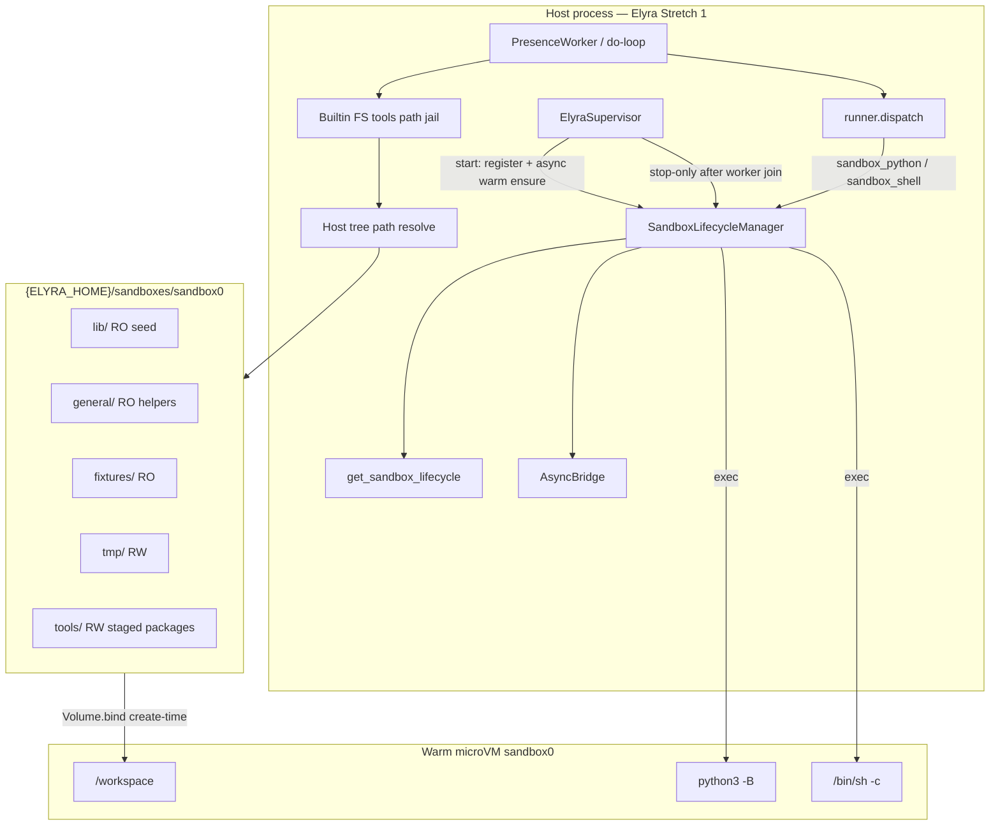
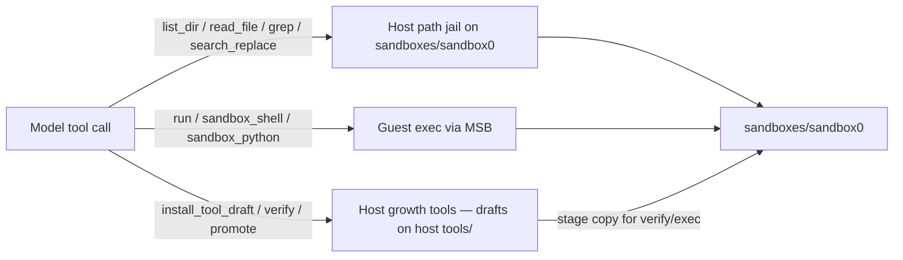

# H1–H6 Harness / Sandbox Fitness Plan (post Phase 0)

| Field | Value |
|-------|--------|
| **Class** | DESIGN |
| **Title** | Harness / Sandbox Fitness — warm microsandbox + runner truth for Grok |
| **Author** | Design (Grok Build) |
| **Date** | 2026-07-24 |
| **Status** | **Shipped** — Implementation complete (H2–H5 code + H6 checklist); live create-tool smoke is **operator-owned** — not claimed green in-repo until executed |
| **Audience** | Implementers (full design+PR plan); operators use §H6 checklist (short STATE extract in PR4) |
| **Normative?** | No — prefer code on `working` when conflict |
| **Durable path** | `docs/design/capability/harness-sandbox-fitness.md` |
| **Codename** | H1–H6 |
| **Branch (historical)** | `grok-improvement` (tip now **`working`**) |
| **Workspace** | `/home/jim/Workspace/project-elyra` (Stretch 1) |
| **Port source** | `/home/jim/Workspace/aurimago/project-elyra2` (`elyra/sandbox/*`, `sandboxes/sandbox0/`) |
| **Related** | [GI README](../../grok-improvement-plan/README.md), [tools-and-skills.md](../../tools-and-skills.md), [stretch-1.md](../../stretch-1.md), [design-tool-thrash-recovery.md](../stretch-1/design-tool-thrash-recovery.md), elyra2 `docs/plans/workspace-isolation/DESIGN.md` |

> **Status: Shipped** — full H1–H6 design + PR plan stays DESIGN (KD14). Short operator smoke checklist extract lands under STATE in PR4.

---

## Overview

Phase 0 delivered a working xAI/Grok provider path (auth, model select, usage meter, hard-stop, UI status). Continuous remains default **OFF**. What still **fights the runtime** is the harness layer around tools:

- `sandbox_python` / `sandbox_shell` return `runner_not_implemented` (`elyra/tools/runner.py`).
- The thin sandbox is a **path jail under `data/sandbox/`** with **same-UID host `run`** — not a container, not network-isolated, and not a rich guest Python environment (`elyra/sandbox/sandbox.py`).
- Live create-tool sessions thrash: empty sandbox views, host-path fishing via `run`, repeated `read_file` / hollow `install_tool_draft` (documented in `docs/design/stretch-1/design-tool-thrash-recovery.md`).

This plan ports the **warm microsandbox (MSB) `sandbox0`** architecture from elyra2 into Stretch 1, wires real guest runners, keeps FS tools honest against the **same host tree**, and leaves **H6 live tool-creation smoke operator-owned**. It does **not** open Phase 1 `grok_build`, Phase 3 memory, or MC Stage C; MC Stage B may follow after H-series green.

**H1 deliverable = this design.** H2–H5 are ordered code PRs; H6 is the operator checklist + readiness criteria (plus hermetic substitutes for implementers/CI).

---

## Background & Motivation

### Current Stretch 1 reality (anchors)

| Area | Path / behaviour | Pain for Grok |
|------|------------------|---------------|
| Path jail | `elyra/sandbox/paths.py` + `Sandbox` under `$ELYRA_HOME/data/sandbox/` | Empty or unrelated to package lifecycle; model cannot “see” `tools/drafts` via FS tools |
| Process run | `Sandbox.run` — `shell=False`, scrubbed env, same UID | Docstring admits host FS/network reach; not isolation |
| FS tools | `elyra/tools/builtin/files.py` → `ctx.sandbox` | Correct jail, wrong product tree for create-tool |
| `run` tool | `elyra/tools/builtin/run_cmd.py` | Host-fish vector when model hunts for drafts / host code |
| Runner dispatch | `elyra/tools/runner.py` | `sandbox_*` → `runner_not_implemented` — create-tool promotes tools that cannot run |
| Verify | `elyra/tools/verify.py` stages to `data/sandbox/.verify/`, host `pytest` | Process-level only; does not prove guest executability |
| Lifecycle | None — `PresenceWorker._ensure_sandbox()` lazily builds thin `Sandbox` | No warm guest, no start/stop, no status surface |
| Supervisor | `elyra/runtime/supervisor.py` | Owns provider/llama/API/worker only |
| Skills | create-tool already honest about drafts FS visibility (recent polish) | Residual honesty only if runners/MSB change truth |

### Port source (elyra2) — what to reuse

| Module | Role |
|--------|------|
| `elyra/sandbox/lifecycle.py` | `SandboxLifecycleManager` — ensure SM, fingerprints, `with_ready_sandbox`, stop-only shutdown |
| `elyra/sandbox/client_msb.py` | Optional real SDK adapter; `try_create_real_client`, volume map, network policy |
| `elyra/sandbox/async_bridge.py` | Dedicated asyncio loop for sync callers |
| `elyra/sandbox/registry.py` | Process-wide `set/get/clear_sandbox_lifecycle` |
| `elyra/sandbox/protocol.py` | `SandboxClient` / `ConnectedSandbox` / `ExecResult` protocols |
| `elyra/sandbox/fake.py` | Hermetic ensure/exec tests without KVM |
| `elyra/sandbox/health.py` | Host + guest mount readiness probes |
| `elyra/sandbox/paths.py` | `PRIMARY_NAME`, `MOUNT_SPEC`, `GUEST_WORKSPACE_ROOT`, network/env constants |
| `elyra/sandbox/inspect.py` | Operator status / FS list / guest `ps` — **defer** past H2c; status API block is enough for H2 |
| `elyra/sandbox/errors.py` | Structured sandbox/bridge errors |
| `elyra/tools/workspace_seed.py` | Host tree ensure + seed copy (adapt; Stretch 1 has no Lance bootstrap) |
| `sandboxes/sandbox0/` | Seed `lib/`, `general/`, `fixtures/`, `tmp/`, `tools/`, README |
| `scripts/setup-microsandbox.sh` | Doctor + tree + optional smoke (never against product `sandbox0` name for throwaway smoke) |
| `pyproject.toml` extra `sandbox = ["microsandbox>=0.6.0"]` | Optional dep; default install hermetic |

**Do not port wholesale:** Lance `tool_definitions` / `tool_executions`, mind_loop, `MicrosandboxToolExecutor` as elyra2’s sole invoke path, dual-rhythm / CoT lattice packages. Stretch 1 keeps **package tools** (`TOOL.md` + `schema.json` + `runner.json`) and **builtin host tools** for FS/ledger/social/growth.

### Why multi-prong (not “just add MSB”)

| Prong | Without it |
|-------|------------|
| **Harness truth + wiring** | Guest exists but dispatch still stubs; model still sees lies |
| **Sandbox power (MSB)** | Runners “work” as host subprocesses → false safety, host-fish |
| **Skills/tools honesty** | Docs/skills claim guest power before code ships (or after, if stale) |
| **Goals/tasks sanity** | Blocked create-tool tasks thrash ledger instead of honest block/stop |

---

## Goals & Non-Goals

### Goals

1. **Warm primary guest `sandbox0`** for Elyra process lifetime: ensure on start (or first need), stop-only on shutdown, reconnect after crash via named instance + detach.
2. **Host tree** `{ELYRA_HOME}/sandboxes/sandbox0/` with RO seed + RW `tmp/`/`tools/` mounted at guest `/workspace`.
3. **FS tools** (`list_dir`, `read_file`, `grep`, `search_replace`) operate on that **same host tree** (path jail), so model-visible FS matches guest mounts.
4. **Real runners:** `sandbox_python` and `sandbox_shell` execute via guest `exec`; structured isolation errors when MSB unavailable — **no silent host fallback** when isolation is on.
5. **Rich guest Python env** for tool authors (curated packages + stdlib), seed-installed with explicit re-bootstrap cost after overlay wipe.
6. **`ELYRA_SANDBOX=0` hermetic stub** for pytest; product default isolation **on** when unset (match elyra2).
7. **Status surface** (API + glass pill in PR3): sandbox ready / warming / unusable — **no secrets**; no orient inject.
8. **Residual honesty (H4)** only where MSB/runners change truth; do not re-litigate skill pass.
9. **H5** light goals/tasks + thrash/HOST tweaks if still needed after runners are real.
10. **H6** operator live smoke checklist for create-tool path — **not** a CI/implementer gate.

### Non-Goals

| Non-goal | Rationale |
|----------|-----------|
| Phase 1 `grok_build` tool | Separate plan phase |
| Phase 3 memory atoms / hypergraph | Deferred |
| MC Stage C package | After H green; Stage B optional *after* H-series |
| Continuous default ON | Stays OFF |
| Usage meter hierarchy redesign | Deferred “usage integration polish” track |
| Full elyra2 tool memory / Lance | Stretch 1 package model stays |
| Multi-sandbox product (`sandbox1+`) | Seam only (`sandboxN` naming reserved) |
| `sandbox.require` refuse-start | Degraded chat + fail-closed guest tools (v1) |
| Docker / Daytona | Explicitly retired in elyra2; never introduce here |
| Host path-jail as *the* isolation story | Thin jail remains for FS; exec power is MSB |
| Auto-install KVM / msb | Doctor script only |
| Live create-tool dogfood as CI gate | Operator-owned H6 |

---

## Proposed Design

### Architecture (MSB warm sandbox0)



### Port map (elyra2 → project-elyra)

| elyra2 source | Stretch 1 destination | Notes |
|---------------|------------------------|-------|
| `elyra/sandbox/{lifecycle,client_msb,async_bridge,registry,protocol,fake,health,errors,paths}.py` | Same package layout under `elyra/sandbox/` | Replace thin-only package; keep path-jail helpers for FS |
| `elyra/sandbox/inspect.py` | **Deferred** past H2c (optional PR later) | H2 green needs `/api/status` sandbox block only — not full inspect HTTP routes |
| Current `sandbox.py` + `paths.py` | Retain as **host FS jail** module; root cutover in **PR3** | PR1 adds `host_primary_root` helpers only; product `Sandbox` root stays legacy until PR3 |
| `elyra/tools/workspace_seed.py` | `elyra/sandbox/workspace_seed.py` (prefer under sandbox) | Avoid tools→sandbox cycles; seed is sandbox concern |
| `sandboxes/sandbox0/` | Repo seed at project root `sandboxes/sandbox0/` | Copied into `$ELYRA_HOME/sandboxes/sandbox0/` on ensure |
| `scripts/setup-microsandbox.sh` | Same | Doctor only; document overlay re-bootstrap |
| Supervisor start/stop | `elyra/runtime/supervisor.py` | Mirror elyra2 order: ensure before worker; stop after worker join |
| `executor_msb.py` | **Do not port as whole** | Extract guest exec helpers into `elyra/tools/guest_exec.py` used by `runner.dispatch` |
| `guest_shell.py` | Pattern for `sandbox_shell` + builtin `run` | Guest-only; never host subprocess of model command when isolation on |

### Host tree layout

```text
{ELYRA_HOME}/
  sandboxes/
    sandbox0/
      lib/            # RO in guest — helpers, requirements-curated.txt
      general/        # RO — small seed utilities (now.py, path helpers)
      fixtures/       # RO — demo data for sandbox tests
      tools/          # RW — staged runtime copies (NOT tools/drafts); see Staging
      tools/.stage/   # RW — atomic stage work dirs (hidden-ish; not seed)
      tools/.verify/  # RW — verify staging (not host tools/drafts)
      tmp/            # RW — scratch + ELYRA_TOOL_ARGS JSON files
      README.md
  data/
    sandbox/          # LEGACY thin jail — hard cutover off in PR3 (see Migration)
    ...
  tools/
    bundled|local|drafts/   # Host package store — NOT wholesale-mounted
```

**Never mount:** `data/` (moments, secrets, usage), `model/`, repo source tree wholesale, Docker socket, `~/.config` secrets.

### Guest mount map (create-time, locked)

| Guest path | Host rel | Mode |
|------------|----------|------|
| `/workspace/lib` | `lib` | RO |
| `/workspace/general` | `general` | RO |
| `/workspace/fixtures` | `fixtures` | RO |
| `/workspace/tmp` | `tmp` | RW |
| `/workspace/tools` | `tools` | RW |

```text
workdir = /workspace
env = {
  ELYRA_SANDBOX_ROOT=/workspace,
  PYTHONDONTWRITEBYTECODE=1,
}
image = "python"
cpus = 1
memory = 512 MiB
security = "restricted"
pull_policy = "if-missing"
detached = True
network = public_only | none | allow_all   # see Network policy
```

**Fingerprint (in-memory v1):** hash of `(name, host_root, mount map RO/RW, image, network_policy_id)`. Mismatch → one-shot remove+create inside `ensure`.

### Network policy

| Env | Meaning |
|-----|---------|
| `ELYRA_SANDBOX_NETWORK` unset | Default **`public_only`** (tool dogfood: HTTP clients, pip install curated) |
| `none` | Air-gapped guest (stricter; curated env must be pre-baked or fail closed) |
| `allow_all` | Broad egress (dev only; document risk) |

Create-time only (MSB volumes/network are not hot-patched). Policy change → fingerprint mismatch → recreate.

**Security note:** `public_only` is intentional for tool authors. Secrets must never be injected into guest env. Host secrets stay under `data/secrets/` (not mounted).

### FS tools vs guest exec (critical honesty)



| Capability | Where it runs | Visible paths |
|------------|---------------|---------------|
| `list_dir`, `read_file`, `grep`, `search_replace` | **Host** path jail | Relative to `sandboxes/sandbox0` (not `tools/drafts`, not repo root) |
| `run` (builtin) | **Guest** `exec` when isolation on; fail isolation error when on+unusable; optional thin host run only when `ELYRA_SANDBOX=0` | Guest cwd `/workspace`; cannot open host-absolute paths outside mounts |
| `sandbox_python` / `sandbox_shell` | **Guest only** when isolation on | Staged under `/workspace/tools/<name>/` |
| `install_tool_draft` / `promote_tool` | **Host** (`tools/drafts`, `tools/local`) | Not visible via sandbox FS tools |
| `verify_tool` | Stage to host tree `tools/.verify/<name>/` + **guest pytest** when isolation on; host pytest when `ELYRA_SANDBOX=0` | Same package bytes; backend recorded in result |

**Alias normalization (host FS):** Accept guest-style absolute prefixes (`/workspace`, `/workspace/...`) and normalize to sandbox-relative before jail resolve — models often pass guest paths after seeing docs (elyra2 `sandbox_paths` pattern).

**create-tool skill truth (already partially present):** sandbox FS tools **cannot** list `tools/drafts/`; growth tools own that tree. H4 only residual-updates if paths/stage roots change.

### Migration from `data/sandbox/`

**Hard cutover (no dual-read implementation).** Product FS root switches once, in **PR3**.

| PR | Root behaviour |
|----|----------------|
| **PR1** | Add `host_primary_root` / `ensure_host_tree` / repo seed. Product `Sandbox` **keeps** root `data/sandbox/` so FS tools stay stable without empty-tree thrash. |
| **PR2** | Lifecycle can ensure/mount `sandboxes/sandbox0/` independently; FS tools still on legacy root. |
| **PR3 (cutover)** | `Sandbox.__init__` + `PresenceWorker._ensure_sandbox` root → `sandboxes/sandbox0/`; `clear_sandbox` clears legacy **and** new RW trees; retarget `test_sandbox.py` / FS tool tests; ensure host tree always created before worker serves FS. |

Steps:

1. **New root of truth (after PR3):** `sandboxes/sandbox0/`.
2. On first `ensure_host_tree` / product start: create scaffold + seed from repo `sandboxes/sandbox0/`.
3. Optional operator copy: if `data/sandbox/` has non-`.verify` user files, **do not** silently merge — log a one-line note; operator may copy manually. Prefer clean seed (S1 sandbox was mostly empty/verify staging).
4. **PR5:** `verify` staging moves from `data/sandbox/.verify/` → `sandboxes/sandbox0/tools/.verify/` (guest-visible RW). Until PR5, host verify may still use legacy or new tree consistently with isolation off path.
5. **PR3+:** `clear_sandbox` reset clears **both** legacy `data/sandbox/**` and `sandboxes/sandbox0/{tmp,tools}` (including `.stage` / `.verify`); **never** wipe RO seed without re-seed; stop-only for MSB instance (no remove on reset).
6. **H4/PR6:** `prompts/system.md` names host tree + guest exec.

### Runner contracts

#### `runner.json` shapes

**sandbox_python** (model-created / local packages):

```json
{
  "kind": "sandbox_python",
  "module": "impl/main.py",
  "function": "run"
}
```

| Field | Required | Meaning |
|-------|----------|---------|
| `kind` | yes | `sandbox_python` |
| `module` | yes | Path relative to **package_dir**, under package only (no `..`, not absolute) |
| `function` | no | Default **`run`**. Public identifier only (no leading `_`, no dunders, no dots). Loaded onto `RunnerSpec.function`. |

**Call convention (locked — intentional fork from elyra2):**

- Guest/host invoke: `result = fn(args)` where `args` is the **model args dict** (single positional).
- **Not** `fn(**args)` (elyra2 `_guest_python_runner` kwargs unpack). Stretch 1 schemas are object-shaped; single-dict matches tool handlers and avoids colliding with Python keywords.

**sandbox_shell**:

```json
{
  "kind": "sandbox_shell",
  "argv": ["python3", "-B", "impl/cli.py"]
}
```

| Field | Required | Meaning |
|-------|----------|---------|
| `kind` | yes | `sandbox_shell` |
| `argv` | yes | Non-empty argv list; first element is command in guest |
| Args bridge | **locked** | See **Args bridge (KD20)** below — env + tmp JSON only for shell; no trailing `--` in v1 |

#### Args bridge (KD20 — locked)

| Runner | How model `args` reach the implementation |
|--------|-------------------------------------------|
| `sandbox_python` | In-process: `fn(args)` inside guest `-c` runner (or host-stub import). **No** args file required. |
| `sandbox_shell` | Host writes JSON to guest-visible path `tmp/elyra_tool_args_<uuid>.json` → guest path `/workspace/tmp/elyra_tool_args_<uuid>.json`. Set env **`ELYRA_TOOL_ARGS`** to that guest path. Package argv does **not** receive a trailing `--` path in v1. Best-effort delete the tmp file after exec. |
| Builtin `run` | No tool-package args bridge; model supplies `command` / timeout only. |

#### Validation (load + verify + promote) — **PR4 work**

`load_runner_json` and `validate_draft_package` must enforce (surface `invalid_runner:*`):

| Kind | Required | Hygiene |
|------|----------|---------|
| `sandbox_python` | `module` non-empty | relative, no `..`, no absolute; `function` public id or default `run` |
| `sandbox_shell` | `argv` non-empty list of strings | no empty argv[0] |
| drafts | kind in `sandbox_shell` \| `sandbox_python` | `builtin` forbidden (existing) |

Missing `module`/`argv` today is accepted — PR4 closes that gap (not only dispatch).

#### Dispatch algorithm (`elyra/tools/runner.py`)

```text
dispatch(runner, args, ctx, *, package_dir):
  if package_dir is None and runner.kind in {sandbox_python, sandbox_shell}:
    return ToolResult(ok=False, error_reason="package_dir_missing")
  if builtin: existing path
  if kind not in {sandbox_python, sandbox_shell}: unknown
  if not isolation_enabled():
    return host_stub_dispatch(...)   # ELYRA_SANDBOX=0 only (tests/CI)
  life = get_sandbox_lifecycle()
  if life is None or life.client_unusable:
    return ToolResult(ok=False, error_reason="sandbox_unavailable:...",
                      payload={isolation: true, anomaly: ...})
  # optional: if not pyenv_ready and kind needs third-party — still try;
  # verify path requires pyenv_ready (pytest) — see verify contract
  stage_dir = stage_package_for_guest(paths, package_dir)
  try:
    with life.with_ready_sandbox("sandbox0") as sb:  # mount_ready
      result = guest_exec(...)  # via bridge; one reconnect retry
  except SandboxError as e:
    return isolation ToolResult
  map ExecResult → ToolResult via return map below
```

**Call sites:** production `dispatch` is only via `ToolRegistry.execute` (`elyra/tools/registry.py`). PR4 must pass `package_dir=pkg.package_dir` and update test fakes that monkeypatch `dispatch` to accept the kwarg. Unit test: sandbox_python without `package_dir` → `package_dir_missing` (no traceback).

#### Host stub contracts (`ELYRA_SANDBOX=0` only — KD19)

Host stub is **test/CI only**. Never used as silent fallback when isolation is on (KD6).

| Kind | Host-stub algorithm | ToolResult shape |
|------|---------------------|------------------|
| `sandbox_python` | Resolve `module` under `package_dir`; load via `importlib` **or** `subprocess` with `sys.executable -c` runner equivalent; call `fn(args)` (single dict); scrubbed env matching current `Sandbox.run` (`PATH` minimal, `HOME`=host tree root, no secret inherit); cwd = package_dir or host tree | Same return map as guest (below) |
| `sandbox_shell` | Run `argv` with `shell=False` via host `Sandbox.run` (or equivalent) with **cwd** under host tree / staged package; scrubbed env; **allow** argv (Stretch 1 already trusts process-level `run` in tests). Do **not** use elyra2 `host_stub_no_shell` deny. | Parity keys: `exit_code`/`returncode`, `stdout`, `stderr`, truncation flags; `ok` per return map |
| Builtin `run` | Existing thin `Sandbox.run` on host tree | Unchanged payload |

Shared payload keys (guest and host stub, where applicable):

```text
ok, error_reason?,
payload: {
  exit_code | returncode,
  stdout, stderr,
  stdout_truncated?, stderr_truncated?,
  timed_out?,
  executor_backend: "microsandbox" | "host_stub",
  result?   # parsed object when JSON map nests
}
```

#### Return map for `sandbox_python` (guest + host stub — KD21)

Closed rules (first match wins):

1. Process/exec infrastructure failure → `ok=False`, `error_reason` = isolation or `handler_error:*` / `guest_timeout` / etc.
2. `exit_code != 0` → `ok=False`, `error_reason=guest_nonzero_exit` (or `host_nonzero_exit`), include stdout/stderr tails.
3. stdout is valid JSON **object** with key `ok` → honor `bool(ok)`; payload = object (plus stream tails optional).
4. stdout is valid JSON **object** without `ok` → `ok=True`, payload = object (or nest under `result` if streams also needed — prefer payload = object + `executor_backend`).
5. stdout is valid JSON non-object (array/number/string) → wrap: `ok=True`, `payload={"result": <value>}`.
6. stdout empty and exit 0 → `ok=True`, `payload={}`.
7. stdout non-JSON → `ok=False`, `error_reason=invalid_guest_json`, tails of stdout/stderr.

**Note:** Guest code that returns `{ok: false, ...}` with exit 0 is a **tool-level** failure (`ToolResult.ok=False`), not an isolation failure.

#### Staging rules

- Source of truth remains `tools/{local,bundled}/<name>/` on host.
- **Atomic stage (v1):** copy into `tools/.stage/<name>.<pid>/` then `os.replace` (or rename) into `tools/<name>/`. Same pattern for `tools/.verify/<name>/`.
- Exclude `__pycache__`; strip nested `.verify.json` when staging for verify.
- Guest path: `/workspace/tools/<name>/...`.
- **Single-writer assumption (v1):** `PresenceWorker` is one thread; do-loop runs tool batches **serially** (`_handle_tool_batch` → `_execute_one`). Concurrent same-name stage races are out of scope until multi-worker. Atomic replace still preferred for crash safety.
- Model `list_dir` on `tools/` may see staged packages, `.stage/`, `.verify/` — these are **runtime copies**, not `tools/drafts/` (H4 honesty). Optional later: hide dot-dirs from default `list_dir` (not required H2).

**sandbox_python guest invoke** (call `fn(args)` — not `**args`):

```text
python3 -B -c '
  import json, importlib.util, pathlib, sys
  # load module from /workspace/tools/<name>/<module>
  # result = function(args)   # single dict
  # print(json.dumps(result if isinstance(result, dict) else {"result": result}))
'
cwd=/workspace
env={ELYRA_SANDBOX_ROOT, PYTHONDONTWRITEBYTECODE}
timeout=default 30s (cap 60s)
```

**sandbox_shell guest invoke:**

```text
# host writes /workspace/tmp/elyra_tool_args_<uuid>.json first
exec(argv[0], argv[1:], cwd=/workspace/tools/<name>, timeout=...,
     env={..., ELYRA_TOOL_ARGS=/workspace/tmp/elyra_tool_args_<uuid>.json})
```

Prefer **no** `/bin/sh -c` for package runners (argv only). Builtin `run` may use `sh -c` with byte cap (elyra2 guest_shell: 4 KiB command, 15s default / 30s max).

**Mid-exec death:** invalidate ready cache → ensure once → retry exec **once**. Tool timeouts do **not** reconnect.

#### `verify_tool` contract

| Mode | Behaviour |
|------|-----------|
| Isolation on + **mount_ready + pyenv_ready** | Stage draft → `tools/.verify/<name>/`; guest `python3 -m pytest tests/ -q --tb=short` (pytest from curated env); write `.verify.json` on host draft only if pass |
| Isolation on + mount_ready but **not pyenv_ready** | Fail closed: `error_reason=guest_pytest_unavailable` (or `pyenv_not_ready`) — **not** a mysterious `No module named pytest` |
| Isolation on + not mount_ready / client_unusable | Fail closed: `error_reason=sandbox_unavailable` (do not claim green on host-only) |
| Isolation off | Host pytest via `sys.executable -m pytest` (hermetic CI) — `executor_backend=host_stub` |

Keep existing gates: planted `tools/local` detection, content_hash, draft runner kinds, no builtin drafts. PR4/PR5 extend shape validation for `module`/`argv`/`function`.

### Python environment strategy

**Goal:** model-created tools can `import` common libraries without each tool vendoring wheels; **guest verify needs pytest**.

1. **Base image:** MSB `"python"` image → `python3` + pip. Stock image has **no** pytest.
2. **Curated list:** `sandboxes/sandbox0/lib/requirements-curated.txt` (pin major versions), **must include**:
   - **`pytest`** (pinned major, e.g. `pytest>=8,<9`) — required for isolation-on `verify_tool` (KD17 + KD22)
   - Tool-author libs (wheel-friendly; no `lxml`/compile-heavy): `requests`, `httpx`, `beautifulsoup4`, `pyyaml`, `python-dateutil`, `regex`, `jinja2`
   - **Avoid** heavy ML stacks in v1 (disk + pull time)
3. Optional split (same install moment): `requirements-verify.txt` that only adds pytest — if split, bootstrap installs **both** curated + verify files before setting pyenv marker. Prefer **single file** including pytest unless size becomes an issue.
4. **Install moment (separate from mount readiness):** after mount readiness succeeds, if host-only marker `sandboxes/sandbox0/.elyra_pyenv_ready` missing or requirements hash changed:
   - Guest: `python3 -m pip install --user -r /workspace/lib/requirements-curated.txt` (needs `public_only` or pre-cached wheels).
   - On success: write marker with requirements hash → **`pyenv_ready=true`**.
   - On failure: leave `pyenv_ready=false`; mount may still be ready; verify fails with `guest_pytest_unavailable`.
5. **Offline / `network=none`:** skip pip; `pyenv_ready=false` unless operator pre-baked wheels under RW; tools needing third-party pkgs fail at import with clear stderr.
6. **Re-bootstrap cost (operator wiped MSB overlay):** image re-pull + recreate VM + re-pip (includes pytest). Doctor script + H6 readiness warn: expect minutes and disk. `ELYRA_SANDBOX=0` remains zero-MSB path for tests (host pytest from `dev` extra).
7. **Honesty:** seed README + system/create-tool notes list guaranteed imports (stdlib + curated including pytest for verify). Not “any PyPI package.”

### Config / flags

| Variable | Product default | Pytest | Meaning |
|----------|-----------------|--------|---------|
| `ELYRA_SANDBOX` | **unset = on** | **`0`** (conftest autouse) | Isolation on/off |
| `ELYRA_SANDBOX_NETWORK` | `public_only` | n/a (stub) | Guest network policy id |
| `ELYRA_HOME` | existing | tmp paths | Unchanged |

Truthy/falsey tokens match elyra2: `0/false/no/off` → off; `1/true/yes/on` or other non-empty → on.

**Optional pyproject extra:**

```toml
[project.optional-dependencies]
dev = ["pytest>=8.0"]
sandbox = ["microsandbox>=0.6.0"]
```

Default `pip install -e .` stays hermetic. Product operator: `pip install -e '.[sandbox]'` + KVM.

**No** `ELYRA_TOOL_EXECUTOR` flag forest. Injection for tests: Fake client + lifecycle ctor.

### Supervisor / PresenceWorker wiring

#### First-boot / ensure timing (KD23 — async warm)

**Decision: async warm (product UX).** Do **not** block `elyra start` on image pull + pip for up to many minutes.

1. Supervisor: `ensure_data_dirs` + `ensure_host_tree(sandbox0)` (host FS, fast).
2. Construct `SandboxLifecycleManager`, **register immediately**, set status `ready=false`, `reason=warming` (or `mount_ready=false`, `pyenv_ready=false`).
3. Kick **`ensure("sandbox0")` on a background thread** (daemon or owned thread joined on shutdown). Mount ensure uses the normal ~60s wall budget **per ensure attempt**; thread may retry/backoff while warming (implementation detail: one ensure, then optional re-ensure on invoke via `with_ready_sandbox`).
4. **Pyenv install runs after mount ready**, still on warm path (not inside the 60s mount-only critical section if that would exceed budget). May take minutes; status stays `pyenv_ready=false` until marker written.
5. Start **PresenceWorker / API without waiting** for ready. Chat works; guest tools fail closed until ready.
6. Invokes use `with_ready_sandbox` (may complete ensure if warm race lost) — still fail closed if client unusable.

**Status semantics after H3b:**

| Field | Meaning |
|-------|---------|
| `mount_ready` | Host tree + guest mount probes OK (lifecycle `is_ready` for exec of stdlib python) |
| `pyenv_ready` | Curated (+ pytest) install marker present |
| `ready` | Product shorthand: **`mount_ready && (pyenv_ready || isolation off)`** after H3b; until H3b, `ready == mount_ready`. H6 requires both for full create-tool path. |

Log once at start when isolation on + `client_unusable`: name install extra (`pip install -e '.[sandbox]'`) and doctor script — not a silent empty warn.

```mermaid
sequenceDiagram
  participant Op as Operator
  participant Sup as ElyraSupervisor
  participant Life as SandboxLifecycleManager
  participant Warm as Warm thread
  participant Reg as registry
  participant PW as PresenceWorker
  participant Loop as do-loop / runners

  Op->>Sup: elyra start
  Sup->>Sup: ensure_data_dirs + ensure_host_tree(sandbox0)
  Sup->>Life: construct manager
  Sup->>Reg: set_sandbox_lifecycle(Life)
  Sup->>Warm: start ensure + pyenv (async)
  Sup->>Sup: status reason=warming
  Sup->>PW: start worker (does not wait for ready)
  Warm-->>Life: mount_ready / degraded
  Warm-->>Life: pyenv_ready (later)
  PW->>Loop: tool calls
  Loop->>Reg: get_sandbox_lifecycle
  Loop->>Life: with_ready_sandbox / host FS
  Op->>Sup: SIGINT
  Sup->>PW: stop + join worker
  Sup->>Warm: cancel/join best-effort
  Sup->>Life: shutdown stop-only + bridge
  Sup->>Reg: clear
  Sup->>Sup: API teardown
```

| Component | Change |
|-----------|--------|
| `ElyraSupervisor.start` | Host tree ensure (sync); construct + register lifecycle; **async** warm ensure; never refuse start; warn if `client_unusable` with install hint |
| `ElyraSupervisor` shutdown | **Worker join before** sandbox stop; then warm-thread join best-effort; stop-only |
| `PresenceWorker._ensure_sandbox` | **PR3 cutover:** host tree `Sandbox` rooted at `sandboxes/sandbox0`; lifecycle from registry for runners |
| `ToolContext` | Keep `sandbox: Sandbox` for FS; runners read registry (prefer fewer ctx fields) |
| Reset | Clear host RW + legacy data/sandbox; do not require MSB remove |

### Status surface (no secrets)

Extend `GET /api/status` and a **light glass UI pill in PR3 (H2c)** with:

```json
{
  "sandbox": {
    "isolation_enabled": true,
    "name": "sandbox0",
    "ready": false,
    "mount_ready": false,
    "pyenv_ready": false,
    "lifecycle_registered": true,
    "client_unusable": true,
    "reason": "client_unusable",
    "network_policy": "public_only",
    "host_tree_exists": true
  }
}
```

Rules:

- **No** host absolute paths, tokens, emails beyond existing credential fields.
- Reasons allowlist: `client_unusable`, `warming`, `ensure_wall_timeout`, `lock_timeout`, `create_failed`, `mount_not_ready`, `pyenv_not_ready`, `msb_not_installed`, `degraded`, etc.
- **Glass UI pill (PR3 / KD27):** alongside the existing provider pill — coarse states only: **ready** / **warming** / **unusable** (map from `ready` / `reason=warming` / `client_unusable` or not mount_ready after warm attempt). No secrets, no host paths, no full inspect browser.
- **Orient (KD26):** do **not** inject a sandbox status line into the model orient slice. Operator visibility is Status API + glass pill only. H5 must not add orient noise unless a later live need forces a one-line exception (default: still no).
- `inspect.py` full HTTP browse/ps: **deferred** past H2c (optional later PR). H2 green = status JSON + light pill.

### H4 — Residual skills / tools / docs honesty

Skills already polished; **only residual** items after runners are real:

| Surface | Honesty update |
|---------|----------------|
| `prompts/system.md` | Sandbox = host tree `sandboxes/sandbox0` + guest exec when isolation on; drafts not visible via FS tools; `tools/` under sandbox = staged runtime copies |
| `docs/tools-and-skills.md` | `sandbox_*` implemented; verify backend; link this plan; host stub only when `ELYRA_SANDBOX=0` |
| `docs/stretch-1.md` §7 | Replace “one persistent sandbox” path-jail-only wording |
| Bundled tool `TOOL.md` for `run` | Guest-only when isolation on; host `Sandbox.run` only when isolation off |
| `verify_tool` TOOL.md | Stage path + guest pytest when isolation on; needs `pyenv_ready` |
| `create-tool` SKILL.md | Lifecycle + `ELYRA_TOOL_ARGS` for shell tools; promoted smoke needs isolation ready; no host-fish; sandbox `tools/` ≠ drafts |
| `create-skill` | Touch only if cross-refs sandbox paths |
| Runner load errors | Surface `invalid_runner` reasons clearly in promote/verify |
| Plan README / product notes | Operators need `pip install -e '.[sandbox]'` + doctor; devs use `ELYRA_SANDBOX=0` for host-stub (also log on start if client_unusable) |

**Do not** re-open talk/plan-work/do-work/review-work/rest playbooks unless a factual contradiction appears.

**PR3 exit note (not only H4):** after lifecycle wiring, machines without MSB see guest tools fail closed with `sandbox_unavailable` while chat continues — document install path early so create-tool does not look “broken.”

### H5 — Goals / tasks sanity checklist

Implementers walk this list; code only where still broken after H2–H3:

1. **Blocked honesty:** If create-tool task cannot proceed (sandbox unavailable), model should update task blocked / speak / rest — not thrash `read_file`.
2. **Thrash HOST:** Existing `tool_thrash_policy` remains; confirm fingerprints cover new isolation error_reasons (`sandbox_unavailable`, `runner_not_implemented` should disappear).
3. **Hollow success:** Keep prior fixes (`install_tool_draft` empty files not ok); regression tests stay green.
4. **Orient slice:** **No sandbox status line** (KD26). Visibility stays Status API + glass pill. Do not reopen orient injection in H5 unless live evidence forces a one-line exception.
5. **Continuous OFF:** No change; do not enqueue moment_continue storms on isolation errors.
6. **Ledger:** Prefer explicit goal/task for tool creation (create-tool skill already says so).
7. **HOST wording:** If thrash still fires on isolation errors, thrash HOST should say “sandbox unavailable / change approach” not “retry same tool”.

Minimal bias line for blocked-task honesty may appear here; **full MC Stage B** is after H green.

### H6 — Operator live smoke (tool creation) — **operator-owned**

**Audience:** operator with a real SuperGrok / Grok Build session, working microsandbox (KVM or platform virt), and `pip install -e '.[sandbox]'`.

**In-repo claim:** H-series **implementation is complete** (H2–H5 code + this checklist). This checklist is **ready for operator** execution. Do **not** record “H6 live smoke passed” / “H-series green live” in docs unless the steps below were actually run against a real MSB + Grok session.

| Gate | Policy |
|------|--------|
| **CI / implementer merge** | **Not a gate.** Hermetic tests (`ELYRA_SANDBOX=0`, Fake client) prove code. No live create-tool job in default CI (KD14). |
| **PR merge to `grok-improvement`** | Code PRs (H2–H5) + this docs PR (H6) merge without a live MSB run. |
| **Promote `grok-improvement` → `main`** | Operator sign-off after this smoke is green (same policy as Phase 0 live smoke). |
| **Continuous** | Remains default **OFF** throughout H-series and this smoke. Do not enable continuous for the checklist. |

#### Hermetic vs operator (who owns what)

| Layer | Owner | What it proves | What it does **not** prove |
|-------|-------|----------------|----------------------------|
| **Hermetic / CI** | Implementers | Lifecycle SM, bridge, dispatch, host-stub runners, create-tool fail-closed gates, thrash isolation wording, status JSON shape | Real KVM/MSB, guest pyenv pip, end-to-end create-tool dogfood under Grok |
| **Operator live smoke (this section)** | Operator | Warm MSB, `mount_ready` + `pyenv_ready`, guest verify/promote/call, glass pill honesty, shutdown reconnect | CI green (already separate); Phase 1 / MC Stage B |

Hermetic substitutes stay the default for implementers and CI (table below). Live smoke is **optional for day-to-day development** and **required before claiming product isolation works end-to-end**.

#### Hard readiness gate — do not start create-tool until both flags are true

Full create-tool smoke (verify guest pytest → promote → call) requires **both**:

| Flag | Meaning | How to observe |
|------|---------|----------------|
| **`mount_ready`** | Host tree + guest mount probes OK; guest can exec stdlib `python3` | `GET /api/status` → `sandbox.mount_ready === true`; glass pill not stuck **unusable** |
| **`pyenv_ready`** | Curated env (+ pytest) marker present at host `sandboxes/sandbox0/.elyra_pyenv_ready` (not under guest RW mounts) | `sandbox.pyenv_ready === true` |
| **`ready`** (product shorthand) | `mount_ready && (pyenv_ready \|\| isolation off)` | After H3b: isolation-on product ready means **both** flags |

**Wait rules:**

1. `elyra start` must come up **without** a multi-minute hang (async warm — KD23). Chat may work while status is `warming` / `pyenv_not_ready`.
2. **Do not** run steps 5–9 (draft → verify → promote → call) until `mount_ready` **and** `pyenv_ready` are both true (or document an intentional degraded path — e.g. isolation off is **not** the product create-tool path).
3. If `mount_ready` and not `pyenv_ready`: expect `verify_tool` → `guest_pytest_unavailable` (fail closed). That is **not** a smoke pass; wait or re-bootstrap curated env.
4. If `client_unusable` / pill **unusable**: install extra + doctor first; do not thrash create-tool.
5. Overlay wipe: first ensure + pip (incl. pytest) can take minutes; poll status until `pyenv_ready` before create-tool.

#### Preflight (environment)

- [ ] Branch tip of `grok-improvement` with **H2–H5 merged** (and this H6 docs PR)
- [ ] `pip install -e '.[sandbox]'` and `python -c 'import microsandbox'` OK
- [ ] `./scripts/setup-microsandbox.sh --doctor-only` green enough (KVM / virt RW as applicable)
- [ ] `elyra start` → chat up immediately; **poll** `/api/status` until `mount_ready` + `pyenv_ready` (or stop and document degraded reason — do not claim smoke green)
- [ ] Provider **xai**, `credential_ok`; **continuous OFF**; usage meter not hard-stopped (override OFF unless testing meter separately)
- [ ] Note `sandbox.network_policy` (default `public_only`) and glass sandbox pill (**ready** / **warming** / **unusable**)

#### Operator checklist (create-tool path)

**Pass only when every required row is green.** Optional rows may be skipped with a note.

| # | Check | Pass criteria |
|---|--------|----------------|
| 0 | **Readiness gate** | `sandbox.mount_ready === true` **and** `sandbox.pyenv_ready === true` (hence product `ready` under isolation on). Pill **ready**. Continuous **off**. |
| 1 | **Status surface** | Glass pill + `/api/status` sandbox block agree; no secrets/host absolute paths in JSON; note `network_policy`, `isolation_enabled=true`. |
| 2 | **FS truth** | Via tools: `list_dir` on `.` shows seed layout (`lib`, `general`, `fixtures`, `tmp`, `tools`) — **not** host home. Staged copies under sandbox `tools/` are **not** drafts. |
| 3 | **Guest python (`mount_ready`)** | Via builtin `run` (isolation on = guest): `python3 -c 'print(1)'` succeeds in guest. |
| 4 | **Curated import (`pyenv_ready`)** | Guest: `python3 -c 'import requests; print(requests.__name__)'` and `python3 -c 'import pytest'` both succeed. |
| 5 | **Draft** | Activate skill `create-tool`; `install_tool_draft` for a tiny tool (e.g. `echo_upper`, `sandbox_python`, tests included). Non-empty package; install `ok`. |
| 6 | **FS negative (honesty)** | Sandbox FS tools do **not** list host `tools/drafts/…`; drafts remain growth-tool-owned. |
| 7 | **Verify** | `verify_tool` green via **guest** pytest; draft `.verify.json` has `content_hash` + `executor_backend` (expect `microsandbox` when isolation on). |
| 8 | **Promote** | `promote_tool` → tool appears in catalog and is callable (not draft-only). |
| 9 | **Call** | Invoke promoted tool once; `ok` payload / guest path observed (not `runner_not_implemented`, not host-fish). |
| 10 | **Negative isolation** *(optional advanced)* | Stop MSB or force unusable client: guest tool → structured `sandbox_unavailable` (or family); chat continues; model should block/speak/rest (H5 thrash HOST), not thrash retry. |
| 11 | **Thrash non-regression** | Session does **not** host-fish with `run` for absolute host paths under `/home/…/tools/drafts`. |
| 12 | **Shutdown** | SIGINT → stop-only (guest not removed); restart reconnects or re-ensures without wiping host seed tree. |
| 13 | **Continuous still OFF** | Status/UI continuous remains off after the session; no accidental continuous-on from this smoke. |

#### After smoke (operator sign-off)

| Outcome | Action |
|---------|--------|
| All required rows green | Operator may record live smoke passed (separate note / commit); then optionally promote `grok-improvement` → `main`. |
| Degraded / failed | File reason (`client_unusable`, `pyenv_not_ready`, verify fail, thrash, etc.). Do **not** flip in-repo status to “live green.” Fix stack or environment; re-run from readiness gate. |
| Hermetic-only CI green | **Insufficient** alone to claim live create-tool dogfood. |

#### Hermetic substitutes (implementers / CI) — **not** a substitute for H6 live

| Test area | Approach |
|-----------|----------|
| Ensure SM | `FakeSandboxClient` statuses missing/running/stopped/crashed/draining |
| Bridge | Timeout / reentrancy / shutdown unit tests |
| Dispatch | Fake lifecycle + staged package → assert argv/cwd/env |
| Isolation off | `ELYRA_SANDBOX=0` host stub path |
| Verify gates | `tests/test_create_tool_gates.py` + guest/host backend branch mocks |
| Status / pill | `tests/test_sandbox_status.py` (`mount_ready` / `pyenv_ready` / pill mapping) |
| Path jail | `tests/test_sandbox.py` / FS tools on `sandboxes/sandbox0` |
| Thrash isolation | `tests/test_tool_thrash_policy.py` isolation HOST wording (H5) |
| Optional real MSB | `@pytest.mark.microsandbox` — **not** required in default CI; **not** a replacement for full operator create-tool smoke |

---

## API / Interface Changes

### New / expanded public surfaces

```python
# elyra/sandbox/registry.py
def set_sandbox_lifecycle(manager: SandboxLifecycleManager | None) -> None: ...
def get_sandbox_lifecycle() -> SandboxLifecycleManager | None: ...
def clear_sandbox_lifecycle() -> None: ...

# elyra/sandbox/lifecycle.py
class EnsureResult:
    status: Literal["ready", "degraded"]
    name: str
    reason: str | None
    sandbox: ConnectedSandbox | None
    @property
    def ready(self) -> bool: ...

class SandboxLifecycleManager:
    def ensure(self, name: str = "sandbox0", *, timeout: float = 60.0) -> EnsureResult: ...
    def with_ready_sandbox(self, name: str = "sandbox0", *, timeout: float = 60.0): ...
    def shutdown(self, name: str = "sandbox0", *, stop_timeout: float = 10.0) -> None: ...
    def is_ready(self, name: str = "sandbox0") -> bool: ...
    client_unusable: bool

# elyra/tools/runner.py
@dataclass(frozen=True)
class RunnerSpec:
    kind: str
    entry: str | None = None       # builtin module:attr
    argv: list[str] | None = None  # sandbox_shell
    module: str | None = None      # sandbox_python path under package_dir
    function: str | None = None    # sandbox_python; default "run" at dispatch if None
    raw: dict[str, Any] | None = None

def load_runner_json(package_dir: Path) -> RunnerSpec: ...  # validates shape (PR4)

def dispatch(
    runner: RunnerSpec,
    args: dict[str, Any],
    ctx: ToolContext,
    *,
    handler: BuiltinHandler | None = None,
    package_dir: Path | None = None,
) -> ToolResult: ...

# elyra/tools/executor_flags.py (or sandbox/paths)
def isolation_enabled() -> bool: ...  # ELYRA_SANDBOX
```

### Registry execute

`ToolRegistry.execute` already has `package_dir` on `ToolPackage` — **must** pass it into `dispatch` (today: `dispatch(pkg.runner, args, ctx, handler=pkg.handler)` only). Grep shows **one** production call site (`registry.py`); tests monkeypatch `dispatch` with kwargs — update signatures in PR4.

### Status JSON

See Status surface section — additive fields only; Phase 0 provider/usage blocks unchanged.

---

## Data Model Changes

| Store | Change |
|-------|--------|
| Host FS | New `sandboxes/sandbox0/**`; verify stage under `tools/.verify/` |
| `.verify.json` | Optional field `executor_backend`: `microsandbox` \| `host_stub` |
| Reset flags | `clear_sandbox` clears legacy + new RW trees |
| Moments / goals JSON | No schema change |
| Usage meter | No change |

**Migration strategy:** additive host tree in PR1; **hard FS cutover in PR3** (no dual-read implementation). Legacy `data/sandbox` remains on disk for optional operator copy + `clear_sandbox` until wiped; product code after PR3 does not read it for FS tools.

---

## Alternatives Considered

### A1 — Keep thin host path-jail only; implement runners as host subprocess

| Pros | Cons |
|------|------|
| Fast; no KVM/disk | Fails product isolation; host-fish remains; contradicts operator MSB decision |
| Simple CI | “Sandbox” remains a lie under load |

**Reject:** operator fixed sandbox target = MSB.

### A2 — Guest python-only toy (no shell, no curated env, no warm VM)

| Pros | Cons |
|------|------|
| Smaller surface | Shell/scripted work blocked; cold start per tool; create-tool still weak |

**Reject:** operator wants warm guest + shell + rich Python.

### A3 — Mount entire `tools/` and `ELYRA_HOME` into guest

| Pros | Cons |
|------|------|
| No staging | Exposes drafts/secrets risk; breaks “drafts not callable” FS confusion; large blast radius |

**Reject:** stage copies into RW `tools/` only.

### A4 — Full elyra2 executor + Lance tool store

| Pros | Cons |
|------|------|
| Proven isolation path | Wrong product model for Stretch 1 packages; scope explosion |

**Reject:** port sandbox package + guest exec helpers only.

---

## Security & Privacy Considerations

| Threat | Severity | Mitigation |
|--------|----------|------------|
| Guest egress exfil via `public_only` | Medium | No secrets in guest env/mounts; network policy knob; future per-tool metadata |
| Host escape via thin `run` when isolation off | Medium | Product default isolation on; docs; pytest-only off |
| Staging copies include secrets written into package | Low | Promote/verify only package tree; operator review |
| Model host-fishes via `run` absolute paths | Medium → Low after H3 | Guest mounts only; absolute host paths fail inside guest |
| MSB image supply chain | Medium | Pin pull_policy if-missing; operator-controlled host |
| Overlay disk fill | Medium | Document re-bootstrap; curated pins; no ML wheels v1 |
| Concurrent ensure races | Low | Per-instance lock + timeout (elyra2 SM) |

**Auth:** unchanged Phase 0. Sandbox status never echoes credentials.

---

## Observability

| Signal | Where |
|--------|-------|
| `sandbox ensure ready/degraded reason=...` | Supervisor logs |
| `client_unusable` / msb import fail | Warning once at start |
| Guest exec timeout / reconnect | Runner / lifecycle logs |
| `/api/status` sandbox block + glass pill | Operator glass (PR3 pill: ready/warming/unusable) |
| Tool `error_reason` | Model-visible (`sandbox_unavailable`, `guest_timeout`, …) |
| Metrics (optional later) | ensure latency, exec count — not required H2 |

Alerting: none automated in H-series; operator watches status + logs.

---

## Rollout Plan

1. **H1** — This design lands in `docs/design/capability/harness-sandbox-fitness.md`.
2. **H2–H5 PRs** — ordered below; all merge to `grok-improvement`.
3. **Feature flag:** `ELYRA_SANDBOX` (default on for product; off in tests).
4. **Degraded mode:** chat works; guest tools fail closed with reason.
5. **Rollback:** set `ELYRA_SANDBOX=0` or revert PR stack on branch; stop-only leaves host tree intact.
6. **H6** — operator smoke checklist finalized (this file); **run after** H2–H5 code is on tip; promote branch → main only after operator sign-off (same policy as Phase 0 live smoke). **No CI live gate.**

---

## Open Questions

All product-facing open questions are **closed**. Remaining items are implementation freeze details only (pins / version floor), not architecture forks.

1. **Builtin `run` when isolation on — DECIDED (KD5 / KD24):** guest-only when isolation on; host `Sandbox.run` only when `ELYRA_SANDBOX=0`.
2. **Orient sandbox line when degraded — DECIDED (KD26):** **Status API + glass pill only.** Keep orient clean; do not inject a sandbox ready/warming/unusable line into orient. H5 must not add orient sandbox noise by default (optional exception only if later live need forces it).
3. **Curated package exact pins (beyond pytest-in-list):** freeze majors in H3b PR; operator may extend `requirements-curated.txt`. (Implementation detail, not blocking H1.)
4. **MSB version floor:** start `microsandbox>=0.6.0` as elyra2; re-verify against installed host. (Implementation detail, not blocking H1.)
5. **UI sandbox badge — DECIDED (KD27):** **Light glass pill in H2c / PR3** — ready / warming / unusable alongside the provider pill. Not API-only; not deferred to H4/H6.

---

## Risks

| Risk | Severity | Mitigation |
|------|----------|------------|
| Disk / overlay re-bootstrap after operator clean | High operational | Doctor script; document minutes+GB; hermetic stub for CI; marker for pyenv |
| MSB / KVM unavailable on machine | High | Degraded mode; clear status; create-tool blocked honestly |
| Guest egress abuse | Medium | public_only default; no secrets mounted; policy env |
| Staging/path confusion (drafts vs workspace tools/) | Medium | H4 honesty; skill already warns; tests for stage paths |
| Scope creep into elyra2 mind/memory | Medium | Explicit non-goals; port sandbox package only |
| Runner JSON ambiguity (`module` vs `entry`) | Low | Lock schema in H1; validate at verify |
| First-ensure wall clock (pull image + pip) | Medium | **KD23 async warm** — chat starts immediately; status `warming` / `pyenv_ready`; guest tools fail closed until ready; H6 waits for both flags |

---

## Fit relative to Phase 0 / Phase 1 / MC Stage B

```text
Phase 0 (DONE) ──► H1–H6 harness/sandbox fitness ──► (optional) MC Stage B
                                              └──► Phase 1 grok_build (later)
Phase 3 memory — not in this window
Continuous default OFF throughout
```

| Track | Relation |
|-------|----------|
| **Phase 0** | Unchanged; usage meter adequate, integration polish deferred |
| **H-series** | Makes Grok stop fighting stub runners / empty jail |
| **MC Stage B** | After H green: ledger soft bias + Decide cadence; not inside H1–H5 unless H5 needs a one-line blocked bias |
| **Phase 1** | `grok_build` benefits from real sandbox but is separate |

---

## References

- Workspace: `/home/jim/Workspace/project-elyra`
- Thin sandbox: `elyra/sandbox/sandbox.py`, `elyra/sandbox/paths.py`
- Runners: `elyra/tools/runner.py`, `elyra/tools/verify.py`, `elyra/tools/registry.py`
- Presence: `elyra/presence/worker.py` (`_ensure_sandbox`, `_build_tool_context`)
- Supervisor: `elyra/runtime/supervisor.py`
- Thrash: `elyra/loop/tool_thrash_policy.py`, `docs/design/stretch-1/design-tool-thrash-recovery.md`
- Plan folder: `docs/grok-improvement-plan/README.md` (index); phase designs under `docs/design/grok-improvement-plan/{phase-0,phase-0-execution,metacognition}.md`
- Port: `/home/jim/Workspace/aurimago/project-elyra2/elyra/sandbox/*`, `sandboxes/sandbox0/`, `docs/plans/workspace-isolation/DESIGN.md`, `docs/tools-runtime.md`
- External: [microsandbox docs](https://docs.microsandbox.dev/)

---

## Key Decisions

| ID | Decision |
|----|----------|
| **KD1** | All H-series work on **`grok-improvement`**; PRs base + merge there (not main until later). |
| **KD2** | Phase 0 stays; usage meter polish deferred; continuous default **OFF**. |
| **KD3** | Isolation backend = **microsandbox only**; warm primary **`sandbox0`**; not path-jail-only and not python-runner-only. |
| **KD4** | Host tree = `{ELYRA_HOME}/sandboxes/sandbox0/` with RO seed + RW `tmp`/`tools` → guest **`/workspace`**. Never mount `data/`, secrets, model. |
| **KD5** | FS tools are **host path-jailed on the host tree**; guest exec is for `run` / `sandbox_*` / verify pytest when isolation on. |
| **KD6** | When isolation **on**, no silent host fallback for guest runners; structured `sandbox_unavailable`. |
| **KD7** | `ELYRA_SANDBOX` unset = **on** (product); pytest forces **`0`**. Optional extra `.[sandbox]`. |
| **KD8** | Network default **`public_only`** (`ELYRA_SANDBOX_NETWORK`); create-time fingerprint includes policy. |
| **KD9** | Port elyra2 sandbox package modules + seed + doctor script; **do not** port Lance tool store or mind_loop executor wholesale. |
| **KD10** | Model packages stage-copy into guest-visible `tools/<name>/` for exec (volumes create-time only). |
| **KD11** | Curated guest Python via `lib/requirements-curated.txt` + marker; re-bootstrap cost explicit after overlay wipe. |
| **KD12** | Supervisor owns ensure/register/shutdown-stop-only; worker join **before** sandbox stop. |
| **KD13** | Status: ready / client_unusable / reason — no secrets; glass pill in PR3 (KD27); no orient inject (KD26). |
| **KD14** | H6 live create-tool smoke is **operator-owned**; hermetic fakes for CI; not merge gate. |
| **KD15** | H4 = residual honesty only; skills already polished. |
| **KD16** | No Phase 1 / Phase 3 / MC Stage C in H-series; MC Stage B **after** H green. |
| **KD17** | Verify green under isolation requires **guest** pytest when isolation on (host stub only when off). |
| **KD18** | Shutdown is **stop-only** (not remove) so reconnect can attach to running VM. |
| **KD19** | Host stub (`ELYRA_SANDBOX=0`): `sandbox_python` via importlib/subprocess + `fn(args)`; `sandbox_shell` argv allowed under host jail (not elyra2 deny-shell). **Test/CI only.** |
| **KD20** | `sandbox_shell` args bridge = tmp JSON + env **`ELYRA_TOOL_ARGS`** only (no trailing `--` in v1). `sandbox_python` uses in-process dict. |
| **KD21** | `sandbox_python` call = `fn(args)` single dict (not `**args`); return map closed (exit, JSON `ok`, invalid_guest_json). `RunnerSpec.function` default `"run"`. |
| **KD22** | Guest curated env **includes pytest**; isolation-on verify requires `pyenv_ready` or fails `guest_pytest_unavailable`. |
| **KD23** | Product start uses **async warm** ensure (not blocking multi-minute start). Status distinguishes `mount_ready` vs `pyenv_ready`. |
| **KD24** | Builtin `run` is **guest-only when isolation on**; host `Sandbox.run` only when isolation off. |
| **KD25** | Product FS root cutover `data/sandbox` → `sandboxes/sandbox0` is **PR3** (hard cutover). PR1 only adds helpers + seed. |
| **KD26** | Sandbox readiness is **Status API + glass pill only** — **no** orient inject for ready/warming/unusable (keep orient clean). |
| **KD27** | **Light UI pill in PR3 (H2c):** sandbox ready / warming / unusable alongside provider pill (no secrets). |

---

## PR Plan

All PRs: branch from and merge into **`grok-improvement`**.

| Order | Title | Scope | Exit criteria |
|------:|-------|--------|---------------|
| **PR1** | **H2a: Sandbox package port — protocols, bridge, fake, errors, paths, seed tree** | Add `elyra/sandbox/{protocol,errors,async_bridge,fake,health,paths,workspace_seed,registry}.py`; repo `sandboxes/sandbox0/` seed; `ensure_host_tree` / `host_primary_root` helpers. **Do not** change product `Sandbox` root (stays `data/sandbox/`). No `inspect.py` required. | Unit tests green; no MSB required; conftest may set `ELYRA_SANDBOX=0` |
| **PR2** | **H2b: Lifecycle manager + optional MSB client + doctor script** | Port `lifecycle.py`, `client_msb.py`; `isolation_enabled()`; `pyproject` `sandbox` extra; `scripts/setup-microsandbox.sh`; Fake ensure SM. Optional thin `inspect` helpers without HTTP. | Fake ensure covers status matrix; real client lazy-optional |
| **PR3** | **H2c: Supervisor / PresenceWorker wiring, async warm, status API, glass pill, FS cutover** | Register lifecycle; **async warm** ensure (KD23); status `mount_ready`/`reason=warming`/`client_unusable` + install-extra warn; **light glass UI pill** ready/warming/unusable next to provider pill (KD27); shutdown order; **hard FS root cutover** to `sandboxes/sandbox0`; `clear_sandbox` both trees; retarget FS tests; **no** orient sandbox line (KD26) | `elyra start` does not block on MSB; chat up; FS tools see seed layout; `/api/status` sandbox block + glass pill visible; degraded without msb is explicit |
| **PR4** | **H3a: Guest exec + sandbox_python/shell dispatch + validation + host stub** | `guest_exec` atomic stage; `RunnerSpec.function`; `fn(args)` + return map; `ELYRA_TOOL_ARGS` shell bridge; `load_runner_json`/`validate_draft_package` shape checks; `package_dir` through registry; host stub contracts (KD19) | Hermetic Fake + host-stub tests; missing package_dir fails closed; invalid runner reasons |
| **PR5** | **H3b: Guest run + verify guest pytest + curated pyenv (incl. pytest)** | `run` guest when on (KD24); verify stage `tools/.verify`; `requirements-curated.txt` **includes pytest**; pyenv marker; status `pyenv_ready`; TOOL.md run/verify | Fake isolation-on verify path; `guest_pytest_unavailable` when pyenv missing; host pytest when off |
| **PR6** | **H4: Residual skills / system / docs honesty** | system.md, tools-and-skills, stretch-1 §7, create-tool residual (staged tools/ vs drafts, ELYRA_TOOL_ARGS), operator MSB install note | Docs match runtime; no skill re-litigation |
| **PR7** | **H5: Goals/tasks thrash sanity (only if needed)** | Isolation error thrash wording; blocked-task honesty; **no** orient sandbox inject by default (KD26) | Targeted tests; continuous still OFF |
| **PR8** | **H6: Operator live smoke checklist (docs only)** | Polish §H6: hard readiness (`mount_ready`+`pyenv_ready` before create-tool), hermetic-vs-operator table, Phase-0-style pass criteria, continuous OFF, plan-index status | Checklist complete; **implementation complete** claim for code stack; live smoke **not** claimed green until operator-run; **no** CI live gate |

**Suggested PR titles (copy-paste):**

1. `H2a: Port sandbox protocols, bridge, fake client, and sandbox0 host seed tree`
2. `H2b: SandboxLifecycleManager, optional microsandbox client, and setup doctor`
3. `H2c: Wire sandbox lifecycle into supervisor/worker, status API, and glass pill`
4. `H3a: Implement sandbox_python and sandbox_shell via guest exec`
5. `H3b: Guest run + verify_tool pytest and curated guest Python env`
6. `H4: Residual sandbox honesty in prompts, tools docs, and create-tool`
7. `H5: Goals/tasks and thrash honesty for sandbox isolation errors`
8. `H6: Operator live create-tool smoke checklist (docs)`

**Dependency graph:** PR1 → PR2 → PR3 → PR4 → PR5 → PR6 → PR7 (optional tight) → PR8.  
**Parallelism:** PR6 doc drafts can prep against PR5; merge after behaviour exists. PR8 after PR6/PR7 content stable.

---

## Revision Summary

- Initial draft: H1 design-complete MSB + multi-prong H2–H6 plan for Stretch 1 post Phase 0, porting elyra2 sandbox stack with package-tool dispatch mapping, operator-owned H6, explicit Key Decisions and ordered PR plan.
- Review pass: guest pytest in curated env (KD22); host-stub contracts (KD19); `fn(args)` + return map + `RunnerSpec.function` (KD21); shell `ELYRA_TOOL_ARGS` only (KD20); FS cutover = PR3 hard cutover (KD25); async warm + mount/pyenv status (KD23); run guest-only when on (KD24); atomic stage + single-writer; validation in PR4; inspect deferred; package_dir call sites; plan README pointer at H1 landing.
- Operator OQ close: **KD26** orient status-only (no orient sandbox line); **KD27** light glass pill in PR3 (ready/warming/unusable). Status → **Ready for implementation**.
- **H6 / PR8 (docs):** Operator live create-tool smoke checklist polished — hard readiness gate (`mount_ready` **and** `pyenv_ready` before draft/verify/promote), hermetic-vs-operator ownership table, Phase-0-style pass-criteria table, continuous OFF, sign-off rules. Status → **Implementation complete**; live smoke remains operator-owned and not claimed green in-repo until executed. **No CI live gate** (KD14).
