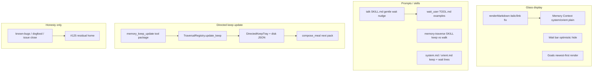
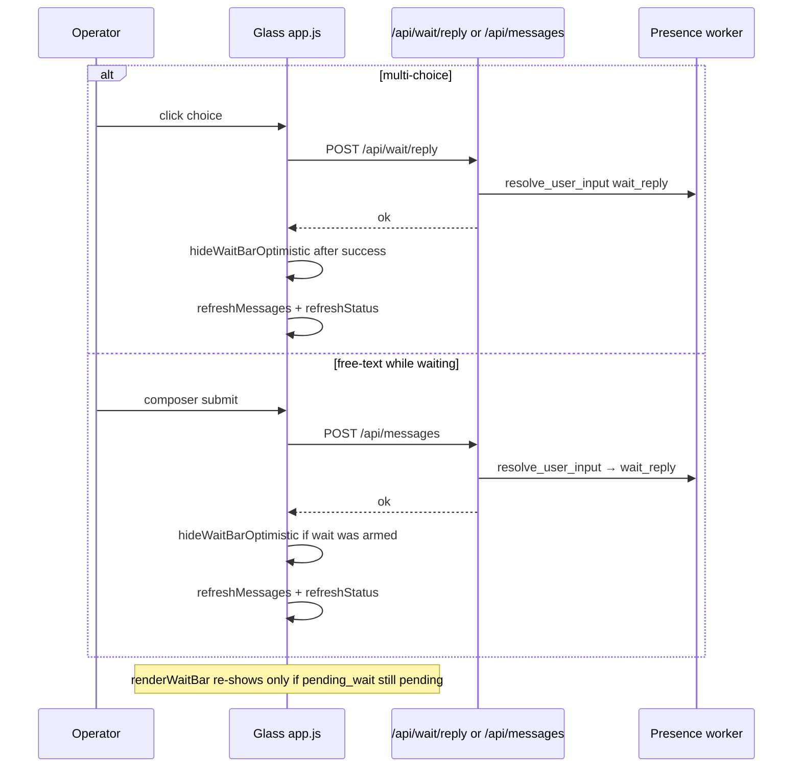

# Design: General touchup 1 — bulk fix plan

| Field | Value |
|-------|--------|
| **Document** | `general-touchup1` bulk fix plan |
| **Author** | (design writer) |
| **Date** | 2026-08-06 |
| **Status** | Draft (rev 2 — review addressed) |
| **Branch law** | **One branch** `fix/general-touchup1` from **`working`**; **ordered commits**; **single PR** into `working` |
| **Tip at design** | `working` @ `ba78887` (workspace root) |
| **Repo** | `/home/jim/Workspace/project-elyra` |
| **Issues closeable from this bulk** | #88 (A+B), #89 (gentle standard), #104, #120 (Option B), #103 (if live-verified) |
| **Operator bulk work (not a false GitHub close)** | Goals newest-first + light Memory Context polish (tracked as this plan / commit slice C3; **not** equal to #73 Done) |
| **Issues OUT / deferred** | **#109** = C4 grok_build residual dogfood (exclude this bulk); **BUG-mem-ui-02 / #73** = atoms beautify remains open (defer); **unfiled** skill-bundle fail-closed (not the same as #109) |
| **Related residual epic** | #125 (edges polish2 — home for #120/#103 residual, not new edge code here) |

---

## Overview

This plan batches operator-locked product/UI honesty items onto one short-lived branch: Glass markdown link safety (#88 A+B), wait multi-choice gentle nudge + bar hide (#89), goals list order newest→oldest + light Memory Context polish (operator bulk, **distinct from** GitHub #73 atoms beautify), model-facing **directed keep update** (#104), and board/docs honesty for edges C14 + semantic-directed verification without reopening cold-seed feature work (#120 / #103).

The implementation is deliberately small and reviewable: mostly Glass display fixes, skill/prompt soft nudges, one new keep-family tool over existing `DirectedKeepTray` / `TraversalRegistry` APIs, and documentation/checklist closure. Prefer **one branch, ordered commits, single PR** `fix/general-touchup1` → `working` with checklist slices (not seven Graphite stacks). No Gate B, no `durable_edges_enabled` default-on, no C4/#109 residual dogfood, no unfiled skill-bundle fail-closed work, and no stored-message rewrites for markdown.

---

## Background & Motivation

### Current state (code-backed)

| Surface | Location | Pain |
|---------|----------|------|
| Chat markdown | `elyra/runtime/web/app.js` `renderMarkdown` → `inline()` | Links become `<a href="…" target="_blank" …>`; then underscore italic `/(^|[^_])_([^_]+)_/g` runs on the **whole** HTML string and mangles `target="_blank"` (and any `_…_` inside attributes). Confirmed root cause for #88A. |
| Memory Context cards | `renderMemoryChannelCard` | Fixed channels `system` / `orient` are in the prose set and call `renderMarkdown(snippet)` — unwanted for long system/orient text; chat is the only place that needs pretty markdown. JSON pretty for Moments tool beats is already fine. |
| Wait bar | `renderWaitBar`, `sendWaitChoice`, form `submit` | Multi-choice clicks use `/api/wait/reply` and set `waitReplyInFlight`, but free-text composer uses `/api/messages` without optimistic hide. Model often lists forks in prose without arming `wait_user` (#89 skill soft language). |
| Goals list | `GoalsStore.list_goals` appends create order; Glass `renderGoals` paints API order | Glass shows **oldest → newest**. Orient slice already sorts newest-updated first (`format_goals_slice`); Glass should match product “recent work on top.” |
| Directed keep | `keep_tray.py` `merge_confirm`; finish → tray; `clear_confirmed_keep` operator-only | Model can only change meal keep via `memory_traverse_finish` (or abandon, which **retains** keep). No first-class update/clear/pin path (#104). Product model: traversal walks; **keep manages context**. |
| Edges / semantic | Code on `working`/`main`; checklist partial | C14 (#120) and semantic-directed (#103) are **code-complete with partial live dogfood**; remaining edge quality lives under #125. This plan closes board honesty, not more edge engine code. |

### Why now

These items block dogfood polish and v0.1 honesty without needing a large architecture program. Stacking them on one `fix/*` branch from `working` keeps review cost low and avoids inventing parallel feature branches.

---

## Goals & Non-Goals

### Goals

1. **#88A** — Chat/Moments prose markdown: links with `target="_blank"` (and attribute/path underscores) survive italic/bold post-processing; IRI/`href` hygiene for Sources-style links remains display-only. Closes core BUG-chat-03 / #88.
2. **#88B** — Memory Context fixed channels `system` / `orient` render as **plain text** (`textContent`), not `renderMarkdown`. **Operator-additive** to #88 (not in original issue body); close #88 with A+B in the comment.
3. **#89.1** — **Gentle-with-examples** skill/TOOL.md nudge (dogfood-shaped research close + forks): multi-choice forks → `wait_user` with those choices; no harsh MUST thrash, no inventing choices. **Product acceptance for closing #89** is this gentler standard (KD-W1); update known-bugs wording to match.
4. **#89.2** — Hide wait bar optimistically **after successful** multi-choice **or** free-text reply that answers the wait; free-text path also `refreshStatus` immediately (match multi-choice); re-show if status still has pending wait.
5. **Operator bulk (goals + light Context)** — Goals list **newest → oldest** (top→bottom) via API sort; light Memory Context chrome consistency. **Do not close #73 / BUG-mem-ui-02** (atoms beautify remains open/defer).
6. **#104** — Ship **update-first directed keep**: model-facing `memory_keep_update` (merge/replace, pin, remove, empty replace = clear); skill/system/orient treat keep as **context management** tied to goals/tasks; tray sticky immediately; meal packs next compose (KD-A16 honesty). Super-set of the issue’s clear-focused body; close comment must state the broader tool.
7. **#120** — Option B: treat C14 as **code + partial dogfood**; close or residual-waiver board/docs; residuals under #125. No new edge code.
8. **#103** — Verify semantic directed against live checklist / recent dogfood; **close only if live-verified** (not hermetic-only); else residual→#125. No cold-seed greenfield.

### Non-Goals

| Item | Reason |
|------|--------|
| **#109 — C4 grok_build residual dogfood** | Real GitHub #109 identity: residual packaging/dogfood sign-off for shipped `grok_build` (v0.1 C4). **Excluded from this bulk** — address after touchup1. Not “skill-bundle fail-closed.” |
| **Unfiled: skill-bundle / online server skills fail-closed** | Operator later interest (e.g. online/server skills bundle for grok_build). **Separate** from #109; do **not** implement here; no issue number claimed. |
| Gate B / `durable_edges_enabled` factory default-on | Explicit program law |
| Rewrite stored atom/message text for markdown | Glass display-only (#88) |
| **Full Atoms timeline beautify (BUG-mem-ui-02 / GitHub #73)** | Remains **open (defer)**. This bulk does **not** ship atoms beautify and must **not** mark #73 Done. Goals order is operator-locked work under this design, not a redefinition of #73. |
| Replace-mode as traverse finish only / piggyback | Product default: separate keep tool |
| Graph pin UI (S6), soft-recall (S5), Phase 3 learning | Out of scope |
| Harsh host thrash / invent wait choices / ALL-CAPS MUST | #89 product acceptance is gentle-with-examples |
| New edge fabric / expand / seed algorithm code | #120 Option B; #103 verify-only |
| Host soft-check “speak looks multi-choice → force wait” | Optional later; not required for gentle close standard |

---

## Key Decisions

| ID | Decision | Rationale |
|----|----------|-----------|
| **KD-BR** | **One branch** `fix/general-touchup1` from **`working`**. Work as **ordered commits** (checklist slices C1–C7 below). **Single PR** `fix/general-touchup1` → **`working`**. Do not invent other feature branch names; do not require seven stacked PRs into the fix tip. | Branch law + plain-git operator preference. |
| **KD-MD1** | Fix italic/bold **after** link/image/code substitution by protecting HTML tags (or applying emphasis only to text nodes / outside tags). Prefer protect-tags approach inside `inline()` with minimal churn. | Root cause is post-link `_…_` on attributes **and** path underscores in `href`; surgery must not break KaTeX/fence placeholders. |
| **KD-MD2** | Memory Context `system` / `orient` → plain text only. Other meal channels keep current prose/markdown. **Additive to #88** (operator-locked; document in close comment). | Pretty markdown needed in **chat**; fixed channels are long structured text. |
| **KD-MD3** | Display-only; no store rewrite. Optional `href` IRI encode for http(s) if cheap in same slice as italic fix. Bare-URL autolink optional, not blocking. | #88 dogfood Sources; reject `javascript:`. |
| **KD-W1** | **Gentle-with-examples is product acceptance to close #89.** Talk + `wait_user` TOOL.md: concrete dogfood-shaped example (research close + numbered forks) + prefer-language — **not** ALL-CAPS MUST thrash. When closing, rewrite BUG-wait-01 / known-bugs fix directions to the gentler standard so board matches. Residual note allowed if live model still skips after ship (separate follow-up), but **this plan closes #89** on the gentler standard. | Operator lock supersedes issue “strong/must” wording. |
| **KD-W2** | Call `hideWaitBarOptimistic()` **only after successful** HTTP response on (a) multi-choice `sendWaitChoice`, (b) composer submit when a wait was armed for session user. **Both paths** then `await refreshMessages()` + **`await refreshStatus()`** so re-arm is immediate (today free-text skips `refreshStatus`). `renderWaitBar` re-shows if `pending_wait` still pending. | Matches multi-choice wiring; avoids hide-before-POST race and poll-only re-arm lag. |
| **KD-G1** | Goals **newest first**: sort in `GoalsStore.list_goals` by `(updated_at or created_at)` desc, stable tie-break `id`. Default no status filter = **all statuses** (open/review/closed/cancelled), newest-updated first; Glass unchanged except order. Orient `format_goals_slice` keeps its own sort. | API/Glass/tools agree; closed goals not newly filtered. |
| **KD-G2** | Light Memory Context chrome consistency only (after #88B if needed). **Not** atoms beautify. **Do not close #73.** | Operator bulk vs GitHub #73 honesty. |
| **KD-ISSUE-73** | GitHub **#73 / BUG-mem-ui-02** remains **open (defer)** for atoms list beautify. Goals order + light Context polish are **operator-locked bulk work** under this design (commit slice C3), without claiming #73 Done. Expand #73 body only if operator later wants goals folded in. | Board honesty. |
| **KD-K1** | New tool **`memory_keep_update`** (snake_case, memory/keep family) — **not** only piggybacking `memory_traverse_finish`. Traverse finish still merges into tray as today. | Product: traversal = walk; keep = context management. Super-set of #104’s clear-focused body (operator lock). |
| **KD-K2** | Args: `mode` = `merge` (default) \| `replace`; `atom_ids` list; optional `remove_ids`; optional short `note`. **Empty `replace` + empty `atom_ids`** = clear tray (entries **and** `walk_summary_nl=null` unless `note` provided). | Operator defaults; meal packs summary from tray. |
| **KD-K3** | Atom ids required for pin/add (except clear via empty replace). Merge of existing ids reinforces `last_reinforced_at`. `remove_ids` drops listed entries. | Reuse tray TTL/LRU. |
| **KD-K4** | Respect `is_directed_keep_enabled`; **fail closed** with clear reason when keep disabled. No active traverse session required. | Flag gate matches meal path (OQ-A1). |
| **KD-K5** | Tray sticky **immediately on disk**; outer meal packs on **next compose** (KD-A16). | Existing meal contract. |
| **KD-K6** | Prompts/skills: keep = context management aligned with goals/tasks; update when goals shift; abandon ≠ clear; empty replace is intentional clear. | Closes #104 skill gap. |
| **KD-K7** | Registry owns mutate via `TraversalRegistry.update_keep`. Tool thin over registry. **On every success:** rewrite `_last_confirmed_keep` thin snap from current tray ids (session_id/goal optional/None; `finished_at=now`; `walk_summary_nl` from tray), **or** clear thin snap + empty tray path when cleared (share helper with `clear_confirmed_keep` empty path). | Inspect/glass honesty; locks former OQ2. |
| **KD-C14** | #120 Option B: **no edge code**. Docs: “code complete on working@&lt;tip&gt;; dogfood partial; residual #125; not Gate B.” | Operator lock. |
| **KD-S103** | #103: verify live checklist / dogfood; **close only with live evidence** for product-default auto path; pure `semantic_only` cold → #125; hermetic-only is **not** sufficient to close. No greenfield. | Operator + review lock. |
| **KD-109** | **#109 identity = C4 grok_build residual dogfood** (`docs/goal/v0.1.md` C4). Excluded from this bulk. **Do not** equate #109 with skill-bundle fail-closed. Skill-bundle / online server skills is **unfiled deferred non-goal**. | Correct board identity. |
| **KD-104-CLOSE** | On #104 close comment: state full tool (merge/replace/remove; empty replace clears); abandon still ≠ clear; meal next compose. Optional issue title broaden later. | Honesty vs clear-only body. |

---

## Proposed Design

### Architecture (scope map)



### 1. #88 — Markdown + Memory Context

#### 1.1 Root cause (confirmed)

In `elyra/runtime/web/app.js` `renderMarkdown` → `inline()`:

1. Escape HTML.
2. Images → ``.
3. Links → `<a href="…" target="_blank" rel="noopener noreferrer">…</a>`.
4. Inline code, then bold/italic including:
   ```js
   t = t.replace(/(^|[^_])_([^_]+)_/g, "$1<em>$2</em>");
   ```
5. The pattern matches `_blank` inside `target="_blank"` when a later `_emphasis_` appears in the **same inline segment**, and mangles underscores **inside `href` path segments** (e.g. `Foo_Bar_Baz` → `Foo<em>Bar</em>Baz`).

#### 1.2 Fix (KD-MD1)

Inside `inline()`, **after** link/image/code substitution and **before** bold/italic:

- Protect HTML tags by replacing `/<[^>]+>/g` with placeholders `%%TAG0%%`, …
- Run `**` / `*` / `__` / `_` emphasis only on the protected string.
- Restore tags.

Alternatively process emphasis only on text segments split by tags — same effect.

**Also (same PR if small):**

- When building `href` for `http(s)`, normalize via `URL` / encodeURI for non-ASCII path segments without double-encoding already-percent-encoded paths (BUG-chat-03 Sources).
- Keep `rel="noopener noreferrer"`; reject non-http(s) schemes for external anchors (`javascript:` never becomes a live link).

**Out of band for this PR:** full bare-URL autolinker (optional follow-up).

#### 1.3 Memory Context plain text (KD-MD2) — additive to #88

**Board honesty:** BUG-chat-03 / #88 body is Sources/link open correctness. #88B is **operator-additive** Glass Context polish shipped in the same commit slice; issue close comment must cover **A+B**.

In `renderMemoryChannelCard`:

```js
// Current prose set includes system + orient → renderMarkdown
const proseCh = new Set([
  "temporal", "episodic", "semantic", "summary",
  "system", "orient", "directed_keep",
]);
```

Change:

- Introduce `plainCh = new Set(["system", "orient"])`.
- If `plainCh.has(ch)`: use `<pre>` or `div` with **`textContent = snippet`** (preserve newlines; no markdown). Prefer plain `div`/`pre` over `innerHTML`.
- Else if `proseCh.has(ch)`: keep `renderMarkdown` for chat-like meal channels.
- `system`/`orient` leave the markdown prose set.

Chat bubbles (`renderMessages`) and Moments speak prose continue to use `renderMarkdown` unchanged (except the italic fix).

#### 1.4 Tests

Hermetic JS path today is mostly string presence in `tests/test_api_glass.py` (`"renderMarkdown" in js`). Expand with pure helpers so the **confirmed** bug is unit-tested:

**Preferred implement shape:** extract markdown helpers to `elyra/runtime/web/markdown.js` (or pure functions exportable from a tiny module). Hermetic test imports pure helper — do **not** rely only on `"renderMarkdown" in js`.

**Required regression fixtures:**

| Input | Expect |
|-------|--------|
| `[x](https://example.com) and _y_` | `target="_blank"` **intact** on the anchor; `<em>y</em>` present (cross-segment confirmed bug) |
| `[Wiki](https://example.com/wiki/Foo_Bar_Baz)` | `href` path underscores **intact** (no `<em>` inside attribute) |
| `[Wiki](https://en.wikipedia.org/wiki/Schrödinger)` | usable encoding; `target="_blank"` intact (optional same slice if IRI work lands) |
| `see _emphasis_ here` | `<em>emphasis</em>` |
| `a_b_c` identifiers | not over-italicized beyond current behavior |
| system/orient Memory card path | snippet via `textContent`; no markdown-driven `<em>` from underscores |

### 2. #89 — Wait UX

#### 2.1 Skill / TOOL gentle nudge (KD-W1) — acceptance to close #89

**Product acceptance (operator lock):** shipping **gentle-with-examples** (not MUST thrash) is **sufficient to close #89 / BUG-wait-01**. Issue/known-bugs historical “strong / must” language is **superseded** for board close; PR close + known-bugs rewrite must say so.

**`skills/bundled/talk/SKILL.md`** — strengthen step 6 / hard rules without thrash language:

- When a speak presents **numbered or lettered collaborative forks** the human should pick among, **prefer** ending the turn with `wait_user` whose `choices` are those fork strings (same wording as glass buttons).
- If offering free-text / “I’ll type”, prefer empty `choices` + long timeout (≥300s).
- Order remains **`speak` then `wait_user`** (later tools after wait are not run).
- Do **not** invent choices the human was not offered.
- Soft “prefer” / “when forks are real decisions” — not “MUST or fail”.

**`tools/bundled/wait_user/TOOL.md`** — add a **dogfood-shaped** example (research close + forks), not only abstract adopt/revise/hold:

```text
After a long research speak that ends with collaborative forks, e.g.:
  (1) dig Wikipedia lineage
  (2) compare Grokipedia claims
  (3) formal math path
  (4) stop / something else
Prefer:
  speak(...full answer + forks on glass...)
  wait_user({
    prompt: "Which fork next?",
    choices: [
      "dig Wikipedia lineage",
      "compare Grokipedia claims",
      "formal math path",
      "stop / something else"
    ],
    timeout_seconds: 300
  })
```

**Known-bugs on close:** rewrite BUG-wait-01 “Fix directions” to **gentle-with-examples** standard; note residual only if post-ship dogfood still shows systematic skip (follow-up card — does **not** block #89 close under KD-W1).

**System/orient:** only if talk skill is thin; at most one soft bullet. Avoid MUST thrash in system.md.

**Explicit non-goals:** host regex on speak body to force wait; timeout retune; invent choices.

#### 2.2 Optimistic hide wait bar (KD-W2)

Current wiring (`app.js`):

| Path | API | Wait bar today |
|------|-----|----------------|
| Multi-choice | `POST /api/wait/reply` via `sendWaitChoice` | Sets `waitReplyInFlight`; then `refreshMessages` + **`refreshStatus`** |
| Composer | `POST /api/messages` | **Only** `refreshMessages` — **no** `refreshStatus` (~8470); bar relies on ~1.5s `tick` poll |

Backend already routes free-text as `wait_reply` when phase is `waiting` and pending wait matches user (`elyra/presence/user_input.py` lines 101–119). Composer does not need a new API for correct routing.

**Normative implement rules:**

1. `hideWaitBarOptimistic()` runs **only after a successful** fetch (not before POST; not on throw).
2. Multi-choice success: hide → `refreshMessages` + `refreshStatus` (status already present; keep it).
3. Free-text success **when wait was armed**: hide → `refreshMessages` + **`refreshStatus`** (new; match multi-choice so re-arm is immediate).
4. On fetch error: do **not** hide (or re-show via next status); restore choice buttons if multi-choice (`waitReplyInFlight = false` as today).
5. `refreshStatus` → `renderWaitBar(s.pending_wait)` is source of truth: re-shows if still `status === "pending"`.

**Armed-wait equality for free-text hide:**

```js
// lastStatusPendingWait captured on each successful refreshStatus
function waitArmedForSessionUser(pending, userId) {
  return Boolean(
    pending &&
    pending.status === "pending" &&
    String(pending.user_id || "") === String(userId || "")
  );
}
// On submit success: hide if waitArmedForSessionUser(lastStatusPendingWait, getSessionUserId())
//   OR waitBar was visible (lastPendingWaitId non-null) before submit.
```

```js
function hideWaitBarOptimistic() {
  waitBar.hidden = true;
  waitChoices.innerHTML = "";
  waitPrompt.textContent = "";
  lastPendingWaitId = null;
  waitReplyInFlight = false;
}

// sendWaitChoice success:
//   hideWaitBarOptimistic();
//   await Promise.all([refreshMessages(), refreshStatus()]);
// form submit success when wait armed:
//   hideWaitBarOptimistic();
//   await Promise.all([refreshMessages({ force: true }), refreshStatus()]);
// form submit success when no wait: refreshMessages only (or still refreshStatus if cheap — prefer always refreshStatus after chat send for phase honesty).
```

**Recommendation:** after **any** successful composer send, also `await refreshStatus()` (small; fixes wait re-arm and phase pill). Hide optimistically only when wait was armed.

**Tests:** document behavior; optional pure helper `waitArmedForSessionUser`; needle tests if used.



### 3. Goals newest-first + light Memory polish (operator bulk — not #73 Done)

**Board mapping (KD-ISSUE-73):** GitHub **#73 / BUG-mem-ui-02** = “Memory Atoms list needs beautify pass.” That work **stays open (defer)**. This section is **operator-locked bulk work** (goals order + light Context chrome). Commit slice C3 must **not** close #73 or claim BUG-mem-ui-02 fixed.

#### 3.1 Newest → oldest (KD-G1)

**`GoalsStore.list_goals`** today returns JSON array order (create append = oldest first):

```python
# elyra/goals/store.py list_goals
for g in doc.get("goals", []):
    ...
    out.append(dict(g))
return out
```

**Change:** sort `out` by `(updated_at or created_at)` descending before return. Stable tie-break on `id` for hermetic tests.

**Status filter / Glass (explicit):**

- Default `list_goals()` with **no** `status` filter still returns **all** statuses (`open`, `review`, `closed`, `cancelled`) — **newest-updated first**.
- Glass `renderGoals` does not newly hide closed goals; only paint order changes.
- Optional API `?status=` filter behavior unchanged when provided.

**Consumers:**

| Consumer | Effect |
|----------|--------|
| `GET /api/goals` → Glass `renderGoals` | Newest at top ✓ |
| `list_goals` tool / ledger | Same order ✓ |
| `format_goals_slice` | Already newest-updated preference; independent ✓ |
| Presence `has_open_work` | Order irrelevant ✓ |

**Glass-only reverse** is rejected: tools and Glass would disagree.

**Tests:** extend `tests/test_goals.py` — create A, B, update A → list order `[A, B]` by `updated_at`.

#### 3.2 Light Memory polish (KD-G2)

After #88B plain system/orient:

- Ensure fixed-channel cards still use same `card` / `card-head` / `badge` chrome as other channels.
- **No** atom timeline redesign; **no** BUG-mem-ui-02 / #73 close.
- Optional muted label “plain text” is **not** required (avoid chrome noise).

### 4. #104 — Update-first directed keep

**Issue honesty:** GitHub #104 is framed as “no complete manual **clear** path.” Empty `mode=replace` with empty `atom_ids` satisfies clear. Operator lock expands to **update-first context management** (merge/replace/pin/remove). **Close comment (KD-104-CLOSE):** model-facing `memory_keep_update` (merge/replace/remove; empty replace clears); abandon still ≠ clear; meal next compose. Optional later title broaden.

#### 4.1 Product model

| Concept | Role |
|---------|------|
| **Directed traversal** | Walk tools: `memory_traverse_{start,step,inspect,finish,abandon}` |
| **Directed keep** | Sticky context tray: pins atoms into next outer meal `directed_keep` channel |
| **Today** | Keep only updates via finish → `merge_confirm`; clear is operator `clear_confirmed_keep` |
| **Target** | Model manages keep actively (`memory_keep_update`) aligned with goals/tasks |

#### 4.2 Tool: `memory_keep_update`

New bundled package (mirror `memory_traverse_*`):

```
tools/bundled/memory_keep_update/
  TOOL.md
  schema.json
  runner.json  → elyra.tools.builtin.memory_keep:memory_keep_update
```

**Schema (normative):**

```json
{
  "type": "object",
  "properties": {
    "mode": {
      "type": "string",
      "enum": ["merge", "replace"],
      "description": "merge (default): union/reinforce + optional remove_ids. replace: tray becomes atom_ids only (empty = clear)."
    },
    "atom_ids": {
      "type": "array",
      "items": { "type": "string" },
      "description": "Atoms to pin/keep. Required non-empty for merge pin/add; empty allowed with mode=replace (clear) or with only remove_ids under merge."
    },
    "remove_ids": {
      "type": "array",
      "items": { "type": "string" },
      "description": "Ids to drop from tray (merge or applied after replace base). Ignored if absent."
    },
    "note": {
      "type": "string",
      "description": "Optional short walk_summary_nl / meal note (≤240 recommended)."
    }
  },
  "required": [],
  "additionalProperties": false
}
```

**Semantics:**

| mode | atom_ids | remove_ids | Result |
|------|----------|------------|--------|
| `merge` (default) | non-empty | optional | Union pin/reinforce via `merge_confirm`; then drop `remove_ids` |
| `merge` | empty | non-empty | Remove only |
| `merge` | empty | empty | `invalid_args` (no-op refuse) |
| `replace` | non-empty | optional | New tray from `atom_ids` (timestamps now); then remove if any leftover |
| `replace` | empty | * | **Clear tray**: empty `entries`, **`walk_summary_nl = null`** (unless `note` provided for a clear+annotate edge case — default null), preserve policy fields |

**Flags:** if not `is_directed_keep_enabled(mem)` → `ok: false`, `error_reason: keep_disabled`, hint to enable keep/traversal settings.

**Ports:** requires `ctx.extras['traversal']` (registry) for SoT + disk paths — same injection as traverse tools. If missing → `keep_unavailable` (or reuse `traverse_unavailable` with clear hint that keep tray needs registry).

**Does not require** active walk or `directed_traversal_enabled` alone when `directed_keep_enabled=true` (config already allows keep without traversal). When only traversal flag is on, `is_directed_keep_enabled` follows it (OQ-A1) — keep tools work in dogfood.

**Payload success (illustrative):**

```json
{
  "ok": true,
  "mode": "merge",
  "entry_count": 3,
  "atom_ids": ["a1", "a2", "a3"],
  "removed": ["a0"],
  "walk_summary_nl": "pins for goal X",
  "meal_timing": "next_compose"
}
```

#### 4.3 Registry API

Add to `TraversalRegistry` in `elyra/memory/traverse.py`:

```python
def update_keep(
    self,
    *,
    mode: str = "merge",  # merge | replace
    atom_ids: Sequence[str] | None = None,
    remove_ids: Sequence[str] | None = None,
    note: str | None = None,
    moment_id: str | None = None,
) -> dict[str, Any]:
    """Model/operator keep tray update. Fail closed if keep disabled."""
```

Implementation sketch (**locked** thin snap + clear summary):

1. If not `is_directed_keep_enabled(self._settings)` → error dict.
2. `tray = self.ensure_tray()`; apply hard TTL policy mirrors via `_tray_policy()`.
3. **`replace` + empty ids (clear):** empty tray (preserve policy fields); set **`walk_summary_nl = None`** (unless caller passed `note`, then set that short note only — default clear nulls summary); save; **`_last_confirmed_keep = None`** (share empty path with `clear_confirmed_keep` tray wipe; `clear_glass` remains optional operator-only and **not** default for model clear); return cleared.
4. **`replace` + ids:** build via `seed_tray_from_keep_ids` or empty+`merge_confirm` (with `note` → `walk_summary_nl`); assign to `_directed_keep_tray`; apply `remove_ids` if any; save.
5. **`merge`:** `tray.merge_confirm(atom_ids, …, walk_summary_nl=note if note is not None)`; then `tray.remove_ids(remove_ids)`; save.
6. **Thin snap sync (always on success when tray non-empty):** rewrite `_last_confirmed_keep` as `ConfirmedKeepSnapshot` from `tray.atom_ids()`, `walk_summary_nl=tray.walk_summary_nl or ""`, `finished_at=now`, `moment_id` from arg or None, `session_id` optional/`keep_update`, `goal` optional empty. When tray empty after update → `_last_confirmed_keep = None`.
7. `save_directed_keep_tray(tray, paths=self._tray_paths)`.

**`remove_ids` helper:** pure filter on `tray.entries` by atom_id set (add `DirectedKeepTray.remove_ids(ids) -> int` in `keep_tray.py` for testability).

**`clear_confirmed_keep`:** remains operator/internal escape; empty replace **shares tray-empty + snap-clear helper** but model path does not require `clear_glass=True` (last Graph walk may stay process-life sticky).

#### 4.4 Meal timing (KD-K5)

Unchanged contract:

- Disk tray immediate.
- `compose_meal` / presence path reads tray on next outer rebuild (`select_directed_keep`).
- TOOL.md documents `meal_timing: next_compose` like finish.

#### 4.5 Skills & prompts (KD-K6)

| File | Change |
|------|--------|
| `skills/bundled/memory-traverse/SKILL.md` | Split “walk” vs “keep management”; after finish, further pin/drop uses `memory_keep_update`; abandon **retains** keep; clear = empty replace; do not imply abandon clears pins. |
| `prompts/system.md` | Under tools family: **Memory keep:** `memory_keep_update` manages sticky directed keep (merge/replace pins); align with open goals; meal packs next compose. List with traverse family when tools present. |
| `prompts/orient.md` | Soft decide bullet: when goals/tasks shift, prefer updating directed keep rather than abandoning walks as if that cleared context. |
| Continuity / talk (light) | talk rule 10 already mentions directed_keep first; optional one line “refresh keep via `memory_keep_update` when pins stale.” |

#### 4.6 Catalog registration

- `elyra/tools/builtin/__init__.py` docstring + `memory_keep.py` module.
- Tool registry discovery picks up bundled package automatically (existing pattern).
- Skill catalog unchanged unless a dedicated `memory-keep` skill is desired — **prefer extending memory-traverse** to avoid skill sprawl (KD).

#### 4.7 Tests

| Suite | Cases |
|-------|-------|
| `tests/test_keep_tray.py` | `remove_ids`; replace empty; merge reinforce timestamps |
| `tests/test_memory_traverse.py` | `update_keep` merge/replace/clear; flag off fail closed; disk file empty after clear |
| `tests/test_memory_traverse_tools.py` or `tests/test_memory_keep_tools.py` | Tool args validation; registry missing; disabled; success payload |
| `tests/test_memory_meal_directed_keep.py` | After update_keep, next compose includes/excludes channel |

### 5. #120 — C14 board honesty (Option B)

**No product code** for edges.

Actions (docs slice C6):

1. `docs/state/memory/edges-traversal-dogfood.md` — refresh claim banner carefully: **code complete on `working` @ &lt;land tip&gt;**; live dogfood **partial**; do **not** over-claim full checklist green. Note tip may drift past historical `161a820` (old banner) vs design tip `ba78887` — update “Last verified / tip” only with honest evidence.
2. `docs/goal/v0.1.md` / board-facing state — C14 = **code + partial dogfood** with residual home **#125**.
3. Issue #120 — close or residual-waiver with Option B language; point #125 for cold `semantic_only`, start `local_map` budget, recalls-on-expand, accounting noise.
4. Template issue/docs language: *“code complete on working@…; dogfood partial; residual #125; not Gate B.”*
5. **Do not** land edge engine changes under this plan.

### 6. #103 — Semantic directed verify / residual

**Intent:** operator believes semantic directed works in recent dogfood. Plan does **not** implement seed algorithm changes.

**Verify procedure (implementer / operator checklist):**

1. Read `edges-traversal-dogfood.md` § Pure semantic start + dual slots + polish1 wait sections.
2. Confirm code path on tip: `seed_mode=auto` dual reserve, `semantic_only` empty OK when cold, start_ms 250 structural, ANN under semantic wait (PR5/polish1 — already on `working`).
3. **Close #103 only with live evidence** for product-default **`auto`** path (moment ids / notes + tip SHA). Hermetic green alone is **not** sufficient to close.
4. Pure `semantic_only` cold residual → **#125** (already listed); does not block auto-path close if auto was live-verified.
5. If auto path fails live verify: residual on #125 with evidence; **no greenfield** in this plan; leave #103 open or retarget residual.

Hermetic re-run of `tests/test_memory_traverse.py` is supporting evidence only.

---

## API / Interface Changes

### New tool

| Name | Entry | Kind |
|------|-------|------|
| `memory_keep_update` | `elyra.tools.builtin.memory_keep:memory_keep_update` | control/read-adjacent (mutates tray, not atoms) |

### Registry

```python
# TraversalRegistry
def update_keep(...) -> dict[str, Any]: ...
# clear_confirmed_keep remains; may share empty-tray helper with replace clear
```

### Tray

```python
# DirectedKeepTray
def remove_ids(self, ids: Sequence[str]) -> int: ...
```

### Glass

| Function | Change |
|----------|--------|
| `inline` / `renderMarkdown` | Tag-protect before underscore italic |
| `renderMemoryChannelCard` | system/orient plain text |
| `hideWaitBarOptimistic` | new; used by choice + submit |
| `renderGoals` | receives newest-first list (API-sorted) |

### HTTP

No new endpoints. Existing:

- `GET /api/goals` — order changes to newest first
- `POST /api/wait/reply` — unchanged
- `POST /api/messages` — unchanged routing

### Prompts / skills

Additive markdown only; no schema break for existing tools except new package.

---

## Data Model Changes

| Asset | Change | Migration |
|-------|--------|-----------|
| `data/runtime/directed_keep_tray.json` | Same schema (`entries`, `walk_summary_nl`, `policy`) | None — replace clear writes empty entries **and** `walk_summary_nl: null` |
| `data/goals/goals.json` | No schema change; list order is derived | None |
| Messages / atoms | **No** store rewrite for markdown | Display only |

---

## Alternatives Considered

### A. Markdown: process italics before links

| Pros | Cons |
|------|------|
| Avoids attribute collision without placeholders | Breaks `_italic_` inside link labels that should still emphasize; order currently links-then-emphasis by design for other cases |

**Rejected** in favor of tag protection after links (KD-MD1).

### B. Wait: force host soft-check on multi-choice speak

| Pros | Cons |
|------|------|
| Higher arm rate | Thrash risk; invents process pressure; operator chose gentle skill nudge |

**Rejected** for this plan (may revisit under separate thrash-aware design).

### C. Keep: only expose `clear` tool + empty finish

| Pros | Cons |
|------|------|
| Smaller surface | Does not meet update-first product model; finish still requires walk; partial pin/remove awkward |

**Rejected** for dedicated `memory_keep_update` with merge/replace (KD-K1).

### D. Goals: Glass-only reverse

| Pros | Cons |
|------|------|
| Zero store change | Tool `list_goals` still oldest-first; operator/model confusion |

**Rejected** for store-level sort (KD-G1).

### E. #120: more edge code until full checklist green

| Pros | Cons |
|------|------|
| Closer to “complete edges” claim | Operator locked Option B; polish2 already on #125 |

**Rejected**.

### F. #88B: strip markdown syntax only vs full plain text

| Pros | Cons |
|------|------|
| Might preserve some intentional formatting | System/orient are long structured host text; partial strip is ambiguous and still runs risky regexes |

**Rejected** — use `textContent` plain render (KD-MD2).

### G. Keep tool named `memory_traverse_keep` under traverse family

| Pros | Cons |
|------|------|
| Groups with walk tools in catalog | Conflates walk vs context management; requires active-session mental model |

**Rejected** — prefer `memory_keep_update` keep-family prefix (KD-K1).

### H. #89: keep “strong MUST” known-bugs language while shipping gentle nudge

| Pros | Cons |
|------|------|
| Matches original issue text | Leaves #89 unclosable after PR; thrash risk; operator locked gentle acceptance |

**Rejected** — close on gentle-with-examples; rewrite known-bugs (KD-W1).

---

## Security & Privacy Considerations

| Risk | Severity | Mitigation |
|------|----------|------------|
| Markdown XSS via unescaped href/label | Med | Keep existing `escape()`; only http(s)/resolved media URLs as anchors; never `javascript:` |
| Tag-protect restore bugs leave raw HTML | Med | Hermetic cases; protect only after escape |
| `memory_keep_update` pins arbitrary ids | Low | Ids must exist only for meal pack quality (missing ids soft-skip in meal already); tray cap/TTL/LRU still apply; no atom body exfil beyond existing inspect |
| Wait bar hide hides active wait incorrectly | Low | Hide only after success; immediate `refreshStatus` re-shows if still pending |
| Skill prompt injection via longer TOOL.md | Low | Bundled static files; no user content |

No new auth surface; tools still go through host registry and settings flags.

---

## Observability

| Signal | Where |
|--------|-------|
| Keep update success/fail | Tool result payload (`ok`, `error_reason`, `entry_count`); registry `_LOG.exception` on save failure (existing finish pattern) |
| Keep disabled | `error_reason=keep_disabled` + hint |
| Wait hide | Client-only; **immediate** `refreshStatus` after successful reply (both paths); poll remains backup |
| Markdown | No metrics; dogfood Sources links |
| Board honesty | Issue comments + dogfood doc Last verified line |

No new metrics backends required. Optional debug log on `update_keep` at INFO: mode, counts, entry_count.

---

## Rollout Plan

### Branch & merge strategy (KD-BR)

```text
working
  └── fix/general-touchup1
        ordered commits C1…C7 (checklist slices)
        └── single PR → working
```

1. Create `fix/general-touchup1` from latest `working`.
2. Land **ordered commits** matching slices C1–C7 below (reviewable as one PR checklist; optional 2–3 review chunks if size demands — still one branch).
3. Hermetic: `pytest -m 'not llm and not live_grok'` on touchpoints; full suite before merge to `working`.
4. Dogfood smoke: Glass links (incl. link+`_italic_`), wait hide + free-text `refreshStatus`, goals order, keep update clear/pin, meal next compose.
5. **Single PR** `fix/general-touchup1` → `working`; delete short-lived branch after merge.
6. **No** feature flags for markdown/wait/goals (always-on display fixes).
7. Keep tool fail-closed when `is_directed_keep_enabled` false (existing factory defaults remain off).

### Rollback

| Slice area | Rollback |
|------------|----------|
| Markdown / Glass | Revert JS; no data migration |
| Skills/prompts | Revert md |
| Goals sort | Revert store sort (order only) |
| Keep tool | Revert package + registry method; tray file compatible |
| Docs/issues | Edit docs; reopen issues if needed |

### Risks

| Risk | Severity | Mitigation |
|------|----------|------------|
| Emphasis regression (underscores in prose) | Med | Required fixtures incl. link+`_y_` and path `_` |
| Model still skips wait after gentle nudge | Med | **#89 still closes** under KD-W1; optional residual follow-up if systematic post-ship |
| Keep replace clears too easily | Med | TOOL.md stress empty replace = clear; skill: prefer merge |
| #103 close on hermetic-only | Med | KD-S103: live evidence required |
| False close of #73 atoms beautify | High | KD-ISSUE-73; C3/C7 must not mark #73 Done |
| Scope creep into C4/#109 or skill-bundle | High | Non-goals correctly identify both; checklist reject |
| Edge code creep under #120 | High | Option B; residual #125 only |

---

## Open Questions

Prefer locked defaults above. Remaining **non-blocking** notes:

1. **Markdown extract module** — extract `markdown.js` vs pure functions in `app.js`? Implementer choice; hermetic testability preferred (fixtures required either way).
2. ~~Thin snap sync~~ — **Locked in KD-K7** (rewrite snap from tray on success; clear snap + null `walk_summary_nl` on empty replace).
3. **#120 / #103 issue workflow** — close vs residual label is operator board process; design requires honesty text + residual pointer + live evidence for #103.
4. **#109** — C4 residual dogfood deferred after this bulk (not skill-bundle). Skill-bundle remains unfiled.

No product blockers remain for implementers if Key Decisions are followed.

---

## References

| Ref | Path / issue |
|-----|----------------|
| Branch law | `docs/dev/branch-law.md` |
| Known bugs | `docs/state/known-bugs.md` — BUG-chat-03 (#88), BUG-wait-01 (#89), BUG-mem-ui-02 (**#73 remains open** — atoms beautify) |
| Edges dogfood | `docs/state/memory/edges-traversal-dogfood.md` |
| Keep tray | `elyra/memory/keep_tray.py` |
| Traverse registry | `elyra/memory/traverse.py` — `finish`, `clear_confirmed_keep`, `ensure_tray` |
| Traverse tools | `elyra/tools/builtin/memory_traverse.py` |
| Glass | `elyra/runtime/web/app.js` — `renderMarkdown`, `renderWaitBar`, `sendWaitChoice`, form submit ~8470, `renderGoals`, `renderMemoryChannelCard` |
| Goals | `elyra/goals/store.py` `list_goals`; orient `format_goals_slice` |
| Wait routing | `elyra/presence/user_input.py` |
| Keep flag | `elyra/memory/config.py` `is_directed_keep_enabled` |
| Skills | `skills/bundled/talk/SKILL.md`, `memory-traverse/SKILL.md` |
| wait_user | `tools/bundled/wait_user/TOOL.md` |
| Prompts | `prompts/system.md`, `prompts/orient.md` |
| Continuity design | `docs/design/memory/design-instance-continuity-product-implement.md` (tray SOT; replace was S4-later — **this plan advances model-facing replace/update**) |
| Issues closeable | #88, #89, #104, #120, #103 (if live-verified) |
| Issues open after bulk | **#73** (atoms beautify defer), **#109** (C4 residual dogfood), residual **#125**, unfiled skill-bundle |
| v0.1 map | `docs/goal/v0.1.md` C4/#109, C13/C14 |

---

## PR Plan

**Normative (KD-BR):** one branch **`fix/general-touchup1`** from **`working`**; **ordered commits** as checklist slices **C1–C7**; **single PR** into **`working`**. Slice titles below are commit messages / PR checklist items — not seven required Graphite stacks. If review needs chunking, use 2–3 review rounds on the same branch; final gate is still one merge to `working`.

Estimated size: C1–C3 small Glass/store; C4 medium (tray + registry + tool + tests); C5 small; C6–C7 docs.

### C1 — Glass markdown: link italic fix + system/orient plain (#88 A+B)

| Field | Value |
|-------|--------|
| **Title** | `fix(glass): protect link attrs from underscore italic; plain system/orient` |
| **Closes / comments** | **#88** — cover A (links/italic) + B (plain system/orient additive) in close comment |
| **Dependencies** | None (first) |
| **Files / components** | `elyra/runtime/web/app.js` (`renderMarkdown`/`inline`, `renderMemoryChannelCard`); optional `elyra/runtime/web/markdown.js` extract; hermetic pure-markdown tests (required fixtures); optional BUG-chat-03 note |
| **Changes** | Tag-protect before `_`/`*` emphasis; `target="_blank"` + path `_` intact; optional IRI hygiene; Memory Context `system`/`orient` via `textContent`; display-only |
| **Tests** | `[x](url) and _y_` → blank intact + em; href `Foo_Bar_Baz` intact; italic still works |

### C2 — Wait bar optimistic hide + gentle wait nudge (#89)

| Field | Value |
|-------|--------|
| **Title** | `fix(glass,skills): hide wait bar on reply; gentle multi-choice wait nudge` |
| **Closes / comments** | **#89** on **gentle-with-examples** standard; rewrite BUG-wait-01 known-bugs to match (may land in C7) |
| **Dependencies** | None relative to keep; after C1 if same files conflict |
| **Files / components** | `app.js` (`hideWaitBarOptimistic`, `sendWaitChoice`, form submit + **`refreshStatus`**, `lastStatusPendingWait`); `skills/bundled/talk/SKILL.md`; `tools/bundled/wait_user/TOOL.md` (research+forks example); optional soft system line |
| **Changes** | Hide **after success**; free-text also `refreshStatus`; dogfood-shaped wait example; no host force-wait |
| **Tests** | Needle/docs; pure `waitArmedForSessionUser` if extracted |

### C3 — Goals newest-first + light Memory polish (operator bulk — **not #73 Done**)

| Field | Value |
|-------|--------|
| **Title** | `fix(goals,glass): list goals newest-first; light Memory context polish` |
| **Closes / comments** | **Do not close #73.** Optional comment on this design/PR only: goals order shipped under touchup1. Leave BUG-mem-ui-02 / #73 **open (defer)** |
| **Dependencies** | Prefer after C1 if Context chrome shares files |
| **Files / components** | `elyra/goals/store.py` `list_goals`; `tests/test_goals.py`; optional light Context chrome in `app.js` |
| **Changes** | Sort all statuses newest-updated first; light Context consistency only; no atoms beautify |
| **Tests** | Store list order hermetic |

### C4 — Directed keep update tool + tray remove/replace (#104 core)

| Field | Value |
|-------|--------|
| **Title** | `feat(memory): memory_keep_update tool — merge/replace/clear directed keep` |
| **Closes / comments** | Partial #104 until C5; final close after C5 with KD-104-CLOSE wording |
| **Dependencies** | None on Glass slices |
| **Files / components** | `keep_tray.py` (`remove_ids`); `traverse.py` (`update_keep` + thin snap sync + clear summary); `elyra/tools/builtin/memory_keep.py`; bundled `memory_keep_update/`; keep + meal tests |
| **Changes** | Registry-owned update; fail closed when keep disabled; empty replace clears entries + `walk_summary_nl`; snap sync; meal next compose; finish unchanged |
| **Tests** | Merge, replace, clear (summary null), remove_ids, disabled, meal pack |

### C5 — Keep prompts/skills honesty (#104 prompts)

| Field | Value |
|-------|--------|
| **Title** | `docs(skills,prompts): directed keep as context management` |
| **Closes / comments** | Completes **#104** with C4; close comment: full update-first tool + empty replace clear; abandon ≠ clear |
| **Dependencies** | **C4** (tool name must exist) |
| **Files / components** | `memory-traverse/SKILL.md`; `prompts/system.md`; `prompts/orient.md`; TOOL.md polish |
| **Changes** | Abandon ≠ clear; goals shift → update keep; meal timing KD-A16 |
| **Tests** | Prompt/skill needles if present |

### C6 — Board honesty #120 Option B + #103 verify residual

| Field | Value |
|-------|--------|
| **Title** | `docs(state): C14 code+partial dogfood; #103 verify residual to #125` |
| **Closes / comments** | **#120** Option B; **#103** only if **live** verified — else residual→#125, leave open |
| **Dependencies** | Docs last preferred |
| **Files / components** | `edges-traversal-dogfood.md` (tip/Last verified honesty; avoid over-claim); memory README / v0.1 if drift; **no** edge engine code |
| **Changes** | Template: “code complete on working@…; dogfood partial; residual #125; not Gate B.” |
| **Tests** | None required; hermetic traverse re-run supporting only |

### C7 — Known-bugs / issue cross-links cleanup

| Field | Value |
|-------|--------|
| **Title** | `docs(state): known-bugs close notes for touchup1 batch` |
| **Closes / comments** | Align docs: #88, #89 (gentle standard), #104 fixed/partial notes; **#73 stays open**; **#109 stays open as C4 residual dogfood** (not skill-bundle); unfiled skill-bundle not invented as #109 |
| **Dependencies** | After C1–C5 functional work |
| **Files / components** | `docs/state/known-bugs.md` |
| **Changes** | BUG-chat-03 fixed; BUG-wait-01 fixed under gentle standard; BUG-mem-ui-02 **still open**; no false #73 Done |
| **Tests** | None |

### Suggested commit order

```text
C1 (#88) → C2 (#89) → C3 (goals order, not #73 close) → C4 (#104 tool) → C5 (#104 prompts) → C6 (#120/#103) → C7 (known-bugs honesty)
```

C2 and C3 may swap. C6 must not claim edge code fixes. Single PR body checklist maps to C1–C7.

### Explicit non-goals reminder for every slice

- No **C4/#109** grok_build residual dogfood work.
- No **unfiled skill-bundle fail-closed** work (and do not mislabel it as #109).
- No false **#73** Done (atoms beautify remains open).
- No Gate B / `durable_edges_enabled` default-on.
- No stored markdown rewrites.
- No edge engine feature work under #120/#103.
