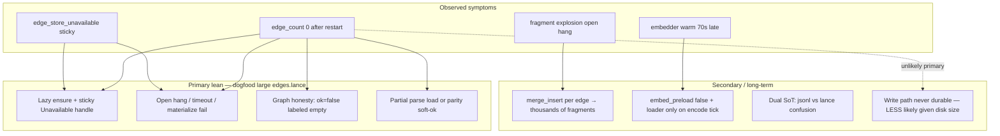

# Design: Warm-on-start — eager memory fabric + persistent hypergraph edges

| Field | Value |
|-------|--------|
| **Class** | DESIGN |
| **Document** | Warm-on-start: eager memory fabric (vector DB + EdgeStore + embedder) + durable hypergraph edges across restarts |
| **Product** | project-elyra |
| **Author** | design-doc-writer (Elyra) |
| **Audience** | Implementers (senior engineers who know presence/memory) |
| **Date** | 2026-08-06 |
| **Status** | **Draft** |
| **Revision** | **R2** (review round 2: KD-WARM-UX loader concurrency) |
| **Normative?** | Yes for product locks listed under **Key Decisions** once accepted |
| **Implementation branch** | **`fix/warm-on-start`** created from tip of **`fix/general-touchup1`** (not bare `working`) |
| **PR target** | Prefer **one branch, ordered commits, single PR** → `working` (stacked only if review requires); lineage: `fix/general-touchup1` → `fix/warm-on-start` → `working` |
| **Restack** | If `fix/general-touchup1` merges to `working` first, **rebase/retarget** `fix/warm-on-start` onto `working`. If not, merge touchup1 first or ship a single stack PR (touchup1 + warm-on-start). Do not leave warm-on-start based on a rewritten tip without restack. |
| **Repo** | `/home/jim/Workspace/project-elyra` |
| **Depends on** | `fix/general-touchup1` tip (includes `durable_edges_enabled` product default **on** @ `736a1a7`, Context plain text, etc.; **~12 commits ahead of `working`** at design time) |
| **Related designs** | [design-memory-edges-and-traversal.md](../../docs/design/memory/design-memory-edges-and-traversal.md), [design-memory-edges-polish1.md](../../docs/design/memory/design-memory-edges-polish1.md), [design-embed-async-encode-worker.md](../../docs/design/embed/design-embed-async-encode-worker.md), [design-phase-2-rectification.md](../../docs/design/memory/design-phase-2-rectification.md), [design-general-touchup1.md](../../docs/design/design-general-touchup1.md) |
| **Supersedes (defaults)** | Prior `embed_preload=false` product lean in [design-phase-2-rectification.md](../../docs/design/memory/design-phase-2-rectification.md) OQ-R5 / phase-2 impl — **this design flips product default to `true`** for warm-on-start |
| **Branch law** | [branch-law.md](../../docs/dev/branch-law.md) — short-lived `fix/*` lands on `working` |

> **Charter (one line):** *On process start, the memory fabric that makes Elyra useful — Lance atoms, durable EdgeStore, embedding index, and Nemotron embedder — is open and honest before chat tools pretend the graph is alive; edges written once survive every restart without daily force-backfill.*

---

## Overview

Dogfood on the operator host proved that **atoms** load eagerly (`lance load complete atoms=N` during worker start) while the **hypergraph EdgeStore**, **embedder**, and readiness signals remain **lazy or sticky-failed**. After restart, Graph reports `durable_edges_enabled=on`, `backend=lance`, but `edge_count=0` / EdgeStore empty — even when `data/memory/lance/edges.lance` is large (~348 MB, ~2900 data files / ~2905 versions). Force backfill can repopulate RAM for a session, then the next restart zeros counts again or surfaces random `edge_store_unavailable`. Separately, the Nemotron embedder often warms ~70 s **after** store open (first encode-worker tick as `role=loader`) because product default is `embed_preload=false`.

**Pinned root-cause lean (dogfood):** large durable `edges.lance` proves **writes largely landed**. Restart → Graph zero is **far more likely open/load/index/honesty** (lazy open, sticky `UnavailableEdgeStore`, materialize hang, Graph labeling `ok=false` as “empty”) than “edges never written.” Batch/compact still matter for long-term health; they are not the first explanation for zero counts.

This design makes the **required** memory fabric **eager and honest**:

1. **Startup sequence** opens atom store → embedding index → EdgeStore (single-flight), then starts **embedder load without indefinitely blocking first-hop claim** once store+edges are decided (KD-WARM-UX); publishes component readiness + aggregate `memory_ready`.
2. **Component readiness is independently usable** (`edges_ready`, `embedder_ready`, …); aggregate `memory_ready` is operator/Glass “fabric OK” only — **not** the sole consumer gate.
3. **Single SoT for edges** under atoms backend=lance: process ignores `edges.jsonl` for live fabric; Lance open/load/write/reopen must preserve counts.
4. **Persistence + Graph honesty first (P2)** before claiming durable-on usefulness after eager open (P1).
5. **Non-required** warm (Playwright, full MSB image pull, Grok Build seed) stays **async / non-blocking** (KD23 sandbox pattern preserved).

---

## Background & Motivation

### Why this change is needed

Elyra’s product value after Phase 2 / 2a is **atoms + vectors + durable edges + warm encode**. Operator product locks:

1. Everything related to **vector DB, hypergraph (durable edges), and embedding model** must load **on start** — no lazy first-use for these.
2. **Edges must persist across restarts.** Force backfill must not be a daily ritual.
3. **Nemotron embedder loads on start** — not minutes later on first encode / semantic hop.
4. Prefer **`memory_ready` honesty** over “chat green ⇒ memory fabric ready”; **component flags** remain usable independently.
5. **Single SoT for edges** with atoms backend Lance — no silent dual-write where jsonl edges are ignored by the Lance process.
6. Out of **required** eager set: Playwright, full MSB pull, Grok Build seed — do **not** block start.

### Code-backed lazy inventory (current state)

| Component | Today | Evidence |
|-----------|-------|----------|
| **Atoms Lance** | Eager on worker start via `_ensure_memory_store()` | `PresenceWorker.run` → `_ensure_memory_store()`; `LanceMemoryStore` logs `lance load complete atoms=N` (`elyra/memory/lance_store.py` ~L839) |
| **EmbeddingIndex** | Opened inside `_ensure_memory_store` via `_ensure_embedding_index()` | `worker.py` ~L1384, ~L1583–1604 |
| **Embedder** | **Lazy.** `_ensure_embedder(role=consumer)` never cold-loads; only `role=loader` (encode worker / `embed_preload`) calls `open_encoder`. Default **`embed_preload=false`**; **not** set in operator `elyra.toml` | `worker.py` ~L1465–1551; `config.py` `embed_preload: bool = False` |
| **EdgeStore** | **Lazy** on first Graph / backfill / promote / encode drain | `worker.py` ~L517–520, ~L1710–1742; `api.py` `_get_memory_graph` peeks via `_ensure_edge_store` |
| **Sticky soft-fail (real path)** | `open_edge_store(fail_soft=True)` returns **`UnavailableEdgeStore`** without raising; stored in `self._edge_store` → subsequent ensures return it because **`_edge_store is not None`**. `_edge_store_open_failed` only on rare exception path; also `_edge_store_open_attempted and self._edge_store is None` | `worker.py` `_ensure_edge_store`; `edges.py` `open_edge_store` |
| **Health counts** | `edge_count` = RAM `len(_by_id)`; **already** optional `disk_edge_count` / `edge_count_parity` when `count_rows` works — **Graph does not surface them**; can still return `ok=True` with `parity=False` | `edges.py` ~L1889–1920 |
| **Materialize** | `_materialize_edges_arrow` already raises on row-count mismatch; `_load` re-raises; **parse failures** silently `continue` | `edges.py` ~L1577–1680 |
| **Lance put** | Per-edge `merge_insert` | `edges.py` `_upsert_row` ~L1730–1737 → dogfood **~2904 data files**, **~2905 versions**, **~348 MB** `edges.lance` |
| **Dual storage** | `data/memory/edges.jsonl` (dogfood: **10** `in_moment`) vs large `edges.lance`; `backend=lance` **ignores jsonl** | `open_edge_store` branches on `settings.backend` only |
| **Graph honesty bug** | `edge_store_empty = edge_count == 0` **regardless of `edge_ok`** → Unavailable labeled “EdgeStore empty” | `api.py` `_get_memory_graph` ~L2049–2065; Glass “on · EdgeStore empty” |
| **Open fragility** | Live `edges.lance` has segfaulted/hung on open in local repros; Graph API can timeout on health peek | operator dogfood |
| **Backfill** | v1 `in_moment` only; restart → Graph edge_count 0 with durable on | `backfill_durable_edges` |
| **Deferred recalls / tray / sandbox** | Idle deferred recalls (v1); tray optional warm soft-fail (W5); sandbox async warm | polish1 / KD23 / KD-TRAY |

### Operator Graph after restart (paste — product failure)

- durable edges **on**, store **lance**, EdgeStore **empty**, edge_count **0**, edges by kind **none**
- After force backfill scan works in-process, then **restart zeros again**
- Random `edge_store_unavailable` (sticky Unavailable handle / failed open → process-life dead fabric)

### Root-cause classes (pinned lean + residual)



| Class | Likelihood for “restart → zero” | Notes |
|-------|----------------------------------|-------|
| **C1 sticky Unavailable / never eager open** | **High** | Soft-fail handle retained; Graph peeks zero |
| **C6 open hang / timeout** | **High** on fragment-heavy table | Matches dogfood open fragility |
| **C7 Graph empty mislabel** | **High** (UX/operator path) | Steers to force backfill even when unavailable |
| **C8 partial load / soft parity** | **Medium** | Silent parse skips; `ok=True` + `parity=False` |
| **C3 fragment explosion** | **High for hang risk**; secondary for zero-count if open eventually succeeds empty | Fix in P3; spike may need compact-before-open |
| **C2 writes never land** | **Low** as primary | ~348 MB / thousands of versions contradict pure non-durable writes |
| **C4 embedder late** | Confirmed for encode path | Separate from edge zero counts |
| **C5 dual SoT** | Operator confusion | Not why lance Graph is zero |

**P2 is not optional cosmetics.** Eager open alone will still show empty/unavailable Graph if open fails closed poorly, if Graph mislabels, or if load parity is soft. **Do not claim durable-on is useful until P2 acceptance passes** on non-trivial N and a restart checklist. Persist/open/honesty fixes are **ordered before** eager open of the live dogfood table (see PR Plan).

---

## Goals & Non-Goals

### Goals

1. **Eager open** of required fabric on presence worker start: atom MemoryStore, EmbeddingIndex, EdgeStore, embedder (when respective flags enable them) — with **single-flight** open and honest warming UX.
2. **Component readiness + aggregate**: consumers gate on **component flags**; `memory_ready` is aggregate honesty for Glass/CLI; distinct from `chat_ready`.
3. **Edge open/load honesty + reopen** for Lance: write → close → reopen → count parity; Graph empty vs unavailable vs parity; no daily force-backfill ritual.
4. **Single SoT**: when `memory.backend=lance`, live edges are **only** `data/memory/lance/edges.lance`.
5. **Embedder on start**: `embed_preload=true` (factory + `elyra.toml`); warm-path is sole start loader.
6. **Repair path**: force backfill only after EdgeStore healthy (`edges_ready`).
7. **Hermetic + live acceptance** for write/reopen and status; **P0.5 spike** classifies dogfood open failure mode.
8. **Branch law**: implement on `fix/warm-on-start` from `fix/general-touchup1` (+ restack note).

### Non-Goals

| Non-goal | Reason |
|----------|--------|
| Block API bind / `chat_ready` on fabric warm | API + chat posture independent (KD23 pattern for non-required; chat still binds) |
| Gate Graph durable expand on aggregate `memory_ready` when only embedder is down | Component gates (KD-GATE) |
| Block start on Playwright / full MSB / Grok Build | Not required fabric |
| Invent multi-backend dual-write (jsonl+lance) | Violates single SoT |
| Always-inline speak recalls | Product default deferred |
| Force tray load as start / `memory_ready` gate | Optional W5 |
| Full ANN / all vectors ready for `memory_ready` | KD-ANN |
| Auto-delete dogfood `edges.jsonl` | Leave file; no auto-delete (KD-SOT) |
| ROCm driver / torch install program | Assume dogfood env runs Nemotron |

---

## Proposed Design

### Architecture (target)

```mermaid
sequenceDiagram
  participant Sup as Supervisor.start
  participant API as API thread
  participant PW as PresenceWorker.run
  participant MS as MemoryStore Lance
  participant ES as EdgeStore Lance
  participant LT as EmbedderLoaderThread
  participant EW as EncodeWorker

  Sup->>Sup: sandbox host tree + async warm (non-block)
  Sup->>Sup: chat client / chat_ready
  Sup->>PW: start presence thread
  Sup->>API: start HTTP (binds before memory_ready)

  PW->>PW: _startup_recover
  PW->>PW: fabric_warming=true
  PW->>MS: _warm_memory_core store+index
  PW->>ES: eager EdgeStore single-flight
  ES-->>PW: ready or unavailable
  PW->>PW: publish core flags; fabric_core_ready
  PW->>LT: start sole loader thread (role=loader)
  Note over LT: open_encoder outside presence thread
  PW->>PW: _started=True; enter claim/poll IMMEDIATELY
  par Concurrent
    PW->>PW: claim moments; consumers use role=consumer
    LT->>LT: cold load Nemotron 1-3+ min
  end
  LT-->>PW: terminal warm or failed (callback / flag)
  PW->>EW: start encode worker only on terminal
  PW->>PW: publish memory_ready; warming=false if aggregate ok

  Note over API,PW: gates = edges_ready / embedder_ready not only memory_ready
```

### 1. Startup sequence (normative order)

#### 1.1 Ordered steps

| Step | Action | Thread | Blocks aggregate `memory_ready`? | Blocks first claim/hop? | Log |
|------|--------|--------|----------------------------------|-------------------------|-----|
| 0 | `_startup_recover()` | presence | No | Yes (brief) | existing recover logs |
| 1 | Set `memory.warming=true` | presence | No (warming) | — | `memory.fabric_warming start` |
| 2 | `_ensure_memory_store()` + index | presence | Yes if required and fails | **Yes** until store decided | `lance load complete atoms=N` |
| 3 | Eager `_ensure_edge_store()` under **edge single-flight lock** | presence | Yes if edges required | **Yes** until edges decided | `memory.edges.load_complete` / `open_failed` |
| 4 | Publish component flags (`store`, `index`, `edges_*`); `fabric_core_ready` | presence | — | — | partial fabric status |
| 5 | **Start sole embedder loader side thread** (if preload); do **not** join | presence kicks; **loader thread** runs `open_encoder` | Embedder still blocks aggregate while `loading` | **No** — presence does not await | `memory.embed.loader_thread_start` |
| 6 | **`_started=True`; enter claim/poll loop immediately** | presence | — | **Loop running now** | `memory.fabric_core_ready` / presence loop |
| 7 | On loader **terminal** (`warm` \| `failed`): start encode worker; publish aggregate `memory_ready`; clear `warming` when no longer loading | presence (callback / poll of terminal flag) or loader thread posts then presence applies | Aggregate may become true | No | `embedder_warm` / failed; `memory.fabric_ready`; encode_owner |

**Normative lock (KD-WARM-UX control flow):** After step 4, the **presence thread never awaits** full Nemotron cold load. Sync `_warm_embedder_loader()` **inline before** `while not self._stop` is **forbidden**.

**Supervisor** order remains:

1. `paths.ensure_data_dirs`
2. Sandbox host tree + **async** warm (KD23)
3. Credentials / chat client → `chat_ready` independent of memory
4. PresenceWorker thread + API server (API may bind before fabric ready)

#### 1.2 Warm UX (KD-WARM-UX) — first hop vs embedder

**Lock (product):** Warm **may delay first hop** for **store + EdgeStore** open (required core fabric). **Nemotron cold load must not** hold the presence claim loop for 1–3+ minutes after core is decided.

| Phase | `chat_ready` | API bind | Claim/moments | Durable Graph/promote | Semantic meal/ANN | Aggregate `memory_ready` |
|-------|--------------|----------|---------------|----------------------|-------------------|--------------------------|
| Process up, recover | maybe true | yes | no | no | no | false; `warming=true` |
| Store+edges ready, embedder loading **on side thread** | true | yes | **yes** | **yes** if `edges_ready` | omit encoder (`role=consumer` → None) | false; `warming=true` / `embedder.state=loading` |
| All required components ready | true | yes | yes | yes | yes if embedder warm | **true** |
| Edges failed, embedder warm | true | yes | yes | projected only / soft-skip writes | yes | **false** (`edges` degraded) |

**Glass / status copy (required):**

- Status field: `memory.warming` (bool) and/or phase string `memory_warming`.
- Glass: when `chat_ready && warming`, show **“memory warming — replies may wait or run without full fabric”** (not silent green).
- When `edges_ready && !embedder_ready && embed_enabled`: “edges ready · embedder loading — semantic hops deferred.”
- When `!edges_ready`: never “EdgeStore empty” alone if unavailable (see §2 Graph honesty).

**CLI:** `elyra status` (or equivalent status line) prints e.g. `memory: warming (store=ok edges=… embedder=loading)` / `memory: ready` / `memory: degraded (edges=unavailable)`.

#### 1.2.1 Implementable concurrency model (normative)

**Chosen model: side-thread sole start loader** (option 1). Weaker “loader only on first idle tick” is rejected as product default because it reintroduces the ~70 s dogfood gap under busy claim.

```python
# Pseudocode — PresenceWorker.run (KD-WARM-UX) — R2 normative shape
def run(self) -> None:
    _LOG.info("presence worker started")
    try:
        self._startup_recover()
        self._set_fabric_warming(True)
        self._warm_memory_core()  # store + index + edges ONLY (may block claim)
        # Publish core component flags; consumers may use edges_ready now.
        self._publish_core_ready()

        # Sole start loader: NOT on presence thread; do NOT join here.
        if self._should_preload_embedder():
            self._start_embedder_loader_thread()  # daemon or owned thread
        else:
            # embed off → aggregate can resolve without embedder
            self._on_embedder_loader_terminal(state="absent")

        self._started = True
        while not self._stop.is_set():
            # Claim/moments immediately; semantic paths see consumer None while loading
            ...
            # Optional: if loader finished mid-loop, apply once (idempotent)
            self._maybe_apply_embedder_loader_terminal()
        ...
    finally:
        self._join_embedder_loader_thread(timeout_s=...)
        self._shutdown_encode()
        ...

def _start_embedder_loader_thread(self) -> None:
    """Kick sole start loader. Uses existing embedder open lock / state machine.

    Only this path (or its completion) may call open_encoder at start.
    Encode worker is NOT started until terminal warm|failed.
    """
    def _target() -> None:
        try:
            # role=loader; existing guards: if loading, no double-open
            emb = self._ensure_embedder(role="loader")
            terminal = "warm" if emb is not None else "failed"
        except Exception:
            terminal = "failed"
        self._embedder_loader_terminal = terminal  # or queue/Event
        # Do not start EncodeWorker from this thread if that races presence —
        # set flag; presence applies via _maybe_apply_embedder_loader_terminal.
    t = threading.Thread(target=_target, name="elyra-embedder-loader", daemon=True)
    self._embedder_loader_thread = t
    t.start()

def _maybe_apply_embedder_loader_terminal(self) -> None:
    """Presence-thread join point: start encode worker + publish aggregate once."""
    if self._embedder_loader_applied:
        return
    term = getattr(self, "_embedder_loader_terminal", None)
    if term not in ("warm", "failed", "absent"):
        return
    self._embedder_loader_applied = True
    if term in ("warm", "failed") and self._should_run_encode_worker():
        self._start_encode_worker_if_needed()
    self._publish_memory_ready()  # aggregate from component flags
    # Clear warming when embedder no longer loading (and core done)
    if self._embedder_state != "loading":
        self._set_fabric_warming(False)
```

| Rule | Normative |
|------|-----------|
| Presence after core | **Immediately** `_started=True` and enter `while` claim/poll — **zero** await on Nemotron |
| Loader ownership | **One** start loader: dedicated **`elyra-embedder-loader`** thread calling `_ensure_embedder(role="loader")` |
| Single-flight embedder | Reuse existing `_embedder_open_lock` + `absent→loading→warm\|failed`; second loader (encode worker) must **not** run until terminal, so no concurrent `open_encoder` |
| Consumers during load | `role=consumer` only → None while `loading` / `absent` (existing); meal/graph omit encoder |
| Encode worker | **Only** after loader terminal `warm` or `failed` (or embed disabled → `absent` path) |
| Completion join point | Presence thread reads terminal flag each loop (or Event); **idempotent** apply once |
| Shutdown | `run()` finally joins loader thread (timeout) then existing encode/embedder teardown |
| Status | `memory_warming` / `embedder.state=loading` until terminal; then aggregate `memory_ready` |

**Alternate rejected as default:** starting encode worker before warm so its first tick is the loader — races claim with “owner=worker” bulk drain and still needs a non-blocking publish path; side-thread sole loader is clearer.

API continues to accept traffic throughout; **no second Lance open** from Graph (see §1.3). **No second `open_encoder`** from encode worker or API while start loader is `loading`.

#### 1.3 Single-flight EdgeStore open (KD-ES-LOCK)

Supervisor starts API immediately after the presence thread → Graph can call `_ensure_edge_store` **concurrently** with warm.

**Normative:**

- One **`_edge_store_open_lock`** (or shared fabric open lock) around the entire open/materialize path.
- States: see §4.2 state machine. While `opening`, other threads **wait** on the lock (bounded by `edge_open_timeout_s`) **or** return status-only `warming` without starting a second open.
- **Preferred API behavior during warm:** if state is `opening` / `warming`, Graph overview returns `edge_store.warming=true`, does **not** start a parallel open, and does **not** invent empty-fabric honesty.
- Only one thread ever constructs `LanceEdgeStore` / calls materialize for the process.

### 2. `memory_ready` / `chat_ready` / **component gates**

#### 2.1 Definitions

| Flag | Meaning | Source |
|------|---------|--------|
| **`chat_ready`** | Chat HTTP client usable | `RuntimeState.chat_ready` |
| **`memory_ready`** | **Aggregate** “fabric OK” for operator/Glass badge when all **required** components for current flags are ready | status / worker |
| **`memory.store_open` / `memory.ok`** | Atom store health | existing |
| **`memory.edges_ready`** | EdgeStore is a real backend handle (not Unavailable), `health.ok`, parity hard-fail not active | **New** |
| **`memory.embedder_ready`** | `embedder_state == "warm"` when `embed_enabled`; else N/A (treated as not required) | **New** |
| **`memory.index_ready`** | EmbeddingIndex handle present when store open | **New** |
| **`memory.warming`** | Core and/or embedder warm sequence not finished | **New** |

#### 2.2 Component gates for consumers (KD-GATE) — normative

**Consumers MUST gate on component readiness, not only aggregate `memory_ready`.**

| Consumer | Gate | Behavior when gate false |
|----------|------|---------------------------|
| Promote **edge writes** | `edges_ready` **and** `durable_edges_enabled` **and** store open | Soft-skip edge writes (existing soft-fail); log `edges_not_ready` / reason |
| Graph expand **durable** union | `edges_ready` | Projected structural (+ optional semantic_hop if embedder ready); honesty note |
| Force backfill POST | `edges_ready` (healthy real store) | Fail closed `edge_store_unavailable` / `edges_not_ready` — **not** “empty, try backfill” |
| Meal **semantic** select / ANN encode | `embedder_ready` (+ `index_ready` as today) | Omit encoder (existing consumer None); temporal/other meal continues |
| Traverse **semantic_hop** / long-path ANN | `embedder_ready` + wait policy | Soft-skip / structural-only honesty |
| Traverse structural / durable expand | `edges_ready` for durable kinds; store for atoms | Existing fail-closed on flags |
| Glass “fabric OK” badge | aggregate `memory_ready` | ready / warming / degraded |
| Encode bulk drain | `embedder_ready` (loader) | Soft skip tick if loading/failed |

**Anti-pattern (forbidden):** “if not `memory_ready` → hide durable Graph kinds” when `edges_ready` is true and only embedder failed/loading.

#### 2.3 `memory_ready` formula + truth table

**Required components** depend on flags:

```text
need_store   = memory.enabled OR memory.write_atoms
need_index   = need_store          # open-with-store; Null index OK for jsonl
need_edges   = need_store AND (durable_edges_enabled OR backend == "lance" OR backend == "jsonl" with durable_edges_enabled)
               # Read honesty: lance always opens edges table when store on (existing open independence).
               # If durable_edges_enabled=false and backend=lance: still need edges_ready for aggregate
               # when we want "read fabric OK"; see table rows below.
need_embed   = need_store AND embed_enabled

memory_ready =
  (not need_store)
  OR (
    store_open AND store.ok
    AND (not need_index OR index_ready)
    AND (not need_edges OR edges_ready)
    AND (not need_embed OR embedder_ready)
  )
```

| enabled/write_atoms | backend | durable_edges | embed_enabled | Gates aggregate `memory_ready` |
|---------------------|---------|---------------|---------------|--------------------------------|
| both false | * | * | * | none (ready=true) |
| on | jsonl | false | false | store + index |
| on | jsonl | **true** | false | store + index + **edges** |
| on | **lance** | false | false | store + index + **edges** (read open; writes off) |
| on | lance | **true** | false | store + index + edges |
| on | lance | true | **true** | store + index + edges + **embedder** |
| on | lance | false | true | store + index + edges + embedder |

**Rollback note:** `durable_edges_enabled=false` stops **writes** only; read-open still attempted on lance. If open fails, `edges_ready=false` → aggregate `memory_ready=false` while chat stays green. If open succeeds empty, `edges_ready=true` with empty healthy.

**Fail policy:** process **continues** if edges or embedder fail; component errors + `memory_ready=false`; log `memory.fabric_degraded`. Do **not** crash supervisor.

#### 2.4 Status API / Glass / Graph honesty (P2 for empty-vs-unavailable)

Extend `_memory_status_block()`:

```python
block = {
    "enabled": ...,
    "write_atoms": ...,
    "backend": ...,
    "store_open": self._memory is not None,
    "ok": ...,  # atom store health (existing)
    "memory_ready": bool,          # aggregate only
    "warming": bool,
    "edges": {
        "ready": bool,
        "open": bool,
        "ok": bool,
        "warming": bool,
        "backend": str | None,
        "edge_count": int,
        "disk_edge_count": int | None,   # already on LanceEdgeStore.health — surface
        "edge_count_parity": bool | None,
        "error": str | None,
        "state": "absent|opening|ready|unavailable",  # worker open SM
        "attempts": int,
        "next_retry_at": str | None,
    },
    "embedder": {
        "ready": bool,
        "state": "absent|loading|warm|failed",
        "preload": bool,
        "error": str | None,
    },
    "index": {"ready": bool},
    ...
}
```

**Graph overview honesty (land in P2 with health parity — not deferred to P4):**

Today: `edge_store_empty = edge_count == 0` even when `edge_ok is False` → **mislabel**.

| Condition | `edge_store.ok` | honesty note | Glass tone |
|-----------|-----------------|--------------|------------|
| ready, RAM=0, disk=0 | true | “no durable edges yet” (true empty) | empty fabric |
| unavailable / open failed | **false** | “edge store **unavailable** — not empty fabric; reason=…” | degraded; **do not** say empty |
| RAM=0, disk>0 (parity hard-fail) | false | **critical** “load parity failure — do not trust zero; do not backfill as empty” | critical |
| RAM≠disk, both >0 | false (KD-ES-PARITY) | “edge count parity mismatch RAM=… disk=…” | warn/degraded |
| warming / opening | — | “edge store opening…” | warming |

Surface existing `disk_edge_count` / `edge_count_parity` from `LanceEdgeStore.health()` immediately in Graph payload (`edge_store` object).

### 3. Embedder — factory + `embed_preload` + fail policy

| Item | Design |
|------|--------|
| **Config** | `MemorySettings.embed_preload` product default → **`True`** (supersedes phase-2 OQ-R5 false lean). Operator `elyra.toml` **must** pin `embed_preload = true` even if factory flips. |
| **Test churn (explicit)** | Update `tests/test_settings.py` (`assert s.memory.embed_preload is False` → True or explicit override); any worker/encode test that assumed cold start without setting the flag — set `embed_preload=False` or mock loader. Grep `embed_preload` under `tests/` and docs that state default false. |
| **Start path** | After `_warm_memory_core()`, **side-thread** sole loader calls `_ensure_embedder(role="loader")` (KD-WARM-UX §1.2.1). Presence **never** joins that load before the claim loop. |
| **Encode worker** | Starts **only** from loader **terminal** apply on presence thread (`warm` \| `failed`). While `loading`, encode worker is **not running**, so it cannot race a second `open_encoder`. Consumer paths still return None if somehow called mid-load. |
| **Single-flight embedder** | Same open lock/state machine as today (`absent` → `loading` → `warm` \| `failed`). Only the start loader thread performs cold open at boot. |
| **Fail policy** | Sticky failed state retained for process life (or bounded retry if product later wants); `embedder_ready=false`; aggregate may be false; process stays up. |
| **ROCm latency** | 1–3+ min cold load **on loader thread**; status `embedder.state=loading`; **claim loop already running** with edges. |
| **Factory** | Keep `open_encoder(mem_cfg)`; no new factory. |

### 4. EdgeStore — eager ensure, open state machine, Lance persist

#### 4.1 Eager ensure

- Call `_ensure_edge_store()` from `_warm_memory_core` (not only Graph/promote).
- Open independent of `durable_edges_enabled` for **read** (existing).
- Writes still gate on `durable_edges_enabled` **and** `edges_ready`.

#### 4.2 Open state machine + sticky-fail retry (KD-ES-RETRY)

**Today’s bug:** soft-fail stores `UnavailableEdgeStore` in `_edge_store`; ensure returns it forever because `is not None`. Clearing only `_edge_store_open_failed` is insufficient.

**Normative worker open state:**

```text
absent
  → opening          # holds _edge_store_open_lock; single-flight
  → ready            # real JsonlEdgeStore | LanceEdgeStore; edges_ready=true
  → unavailable      # reason, attempts, next_retry_at; handle is Unavailable OR null
```

| Transition | Rules |
|------------|-------|
| `absent → opening` | Only one thread; set state before calling `open_edge_store` |
| `opening → ready` | Non-Unavailable handle; clear failed flags; `attempts` keep for metrics; `edges_ready=true` |
| `opening → unavailable` | fail_soft path **or** exception: set `reason`, increment `attempts`, schedule `next_retry_at`; **do not** treat Unavailable as ready |
| `unavailable → opening` | Retry only if `attempts < edge_open_max_retries` **and** reason is **transient** **and** `now >= next_retry_at` **and** caller is warm/idle/explicit repair |
| `ready` sticky | Until close/shutdown |

**On retry attempt (critical):**

1. If `isinstance(self._edge_store, UnavailableEdgeStore)`: set `self._edge_store = None` **before** re-open.
2. Reset `_edge_store_open_attempted` **or** replace with state machine so “attempted + None” does not block retry.
3. Clear `_edge_store_open_failed` only on success; on permanent fail leave unavailable.

**Permanent vs transient reasons:**

| Reason class | Examples | Retry? |
|--------------|----------|--------|
| **Permanent** | `ImportError` / lancedb missing; unknown backend misconfig that won’t change | **No** |
| **Transient** | timeout, materialize temporary IO, lock contention | **Yes** (bounded) |
| **Integrity** | RAM=0 & disk>0 after open; parity hard-fail | **No** auto-retry loop without compact/quarantine; may offer explicit repair |

**Backoff:** e.g. 5s / 30s / 120s; max attempts default **3** (`edge_open_max_retries`).

**fail_soft factory:** `open_edge_store(..., fail_soft=True)` still returns Unavailable on failure; worker maps that into `unavailable` state and **must not** leave it as an immortal ready-looking handle. Prefer storing Unavailable only inside unavailable state, or null + reason string (either OK if `edges_ready` checks isinstance).

#### 4.3 Lance load / materialize safety + **normative health.ok** (KD-ES-PARITY)

**Existing hooks (do not reinvent):** `_materialize_edges_arrow` row-count checks; `health()` already computes `disk_edge_count` / `edge_count_parity` when `count_rows` works. **P2 closes honesty/fail-closed gaps** around these hooks (Graph surface, hard-fail when RAM=0/disk>0, load_complete log, open timeout, sticky Unavailable, fragment scale).

**Normative open + health table:**

| Condition after load | Open result | `health.ok` | `edges_ready` | Honesty |
|----------------------|-------------|-------------|---------------|---------|
| disk=0, RAM=0 | **ready** empty store | **true** | true | empty healthy |
| disk>0, RAM=0 | **fail** → Unavailable (or raise if fail_soft=False) | **false** | false | load parity failure — **not** empty |
| disk≠RAM, both >0 | **ready degraded** (serve RAM) **or** hard Unavailable — **pick: ready degraded with ok=false** | **false** | **false** until repaired *or* true with loud parity warn — **R1 lock: `ok=false`, `edges_ready=false` if mismatch >0** so Graph cannot claim full fabric | parity mismatch critical |
| disk=RAM=N>0 | ready | true | true | normal |
| materialize exception | Unavailable | false | false | unavailable |

**R1 lock for partial parse (0 < RAM < disk):** treat as **parity mismatch** → `health.ok=false`, `edges_ready=false` (prefer not silent half-graph). Optional later: serve RAM with degraded flag only if operator sets `edge_allow_partial_load=true` (default **false**).

**Logs:** `memory.edges.load_complete edges=%d disk=%s parity=%s backend=%s`.

#### 4.4 Write path: fragment explosion + durable put

Dogfood: **~2904** data files, **~2905** versions, **~348 MB** — per-row `merge_insert` explosion. **Secondary** for zero-count primary lean; **primary** for open hang risk and future growth.

| Slice | Change | Merge-blocking? |
|-------|--------|-----------------|
| **W2a reopen contract** | Hermetic put N → close → open → count N + parity | **Yes (P2)** |
| **W2b batch upsert** | `put_edges_batch` single merge_insert/add for many rows | **Yes (P3)** |
| **W2c backfill/promote batch** | Use batch on multi-edge paths | **Yes (P3)** |
| **W2d compact** | Best-effort coalesce | **No** — fallbacks below |
| **W2e open timeout + quarantine** | Deadline + operator quarantine | **Yes (P2/P3)** |

**Write durability contract:** put updates Lance then RAM; never success if only RAM; close flushes batch; reopen materializes with parity rules above.

**Subprocess reopen** preferred for at least one acceptance test if CI cost allows (OQ-W3 lean yes).

#### 4.5 Compact / fragment heuristic + fallbacks (P3)

**Ordered fallbacks (P3):**

1. **Batch write** (merge-blocking) — stop growth.
2. **`compact_files` / table optimize** if available on installed lancedb — best-effort smoke.
3. **Offline rebuild CLI** (export rows → new table) if in-process compact missing.
4. **Quarantine** copy of `edges.lance` (lance-debug1 scripts) + empty table last resort.

**Initial heuristics (implementable):**

| Signal | Threshold (initial) | Action |
|--------|---------------------|--------|
| Lance `_versions` file count or table version count | **> 500** | warn log; optional `edge_compact_on_open=auto` → try compact |
| `edges.lance/data` file count | **> 500** | same |
| Dogfood known ~2900 | exceeds | compact or quarantine before relying on eager open for pin |

**Open timeout enforcement:**

- Config `edge_open_timeout_s` default **120**.
- Enforce with a **worker-side deadline** around open/materialize (thread + join with timeout, or monotonic deadline checks between steps). On exceed → map to Unavailable `reason=edge_open_timeout`.
- **Native hang/segfault** may ignore Python deadlines — document: operator **quarantine** remains the escape; optional future subprocess open probe.

#### 4.6 Single SoT (KD-SOT)

| Backend | Edge SoT | `edges.jsonl` |
|---------|----------|---------------|
| lance | `data/memory/lance/edges.lance` only | **Ignored**; **do not auto-delete**; leave dogfood 10-line file; optional migrate CLI later; optional operator archive/delete to reduce confusion |
| jsonl | `edges.jsonl` | Primary |

**Do not** silently read jsonl when lance is empty.

### 5. Embedding index

- Keep open-with-store.
- `index_ready = handle is not None`.
- `memory_ready` does **not** require `ann_index_built` / full `vectors_ready`.

### 6. Persistence acceptance tests + dogfood spike

#### 6.1 P0.5 / P2 spike (mandatory class pin)

Before claiming P2 “done” for dogfood:

| Step | Action |
|------|--------|
| 1 | Copy or open operator `edges.lance` (quarantine-safe copy preferred) |
| 2 | Record: open wall time, `count_rows`, RAM `len(_by_id)`, parity, exception class, hang vs Unavailable vs empty-ok |
| 3 | Classify failure into C1/C6/C7/C8/C3… |
| 4 | Lock P2 code fixes to that class (timeout, hard-fail RAM=0/disk>0, Graph honesty, compact-before-open, etc.) |

Hermetic fragment-heavy fixture optional if copy is too large for CI — then spike is operator-local with recorded notes in STATE.

#### 6.2 Hermetic tests

| Test | Contract |
|------|----------|
| `test_lance_edge_write_close_reopen_count` | put ≥50 → close → open → count + parity |
| `test_lance_edge_batch_write_reopen` | batch ≥200 → reopen (P3) |
| `test_lance_edge_ram0_disk_positive_unavailable` | force disk>0 RAM=0 path → Unavailable, not ok empty |
| `test_lance_edge_parity_mismatch_not_ok` | health.ok false when parity false |
| `test_graph_honesty_unavailable_not_empty` | API/Graph notes unavailable ≠ empty |
| `test_edge_ensure_single_flight` | concurrent ensure does not double-open |
| `test_unavailable_cleared_on_retry` | Unavailable handle nulled; retry can succeed |
| `test_component_gates_edges_without_embedder` | edges_ready true, embedder failed → durable expand still uses edges; memory_ready false |
| `test_warm_core_allows_claim_before_embedder` | After core, claim/poll runs **while** loader still `loading` (loader not joined on presence thread); `embedder_ready` false until terminal |
| `test_backfill_requires_edges_ready` | Unavailable → written=0 |

#### 6.3 Live dogfood checklist

1. Spike class recorded (P0.5).
2. Start pin; status shows `memory_warming` then component readiness; CLI line honest.
3. Graph: pre-restart edge counts reappear **without** force backfill when open succeeds.
4. No “empty” label when unavailable or parity-fail.
5. Embedder warm without 70 s post-core gap; first hop may complete with edges before embedder if KD-WARM-UX.
6. Promote new edges → restart → present.
7. `edges.jsonl` may remain; Graph does not claim those rows under lance; **optional** operator archive — **no auto-delete**.

### 7. Repair path

| Path | When | Behavior |
|------|------|----------|
| Force backfill | `edges_ready` and coverage incomplete | v1 in_moment; repair only |
| Blocked backfill | not `edges_ready` | error; UI “repair requires healthy EdgeStore” |
| Compact / rebuild CLI | fragment pathology | P3 fallbacks |
| Quarantine | segfault / unopenable | lance-debug1 |

**Product rule:** restart zeros ⇒ **open/load/honesty bug**, not automate backfill on every start.

### 8. Deferred recalls + tray (W5)

Unchanged product defaults:

| Surface | v1 warm-on-start | Gate? |
|---------|------------------|-------|
| **Speak `recalls`** | Deferred (idle-tick drain under semantic wait). **No drain-at-start** required for v1. | N/A — not a fabric component |
| **Directed-keep tray** | **Optional** one-shot `ensure_tray` during `_warm_memory_core`; **soft fail** (log + continue). Lazy first-meal load remains. | **Never** — not in `memory_ready` / component flags (KD-TRAY) |

Do **not** flip product default to inline speak ANN; do **not** treat tray load failure as fabric degraded.

---

## API / Interface Changes

| Surface | Change | Slice |
|---------|--------|-------|
| `GET /api/status` memory block | `memory_ready`, `warming`, component objects | P2 skeleton + P4 aggregate polish |
| `GET /api/memory/graph` | empty vs unavailable vs parity; surface `disk_edge_count` / parity; `edges_ready`; warming | **P2** |
| `POST .../edges/backfill` | reject unless `edges_ready` | P2 |
| Vectors | align embedder_state | P1/P4 |
| CLI status line | `memory: warming|ready|degraded …` | P4 (minimal P2 text OK) |

### Config

```toml
[memory]
backend = "lance"
durable_edges_enabled = true
embed_enabled = true
embed_backend = "nemotron"
embed_preload = true
# edge_open_timeout_s = 120
# edge_open_max_retries = 3
# edge_compact_on_open = "auto"  # false | true | auto
# edge_fragment_warn_threshold = 500
```

| Knob | Default | Notes |
|------|---------|-------|
| `embed_preload` | **true** | Supersedes prior false default; tests override |
| `edge_open_timeout_s` | 120 | Worker-side deadline |
| `edge_open_max_retries` | 3 | Transient only |
| `edge_fragment_warn_threshold` | 500 | versions or data files |
| `edge_compact_on_open` | false / auto | Best-effort |
| `edge_allow_partial_load` | false | Default hard on parity mismatch |

### Python interfaces

```python
# edges.py — additive
def put_edges_batch(self, edges: Sequence[DurableEdge]) -> list[DurableEdge]: ...
def compact(self) -> dict[str, Any]: ...  # best-effort; may return ok=False unsupported

# worker.py
def _warm_memory_core(self) -> None: ...
def _start_embedder_loader_thread(self) -> None: ...  # sole start loader; no join before poll
def _maybe_apply_embedder_loader_terminal(self) -> None: ...  # encode worker + memory_ready once
def _ensure_edge_store(self) -> Any | None: ...  # state machine + single-flight lock
```

---

## Data Model Changes

- No DurableEdge schema change.
- On-disk fragment reduction via batch + optional compact.
- No automatic jsonl migration or deletion.

---

## Alternatives Considered

### A1 — Lazy edges + retry only

**Reject** for required eager set.

### A2 — Fully async fabric warm (daemon) like sandbox

**Partial accept:** API/chat non-block; **core store+edges** still decided on presence thread before claim (stronger than pure daemon); **embedder** loads on a **side thread** while claim runs (KD-WARM-UX §1.2.1). Pure “everything async including edges” rejected for first durable hop races.

### A3 — Dual-read jsonl fallback

**Reject** (KD-SOT).

### A4 — Rebuild edges from atoms every start

**Reject** as default; manual repair only.

### A5 — Replace Lance edges with sqlite

**Defer** unless open/compaction intractable after P3.

---

## Security & Privacy Considerations

| Topic | Notes |
|-------|-------|
| Threat model | Local operator process |
| Auth | Unchanged; backfill dev-gated |
| Integrity | Empty-when-disk>0 and empty-mislabel of unavailable are **critical** honesty failures |
| DoS | Open timeout + quarantine |

---

## Observability

| Event | Example |
|-------|---------|
| Warming | `memory.fabric_warming start` / `core_ready` / `fabric_ready` |
| Edge load | `memory.edges.load_complete edges=%d disk=%s parity=%s` |
| Edge open fail | `memory.edges.open_failed reason=%s state=unavailable` |
| Edge retry | `memory.edges.open_retry attempt=%d/%d cleared_unavailable=1` |
| Single-flight | `memory.edges.open_wait` (debug) when API waits on lock |
| Embedder | existing warm / failed |
| Compact | `memory.edges.compact …` or `unsupported` |

Alerting: disk>0 & RAM=0; unavailable mislabeled empty (regression test); open timeout storms.

---

## Rollout Plan

1. **P0 docs** + **P0.5 spike** on dogfood table class.
2. **P2** reopen/parity/Graph honesty/single-flight/state machine — **before** claiming durable-on usefulness; **before** eager open of live pathological table when possible.
3. **P1** eager open + embed preload on warm path (depends on P2 hermetic green).
4. **P3** batch (merge-blocking) + compact best-effort + timeout knobs if not in P2.
5. **P4** full aggregate badge/CLI polish.
6. **P5** tray/recalls notes.

**Rollback:** `embed_preload=false`; `durable_edges_enabled=false` stops writes (read-open still; aggregate may stay false on open fail); quarantine `edges.lance`; git revert.

**Start latency:** store+edges seconds–minutes; embedder 1–3+ min **after** claim may already run.

---

## Risks

| Risk | Severity | Mitigation |
|------|----------|------------|
| First hop delayed by store+edges open | Medium | Honest `memory_warming`; API bound; KD-WARM-UX |
| Embedder 1–3+ min | Medium | Do not block claim after core; component flags |
| Eager open hang on 2900-fragment table | High | P2/P3/timeout/quarantine **before** dogfood pin eager |
| Silent empty / empty mislabel | **Critical** | Parity hard-fail; Graph P2 honesty |
| Sticky Unavailable immortal handle | High | State machine clears handle on retry |
| Dual open race API vs warm | High | Single-flight lock |
| OOM store+model | High | Core then embedder sequential; monitor RSS |
| Dual SoT confusion | Medium | KD-SOT; leave jsonl; no auto-delete |
| Test default embed_preload churn | Low | Explicit test list |

---

## Key Decisions

| ID | Decision | Rationale |
|----|----------|-----------|
| **KD-BR** | Branch `fix/warm-on-start` from `fix/general-touchup1`; restack onto `working` if touchup1 merges first. | Extends touchup1; branch law. |
| **KD-EAGER** | Eager store + index + edges + embedder (when flags on). | Operator lock. |
| **KD-GATE** | **Consumers gate on component readiness** (`edges_ready`, `embedder_ready`, …). Aggregate `memory_ready` is Glass/CLI fabric-OK only. | Healthy edges must work if embedder fails. |
| **KD-MR** | `memory_ready` ≠ `chat_ready`; process stays up on fabric fail. | Honesty. |
| **KD-MR-COMPONENTS** | Aggregate requires all **flag-required** components (truth table §2.3). | Dogfood full fabric. |
| **KD-WARM-UX** | Block claim only through **store+edges** on presence thread; then **enter claim loop immediately**; Nemotron sole start loader on **side thread** (never join before `while`); encode worker only on loader terminal; status/CLI `memory_warming`; API binds early. | Avoid multi-minute silent chat green; implementable concurrency. |
| **KD-EP** | `embed_preload=true` factory + toml; **one** start loader thread (`role=loader`); encode worker only after terminal warm/failed; consumers `role=consumer` while loading. | Closes 70 s gap; no double `open_encoder`. |
| **KD-ES-EAGER** | Eager edge ensure on warm core. | Operator lock. |
| **KD-ES-LOCK** | Single-flight open lock; API must not dual-open. | Supervisor starts API concurrent with presence. |
| **KD-ES-RETRY** | State machine `absent|opening|ready|unavailable`; **null Unavailable handle on retry**; permanent vs transient. | Real sticky path is soft-fail handle. |
| **KD-ES-PARITY** | disk>0 & RAM=0 → Unavailable; parity mismatch → `ok=false`, not ready (default). | No false empty fabric. |
| **KD-SOT** | Lance edges only in `edges.lance`; no jsonl fallback; **no auto-delete** of leftover jsonl. | Dogfood clarity. |
| **KD-PERSIST** | Survive restart without force backfill; **no durable-on usefulness claim until P2**. | Primary product failure. |
| **KD-ROOT** | Zero-count primary lean: **open/load/honesty**, not non-durable writes (disk evidence). | Directs P2 spike. |
| **KD-BATCH** | Batch writes merge-blocking in P3; compact best-effort with fallbacks. | Fragment growth. |
| **KD-ANN** | No full ANN for ready aggregate. | Async encode. |
| **KD-NONREQ** | Playwright / MSB / Grok Build out of gate. | KD23. |
| **KD-RECALLS** / **KD-TRAY** | Deferred default; tray optional non-gating. | polish1. |

---

## Open Questions

| ID | Question | Lean |
|----|----------|------|
| **OQ-W1** | Parallel edge materialize + embedder on two threads? | **No** for core: edges stay on presence before claim. **Yes** for embedder only: side-thread loader concurrent with claim (KD-WARM-UX R2) |
| **OQ-W2** | Exact Lance compact API on installed version? | Spike in P3; **batch is merge-blocking** if compact missing |
| **OQ-W3** | Subprocess reopen in CI? | Prefer ≥1 if cost OK |
| **OQ-W4** | Factory `embed_preload=True` vs toml-only? | **Factory True** + toml pin + test updates |

---

## PR Plan

**Branch:** `fix/warm-on-start` from tip of `fix/general-touchup1`.  
**Integration:** ordered commits; single PR → `working` preferred.  
**Restack:** if touchup1 merges first → rebase warm-on-start onto `working`.

### Slices (reordered — P2 behavior before P1 eager)

| Slice | Title | Scope | Acceptance |
|-------|-------|-------|------------|
| **P0** | `docs(memory): warm-on-start design + inventory` | Design/STATE; root-cause lean; no behavior change | Doc only |
| **P0.5** | `spike(memory): dogfood edges.lance open class` | Open copy of operator table; record time/counts/parity/failure class | Written class pin (C1/C6/…) in STATE/notes |
| **P2** | `fix(memory): edge reopen/parity/honesty + open SM + single-flight` | **First behavior slice.** Reopen tests; hard-fail RAM=0/disk>0; health.ok rules; Graph empty vs unavailable vs parity (**surface existing disk/parity fields**); open state machine clears Unavailable on retry; single-flight lock; optional open timeout. **Do not claim durable-on useful until this passes** on non-trivial N + restart checklist. | Hermetic reopen + honesty tests green; Graph never labels unavailable as empty |
| **P1** | `fix(memory): eager EdgeStore + embed_preload warm path` | `_warm_memory_core`; **side-thread** sole loader; claim loop immediately after core; `embed_preload` default+toml+**test churn**; status `warming` / components; encode worker on loader terminal only | `test_warm_core_allows_claim_before_embedder`; component gate test; dogfood pin only after P2/P3 as needed |
| **P3** | `fix(memory): edge batch upsert + compact fallbacks` | `put_edges_batch` **merge-blocking**; backfill uses batch; compact best-effort + CLI/quarantine fallbacks; fragment heuristic ≥500 | Batch tests; compact smoke **or** documented unsupported + fallback |
| **P4** | `feat(memory): memory_ready aggregate + CLI/Glass badge polish` | Full aggregate formula wiring; CLI line; Glass fabric badge polish (honesty already in P2) | Status contract; chat_ready independent |
| **P5** | `chore(memory): tray optional warm + recalls notes` | Optional tray; checklist | Soft fail tray |

### Suggested commit order

```text
P0  docs
P0.5 spike (operator / fixture notes)
P2  reopen + parity + Graph honesty + open SM + single-flight   ← first behavior; durable-on claim
P1  eager open + embed_preload + warm UX
P3  batch (merge-block) + compact best-effort
P4  aggregate memory_ready / CLI polish
P5  tray/recalls
```

### Out-of-order / dogfood pin rules

- **Do not** land P1 eager open on live pathological `edges.lance` without P2 green and either compact/quarantine or proven open time.
- **Do not** claim Gate B / durable-on usefulness after eager-only.
- Develop P1 against clean temp dirs in hermetic tests regardless.

### Dependencies on general-touchup1

- `durable_edges_enabled=True` already on tip — warm-on-start makes restart survival real.
- Do not re-litigate Gate B flag default.

---

## Implementation anchors (quick reference)

| Area | Path |
|------|------|
| Worker ensure / sticky | `elyra/presence/worker.py` — `_ensure_edge_store` (Unavailable retained), `_ensure_memory_store`, `_ensure_embedder`, `run` |
| Edge store | `elyra/memory/edges.py` — `LanceEdgeStore`, `_materialize_edges_arrow` (**existing** parity raise), `health` **existing** `disk_edge_count`/`edge_count_parity`, `open_edge_store(fail_soft=True)`, `UnavailableEdgeStore` |
| Graph mislabel | `elyra/runtime/api.py` `_get_memory_graph` `edge_store_empty = edge_count == 0` |
| Config | `elyra/memory/config.py` `embed_preload=False` today |
| Supervisor race | `elyra/runtime/supervisor.py` presence thread then `start_api_server` |
| Settings test | `tests/test_settings.py` assert embed_preload False |
| Dogfood | `data/memory/lance/edges.lance` ~348 MB / ~2904 files; `edges.jsonl` 10 lines leave in place |

---

## References

- Operator product locks + review R1 operator locks (component gates, P2 early, Unavailable clear, warm UX, Graph honesty with P2, root-cause lean, single-flight)
- [docs/dev/branch-law.md](../../docs/dev/branch-law.md)
- Related designs listed in header
- Code anchors above

---

## Revision Summary

| Rev | Date | Notes |
|-----|------|-------|
| R0 | 2026-08-06 | Initial draft |
| R1 | 2026-08-06 | Review round 1: component gates (KD-GATE); PR order P2 before P1 + P0.5 spike; Unavailable state machine + clear handle; KD-WARM-UX claim-after-core intent; Graph honesty in P2; root-cause lean open/load; single-flight lock; health.ok table; memory_ready truth table; batch merge-block / compact fallbacks; existing parity hooks reframed; embed_preload test churn + supersession; sole start loader; jsonl no auto-delete; restack note; timeout/fragment heuristics |
| R2 | 2026-08-06 | Review round 2: **KD-WARM-UX implementable concurrency** — side-thread sole embedder loader; presence enters claim loop immediately after `_warm_memory_core` (no sync join on Nemotron); encode worker only on loader terminal apply; sequence diagram + §1.2.1 + §3 + tests/PR1 aligned |
