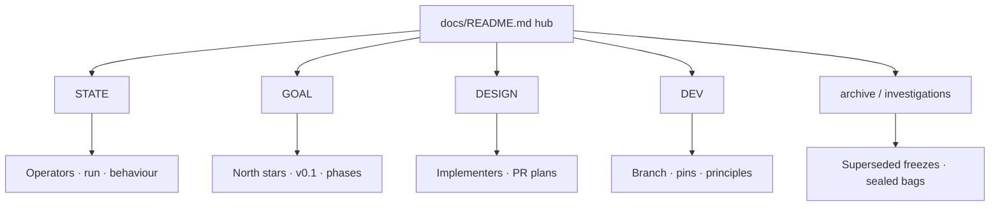
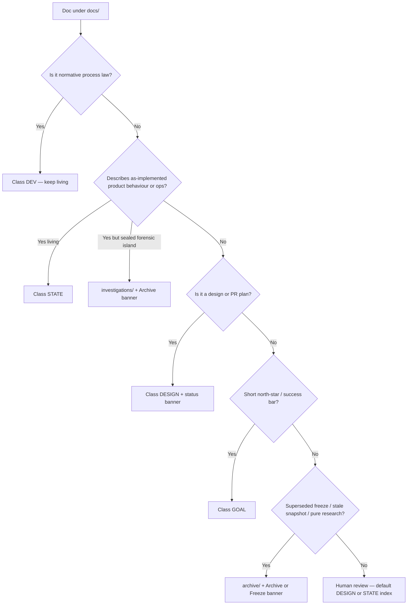

# Design: Reorganise Project Elyra documentation (STATE / GOAL / DESIGN / DEV)

| Field | Value |
|-------|--------|
| **Document** | Docs taxonomy reorg — STATE / GOAL / DESIGN·PLAN / DEV |
| **Author** | design skill (Elyra) |
| **Date** | 2026-08-04 |
| **Status** | Active (execution via #121 PR0+; design consensus 2026-08-04 → Shipped when reorg complete) |
| **Product** | project-elyra |
| **Repo** | [jtwolfe/project-elyra](https://github.com/jtwolfe/project-elyra) |
| **Issue** | [#121](https://github.com/jtwolfe/project-elyra/issues/121) `docs: reorg taxonomy STATE / GOAL / DESIGN / DEV` |
| **Branch** | `chore/docs-reorg` (base `working`) |
| **Label** | `backlog` (not `v0.1-gate`) |
| **Landing path (execution)** | `docs/design/docs-reorg-taxonomy.md` (this design; see KD1) |
| **Related** | [../dev/engineering-principles.md](../dev/engineering-principles.md) §9 (structure) · **§10 (docs taxonomy)**, [../dev/branch-law.md](../dev/branch-law.md), [../dev/operating-pins.md](../dev/operating-pins.md), [../README.md](../README.md), root [README.md](../../README.md), [../promotion-discussion/](../promotion-discussion/), Project #2 draft *Refactor docs structure* (converted) |
| **Integration tip** | `working` (normative; branch-law) |

---

## Overview

Project Elyra’s `docs/` tree (~118 markdown files) is a **chronological shelf** plus topic islands. Root-level `design-*.md` files (~20), `stretch-2/` designs and architecture manuals, investigation packages (`lance-debug1/`, `meal-continuity-review/`, `radeon-vii-dev/`), and process law (`branch-law`, `operating-pins`, `engineering-principles`) sit side-by-side with living operator docs. `docs/README.md` is a mixed “Read in this order” list that forces humans and Grok Build to re-discover class, audience, and supersession on every visit.

This design specifies a **non-destructive, hub-first reorganisation** into four document classes — **STATE**, **GOAL**, **DESIGN / PLAN**, **DEV** — with clear archival rules, a standard status-banner schema, a near-full inventory classification, a phased PR plan, and a concrete **STATE content plan** to close the main gap (architecture-as-implemented beyond the root README).

**Hub first, moves second.** Phase 0 rewrites `docs/README.md` as a four-class hub *without* mass `git mv`. Later PRs move files by class, fix links, place this design under DESIGN, and add taxonomy rules to engineering principles. History is preserved (archive / investigations / banners — never silent delete).

---

## Background & Motivation

### Current state

| Surface | Role today | Pain |
|---------|------------|------|
| Root `README.md` | Best **STATE** overview (vision, honest limits, harness diagram, run) | Thin on deep functional behaviour; links into a flat docs soup |
| `docs/README.md` | Chronological index + run/test snippets | Mixed audiences; supersession buried mid-page; hard for agents to route |
| Flat `docs/design-*.md` (~20) | Designs + PR plans | No status index; shipped vs active vs superseded only in body text |
| `docs/stretch-2/` | Phase designs + **architecture/** manuals + inspiration + investigation | Architecture (STATE) co-located with designs (DESIGN); island-style |
| `docs/grok-improvement-plan/` | GI migration phases + operator pacing notes | Part GOAL/history, part STATE operator notes |
| `docs/promotion-discussion/` | v0.1 / gym + governance | GOAL mixed with DEV governance |
| `docs/lance-debug1/`, meal-continuity-review, `radeon-vii-dev/` (pre-reorg) | Investigation / HW dogfood islands | Valuable archaeology; not living product law |
| `docs/archive/` | Early research notes | Correct pattern; under-used |
| DEV law | `engineering-principles.md`, `branch-law.md`, `operating-pins.md` at docs root | Not grouped; easy to miss as process class |

### Inventory snapshot (re-done 2026-08-04)

```text
~118 markdown files under docs/
  archive/                 3 md   (oldest cluster; already archival)
  design-*.md (docs root) 20 md   (flat dump)
  grok-improvement-plan/   7 md
  lance-debug1/           34 md   (sealed investigation)
  promotion-discussion/    2 md
  radeon-vii-dev/          7 md + freezes/*.txt
  stretch-2/              30 md   (designs + architecture + meal review)
  docs root other         ~15 md  (stretch-1, tools, principles, pins, bugs, …)
```

**Age is not the primary signal.** Clusters with oldest mtimes (`archive/`, Gemma freezes, early GI) often *are* archival — but supersession, role, and sealed-evidence status matter more. Newest files (`operating-pins`, `branch-law`, `engineering-principles` §9, `known-bugs`, `design-v0.1-ready-board-recategorization`, `tools-and-skills`) are living DEV/STATE/DESIGN and must not be archived by age.

### Why now

- Issue **#121** / Project #2 converted draft: taxonomy agreed; branch `chore/docs-reorg` open; **backlog** (process quality, not packaging gate).
- Grok Build and multi-party dogfood need **deterministic routing**: operator → STATE; product north star → GOAL; implementer → DESIGN; Jamie/agents → DEV.
- Root README already teaches “prefer code on `working`” — docs should reinforce that with class + banner, not a single chronological list.

---

## Goals & Non-Goals

### Goals

1. **Four-class taxonomy** documented and enforced by hub layout + (later) folder layout.
2. **Non-destructive** — no deletes of development history; archive/investigate/banner instead.
3. **Hub-first** — `docs/README.md` becomes the four-class hub before mass moves.
4. **Inventory-driven** — every substantial doc classified with action (keep/index, move, banner, archive-candidate, rewrite).
5. **STATE investment** — at least one architecture-as-implemented entry beyond root README (stub acceptable in early PR if linked honestly).
6. **DEV separated** from STATE (process law ≠ product behaviour).
7. **GOAL short, DESIGN long** — no dual full designs in GOAL.
8. **This design lands under DESIGN** during execution; hubs link it.
9. **Phased, independently reviewable PRs.**
10. **Engineering principles** gain a docs taxonomy / freeze-supersede section in a **later** PR (not blocking hub).

### Non-goals

- Mass rewrite of every design body in one PR.
- Deleting design history or sealed investigation bags.
- Elevating this work to `v0.1-gate`.
- Product code changes (except tests that pin moved doc paths).
- Perfect rename of every historical “Branch: `grok-improvement`” string inside freeze bodies.
- Unifying `scripts/live_eval/` or `memory-atoms.pdf` into a new format (links + class only).

---

## Taxonomy (authoritative)

| Class | Audience | Contents | Living? |
|-------|----------|----------|---------|
| **STATE** | Users / operators | As-implemented architecture and functional behaviour; run/deploy; honest limits; known bugs; dogfood checklists that describe *current* ops | Yes — prefer code on `working` |
| **GOAL** | Product direction | Programme goals, phase north stars, v0.1 claim — *what* and *why*, success bars | Yes but **short**; link to DESIGN |
| **DESIGN / PLAN** | Implementers | Designs and PR plans; freeze / shipped / superseded banners; preserve history | Frozen or active; history kept |
| **DEV** | Jamie + Grok Build | Engineering principles, branch-law, operating pins, issue+branch workflow, board hygiene | Yes — normative process |

**Conflict rule (hub + all living docs):** code on `working` > STATE > GOAL prose. DESIGN freezes are archaeology unless Status is Active. DEV wins for tip/branch/pin law (`branch-law.md`).



---

## Proposed Design

### 1. Target folder layout

Concrete target after full migration (PR1–PR5). Intermediate PRs may leave files in place while the hub already points by class.

```text
docs/
  README.md                          # four-class hub (always first)

  state/                             # STATE — living product behaviour
    README.md                        # STATE index
    architecture.md                  # NEW: deep as-implemented map (main gap)
    stretch-1.md                     # runtime contract (KEEP basename; OQ1/KD13)
    overview.md                      # glossary + big picture (retouch)
    tools-and-skills.md
    time-and-identity.md
    inference.md                     # NEW or rewritten Grok path (not Gemma freeze)
    known-bugs.md
    grok-build-dogfood.md            # operator checklist for current instrument
    usage-and-pacing.md              # from GI usage-tracking operator notes
    sandbox-fitness-checklist.md     # NEW short extract from harness H6 (ops only)
    memory/                          # as-implemented memory manuals
      README.md                      # from stretch-2/README.md (status tables kept)
      architecture/
        phase-1-temporal.md
        phase-2-semantic.md
        phase-2a-directed-traversal.md
        # spikes/* → design/memory/spikes/ (pre-ship spike notes are DESIGN)
    radeon-vii/                      # STATE subset: operator start path only
      README.md                      # run/session notes (not freezes)
      NOTES-DOGFOOD.md
      VENV-ROCM-SWITCH.md
      STACK-INVENTORY.md

  goal/                              # GOAL — short north stars
    README.md
    programme.md                     # long-term anthropomorphic / product claim
    v0.1.md                          # packaging cut claim + success bars (short)
    v0.1-discussion.md               # long form from promotion-discussion/README.md
    stretch-2-north-star.md          # phase goals only; link designs
    grok-improvement-phases.md       # short phase map; detail stays DESIGN
    philosophical-soft-guidance.md   # influences only (explicit non-deliverable)

  design/                            # DESIGN / PLAN
    README.md                        # status-indexed catalog
    docs-reorg-taxonomy.md           # THIS design (execution landing)
    # Topic clusters (preserve filenames where useful for git history):
    stretch-1/
      design-stretch-1-implementation.md
      design-continuous-work-orient-ledger-reset.md
      design-post-skill-commitment.md
      design-tool-thrash-recovery.md
      design-gemma-sampling-hygiene-staged.md   # Superseded freeze
      design-remove-gemma-local-stub.md
    identity/
      design-identity-self-other-multi-user.md
    glass/
      design-glass-aurimago-gold-polish.md
      design-glass-multimodal-attachments.md
    capability/
      design-capability-growth-search-browse-vcs-secrets.md
      design-capability-growth-implementation-plan.md
      design-capability-integrity-run-search-browser-sandbox.md
      design-guest-package-stage-reliability.md
      harness-sandbox-fitness.md      # full H1–H6 design+plan (from GI); Shipped
    grok-build/
      design-grok-build-tool.md
      design-grok-build-tool-summary.md
      design-grok-build-functionalization.md
      grok-build-headless-spike.md
    usage/
      design-usage-tracking-supergrok-pacing.md
      design-xai-oauth-browser-login.md
    board/
      design-v0.1-ready-board-recategorization.md
    embed/
      design-embed-async-encode-worker.md
    memory/                          # stretch-2 designs (NOT architecture manuals)
      design-phase-1-temporal.md
      design-phase-1-implementation.md
      design-phase-1-remaining-pr8-pr9.md
      design-phase-2-semantic.md
      design-phase-2-implementation.md
      design-phase-2-rectification.md
      design-phase-2a-directed-traversal.md
      design-phase-2a-implementation.md
      design-phase-3-procedural.md
      design-context-meal-composition.md   # DESIGN only (provisional; KD14)
      design-database-choices.md
      design-nemotron-runtime.md
      design-episodic-summary-ladder-llm.md
      design-instance-continuity-glass-tail-directed-keep.md
      design-instance-continuity-implement-plan.md
      design-instance-continuity-product-implement.md
      design-meal-formation-continuity-review-plan.md
      inspiration-activity-model-and-storage.md
      design-rocm-venv-gpu-embed-smoke.md  # from radeon-vii-dev (pure design)
      spikes/                        # from stretch-2/architecture/spikes/
        lance-emb-migration.md
        nemotron-runtime.md
    grok-improvement-plan/           # phase designs / execution freezes (PR2c)
      phase-0.md
      phase-0-execution.md
      stage-b-mc.md
      metacognition.md

  dev/                               # DEV — how we work
    README.md
    engineering-principles.md
    branch-law.md
    operating-pins.md
    development-governance.md        # from promotion-discussion/
    known-bugs-BRANCHES.md           # historical fix-branch map (banner Archive)

  archive/                           # long-term non-law history
    README.md                        # index + criteria pointer
    reflection-memory-and-lineage.md
    reflection-moments-and-memory-scope.md
    project-status-pass.md           # stale status snapshot (candidate)
    inference-gemma-llama.md         # current inference.md body if split
    live-eval-gemma.md               # current live-eval.md if retired
    ...

  investigations/                    # sealed forensic / HW islands (not product law)
    README.md
    lance-debug1/                    # git mv whole tree; update SCRIPTS pin + help strings
    meal-continuity-review/          # from stretch-2/
    radeon-vii-freezes/              # freezes/*.txt + stack freezes
    # radeon-vii living operator notes stay under state/radeon-vii/

  memory-atoms.pdf                   # philosophy reference — link from GOAL + STATE
```

**Layout principles**

| Rule | Detail |
|------|--------|
| **Class folders at `docs/{state,goal,design,dev}`** | One level of class; topic subfolders under DESIGN only |
| **Keep investigation trees intact** | `git mv docs/lance-debug1 docs/investigations/lance-debug1` as a unit |
| **Architecture ≠ design** | Phase manuals `stretch-2/architecture/phase-*.md` → `state/memory/architecture/`; spike notes → `design/memory/spikes/` |
| **No dual homes** | A file lives in **exactly one** class folder; hub indexes by class (KD14 dual-home table is authoritative) |
| **Redirect stubs optional** | Prefer updating links in same PR; stubs only for high-traffic paths if a PR must split |
| **stretch-1 basename** | Target is **`docs/state/stretch-1.md`** (not `runtime-contract.md`) — OQ1/KD13 |

### 2. Document status banner schema

Every substantial doc (especially DESIGN, archive candidates, and freezes) gets a **metadata table** near the top. Living STATE/DEV may use a shorter form.

#### Canonical statuses

| Status | Meaning | Typical class |
|--------|---------|---------------|
| **Active** | Normative for ongoing work; still being executed against | DESIGN (in flight), DEV law, STATE living |
| **Shipped** | Implemented; keep as contract or archaeology of decisions | DESIGN after merge; STATE runtime contracts |
| **Superseded** | Replaced by a named successor; do not follow for new work | DESIGN, old GOAL maps |
| **Freeze** | Historical procedure / setup frozen in place; do not bulk-edit; not setup law | DESIGN / archive |
| **Archive** | Research / snapshot / sealed bag; not build law | archive/, investigations/ |
| **Draft** | Not yet approved for execution | DESIGN only |

#### Banner template (markdown)

```markdown
| Field | Value |
|-------|--------|
| **Class** | STATE \| GOAL \| DESIGN \| DEV \| ARCHIVE \| INVESTIGATION |
| **Status** | Active \| Shipped \| Superseded \| Freeze \| Archive \| Draft |
| **Audience** | Operators \| Product \| Implementers \| Jamie+Grok Build |
| **Normative?** | Yes \| No — prefer code on `working` when conflict |
| **Successor** | path or issue (required if Superseded) |
| **Supersedes** | path (optional) |
| **Last verified** | YYYY-MM-DD (STATE/DEV living docs) |
| **Related** | links |
```

**One-line callout** immediately under the H1 for non-Active / non-living:

```markdown
> **Status: Superseded / Freeze / Archive** — do not follow for product setup.
> Successor: [docs/state/…](…). Prefer code on `working`.
```

**Rules**

- Superseded **must** name a successor (doc path or “removed from product; see root README”).
- Freeze bodies are not bulk-rewritten in reorg PRs (aligns with remove-gemma KD7 precedent).
- STATE docs: Status is usually **Active** (living); runtime contracts may be **Shipped** with “still law for behaviour.”
- Hub indexes include Status column for DESIGN catalog.

### 3. Archival criteria and decision tree

Age alone is **insufficient**. Apply in order:



#### Archive / investigation candidates (criteria)

| Criterion | Action | Examples |
|-----------|--------|----------|
| Explicitly superseded setup path | Freeze banner + archive move (or leave in design/ with Freeze) | `inference.md` Gemma/llama, `design-gemma-sampling-hygiene-staged.md` |
| Superseded tip/process prose already warned | Banner; keep in place until DEV move; do not teach as law | GI README tip table |
| Sealed evidence bag; product fix landed | `investigations/` + Archive banner; do not rewrite sealed JSON | `lance-debug1/` |
| Investigation island post-ship | `investigations/` | `investigations/meal-continuity-review/` |
| Status snapshot superseded by board/code | Archive candidate | `project-status-pass.md` (2026-07-26, still names `grok-improvement` tip) |
| HW freezes / pip freezes | `investigations/radeon-vii-freezes/` or keep under radeon tree with Archive | `investigations/radeon-vii-freezes/*` |
| Early research folded into Stretch 1 | Already `archive/` | reflection-*.md |
| Long-unupdated but still sole description of shipped behaviour | **Do not archive** — promote to STATE or banner Shipped | stretch-1 runtime contract |
| Active design / open implementation | DESIGN Active — never archive by age | grok-build functionalization, board recategorization |

**Prefer** `archive/` or `investigations/` + banner **over delete**.

### 4. Inventory classification matrix

Actions: **keep/index-only** | **move** | **banner** | **archive-candidate** | **rewrite** | **new**.

Grouped by current location. Paths are current unless noted.

#### 4.1 Hub and root entry

| Path | Class | Action | Notes |
|------|-------|--------|-------|
| `docs/README.md` | Hub | **rewrite** | Four-class hub; drop chronological “Read in this order” as primary |
| Root `README.md` | STATE entry (outside docs/) | **retouch** (later PR) | Keep as best operator entry; point to `docs/state/` + hub; do not duplicate GOAL essays |

#### 4.2 Living operator / behaviour (→ STATE)

| Path | Class | Action | Notes |
|------|-------|--------|-------|
| `docs/stretch-1.md` | STATE | **move** → **`docs/state/stretch-1.md`** (keep basename; KD13) + **banner** Shipped | Still law for behaviour; update `test_stretch1_donewhen.py` same PR |
| `docs/tools-and-skills.md` | STATE | **move** → `state/tools-and-skills.md` | Living catalog; shipped capability growth |
| `docs/time-and-identity.md` | STATE | **move** → `state/time-and-identity.md` | Life-shell rules |
| `docs/overview.md` | STATE (+ light GOAL) | **move** + light **retouch** | Glossary stays STATE; vision blurb can link GOAL |
| `docs/known-bugs.md` | STATE | **move** → `state/known-bugs.md` | Operator/implementer backlog surface |
| `docs/grok-build-dogfood.md` | STATE | **move** → `state/grok-build-dogfood.md` | Operator checklist (current instrument) |
| `docs/grok-improvement-plan/usage-tracking-supergrok-pacing.md` | STATE | **move** → `state/usage-and-pacing.md` | Operator notes only; full design stays DESIGN |
| `docs/stretch-2/architecture/phase-*.md` | STATE | **move** → `state/memory/architecture/` | Post-implement manuals only (not spikes) |
| `docs/stretch-2/README.md` | STATE index | **move** → `state/memory/README.md` | Phase status tables are as-implemented honesty |
| `docs/radeon-vii-dev/README.md` + NOTES/VENV/STACK | STATE (HW ops) | **move** → `state/radeon-vii/` | Freezes → investigations; design-rocm → DESIGN |
| New `state/sandbox-fitness-checklist.md` | STATE | **new** (extract) | Short operator smoke from harness H6 only — full body stays DESIGN (KD14) |
| `docs/memory-atoms.pdf` | GOAL/STATE ref | **keep** at `docs/memory-atoms.pdf` | Philosophy; link from both |

#### 4.3 Process law (→ DEV)

| Path | Class | Action | Notes |
|------|-------|--------|-------|
| `docs/dev/engineering-principles.md` | DEV | **move** + **§10 taxonomy** (PR6) | §9 structure; §10 freeze/supersede/class rules |
| `docs/dev/branch-law.md` | DEV | **move** | Normative tip law |
| `docs/dev/operating-pins.md` | DEV | **move** | Manual pin convention |
| `docs/dev/development-governance.md` | DEV | **move** | Multi-party governance; tip supersession already noted |
| `docs/dev/known-bugs-BRANCHES.md` | DEV / Archive | **move** + **banner** Archive | Historical fix-stack map; not current tip law |

#### 4.4 Product direction (→ GOAL)

| Path | Class | Action | Notes |
|------|-------|--------|-------|
| `docs/promotion-discussion/README.md` | GOAL | **split** (KD14): (1) **new** short `goal/v0.1.md` success bars; (2) **move** long README → `goal/v0.1-discussion.md` | One home for long form; short claim is entry |
| `docs/stretch-2/philosophical-soft-guidance.md` | GOAL | **move** → `goal/philosophical-soft-guidance.md` | Explicit non-deliverable influences |
| `docs/stretch-2/inspiration-activity-model-and-storage.md` | DESIGN | **move** → `design/memory/` (PR2b) | Planning baseline; not short GOAL; single home |
| New `goal/programme.md` | GOAL | **new** | Distill root README vision + anthropomorphic north star |
| New `goal/stretch-2-north-star.md` | GOAL | **new** (short) | Phase goals only; link STATE architecture + DESIGN |
| `docs/grok-improvement-plan/README.md` | GOAL (short) + history | **retouch** + optional extract → `goal/grok-improvement-phases.md` | Phase design bodies leave via PR2c; README becomes short index or GOAL extract |

#### 4.5 Designs at docs root (→ DESIGN)

| Path | Status (assessed) | Action |
|------|-------------------|--------|
| `design-stretch-1-implementation.md` | Shipped | move + banner |
| `design-continuous-work-orient-ledger-reset.md` | Shipped (mostly) | move + banner |
| `design-post-skill-commitment.md` | Shipped / historical | move + banner |
| `design-tool-thrash-recovery.md` | Shipped / historical | move + banner |
| `design-gemma-sampling-hygiene-staged.md` | **Superseded / Freeze** | move + banner; archive-candidate body stay |
| `design-remove-gemma-local-stub.md` | Shipped | move + banner |
| `design-identity-self-other-multi-user.md` | Shipped | move + banner |
| `design-glass-aurimago-gold-polish.md` | Shipped | move + banner |
| `design-glass-multimodal-attachments.md` | Active / next stack | move + banner Active or Shipped-as-of |
| `design-capability-growth-search-browse-vcs-secrets.md` | Shipped | move + banner |
| `design-capability-growth-implementation-plan.md` | Shipped | move + banner |
| `design-capability-integrity-run-search-browser-sandbox.md` | Draft/shipped mix | move + status honesty |
| `design-guest-package-stage-reliability.md` | Draft/shipped mix | move + status honesty |
| `design-usage-tracking-supergrok-pacing.md` | Shipped-ish | move + banner |
| `design-xai-oauth-browser-login.md` | Proposed / Active | move + banner |
| `design-grok-build-tool.md` | Active / implemented stack | move + banner |
| `design-grok-build-tool-summary.md` | Active summary | move |
| `design-grok-build-functionalization.md` | Draft / Active | move + banner |
| `design-embed-async-encode-worker.md` | Implemented (residuals open) | move + banner |
| `design-v0.1-ready-board-recategorization.md` | Approved / board ops | move + banner |
| `grok-build-headless-spike.md` | Spike / Archive-leaning | move under design/grok-build + banner |

#### 4.6 stretch-2 designs (→ DESIGN); architecture already STATE above

| Path | Class | Action | PR |
|------|-------|--------|-----|
| `stretch-2/design-*.md` (**17 files**, all) | DESIGN | **move** → `design/memory/` + banners; fix links to `architecture/` (→ `../../state/memory/architecture/` after PR4, or hub paths mid-migration) | **PR2b** |
| `stretch-2/design-context-meal-composition.md` | DESIGN | **move** → `design/memory/` only — **not** STATE (provisional design; KD14) | **PR2b** |
| `stretch-2/inspiration-activity-model-and-storage.md` | DESIGN | **move** → `design/memory/` | **PR2b** |
| `stretch-2/architecture/spikes/*` | DESIGN | **move** → `design/memory/spikes/` | **PR2b** |
| `stretch-2/architecture/phase-*.md` | STATE | **move** → `state/memory/architecture/` | **PR4** |
| `stretch-2/meal-continuity-review/**` | INVESTIGATION | **move** → `investigations/meal-continuity-review/` + Archive banner | **PR5** |

#### 4.7 grok-improvement-plan (split) — resolved defaults (KD14)

| Path | Class | Action | PR |
|------|-------|--------|-----|
| `README.md` | GOAL index + history | **retouch**; optional short extract to `goal/grok-improvement-phases.md` | PR3 |
| `phase-0.md`, `phase-0-execution.md` | DESIGN / Freeze | **move** → `design/grok-improvement-plan/` + banners | **PR2c** |
| `stage-b-mc.md`, `metacognition.md` | DESIGN / Shipped | **move** → `design/grok-improvement-plan/` + banners | **PR2c** |
| `usage-tracking-supergrok-pacing.md` | STATE | **move** → `state/usage-and-pacing.md` | PR4 |
| `harness-sandbox-fitness.md` | **DESIGN** (Shipped) | **move** → `design/capability/harness-sandbox-fitness.md` — full H1–H6 design+PR plan stays DESIGN; **new** short `state/sandbox-fitness-checklist.md` extracts operator smoke only | **PR2c** + PR4 extract |
| `docs/radeon-vii-dev/design-rocm-venv-gpu-embed-smoke.md` | DESIGN | **move** → `design/memory/design-rocm-venv-gpu-embed-smoke.md` + banner | **PR2c** |

#### 4.7a Dual-home resolution table (authoritative — KD14)

| Ambiguous path | Canonical home | Not home | Rationale |
|----------------|----------------|----------|-----------|
| `harness-sandbox-fitness.md` | `design/capability/` (full body, Status Shipped) | STATE full copy | File is H1–H6 design + PR plan; STATE gets short checklist extract only |
| `design-context-meal-composition.md` | `design/memory/` (Status: provisional / Active or Shipped-as-provisional) | `state/.../meal-composition.md` | Percentages not product law; architecture manuals link to design |
| `inspiration-activity-model-and-storage.md` | `design/memory/` | GOAL | Baseline constraints for implementers, not a short north star |
| `promotion-discussion/README.md` | short → `goal/v0.1.md` (new); long → `goal/v0.1-discussion.md` (move) | DESIGN; dual GOAL full designs | OQ3 default; PR3 explicit |
| `stretch-2/architecture/spikes/*` | `design/memory/spikes/` | STATE architecture | Spike notes are pre/ship archaeology of design choices |
| `stretch-1.md` | `state/stretch-1.md` (basename kept) | `state/runtime-contract.md` | KD13 / OQ1 |

#### 4.8 Archive & investigations

| Path | Class | Action |
|------|-------|--------|
| `docs/archive/*` | ARCHIVE | **keep**; expand README with criteria |
| `docs/project-status-pass.md` | ARCHIVE | **archive** → `archive/project-status-pass.md` — stale tip names; supersede with board + root README |
| `docs/inference.md` | Freeze | **banner** already present; **archive-candidate** move to `archive/inference-gemma-llama.md` **after** STATE Grok inference page exists; **tests pin path** — update or leave stub |
| `docs/live-eval.md` | Freeze / Archive | **archive-candidate**; protocol idea reusable; Gemma stages not setup law |
| `docs/lance-debug1/**` | INVESTIGATION | **move** whole tree → `investigations/lance-debug1/`; sealed bag; product fix outside package |
| `docs/radeon-vii-dev/freezes/**` | INVESTIGATION | **move** freezes → `investigations/radeon-vii-freezes/`; keep operator README in STATE |

#### 4.9 This design

| Path | Class | Action |
|------|-------|--------|
| (this document) | DESIGN | **new** at `docs/design/docs-reorg-taxonomy.md` during execution PR0/PR1 |

### 5. Migration / link-fix strategy

#### Principles

1. **Hub first** — no mass moves until hub classifies current paths.
2. **`git mv` only** for renames (history preserved).
3. **Same-PR link fix** for every moved file (no “fix links later” orphans).
4. **Root README** updated in the PR that moves any path it cites.
5. **Tests that pin paths** updated in the same PR as the move.
6. **Relative links** inside moved clusters: fix with a scripted check, not by hand alone.

#### Known path pins (must co-change)

| Consumer | Path pinned | Kind | Migration note | PR |
|----------|-------------|------|----------------|-----|
| `tests/test_stretch1_donewhen.py` | `docs/inference.md`, `docs/stretch-1.md` | **Content assert** (`read_text` + string checks) | Update paths to `docs/state/stretch-1.md` (and STATE Grok inference or archive path for inference); or temporary stubs retaining required strings | PR4 / PR5 |
| `tests/test_stretch1_donewhen.py` | Root `README.md` content | Content assert | No move; content retouch only | PR7 / retouch |
| `tests/test_live_grok_build.py` | design / dogfood / spike paths | Docstring refs | Update comments when files move | PR2 / PR4 |
| `tests/test_lance_debug1_api_matrix_fixture.py` | **`SCRIPTS = REPO_ROOT / "docs" / "lance-debug1" / "scripts"`** (and derived `API_MATRIX`, `BUILD_FIXTURE`, …) | **Runtime path constant** (CI-breaking) | Must co-change to `docs/investigations/lance-debug1/scripts` when tree moves — not docstring-only | **PR5 mandatory** |
| `docs/investigations/lance-debug1/scripts/*.py` | `docs/investigations/lance-debug1/...` in usage/help strings | Operator help (non-evidence) | **OK to update** help strings after tree move; **do not** rewrite sealed `evidence/**` JSON or run notes | PR5 |
| `skills/bundled/github-workflow/SKILL.md` | `docs/dev/engineering-principles.md` §9, `docs/dev/branch-law.md`, `docs/dev/operating-pins.md` | Agent-facing law | **Must update in PR1** to `docs/dev/...` (agents follow this skill) | **PR1 mandatory** |
| `skills/bundled/self-improve/SKILL.md` | `docs/dev/branch-law.md` | Agent-facing law | **Must update in PR1** to `docs/dev/branch-law.md` | **PR1 mandatory** |
| `scripts/live_eval/README.md` | historical design / live-eval links | Docs | Update in archive PR | PR5 |
| Root README “Further reading” table | multiple `docs/*` | Docs | Update per PR that moves rows | each move PR |
| Hub `docs/README.md` | class links | Docs | Update every move PR | each |

**Sealed-bag boundary (KD12 refined):** under `lance-debug1/` (and after move under `investigations/lance-debug1/`):

| May change in reorg PRs | Must not change |
|-------------------------|-----------------|
| Package README banner / path pointers | Sealed `evidence/**` JSON and sealed run notes content |
| Test `SCRIPTS` constant and fixture imports | Rewriting historical hypothesis/evidence tables as “new truth” |
| Script **usage/help** path strings in `scripts/*.py` | Product fix designs outside the bag (already landed) |

#### Link-fix procedure (per move PR)

```bash
# 1. git mv files
# 2. ripgrep for old basenames / paths from repo root (exclude .venv, data, sandboxes)
rg -n 'docs/stretch-1\.md|docs/branch-law\.md|docs/engineering-principles\.md|docs/operating-pins\.md|docs/investigations/lance-debug1' \
  --glob '!sandboxes/**' --glob '!.venv/**' --glob '!data/**'
# 3. Fix: markdown links + skill bodies + test path constants + script help strings
# 4. Optional: python scripts/check_docs_links.py (add in later PR if valuable)
# 5. pytest -m 'not llm and not live_grok'  # includes stretch1_donewhen + lance_debug1 fixture
```

#### Stub policy (only if needed)

If a high-traffic path must remain for an intermediate PR:

```markdown
# Moved

> This document moved to [`docs/state/stretch-1.md`](state/stretch-1.md).
```

Prefer **avoiding stubs** by completing link fix in the same PR. Stubs that keep freeze test strings for `inference.md` are allowed temporarily (see KD6).

#### Hub structure (target `docs/README.md`)

```markdown
# Project Elyra — documentation

Four classes. Prefer **code on `working`** over stale prose.

| Class | For | Start here |
|-------|-----|------------|
| **STATE** | Operators / users | [state/README.md](state/README.md) · root README |
| **GOAL** | Product direction | [goal/README.md](goal/README.md) |
| **DESIGN** | Implementers | [design/README.md](design/README.md) |
| **DEV** | Jamie + Grok Build | [dev/README.md](../dev/README.md) |
| Archive / investigations | Archaeology | [archive/](archive/) · [investigations/](investigations/) |

## Quick links (living)
… STATE run, known-bugs, tools-and-skills …

## Conflict rules
… stretch-1 / runtime contract, branch-law, freeze list …
```

Until folders exist, hub sections link **current** paths with a Class column.

**Phase 0 hub rule:** class folders other than `docs/design/` (required for KD1) are **optional**. If created, stub indexes (`state|goal|dev/README.md`) must link **pre-move current paths only** and must **not** imply files already live under those folders. Do not `git mv` in PR0.

### 6. STATE content plan

**Gap:** root README is the best entry but thin on deep functional behaviour. Stretch-2 architecture manuals are good but buried; tools/identity are strong; inference is a Gemma freeze.

| Deliverable | Source material | Work type | PR |
|-------------|-----------------|-----------|-----|
| `state/README.md` | New index | **new** | PR4 (or optional stub in PR0 linking current paths only) |
| `state/architecture.md` | Root README harness diagram + stretch-1 + stretch-2 architecture manuals + **live `ls elyra/` package inventory** | **new** (primary investment) | PR4 |
| Runtime contract | `stretch-1.md` → `state/stretch-1.md` | **move** + banner | PR4 |
| Tools / identity / known-bugs / dogfood | existing | **move** | PR4 |
| Grok inference / usage | GI usage notes + root README inference section | **rewrite** short STATE page; archive Gemma freeze | PR4 / PR5 |
| Memory architecture manuals | `stretch-2/architecture/phase-*.md` | **move** | PR4 |
| Memory phase honesty | `stretch-2/README.md` | **move** / retouch tip names | PR4 |
| Sandbox fitness (ops only) | Extract H6 checklist from harness design | **new** short page | PR4 (after PR2c moves full design) |

**`state/architecture.md` outline (new)**

1. Process topology (`elyra start` → API/glass → PresenceWorker → moment/do-loop).
2. Package map (`elyra/*` domains) with one-line roles — **author from live tree**: `ls elyra/` + root README harness diagram. **Do not copy `engineering-principles.md` §1 “Suggested layout” verbatim** — that sketch still mentions llama client/server launch and omits shipped packages (`instrument/`, `media/`, `memory/`, `secrets/`, `runtime/`, …). Treat principles §1 as historical sketch only.
3. Data layout under `ELYRA_HOME` / `data/` (messages, moments, memory, identity, secrets, runtime).
4. Memory regimes as **implemented** (flags default-off honesty for semantic).
5. Tools/skills/sandbox boundary.
6. Inference product path (Grok) + pointers to usage pacing.
7. Honest limits table (link `known-bugs.md`, stretch-2 close-outs).
8. “Prefer code” rule + link to DEV branch-law.

**Do not** duplicate full design PR stacks into STATE. Link DESIGN for archaeology.

### 7. Where THIS design lands and self-organisation

| Item | Path / action |
|------|----------------|
| This design (source of truth for reorg) | `docs/design/docs-reorg-taxonomy.md` |
| Class | DESIGN / PLAN |
| Status | Active until reorg complete → then Shipped |
| Hub | DESIGN catalog row + issue #121 |
| Execution branch | `chore/docs-reorg` → PRs into `working` |
| Self-organisation | Every execution PR: (1) place new/moved files in taxonomy paths, (2) update class hubs, (3) set banners, (4) never leave a second full copy in GOAL |

PR0 may land this file temporarily at `docs/design-docs-reorg-taxonomy.md` **only if** `docs/design/` does not yet exist; first move PR creates `docs/design/` and `git mv`s it to the final path. Prefer creating `docs/design/` in the same PR that lands the design (KD1).

### 8. Rollout phases (match PR Plan)

| Phase | Name | Destructive? | Review focus |
|-------|------|--------------|--------------|
| **0** | Design land + hub rewrite | No | Taxonomy correctness; hub navigability; **no mass moves** |
| **1** | DEV folder + skill path pins | Moves DEV + skill edits | Process docs findable; skills point at `docs/dev/` |
| **2** | DESIGN catalog + root `design-*.md` topic folders | Moves | Status banners; sibling-link procedure; prefer after PR1 |
| **2b** | stretch-2 designs (17) + spikes → `design/memory/` | Moves | Physical KD4 split (designs out of stretch-2) |
| **2c** | GI phase designs + harness + design-rocm → DESIGN | Moves | Complete remaining DESIGN corpus |
| **3** | GOAL short docs + promotion/GI maps | Mostly new/short + moves | Short GOAL; long discussion one home |
| **4** | STATE moves + architecture.md + checklist extract | Moves + new STATE | Path pins/tests; operator value |
| **5** | Archive + investigations | Moves | Sealed bags intact; SCRIPTS constant; banners |
| **6** | Engineering principles taxonomy § | Edit DEV | Freeze/supersede rules (acceptance complete) |
| **7** | Sweep + board card dispose + close | Retouch | No broken critical links; #121 closed |

Phases may be combined only when a single PR stays reviewable (&lt; ~soft limit of ~40 files touch preferred; investigation tree moves may be one PR alone). **Do not skip PR2b/PR2c** — without them KD4 physical split is incomplete.

### Risks

| Risk | Severity | Mitigation |
|------|----------|------------|
| Broken relative links after mass `git mv` | **High** | Hub-first; per-PR `rg` audit; pytest path pins same PR; PR2 sibling-link procedure |
| Tests fail on moved `stretch-1.md` / `inference.md` | **High** | Co-change `test_stretch1_donewhen.py`; temporary stubs if needed |
| Lance fixture CI break on tree move | **High** | PR5 co-changes `SCRIPTS` constant (not docstring-only) |
| Skills still teach old DEV paths | **High** | PR1 mandatory skill updates (`github-workflow`, `self-improve`) |
| Operators lose “read in this order” | **Med** | Hub Quick links + root README still primary onboarding |
| Dual content (GOAL/STATE full design + DESIGN) | **Med** | KD3 + KD14 dual-home table; GOAL max ~1–2 screens |
| Premature archive of living docs | **Med** | Decision tree; human review list in PR description |
| Investigation move breaks local operator habits | **Low** | Whole-tree `git mv`; investigations README maps old→new; update script help |
| Scope creep into freeze body rewrites | **Med** | Non-goal; banners only; sealed evidence untouched |
| Branch drift vs `working` | **Low** | Restack per branch-law; small PRs |
| Incomplete DESIGN corpus after PR2 only | **High** | Explicit PR2b + PR2c for stretch-2 designs, GI phases, design-rocm |

---

## API / Interface Changes

None. Documentation and test path strings only.

---

## Data Model Changes

None in product data stores. **Folder model** is the schema:

| Old pattern | New pattern |
|-------------|-------------|
| Flat `docs/design-*.md` | `docs/design/<topic>/…` (PR2) |
| `docs/stretch-2/design-*.md` (17) | `docs/design/memory/…` (PR2b) |
| `docs/stretch-2/architecture/phase-*.md` | `docs/state/memory/architecture/…` (PR4) |
| `docs/stretch-2/architecture/spikes/` | `docs/design/memory/spikes/…` (PR2b) |
| GI phase designs + harness | `docs/design/grok-improvement-plan/` + `design/capability/` (PR2c) |
| `radeon-vii-dev/design-rocm-*.md` | `docs/design/memory/…` (PR2c) |
| Process files at docs root | `docs/dev/` (PR1) |
| Sealed bags at docs root | `docs/investigations/` (PR5) |

No migration of `data/` or runtime config.

---

## Alternatives Considered

### A1. Hub-only forever (no folder moves)

- **Pros:** Zero link breakage; fastest.
- **Cons:** Flat dump remains; class is only an index fiction; agents still open wrong files.
- **Decision:** Reject as end state; accept as **Phase 0 only**.

### A2. Archive-by-mtime bulk move

- **Pros:** Simple rule.
- **Cons:** Would archive living `branch-law` / tools if mtimes were old after a restore; would keep superseded freezes “live” if recently touched by a bulk commit (note: many mtimes share 2026-07-30 bulk timestamps).
- **Decision:** Reject; use supersession/role decision tree.

### A3. Two-class only (Living vs Archive)

- **Pros:** Simpler.
- **Cons:** Collapses DEV into STATE and GOAL into DESIGN — exact confusion #121 aims to fix.
- **Decision:** Reject; four classes authoritative.

### A4. Full monorepo docs site (MkDocs/Sphinx) in this issue

- **Pros:** Pretty nav.
- **Cons:** Tooling tax; out of scope for backlog process quality; markdown-in-git is the product surface today.
- **Decision:** Non-goal; taxonomy should not require a generator.

### A5. Keep stretch-2 island intact; only hub-tag classes

- **Pros:** Fewer moves inside memory workstream.
- **Cons:** Architecture (STATE) stays co-mingled with designs; primary STATE gap continues.
- **Decision:** Prefer moving architecture manuals to STATE; designs under DESIGN/memory. If PR size hurts, split: hub tags first, physical move in Phase 4.

---

## Security & Privacy Considerations

- Docs reorg must **not** commit secrets, auth dumps, or live dogfood paths with credentials.
- Investigation bags may reference host paths (radeon, grok binary paths) — keep as-is; do not “clean” into product STATE without redaction review.
- No change to secrets tooling or sandbox policy.

---

## Observability

- Success metrics are human/agent navigability, not runtime metrics.
- **Checks:** (1) hub lists all four classes; (2) `rg` for orphaned old paths in critical entry docs; (3) pytest hermetic pack green after moves; (4) issue #121 acceptance checklist.
- Optional later: small script `scripts/check_docs_hrefs.py` for relative markdown links under `docs/` (non-blocking for Phase 0).

---

## Rollout Plan

| Stage | Action | Rollback |
|-------|--------|----------|
| Design approval | Land design under `docs/design/`; Status Active | Revert design PR |
| Hub-only | Rewrite `docs/README.md` | Revert hub file |
| Class moves | Ordered PRs 1–5 | Revert PR (`git mv` reverses cleanly) |
| Principles § | DEV taxonomy rules | Revert section |
| Close | #121 acceptance; design Status → Shipped | N/A |

**Non-destructive invariant:** no `git rm` of historical design/investigation content without prior archive placement and explicit human approval.

---

## Open Questions

| # | Question | Default if unresolved | Status |
|---|----------|----------------------|--------|
| OQ1 | Rename `stretch-1.md` → `runtime-contract.md` or keep filename under `state/`? | **Keep `stretch-1.md` basename** under `state/` (test + muscle memory) — **resolved as KD13** | Resolved |
| OQ2 | Leave `inference.md` path as stub forever for tests vs update tests? | **Update tests** when STATE Grok inference page lands; interim keep file with Freeze banner | Open default |
| OQ3 | Should `promotion-discussion/` remain a folder name under GOAL or flatten? | Flatten: short `goal/v0.1.md` + long `goal/v0.1-discussion.md` — **resolved in KD14 / PR3** | Resolved |
| OQ4 | Radeon living ops under STATE vs whole tree under investigations? | Split: freezes → investigations; README/NOTES/STACK/VENV → STATE; design-rocm → DESIGN | Resolved |
| OQ5 | Add automated link checker in-repo? | Optional Phase 7; not required for #121 close | Open default |
| OQ6 | Combine Phases 1–2 (DEV+DESIGN) if review capacity allows? | Prefer **PR1 before PR2** (reduces double rewrite of DEV links). Combining allowed only if &lt;~40 files and one theme; **never skip PR2b/PR2c** | Resolved preference |

---

## Key Decisions

| ID | Decision | Rationale |
|----|----------|-----------|
| **KD1** | Land this design at `docs/design/docs-reorg-taxonomy.md` (create `docs/design/` in the landing PR). Status Active → Shipped when #121 acceptance met. | Self-organises into DESIGN; hub can link immediately. |
| **KD2** | **Hub-first, moves second.** Phase 0 rewrites `docs/README.md` to four-class sections using **current** paths; mass `git mv` only in later PRs. PR0 requires only `docs/design/` + hub; other class stub indexes optional and pre-move-only. | Issue constraint; independently reviewable; avoids broken-link big-bang. |
| **KD3** | **GOAL stays short** (north star + success bars + links). Full designs and PR plans live only under DESIGN. No dual full designs in GOAL **or STATE**. | Prevents product-direction / ops docs from becoming second design dumps. |
| **KD4** | **Architecture manuals are STATE**; phase `design-*.md` and stretch-2 designs are DESIGN. Physical split: PR4 moves phase architecture; **PR2b** moves 17 stretch-2 designs + spikes; incomplete if either skipped. | stretch-2 README already defines this split; taxonomy must enforce it. |
| **KD5** | **DEV is a first-class folder** (`docs/dev/`), not a subsection of STATE. branch-law, operating-pins, engineering-principles, development-governance live there. | Issue constraint; process law ≠ product behaviour. |
| **KD6** | **Non-destructive archival:** superseded freezes, sealed investigations, and stale snapshots get `archive/` or `investigations/` + banner — never silent delete. Age is advisory only. | Archaeology is valuable; mtime is unreliable (bulk checkouts). |
| **KD7** | **Status banner schema** (Active / Shipped / Superseded / Freeze / Archive / Draft) is mandatory for DESIGN and for any moved archive/investigation README; recommended for STATE/DEV living docs. | Makes supersession machine- and human-scannable. |
| **KD8** | **STATE investment deliverable** is `docs/state/architecture.md` (new) plus index; may stub in early PR with honest “partial” banner, but #121 acceptance needs a real entry beyond root README alone. Author package map from `ls elyra/`, not principles §1. | Main content gap; principles layout is historical sketch. |
| **KD9** | **All path-pin consumers co-change** in the same PR as moves: tests (including content asserts and **lance `SCRIPTS` constant**), **bundled skills** (`github-workflow`, `self-improve`), root README, hub. Prefer updating tests over long-lived stubs. | Prevents green hub with red CI / agents teaching stale law. |
| **KD10** | **Engineering principles taxonomy / freeze-supersede section is a later PR** (Phase 6), not blocking hub or DEV moves. Point §9 at the new section when added. #121 “taxonomy documented” is **partial at PR0** (this design + hub), **complete at PR6**. | Issue constraint; keeps principles PR reviewable. |
| **KD11** | **Phased PRs into `working`** on `chore/docs-reorg` (or stacked short-lived branches from it). Label `backlog`. No product code except test path strings / skill path strings. | Matches branch-law and #121 non-goals. |
| **KD12** | **Investigation trees move as wholes** (`lance-debug1`, meal-continuity-review, radeon freezes). Do not rewrite sealed **evidence** JSON/run notes. **May** update package README banners, test path constants, and script usage/help path strings. | Sealed bag law + CI operability. |
| **KD13** | Target path for Stretch 1 runtime contract is **`docs/state/stretch-1.md`** (keep basename). Do **not** rename to `runtime-contract.md`. | Tests, muscle memory, OQ1 default. |
| **KD14** | **Dual-home table (§4.7a) is authoritative.** harness → DESIGN + short STATE checklist extract; meal composition → DESIGN only; inspiration → DESIGN; promotion → short `v0.1.md` + long `v0.1-discussion.md`; spikes → DESIGN. One canonical path per file. | Removes implementer ambiguity; enforces KD3/KD4. |
| **KD15** | **PR2b** (stretch-2 designs + spikes) and **PR2c** (GI phase designs + harness + design-rocm) are mandatory for #121 DESIGN acceptance — not optional follow-ups. Prefer **PR1 before PR2** to avoid rewriting DEV links twice. | Completes physical DESIGN corpus; ordering reduces link churn. |

---

## PR Plan

Each PR: independently reviewable; base `working` (or stack on previous). Branch family: `chore/docs-reorg` / `chore/docs-reorg-pN`.

**Ordering preference (KD15):** PR0 → **PR1 before PR2** → PR2 → **PR2b** → **PR2c** → PR3 (may parallel PR2b/c after PR0) → PR4 → PR5 → PR6 → PR7.

### PR0 — Design + four-class hub (no mass moves)

| Field | Value |
|-------|--------|
| **Title** | `docs: land docs-reorg design + four-class hub (#121)` |
| **Files (required)** | `docs/design/docs-reorg-taxonomy.md` (this design); `docs/design/README.md` (minimal DESIGN index listing this design + current-path DESIGN inventory); `docs/README.md` (hub rewrite with Class column on **current** paths) |
| **Files (optional)** | `docs/state/README.md`, `docs/goal/README.md`, `docs/dev/README.md` as **stub indexes that link pre-move paths only** — do **not** `git mv` and do **not** present stubs as final homes |
| **Deps** | None (first) |
| **Description** | Create `docs/design/` and land this design (KD1). Rewrite hub as STATE \| GOAL \| DESIGN \| DEV \| archive using **current paths**. No mass `git mv` (KD2). Note on issue #121: taxonomy is **partial** until PR6; draft board card disposal deferred to PR7. |

### PR1 — DEV class physical grouping + skill path pins

| Field | Value |
|-------|--------|
| **Title** | `docs: move process law into docs/dev/ (#121)` |
| **Files** | `git mv` `engineering-principles.md`, `branch-law.md`, `operating-pins.md`, `known-bugs-BRANCHES.md` → `docs/dev/`; `git mv` `promotion-discussion/development-governance.md` → `docs/dev/`; `docs/dev/README.md`; hub + root README link fixes; banner on `known-bugs-BRANCHES.md`; **mandatory** path updates in `skills/bundled/github-workflow/SKILL.md` and `skills/bundled/self-improve/SKILL.md` (`docs/dev/engineering-principles.md`, `docs/dev/branch-law.md`, `docs/dev/operating-pins.md`) |
| **Deps** | PR0 |
| **Description** | Establish DEV folder (KD5). Co-change agent-facing skills in the **same PR** (KD9) — do not wait for PR7. Fix relative links inside moved files. Do not yet add principles taxonomy § (PR6). Prefer landing **before PR2** so DESIGN files can link `../dev/` once. |

### PR2 — DESIGN catalog + root design-* topic folders

| Field | Value |
|-------|--------|
| **Title** | `docs: group root design-* under docs/design/ (#121)` |
| **Files** | All root `docs/design-*.md` (~20) + `grok-build-headless-spike.md` → topic subfolders under `docs/design/` (stretch-1/, identity/, glass/, capability/, grok-build/, usage/, board/, embed/); `docs/design/README.md` status catalog; hub DESIGN section; grok-build test docstring path updates |
| **Deps** | PR0; **prefer PR1 first** (DEV paths stable) |
| **Description** | Move flat root dump into DESIGN topic folders. Add Status banners where missing without rewriting freeze bodies. |
| **Link-fix procedure (mandatory)** | (1) `git mv` into topic folders; (2) `rg` for each moved basename and old `docs/design-*.md` paths across repo (exclude sandboxes/.venv/data); (3) fix sibling-relative links that broke (`](tools-and-skills.md)` → hub or eventual `../../state/…`; `](design-foo.md)` → new topic-relative path; `](../dev/engineering-principles.md)` → `../dev/engineering-principles.md` if PR1 landed); (4) for targets not yet moved (STATE still at docs root), link **current** paths or hub anchors — do not invent `state/` destinations early; (5) if topic subfolders + inbound link churn exceeds ~40 files, land files **flat under `docs/design/` first** (PR2) and open **PR2.1** for topic subfolders only. |
| **Soft limit** | Prefer &lt;~40 file touches; banners + hub + every inbound link count toward the budget. |

### PR2b — stretch-2 designs + spikes → design/memory (KD4 physical split)

| Field | Value |
|-------|--------|
| **Title** | `docs: move stretch-2 designs into docs/design/memory/ (#121)` |
| **Files** | **All 17** `docs/stretch-2/design-*.md` → `docs/design/memory/`; `inspiration-activity-model-and-storage.md` → `docs/design/memory/`; `stretch-2/architecture/spikes/*` → `docs/design/memory/spikes/`; banners on each; update design catalog; fix links from moved designs that pointed at `architecture/` (leave relative to still-present `stretch-2/architecture/` until PR4, or use hub paths); update any hub/stretch-2 README pointers that still list designs under stretch-2/ |
| **Deps** | PR0; ideally after PR2 (design/ tree exists); may stack on PR2 |
| **Description** | **Mandatory** for KD4 / #121 DESIGN acceptance (KD15). Moves the memory design corpus out of the stretch-2 island so designs are not co-located with architecture manuals after PR4. Includes `design-context-meal-composition.md` as DESIGN-only (KD14). No body rewrites. |

### PR2c — GI phase designs + harness + design-rocm → DESIGN

| Field | Value |
|-------|--------|
| **Title** | `docs: move GI phase designs, harness, design-rocm into DESIGN (#121)` |
| **Files** | `git mv` `grok-improvement-plan/{phase-0,phase-0-execution,stage-b-mc,metacognition}.md` → `docs/design/grok-improvement-plan/`; `git mv` `grok-improvement-plan/harness-sandbox-fitness.md` → `docs/design/capability/harness-sandbox-fitness.md` (Status Shipped banner); `git mv` `radeon-vii-dev/design-rocm-venv-gpu-embed-smoke.md` → `docs/design/memory/`; design catalog rows; link fixes from GI README and radeon README |
| **Deps** | PR0; ideally after PR2 |
| **Description** | **Mandatory** remaining DESIGN corpus (KD15). harness stays **full DESIGN** (not STATE) per KD14; short STATE checklist is created in PR4. |

### PR3 — GOAL short docs + promotion/GI index

| Field | Value |
|-------|--------|
| **Title** | `docs: add GOAL class short north-star docs (#121)` |
| **Files** | `docs/goal/README.md`; **new** `docs/goal/programme.md`; **new** short `docs/goal/v0.1.md`; **move** `promotion-discussion/README.md` → `docs/goal/v0.1-discussion.md` (long form; KD14); **new** `docs/goal/stretch-2-north-star.md`; **move** `stretch-2/philosophical-soft-guidance.md` → `docs/goal/`; optional short `docs/goal/grok-improvement-phases.md` extracted from GI README; hub GOAL section; **no** full design body copies into GOAL |
| **Deps** | PR0 |
| **Description** | Short GOAL pages only (KD3). Explicit dual-path for promotion: short claim + long discussion (OQ3/KD14). Link to DESIGN and STATE. |

### PR4 — STATE moves + architecture-as-implemented

| Field | Value |
|-------|--------|
| **Title** | `docs: STATE class — architecture map + living ops moves (#121)` |
| **Files** | `docs/state/architecture.md` (**new** — inventory packages via `ls elyra/` + root README harness; **do not** copy principles §1 layout verbatim); `docs/state/README.md`; **`git mv` `stretch-1.md` → `docs/state/stretch-1.md`** (keep basename; KD13); moves: `tools-and-skills.md`, `time-and-identity.md`, `overview.md`, `known-bugs.md`, `grok-build-dogfood.md` → `state/`; `stretch-2/architecture/phase-*.md` → `state/memory/architecture/`; `stretch-2/README.md` → `state/memory/README.md`; GI `usage-tracking-supergrok-pacing.md` → `state/usage-and-pacing.md`; radeon README/NOTES/VENV/STACK → `state/radeon-vii/`; **new** short `state/sandbox-fitness-checklist.md` (extract from design harness H6 only); **tests** `test_stretch1_donewhen.py` path → `docs/state/stretch-1.md`; root README Further reading; hub STATE; fix PR2b design links that pointed at old `stretch-2/architecture/` |
| **Deps** | PR0; ideally after PR2b (designs already out of stretch-2) and PR2c (harness available for extract) |
| **Description** | Close the STATE gap (KD8). Physical moves of living behaviour docs + phase architecture manuals (KD4 half). Co-change path-pin tests (KD9). Keep freeze `inference.md` at current path with banner unless STATE Grok page is ready (then PR5 archives Gemma body). |

### PR5 — Archive + investigations

| Field | Value |
|-------|--------|
| **Title** | `docs: archive freezes + move investigation islands (#121)` |
| **Files** | `docs/investigations/README.md`; `git mv` `docs/lance-debug1` → `docs/investigations/lance-debug1`; **mandatory** update `tests/test_lance_debug1_api_matrix_fixture.py` **`SCRIPTS`** constant to `REPO_ROOT / "docs" / "investigations" / "lance-debug1" / "scripts"`; update lance script **usage/help** path strings (not sealed `evidence/**`); `git mv` `stretch-2/meal-continuity-review` → `investigations/meal-continuity-review`; radeon freezes → `investigations/radeon-vii-freezes/`; archive `project-status-pass.md`; Gemma `inference.md` / `live-eval.md` archive moves if STATE successors exist; `archive/README.md` criteria; banners; `scripts/live_eval/README.md` links |
| **Deps** | PR4 (for inference/live-eval successor clarity) |
| **Description** | Non-destructive archival (KD6, KD12). Sealed evidence JSON untouched; SCRIPTS + help strings updated. Expand archive index. |

### PR6 — Engineering principles: docs taxonomy rules

| Field | Value |
|-------|--------|
| **Title** | `docs: engineering-principles taxonomy + freeze/supersede rules (#121)` |
| **Files** | `docs/dev/engineering-principles.md` (new section — e.g. §10 Docs taxonomy: four classes, banner schema, archive decision tree pointer, prefer-code-on-working, freeze non-edit, GOAL-short, dual-home rule); cross-link hub + this design; summary table row; note in `github-workflow` skill if § number changes |
| **Deps** | PR1 (file under dev/); ideally after PR5 so rules match final layout |
| **Description** | Completes #121 “taxonomy documented (… + engineering-principles docs rules)” (KD10). **Landed:** §10 + hub/DEV/design cross-links; `github-workflow` still cites §9 (development structure) — section number unchanged. |

### PR7 — Sweep and close

| Field | Value |
|-------|--------|
| **Title** | `docs: reorg link sweep + #121 closeout` |
| **Files** | Root `README.md` consistency; final `rg` for stale `docs/dev/branch-law.md` / flat design paths / `stretch-2/design-` paths; optional link-check script; design Status → **Shipped**; issue #121 acceptance checklist; **dispose Project #2 draft card** *Refactor docs structure (state/goal/design/plan)* if still open (mark Done / remove — converted to #121) |
| **Deps** | PR0–PR6 as landed |
| **Description** | Final hermetic pytest; mark design Shipped; close #121 or residual-comment named successors. |

**Parallelism note:** After PR0: PR1 and PR3 may parallel. **Prefer PR1 → PR2 → PR2b → PR2c** ordered (PR2b/PR2c may parallel each other after PR2). PR4 after PR2b (and preferably PR2c). PR5–PR7 ordered. Do not treat PR2 alone as “DESIGN complete.”

---

## Acceptance mapping (#121)

| Acceptance item | Satisfied by | Completeness |
|-----------------|--------------|--------------|
| Real issue + branch linked | #121 + `chore/docs-reorg` (done at issue open) | Done |
| Draft board card disposed | **PR7** — mark Project #2 draft *Refactor docs structure…* Done/removed (converted to #121) | PR7 |
| Taxonomy documented (issue + engineering-principles docs rules) | This design + hub (**PR0** partial); principles [§10](../dev/engineering-principles.md) (**PR6** complete) | **Complete @ PR6** |
| `docs/README.md` hub four-class | PR0 | PR0 |
| STATE architecture entry beyond root README | PR4 `state/architecture.md` | PR4 |
| DEV findable | PR1 (`docs/dev/` + skills) | PR1 |
| DESIGN/GOAL indexed with status | PR2 + **PR2b** + **PR2c** + PR3 + design README catalog | PR2–PR3 |
| No broken critical links; non-destructive | Per-PR `rg` + path pins (skills, tests, SCRIPTS); PR7 sweep; KD6 | Continuous + PR7 |

---

## References

- Issue [#121](https://github.com/jtwolfe/project-elyra/issues/121) — taxonomy + acceptance
- Project #2 draft *Refactor docs structure (state/goal/design/plan)* (converted)
- [docs/README.md](../README.md) — four-class hub (was chronological)
- Root [README.md](../../README.md) — best current STATE entry
- [docs/dev/engineering-principles.md](../dev/engineering-principles.md) §9 development structure · **§10 docs taxonomy**
- [docs/dev/branch-law.md](../dev/branch-law.md), [docs/dev/operating-pins.md](../dev/operating-pins.md)
- [docs/state/memory/README.md](../state/memory/README.md) — architecture vs design split precedent (STATE after PR4)
- [docs/design/stretch-1/design-remove-gemma-local-stub.md](stretch-1/design-remove-gemma-local-stub.md) — freeze non-edit precedent + inventory table
- [docs/investigations/lance-debug1/README.md](../investigations/lance-debug1/README.md) — sealed investigation pattern
- [docs/archive/README.md](../archive/README.md) — existing archive pattern
- `tests/test_stretch1_donewhen.py` — content path pins for `docs/stretch-1.md`, `docs/inference.md`
- `tests/test_lance_debug1_api_matrix_fixture.py` — `SCRIPTS` runtime constant under `docs/investigations/lance-debug1/scripts`
- `skills/bundled/github-workflow/SKILL.md`, `skills/bundled/self-improve/SKILL.md` — DEV law path pins
- Inventory: `find docs` 2026-08-04 (~118 md files; 17 stretch-2 designs)

---

## Revision Summary

- **PR6** 2026-08-04 — engineering-principles **§10 Docs taxonomy** landed; hub + DEV index + design Related/acceptance mark taxonomy complete; `github-workflow` §9 cite unchanged.
- **Initial draft** 2026-08-04 — full taxonomy design, inventory classification, banner schema, archival decision tree, STATE content plan, Key Decisions KD1–KD12, phased PR0–PR7 plan for #121 / `chore/docs-reorg`.
- **Post-review rev1** 2026-08-04 — address review issues 1–8:
  - **PR2b / PR2c** schedule complete DESIGN corpus (17 stretch-2 designs + spikes; GI phase designs + harness + design-rocm); phase table + KD4/KD15.
  - Path-pin table: skills (`github-workflow`, `self-improve`), lance `SCRIPTS` constant, sealed-bag boundary (evidence vs help/SCRIPTS); PR1/PR5 mandatory co-changes (KD9/KD12 refined).
  - Dual-home table §4.7a + **KD14** (harness→DESIGN+checklist extract; meal→DESIGN only; promotion split; spikes→DESIGN).
  - stretch-1 target **`docs/state/stretch-1.md`** only (**KD13**); layout/PR4/OQ1 aligned.
  - Acceptance mapping: draft board card → PR7; taxonomy partial@PR0 complete@PR6.
  - PR2 sibling-link procedure + PR1-before-PR2 preference; PR0 stub-index clarity; architecture.md from `ls elyra/` not principles §1.
