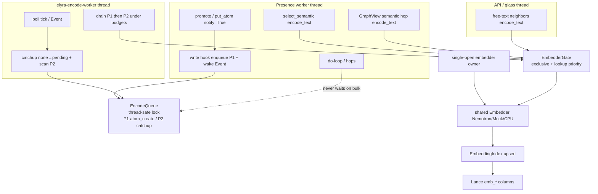
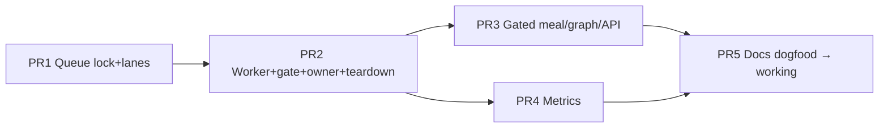

# Design: Continuous vector encoding while Elyra runs (embed-async)

| Field | Value |
|-------|--------|
| **Class** | DESIGN |
| **Document** | Continuous encode / `feature/embed-async` |
| **Author** | Grok Build (design agent) |
| **Date** | 2026-08-03 |
| **Status** | Shipped |
| **Primary issue** | [#82](https://github.com/jtwolfe/project-elyra/issues/82) `BUG-mem-gpu-01` (product continuous-encode path only; **not** full close) |
| **Topic branch** | `feature/embed-async` (from `working`) |
| **PR base** | `working` (integration tip; house branch law) |
| **Related** | #80 Phase 2 semantic; #103/#105 traverse (depend on ready vectors); #107 truncation (orthogonal) |
| **Architecture** | [stretch-2/architecture/phase-2-semantic.md](../../stretch-2/architecture/phase-2-semantic.md) §3 invariant 1 (continuous single-owner) |
| **Bug evidence** | [known-bugs.md](../../known-bugs.md) **BUG-mem-gpu-01** product continuous-encode checklist |

---

## Overview

Phase 2 already marks new embeddable atoms `embedding_status=pending` at promote, enqueues them via store write hooks into an in-process `EncodeQueue`, and drains that queue under hard ms/item budgets into Lance via `EmbeddingIndex.upsert`. **Production drain, however, runs only when the presence worker claims no wake** (`PresenceWorker._idle_memory_encode`). Under multi-hour directed work or dense social moments, the PE process is almost never “idle,” so the corpus backlog grows: atoms stay `pending`, meal semantic packs omit or seed empty, and graph/traverse semantic hops find no ready vectors. When a GPU path is healthy the model may already be warm while bulk encode still waits for idle.

This design makes **corpus encoding the PE process’s continuous background encode job while the process is up** (when `semantic_enabled` + `embed_enabled`). That job is **accelerated by GPU (CUDA/ROCm) when available**; **CPU and mock remain first-class soft-fail paths** (same `open_encoder` matrix as today — #82 multi-device durability). Drain moves to a **presence-owned encode worker** that makes progress during busy periods, with **lookup-priority preemption (EmbedderGate)** so meal/graph/**API free-text** query encodes beat bulk between atoms. Presence’s single-threaded do-loop never blocks on bulk corpus encode; atom create only enqueues (best-effort under queue caps); failures mark atoms, not the PE process.

**#82 scope honesty:** this design targets the **product “encode during moments / continuous drain” gap** (known-bugs gap #7). It does **not** by itself close packaging/Tensile/device-matrix work; dogfood evidence is `drain_ok_total` / pending→ready during busy, not “BUG-mem-gpu-01 fully fixed.”

---

## Background & Motivation

### Current state (verified in code)

| Step | Where | Behavior today |
|------|-------|----------------|
| Promote marks pending | `elyra/memory/promote.py` → `_embedding_status_for_promote` / `_link_and_put` | When `semantic_enabled` and embeddable → `embedding_status=pending`; **no embedder call** |
| Enqueue on write | `PresenceWorker._install_encode_hooks` → `store.set_write_hook` | If `semantic_enabled` + `embed_enabled` + status `pending` → `EncodeQueue.enqueue(atom_id)` |
| Drain | `PresenceWorker._idle_memory_encode` | **Only** on `run()` loop when `_claim_and_open()` returns `None` (idle) |
| Drain body | `EncodeQueue.drain` | `encode_atom` → index `upsert` → `ready`; caps `encode_max_ms_per_tick` / `encode_max_items_per_tick` |
| Catch-up | `catchup_none_atoms_for_encode` + `scan_pending_into_queue` | Historical `none`→`pending` (via `notify=False` status put) and pending scan — **also idle-only** |
| Query encode (meal) | `meal.select_semantic` → `embedder.encode_text(seed)` | Sync on presence thread; hard `semantic_select_max_ms` / wait-for-select |
| Query encode (graph) | `graph.GraphView._project_semantic_hop` / `seed_from_text` | Sync `encode_text` on presence; cold encoder → omit / empty |
| Query encode (API) | `elyra/runtime/api.py` free-text neighbors ~L1468–1486 | API thread: `_ensure_embedder()` then `encode_text` — **third concurrent caller** |
| Device / load | `embed/runtime.py` `open_encoder` / `NemotronEmbedder` | CUDA → ROCm → CPU; mock fallback; never hard-fail import |
| Queue concurrency | `embed/queue.py` | Documented **single-writer**; `deque`+`set`, **no lock** |
| Teardown | `runtime/supervisor.py` `shutdown` | Sets stop → joins **presence** thread; no encode worker today; presence `run()` `finally` closes browser |

Idle-only placement is explicit architecture law today:

```267:268:docs/stretch-2/architecture/phase-2-semantic.md
1. **Corpus encode is idle-only.**  
   Never run full atom→vector encode on the hop / `promote_beat` / mid-`rebuild_outer` path. Drain only when not in-moment, outside the presence state lock, under `encode_max_ms_per_tick` / `encode_max_items_per_tick`.
```

```1216:1223:elyra/presence/worker.py
                    if claimed is None:
                        # Still fire due timers/waits while idle.
                        with self._lock:
                            self._fire_due_unlocked()
                        # Ladder refresh OUTSIDE lock (PR5 normative placement).
                        self._idle_memory_ladder()
                        # Corpus encode drain OUTSIDE lock (KD2 / KD16).
                        self._idle_memory_encode()
```

That invariant correctly forbids **blocking the hop on bulk encode**. It incorrectly equates “non-blocking hop” with “encode only when no wake is claimed.” Operator dogfood (`docs/known-bugs.md` **BUG-mem-gpu-01**, `docs/radeon-vii-dev/NOTES-DOGFOOD.md`) shows Nemotron can load on ROCm, yet **in-moment / continuous encode is unverified**; under busy work, pending backlog and empty semantic seeds are observed.

### Pain points

1. **Starvation under continuous wakes** — directed keep, social stream, instrument-heavy moments: idle ticks rare → vectors lag hours.
2. **Semantic product path depends on ready corpus** — meal `select_semantic` and graph semantic hops search durable vectors; tip + keep carry immediate recall, but support channel is empty without catch-up.
3. **Warm accelerator idle while encode waits for idle claim** — cold load is expensive (~18s dogfood); after warm, bulk encode still waits for no-wake.
4. **No priority model** — single FIFO; catch-up scans and new creates compete equally; lookup is separate sync path with **no coordination** vs bulk (and API free-text is a third path).
5. **Observability gap** — `encoder_health_block` exposes queue depth/dropped but not drain rate, last drain wall, priority vs bulk, or worker liveness.

### What must not regress

- KD2: hop must not block unbounded on corpus encode.
- KD12: no cold model load inside `select_semantic`.
- KD16: promote sets `pending` only; hooks enqueue; status writes use `notify=False`.
- KD8/KD20: `ready` only when index holds vectors.
- KD19: scalar `put_atom` preserves `emb_*` (Lance read-merge-write).
- Soft failure: encode fail → atom `failed`/`pending` retry; PE process survives (align #82).

---

## Goals & Non-Goals

### Goals

1. **Continuous encode progress** while PE is running (including busy moments), via a dedicated encode worker/policy. **GPU accelerates when available**; CPU/mock progress is valid success for continuous-encode product law.
2. **Reliable create-path enqueue** for embeddable atoms (write-hook + P1 + wake Event), plus **scan backstop** for catch-up/restart (P2) — not a claim that every `put_atom` always enqueues.
3. **Lookup priority** so meal semantic select, graph/traverse, and **API free-text** query encodes **beat bulk between atoms** (EmbedderGate — not mid-forward kill).
4. **Do not block** the presence single-threaded do-loop on heavy bulk corpus encode; hard wall budgets; non-blocking enqueue.
5. **Honest status** for `pending` / `failed` / `skipped`; observability for queue depth by lane, drain rate, gate waits, worker liveness.
6. Align with #82: durable device path (ROCm/CUDA/CPU) without hard-failing presence if encode fails (fail atom encode, not PE death); **product continuous-drain evidence** without overclaiming packaging closed.

### Non-goals

- Full graph traversal product (#103/#105) beyond priority hooks for their lookup embeds.
- Meal taxonomy (#106) or tool-atom truncation (#107).
- Transactional create (atom + links + vectors ACID).
- Replacing Lance or changing emb dim/schema (`EMBED_DIM=2048`).
- Auto-promote to `main`; redefining house branch law (base remains `working`).
- Closing gfx906 packaging / Tensile inject as a product default (dev profile stays under `docs/radeon-vii-dev/`).
- Closing entire **BUG-mem-gpu-01** (packaging + device matrix); only the continuous/in-moment encode product path.

---

## Proposed Design

### Architecture summary

Introduce a **presence-owned `EncodeWorker`** (daemon thread, pattern after `instrument.reaper`) that owns **bulk corpus drain** for the life of the PE process when continuous encode is active. Presence continues to own wake claim, do-loop, meal compose, and graph tools on its single worker thread.

All process encode work that uses the **shared process embedder** (bulk `encode_atom*` **and** lookup `encode_text` on presence, graph, **and glass/API**) is serialized through an **`EmbedderGate`**. Lookup callers take the gate with **priority**; the bulk worker holds the gate **only for model forward of one atom** and cooperatively yields when a lookup waiter is present.

**Two separate priority systems (normative split):**

| System | What it orders | v1 mechanism |
|--------|----------------|--------------|
| **Query vs bulk** | Meal / graph / API free-text vs corpus drain | **`EmbedderGate` only** (lookup > bulk). No queue P0 jobs in v1. |
| **Bulk vs bulk** | Live creates vs historical catch-up | **`EncodeQueue` lanes** P1 `atom_create` > P2 `catchup` |
| **Preempt granularity** | — | **Between atoms only** (never mid torch forward) |



```mermaid
sequenceDiagram
  participant PE as Presence thread
  participant API as API thread
  participant Q as EncodeQueue
  participant Ev as wake Event
  participant W as EncodeWorker
  participant G as EmbedderGate
  participant E as Embedder
  participant I as EmbeddingIndex

  PE->>Q: enqueue(atom_id, priority=atom_create) under lock
  PE->>Ev: Event.set()
  Note over PE: put_atom returns; hop continues

  W->>Ev: wait(timeout=encode_worker_poll_s)
  W->>Q: pop_next bulk P1 then P2 under lock
  Note over W: store I/O get_atom outside gate
  W->>G: acquire(bulk)
  alt lookup waiter present
    G-->>W: deny/yield
    W->>W: sleep short; retry
  else granted
    G-->>W: granted
    W->>E: encode_atom forward only
    W->>G: release
    W->>I: upsert → ready outside gate
  end

  alt PE/API lookup encode
    PE->>G: acquire(lookup, timeout=remaining budget)
    alt acquire timeout
      G-->>PE: false
      Note over PE: meal/API omit timeout or encoder
    else granted
      G-->>PE: granted
      Note over W: finishes current forward then yields
      PE->>E: encode_text(seed)
      PE->>G: release
    end
  end
```

---

### Component 1 — `EncodeQueue` (priority multi-lane, **thread-safe**)

**Location:** extend `elyra/memory/embed/queue.py` only. **Canonical name: `EncodeQueue`** (do **not** introduce `EncodeScheduler` as a second type — see KD-E11).

**Replace single-writer assumption** with an **internal `threading.RLock`** covering every membership mutation and read used by callers:

| Method / op | Under queue lock? |
|-------------|-------------------|
| `enqueue` / promote lane / overflow drop | **Yes** |
| `pop_next` / `pop_next_bulk` | **Yes** |
| `contains` / `qsize` / `dropped_total` / `clear` | **Yes** |
| `drain` loop membership (pop) | **Yes** per pop; **release lock** before encode/store I/O for one atom, re-acquire for next pop |
| Overflow mark-skipped store put | **Outside** queue lock (avoid lock order with store) |

**Normative:** concurrent write-hook `enqueue` (presence) + worker `drain`/`scan` is **defined and tested**. No plain unlocked `deque`/`set` mutation after PR1.

**Lanes (bulk only in v1):**

| Priority | Name | Source | Semantics |
|----------|------|--------|-----------|
| **P1** | `atom_create` | Write hook on new/changed `pending` atoms | Live creates; preferred bulk |
| **P2** | `catchup` | `scan_pending_into_queue` after restart/miss/catch-up flips | Historical backlog; lowest |

**P0 `lookup` is not implemented as a queue lane in v1.** Query priority is **gate-only** (Component 5). Do not build unused P0 machinery. A future async lookup job type may add P0 later; out of scope.

**API (concrete):**

```python
class EncodePriority(str, Enum):
    ATOM_CREATE = "atom_create"  # P1
    CATCHUP = "catchup"          # P2

class EncodeQueue:
    def __init__(self, maxsize: int = 1024) -> None:
        self._lock = threading.RLock()
        self._p1: deque[str] = deque()
        self._p2: deque[str] = deque()
        self._queued: set[str] = set()
        self._lane: dict[str, EncodePriority] = {}
        ...

    def enqueue(
        self,
        atom_id: str,
        *,
        priority: EncodePriority = EncodePriority.ATOM_CREATE,
        store: Any | None = None,
    ) -> bool:
        """Dedupe across lanes under lock. Higher bulk priority wins.
        At capacity: drop oldest from P2 then P1. Mark dropped
        skipped+queue_overflow outside lock when store provided.
        Returns True if newly queued or promoted P2→P1.
        """
        ...

    def pop_next_bulk(self) -> tuple[str, EncodePriority] | None:
        """P1 first, then P2. Under lock."""
        ...

    def drain(...):
        """Pop under lock; process atom outside lock; budgets unchanged."""
        ...
```

**Dedupe rules:**

- Global `_queued: set[str]` membership under lock.
- If `atom_id` already in P2 and a P1 enqueue arrives → **promote** to P1.
- If already in P1, second enqueue is no-op (same content path as today).
- Content-fingerprint short-circuit in the write hook stays (KD16 re-put).

**Overflow (KD22 preserved, refined):**

- `encode_queue_max` caps total distinct ids across P1+P2.
- Drop order: oldest P2, then oldest P1.
- Dropped atoms: `embedding_status=skipped`, `meta.embed_error=queue_overflow` (existing).
- **Enqueue is best-effort:** overflow may still drop P1 after P2 is empty — not an absolute “creates never drop” guarantee.

**Hermetic tests (PR1):** concurrent threads hammering `enqueue` + `pop_next_bulk` / `drain` with MockEmbedder; no lost ids, no double membership; overflow order P2 before P1.

---

### Component 2 — `EmbedderGate` (serialize + lookup priority)

**Location:** `elyra/memory/embed/gate.py` (new, small).

```python
class EmbedderGate:
    """Exclusive access to the shared process Embedder.

    - acquire(kind="bulk"|"lookup", timeout=None) -> bool
    - release()
    - lookup_waiting: bool  # bulk checks between atoms
    """
```

**Rules:**

1. Only one holder at a time (`threading.Lock` + condition).
2. **Lookup priority:** when `lookup_waiting` is true, bulk must not acquire until lookup completes or times out. Between atoms, bulk re-checks and yields.
3. **No mid-forward preemption** — once model forward starts, it runs to completion. Preempt = **gate/queue order only**.
4. **Critical section = model forward only.** Bulk: acquire → `encode_atom` / embedder forward → release → then Lance `upsert` / status `put_atom(notify=False)` **outside** the gate. Lookup: acquire → `encode_text` → release. Do not hold the gate across store I/O or ANN optimize.
5. **All shared-embedder encode paths** go through the gate: bulk, meal, graph, **and API free-text** (`runtime/api.py`). Prefer exposing only a **`GatedEmbedder`** handle to meal/graph/API so bare `encode_text` cannot bypass.
6. Bulk `acquire("bulk")` with short timeout; if lookup waiting, sleep poll and retry.
7. Lookup `acquire("lookup", timeout=remaining_budget)`: on timeout → caller maps to existing omit (`timeout` / `encoder` / API `encode_failed`) — **never hang presence do-loop or API unbounded**.

**Why not free concurrent torch:** one model instance; concurrent forwards risk OOM and undefined HIP/CUDA behavior. Single-writer encode matches process-local single-embedder culture (store remains multi-thread under its own locks).

#### Cold load vs gate (normative — KD12-safe)

Dogfood: first Nemotron load ~18s; subsequent text encode ~100ms. Continuous worker will often cold-open during busy.

| Phase | Policy |
|-------|--------|
| **Cold load** | Runs **outside** the encode gate **and outside** long holds of `embedder_open_lock`. State: `absent` → `loading` → `warm` \| `failed`. |
| **While `loading`** | Meal / graph / API treat embedder as **not warm** → existing omit `encoder` (KD12). Bulk drain skips items soft (leave pending) until warm or failed. |
| **Gate** | Only acquired for **forwards on an already-constructed warm embedder**. Load must **not** hold lookup priority or the encode gate for ~18s. |
| **Who loads** | **Loader role only** (encode worker tick, or optional `embed_preload` on start). Presence meal and API are **consumers** — never call `open_encoder`. |
| **Preload (optional)** | Existing `embed_preload` may open on store open / worker start as **loader**; still outside encode gate; still uses short lock sections only. |

**Dogfood:** first-load during busy must not hang presence do-loop or API; meal omit reasons stay budget-bounded (`encoder` while loading).

---

### Component 3 — `EncodeWorker` + single-open embedder + teardown

**Location:** small `EncodeWorker` in `elyra/memory/embed/worker.py` (unit-testable), owned by `PresenceWorker`.

#### Embedder single-open protocol (non-blocking consumers)

| Rule | Detail |
|------|--------|
| **One open entrypoint** | Only `PresenceWorker._ensure_embedder(...)` may call `open_encoder`. Meal, graph, API, and worker all go through it — with **different roles**. |
| **Roles** | `role="loader"` — may start cold load (encode worker tick / preload). `role="consumer"` (**default**) — presence meal, graph path helpers, **API free-text**. |
| **Lock discipline** | `self._embedder_open_lock` protects **short** critical sections only: read/write `_embedder`, `_embedder_state`, `_embedder_open_failed`. **Never hold the open lock across `open_encoder` / Nemotron load (~18s).** |
| **Loader algorithm** | Under lock: if `warm` → return handle; if `loading` → return None (another loader in flight) or join-wait **only on loader path if desired** (worker may poll state); if `failed` → return None; else set `state=loading`, release lock → `open_encoder(...)` **outside lock** → re-acquire → set handle + `warm` or `failed`. |
| **Consumer algorithm (normative default)** | Under lock: if `warm` and handle present → return **GatedEmbedder**/handle; if `loading` / `absent` / `failed` → return **`None` immediately**. **Never wait** for load completion. **Never call `open_encoder`.** |
| **API** | `runtime/api.py` `_ensure_embedder()` uses **consumer** semantics (default). While loading → `embedder is None` → existing omit `encoder`. **Never open a second embedder on the API thread.** |
| **Meal today** | Prefer keep reading warm handle / consumer ensure only — must not regress to blocking ensure (`worker.py` ~2204 pattern). |
| **Close** | Only after encode worker joined; once; short critical section under open lock. |

```python
def _ensure_embedder(self, *, role: str = "consumer") -> Any | None:
    """Process-shared embedder access.

    consumer (default): non-blocking — return warm handle or None.
      While loading/absent/failed → None (callers omit encoder).
    loader: may perform open_encoder outside the open lock; only
      encode-worker tick / embed_preload use role=\"loader\".
    """
```

**Normative product law:** “while `loading` → omit `encoder`” requires consumers to be non-blocking. A blocking wait on the open lock or on load completion from presence/API is a **bug**, not an allowed implementation choice.

#### Drain ownership state machine (`encode_owner`)

```text
encode_owner ∈ { none, idle, worker }

  start PE, embed off          → none (no drain)
  encode_worker_enabled=false  → idle  (operator rollback: legacy idle-only drain)
  encode_worker_enabled=true
    + semantic+embed on
    + continuous mode intended → worker  (set BEFORE first drain tick;
                                           stays worker through death/restart)
  embed_enabled off            → none
  PE stop                      → none after join+close
```

**Death does not switch to idle.** While `encode_worker_enabled` and semantic+embed remain on, desired owner stays **`worker`**. Idle-only drain is **only** for explicit operator rollback (`encode_worker_enabled=false`), not a permanent product fallback after crash loops.

| Path | Behavior |
|------|----------|
| `_idle_memory_encode` | `if encode_owner == worker: return` (including when worker thread is temporarily dead and restarting). If `owner == idle`: full drain (legacy rollback). If `none`: return. |
| EncodeWorker tick | Only drains when `owner == worker` **and** this thread is the live worker. |
| Catch-up counter | **`_embed_catchup_marked` single owner** = continuous mode’s counter when `owner=worker` (survives thread restart); separate counter only when `owner=idle` rollback. Never double-count. |
| Flag flip mid-run | Enabling continuous: start worker, `owner=worker`. Disabling: stop worker → join → `owner=idle` → idle drain may run. No dual drain during handoff. |
| **Liveness monitor** | Presence `run()` **every iteration** (busy finalize path **and** idle path — not idle-only) calls `_maybe_restart_encode_worker()`. |

#### Lifecycle / teardown (supervisor-aligned)

Today: `Supervisor.shutdown` sets `_stop` → joins **presence** `_worker_thread` → browser/sandbox. Presence `run()` `finally` closes browser. **There is no `PresenceWorker.stop` method today.**

**Normative teardown order (encode added inside presence thread lifetime):**

1. Supervisor sets stop event (existing).
2. Presence `run()` loop exits.
3. **`run()` `finally` (on presence thread), ordered:**
   1. Signal encode worker stop + `Event.set()` to wake.
   2. Join encode worker (bounded, e.g. 2.0s).
   3. Close embedder under open lock (`embedder.close()`).
   4. Set `encode_owner = none`.
   5. Existing browser `close_all` (owner thread).
4. Presence thread ends → supervisor join completes.

Supervisor does **not** need a separate encode-worker join if encode teardown is fully inside presence `run()` `finally` **before** the presence thread returns. Document this in PR2; optional `PresenceWorker.shutdown_encode()` helper called only from `finally` for tests.

| Event | Action |
|-------|--------|
| Memory store open + flags on + `encode_worker_enabled` | Start daemon `elyra-encode-worker`; set `owner=worker` **before** first drain |
| Hook install failure | Worker tick re-installs hooks (same as idle path today when queue is None) |
| Embedder open fails | `_embedder_open_failed` / `state=failed`; loader ticks soft-skip drain; PE lives; consumers return None |
| Worker loop exception / thread death | Log + metric; **busy-safe continuous recovery** (below) — **not** permanent idle-only |
| PE stop | finally join → close embedder (above) |

#### Busy-safe worker death recovery (normative)

Idle-only drain after death **reintroduces the original busy starvation bug** (drain only when no wake claimed). That is unacceptable as the product fallback while continuous encode is enabled.

| Rule | Detail |
|------|--------|
| **Desired owner** | While `encode_worker_enabled` + semantic + embed: `encode_owner` stays **`worker`**. |
| **Monitor** | Presence `run()` invokes `_maybe_restart_encode_worker()` on **every loop iteration** (after moment finalize **and** on idle path) — not only when `claimed is None`. |
| **Restart policy** | If desired owner is worker and thread is dead/not alive: start a new daemon thread with **exponential backoff** (e.g. 0.5s → 1s → 2s → … cap 30s). |
| **Thrash cap** | `encode_worker_max_restarts` is a **per-window** budget (default: 3 per 60s), **not** a permanent give-up. After the window budget is exhausted, keep backoff restarts (slower); log ERROR / health `restart_throttled=true`; **do not** set `owner=idle`. |
| **Hard stop only** | Stop continuous attempts when `embed_enabled=false`, `encode_worker_enabled=false`, `open_failed` permanent with no mock path operator-disabled, or PE stop. |
| **Gap drain (required bridge)** | While `owner=worker` but thread not alive (restart backoff gap), presence may run **one budgeted** `encode_poll_once()` / shared drain helper **outside the hop** (e.g. end of `_finalize_moment`, and on idle path) under the same gate + budgets as the worker. This preserves G-B during busy without waiting for idle claim. Must not run mid-`rebuild_outer` / mid-tool. Single-flight: if restart succeeds, stop gap drain. |
| **Idle owner** | **Only** when `encode_worker_enabled=false` (rollback). Death never flips to idle. |

**Dogfood:** force worker exception **during continuous wakes**; assert `drain_ok_total` or ready count still increases within backoff+gap-drain (no multi-minute stall solely because moments stay claimed).

#### Tick body

1. If not `semantic_enabled` or not `embed_enabled` or `owner != worker` → sleep/Event wait.
2. Ensure store; if `_encode_queue is None`, re-install hooks.
3. Ensure embedder as **`role="loader"`** (may cold-load on **this worker thread only** — never on presence do-loop / API). Load uses short open-lock sections; consumers stay non-blocking.
4. Budgeted `catchup_none_atoms_for_encode` (process-life `embed_catchup_max` on continuous-mode counter). Optionally after flip, enqueue flipped ids at P2 immediately (do not rely only on list lag).
5. `scan_pending_into_queue(..., priority=CATCHUP)`.
6. `queue.drain` under budgets: for each item — store get outside gate → gate bulk → encode forward → release gate → upsert/status outside gate; **collect retry ids, do not re-pop them this tick** (below).
7. After drain returns: flush deferred re-enqueues under queue lock.
8. Wait on wake Event with timeout `encode_worker_poll_s` (default **0.35**).

#### Retry re-enqueue (normative — no same-tick re-drain)

Today: retryable fail leaves `pending` and **does not** re-enqueue; recovery is scan-only.

**v1 policy:**

1. On retryable encode failure (`pending` with attempts < max): **record** `(atom_id, priority)` for re-enqueue — **do not** append to the live lane until the **current `drain()` call finishes**.
2. After the drain tick completes (processed/max_ms/max_items exit): under queue lock, enqueue deferred ids at lane **tail** (default CATCHUP if priority unknown).
3. Do **not** re-enqueue if attempts ≥ `encode_max_attempts` (terminal `failed`).
4. **Belt-and-suspenders:** each `drain()` maintains a per-call `seen: set[str]` of popped ids; if a deferred flush were ever mid-loop (bug), `pop_next_bulk` / drain skips already-seen ids for this call.

**Rationale:** Immediate tail re-enqueue inside `while processed < max_items` allows the same atom to fail repeatedly in one tick (fast MockEmbedder / OOM), burning budgets and inflating attempts without progress. Scan remains the backstop for process restart.

**Test:** force fail → attempts increments **at most once per drain tick** for that atom_id.

#### In-moment progress

Encode thread independent of wake claim → bulk continues during hops, subject to gate contention with lookup (including API free-text).

---

### Component 4 — Enqueue on create (precise guarantees)

#### Path inventory

| Path | notify | status | Enqueues? | Lane |
|------|--------|--------|-----------|------|
| `promote._link_and_put` / parcel children `put_atom` | default True | pending when semantic+embeddable | **Yes** (hook) if semantic+**embed** on | P1 |
| Ladder summary put | True | `none` | No | — |
| Status mark / index ready | False | pending/ready/failed/skipped | No (no re-loop) | — |
| `catchup_none_atoms_for_encode` → `_mark_atom_status` | False | none→pending | **No hook** — scan or explicit P2 enqueue after flip | P2 |
| Future admin `put_atom(..., pending, notify=True)` | True | pending | Yes if flags | P1 |
| `put_atom(..., notify=False)` any | False | any | No | — |
| Hook when `embed_enabled=false` | True | pending | **No** (by design) — scan after later enable | P2 later |

#### Create-path changes

1. Hook: `queue.enqueue(..., priority=ATOM_CREATE)` under queue lock.
2. On successful new/promoted enqueue: **`wake Event.set()`** (not poll-only).
3. Parcel children already `put_atom` → hooks.
4. Status-only `notify=False` unchanged.

#### Split guarantees (acceptance)

| ID | Guarantee | Mechanism |
|----|-----------|-----------|
| **G-A Create** | Embeddable promote/parcel create under `semantic_enabled`+`embed_enabled` **attempts** P1 enqueue + wake Event; fingerprint short-circuit if already encode-ok | Write hook |
| **G-B Catch-up / restart** | Each worker (or idle) tick: none→pending catch-up budget + `scan_pending` at P2; pending atoms re-enter queue after restart (queue non-durable) | Tick scan + optional post-catchup enqueue |
| **G-C Overflow** | At capacity, oldest P2 then P1 → `skipped`+`queue_overflow`; create may be dropped if queue full of P1 | KD22 refined |
| **G-D Enable lag** | Atoms written `pending` while `embed_enabled=false` are **not** hooked; after embed turns on, scan picks them up **without PE restart** | Acceptance test required |

Do **not** claim “every put_atom always enqueues.”

---

### Component 5 — Lookup priority (meal, graph, **API**)

**Today:** sync `encode_text` on presence (meal/graph) **and** API thread free-text. Stays sync for hop/API latency control.

**Change:** **all** shared-embedder encode paths use lookup-priority gate via **`GatedEmbedder` as the only public handle** exposed to meal, graph, and API.

| Site | File / function |
|------|-----------------|
| Meal query | `meal.select_semantic` ~`encode_text(seed)` |
| Graph hop | `graph.GraphView._project_semantic_hop` |
| Graph seed | `graph.GraphView.seed_from_text` / expand |
| **API free-text** | `runtime/api.py` ~L1468–1486 neighbors encode |

```python
class GatedEmbedder:
    """Only process-facing encode handle for meal/graph/API.

    encode_text/image/... acquire(lookup); bulk worker uses
    acquire(bulk) + inner encode_atom path separately.
    health/close delegate to inner; close only from open owner.
    """
```

**Preempt rule (normative product):**

> While any lookup waiter holds or awaits the gate, the encode worker must not start another corpus **forward**. A forward already in progress finishes. Query embeds beat bulk **between atoms only**.

v1 does **not** enqueue meal/API work as queue P0 jobs.

**Media bulk vs snappy meal:** multi-second media/joint forwards can raise snappy omit rates vs idle-only (when bulk rarely ran). That is **not** a KD2 regression if presence remains non-blocking. Acceptance:

- With **warm** embedder and **text-only** bulk backlog + wait-for-select: meal encode obtains a vector within wait budget (gate wait p95 tracked).
- Snappy mode + media bulk: omit `timeout` is allowed; document as expected under load, not a ship blocker for continuous encode.

Metrics: `gate_lookup_wait_ms` last + optional histogram counters; `gate_bulk_yields`.

---

### Component 6 — Budgets & settings

| Setting | Default | Role |
|---------|---------|------|
| `encode_max_ms_per_tick` | 100 (existing) | Wall budget per worker drain tick |
| `encode_max_items_per_tick` | 4 (existing) | Items per tick |
| `encode_max_attempts` | 3 (existing) | Retry then `failed` |
| `encode_queue_max` | 1024 (existing) | Distinct ids P1+P2 |
| `encode_worker_poll_s` | **0.35** (new) | Event wait timeout between ticks |
| `encode_worker_enabled` | **true** (new) | false → `owner=idle` legacy drain **only** (operator rollback) |
| `encode_worker_max_restarts` | **3** (new) | Per-window thrash budget (default window 60s); **not** permanent idle switch |
| `encode_worker_restart_window_s` | **60** (new) | Window for restart thrash accounting |
| `encode_worker_restart_backoff_max_s` | **30** (new) | Cap exponential restart backoff |
| `encode_query_max_ms` | 30 (existing) | Snappy meal encode sub-budget |
| `semantic_select_max_ms` / `semantic_wait_*` | existing | Meal wall clocks unchanged |
| `embed_preload` | false (existing) | Optional early open outside gate |

**Throughput sketch:** GPU ~100 ms subsequent text encode → ~1 atom per 100ms tick under defaults; raise `encode_max_ms_per_tick` operator-side (250–500) for faster catch-up. **CPU continuous progress is valid** — slower but non-zero during busy (today: near-zero during busy).

---

### Component 7 — Concurrency matrix (presence, worker, API, store)

| Concern | Mitigation |
|---------|------------|
| **EncodeQueue** | Internal RLock on all membership ops (Component 1) |
| Store RLock vs encode thread | Lance/jsonl locks; drain uses `get_atom` / `put_atom(notify=False)` / `upsert_vectors`. Protocol comment: **single logical PE process; concurrent readers/writers only under store/index locks; no second OS process writer** (update store.py docstring in PR2/PR5). |
| Presence state lock | Encode worker **never** takes `PresenceWorker._lock`. |
| Embedder open | Single open lock; one instance (Component 3) |
| Encode forwards | EmbedderGate (Component 2) |
| API free-text | Same gated handle; no second open |
| Torch GIL | Forwards release GIL in kernels; gate still serializes model use |
| Browser thread affinity | Encode worker must not touch browser |
| ANN optimize | **Idle-only** (KD4); encode worker must not optimize |
| Mid-hop meal vs bulk | Gate lookup priority between atoms |

---

### Failure modes

| Failure | Sev | Behavior | Mitigation |
|---------|-----|----------|------------|
| GPU OOM mid-encode | Med | failed/pending+attempts | Per-atom try; optional empty_cache via **lazy** torch import inside except only (never module-top torch) |
| Device unavailable / load fail | Med | mock fallback or open_failed; soft skip | #82 soft fail; PE lives |
| Queue overflow | Low–Med | oldest P2 then P1 → skipped | Metrics; best-effort create |
| Write hook miss | Low | scan P2 | Tick scan; promote still pending |
| Hook install failed | Low | queue None | Worker tick re-installs hooks |
| Worker thread death | High rare | log; restart w/ backoff; gap drain during busy | Continuous recovery — **never** permanent idle while flag on |
| Gate deadlock | High rare | try/finally release; gate ≠ store order | Forward-only critical section |
| Double drain | Med | owner state machine | Idle returns when owner=worker; gap drain single-flight |
| Cold load ~18s | Med | loading; consumers return None | Load outside gate+long lock; non-blocking ensure |
| Presence/API hang on ensure | High if missed | consumer role never waits | KD-E13/E18; tests |
| Lookup waits on media bulk | Med | snappy omit may rise | Wait mode acceptance; gate wait metrics |
| Failed-atom strand | Low | deferred re-enqueue after tick | Scan backstop; no same-tick re-drain |
| Same-tick retry thrash | Low | deferred flush + seen set | attempts ≤1 per tick per id |
| embed off→on lag | Low | pending not hooked while off | Scan after enable (G-D) |

---

### Guarantees (acceptance-facing, precise)

1. **G-A Create enqueue:** promote/parcel embeddable create under semantic+embed → attempt P1 + wake Event (or fingerprint short-circuit); overflow may skip (G-C).
2. **G-B Progress during busy:** with non-empty pending work and healthy warm embedder, `ready` / `drain_ok_total` increases while moments run — **no idle claim required** (CPU or GPU).
3. **G-Lookup preempt:** when meal/graph/**API** lookup holds or waits on the gate, no **new** corpus **forward** starts until lookup completes or times out.
4. **G-Nonblock create:** promote latency excludes bulk encode wall time.
5. **G-Soft fail:** encoder exceptions never kill presence `run()` or supervisor.
6. **G-Single drain owner:** never concurrent idle + live-worker drain; death keeps desired `owner=worker` with restart + busy gap drain (idle only if flag off).
7. **G-Teardown:** encode worker joined and embedder closed in presence `run()` finally before thread exit.
8. **G-Nonblock ensure:** consumer `_ensure_embedder` never waits on cold load; loading → None → omit `encoder`.
9. **G-Retry once/tick:** retryable fail defers re-enqueue until after drain; attempts +≤1 per atom per tick.

### Status model (unchanged vocabulary)

| Status | Meaning after this design |
|--------|---------------------------|
| `none` | Semantic off or non-embeddable |
| `pending` | Needs encode or upsert; may be queued or waiting worker |
| `ready` | Index holds vectors (KD20) |
| `failed` | Attempts exhausted |
| `skipped` | Empty modalities / overflow / permanent skip |

---

## API / Interface Changes

### Public / package surfaces

| Surface | Change |
|---------|--------|
| `EncodeQueue` | Priority kwargs; **internal lock**; dual bulk lanes; concurrent-safe |
| `scan_pending_into_queue` | Enqueue at `catchup` priority |
| `EmbedderGate` / `GatedEmbedder` | New |
| `EncodeWorker` | New |
| `PresenceWorker` | Open lock; owner state; start worker; idle gate; consumer/loader ensure; every-loop restart monitor; gap drain; `run()` finally teardown; wake Event |
| `runtime/api.py` | Consumer `_ensure_embedder` only (no second open; no load wait) |
| `encoder_health_block` / Vectors | Worker + gate + depth-by-priority + restart_throttled + embedder_state |
| `MemorySettings` | `encode_worker_enabled`, `encode_worker_poll_s`, `encode_worker_max_restarts`, restart window/backoff caps |
| `MemoryStore` protocol comment | Concurrent in-process writers under locks |

### Meal / graph / API

No change to meal budget math or omit reason vocabulary. Gate acquire timeout → existing `timeout` / `encoder` / API `encode_failed`.

### Before / after drain ownership

| | Before | After |
|--|--------|-------|
| Corpus drain trigger | Idle only | `encode_owner=worker` continuous (+ restart/gap drain); idle **only** if `encode_worker_enabled=false` |
| Lookup encode | Sync uncoordinated (presence + API) | Sync under lookup-priority gate; consumer ensure non-blocking |
| Create path | Hook enqueue | Hook P1 + Event wake |
| Idle encode | Full drain | Only if `owner=idle` (rollback flag) |

---

## Data Model Changes

**None** for Lance schema, atom dataclass, or emb dim.

- Queue remains **non-durable**. Intent durability = atom `embedding_status`.
- Meta keys unchanged (`embed_attempts`, `embed_error`, `embed_encode_ok`, …).
- No migration.

---

## Alternatives Considered

### A. Keep idle-only drain; only tune budgets / poll

- **Pros:** Minimal code; no threading.
- **Cons:** Fails product law under continuous wakes.
- **Decision:** Reject as primary; **rollback** via `encode_worker_enabled=false` (`owner=idle`).

### B. Synchronous encode on promote / put_atom

- **Pros:** Strong create→ready coupling.
- **Cons:** Violates KD2; multi-second media in hop.
- **Decision:** Reject.

### C. Dedicated OS process for encode

- **Pros:** Crash isolation.
- **Cons:** IPC + multi-process Lance writer; overkill for single-operator PE.
- **Decision:** Defer.

### D. Priority bulk queue + background drain + gate (**chosen**)

- **Pros:** Continuous progress; lookup preempt; reuses drain/upsert; soft-fail.
- **Cons:** Cross-thread store; queue locks; gate + open lifecycle.
- **Decision:** **Adopt** with hardening in this rev.

### E. Mid-hop cooperative drain on presence only

- **Pros:** No second thread.
- **Cons:** Long hops still starve; couples to hop structure.
- **Decision:** Reject as sole strategy.

---

## Security & Privacy Considerations

| Topic | Notes |
|-------|-------|
| Threat model | Encode worker in-process; no new network surface. |
| Auth | Glass Vectors APIs unchanged. |
| Data handling | Same content on host/GPU as idle drain. |
| Secrets | No content_text in metrics; atom_id-scoped errors. |
| Resource DoS | Queue max; ms/item caps; gate timeouts. |
| Multi-tenant | N/A. |

---

## Observability

### Logs

| Event | Level | Fields |
|-------|-------|--------|
| Worker start/stop/restart/throttled | INFO/ERROR | owner, device, backend, poll_s, restart_n, backoff_s |
| Gap drain during dead worker | INFO | ok, remaining, reason=worker_gap |
| Drain tick summary | DEBUG (INFO if ok>0) | ok, failed, skipped, remaining, ms, lane |
| Queue overflow | WARNING | atom_id, remaining |
| Gate wait | DEBUG | kind, wait_ms |
| Embedder open / loading / fail | INFO/ERROR | role=loader\|consumer, state |
| Cold load complete | INFO | load_ms, device |
| Consumer ensure while loading | DEBUG | returned None (omit path) |

### Metrics / health block extensions

```python
{
  "queue_depth": int,
  "queue_depth_by_priority": {"atom_create": n, "catchup": m},
  "queue_dropped": int,
  "encode_worker": {
    "enabled": bool,
    "owner": "worker" | "idle" | "none",
    "alive": bool,
    "restarts": int,
    "restart_throttled": bool,
    "gap_drain_active": bool,
    "last_drain_at": iso | None,
    "last_drain_stats": {"ok": …, "failed": …, "processed": …, "ms": …},
    "drain_ok_total": int,
    "drain_failed_total": int,
    "gate_lookup_waits": int,
    "gate_lookup_wait_ms_last": int,
    "gate_bulk_yields": int,
    "embedder_state": "absent" | "loading" | "warm" | "failed",
  },
  "device": …,
}
```

### Alerting / dogfood signals

- `queue_depth` high + `last_drain_at` stale → stuck/dead worker.
- `alive=false` with `owner=worker` → restart/backoff and/or gap drain within one presence loop; **not** idle-only wait.
- `drain_ok_total` flat during multi-minute busy with pending → acceptance fail for continuous encode.
- `#82 product-path criterion:** `drain_ok_total` / pending→ready during busy moments — **not** packaging green alone.

---

## Rollout Plan

### Flags

| Flag | Default | Use |
|------|---------|-----|
| `encode_worker_enabled` | `true` | false → owner=idle (rollback only) |
| `encode_worker_max_restarts` | `3` / 60s | thrash throttle; continuous recovery continues |
| `embed_enabled` / `semantic_enabled` | factory off | Unchanged |
| `embed_device` | operator | Unchanged |

Factory semantic/embed remain **off** (KD9). Continuous encode activates only when operator enables Phase 2 encode.

### Staged rollout

1. Hermetic: locks, priority, concurrent enqueue+drain, owner state machine, gate, teardown.
2. CPU mock / CPU Nemotron dogfood: continuous pending→ready without idle.
3. GPU dogfood: drain during live moments; lookup not starved under text bulk; update BUG-mem-gpu-01 **product-path evidence only**.
4. Merge stack on `feature/embed-async` → fold to **`working`**.
5. **Do not** auto-promote to `main`.

### Dogfood acceptance

| Check | Pass criteria |
|-------|----------------|
| Create → pending → ready without idle | Promote during continuous wakes; ready while moments open |
| Busy progress | Multi-minute work; `drain_ok_total` or ready ↑ (CPU **or** GPU) |
| Meal/graph not starved (warm, text bulk, wait mode) | Query vector within wait budget; gate wait observed |
| API free-text gated | Concurrent bulk + Vectors free-text no crash; serialized encode |
| Soft fail | Bad device / encode kill; PE stays up |
| Worker death during busy | Force exception under continuous wakes → restart/gap drain; `drain_ok_total` still ↑ (no idle-claim wait) |
| embed off→on | Pending creates then enable embed → ready without restart |
| Cold load / ensure | Consumer ensure returns None while loading; presence/API hop latency not +load_ms; meal omit `encoder` |
| Rollback | `encode_worker_enabled=false` → idle-only |
| #82 honesty | Record product continuous-encode evidence; **leave packaging matrix open** |

### Rollback

1. `encode_worker_enabled = false` → idle-only.
2. `embed_enabled = false` → stop encode.
3. Git revert stack on `working` if needed.

---

## Open Questions

| ID | Question | Status | Resolution |
|----|----------|--------|------------|
| OQ-E1 | Default `encode_worker_poll_s`? | **Resolved** | **0.35s** + Event wake on enqueue (operator decision) |
| OQ-E2 | Raise default `encode_max_ms_per_tick`? | **Resolved** | Leave factory default **100ms**; operator may raise (e.g. 250–500) for faster catch-up (operator decision) |
| OQ-E3 | Joint-copy repair on encode worker? | **Resolved** | **No in v1** — joint-copy repair stays **idle-only** (operator decision) |
| OQ-E4 | ANN optimize during busy? | **Resolved** | **No** — ANN optimize stays **idle-only** (KD4; operator decision) |
| OQ-E5 | Proxy vs explicit gate params? | **Resolved** | **`GatedEmbedder` only public handle** for meal/graph/API (design KD-E5 / Component 5) |
| OQ-E6 | Name EncodeQueue vs Scheduler? | **Resolved** | **`EncodeQueue` only** + priority kwargs + lock (KD-E11) |
| OQ-E7 | Process-life metrics persistence? | **Resolved** | **No** — process-local counters only; durable truth is atom `embedding_status` |
| OQ-E8 | Restart thrash window / backoff caps? | **Resolved** | **3 restarts / 60s** window thrash budget; exponential backoff cap **30s**; never permanent idle while continuous enabled (KD-E16) |
| OQ-E9 | Gap drain only on finalize vs also hop boundary? | **Resolved** | Gap drain at **`_finalize_moment` + idle path** only; **not** mid-hop / mid-`rebuild_outer` (busy-safe death recovery) |

No open OQs remain for v1 implementation.

---

## Risks

| Risk | Sev | Mitigation |
|------|-----|------------|
| Unlocked queue races | High if missed | PR1 lock + concurrent tests |
| Double embedder open / OOM | High | Single open lock; API no second open |
| Cross-thread Lance writes | Med | Existing store locks; concurrent promote+drain test |
| Lookup latency under media bulk | Med | Forward-only gate; wait metrics; wait-mode acceptance |
| Thread leak on stop | Med | finally join before presence exit |
| Architecture / protocol doc drift | Low | KD-E10/E12 + PR5 |
| Silent worker death | Med | Monitor every loop; restart + busy gap drain |
| Blocking ensure hang | High if missed | Consumer non-blocking; load outside long lock |
| Same-tick retry thrash | Low | Deferred re-enqueue + seen set |
| Overclaim #82 closed | Low | PR5 product-path-only language |

---

## References

- Issue [#82](https://github.com/jtwolfe/project-elyra/issues/82) / `docs/known-bugs.md` **BUG-mem-gpu-01**
- `docs/stretch-2/architecture/phase-2-semantic.md` — encode/queue/meal invariants
- `docs/design/memory/design-nemotron-runtime.md` / spikes
- `docs/radeon-vii-dev/NOTES-DOGFOOD.md`, `STACK-INVENTORY.md`
- `docs/dev/branch-law.md` — PRs base `working`
- Code: `elyra/memory/embed/queue.py`, `runtime.py`, `encode.py`; `elyra/presence/worker.py`; `elyra/memory/promote.py`; `elyra/memory/meal.py`; `elyra/memory/graph.py`; `elyra/runtime/api.py` (free-text encode); `elyra/runtime/supervisor.py` (`shutdown`); `elyra/memory/lance_store.py`; `elyra/memory/index.py`; `elyra/memory/config.py`; `elyra/memory/store.py` protocol
- Pattern prior art: `elyra/instrument/reaper.py` daemon poll thread

---

## Key Decisions

| ID | Decision | Rationale |
|----|----------|-----------|
| **KD-E1** | **Corpus drain moves to a presence-owned background `EncodeWorker`**, not idle-only and not a separate OS process. Continuous encode is the PE **background encode job**, **GPU-accelerated when available**; CPU/mock remain first-class. | Meets “encode while running / during busy” without IPC. Honest multi-device #82 path. |
| **KD-E2** | **Never run bulk corpus encode on the hop critical path** (promote / mid-`rebuild_outer` enqueue-only). | Preserves KD2; continuous ≠ synchronous. |
| **KD-E3** | **`EmbedderGate` serializes all shared-embedder forwards** (bulk + meal + graph + **API free-text**); lookup > bulk; **between atoms only**; critical section = **forward only**. | Closes concurrent torch hole; implements query-beats-backlog without mid-kernel kill. |
| **KD-E4** | **Bulk lanes only: P1 `atom_create` > P2 `catchup`**; overflow drops P2 then P1. **No queue P0 in v1** — query priority is gate-only. | Avoid unused P0 machinery; live creates beat catch-up scan under cap. |
| **KD-E5** | **Meal/graph/API keep synchronous `encode_text`** under gated handle; no async waitable lookup jobs in v1. | Budgets already exist; smaller hop redesign surface. |
| **KD-E6** | **`encode_worker_enabled` false → `owner=idle` (operator rollback only).** True → continuous worker; death **never** permanently parks on idle. | Idle-only after death reintroduces busy starvation. |
| **KD-E7** | **`encode_owner ∈ {none, idle, worker}` single-owner protocol**; idle no-ops when owner=worker (incl. restart gaps); catch-up counter owned by continuous mode when owner=worker. | Prevents double-drain and double catch-up. |
| **KD-E8** | **Soft-fail encode forever** — atom status / health, never PE death; mock fallback remains. | Aligns #82. |
| **KD-E9** | **PR base `working`**, land on `feature/embed-async`, fold to `working`; no auto `main`. | House branch law. |
| **KD-E10** | **Architecture invariant:** replace “corpus encode is idle-only” with “corpus encode is async background under single owner; never hop-blocking bulk; lookup uses warm embedder under gate.” | Docs match product law. |
| **KD-E11** | **Canonical type name `EncodeQueue` only** (priority kwargs + lock). No dual `EncodeScheduler` surface. | Prevents implementation fork. |
| **KD-E12** | **EncodeQueue internal lock is mandatory** for concurrent hook + worker. | Fixes undefined multi-thread mutation. |
| **KD-E13** | **Single embedder open entrypoint**; load **outside** encode gate **and** outside long open-lock holds; `loading` state; close after worker join in `run()` finally. | Prevents double load/OOM; supervisor join covers teardown. |
| **KD-E14** | **Create enqueue = best-effort G-A**; catch-up/restart = G-B scan/P2; overflow = G-C. | Honest vs notify=False / embed-off paths. |
| **KD-E15** | **Retryable fail: deferred re-enqueue after drain tick** (+ per-tick `seen`); scan remains restart backstop. | Avoid same-tick re-drain thrash and scan-lag stranding. |
| **KD-E16** | **Worker death: presence monitors every loop; restart with backoff; per-window thrash cap; busy gap drain; never permanent idle while continuous enabled.** | Idle fallback under busy reintroduces original starvation. |
| **KD-E17** | **#82 dogfood records product continuous encode only**; packaging/device matrix stays Open unless separate evidence. | Avoid false bug close. |
| **KD-E18** | **`_ensure_embedder(role=consumer\|loader)`: consumers non-blocking** (return None while loading/absent/failed); only loader may `open_encoder`. | Aligns with loading → omit encoder; forbids hop/API hang on ~18s load. |

---

## PR Plan

All PRs: **base `working`** (or stack tip on `working`). Topic branch: **`feature/embed-async`**. Merge order top-to-bottom. No auto-promote to `main`. Land PRs on the topic branch and fold to `working` via normal merges (no empty chore-only PR required).

### PR1 — Thread-safe priority lanes on `EncodeQueue`

| Field | Value |
|-------|--------|
| **Title** | `feat(embed): thread-safe EncodeQueue priority lanes atom_create vs catchup` |
| **Deps** | none |
| **Files** | `elyra/memory/embed/queue.py`; `tests/test_memory_embed_queue.py`; optionally `elyra/memory/embed/__init__.py` |
| **Description** | `EncodePriority` + `enqueue(..., priority=)`; dual deques under **RLock**; promote P2→P1; overflow P2 then P1; `scan_pending` → catchup; drain pops under lock / encodes outside. **No worker yet.** Tests: dedupe, promote, overflow order, **concurrent enqueue+drain threads**. |

### PR2 — Gate + EncodeWorker + open lifecycle + ownership + teardown

| Field | Value |
|-------|--------|
| **Title** | `feat(embed): continuous EncodeWorker, EmbedderGate, single-open, drain owner` |
| **Deps** | PR1 |
| **Files** | `elyra/memory/embed/gate.py`; `elyra/memory/embed/worker.py`; `elyra/presence/worker.py` (owner state, start/stop in `run()` finally, open lock, idle no-op, wake Event, hook re-install, restarts); `elyra/memory/config.py` + `elyra/settings.py`; `elyra/memory/store.py` protocol comment (optional same PR); `tests/test_memory_embed_worker.py`; `tests/test_settings.py`; presence tests |
| **Description** | EmbedderGate (forward-only); EncodeWorker; **encode_owner** state machine; single-open with **loader vs non-blocking consumer** ensure; cold load outside gate+long lock; teardown join+close in `run()` finally; **deferred** retry re-enqueue + seen set; **busy-safe death recovery** (every-loop monitor, backoff restart, gap drain — never permanent idle while flag on). When owner=worker, idle does not drain. Rollback flag only → owner=idle. Never raise into `run()`. |

### PR3 — Lookup gate for meal, graph, **and API free-text**

| Field | Value |
|-------|--------|
| **Title** | `feat(embed): GatedEmbedder for meal/graph/API encode_text lookup priority` |
| **Deps** | PR2 |
| **Files** | gated proxy; `elyra/presence/worker.py`; `elyra/runtime/api.py` (free-text path ~1468+); meal/graph if needed; `tests/test_memory_meal_semantic.py`; graph tests; `tests/test_memory_vectors_api.py` or API neighbor tests |
| **Description** | Only public encode handle is gated; bulk yields between atoms; API cannot open second embedder. Gate timeout → existing omit/errors. Tests: bulk blocked while lookup holds; concurrent API free-text + bulk drain. |

### PR4 — Observability

| Field | Value |
|-------|--------|
| **Title** | `feat(embed): encode worker + gate health metrics for Vectors/inspect` |
| **Deps** | PR2 (parallelizable with PR3 after PR2) |
| **Files** | `elyra/memory/inspect.py`; Vectors API tests |
| **Description** | `owner`, `alive`, restarts, last_drain_*, depth_by_priority, gate wait ms, embedder_state. No secrets. |

### PR5 — Docs + dogfood (#82 product path only)

| Field | Value |
|-------|--------|
| **Title** | `docs(embed): continuous encode architecture + BUG-mem-gpu-01 product-path evidence` |
| **Deps** | PR2–PR4 (or docs after PR2 minimum) |
| **Files** | `docs/stretch-2/architecture/phase-2-semantic.md` (idle-only → async single-owner); `docs/known-bugs.md` BUG-mem-gpu-01 (product continuous encode checklist; **bug stays Open for packaging**); store protocol note if not in PR2; optional radeon NOTES if dogfood run |
| **Description** | Normative invariant rewrite; dogfood: busy create→ready; meal under text bulk; worker death resume; embed off→on; **explicitly does not claim full BUG-mem-gpu-01 close**. Criterion: `drain_ok_total` during busy. Fold topic branch to `working` in this PR’s merge or immediate follow-up merge description — **no empty PR6**. |

### Dependency graph



### Test plan (suite-level)

| Area | Tests |
|------|-------|
| Priority / overflow / **locks** | `tests/test_memory_embed_queue.py` concurrent |
| Worker continuous + owner + busy death recovery | `tests/test_memory_embed_worker.py` (death during “busy” / no idle claim) |
| Consumer ensure non-blocking during load | unit: loader in flight → consumer returns None without waiting |
| Deferred retry once/tick | force fail → attempts +1 per drain call only |
| Teardown join/close | presence unit with stop event |
| Meal/API gate | meal semantic + vectors API |
| embed off→on scan | integration |
| Settings | `tests/test_settings.py` |
| Regression | `pytest -m 'not llm and not live_grok'` before fold to `working` |

### Out-of-stack follow-ons

- #103/#105 traverse product beyond ready vectors
- Joint repair on worker (OQ-E3)
- Separate encode OS process (Alt C)
- Default-on semantic / Gate B flip
- gfx906 Tensile packaging productization
- Full BUG-mem-gpu-01 close beyond product continuous encode

---

*End of design document (rev 3).*
