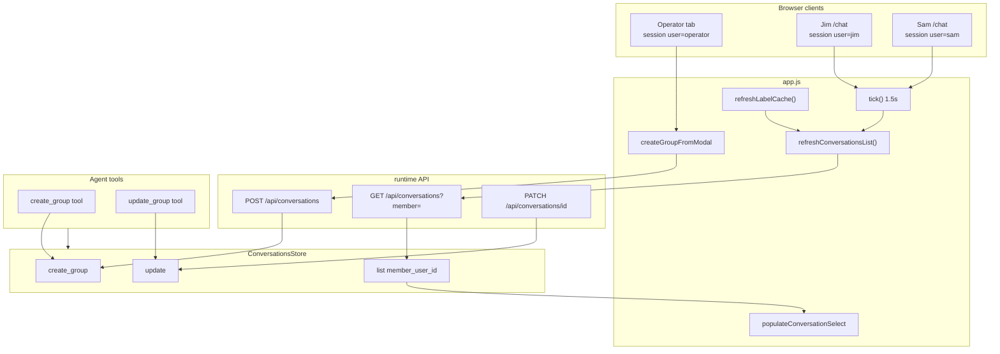
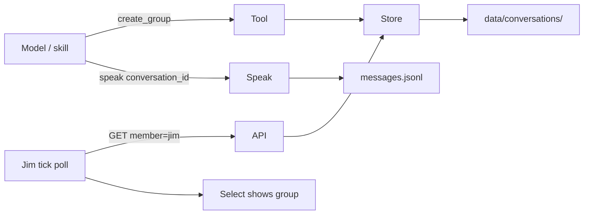

# Design: Conversation list UI discovery fix + create_group / update_group tools

| Field | Value |
|-------|--------|
| **Class** | DESIGN |
| **Document** | Conversation list discovery refresh; `create_group` / `update_group` agent tools |
| **Product** | project-elyra |
| **Author** | _(implement owner)_ |
| **Date** | 2026-08-07 |
| **Status** | **Draft** (rev 2 — review issues addressed) |
| **Version** | v1.1 — dogfood follow-on to multi-user conversations v2 |
| **Base tip** | `feature/multi-user-conversations` @ ~`8c9a8c7` (PR2–PR8 multi-user stack landed; live Gate A/B/C unsigned) |
| **Feature branch** | **`feature/elyra-conv-tool`** — cut from `feature/multi-user-conversations` @ base tip. **All implement PRs stack on this branch; land tip on `feature/elyra-conv-tool`** (then merge that branch into multi-user / `working` after dogfood). Do **not** branch from stale `working` without the multi-user store/API/UI. |
| **Parent design** | [design-multi-user-conversations.md](design-multi-user-conversations.md) (v2 concurrent client sessions) |
| **Dogfood STATE** | [multi-user-conversations-dogfood.md](../../state/multi-user-conversations-dogfood.md) |
| **Related** | Parent OQ6 (operator not auto-member); KD11 impersonation ≠ auth; residual #131 C auth; packaging #118 / #129 residual dogfood |

---

## Overview

Live dogfood after multi-user conversations v2 found that **group topology is correct on disk and in orient**, but **member clients on `/chat` cannot discover newly created groups** without a full page reload. Root cause is client-side: `tick()` refreshes status and messages only; `refreshLabelCache()` (which calls `GET /api/conversations?member=<sessionUser>`) is event-driven, not polled; list failures are swallowed into an empty select. Separately, the operator wants Elyra to **manage group topology like a social participant** via tools (`create_group` / `update_group`) so skills can later compose working groups — without treating the host operator as an automatic member or inventing product auth.

This design packages two tightly related fixes:

1. **UI discovery** — periodic (and event) refresh of the conversation select so Jim/Sam see groups they belong to within one list-poll interval (default 3s; dogfood bar ≤5s); list fetch fails **visibly** (deduped notices), not as silent “Private Chat only.”
2. **Agent tools** — thin builtins wrapping `ConversationsStore.create_group` / `.update` with the same semantics as `POST/PATCH /api/conversations`, registered like existing social/ledger tools (`kind: mutate`), with hermetic tests and dogfood acceptance notes.

**One-sentence outcome:** After create (UI or tool), any member’s open `/chat` or Glass tab discovers the group in the conversation select without a mystery reload; Elyra can create and update groups via tools using explicit member lists; operator remains forensic admin, not auto-social member.

---

## Background & Motivation

### Current state (verified on tip ~`8c9a8c7`)

| Surface | Path / behaviour | Gap |
|---------|------------------|-----|
| Conversations store | `elyra/conversations/store.py` — `create_group`, `update`, `list(member_user_id=…)` | Complete for REST/tools |
| REST CRUD | `elyra/runtime/api.py` — `GET/POST /api/conversations`, `PATCH /api/conversations/{id}` | Complete; member filter works |
| Label + select cache | `app.js` `refreshLabelCache` → `GET /api/conversations?member=` → `populateConversationSelect` | Runs on boot, user switch, conversation switch, post-create on **creating** tab only |
| Poll loop | `app.js` `tick()` every **1500ms** — `refreshStatus` + `refreshMessages` only | **Does not refresh conversation list** |
| List fetch error | `fetchJson(...conversations...).catch(() => ({ conversations: [] }))` | **Silent empty** — looks like “no groups” |
| Bound-group inject | `populateConversationSelect` injects `sessionConversationId` even when member-filtered list omits it | Operator-after-create can bind and “see” a group they are not a member of; members without bind see Private Chat only |
| Social tools | `elyra/tools/builtin/social.py` — `speak`, `wait_user`, `schedule_wake` | No topology mutators |
| ToolContext | `user_id`, `conversation_id`, `extras.social_kind`; store via `ConversationsStore(ctx.paths)` | Pattern ready for new tools |
| Tool arg schema | `elyra/tools/schema.py` — package schema is **model-facing**; **not** runtime-enforced | Handlers own fail-closed validation |

### Dogfood repro (operator discussion)

1. Operator creates group with members **Jim + Sam** (checklist may pre-check session user; operator may uncheck self — OQ6: explicit members only).
2. Store has correct `members: ["jim","sam"]`. Orient / active chats can surface the group.
3. On Jim’s and Sam’s `/chat` tabs, conversation select stays **Private Chat only** until full reload (or other event that calls `refreshLabelCache`).
4. Operator’s creating tab often **does** show the group because `createGroupFromModal` → `switchConversation(cid)` injects the bound group into the select even if `?member=operator` omits it — feels like “only operator can use groups.”

### Why tools in the same package

Motivating story (notification / issue-tracker skill is **out of scope** for implement):

- Anette asks Elyra to create work and loop in Jim + Sam.
- Elyra calls **`create_group`** (and later **`update_group`**) on ConversationsStore.
- A future deployment skill (e.g. `create_issue_workinggroup`) may compose tools + `speak` to DMs — **not** this design’s implement bar.
- Focus: **structure is interactable via tools** so skills can be built on top; same membership rules as REST.

### Operator-as-admin (design stance — inherit parent)

Parent design **OQ6 / KD11**:

- **Operator** = host admin: see all (forensic `view_mode=all` on operator `/`), impersonate all session users, debug — **prefer invisible to Elyra’s social model**.
- Product principals (Anette / Jim / Sam) are real social members.
- **Do not auto-add operator** as group member on create unless the creator explicitly lists `operator`.
- True multi-user auth remains **#131 C** residual; forgeable `client_id` + impersonation stay honest dogfood.

This package documents that stance and fixes the discovery bug that made operator-only group use look intentional. Tiny UI honesty (e.g. notice when bound to a non-member group) is optional; large Glass redesign is out.

---

## Goals & Non-Goals

### Goals

1. **Member discovery without full reload:** after another client/tool creates a group that includes the session user, that user’s conversation select includes the group within **one list-poll interval** (`CONVERSATIONS_POLL_MS`, default **3000ms**). **Dogfood acceptance bar: ≤5s** (covers timer jitter, in-flight tick skip, and slow hosts — see KD-U1 / KD-U1a). Do **not** phrase the bar as “≤2 tick intervals” (1.5s `tick` ≠ list throttle).
2. **Visible list failures (deduped):** conversation list fetch errors surface a notice only when the error **changes** (or first failure after success); never silently render “no groups” when the API failed; preserve last good cache.
3. **Topology tools:** `create_group` and `update_group` builtins with TOOL.md (`kind: mutate`) + schema + runner, same store semantics as REST.
4. **Fail closed:** invalid user_ids / empty members / missing conversation / no update fields / wrong types → `ok=False` with **stable** `error_reason` (see §2.3.1 mapping table); no invented membership. Handlers own validation (schemas are not runtime-enforced).
5. **Actor ≠ forced member:** tools use `ctx.user_id` only as optional provenance in the result; **do not** inject operator or wake user into `members` unless listed in args.
6. **Hermetic tests:** tools unit tests + app.js **needle** tests for poll/create honesty + API membership list pin.
7. **Dogfood acceptance notes** for the new discovery + tools bar; update STATE checklist rows when implement lands.
8. **Key Decisions + PR Plan** for incremental ship (UI can land before tools).

### Non-Goals (OUT)

| Item | Disposition |
|------|-------------|
| Full company skill `create_issue_workinggroup` / issue trackers | Later skill package |
| Auto DM notify tool | Skills use existing `speak` |
| Real multi-user auth (#131 C) | Residual; forgeable dogfood remains |
| Per-convo keep trays, multi-moment, multi-pending waits | #131 / parent residuals |
| SSE / WebSocket product event bus | Alternative rejected for this package (see §Alternatives) |
| Large Glass redesign / multi-select redesign | Out |
| Forcing REST to require UsersStore existence for members | Keep REST parity; tools may soft-warn unknown-but-valid ids (optional) |
| Auto-add creator/operator to every group | Explicitly rejected (parent OQ6) |
| Delete group / archive / roles product | Out |
| Changing `list(member=)` semantics for operator “see all groups” | Forensic remains `view_mode=all` message feed, not fake membership |
| Full Playwright multi-window suite | Dogfood live D1–D4; hermetic needles only |

---

## Proposed Design

### Architecture (high level)



### 1. UI: conversation list discovery refresh

#### 1.1 Root cause (normative pin)

| Mechanism | Today | Required |
|-----------|--------|----------|
| `tick()` | status + messages (+ active panel) | **Also** refresh conversation list (throttled) |
| `refreshLabelCache` | boot / switch user / switch convo / create on creator tab | Keep all; plus tick-driven path |
| Conversations fetch `.catch(() => empty)` | Silent empty select | **Surface error** (deduped); keep prior cache on soft failure |
| Bound-group inject when not in member list | Operator “sees” non-member group | Keep inject for **current bind** only (avoid breaking mid-session); **do not** treat as discovery for other clients |

#### 1.2 Discovery SLA (normative — KD-U1 / KD-U1a)

| Layer | Value | Role |
|-------|--------|------|
| **`CONVERSATIONS_POLL_MS`** | **3000** (implement default; locked) | List throttle interval. List refresh is **not** every 1.5s tick. |
| **`tick` interval** | **1500** (existing) | Host poll for status/messages; may skip list when throttle not elapsed. |
| **Dogfood pass bar (D1/D2/T2)** | **≤5s** after create | Acceptance for operators; allows one missed tick (`tickInFlight`), clock skew, and slow GET. |
| **Expected happy path** | ≤ ~`CONVERSATIONS_POLL_MS` after create | Next eligible tick after throttle fires list GET. |

**Closed (was OQ-A):** do not leave poll interval open. Implementers use **3000ms**. Do not rephrase goals as “≤2 tick intervals.”

#### 1.3 Chosen approach: poll list inside tick with throttle (KD-U1)

**Decision:** Include conversation-list refresh in the existing 1.5s `tick()`, with a **throttle** so list is not re-fetched every tick if status/messages already dominate load.

```javascript
// app.js — normative defaults
const CONVERSATIONS_POLL_MS = 3000; // locked implement default (KD-U1a)
let lastConversationsPollAt = 0;
let conversationsListError = null; // last error string or null (for dedupe)
```

**`tick()` change (conceptual):**

```javascript
async function tick() {
  if (!sessionBooted) return;
  if (tickInFlight) return;
  tickInFlight = true;
  try {
    const tasks = [refreshStatus(), refreshMessages()];
    // Topology discovery for multi-client dogfood (throttled inside helper)
    if (shouldRefreshConversations()) {
      // .catch so list failure never aborts status/messages
      tasks.push(refreshConversationsList().catch(() => {}));
    }
    if (activePanel === "goals" || /* … existing panels … */) {
      tasks.push(refreshActivePanel().catch(() => {}));
    }
    await Promise.all(tasks);
  } catch {
    /* offline */
  } finally {
    tickInFlight = false;
  }
}

function shouldRefreshConversations() {
  return Date.now() - lastConversationsPollAt >= CONVERSATIONS_POLL_MS;
}
```

**Split vs reuse `refreshLabelCache`:**

| Option | Pros | Cons |
|--------|------|------|
| **A. Call full `refreshLabelCache` from tick** | One code path | Re-hits `/api/session` + `/api/users` every poll — heavier |
| **B. Extract `refreshConversationsList` only** (Recommended) | Light poll; session/users still on boot/switch | Small refactor |

**Recommended B — full list helper (normative fail-visible + dedupe, KD-U2):**

```javascript
async function refreshConversationsList({ force = false } = {}) {
  if (!force && !shouldRefreshConversations() && lastConversationsPollAt > 0) {
    return conversationsCache;
  }
  // Advance throttle at START of attempt (including failures): intentional.
  // Prevents tight retry spam on persistent offline; recovery waits one interval.
  // force: true (create / switch / boot) ignores throttle gate above and still
  // updates lastConversationsPollAt so the next background poll is spaced.
  lastConversationsPollAt = Date.now();
  const memberQ = encodeURIComponent(getSessionUserId());
  try {
    const convs = await fetchJson(`/api/conversations?member=${memberQ}`);
    conversationsCache = (convs && convs.conversations) || [];
    const prevErr = conversationsListError;
    conversationsListError = null;
    // Optional: skip full select rebuild when fingerprint unchanged (§1.8)
    populateConversationSelect(conversationsCache);
    updateConversationChrome();
    if (sessionConversationSelect) {
      sessionConversationSelect.title = "";
      sessionConversationSelect.removeAttribute("data-error");
    }
    // Clear sticky failure notice only when recovering from error → success
    if (prevErr) {
      showNotice("Conversation list restored");
    }
    return conversationsCache;
  } catch (err) {
    // Fail visibly — do NOT wipe cache to []
    const msg = String(err.message || err);
    // KD-U2: showNotice only when error string changes (or first failure).
    // Matches showNotice 8s non-sticky timeout (~app.js 598–607); avoids
    // thrashing every CONVERSATIONS_POLL_MS while API is down.
    if (conversationsListError !== msg) {
      conversationsListError = msg;
      showNotice(`Conversation list failed: ${msg}`);
    }
    // Always keep select title / data-error current (cheap, no toast spam)
    if (sessionConversationSelect) {
      sessionConversationSelect.title = `List refresh failed: ${msg}`;
      sessionConversationSelect.setAttribute("data-error", "1");
    }
    throw err;
  }
}

async function refreshLabelCache() {
  try {
    const [session, users] = await Promise.all([
      fetchJson("/api/session"),
      fetchJson("/api/users"),
    ]);
    applySessionPayload(session);
    // … usersCache / populateSessionSelect unchanged …
    await refreshConversationsList({ force: true });
  } catch {
    /* offline — existing soft path for session/users */
  }
}
```

**Remove** the silent `.catch(() => ({ conversations: [] }))` on the conversations leg. Session/users failures may still soft-fail as today; conversations failures must not invent empty membership.

**Throttle edge (normative):** `lastConversationsPollAt` updates even on failure — intentional anti-spam. Transient blips recover on the next interval (or immediately on `force: true` after create/switch). `force: true` does not wait on `tickInFlight` (create path is independent of `tick`).

#### 1.4 Force-refresh hooks (topology events)

Call `refreshConversationsList({ force: true })` (or full `refreshLabelCache`) after local topology mutates:

| Event | Existing | Change |
|-------|----------|--------|
| Boot / `?as=` | `refreshLabelCache` | Keep |
| `switchSessionUser` | `refreshLabelCache` | Keep (member filter changes) |
| `switchConversation` | `refreshLabelCache` | May slim to force list + messages if desired; keep correctness first |
| `createGroupFromModal` success | `switchConversation` → cache refresh | Force list **before** conditional switch so options include new group when session user ∈ members |
| Future: tool-created group (other client) | none | Covered by tick poll |

No server push required for this package.

#### 1.5 Bound-group inject honesty (KD-U4)

`populateConversationSelect` today (tip line anchors):

```7983:8018:elyra/runtime/web/app.js
function populateConversationSelect(conversations) {
  // …
  // Bound-group inject when already bound but member-filtered list omits it:
  // ~8005–8018 — synthetic push from sessionConversationId / sessionConversation
  // …
}
```

Forensic “All messages” option continues through ~8032–8039 (operator `/` only).

**Keep inject** so an operator (or any client) mid-bound to a group they left / never joined does not blank the select. **Clarify dogfood honesty:**

1. Prefer **not** auto-`switchConversation` after create when current session user ∉ `members` (see §1.6).
2. Optional small notice when injected option is not in member-filtered list:  
   `showNotice("Bound to group not in your member list (forensic/impersonate).")` — **once per bind**, not every poll (avoid spam).  
3. Product `/chat` (`PRODUCT_CHAT`): same member filter; forensic “All messages” remains operator `/` only.

#### 1.6 Create-group UI: stop pretending non-members “own” the group (KD-U3)

In `createGroupFromModal` (tip ~8201–8245; today always `switchConversation(cid)` when `cid` set ~8234–8235):

**Change:**

```javascript
const sessionUid = getSessionUserId();
const members = /* from form */;
// ... POST create ...
// force list even if tick is mid-flight (independent of tickInFlight)
await refreshConversationsList({ force: true });
if (cid && members.includes(sessionUid)) {
  await switchConversation(cid);
} else if (cid) {
  showNotice(
    `Created ${conv.name || cid} (you are not a member — switch session user or add yourself to open it).`
  );
  await refreshMessages({ force: true });
}
```

This aligns UI with social membership and removes the false signal that only the creating operator tab can use groups. Operator who **checks self** in the member list still auto-switches (explicit membership).

Modal pre-check of session user stays (dogfood convenience); unchecking operator remains valid (parent OQ6).

#### 1.7 Sequence: multi-client discovery

```mermaid
sequenceDiagram
  participant Op as Operator browser
  participant API as /api/conversations
  participant Store as ConversationsStore
  participant Jim as Jim /chat tick

  Op->>API: POST {name, members:[jim,sam]}
  API->>Store: create_group(...)
  Store-->>API: group:abc
  API-->>Op: 201 conversation
  Op->>Op: refresh list; no switch if op∉members

  Note over Jim: within CONVERSATIONS_POLL_MS (dogfood ≤5s)
  Jim->>API: GET ?member=jim
  API->>Store: list(member_user_id=jim)
  Store-->>API: [group:abc, ...]
  API-->>Jim: conversations[]
  Jim->>Jim: populateConversationSelect includes group
```

#### 1.8 Performance and select rebuild UX

- List endpoint is index-backed (`ConversationsStore.list`); dogfood scale is tens of conversations, not thousands.
- Throttle at 3s means ~0.33 list GETs/s/client; acceptable on localhost dogfood.
- If future scale needs push, add SSE later without changing store semantics.

**Open `<select>` rebuild (accepted dogfood residual):**  
`populateConversationSelect` rebuilds `innerHTML` on every successful list refresh. At dogfood scale this is fine, but an **open** dropdown may collapse / reset focus every ~3s. **Accept for this package.** Optional micro-opt (not required for PR1 green): skip `populateConversationSelect` when a fingerprint of `{id, name}` sets is unchanged (still run `updateConversationChrome` if needed). Document in STATE if operators hit it; do not block ship.

---

### 2. Tools: `create_group` and `update_group`

#### 2.1 Placement and registration (match social/ledger pattern)

| Artifact | Path |
|----------|------|
| Handlers | `elyra/tools/builtin/social.py` (Recommended — topology is social address) **or** new `elyra/tools/builtin/conversations.py` if social.py size becomes painful |
| Package note | Update `elyra/tools/builtin/__init__.py` docstring list |
| Bundled packages | `tools/bundled/create_group/{TOOL.md,schema.json,runner.json}` |
| | `tools/bundled/update_group/{TOOL.md,schema.json,runner.json}` |
| Discovery | Existing `ToolRegistry` bundled root scan — no registry special-case |
| Store access | `ConversationsStore(ctx.paths)` (same as `_resolve_conversation_id` in `social.py`) |

**TOOL.md frontmatter (normative — KD-T6):**

```yaml
---
name: create_group   # must match directory name
description: Create a multi-party group conversation (explicit members only; does not auto-add operator).
kind: mutate
---
```

```yaml
---
name: update_group
description: Update a group conversation name, description, or full member list.
kind: mutate
---
```

`kind: mutate` matches ledger mutators (`create_goal`, `update_goal`). Registry policy strips `counts_as_speak` for non-speak kinds (T-G9 safe by default).

**Runner pattern** (mirror speak / create_goal):

```json
{
  "kind": "builtin",
  "entry": "elyra.tools.builtin.social:create_group"
}
```

```json
{
  "kind": "builtin",
  "entry": "elyra.tools.builtin.social:update_group"
}
```

#### 2.2 Tool naming (KD-T1)

| Name | Rationale |
|------|-----------|
| **`create_group` / `update_group`** (chosen) | Matches store methods and REST group path; model-clear; not confused with DMs |
| Rejected: single `manage_conversation` | Overloaded; harder schemas; model thrash |
| Rejected: `create_conversation` | Ambiguous with `ensure_dm` |
| Rejected: `patch_group` | Less consistent with ledger `update_goal` / `update_task` |

Two tools mirror ledger `create_goal` / `update_goal` and REST POST vs PATCH.

#### 2.3 Semantics — parity with store + REST

Reuse validation from store; do not reimplement membership math. **Handlers own fail-closed checks** — package JSON Schema is model-facing only (`elyra/tools/schema.py` does not runtime-validate args).

**`create_group` → `ConversationsStore.create_group`**

| Arg | Required | Notes |
|-----|----------|-------|
| `name` | yes | Non-empty string (handler + store strip) |
| `members` | yes | Non-empty list of user_id strings; **strip + dedupe preserve order** via `_clean_tool_members` (same policy as REST `_clean_members_list`, without HTTP side effects); then `validate_user_id` each |
| `description` | no | If key **absent** → omit (store default null). If **present** and not `str` and not `None` → **`invalid_description`** (fail closed — do not silent-drop). If `str` → pass through (store strips empty → null). If explicit `null` → null |
| `conversation_id` | no | Only for tests/seeds; must be `group:…` if set; collision → `conversation_exists` |

**Does not:**

- Auto-insert `ctx.user_id` or `"operator"` into members.
- Create DMs (use speak / session ensure_dm path).
- Notify members (skills call `speak`).

**Success payload (model-visible):**

```python
{
  "conversation": {
    "id": "group:…",
    "type": "group",
    "name": "…",
    "description": "…" | None,
    "members": ["jim", "sam"],
    "created_at": "…",
    "updated_at": "…",
    "last_message_at": None,
  },
  # Optional soft fields:
  "member_labels": {"jim": "Jim", "sam": "Sam"},  # if UsersStore available
  "actor_user_id": "anette" | None,  # ctx.user_id snapshot; not a member claim
}
```

**Failure payload contract (ledger-aligned — KD-T7):**

```python
ToolResult(
    ok=False,
    payload={
        "error_reason": "<stable_string>",  # echo ToolResult.error_reason
        "detail": "...",  # optional: which user_id, store message, etc.
    },
    error_reason="<stable_string>",
)
```

Do **not** use a bare `payload={"reason": ...}` key; use **`error_reason`** consistently on both `ToolResult` and payload (matches ledger `task_not_found` / `no_fields_to_update` patterns).

##### 2.3.1 Stable `error_reason` map (normative)

**Pre-store (handler-owned)** — check before calling store:

| `error_reason` | Condition |
|----------------|-----------|
| `missing_name` | `name` key absent, or not a non-empty str after strip |
| `invalid_name` | `name` present but wrong type (non-str) |
| `missing_members` | `members` absent, or empty after clean |
| `invalid_members` | `members` not a list, or element not a string |
| `invalid_user_id` | `validate_user_id` fails after strip; `detail` = bad raw id |
| `invalid_description` | `description` key present and value is neither `str` nor `None` |
| `invalid_conversation_id` | create: present but not usable `group:…` / fails `validate_conversation_id` |
| `missing_conversation_id` | update: arg absent/blank |
| `not_a_group` | update: id validates but does not start with `group:` (refuse before store) |
| `no_fields_to_update` | update: none of `name` / `description` / `members` keys present (or only empty kwargs) |

**Store / post-call mapping** — `_map_store_error(exc)`:

| Source | Match (substring / type) | `error_reason` |
|--------|--------------------------|----------------|
| `KeyError` | any (store: `conversation not found: …`) | `conversation_not_found` |
| `ValueError` | `"already exists"` | `conversation_exists` |
| `ValueError` | `"no update fields"` | `no_fields_to_update` |
| `ValueError` | `"group name cannot be null"` | `invalid_name` |
| `ValueError` | `"name must be"` | `invalid_name` |
| `ValueError` | `"members must be"` | `invalid_members` / `missing_members` (empty list → missing) |
| `ValueError` | `"description must be"` | `invalid_description` |
| `ValueError` | `"must be group"` / `"create_group conversation_id must be group"` | `invalid_conversation_id` |
| `ValueError` | `"dm members must be"` | `not_a_group` (should be unreachable if handler refuses DM first) |
| `ValueError` | `"invalid conversation_id"` | `invalid_conversation_id` |
| `ValueError` | other | `invalid_args` — payload `detail=str(exc)` |
| `OSError` / unexpected | any | `store_error` — payload `detail=str(exc)` |

**Pin for tests T-G3–T-G7:** assert `result.error_reason == …` **and** `result.payload.get("error_reason") == …`. Prefer handler pre-checks so common cases never depend on free-form store wording; map table covers defense in depth when store raises.

**`update_group` → `ConversationsStore.update`**

| Arg | Required | Notes |
|-----|----------|-------|
| `conversation_id` | yes | **Args only** (KD-T4) — never default from `ctx.conversation_id`. Must be `group:…`; else `not_a_group` |
| `name` | no* | If key present: non-empty str required for groups (null → `invalid_name`) |
| `description` | no* | If key present: `str` or `None`. **`None` clears** (store). Empty string → store strips to null. Wrong type → `invalid_description` |
| `members` | no* | Full replace list; strip+dedupe+validate like create |
| *at least one of name/description/members | yes | else `no_fields_to_update` |

**Members replace semantics (document in TOOL.md):**  
Passing `members` **replaces** the full set (store contract). To add Jim, model must pass previous members + jim (or skill helper later). No inventing merge from ctx.

**Description omit vs null (normative, match store/REST):**

| Call site | Behavior |
|-----------|----------|
| create: key absent | store `description=None` |
| create: `description=""` | store strips → null |
| create: `description=123` | **handler** `invalid_description` (fail closed) |
| update: key absent | field not in kwargs (`_UNSET`) |
| update: `description=null` | clear description |
| update: `description="x"` | set stripped |
| update: wrong type | `invalid_description` |

#### 2.4 Actor / ToolContext (KD-T2)

| Concern | Rule |
|---------|------|
| **Who is actor?** | Wake / tool `ctx.user_id` (session speaker on social wakes; may be null on pure work) |
| **Members list** | **Only** from args — never union with actor |
| **created_by meta** | Store schema today has **no** `created_by` field. **Do not** add schema in this package. Include `actor_user_id` in **tool result only**. Future: soft `meta.created_by` — out |
| **conversation_id on ctx** | Irrelevant for create. For update: **args only** — fail closed `missing_conversation_id` if omitted (never default from `ctx.conversation_id`) |
| **social_kind** | Unused for topology tools |
| **counts_as_speak** | `False` |
| **ends_moment** | `False` |
| **kind** | `mutate` in TOOL.md frontmatter |

##### 2.4.1 `_clean_tool_members` (mandatory — REST parity strip)

Match `api.py` `_clean_members_list` strip/dedupe/order policy **without** HTTP 400 writes:

```python
def _clean_tool_members(
    members: Any,
) -> tuple[list[str] | None, str | None, str | None]:
    """Return (clean_ids, error_reason, detail)."""
    from elyra.identity.layout import validate_user_id

    if members is None:
        return None, "missing_members", None
    if not isinstance(members, list):
        return None, "invalid_members", "members must be a list"
    if not members:
        return None, "missing_members", None
    clean: list[str] = []
    seen: set[str] = set()
    for m in members:
        if not isinstance(m, str):
            return None, "invalid_members", "members must be user_id strings"
        try:
            uid = validate_user_id(m.strip())  # strip before validate (REST parity)
        except ValueError as exc:
            return None, "invalid_user_id", f"{m!r}: {exc}"
        if uid not in seen:
            seen.add(uid)
            clean.append(uid)
    if not clean:
        return None, "missing_members", None
    return clean, None, None
```

Store `create_group` does **not** strip before `validate_user_id`; tools **must** strip in the handler so `" jim "` matches REST.

**UsersStore existence:** REST does **not** require id ∈ `list_user_ids()` — only `validate_user_id`. Tools match REST (KD-T3). Optional soft `unknown_members` warning in success payload only.

##### 2.4.2 Complete handler sketches (fail-closed)

```python
def _tool_err(reason: str, *, detail: str | None = None) -> ToolResult:
    payload: dict[str, Any] = {"error_reason": reason}
    if detail:
        payload["detail"] = detail
    return ToolResult(ok=False, payload=payload, error_reason=reason)


def _map_store_error(exc: BaseException) -> ToolResult:
    if isinstance(exc, KeyError):
        return _tool_err("conversation_not_found", detail=str(exc))
    if isinstance(exc, OSError):
        return _tool_err("store_error", detail=str(exc))
    msg = str(exc)
    low = msg.lower()
    if "already exists" in low:
        return _tool_err("conversation_exists", detail=msg)
    if "no update fields" in low:
        return _tool_err("no_fields_to_update", detail=msg)
    if "group name cannot be null" in low or "name must be" in low:
        return _tool_err("invalid_name", detail=msg)
    if "members must be" in low:
        return _tool_err("invalid_members", detail=msg)
    if "description must be" in low:
        return _tool_err("invalid_description", detail=msg)
    if "must be group" in low or "invalid conversation_id" in low:
        return _tool_err("invalid_conversation_id", detail=msg)
    if "dm members must be" in low:
        return _tool_err("not_a_group", detail=msg)
    return _tool_err("invalid_args", detail=msg)


def create_group(args: dict[str, Any], ctx: ToolContext) -> ToolResult:
    from elyra.conversations import ConversationsStore, validate_conversation_id

    raw_name = args.get("name")
    if raw_name is None and "name" not in args:
        return _tool_err("missing_name")
    if not isinstance(raw_name, str):
        return _tool_err("invalid_name", detail="name must be a string")
    if not raw_name.strip():
        return _tool_err("missing_name")

    clean, m_err, m_detail = _clean_tool_members(args.get("members"))
    if m_err:
        return _tool_err(m_err, detail=m_detail)

    # description: omit vs null vs str — fail closed on wrong type
    desc_kw: str | None
    if "description" not in args:
        desc_kw = None  # store default
    else:
        description = args.get("description")
        if description is not None and not isinstance(description, str):
            return _tool_err("invalid_description", detail="description must be str or null")
        desc_kw = description  # str or None; store strips empty str → null

    cid_kw: str | None = None
    if "conversation_id" in args and args.get("conversation_id") not in (None, ""):
        raw_cid = args.get("conversation_id")
        if not isinstance(raw_cid, str):
            return _tool_err("invalid_conversation_id")
        try:
            cid_kw = validate_conversation_id(raw_cid.strip())
        except ValueError as exc:
            return _tool_err("invalid_conversation_id", detail=str(exc))
        if not cid_kw.startswith("group:"):
            return _tool_err("invalid_conversation_id", detail="must be group:…")

    try:
        rec = ConversationsStore(ctx.paths).create_group(
            name=raw_name,
            members=clean,  # type: ignore[arg-type]
            description=desc_kw,
            conversation_id=cid_kw,
        )
    except (ValueError, KeyError, OSError) as exc:
        return _map_store_error(exc)

    payload: dict[str, Any] = {
        "conversation": rec,
        "actor_user_id": (
            str(ctx.user_id).strip()
            if ctx.user_id and str(ctx.user_id).strip()
            else None
        ),
    }
    labels = _optional_member_labels(ctx, rec.get("members") or [])
    if labels:
        payload["member_labels"] = labels
    return ToolResult(ok=True, payload=payload)


def update_group(args: dict[str, Any], ctx: ToolContext) -> ToolResult:
    """Partial group update — args conversation_id only; members full replace."""
    from elyra.conversations import ConversationsStore, validate_conversation_id

    raw_cid = args.get("conversation_id")
    if not isinstance(raw_cid, str) or not raw_cid.strip():
        return _tool_err("missing_conversation_id")
    try:
        cid = validate_conversation_id(raw_cid.strip())
    except ValueError as exc:
        return _tool_err("invalid_conversation_id", detail=str(exc))
    if not cid.startswith("group:"):
        return _tool_err("not_a_group", detail=cid)

    # Existence: prefer get() for clear conversation_not_found before update
    store = ConversationsStore(ctx.paths)
    existing = store.get(cid)
    if existing is None:
        return _tool_err("conversation_not_found", detail=cid)
    if existing.get("type") != "group":
        return _tool_err("not_a_group", detail=cid)

    kwargs: dict[str, Any] = {}
    if "name" in args:
        name = args.get("name")
        if name is None:
            return _tool_err("invalid_name", detail="group name cannot be null")
        if not isinstance(name, str) or not name.strip():
            return _tool_err("invalid_name")
        kwargs["name"] = name
    if "description" in args:
        description = args.get("description")
        if description is not None and not isinstance(description, str):
            return _tool_err("invalid_description")
        kwargs["description"] = description  # None clears; str strips in store
    if "members" in args:
        clean, m_err, m_detail = _clean_tool_members(args.get("members"))
        if m_err:
            return _tool_err(m_err, detail=m_detail)
        kwargs["members"] = clean

    if not kwargs:
        return _tool_err("no_fields_to_update")

    try:
        rec = store.update(cid, **kwargs)
    except (ValueError, KeyError, OSError) as exc:
        return _map_store_error(exc)

    payload: dict[str, Any] = {
        "conversation": rec,
        "actor_user_id": (
            str(ctx.user_id).strip()
            if ctx.user_id and str(ctx.user_id).strip()
            else None
        ),
    }
    labels = _optional_member_labels(ctx, rec.get("members") or [])
    if labels:
        payload["member_labels"] = labels
    return ToolResult(ok=True, payload=payload)
```

**Handler order for `update_group` (normative):**  
(1) require `conversation_id` arg → (2) validate format → (3) refuse non-`group:` (`not_a_group`) → (4) get / missing → `conversation_not_found` → (5) build kwargs only for **present** keys with type checks → (6) empty kwargs → `no_fields_to_update` → (7) `store.update` → map errors.

#### 2.5 TOOL.md guidance (model-facing)

**`create_group` TOOL.md essentials:**

- Frontmatter: `name: create_group`, `kind: mutate`.
- Use when a human asks to start a multi-party room or working group.
- Pass **explicit** `members` user_ids (from orient Participants / users the human named). Prefer real identity ids (`jim`, `sam`), not display names alone.
- **Do not** assume operator is a member. Do not add yourself (Elyra) — Elyra is never in `members`.
- After create, **`speak`** to `conversation_id` returned if the room needs a message; members discover the room via Glass/chat list refresh (≤5s dogfood).
- Not a substitute for `speak` / `wait_user`.

**`update_group` TOOL.md essentials:**

- Frontmatter: `name: update_group`, `kind: mutate`.
- Rename, re-describe, or **replace** members.
- Always pass `conversation_id` (`group:…`); host does not default from the current wake room.
- `members` is full replacement — include everyone who should remain.
- Cannot empty members; cannot convert group→DM.
- Unknown / non-member session users will stop seeing the group after their next list poll (UI package).

#### 2.6 Schemas

**create_group schema.json:**

```json
{
  "type": "object",
  "properties": {
    "name": {
      "type": "string",
      "description": "Group display name (non-empty)"
    },
    "members": {
      "type": "array",
      "minItems": 1,
      "items": { "type": "string" },
      "description": "Human user_ids in the group. Explicit only; host does not auto-add operator or wake user."
    },
    "description": {
      "type": "string",
      "description": "Optional group description"
    },
    "conversation_id": {
      "type": "string",
      "description": "Optional group:<id> for tests/seeds; omit to mint UUID"
    }
  },
  "required": ["name", "members"],
  "additionalProperties": false
}
```

**update_group schema.json:**

```json
{
  "type": "object",
  "properties": {
    "conversation_id": {
      "type": "string",
      "description": "group:<id> to update (required; not taken from wake context)"
    },
    "name": { "type": "string", "description": "New non-empty group name" },
    "description": {
      "type": "string",
      "description": "New description; omit to leave unchanged. Host null/clear via explicit null if the model API allows; empty string strips to null."
    },
    "members": {
      "type": "array",
      "minItems": 1,
      "items": { "type": "string" },
      "description": "Full replacement member list (non-empty)"
    }
  },
  "required": ["conversation_id"],
  "additionalProperties": false
}
```

Note: JSON Schema cannot easily express “at least one of name|description|members”; enforce in handler (`no_fields_to_update`). Schema is **not** runtime-enforced — handlers must reject empty `members: []` even though `minItems` helps the model.

#### 2.7 Interaction with UI discovery

Tool-created groups do not push to browsers. **UI poll (PR1)** is the discovery path for Jim/Sam. Dogfood acceptance must run tools **and** open member tabs without reload.

Optional later: status snapshot `conversations_epoch` / `updated_at` max for cheaper etag — **out** of this package.



---

### 3. Operator-admin clarity (docs / tiny UI)

| Role | Social membership | Forensic capability |
|------|-------------------|---------------------|
| **Product user** (jim/sam/anette) | Explicit in `members[]`; sees group via `?member=` | None |
| **Operator session user** | Only if listed in `members[]` | Operator `/` has “All messages (forensic)”; can impersonate any user via session switch |
| **Elyra (assistant)** | Never in `members[]` | N/A — addresses via `conversation_id` |

**Honesty phrases (keep parent copy):**

- Operator rail: **“Session user (impersonate)”**
- `/chat` footer: **“local dogfood — not authenticated.”**
- New optional: create-without-self notice (§1.6)

Document in dogfood STATE under acceptance / residuals: concurrent discovery poll is **dogfood UX**, not auth or push product. **Do not claim #131 C auth fixed.**

---

## API / Interface Changes

### REST

**No contract change** required. Tools wrap existing store; UI uses existing `GET ?member=`.

Optional non-breaking response header later (`X-Elyra-Conversations-Updated`) — out.

### Client (`app.js`)

| Symbol | Change |
|--------|--------|
| `tick` | Schedule conversations list refresh when throttle elapsed |
| `refreshConversationsList` | **New** (or extract) — force flag, fail-visible, notice dedupe |
| `refreshLabelCache` | Use shared list refresh; remove silent empty catch |
| `createGroupFromModal` | Conditional `switchConversation`; force list refresh |
| `populateConversationSelect` | Keep inject; optional non-member notice; optional fingerprint skip |
| Constants | `CONVERSATIONS_POLL_MS = 3000` |

### Tools

| Interface | Change |
|-----------|--------|
| `create_group(args, ctx) -> ToolResult` | New (`kind: mutate`) |
| `update_group(args, ctx) -> ToolResult` | New (`kind: mutate`) |
| Bundled packages | New directories with frontmatter name + kind |
| `ToolContext` | No new fields required |

### Store

No API change. Optional future `meta.created_by` deferred.

---

## Data Model Changes

**None required.** Existing Conversation record:

```text
id, type, members, name, description, created_at, updated_at, last_message_at
```

Tools write the same JSON under `data/conversations/` as REST. Reset policy unchanged (clear conversations with messages — parent KD9).

---

## Alternatives Considered

### A. Discovery transport

| Alternative | Pros | Cons | Verdict |
|-------------|------|------|---------|
| **1. Poll list in tick (throttled)** | Minimal surface; works multi-client; matches status/messages pattern | ≤3s lag; extra GET | **Chosen** |
| **2. SSE / EventSource on topology change** | Instant | New server channel, reconnect, auth theater; overkill for dogfood scale | Reject for this package |
| **3. Long-poll or status-embedded conversation ids** | One fewer endpoint | Bloats status; couples presence worker to social index | Reject |
| **4. Full page reload instruction only** | Zero code | Fails dogfood UX bar; “mystery” remains | Reject as sole fix |
| **5. BroadcastChannel / localStorage event** | Multi-tab same browser | Fails remote colleague / multi-machine dogfood | Reject as sole fix; optional micro-opt later |

### B. Tool shape

| Alternative | Pros | Cons | Verdict |
|-------------|------|------|---------|
| **Two tools create/update** | Clear schemas; ledger parallel | Two packages | **Chosen** |
| Single `group` tool with `action` enum | One name | Schema thrash; worse validation | Reject |
| REST-only (no tools); model uses run/curl | No new builtins | Breaks sandbox model tools story; skills can’t compose cleanly | Reject |
| Auto-add `ctx.user_id` to members | “Creator always in room” | Violates operator-admin / OQ6; surprises pure-work null ctx | Reject |

### C. Create UI auto-switch

| Alternative | Pros | Cons | Verdict |
|-------------|------|------|---------|
| Always switch (today) | Creator sees room | Non-member bind lie | Reject |
| Switch only if session user ∈ members | Honest social model | Operator must add self to enter | **Chosen** |
| Always switch + force-add session user to members | Creator always member | Invents membership | Reject |

---

## Security & Privacy Considerations

| Threat / concern | Severity | Mitigation |
|------------------|----------|------------|
| Forgeable `client_id` / impersonation | Accepted dogfood (#131 C) | Honest UI copy; no claim of auth |
| Tool invents members / adds operator | Med | Explicit members only; tests pin no auto-add |
| Invalid / path-traversal user_ids | Med | `validate_user_id` fail closed after strip |
| Model patches arbitrary group without ACL | Accepted dogfood | Same as REST — any process client can PATCH; document residual |
| Silent empty list hides failures / confuses membership | Med (UX→trust) | Visible deduped notice; preserve last good cache |
| Non-member bind via switchConversation | Low | Stop auto-switch when not member; inject remains for intentional forensic bind |
| Information leak of all groups via unfiltered list | Low on localhost | UI always uses `?member=`; forensic is messages `view=all`, not fake group membership |

**Fail closed summary:** bad ids → tool/HTTP error; missing fields → error; empty members → error; wrong description type → `invalid_description`; DM update via `update_group` → `not_a_group`; no silent member injection.

---

## Observability

| Signal | Where |
|--------|-------|
| UI notice on list fetch failure | `showNotice` **only when `conversationsListError` changes** (KD-U2); select `title` / `data-error` every failure |
| Recovery notice | Optional short “Conversation list restored” when error clears |
| Tool failures | `ToolResult.error_reason` + payload echo in moment beats |
| Store create/update | Existing atomic JSON writes; optional INFO log `conversation_created id=… members=N` if cheap |
| Metrics | None required for dogfood package |

---

## Testing Strategy

### Hermetic — tools

New `tests/test_tools_conversations_group.py` (or extend social tests):

| ID | Case |
|----|------|
| T-G1 | `create_group` happy path → store has record; members exact; id `group:` |
| T-G2 | `create_group` does **not** add `ctx.user_id=operator` when members=`[jim,sam]` |
| T-G3 | Invalid user_id → `error_reason=invalid_user_id` on result **and** payload; no record |
| T-G4 | Empty members / missing name → fail closed; non-str description → `invalid_description` |
| T-G5 | `update_group` rename + description (incl. null clear) |
| T-G6 | `update_group` members full replace; strip `" jim "` → `jim` |
| T-G7 | `update_group` missing id / not found / not a group / no fields — stable reasons |
| T-G8 | Registry discovers both tools; TOOL.md `kind: mutate` |
| T-G9 | `counts_as_speak` is False |
| T-G10 | Collision `conversation_id` → `conversation_exists` |

### Hermetic — multi-client discovery / app.js needles (normative for PR1)

This repo pins UI contracts with **needle tests** (e.g. `tests/test_api_glass.py` `test_static_app_js_active_panel_poll` asserts `tasks.push(refreshActivePanel`). PR1 **must** add analogous needles — not optional.

| ID | Case |
|----|------|
| T-U1 | **API:** POST group members jim+sam; `GET ?member=jim` returns group (pin/extend `tests/test_conversations_api.py` if thin) |
| T-U2 | **Needle:** `app.js` contains `refreshConversationsList` (or equivalent name) and `CONVERSATIONS_POLL_MS` |
| T-U3 | **Needle:** `tick` schedules conversations refresh (`shouldRefreshConversations` and/or `tasks.push` of list refresh) |
| T-U4 | **Needle:** **absence** of conversations-leg silent empty — no `.catch(() => ({ conversations: [] }))` (or no `conversations: []` catch adjacent to `/api/conversations`) |
| T-U5 | **Needle:** `createGroupFromModal` membership gate — e.g. `members.includes(sessionUid)` (or equivalent) before `switchConversation` |

Full Playwright multi-window is **not** required; live dogfood covers D1–D4.

### Manual dogfood (STATE)

See §Dogfood acceptance.

---

## Rollout Plan

1. **Feature branch:** **`feature/elyra-conv-tool`** cut from `feature/multi-user-conversations` @ ~`8c9a8c7`. Execute-plan stacks all PRs here; **tip lives on this branch**.
2. **PR order:** UI discovery first (unblocks live dogfood #2/#7), then tools, then docs/STATE.
3. **Feature flags:** none required (dogfood-only host).
4. **Rollback:** revert app.js poll + tool packages; store/REST unchanged.
5. **Land path:** accumulate on **`feature/elyra-conv-tool`** → dogfood → merge into `feature/multi-user-conversations` and/or `working` when ready (not direct land to `working` mid-stack).

---

## Dogfood acceptance notes (new bar)

Add to `docs/state/multi-user-conversations-dogfood.md` (implement PR3):

### Discovery (extends Gate B/C acceptance #2 / #7)

| # | Scenario | Pass |
|---|----------|------|
| **D1** | Operator creates group members=jim+sam **without** operator; Jim `/chat` open already | Within **≤5s**, Jim select shows group name **without** full page reload |
| **D2** | Same for Sam concurrent window | Same (≤5s) |
| **D3** | Operator create tab when operator ∉ members | Notice that operator is not a member; select does **not** auto-bind as member |
| **D4** | Kill API mid-session (or bad proxy) | **One** notice “Conversation list failed…” (or only on error change); previous groups remain; select may show `data-error` / title; **not** wiped to Private-only; no toast every 3s |

### Tools

| # | Scenario | Pass |
|---|----------|------|
| **T1** | In a moment, model/`registry.execute` `create_group(name, members=[jim,sam])` | Store record correct; tool payload returns id |
| **T2** | Member clients discover tool-created group via poll (no reload) | Same as D1 (≤5s) |
| **T3** | `update_group` add member (full list replace) | New member discovers on poll; removed member loses list entry on poll |
| **T4** | `create_group` with ctx.user_id=operator and members without operator | operator **not** in members |

---

## Risks

| Risk | Severity | Mitigation |
|------|----------|------------|
| Poll load on slow hosts | Low | 3s throttle; list is cheap |
| Notice spam on persistent offline | Med | **KD-U2:** notice only when error string changes; title/`data-error` every time |
| Open select collapses every poll | Low | Accepted dogfood residual (§1.8); optional fingerprint skip |
| Throttle delays recovery after error | Low | Intentional; `force: true` on create/switch still immediate |
| Model mis-uses members replace (drops people) | Med | TOOL.md warnings; skills should list_get first if we add `get_group` later (out) |
| Operator still confused about forensic vs member | Low | KD-U3 + STATE honesty |
| social.py grows large | Low | Split to `conversations.py` if review prefers |
| Race: create then immediate speak before members poll | Low | Speak uses conversation_id directly; members see messages when they open group; list lag only affects select |

---

## Open Questions

| ID | Question | Resolution |
|----|----------|------------|
| ~~OQ-A~~ | Exact `CONVERSATIONS_POLL_MS`? | **Closed → KD-U1a:** default **3000ms**; dogfood bar **≤5s** |
| OQ-B | Soft-warn unknown UsersStore ids in tools? | Optional; default **no block** (REST parity) |
| OQ-C | Add `get_group` / `list_groups` tools for model? | **Out** this package; orient active chats may suffice; revisit if skills thrash |
| OQ-D | Persist `meta.created_by` on create? | **Out** unless free; result-only `actor_user_id` enough |
| OQ-E | Should `update_group` allow DM name polish? | **No** — group tool only |
| OQ-F | New branch vs same feature branch? | **Locked:** new branch **`feature/elyra-conv-tool`** from multi-user tip; land tip there |

---

## Key Decisions

| ID | Decision | Rationale |
|----|----------|-----------|
| **KD-U1** | **Throttle-poll conversation list from `tick()`** (extract `refreshConversationsList`); do not rely on full reload or SSE. | Fixes multi-client discovery with minimal architecture; matches existing 1.5s poll culture. |
| **KD-U1a** | **`CONVERSATIONS_POLL_MS = 3000` locked implement default; dogfood discovery SLA ≤5s** (D1/D2/T2). Goal is “within one list-poll interval,” not “≤2 ticks.” | Single pass/fail bar for implementers and operators; closes OQ-A. |
| **KD-U2** | **List fetch fails visibly; preserve last good cache; remove silent `[]` catch; `showNotice` only when `conversationsListError` changes** (or first failure after success); always update select `title` / `data-error`. | Silent empty hid bugs; undeduped notices every 3s thrash 8s sticky UI. |
| **KD-U3** | **After UI create, `switchConversation` only if session user ∈ members**; force list refresh always (`force: true`, independent of `tickInFlight`). | Ends non-member bind lie; aligns operator-admin vs social membership (parent OQ6). |
| **KD-U4** | **Keep bound-group inject** for already-bound session ids not in member list. | Avoids blank select mid-forensic/impersonate; discovery for others is poll+membership. |
| **KD-U5** | **PR1 hermetic needles mandatory** (refresh helper, poll constant, tick schedule, no silent empty catch, create membership gate). | Matches repo app.js needle culture; prevents silent regression. |
| **KD-T1** | **Two tools: `create_group` + `update_group`**, named after store methods. | Clear schemas; REST/store parity; ledger parallel. |
| **KD-T2** | **Actor is `ctx.user_id` for result provenance only; never auto-added to members.** | Operator invisible to social model unless explicit; pure-work null ok. |
| **KD-T3** | **Validation = store + `validate_user_id` after strip (REST parity)**; do not require UsersStore existence for membership. | Consistent with `POST /api/conversations`; no surprise 400 vs tool ok split. |
| **KD-T4** | **`update_group` requires explicit args `conversation_id` only** (never from `ctx.conversation_id`); members field is **full replace**. | Fail closed; no accidental ctx-room patch; same as store. |
| **KD-T5** | **Handlers live in social builtin family** (or conversations module with social registration); bundled packages + runner like `speak` / `create_goal`. | Discoverable; skills compose with speak. |
| **KD-T6** | **TOOL.md `kind: mutate`**, `name` matches directory (`create_group` / `update_group`). | Catalog/policy consistency with ledger mutators. |
| **KD-T7** | **Stable `error_reason` map (§2.3.1)**; echo on `ToolResult` and payload; handler pre-check before store; `_map_store_error` for defense in depth. | Prevents drift to free-form `invalid_args:{exc}` only; tests pin strings. |
| **KD-T8** | **Non-string non-null `description` → `invalid_description`** (no silent drop); update omit vs null matches store/REST. | Fail closed; schemas not runtime-enforced. |
| **KD-O1** | **Operator forensic ≠ membership**; no design change to auth (#131 C). | Honesty; parent KD11. |
| **KD-B1** | **Stack on `feature/elyra-conv-tool`** (from multi-user tip); UI PR before tools; **land tip on `feature/elyra-conv-tool`**. | Isolates conv-tool work from multi-user tip; UI unblocks Gate B/C independently. |

---

## References

- Parent: `docs/design/glass/design-multi-user-conversations.md` (v2, KD1–KD25, OQ6 operator not auto-member)
- STATE: `docs/state/multi-user-conversations-dogfood.md`
- UI: `elyra/runtime/web/app.js` — `refreshLabelCache` (~7927+), `populateConversationSelect` (~7983–8049; inject ~8005–8018), `tick` (~9697+), `createGroupFromModal` (~8201–8245; switch ~8234–8235), `showNotice` (~598–607, 8s timeout)
- Store: `elyra/conversations/store.py` — `create_group`, `update`, `list`
- REST: `elyra/runtime/api.py` — `/api/conversations` CRUD, `_clean_members_list`
- Social tools: `elyra/tools/builtin/social.py`, `tools/bundled/speak/`, `tools/bundled/wait_user/`
- Ledger tool pattern: `elyra/tools/builtin/ledger.py`, `tools/bundled/create_goal/`
- Types: `elyra/tools/types.py` — `ToolContext`, `ToolResult`
- Sessions: `elyra/runtime/client_sessions.py` — membership keep-group on user switch
- Tests: `tests/test_conversations.py`, `tests/test_conversations_api.py`, `tests/test_tools_social_wait.py`, `tests/test_client_sessions.py`, `tests/test_api_glass.py` (app.js needles)

---

## PR Plan

**Branch base:** `feature/elyra-conv-tool` cut from `feature/multi-user-conversations` @ ~`8c9a8c7`.  
**Stack / land tip:** all execute-plan PRs assemble onto **`feature/elyra-conv-tool`** (not back onto multi-user mid-work; not `working` until dogfood).  

Each PR independently reviewable and hermetic-green. Recommended order: **UI first** (unblocks live dogfood), then tools, then docs/STATE.

### PR1 — UI: conversation list discovery refresh

| Field | Value |
|-------|--------|
| **Title** | fix(glass): poll conversation list so members discover new groups |
| **Depends on** | Multi-user stack on branch (already landed store/API/select) |
| **Files / components** | `elyra/runtime/web/app.js` (`tick`, `refreshLabelCache`, new `refreshConversationsList` / throttle helpers, `createGroupFromModal`, optional inject notice); `tests/test_api_glass.py` (or sibling) needles T-U2–T-U5; optional API pin T-U1 |
| **Description** | Extract forced conversation list fetch; call from throttled `tick` with **`CONVERSATIONS_POLL_MS = 3000`**; remove silent empty catch; preserve last cache on error; **`showNotice` only when error string changes** (always update select title/`data-error`); create-group auto-switch only when session user ∈ members; force list refresh after create (independent of `tickInFlight`). Throttle timestamp advances on failure (anti-spam). No REST/store changes. |
| **Tests** | **Mandatory needles** T-U2–T-U5; T-U1 API pin if missing; manual dogfood D1–D4 |
| **Risk** | Low–med (poll load); rollback = revert app.js |

### PR2 — Tools: create_group + update_group

| Field | Value |
|-------|--------|
| **Title** | feat(tools): create_group and update_group conversation topology tools |
| **Depends on** | Store/REST already on branch; **not** blocked on PR1 (but dogfood of tool→UI discovery needs PR1) |
| **Files / components** | `elyra/tools/builtin/social.py` (or `conversations.py` + `__init__.py` note); `tools/bundled/create_group/{TOOL.md,schema.json,runner.json}` with **`kind: mutate`**; `tools/bundled/update_group/…` same; `tests/test_tools_conversations_group.py` |
| **Description** | Builtin handlers wrapping `ConversationsStore.create_group` / `.update`; strip+dedupe members like REST; fail-closed description/types; stable `error_reason` map §2.3.1 with payload echo; no auto-member injection; args-only update `conversation_id`; hermetic T-G1–T-G10. |
| **Tests** | New hermetic suite; registry discovery; kind mutate |
| **Risk** | Low (additive tools) |

### PR3 — Docs + dogfood STATE acceptance

| Field | Value |
|-------|--------|
| **Title** | docs: group list discovery + topology tools dogfood bar |
| **Depends on** | PR1 + PR2 (or land docs with PR2 if UI already merged). If STATE is edited before PR3 completes, a one-line residual (“discovery poll pending / tools pending”) is optional only — not required for PR1 merge. |
| **Files / components** | `docs/state/multi-user-conversations-dogfood.md` (D1–D4 with ≤5s, T1–T4); optional short note in parent design or `docs/design/glass/` link-only; skills catalog note only if talk skill should mention topology tools |
| **Description** | Record acceptance scenarios, operator-admin honesty, residual “no push / poll lag ≤5s / open-select rebuild”; do not mark gates green without live evidence. |
| **Tests** | n/a |
| **Risk** | Low |

### Optional PR0 (if design lands in-repo first)

| Field | Value |
|-------|--------|
| **Title** | docs: design conversation list fix + create/update_group tools |
| **Depends on** | — |
| **Files** | `docs/design/glass/design-conversation-list-and-group-tools.md` (copy of this design) |
| **Description** | Design-only land for execute-plan linkage. |
| **Risk** | Low |

### Merge / land guidance

- **Default execute-plan stack base / parent for assembly:** `feature/elyra-conv-tool` (not `main` / not bare `working`).
- PR1 alone is enough to re-open live Gate B/C group discovery without tools.
- PR2 enables skill composition; verify T2 with PR1 on same tip.
- Do not claim #131 C auth fixed.
- After PR0–PR3 are on **`feature/elyra-conv-tool`**, dogfood that tip; then merge **`feature/elyra-conv-tool` → `feature/multi-user-conversations`** (and later `working`) when ready.
