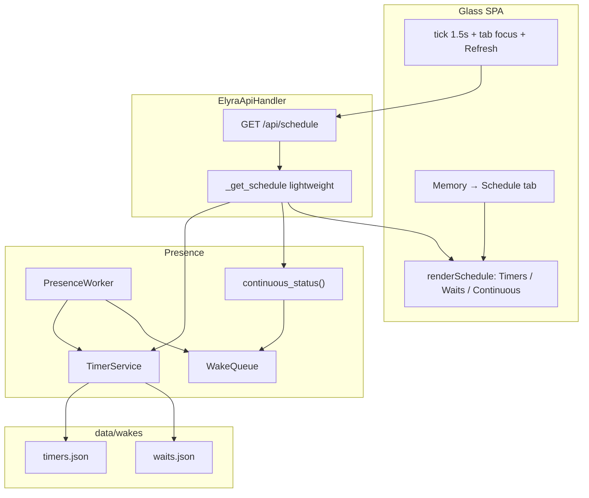

# Design: Glass Memory timer/wait inspection (timer-vis / #126)

| Field | Value |
|-------|--------|
| **Class** | DESIGN |
| **Product** | project-elyra |
| **Author** | _TBD_ |
| **Date** | 2026-08-06 |
| **Status** | Active |
| **Issue** | [#126](https://github.com/jtwolfe/project-elyra/issues/126) — Glass Memory: timer/wait inspection (schedulability surface) |
| **Feature branch** | `feature/timer-vis` (created from `working` @ `ecc5537`) |
| **Integration tip** | Land stack on `feature/timer-vis`; merge **once** to `working` when complete ([branch-law](../../dev/branch-law.md)) |
| **Primary surfaces** | `elyra/presence/timers.py`, `elyra/presence/worker.py`, `elyra/runtime/api.py`, `elyra/runtime/web/{index.html,app.js,style.css}`, tests |
| **Related** | #67 wake storms (inspect only), #68 restart awareness, #130 continuous re-eval (sibling — thin strip only), #86 soft-refresh fingerprints |

---

## Overview

Operators today cannot answer “what is scheduled to fire next and why?” without reading `data/wakes/timers.json` and `data/wakes/waits.json` on disk. Goals are visible on the Goals panel; continuous autopilot is partially visible via status meta; **pending `schedule_wake` timers and `wait_user` waits have no Glass surface**.

This design adds a **Memory → Schedule** tab backed by a thin read API `GET /api/schedule`, powered by the existing `TimerService.list_timers` / `list_waits` store (no new persistence). The tab shows **active timers and waits** (next-due first), optional **last-N terminal history** (ordered by original due/expiry, not fire time), and a **thin continuous strip** with the same field shape as `/api/status` continuous — built via a **lightweight** path (not a full `status_snapshot()`). Editing/cancelling timers, storm hygiene (#67), and continuous policy changes (#130) are out of scope.

---

## Background & Motivation

### Current runtime shape (code, not aspiration)

```text
schedule_wake tool ──► TimerService.schedule_timer ──► data/wakes/timers.json
wait_user tool     ──► TimerService.arm_wait        ──► data/wakes/waits.json
                              │
                     PresenceWorker poll
                              │
              schedule_due / check_timeouts
                              │
                     WakeQueue events.jsonl
                              │
                     moment open (kind=timer | wait_timeout)
```

| Component | Path / symbol | Reality today |
|-----------|----------------|---------------|
| Timer/wait store | `elyra/presence/timers.py` | `PendingTimer`, `PendingWait`, `TimerService`; statuses `scheduled`/`fired`/`cancelled` (timers) and `pending`/`answered`/`timed_out`/`cancelled` (waits) |
| List APIs | `TimerService.list_timers(status=…)`, `list_waits(status=…)` | Default **active-only** (`scheduled` / `pending`); `status=None` returns all; sorted by `wake_at` / `expires_at` ascending |
| Social tools | `elyra/tools/builtin/social.py` | `schedule_wake` → `schedule_timer`; `wait_user` → `arm_wait` (+ `ends_moment`) |
| Worker | `elyra/presence/worker.py` | Owns `self._timers`; `status_snapshot()` exposes `pending_wait` (**first** pending wait only) + `continuous.pending_moment_continues` |
| Glass API | `elyra/runtime/api.py` | Catalogs: `/api/goals`, `/api/moments`, `/api/memory/*` — **no schedule endpoint** |
| Memory UI | `elyra/runtime/web/index.html` + `app.js` | Tabs: Context, Moments, Atoms, Vectors, Graph — **no Schedule** |
| Soft refresh | `app.js` `stableFingerprint`, `lastGoalsFp`, … | #86 / BUG-glass-03: poll every 1.5s; replace DOM only when fingerprint changes |
| Goals UI pattern | `renderGoals` (~L2607) | `list-panel` + `article.card` + `.badge` + `.meta` |

### Live dogfood snapshot (illustrative, host data)

On a long-running home (not normative):

- `timers.json`: ~22 rows — typically a few `scheduled`, rest `fired` (often grok_build polls + goal-linked backstops with `goal_id` set).
- `waits.json`: ~100+ rows — mostly terminal (`answered` / `timed_out`); pending waits appear only while glass is waiting on the user.

**Pain:** operators debugging “why did she wake?” or “is the weekly self-review still armed?” must `cat` JSON. `pending_wait` on `/api/status` only shows **one** wait and **no** timers.

### Why Memory, not Goals

- Goals are **ledger intent**; timers/waits are **presence schedulability**.
- Memory already hosts Moments (work-loop tapes) and Context (meal) — schedule is the third operational time surface.
- Goals page stays focused on open goals/tasks; linking `goal_id`/`task_id` on timer cards bridges the two without redesign.

---

## Goals & Non-Goals

### Goals

1. Operator opens **Memory → Schedule** and sees all **active** timers (`scheduled`) and waits (`pending`) without reading disk.
2. Each timer row shows: `wake_at`, status, reason, `goal_id` / `task_id` when present, timer `id` (compact), plus relative due label that **stays current** while the tab is open (not frozen by soft-refresh).
3. Each wait row shows: `expires_at`, status, prompt, `user_id`, choices (if any), `moment_id` when present, wait `id`, same relative-time rule.
4. Sort: timers by `wake_at` ascending (next due first); waits by `expires_at` ascending.
5. Optional **show recent history** (~last 20 terminal rows per stream by original due/expiry time), not full unbounded dump.
6. Thin continuous strip: enabled + streak + pending `moment_continue` count (read-only; same keys as `continuous_status_block`).
7. Thin API: `GET /api/schedule` — no mutators in this feature.
8. Soft poll while Memory/Schedule is active; fingerprint avoids full list rebuild thrash (#86) **without** freezing relative-time labels (see Soft-refresh & relative time).
9. Dogfood: after `schedule_wake` / `wait_user`, rows appear; after fire/answer/timeout, they leave active list (and show in history when toggled).

### Non-Goals

| Out | Why |
|-----|-----|
| Cancel/edit timers or waits from Glass | Explicit #126 OUT; mutators later if trivial |
| #67 wake-storm prevention | Inspect helps observe storms; does not fix hygiene |
| Full calendar / goal due-date redesign | Different product |
| Full `events.jsonl` dump or wake-queue browser | Separate surface if needed |
| Continuous policy changes (#130) | Sibling; only **surface** existing continuous status fields |
| New store / schema migration | Snapshots already durable |
| GC of terminal rows in `timers.json` / `waits.json` | Optional follow-up; history limit is query-time only |
| Intermediate merges to `working` | All work stacks on `feature/timer-vis` |
| Sort history by true fire/answer wall time | Not persisted on rows today; out of scope |

---

## Key Decisions

| # | Decision | Rationale |
|---|----------|-----------|
| KD1 | **Memory tab named "Schedule"** (not Goals page, not a Status card alone) | Matches operator discussion; co-locates with Moments; room for three blocks |
| KD2 | **`GET /api/schedule`** as dedicated thin read API | Keeps `/api/status` lean; **routing** like goals/moments catalog GETs; **payload** closer to memory inspect (`ok` + structured blocks: counts, continuous, server_time) — not a bare `{"timers":…}` twin of goals |
| KD3 | **Reuse `TimerService.list_*` — no new store** | Single source of truth; avoid dual-write drift |
| KD4 | **Default active-only**; history opt-in via query + UI toggle | Active list is the glance surface; history is debug aid; disk may grow unbounded |
| KD5 | **Server-side filter/sort/limit** for history | Client must not pull full 100+ wait histories every 1.5s poll |
| KD6 | **Public `PresenceWorker.timers` property** | Avoid proliferating `worker._timers` SLF001 from API; mirrors existing `worker.queue` property |
| KD7 | **Lightweight continuous object in schedule payload** | Normative: build via `continuous_status_block` + `pending_of_kind("moment_continue")` only — **never** call full `status_snapshot()` from `_get_schedule` (that path also builds meal/context/memory/viewing). Prefer `worker.continuous_status()` helper or equivalent |
| KD8 | **Soft-refresh fingerprint + separate relative-time refresh** | Payload fingerprint prevents list rebuild thrash (#86); relative labels use minute-bucket fingerprint and/or text-node patch so “in Xm / overdue” does not freeze |
| KD9 | **No mutators / no cancel buttons** in v1 | Acceptance is inspect-only; reduces risk surface |
| KD10 | **All PRs land on `feature/timer-vis` only** | Stack or linear commits; single merge to `working` when dogfood-ready; rebase/merge `working` into feature tip before final land |
| KD11 | **Design doc path** `docs/design/glass/design-glass-timer-wait-inspection.md` | Matches glass/ taxonomy in `docs/design/README.md` |
| KD12 | **`server_time` drives relative-time math** | `formatRelativeWhen(iso, serverTimeIso)` uses server delta (fallback local if missing); floored server minute participates in soft-refresh so labels advance |

---

## Proposed Design

### Architecture



### Data flow (operator glance)

```mermaid
sequenceDiagram
  participant Op as Operator
  participant Glass as app.js
  participant API as GET /api/schedule
  participant TS as TimerService
  participant CS as continuous_status

  Op->>Glass: Open Memory → Schedule
  Glass->>API: ?view=active (include_history=0)
  API->>TS: list_timers / list_waits
  API->>CS: continuous_status_block + pending_of_kind
  Note over API: Filter primary rows; no status_snapshot
  API-->>Glass: timers, waits, counts, continuous, server_time
  Glass->>Glass: payload fp vs lastScheduleFp; rebuild cards if changed
  Glass->>Glass: relative-time patch if minute bucket advanced
  loop every 1.5s while Memory+Schedule active
    Glass->>API: soft poll
    API-->>Glass: payload
    Glass->>Glass: skip full rebuild if payload fp equal; still refresh relative labels
  end
  Note over Op,Glass: History toggle is PR4 only
  Op->>Glass: Toggle show recent history
  Glass->>API: ?view=active&include_history=1
  API-->>Glass: active + history_* arrays
```

### Backend: access path

1. Public properties / helpers on `PresenceWorker`:

```python
@property
def timers(self) -> TimerService:
    """Durable timer/wait store (Glass schedule inspect, tools)."""
    return self._timers

def continuous_status(self) -> dict[str, Any]:
    """Lightweight continuous block for Glass (same keys as status_snapshot continuous).

    Does **not** build meal/context/memory/viewing. Safe for /api/schedule.
    """
    with self._lock:
        pending_continues = len(self._queue.pending_of_kind("moment_continue"))
        return continuous_status_block(
            self._continuous,
            self.settings.continuous,
            pending_moment_continues=pending_continues,
        )
```

`continuous_status()` is the preferred API. If implementers inline the same construction in `_get_schedule` without a worker method, the **normative requirement** is still: same `continuous_status_block` keys, same `pending_of_kind` source, **no** `status_snapshot()`.

Verified continuous keys (must match exactly):

```text
enabled, streak, max_streak, cooldown_seconds,
last_enqueue_at, last_skip_reason, pending_moment_continues
```

2. In `ElyraApiHandler.do_GET`, route `path == "/api/schedule"` to `_get_schedule(qs)`.

3. `_get_schedule` reads via `self.worker.timers` — always the worker-owned instance (required field on `ElyraApiHandler` / `start_api_server`, same as goals/moments). Prefer **not** constructing a second `TimerService` from disk (would race the live map).

### API contract: `GET /api/schedule`

**Query parameters**

| Param | Default | Semantics |
|-------|---------|-----------|
| `view` | `active` | Default filter for primary arrays when status overrides omitted. Allowed: `active`, `all`. Unknown → 400. |
| `include_history` | `0` | `1` / `true` / `yes` → populate `history_timers` + `history_waits` (terminal only). Independent of `view`. |
| `history_limit` | `20` | Max terminal rows per history stream (clamp 0–100). |
| `timer_status` | _(omit)_ | Optional single-status filter for primary `timers`. Debug/curl aid; **v1 UI never sends this**. |
| `wait_status` | _(omit)_ | Optional single-status filter for primary `waits`. Debug/curl aid; **v1 UI never sends this**. |

#### Filter precedence (normative)

Primary **timers** and **waits** are filtered independently with the same rules:

| Priority | Condition | Primary timers / waits result |
|----------|-----------|-------------------------------|
| 1 | `timer_status` / `wait_status` present | Filter that stream to **that status only** (`view` ignored for that stream). Invalid status string → 400. |
| 2 | else `view=active` | Timers → `scheduled` only; waits → `pending` only. |
| 3 | else `view=all` | No status filter on that stream. Apply hard cap: first **200** rows of the ASC-sorted full list (by `wake_at`/`expires_at` then id). Documented for curl/debug; v1 UI does not use `view=all`. |
| — | `view` missing | Treat as `active`. |
| — | `view` not in `{active, all}` | **400** `invalid view`. |

Examples:

| Query | Primary timers | Primary waits |
|-------|----------------|---------------|
| _(defaults)_ | `scheduled` | `pending` |
| `view=active` | `scheduled` | `pending` |
| `view=all` | all statuses (cap 200) | all statuses (cap 200) |
| `view=active&timer_status=fired` | `fired` only | `pending` (view still applies to waits) |
| `timer_status=scheduled&wait_status=answered` | `scheduled` | `answered` |
| `view=nope` | 400 | 400 |

`include_history` does **not** change primary filters. History streams are always terminal-only subsets, independent of `view` / status overrides.

Valid timer statuses: `scheduled`, `fired`, `cancelled`.  
Valid wait statuses: `pending`, `answered`, `timed_out`, `cancelled`.

**Response 200**

```json
{
  "ok": true,
  "server_time": "2026-08-06T18:00:00.000000Z",
  "timers": [
    {
      "id": "…",
      "wake_at": "2026-08-13T11:12:43.922831Z",
      "reason": "Weekly self-review backstop …",
      "goal_id": "g_9a2e86c197a2",
      "task_id": null,
      "status": "scheduled",
      "wake_id": null
    }
  ],
  "waits": [
    {
      "id": "…",
      "prompt": "What next?",
      "choices": ["A", "B"],
      "user_id": "operator",
      "moment_id": "…",
      "expires_at": "…",
      "timeout": 300.0,
      "armed_at": "…",
      "status": "pending",
      "wake_id": null
    }
  ],
  "history_timers": [],
  "history_waits": [],
  "counts": {
    "timers_scheduled": 2,
    "timers_fired": 20,
    "timers_cancelled": 0,
    "timers_total": 22,
    "waits_pending": 0,
    "waits_answered": 78,
    "waits_timed_out": 35,
    "waits_cancelled": 0,
    "waits_total": 113
  },
  "continuous": {
    "enabled": false,
    "streak": 0,
    "max_streak": 8,
    "cooldown_seconds": 30,
    "last_enqueue_at": null,
    "last_skip_reason": null,
    "pending_moment_continues": 0
  }
}
```

Envelope note: top-level `ok: true` plus structured blocks is intentional (memory-inspect style). Goals/moments return bare `{"goals":…}` / `{"moments":…}`; schedule is richer and keeps `ok` for consistent error shape with memory endpoints.

**Field notes**

- Timer/wait objects: serialize via existing `PendingTimer.to_dict()` / `PendingWait.to_dict()` — **no secrets**; reason/prompt are operator-visible already.
- `counts`: full status tallies from in-memory maps (cheap O(n) over small lists). Enables UI badges without a second request. Always computed over the full maps, not the filtered primary slice.
- `history_*`: only when `include_history=1`; empty arrays otherwise (stable shape for fingerprinting).
- `continuous`: **lightweight only** — `continuous_status_block` + queue pending continues. Same keys as `/api/status` continuous. Do **not** invent new continuous fields. Do **not** call `status_snapshot()`.
- `server_time`: UTC ISO from the handler at response build time (`datetime.now(UTC)`).
- Sort primary timers: `wake_at` ASC, id ASC (matches `list_timers`).
- Sort primary waits: `expires_at` ASC, id ASC.
- **History sort (honest limitation):** history timers by `wake_at` DESC, then id; history waits by `expires_at` DESC, then id; take `history_limit`. These are **original schedule/expiry times**, not fire/answer wall times. A cancel long before due can rank “newer” than a just-fired older `wake_at`. UX copy: **“Recent by due/expiry time (not fire time)”** — do not claim “most recently completed.” Optional later: persist terminal event time (out of scope).
- Terminal timer statuses: `fired`, `cancelled`.  
  Terminal wait statuses: `answered`, `timed_out`, `cancelled`.

**Errors**

| Condition | Code | Body |
|-----------|------|------|
| Invalid `history_limit` (non-int) | 400 | `{"ok": false, "error": "invalid history_limit"}` |
| Invalid `view` | 400 | `{"ok": false, "error": "invalid view"}` |
| Invalid `timer_status` | 400 | `{"ok": false, "error": "invalid timer_status"}` |
| Invalid `wait_status` | 400 | `{"ok": false, "error": "invalid wait_status"}` |
| Unexpected store failure | 500 | `{"ok": false, "error": "schedule_unavailable"}` + log exception |

**Reset / worker:** Schedule is read-only GET. Match goals/moments catalog GETs: **do not** call `_reject_if_resetting` (that helper is for mutators). Always **200** with live maps when the process is serving. `worker` is a required handler attribute (not optional); no “missing worker” branch.

**Implementation sketch** (`api.py`)

```python
def _get_schedule(self, qs: dict[str, list[str]]) -> None:
    from datetime import UTC, datetime
    from elyra.presence.timers import (
        STATUS_SCHEDULED, STATUS_PENDING,
        STATUS_FIRED, STATUS_CANCELLED,
        STATUS_ANSWERED, STATUS_TIMED_OUT,
    )
    TIMER_STATUSES = {STATUS_SCHEDULED, STATUS_FIRED, STATUS_CANCELLED}
    WAIT_STATUSES = {
        STATUS_PENDING, STATUS_ANSWERED, STATUS_TIMED_OUT, STATUS_CANCELLED,
    }
    VIEW_ALL_CAP = 200

    view = (qs.get("view") or ["active"])[0].strip().lower()
    if view not in ("active", "all"):
        self._json(400, {"ok": False, "error": "invalid view"})
        return

    include_history = (qs.get("include_history") or ["0"])[0].lower() in (
        "1", "true", "yes",
    )
    try:
        history_limit = int((qs.get("history_limit") or ["20"])[0])
    except (TypeError, ValueError):
        self._json(400, {"ok": False, "error": "invalid history_limit"})
        return
    history_limit = max(0, min(100, history_limit))

    timer_status_raw = (qs.get("timer_status") or [None])[0]
    wait_status_raw = (qs.get("wait_status") or [None])[0]
    if timer_status_raw is not None and timer_status_raw not in TIMER_STATUSES:
        self._json(400, {"ok": False, "error": "invalid timer_status"})
        return
    if wait_status_raw is not None and wait_status_raw not in WAIT_STATUSES:
        self._json(400, {"ok": False, "error": "invalid wait_status"})
        return

    svc = self.worker.timers
    all_timers = svc.list_timers(status=None)  # wake_at ASC
    all_waits = svc.list_waits(status=None)

    # counts from full sets (all statuses)…
    # primary slices via precedence table…
    # history: terminal only, reverse by wake_at/expires_at, limit…
    # continuous: self.worker.continuous_status()  # NOT status_snapshot()
    server_time = datetime.now(UTC).isoformat().replace("+00:00", "Z")

    self._json(200, { ... })
```

**Do not change** `list_timers` / `list_waits` signatures unless a multi-status filter becomes clearly cleaner; calling with `status=None` and filtering in the handler is fine at current n≪1k.

### Frontend: Memory → Schedule tab

#### Markup (`index.html`)

Insert Schedule **after Moments** (time-adjacent). Resulting tab order:

```text
Context | Moments | Schedule | Atoms | Vectors | Graph
```

That is the sixth tab overall, not at end (OQ1 default).

```html
<button type="button" class="memory-tab" role="tab"
        data-memory-tab="schedule" aria-selected="false">
  Schedule
</button>
```

Panel structure (PR3 ships active-only chrome; history section added/enabled in PR4):

```html
<div id="memory-tab-schedule" class="memory-tab-panel" role="tabpanel" hidden>
  <p class="muted status-helper">
    Pending timers and user waits (next due first). Read-only.
  </p>
  <div id="schedule-continuous" class="card continuous-card status-card schedule-continuous">
    <!-- thin strip filled by JS -->
  </div>
  <!-- PR4: toolbar with history toggle; PR3 may omit toggle entirely -->
  <div class="schedule-toolbar">
    <span id="schedule-counts" class="muted status-helper"></span>
  </div>
  <section class="schedule-block" aria-label="Timers">
    <h3 class="schedule-heading">Timers <span id="schedule-timers-badge" class="badge">0</span></h3>
    <div id="schedule-timers-list" class="list-panel">loading…</div>
  </section>
  <section class="schedule-block" aria-label="Waits">
    <h3 class="schedule-heading">Waits <span id="schedule-waits-badge" class="badge">0</span></h3>
    <div id="schedule-waits-list" class="list-panel">loading…</div>
  </section>
  <!-- PR4 only: history block + toggle -->
</div>
```

**List class choice:** use plain `list-panel` (not `list-panel-auto`). `list-panel-auto` is tuned for Moments list+detail (~42% height). Two stacked schedule lists plus continuous strip would over-constrain short viewports. Revisit only after dogfood if scroll feels wrong.

Reuse existing classes: `.card`, `.card-head`, `.badge`, `.badge-open`, `.meta`, `.list-panel`, `.muted`, `.continuous-card` — minimal CSS for spacing (`.schedule-block`, `.schedule-heading`, `.schedule-toolbar`).

**PR3 wiring checklist (implementers):**

1. Tab button with `data-memory-tab="schedule"`  
2. Panel `id="memory-tab-schedule"` (so `setMemoryTab` key match works)  
3. `refreshMemory` branch for `schedule`  
4. No hash/deep-link (none exists for other memory tabs today)

#### JS wiring (`app.js`)

| Piece | Behavior |
|-------|----------|
| `memoryActiveTab === "schedule"` | `refreshMemory` dispatches to `refreshSchedule` |
| `refreshSchedule({ force })` | PR3: `GET /api/schedule` (defaults = active, no history). PR4: add `include_history` from toggle |
| `lastScheduleFp` | Payload fingerprint (rows + continuous + counts + history when present) — **not** relative labels alone |
| `lastScheduleMinuteFp` | Floored minute from `server_time` (or local fallback) for relative-time refresh |
| `renderSchedule(data)` | Full rebuild of cards/lists |
| `patchScheduleRelativeTimes(data)` | Update only relative/overdue text nodes when payload unchanged but minute advanced |
| History toggle | **PR4 only** — `change` → `refreshSchedule({ force: true })` |
| Tab click | existing `setMemoryTab` + `refreshMemory({ force: true })` |

#### Soft-refresh & relative time (normative — PR3)

Goals-style payload fingerprint alone is **insufficient**: ISO `wake_at` / `expires_at` stay fixed while labels like “in 2h” must change with wall/server clock.

**Required dual mechanism:**

1. **Payload fingerprint** (`lastScheduleFp`): `stableFingerprint` over identity-bearing fields that justify a list rebuild:
   - timer/wait rows: `id`, `status`, `wake_at`/`expires_at`, `reason`/`prompt`, `goal_id`, `task_id`, `user_id`, `choices`, `moment_id`, `wake_id`
   - `counts` active-relevant fields (or full counts object)
   - `continuous`: at least `enabled`, `streak`, `pending_moment_continues`, `last_skip_reason`, `last_enqueue_at`
   - `history_*` when include_history is on (PR4)
   - **Do not** require full DOM rebuild solely because `server_time` advanced

2. **Relative-time refresh** (one of the following is required; prefer hybrid):

   | Approach | When |
   |----------|------|
   | **(Preferred hybrid)** Include floored server minute (`server_time` truncated to minute) in a **secondary** check: if payload fp unchanged but minute changed → call `patchScheduleRelativeTimes` only (no wipe of list nodes / scroll). | Default for PR3 |
   | **(a)** Fold floored server minute into the main fingerprint so full re-render happens each minute | Acceptable if patch is too fiddly; slightly more flash risk |
   | **(b)** Always patch relative text nodes after every soft poll even when payload fp matches | Also fine |

Near-window special case is **not** required if minute-bucket refresh is implemented (every active row updates at least once per minute). Optional: more frequent patch when any active due is within 1h (cosmetic).

**Relative time helper** (uses `server_time`):

```javascript
function formatRelativeWhen(iso, serverTimeIso) {
  // now = Date.parse(serverTimeIso) if valid, else Date.now()
  // future → "in 5m" / "in 2h" / "in 3d"
  // past + active status → "overdue" (not "in 0s")
  // past + terminal (history) → formatRelativeAge style ("3m ago") using same now base
}

function serverMinuteBucket(serverTimeIso) {
  // floor to UTC minute string for fingerprint / secondary check
}
```

Cards store `data-due-iso` and `data-status` on meta spans so patch can recompute without full rebuild.

For **active** rows with due time in the past (race before presence poll): show **overdue** rather than “in 0s”.

**Card layout (timers)** — Goals-style:

```text
┌─────────────────────────────────────────────┐
│ Weekly self-review backstop…     [scheduled]│
│ wake 2026-08-13T11:12Z · in 6d · id c810…  │
│ goal g_9a2e86c197a2                         │
└─────────────────────────────────────────────┘
```

- Title line: `reason` (fallback: short id) + status badge  
  - `scheduled` / `pending` → `badge-open`  
  - terminal history → plain `.badge`; `timed_out` / `cancelled` may use `badge-bad` if readable
- Meta: absolute ISO (compact) + relative via `formatRelativeWhen(iso, data.server_time)`
- Extra line: `goal_id` / `task_id` when present; no GoalsStore join in v1

**Card layout (waits)**:

```text
┌─────────────────────────────────────────────┐
│ What would you like to do?         [pending]│
│ expires … · in 4m · user operator           │
│ choices: A · B                              │
│ moment …                                    │
└─────────────────────────────────────────────┘
```

**Continuous strip** (read-only):

Reuse copy pattern from `formatContinuousMeta` / Status continuous card:

- `continuous: on · streak 2/8 · pending continues 1`  
- If off: `continuous: off`  
- No toggle on this tab (toggle stays rail + Status panel).

**Empty states**

- No timers: `No scheduled timers.`  
- No waits: `No pending waits.`  
- History empty (PR4): `No recent terminal rows (by due/expiry time).`

#### Poll integration

Existing `tick()` → `refreshActivePanel()` → `refreshMemory()` when `activePanel === "memory"`. Only the active memory tab is refreshed — add:

```javascript
if (memoryActiveTab === "schedule") {
  await refreshSchedule({ force });
  return;
}
```

No new global interval. Force full rebuild on: tab focus / Memory Refresh (`force: true`), history toggle (PR4). Soft tick: payload fingerprint + relative-time patch as above.

### CSS

Minimal; prefer existing tokens:

- `.schedule-block { margin-top: 0.75rem; }`
- `.schedule-heading { font-size: 0.9rem; … }`
- `.schedule-toolbar { display: flex; gap: …; align-items: center; }`
- Optional: overdue meta color `var(--bad)` or `var(--warn)`
- Do **not** force `list-panel-auto` height caps on schedule lists

No new fonts/deps.

### Worker/API module docstring touch-ups

Update `api.py` module scope comment to include schedule inspect. Optionally one line in `timers.py` module doc: “Glass: GET /api/schedule”.

---

## API / Interface Changes

### New

| Method | Path | Auth | Mutates |
|--------|------|------|---------|
| GET | `/api/schedule` | Same as other glass GETs (local operator console) | No |

### Unchanged (consumers)

- `TimerService.schedule_timer` / `arm_wait` / `list_*` semantics  
- `/api/status` `pending_wait` and `continuous` (keep; Schedule is richer)  
- Social tools schemas  

### Worker surface (required for clean API)

```python
# elyra/presence/worker.py
@property
def timers(self) -> TimerService:
    return self._timers

def continuous_status(self) -> dict[str, Any]:
    """Lightweight continuous block; keys match continuous_status_block."""
    ...
```

No change to tool `ctx.timers` injection.

---

## Data Model Changes

**None.** Snapshots remain:

| File | Row type | Active status | Terminal |
|------|----------|---------------|----------|
| `data/wakes/timers.json` | `PendingTimer` | `scheduled` | `fired`, `cancelled` |
| `data/wakes/waits.json` | `PendingWait` | `pending` | `answered`, `timed_out`, `cancelled` |

History is a **query projection**, not a new log. No migration. No terminal-event timestamp field in v1.

**Scale note:** current dogfood sizes (tens of timers, low hundreds of waits) fit in-process list + JSON response ≪100KB. If wait history grows to thousands, add prune later (#67-adjacent hygiene) — not this feature. API caps history at 100; `view=all` primary cap 200.

---

## Alternatives Considered

### A1 — Embed schedule into `GET /api/status`

| Pros | Cons |
|------|------|
| One poll already running | Bloats status every 1.5s even on Chat panel |
| No new route | Harder to filter history/limits without always sending full lists |

**Reject:** status is already dense (provider, usage, memory, continuous, media…). Schedule is a dedicated catalog GET.

### A2 — Schedule as a Goals sub-panel

| Pros | Cons |
|------|------|
| Timers often have `goal_id` | Waits are social, not ledger; Moments already under Memory |
| | Goals panel would mix CRUD intent with presence |

**Reject:** operator discussion preferred Memory tab; goals link as fields is enough.

### A3 — Client-only: fetch raw files via new static route

| Pros | Cons |
|------|------|
| “Simple” | Bypasses live in-memory maps; race with worker; no continuous strip; no stable API |

**Reject:** always go through `TimerService` on the worker.

### A4 — Full wake-queue + events.jsonl browser

| Pros | Cons |
|------|------|
| Deep debug | Scope explosion; OUT of #126 |

**Defer:** Schedule is the schedulability glance surface only.

### A5 — Mutating cancel buttons in v1

| Pros | Cons |
|------|------|
| Operator power | Issue OUT; needs confirm UX + presence race tests |

**Defer** unless a follow-up issue explicitly asks.

### A6 — Reuse full `status_snapshot()` for continuous in schedule

| Pros | Cons |
|------|------|
| One code path | Doubles heavy meal/memory/context work on every Schedule poll while `/api/status` already runs in `tick` |

**Reject:** KD7 lightweight path only.

---

## Security & Privacy Considerations

| Topic | Treatment |
|-------|-----------|
| Auth | Same trust model as rest of glass (loopback operator console). No new public exposure model. |
| Secrets | Timer `reason` / wait `prompt` may contain operator-sensitive task text — already on disk and in wake payloads; do not log full prompts in server `_LOG` at INFO. |
| Injection | Escape all text via existing `escapeHtml` in card builders (never `innerHTML` with raw reason/prompt). |
| Path traversal | No path params; query ints / enums only. |
| CSRF | GET read-only; no cookie session mutator. |
| Multi-user | Show `user_id` on waits honestly; no cross-user filtering in v1 (single-operator dogfood). Future multi-user meal work (#111 batch) may filter later. |

**Threat model (abbrev):** local operator reads presence schedule; no elevation. Do not expose host absolute paths (response already relative ids only).

---

## Observability

| Layer | What |
|-------|------|
| API | No new metrics required. Optional debug: existing patterns don’t count GETs. |
| Failures | `_json(400, …)` for bad query; if `list_*` throws unexpectedly, 500 with `{"ok": false, "error": "schedule_unavailable"}` and log exception. |
| UI | `panelLoadError("Schedule", e)` on hard failure; soft poll swallows via existing `tick` catch. |
| Dogfood | Manual: schedule_wake → row appears; fire → moves to history; wait_user → pending wait; answer → clears; relative labels tick over minutes without list flash. |

---

## Risks

| Risk | Severity | Mitigation |
|------|----------|------------|
| DOM thrash every 1.5s | Med | Payload fingerprint soft-refresh (#86 pattern) |
| Relative labels freeze while payload stable | Med | Minute-bucket secondary check + `patchScheduleRelativeTimes` (or full re-render on minute change) — PR3 acceptance |
| Large waits.json slows GET | Low→Med | History limited; active filter; optional later GC |
| Overdue active rows confuse “next due” | Low | Sort still by wake_at; show “overdue” label |
| Dual continuous controls | Low | Schedule strip is **read-only** |
| Accidental full `status_snapshot` in schedule | Med | KD7 + code review; helper method name makes misuse obvious |
| `worker._timers` private access | Low | Public `timers` property (KD6) |
| Stack merge conflicts on `app.js` | Med | Small, isolated functions; land UI after API |
| Feature branch drifts behind `working` | Low | Rebase/merge `working` into `feature/timer-vis` before final land |

---

## Rollout Plan

### Branch strategy (critical)

```text
working @ ecc5537  (origin; may advance during implementation)
    └── feature/timer-vis          ← all PRs / commits land here
            ├── PR1 design doc
            ├── PR2 API + unit tests
            ├── PR3 Glass Schedule tab (active + continuous + relative-time refresh)
            └── PR4 history toggle + history render + dogfood checklist
                    └── merge/rebase working → feature/timer-vis
                    └── single PR: feature/timer-vis → working
```

- Prefer **Graphite-style stacked PRs** with base `feature/timer-vis` (or linear commits on the branch with the same PR boundaries).
- **Do not** merge intermediate PRs to `working` / `main`.
- **During implementation:** periodically merge or rebase `working` into `feature/timer-vis` as needed to reduce conflict risk (tip-following on the feature branch is allowed and encouraged).
- **Before final land:** merge or rebase latest `working` into `feature/timer-vis`, re-run hermetic suite, dogfood checklist, then open `feature/timer-vis` → `working`.

### Feature flags

None. Read-only surface; safe default-on.

### Rollback

Revert the feature branch merge; no data migration. UI tab absence is harmless; API 404 if only partial deploy (avoid partial: ship API before or with UI).

### Dogfood checklist (acceptance)

1. Open Memory → Schedule: see active timers (if any) without reading disk.  
2. `schedule_wake` (or wait for model) → new timer card within ~1.5s poll.  
3. Linked `goal_id` / `task_id` visible when present.  
4. `wait_user` → pending wait card with prompt/choices/`user_id`.  
5. Answer wait in chat → wait leaves active list.  
6. Timer fire (or past `wake_at` after presence tick) → leaves active; appears in history when toggled (PR4).  
7. Continuous strip matches Status continuous meta (enabled / pending continues).  
8. Soft poll does not flash/reset scroll when payload unchanged.  
9. Relative due labels update at least every minute while Schedule tab stays open (no stale “in 2h” for hours).  
10. History heading/copy does not claim fire-time ordering.

---

## Testing Plan

### Hermetic (`tests/`)

Use existing `_ApiHarness` from `tests/test_api_glass.py` (worker + shared `TimerService` already constructed). Obtain store via **`svc = h.worker.timers`** after KD6 property lands. Presence poll is **not** auto-running in harness — terminal transitions must be invoked **explicitly** on the service.

| Test | Steps / assert |
|------|----------------|
| Empty schedule | GET `/api/schedule` → 200; `timers`/`waits`/`history_*` empty; counts zero; `continuous` has required keys; `server_time` present; `ok` true |
| Schedule active timer | `svc.schedule_timer(future_iso, reason="r", goal_id="g1")` → GET → one timer `status=scheduled`, fields match |
| Arm wait | `svc.arm_wait(prompt=…, user_id=…, moment_id=…, timeout=300, choices=[…])` → GET → one wait `status=pending` |
| Fire → history | `svc.schedule_timer(past_iso, …)` → `svc.schedule_due(now=…)` → GET default: timer **not** in primary active; GET `?include_history=1`: id in `history_timers` with `status=fired` |
| Answer wait → history | `arm_wait` → `svc.mark_wait_answered(id)` → active empty for that id; history with `include_history=1` shows `answered` |
| Timeout wait → history | `arm_wait(expires_at=past)` → `svc.check_timeouts(now=…)` → history `timed_out` |
| Cancel timer → history | `schedule_timer` → `svc.cancel_timer(id)` → history `cancelled` when requested |
| History limit | Seed ≥2 terminal timers → `include_history=1&history_limit=1` → len(history_timers)==1 |
| Sort primary | Two scheduled with different `wake_at` → earlier first |
| Invalid query | `history_limit=x`, `view=nope`, `timer_status=bogus` → each 400 with documented error string |
| Continuous shape | Keys match `continuous_status_block`; calling schedule does not require status_snapshot (code review / no exception if memory store cold) |
| Optional unit | Pure helper for history slice / filter precedence if extracted |

### Manual / live

See dogfood checklist above. No `llm` / `live_grok` mark required for CI.

---

## Open Questions

| # | Question | Default if unresolved |
|---|----------|------------------------|
| OQ1 | Tab order: after Moments vs end of tab list? | **After Moments** → Context, Moments, Schedule, Atoms, Vectors, Graph |
| OQ2 | Join goal title from GoalsStore for display? | **No** in v1 — show raw `goal_id` only |
| OQ3 | Include queue depth for kind=timer in strip? | **No** — continuous only; queue stays on Status |
| OQ4 | Should overdue active timers auto-hide once fired mid-poll? | Next poll removes them when status flips; no client-side hide |
| OQ5 | Commit design on feature branch under `docs/design/glass/`? | **Yes** (PR1) — catalog row in `docs/design/README.md` |

---

## References

- Issue [#126](https://github.com/jtwolfe/project-elyra/issues/126)  
- Related: [#67](https://github.com/jtwolfe/project-elyra/issues/67) wake storms, [#68](https://github.com/jtwolfe/project-elyra/issues/68) restart awareness, [#130](https://github.com/jtwolfe/project-elyra/issues/130) continuous re-eval, [#86](https://github.com/jtwolfe/project-elyra/issues/86) soft-refresh  
- Code anchors:  
  - `elyra/presence/timers.py` — `PendingTimer`, `PendingWait`, `TimerService.list_timers`, `list_waits`  
  - `elyra/presence/worker.py` — `status_snapshot`, `_timers`, continuous block  
  - `elyra/runtime/api.py` — `GET /api/goals`, `GET /api/moments` patterns; `_reject_if_resetting` for mutators only  
  - `elyra/runtime/web/app.js` — `renderGoals`, `refreshMoments`, `stableFingerprint`, `refreshMemory`, `tick`  
  - `elyra/runtime/web/index.html` — `.memory-tabs`  
  - `elyra/tools/builtin/social.py` — `schedule_wake`, `wait_user`  
  - `elyra/loop/continuous_policy.py` — `continuous_status_block`  
- Branch law: [`docs/dev/branch-law.md`](../../dev/branch-law.md)  
- Prior glass design style: `docs/design/glass/design-glass-aurimago-gold-polish.md`  

---

## PR Plan

**Base branch for all implementation PRs:** `feature/timer-vis`  
**Stack tip origin:** `working` @ `ecc5537` (rebase/merge as `working` advances)  
**Final land:** one PR `feature/timer-vis` → `working` after PR1–PR4 (or equivalent commits) are complete, after merging latest `working` into the feature tip.  
**Do not** merge intermediate PRs onto `working`/`main`.

Alternative: linear multi-commit on `feature/timer-vis` with the same boundaries (no intermediate GitHub PRs) is acceptable if the team prefers; review still uses these slices.

---

### PR1 — Design doc on feature branch

| Field | Value |
|-------|--------|
| **Title** | `docs(glass): timer/wait inspection design (#126)` |
| **Depends on** | none |
| **Files** | `docs/design/glass/design-glass-timer-wait-inspection.md` (content of this doc), `docs/design/README.md` (catalog row under glass/, Status **Active**) |
| **Description** | Land the normative design + PR plan on `feature/timer-vis`. No runtime code. Fix relative branch-law link in header (`../../dev/branch-law.md`). |

---

### PR2 — `GET /api/schedule` + worker accessors + tests

| Field | Value |
|-------|--------|
| **Title** | `feat(api): GET /api/schedule for timer/wait inspect (#126)` |
| **Depends on** | PR1 (soft; can stack in parallel if design settled) |
| **Files** | `elyra/presence/worker.py` (`timers` property, `continuous_status()`), `elyra/runtime/api.py` (`do_GET` route + `_get_schedule` with filter precedence), `tests/test_api_schedule.py` (or `tests/test_api_glass.py` additions), module docstring in `api.py` |
| **Description** | Read-only schedule payload from live `TimerService`. Filter precedence table; active default; `include_history` + `history_limit`; full `counts`; **lightweight** continuous (not `status_snapshot`); `server_time`. Hermetic tests with explicit `schedule_due` / `mark_wait_answered` / `check_timeouts` paths. **No UI.** |

**Acceptance for PR2:**  
`pytest tests/test_api_schedule.py -q` green. curl shows scheduled timers; invalid `view`/`timer_status` → 400.

---

### PR3 — Memory Schedule tab (active only + continuous + relative-time refresh)

| Field | Value |
|-------|--------|
| **Title** | `feat(glass): Memory Schedule tab for timers and waits (#126)` |
| **Depends on** | PR2 |
| **Files** | `elyra/runtime/web/index.html` (tab button after Moments + panel), `elyra/runtime/web/app.js` (`refreshSchedule`, `renderSchedule`, `formatRelativeWhen`, soft-refresh dual path, `refreshMemory` branch), `elyra/runtime/web/style.css` (minimal spacing; plain `list-panel`) |
| **Description** | **Active-only UI.** No history toggle, no history section. Goals-style cards; continuous read-only strip; server_time-based relative labels; payload fingerprint + minute-bucket relative patch. Wire tab click / Memory Refresh / soft poll. |

**Acceptance for PR3:**  

- Open Memory → Schedule; active timers/waits visible; Chat unaffected  
- Relative labels advance over a minute without full-list flash  
- Continuous strip matches Status continuous fields  
- No half-wired history controls  

---

### PR4 — History toggle + history render + dogfood polish

| Field | Value |
|-------|--------|
| **Title** | `feat(glass): schedule history toggle + dogfood polish (#126)` |
| **Depends on** | PR3 |
| **Files** | `index.html` / `app.js` (history toggle, history sections, fingerprint includes history when on, overdue polish if not already in PR3), optional dogfood note only if repo convention wants it |
| **Description** | Enable “Show recent history” → `include_history=1&history_limit=20`. Render terminal rows under heading that states **by due/expiry time (not fire time)**. Complete #126 acceptance dogfood. |

**Acceptance for PR4 (= issue acceptance):**

- [ ] Operator opens Memory → Schedule and sees active timers/waits without reading disk  
- [ ] Linked goal/task ids shown when present  
- [ ] Dogfood: schedule_wake + wait_user appear and clear/update when fired/answered  
- [ ] History toggle shows last-N terminal rows with honest ordering copy  
- [ ] Soft poll: no list thrash; relative times stay fresh  

---

### Final land (not numbered intermediate)

| Field | Value |
|-------|--------|
| **Title** | `feat(glass): timer/wait inspection Schedule tab (#126)` |
| **Base** | `working` |
| **Head** | `feature/timer-vis` |
| **Description** | 1) Merge or rebase latest `working` into `feature/timer-vis`. 2) Re-run hermetic suite. 3) Dogfood checklist. 4) Open PR → `working`. 5) Close #126. Update design README Status → **Shipped** in same merge or tiny follow-up. |

---

### Suggested commit/PR size notes for implementers

- Keep `app.js` changes localized: new functions near Moments/Goals block; one branch in `refreshMemory`.  
- Prefer not refactoring Moments fingerprint code in the same PR.  
- No cancel/edit controls.  
- No changes to continuous policy, wake queue priorities, or #67 storm logic.  
- Never call `status_snapshot()` from `_get_schedule`.  
- PR3 must not ship a disabled/broken history toggle — history is entirely PR4.
