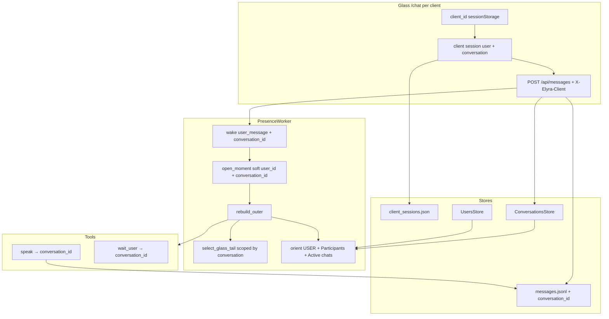
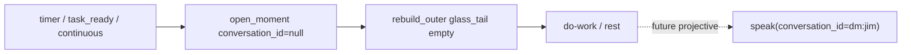

# Design: Multi-user conversations for Elyra demo/dogfood (C12)

**v2 — concurrent `/chat` client sessions**

| Field | Value |
|-------|--------|
| **Class** | DESIGN |
| **Document** | Multi-user conversations — Conversation store, glass_tail scope, operator multi-convo, concurrent client sessions, `/chat` shell |
| **Product** | project-elyra |
| **Date** | 2026-08-07 |
| **Status** | **Active** — supersedes prior multi-user design revision (`b6d0f506` / v1) for execute-plan |
| **Version** | **v2 — concurrent `/chat` client sessions** |
| **Base tip** | `working` @ `598282f` (background inventory spot-checked; keep tip SHA pin when landing design to docs) |
| **Feature branch** | `feature/multi-user-conversations` (from `working`) |
| **Packaging** | [#118](https://github.com/jtwolfe/project-elyra/issues/118) C12 · epic [#111](https://github.com/jtwolfe/project-elyra/issues/111) |
| **Implement issues** | [#127](https://github.com/jtwolfe/project-elyra/issues/127) glass_tail · [#128](https://github.com/jtwolfe/project-elyra/issues/128) operator thread · [#129](https://github.com/jtwolfe/project-elyra/issues/129) group + `/chat` |
| **Residual gate** | [#131](https://github.com/jtwolfe/project-elyra/issues/131) keep trays / full presence / real auth — **hooks only** |
| **Related designs** | [design-identity-self-other-multi-user.md](../../docs/design/identity/design-identity-self-other-multi-user.md) (shipped) · [design-instance-continuity-glass-tail-directed-keep.md](../../docs/design/memory/design-instance-continuity-glass-tail-directed-keep.md) · [docs/state/architecture.md](../../docs/state/architecture.md) · [docs/goal/v0.1.md](../../docs/goal/v0.1.md) |
| **Supersedes** | Design revision `b6d0f506` (v1). **v2 change surface:** process-global `glass_session.json` → **per-client session registry** so multi-window / multi-browser dogfood works without last-writer-wins. Conversation model, glass_tail, speak/wait, #131 hooks, solo null conversation preserved. |

---

## Overview

Elyra already has **per-user identity walls** (`UsersStore`), a **Glass session user switcher** (`PUT /api/session` → `data/runtime/glass_session.json`), **message rows with `user_id`**, and a **glass_tail** meal channel that packs last-K global glass rows with true roles. What it lacks is a first-class **Conversation** address: DMs and groups are not modeled; glass_tail mixes all speakers; operator Glass shows one undifferentiated feed; there is no product `/chat` shell; and **session binding is process-global**, so concurrent browsers (or even two tabs wanting different users) fight over one `glass_session.json`.

This design introduces **Conversation as the social address** and threads it through messages, speak/wait, meal glass_tail, orient, operator Glass, and a thin `/chat` product surface — enough to **demo and dogfood** multi-user social continuity for C12. **v2 additionally introduces a client-bound session registry** so N concurrent clients each hold independent `{user_id, conversation_id, view_mode?}` without real login.

**One-sentence product outcome:** Operator (and colleagues on the same host) can open multiple `/chat` windows as different users in private DMs and ≥1 group **concurrently** (session + ledger isolation; shared PresenceWorker phase remains a documented residual), the model’s meal tip stays conversation-scoped with speaker labels, solo continuous work still runs with null conversation, and last-writer-wins session stomping is gone — without claiming multi-tenant auth (#131 C).

---

## Background & Motivation

### What ships today (verified at `598282f`)

| Surface | Path / behaviour | Gap |
|---------|------------------|-----|
| Message schema | `elyra/messages.py` `Message`: `id, role, content, user_id, created_at, reasoning, moment_id, attachments?, meta?` | No `conversation_id` |
| Message list | `list_messages(limit=200)` — global tail of `data/messages.jsonl` | No filter by user or conversation |
| Speak transport | `elyra/speak/transport.py` `SpeakTransport.deliver(text, user_id=…)` | Address is user_id only; no conversation |
| Social tools | `elyra/tools/builtin/social.py` `speak` / `wait_user` resolve `user_id` from args → `ctx.user_id` → `"operator"` | No `conversation_id` arg |
| Glass session | `data/runtime/glass_session.json` `{"user_id"}`; `GET/PUT /api/session` | **Process-global single file**; user only; no conversation; **last-writer-wins across all clients** |
| Client identity | `app.js` `localStorage.elyra.sessionUserId` + server file as “source of truth” | Same-origin localStorage + one server file ⇒ multi-tab fight; remote colleague stomps host operator |
| glass_tail | `elyra/memory/meal.py` `select_glass_tail` filters role ∈ {user,assistant}; **no user/conversation filter** | Cross-user tip bleed |
| rebuild_outer | `PresenceWorker` loads `list_messages(limit=glass_tail_list_limit)` globally | Same bleed |
| Orient USER | `resolve_orient_user` + single `## USER` slot via `fill_orient` | No participants map; no active chats |
| Glass UI | `elyra/runtime/web/app.js` session switcher; `renderMessages` shows **all** messages | #128 unfiltered feed |
| Wait match | `pending_wait_matches_user` exact `wait.user_id == session user` | No group membership; session user from body/client only |
| Goals provenance | `created_in_context: {user_id, goes_by?, moment_id?}` | Keep; optional conversation later |
| Moments | `MomentMeta.user_id` soft | Optional `conversation_id` soft |
| Keep tray | `data/runtime/directed_keep_tray.json` **instance-global** | #131 residual; hook only |
| Users | `UsersStore` profiles, `display_label`, create provisional | Reuse; no auth |
| Static `/chat` | `_serve_static` SPA fallthrough → `index.html` | No product mode yet |

### Why change is needed

1. **C12 dogfood bar (#118):** multi-user **and** group chat continuity — not identity-only prep.
2. **glass_tail pollution (#127):** Jim’s wake can pack Sam’s tip lines; semantic seed uses mixed `last_user_text`.
3. **Operator UX (#128):** session switch changes *who types* but not *which thread is shown*.
4. **Group address (#129):** `user_id` alone cannot mean “speak to this room.”
5. **Solo work must survive:** continuous / autotelic moments must not auto-bind to last social chat.
6. **Concurrent principals (v2):** same process UI at `http://127.0.0.1:8787/chat` must support multiple browser windows **and** a remote colleague without fighting one process-global session file. v1 KD7/§8 intentionally shared `glass_session.json` + localStorage — that **breaks multi-window multi-user**.

### Operator-locked architecture (do not reopen)

1. **Conversation is the social address** — `dm:<user_id>` and `group:<uuid-or-id>`.
2. **`user_id` on messages is speaker** (or for assistant rows: the addressed peer / conversation stamp — see KD2).
3. **speak / wait_user target a conversation_id** (DM shorthand via user_id remains OK).
4. **Solo / continuous work:** `conversation_id` may be **null**; do **not** auto-bind to last social chat.
5. **temporal** stays open-moment atom spine only; **glass_tail** is the conversation tip.
6. **#131 items** are residual gate work — architecture hooks only in this pass.
7. **v2:** Concurrent dogfood principals are **not** real auth; they are independent client sessions bound by a forgeable client_id (document honestly; fail-closed product later).

---

## Goals & Non-Goals

### Goals

1. **Conversation store** with DM + group types, members, name/description, CRUD.
2. **Messages carry `conversation_id`**; migrate legacy rows to DM-by-user_id.
3. **speak / wait_user** accept `conversation_id` (and DM shorthand).
4. **glass_tail is conversation-scoped** on social wakes; speaker display labels + mappable user_id.
5. **Orient:** participants block, soft recently-active, active chats list.
6. **Operator Glass:** switch user **and** conversation **per client session**; create group; invite members; optional “all” forensic view; impersonate for dogfood.
7. **`/chat` thin product shell:** Private Chat + groups; same theme; hide operator chrome.
8. **Solo continuous work unchanged** when conversation is null.
9. **Concurrent client sessions (v2):** N clients each have independent `{user_id, conversation_id, view_mode?}`; multi-window and multi-browser dogfood without last-writer-wins.
10. **Honest residual list** for #131 and other out-of-scope items.
11. **C12 acceptance** scenarios green without inventing product success — including multi-window concurrent principals.

### Non-Goals (OUT of implement)

| Item | Disposition |
|------|-------------|
| Per-conversation keep trays | #131 A — hook only |
| Full presence product | #131 B — soft “recently active” only |
| Real multi-user auth | #131 C — session switch = dogfood impersonation; **client_id is not a credential** |
| Autotelic proactive engine | Separate; architect projective speak only |
| Expanding temporal to multi-moment | Explicit non-goal |
| Multi-tenant SaaS / CRDT collab / mobile | Out |
| Perfect moderation / roles product | Out |
| Changing semantic/episodic algorithms beyond seed hygiene | Out (seed from scoped tip only) |
| Cookie-based SSO / password login | Out — dogfood client registry only |

---

## Issue mapping

| Issue | Scope in this design | Primary PRs |
|-------|----------------------|-------------|
| **#127** | Conversation-scoped glass_tail + speaker labels + seed hygiene | PR4 |
| **#128** | Operator multi-convo + impersonation (user + conversation switch) **per client** | PR3a, PR3b, PR6 |
| **#129** | Conversation store, group CRUD, speak/wait target, orient map, `/chat` | PR2–3, PR5, PR7 |
| **#118** | Packaging umbrella / demo bar (incl. concurrent dogfood) | PR0/1, PR3a, PR8 |
| **#131** | Hooks only (keep key, presence fields, auth notes) | all PRs note; no implement |

---

## Proposed Design

### 1. Conversation model (social address)

#### 1.1 ID conventions (stable, host-owned)

| Type | ID form | Meaning |
|------|---------|---------|
| **DM** | `dm:<user_id>` | 1:1 chat between Elyra and that human user. Canonical for private thread. |
| **Group** | `group:<uuid>` | Multi-party room; UUID minted on create (no slashes; path-safe). |

Rules:

- DM ids are **deterministic** from peer `user_id` (`dm:jim`, `dm:operator`). No separate UUID for DMs.
- Group ids never reuse a user_id string alone.
- Validation: `dm:` suffix must pass `validate_user_id`; `group:` suffix is UUID (hex form preferred) or path-safe `[A-Za-z0-9][A-Za-z0-9._-]*` if operator seeds short ids in tests.
- **Null conversation** = solo / continuous / non-social work. Valid and common.

#### 1.2 Schema

```python
# Conceptual — elyra/conversations/store.py

@dataclass
class Conversation:
    id: str                    # dm:<user_id> | group:<uuid>
    type: Literal["dm", "group"]
    members: list[str]         # user_ids; for DM: [peer_user_id] (Elyra is not a member)
    name: str | None           # required-ish for groups; optional for DM (defaults to peer goes_by)
    description: str | None
    created_at: str            # ISO UTC
    updated_at: str
    # Soft activity (not full presence #131):
    last_message_at: str | None = None
    # Future hooks (do not require consumers yet):
    # meta: dict  — reserved for #131 auth/ACL notes
```

**Membership semantics:**

- **DM:** `members = [peer_user_id]`. Elyra is always the other party; she is not listed as a member.
- **Group:** `members` = human participants (≥1 for create; dogfood bar ≥2). Elyra is not in `members`.
- Operator may be a member of groups (typical dogfood: jim + operator + guest).

#### 1.3 On-disk layout

```text
data/conversations/
  index.json          # { "schema_version": 1, "conversations": [ {…summary…}, … ] }
  by_id/
    dm_jim.json       # full record (filename: id with ":" → "_")
    group_<uuid>.json
```

- Filename mapping: replace `:` with `_` for FS safety (`dm:jim` → `dm_jim.json`). Reverse is unambiguous given type prefixes.
- `index.json` holds listable summaries for sidebar (id, type, name, members, last_message_at, updated_at).
- RLock + atomic JSON writes (same pattern as `GoalsStore` / `UsersStore`).
- **Reset policy:** conversations are **social state** — **Recommendation (KD9):** clear conversations together with messages on full reset. Document in `elyra/runtime/reset.py` touch list. Identity/users remain preserved. **Also clear client session registry** (runtime dogfood state).

#### 1.4 Store API

```python
class ConversationsStore:
    def ensure_layout(self) -> None: ...
    def get(self, conversation_id: str) -> dict | None: ...
    def list(self, *, member_user_id: str | None = None, type: str | None = None) -> list[dict]: ...
    def ensure_dm(self, user_id: str) -> dict:
        """Idempotent: create dm:<user_id> if missing."""
    def create_group(self, *, name: str, members: list[str], description: str | None = None,
                     conversation_id: str | None = None) -> dict: ...
    def update(self, conversation_id: str, *, name=..., description=..., members=...) -> dict: ...
    def touch_activity(self, conversation_id: str, *, at: str | None = None) -> None:
        """Update last_message_at + updated_at (message path)."""
    def resolve_address(self, *, conversation_id: str | None = None,
                        user_id: str | None = None) -> str | None:
        """Normalize speak/wait target → conversation_id or None."""
```

`ensure_dm` is called on first message to that user and on session switch when opening Private Chat.

### 2. Message schema changes

#### 2.1 New field

```python
@dataclass
class Message:
    id: str
    role: str  # user | assistant | system
    content: str
    user_id: str | None          # speaker (user) OR addressed peer stamp (assistant — see KD2)
    created_at: str
    reasoning: str = ""
    moment_id: str | None = None
    conversation_id: str | None = None  # NEW — null = solo / legacy-unscoped
    attachments: list[dict] | None = None
    meta: dict | None = None
```

**Load pin:** missing `user_id` key **or** JSON `null` → `None` on load. Emitting `"user_id": null` on write (e.g. via `asdict`) is **OK** for assistant group rows; omit is also OK. No schema change required.

#### 2.2 Write path

`append_message(..., conversation_id: str | None = None)`:

- Persist field when non-None; omit when None (legacy-shaped rows OK for load).
- On load, missing → `None`.
- **Default param** may remain `user_id: str | None = "operator"` for legacy call sites; **explicit `user_id=None` must persist as null** (no coerce to `"operator"`). Verified intent against current `append_message` storage of None; speak path must stop pre-coercing via `_normalize_user_id` before append (KD20).

**Social write invariant (post-cutover — KD16):** On social paths (Glass/API chat, speak, wait_reply append, interject drain), **require non-null `conversation_id`**. Null is allowed only for:

- Explicit solo/system rows
- Pre-cutover legacy rows already on disk (read path only)

API defaults `conversation_id` from **this client’s session** (`ensure_dm` if needed) before append. Speak uses the resolver (§3.1) and fails closed when unresolved. A social append that still lacks `conversation_id` after defaults is a host bug — log error and fail the write (do not silently demote to “user_id-only legacy”).

Also extend `PresenceWorker.append_message_if_allowed` with the same `conversation_id` kwarg (it is the production wrapper for `POST /api/messages` and wait reply — see §3.6 propagation matrix).

#### 2.3 List / filter API

Extend `list_messages`:

```python
def list_messages(
    *,
    limit: int = 200,
    conversation_id: str | None = None,
    user_id: str | None = None,       # optional legacy / forensic
    paths: ElyraPaths | None = None,
) -> list[dict]:
```

**Normative order (KD17 — filter-then-last-N; do not invert):**

1. **Scan all** rows from `messages.jsonl` (v1 full-file scan; glass-scale).
2. **Apply predicate** (conversation and/or legacy DM rules and/or forensic `user_id` filter).
3. **Then** take last-N: if `limit > 0`, return `matching[-limit:]`; if `limit <= 0`, return **all** matching (preserve today’s “unlimited” contract when callers pass non-positive limit).

**Forbidden:** global last-N first, then filter by `conversation_id`. That starves active threads under multi-user interleave (e.g. last 80 global may contain only 2 jim DM rows while jim has 50 older). This is the production path for glass_tail (`glass_tail_list_limit` default 80).

When `conversation_id` set: predicate is §2.4. When both filters null: global tail (forensic `view=all`, media index helpers).

Also add:

```python
def list_messages_for_conversation(conversation_id: str, *, limit: int = 200, ...) -> list[dict]
```

**Hermetic pin (PR2):** write `limit+10` interleaved jim/sam DM rows → `list_messages(limit=10, conversation_id="dm:jim")` returns **exactly 10** jim rows (not fewer).

#### 2.4 Migration / seed hygiene (one-shot + lazy)

**Lazy read path (required for dogfood without rewrite of huge logs):**

For filter `conversation_id == "dm:jim"`:

1. Include rows with `conversation_id == "dm:jim"`.
2. **Legacy-only fill:** include rows where `conversation_id` is missing/null **and** `user_id == "jim"` (user **or** assistant — live data already stamps assistant peer `user_id`). Treat these as pre-cutover only.

For filter `conversation_id == "group:…"`: **only** rows with explicit `conversation_id == that group`. **No** legacy fill by member `user_id` (would steal DM history into groups).

**Cutover rule (KD16):** After this feature lands, **new** social writes always stamp `conversation_id`. Lazy rule (2) exists solely for rows created before the feature. Implementers must not rely on legacy fill for post-cutover correctness; fail closed on social write without conversation_id (§2.2).

**Eager migrate (optional PR2 tool / on ensure_layout):**

- Scan `messages.jsonl`; for each row without `conversation_id` and with non-null `user_id`, rewrite to `conversation_id = f"dm:{user_id}"` into a new file, atomic replace.
- Prefer **lazy** for first dogfood; offer `elyra` CLI or reset-safe rewrite script if logs are small.

**Seed hygiene:** tests and seeds that write glass rows for multi-user scenarios must set `conversation_id` explicitly. Do not invent conversation on pure system rows.

#### 2.5 Speaker semantics (KD2)

| Role | `user_id` meaning | `conversation_id` |
|------|-------------------|-------------------|
| user | Who spoke | Which chat they spoke in |
| assistant | **DM:** peer `user_id` stamp (compat). **Group:** **`user_id = null`** — conversation_id is authoritative; Glass labels “Elyra” via `role` | Required for social speak |
| system | Usually null | Usually null |

Assistant rows **must** carry `conversation_id` for social speaks. **Locked (OQ2 / KD2 / KD20):** never stamp a group member **or** `"operator"` as assistant `user_id` for group rows. UI uses role + self display name for assistant group rows. DM keeps peer `user_id` stamp for legacy filters/labels.

**Transport contract (normative — current code must change):** Today `SpeakTransport._normalize_user_id` and `append_message(..., user_id="operator")` coerce `None`/blank → `"operator"`. That **breaks** KD2 for groups. This package **must** change the deliver/append path so group assistant rows can store true null (see §3.2).

### 3. Speak / wait_user targeting

#### 3.1 Tool args

`speak` (extend `tools/bundled/speak/TOOL.md` + schema):

| Arg | Required | Notes |
|-----|----------|-------|
| `text` | yes | caption policy unchanged (KD8 caption / KD-speak) |
| `conversation_id` | no | Prefer when known |
| `user_id` | no | DM shorthand: implies `dm:<user_id>`; also wait recipient / stamp |
| `attachment_ids` / `attachments` | no | unchanged |

Resolution order (`_resolve_conversation_id` in `social.py`) — **KD3 (no silent group→DM demotion):**

1. Explicit non-blank `conversation_id` **arg** → use it (validate exists / type).
2. Else if `ctx.conversation_id` is non-blank → use it (wake stamped this; includes groups).
3. Else if non-blank `user_id` **arg** → intentional DM shorthand: `dm:<user_id>` via `ensure_dm`.  
   **Exception:** if `social_kind == "group"` (below), **do not** treat bare `user_id` arg as DM shorthand when the model forgot the room — still fail closed unless arg `conversation_id` is group (prefer: if social_kind is group and only user_id arg present → `missing_conversation`).
4. Else if `ctx.user_id` is set **and** `social_kind != "group"` → `dm:<ctx.user_id>` (DM-shaped only).
5. Else → **fail closed** with `missing_conversation` (`ok=False`, no glass write).

**`social_kind` (required host signal — Option A locked):**

| Value | Meaning |
|-------|---------|
| `"group"` | Social wake opened from a **group** conversation (message/body/session conversation_id started with `group:` at enqueue time) |
| `"dm"` | Social wake from a DM (or legacy DM-derived) |
| absent / `"none"` | Pure work / non-social — no auto address |

**Derivation (host, not model):** When stamping a social wake/append, set:

```python
def social_kind_for(conversation_id: str | None) -> str:
    if conversation_id and conversation_id.startswith("group:"):
        return "group"
    if conversation_id and conversation_id.startswith("dm:"):
        return "dm"
    return "dm"  # legacy social with only user_id → treat as DM-shaped
```

Store on **wake.payload["social_kind"]** and copy into **`ctx.extras["social_kind"]`** in `_build_tool_context`.  
**Critical:** set `social_kind` from the **conversation_id known at enqueue** (POST body / **client session** default / wait record). If later `conversation_id` is dropped from payload (bug), **`social_kind` still remains `"group"`** so step 4 is **skipped** and step 5 fires `missing_conversation`. That makes T8 implementable without inventing host magic.

**Group invariant:** Resolver **never** synthesizes `dm:<speaker>` when `social_kind == "group"`. Lost group `conversation_id` → fail closed (not wrong room).

**DM shorthand** only when intentional private address (explicit conversation_id/`dm:` or social_kind dm + ctx.user_id).

**Projective speak** (future autotelic from pure work): model must pass `conversation_id` (or user_id DM shorthand) explicitly; empty ctx + no social_kind group → fail closed if neither address nor dm fallback applies.

`wait_user` same resolution; persist `conversation_id` on WaitArm and timer wait record. For group waits, WaitArm.user_id remains arming stamp (session speaker), not room.

#### 3.2 Transport (KD2 / KD20 — group null user_id)

```python
SpeakTransport.deliver(
    text,
    *,
    user_id: str | None = None,          # see normalize rules below
    conversation_id: str | None = None,
    moment_id: str | None = None,
    ...
) -> SpeakDelivery
```

**`_normalize_user_id` / deliver rules (replace current always-coerce-to-operator):**

Live code today always runs `uid = _normalize_user_id(user_id)` **before** conversation-aware logic and maps `None` → `"operator"`. That order **must change**.

| `conversation_id` | Incoming `user_id` | Stored assistant row `user_id` |
|-------------------|--------------------|--------------------------------|
| starts with `group:` | any (incl. None, `"operator"`, peer) | **`None`** — JSON `null` or omit; **never** `"operator"` |
| starts with `dm:` | blank/None | peer from conversation id suffix (`dm:jim` → `"jim"`) if available; else `"operator"` only as last resort for broken DM |
| starts with `dm:` | non-blank | peer stamp as given (compat) |
| null / missing | blank/None | `"operator"` (legacy solo/tool path only; social should not hit this after KD16) |
| null / missing | non-blank | that string |

**Normative implementation pin (KD20):**

1. Prefer single helper: `_normalize_user_id(user_id, *, conversation_id: str | None) -> str | None` — conversation-aware **before** append and **before** building `SpeakDelivery`.
2. Alternative OK: `allow_null_user_id=True` when conversation is group; speak builtin always passes null for group delivers.

**`append_message`:** must accept and persist `user_id=None` without rewriting to `"operator"`. JSON `null` or omit both load as `None` (§2.1). Default parameter on append may stay `"operator"` for legacy call sites, but **explicit `user_id=None` must not be coerced**.

**`SpeakDelivery` type contract (normative):**

```python
@dataclass
class SpeakDelivery:
    ok: bool
    user_id: str | None   # was str — MUST become Optional for group success
    conversation_id: str | None = None
    # ... existing fields ...
```

- Include `conversation_id` when set.
- **Success (group):** `user_id=None`; `as_payload` / tool result emits JSON **`null`** for `user_id` (not omit inventing `"operator"`).
- **Failure paths:** early returns that currently set `user_id=uid` after blind normalize must use the **same conversation-aware normalize**. Prefer: failure payloads for group targets also leave `user_id=None` when the intended conversation was group; if a failure path never knew `conversation_id`, `"operator"` remains acceptable only as a diagnostic default (document in code comment). **Do not** re-normalize group failures to operator after a successful group-aware path.

On success, `ConversationsStore.touch_activity(conversation_id)`.

**Hermetic pin (PR3c / T15):** `speak` / `deliver` to `group:<id>` → (1) glass message row has `conversation_id=group:…` and `user_id` null/absent — **assert not equal to `"operator"`**; (2) `SpeakDelivery.user_id is None` and payload JSON `user_id` is `null`.

#### 3.3 WaitArm / timers

```python
@dataclass(frozen=True)
class WaitArm:
    wait_id: str
    timeout_seconds: int
    prompt: str
    choices: list[str]
    user_id: str
    conversation_id: str | None = None  # NEW
```

- `TimerService.arm_wait(..., conversation_id=…)` persists field (missing → None on load).
- **`WaitArm.user_id` meaning:** arming / notify stamp (who the model addressed or session speaker at arm time) — **not** the sole match key for group waits.

**Group wait match algorithm (dogfood v1 — KD12):**

```text
def wait_matches(session_user, wait, conversations, *, session_conversation_id=None):
    cid = wait.conversation_id
    if cid is None or cid.startswith("dm:"):
        return wait.user_id == session_user
    if cid.startswith("group:"):
        members = conversations.get(cid).members  # fail closed if unknown
        if session_user not in members:
            return False
        # Mandatory: durable clients always have conversation_id after KD18.
        # Group wait matches only when this client is bound to that group
        # (not while viewing dm:self or another room).
        if session_conversation_id != cid:
            return False
        return True
    return wait.user_id == session_user  # safe default
```

- **DM / null conversation:** exact `wait.user_id == session_user` (today).
- **Group (mandatory after KD18):** `session_user ∈ members(wait.conversation_id)` **and** `session_conversation_id == wait.conversation_id`. A member viewing Private Chat (`dm:<self>`) does **not** match an armed group wait until they `PUT` session to that group. No intentional exception for dogfood v1 (avoids answering a group wait from the wrong thread).
- Non-member → reject (not wait_reply).
- **`session_user` and `session_conversation_id` come from the requesting client session** (§7 / §7A), not process-global state. For durable clients, `session_conversation_id` is always non-null after load normalize (KD18 → `dm:<user>` default).

**Client wait-bar data path (normative — KD24):**

Server-side match alone is insufficient for UI: `app.js` `waitArmedForSessionUser` today only compares `pending.user_id == sessionUserId` and has no members list.

Extend **`GET /api/status`** (and any status poll that already returns `pending_wait`) so `pending_wait` includes:

| Field | Required | Notes |
|-------|----------|-------|
| `conversation_id` | yes when armed with one | From WaitArm / wait record |
| `user_id` | yes | Arming stamp (existing) |
| **`matches_session`** | **yes when header present and client is known in registry** | Server-computed bool via `wait_matches(session_user, wait, …, session_conversation_id=…)` for **this client**. Unknown client header on read-only status → omit or `false` (same as missing header; **do not** create map entry — KD25). |

Optional: `members[]` on pending_wait for chips — not required if `matches_session` is present.

**Enrichment layer (normative — implement pin):**

- `PresenceWorker.status_snapshot()` stays **client-agnostic**: returns raw process-global `pending_wait` (no `matches_session`, no client_id).
- **`elyra/runtime/api.py` status handler** (after `status_snapshot()`) enriches `pending_wait`:
  1. Ensure `conversation_id` is present on the wait dict if the wait record has it (`to_dict` may need a field pass-through).
  2. If request has valid `X-Elyra-Client` **and** that client exists in the registry → load session → set `matches_session = wait_matches(...)`.
  3. Else (missing header, unknown client, or no pending wait) → omit `matches_session` or set `false`.
- **Do not** pass client_id into `PresenceWorker` or teach the worker about client sessions.

**JS contract:**

```javascript
function waitArmedForSessionUser(pending, _userId) {
  // Prefer server truth when present (group-safe; forgeable client still honest for dogfood)
  if (pending && typeof pending.matches_session === "boolean") {
    return pending.status === "pending" && pending.matches_session;
  }
  // Fallback legacy: exact user_id (DM-only correctness)
  return Boolean(pending && pending.status === "pending"
    && String(pending.user_id || "") === String(_userId || ""));
}
```

Without header **or unknown client on read-only status**: omit `matches_session` or set `false` (do not invent membership; do not create registry entry).

**Multi-pending waits (dogfood v1 policy):**

Today `_pending_wait_unlocked` returns **only** `list_waits()[0]` (first pending). **Concurrent multi-wait selection is residual** (list under residual gaps; not #131 proper — call it **C12 multi-wait residual**).

Dogfood v1:

1. **Single pending wait globally remains the host selection model** for routing (`pending_wait_matches` runs against that one wait).
2. Implement match algorithm above against that selected wait (member-aware for groups).
3. **Workaround:** operator dogfood one armed wait at a time; do not rely on concurrent jim-wait + operator-wait correctness.
4. Glass wait bar: use **`matches_session`** from status (KD24); do not reimplement group membership solely in JS.
5. Future: select among pending waits by session user/conversation (out of this package).

Document: not full presence; not “@mention only.”

#### 3.4 ToolContext

```python
@dataclass
class ToolContext:
    ...
    user_id: str | None = None
    conversation_id: str | None = None  # NEW — from wake.payload only
    # extras["social_kind"] in {"group","dm","none"} — required for KD3 step 4 gate
```

`_build_tool_context` (presence / do-loop) extracts:

```python
uid = payload.get("user_id")  # may be None on pure work
cid = payload.get("conversation_id")  # strip; None if missing/blank
kind = payload.get("social_kind")  # "group" | "dm" | absent
extras["social_kind"] = kind if kind in ("group", "dm") else "none"
# Never copy client session.conversation_id into non-social ToolContext
# Never invent social_kind from any session on pure work
```

#### 3.5 Wake payloads

All social enqueue paths stamp **`conversation_id` and `social_kind`**.  
**Do not** invent conversation or social_kind on timer / task_ready / pure continuous / moment_continue wakes (payload omits keys or social_kind=`none`).

#### 3.6 Propagation matrix (normative — implement pin)

| Surface | `conversation_id` | `social_kind` | Null / notes |
|---------|-------------------|---------------|--------------|
| `POST /api/messages` | Body or **client session** default (`ensure_dm`) | Derive from resolved conversation_id at enqueue | Social: both required after default; **speaker = client session user_id** |
| `POST /api/wait/reply` | From pending wait | From wait’s conversation type (or stored on wait) | Match uses client session user |
| `GET /api/status` pending_wait | Include wait’s conversation_id | n/a | **`matches_session`** when client header present (KD24) |
| `append_message` | Kwarg | n/a (row field only) | **Must accept `user_id=None` without coercing to operator** (KD20) |
| `append_message_if_allowed` | Kwarg → append | n/a | Same |
| `enqueue_user_message` | Kwarg → payload | Kwarg or derive → payload | Non-social: omit both / kind none |
| `resolve_user_input` | Thread all routes | Thread all routes | Session user from client session |
| `InterjectItem` | **Field** conversation_id | **Field** social_kind | Overflow copies **both** |
| Interject overflow enqueue | From item | From item | Required if original social was group |
| `_apply_wait_reply_unlocked` | From pending wait | From wait / derive | |
| `open_moment` | Soft optional | Soft optional / omit | Null on continuous/timer |
| `_build_tool_context` | From payload | **extras["social_kind"]** from payload | Never from client session on pure work |
| `speak` / `wait_user` | Resolver §3.1 | **Read extras social_kind** for step 4 skip | Fail closed if unresolved |
| `SpeakTransport.deliver` | Onto assistant row | n/a | Group → force user_id null (KD20) |
| **client session registry** | View/send binding **per client_id** | n/a | **Not** meal/tool address for non-social |

**Required hermetics (PR3a–c):**

- **T5:** POST group → `wake.payload.conversation_id` + `wake.payload.social_kind=="group"` → ToolContext same → speak row `conversation_id=group:…`.
- **T8:** ToolContext with `user_id="jim"`, `conversation_id=None`, `extras={"social_kind":"group"}`, no tool conversation_id arg → speak returns `missing_conversation` (does **not** write `dm:jim`).
- **T15:** successful group speak → row `user_id` null/absent, not `"operator"`.
- **T16:** two client_ids, different users, same group — independent session GET/PUT; no cross-stomp (see §7A).

### 4. glass_tail conversation scope (#127)

#### 4.1 Principle

**temporal** = open-moment atom spine (unchanged).  
**glass_tail** = conversation tip (dialogue with roles); must be **conversation-scoped**.

**Not client-scoped:** glass_tail filters by `conversation_id` on the wake / meal path. Two clients in the same group share one conversation tip (correct multi-user continuity). Client sessions only choose *which* conversation each UI is bound to for send/poll/display.

#### 4.2 Selection algorithm

Change `select_glass_tail` (and callers) to accept scope:

```python
def select_glass_tail(
    glass_rows: Sequence[Mapping[str, Any]],
    *,
    cap_tokens: int,
    floor_messages: int = 6,
    max_messages: int = 20,
    social_wake: bool = False,
    conversation_id: str | None = None,   # NEW
    exclude_message_ids: set[str] | None = None,
    label_users: Mapping[str, str] | None = None,  # user_id → goes_by
) -> tuple[list[MealItem], dict[str, Any]]:
```

**Eligible filter (strict conversation scope — KD4):**

When `conversation_id` is non-null:

1. Prefer rows with `row.conversation_id == conversation_id`.
2. **Legacy DM fill only:** if conversation is `dm:<uid>`, also include rows with missing/null conversation_id and `user_id == uid` (user or assistant). Pre-cutover only (§2.4).
3. **Never** include other conversations’ rows (no soft global fill). Thin tip is honest; floor may shortfall.

When `conversation_id` is null (pure work / continuous):

- **KD5:** do **not** pack a fake social tip from last chat. `select_glass_tail` returns empty items. Floor not applied. Semantic seed must not use foreign last_user_text.
- **Never** read any client session’s `conversation_id` to fill tip on non-social wakes.

**Why strict (fork A from #127):** soft-fill with global reintroduces cross-bleed — the primary failure mode. Dogfood prefers empty-thin over wrong-tip.

#### 4.3 Speaker labels (content surface)

**KD6 — single helper for estimate + select:**

Labels are applied inside `_glass_tail_item_from_row` (or a shared `_glass_tail_labeled_content` used by both `estimate_glass_tail_floor_tokens` and `select_glass_tail`) so floor token accounting matches packed content.

| Case | Label policy |
|------|----------------|
| Group conversation (type=group or members inferred >1) | User lines: prefix `[GoesBy (user_id)] ` + content; put same on MealItem.meta |
| DM | Optional short form `[GoesBy] ` or raw content; default **short form when `label_users` provided**, raw if map absent |
| Assistant | No user-style prefix; role stays assistant |

- Keep `role` true on MealItem.
- `label_users`: map from `UsersStore.display_label`; missing → use `user_id` string.
- **Floor shortfall:** labels increase token sizes; more frequent `floor_shortfall` is **acceptable** under KD4 (honest thin tip > wrong tip).

#### 4.4 rebuild_outer wiring

**Social bit source (normative):** use `elyra.loop.continuous_policy.SOCIAL_WAKE_KINDS` = `{user_message, wait_reply}` — **not** `meal.py`’s broader set that includes `wait_timeout`.

**wait_timeout policy (this pass):** remains **non-social** for glass_tail floor (`social_wake=False`) — existing behavior. If the timed-out wait had a `conversation_id`, still **do not** auto-pack that tip unless product later promotes timeout to social (out of scope; residual note only).

In `PresenceWorker.rebuild_outer`:

```python
from elyra.loop.continuous_policy import SOCIAL_WAKE_KINDS

conv_id = (wake.payload or {}).get("conversation_id")
conv_id = conv_id.strip() if isinstance(conv_id, str) and conv_id.strip() else None
social = wake.kind in SOCIAL_WAKE_KINDS

if social and conv_id:
    # filter-then-last-N (KD17)
    glass = list_messages(limit=glass_list_limit, conversation_id=conv_id, paths=self.paths)
elif social and not conv_id:
    # Legacy social without stamp: DM from speaker only (not group demotion)
    uid = (wake.payload or {}).get("user_id")
    if isinstance(uid, str) and uid.strip():
        glass = list_messages(limit=glass_list_limit, conversation_id=f"dm:{uid.strip()}", paths=...)
    else:
        glass = []
else:
    # Non-social / continuous / timer / wait_timeout: empty tip — never any client session conversation
    glass = []
```

Refinement:

- **Never** inject session `conversation_id` into non-social rebuilds or meal inspect.
- Media expand for wake attachments: load by message_id if needed, not full global tip.
- Pass `conversation_id` + `social_wake` into `compose_meal` / `select_glass_tail`.

**Dogfood inspect source:** verify glass_tail via worker **`_last_meal_snapshot` / last_compose** (`glass_tail_meta.conversation_id`, packed labels). On-demand `_compose_meal_for_inspect` currently omits `glass_rows` (`api.py`) — **do not** use it to claim glass_tail isolation unless taught conversation-scoped rows.

#### 4.5 Semantic seed hygiene

`glass_tail_meta["last_user_text"]` only from scoped window. No cross-conversation seed. Strip label prefixes if present when seeding, or seed from raw row content before label — prefer raw user text without `[GoesBy (id)]` prefix for semantic quality.

#### 4.6 Tests (required)

Extend `tests/test_meal_glass_tail.py` + presence/API tests:

1. Two DMs interleaved → select for `dm:jim` never includes sam rows.
2. Group rows + DM rows → group select only group.
3. Null conversation + social_wake false → empty glass_tail.
4. Legacy rows without conversation_id + user_id jim → included in dm:jim; **not** in groups.
5. Speaker label present on group user lines; floor estimate uses labeled content.
6. **Solo isolation:** some client session has `conversation_id=dm:jim`; enqueue timer/continuous/task_ready → wake.payload has null/absent conversation_id; rebuild glass_tail empty.
7. After (6), social jim wake still scoped to dm:jim.
8. **Filter-then-limit:** `list_messages` pin from §2.3.

### 5. Orient additions

#### 5.1 Template

Extend `prompts/orient.md`:

```markdown
## USER
{{USER}}

## Participants
{{PARTICIPANTS}}

## Recently active users
{{RECENTLY_ACTIVE}}

## Active chats
{{ACTIVE_CHATS}}
```

Update `fill_orient` + `_ORIENT_PLACEHOLDER_RE` in `elyra/loop/context.py` to accept new placeholders. **API churn:** add kwargs with defaults `""` so all existing call sites (`rebuild_outer`, `assemble_outer_meal`, tests) stay green without required args. Empty values → `_(none)_` as today.

#### 5.2 Participants block

Built in rebuild_outer:

- **DM social:** single peer profile (same as today’s USER digest) + explicit `goes_by ↔ user_id` line.
- **Group social:** list each member with `goes_by` + `user_id` + one-line profile excerpt (truncate budget; reuse orient goals token style caps — new setting or share `orient_goals_max_tokens` fraction).
- **Pure work:** empty participants (USER may still come from created_in_context).

Format example:

```text
- Jim (jim) — peer DM
- Operator (operator)
- Sam (sam) — provisional guest
```

#### 5.3 Recently active users (soft — not #131 presence)

Heuristic only — **prefer message-based activity first** to avoid orient noise from multi-window dogfood:

1. **Primary:** users with a glass message `created_at` within T (default **24h**).
2. **Secondary (optional fill):** client session entries whose `updated_at` is within T **and** `user_id` is a real `UsersStore` id **and** the entry was touched by a **mutating** path (`PUT /api/session`, `POST /api/messages`, wait reply) — **not** pure GET polls / read-only traffic. Do not treat request-scoped no-header defaults as activity.
3. Cap list (e.g. 8). Merge/dedupe by `user_id`.
4. Label: `Jim (jim) · last glass ~2h ago` — do **not** claim “online.”
5. **Do not** treat process-global single-file session as sole activity source.

#### 5.4 Active chats

- From `ConversationsStore.list()` ordered by `last_message_at` / `updated_at`, top K (e.g. 6).
- Show: id, name, type, member goes_by short list.
- Helps model projective speak later; for this pass, informational.

#### 5.5 resolve_orient_user

Keep work-origin policy (K13/K19). Do **not** replace USER with multi-user dump — Participants is separate.

### 6. Provenance (loose)

| Entity | This pass | Hook |
|--------|-----------|------|
| Goals/tasks `created_in_context` | Keep `user_id, goes_by, moment_id`; null OK for solo | Optional `conversation_id` field allowed if cheap; not required |
| Moments | Soft `user_id`; add optional `conversation_id` on open_moment | Continuous remains solo-capable |
| Atoms | No schema migration required | Optional meta later |
| Keep tray | **Global remains** | **Docstring-only** hook this pass (KD10): note future `load_tray(conversation_id=None)`. **Do not** add `conversation_id` on `KeepTrayEntry` or pass-through schema. **Forbid** `compose_meal` directed_keep filter by conversation_id in this package. |
| Timers | No user required | Future `audience` / `conversation_id` on schedule_wake noted in TOOL.md |

### 7A. Concurrent client sessions (v2 — normative lock)

This section **replaces** the v1 assumption that one process-global `glass_session.json` is shared by `/` and `/chat` intentionally. That model caused last-writer-wins across windows and browsers.

#### 7A.1 Problem statement

Operator wants `http://127.0.0.1:8787/chat` (same process / UI extension of Glass) such that:

- Multiple browser windows **and/or** a colleague on a remote browser to the same host can dogfood multi-user + group chat **concurrently**.
- Each client can select a user (and conversation) without stomping a single process-global session file.
- Experience should be as real as possible for demo/test of multi-user features.
- Still **not** full multi-tenant auth (#131 C) — concurrent principals for dogfood only.

#### 7A.2 Chosen approach: Client-bound session registry (KD21)

| Piece | Choice | Rationale |
|-------|--------|-----------|
| **client_id** | UUID v4, durable in **`sessionStorage`** key `elyra.clientId` | Prefer **per-tab** identity so independent principals are easy. **Caveat (tab duplicate):** many browsers **clone** `sessionStorage` on “Duplicate tab,” so two visible tabs may share one `client_id` and thus one principal (last-writer-wins **within** that client only). **New** tab/window / remote browser still get a fresh id. For two-user same-browser demo prefer **separate windows** or a manual “reset client id” control. Cookie-primary would merge all tabs by design — worse for dogfood. |
| **Fallback mint** | If `sessionStorage` unavailable (rare private modes), mint once per page load and keep in memory for that load; optional non-HttpOnly cookie `elyra_client` only if sessionStorage fails — document weaker multi-tab isolation | Prefer sessionStorage; memory-only is worst-case |
| **Transport** | Every product-relevant request sends **`X-Elyra-Client: <client_id>`** | Explicit; easy in tests; avoids cookie jar surprises with remote browsers |
| **Optional cookie** | Not required for happy path; may mirror client_id for future non-JS tools — **not** primary binding | Header is source of truth for API |
| **Server map** | `data/runtime/client_sessions.json` | Survives process restart; multi-client durable |
| **In-memory** | `handler.client_sessions: dict` + `client_sessions_lock: RLock` loaded at start, RMW to disk | Same pattern as today’s `glass_session` but keyed |

**Rejected alternative (weaker):** message body always carries `user_id`+`conversation_id` with host trust only — concurrent but forgeable without durable “who am I” across poll cycles; wait UI and session switcher harder. Prefer registry.

#### 7A.3 On-disk schema

```text
data/runtime/client_sessions.json
```

```json
{
  "schema_version": 1,
  "clients": {
    "a1b2c3d4-…": {
      "user_id": "jim",
      "conversation_id": "dm:jim",
      "view_mode": "conversation",
      "updated_at": "2026-08-07T12:00:00Z"
    },
    "e5f6…": {
      "user_id": "sam",
      "conversation_id": "group:…",
      "view_mode": "conversation",
      "updated_at": "2026-08-07T12:01:00Z"
    }
  }
}
```

Rules:

- Keys = validated client_id (UUID string; reject path segments / empty / overly long).
- Values always full object after normalize (never user_id-only wipe).
- RLock + `write_json_atomic` on every successful PUT and on load-normalize persist.
- **Prune policy (dogfood):** optional max N clients (e.g. 32) or drop entries older than 7d on load; if over cap, evict oldest `updated_at`. Document; not critical for demo.
- **Reset:** clear `client_sessions.json` with other runtime social state (same bucket as glass session / messages/conversations clear policy).

#### 7A.4 Legacy `glass_session.json` migration (KD22)

Today: `data/runtime/glass_session.json` = `{"user_id": "jim"}` (and after v1 would add conversation_id/view_mode).

**One-shot import under lock (normative):**

1. All registry mutations hold `client_sessions_lock` (RLock).
2. When `clients` map is **empty** and a request would create the first durable client entry (valid header + session path, or mutating mint — §7A.5):
   - If `glass_session.json` exists with a valid `user_id`, **import once** into that first client (`user_id`, optional `conversation_id`, `view_mode`).
   - Immediately write `client_sessions.json` and rewrite legacy file to deprecation stub:
     ```json
     {"migrated": true, "note": "use client_sessions.json", "migrated_at": "<ISO>"}
     ```
   - **Never** write product session state back to `glass_session.json` after this point.
3. Concurrent two-browser first contact: only the **first** lock holder sees empty `clients` and imports legacy; the second creates a **fresh default** entry (operator + ensure_dm) — no double-import, no dual source of truth.
4. If legacy file already has `"migrated": true` or is missing, skip import.
5. Hermetic tests that only write legacy `glass_session.json`: first durable client request imports once under the same rule.
6. **Do not** use legacy file as live multi-client state after migration; stop reading it once `clients` is non-empty.

#### 7A.5 API: resolve client session (KD25 — single missing-header policy)

```python
def _client_id_from_request(self) -> str | None:
    raw = self.headers.get("X-Elyra-Client") or ""
    raw = raw.strip()
    if not raw or len(raw) > 80:
        return None
    # UUID or path-safe token; reject ".." etc.
    ...
```

**Locked policy — map entry creation is endpoint-class gated (KD25):**

The case table alone is insufficient: **whether an unknown or missing client creates a map entry depends on endpoint class**, not only on the header. Resolve helpers must take an `allow_create: bool` (or equivalent) from the handler.

| Case | Endpoint class | Behaviour | Persists? |
|------|----------------|-----------|-----------|
| Valid header, **known** client | any | Return that session (normalize if needed; normalize may persist missing fields **only** for that existing key) | Yes if normalize writes existing entry |
| Valid header, **unknown** client | **Session bind** (`GET/PUT /api/session`) or **social mutate** | Create entry with defaults; one-shot legacy import only if map empty (KD22) | **Yes** |
| Valid header, **unknown** client | **Read-only** (status, messages list, users, …) | **Do not** create map entry; treat as unbound for session defaults / `matches_session` | **No** |
| Invalid header | any | 400 `invalid_client_id` | No |
| **Missing header** | **Read-only** | Request-scoped ephemeral defaults only (`user_id="operator"`, no durable id) | **No** |
| **Missing header** | **Session bind** or **social mutate** | Mint UUID server-side, persist new map entry (defaults or legacy seed if map empty), return `client_id` in JSON **and** `X-Elyra-Client` response header | **Yes** |
| Any header | **Other mutates** (provider, secrets, continuous, …) | No client session required | **No** |

**Endpoint classes (authoritative for create):**

| Endpoint class | Examples | Creates map entry (missing **or** unknown header client)? |
|----------------|----------|----------------------------------------------------------|
| **Read-only** | `GET /api/status`, `GET /api/messages`, `GET /api/users`, most GETs | **Never** |
| **Session bind** | `GET /api/session`, `PUT /api/session` | **Yes** (first paint / curl bind path) |
| **Social mutate** | `POST /api/messages`, `POST /api/wait/reply` | **Yes** |
| **Other mutates** | provider, secrets, continuous, … | **No** |

**Status + unknown client (normative):** If `X-Elyra-Client` is present but client is **not** in the registry on `GET /api/status` → do **not** write the map; omit `matches_session` or set `false` (same as missing header). UI boot order (mint client_id → `GET /api/session` first) ensures known clients before status poll in the happy path.

**Hermetic tests:** multi-principal cases **always** send distinct `X-Elyra-Client` headers (`tests/test_api_glass.py` harness must grow a header helper). Single-client legacy tests may omit header on `GET /api/session` (mint once) or send a fixed test client id.

**Rationale:** Poll storms (`GET /api/status` every N seconds) must **not** grow the registry — including brand-new UUIDs that never hit `/api/session`. Session and social mutates need durable principals. `GET /api/session` is the intentional first-paint bind path.

Response of `GET/PUT /api/session` always includes:

```json
{
  "ok": true,
  "client_id": "…",
  "user_id": "jim",
  "goes_by": "Jim",
  "conversation_id": "dm:jim",
  "view_mode": "conversation",
  "self_display_name": "…",
  "conversation": { "id": "…", "type": "dm", "name": "…", "members": [...] }
}
```

#### 7A.6 Session fields (per client — KD8/KD18 revised)

| Field | Meaning |
|-------|---------|
| `user_id` | Who is typing **for this client** (impersonation) |
| `conversation_id` | Which thread is shown / send-bound **for this client** |
| `view_mode` | `conversation` (default) \| `all` (forensic unfiltered feed) — **operator surface only** |

**Load normalization (per client — KD18):**

| Missing field | Default |
|---------------|---------|
| `user_id` | `"operator"` |
| `conversation_id` | `dm:<user_id>` via `ConversationsStore.ensure_dm(user_id)`; persist back |
| `view_mode` | `"conversation"` |

**Read-modify-write (critical):** Every save path: load client entry → normalize → merge patch → write full `{user_id, conversation_id, view_mode, updated_at}` into that client key. **Never** write a process-global single-object wipe of all clients.

**User switch rules (per client):** On user switch alone: if conversation was `dm:<old>`, auto-switch to `dm:<new>` (ensure_dm). If conversation was a group, **keep group** (impersonate another member in same room) unless new user is not a member — then switch to their DM.

#### 7A.7 Speaker and wait binding from client session

| Path | Speaker / match source |
|------|------------------------|
| `POST /api/messages` | **Locked (KD23, lands in PR3a):** resolve durable client session (header or mint per KD25); speaker = `session.user_id`. Body `user_id` ignored when it mismatches session (warn log). Glass/`/chat` still may send body for display symmetry but server is source of truth. |
| `POST /api/wait/reply` | Match wait against session user (+ conversation membership §3.3); same speaker resolution as messages (PR3a). |
| `GET /api/messages` | With durable client: default `conversation_id` from session when view_mode=conversation and query omits it. Without header (read-only): no session default — require query or return global tail / empty per endpoint rules (do not invent another user’s conversation). |
| Polling | Each client polls for **its** conversation_id; no shared localStorage binding of identity across tabs. Status poll includes `pending_wait.matches_session` (KD24). |

#### 7A.8 Client JS contract

```javascript
// Per-tab client id (sessionStorage preferred — KD21)
function mintClientId() {
  if (typeof crypto !== "undefined" && typeof crypto.randomUUID === "function") {
    return crypto.randomUUID();
  }
  // Fallback for odd contexts: RFC4122-ish via getRandomValues, or adopt server client_id
  if (typeof crypto !== "undefined" && crypto.getRandomValues) {
    const buf = new Uint8Array(16);
    crypto.getRandomValues(buf);
    buf[6] = (buf[6] & 0x0f) | 0x40;
    buf[8] = (buf[8] & 0x3f) | 0x80;
    const h = [...buf].map((b) => b.toString(16).padStart(2, "0")).join("");
    return `${h.slice(0, 8)}-${h.slice(8, 12)}-${h.slice(12, 16)}-${h.slice(16, 20)}-${h.slice(20)}`;
  }
  return null; // adopt from first GET /api/session response.client_id
}

function getClientId() {
  let id = sessionStorage.getItem("elyra.clientId");
  if (!id) {
    id = mintClientId();
    if (id) sessionStorage.setItem("elyra.clientId", id);
  }
  return id;
}

// fetchJson MUST merge headers (never replace call-site Content-Type / FormData headers)
async function fetchJson(url, opts = {}) {
  const headers = Object.assign(
    { "X-Elyra-Client": getClientId() || "" },
    opts.headers || {}
  );
  // If getClientId() was null, omit empty header so server can mint on GET /api/session
  if (!headers["X-Elyra-Client"]) delete headers["X-Elyra-Client"];
  const res = await fetch(url, { ...opts, headers });
  // On session responses, if server returned client_id and we had none, adopt into sessionStorage
  ...
}
```

**Boot order (normative):**

1. Mint or load `client_id` (`getClientId`).
2. `GET /api/session` with header → adopt `user_id` / `conversation_id` into **JS memory** (`sessionUserId`, `sessionConversationId`); if server minted, store `client_id` in sessionStorage.
3. Optional `?as=<user_id>` → `PUT /api/session` for **this client only**.
4. **Then** start message poll / status poll.

**Rules:**

- **Do not** treat `localStorage.elyra.sessionUserId` as authority — drop it as identity source (optional one-release read for migration, then remove).
- Hold identity in memory refreshed from `GET /api/session` for this client; optional per-tab sessionStorage cache only.
- All glass API traffic that participates in multi-principal UX (session, messages, wait reply, status) goes through `fetchJson` merge so status poll carries the header for `matches_session`.
- FormData / multipart uploads: merge `X-Elyra-Client` into the same headers object; do not set `Content-Type` manually when using FormData.
- **Tab duplicate caveat:** see §7A.2; optional UI “New client id” clears `sessionStorage.elyra.clientId` and re-GETs session for demos.

#### 7A.9 Operator `/` vs `/chat` surfaces

| Surface | Client id storage | view_mode=all | Notes |
|---------|-------------------|---------------|-------|
| **Operator `/`** | Same mechanism: **sessionStorage** `elyra.clientId` | Allowed (forensic) | Operator tab is just another client; does **not** stomp `/chat` colleague |
| **Product `/chat`** | sessionStorage | **Forbidden** — force `conversation` | Hide forensic control; if registry has view_mode=all, normalize to conversation on product shell load |

**Optional operator sticky client:** if product later wants operator tools to share one client across tabs, operator could use localStorage for client_id **only on `/`**. **This design locks both surfaces on sessionStorage** for consistent multi-principal dogfood. **New** operator tabs/windows are separate clients; **duplicated** tabs may share client_id (§7A.2).

#### 7A.10 Concurrent UX scenarios (acceptance shape)

```mermaid
sequenceDiagram
  participant JimTab as Browser A /chat (Jim)
  participant SamTab as Browser B /chat (Sam)
  participant API as Elyra API
  participant Store as client_sessions.json
  participant Msg as messages.jsonl

  JimTab->>API: GET /api/session (X-Elyra-Client: c1)
  API->>Store: ensure c1 → user jim, dm:jim
  SamTab->>API: GET /api/session (X-Elyra-Client: c2)
  API->>Store: ensure c2 → user sam, dm:sam
  JimTab->>API: PUT /api/session {conversation_id: group:G}
  SamTab->>API: PUT /api/session {conversation_id: group:G}
  Note over Store: c1 and c2 both in group:G; independent user_ids
  JimTab->>API: POST /api/messages (speaker jim, group:G)
  API->>Msg: append user row jim / group:G
  SamTab->>API: GET /api/messages?conversation_id=group:G
  API-->>SamTab: includes Jim's message
  SamTab->>API: POST /api/messages (speaker sam, group:G)
  API->>Msg: append user row sam / group:G
```

**Must work (session + ledger isolation):**

1. Two **windows** (or remote browsers): Jim Private Chat + Sam same group — both send; both see group messages on poll.
2. Remote browser to same host as separate client_id — no stomp of host operator session.
3. Wait armed for group: either member’s client may reply when session user ∈ members and conversation matches; wait bar uses `matches_session` on status.
4. Solo continuous still null conversation regardless of any client’s DM binding.

**Honest residual — process-global PresenceWorker phase (not fixed in this package):**

Concurrent principals **share one** `PresenceWorker` phase, one interject buffer, and one first-pending wait (already residual). Mid-moment, a POST from Sam (e.g. `group:G`) while Jim’s `dm:jim` moment is open still routes through the **global** phase machine (`resolve_user_input`: `in_moment` → interject). InterjectItem gains `conversation_id` + `social_kind` for overflow stamps, but **does not** create independent simultaneous moments.

| Guaranteed by v2 | Not guaranteed |
|------------------|----------------|
| Per-client session binding (no last-writer-wins on who-is-typing / which-thread) | Independent concurrent model attention / multi-moment |
| Message ledger isolation by `conversation_id` (poll/filter) | Sam’s mid-moment send stays out of Jim’s interject buffer |
| Per-client wait match + `matches_session` UI | Concurrent multi-pending waits |

**Dogfood policy:** prefer **idle between turns** for clean multi-window demos; ledger isolation is guaranteed, concurrent model attention is not. Optional small hardening **in this package if cheap** (not required for Gate A): if interject item’s `conversation_id` ≠ open moment’s soft conversation_id, **overflow-enqueue wake** instead of buffering into the active moment — otherwise leave as residual. Document in STATE checklist under acceptance #7 notes.

#### 7A.11 Security honesty (still not auth)

| Topic | Stance |
|-------|--------|
| client_id | **Forgeable** — any caller can mint or steal a UUID and impersonate that client’s binding |
| user_id switch | Still dogfood impersonation; no password |
| Isolation | No ACLs; shared message ledger; only **session binding** is concurrent |
| #131 C | Real auth later: bind principal → user_id; retire free PUT switch for product; operator gate for impersonation |

UI copy unchanged intent: rail **“Session user (impersonate)”**; `/chat` footer **“local dogfood — not authenticated.”** Add optional muted note: **“per-tab client session — not login.”**

### 7. Operator Glass (#128 + group create)

#### 7.1 Session model (implements §7A on operator surface)

Operator Glass uses the **same client-session registry**. There is no separate process-global session for `/`.

API:

- `GET /api/session` → full payload for **this client** + goes_by + conversation summary (after load normalization). Requires / returns `client_id`.
- `PUT /api/session` body: `{ user_id?, conversation_id?, view_mode? }` — partial update **for this client only**.
- On user switch alone: auto-DM vs keep-group membership rules (§7A.6).

**Hermetic:** two client headers → independent PUT user_id; GET each sees own user.

#### 7.2 Conversation APIs

| Method | Path | Purpose |
|--------|------|---------|
| GET | `/api/conversations` | List (optional `?member=`) |
| GET | `/api/conversations/{id}` | Detail + members labels |
| POST | `/api/conversations` | Create group `{ name, members[], description? }` or ensure DM `{ type:"dm", user_id }` |
| PATCH | `/api/conversations/{id}` | Update name, description, members (invite/remove) |

#### 7.3 Messages API

- `GET /api/messages?conversation_id=…&limit=…` — primary; default conversation from **client session** when omitted and view_mode=conversation.
- `GET /api/messages?view=all` — forensic (**operator client with view_mode=all only**; same process local). Product `/chat` never enables.
- `POST /api/messages` — body may include `conversation_id` (default from **client session**); speaker from **client session user_id** (§7A.7).

#### 7.4 UI changes (`app.js` / `index.html` / `style.css`)

Rail session block becomes:

1. **Session user** select (existing) — bound to **this client**.
2. **Conversation** select: Private Chat (dm:current user) + groups + “All messages (forensic)” on `/` only.
3. **New group…** button → modal: name, multi-select members, description.
4. Chat panel header shows conversation name + member chips.
5. `renderMessages`: filter by conversation unless view_mode=all; actor chips use `display_label` + role.
6. Wait bar: match **this client’s** session user **and** conversation membership policy (§3.3).
7. All fetches attach `X-Elyra-Client` from sessionStorage.

No process restart required when switching user/conversation on one client; other clients unaffected.

### 8. `/chat` product shell (#129)

#### 8.1 Routing

- Operator Glass remains `/` (full chrome).
- Product shell: `/chat` (and `/chat/`) served from same web root:
  - **Option A (preferred):** same `index.html` with path detect in `app.js` → hide operator panels; or
  - **Option B:** thin `chat.html` + `chat.js` reusing CSS theme.

**KD7 (revised):** Prefer path `/chat` with `const PRODUCT_CHAT = location.pathname.startsWith("/chat")`. Static SPA already falls unknown paths to `index.html` (`api.py` `_serve_static`) — **no supervisor change required** for basic serve. Normalize `/chat` and `/chat/` the same.

**v1 error fixed:** `/` and `/chat` do **not** share one process-global session. They may share code and theme; **session binding is per client_id**. Same browser two tabs → two clients (sessionStorage). Operator tab does not stomp colleague’s `/chat`.

#### 8.2 Shell behaviour

| Show | Hide |
|------|------|
| Brand, chat panel, composer, wait UI | Goals, Memory, Tools, Identity, Secrets, Status nav |
| Sidebar: **Private Chat** + group list + create group | Operator continuous/dev-speed/meal-budget chrome (or collapse) |
| Session user — label **“Session user (impersonate)”** | Forensic “all” view (operator-only on `/`) |
| Footer: **“local dogfood — not authenticated”** (+ optional per-tab client note) | Operator deep-links to Memory/etc. (ignore `#memory` in product mode or no-op) |

**First paint:**

1. Mint/load `client_id` in sessionStorage.
2. `GET /api/session` with header → normalize (ensure_dm Private Chat).
3. If `?as=<user_id>` query and user exists → `PUT` user for **this client**.
4. If user unset / default operator and product wants explicit pick — show user select; dogfood often uses `?as=jim`.

**Send path:** bind `user_id` + `conversation_id` from **this client’s** session; infinite scrollback for Private Chat via higher `limit` or cursor later (v1: limit=500 for DM is enough for dogfood).

**Polling:** each client polls messages for **its** conversation_id; no shared localStorage identity across tabs.

#### 8.3 Theme

Reuse Aurimago gold / existing `style.css` tokens — no new design system.

**Route test:** GET `/chat` returns 200 HTML. Manual checklist: chrome hidden; Private Chat + groups visible; honesty footer visible; **two windows different users concurrent**.

### 9. Presence worker / moment integration



Solo continuous:



### 10. Architecture hooks for #131 (do not implement)

| Residual | Hook in this design |
|----------|---------------------|
| **A Per-convo keep trays** | **Docstring-only** on `elyra/memory/keep_tray.py` (future key by conversation_id or `"_solo"`). No KeepTrayEntry field; no meal directed_keep filter by conversation. |
| **B Full presence** | Do not overload client sessions as presence truth. Soft recently-active: messages primary; session touch secondary only on mutating updates (§5.3). Reserve `data/runtime/presence.json` name in docs only. |
| **C Real auth** | Document: session user_id is **impersonation**; client_id is **forgeable dogfood binding**. `/chat` is local dogfood. Future: bind product principal; operator impersonation gated; fail-closed product session. Do not treat sessionStorage/client_id as auth. |
| **Multi-wait selection** | Single first-pending wait remains; concurrent multi-conversation waits residual (§3.3). |
| **Process-global phase / interject** | One PresenceWorker phase + interject buffer for all clients (§7A.10). Concurrent dogfood = ledger + session isolation, not multi-moment. Optional cross-conversation overflow-enqueue hardening only if cheap. |

### 11. Skills / tools docs

- Update `skills/bundled/talk/SKILL.md`: speak to conversation; group attribution; do not assume single user.
- Update `tools/bundled/speak/TOOL.md` and `wait_user/TOOL.md` for `conversation_id`.
- Optional small skill note in `do-work`: solo work has null conversation; projective speak is future.

### 12. Config / settings

Optional (defaults OK):

| Setting | Default | Purpose |
|---------|---------|---------|
| `memory.glass_tail_list_limit` | 80 (exists) | Still applies per-conversation list |
| `glass.recently_active_hours` | 24 | Soft active |
| `glass.active_chats_limit` | 6 | Orient list |
| `orient.participants_max_tokens` | 800 | Cap participants block |
| `glass.client_session_max` | 32 | Prune oldest client sessions |
| `glass.client_session_ttl_days` | 7 | Optional age prune |

---

## API / Interface Changes

### HTTP (summary)

| Endpoint | Change |
|----------|--------|
| `GET/PUT /api/session` | **Per client** via `X-Elyra-Client`; + `conversation_id`, `view_mode`, `client_id` in body/response; full RMW per key; missing header → mint+persist (KD25) |
| `GET /api/messages` | Query `conversation_id`, `view=all`; default from client session when header present |
| `POST /api/messages` | Body `conversation_id`; speaker + default conversation from **client session** (KD23 in PR3a) |
| `POST /api/wait/reply` | Optional `conversation_id`; match uses client session user (KD23 in PR3a) |
| `GET /api/status` | API layer enriches `pending_wait` with `conversation_id` + **`matches_session`** when client **known** (KD24); worker snapshot client-agnostic |
| `GET/POST/PATCH /api/conversations[…]` | **New** |
| Static `/chat` | **New** product shell mode |
| All glass `/api/*` used by UI | Accept `X-Elyra-Client`; read-only GETs do not mint map entries except `GET /api/session` (KD25) |

### Python modules (new / touched)

| Module | Role |
|--------|------|
| **`elyra/conversations/store.py`** (new) | Conversation CRUD |
| **`elyra/conversations/__init__.py`** (new) | Export |
| **`elyra/runtime/client_sessions.py`** (new, recommended) | Load/save/normalize client session map; migration from glass_session.json |
| `elyra/messages.py` | `conversation_id` field + filter |
| `elyra/speak/transport.py` | deliver conversation_id |
| `elyra/tools/builtin/social.py` | resolve conversation |
| `elyra/tools/types.py` | WaitArm + ToolContext fields |
| `elyra/presence/timers.py` | wait record field |
| `elyra/presence/worker.py` | wake, rebuild_outer, enqueue, append_message_if_allowed, ToolContext |
| `elyra/presence/interject.py` | InterjectItem.conversation_id + overflow |
| `elyra/presence/user_input.py` | group wait match algorithm |
| `elyra/memory/meal.py` | select_glass_tail scope + labels |
| `elyra/identity/orient_user.py` | unchanged core; helpers may live elsewhere |
| `elyra/loop/context.py` | fill_orient placeholders |
| `elyra/runtime/api.py` | client sessions + conversations + messages; replace `_load_session_user_id` / `_save_session_user_id` |
| `elyra/runtime/web/*` | client_id header; operator UI + `/chat` mode |
| `elyra/runtime/reset.py` | clear conversations + client_sessions with messages |
| `elyra/moment/store.py` | optional conversation_id on open |
| `prompts/orient.md` | new sections |
| `tests/*` | hermetic coverage incl. two-client isolation |

---

## Data Model Changes

```text
data/
  messages.jsonl          # + conversation_id per row (optional field)
  conversations/
    index.json
    by_id/*.json
  runtime/
    client_sessions.json  # NEW — map client_id → {user_id, conversation_id, view_mode, updated_at}
    glass_session.json    # LEGACY — migrate once into registry; stop live multi-client writes
    directed_keep_tray.json  # unchanged (global); docstring-only #131 A hook
  moments/*.jsonl         # meta optional conversation_id
  wakes/waits.json        # wait rows optional conversation_id
```

No Lance/atom schema migration. No identity layout change.

---

## Alternatives Considered

### A. User-scoped glass_tail without Conversation entity

Filter tip by wake `user_id` only (strict rows involving U).

- **Pros:** Smaller change; matches early #127 wording.
- **Cons:** Cannot model groups; assistant attribution in multi-party is ambiguous; `/chat` groups force a redesign later.
- **Decision:** Reject as primary; Conversation is operator-locked address. User-scoped is the **DM special case** of conversation scope.

### B. Soft-fill glass_tail (preference packing)

Prefer U-relevant rows, fill with global if thin.

- **Pros:** Thicker tip when sparse.
- **Cons:** Reintroduces cross-bleed (primary bug).
- **Decision:** Reject for social wakes. Strict conversation scope (KD4).

### C. Separate `talk()` tool for groups

- **Pros:** Explicit.
- **Cons:** Duplicates speak; skill `talk` already exists; issue #129 prefers conversation_id on speak.
- **Decision:** Reject. Extend `speak` / `wait_user`.

### D. Per-user message files instead of conversation_id column

- **Pros:** Natural isolation.
- **Cons:** Group messages need fan-out or third store; forensic all-view harder; breaks single glass log culture.
- **Decision:** Reject. Single log + conversation_id filter.

### E. Auto-bind continuous work to last conversation

- **Pros:** “Always in a chat.”
- **Cons:** Operator-locked **non-goal**; pollutes solo work; confuses projective speak future.
- **Decision:** Reject. Null conversation for solo.

### F. Process-global glass_session shared by `/` and `/chat` (v1 KD7)

- **Pros:** Simple; operator switches shell without re-impersonating.
- **Cons:** **Last-writer-wins** across windows/browsers; breaks concurrent multi-user dogfood (the operator problem this v2 solves).
- **Decision:** **Reject for v2.** Per-client registry (KD21).

### G. Cookie `elyra_client` as primary client_id (per-browser)

- **Pros:** Survives tab reload without sessionStorage; one principal per browser.
- **Cons:** Two tabs in same browser cannot be two users without extra UI; weaker for multi-window same-machine demo.
- **Decision:** Reject as primary. **sessionStorage preferred** so two tabs = two clients. Optional cookie fallback only if sessionStorage fails.

### H. Body-only user_id + conversation_id without server registry

- **Pros:** Minimal server state.
- **Cons:** No durable session switcher truth; poll must always resend; harder wait UX; still forgeable.
- **Decision:** Accept only as weaker alternative; **prefer registry**.

---

## Security & Privacy

| Topic | Stance this pass |
|-------|------------------|
| **Auth** | None. Local process; session switch = **dogfood impersonation**. Document on `/chat` chrome. |
| **Client id** | **Not a secret.** Spoofable UUID for binding only. #131 C will replace with real principals. |
| **Isolation** | No cross-user ACLs. Any client on :8787 can mint a client_id and switch user. Accept for local dogfood. Concurrent sessions prevent accidental stomping, not malicious isolation. |
| **Privacy** | Orient injects participants of **active conversation** only (not all users’ full profiles). Still one instance, shared ledger. |
| **Path jail** | Conversation ids validated; client ids validated; file names mapped; reuse `validate_user_id` for DM peers. |
| **#131 C** | Product auth later; do not claim multi-user product security. |

**Risk (High):** Demo audience may think session switch or client_id is real login. **Mitigation:** UI copy and STATE dogfood doc use the **same phrases**: rail label **“Session user (impersonate)”**; `/chat` footer **“local dogfood — not authenticated.”** Optional: **“per-tab client session — not login.”** Avoid marketing `/chat` as “multi-user product” in v0.1 claim text (cross-link dogfood bar only).

---

## Observability

- Log at INFO when glass_tail packs with `conversation_id`, packed count, floor_shortfall (existing meta).
- Status / last meal snapshot: include `glass_tail_meta.conversation_id`.
- API errors: `missing_conversation`, `not_member`, `conversation_not_found`, `invalid_client_id` with stable codes.
- Debug: log client_id prefix (first 8) on session PUT and message POST (not full PII dump).
- No new metrics system required.

---

## Risks & Mitigations

| Risk | Severity | Mitigation |
|------|----------|------------|
| Cross-conversation tip bleed remains | **High** | Strict filter + tests; no soft global fill |
| Solo work auto-binds to last DM | **High** | Null conversation policy; tests; no default session conversation forced into worker for non-social wakes |
| Migration leaves dual semantics forever | **Med** | Lazy pre-cutover only; new social writes require conversation_id (KD16) |
| Group speak silent DM demotion | **High** | KD3 + **social_kind** on enqueue/ToolContext; T8 |
| Group assistant stamped operator | **High** | KD20 transport/append null; SpeakDelivery.user_id `str \| None`; T15 |
| Group wait any-member / multi-wait | **Med** | Member match; `matches_session` on status; single-pending residual; one-wait dogfood |
| list_messages limit-then-filter | **High** | KD17 filter-then-last-N + hermetic pin |
| Dual UI (`/` vs `/chat`) drift | **Med** | Single app.js mode flag (KD7) |
| **Process-global session last-writer-wins** | **High** (v2 focus) | **KD21 client registry**; sessionStorage client_id; hermetic T16 two-client isolation |
| **Process-global phase / interject cross-talk** | **Med** (accepted residual) | Document §7A.10; dogfood idle-between-turns; optional cross-convo overflow; multi-moment non-goal |
| client_id spoof mistaken for auth | **Med** | UI honesty + #131 residual; no security claims |
| localStorage residual fights session | **Med** | Drop identity localStorage authority; per-tab sessionStorage only for client_id |
| Tab-duplicate clones client_id | **Low** | Soften claims; separate windows for two-user demo; optional re-mint UI |
| Missing-header poll registry pollution | **Med** | KD25: read-only GETs do not persist; only session/social mutates mint |
| Keep tray thrash across DMs | **Med** (accepted) | #131 A residual; hook docstring |
| Large messages.jsonl full scans | **Low** | Accept glass-scale; filter after read |
| Concurrent `messages.jsonl` append interleave | **Low** (pre-existing, amplified) | OS line appends usually atomic for small rows; prefer existing worker/messages lock if easy; **not** a design pivot / no full journal redesign in this package |
| Operator confuses view_mode=all with product | **Low** | Hide all-view from `/chat` |
| client_sessions.json growth | **Low** | Max clients + TTL prune; KD25 no poll mint |

---

## Rollout Plan

1. Land design on feature branch docs (PR0/1).
2. Foundation store + message field + migrate path (PR2).
3. **Concurrent client sessions + session conversation fields (PR3a)** — early so later UI never builds on global session.
4. Message/wake propagation using client session (PR3b); speak/wait resolution (PR3c); REST CRUD (PR3d).
5. glass_tail + tests (PR4) — **meal truth before UI polish**.
6. Orient blocks (PR5) — parallel to PR4 after PR3b.
7. Operator UI switch + group create (PR6).
8. `/chat` shell with concurrent multi-window dogfood (PR7).
9. Skills + STATE dogfood notes + land to `working` (PR8).

**Dogfood gates (map to acceptance):**

| Gate | After | Accepts rows | Inspect |
|------|-------|--------------|---------|
| **A Meal truth** | PR4 (+ PR3b/c) | #1 isolation, #5 solo continuous | last_compose `glass_tail_meta.conversation_id` + packed speakers; not unscoped meal inspect |
| **B Operator UX** | PR6 (+ PR3a) | #3 switch, #2 group create/send; **partial #7** concurrent on operator `/` (two windows, no product shell) | Glass UI + API; T16/T16b |
| **C Demo sugar** | PR5 + PR7 | #2 participants map, #4 `/chat`, **formal #7** concurrent `/chat` + chrome + checklist | Orient + product shell multi-client |
| **Closeout** | PR8 | #6 gaps honesty (+ phase residual honesty) | STATE checklist filled |

Gate A does **not** require participants map (PR5) or `/chat` (PR7). Concurrent session hermetics land with **PR3a** (API T16/T16b). **Gate B** can partial-prove multi-window on operator `/` after PR3a+PR6. **Gate C** formalizes `/chat` + honesty footer + full acceptance #7.

**Branch:** `feature/multi-user-conversations` from `working`. Stack intermediate PRs into feature branch; single land to `working` when C12 scenarios pass.

---

## Demo / dogfood acceptance (C12-level)

| # | Scenario | Pass criteria | Gate |
|---|----------|---------------|------|
| 1 | ≥2 users, separate DMs | Switch jim ↔ sam (per client); each DM history isolated; glass_tail on jim wake has no sam lines via **last_compose** snapshot | A |
| 2 | ≥1 group, 2+ members | Create group; send as member A; speak lands in group; participants list (after PR5); attribution labels | B then C |
| 3 | Operator switch without reset | Change user and conversation mid-session **on one client**; auto-DM vs keep-group membership; other clients unaffected | B |
| 4 | `/chat` usable | Private Chat + one group send/receive; honesty footer | C |
| 5 | Solo continuous | Some client has active DM; timer/continuous wake payload null conversation; meal glass_tail empty | A |
| 6 | Explicit gaps | #131 + multi-wait residual + **process-global phase/interject residual**; impersonation ≠ auth same copy; client_id ≠ login | Closeout |
| 7 | **Concurrent multi-principal** | Two windows and/or remote browser: Jim Private Chat + Sam same group **simultaneously**; messages appear in both for shared conversation; no last-writer-wins session stomp; waits match per client session membership (`matches_session`). **Not claimed:** independent simultaneous moments / interject isolation mid-turn. Prefer idle between turns. | **B partial** (operator `/`); **C formal** (`/chat`); API hermetic PR3a |

Checklist in `docs/state/multi-user-conversations-dogfood.md` maps 1:1 to this table.

---

## Open Questions

| ID | Question | Resolution |
|----|----------|------------|
| OQ1 | Eager rewrite of messages.jsonl vs lazy-only? | Lazy for load; optional one-shot rewrite if log small |
| OQ2 | Assistant group `user_id`? | **Locked:** `null` + conversation_id; UI “Elyra” via role |
| OQ3 | Group wait who may answer? | Any member (KD12); WaitArm.user_id = arming stamp |
| OQ4 | Reset clears conversations? | Yes, with messages (KD9); also client_sessions |
| OQ5 | `/chat` separate HTML vs mode flag? | Mode flag (KD7); SPA fallthrough |
| OQ6 | Include operator in every group by default? | No — explicit members only |
| OQ7 | Concurrent multi-pending waits? | **Residual:** first-pending only; dogfood one wait at a time |
| OQ8 | sessionStorage vs cookie for client_id? | **Locked (KD21):** sessionStorage primary; new tab/window = new client; tab-duplicate may clone id |
| OQ9 | Body user_id vs session when both present? | **Locked (KD23):** client session wins when durable client bound; PR3a |
| OQ10 | Migrate glass_session.json how? | **Locked (KD22):** one-shot import under lock when map empty; deprecation stub; never write product state back |
| OQ11 | Missing `X-Elyra-Client` behaviour? | **Locked (KD25):** read-only no persist; session/social mint+persist; GET session is bind path |
| OQ12 | Concurrent mid-moment interject? | **Residual:** shared phase; dogfood idle-between-turns; optional cross-convo overflow if cheap |

---

## References

- Issues: #118 C12, #127, #128, #129, #131, epic #111, #112 exit criteria
- Code: `elyra/messages.py`, `elyra/speak/transport.py`, `elyra/tools/builtin/social.py`, `elyra/memory/meal.py` (`select_glass_tail`), `elyra/identity/orient_user.py`, `elyra/presence/worker.py`, `elyra/presence/user_input.py` (`pending_wait_matches_user`), `elyra/runtime/api.py` (`_load_session_user_id`, `_save_session_user_id`, `_put_session`, `_post_messages`, `_serve_static`), `elyra/runtime/web/app.js` (`sessionUserId`, `localStorage.elyra.sessionUserId`, `fetchJson`, `waitArmedForSessionUser`), `elyra/goals/store.py`, `elyra/moment/store.py`, `elyra/memory/keep_tray.py`, `elyra/users/store.py`
- Designs: identity multi-user (shipped), glass-tail instance continuity, architecture state, v0.1 claim; **this v2 supersedes design revision b6d0f506**
- Tests: `tests/test_meal_glass_tail.py`, `tests/test_speak.py`, `tests/test_api_glass.py`, `tests/test_identity_users.py`

---

## Key Decisions

| ID | Decision | Rationale |
|----|----------|-----------|
| **KD1** | **Conversation is first-class social address** (`dm:<user_id>`, `group:<uuid>`). | Operator lock; enables groups without second tool. |
| **KD2** | **Message `user_id` = speaker** (user); assistant **DM** stamps peer user_id; assistant **group** stamps **`user_id=null`**, conversation_id authoritative. | Compat + honest group actor chips. |
| **KD3** | **speak/wait resolve:** arg/ctx conversation_id → (DM only) user_id shorthand / ctx.user_id; **step 4 skipped when `social_kind=="group"`**; else `missing_conversation`. social_kind stamped at enqueue (§3.6). | Fail closed beats wrong room; T8 implementable. |
| **KD20** | **Group deliver:** conversation-aware normalize **before** append; `SpeakDelivery.user_id: str \| None`; `as_payload` JSON `null` when None; `append_message` explicit None not coerced; T15 asserts delivery + glass row. | Makes KD2 real against current transport (`user_id: str` + pre-normalize). |
| **KD4** | **glass_tail strict conversation filter** (no soft global fill). Legacy DM fill only for pre-cutover null conversation_id rows. **Not client-scoped.** | Prevents #127 bleed; multi-client same group shares tip. |
| **KD5** | **Solo / non-social wakes: empty glass_tail**; never inject any client session conversation. | Operator lock; continuous work purity. |
| **KD6** | **Speaker labels** via single helper (estimate + select); group user lines always labeled; DM optional short form. | Attribution + honest floor accounting. |
| **KD7** | **`/chat` is mode of same web app**, SPA path fallthrough; **sessions are per client_id, not process-global shared storage.** | Less UI drift; concurrent dogfood (v2 fixes v1 shared-session error). |
| **KD8** | **Each client session holds user_id + conversation_id + view_mode**; user switch auto-adjusts DM; keeps group if member. | Operator multi-convo UX without cross-client stomp. |
| **KD9** | **Reset clears conversations + client_sessions with messages**; preserves identity/users. | Conversations and dogfood sessions are chat topology, not self. |
| **KD10** | **Keep tray stays global**; **docstring-only** #131 A hook; no entry field; no meal keep filter by conversation. | Hooks-only discipline. |
| **KD11** | **Impersonation is not auth** — same UI/STATE phrases; client_id is not a login. | #131 C honesty. |
| **KD12** | **Group wait: any member may reply** only when **also** bound to that group conversation (`session.conversation_id == wait.conversation_id`). WaitArm.user_id = arming stamp; multi-pending = residual first-only. KD18 makes conversation_id always set on durable clients — Private Chat members do not see group wait chrome until they switch to the group. | Dogfood simplicity; no wrong-thread wait reply. |
| **KD13** | **Phased dogfood gates A/B/C** (meal → operator → `/chat`+orient+concurrent). | Meal truth > shell polish. |
| **KD14** | **Feature branch `feature/multi-user-conversations`**; stack PRs; single land to `working`. | Branch law / packaging. |
| **KD15** | **Orient gains Participants / Recently active / Active chats** without destroying single USER work-origin slot. Soft recently-active: **messages first**; session touch only if real user + mutating update. | Multi-party map without fake multi-USER inject or mint noise. |
| **KD16** | **New social writes require conversation_id**; legacy lazy DM fill is pre-cutover only. | Stops post-group mis-attribution. |
| **KD17** | **`list_messages`: scan all → filter → last-N** (never limit-then-filter). | Multi-user interleave correctness. |
| **KD18** | **Per-client session load normalize** missing conversation→`dm:user`, view_mode→`conversation`; full RMW save **per client key** (never process-global user_id-only write). | Legacy + concurrent safety. |
| **KD19** | **SOCIAL_WAKE_KINDS for rebuild_outer** = continuous_policy set; **wait_timeout stays non-social** for glass_tail this pass. | Avoid dual definition bugs. |
| **KD21** | **Client-bound session registry:** sessionStorage UUID + `X-Elyra-Client` + `data/runtime/client_sessions.json` map. New tab/window = new client; tab-duplicate may clone. | Concurrent multi-principal dogfood without real auth. |
| **KD22** | **Legacy `glass_session.json`:** one-shot import under lock when map empty; write deprecation stub; never write product session state back. | Backward compat without dual source of truth. |
| **KD23** | **Speaker/match from client session** on `POST /api/messages` and `POST /api/wait/reply` when durable client bound (header or mint); body user_id ignored if mismatch. **Lands in PR3a.** | Prevents body/header identity split; concurrent speak-as-session-user server-enforced early. |
| **KD24** | **Status `pending_wait.matches_session`** when header present **and** client known; computed in **api.py** after `status_snapshot()` (worker stays client-agnostic). UI prefers server flag. | Group wait chrome correct; no client_id in PresenceWorker. |
| **KD25** | **Map create is endpoint-class gated:** read-only never creates (missing **or** unknown header); session bind + social mutates create/persist; status unknown client → no write, `matches_session` omit/false. | Prevents poll pollution from fresh UUIDs; curl/session first paint still works. |

---

## PR Plan

Stack all PRs on `feature/multi-user-conversations` from `working` @ ~`598282f`. Land once to `working` after dogfood.

### PR0 — Docs: design home + acceptance alignment

| Field | Value |
|-------|--------|
| **Title** | docs: multi-user conversations design v2 (C12 / concurrent sessions) |
| **Depends on** | — |
| **Files** | `docs/design/glass/design-multi-user-conversations.md` (copy of this design or link); optional touch `docs/design/README.md`, `docs/goal/v0.1.md` cross-link only if needed |
| **Description** | Land v2 design document for implement. Align issue acceptance text with KD table incl. KD21–23. No code. |
| **Tests** | n/a |
| **Risk** | Low |

### PR1 — Issue acceptance notes + STATE placeholders

| Field | Value |
|-------|--------|
| **Title** | docs: C12 multi-user dogfood checklist placeholders |
| **Depends on** | PR0 |
| **Files** | `docs/state/` new or update e.g. `docs/state/multi-user-conversations-dogfood.md` (checklist only); link #131 residuals; include concurrent multi-window row |
| **Description** | Dogfood checklist mirroring acceptance table (incl. #7 concurrent); mark #131 out-of-implement. |
| **Tests** | n/a |
| **Risk** | Low |

### PR2 — Conversation store + message `conversation_id` + DM migrate

| Field | Value |
|-------|--------|
| **Title** | feat: ConversationsStore + message conversation_id |
| **Depends on** | PR0 (design) |
| **Files** | `elyra/conversations/store.py`, `elyra/conversations/__init__.py`, `elyra/messages.py`, `elyra/runtime/reset.py`, `tests/test_conversations.py`, `tests/test_messages.py` |
| **Description** | Store (ensure_dm, create_group, list, update, touch_activity, resolve_address). Message field + **filter-then-last-N** list_messages (KD17) + lazy legacy DM inclusion (no legacy group). Reset clears `data/conversations/`. Optional migrate helper. |
| **Tests** | Create DM/group; **filter-then-limit pin** (≥limit+10 mixed → 10 jim); legacy DM inclusion; no legacy group inclusion; path jail; **reset clears conversations with messages**. |
| **Risk** | Med — message schema consumers must tolerate new field |

### PR3a — Concurrent client sessions + session conversation fields + speaker bind

| Field | Value |
|-------|--------|
| **Title** | feat: per-client session registry (concurrent dogfood principals) |
| **Depends on** | PR2 (for ensure_dm on normalize) |
| **Files** | `elyra/runtime/client_sessions.py` (new), `elyra/runtime/api.py` (session load/save/header; **`_post_messages` / wait reply speaker from session**; status `matches_session` may land here or PR3c if wait record lacks conversation_id yet), `elyra/runtime/reset.py` (clear client_sessions), `elyra/runtime/web/app.js` (sessionStorage client_id; **fetchJson header merge**; drop localStorage identity authority; boot order), `tests/test_api_glass.py` or `tests/test_client_sessions.py` |
| **Description** | **KD21–25:** `client_sessions.json` map; GET/PUT `/api/session` per client; full RMW; conversation_id + view_mode normalize (KD18); one-shot legacy import (KD22); **endpoint-class-gated** map create (KD25 — read-only never creates for missing **or** unknown client); prune. **KD23 required here:** `POST /api/messages` and `POST /api/wait/reply` resolve speaker/match user from client session (thin change; no conversation stamp matrix yet). UI: `fetchJson` merges `X-Elyra-Client` without dropping Content-Type. |
| **Tests** | **T16:** two client_ids PUT different user_ids → GET each independent; no cross-stomp. **T16b:** two clients POST messages with mismatched body user_id → glass rows use **session** speakers. Legacy one-shot seed under concurrent first contact. Partial PUT RMW. Invalid client_id → 400. Reset clears registry. **T18:** status with missing **or fresh unknown** client_id does not grow map; GET /api/session mints/creates. |
| **Risk** | **High** — session is load-bearing for all UI; keep thin; no speak/meal/conversation stamp yet |
| **Note** | Lands **early** so PR6/PR7 never build on process-global session |

### PR3b — Messages API + wake/append propagation (conversation_id + social_kind)

| Field | Value |
|-------|--------|
| **Title** | feat: message/wake conversation_id + social_kind propagation |
| **Depends on** | PR3a |
| **Files** | `elyra/runtime/api.py` (GET messages filter, conversation defaults), `elyra/presence/worker.py` (`append_message_if_allowed`, enqueue, resolve_user_input, open_moment soft field, `_build_tool_context` social_kind), `elyra/presence/interject.py` (InterjectItem.conversation_id + **social_kind** + overflow), `elyra/moment/store.py` (optional field), `tests/test_api_glass.py`, `tests/test_presence_worker.py` |
| **Description** | Full §3.6 matrix: conversation_id + **`social_kind` on every social enqueue**; ToolContext extras. Speaker already from PR3a. Continuous/timer no conversation from any client session. |
| **Tests** | POST group as client A → payload.conversation_id **and** social_kind=`group`; interject overflow retains both; continuous/timer no conversation_id while client has dm; session switch auto-DM vs keep group **per client**. Two clients same group POST → both rows correct speakers (T17). |
| **Risk** | **High** — presence/API surface |

### PR3c — speak/wait resolution + WaitArm + group wait match + status matches_session

| Field | Value |
|-------|--------|
| **Title** | feat: speak/wait conversation resolve + group wait match |
| **Depends on** | PR3b |
| **Files** | `elyra/speak/transport.py` (**KD20** SpeakDelivery.user_id Optional + group-aware normalize), `elyra/messages.py` (explicit None user_id not coerced), `elyra/tools/builtin/social.py` (KD3 + social_kind step 4 skip; group deliver passes user_id=None), `elyra/tools/types.py`, `elyra/presence/timers.py`, `elyra/presence/user_input.py`, `elyra/presence/worker.py` (wait apply; **status_snapshot stays client-agnostic**), `elyra/runtime/api.py` (**enrich** status `pending_wait.matches_session` + conversation_id after snapshot — KD24), `elyra/runtime/web/app.js` (waitArmed prefers matches_session), `tools/bundled/speak/TOOL.md`, `tools/bundled/wait_user/TOOL.md`, `tests/test_speak.py`, `tests/test_tools_social_wait.py`, `tests/test_messages.py` |
| **Description** | KD3 resolve with **mandatory social_kind** gate; KD20 transport/append null for groups; WaitArm.conversation_id; member match using **client session user** **and** bound conversation (group: must equal wait conversation_id); status **`matches_session`** enriched in API layer only; single-pending residual. |
| **Tests** | DM speak peer stamp; **T8:** ctx social_kind=group, conversation_id=None, user_id=jim → `missing_conversation` (no dm:jim row); group speak success stamps group + **T15** delivery.user_id None + row null/not operator; member vs non-member wait; **T9:** member on `dm:self` → matches_session false; after PUT session to group → true; wait arm round-trip; two-client group wait match only for member client bound to group. |
| **Risk** | High — tools + wait routing + transport contract break |

### PR3d — Conversations REST CRUD

| Field | Value |
|-------|--------|
| **Title** | feat: /api/conversations CRUD |
| **Depends on** | PR2 |
| **Files** | `elyra/runtime/api.py`, `tests/test_api_glass.py` or `tests/test_conversations_api.py` |
| **Description** | GET list/detail, POST create group/ensure DM, PATCH update members/name/description. May land in PR2 if small; else this PR before PR6 UI. |
| **Tests** | Create group, list by member, patch members, 404 unknown. |
| **Risk** | Low–Med |

### PR4 — glass_tail conversation scope + speaker labels

| Field | Value |
|-------|--------|
| **Title** | feat: conversation-scoped glass_tail + speaker labels (#127) |
| **Depends on** | PR2, **PR3b** (wake stamps), **PR3c** (speak stamps) recommended |
| **Files** | `elyra/memory/meal.py`, `elyra/presence/worker.py` (rebuild_outer glass load; continuous_policy SOCIAL_WAKE_KINDS), `tests/test_meal_glass_tail.py`, `tests/test_meal_continuity_paths.py` (if present) |
| **Description** | Strict conversation filter; empty tip on non-social; speaker labels (shared helper); seed hygiene; meal meta conversation_id; wait_timeout non-social. |
| **Tests** | §4.6 items 1–8; multi-user isolation; **solo isolation with client session DM set**; labels + floor; integration: list_messages + select_glass_tail. |
| **Risk** | **High** — meal correctness; priority for dogfood truth |
| **Dogfood gate A** | last_compose glass_tail isolation (not unscoped inspect) |

### PR5 — Orient participants + active chats + soft recently active

| Field | Value |
|-------|--------|
| **Title** | feat: orient participants, active chats, soft recently-active |
| **Depends on** | PR2, PR3b |
| **Files** | `prompts/orient.md`, `elyra/loop/context.py`, `elyra/presence/worker.py`, helpers in `elyra/conversations/` or `elyra/identity/`, `tests/test_orient_slice.py` / new tests |
| **Description** | New placeholders with default `""` kwargs; participants from members; active chats; soft recently active (**messages first**; session mutating touch secondary). Token caps. |
| **Tests** | fill_orient old call sites; participants DM vs group; **pure-work empty** Participants/Active chats. |
| **Risk** | Low–Med |
| **Dogfood** | Needed for acceptance #2 participants; Gate C |

### PR6 — Operator UI: user + conversation switch, create group

| Field | Value |
|-------|--------|
| **Title** | feat(glass): multi-conversation operator UI + group create (#128) |
| **Depends on** | PR3a, PR3b, PR3d, PR4 recommended before Gate B dogfood |
| **Files** | `elyra/runtime/web/app.js`, `index.html`, `style.css`, `tests/test_api_glass.py` |
| **Description** | Conversation select; view_mode all on `/` only; new group modal; filter renderMessages; header chips; **per-client** session sync; wait UI uses `matches_session`. Label **“Session user (impersonate)”**. Relies on PR3a client header. |
| **Tests** | API-level session switch per client; light UI not hermetic — manual checklist; **partial concurrent #7 on two operator `/` windows**. |
| **Risk** | Med — large app.js |
| **Dogfood gate B** | Multi-user + group without `/chat`; partial multi-window concurrent |

### PR7 — `/chat` product shell + concurrent multi-window dogfood

| Field | Value |
|-------|--------|
| **Title** | feat: /chat product shell + concurrent client dogfood (#129) |
| **Depends on** | PR6, PR3a |
| **Files** | `elyra/runtime/web/*` (mode flag; `?as=` deep-link; optional route test only — SPA fallthrough already) |
| **Description** | Path `/chat` product mode; hide operator chrome; Private Chat + groups; footer **“local dogfood — not authenticated”**; force view_mode conversation; first-paint user pick / `?as=`; **document multi-window concurrent bar**. |
| **Tests** | GET `/chat` 200 HTML; manual checklist chrome/footer; **manual #7 two windows**; re-run T16 against live process if needed. |
| **Risk** | Low–Med |
| **Dogfood gate C** | with PR5 |

### PR8 — Skills, STATE dogfood notes, residual #131, land prep

| Field | Value |
|-------|--------|
| **Title** | docs+skills: multi-user talk/speak notes; C12 dogfood closeout |
| **Depends on** | PR4–PR7 |
| **Files** | `skills/bundled/talk/SKILL.md`, speak/wait TOOL.md polish, `docs/state/multi-user-conversations-dogfood.md` filled (acceptance 1–7), `elyra/memory/keep_tray.py` **docstring only**, optional architecture.md one-liner |
| **Description** | Skill process for groups; dogfood results incl. concurrent; #131 + multi-wait residuals; merge prep. |
| **Tests** | skill catalog still loads |
| **Risk** | Low |

### End-to-end / regression test matrix (cross-PR)

| # | Test | PR |
|---|------|-----|
| T1 | filter-then-last-N list_messages | PR2 |
| T2 | legacy DM inclusion; no legacy group | PR2 |
| T3 | reset clears conversations (+ client_sessions) | PR2 / PR3a |
| T4 | per-client session legacy load + partial PUT RMW; one-shot legacy import | PR3a |
| **T16** | **two client_ids, different users, independent GET/PUT; no stomp** | **PR3a** |
| **T16b** | **POST /api/messages as two clients; speaker from session even if body user_id mismatches** | **PR3a** |
| T18 | GET /api/status with **missing** header **or fresh unknown** `X-Elyra-Client` does not grow client_sessions; GET /api/session with same unknown id creates once; status with known client may set matches_session | PR3a |
| T5 | POST group → wake.payload conversation_id **+ social_kind=group** → ToolContext → speak row group | PR3b+c |
| T6 | interject overflow keeps conversation_id **and** social_kind | PR3b |
| T7 | continuous/timer null conversation / social_kind none despite client session DM | PR3b + PR4 |
| T8 | **social_kind=group**, conversation_id=None, ctx.user_id set → speak `missing_conversation` (not dm:user) | PR3c |
| T15 | group speak success → SpeakDelivery.user_id None + assistant row null/absent, **not** `"operator"` | PR3c |
| T9 | group wait: non-member reject; member on dm:self → matches_session false; member after PUT to group → true; wait_reply same | PR3c |
| T17 | two clients same group: messages from A visible to B poll; speakers correct | PR3b |
| T10 | glass_tail multi-DM + group isolation + labels | PR4 |
| T11 | last_compose inspect meta conversation_id | PR4 dogfood |
| T12 | session switch auto-DM vs keep group (per client) | PR3a / PR6 API |
| T13 | GET `/chat` 200 | PR7 |
| T14 | fill_orient defaults; pure-work empty participants | PR5 |

### Dependency graph

```text
PR0 → PR1
PR0 → PR2 → PR3a → PR3b → PR3c → PR4 → PR6 → PR7 → PR8
         ↘ PR3d ──────────────────────────↗
         ↘ PR3b → PR5 ─────────────────────↗
```

### Suggested implement order for `/execute-plan`

1. PR2 foundation (store + messages + filter-then-limit)  
2. **PR3a concurrent client sessions (critical for multi-window dogfood)**  
3. PR3b message/wake propagation from client session  
4. PR3c speak/wait resolve  
5. PR3d REST (or with PR2)  
6. **PR4 glass_tail (critical) → Gate A**  
7. PR5 orient (parallel after PR3b)  
8. PR6 operator UI → Gate B  
9. PR7 `/chat` + concurrent demo → Gate C with PR5  
10. PR0/PR1/PR8 docs (PR0 first; PR8 last)

---

## Explicit residual gaps (#131 and other)

| Gap | Issue | Notes |
|-----|-------|-------|
| Per-conversation keep trays | #131 A | Global tray remains; docstring-only hook |
| Full presence | #131 B | Soft recently-active only (may scan client session touches) |
| Real multi-user auth | #131 C | Impersonation dogfood; forgeable client_id; concurrent principals ≠ product security |
| Concurrent multi-pending waits | C12 residual | First pending only; dogfood one wait at a time |
| Process-global phase / interject | C12 residual | Shared PresenceWorker phase; concurrent dogfood ≠ multi-moment (§7A.10) |
| Autotelic projective speak engine | separate | speak(conversation_id) address exists; engine later |
| wait_timeout as social glass_tail | out this pass | KD19 non-social |
| Temporal multi-moment | out | Unchanged |
| Multi-tenant SaaS | out | — |

---

## Revision history

| Version | Notes |
|---------|--------|
| v1 (`b6d0f506`) | Conversation model, glass_tail scope, speak/wait, operator UI, `/chat`, #131 hooks. Session: process-global `glass_session.json` shared by `/` and `/chat` (KD7). |
| **v2 (this document)** | **Concurrent client sessions:** sessionStorage client_id + `X-Elyra-Client` + `client_sessions.json`; per-client RMW; legacy migration; speaker/wait from client session; glass_tail remains conversation-scoped (not client-scoped); PR3a early; acceptance #7 multi-window; KD21–25. Supersedes v1 for execute-plan. Post-review: KD25 missing-header lock; phase residual honesty; KD24 matches_session; KD20 SpeakDelivery type; PR3a T16b speaker bind. |

---

*End of design. v2 improvement pass 2026-08-07: concurrent `/chat` client sessions for multi-window multi-browser dogfood without process-global last-writer-wins; preserves Conversation / glass_tail / speak / solo null / #131 residual architecture. Post-review revision locks missing-header mint, wait UI membership path, SpeakDelivery types, and concurrent phase residual honesty.*
