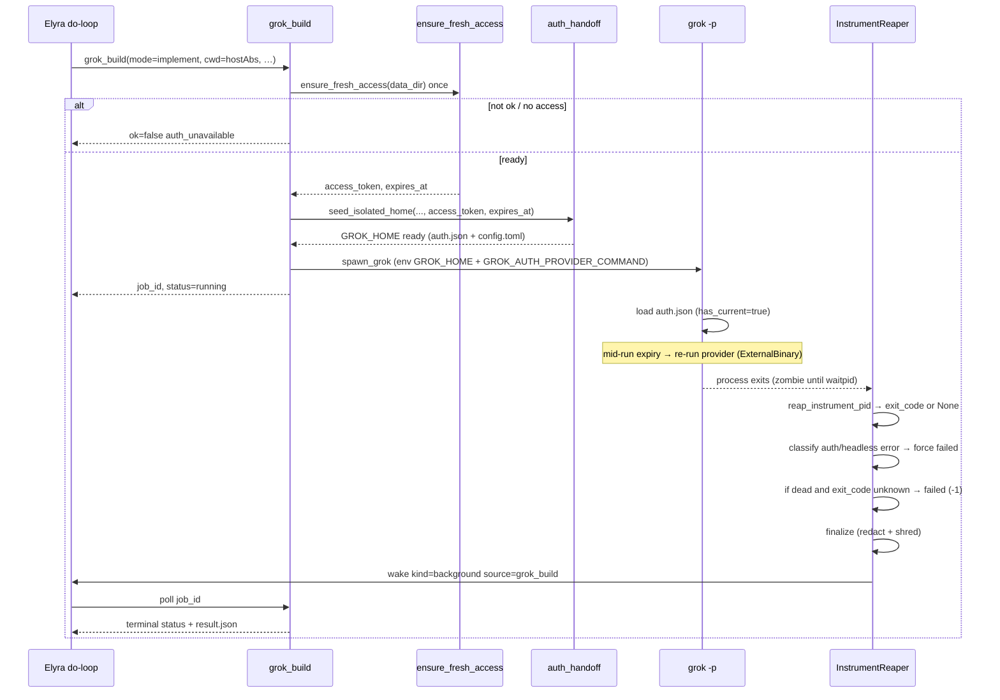
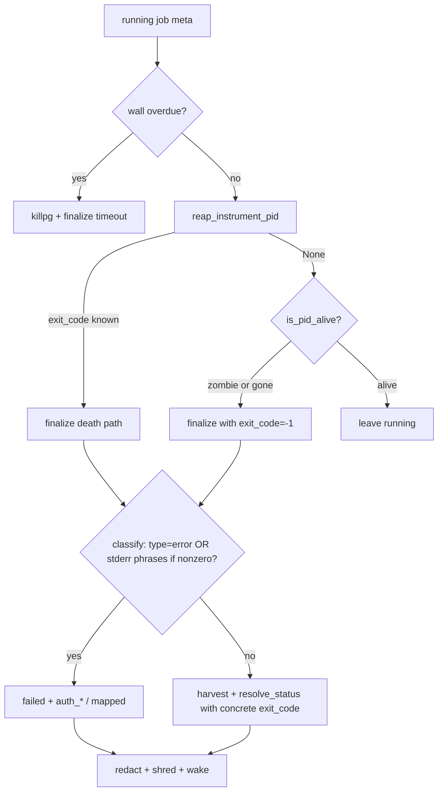

# Design: Make `grok_build` a functional instrument (auth + lifecycle honesty)

| Field | Value |
|-------|--------|
| **Class** | DESIGN |
| **Document** | Functionalization of Phase 1 `grok_build` host instrument after live dogfood failure |
| **Author** | Design (Grok Build subagent) |
| **Date** | 2026-08-03 |
| **Status** | Draft / Active |
| **Product** | project-elyra |
| **Tracks** | Issue #109 follow-on; live dogfood job `fdaf572ce9454bc299b2e246330e4d8f` |
| **Stack base (normative)** | `feature/grok-build-tool` (~`407e4af`) |
| **Completion tip (normative)** | `feature/grok-build-tool` (merge-down / restack; **not** `main`, not house `working` tip law change) |
| **Related** | [docs/design/grok-build/design-grok-build-tool.md](design-grok-build-tool.md), [docs/dev/branch-law.md](../../dev/branch-law.md), [docs/grok-build-dogfood.md](../../grok-build-dogfood.md), [docs/design/grok-build/grok-build-headless-spike.md](grok-build-headless-spike.md), Grok 0.2.118 user-guide `02-authentication.md` |
| **Revised** | 2026-08-03 (review a7f29241; auth-classifier false-positive gate) |

---

## Overview

Phase 1 of the Elyra Grok Build instrument has largely **landed on `feature/grok-build-tool`**: thin builtin `elyra.tools.builtin.grok_build`, modular `elyra/instrument/*` (modes, argv, process, jobs, reaper, auth_handoff, auth_provider, validate, usage_bridge, discover), bundled schema/TOOL.md, `self-improve` + extended `github-workflow`, and hermetic unit coverage. Live dogfood on 2026-08-03, however, proved the instrument is **not yet usable** by Elyra (person + skills) for real design / implement / review / execute_plan work.

The failing implement job (`fdaf572ce9454bc299b2e246330e4d8f`) exposed three tightly coupled defects: (1) headless Grok 0.2.118 **does not mint a session from `auth_provider_command` alone** when `auth.json` is absent, so PE’s carefully seeded live provider never authenticates a cold `-p` start; (2) the child exits immediately with “Not signed in” but becomes a **zombie** under the PE parent, and `is_pid_alive` treats zombies as alive via `os.kill(pid, 0)`, so the reaper never finalizes and poll returns `running` indefinitely; (3) guest-relative `cwd` values hit the host VCS jail as `not_a_repo`, burning a turn before PE recovered with a host-absolute sandbox path.

**Proposed solution:** keep KD4/KD5b law (PE `xai_oauth` access-only; live provider for mid-run mint; never refresh into operator/guest secrets), but **hydrate isolated `GROK_HOME/auth.json` with an access-only ExternalBinary-shaped session** so headless `-p` starts authenticated; fix **process liveness** (zombie-aware detection + mandatory `waitpid` reaping) so dead jobs finalize within one reaper poll; make finalize **fail-closed when exit_code is unknown**, map clear auth deaths (including headless `{"type":"error"}`) **before** harvest success mapping; redact access on **async** finalize; improve **cwd / path-jail** guidance; document truth and run a short smoke path that greens dogfood **D1** (and preferably D2, D8, D11, D13). All PRs stack from and land back on **`feature/grok-build-tool`**.

---

## Background & Motivation

### Current state (verified on tip `407e4af`)

| Area | Reality | Evidence |
|------|---------|----------|
| Handler | `elyra/tools/builtin/grok_build.py` — validate → auth preflight → seed → sync/async spawn | Source |
| Auth seed | `auth_handoff.seed_isolated_home` writes `config.toml` with multi-arg `auth_provider_command`; **no `auth.json`** | `elyra/instrument/auth_handoff.py` |
| Auth preflight | `resolve_access_token_for_tool` → `str \| None` only; **drops** `expires_at` from `ensure_fresh_access` | `elyra/secrets/inject.py` |
| Auth provider | `python -m elyra.instrument.auth_provider --data-dir <abs>` → JSON `{access_token, expires_in}` via `ensure_fresh_access` | Manual run succeeds against `data/secrets/xai_oauth.json` |
| Child env | `process.build_child_env` sets `GROK_HOME`, `CI=1`, `GROK_NO_BROWSER=1`, `GIT_TERMINAL_PROMPT=0`; **does not** set `GROK_AUTH_PROVIDER_COMMAND` or seed tokens | `elyra/instrument/process.py` |
| Jobs / reaper | Durable `data/runtime/grok_build/<id>/`; reaper daemon thread; `is_pid_alive` = `os.kill(pid, 0)` | `jobs.py`, `reaper.py` |
| Finalize status | `resolve_status_from_harvest`: `exit_code not in (0, None)` → failed; **`None` treated like success** | `result.py` |
| Async redaction | Sync `_finalize_sync` passes `known_values`; reaper `finalize_job` calls **never** pass `known_values` | `grok_build.py`, `reaper.py` |
| deep_research | `DEEP_RESEARCH_EXPERIMENTAL = True` → fail-closed `mode_experimental` | `modes.py` |
| Dogfood | D1–D13 all unchecked; D3+D6 gate PR8 → `working` (later) | `docs/grok-build-dogfood.md` |
| Catalog docs | `docs/tools-and-skills.md` still says Phase 1 not in surface | Stale |

### Live dogfood failure (2026-08-03, job `fdaf572ce9454bc299b2e246330e4d8f`)

Running PE (`elyra start` on feature tip) with a goal to clone oneuptime and `grok_build` implement feature-map docs:

1. **First spawn:** `cwd=tmp/oneuptime` → `not_a_repo` (guest-relative path vs host VCS jail). PE recovered with absolute host path under `sandboxes/sandbox0/tmp/oneuptime`.
2. **Second spawn:** async implement returned `job_id`, pid **155488**, `status=running`.
3. **Child grok 0.2.118** exited immediately. stdout/stderr:
   ```text
   Not signed in. To authenticate without a browser, run:
     grok login --device-code
   ```
   stdout also carried headless JSON: `{"type":"error","message":"Not signed in…"}`.
4. Seeded `GROK_HOME` had valid `auth_provider_command` pointing at PE venv + `data`; PE OAuth present; manual provider CLI works.
5. Grok unified log (`grok_home/logs/unified.jsonl`):
   - `has_auth: false`, no `auth.json`
   - `methods: ["grok.com"]` only
   - **No** `auth: running external auth provider` line
   - Later lab: stderr can advertise `has_auth_provider=true` while still refusing without a session
6. Process became **zombie** (`STAT=Zs`, ppid = elyra); **no `result.json`**; artifacts empty; `meta.exit_code` still **null**.
7. Reaper did **not** finalize: `is_pid_alive` uses `os.kill(pid, 0)`, which **returns true for zombies**.
8. Poll path kept `status=running` for many minutes; PE scheduled 5-minute timer polls; guest `run ls` of host `data/runtime/grok_build/...` correctly fails isolation.

**Review verification retained:** the above matches on-disk job layout under `data/runtime/grok_build/fdaf572ce9454bc299b2e246330e4d8f/` (meta, stdout/stderr, config.toml without auth.json, unified.jsonl, zombie pid).

### Laboratory confirmation (same host, 2026-08-03)

Against Grok **0.2.118**:

| Experiment | Result |
|------------|--------|
| Isolated `GROK_HOME` + multi-arg `auth_provider_command` only | `Not signed in`; provider **never run** |
| Same with single-path wrapper binary for provider | Same failure |
| `GROK_AUTH_PROVIDER_COMMAND` env only | Same failure |
| Seed **wrong** `auth.json` shapes | Parse errors (`expected struct GrokAuth`, missing fields) |
| Seed **access-only** scoped `auth.json` with `auth_mode=external` + required identity fields + live access as `key` | **Headless `pong` succeeds** |
| Same seed with **expired** external token + provider in config | Grok **re-runs provider** (`ExternalBinary` refresh chain); success; **no refresh_token** written back |
| `XAI_API_KEY=<oauth access>` | Works for short prompt, but env-visible; not mid-run mint path |

**Auth root cause (precise):** Grok 0.2.118 headless **requires an existing session credential** for `-p` to proceed. `auth_provider_command` is used for **refresh of an existing ExternalBinary session** (and is advertised for interactive login flows), **not** as a cold-start mint when `auth.json` is missing. **PE Phase 1 design** (`docs/design/grok-build/design-grok-build-tool.md` KD5/KD5b and “equivalently `GROK_AUTH_PROVIDER_COMMAND`”) assumed provider-only cold-start under isolated home would authenticate headless; that assumption is false for 0.2.118. Grok’s own user-guide describes external providers primarily for non-browser login and refresh rather than a hard promise that headless `-p` always auto-runs the provider when `auth.json` is absent. Config multi-arg `sh -c` is fine once a session exists.

**Zombie root cause (precise):** `spawn_grok` uses `Popen` + `start_new_session=True` and drops the handle; the PE process **remains parent** of the session-leader pid (verified: live ppid). On exit without `waitpid`, the child is a zombie. Linux `kill(pid, 0)` succeeds on zombies, so reaper/GC think the job is still running until wall timeout (up to **7200s** for implement). Z-state detection alone finalizes meta but **does not free the pid table entry** — `waitpid` is required to reap.

**False-success risk (code-backed):** even after zombie detection lands, today’s `resolve_status_from_harvest(exit_code=None)` returns **`completed`**. Auth heuristics in `finalize_job` run **only when** `status == FAILED`. A dead implement job with “Not signed in” logs and `exit_code=None` would become **ok=true completed** unless this design’s fail-closed rules land (KD-F14, KD-F16).

### Pain points

1. Every long-mode spawn currently fails auth immediately yet looks “running” for hours → PE thrash, burned SuperGrok attention, no honest error.
2. Naive “finalize when pid dead” without exit_code/auth rules can invent **false success**.
3. Path-jail footgun teaches PE the wrong cwd convention on first try.
4. Dogfood matrix cannot go green; PR8 → `working` remains blocked by D3/D6 which cannot pass without functional auth+reaper.
5. Stale catalog prose understates readiness once fixes land.

---

## Goals & Non-Goals

### Goals

1. **Auth handoff that works headless:** under isolated `GROK_HOME`, `grok -p` authenticates via PE `xai_oauth` access-only (never put `refresh_token` into guest/operator auth material). Mid-run mint still via live `auth_provider` when Grok sets expiry / `GROK_AUTH_EXPIRED`.
2. **Job lifecycle honesty:** dead and zombie children are **reaped** and finalized promptly (seconds, not hours); poll and background wakes reflect terminal status; clear auth failures map to `auth_unavailable` / `auth_expired`; **dead-without-exit_code never looks completed**.
3. **Reduce cwd / path-jail footguns** via TOOL.md + skills + better error hints (resolver helper deferred unless dogfood burns again).
4. **Dogfood:** make **D1** green with a short smoke path; preferably **D2, D8, D11, D13**. Leave **D7** experimental unless PR0a signs. **D3/D6** remain the later H-spine / PR8 gate, but become reachable after auth+reaper.
5. **Document truth** (tools-and-skills, dogfood notes, optional known-bugs).
6. **PR Plan** with stack base and completion tip both **`feature/grok-build-tool`**.

### Non-goals

| Non-goal | Rationale |
|----------|-----------|
| Enable non-experimental `deep_research` without PR0a sign-off | KD16 still holds |
| Merge Phase 1 to `main`, or redefine house `working` tip law in this design | Completion tip is **feature branch**; PR8-style product land is later |
| Reimplement Grok design/implement skills in Python | Broker only |
| Full H-spine dogfood (D3+D6) as hard gate of *this* design | Follow-on after functional auth+reaper |
| Change PE person identity model | Instrument only |
| Copy operator `~/.grok/auth.json` (with refresh) into run homes | Violates KD4 / multi-instance safety |
| Silent sandbox-relative cwd magic that weakens path jail | KD-F9 / §3.3 — skills first |

---

## Key Decisions

| ID | Decision | Rationale |
|----|----------|-----------|
| **KD-F1** | **Stack base = `feature/grok-build-tool`; completion tip = `feature/grok-build-tool`** | User-normative for this workstream; does not redefine [branch-law.md](../../dev/branch-law.md) house `working` tip. Prefer short-lived `fix/gb-*` / `feature/gb-*` branches, stacked, then fold into the feature tip. |
| **KD-F2** | **Cold-start auth = seed access-only `GROK_HOME/auth.json` (ExternalBinary shape) + keep live `auth_provider_command`** | Empirically required on Grok 0.2.118: provider alone does not authenticate headless `-p`. Seeding access-only session unblocks cold start; provider handles mid-run refresh without PE refresh_token. Preserves KD4/KD5b spirit. |
| **KD-F3** | **`auth_mode` for seeded session = `external`** (not `oidc` / `oauth`) | `external` routes refresh through `auth_provider_command` (`ExternalBinary` chain). `oidc` without refresh_token is fragile for multi-hour modes. Valid Grok enum includes `grok`, `web_login`, `oidc`, `external`, … |
| **KD-F4** | **Never seed `refresh_token`; never set `XAI_API_KEY` from OAuth access as the primary path** | Refresh stays in PE `data/secrets` only. `XAI_API_KEY` works as a short-path hack but is env-visible (`/proc/.../environ`), skips Grok session semantics, and is a weaker mid-run story. Documented as rejected alternative. |
| **KD-F5** | **Also set `GROK_AUTH_PROVIDER_COMMAND` (and optional `ELYRA_DATA_DIR`) in child env** | Belt-and-suspenders with config.toml; design Phase 1 already claimed env equivalent but `build_child_env` never set it. |
| **KD-F6** | **Zombie-aware liveness + mandatory waitpid reaping via shared `reap_instrument_pid`** | `/proc` state `Z` ⇒ not alive (detect); `waitpid(pid, WNOHANG)` on recorded **pid** (session leader) reaps and supplies exit_code. Detection without reaping leaks zombies in the PE pid table. |
| **KD-F7** | **Poll path opportunistic finalize** when meta says running but pid is dead/zombie | Presence may wake on timers before reaper thread; honesty must not depend on thread scheduling alone. Uses same reap + finalize helpers as reaper. |
| **KD-F8** | **Auth death heuristics: primary headless `type=="error"` + message; secondary phrase match only on stderr / gated free-form logs** | Live job is headless error JSON. Free-form “device-code” / “not signed in” in **success body text** (common in PE docs / D1 summaries) must **not** force `auth_unavailable`. |
| **KD-F9** | **cwd: skill/TOOL.md host-absolute under jail first; resolver helper deferred** | Cheapest fix for D1 path thrash. Optional code helper is **out of PR-C** unless a second dogfood burn requires it; if ever shipped, exact try-order + escape tests are mandatory. |
| **KD-F10** | **Wrapper binary for multi-arg provider is optional, not required** | `sh -c` multi-arg works for mid-run refresh once session exists; cold-start was the real bug. Wrapper remains a fallback if a future Grok build regresses command parsing. |
| **KD-F11** | **Deep research stays experimental** | No change unless PR0a signs strategy (1)/(2). |
| **KD-F12** | **Synthetic PE identity fields in seeded auth.json** (`user_id`/`email` like `instrument@elyra.local`) | Do not clone operator profile from `~/.grok/auth.json`. Minimal required fields only. |
| **KD-F13** | **Single OAuth mint per spawn: handler calls `ensure_fresh_access` once; passes `access_token` + `expires_at` into seed; async must not discard token before seed** | Today’s `resolve_access_token_for_tool` drops expiry and async path discards the access string after preflight. Prefer one mint (no double-refresh thrash). Preflight existence-only is insufficient for ExternalBinary `expires_at`. |
| **KD-F14** | **Dead process + unknown exit_code ⇒ failed, never completed** | `resolve_status_from_harvest` treats `exit_code is None` as success. Normative override for reaper/poll/GC finalize paths when the child is gone/zombie without a captured code. |
| **KD-F15** | **Async finalize always redacts via `auth_secret_values_for_redaction(data_dir)` (+ optional run-local values never stored in meta)** | Sync path already redacts call-local access; reaper does not. After seeding auth.json, access may appear in logs/stdout. Never put raw access into `meta.json`. |
| **KD-F16** | **Auth / headless-error classification runs before harvest success mapping and forces failed when the classifier matches under its gates** | Independent of artifact rules. **Primary** match: headless `type=="error"` (any exit). **Secondary** free-form phrases: only when `exit_code not in (0,)` (i.e. nonzero / dead-default `-1`) **and** match is on stderr (or non-success stdout slices — never the free-form success `text` body alone). Exit 0 + success JSON mentioning “device-code” stays **completed**. |
| **KD-F17** | **PR-B hard-depends on PR-A (stack on A tip)** | Shared `grok_build.py` / handler tests; full “auth death → `auth_unavailable`” story needs seed + lifecycle. B alone must still fail closed on dead-without-exit_code, but product path is A→B. |
| **KD-F18** | **`expires_at` ISO format = `YYYY-MM-DDTHH:MM:SSZ` via existing `expires_at_from_expires_in` / store `expires_at`** | Matches `elyra.llm.xai_oauth` (`%Y-%m-%dT%H:%M:%SZ`). Pin golden fixture against Grok 0.2.118. |

---

## Proposed Design

### High-level architecture (after fix)

```text
┌──────────────────────────────────────────────────────────────────────┐
│ Elyra person (skills: self-improve, github-workflow, …)              │
└───────────────────────────────┬──────────────────────────────────────┘
                                │ grok_build(mode, cwd=host-abs, …)
                                ▼
┌──────────────────────────────────────────────────────────────────────┐
│ builtin grok_build                                                    │
│  validate → path jail → meter                                         │
│  ensure_fresh_access ONCE → (access_token, expires_at)                │
│  create_job → seed_isolated_home (skills + config + **auth.json**)    │
│  build_child_env (+ GROK_AUTH_PROVIDER_COMMAND) → run/spawn           │
│  on pre-spawn failure after create_job → mark job failed + result     │
└───────────────┬───────────────────────────────┬──────────────────────┘
                │ sync                          │ async
                ▼                               ▼
         run_grok + finalize            spawn_grok + job_id
         (known_values redaction)               │
                ┌───────────────────────────────┘
                ▼
┌──────────────────────────────────────────────────────────────────────┐
│ Host grok -p (GROK_HOME=run_dir/grok_home)                            │
│  · reads access-only auth.json (auth_mode=external)                   │
│  · mid-run: sh -c auth_provider_command → ensure_fresh_access         │
└──────────────────────────────────────────────────────────────────────┘
                │ exit / zombie
                ▼
┌──────────────────────────────────────────────────────────────────────┐
│ reaper / poll: reap_instrument_pid + is_pid_alive (Z=dead)            │
│  → classify (type=error primary; stderr phrases if nonzero)           │
│  → dead + exit_code unknown → failed (never completed)                │
│  → harvest · usage_bridge · redact · shred · background wake          │
└──────────────────────────────────────────────────────────────────────┘
```

### Sequence: fixed async implement



### 1. Auth handoff fix (primary)

#### 1.1 Files

| File | Change |
|------|--------|
| `elyra/tools/builtin/grok_build.py` | **Single mint:** call `ensure_fresh_access(data_dir)` (or thin wrapper) once; pass `access_token` + `expires_at` into seed; keep token only in locals for sync redaction — **never** meta; wire env into spawn/run |
| `elyra/instrument/auth_handoff.py` | `write_access_only_auth_json`; `seed_isolated_home(..., access_token, expires_at, …)`; golden shape helpers |
| `elyra/instrument/process.py` | `build_child_env`: set `GROK_AUTH_PROVIDER_COMMAND`, optional `ELYRA_DATA_DIR` |
| `elyra/instrument/auth_provider.py` | No contract change; remain access-only JSON; honor `GROK_AUTH_EXPIRED` |
| `elyra/llm/xai_oauth.py` | Read-only: `XAI_OAUTH_CLIENT_ID`, `FreshAccessResult`, `expires_at_from_expires_in` |
| `elyra/secrets/inject.py` | **Optional** thin wrapper only if useful for tests; **not required** — handler may call `ensure_fresh_access` directly for structured result. Keep `resolve_access_token_for_tool` for other callers / backward compat if still used elsewhere. |
| Tests | `tests/test_instrument_auth_handoff.py`, `tests/test_instrument_process.py`, `tests/test_builtin_grok_build.py`; fixture under `tests/fixtures/grok_build_auth_json_external.json` (fake token) |

#### 1.2 Normative mint + seed API (KD-F13, KD-F18)

**Handler spawn path (normative):**

```python
# elyra/tools/builtin/grok_build.py — conceptual, after validate/cwd/meter

from elyra.llm.xai_oauth import ensure_fresh_access

fresh = ensure_fresh_access(Path(ctx.paths.data_dir))
if not fresh.ok or not fresh.access_token:
    return _err("auth_unavailable", mode=mode, hint="xai_oauth login required …")

access_token: str = fresh.access_token.strip()
expires_at: str | None = fresh.expires_at  # ISO-Z from oauth store / refresh
if not expires_at:
    # Only if store omitted expires_at but access ok (rare).
    from elyra.llm.xai_oauth import expires_at_from_expires_in
    expires_at = expires_at_from_expires_in(3600)

# create_job ...
seeded = seed_isolated_home(
    run_dir,
    data_dir=ctx.paths.data_dir,
    grok_bin=grok_bin,
    access_token=access_token,
    expires_at=expires_at,
)
# spawn/run with extra_env from seeded.auth_provider_command + data_dir
# sync finalize: known_values = merge_known_values([access_token], auth_secret_values_for_redaction(...))
# NEVER: meta.extra["access_token"], NEVER secret_env, NEVER XAI_API_KEY from OAuth
```

**Seed signatures (normative):**

```python
def write_access_only_auth_json(
    grok_home: Path | str,
    *,
    access_token: str,
    expires_at: str,
    create_time: str | None = None,  # default now as YYYY-MM-DDTHH:MM:SSZ
) -> Path:
    """Write grok_home/auth.json mode 0600. Never writes refresh_token."""
    ...

def seed_isolated_home(
    run_dir: Path | str,
    *,
    data_dir: Path | str,
    access_token: str,
    expires_at: str,
    real_bundled: Path | str | None = None,
    grok_bin: Path | str | None = None,
    executable: str | None = None,
    assert_skills: bool = True,
    env: dict[str, str] | None = None,
) -> SeededHome:
    """Seed skills + config.toml + access-only auth.json under run_dir/grok_home."""
    ...
```

**Rules:**

1. **One** `ensure_fresh_access` per successful spawn (preflight + seed share that result). Do **not** call `resolve_access_token_for_tool` then mint again inside seed.
2. Async path **must** pass the same `access_token`/`expires_at` into seed before discarding locals (today the string is dropped after a truthiness check).
3. Seed **does not** call `ensure_fresh_access` itself unless used from a standalone test helper — production handler owns mint.
4. Missing/failed mint → `auth_unavailable` **before** `create_job` when possible; if job already created, mark failed (see §2.6).

#### 1.3 Seeded `auth.json` contract (normative)

Path: `run_dir/grok_home/auth.json`, mode **0600**.

Scope key (must match Grok’s AuthManager scope):

```text
https://auth.x.ai::<XAI_OAUTH_CLIENT_ID>
```

where `XAI_OAUTH_CLIENT_ID = "b1a00492-073a-47ea-816f-4c329264a828"` (same public client as PE OAuth).

**Pinned ISO format (KD-F18):** `YYYY-MM-DDTHH:MM:SSZ`  
Use `fresh.expires_at` when present (already store format), else `expires_at_from_expires_in`. Same format for `create_time` via `strftime("%Y-%m-%dT%H:%M:%SZ")`.

Minimal working payload (lab-verified on Grok **0.2.118**; hermetic golden fixture must match this shape with a **fake** token):

```json
{
  "https://auth.x.ai::b1a00492-073a-47ea-816f-4c329264a828": {
    "key": "<access_token>",
    "auth_mode": "external",
    "create_time": "2026-08-03T01:42:10Z",
    "expires_at": "2026-08-03T06:42:10Z",
    "user_id": "pe-instrument",
    "email": "instrument@elyra.local",
    "first_name": "Elyra",
    "last_name": "Instrument",
    "principal_type": "user",
    "principal_id": "pe-instrument",
    "team_id": "",
    "coding_data_retention_opt_out": true,
    "oidc_issuer": "https://auth.x.ai",
    "oidc_client_id": "b1a00492-073a-47ea-816f-4c329264a828"
  }
}
```

**Hermetic fixture:** `tests/fixtures/grok_build_auth_json_external.json` (redacted/fake `key`). Unit test: `write_access_only_auth_json` → mode 0600, required keys present, **`refresh_token` key absent**, scope key correct. Dogfood notes pin behavior against Grok **0.2.118**.

**Laws:**

1. **Never** include `refresh_token` (omit key entirely).
2. `key` is the PE access token from the single mint only.
3. `expires_at` / `create_time` use KD-F18 format.
4. Do **not** copy operator `~/.grok/auth.json` wholesale.
5. File mode 0600; parent `GROK_HOME` 0700.
6. `shred_tokens` already candidates `grok_home/auth.json` — keep; expand tests.

#### 1.4 `config.toml` (unchanged shape, still required)

```toml
# Generated by elyra.instrument.auth_handoff — do not store secrets here.
[auth]
auth_provider_command = "<abs sys.executable> -m elyra.instrument.auth_provider --data-dir <abs data_dir>"
```

Grok may rewrite marketplace keys into this file; leave them alone. Provider command remains the mid-run mint path.

#### 1.5 Child env additions

```python
# process.build_child_env — normative additions
env["GROK_HOME"] = str(Path(grok_home).resolve())
env.setdefault("CI", "1")
env.setdefault("GROK_NO_BROWSER", "1")
env.setdefault("GIT_TERMINAL_PROMPT", "0")
if auth_provider_command:
    env["GROK_AUTH_PROVIDER_COMMAND"] = auth_provider_command
if data_dir:
    env.setdefault("ELYRA_DATA_DIR", str(Path(data_dir).resolve()))
# NEVER set XAI_API_KEY from OAuth access on the primary path
```

Wire `seeded.auth_provider_command` and `data_dir` from the handler into `spawn_grok` / `run_grok` via `extra_env` or extended `build_child_env` signature.

#### 1.6 Token lifecycle

```text
spawn:
  ensure_fresh_access ONCE → write auth.json (0600) → spawn child
  (access_token held only in handler locals for sync redaction)
mid-run:
  Grok ExternalBinary refresh → sh -c auth_provider_command
    → ensure_fresh_access(force if GROK_AUTH_EXPIRED=1)
    → Grok rewrites auth.json key (access only; no refresh from our provider)
async finalize / GC / interrupt:
  known_values = auth_secret_values_for_redaction(data_dir)  # PE store still has access
  redact result/summary · shred_tokens(run_dir)  # auth.json, .access_cache, …
  NEVER read access from meta.json (it was never written)
```

#### 1.7 Acceptance criteria (auth)

- Hermetic: seed writes 0600 auth.json **without** `refresh_token` key; config has absolute `sys.executable`; golden fixture round-trip.
- Hermetic: handler/seed path uses one mint; seed receives both `access_token` and `expires_at` (mock `ensure_fresh_access`).
- Live smoke (operator): isolated `GROK_HOME` + seed + `grok -p "reply with only: pong" --output-format json` → exit 0, `text` contains pong, unified log `has_auth`/`has_current` true (Grok 0.2.118).
- Live: expired external seed forces provider re-run (`GROK_AUTH_EXPIRED` or past `expires_at`).
- Unit: provider still never prints refresh; redaction covers access on sync **and** async finalize.
- Negative: missing OAuth → tool returns `auth_unavailable` **before** spawn.

### 2. Job lifecycle honesty (zombie + finalize)

#### 2.1 `is_pid_alive` (Linux-first, portable fallback)

```python
def is_pid_alive(pid: int | None) -> bool:
    """True only if process exists and is not a zombie.

    os.kill(pid, 0) returns success for zombies — insufficient alone.
    """
    if pid is None:
        return False
    try:
        p = int(pid)
    except (TypeError, ValueError):
        return False
    if p <= 0:
        return False
    # Prefer /proc state when available (Linux).
    stat_path = f"/proc/{p}/stat"
    try:
        with open(stat_path, "r", encoding="utf-8") as fh:
            raw = fh.read()
        # Format: pid (comm) state ...  — state is first token after last ')'
        state = raw.split(")", 1)[1].split()[0]
        if state == "Z":
            return False
    except FileNotFoundError:
        return False
    except OSError:
        pass  # fall through to kill(0)
    try:
        os.kill(p, 0)
    except ProcessLookupError:
        return False
    except PermissionError:
        return True  # exists, not ours — treat alive
    except OSError:
        return False
    return True
```

#### 2.2 Shared reap helper (normative — KD-F6)

```python
# elyra/instrument/jobs.py (preferred owner — pure process/meta helpers)

def reap_instrument_pid(pid: int | None) -> int | None:
    """Best-effort waitpid(WNOHANG) for a grok_build child.

    Targets the recorded **pid** (session leader from start_new_session=True),
    not pgid. Returns:
      - int exit_code if this process reaped the child
      - None if still running, not our child (ECHILD), or pid invalid

    Does not raise on ECHILD / ChildProcessError.
    """
    if pid is None:
        return None
    try:
        p = int(pid)
    except (TypeError, ValueError):
        return None
    if p <= 0:
        return None
    try:
        finished_pid, status = os.waitpid(p, os.WNOHANG)
    except ChildProcessError:
        return None  # not our child (e.g. PE restarted) — caller uses /proc
    except OSError:
        return None
    if finished_pid == 0:
        return None  # still running
    # Decode wait status → exit code (normative)
    if os.WIFEXITED(status):
        return int(os.WEXITSTATUS(status))
    if os.WIFSIGNALED(status):
        return -int(os.WTERMSIG(status))
    return -1
```

**Callers (all three must use the same helper):**

| Caller | When |
|--------|------|
| `reaper._handle_running` | Every poll of `status=running` jobs |
| `grok_build._poll_job` opportunistic finalize | Before/while deciding terminal |
| `gc_interrupted` (optional but preferred) | Startup GC for dead running jobs |

**Acceptance:** after one reaper (or poll) cycle that observes death, `/proc/<pid>` is **gone** when PE was parent (zombie reaped), not merely `state=Z` with finalize written.

**Note:** `spawn_grok` drops `Popen` and uses `start_new_session=True`; PE remains parent of the **pid** recorded in meta. Prefer waitpid on that **pid**. Do not wait only on pgid as the primary path. On `ChildProcessError`/ECHILD after PE restart, fall back to `/proc` Z/gone without claiming a fabricated success exit_code.

#### 2.3 Finalize status semantics when dead (normative — KD-F14, KD-F16)

Current bug: `resolve_status_from_harvest` treats `exit_code is None` like success; auth heuristics only run when status is already `failed`.

**Normative finalize order** (reaper, poll opportunistic, and any shared `finalize_job` entry used for death):

```text
1. reap_instrument_pid(meta.pid) → exit_code_opt
2. if exit_code_opt is not None: use it
   elif process is dead/zombie (not is_pid_alive): exit_code := -1
        # KD-F14: unknown exit on dead child is FAILURE, never completed
   elif still alive: return (leave running)
3. Read stdout/stderr (and parse headless JSON if present)
4. classify_instrument_failure(stdout, stderr, headless, exit_code)  # KD-F8/F16 — BEFORE harvest
   if match (under gates below):
        status := failed
        error_reason := mapped reason (auth_unavailable / auth_expired / …)
        hint := Glass / elyra auth login
        # skip harvest-driven completed path entirely
5. else:
        harvest as today
        status := resolve_status_from_harvest(..., exit_code=exit_code)
        # with exit_code never None on dead path (step 2), completed requires exit 0
6. redact with known_values (KD-F15)
7. write result.json · update meta · shred_tokens · completion wake
```

**KD-F14 rule (one line):**  
If the instrument child is **not alive** and no exit_code was captured from waitpid, finalize with `exit_code=-1` (or equivalent nonzero) and **`status=failed`** unless a more specific classifier sets `interrupted` / `timeout` / auth reason. **Never** leave `exit_code=None` into `resolve_status_from_harvest` for a dead child.

Optional small fix to `resolve_status_from_harvest` itself is **not** required if all death paths pass a concrete nonzero code; prefer not to change the meaning of `None` for “sync still running” callers without audit. Death paths **must** not pass `None`.

#### 2.4 Auth / headless error classification (normative — KD-F8, KD-F16)

**False-positive law:** Successful headless runs emit `{"text":"<free-form summary>"}` (no `type=="error"`). Project docs, OAuth design prose, and D1 “summarize README” answers commonly contain **`device-code`** / “not signed in” as **authored content**. Matching those phrases against the full stdout (including success `text`) would mark D1 and many implement/review jobs as `auth_unavailable`. **Forbidden.**

**Match order (normative):**

| Priority | Signal | Gate | Action |
|----------|--------|------|--------|
| **1 Primary** | Headless JSON `type == "error"` | Always (any exit_code, including 0 if Grok ever emits that) | Map **`message` only** via `_map_auth_message`; force `failed` + reason (`auth_unavailable` if phrases match, else `nonzero_exit`) |
| **2 Secondary** | Free-form phrase match | **`exit_code not in (0,)`** (nonzero, or dead-default `-1`) **and** match corpus is **stderr first**, else a **short error slice** of stdout that is **not** the success `text` body | Map phrase → `auth_unavailable` / `auth_expired`; force `failed` |
| **3** | No match | — | Proceed to harvest / `resolve_status_from_harvest` |

**Do not:**

- Phrase-match the full `stdout` blob (which includes success JSON `text`).
- Force-fail **exit 0** solely because “device-code” / “not signed in” appears in free-form content.
- Treat headless success objects (`type` absent/other, or `text` present without `type=="error"`) as auth death via phrase scan of `text`.

```python
def classify_instrument_failure(
    stdout: str,
    stderr: str,
    headless: dict[str, Any] | None,
    *,
    exit_code: int | None,
) -> tuple[str, str] | None:
    """Return (error_reason, hint) if logs show a clear instrument failure class.

    Independent of harvest artifacts. Phrase match is gated — see KD-F8/F16.
    """
    # 1) PRIMARY — headless error object (live dogfood shape). Map message only.
    if isinstance(headless, dict) and headless.get("type") == "error":
        msg = str(headless.get("message") or "")
        reason = _map_auth_message(msg) or "nonzero_exit"
        return reason, _hint_for(reason)

    # 2) SECONDARY — free-form phrases only when process failed / dead-default.
    #    exit_code 0 or None-as-still-unknown-success-path: never phrase-match.
    if exit_code in (0, None):
        return None

    # Prefer stderr (live job writes "Not signed in…" there). Do NOT scan success
    # body text. Optionally allow a short head of stdout only if it is clearly
    # error-shaped (e.g. starts with "Error:" / is a single-line {"type":"error"...}
    # already handled above) — never the free-form `text` field content alone.
    for corpus in (stderr, _error_shaped_stdout_slice(stdout, headless)):
        if not corpus:
            continue
        reason = _map_auth_message(corpus)
        if reason:
            return reason, _hint_for(reason)
    return None


def _error_shaped_stdout_slice(
    stdout: str,
    headless: dict[str, Any] | None,
) -> str:
    """Stdout material safe for secondary phrase match — not success body text.

    If headless has a free-form success `text` field, exclude it. Prefer empty
    string when stdout is only a success JSON object.
    """
    if isinstance(headless, dict) and "text" in headless and headless.get("type") != "error":
        return ""  # success-shaped — do not phrase-scan authored content
    # Non-JSON / bare Error: lines (some grok builds print plain stderr-like stdout)
    head = (stdout or "")[:4000]
    low = head.lower()
    if head.lstrip().startswith("{") and '"type"' not in low[:80]:
        # Likely success JSON without type=error — refuse full-body phrase scan
        return ""
    return head


def _map_auth_message(text: str) -> str | None:
    low = text.lower()
    # Cold-start / sign-in phrases (live job message + stderr)
    if "not signed in" in low or "device-code" in low or "device code" in low:
        return "auth_unavailable"
    if "no auth credentials" in low:
        return "auth_unavailable"
    if "auth" in low and any(x in low for x in ("expired", "reauth", "unauthorized", "401")):
        return "auth_expired" if "expired" in low else "auth_unavailable"
    return None
```

| Pattern (case-insensitive) | Where / gate | `error_reason` |
|----------------------------|--------------|----------------|
| Headless `type=="error"`; message has sign-in / device-code / no credentials | **Primary — always** | `auth_unavailable` (or `auth_expired` if expiry phrases) |
| Headless `type=="error"`; other message | **Primary — always** | `nonzero_exit` (still force failed; not harvest success) |
| `not signed in` / `device-code` / `device code` / `no auth credentials` | **Secondary — stderr** (or error-shaped stdout slice) **and** `exit_code not in (0, None)` | `auth_unavailable` |
| `auth` + (`expired` \| `reauth` \| `unauthorized` \| `401`) | Same secondary gate | `auth_expired` or `auth_unavailable` |
| Exit 0 + headless success `text` containing “device-code” | **No match** | harvest → **`completed`** |
| Dead + no auth match | — | `nonzero_exit` (exit_code from waitpid or `-1`) |

Hint for auth-class: point at Glass / `elyra auth login`.

**Interaction with dead-without-exit_code (KD-F14):** death path sets `exit_code=-1` before classify, so secondary phrase match on stderr **is** allowed for the live zombie case even without waitpid. Primary headless `type=error` still covers the live stdout JSON without relying on phrases in success bodies.

**Required unit tests (classifier):**

| # | Inputs | Expected |
|---|--------|----------|
| **(a)** | dead; `exit_code=None`→normalized `-1`; headless `{"type":"error","message":"Not signed in… device-code…"}`; stderr same | `failed` + `auth_unavailable` (not `completed`) |
| **(b)** | `exit_code=0`; headless `{"text":"… uses device-code flow …"}`; stderr empty | **`completed`** — **not** auth failure |
| **(c)** | `exit_code=1`; stderr `Not signed in…`; no headless error object | `failed` + `auth_unavailable` |

#### 2.5 Reaper / poll flow



Note: exit 0 success body containing “device-code” takes path **I → completed**, not H.


#### 2.6 Poll-path opportunistic finalize

In `grok_build._poll_job`:

1. If `result.json` present → return it (unchanged).
2. If `meta.status == running`:
   - `exit_code = reap_instrument_pid(meta.pid)`
   - If exit known **or** not `is_pid_alive(meta.pid)` → shared death finalize (same as reaper; pass concrete exit_code / `-1`) → return terminal payload.
   - Else → current success-with-`status=running`.
3. Do not invent success.

#### 2.7 Pre-spawn orphan jobs (handler residual — PR-B)

Today `create_job(status=running)` runs **before** seed/spawn. On seed or spawn failure the handler returns an error after `shred_tokens` but **does not** mark the job terminal → orphan `running` rows without pid (or without successful spawn).

**Normative in PR-B (small, required for lifecycle honesty):**

```python
# on seed_isolated_home / spawn_grok failure after create_job:
update_job_status(paths, job_id, JOB_STATUS_FAILED, error_reason=..., exit_code=None)
write_result(... make_error_payload ...)
shred_tokens(run_dir)
return _err(...)
```

Prefer fail **before** `create_job` when auth mint fails (KD-F13 path). When job already exists, always terminalize.

#### 2.8 Async redaction (normative — KD-F15)

| Path | Redaction source |
|------|------------------|
| Sync `_finalize_sync` | call-local `access_token` ∪ `auth_secret_values_for_redaction(data_dir)` (keep) |
| Reaper / poll finalize | **Always** `auth_secret_values_for_redaction(paths.data_dir)` via `known_values=` into `finalize_job` |
| meta.json | **Never** store access or refresh |
| Optional | If PE store was rotated mid-job and store no longer has the seeded access, shred still removes `auth.json`; summary redaction is best-effort for that edge |

**Unit test (required):** plant a fake access string in stdout.log; finalize async path; assert `result.json` summary/payload does not contain the raw string (uses `***` / redaction placeholder).

#### 2.9 Acceptance criteria (lifecycle)

- Unit: synthetic zombie → `is_pid_alive` False; after `reap_instrument_pid`, `/proc/pid` gone when we were parent.
- Unit: reaper `poll_once` finalizes unreaped dead child; writes `result.json`; enqueues one `background` wake.
- Unit **(a):** dead + implement + headless `type=error` “Not signed in” + stderr same + `exit_code=None` → `failed` + `auth_unavailable`, never `completed`.
- Unit **(b):** exit 0 + headless `{"text":"…device-code…"}` → **`completed`**, not `auth_unavailable` (D1 false-positive guard).
- Unit **(c):** exit 1 + stderr “Not signed in” → `auth_unavailable`.
- Unit: dead + no auth match + unknown exit → `failed` + `nonzero_exit` + exit_code `-1`.
- Unit: async finalize redacts planted access string.
- Unit: seed/spawn failure after create_job leaves terminal failed job, not eternal running.
- Live/dogfood D13: kill PE mid-job → restart → `interrupted` + shred.
- Live: intentional auth-fail job leaves terminal status within **≤ 5s** of process exit (not wall timeout), with zombie reaped.

### 3. Cwd / path-jail footguns

#### 3.1 Document + skill (required — PR-C)

Update:

- `tools/bundled/grok_build/TOOL.md` — **cwd must be a host-absolute path** to a git repo under `allowed_repo_roots` (typically `project_root` or `…/sandboxes/sandbox0/...`). Guest-relative paths like `tmp/foo` resolve against project root and fail `not_a_repo` / `path_jail`.
- `skills/bundled/self-improve/SKILL.md` — async + cwd rules: resolve host path via sandbox host mapping or prior `git_*` evidence before spawn.
- `skills/bundled/github-workflow/SKILL.md` — one bullet: instruments use host paths; sandbox FS tools use guest paths — do not mix blindly.

#### 3.2 Better error hints (required — PR-C)

In `grok_build._resolve_cwd` / jail errors, attach hint:

```text
cwd must be a host-absolute git repo under allowed_repo_roots.
Guest-relative paths (e.g. tmp/…) are not host paths; use
/…/sandboxes/sandbox0/tmp/… or the PE project root clone.
```

#### 3.3 Optional resolve helper — **deferred (not PR-C)**

Do **not** ship `resolve_instrument_cwd` in PR-C. Skills + hints are sufficient for D1.

If a **later** dogfood burn still shows PE thrash on relative cwd, a follow-on PR may add a helper with **exact** try order:

1. Existing `resolve_repo_path(raw, roots, require_git=True)` as today.
2. If relative and fails `not_a_repo`/`path_jail`: try `primary_sandbox_root(paths) / raw` only if still under allowed roots.
3. Never rewrite absolute paths that escape jail into “success.”
4. Tests: escape attempts still raise `PathJailError`; guest-looking `tmp/x` either resolves under sandbox root when that git repo exists **or** fails closed with the improved hint — no silent wrong repo.

#### 3.4 Acceptance

- D1 smoke uses host-absolute cwd and does not burn a `not_a_repo` turn.
- Hermetic: jail still refuses escapes; relative-without-base still fails closed with improved hint.
- PR-C does **not** include the optional resolver.

### 4. Documentation truth

| Doc | Update |
|------|--------|
| `docs/tools-and-skills.md` | Remove “Phase 1 not in surface”; state callable on feature tip with dogfood caveats |
| `docs/grok-build-dogfood.md` | Note auth seed + zombie fixes; pin Grok 0.2.118; keep D3/D6 PR8 gate; require D1 on advanced feature tip before PR8 discussion |
| `docs/design/grok-build/design-grok-build-tool.md` | Optional short “Post-dogfood errata” pointer to this design (or leave Phase 1 doc historical and land this as sibling) |
| `docs/known-bugs.md` / `known-bugs-BRANCHES.md` | Optional entries for residual execute_plan base-branch prose risk; deep_research experimental |

### 5. Dogfood / smoke path

**Short smoke (operator, continuous work OFF preferred):**

```bash
# Hermetic first
pytest -m 'not llm and not live_grok' tests/test_instrument_*.py tests/test_builtin_grok_build.py -q

# Live skeleton (optional; not a substitute for dogfood checklist)
ELYRA_LIVE_GROK=1 pytest tests/test_live_grok_build.py -q
# Manual D1 on feature tip after PR-E (dogfood checklist — no dedicated smoke script):
#   grok_build mode=prompt cwd=<repo abs> prompt="summarize README in 3 bullets" async=false
# Expect: ok summary, no token leakage in result.json
```

| Dogfood | Target for this workstream |
|---------|----------------------------|
| **D1** | **Required green** on advanced `feature/grok-build-tool` tip (before any PR8 discussion) |
| **D2** | Preferred (missing OAuth → `auth_unavailable`) |
| **D8** | Preferred if usage adapter already records headless fields |
| **D11** | Preferred (discover skill seed) |
| **D13** | Preferred (restart → interrupted + shred) |
| **D3/D6** | Follow-on; unblocked but not hard gate of this design |
| **D7** | Experimental only |

### 6. Security & Privacy Considerations

| Threat | Severity | Mitigation |
|--------|----------|------------|
| Access token in `run_dir/grok_home/auth.json` | Med | 0700/0600; shred on finalize/GC/interrupt; never log `key`; redaction known_values includes access (sync + async) |
| Refresh token leakage into GROK_HOME | High | Never write; provider stdout contract forbids; unit asserts no `refresh_token` key; shred if Grok ever writes one |
| Token in child env (`XAI_API_KEY`) | Med | **Rejected** as primary path; env readable via proc |
| OAuth in `secret_env` / guest | High | Unchanged law — never assign |
| Access in `meta.json` | High | **Forbidden** — redaction uses store + call-local only |
| Async result.json leaks access from stdout | Med | KD-F15 reaper redaction |
| Provider command injection | Low | Absolute sys.executable + fixed module path; data_dir resolved abs; shell=False for grok spawn (provider itself is `sh -c` by Grok — command string PE-controlled) |
| Auth.json identity fields | Low | Synthetic PE instrument identity, not operator PII clone |
| Zombie hang / pid table leak | Med | KD-F6 waitpid reaping |
| False completed on auth death | High | KD-F14 + KD-F16 |

**Threat model note:** Isolated `GROK_HOME` is PE-private under `data/runtime/grok_build/`. Same OS user as PE can always read; multi-user host isolation is out of scope beyond 0700.

### 7. Observability

| Signal | Where |
|--------|-------|
| `instrument reaper handle failed job_id=` | existing logger |
| New: log `auth_seed_written` (no token) / `auth_seed_failed` | auth_handoff / handler |
| New: log `reaped pid= exit=` / `zombie_detected pid=` | reaper/jobs via `reap_instrument_pid` |
| Finalize `error_reason=auth_unavailable` | result.json + meta |
| Completion wake | existing `background` + `source=grok_build` |
| Unified Grok log under run_dir | already captured; operator forensics |

Metrics (optional later): count of auth_unavailable vs completed instrument jobs per day — not required for v1 of this fix.

### 8. API / Interface Changes

No schema enum changes. Behavioral:

| Interface | Before | After |
|-----------|--------|-------|
| Handler auth preflight | `resolve_access_token_for_tool` → str only; discarded on async | `ensure_fresh_access` once → pass `access_token` + `expires_at` into seed |
| `seed_isolated_home` | skills + config.toml | + required `access_token`, `expires_at`; writes auth.json |
| `build_child_env` | GROK_HOME + CI hints | + `GROK_AUTH_PROVIDER_COMMAND`, optional `ELYRA_DATA_DIR` |
| `is_pid_alive` | kill(0) only | kill(0) + non-zombie |
| `reap_instrument_pid` | n/a | new shared helper |
| `finalize_job` death path | `exit_code=None` can complete | dead → concrete code; auth classify first; always redact on reaper |
| `_poll_job` | running if no result | reap + finalize if dead |
| Pre-spawn failure after create_job | orphan running | terminal failed + result |
| TOOL.md / skills | weak cwd guidance | host-absolute cwd law |

### 9. Data Model Changes

No durable PE schema migration. Per-run:

```text
data/runtime/grok_build/<job_id>/
  meta.json            # no secrets
  stdout.log / stderr.log
  result.json          # now written promptly on death; redacted
  artifacts/
  grok_home/
    config.toml
    auth.json          # NEW (ephemeral; shredded)
    bundled -> …
```

Retention: unchanged (14d / max 50 runs); shred still immediate on terminal.

### 10. Alternatives Considered

#### Auth alternatives

| Option | Pros | Cons | Verdict |
|--------|------|------|---------|
| **A. Seed access-only auth.json + live provider (chosen)** | Matches real Grok 0.2.118; mid-run mint; no refresh export; works with multi-arg command | Must maintain GrokAuth field shape; couples to CLI version | **Adopt** |
| **B. `XAI_API_KEY=<access>` only** | One-line env; proven short prompt | Env-visible; weaker multi-hour refresh; violates Phase 1 “do not set XAI_API_KEY from OAuth”; may not equal SuperGrok session semantics | **Reject** as primary |
| **C. Wrapper binary only (no auth.json seed)** | Cleaner config path docs | Does **not** fix cold-start; lab-failed | **Reject** alone |
| **D. Copy operator `~/.grok/auth.json`** | “Just works” | Exports refresh_token; multi-instance footgun; wrong account boundary | **Reject** |
| **E. PE runs `grok login` subprocess to hydrate** | Uses Grok’s own login path | Interactive/device risk; hang; ceremony | **Reject** |
| **F. Wait for upstream Grok cold-start provider mint** | Cleanest long-term | Blocks product now; PE Phase 1 assumption already false | **Track** only |
| **G. Double mint: resolve_access + seed ensure_fresh** | Simple to bolt on | Refresh thrash; dropped expiry still possible if only str preflight | **Reject** (KD-F13 single mint) |

#### Zombie / liveness alternatives

| Option | Pros | Cons | Verdict |
|--------|------|------|---------|
| **A. `/proc` state Z + waitpid shared helper (chosen)** | Correct on Linux; exit codes; reaps zombies | `/proc` Linux-specific (fallback kill0 elsewhere) | **Adopt** |
| **B. Keep Popen object in-process table** | `poll()`/`wait()` natural | Lost on PE restart; reaper is disk-first by design | Partial: optional cache, not sufficient alone |
| **C. Double-fork + init reaps** | No PE zombies | Harder exit_code; loses parent wait; overkill | **Reject** |
| **D. Rely on wall timeout only** | Zero code | Hours of fake `running` (7200s implement) | **Reject** |
| **E. Z-detect only without waitpid** | Smaller patch | Pid table leak; no exit_code | **Reject** as complete fix |

### 11. Rollout Plan

#### Branching strategy (normative for this workstream)

```text
feature/grok-build-tool          ← stack base AND completion tip
   ├── fix/gb-auth-seed          PR-A
   ├── fix/gb-zombie-reaper      PR-B  (MUST stack on PR-A tip)
   ├── fix/gb-cwd-docs           PR-C
   ├── fix/gb-dogfood-docs       PR-D
   └── (fold all into feature/grok-build-tool)  PR-E
```

- Every child branch **must** be cut from `feature/grok-build-tool` or from a prior stack tip that itself rests on that base.
- Prefer short-lived `fix/gb-*` / `feature/gb-*` names.
- **Completion condition:** tip of `feature/grok-build-tool` advances to include the full stack (merge-down / restack).  
- **Do not** merge these fixes directly to `main` as the completion condition.  
- House law in `docs/dev/branch-law.md` still names `working` as product integration tip for broader GI; **this design does not redefine that**. PR8-style merge of the whole Phase 1 instrument to `working` remains a **later** product gate after dogfood D3/D6 **and** after operator D1 on the advanced feature tip.

#### Feature flags

**None.** Behavior is a correctness fix. Do **not** ship `ELYRA_GROK_BUILD_SKIP_AUTH_JSON` in this workstream — provider-only cold-start is already reproducible with a unit/integration test that omits `write_access_only_auth_json`. Avoid underspecified debug env.

#### Rollback

- Revert stacked PRs on `feature/grok-build-tool` (git revert or reset tip if unshared).
- Leaving auth.json seed out reverts to known broken cold-start — only roll back if seed causes worse regressions; keep zombie/finalize fail-closed fix independently if possible.

#### Risks

| Risk | Sev | Mitigation |
|------|-----|------------|
| Grok changes GrokAuth schema | Med | Pin 0.2.118 golden fixture; fail with clear `auth_unavailable` + log parse errors; live smoke |
| waitpid races with another thread | Low | Single supervisor process; catch ECHILD |
| PE not parent after crash/reparent | Low | `/proc` zombie/gone still finalizes with exit_code=-1; never completed |
| False completed if KD-F14 omitted | High | Required unit test in PR-B; do not ship B without it |
| Access token residual on crash before shred | Med | startup GC shred + 0700 dirs |
| execute_plan still ignores `working` prose | Med | Preflight remains; residual documented; not fixed by this design |
| Handler test merge conflicts A↔B | Low | Stack B on A; conflict surfaces listed in PR plan |

### 12. Open Questions

1. ~~Single mint vs double mint?~~ **Resolved: KD-F13** — single `ensure_fresh_access`; pass both fields into seed.
2. ~~ISO format?~~ **Resolved: KD-F18** — `YYYY-MM-DDTHH:MM:SSZ` via existing oauth helpers.
3. ~~Smoke script vs dogfood checklist?~~ **Resolved (operator decision):** **dogfood checklist only**. Do **not** ship `scripts/smoke_grok_build_auth.py` (or equivalent) in this workstream unless a later explicit request. Operator path = hermetic pytest + `docs/grok-build-dogfood.md` / live checklist (D1 on advanced tip).
4. ~~Optional cwd resolver in PR-C?~~ **Resolved: deferred** (§3.3).
5. ~~Who owns D3/D6 H-spine dogfood after tip lands?~~ **Resolved (operator decision):** **Operator / product later**. D3/D6 remain **out of this design’s hard gate**; schedule only after D1 is green on the advanced `feature/grok-build-tool` tip. Not a deliverable of PR-A–E.

### 13. Concrete file-level change list

| Component | Paths |
|-----------|-------|
| Auth seed + fixture | `elyra/instrument/auth_handoff.py`, `tests/test_instrument_auth_handoff.py`, `tests/fixtures/grok_build_auth_json_external.json` |
| Env handoff | `elyra/instrument/process.py`, `tests/test_instrument_process.py` |
| Handler mint + seed wire + pre-spawn terminalize | `elyra/tools/builtin/grok_build.py`, `tests/test_builtin_grok_build.py` |
| Liveness / reap / GC | `elyra/instrument/jobs.py` (`is_pid_alive`, `reap_instrument_pid`), `tests/test_instrument_jobs.py` |
| Reaper classify + redaction + death finalize | `elyra/instrument/reaper.py` (`classify_instrument_failure` may live here or `result.py`), `tests/test_instrument_reaper.py` |
| Harvest status interaction | `elyra/instrument/result.py` only if needed; prefer death-path exit_code discipline |
| Skills / TOOL | `tools/bundled/grok_build/TOOL.md`, `skills/bundled/self-improve/SKILL.md`, `skills/bundled/github-workflow/SKILL.md` |
| Docs | `docs/tools-and-skills.md`, `docs/grok-build-dogfood.md`, optional known-bugs |
| Live notes | `tests/test_live_grok_build.py` comments for D1 path |

### 14. Test plan (summary)

**Hermetic (CI default):**

- Auth handoff: auth.json 0600, no `refresh_token` key, external mode, scope key, KD-F18 timestamps, golden fixture, config command absolute.
- Handler: single mint mock; seed receives token+expiry; async path does not skip seed args.
- Process env: `GROK_AUTH_PROVIDER_COMMAND` set when provided; no `XAI_API_KEY` from OAuth.
- `is_pid_alive`: zombie → False; missing → False; live → True.
- `reap_instrument_pid`: reaps unreaped child; returns exit code; ECHILD → None.
- Reaper: dead/zombie → finalize + wake once; `/proc` gone when parent.
- **Critical (a):** dead implement + headless error JSON “Not signed in” + no exit_code → `failed`/`auth_unavailable` not `completed`.
- **Critical (b):** exit 0 + success text mentioning “device-code” → `completed` (not auth false-positive).
- **Critical (c):** exit 1 + stderr “Not signed in” → `auth_unavailable`.
- Async redaction: planted access in stdout scrubbed from result.
- Pre-spawn failure after create_job → terminal failed.
- Builtin poll finalizes dead job honestly.
- Existing pack remains green: `pytest -m 'not llm and not live_grok'`.

**Operator live:**

- D1 prompt summarize README on **advanced feature tip**.
- D2 clear oauth → `auth_unavailable`.
- D11 skill resolvable under seed.
- D13 kill -9 PE mid-job → restart interrupted + shred.
- Optional: expired external auth.json forces provider (D12-shaped).

---

## References

- Phase 1 design: `docs/design/grok-build/design-grok-build-tool.md` (KD4, KD5, KD5b, KD11, KD16) — PE assumed provider cold-start under isolated `GROK_HOME`
- Branch law (house): `docs/dev/branch-law.md` — `working` integration tip; **this workstream tip is `feature/grok-build-tool`**
- Dogfood: `docs/grok-build-dogfood.md`
- Headless spike: `docs/design/grok-build/grok-build-headless-spike.md`
- Code: `elyra/instrument/{auth_handoff,auth_provider,process,jobs,reaper,result}.py`, `elyra/tools/builtin/grok_build.py`, `elyra/secrets/inject.py`, `elyra/llm/{xai_oauth,auth}.py`
- Live failure: `data/runtime/grok_build/fdaf572ce9454bc299b2e246330e4d8f/` (meta, stdout/stderr, unified.jsonl, zombie pid 155488; verified)
- Grok 0.2.118: `~/.grok/docs/user-guide/02-authentication.md` (external provider stdout/refresh contract)

---

## PR Plan

**Stack base for every PR:** `feature/grok-build-tool` (or prior stack tip on that base).  
**Completion tip:** merge/restack so **`feature/grok-build-tool` includes all of PR-A…PR-D**. Do **not** treat merge to `main` or `working` as completion of this workstream.

### PR-A — `fix(instrument): seed access-only auth.json for headless grok_build`

| Field | Value |
|-------|--------|
| **Title** | `fix(instrument): seed access-only auth.json for headless grok_build` |
| **Base branch** | `feature/grok-build-tool` |
| **Branch name** | `fix/gb-auth-seed` (suggested) |
| **Files / components** | `elyra/instrument/auth_handoff.py`, `elyra/instrument/process.py`, `elyra/tools/builtin/grok_build.py` (mint + seed kwargs + env; **not** poll finalize yet), `tests/test_instrument_auth_handoff.py`, `tests/test_instrument_process.py`, `tests/test_builtin_grok_build.py`, `tests/fixtures/grok_build_auth_json_external.json` |
| **Dependencies** | None (first on base) |
| **Description** | Implement KD-F2–F5, KD-F12, KD-F13, KD-F18: single `ensure_fresh_access` per spawn; write ExternalBinary access-only `auth.json` (0600, no refresh_token, golden fixture); set `GROK_AUTH_PROVIDER_COMMAND` (+ optional `ELYRA_DATA_DIR`); keep live provider for mid-run mint. **No** `XAI_API_KEY` inject. **No** token in meta. Hermetic tests for shape, single-mint wiring, env keys. Acceptance: unit green; optional live pong smoke in PR body. |

### PR-B — `fix(instrument): zombie-aware job liveness and honest finalize`

| Field | Value |
|-------|--------|
| **Title** | `fix(instrument): zombie-aware job liveness and honest finalize` |
| **Base branch** | **stack tip of PR-A** (`fix/gb-auth-seed` merged or stacked) — **hard dependency (KD-F17)** |
| **Branch name** | `fix/gb-zombie-reaper` |
| **Files / components** | `elyra/instrument/jobs.py` (`is_pid_alive`, `reap_instrument_pid`), `elyra/instrument/reaper.py` (reap + classify + known_values redaction + death finalize), optionally `elyra/instrument/result.py`, `elyra/tools/builtin/grok_build.py` (`_poll_job` opportunistic finalize; pre-spawn terminalize on seed/spawn failure), `tests/test_instrument_jobs.py`, `tests/test_instrument_reaper.py`, `tests/test_builtin_grok_build.py` |
| **Dependencies** | **PR-A required.** Do not merge B to feature tip without A. Expected conflict surfaces: `grok_build.py` (spawn/seed region vs poll region), `tests/test_builtin_grok_build.py`. Resolve by stacking B on A. |
| **Description** | Implement KD-F6–F8, KD-F14–F16: zombie-aware liveness; shared `reap_instrument_pid`; dead+unknown exit → failed; gated auth/headless classification **before** harvest (primary `type=error`; secondary phrases on stderr only when nonzero/`-1`); async redaction; poll opportunistic finalize; pre-spawn orphan terminalize. **Required units:** (a) headless error + dead → `auth_unavailable`; (b) exit 0 + text “device-code” → `completed`; (c) exit 1 + stderr “Not signed in” → `auth_unavailable`. Acceptance: zombie reaped (`/proc` gone); no indefinite `running`; ≤5s terminal on auth death; no D1 false auth failure. |

### PR-C — `docs(skills): host-absolute cwd law for grok_build path jail`

| Field | Value |
|-------|--------|
| **Title** | `docs(skills): host-absolute cwd law for grok_build path jail` |
| **Base branch** | tip after PR-B (preferred) or `feature/grok-build-tool` |
| **Branch name** | `fix/gb-cwd-docs` |
| **Files / components** | `tools/bundled/grok_build/TOOL.md`, `skills/bundled/self-improve/SKILL.md`, `skills/bundled/github-workflow/SKILL.md`, `elyra/tools/builtin/grok_build.py` (hint strings only) |
| **Dependencies** | None hard; stack after A/B for clean tip |
| **Description** | KD-F9: teach host-absolute cwd; improve `not_a_repo` / `path_jail` hints. **No** optional cwd resolver in this PR. No jail weakening. |

### PR-D — `docs: grok_build dogfood truth + tools-and-skills surface`

| Field | Value |
|-------|--------|
| **Title** | `docs: grok_build dogfood truth + tools-and-skills surface` |
| **Base branch** | stack tip after PR-C (or base if docs-only parallel) |
| **Branch name** | `fix/gb-dogfood-docs` |
| **Files / components** | `docs/tools-and-skills.md`, `docs/grok-build-dogfood.md`, optional `docs/known-bugs.md`, `tests/test_live_grok_build.py` checklist comments, optional pointer from `docs/design/grok-build/design-grok-build-tool.md` |
| **Dependencies** | Prefer after A–C so docs match behavior |
| **Description** | Remove stale “not in surface” prose; document auth seed + zombie/finalize fixes; pin Grok 0.2.118; restate dogfood gates (D1 required on advanced tip before PR8 discussion; D3/D6 still PR8 later and operator/product-owned after D1; D7 experimental). **No** `scripts/smoke_grok_build_auth.py` — checklist-only. |

### PR-E — Merge-down / restack: advance `feature/grok-build-tool` tip

| Field | Value |
|-------|--------|
| **Title** | `chore: fold gb functionalization stack into feature/grok-build-tool` |
| **Base branch** | `feature/grok-build-tool` |
| **Branch name** | n/a — merge PRs A–D into `feature/grok-build-tool` (or restack + fast-forward tip) |
| **Files / components** | Union of A–D |
| **Dependencies** | PR-A, PR-B, PR-C, PR-D |
| **Description** | **Completion condition for this workstream:** tip of `feature/grok-build-tool` includes all functionalization commits. Explicitly **not** a merge to `main` or house `working`. **Operator must run D1 (and preferably D2/D8/D11/D13) on the advanced tip before any PR8 → `working` discussion** via the dogfood checklist — **no** dedicated smoke script in this stack. PR8 remains a later product gate (needs D3+D6), owned by **operator/product after D1 green** (not PR-A–E). |

### Suggested implementation order

```text
feature/grok-build-tool
        │
        ▼
     PR-A auth seed (single mint + auth.json + env)
        │
        ▼
     PR-B zombie/reaper/poll/finalize  ← HARD stack on A
        │
        ▼
     PR-C cwd skills/TOOL.md (no resolver)
        │
        ▼
     PR-D docs/dogfood truth
        │
        ▼
   PR-E fold → feature/grok-build-tool tip (completion)
        │
        ▼
   Operator D1 on tip  →  (later) D3/D6 → PR8 working
```

Each PR is independently reviewable on its base; A and B carry the correctness payload; B **must not** land on feature tip without A; C/D are low-risk docs/skills; E is the explicit tip-advance step required by branch law for this workstream.
