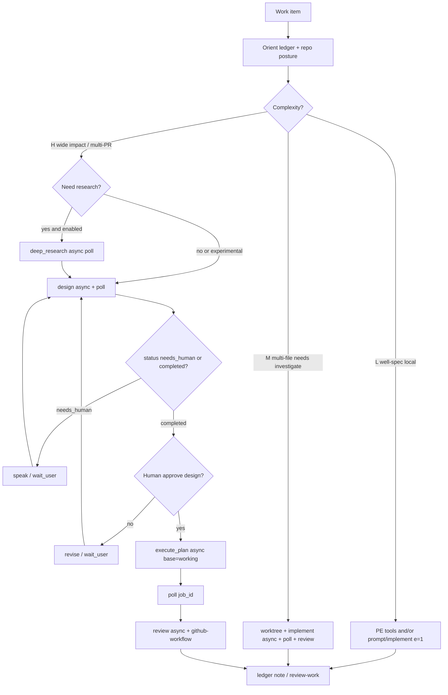

# Design: Elyra Grok Build instrument (Phase 1 full surface)

| Field | Value |
|-------|--------|
| **Class** | DESIGN |
| **Document** | Phase 1 `grok_build` host instrument — full mode surface |
| **Author** | Design (Grok Build subagent) |
| **Date** | 2026-08-01 |
| **Status** | Active |
| **Product** | project-elyra |
| **Tracks** | Issue #109; GI Phase 1 |
| **Branch** | `feature/grok-build-tool` (off `main`; land stack into `working` once created, else `main`) |
| **Related** | [dev/branch-law.md](../../dev/branch-law.md), [dev/engineering-principles.md](../../dev/engineering-principles.md), [tools-and-skills.md](../../state/tools-and-skills.md), [design-xai-oauth-browser-login.md](../usage/design-xai-oauth-browser-login.md), [dev/development-governance.md](../../dev/development-governance.md), [grok-improvement-plan/README.md](../../grok-improvement-plan/README.md), `elyra/secrets/inject.py`, `elyra/llm/xai_oauth.py` |
| **Revised** | 2026-08-01 (review cf9024a3; re-review; shared WakeQueue mandatory) |
| **Landing path (post-approval)** | `docs/design/grok-build/design-grok-build-tool.md` |

---

## Overview

Project Elyra already has a durable **person** runtime (presence, moments, goals, identity, memory) and host capability tools (`git_*`, `gh_*`, secrets inject, OAuth). What it lacks is a controlled way for that person to invoke **Grok Build** as a high-capability coding **instrument** — design docs, multi-reviewer implement loops, execute-plan stacks, deep research, and review — without becoming a second presence and without reimplementing Grok’s skill factories in Python.

**Proposed solution:** ship one thin host builtin tool, `grok_build`, with an explicit `mode` argument. The tool **brokers** the host `grok` CLI in headless form (`grok -p …`), mapping each mode onto Grok’s existing skills/workflows (`/design`, `/implement`, `/execute-plan`, `/deep-research`, `/review`, or a free-form prompt). Auth is PE-owned `xai_oauth` access-only inject (already stubbed in `resolve_access_token_for_tool`), with a **live** auth-provider that re-calls `ensure_fresh_access` on each Grok re-invoke (including `GROK_AUTH_EXPIRED=1`). Isolated `GROK_HOME` **seeds** platform bundled skills. Modes whose default wall timeout exceeds **15 minutes** default to **async jobs** reaped by a supervisor-owned runner so the presence worker is not blocked. Workflow judgment lives in skills: extend `github-workflow`, add new `self-improve` for L/M/H routing. All work extends from `feature/grok-build-tool` under modular packages, tests-with-feature, and a phased PR stack that lands the design into `docs/` after approval.

---

## Background & Motivation

### Current state (verified in tree)

| Area | Reality | Path / evidence |
|------|---------|-----------------|
| OAuth access inject hook | **Ready, unwired** — allowlist `{"grok_build"}`, access-only, fail-closed | `elyra/secrets/inject.py` (`GROK_BUILD_TOOL_NAMES`, `resolve_access_token_for_tool`) |
| OAuth protocol | Device-code + refresh; public client `b1a00492-073a-47ea-816f-4c329264a828` | `elyra/llm/xai_oauth.py` (`ensure_fresh_access`, `XAI_OAUTH_CLIENT_ID`) |
| Credential sources | `xai_oauth` (preferred) \| `api_key` \| `grok_build` (legacy `~/.grok/auth.json`) | `elyra/llm/auth.py`, `elyra/settings.py` |
| Registry secret plane | Call-local `secret_env` only for tools in `TOOL_SECRET_REQUIREMENTS` (grant-based named secrets). Guest/host-stub runners **do not merge** `secret_env` into process env. OAuth access is **not** on that path — `grok_build` is host-builtin only and must **never assign** access into `ctx.extras["secret_env"]`. Result redaction uses `known_values` + auth union + **explicit call-local access** for this tool | `elyra/tools/registry.py`, `inject.py` |
| Builtin pattern | `tools/bundled/<name>/{TOOL.md,schema.json,runner.json}` → `elyra.tools.builtin.*` | e.g. `web_search`, `git_tools`, `gh_tools` |
| Git/gh instruments | Path-jailed `git_*`; `GH_TOKEN` soft-fail `auth_unavailable` | `elyra/tools/builtin/git_tools.py`, `gh_tools.py`, `elyra/tools/vcs_jail.py` |
| Skills rails | `github-workflow` already teaches worktrees, Projects, package VCS, grant stops, and “prefer `grok_build` when present” — **tool not shipped** | `skills/bundled/github-workflow/SKILL.md`, `docs/state/tools-and-skills.md` § “Phase 1 grok_build tool is not in this surface” |
| Usage meter | Week ledger + SuperGrok pool; PE chat spend recorded | `elyra/llm/usage.py` |
| Grok CLI on host | Headless `-p` / `--prompt-file` / `--output-format json`; skills as slash commands; Graphite (`gt`) optional | Host `~/.grok/bundled/skills/{design,implement,execute-plan,review,pr-babysit}` |

### Pain points

1. **Self-improve gap:** PE can edit via sandbox + host git, but multi-file implement/review/execute-plan quality lives in Grok Build skills PE cannot reach.
2. **Person/instrument blur risk:** without a hard boundary, operators might treat a guest-installed Grok as a second mind with secrets and OAuth refresh.
3. **Reimplementation temptation:** rewriting `/design` or `/execute-plan` as Elyra Python orchestrators would violate “glue not ceremony,” explode maintenance, and lag Grok skill evolution.
4. **Branch process lag:** governance docs still describe `main` as sole integration tip; product consensus wants early `working` + promote bar — needed before PE-driven execute-plan stacks land safely.
5. **Auth plane almost ready:** inject hook exists and is tested; the tool package and broker do not.

### Why Phase 1 *full surface* (not MVP-only)

MVP-only (e.g. `prompt` alone) would teach the wrong API surface and force a second schema break when design/implement/execute-plan land. Product consensus freezes the **schema enum** early. Implementation still ships **full surface** only after blocking integration specs land (skill seed, live auth provider, async reaper, human-gate policy, artifact harvest, execute_plan preflight). Until a mode’s contract is proven, the handler may return `mode_not_ready` or `mode_experimental` (same enum; fail-closed), not a half-schema. `deep_research` ships **experimental** pending a headless workflow spike (PR0a).

---

## Goals & Non-Goals

### Goals

1. One host builtin tool `grok_build` with modes: **`prompt`**, **`design`**, **`implement`**, **`execute_plan`**, **`deep_research`**, **`review`** (document **`pr_babysit`** as optional later — not v1 schema required).
2. Modes map to **Grok headless skill/workflow invocations** — PE does not reimplement skill loops.
3. Auth: PE-owned `xai_oauth` via `resolve_access_token_for_tool("grok_build", data_dir)` / `ensure_fresh_access`; access-only; fail-closed; same public OIDC client as Grok Build.
4. Skills from day one: extend `skills/bundled/github-workflow/SKILL.md` (tip law in PR0; mode/async sections in PR5); add `skills/bundled/self-improve/SKILL.md` (L/M/H routing + H-spine).
5. Prepare branch law (`working` / `main` / operating pin / tags / stale stacks) as docs in the same PR stack; create `working` early; **land tip-wording skill fix with PR0**.
6. Usage: instrument spend counts against SuperGrok/Elyra meter when headless JSON reports tokens (Messages-style field adapter); long modes default **async** with timeouts, supervisor reaper, logs under `data/runtime/grok_build/`, token redaction in results/moments/glass.
7. Modular packages under `elyra/` (no god file); tests with feature; hermetic CI default.
8. Ordered, reviewable PR plan from `feature/grok-build-tool`.
9. Isolated `GROK_HOME` seeds/symlinks host bundled skills so slash skills resolve.
10. Headless human-gate policy: no hang on ask tools; return `needs_human` to PE.
11. Branch-law migration: supersede `grok-improvement` tip wording with `working` in the same docs/**skills tip** PR (PR0), not only docs.

### Non-goals

| Non-goal | Rationale |
|----------|-----------|
| PE auto-merge to `main` | Humans remain release authority |
| PE silent operating-pin move | Pin is human-moved SHA; Stage 3 later |
| Reimplement Grok factories in Python | Broker CLI only |
| Guest/microVM primary path for `grok_build` | Full skill parity needs host headless; host-builtin only — never put OAuth into `secret_env`; guest runners never merge `secret_env` |
| Graphite required | Product default **plain-git** (`--no-graphite`); Graphite optional when operator opts in |
| PE-native slash commands as v1 | Later thin wrappers around same tool |
| TUI-only `/plan` mode parity | Plan mode is interactive; out of PE tool scope |
| Live `grok` in default CI | Hermetic unit + optional `@pytest.mark.live_grok` |
| `pr_babysit` as required mode | Optional later; depends on Graphite/gh-stack culture |
| Second presence / identity for Grok | Instrument only |

---

## Key Decisions

| ID | Decision | Rationale |
|----|----------|-----------|
| **KD1** | **Person / instrument split** — Elyra = durable person; Grok Build = coding instrument PE calls | Prevents dual-mind identity; matches GI plan guiding principles |
| **KD2** | **Single tool `grok_build` + modes**, not N tools | One registry entry, one auth allowlist, one redaction path; skills encode judgment |
| **KD3** | **Host headless broker** of `grok` CLI; no Python reimplementation of design/implement/execute-plan | Skill parity; Grok owns loop quality; PE owns policy/timeouts/auth/meter |
| **KD4** | **Auth = PE `xai_oauth` access-only** via existing inject hook; never refresh into guest; fail-closed | Product law already coded in `inject.py` tests |
| **KD5** | **Isolated `GROK_HOME` default ON**, seeded with **symlink (or copy) of real install `bundled/`** + minimal auth `config.toml`; never write PE `refresh_token` into operator `~/.grok/auth.json` | Multi-instance safety; empty home would hide design/implement/execute-plan skills |
| **KD5b** | **Auth provider is live PE code** (`python -m elyra.instrument.auth_provider`) that calls `ensure_fresh_access(data_dir)` on **every** invoke, including when Grok sets `GROK_AUTH_EXPIRED=1`; prints access-only JSON; never refresh | Access TTL ~1h; multi-hour modes require mid-run refresh without exporting refresh_token |
| **KD6** | **`execute_plan` defaults: `--no-graphite`**, base branch **`working`** with **PE preflight** (`git rev-parse working` / `origin/working`) + instructions; worktrees via Grok skill | Plain-git stacks; prose alone is insufficient vs skill default `main` |
| **KD7** | **Skills pure instructions** — `self-improve` + extended `github-workflow` grant no host power by prose | Existing tools-and-skills law |
| **KD8** | **L/M/H complexity tiers** drive mode choice inside `self-improve`, not separate tools | Operator- and PE-readable routing |
| **KD9** | **Module split**: thin builtin + `elyra/instrument/*` broker modules; `process.py` subprocess-only | Engineering principles: no god modules |
| **KD10** | **Instrument usage records into Elyra week ledger** via **headless field adapter** (Messages-style → `TokenUsage`) | Shared SuperGrok pool; silent miss would undercount |
| **KD11** | **Any mode with default timeout > 15 min defaults to async job**; only `prompt` (and explicit `async=false` debug) is sync-by-default. Supervisor-owned **job reaper** finalizes runs | Presence worker is single-threaded; must not block for hours |
| **KD12** | **Branch law migration in PR0**: `working` supersedes `grok-improvement`; create `working` early; **PR0 includes github-workflow tip-only skill edit** + GI README banner (mode/async skill text stays PR5) | Avoid thrash during PR1–PR4 window |
| **KD13** | **`pr_babysit` deferred** (document only) | Optional; Graphite-biased; not required for Phase 1 dogfood |
| **KD14** | **Feature work from `feature/grok-build-tool`**; design doc lands as `docs/design/grok-build/design-grok-build-tool.md` after approval | Issue #109; reviewable stack |
| **KD15** | **Headless human-gate policy**: inject rules forbidding interactive wait; on unresolved human need return `status=needs_human` + artifacts (exit 0 path for PE) | TUI ask tools have no operator in PE headless |
| **KD16** | **`deep_research` is experimental until PR0a spike** documents headless exit/workflow contract; may soft-fail `mode_experimental` | Not a bundled skill; Grok-native async workflow |
| **KD17** | **Artifact harvest**: PE-controlled output paths in `run_dir/artifacts/` via prompt suffix + parse + scratch scan fallback | Design/review write under TMP by default |
| **KD18** | **Schema enum frozen full surface**; handler validates mode-conditional args; unready modes fail closed with explicit reason | Avoid second schema break without over-promising readiness |

---

## Proposed Design

### High-level architecture

```text
┌──────────────────────────────────────────────────────────────────────┐
│ Elyra person (presence / moment / do-loop)                            │
│   skills: self-improve, github-workflow, do-work, plan-work, …       │
└───────────────────────────────┬──────────────────────────────────────┘
                                │ tool call: grok_build(mode, …)
                                ▼
┌──────────────────────────────────────────────────────────────────────┐
│ tools/bundled/grok_build  (builtin runner)                            │
│   elyra.tools.builtin.grok_build:grok_build  ← thin handler           │
└───────────────────────────────┬──────────────────────────────────────┘
                                │
          ┌─────────────────────┼─────────────────────┐
          ▼                     ▼                     ▼
┌─────────────────┐  ┌────────────────────┐  ┌────────────────────┐
│ instrument/     │  │ secrets/inject     │  │ llm/usage          │
│  modes.py       │  │ resolve_access_    │  │ record instrument  │
│  argv.py        │  │ token_for_tool     │  │ tokens into week   │
│  process.py     │  │ (access only)      │  │ ledger             │
│  result.py      │  └────────────────────┘  └────────────────────┘
│  jobs.py + reaper│  supervisor-owned background reaper (elyra start)
│  auth_provider   │  live ensure_fresh_access (not static token cat)
└────────┬────────┘
         │ subprocess (shell=False); long modes: spawn + return job_id
         ▼
┌──────────────────────────────────────────────────────────────────────┐
│ Host: grok -p <slash-or-prompt> --cwd <repo> --output-format json     │
│       --always-approve  [skill flags inside -p only; CLI flags as argv]│
│ Skills under seeded GROK_HOME/bundled: /design /implement /execute-plan│
│ /review; /deep-research = workflow (experimental until spike)          │
└──────────────────────────────────────────────────────────────────────┘
```

### Person vs instrument (normative)

| Concern | Owner |
|---------|--------|
| Identity, moments, goals, memory, speak/glass | **Elyra person** |
| Mode choice, grant stops, ledger notes, PR base branch policy | **Elyra skills** (`self-improve`, `github-workflow`) |
| Multi-agent design/implement/execute-plan loops | **Grok Build skills** (via CLI) |
| Auth refresh, redaction, path jail, timeouts, usage meter | **Elyra host runtime** |
| OAuth refresh_token storage | **Elyra `data/secrets` only** — never guest, never tool result |

### Sequence: PE moment → tool → headless → result (sync path: prompt / short only)

```mermaid
sequenceDiagram
  participant PE as Elyra do-loop
  participant Skill as self-improve skill
  participant Tool as grok_build builtin
  participant Inject as resolve_access_token_for_tool
  participant CLI as grok headless
  participant Meter as UsageMeter
  participant FS as data/runtime/grok_build

  PE->>Skill: load_skill self-improve
  Skill->>PE: route L/M/H → mode
  PE->>Tool: grok_build(mode, prompt/path, repo, …)
  Tool->>Tool: validate mode args; meter pre-check
  Tool->>Inject: preflight allowlist resolve (optional)
  alt missing/reauth at spawn
    Tool-->>PE: ok=false auth_unavailable
  else ready
    Tool->>FS: run_dir 0700 + meta (no secrets)
    Tool->>CLI: subprocess grok -p … (seeded GROK_HOME, live auth_provider)
    Note over CLI: auth_provider re-calls ensure_fresh_access on each invoke / GROK_AUTH_EXPIRED
    CLI-->>Tool: stdout JSON / plain + exit code
    Tool->>Tool: harvest artifacts, redact, parse
    Tool->>Meter: record via usage_bridge adapter
    Tool->>FS: finalize result.json; shred tokens
    Tool-->>PE: ToolResult (summary, artifacts, status)
  end
  PE->>PE: ledger note / speak / next skill step
```

### Sequence: long mode async (default when timeout > 15m)

```mermaid
sequenceDiagram
  participant PE as Elyra do-loop
  participant Tool as grok_build
  participant Jobs as instrument/jobs
  participant Reaper as supervisor job reaper
  participant CLI as grok process
  participant Wake as schedule_wake / enqueue_wake

  PE->>Tool: mode=design|implement|execute_plan|review|deep_research
  Note over Tool: async default true (timeout > 15m)
  Tool->>Jobs: create job_id, state=running, pid pending
  Tool->>CLI: spawn detached under reaper ownership
  Tool->>Wake: optional schedule_wake for poll (skills may also poll)
  Tool-->>PE: ok=true, job_id, status=running
  Note over PE: moment ends; presence stays free
  Reaper->>CLI: waitpid / timeout
  CLI-->>Reaper: exit + logs
  Reaper->>Jobs: finalize result, harvest artifacts, shred tokens, usage_bridge
  Reaper->>Wake: enqueue kind=background payload source=grok_build
  Note over Wake: KNOWN_KINDS only — never invent instrument_job
  Wake->>PE: background wake (BIAS_BACKGROUND)
  PE->>Tool: job_id=… (poll)
  Tool-->>PE: status=completed|failed|needs_human + artifacts
```

### deep_research contract (experimental — KD16)

Host `/deep-research` is a **workflow launch**, not a `~/.grok/bundled/skills/deep-research` package. Headless behavior is **not assumed**:

| Strategy | When to use |
|----------|-------------|
| **PR0a spike** (required before enabling) | Run `grok -p "/deep-research …" --output-format json` operator-side; record exit timing, JSON fields, whether process waits for report vs returns workflow/run id |
| **(1) Headless blocks until report** | PE treats like other long modes: async job reaper waits on process; harvest report from stdout/artifacts |
| **(2) Process exits early with workflow id** | PE stores workflow/run id in `meta.json`; reaper/poller uses documented CLI (`sessions` / workflow status if available) **or** fails closed with `workflow_poll_unsupported` |
| **(3) Spike inconclusive** | Handler returns `error_reason=mode_experimental` with payload hint; schema enum still includes `deep_research` |

**Until PR0a signs off strategy (1) or (2), default ship path is (3).** Dogfood D7 is blocked on the signed strategy. Do **not** claim “completed” from exit code alone without the spike notes filed under `docs/` or run meta comments.

### Module layout (no god file)

Follow `docs/dev/engineering-principles.md`: one job per module; tests mirror packages.

```text
elyra/
  instrument/                    # NEW package — Grok Build broker (not a second person)
    __init__.py                  # narrow public: run_grok_build, Mode, …
    modes.py                     # Mode enum, defaults (timeouts, async threshold, slash templates)
    argv.py                      # pure: mode + args → argv + prompt body (skill flags IN prompt only)
    auth_handoff.py              # seed GROK_HOME, write config.toml, provider entrypoint path
    auth_provider.py             # CLI entry: ensure_fresh_access → access-only JSON on stdout
    process.py                   # subprocess ONLY: run/spawn, timeout, cwd, env merge (no usage/skills)
    result.py                    # parse JSON/plain, harvest artifacts, normalize payload
    redact.py                    # token/path scrub helpers for payloads + logs
    jobs.py                      # durable job state + ensure_grok_build_runtime(paths)
    reaper.py                    # supervisor-owned wait/finalize/wake; inject shared WakeQueue
    usage_bridge.py              # headless Messages-style fields → TokenUsage / meter.record
    discover.py                  # grok binary; skill resolve probe under seeded home
    validate.py                  # mode-conditional arg table → error_reason
  tools/builtin/
    grok_build.py                # THIN: validate → instrument.run → ToolResult
  secrets/inject.py              # existing GROK_BUILD_TOOL_NAMES
  llm/xai_oauth.py               # ensure_fresh_access
  runtime/…                      # wire reaper start/stop with supervisor lifecycle

tools/bundled/grok_build/
  TOOL.md, schema.json, runner.json

skills/bundled/
  github-workflow/SKILL.md       # working tip; modes; async poll UX
  self-improve/SKILL.md          # L/M/H + H-spine + async

docs/
  design-grok-build-tool.md
  branch-law.md                  # includes migration from grok-improvement
  # PR0a spike notes may live as section in design or docs/grok-build-deep-research-spike.md

tests/
  test_instrument_modes.py
  test_instrument_argv.py        # skill effort vs CLI --effort separation
  test_instrument_result.py      # harvest algorithm
  test_instrument_auth_handoff.py
  test_instrument_auth_provider.py  # expired→fresh mock
  test_instrument_process.py
  test_instrument_jobs.py
  test_instrument_reaper.py
  test_instrument_usage_bridge.py   # fixture headless usage JSON
  test_instrument_validate.py
  test_builtin_grok_build.py
  test_self_improve_skill.py
  test_github_workflow.py
```

**Scope comments (normative):**

```python
# elyra/instrument/argv.py
# Scope: pure mapping of mode + validated args → argv list + prompt body.
# In scope: slash prefixes, execute_plan flags inside -p, human-gate policy text,
#           artifact output path suffix, base=working instructions.
# Out of scope: subprocess, auth, filesystem, registry.
# CRITICAL: PE `effort` int goes ONLY inside the -p prompt string
#   (e.g. "/implement --effort 2 …"). NEVER pass CLI --effort / --reasoning-effort
#   from that integer (those are none|minimal|low|medium|high|…).

# elyra/instrument/process.py
# Scope: subprocess run/spawn only (shell=False), timeout, env merge, cwd.
# Out of scope: usage metering, skill logic, artifact harvest, OAuth refresh.
# PR review checklist: refuse PRs that stuff usage/skills into process.py.

# elyra/instrument/auth_provider.py
# Scope: stdout JSON {access_token, expires_in}; call ensure_fresh_access(data_dir);
#        expires_in = max(60, int(seconds_until_expiry(expires_at) or fallback));
#        honor GROK_AUTH_EXPIRED; never print refresh_token; stderr status-safe only.
```

### Full mode table

**Async rule (KD11):** If mode default timeout **> 15 minutes**, `async` defaults to **true**. Sync only for `prompt` (10m) or when caller passes `async=false` (operator/debug). Async requires jobs + reaper (PR3) before the mode is callable without `mode_not_ready`.

| Mode | Grok invocation (headless) | Primary args | Default timeout | Default async | Artifacts (typical) | Failure modes (`error_reason`) |
|------|---------------------------|--------------|-----------------|---------------|---------------------|--------------------------------|
| **`prompt`** | `grok -p "<prompt>"` (no slash) | `prompt` required | **10 min** | **false** | stdout text/JSON `text` | `invalid_args`, `auth_unavailable`, `grok_not_found`, `timeout`, `nonzero_exit`, `parse_error`, `usage_hard_stop` |
| **`design`** | `grok -p "/design …"` + human-gate + artifact path suffix | `prompt` required | **90 min** | **true** | `run_dir/artifacts/design.md` (+ summary) via harvest | + `skill_failed`, `artifact_missing`, `needs_human` (ok path), `mode_not_ready` |
| **`implement`** | `grok -p "/implement [--effort N] …"` (effort **inside** prompt) | `prompt`; `effort` 1–5 | **120 min** | **true** | branch commits; optional review files in artifacts/ | + `review_unresolved` (soft), `workdir_dirty_blocked` |
| **`execute_plan`** | `grok -p "/execute-plan <path> --no-graphite … --instructions …"` | `design_doc_path` required | **6 h** | **true** | stack branches; PR/compare URLs | + `design_doc_missing`, `base_branch_missing`, `stale_stack`, `needs_human` |
| **`deep_research`** | `grok -p "/deep-research <query>"` | `prompt` = query | **60 min** wall if strategy (1); else spike-defined | **true** | report path if contract known | + `mode_experimental`, `workflow_poll_unsupported`, `job_*` |
| **`review`** | `grok -p "/review [--local\|--branch\|--pr] …"` | `target` optional | **45 min** | **true** | `run_dir/artifacts/review.md` | + `target_ambiguous`, `gh_unavailable` (soft) |
| **`pr_babysit`** (later) | `/pr-babysit …` | deferred | n/a | n/a | n/a | not in v1 schema |

#### Mode-conditional validation table (normative — `validate.py`)

Flat JSON Schema keeps `required: ["mode"]` + `additionalProperties: false` (registry pattern). **Handler/validate table is the real contract:**

| Mode / path | Required | Reject `error_reason` |
|-------------|----------|------------------------|
| any spawn | `mode` ∈ enum | `invalid_args` |
| poll | `job_id` non-empty; **XOR** with spawn fields | `invalid_args` if both spawn prompt and only job_id unclear — prefer: if `job_id` set, poll only |
| `prompt` | `prompt` non-empty | `missing_prompt` |
| `design` | `prompt` non-empty | `missing_prompt` |
| `implement` | `prompt` non-empty; `effort` if set ∈ 1–5 | `missing_prompt` / `invalid_effort` |
| `execute_plan` | `design_doc_path` jailed file exists; PE preflight `working` | `missing_design_doc_path` / `design_doc_missing` / `base_branch_missing` |
| `deep_research` | `prompt` non-empty; mode enabled post-spike | `missing_prompt` / `mode_experimental` |
| `review` | `target` optional; if set parseable | `target_ambiguous` |
| any spawn | `repo` resolve order below | `missing_repo` / jail reasons from `vcs_jail` |
| any spawn | meter allows call when available | `usage_hard_stop` |
| long mode before PR3 | jobs/reaper available | `mode_not_ready` |

#### Common CLI flags vs skill flags (Issue 15)

| Kind | Where | Examples |
|------|--------|----------|
| **CLI argv tokens** | `subprocess` argv only | `--output-format json`, `--always-approve`, `--cwd`, `-m`, `--max-turns`, `--prompt-file` |
| **Skill flags** | **Only** inside `-p` / prompt-file body | `/implement --effort 2 …`, `/execute-plan … --no-graphite --effort 1`, `/review --branch foo` |
| **Forbidden** | Mapping PE `effort: 2` → CLI `--effort 2` | CLI `--effort` is reasoning level enum, not integer reviewers |

**execute_plan product defaults (normative):**

**PE preflight (before spawn):**

1. Resolve `repo` (see Path jail).
2. `git rev-parse --verify working` **or** `git rev-parse --verify origin/working` (after `git fetch origin working` best-effort). Else return `base_branch_missing` with hint to create/push `working`.
3. Resolve `design_doc_path` inside jail; must be a file → else `design_doc_missing`.
4. Record `base_branch=working` in `meta.json`.

**Prompt body:**

```text
/execute-plan <absolute_jailed_design_doc_path> --no-graphite [--auto-pr] [--effort N] [--concurrency N] [--resume ID]
  --instructions "<BASE_AND_POLICY>"

BASE_AND_POLICY (always injected by argv.py, plus optional args.instructions):
  "Stack bottom base branch MUST be 'working' (not main). Host skill defaults
   that say main are overridden. If working is missing, fail clearly.
   Prefer short-lived execute-plan/* branches. Do not force-push main/working.
   Stale stacks >10 days behind working: restack or extend with reason.
   On human-needed conflicts or ambiguous stack decisions: write needs_human
   notes into the run summary and stop — do not hang on interactive ask tools."
```

- Graphite: only if `use_graphite=true` **and** `gt` probe passes — then omit `--no-graphite`.
- Residual risk: Grok subagents may still ignore prose and base on `main` — PE preflight + design-doc PR plan bases saying `working` + post-run `git` inspection in dogfood D6 mitigate; meta records requested base.
- Worktrees: owned by Grok execute-plan skill; PE may pre-create via `git_worktree_*` but must not thrash.

**review targets:**

| Target arg | Slash form |
|------------|------------|
| omitted / `local` | `/review --local` |
| branch name | `/review --branch <name>` |
| PR number or URL | `/review --pr <id-or-url>` |

### Headless human-gate policy (KD15)

Interactive TUI ask / stalemate tools have **no PE operator** under `--always-approve` headless.

**Normative PE injection** (appended to prompt body / `--rules` for design, implement, execute_plan, review):

```text
HEADLESS PE POLICY (mandatory):
- You are running non-interactively for Project Elyra. There is no human at this TTY.
- Do NOT block waiting for interactive clarification, ask_user_question, or permission prompts.
- If you need a human decision: write remaining open questions into the designated
  artifact under the PE output directory, set a clear NEEDS_HUMAN section, and end the run.
- Prefer fail-closed documented gaps over inventing product decisions.
- Do not spin escalate loops beyond 2 rounds of unresolved needs-user-input; then NEEDS_HUMAN stop.
```

**PE result mapping:**

| Grok outcome | ToolResult |
|--------------|------------|
| Clean complete + artifacts | `ok=true`, `status=completed` |
| NEEDS_HUMAN section / open questions | `ok=true`, `status=needs_human`, `open_questions=[…]`, artifacts paths — **not** a hard tool error; self-improve → `speak` / `wait_user` |
| Crash / nonzero without artifact | `ok=false`, `skill_failed` / `nonzero_exit` |
| Hang prevention | process timeout → `timeout`; reaper kills process group |

Unit tests: `argv.py` includes policy text for design/implement/execute_plan/review.

### Auth handoff design

```text
Spawn path:
  validate args → meter pre-check → ensure_grok_build_runtime → run_dir (0700)
       │
       ├─ auth_handoff.seed_isolated_home(run_dir):
       │     GROK_HOME = run_dir/grok_home (0700)
       │     symlink run_dir/grok_home/bundled → <real_install>/bundled
       │       (discover: dirname(grok_bin)/../bundled or ~/.grok/bundled;
       │        fail grok_skills_unavailable if design+implement missing)
       │     optional: symlink docs/ if needed for skill persona paths
       │     write grok_home/config.toml with ABSOLUTE interpreter:
       │       auth_provider_command =
       │         "<sys.executable> -m elyra.instrument.auth_provider --data-dir <abs data_dir>"
       │       # sys.executable = supervisor process interpreter (venv), NEVER bare "python"
       │       # equivalently GROK_AUTH_PROVIDER_COMMAND env with same absolute string
       │       # no secrets in config
       │
       ├─ env for child (minimal):
       │     GROK_HOME=<run_dir>/grok_home
       │     # data-dir passed on provider argv; optional ELYRA_DATA_DIR=<data_dir>
       │     # do NOT set XAI_API_KEY from OAuth access
       │     # do NOT write PE refresh into ~/.grok/auth.json
       │     # do NOT rely on PATH to find elyra
       │
       └─ process spawn/run with live provider (not static token cat)
            wall timeout + kill process group (mitigate interactive auth hang)

auth_provider (every Grok invoke, including GROK_AUTH_EXPIRED=1):
  ensure_fresh_access(Path(data_dir))
       │
       ├─ not ok → exit non-zero; no token on stdout; stderr status-safe detail only
       │            (see "Provider failure / interactive fallback" below)
       └─ ok → print ONE JSON object on stdout:
                {"access_token":"…","expires_in":N}
                expires_in = max(60, int(seconds_until_expiry(result.expires_at) or DEFAULT_SKEW_FALLBACK))
                # FreshAccessResult has expires_at (ISO), not expires_in — derive via
                # elyra.llm.xai_oauth.seconds_until_expiry; clamp floor 60s
                never refresh_token; never log access
```

**Discover / dogfood gate:** after seed, `discover.assert_skills_resolvable(GROK_HOME)` checks `bundled/skills/design` and `bundled/skills/implement` (and execute-plan, review) exist. Unit test uses a fake home with only the seeded layout. **Unit test:** config.toml / handoff output contains absolute `sys.executable` path (not `python` / `python3` basename only).

**`expires_in` derivation (normative):**

```python
# auth_provider.py — use existing helper; fixed-clock unit test
from elyra.llm.xai_oauth import ensure_fresh_access, seconds_until_expiry

DEFAULT_EXPIRES_IN_FALLBACK = 3600  # only if expires_at missing but access ok (should be rare)
FLOOR_S = 60

fresh = ensure_fresh_access(data_dir)
secs = seconds_until_expiry(fresh.expires_at)
expires_in = max(FLOOR_S, int(secs) if secs is not None else DEFAULT_EXPIRES_IN_FALLBACK)
# print JSON; never invent refresh_token
```

**Provider failure / interactive login fallback (headless hang risk):**

Host Grok docs: provider **non-zero exit → Grok may fall back to interactive login**. Under `grok -p --always-approve` with isolated `GROK_HOME` that path can **hang** (browser/device TTY), burning the reaper wall clock. PE spawn-time preflight covers only the first token; mid-run `reauth_required` still hits the provider.

| Mitigation (v1 — all apply) | Detail |
|-----------------------------|--------|
| **1. Wall timeout + process group kill** | `process.py` always enforces mode timeout; on expiry kill **pgid** (not only pid) so hung login children die |
| **2. No TTY / non-interactive env** | Child env sets `CI=1` / `GROK_NO_BROWSER=1` if observed useful; do not allocate a pty |
| **3. Isolated home without operator auth.json** | Interactive fallback cannot silently use operator session; still may hang on device flow — timeout is backstop |
| **4. Job finalize on auth death** | If process exits with auth-looking stderr/stdout or timeout after provider failures, reaper sets `status=failed`, `error_reason=auth_unavailable` or `auth_expired`, payload.hint → Glass / `elyra auth login` |
| **5. PR0a / D12 dogfood** | Force provider failure (revoke tokens mid-run or mock): confirm no multi-hour hang; document observed Grok behavior in spike notes; if Grok adds env to disable interactive fallback, adopt it |

**Do not** expect Grok to surface a clean PE-native error without timeout backstop. PE never starts a second interactive login ceremony for the instrument.

**Laws:**

1. Allowlist remains code-only (`GROK_BUILD_TOOL_NAMES`); no `inject_class` meta.
2. **Host-builtin only:** never assign OAuth access into `ctx.extras["secret_env"]`. Guest runners never merge `secret_env` — but OAuth must not be on that plane at all.
3. Builtin inject/provider runs **inside** host process tree, not guest.
4. Call-local redaction set = `auth_secret_values_for_redaction(data_dir)` **∪** `{access tokens returned this run}` (explicit — access may not be on disk secrets values yet).
5. **Mid-run refresh is v1 required (KD5b):** provider re-calls `ensure_fresh_access`; static file-cat is **not** the source of truth (optional 0600 cache only).
6. `run_dir` mode **0700**; token material never on argv; provider stderr must not echo tokens.
7. Finalize in `try/finally` (sync) or reaper (async): shred access caches; mark meta complete.
8. **Startup GC:** reaper/on-start scans `data/runtime/grok_build/*/`: incomplete runs older than T minutes (default 30) → mark `interrupted`, shred any leftover token files immediately (not wait 14-day GC).
9. **`auth_provider_command` uses absolute `sys.executable`** from the supervisor process (venv-safe).

### Job reaper / process ownership

| Concern | Spec |
|---------|------|
| **Owner** | Supervisor process started by `elyra start` — module `elyra.instrument.reaper` (daemon thread). **Not** the presence do-loop thread holding `registry.execute`. |
| **Spawn** | Async modes: `process.spawn` records `pid`, `pgid`, `run_id` in `meta.json`; returns to tool handler immediately with `job_id`. |
| **Reap** | Reaper waits on pid (or kill process **group** on wall timeout); reads stdout/stderr paths; calls `result.finalize` (harvest, redact, usage_bridge); updates job state; shreds secrets; enqueues completion wake (see **Completion wake kind** below). |
| **Crash / PE restart** | Jobs durable on disk. On start: any `state=running` with dead pid → `interrupted` (not auto-resume Grok skill mid-flight in v1). Operator/PE may re-invoke mode with `resume_id` for execute_plan when Grok supports it. |
| **Sync modes** | `prompt` (or `async=false`): handler may `process.run` and finalize inline still inside tool call — short only. |
| **PR3** | Must ship reaper + lifecycle wire, not only JSON job CRUD. |

#### Completion wake kind (normative — closed `KNOWN_KINDS`)

`elyra/presence/queue.py` defines a **closed** set: `user_message`, `wait_reply`, `wait_timeout`, `timer`, `task_ready`, `moment_continue`, `background`. `priority_for_kind` **raises** on unknown kinds. Reaper **must not** invent `instrument_job` / `job_ready`.

| Choice | Decision |
|--------|----------|
| **v1 normative** | Enqueue **`kind="background"`** (band 4; existing orient `BIAS_BACKGROUND` / “background wake” copy in worker) |
| **Payload** (non-secret only) | `{ "source": "grok_build", "job_id": "…", "run_id": "…", "status": "completed\|failed\|needs_human\|interrupted", "mode": "design", "summary_path": "…/result.json" }` — **no tokens**, no full stdout |
| **Why not new kind** | Avoid presence surface growth (orient bias, recovery policy, KIND_PRIORITY) unless product later wants first-class `instrument_job` |
| **Why not `timer` by default** | Skills may still `schedule_wake` (timer) for poll cadence; reaper completion is event-like → `background` fits |
| **Recovery** | `background` is **not** in `RE_ENQUEUE_ON_RECOVER` (cancelled on crash recover). Durable source of truth is `data/runtime/grok_build/*/meta.json` + `result.json`. On PE restart, reaper startup GC marks dead running jobs `interrupted`; PE/skills poll `job_id` or list incomplete jobs on next orient — do not rely on wake redelivery for instrument completion |
| **Enqueue API** | **Shared** `WakeQueue` instance (same object as `PresenceWorker`): `wake_queue.enqueue("background", payload=…)` — never `priority_for_kind("instrument_job")`; **never** construct a second `WakeQueue(paths)` for the reaper |

Skills text: “wait for **background** wake with `payload.source=grok_build`” or poll `job_id` — not `instrument_job`.

#### Supervisor wire details (PR3 — Issue 6)

Mirror existing daemon patterns (`credits_poller`, sandbox warm thread) in `elyra/runtime/supervisor.py`:

| Hook | Behavior |
|------|----------|
| **Start** | In `Supervisor.start`, after `paths.ensure_data_dirs()` and meter load: (1) `self._wake_queue = WakeQueue(self.paths)`; (2) `PresenceWorker(..., queue=self._wake_queue)`; (3) `InstrumentReaper(..., wake_queue=self._wake_queue, stop_event=…)` daemon thread `elyra-instrument-reaper`. Reaper may start before or after worker thread — must not construct its own queue. |
| **WakeQueue (MANDATORY shared)** | **One** `WakeQueue` instance for the whole supervisor process. `WakeQueue` holds a **per-instance** `RLock` and an **in-process** pending heap loaded at construct (`elyra/presence/queue.py`). A second `WakeQueue(paths)` would append to the same `events.jsonl` but **never update the worker’s heap** — completion wakes would not be claimed until a full reload (not done mid-run). **Private reaper queue is forbidden.** |
| **How to share (normative PR3)** | In `Supervisor.start`, **before** `PresenceWorker(...)`: `self._wake_queue = WakeQueue(self.paths)` then `PresenceWorker(..., queue=self._wake_queue)` (constructor already accepts `queue=` — today supervisor omits it and the worker builds a private queue). Pass **`wake_queue=self._wake_queue`** into `InstrumentReaper`. Alternatively expose `worker.queue` after construction if a public property is added — still one instance. |
| **UsageMeter** | On finalize: prefer supervisor’s already-loaded meter; else `UsageMeter.load(data_dir, settings.usage)`. Meter file ops are lock-safe across instances; still prefer share. Do not open unbounded meter instances per job. |
| **Stop** | In supervisor shutdown path (alongside `provider_runtime.stop_background_tasks` / worker join): set stop event; `reaper_thread.join(timeout=…)` after signaling; best-effort finalize in-flight or leave `running` for next start GC. |
| **Settings** | Pass `Settings`/`UsageSettings` snapshot at start (frozen); no live Glass dependency. |

**PR3 acceptance (WakeQueue):**

- [ ] Supervisor constructs **exactly one** `WakeQueue(paths)` (or equivalent single instance).
- [ ] `PresenceWorker` receives that instance via `queue=`.
- [ ] `InstrumentReaper` receives the **same object** (`wake_queue is worker._queue` / public accessor).
- [ ] Unit/integration test: reaper enqueue → worker `pending()` / claim sees the wake (same instance); constructing a second queue and enqueueing does **not** count as pass.
- [ ] Completion wake = `background` only; stop/join on shutdown; UsageMeter load-or-share.

Code today: `PresenceWorker.__init__` does `self._queue = queue or WakeQueue(paths)` (`elyra/presence/worker.py`); `Supervisor.start` currently builds the worker **without** passing `queue=` — PR3 **must** change that construction order so reaper and worker share one queue.

### Path jail & cwd

Reuse `elyra.tools.vcs_jail` / `effective_allowed_roots` like `git_*`, with an explicit resolve order:

1. `args.repo` if present (non-empty string)
2. else `args.cwd` if present
3. else `elyra.config.project_root()` if that path is under `effective_allowed_roots` **and** contains `.git`
4. else `error_reason=missing_repo` (align with git tools’ required-repo culture when default is unsafe)

Jail failures use **`vcs_jail` reason strings** as returned by `PathJailError.reason` (do not invent parallel names). Typical: path outside roots / not a git repo when required.

`design_doc_path` and artifact paths must also resolve under allowed roots (or under `data/runtime/grok_build/<run_id>/` which is always PE-local).

### Runtime artifacts layout

```text
$ELYRA_HOME/data/runtime/grok_build/     # ensure_grok_build_runtime → mkdir 0700
  <run_id>/                              # 0700
    meta.json          # mode, async, pid, base_branch, start/end, exit_code, cwd (no secrets)
    stdout.log         # capped; redacted on finalize
    stderr.log
    result.json        # model-visible summary (redacted)
    artifacts/         # PE-controlled harvest targets (design.md, review.md, …)
    grok_home/         # isolated GROK_HOME; bundled → symlink to real install
    .access_cache      # optional 0600; not sole auth source; shredded on finalize
```

**Ownership of mkdir:** single helper `jobs.ensure_grok_build_runtime(paths) -> Path` (PR3); no scattered mkdirs. Retention constants live next to it (`LOG_RETENTION_DAYS=14`, `MAX_RUNS=50`, `STALE_TOKEN_SHRED_MINUTES=30`).

#### Artifact harvest algorithm (`result.harvest`, KD17)

Host design/review skills default to `$TMPDIR/grok-$(id -u)/grok-design-doc-*.md` etc. PE must not depend on TMP alone.

**Order (stop at first success for primary artifact):**

1. **Prompt-directed path (preferred):** `argv.py` appends to prompt:  
   `Write the final design document to: <run_dir>/artifacts/design.md`  
   (and summary to `…/summary.md`; review to `…/review.md`).  
   After exit, if that file exists and size > 0 → copy/keep (already in place).
2. **Parse stdout/JSON `text`:** regex absolute paths matching  
   `grok-design-doc-*.md`, `grok-design-summary-*.md`, `grok-review-*.md`  
   (and execute-plan state paths if present). Copy into `run_dir/artifacts/` with stable names.
3. **Scratch scan fallback:** scan `${TMPDIR:-/tmp}/grok-<uid>/` for files newer than run start matching known globs; copy newest matching design/review.  
4. If still missing for modes that require artifacts (`design`, `review`) → `artifact_missing` (or `needs_human` if NEEDS_HUMAN section found in stdout without file).

Tests: temp trees with each strategy; prefer (1) in unit tests without TMP dependency.

### Usage metering bridge

Headless JSON uses **Messages-style** buckets, **not** OpenAI-only names. Naive `parse_token_usage(data["usage"])` returns **None** for real payloads.

**Adapter table (`usage_bridge.py`):**

| Headless field | → TokenUsage / meter |
|----------------|----------------------|
| `usage.input_tokens` | `prompt_tokens` (uncached) |
| `usage.output_tokens` | `completion_tokens` |
| `usage.cache_read_input_tokens` (+ creation if present) | fold into `cached_tokens` (informational); **billable prefers `total_tokens`** |
| `usage.total_tokens` | `total_tokens` / billable when > 0 |
| `usage.reasoning_tokens` | `reasoning_tokens` |
| `usage_is_incomplete: true` | record known tokens; `payload.usage_incomplete=true`; do not invent zeros as complete |
| missing `usage` | `usage_recorded=false`; **do not invent** |

**Shared pool note:** Instrument spend and PE chat share the SuperGrok **account** pool (credits poller / account hard-stop) and should both increment Elyra week ledger **S** when tokens are known. Under-recording instrument burn makes hard-stop late — adapter is required for honesty.

**Pre-check:** when `ctx.extras` exposes provider/UsageMeter, call the same `can_call` / hard-stop path as model moments before spawn; on refuse → `usage_hard_stop`.

**Tests:** fixture JSON copied from host headless docs (input_tokens/output_tokens/cache_*/total_tokens/usage_is_incomplete).

### TOOL.md / schema.json / runner.json sketch

**`tools/bundled/grok_build/runner.json`:**

```json
{
  "kind": "builtin",
  "entry": "elyra.tools.builtin.grok_build:grok_build"
}
```

**`tools/bundled/grok_build/TOOL.md` (sketch):**

```markdown
---
name: grok_build
description: >-
  Host instrument that runs Grok Build headless (design, implement, execute_plan,
  deep_research, review, or free-form prompt). Not a second presence. Requires
  PE xai_oauth. Prefer self-improve / github-workflow skills for routing.
kind: integrate
---

# grok_build

- mode: prompt | design | implement | execute_plan | deep_research | review
- Auth: PE xai_oauth access only; fail-closed
- Guest never receives this tool's secrets
- Long modes default async (timeout > 15m); poll via job_id
- deep_research may be mode_experimental until headless spike
```

**`tools/bundled/grok_build/schema.json` (sketch):**

```json
{
  "type": "object",
  "properties": {
    "mode": {
      "type": "string",
      "enum": ["prompt", "design", "implement", "execute_plan", "deep_research", "review"]
    },
    "prompt": {
      "type": "string",
      "description": "Task text / research query / design description / implement description"
    },
    "design_doc_path": {
      "type": "string",
      "description": "Required for execute_plan; path to design doc (jailed)"
    },
    "repo": {
      "type": "string",
      "description": "Git repo / cwd (path-jailed)"
    },
    "effort": {
      "type": "integer",
      "description": "implement 1-5; execute_plan 1-2"
    },
    "concurrency": {
      "type": "integer",
      "description": "execute_plan max concurrent implementers (1-8)"
    },
    "target": {
      "type": "string",
      "description": "review: local | branch name | PR number/URL"
    },
    "use_graphite": {
      "type": "boolean",
      "description": "execute_plan only; default false (plain-git / --no-graphite)"
    },
    "auto_pr": {
      "type": "boolean",
      "description": "execute_plan plain-git: create draft PRs via gh"
    },
    "async": {
      "type": "boolean",
      "description": "Background job; default true when mode timeout > 15m (design/implement/execute_plan/review/deep_research); false for prompt"
    },
    "job_id": {
      "type": "string",
      "description": "Poll/fetch prior async job"
    },
    "resume_id": {
      "type": "string",
      "description": "execute_plan --resume PLAN_ID"
    },
    "instructions": {
      "type": "string",
      "description": "Extra instructions appended for execute_plan / implement"
    },
    "timeout_seconds": {
      "type": "integer",
      "description": "Override default mode timeout (hard cap per mode)"
    },
    "always_approve": {
      "type": "boolean",
      "description": "Default true for PE instrument runs"
    },
    "model": {
      "type": "string",
      "description": "Optional grok -m override"
    }
  },
  "required": ["mode"],
  "additionalProperties": false
}
```

**Handler contract:**

```python
def grok_build(args: dict[str, Any], ctx: ToolContext) -> ToolResult:
    """Thin host builtin: validate → instrument.run_grok_build → ToolResult.

    Never logs tokens. Never merges OAuth into guest env.
    """
```

**Success payload (normalized):**

```json
{
  "ok": true,
  "mode": "design",
  "run_id": "…",
  "status": "completed|running|needs_human|failed|interrupted",
  "summary": "…redacted text…",
  "open_questions": [],
  "artifacts": [{"kind": "design_doc", "path": "…"}],
  "session_id": null,
  "usage": {"total_tokens": 0, "recorded": true},
  "exit_code": 0,
  "job_id": null,
  "log_path": "data/runtime/grok_build/<run_id>/result.json"
}
```

### Skill: `self-improve` (full outline)

**Path:** `skills/bundled/self-improve/SKILL.md`

```markdown
---
name: self-improve
description: >-
  Route self-mod and large engineering work by complexity (L/M/H) through
  grok_build modes and github-workflow. Use when improving Elyra/product code,
  multi-file features, or execute-plan stacks.
---

# Self-improve

Person owns goals/identity/moments. Grok Build is an instrument via `grok_build`.

## First tool call (mandatory)
1. Ledger orient: get_task / get_goal
2. Classify L / M / H (decision tree below)
3. Then the first instrument or git posture call

## Async instrument rule
- design / implement / execute_plan / review / deep_research **return job_id** (async).
- **Do not** expect a multi-hour sync tool result in one moment.
- After spawn: ledger note with job_id → optional `schedule_wake` (timer poll) and/or wait for **`background` wake** with `payload.source=grok_build` → poll `grok_build` with `job_id`. Never invent wake kind `instrument_job`.
- On `status=needs_human`: `speak` open questions → `wait_user` (H-spine approve).
- On `mode_experimental` / `mode_not_ready`: block honestly; do not free-text fake design.

## L / M / H decision tree

### L — Low (well-specified, local, <~2 files or pure ledger/sandbox)
- Prefer PE tools: search_replace, run, git_*, create-tool path
- Optional: grok_build mode=prompt (sync) or implement effort=1
- Skip design/execute_plan

### M — Medium (needs investigation, multi-file, unclear edges)
- github-workflow: worktree/branch off **working** (not grok-improvement, not main)
- grok_build mode=implement effort=2–3 (async) → poll job_id
- review-work + grok_build mode=review before PR
- No execute_plan unless a design doc already exists

### H — High (wide impact, architecture, multi-PR, security/auth, branch law)
Spine (do not skip without human grant):
1. Optional: deep_research if enabled (else skip / note experimental)
2. grok_build mode=design (async) → poll → artifacts/design.md
3. If needs_human or design ready: speak / wait_user / grant approve
4. execute_plan plain-git base=working (async) with design_doc_path
5. review on stack/PRs; github-workflow Projects/ledger
6. Never merge main / move operating pin without explicit human

## Hard rules
- Never invent grok_build success; read error_reason
- Never put tokens in speak/ledger
- Base branch **working**; never commit to main without explicit human request
- Grant stops: execute_plan, package revert high-impact, force-like ops
- auth_unavailable → speak operator for xai_oauth login; block task
- Moment must not sync-wait 6h

## Out of scope
- Becoming Grok; reimplementing design loop in free-text
- Auto-merge; silent pin move; guest OAuth
```

### L/M/H routing diagram



### Skill extension: `github-workflow`

Update `skills/bundled/github-workflow/SKILL.md` (keep existing grant/worktree/Projects laws).

#### PR0 (tip law only — no tool dependency)

**Must ship with branch-law docs**, not wait for PR5. Live PE loads this skill today; leaving `grok-improvement` as tip during PR1–PR4 re-opens thrash.

| Change in PR0 | Detail |
|---------------|--------|
| Replace tip wording | Hard rule “prefer feature branches on top of **grok-improvement** tip” → **`working`** as integration tip |
| Historical note | One line: *Former GI branch `grok-improvement` is superseded by `working` (see docs/dev/branch-law.md).* |
| Test needles (PR0) | Require `working`; **must not** require `grok-improvement` as *current* tip (historical mention OK) |
| Out of PR0 scope | grok_build mode tables, async/`job_id`, error_reason catalog for instrument — those need the tool (PR5) |

PR0 acceptance **claims “skills say working” only if this file lands in PR0.**

#### PR5 (instrument rails — after tool exists)

1. **grok_build modes table:** when to call each mode; `use_graphite=false` default; async/`job_id` + **background wake** (`source=grok_build`) poll pattern.
2. **Common error_reason list:** `auth_unavailable`, `auth_expired`, `base_branch_missing`, `missing_prompt`, `design_doc_missing`, `mode_experimental`, `mode_not_ready`, `usage_hard_stop`, `timeout`, `needs_human` (status), `artifact_missing`, `grok_not_found`, `grok_skills_unavailable`.
3. **execute_plan:** design doc path jailed; PE preflight working; plain-git; stale stack ~10 days.
4. **Auth failures:** `auth_unavailable` / `auth_expired` → operator OAuth; never embed secrets in prompts.
5. **Out of scope:** reimplementing Grok skill loops in free-text.

PR5 tests: add mode/async/job_id/background needles; keep PR0 tip needles.

### Branch law (docs; prepare in same stack)

**Location:** `docs/dev/branch-law.md` (new) + pointers from `docs/dev/development-governance.md`, `docs/promotion-discussion/README.md`, **and** `docs/grok-improvement-plan/README.md` (supersession banner on the “Branch / Integration branch: grok-improvement” section).

#### Migration: `grok-improvement` → `working` (Issue 7)

| Era | Integration tip | Notes |
|-----|-----------------|-------|
| Historical GI Phase 0 | `grok-improvement` | Large feature landings; may still exist on remote |
| **Normative now** | **`working`** | All new feature / execute-plan / self-mod PRs base here |
| Stable | `main` | Promote from `working` with full suite + noise review |

**Operator migration steps (PR0 acceptance):**

1. Create `working` from current agreed tip (prefer latest good `main`, or fast-forward from `grok-improvement` if that tip is still the true integration head — **document which** in the PR0 description).
2. Push `origin/working`; open protection similar to main when practical.
3. Update open PR bases from `grok-improvement` → `working` when active.
4. Do **not** delete `grok-improvement` immediately if remote history matters; mark **read-only / superseded** in docs.
5. Dual-track period: if `working` missing, execute_plan **fail-closed** (`base_branch_missing`); skills must already say `working`, not send PE to `grok-improvement`.

| Ref | Role |
|-----|------|
| **`working`** | Integration tip; **all** feature / execute-plan PRs base here |
| **`main`** | Stable; promote from `working` only with **full test suite** + noise cleanup review |
| **`grok-improvement`** | **Superseded** historical GI tip — do not teach as current base |
| **Operating pin** | Human-moved SHA per PE instance; colleagues sync **pin**, not tip |
| **Tags** | Public releases from known-good SHA (`vX.Y.Z`) |
| **Short-lived** | `feature/*`, `fix/*`, `self/*`, `exec/*` — delete after merge |
| **Stale stacks** | ≥ ~10 days behind `working` → restack or extend with written reason |
| **Graphite** | Optional; plain-git stacks default |

**Create `working` early:**

```bash
# Prefer: from main (or from grok-improvement if that is still ahead — document choice)
git fetch origin
git checkout -B working origin/main   # or origin/grok-improvement when migrating tip
git push -u origin working
```

**Promote checklist `working` → `main`:**

1. `pytest -m 'not llm and not live_grok'` green
2. Targeted smokes if tools/sandbox/auth touched
3. Noise cleanup review
4. PR `working` → `main` with human approval
5. Tag if release; **do not** auto-move operating pins
6. Instance owners move operating pin after bake

**This feature branch:** develop on `feature/grok-build-tool`; PR into `working` when it exists, else `main` + create `working` immediately after.

### Thin handler pseudocode

```python
# elyra/tools/builtin/grok_build.py
# Scope: mode-conditional validation + delegate to instrument. No subprocess here.

def grok_build(args: dict[str, Any], ctx: ToolContext) -> ToolResult:
    from elyra.instrument.validate import validate_grok_build_args
    from elyra.instrument import run_grok_build

    err = validate_grok_build_args(args)  # table → error_reason
    if err is not None:
        return err

    if args.get("job_id"):
        return run_grok_build.poll_job(args["job_id"], ctx)

    # Spawn: auth is via live auth_provider (ensure_fresh_access), not a
    # one-shot token cat. Optional preflight resolve for fast fail:
    from elyra.secrets.inject import resolve_access_token_for_tool
    if resolve_access_token_for_tool("grok_build", ctx.paths.data_dir) is None:
        return ToolResult(
            ok=False,
            payload={"ok": False, "hint": "xai_oauth login required"},
            error_reason="auth_unavailable",
        )

    # Never assign access into ctx.extras["secret_env"]
    return run_grok_build.execute(args, ctx)
```

---

## API / Interface Changes

### New callable tool

| Name | Kind | Runner | Auth |
|------|------|--------|------|
| `grok_build` | `integrate` | `builtin` → `elyra.tools.builtin.grok_build:grok_build` | PE OAuth access allowlist (not `TOOL_SECRET_REQUIREMENTS` / not guest `secret_env`) |

### No new runner kinds

Still only `builtin` | `sandbox_shell` | `sandbox_python`.

### Skills catalog

| Skill | Change |
|-------|--------|
| `github-workflow` | Body + tests extended |
| `self-improve` | **New** bundled skill |

### Settings (minimal)

Prefer defaults; optional later in `elyra.toml`:

```toml
[instrument.grok_build]
enabled = true
grok_bin = "grok"          # or absolute path
isolated_grok_home = true
default_base_branch = "working"
default_use_graphite = false
log_retention_days = 14
```

v1 hardcodes defaults in `modes.py` / `jobs.py` (`ensure_grok_build_runtime`, retention constants). Add `elyra.toml` keys only on second-install pain — avoid env var sprawl ([dev/engineering-principles.md](../../dev/engineering-principles.md) §5).

### Glass / status

v1: no new Glass panel required. Optional later: last `grok_build` run summary non-secret fields on status. **Never** show tokens.

---

## Data Model Changes

| Store | Change |
|-------|--------|
| `data/runtime/grok_build/` | New run/job artifacts (not secrets store) |
| `data/secrets/` | Unchanged schema; OAuth bundle already PE-owned |
| Goals ledger | No schema change; skills write notes via existing tools |
| Git branches | Process/docs: introduce `working` |

**Migration:** none for secrets/ledger. Runtime dir created by **`ensure_grok_build_runtime(paths)`** (PR3) — not scattered ad-hoc mkdirs; parent `data/runtime/` already from `ensure_data_dirs`.

---

## Alternatives Considered

### A1. Guest microsandbox install of Grok as primary path

| Pros | Cons |
|------|------|
| Stronger FS isolation | No full skill parity; OAuth/refresh leakage risk; product law forbids secret_env merge to guest; MSB fitness fights CLI binary size |

**Reject** as primary. Optional future *secondary* experiment only if host broker exists first.

### A2. Many tools (`grok_design`, `grok_implement`, …)

| Pros | Cons |
|------|------|
| Simpler per-tool schemas | Auth allowlist sprawl; catalog noise; skills become tool-name thrash |

**Reject** in favor of single `grok_build` + mode (KD2).

### A3. Reimplement design/execute-plan as Elyra Python orchestrators

| Pros | Cons |
|------|------|
| Full control, no CLI dep | Massive scope; forever lag Grok skills; god-module risk; contradicts product consensus |

**Reject** (KD3).

### A4. Reuse operator `~/.grok/auth.json` as PE instrument auth

| Pros | Cons |
|------|------|
| Zero handoff code | Multi-instance collision; PE doesn’t own refresh; confuses person credentials with instrument |

**Reject** for instrument path. Legacy `credential_source=grok_build` remains for **chat** only if selected — instrument still prefers PE `xai_oauth` inject.

### A5. Require Graphite for execute_plan

| Pros | Cons |
|------|------|
| Nicer stack UX | Not installed everywhere; product wants plain-git default; pr-babysit Graphite bias |

**Reject as default**; allow opt-in `use_graphite=true` (KD6).

### A6. Pass PE OAuth access as `XAI_API_KEY`

| Pros | Cons |
|------|------|
| Simple env | Wrong credential class; Grok may treat as API key billing path; no refresh protocol; precedence vs session auth is confusing; expires without provider re-invoke |

**Reject.** Use documented `auth_provider_command` + live `ensure_fresh_access`.

### A7. Call Grok workflow/session HTTP APIs instead of CLI

| Pros | Cons |
|------|------|
| Possibly cleaner async handles for deep_research | Undocumented/unstable vs headless CLI; reimplements integration surface; larger auth surface |

**Defer.** Revisit only if PR0a proves CLI cannot express workflow poll. Prefer CLI.

### A8. Narrower Phase 1 callable subset (`prompt|review|implement` first)

| Pros | Cons |
|------|------|
| Faster first dogfood; less reaper/skill-seed risk | Product asked full surface; second schema break if enum not frozen |

**Reject as schema strategy** — enum stays full (KD18). **Allow** fail-closed `mode_not_ready` / `mode_experimental` until PR3+spike enable each mode. That is readiness gating, not a half-schema.

---

## Security & Privacy Considerations

| Threat | Severity | Mitigation |
|--------|----------|------------|
| OAuth refresh_token in guest / tool result / glass | **Critical** | Access-only provider; never put OAuth in `secret_env`; never argv; host-builtin only |
| Access token in moments/logs | **High** | Explicit call-local redaction set includes this-run access; scrub stdout; 0700 run_dir; shred on finalize + startup GC |
| Crash leaves token files | **High** | try/finally sync; reaper finalize; startup shred incomplete >30m |
| Provider stderr leaks token | **High** | Provider prints JSON on stdout only; stderr status-safe; tests |
| Path escape via `repo` / design_doc_path | **High** | Reuse VCS path jail |
| Instrument as RCE on host | **High** (accepted instrument class) | Same trust as `git_*` on host; path jail; operator-owned machine |
| Usage budget burn via long execute_plan | **Medium** | Pre-check meter; timeouts; **default async**; hard-stop |
| Presence freeze (social/timers dead) | **High** | KD11 async defaults + reaper |
| Prompt injection via untrusted design doc | **Medium** | H-spine human approve; only execute approved paths |
| Shared `/tmp` artifact leakage | **Medium** | PE `run_dir/artifacts` preferred; harvest copies then rely on Grok per-user scratch |
| Empty GROK_HOME skill miss → confused deputy free-text | **High** | Seed bundled symlink + discover gate |
| Isolated GROK_HOME caches | **Low** | GC run dirs; no PE refresh stored |

**Threat model summary:** `grok_build` is a **host integrate** tool equivalent in trust to giving PE a supervised coding agent on jailed repos. It is not a sandbox escape hatch for untrusted third parties.

---

## Observability

| Signal | Where |
|--------|--------|
| Structured log | `logging.getLogger("elyra.instrument")` — run_id, mode, exit_code, duration_ms, **no tokens** |
| Run meta | `data/runtime/grok_build/<run_id>/meta.json` |
| Full logs | `stdout.log` / `stderr.log` (size-capped, redacted on finalize) |
| Usage | Week ledger + optional payload.usage |
| Glass | Existing usage hard-stop; optional future run strip |
| Alerts | v1 none; operator watches hard-stop / dogfood |

**Metrics (informal dogfood):** runs per mode/day, median duration, auth failure rate, timeout rate.

---

## Tests plan

| Layer | Coverage |
|-------|----------|
| **Unit pure** | `modes` defaults + async threshold 15m; `argv` slash construction; human-gate text present; artifact path suffix; execute_plan `--no-graphite` unless `use_graphite`; **PE effort never becomes CLI `--effort`**; review target parsing; timeout hard caps |
| **Unit validate** | full mode-conditional table (missing_prompt, missing_design_doc_path, invalid_effort, job_id poll XOR) |
| **Unit auth_handoff** | GROK_HOME 0700; **bundled symlink** present; skill resolve gate; config `auth_provider_command` starts with **absolute** `sys.executable`; refresh never written to operator home |
| **Unit auth_provider** | mock `ensure_fresh_access` ok/fail; `GROK_AUTH_EXPIRED=1` still refreshes; stdout JSON access-only; **expires_in** from `seconds_until_expiry` with fixed clock; no refresh in output |
| **Unit result / harvest** | strategies (1)(2)(3); artifact_missing; needs_human parse |
| **Unit usage_bridge** | headless fixture JSON → TokenUsage; usage_is_incomplete; missing usage |
| **Unit jobs + reaper** | create/poll/complete/GC; dead pid → interrupted; token shred; job_not_found; completion enqueue **`background` only** (raises if unknown kind); payload has source=grok_build |
| **Process mock** | monkeypatch like `run_git`; timeout; nonzero; **no usage logic in process.py** |
| **Builtin** | validation table; auth None; path jail; long mode without reaper → mode_not_ready; deep_research experimental |
| **Registry integration** | package loads; entry resolves; **`secret_env` not used for OAuth**; assert handler never sets `ctx.extras["secret_env"]` with access (PR4 named test) |
| **Skills** | self-improve L/M/H + async/job_id needles; github-workflow `working` + not requiring grok-improvement as tip |
| **Live (optional)** | `@pytest.mark.live_grok` — operator-only; skip by default in CI |

**CI default:** `pytest -m 'not llm and not live_grok'`.

---

## Dogfood matrix / acceptance

| # | Scenario | Pass criteria |
|---|----------|---------------|
| D1 | `mode=prompt` “summarize README” in repo | ok summary; no token leakage in result.json |
| D2 | Missing OAuth | `auth_unavailable`; task can block honestly |
| D3 | `mode=design` small fixture (async) | job_id → poll completed or needs_human; `artifacts/design.md` present; presence worker not blocked for 90m |
| D4 | `mode=implement` effort=1 tiny change (async) | job completes; tests green; branch not main/working tip hijack |
| D5 | `mode=review --local` (async) | `artifacts/review.md`; honest findings |
| D6 | `mode=execute_plan` mini design (1–2 PRs), plain-git | PE preflight working; meta argv has `--no-graphite`; stack base working (or documented residual if Grok ignored prose); presence free during run |
| D7 | `mode=deep_research` | **Only after PR0a:** strategy (1)/(2) green; or honest `mode_experimental` if not enabled |
| D8 | Usage | headless-shaped usage recorded via adapter; hard-stop prevents launch |
| D9 | Skill routing | self-improve M → implement without execute_plan; async poll steps followed |
| D10 | Guest / secret_env law | no OAuth in secret_env; guest paths clean |
| D11 | Skill seed | isolated GROK_HOME resolves design+implement skills (discover gate) |
| D12 | Mid-run auth | multi-hour or forced GROK_AUTH_EXPIRED path gets fresh access (mock or live) |
| D13 | Reaper restart | kill PE mid-job → on restart job `interrupted`, tokens shredded |

Phase 1 **callable surface done** when D1–D6 + D8–D13 green (D7 per spike). H-spine “ready” requires D3+D6.

---

## Rollout Plan

1. **Docs + branch law** land first (no runtime risk).
2. **Instrument pure modules + tests** without enabling catalog if needed — but bundled package is fine once handler fail-closes on missing binary.
3. **Tool package** register via existing bundled discovery (same as `web_search`).
4. **Skills** enable routing once tool callable.
5. **Dogfood** on LuxPrimata / operator PE with continuous still OFF.
6. **Promote** feature stack → `working` → bake → `main` per branch law.
7. **Rollback:** remove/rename bundled package or settings `enabled=false`; skills degrade to “tool missing → ledger gap” (already github-workflow pattern). No data migration to reverse.

**Feature flag:** optional `instrument.grok_build.enabled` (default true once shipped). Missing `grok` binary → `grok_not_found` (soft, not supervisor crash).

---

## Risks

| Risk | Severity | Mitigation |
|------|----------|------------|
| Headless slash skills differ from TUI | Medium | skill seed gate; argv tests; live dogfood |
| Multi-hour run blocks presence | High | **default async** + reaper (KD11) |
| Access token expiry mid-run | High | **live auth_provider** ensure_fresh_access (KD5b) |
| Empty GROK_HOME hides skills | Critical | bundled symlink seed + discover |
| deep_research semantics unknown | High | PR0a spike; mode_experimental until signed |
| Grok ignores working base instructions | Medium | PE preflight; design PR plan bases; D6 inspect |
| Cost / quota blowouts | High | meter pre-check + usage_bridge; H-spine approve |
| `working` not created / tip thrash | Medium | PR0 migration; fail-closed preflight |
| God-module drift in process.py | Medium | scope comment + PR checklist |
| Full surface over-promise | High | mode_not_ready / experimental gates until specs land |
| Provider fail → Grok interactive login hang | High | wall timeout + pgid kill; no TTY; isolated home; finalize auth_expired |
| Invented wake kind drops completion | High | only `background` from closed KNOWN_KINDS |

---

## Open Questions

Blocking items from review are **closed in this revision** (async defaults, live provider, skill seed, reaper, human-gate, harvest, validation table, branch migration, usage adapter, deep_research experimental). Remaining non-blocking:

1. **Settings surface in v1** — hardcode vs `elyra.toml` on second-install pain. **Recommendation:** hardcode.
2. **PR0a deep_research spike outcome** — pick strategy (1)/(2)/(3); not a product preference, an empirical measurement. Blocks D7 only.
3. **Disk budget for artifact copies** — copy preferred; operator notes if large design runs fill disk.
4. **`pr_babysit` timeline** — after plain-git dogfood.
5. **Whether to protect `working` on GitHub** like `main` — Stage 1 optional.

PR0–PR1 (docs + pure modules) can start immediately. PR4 full registration waits for PR2 skill seed + live provider and PR3 reaper for long modes.

---

## References

- `elyra/secrets/inject.py` — `GROK_BUILD_TOOL_NAMES`, `resolve_access_token_for_tool`
- `elyra/llm/xai_oauth.py` — `ensure_fresh_access`, client id `b1a00492-…`
- `elyra/llm/auth.py` — credential sources, redaction values
- `elyra/tools/registry.py` — secret_env, redaction, dispatch
- `elyra/tools/builtin/search.py`, `git_tools.py`, `gh_tools.py` — host builtin patterns
- `tools/bundled/web_search/*` — package layout exemplar
- `skills/bundled/github-workflow/SKILL.md`, `do-work`, `plan-work`, `review-work`
- `docs/dev/engineering-principles.md`, `docs/state/tools-and-skills.md`
- `docs/design/usage/design-xai-oauth-browser-login.md` (inject plane for this tool)
- `docs/dev/development-governance.md`
- `docs/grok-improvement-plan/README.md` (Phase 1)
- Host Grok skills: `~/.grok/bundled/skills/{design,implement,execute-plan,review,pr-babysit}`
- Host docs: `~/.grok/docs/user-guide/14-headless-mode.md`, `04-slash-commands.md`

---

## PR Plan

Realistic incremental stack on **`feature/grok-build-tool`**. Each PR independently reviewable; tests ship with code. **Do not register long async modes as “ready” until PR2 (seed+provider) and PR3 (reaper) land.** Schema enum may ship frozen with fail-closed reasons.

### PR0 — Design + branch law + GI supersession + github-workflow tip fix

| Field | Content |
|-------|---------|
| **Title** | `docs: grok_build design + branch law; skill tip working (not grok-improvement)` |
| **Files** | `docs/design/grok-build/design-grok-build-tool.md`; `docs/dev/branch-law.md`; promotion + **GI README supersession banner**; `docs/state/tools-and-skills.md` note; **`skills/bundled/github-workflow/SKILL.md` tip-only edit**; **`tests/test_github_workflow.py` needle updates for `working`**; issue #109 |
| **Depends on** | none |
| **Description** | Land approved design; normative `working` tip; migration from `grok-improvement`; **skill body tip law so live PE stops teaching grok-improvement during PR1–PR4**. No runtime tool code. Operator creates/pushes `working`. Mode/async skill sections remain PR5. |

### PR0a — Headless contract spike (docs only)

| Field | Content |
|-------|---------|
| **Title** | `docs: grok_build headless spike (deep_research + design human-gate notes)` |
| **Files** | spike notes section in design or `docs/design/grok-build/grok-build-headless-spike.md`; checklist for operator runs |
| **Depends on** | PR0 |
| **Description** | Record exit timing/JSON for `/deep-research` and observe design needs-user-input under `--always-approve`. Sign strategy (1)/(2)/(3). Blocks enabling deep_research beyond `mode_experimental`. |

### PR1 — Pure core (modes, argv, validate, result, redact)

| Field | Content |
|-------|---------|
| **Title** | `feat(instrument): pure grok_build mode/argv/validate/result modules` |
| **Files** | `elyra/instrument/{__init__,modes,argv,validate,result,redact}.py`; tests including effort-vs-CLI, human-gate text, harvest unit tests with fixtures |
| **Depends on** | PR0 soft |
| **Description** | Mode enum, async threshold, validation table, slash construction, harvest algorithm pure tests. No subprocess. |

### PR2 — Auth handoff, skill seed, live provider, process

| Field | Content |
|-------|---------|
| **Title** | `feat(instrument): seeded GROK_HOME + live auth_provider + process broker` |
| **Files** | `elyra/instrument/{auth_handoff,auth_provider,process,discover}.py`; tests seed layout, expired→fresh mock, process mock |
| **Depends on** | PR1 |
| **Description** | **Acceptance:** isolated home resolves design+implement skills; provider calls `ensure_fresh_access` every invoke; **`auth_provider_command` uses absolute `sys.executable`**; `expires_in` derived via `seconds_until_expiry`; never static-only cat; never write PE refresh to `~/.grok/auth.json`; process wall timeout kills process group (auth hang backstop); process.py subprocess-only. |

### PR3 — Jobs, reaper, usage_bridge, runtime helper

| Field | Content |
|-------|---------|
| **Title** | `feat(instrument): async jobs, supervisor reaper, usage_bridge` |
| **Files** | `elyra/instrument/{jobs,reaper,usage_bridge}.py`; supervisor/`elyra start` wire; `ensure_grok_build_runtime`; tests reaper + headless usage fixtures |
| **Depends on** | PR2 |
| **Description** | **Required before long modes are ready.** Durable jobs; reaper thread start/stop in `Supervisor`; **single shared `WakeQueue` injected into worker + reaper** (never private reaper queue); completion wake **`kind=background`** only (payload `source=grok_build`); UsageMeter load-or-share; finalize; token shred; startup interrupted GC; Messages→TokenUsage adapter; meter pre-check hook. |

### PR4 — Builtin tool package + thin handler

| Field | Content |
|-------|---------|
| **Title** | `feat(tools): bundled grok_build host builtin` |
| **Files** | `tools/bundled/grok_build/*`; `elyra/tools/builtin/grok_build.py`; tests including registry secret_env law; path jail; execute_plan preflight working |
| **Depends on** | **PR2 + PR3 required** for full mode readiness; prompt-only could theoretically land earlier but not recommended |
| **Description** | Register `grok_build`; full enum; long modes use async; deep_research experimental until PR0a; named test never assigns OAuth to secret_env. |

### PR5 — Skills: self-improve + github-workflow (working tip)

| Field | Content |
|-------|---------|
| **Title** | `feat(skills): self-improve + github-workflow for working + async jobs` |
| **Files** | `skills/bundled/self-improve/SKILL.md`; `skills/bundled/github-workflow/SKILL.md`; tests needles (`working`, job_id, error_reason list; no current-tip grok-improvement) |
| **Depends on** | PR4 |
| **Description** | L/M/H + async poll UX + background wake / job_id rails. Tip law already in PR0 — do not reintroduce grok-improvement as current base. |

### PR6 — Live marker + dogfood checklist

| Field | Content |
|-------|---------|
| **Title** | `test: live_grok dogfood checklist for grok_build` |
| **Files** | `tests/test_live_grok_build.py` (skipped default); dogfood template linking D1–D13 |
| **Depends on** | PR4–PR5; PR0a for D7 |
| **Description** | Operator live tests; no CI live calls. **D3/D6 should pass before PR8 merge.** |

### PR7 — Hardening from dogfood

| Field | Content |
|-------|---------|
| **Title** | `fix(instrument): log caps, meter edges, residual base-branch checks` |
| **Files** | log truncation; any settings knobs if needed; post-run base branch assert helper |
| **Depends on** | PR6 findings |
| **Description** | Close dogfood gaps without expanding scope. |

### PR8 — Merge to `working` + status

| Field | Content |
|-------|---------|
| **Title** | `chore: merge grok_build Phase 1 stack → working` |
| **Files** | status docs (`project-status-pass`, promotion README) |
| **Depends on** | PR0–PR7; **D1–D6 + D8–D13 green** (D7 per spike) |
| **Description** | Integrate to `working`. Operating pin not auto-moved. |

### Optional later

| Title | Notes |
|-------|-------|
| Enable deep_research non-experimental | After PR0a strategy (1) or (2) |
| `pr_babysit` mode | After plain-git culture |
| Glass last-run strip | Non-secret only |

### PR review checklist (engineering principles)

- [ ] `process.py` remains subprocess-only (no usage/skills/harvest)
- [ ] Live auth_provider tests cover GROK_AUTH_EXPIRED
- [ ] Seeded home skill resolve test green
- [ ] Async default for timeout > 15m
- [ ] No OAuth in `secret_env`
- [ ] Effort int only inside `-p` body
- [ ] auth_provider_command uses absolute sys.executable
- [ ] Completion wake kind is `background` (closed KNOWN_KINDS)
- [ ] Reaper and PresenceWorker share **one** WakeQueue instance (no private reaper queue)
- [ ] PR0 includes github-workflow tip → working

---

*End of design (revised post-review cf9024a3). Implementation follows PR Plan; code follows `docs/dev/engineering-principles.md`.*
