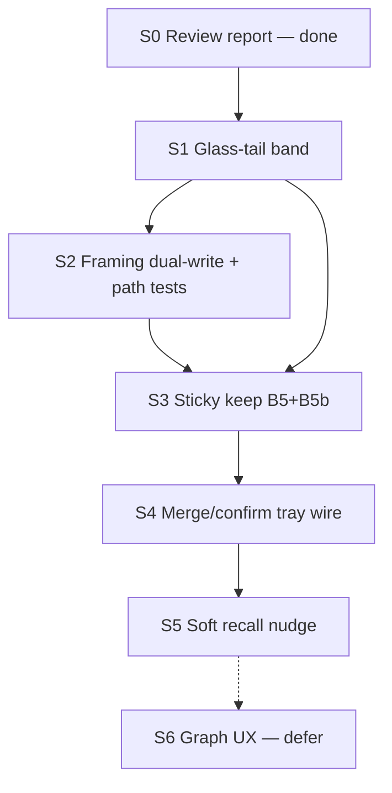

# Implementation Plan: Instance continuity — glass-tail + sticky directed keep

| Field | Value |
|-------|--------|
| **Class** | DESIGN |
| **Document** | Engineer-ready product implement plan (execute-plan contract) |
| **Product** | project-elyra |
| **Date** | 2026-07-30 |
| **Status** | **Ready to execute** — product PRs S1–S6; no runtime code in this docs PR |
| **Issue** | [#93](https://github.com/jtwolfe/project-elyra/issues/93) — `BUG-meal-03` |
| **Bug id** | `BUG-meal-03` |
| **Refined product draft** | [design-instance-continuity-glass-tail-directed-keep.md](design-instance-continuity-glass-tail-directed-keep.md) (**Ready for implement plan**) |
| **Review report** | [meal-continuity-review/REPORT.md](../../investigations/meal-continuity-review/REPORT.md) (S0 done) |
| **Review method** | [design-meal-formation-continuity-review-plan.md](design-meal-formation-continuity-review-plan.md) |
| **Evidence** | [meal-continuity-review/evidence/sa9b-e6d460f2/](../../investigations/meal-continuity-review/evidence/sa9b-e6d460f2/) |
| **Code-path map** | [meal-continuity-review/CODE-PATH-MAP.md](../../investigations/meal-continuity-review/CODE-PATH-MAP.md) |
| **Depends on** | Memory meal active; meal budget fraction shipped (#91); Phase 2a directed_keep channel exists |
| **Adjacent** | [#68](https://github.com/jtwolfe/project-elyra/issues/68) wake-02; [#92](https://github.com/jtwolfe/project-elyra/issues/92) LLM summaries (bulb, not tip) |

---

> **Superseded for implementation by** [`design-instance-continuity-product-implement.md`](design-instance-continuity-product-implement.md) (full product implement design + PR plan, 2026-07-30). Keep this sketch as historical S1–S6 outline only.

## Overview

This document is the **implementation contract** for `/execute-plan` on **instance continuity**. It does **not** re-litigate fault isolation from the review report. It turns the refined product draft into an ordered product PR DAG (S1–S6) with:

- Normative file/symbol touch lists (from CODE-PATH-MAP + draft)
- Per-PR acceptance tests (path matrix P2/P5/P7 mandatory; draft-named fixtures)
- Dependencies and ship gates (tip before sticky keep)
- Locked open questions (OQ4/6/7) as implement law; provisional OQs as measurable defaults

**One-sentence outcome:** An engineer can ship glass-tail tip continuity, framing dual-write, sticky directed-keep tray (B5+B5b), merge confirm, soft recall nudge, and deferred graph UX — via the ordered PRs below — so wait_reply / restart social hops keep a well-formed continuity package.

**Normative fix order (from draft, not empirical recompose rank):**

```text
S1 glass-tail (B1 + role fidelity B3 + tip floor)
  → S2 framing dual-write (B12) + path tests + hybrid/tail dedupe
  → S3 sticky keep (B5 wipe + B5b meal-wire)
  → S4 merge/confirm evolve
  → S5 soft recall nudge
  → S6 graph UX defer
```

Do **not** ship S3 before S1 while wait_reply social still tip-smashes.  
Do **not** ship prompt-only soft recall (A5) as S1.

---

## Continuity invariant (product law)

> After **any** operator or system action (message, wait reply, interject, timeout, restart, continue, task_ready), the **next model call** must see a **well-formed continuity package**: who spoke last, what was asked, what is open, what was deliberately kept, and enough support that “remember / continue” is answerable.

**Precedence under conflict:** glass-tail + temporal wake truth **outrank** episodic thematic bulk when the tip is a clear user question.

**Prince Rupert protection:** Never allow a full-looking meal if the **tip is missing** for a social wake. Prefer a smaller meal with an intact tip.

---

## Goals & non-goals

### Goals

1. **Glass-tail band** in the outer meal: recent durable glass user/assistant rows, honest roles, chronological order, restart-safe from `messages.jsonl` / `list_messages`.
2. **Path parity:** idle `user_message`, `wait_reply`, wait timeout, interject, moment continue / task_ready, and process restart all produce a well-formed next hop.
3. **Sticky directed keep tray:** confirmed pins survive moments and restarts under token LRU + wall-clock TTL (hours → ≤1 day); meal compose reads **instance tray without `moment_id` equality filter**.
4. **Layered recall** so topic questions can use tip → keep → semantic without inventing from episodic vibe alone.
5. **Host-deterministic** age/size policy for keep.

### Non-goals

- Dump entire glass history unbounded into every hop.
- Replace ladder / episodic with raw chat.
- Make directed keep long-term memory (no multi-day silent retention).
- Fix SuperGrok pacing, TTS, or sources links.
- Full graph-traversal rewrite (S6 may reinforce tray UX only).
- LLM period summaries (#92).
- Soft recall nudge alone as the rockets fix (A5 rejected as primary).

---

## Key Decisions (implementation)

Product OQs and draft law remain locked as below. This table records **implementer-safe** choices for execute-plan.

| ID | Decision | Choice | Source |
|----|----------|--------|--------|
| **IK1** | Outer channel order | `system → episodic → semantic → directed_keep → glass_tail → temporal → orient` | Draft §5.2 locked |
| **IK2** | Glass-tail source of truth | Disk glass via `list_messages` / `data/messages.jsonl` — not RAM-only session | Draft §5.1 |
| **IK3** | Glass-tail roles | True `user` / `assistant` roles; **glass-tail wins** on social `message_id` vs temporal host blocks | **OQ6 locked** |
| **IK4** | Band orientation | Newest messages **toward orient** (provisional lock OK) | **OQ2** provisional lock |
| **IK5** | Tip floor under pressure | Never cut glass-tail below floor for social wakes (≥ **4 messages** or ≥ last **2 full turns**); soft % illustrative **5–12%** residual | **OQ1** provisional; draft §5.4 |
| **IK6** | Cut order under pressure | semantic → age-soft directed_keep → episodic; temporal protect tail unchanged; **never** cut glass-tail below floor for social wakes | Draft §5.4 / SA-9b |
| **IK7** | Hybrid after glass-tail | Hybrid remains media/id only; **skip hybrid** when same `message_id` already on **tail or temporal** | Draft §5.3; B10 prevention |
| **IK8** | Framing dual-write (S2) | For `wait_reply`, recommend `why_now` include capped **user snippet**; tail remains SoT | **OQ7 locked** (optional but recommended) |
| **IK9** | Sticky keep moment policy | **Keep tray** at moment end — stop meal-relevant wipe | **OQ4 locked** |
| **IK10** | Sticky keep meal wire | Instance tray; compose **must not** require `snap.moment_id == open_moment_id` | B5b; draft §6 |
| **IK11** | Keep TTL/LRU defaults | Soft ~**3h** under pressure; hard max **≤24h**; host-owned | **OQ3** provisional |
| **IK12** | Confirm default | **Merge** on finish (replace optional later) | **OQ5** provisional |
| **IK13** | Semantic seed (post-tip) | Prefer seed from glass-tail last user when social | **OQ8** prefer-lock after S1 |
| **IK14** | Soft recall | Orient/skill copy only **after** bands (S5); never S1 | Draft §8; A5 reject |
| **IK15** | Legacy path | Memory-off `assemble_outer_meal` sliding glass **unchanged** | Draft §2.4 / CODE-PATH-MAP §7 |
| **IK16** | Ship order | **S1 before S3**; S2 may ship same train as S1 if tests land; S6 fully deferrable | Draft §9; report portfolio |

---

## Locked OQs (do not re-open in product PRs)

| OQ | Status | Implement as |
|----|--------|--------------|
| **OQ4** | Locked: keep tray | Stop B5 wipe of meal-relevant keep; optional still clear glass `last_session` (KD-A19) |
| **OQ6** | Locked: glass-tail roles | Dedup winner = glass-tail for social rows |
| **OQ7** | Locked: optional but recommended dual-write | S2 ships why_now user snippet for wait_reply |

### Provisional (ship defaults; measure later)

| OQ | Default to ship | Measure / lock later |
|----|-----------------|----------------------|
| **OQ1** | Floor turns + soft % (5–12% residual) | Live token calibration |
| **OQ2** | Newest toward orient | Dogfood order preference |
| **OQ3** | 24h hard / 3h soft | Dogfood TTL data |
| **OQ5** | Merge default on confirm | Multi-confirm dogfood |
| **OQ8** | Prefer glass-tail last user seed when social | Lock after S1 lands |

---

## Primary fault → PR map (reference only)

Do not re-investigate; implement:

| Bucket | Mechanism | Ship in |
|--------|-----------|---------|
| **B1** | No glass-tail band on memory outer | **S1** |
| **B3** | Role collapse (host user blocks) | **S1** (true roles on tail) |
| **B11** | Epi mass outranks tip | **S1** tip floor |
| **B12** / **B4** | why_now wait_id only + BIAS_TALK | **S2** dual-write |
| **B7** / **B10** | Hybrid single-row / post-S1 triple | **S1–S2** hybrid dedupe |
| **B5 + B5b** | Moment wipe + moment_id meal filter | **S3** |
| Soft recall A5 | Prompt-only | **S5 only** (after bands) |
| Graph UX | Tray inspect / reinforce tools | **S6** (defer) |

**Rockets class (dogfood):** moment `e6d460f2-4087-42cd-870f-d34a89b6feaf` — ignored user question + missing prior assistant glass in outer (not missing wait-prompt alone).

---

## Target outer order

```text
system
→ episodic
→ semantic
→ directed_keep
→ glass_tail          # NEW (S1)
→ temporal
→ orient              # S2 may enrich why_now snippet
```

Legacy (memory off): `system → sliding glass → orient` — **do not regress**.

---

## PR Plan

Ordered product PRs for the instance-continuity program. Individual PRs use `### S# — …` headings for tooling that splits the plan.



**Hard edges:**

- **S1 before S3** (tip before sticky keep).
- **S2 depends on S1** (dedupe + dual-write evaluation assume tail exists). S2 framing snippet is small; may land in the same merge train as S1 **if** glass-tail tests are green first.
- **S4 depends on S3** (tray persistence + meal wire).
- **S5 after S1+S3** (bands exist; do not prompt-paper missing channels).
- **S6 optional / defer** — not required to close #93 rockets class.

**Parallelism:** Minimal. Prefer sequential S1 → S2 → S3. S6 never blocks S1–S5.

---

### S1 — `feat(memory): glass-tail band with roles and tip floor`

| Field | Content |
|-------|---------|
| **Title** | `feat(memory): glass-tail band with roles and tip floor` |
| **Depends on** | S0 (done); meal budget #91; memory meal + Phase 2a compose path |
| **In scope** | Select last K durable glass rows; pack `glass_tail` channel; true roles; compose order; tip floor under pressure; dedupe vs temporal for social `message_id`; hybrid skip when id on tail/temporal; budget split awareness |
| **Out of scope** | Sticky keep tray; why_now snippet; soft recall copy; graph UX |

#### Files / symbols

| Path | Action |
|------|--------|
| `elyra/memory/meal.py` | **Extend** — `select_glass_tail` (or equiv); pack into meal package; `compose_outer_messages` insert `glass_tail` after `directed_keep`, before `temporal`; preserve `item.role` for tail rows; dedupe vs temporal social rows (**OQ6**); `_inject_hybrid_wake_row` / expand: skip when id present on tail or temporal |
| `elyra/memory/tokens.py` | **Extend** — `split_memory_budget_v3` (or successor): allocate glass-tail residual share + **absolute floor**; cut order: semantic → age-soft dk → episodic; never cut glass-tail below floor for social wakes |
| `elyra/memory/meal_budget.py` | Touch only if residual helpers need glass-tail awareness |
| `elyra/presence/worker.py` | **Extend** — `rebuild_outer` memory branch: pass glass list / tail selection inputs into `compose_meal` (today glass loaded ~`list_messages` for hybrid only) |
| `elyra/messages.py` | Reuse `list_messages` — no API break |
| `elyra/memory/types.py` (or meal item types) | Channel label / MealItem support for glass-tail if needed |
| `tests/test_memory_meal.py` | **Extend** — order + omit contracts include glass_tail; legacy flags still green |
| `tests/test_meal_glass_tail.py` (or extend meal tests) | **Create/extend** — named fixtures below |
| Golden shape from `docs/investigations/meal-continuity-review/evidence/sa9b-e6d460f2/` | Offline recompose-style fixture optional in S1, required shape for P2 |

**Key symbols (today / touch points):**

- `PresenceWorker.rebuild_outer` — `elyra/presence/worker.py`
- `_memory_meal_active` — worker
- `compose_meal` / `compose_outer_messages` / `meal_item_to_message` / `_item_from_parts` — `elyra/memory/meal.py`
- `expand_memory_meal_for_provider` / `_inject_hybrid_wake_row` / `_meal_has_wake_id` — meal.py
- `split_memory_budget_v3` — `elyra/memory/tokens.py`
- `list_messages` — `elyra/messages.py`
- Legacy control: `assemble_outer_meal` — `elyra/context.py` (**do not regress**)

#### Behavioral delta

- Memory-on outer gains a **dialogue tip** band with true roles, chronological, newest toward orient.
- Social wakes always retain tip floor even when epi mass is large (“larger R ≠ tip” remains true; floor creates tip channel).
- Hybrid does not triple the same user row once tail exists.
- Memory-off path unchanged.

#### Acceptance (from draft §5.5)

1. Memory-on: after wait → user off-topic question, first hop outer includes **user answer + prior assistant** glass with correct roles (P2 rockets-class).
2. Restart mid-wait or after wait armed: first social hop still sees last N glass turns from disk (P7 half for tip).
3. Legacy memory-off path unchanged (sliding glass).
4. Unbounded glass dump does not occur (cap + floor tested).

#### Named tests

| Test name | Intent / path |
|-----------|----------------|
| `test_meal_glass_tail_wait_reply_includes_user_and_prior_assistant` | **P2** rockets-class fixture |
| `test_meal_glass_tail_roles_preserved` | True `user` / `assistant` in band |
| `test_meal_tip_floor_under_epi_pressure` | Floor holds when epi mass high |
| `test_meal_glass_tail_order_before_temporal_orient` | Channel order IK1 |
| `test_meal_glass_tail_cap_not_unbounded` | Cap enforced |
| `test_legacy_memory_off_sliding_glass_unchanged` | Regression |
| Offline golden from `evidence/sa9b-e6d460f2/` shape | Recompose carrier regression (assistant prior present in outer) |

#### Dogfood checklist

- [ ] Reproduce wait_reply social with off-topic question; hop-0 addresses question, not only wait ceremony (tail present even if orient still wait-id-only until S2).
- [ ] Restart mid-wait; first social hop still has last glass turns.
- [ ] Memory-off still shows sliding glass dialogue.

---

### S2 — `feat(memory): wait_reply framing dual-write + path parity tests`

| Field | Content |
|-------|---------|
| **Title** | `feat(memory): wait_reply framing dual-write + path parity tests` |
| **Depends on** | **S1** (glass-tail exists; dual-write evaluated against tail) |
| **In scope** | `why_now` user snippet for `wait_reply` (OQ7); path parity hermetic tests **P2 / P5 / P7** (minimum exit set); hybrid/tail/temporal dedupe polish (B10); optional P1/P3/P8 coverage |
| **Out of scope** | Sticky keep; soft recall as primary; full live E-P* matrix |

#### Files / symbols

| Path | Action |
|------|--------|
| `elyra/presence/worker.py` | **Extend** — `_why_now("wait_reply", …)` dual-write: e.g. `wait reply (wait_id=…): {snippet}` with hard cap; payload `content` already available on wait_reply path |
| `elyra/presence/orient_slice.py` | Touch only if orient formatting needs snippet-safe truncation; **do not** remove `BIAS_TALK` in v1 (snippet complements, not deletes skill bias) |
| `elyra/memory/meal.py` | Finish hybrid/tail/temporal dedupe if residual B10 cases remain after S1 |
| `elyra/memory/promote.py` | Only if wake promote meta must align with snippet policy (prefer leave alone) |
| `tests/test_memory_meal.py` / new `tests/test_meal_continuity_paths.py` | **Create/extend** — P2/P5/P7 path matrix fixtures |
| `tests/test_presence_why_now.py` (or worker tests) | **Create/extend** — wait_reply why_now includes capped user text |

**Key symbols:**

- `_why_now` — `worker.py` (today wait_reply → wait_id only)
- `_apply_wait_reply_unlocked` — worker
- `_promote_social_wake_unlocked` / `promote_wake_observation` — worker / promote.py
- `format_skill_bias` / `BIAS_TALK` — `orient_slice.py`
- `fill_orient` via rebuild_outer — worker

#### Behavioral delta

- Orient still ends outer as host framing, but wait_reply why_now carries a **snippet of user text** so ceremony-only framing is not the sole orient signal.
- Acceptance may assert **tail alone *or* tail+snippet** for hop-0 reasoning readiness; both carriers preferred.
- Path tests freeze P2/P5/P7 contracts for future keep work.

#### Acceptance (draft §5.3 / §7 + OQ7)

1. **P2** wait_reply: outer must include last glass user answer + recent assistant social turns; why_now recommended dual-write with user snippet.
2. **P5** ends_moment + wait → later reply: same tip as P2; (keep assertions deferred to S3).
3. **P7** restart mid-wait: tail rebuild from disk before first social hop.
4. Interject (**P4**) remains chain-native — no regression (outer not required for interject text).
5. Snippet capped (no unbounded user paste into orient).

#### Named tests

| Test name | Intent / path |
|-----------|----------------|
| `test_why_now_wait_reply_includes_user_snippet` | OQ7 dual-write |
| `test_path_p2_wait_reply_tip_package` | **P2** full tip package |
| `test_path_p5_wait_bridge_tip_package` | **P5** continuity bridge tip |
| `test_path_p7_restart_mid_wait_tail_from_disk` | **P7** restart tip |
| `test_hybrid_skips_when_message_id_on_glass_tail` | B10 |
| `test_interject_still_chain_only` | **P4** non-regression |

#### Dogfood checklist

- [ ] Rockets-class wait_reply: speak addresses user question; reasoning not pure wait ceremony.
- [ ] Restart mid-wait still coherent.

---

### S3 — `feat(memory): sticky directed keep tray (B5 + B5b)`

| Field | Content |
|-------|---------|
| **Title** | `feat(memory): sticky directed keep tray (B5 + B5b)` |
| **Depends on** | **S1** hard; **S2** preferred (path tests exist). **Do not ship before S1** if dogfood still tip-smashes. |
| **In scope** | Stop moment-end wipe of meal-relevant keep (**B5**); persist instance tray; meal compose **without** `snap.moment_id == open_moment_id` filter (**B5b**); host TTL/LRU; restart load; inspect fields |
| **Out of scope** | Full graph UX tools (S6); soft recall copy (S5); replace-vs-merge UI (default merge lands S4 if not here) |

#### Files / symbols

| Path | Action |
|------|--------|
| `elyra/memory/traverse.py` | **Change** — `on_moment_close`: **do not** wipe meal-relevant `last_confirmed_keep` / tray (optionally still clear glass `last_session` per KD-A19); `get_last_confirmed_keep`: meal path uses **instance tray**, remove or bypass equality filter for meal; persist helpers |
| `elyra/presence/worker.py` | **Change** — `_last_confirmed_keep_for_meal` / `_close_traversal_for_moment` wire to tray without open-moment equality; restart load tray before first compose |
| `elyra/memory/meal.py` | `select_directed_keep` / compose reads instance tray ids; no moment_id equality |
| New or extend `elyra/memory/keep_tray.py` (optional module) | Tray model: entries with `atom_id`, `confirmed_at`, `last_reinforced_at`, audit `source_moment_id`, TTL/LRU policy |
| `data/runtime/` (or memory meta) | Persist tray JSON (or equivalent) |
| `elyra/runtime/api.py` | `/api/memory/context` (and graph session if present): expose tray age, token use, entry moment_ids |
| `tests/test_memory_meal_directed_keep.py` | **Extend** — cross-moment pack; flags-off parity |
| `tests/test_memory_traverse.py` | **Extend** — wipe stopped; B5b regression |
| New tray tests | TTL hard/soft, LRU over-cap, restart reload |

**Key symbols (dual kill today):**

- `get_last_confirmed_keep` — `traverse.py` (**B5b**)
- `TraversalRegistry.on_moment_close` — `traverse.py` (**B5**)
- `_last_confirmed_keep_for_meal` / `_close_traversal_for_moment` — worker
- Confirm finish path → `ConfirmedKeepSnapshot`

#### Behavioral delta

1. **B5:** moment close no longer clears meal-relevant keep tray.
2. **B5b:** confirm in moment A, compose in moment B → tray still packs.
3. Restart: tray reloads; expired ids gone; under-cap pack works.
4. Hard age: nothing older than `max_age_hard` in meal.
5. Under pressure: age-soft keep drops **before** tip floor (keep ≠ tip substitute).
6. Flags off / empty tray: Phase 1/2 budget parity preserved.

#### Acceptance (draft §6.7)

1. Confirm keep → end moment → new moment: channel still non-empty (until TTL/LRU).
2. Restart process: tray reloads; expired ids gone; under-cap pack works.
3. Over-cap adds: oldest (or soft-aged) drop first.
4. Hard age: nothing older than max_age_hard appears in meal.
5. Flags off / empty tray: existing golden tests still pass.
6. Confirm in moment A, compose in moment B (open ≠ confirm): tray still packs (**B5b** regression).

#### Named tests

| Test name | Intent / path |
|-----------|----------------|
| `test_directed_keep_survives_moment_close` | **B5** |
| `test_directed_keep_packs_across_moment_ids` | **B5b** / **P5** keep half |
| `test_directed_keep_tray_restart_reload` | **P7** keep half |
| `test_directed_keep_hard_ttl_evicts` | OQ3 hard |
| `test_directed_keep_soft_age_cut_before_tip_floor` | Pressure policy |
| `test_directed_keep_lru_over_cap` | Token LRU |
| `test_directed_keep_flags_off_budget_parity` | Regression |

#### Dogfood checklist

- [ ] Confirm keep during work; end moment; new social moment still shows directed_keep channel.
- [ ] Restart process; tray entries within TTL still pack.
- [ ] Glass Graph / context inspect shows tray ages (minimal fields OK).

---

### S4 — `feat(memory): directed keep merge/confirm and meal channel wire`

| Field | Content |
|-------|---------|
| **Title** | `feat(memory): directed keep merge/confirm and meal channel wire` |
| **Depends on** | **S3** (tray exists) |
| **In scope** | Confirm finish **merge vs replace** (default **merge**, OQ5); reinforce `last_reinforced_at`; meal channel wire fully on tray selection; any remaining Phase 2a snapshot → tray migration |
| **Out of scope** | Graph pin UX tools (S6); soft recall |

#### Files / symbols

| Path | Action |
|------|--------|
| `elyra/memory/traverse.py` | Finish confirm: `on_confirm(mode=merge\|replace)`; merge default; set timestamps; age drop + LRU trim |
| `elyra/tools` traverse finish tools (if any) | Expose merge default; optional replace flag later |
| `elyra/memory/meal.py` | Ensure `select_directed_keep(tray)` is sole meal path |
| `tests/test_memory_traverse_tools.py` | Merge two confirms; replace mode if exposed |
| `tests/test_memory_meal_directed_keep.py` | Channel content reflects merged ids |

#### Behavioral delta

- Multiple confirms **accumulate** by default (merge), not last-finish-wins wipe of tray contents.
- Replace mode available for explicit “this walk only” if cheap; not required for #93 close if merge-only v1.

#### Acceptance

1. Confirm A then confirm B (merge): tray contains union under cap.
2. Meal channel lists merged ids after compose.
3. Replace mode (if shipped): tray becomes new set only.
4. No moment_id filter regression (S3 tests stay green).

#### Named tests

| Test name | Intent |
|-----------|--------|
| `test_confirm_merge_default_unions_ids` | OQ5 merge |
| `test_confirm_updates_last_reinforced_at` | Reinforce |
| `test_meal_channel_reads_merged_tray` | Wire |

#### Dogfood checklist

- [ ] Two graph finishes with keep confirm; both topic pins survive into next meal.

---

### S5 — `feat(memory): soft recall nudge after bands`

| Field | Content |
|-------|---------|
| **Title** | `feat(memory): soft recall nudge after bands` |
| **Depends on** | **S1** and **S3** (bands exist). Prefer after **S4**. |
| **In scope** | Orient and/or talk/memory skill soft line for topic recall order; optional tray fields on glass/API inspect polish; optional **OQ8** semantic seed from glass-tail last user when social |
| **Out of scope** | Using this PR as rockets primary fix; unbounded prompt walls |

#### Files / symbols

| Path | Action |
|------|--------|
| `elyra/presence/orient_slice.py` and/or bundled talk/memory skill bodies | Soft line: *If the user asks what you remember about a topic, use glass-tail and directed_keep first; if thin, use semantic / memory-traverse — do not invent from episodic summaries alone.* |
| `elyra/memory/meal.py` | Optional: `build_semantic_query_seed` prefer glass-tail last user when social (**OQ8**) |
| `prompts/` or skill SKILL.md | Copy only; keep short |
| `tests` | Assert nudge present when memory meal on; seed preference unit test if OQ8 lands |

#### Behavioral delta

- Behavior glue only — not a substitute for missing channels (already shipped in S1/S3).
- Semantic ANN better seeded from tip after OQ8.

#### Acceptance

1. Soft line present in orient or skill surface when memory meal active.
2. Does not ship without glass-tail channel in tree.
3. If OQ8 lands: social seed uses last glass-tail user text when available.
4. Rockets class still depends on S1/S2 — this PR is polish.

#### Named tests

| Test name | Intent |
|-----------|--------|
| `test_soft_recall_nudge_present_when_memory_meal` | Copy landed |
| `test_semantic_seed_prefers_glass_tail_last_user` | OQ8 if in scope |

#### Dogfood checklist

- [ ] Ask “what do you remember about X?” with pin + tip present → uses tip/keep before epi vibe.

---

### S6 — `feat(memory): graph UX tray reinforce (defer)`

| Field | Content |
|-------|---------|
| **Title** | `feat(memory): graph UX tray reinforce (defer)` |
| **Depends on** | S3–S4 |
| **In scope** | Graph UI shows tray vs last walk; pin-from-semantic; list/drop tray tools; reinforce UX |
| **Out of scope** | Blocking #93 rockets close; rewriting traversal core |

#### Files / symbols (indicative)

| Path | Action |
|------|--------|
| Glass Graph UI / `elyra/runtime/web/**` | Tray panel vs last_session (KD-A19 separate) |
| Traverse tools | pin / drop / list tray |
| `docs/state/memory/architecture/` | Post-ship architecture note if needed |

#### Behavioral delta

- Operator can see and curate sticky tray without raw JSON.
- **Fully deferrable** — tray v1 (S3) may be “persist + TTL/LRU without full UX.”

#### Acceptance

1. Tray visible distinct from last graph walk session.
2. Drop/list tools host-safe.
3. No regression of meal pack path.

#### Named tests

| Test name | Intent |
|-----------|--------|
| API/UI hermetic tests for tray list/drop | When built |

#### Dogfood checklist

- [ ] Operator can inspect tray age and drop stale pins from Glass.

**Status:** **Defer** unless product prioritizes graph polish after S1–S5.

---

## Path matrix coverage (must pass by end of S2 tip + S3 keep)

| # | Path | Tip owner | Keep owner | Notes |
|---|------|----------|------------|-------|
| P1 | Idle → `user_message` | S1 | S3 | Baseline social |
| **P2** | Waiting → `wait_reply` | **S1+S2** | S3 | **Rockets class** |
| P3 | Waiting → timeout | S1 | S3 | Adjacent #68 |
| P4 | Interject | N/A (chain) | S3 unchanged | Non-regression |
| **P5** | ends_moment + wait → later reply | **S2** | **S3** B5+B5b | Continuity bridge |
| P6 | moment_continue / task_ready | S1 | S3 | Work ≠ erase social tip |
| **P7** | Restart mid-wait | **S1+S2** | **S3** | Disk tail + tray load |
| P8 | Restart idle | S1 | S3 | Instance memory |
| P9 | Long tool + chain pressure | S1 outer tip | S3 | In-turn ≠ outer |

Minimum hermetic exit set for #93: **P2, P5, P7**.

---

## Leave-alone (non-negotiable)

Do **not**:

- Regress legacy memory-off sliding glass.
- Treat meal budget fraction increases as a substitute for glass-tail.
- Ship soft-recall-only or prompt-only as S1.
- Clear glass `last_session` policy confusion with meal tray (KD-A19 may still clear session view; meal tray must survive).
- Re-open locked OQ4/6/7 without new evidence.
- Block tip ship on S6 graph UX.

---

## Relationship to other work

| Item | Relationship |
|------|----------------|
| **#91 meal budget** | Done — residual size; does not create chat channel |
| **#92 LLM summaries** | Better bulb; must not outrank tip |
| **#68 wake-02** | Restart work-thread sanitation; complementary to tip |
| **Phase 2a design** | Superseded **for keep lifetime** by sticky tray; walk/session DTO mostly stands |
| **meal-continuity-review/** | Fault isolation complete (S0); this plan implements locked package |

---

## Definition of done (#93 / BUG-meal-03)

- [ ] **S1** merged: glass-tail with roles + tip floor; named tests green.
- [ ] **S2** merged: why_now snippet dual-write; P2/P5/P7 hermetic green.
- [ ] **S3** merged: B5 wipe stopped + B5b instance tray; cross-moment + restart keep tests green.
- [ ] **S4** merged or explicitly waived with merge-default landed inside S3.
- [ ] **S5** optional polish after bands; not used to close rockets without S1/S2.
- [ ] **S6** deferred or separate epic.
- [ ] Dogfood: wait_reply off-topic question answered from tip; sticky pin survives moment boundary.
- [ ] `docs/state/known-bugs.md` BUG-meal-03 updated to Fixed when product ships (separate from this docs-only plan PR).

---

## Document history

| Date | Change |
|------|--------|
| 2026-07-30 | Initial implement plan from refined draft + meal-continuity-review REPORT (S1–S6 product PR DAG; locked OQs; no runtime code) |
