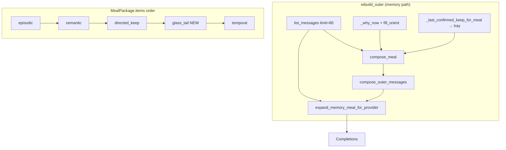
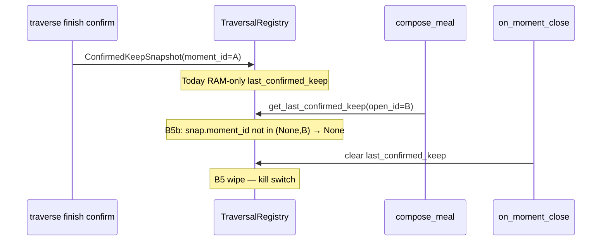
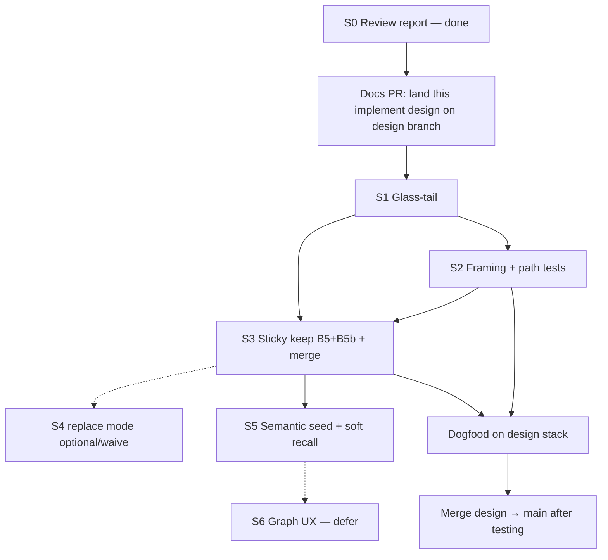
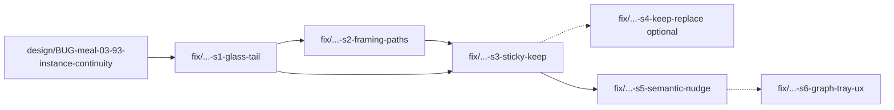

# Design: Instance Continuity — Product Implement Plan (glass-tail, framing, sticky keep, semantic seed)

| Field | Value |
|-------|--------|
| **Class** | DESIGN |
| **Document** | Product implement design + PR plan (execute-plan contract) |
| **Product** | project-elyra |
| **Date** | 2026-07-30 |
| **Status** | **Ready to execute** — code-level specificity for S1–S6; no runtime product code in the docs-only landing PR |
| **Issue** | [#93](https://github.com/jtwolfe/project-elyra/issues/93) — `BUG-meal-03` |
| **Bug id** | `BUG-meal-03` |
| **Design tip / branch base** | `design/BUG-meal-03-93-instance-continuity` @ `38d6830` |
| **Code facts SHA** | Symbol lines verified at design tip **`38d6830`**. Report inspection SHA `7ebf50b` is **ancestor evidence** for fault isolation, not an alternate product base. |
| **Critical branch rule** | **Every product implementation branch is created FROM** `design/BUG-meal-03-93-instance-continuity` (not bare `main`). Stack: feature branches off design tip → dogfood → merge design branch (or stacked PRs) → main after testing. |
| **Product draft** | [`docs/stretch-2/design-instance-continuity-glass-tail-directed-keep.md`](design-instance-continuity-glass-tail-directed-keep.md) (**Ready for implement plan**) |
| **Prior sketch** | [`docs/stretch-2/design-instance-continuity-implement-plan.md`](design-instance-continuity-implement-plan.md) — this document **refines and supersedes** that sketch with code-level specificity |
| **Review report** | [`docs/investigations/meal-continuity-review/REPORT.md`](../../investigations/meal-continuity-review/REPORT.md) (S0 done) |
| **Edge matrix** | [`docs/investigations/meal-continuity-review/EDGE-MATRIX.md`](../../investigations/meal-continuity-review/EDGE-MATRIX.md) |
| **Code-path map** | [`docs/investigations/meal-continuity-review/CODE-PATH-MAP.md`](../../investigations/meal-continuity-review/CODE-PATH-MAP.md) |
| **Evidence** | [`docs/investigations/meal-continuity-review/evidence/sa9b-e6d460f2/`](../../investigations/meal-continuity-review/evidence/sa9b-e6d460f2/) |
| **Depends on** | Memory meal active; meal budget fraction shipped (#91); Phase 2a directed_keep channel exists |
| **Repo landing path (recommended)** | `docs/stretch-2/design-instance-continuity-product-implement.md` (supersede pointer in implement-plan sketch) |

---

## Overview

This document is the **concrete product implementation design** for instance continuity under `#93` / `BUG-meal-03`. It turns:

1. Fault isolation from the meal continuity review (`F-01…F-11`, buckets `B1–B12`),
2. Locked product law from the glass-tail + sticky keep draft, and
3. The existing S1–S6 sketch

…into an engineer-executable plan with **file/symbol touch lists, budget math, dedupe rules, tray schema, path tests, and an ordered PR DAG**.

**One-sentence outcome:** After any operator or system action (message, wait reply, interject, timeout, restart, continue, task_ready), the next model call sees a **well-formed continuity package** — dialogue tip (glass-tail) + path frame (why_now snippet) + intentional pins (sticky directed keep) + better semantic support under social wakes — without regressing interject chain-native behavior or the legacy memory-off sliding glass path.

**Normative ship order (hard edge):**

```text
S1 glass-tail (B1 + role fidelity B3 + tip floor vs B11)
  → S2 framing dual-write (B12/B4) + path tests P2/P5/P7 + hybrid/tail dedupe (B7/B10)
  → S3 sticky keep (B5 wipe + B5b meal-wire) + persist/TTL/LRU + merge-on-confirm
  → S4 replace mode only (optional; waive if unneeded)
  → S5 semantic seed from tip + soft recall nudge
  → S6 graph UX (defer)
```

Do **not** ship S3 before S1 while wait_reply social still tip-smashes.  
Do **not** ship prompt-only soft recall (A5) as S1.

### Primary fault → PR map

| Fault / Bucket | Mechanism (short) | Ship in |
|----------------|-------------------|---------|
| **F-01 / B1** | Missing glass-tail band on memory outer | **S1** |
| **F-03 / B3** | Role collapse (host `role: user` blocks) | **S1** (true roles on tail) |
| **F-09 / B11** | Episodic mass outranks tip | **S1** tip floor + cut order |
| **F-04 / B7** | Hybrid single-row / often skipped | **S1** keep hybrid media/id; tail supplies dialogue |
| **F-10 / B10** | Post-S1 dual/triple copy risk | **S1–S2** OQ6 temporal suppress + hybrid skip |
| **F-02 / B12** (+ **B4**) | why_now wait_id only + BIAS_TALK | **S2** dual-write snippet |
| **F-05 / B2** | wait_reply outer rebuild vs interject chain | Leave-alone (KD-INT); path parity via outer tip |
| **F-06 / B5** | Moment-end wipe of last_confirmed_keep | **S3** stop meal wipe |
| **F-07 / B5b** | `get_last_confirmed_keep(open_id)` moment filter | **S3** instance tray, no equality for meal |
| **F-10 / B8–B9** | In-turn re-outer / restart hydration | **S1** disk tail every rebuild; **S3** tray persist |
| **F-08 / B6** | Semantic empty_seed / encode lag | **S5** seed from glass-tail; lag documented |
| **F-11** | Test/contract gaps | Named tests per PR (S1–S5) |
| Soft recall A5 | Prompt-only | **S5 only** (after bands) |
| Graph UX | Tray inspect / reinforce tools | **S6** (defer) |

**Branch stacking (non-negotiable):**

```text
main
  └── design/BUG-meal-03-93-instance-continuity   # design tip @ ~38d6830
        ├── fix/BUG-meal-03-93-s1-glass-tail
        ├── fix/BUG-meal-03-93-s2-framing-paths
        ├── fix/BUG-meal-03-93-s3-sticky-keep
        ├── fix/BUG-meal-03-93-s4-keep-merge
        ├── fix/BUG-meal-03-93-s5-semantic-nudge
        └── (optional) fix/BUG-meal-03-93-s6-graph-tray-ux
```

Each product PR branch is cut **from** `design/BUG-meal-03-93-instance-continuity` (or from the previous product tip in a stack). Never from bare `main`.

---

## Background & Motivation

### Dogfood anchor (rockets class)

| Surface | Content |
|---------|---------|
| **Glass** | User: *“what is the coolest thing you remember about rockets?”* (`04f85fc6-…`) |
| **Speak** | Status about closed philosophy/fabric threads (`37ec1721-…`) — not an answer to rockets |
| **Path** | `wait_reply` after time + `wait_user` (“Anything else?”) |
| **Moment** | `e6d460f2-4087-42cd-870f-d34a89b6feaf` |
| **why_now** | `wait reply (wait_id=c13ae60a-40ed-45c6-a75a-035c1a78f05c)` — **no user text** |
| **Prior assistant glass** | Time speak `436f4ca1-…` — **absent from outer** |

Glass showed a normal Q→A pair. The model outer meal did not present a dialogue-shaped **tip**, so wait-ceremony framing + closed-work episodic vibe won.

**Rockets failure class (normative):** ignored user question **+** missing prior assistant glass in outer — **not** missing wait-prompt text alone. Wait prompt lives in `waits.json` / prior tape, often **not** as a glass row.

### Prince Rupert’s drop

- **Bulb** = episodic (+ semantic when seeded) + ledger. Looks rich in Memory UI.
- **Tip** = last glass turns + wake truth + wait setup, with **true roles and order**.
- Smash the tip → confident wrong speak even when the bulb is full.
- Raising meal budget (#91) thickened the bulb. **Larger residual R ≠ tip channel.**

### Why interjection “never” fails this way

| | **Interjection** (`in_moment`) | **Wait reply / new social moment** |
|--|--|--|
| Landing | In-turn **chain** as user obs (`doloop._drain_interjections` ~L615) | New moment → **outer meal rebuild** |
| Continuity | Outer already fixed for this moment | Must **reconstitute** world from meal |
| Failure mode | Delayed until safe drain | Wrong story of the world |

**Leave interject chain-native.** Fix outer rebuild paths (P1/P2/P5/P7), not by forcing chain across wait boundaries.

### Empirical vs normative ranking (do not merge)

| Label | Order | Meaning |
|-------|-------|---------|
| **Empirical SA-9b recompose** | **B12 → B11 → B3 → B7 → B1** | What hop-0 carriers suggest outranked the tip *in the failure instance* |
| **Normative fix priority** | **B12 + B1 co-primary → B3 → B7 → B11** (under tip floor) | What to ship first |

Elevating **B1** for S1 is fix-priority (missing channel), not a re-rank of the empirical list. Implementation must evaluate **tail-only vs tail+orient snippet**, not B1 alone.

### What is broken today (code facts @ design tip)

When memory meal is active (`PresenceWorker._memory_meal_active` ~`worker.py:1382`):

```text
outer = system → episodic → semantic → directed_keep → temporal → orient
(+ hybrid single wake glass row for media / wake id when needed)
chain = do-loop tool hops only (ephemeral to open moment)
```

Confirmed call graph (`CODE-PATH-MAP.md`):

| Concern | Location |
|---------|----------|
| Memory outer | `rebuild_outer` `worker.py:1976` → `compose_meal` / `compose_outer_messages` `meal.py:1499/1709` |
| Glass loaded but unused as tip | `list_messages(limit=80)` `worker.py:1991` — hybrid/media only |
| Role collapse | `_item_from_parts(..., role="user")` `meal.py:162–170`; `meal_item_to_message` `meal.py:1695` |
| why_now wait_reply | `_why_now` `worker.py:185–186` — wait_id only |
| Skill bias | `format_skill_bias` → `BIAS_TALK` `orient_slice.py:17,122–123` |
| Keep wipe B5 | `TraversalRegistry.on_moment_close` `traverse.py:1106–1117` |
| Keep meal wire B5b | `get_last_confirmed_keep` `traverse.py:534–541` equality filter; wired via `_last_confirmed_keep_for_meal` `worker.py:1500–1517` |
| Semantic seed | `build_semantic_query_seed` `meal.py:898` — open-moment obs/speak/model only |
| Hybrid | `_inject_hybrid_wake_row` `meal.py:1816` — single row; skipped when id on meal |
| Budget | `split_memory_budget_v3` `tokens.py:127` — no glass-tail share/floor |
| Legacy control | `assemble_outer_meal` `context.py:251` — sliding glass roles (**do not regress**) |

---

## Goals & Non-Goals

### Goals

1. **Glass-tail band** in the outer meal: recent durable glass user/assistant rows, honest roles, chronological order (newest toward orient), restart-safe from `data/messages.jsonl` via `list_messages`.
2. **Path parity:** idle `user_message`, `wait_reply`, wait timeout, interject (non-regression), moment continue / task_ready, and process restart all produce a well-formed next hop under the continuity invariant.
3. **Framing dual-write:** for `wait_reply`, `why_now` carries a capped user snippet so orient is not ceremony-only (OQ7); glass-tail remains source of truth for dialogue.
4. **Sticky directed keep tray:** confirmed pins survive moments and restarts under **token LRU + wall-clock TTL** (soft ~3h, hard ≤24h); meal compose reads **instance tray without `moment_id` equality filter** (B5 + B5b both fixed).
5. **Semantic meal improvements:** seed from glass-tail last user (+ temporal when social); reduce `empty_seed` on social wakes; document/mitigate encode lag under social support.
6. **Host-deterministic** age/size policy for keep; skills may curate but must not be the sole TTL enforcer.
7. **Hard edge:** S1 glass-tail **before** S3 sticky keep.

### Non-goals

- Dump entire glass history unbounded into every hop.
- Replace ladder / episodic with raw chat.
- Make directed keep long-term memory (no multi-day silent retention).
- Source/context edges at atom creation (#98) — note adjacency only.
- LLM period summaries (#92) as core of this plan (bulb quality, not tip).
- Full graph UX rewrite (S6 deferrable).
- Soft recall nudge alone as the rockets fix (A5 rejected as primary).
- Fix SuperGrok pacing, TTS, or sources links.
- Change interject to rebuild outer (leave chain-native).

---

## Continuity invariant (product law)

> After **any** operator or system action (message, wait reply, interject, timeout, restart, continue, task_ready), the **next model call** must see a **well-formed continuity package**: who spoke last, what was asked, what is open, what was deliberately kept, and enough support that “remember / continue” is answerable.

**Precedence under conflict:** glass-tail + temporal wake truth **outrank** episodic thematic bulk when the tip is a clear user question.

**Prince Rupert protection:** Never allow a full-looking meal if the **tip is missing** for a social wake. Prefer a smaller meal with an intact tip.

### Layered package

| Layer | Job | Cadence | Durability |
|-------|-----|---------|------------|
| **Glass-tail** | What we just said (dialogue tip) | seconds–minutes | Disk glass log |
| **Temporal** | Open-moment atoms / working spine | this moment | Store + promote |
| **Directed keep** | What we **pinned** for this thread of thought | hours, slow decay | Runtime tray + atom ids |
| **Semantic** | Related atoms for *this* seed | per hop | Vectors on disk; seed from tip |
| **Episodic** | Era narrative / summaries | hours–days | Ladder store |
| **In-turn chain** | Tool hops | open moment only | **Not** across stop/restart |
| **Orient / path frame** | Why awake, soft skill bias, goals | per rebuild | Derived |

---

## Proposed Design

### Target outer order (memory-on)

```text
system
→ episodic
→ semantic
→ directed_keep
→ glass_tail          # NEW (S1)
→ temporal
→ orient              # S2 may enrich why_now snippet
(+ hybrid only if wake id missing from tail AND temporal — media/id only)
```

Legacy (memory-off): `system → sliding glass → orient` via `assemble_outer_meal` — **unchanged**.



---

### Part A — Glass-tail band (S1)

#### A.1 Definition

**Glass-tail** = last *K* durable glass messages (user + assistant), selected by recency from disk, packed into a labeled meal channel with:

- Original **roles** (`user` / `assistant`) — not host `role: user` blocks.
- Chronological order within band; **newest nearest orient** (OQ2 provisional lock).
- Token budget: soft **5–12%** of residual *R*, plus **absolute floor** for social wakes (≥ **4 messages** or ≥ last **2 full turns** when available).
- Source of truth: **`list_messages`** / `data/messages.jsonl` — not RAM-only session, not meal snapshot alone.

#### A.2 New / extended symbols

| Symbol | File | Role |
|--------|------|------|
| `select_glass_tail(...)` | `elyra/memory/meal.py` | **New** — select + pack glass rows into `MealItem`s |
| `GLASS_TAIL_CHANNEL = "glass_tail"` | `meal.py` | Channel label constant |
| `MealItem.channel` | already supports free string | Use `"glass_tail"`; update any channel allowlists in inspect/tests |
| `compose_meal` | `meal.py:1499` | Call select; insert items; budget split; dedupe vs temporal |
| `compose_outer_messages` | `meal.py:1709` | Docstring + order; items already ordered via package |
| `split_memory_budget_v3` → **v4 or extended v3** | `elyra/memory/tokens.py` | Allocate glass-tail share + floor; cut order under pressure |
| `rebuild_outer` | `worker.py:1976` | Pass `glass_rows`, `social_wake` (or `wake_kind`) into `compose_meal` |
| `_inject_hybrid_wake_row` / `_meal_has_wake_id` | `meal.py:1802–1851` | Skip hybrid when `message_id` present on **tail or temporal** |
| `MealPackage` | `meal.py:104` | `glass_tail_meta` for inspect (packed count, floor applied, tokens) |
| `meal_package_to_inspect` | `elyra/memory/inspect.py` | Surface `glass_tail` channel + optional `glass_tail_meta` for Memory Context tab |
| `MealItem.channel` comment | `meal.py:92` | Extend vocabulary: `… \| glass_tail \| …` |

#### A.3 `select_glass_tail` contract

```python
SOCIAL_WAKE_KINDS = frozenset({"user_message", "wait_reply", "wait_timeout"})

def select_glass_tail(
    glass_rows: Sequence[Mapping[str, Any]],
    *,
    cap_tokens: int,
    floor_messages: int = 4,          # absolute min when social + available
    max_messages: int = 16,           # hard cap — prevent unbounded dump
    social_wake: bool = False,        # floor only when True (KD-SOC)
    exclude_message_ids: set[str] | None = None,  # optional pre-dedupe
) -> tuple[list[MealItem], dict[str, Any]]:
    """Return glass_tail MealItems + meta.

    - Filter to role in {user, assistant}; keep non-empty content OR attachments
      (match legacy _glass_to_history KD19 media-only rule).
    - Take newest-first window up to max_messages, then reverse to chronological
      (oldest → newest) so newest sits nearest orient when placed before temporal.
    - Pack under cap_tokens. When social_wake and that many rows exist, never drop
      below floor_messages (Prince Rupert floor). If soft cap_tokens is below the
      estimated floor cost, still pack floor; compose_meal has already stolen from
      supports (see §A.4) so soft glass_tail_cap may be raised to floor_cost.
    - Each MealItem (normative meta — required for hybrid skip):
        channel="glass_tail"
        label="glass-tail"
        role=<original user|assistant>   # NEVER default host user
        content=<raw glass content string>
        meta={
          "wake_message_id": <glass row id>,  # REQUIRED when id present
          "message_id": <same>,               # optional alias for inspect
          "source": "glass",
          "attachments": ...                  # when present (KD19)
        }
    """
```

**Roles:** do **not** use `_item_from_parts` default `role="user"` for glass-tail rows. Pass `role=` explicitly or construct `MealItem` directly. `meal_item_to_message` must emit `item.role` unchanged.

**Label / header policy (KD-GT-LABEL — locked for v1):**

Ship **per-item short header** for consistency with other meal channels:

```text
{role: assistant, content: "[context:glass-tail]\nIt's Thursday 30 July…"}
{role: user,      content: "[context:glass-tail]\nwhat is the coolest thing…rockets?"}
```

- Acceptance tests assert **roles** + content text (and `msg["id"]` when glass id present) — **not** a specific header style beyond "content includes the glass body."
- Dogfood may later strip per-item headers; that is a follow-up polish, not S1 gate.

#### A.4 Budget interaction — normative `split_memory_budget_v4`

```python
# tokens.py — successor to split_memory_budget_v3
def split_memory_budget_v4(
    budget_tokens: int,
    *,
    system_text: str = "",
    orient_text: str = "",
    semantic_enabled: bool = False,
    directed_keep_active: bool = False,
    glass_tail_active: bool = False,
    glass_tail_fraction: float = 0.08,  # soft % of residual (5–12% band)
    # … same semantic/dk/epi/temporal_min kwargs as v3 …
) -> tuple[int, int, int, int, int, int]:
    """Returns (fixed, semantic_cap, directed_keep_cap, episodic_cap,
    glass_tail_cap, temporal_cap).

    Invariant when glass_tail_active:
        semantic + directed_keep + episodic + glass_tail + temporal == remaining
    When glass_tail_active is False: glass_tail_cap=0 and the other four residual
    caps are **bit-identical** to split_memory_budget_v3 (golden parity).
    """
```

##### Normative algorithm (when `glass_tail_active`)

Match v2/v3 comment style. Residual `R = max(0, budget_tokens - fixed)` where `fixed = tokens(system) + tokens(orient)`.

1. **Soft allocate** from residual (same fractions as v3 for sem/dk/epi; new soft glass-tail):
   - `semantic_cap = int(R * semantic_fraction)` if semantic else 0  
   - `directed_keep_cap = int(R * directed_keep_fraction)` if dk active else 0  
   - `episodic_cap = int(R * epi_fraction_with_or_without_sem)`  
   - `glass_tail_cap = int(R * glass_tail_fraction)`  
   - `temporal_cap = R - (sem + dk + epi + glass_tail)`  

   Note: naive sum of fractions may exceed 1.0 before clamp — that is expected; step 2 enforces identity.

2. **Temporal floor clamp** (`floor = int(R * temporal_min_fraction)`, default 0.55).  
   If `temporal_cap < floor`, deficit = `floor - temporal_cap`. Cut supports in order:

   ```text
   semantic → directed_keep → episodic → glass_tail_soft
   ```

   where **`glass_tail_soft`** means the soft `%` allocation only (may go to 0 in this step).  
   After cuts: recompute `temporal_cap = R - sum(supports + glass_tail)`.

3. **Identity:** always re-assert  
   `sem + dk + epi + glass_tail + temporal == R` (adjust temporal last if rounding).

4. **Message floor is NOT inside `split_*`.**  
   `split_memory_budget_v4` only returns **token caps**. The absolute **message floor** (≥4 messages / ≥2 turns when `social_wake`) is enforced in `compose_meal` / `select_glass_tail`:
   - Estimate `floor_cost_tokens` for the floor message set (when social and rows available).
   - If `glass_tail_cap < floor_cost_tokens`, **raise** effective glass-tail budget by stealing from supports in order:

     ```text
     semantic → age-soft directed_keep → episodic
     ```

     **Never** steal from temporal below `protect_tail_atoms` packing behavior (temporal cap already floor-protected in step 2; do not reduce temporal further for glass-tail message floor).
   - If still short after supports drained: pack as many floor messages as fit; log `glass_tail_meta.floor_shortfall=true` (extreme tiny budgets only).

5. **Precedence under dual floors:** If residual cannot satisfy both temporal_min and glass-tail message floor after supports are zero, **temporal_min token floor wins for the split**; glass-tail packs best-effort under remaining (still prefer glass-tail over re-growing epi). Product law still prefers an intact tip when a social wake has glass rows — in practice meal budgets (#91) leave enough residual; hermetic tests use budgets large enough for both floors.

**Cut order under pressure (supports first) — packing / re-shrink after select:**

```text
semantic → age-soft directed_keep → episodic
# soft glass-tail % already cut in split step 2 before message floor raise
# message floor steal (step 4) also uses that support order
# never cut glass-tail below message floor for social wakes when rows exist
# temporal protect_tail_atoms unchanged
```

**Larger R ≠ tip** — floor creates tip channel independent of #91.

##### Golden test strategy (S1)

| Case | Assert |
|------|--------|
| `glass_tail_active=False` | Bit-identical to existing v3 goldens in `tests/test_memory_meal_directed_keep.py` |
| `glass_tail_active=True`, all supports on | Sum of five residual caps == R; glass_tail_cap ≈ `int(R * 0.08)` before clamp |
| Temporal pressure (high fixed / low budget) | Cut order hits sem then dk then epi then glass soft; temporal ≥ floor when R allows |
| Message floor (compose-level) | Under high epi mass + social_wake, packed glass-tail messages ≥ min(4, available) even if soft % alone would be tiny |

#### A.4b Constants (provisional OQ1 — ship defaults)

| Constant | Default | Notes |
|----------|---------|-------|
| `glass_tail_fraction` | `0.08` | Soft residual share |
| `glass_tail_floor_messages` | `4` | Social wakes only |
| `glass_tail_max_messages` | `16` | Hard cap |
| `glass_tail_list_limit` | `80` | Align with `rebuild_outer` `list_messages(limit=80)` |

Config: add fields to `MemorySettings` in `elyra/memory/config.py` (defaults above).

#### A.5 Placement & compose wiring

**Social wake / active flags (KD-SOC — locked):**

| Flag | Meaning | Default / wiring |
|------|---------|------------------|
| **`social_wake`** | Floor law applies | `wake.kind in {"user_message", "wait_reply", "wait_timeout"}` (also True if caller passes `social_wake=True`). **Not** social: `timer`, `task_ready`, `moment_continue`, `background` — tip band may still pack soft %, no absolute message floor. |
| **`glass_tail_active`** | Soft glass-tail budget share allocated | **True whenever `glass_rows` is non-empty** on the memory meal path (tip always available when glass exists). Not gated on social_wake. |

In `compose_meal`:

1. Accept kwargs:  
   `glass_rows: Sequence[Mapping] | None = None`,  
   `social_wake: bool = False`,  
   `glass_tail_active: bool | None = None`  
   — if `glass_tail_active is None`: `bool(glass_rows)`.
2. Budget split with `glass_tail_active`; then `select_glass_tail(..., social_wake=social_wake, cap_tokens=glass_tail_cap)`.
3. **Dedupe (OQ6) — see §A.5b.**
4. Item order:

```python
items = (
    list(episodic_items)
    + list(semantic_items)
    + list(directed_items)
    + list(glass_tail_items)   # NEW
    + list(temporal_items)
)
```

5. `channels_present` includes `"glass_tail"` when packed; set `package.glass_tail_meta`.

In `rebuild_outer` memory branch (`worker.py:2032–2116`):

```python
glass = list_messages(limit=80, paths=self.paths)  # already present
social = wake.kind in ("user_message", "wait_reply", "wait_timeout")
...
package = compose_meal(
    self._memory,
    open_moment_id=moment_id,
    ...,
    glass_rows=glass,
    social_wake=social,
)
```

Do **not** pass glass into compose on exception fallback — legacy `assemble_outer_meal(glass_history=glass)` already handles it.

#### A.5b Temporal suppress vs glass-tail (OQ6) — selection algorithm

**Normative rules:**

1. **Glass-tail id stamp (required):** every glass-tail `MealItem` with a glass row `id` sets  
   `meta["wake_message_id"] = str(id)`  
   (and optional `meta["message_id"]` alias).  
   `meal_item_to_message` already maps `meta.wake_message_id` → Completions `msg["id"]` (`meal.py:1703–1705`).  
   **Do not rely on `message_id` alone** — hybrid skip uses `msg["id"]` via `_meal_has_wake_id`.

2. **Temporal suppress set:**  
   `tail_ids = { item.meta["wake_message_id"] for item in glass_tail_items if meta has it }`.

3. **What to suppress:** when building temporal meal items from open-moment atoms (and any multi-atom temporal block):
   - Drop (or exclude from spine) **any atom** whose `meta.wake_message_id` (or equivalent promote stamp) is in `tail_ids`.
   - Applies to the **wake observation atom** and any other temporal item that would stamp the same `wake_message_id` into a meal message.
   - Atoms **without** that id remain (tool/speak/model lines for the open moment).

4. **Media-only wake (empty content + attachments):**
   - Glass-tail **includes** the row (KD19: non-empty attachments).
   - Tail item must still stamp `wake_message_id` and carry attachment/media correlation (`meta` media ids or expand path via glass_by_id).
   - If expand cannot resolve media from the tail row alone, hybrid may still inject **only for media expand** when `_meal_has_wake_id` is false *or* when media inventory is missing — prefer fixing expand to use `glass_by_id[wake_id]` when id is already on a tail message (same as legacy index_glass).  
   - **Named test:** `test_glass_tail_media_only_wake_expand` — empty content + attachments: outer has true user role tail row; media expands; no triple text row.

5. **Hybrid after suppress:** unchanged `_inject_hybrid_wake_row` path — inject only if wake id **missing** from meal messages after compose. With correct `wake_message_id` stamp on tail, hybrid is skipped for text continuity.

#### A.6 Hybrid / B10 prevention

In `expand_memory_meal_for_provider` / `_inject_hybrid_wake_row`:

- Today: inject if wake id missing from meal messages (`_meal_has_wake_id`).
- After S1: glass-tail stamps `wake_message_id` → `msg["id"]` (see §A.5b).
- Hybrid **remains media/id only** — never expands to N glass rows.
- Skip hybrid when id present on **tail or temporal**.

Triple-copy risk (B10): glass_tail + temporal + hybrid same user row — **prevented** by OQ6 temporal suppress + hybrid skip.

#### A.7 Restart (P7 tip half)

Every `rebuild_outer` re-reads glass from disk. No new RAM dependency for tip. After process restart, first social hop still sees last N turns. (Tray still needs S3 persist for keep half.)

#### A.8 Acceptance — glass-tail

1. Memory-on P2: outer includes **user answer + prior assistant** glass with correct roles (rockets-class fixture from `evidence/sa9b-e6d460f2/`).
2. Tip floor holds under hermetic epi pressure (~981:27 style fixture).
3. Cap enforced (`max_messages` / token cap — no unbounded dump).
4. Legacy memory-off path unchanged.
5. Channel order: `glass_tail` before `temporal` before orient.

**Named tests:**

| Test | Intent |
|------|--------|
| `test_meal_glass_tail_wait_reply_includes_user_and_prior_assistant` | **P2** rockets-class |
| `test_meal_glass_tail_user_message_includes_triggering_user` | **P1** optional but recommended — tip has triggering user glass |
| `test_meal_glass_tail_roles_preserved` | True roles (+ content; header style not asserted strictly) |
| `test_meal_tip_floor_under_epi_pressure` | Floor vs B11 (social_wake=True) |
| `test_meal_glass_tail_order_before_temporal_orient` | IK1 order |
| `test_meal_glass_tail_cap_not_unbounded` | Cap |
| `test_meal_glass_tail_wake_message_id_stamped` | Hybrid skip prerequisite |
| `test_glass_tail_media_only_wake_expand` | Media-only KD19 + no triple text |
| `test_legacy_memory_off_sliding_glass_unchanged` | Regression |
| `test_split_memory_budget_v4_inactive_matches_v3` | Golden parity |
| `test_split_memory_budget_v4_active_identity` | Five residual caps sum to R |
| Offline golden from `evidence/sa9b-e6d460f2/` | Carrier regression |

**Existing tests to rewrite (S1):**

| Test | Change |
|------|--------|
| `test_compose_meal_message_order` (`tests/test_memory_meal.py` ~L494) | Extend: when glass_rows supplied, `glass_tail` appears after supports and **before** temporal; without glass_rows, prior epi-before-temp contract still holds |

**Path coverage note:** P3 (`wait_timeout`) and P6 (`moment_continue` / `task_ready`) are **dogfood / follow-up** under S1 tip availability (soft band when glass exists; no absolute floor for non-social). Not blocking #93 if P2/P5/P7 green. P8 restart-idle covered by same disk-tail mechanism as P7 tip half.

---

### Part B — Framing dual-write + path parity (S2)

#### B.1 why_now user snippet (OQ7)

**Today** (`worker.py:185–186`):

```python
if kind == "wait_reply":
    return f"wait reply (wait_id={payload.get('wait_id') or '?'})"
```

**Target:**

```python
if kind == "wait_reply":
    wid = payload.get("wait_id") or "?"
    snippet = _snippet(payload.get("content"), max_chars=160)  # hard cap
    if snippet:
        return f"wait reply (wait_id={wid}): {snippet}"
    return f"wait reply (wait_id={wid})"
```

- Payload already carries `content` on wait_reply (`_apply_wait_reply_unlocked` ~`worker.py:2824`).
- **Do not remove** `BIAS_TALK` in v1 — snippet complements skill bias; does not delete it.
- Tail remains SoT for full dialogue; orient dual-write reduces ceremony attractor (B12).
- Optional same pattern for `wait_timeout` if payload has residual text (nice, not required).

`orient_slice.py`: touch only if snippet-safe truncation helpers belong there; prefer small private `_snippet` in worker or shared util.

#### B.2 Path parity tests (minimum exit set)

| Path | Test owner | Requirement |
|------|------------|-------------|
| **P1** user_message | S1 (recommended hermetic) | Tip includes triggering user glass row |
| **P2** wait_reply | S1+S2 **must** | Tip package: user + prior assistant roles; why_now snippet |
| **P3** wait_timeout | S1 dogfood / follow-up | Soft tip when glass exists; #68 adjacent |
| **P5** wait bridge | S2 tip + S3 keep **must** | Same tip across moment boundary |
| **P6** continue / task_ready | S1 dogfood / follow-up | Work path does not erase glass disk tip |
| **P7** restart mid-wait | S1+S2 tip + S3 tray **must** | Tail from disk; tray reload |
| **P4** interject | S2 non-regression **must** | Chain-only; outer not required for interject text |
| **P8** restart idle | S1 tip mechanism | Same disk tail as P7; optional explicit test |

Hermetic fixtures may synthesize glass rows + compose_meal without full PresenceWorker when pure meal contracts suffice; at least one integration-style test should exercise `_why_now` + compose inputs for P2.

#### B.3 Hybrid polish

Finish any residual B10 cases after S1 (id stamping, temporal suppress). Tests:

- `test_hybrid_skips_when_message_id_on_glass_tail`
- `test_why_now_wait_reply_includes_user_snippet`
- `test_path_p2_wait_reply_tip_package`
- `test_path_p5_wait_bridge_tip_package`
- `test_path_p7_restart_mid_wait_tail_from_disk`
- `test_interject_still_chain_only`

---

### Part C — Sticky directed keep tray (S3)

#### C.1 Dual kill switches (must both die)



| Switch | Location | Fix |
|--------|----------|-----|
| **B5 wipe** | `on_moment_close` `traverse.py:1106–1117` | **Stop** clearing meal-relevant keep / tray; still clear `last_session` (KD-A19 glass walk view) and abandon active |
| **B5b filter** | `get_last_confirmed_keep` `traverse.py:540–541` | Meal path reads **instance tray** without requiring `snap.moment_id == open_moment_id` |

Removing wipe alone is **insufficient**.

#### C.2 Tray model

**Module vs owner (locked — KD-TRAY-SOT):**

- **Types + disk I/O** live in new module `elyra/memory/keep_tray.py` (`DirectedKeepTray`, `load_directed_keep_tray`, `save_directed_keep_tray`, pure `merge_confirm` / TTL / LRU helpers).
- **In-process source of truth** is **`TraversalRegistry`** — same ownership pattern as Phase 2a `last_confirmed_keep` / `ConfirmedKeepSnapshot`. Registry holds the single live `DirectedKeepTray` instance (or loads it into a registry field).
- **Worker does not own a second tray cache.** `_last_confirmed_keep_for_meal` **only delegates** to `self._traversal.get_meal_keep_ids()` (or equivalent). No `worker._keep_tray`.

```text
directed_keep_tray (instance-local, persisted; SoT in TraversalRegistry RAM)
  entries: [
    {
      atom_id: str,
      confirmed_at: iso_z,
      last_reinforced_at: iso_z,
      source_session_id: str | None,
      source_moment_id: str | None,   # audit only — NOT a meal compose filter
      note: str | None,               # optional walk blurb fragment
    },
    ...
  ]
  walk_summary_nl: str | None         # latest summary for channel header (optional)
  policy:
    max_age_hard: 24h                 # host drop, no model vote
    soft_evict_after: 3h              # under pressure, drop these first
    cap_tokens: directed_keep_fraction * residual
```

**Persist path:** `data/runtime/directed_keep_tray.json` (alongside existing `data/runtime/*.json` peers: `meal_budget.json`, `glass_session.json`, …). Atomic write (temp + rename).

#### C.3 Lifecycle

| Event | Behavior |
|-------|----------|
| **on_confirm** (finish) | **`TraversalRegistry.finish`** → `merge_confirm` on **registry-owned tray** (union under cap/TTL — KD-MRG) → `save_directed_keep_tray` immediately. Set `confirmed_at` for new ids; bump `last_reinforced_at` for re-confirmed; hard TTL drop; LRU trim. Also may still set thin `ConfirmedKeepSnapshot` for compat/inspect, but **meal path reads tray, not snap moment filter**. Replace mode is **S4-or-later** only. |
| **on_compose** | Worker `_last_confirmed_keep_for_meal` → `self._traversal.get_meal_keep_ids()` → tray on registry — **no** open-moment equality; **no** worker-side tray copy |
| **on_moment_close** | Do **not** wipe registry tray; clear `last_session` only (KD-A19); abandon active |
| **on_restart / process start** | See §C.3b load hook |
| **process wipe / intentional data reset** | See §C.3c |

**Coherency law (normative):** Confirm and meal **must** observe the **same tray object** (registry-owned) or an explicit disk reload after every confirm/save. Dual caches (worker + registry) are **forbidden**.

#### C.3b Tray load hook (normative — P7 keep half + same-process multi-confirm)

Module API in `elyra/memory/keep_tray.py` (pure I/O; no process-global singleton):

```python
def load_directed_keep_tray(paths: ElyraPaths | None = None) -> DirectedKeepTray: ...
def save_directed_keep_tray(tray: DirectedKeepTray, paths: ElyraPaths | None = None) -> None: ...
# atomic write: write temp under data/runtime/ then rename → directed_keep_tray.json
```

**Registry ownership (locked):**

```text
TraversalRegistry
  _directed_keep_tray: DirectedKeepTray | None   # single in-process SoT
  _tray_paths: ElyraPaths | None                   # for load/save

  def ensure_tray(self) -> DirectedKeepTray:
      # if None: load from disk (or empty); apply hard TTL; store on self
      # return self._directed_keep_tray

  def get_meal_keep_ids(self) -> tuple[list[str], str | None]:
      # ensure_tray(); return ids + walk_summary; NO moment_id filter

  def finish(...):
      # ... existing walk confirm ...
      tray = self.ensure_tray()
      tray.merge_confirm(...)   # S3 default merge
      save_directed_keep_tray(tray, paths=self._tray_paths)

  def on_moment_close(...):
      # abandon active; clear last_session; DO NOT clear _directed_keep_tray

  def reset(self):
      # clear active/last_session/last_confirmed_keep snap mirrors
      # clear _directed_keep_tray RAM (force reload from disk on next ensure)
      # do NOT delete tray file
```

**Worker wiring:**

```python
def _last_confirmed_keep_for_meal(self, moment_id: str | None = None) -> tuple[list[str], str | None]:
    # moment_id ignored for meal (B5b fixed); delegate only:
    return self._traversal.get_meal_keep_ids()
```

**Load timing:** lazy on first `ensure_tray()` (from either `finish` or first meal keep read — same method, same field). Paths supplied when registry is constructed / bound to worker (existing traversal wiring).

**Rules:**

- Meal path **always** reads **registry tray** via `get_meal_keep_ids()` — not `get_last_confirmed_keep(open_moment_id)` equality filter.
- Confirm mutates **that same tray** then saves.
- `on_moment_close` does **not** clear tray.
- After `TraversalRegistry.reset()`: drop registry RAM tray (`_directed_keep_tray = None`); **do not delete tray file**. Next `ensure_tray()` reloads from disk. No worker-held copy to stale.

#### C.3c Tray file vs process wipe

| Operation | Tray file (`data/runtime/directed_keep_tray.json`) | Registry in-memory tray |
|-----------|-----------------------------------------------------|-------------------------|
| Process **restart** | **Survives** — reload on first `ensure_tray()` | Cold; load from file |
| `TraversalRegistry.reset()` | **Survives** | Cleared; reload from file on next `ensure_tray()` |
| Intentional **data/runtime wipe** / operator reset of instance data | **Deleted with runtime** (same as other `data/runtime/*` peers) | Empty |
| Moment close | **Unchanged** | **Unchanged** (retained) |
| `finish` merge | Updated on save | Mutated in place then saved |

#### C.4 Code changes

| Path | Change |
|------|--------|
| `elyra/memory/keep_tray.py` | **New** — `DirectedKeepTray`, `load_`/`save_`, pure `merge_confirm`, TTL/LRU helpers |
| `traverse.py` `TraversalRegistry` | **Own** `_directed_keep_tray`; `ensure_tray`, `get_meal_keep_ids`; `finish` → merge + save; `on_moment_close` retains tray; `reset` drops RAM tray only |
| `traverse.py` `on_moment_close` | Split: abandon active; clear `last_session`; **retain** registry tray |
| `traverse.py` finish ~`L1012` | After walk confirm: `ensure_tray().merge_confirm(...)` + `save_directed_keep_tray` |
| `worker.py` `_last_confirmed_keep_for_meal` | **Delegate only** to `self._traversal.get_meal_keep_ids()`; no worker tray cache; ignore open-moment equality |
| `worker.py` `_close_traversal_for_moment` | Docstring: tray retained on registry |
| `meal.py` `select_directed_keep` | Optional age metadata for soft cut; no moment filter |
| `tokens.py` cut order | Age-soft dk before tip floor (keep ≠ tip substitute) |
| `runtime/api.py` / `inspect.py` | Expose tray age, token use, entry moment_ids on `/api/memory/context` (read via registry) |

**Migration:** On first `ensure_tray()`, if tray file missing but RAM `last_confirmed_keep` snap present, seed tray from snap (process-local upgrade) then save. No cross-host migration required.

**S3 vs S4 boundary (locked):**

| In **S3** (required) | In **S4** (optional / replace-only; **not on critical path**) |
|----------------------|---------------------------------------------------------------|
| Persist tray + registry SoT + load hook | Explicit **replace** mode / tool flag |
| Stop B5 wipe + B5b-free meal read | Extra confirm UX / tool surface polish |
| **Merge-on-confirm default** (union under cap/TTL) | **Default: waive S4** — S5 does not depend on S4 |
| TTL/LRU/restart; same-process confirm→compose test | — |

Do **not** ship S3 as “last snapshot only, last-wins” without merge — that contradicts KD-MRG and multi-confirm dogfood.

#### C.5 TTL / LRU (host-owned)

| Policy | Default | Owner |
|--------|---------|--------|
| Hard max age | **24h** | Host drop on load + compose |
| Soft age | **3h** | Prefer cut under meal pressure before young entries |
| Token cap | `directed_keep_fraction` (~8%) of residual | Existing budget |
| Entry cap | e.g. max 32 ids | Hard safety |
| LRU key | `last_reinforced_at` ascending | Host |

Skills may re-confirm / drop; they are **not** sole enforcer of TTL.

#### C.6 Acceptance — sticky keep

1. Confirm → end moment → new moment: channel non-empty (until TTL/LRU). **B5**
2. Confirm in moment A, compose in moment B: packs. **B5b**
3. Restart: tray reloads via load hook; expired gone.
4. Over-cap: oldest/soft-aged drop first.
5. Hard age: nothing older than max in meal.
6. Flags off / empty tray: Phase 1/2 budget golden parity.
7. Two confirms merge: union of ids under cap (S3 merge-on-confirm).
8. **Same-process** confirm then compose (no restart): meal sees union — registry SoT coherency (KD-TRAY-SOT).

**Named tests:**

| Test | Intent |
|------|--------|
| `test_directed_keep_survives_moment_close` | B5 |
| `test_directed_keep_packs_across_moment_ids` | B5b / P5 keep |
| `test_directed_keep_tray_restart_reload` | P7 keep |
| `test_directed_keep_hard_ttl_evicts` | OQ3 hard |
| `test_directed_keep_soft_age_cut_before_tip_floor` | Pressure |
| `test_directed_keep_lru_over_cap` | LRU |
| `test_directed_keep_flags_off_budget_parity` | Regression |
| `test_confirm_merge_default_unions_ids` | KD-MRG in S3 |
| `test_confirm_then_compose_same_process_sees_union` | KD-TRAY-SOT coherency (no restart) |

**Existing tests to rewrite (S3 — intentional flip):**

| Test | Today | Target after S3 |
|------|-------|-----------------|
| `test_moment_close_clears_sticky` (`tests/test_memory_traverse.py` ~L546–557) | Asserts `last_confirmed_keep is None` after `on_moment_close` | **Rewrite:** `last_session is None` (KD-A19); **meal tray / meal keep retained**; rename e.g. `test_moment_close_clears_last_session_retains_meal_tray` |
| Worker close assertions ~L650–653 same file | Same wipe expectation | Same KD-A19 split |
| `test_clear_confirmed_keep_optional_glass` | Explicit clear API | Unchanged (operator clear still allowed) |

Do **not** leave close-hygiene tests asserting wipe of meal keep — S3 will fail CI until flipped.

---

### Part D — Semantic meal improvements (S5 primary; prep notes in S1)

Semantic is **not** the rockets primary fix, but social “what do you remember about X?” is underserved without tip-seeded ANN (F-08 / B6). Ship after glass-tail exists (OQ8 prefer-lock after S1).

#### D.1 Seed from glass-tail last user (+ temporal)

**Today** (`build_semantic_query_seed` `meal.py:898`):

- Only open-moment atoms with kinds `observation | speak | model`.
- No glass; empty open moment → `SEMANTIC_OMIT_EMPTY_SEED`.

**Target:**

```python
def build_semantic_query_seed(
    open_moment_atoms: Sequence[Atom],
    *,
    max_chars: int = _SEMANTIC_SEED_MAX_CHARS,
    glass_tail_user_text: str | None = None,  # NEW
    social_wake: bool = False,
) -> str:
    """Prefer glass-tail last user text when social and present; else open-moment."""
```

Priority concat (within max_chars):

1. **Glass-tail last user** text (social tip) when provided.
2. Open-moment obs/speak/model (existing reverse-walk).
3. Optional: directed_keep walk_summary fragment if seed still thin (defer if noisy).

Wire from `compose_meal` / `select_semantic`: pass last glass-tail user content extracted during `select_glass_tail` (return in meta).

#### D.2 Reduce empty_seed on social wakes

| Case | Today | Target |
|------|-------|--------|
| Social wake, promote pending, atoms empty | empty_seed | Seed from glass-tail user alone → non-empty |
| Semantic disabled | omit N/A | unchanged |
| Cold encoder (KD12) | `SEMANTIC_OMIT_ENCODER` | unchanged — no cold load in rebuild_outer |
| Encode lag (new atoms unindexed) | hits miss recent speak | Document; optional `semantic_wait_for_select` already helps query encode — **not** full reindex wait. Mitigation: tip + keep carry immediate recall; semantic is support |

**Encode lag awareness (document + light mitigate):**

- New observations may take minutes to index; do not promise semantic freshness as tip substitute.
- Observability: include `seed_source: glass_tail|open_moment|mixed|empty` in `semantic_select_meta`.
- Optional later: if social + seed from glass only + zero hits, surface omit reason `no_hits` with seed_source (already have no_hits).

#### D.3 Soft recall nudge (after bands only)

**Primary surface for v1 (locked):** `skills/bundled/talk/SKILL.md` — add one short bullet under **Hard rules** or **Process** (talk is the social skill loaded on wait_reply / user_message; matches BIAS_TALK path).

**Copy (exact intent, keep short):**

> If the user asks what you remember about a topic, prefer glass-tail and directed_keep first; if thin, use semantic / memory-traverse — do not invent from episodic summaries alone.

**Do not** also duplicate into `prompts/orient.md` or `format_skill_bias` in v1 (single surface, one test). Optional later: mirror one line in orient only if dogfood shows talk skill not loaded.

**Test:** `test_soft_recall_nudge_present_when_memory_meal` greps `skills/bundled/talk/SKILL.md` for a stable fragment (e.g. `glass-tail and directed_keep`).

Ship only after S1+S3 so we do not prompt-paper missing channels (A5 reject as primary).

#### D.4 Layered recall preference (product law for S5 copy)

1. Glass-tail / temporal about X  
2. Directed keep entries about X  
3. Semantic neighbors from tip seed  
4. Episodic only as last resort (era narrative)

---

### Part E — Leave-alone constraints

| Constraint | Rule |
|------------|------|
| **Interject** | Chain-native (`doloop._drain_interjections`); do not rebuild outer for interject |
| **Legacy memory-off** | `assemble_outer_meal` + `_glass_to_history` unchanged |
| **Hybrid scope** | Media/id only — not a second glass-tail |
| **KD-A19 last_session** | Glass walk view may still clear on moment end; meal tray must not |
| **Meal budget #91** | Residual size only; not a substitute for glass-tail |
| **In-turn chain** | Not continuity across stop/restart |
| **BIAS_TALK** | Keep in S2; complement with snippet, don't delete |

---

## API / Interface Changes

| Surface | Change | When |
|---------|--------|------|
| `compose_meal(...)` | + `glass_rows`, `social_wake`, glass_tail meta | S1 |
| `compose_outer_messages` | Order docs; no break if package prebuilt | S1 |
| `split_memory_budget_v4` | + glass_tail_cap; v3-identical when inactive | S1 |
| `MemorySettings` | `glass_tail_fraction`, floor/max messages; tray TTL fields | S1/S3 |
| `meal_package_to_inspect` | `glass_tail` channel + `glass_tail_meta` | S1 |
| `_why_now` | wait_reply snippet | S2 |
| `keep_tray` load/save + `TraversalRegistry.ensure_tray` | Persist; registry SoT; restart reload | S3 |
| `TraversalRegistry.on_moment_close` | No meal-keep wipe | S3 |
| `get_meal_keep_ids` / worker meal keep | Delegate to registry tray; no B5b filter; merge-on-confirm | S3 |
| `data/runtime/directed_keep_tray.json` | New persist file | S3 |
| `/api/memory/context` | Tray age, entries, token use | S3 |
| `build_semantic_query_seed` | glass_tail_user_text | S5 |
| `skills/bundled/talk/SKILL.md` | Soft recall one-liner | S5 |
| Graph tools / UI tray | list/drop/pin | S6 defer |

No public Completions API schema change — wire fields still stripped via `strip_meal_wire_fields`.

---

## Data Model Changes

### MealItem / MealPackage

- `channel` value `"glass_tail"` added to vocabulary:
  - Update `MealItem.channel` comment (`meal.py:92`) from  
    `temporal | episodic | semantic | directed_keep | orient | system | chain`  
    to include **`glass_tail`**.
  - `meal_package_to_inspect` (`elyra/memory/inspect.py`) already groups by `item.channel` / `channels_present` — new channel appears automatically; **also** plumb optional `package.glass_tail_meta` into inspect payload so Memory Context tab can show packed count / floor_applied / tokens (dogfood checklist).
- `MealPackage.glass_tail_meta: dict | None` (S1).
- Extend `semantic_select_meta` with `seed_source` (S5).

### Directed keep tray (persisted JSON)

```json
{
  "version": 1,
  "updated_at": "2026-07-30T12:00:00Z",
  "walk_summary_nl": "optional latest",
  "entries": [
    {
      "atom_id": "…",
      "confirmed_at": "…",
      "last_reinforced_at": "…",
      "source_session_id": "…",
      "source_moment_id": "…",
      "note": null
    }
  ]
}
```

### ConfirmedKeepSnapshot

- May remain as thin RAM dual for finish path; tray becomes meal SoT.
- `moment_id` retained for **audit** only on tray entries.

### Glass

- No schema change to `messages.jsonl` rows; read-only selection.

---

## Alternatives Considered

| Option | Verdict | Why |
|--------|---------|-----|
| Enlarge meal budget further (#91-style) | **Reject as primary** | Larger R ≠ tip channel |
| Prompt-only soft recall (A5) as S1 | **Reject** | Papers over missing channels; B12 already has talk bias |
| Expand hybrid to last N glass rows | **Reject** | Scope creep; thrash; prefer true band |
| Promote every glass row to atoms for continuity | **Defer / reject as primary** | Role collapse if still host blocks; encode lag; cost |
| Force interject-style chain across wait | **Reject** | Breaks moment model / restart |
| Sticky keep before glass-tail | **Reject** | Rockets class is tip smash; S1 before S3 hard edge |
| Re-stamp snap.moment_id on each open (B5b hack) | **Reject** | Confusing semantics |
| why_now snippet without glass-tail | **Insufficient** | No prior assistant roles |
| Wait-setup band from waits.json | **Nice / defer** | Rockets fail is not missing wait prompt alone |
| Semantic seed wait for full reindex | **Defer** | Latency; tip+keep cover immediate recall |

---

## Security & Privacy Considerations

| Risk | Severity | Mitigation |
|------|----------|------------|
| Glass-tail dumps sensitive chat into every hop | **M** | Hard `max_messages` + token cap; floor only for social wakes |
| why_now snippet pastes secrets into orient | **L–M** | Hard char cap (~160); no attachments in why_now |
| Sticky keep retains pins up to 24h across moments | **M** | Host hard TTL; inspect/drop path (S3 fields; S6 UX); not multi-day |
| Tray file on disk | **L** | Same trust boundary as `data/runtime/*` and messages.jsonl; no new network surface |
| Semantic seed from user text | **L** | Same as embedding query path today |

No new auth surfaces. Do not log full glass-tail content at INFO in production paths (meta counts only).

---

## Observability

| Signal | Where |
|--------|-------|
| `channels_present` includes `glass_tail` | MealPackage / `meal_package_to_inspect` |
| glass_tail packed count, floor_applied, floor_shortfall, tokens | `glass_tail_meta` plumped into inspect payload (S1) |
| why_now form (wait_id vs wait_id+snippet) | Existing orient; optional metric |
| tray entry count, ages, hard-evict count | `/api/memory/context` + load logs |
| `semantic_select_meta.seed_source` | empty_seed / glass_tail / open_moment / mixed |
| directed_keep omit reasons | Existing + age-soft cuts |
| Hybrid skipped reason | expand path debug (id_on_tail / id_on_temporal) |

Dogfood checklist surfaces: Memory Context tab should show **glass_tail** channel (+ meta) after S1 and tray ages after S3 — requires `inspect.py` touch in S1, not only `channels_present` accident.

---

## Rollout Plan



**Default critical path:** S1 → S2 → S3 → S5 (S4 off-path).  
S4 is optional replace after S3; never blocks S5.

1. Land design docs on `design/BUG-meal-03-93-instance-continuity`.
2. Cut `fix/BUG-meal-03-93-s1-glass-tail` **from design tip**.
3. Merge S1 → dogfood tip continuity before enabling sticky keep in production dogfood.
4. S2 may ride same train as S1 if glass-tail tests green first (framing is small).
5. S3 only after S1 (hard edge). Prefer S2 path tests already green. S3 **includes merge-on-confirm** + registry tray SoT.
6. **S4 default waive** — replace-mode only if product-requested; **S5 does not depend on S4**.
7. S5 after S1+S3 bands; S6 deferred.
8. Update `docs/state/known-bugs.md` BUG-meal-03 → Fixed when product ships.
9. Merge design stack to main after dogfood acceptance.

**Feature flags:** glass-tail can default **on** when memory meal active (tip is correctness, not experiment). Directed keep remains behind existing `directed_keep_enabled` / traversal follow. Tray TTL constants in settings for tune.

---

## Risks

| Risk | Severity | Mitigation |
|------|----------|------------|
| B10 triple user row after S1 | **M** | OQ6 temporal suppress + hybrid skip tests |
| Floor steals too much epi under tiny budgets | **L–M** | Floor only social; max_messages cap; measure OQ1 |
| Tray grows stale pins | **M** | 24h hard + 3h soft + LRU + inspect |
| Tests freeze old meal order / keep wipe | **M** | S1: extend `test_compose_meal_message_order`; S3: rewrite `test_moment_close_clears_sticky` to KD-A19 split; flags-off parity |
| why_now snippet still insufficient for some models | **L** | Tail is SoT; dual-write recommended not exclusive |
| Encode lag still starves semantic | **L** | Tip+keep first; seed_source observability; don't block rebuild |
| Stacked PR merge conflicts on meal.py | **M** | Sequential S1→S2→S3; small focused diffs |

---

## Open Questions

| ID | Status | Implement as |
|----|--------|--------------|
| **OQ4** keep tray at moment end | **Locked** | Stop B5 wipe |
| **OQ6** glass-tail roles win | **Locked** | Dedup winner = glass-tail |
| **OQ7** why_now snippet | **Locked** optional but recommended | S2 ships for wait_reply |
| **OQ1** floor vs % | Provisional | Floor turns + soft 5–12% |
| **OQ2** newest toward orient | Provisional lock OK | Ship |
| **OQ3** 24h hard / 3h soft | Provisional | Ship; measure dogfood |
| **OQ5** merge default | Provisional → **ship in S3** | Merge-on-confirm required in S3; replace mode S4+ |
| **OQ8** semantic seed from glass-tail last user | Prefer lock after S1 | S5 |
| Glass-tail label header style | **Locked** KD-GT-LABEL | Per-item short header v1 |
| Social wake kinds | **Locked** KD-SOC | `{user_message, wait_reply, wait_timeout}` |
| Tray module + load hook | **Locked** KD-TRAY-SOT | `keep_tray.py` I/O; **TraversalRegistry** owns live tray; worker delegates |
| budget v3 extend vs v4 | **Locked** KD-BUD | v4 with normative clamp; v3-identical when inactive |

Do **not** re-open OQ4/6/7 without new evidence.

---

## References

- `docs/investigations/meal-continuity-review/REPORT.md` — faults F-01…F-11, DRAFT-EXTENSIONS
- `docs/investigations/meal-continuity-review/EDGE-MATRIX.md` — P1–P9
- `docs/investigations/meal-continuity-review/CODE-PATH-MAP.md`
- `docs/investigations/meal-continuity-review/evidence/sa9b-e6d460f2/`
- `docs/stretch-2/design-instance-continuity-glass-tail-directed-keep.md`
- `docs/stretch-2/design-instance-continuity-implement-plan.md` (superseded sketch)
- `docs/stretch-2/design-phase-2a-implementation.md` — keep channel origin
- Code: `elyra/memory/meal.py`, `elyra/memory/tokens.py`, `elyra/memory/traverse.py`, `elyra/presence/worker.py`, `elyra/loop/doloop.py`, `elyra/loop/context.py`, `elyra/loop/orient_slice.py`, `elyra/messages.py`, `elyra/runtime/meal_budget.py`
- Issues: #93 BUG-meal-03; adjacent #91 budget, #92 summaries, #68 wake-02, #98 edges

---

## Key Decisions

| ID | Decision | Choice | Rationale |
|----|----------|--------|-----------|
| **KD-BR** | Product branch base | All product branches from `design/BUG-meal-03-93-instance-continuity`, not `main` | Design tip holds review + product law; stack/dogfood before main |
| **KD-ORD** | Outer channel order | `system → epi → sem → dk → glass_tail → temporal → orient` | Supports first, then dialogue tip, then spine, then decision frame (draft §5.2) |
| **KD-S1S3** | Ship order hard edge | **S1 before S3** | Rockets class is tip smash; sticky keep does not fix missing glass-tail |
| **KD-EMP** | Empirical vs normative | Keep separate; implement follows normative B12+B1 co-primary | Avoid “fix empirical rank” confusion (REPORT §1) |
| **KD-SRC** | Glass-tail SoT | Disk via `list_messages` | Restart-safe (P7); matches glass UI |
| **KD-ROLE** | Roles on tip | True `user`/`assistant`; glass-tail wins social `message_id` vs temporal | OQ6; B3 fix without rewriting all channels |
| **KD-FLOOR** | Tip floor | ≥4 messages / ≥2 turns for social; never cut below floor | Prince Rupert; B11 mitigation once channel exists |
| **KD-CUT** | Pressure cut order | semantic → age-soft dk → episodic; protect glass-tail floor + temporal tail | Keep must not substitute for tip |
| **KD-HYB** | Hybrid after S1 | Media/id only; skip if id on tail or temporal | Prevent B10 triple; avoid hybrid scope creep |
| **KD-FRM** | Framing dual-write | wait_reply why_now + capped user snippet; keep BIAS_TALK | OQ7; B12 co-primary with tail |
| **KD-INT** | Interject | Remain chain-native; no outer rebuild for interject | B2 path asymmetry is design fact; don't break P4 |
| **KD-LEG** | Legacy path | Memory-off sliding glass unchanged | Control path; SA-1 |
| **KD-B5** | Moment-end keep | Keep tray (stop meal wipe); still clear last_session | OQ4 locked; KD-A19 split |
| **KD-B5b** | Meal wire | Instance tray; no open-moment equality filter | Wipe-only is insufficient (F-07) |
| **KD-TTL** | Keep TTL/LRU | Soft 3h, hard 24h, host-owned | OQ3 provisional; not skill-only |
| **KD-MRG** | Confirm default | **Merge-on-confirm in S3** (union under cap); replace mode S4+ only | Avoid last-wins thrash / empty S4; OQ5 ship default |
| **KD-SEM** | Semantic seed | Prefer glass-tail last user when social (after S1) | OQ8; reduce empty_seed on social |
| **KD-A5** | Soft recall | S5 only after bands | Reject as rockets primary |
| **KD-BUD** | Budget API | v4 with glass_tail_cap; v3-identical when glass inactive; clamp algorithm in §A.4 | Protect golden tests; no naive over-commit |
| **KD-SOC** | Social wake kinds | `{user_message, wait_reply, wait_timeout}`; pass `social_wake` from `rebuild_outer` | Floor only for social; band active whenever glass non-empty |
| **KD-GT-LABEL** | Glass-tail headers | Per-item short `[context:glass-tail]` header v1; tests assert roles+content not header style | Smaller delta vs other channels; dogfood may strip later |
| **KD-OQ6-ALG** | Temporal suppress | Drop temporal atoms/items with `wake_message_id` ∈ tail ids; tail always sets `meta.wake_message_id` | Hybrid + B10; dual key requirement |
| **KD-TRAY-SOT** | Tray in-process ownership | **`TraversalRegistry` owns** single live tray (like Phase 2a `last_confirmed_keep`); `finish` merges+saves that object; meal reads via `get_meal_keep_ids()`; worker **delegates only** — no second cache | Prevent same-process stale merge (P5/multi-confirm) |
| **KD-TRAY-LOAD** | Tray restart hook | `ensure_tray()` on registry lazy-loads from disk; after `reset()` RAM cleared → reload | P7 keep half; coherency with SoT |
| **KD-TRAY-WIPE** | File vs reset | Restart/registry.reset: file survives; intentional data/runtime wipe: file goes | Clarify process vs data reset |
| **KD-PER** | Tray persist | `data/runtime/directed_keep_tray.json` | Peers existing runtime JSON |
| **KD-SOFT** | Soft recall surface | `skills/bundled/talk/SKILL.md` only in v1 | Single surface; greppable test |
| **KD-S6** | Graph UX | Fully deferrable | Not required to close rockets class |

---

## PR Plan

**Branch base for every product PR:** `design/BUG-meal-03-93-instance-continuity`  
(or the previous product PR tip when stacking: S2 from S1 tip, etc.)



**Hard edges:**

- **S1 before S3** (tip before sticky keep).
- **S2 depends on S1**.
- **S5 after S1+S3** (bands exist); **S4 is not required for S5**.
- **S4 optional / waiveable** after S3 (replace mode only).
- **S6 optional / defer**.

---

### PR-0 — `docs(memory): land product implement design for #93`

| Field | Content |
|-------|---------|
| **Branch** | `design/BUG-meal-03-93-instance-continuity` (docs commit on design tip) or `docs/BUG-meal-03-93-product-implement` **from** design tip |
| **Title** | `docs(memory): product implement design — glass-tail, sticky keep, semantic seed` |
| **Depends on** | S0 review report (done); product draft Ready |
| **Files** | `docs/stretch-2/design-instance-continuity-product-implement.md` (this doc); pointer/supersede note in `design-instance-continuity-implement-plan.md`; optional cross-link from product draft §12 |
| **Description** | Land execute-plan contract. No runtime code. |

---

### S1 — `feat(memory): glass-tail band with roles and tip floor`

| Field | Content |
|-------|---------|
| **Branch** | `fix/BUG-meal-03-93-s1-glass-tail` **from** `design/BUG-meal-03-93-instance-continuity` |
| **Title** | `feat(memory): glass-tail band with roles and tip floor` |
| **Depends on** | PR-0 / design tip; #91 meal budget; memory meal path |
| **In scope** | `select_glass_tail`; compose order; budget v4 + message floor; true roles; OQ6 temporal suppress; hybrid skip; `social_wake` wiring; inspect channel vocab; tests |
| **Out of scope** | Sticky keep; why_now snippet; soft recall; graph UX |

#### Files

| Path | Action |
|------|--------|
| `elyra/memory/meal.py` | `select_glass_tail`; extend `compose_meal` (`glass_rows`, `social_wake`); package + `glass_tail_meta`; order; OQ6 suppress; stamp `meta.wake_message_id`; update `MealItem.channel` comment |
| `elyra/memory/tokens.py` | `split_memory_budget_v4` per §A.4 algorithm; v3-identical when inactive |
| `elyra/memory/config.py` | `glass_tail_fraction`, floor/max settings |
| `elyra/memory/inspect.py` | Plumb `glass_tail` / `glass_tail_meta` for Memory Context tab |
| `elyra/presence/worker.py` | Pass `glass_rows=glass`, `social_wake=(wake.kind in SOCIAL_WAKE_KINDS)` |
| `elyra/messages.py` | Reuse `list_messages` only |
| `elyra/runtime/meal_budget.py` | Touch only if residual helpers need awareness |
| `tests/test_memory_meal.py` | **Rewrite** `test_compose_meal_message_order` for optional glass_tail band |
| `tests/test_memory_meal_directed_keep.py` | v4 inactive golden parity + new active identity cases |
| `tests/test_meal_glass_tail.py` | **New** — named fixtures below |
| Optional golden | Shape from `docs/investigations/meal-continuity-review/evidence/sa9b-e6d460f2/` |

#### Acceptance

1. P2 hermetic: user + prior assistant glass in outer with true roles.  
2. Tip floor under epi pressure when `social_wake=True`.  
3. Cap not unbounded.  
4. Legacy memory-off unchanged.  
5. Hybrid does not triple wake row; `wake_message_id` stamped.  
6. v4 inactive bit-identical to v3 goldens.

#### Named tests

- `test_meal_glass_tail_wait_reply_includes_user_and_prior_assistant`
- `test_meal_glass_tail_user_message_includes_triggering_user` (P1 recommended)
- `test_meal_glass_tail_roles_preserved`
- `test_meal_tip_floor_under_epi_pressure`
- `test_meal_glass_tail_order_before_temporal_orient`
- `test_meal_glass_tail_cap_not_unbounded`
- `test_meal_glass_tail_wake_message_id_stamped`
- `test_glass_tail_media_only_wake_expand`
- `test_split_memory_budget_v4_inactive_matches_v3`
- `test_split_memory_budget_v4_active_identity`
- `test_legacy_memory_off_sliding_glass_unchanged`

#### Dogfood

- [ ] wait_reply off-topic question: outer hop-0 has tip; speak less pure wait ceremony (full fix with S2).
- [ ] Restart mid-wait: last glass turns present.
- [ ] Memory-off sliding glass OK.
- [ ] Memory Context shows `glass_tail` channel.

---

### S2 — `feat(memory): wait_reply framing dual-write + path parity tests`

| Field | Content |
|-------|---------|
| **Branch** | `fix/BUG-meal-03-93-s2-framing-paths` **from** S1 tip (or design tip if S1 already merged into design) |
| **Title** | `feat(memory): wait_reply framing dual-write + path parity tests` |
| **Depends on** | **S1** |
| **In scope** | `_why_now` snippet; P2/P5/P7 tests; hybrid/tail polish; P4 non-regression |
| **Out of scope** | Sticky keep; soft recall as primary |

#### Files

| Path | Action |
|------|--------|
| `elyra/presence/worker.py` | `_why_now("wait_reply")` dual-write capped snippet |
| `elyra/loop/orient_slice.py` | Touch only if shared snippet helper; **do not** remove BIAS_TALK |
| `elyra/memory/meal.py` | Residual B10 dedupe if any |
| `tests/test_meal_continuity_paths.py` | **New** — P2/P5/P7 |
| `tests/test_presence_why_now.py` or worker tests | Snippet contract |

#### Acceptance

1. why_now contains capped user text for wait_reply with content.  
2. P2/P5/P7 hermetic green.  
3. Interject still chain-only.  
4. Snippet hard-capped.

#### Named tests

- `test_why_now_wait_reply_includes_user_snippet`
- `test_path_p2_wait_reply_tip_package`
- `test_path_p5_wait_bridge_tip_package`
- `test_path_p7_restart_mid_wait_tail_from_disk`
- `test_hybrid_skips_when_message_id_on_glass_tail`
- `test_interject_still_chain_only`

#### Dogfood

- [ ] Rockets-class: speak addresses question; reasoning not pure wait ceremony.
- [ ] Restart mid-wait coherent.

---

### S3 — `feat(memory): sticky directed keep tray (B5 + B5b)`

| Field | Content |
|-------|---------|
| **Branch** | `fix/BUG-meal-03-93-s3-sticky-keep` **from** design tip **with S1 merged** (prefer S2 merged too) |
| **Title** | `feat(memory): sticky directed keep tray (B5 + B5b)` |
| **Depends on** | **S1 hard**; S2 preferred. **Do not ship before S1** if dogfood still tip-smashes. |
| **In scope** | Stop B5 wipe; registry-owned tray SoT; B5b-free meal wire; **merge-on-confirm default**; TTL/LRU; `ensure_tray` load; inspect fields |
| **Out of scope** | Full graph UX (S6); soft recall (S5); **replace mode** (S4 optional/waive) |

#### Files

| Path | Action |
|------|--------|
| `elyra/memory/keep_tray.py` | **New** — load/save, pure `merge_confirm`, TTL, LRU helpers |
| `elyra/memory/traverse.py` | **Own tray** on `TraversalRegistry`; `ensure_tray` / `get_meal_keep_ids`; `finish` → merge + save; `on_moment_close` retains tray; `reset` clears RAM tray only |
| `elyra/presence/worker.py` | `_last_confirmed_keep_for_meal` **delegates only** to registry (no worker tray cache) |
| `elyra/memory/meal.py` | `select_directed_keep` from tray ids; soft-age meta optional |
| `elyra/memory/config.py` | hard/soft TTL settings |
| `elyra/runtime/api.py` / `inspect.py` | Tray fields on context (via registry) |
| `tests/test_memory_traverse.py` | **Rewrite** `test_moment_close_clears_sticky` → retain meal tray / clear last_session only; B5/B5b; same-process confirm→compose |
| `tests/test_memory_meal_directed_keep.py` | Cross-moment pack |
| `tests/test_keep_tray.py` | **New** — TTL/LRU/restart/merge helpers |

#### Acceptance

Draft §6.7 checklist + merge-on-confirm + registry SoT coherency (survive close, cross-moment, restart, hard TTL, LRU, flags-off parity, union ids, same-process confirm→compose).

#### Named tests

- `test_directed_keep_survives_moment_close`
- `test_directed_keep_packs_across_moment_ids`
- `test_directed_keep_tray_restart_reload`
- `test_directed_keep_hard_ttl_evicts`
- `test_directed_keep_soft_age_cut_before_tip_floor`
- `test_directed_keep_lru_over_cap`
- `test_directed_keep_flags_off_budget_parity`
- `test_confirm_merge_default_unions_ids` (**S3**, not deferred to S4)
- `test_confirm_then_compose_same_process_sees_union` (KD-TRAY-SOT)
- `test_moment_close_clears_last_session_retains_meal_tray` (rewritten close hygiene)

#### Dogfood

- [ ] Confirm pin → new moment still shows directed_keep.
- [ ] Two confirms union into tray **without process restart**.
- [ ] Restart within TTL still packs (`ensure_tray` reload).
- [ ] Context inspect shows tray ages.

---

### S4 — `feat(memory): directed keep replace mode` (optional)

| Field | Content |
|-------|---------|
| **Branch** | `fix/BUG-meal-03-93-s4-keep-merge` **from** S3 tip |
| **Title** | `feat(memory): directed keep replace mode (optional)` |
| **Depends on** | **S3** (merge already shipped) |
| **In scope** | Explicit **replace** mode / tool flag; reinforce timestamp polish if not done; any remaining sole-path wire checks |
| **Out of scope** | Graph pin UX (S6); re-implementing merge (already S3) |
| **Note** | **Waive S4 in DoD** when S3 merge-on-confirm is complete and product does not need replace yet — avoid empty PR |

#### Files

| Path | Action |
|------|--------|
| `elyra/memory/traverse.py` / `keep_tray.py` | `on_confirm(mode=replace)` path |
| `elyra/tools` traverse finish (if any) | Optional replace flag |
| `tests/test_memory_traverse_tools.py` | Replace mode empties prior union |

#### Named tests

- `test_confirm_replace_mode_replaces_tray` (only if replace ships)
- `test_confirm_updates_last_reinforced_at` (if not covered in S3)

---

### S5 — `feat(memory): semantic seed from glass-tail + soft recall nudge`

| Field | Content |
|-------|---------|
| **Branch** | `fix/BUG-meal-03-93-s5-semantic-nudge` **from** S3 tip (S4 not required) |
| **Title** | `feat(memory): semantic seed from glass-tail + soft recall nudge` |
| **Depends on** | **S1** and **S3** (bands exist). **Does not depend on S4.** |
| **In scope** | `build_semantic_query_seed` + glass_tail last user; seed_source meta; reduce social empty_seed; soft recall in talk skill; encode lag notes in meta |
| **Out of scope** | Using this as rockets primary; full reindex wait; orient.md duplicate |

#### Files

| Path | Action |
|------|--------|
| `elyra/memory/meal.py` | Seed API; wire from glass_tail meta; select_semantic meta |
| `skills/bundled/talk/SKILL.md` | **Primary** soft recall one-liner (KD-SOFT) |
| `tests/test_memory_meal_semantic.py` | Seed preference; empty_seed social regression |
| `tests/test_soft_recall_nudge.py` or skill test | Grep talk SKILL.md for stable fragment |

#### Named tests

- `test_semantic_seed_prefers_glass_tail_last_user`
- `test_semantic_social_wake_not_empty_seed_when_glass_user`
- `test_soft_recall_nudge_present_when_memory_meal` (greps `skills/bundled/talk/SKILL.md`)
- `test_semantic_select_meta_seed_source`

#### Dogfood

- [ ] “What do you remember about X?” with tip+pin uses tip/keep before epi vibe.
- [ ] Social hops less empty_seed when glass has user text.

---

### S6 — `feat(memory): graph UX tray reinforce` (**defer**)

| Field | Content |
|-------|---------|
| **Branch** | `fix/BUG-meal-03-93-s6-graph-tray-ux` **from** S3 tip when prioritized |
| **Title** | `feat(memory): graph UX tray reinforce (defer)` |
| **Depends on** | S3 (S4 only if replace UX also desired) |
| **In scope** | Tray panel vs last_session; pin/drop/list tools |
| **Out of scope** | Blocking #93 close |
| **Status** | **Defer** |

---

### Path matrix ownership (by end state)

| # | Path | Tip | Keep | Hermetic owner | Notes |
|---|------|-----|------|----------------|-------|
| P1 | user_message | S1 | S3 | S1 recommended test | Baseline social tip |
| **P2** | wait_reply | **S1+S2** | S3 | **Must** S1+S2 | **Rockets** |
| P3 | wait_timeout | S1 | S3 | Dogfood / follow-up | #68 adjacent; soft tip |
| P4 | interject | N/A chain | S3 unchanged | **Must** non-reg S2 | Chain-native |
| **P5** | wait bridge | **S2** | **S3** B5+B5b | **Must** S2+S3 | Continuity bridge |
| P6 | continue / task_ready | S1 | S3 | Dogfood / follow-up | Work ≠ erase disk tip |
| **P7** | Restart mid-wait | **S1+S2** | **S3** | **Must** | Disk tail + tray load |
| P8 | Restart idle | S1 | S3 | Same mechanism as P7 tip | Optional explicit test |
| P9 | Chain pressure | S1 outer | S3 | Optional | In-turn ≠ outer |

**Minimum hermetic exit for #93:** P2, P5, P7. P1 recommended. P3/P6 dogfood-only for #93 close.

---

### Definition of done (#93 / BUG-meal-03)

- [ ] **S1** merged: glass-tail + roles + tip floor + v4 budget; named tests green (incl. v3 parity).
- [ ] **S2** merged: why_now snippet; P2/P5/P7 hermetic green.
- [ ] **S3** merged: B5 wipe stopped + B5b instance tray + **merge-on-confirm** + **registry tray SoT** + load hook; cross-moment + same-process confirm→compose + restart keep green; close-hygiene tests rewritten.
- [ ] **S4** **default waived** (replace mode only if product-requested); **not** on path to S5.
- [ ] **S5** semantic seed + talk-skill soft recall after S1+S3 (no S4 dependency).
- [ ] **S6** deferred or separate epic.
- [ ] Dogfood: wait_reply off-topic answered from tip; sticky pin survives moment boundary.
- [ ] All product branches based on `design/BUG-meal-03-93-instance-continuity`.
- [ ] `docs/state/known-bugs.md` BUG-meal-03 → Fixed when product ships.
- [ ] Design stack merged to main after testing.

---

## Document history

| Date | Change |
|------|--------|
| 2026-07-30 | Product implement design superseding `design-instance-continuity-implement-plan.md` sketch; grounded in meal-continuity-review REPORT + code @ `38d6830` on `design/BUG-meal-03-93-instance-continuity`; mandatory Key Decisions + PR Plan with design-tip branch base |
| 2026-07-30 | Review pass: budget v4 clamp algorithm; KD-SOC social_wake wiring; tray load hook; S3 merge boundary; OQ6 suppress detail; existing test flips; KD-GT-LABEL; path hermetic owners; soft recall talk skill surface; inspect channel vocab; fault→PR map; SHA reconciliation |
| 2026-07-30 | Re-review: **KD-TRAY-SOT** TraversalRegistry owns tray (worker delegates; no dual cache); S4 optional/waive in rollout mermaid, PR DAG, hard edges, S5 deps |
