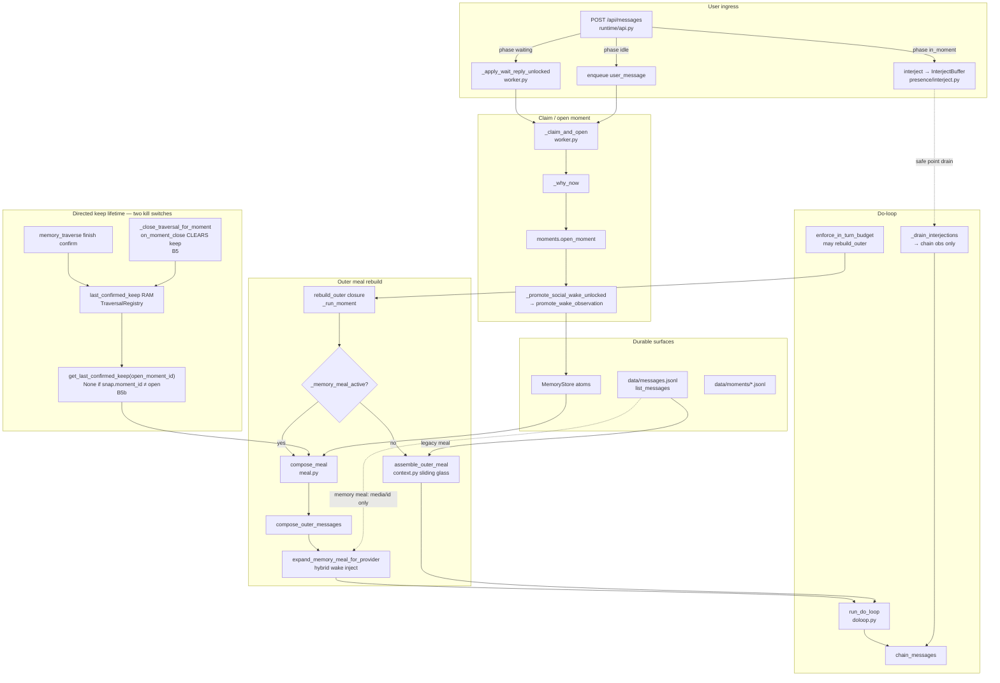
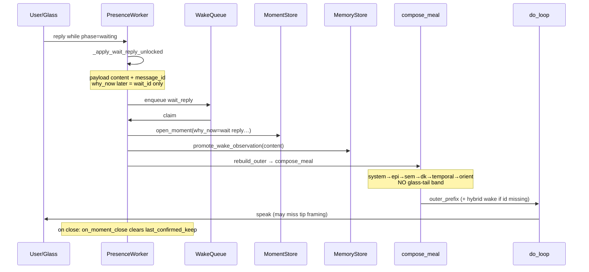
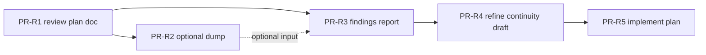

# Design: Meal Formation & Continuity Edge Review Plan (BUG-meal-03 / #93)

| Field | Value |
|-------|--------|
| **Class** | DESIGN |
| **Document** | Executable **review methodology** (inspection + fault isolation; not product implementation) |
| **Product** | project-elyra |
| **Author** | Grok Build (design); execution owner TBD (memory / presence engineer + operator dogfood host) |
| **Date** | 2026-07-30 |
| **Status** | **Draft** |
| **Issue** | [#93](https://github.com/jtwolfe/project-elyra/issues/93) — `BUG-meal-03` |
| **Bug id** | `BUG-meal-03` |
| **Branch** | Content origin: `design/BUG-meal-03-93-instance-continuity`; landed on main via docs PR |
| **Work product (when executed)** | Written **fault report** under `docs/investigations/meal-continuity-review/` that refines the product draft |
| **Product draft refined by report** | [`design-instance-continuity-glass-tail-directed-keep.md`](design-instance-continuity-glass-tail-directed-keep.md) |
| **Repo path for this plan (PR-R1)** | `docs/stretch-2/design-meal-formation-continuity-review-plan.md` |
| **Depends on** | Memory meal active; meal budget fraction shipped (#91); Phase 2a directed_keep channel exists |
| **Related** | #68 wake-02; #92 meal-02 summaries; promotion-discussion §4–5; lance-debug1 inspection pattern |
| **Intent** | Plan a review whose report isolates failure modes (location, nature, severity, fix evaluation) so a **new implementation plan** can resolve them |

---

## Overview

When memory meal is enabled, Project Elyra rebuilds each moment’s outer context as a labeled package (`system → episodic → semantic → directed_keep → temporal → orient`) with **no full sliding glass** and only a hybrid single wake-glass inject for media/id correlation. Glass UI still shows a normal user/assistant chat log. That asymmetry produced the 2026-07-30 dogfood failure: user asked *“what is the coolest thing you remember about rockets?”* on a `wait_reply` path; glass Q→A looked correct, but the model reasoned as if answering an *“Anything else?”* wait-status check and spoke about closed philosophy/fabric threads (moment `e6d460f2-4087-42cd-870f-d34a89b6feaf`). In conversation this class of failure was nicknamed **“missing spaceship”** / tip smash — the same Prince Rupert’s drop metaphor (intact bulb, shattered tip); there is **no second incident artifact** under a “spaceship” name; the named dogfood is this **rockets wait_reply** class.

This design does **not** implement glass-tail or sticky directed keep. It defines an **executable review plan** for engineers/agents: systems inventory, static call-graph checklist, continuity edge matrix, **offline recompose** of historical hops, live dump procedures, a fault-report template, and how findings feed extensions to the existing instance-continuity draft. Execution of *this* plan yields a written report with enough substance to create a follow-on fix plan (S1–S6 in the product draft).

---

## Background & Motivation

### Current state (code law)

| Path | Outer continuity | Tip of dialogue |
|------|------------------|-----------------|
| **Legacy** (`not _memory_meal_active()`) | `assemble_outer_meal`: system → **sliding glass** (roles preserved) → orient | Glass history is the tip |
| **Memory meal** (`memory.enabled` + healthy store) | `compose_meal` / `compose_outer_messages`: labeled host blocks, mostly `role: user` | Open-moment temporal atoms + optional hybrid wake row; **no chat tail band** |

Key entry points:

| Symbol | File | Role |
|--------|------|------|
| `PresenceWorker.rebuild_outer` (nested) | `elyra/presence/worker.py` ~L1976 | Every moment hop (and re-outer): chooses memory vs legacy meal |
| `_memory_meal_active` | `elyra/presence/worker.py` L1382 | Gate for memory outer path |
| `_why_now` | `elyra/presence/worker.py` L178 | Orient frame; `wait_reply` → `wait reply (wait_id=…)` **without user text** |
| `_apply_wait_reply_unlocked` | `elyra/presence/worker.py` L2824 | Marks wait answered; enqueues `wait_reply` with content + message_id |
| `_promote_social_wake_unlocked` / `promote_wake_observation` | `worker.py` L1825; `elyra/memory/promote.py` L972 | Puts wake content as open-moment **observation** atom |
| `compose_meal` / `compose_outer_messages` | `elyra/memory/meal.py` L1499, L1709 | Channel select + render |
| `select_directed_keep` | `elyra/memory/meal.py` L1346 | Packs last confirmed keep-set |
| `select_semantic` / `build_semantic_query_seed` | `elyra/memory/meal.py` L963, L898 | ANN support; seed from open-moment obs/speak/model only |
| `expand_memory_meal_for_provider` / `_inject_hybrid_wake_row` | `elyra/memory/meal.py` L1915, L1816 | Media + **one** glass wake inject if id missing |
| `split_memory_budget_v3` | `elyra/memory/tokens.py` L127 (SoT); **consumer** `meal.py` `compose_meal` | Residual **R** channel caps |
| `effective_meal_budget_tokens` | `elyra/runtime/meal_budget.py` | Fraction × model window (#91) |
| `assemble_outer_meal` | `elyra/loop/context.py` L251 | Legacy glass-centric meal |
| `format_skill_bias` | `elyra/loop/orient_slice.py` L97 | Social wakes → `BIAS_TALK` (L122–123) |
| `_drain_interjections` | `elyra/loop/doloop.py` L615 | Interject → **in-turn chain** (not outer rebuild) |
| `get_last_confirmed_keep` | `elyra/memory/traverse.py` L534 | RAM snap; **returns None if `moment_id` ≠ snap.moment_id** |
| `TraversalRegistry.on_moment_close` | `elyra/memory/traverse.py` L1106 | **Clears** `last_confirmed_keep` + `last_session` at moment end |
| `list_messages` | `elyra/messages.py` L108 | Disk glass (`data/messages.jsonl`) — source of truth for UI and legacy meal |

### Dogfood anchor (Prince Rupert’s drop — tip smashed)

| Surface | Evidence (local dogfood data) |
|---------|-------------------------------|
| **Glass user** | `data/messages.jsonl` id `04f85fc6-195a-4b3c-b0bf-8b307c7baa2f`: *“what is the coolest thing you remember about rockets?”* (2026-07-30T08:47:45Z) |
| **Glass assistant** | id `37ec1721-930d-4045-9d0c-819c3c1c1baf`: *“Not much else hanging — last open threads were the philosophy pack and fabric report, both closed…”* |
| **Moment** | `e6d460f2-4087-42cd-870f-d34a89b6feaf` |
| **why_now** | `wait reply (wait_id=c13ae60a-40ed-45c6-a75a-035c1a78f05c)` — **no rockets text** |
| **Model reasoning (tape)** | *“The user is replying to my wait after I told them the time. The wait prompt was ‘Anything else?’…”* |
| **Path** | `wait_reply` after wait_user social |
| **Wait prompt surface** | Prior moment armed `wait_user` with *“Anything else?”* — lives in **wait state / prior tape / `waits.json`**, **not** as a glass assistant row. Glass before rockets user is the prior **time** speak, then the rockets question. |
| **Naming note** | “Missing spaceship” / Prince Rupert tip smash = **this rockets class**; not a separate incident. |

**Interpretation for review:** Glass holds dialogue shape; outer meal / orient / skill-bias framing did not present a dialogue tip that outranked wait-ceremony priors and episodic “closed work” vibe. Meal budget #91 thickens residual **R**; it does not add a chat channel. Do **not** over-attribute solely to missing glass-tail until offline recompose ranks carriers (temporal obs vs hybrid vs epi mass vs orient/skill_bias).

### Pain points the review must isolate

1. **Missing glass-tail** — memory outer excludes sliding glass by design.
2. **Path asymmetry** — interject rides in-turn chain; wait_reply opens a **new moment** and must reconstitute the world.
3. **Role collapse** — meal items default `role: user` host blocks (`_item_from_parts`); dialogue roles lost even when wake content is in temporal.
4. **why_now without content** — wait_reply orient line is wait-id only (framing attractor even when user text exists elsewhere).
5. **Framing bias** — `format_skill_bias("wait_reply")` → hard social `BIAS_TALK`; wait-ceremony language in orient/reasoning without wait prompt on glass.
6. **Directed keep dual kill switches** — (a) `on_moment_close` wipe; (b) `get_last_confirmed_keep(open_moment_id)` **filters out** keep confirmed under a prior moment_id even if wipe were removed.
7. **Semantic empty_seed / encode lag** — seed from open-moment atoms only; cold encoder / lag leaves channel empty.
8. **In-turn vs outer** — chain compress/re-outer can desync mental model of “what the model saw.”
9. **Restart hydration** — tray/keep RAM-only; glass disk-backed but unused by memory meal tip; `_last_meal_snapshot` process-RAM-only (lost after restart); adjacent thin Lance load (lance-debug1) can starve bulb too.

### Why a dedicated review plan (not jump to implement)

The product draft already sketches glass-tail + sticky keep. Ratios, cut order, dedup winners, and path parity are **provisional** until a structured report confirms which faults are primary vs secondary, and which options have acceptable trade-offs. This mirrors the successful **lance-debug1** inspection-only pattern: isolate → dossier → fix design.

---

## Goals & Non-Goals

### Goals

1. Produce a **written fault report** that for each confirmed/suspected fault documents: location (file/function + call graph), nature, severity, evidence, and evaluated fix options with a recommended direction.
2. Cover the full **continuity path matrix** (wait_reply, interject, timeout, restart, continue, idle social, long tool chain).
3. Distinguish **in-turn chain** failures from **outer meal** failures.
4. Provide enough concrete findings to **extend** `design-instance-continuity-glass-tail-directed-keep.md` (OQ lock, cut order, acceptance tests, directed_keep tray refinements).
5. Optionally add **minimal review scaffolding** (dump scripts / golden meal fixtures) only when static reading cannot close a fault bucket.
6. Keep product code **unchanged** except optional read-only dump helpers behind clearly labeled review utilities.

### Non-Goals

- Implementing glass-tail, sticky tray, or path-parity product fixes in this workstream.
- Re-deriving Phase 1–2a meal math from scratch (use existing `split_memory_budget_v3` in `elyra/memory/tokens.py` / tests as ground truth).
- Fixing SuperGrok pacing, TTS, sources UI, or #92 LLM summaries (adjacent bulb quality only).
- Full Lance load truncation fix (lance-debug1); note as **adjacency** when restart meals look thin.
- Unbounded glass dump into every hop (that is a product non-goal; review may only quantify risk).

---

## Proposed Design — Review Methodology

### Work product of execution

```text
docs/investigations/meal-continuity-review/   # or single report md under stretch-2/
  README.md                 # index + how to re-run
  REPORT.md                 # primary fault report (template § below)
  evidence/                 # dumps, meal snapshots, moment excerpts
  CODE-PATH-MAP.md          # confirmed call graphs (may live inside REPORT)
  EDGE-MATRIX.md            # path × expected tip × observed (may live inside REPORT)
  DRAFT-EXTENSIONS.md       # proposed patches to design-instance-continuity-*.md
```

Single-file report is acceptable if sections are complete; multi-file package preferred when evidence is large (lance-debug1 style).

### Architecture under review (call graph)



### Sequence: wait_reply social (rockets class)



### Sequence: interject (contrast)

```mermaid
sequenceDiagram
  participant U as User
  participant IJ as InterjectBuffer
  participant DL as do_loop chain
  participant Mem as promote_beat obs

  U->>IJ: interject while in_moment
  Note over DL: outer_prefix already fixed this moment
  DL->>IJ: drain at safe point
  IJ->>DL: append user obs to chain
  DL->>Mem: promote interjection beat
  Note over DL: Continuity rides chain;<br/>failure mode = delay, not wrong outer world
```

---

## Scope of systems to inspect

### Must-read code (static analysis primary)

| Area | Paths | Focus |
|------|-------|-------|
| Meal compose | `elyra/memory/meal.py` | `compose_meal`, channel order KD-A8, `_item_from_parts` role default, `select_*`, slide-off, hybrid inject |
| Presence outer | `elyra/presence/worker.py` | `rebuild_outer`, `_memory_meal_active`, `_why_now`, promote social wake, close traversal, meal snapshot |
| Do-loop | `elyra/loop/doloop.py` | `_drain_interjections`, `enforce_in_turn_budget`, re-outer, chain vs outer |
| Legacy meal | `elyra/loop/context.py` | `assemble_outer_meal`, wake protect, glass history roles |
| Promote | `elyra/memory/promote.py` | `promote_wake_observation`, beat promote, control obs filter, encode enqueue side effects |
| Traverse / keep | `elyra/memory/traverse.py` | `get_last_confirmed_keep`, `on_moment_close`, confirm finish |
| Messages / glass | `elyra/messages.py` | `list_messages`, append schema |
| Budget | `elyra/memory/tokens.py` (`split_memory_budget_v3` SoT); `elyra/runtime/meal_budget.py` (fraction × window); `meal.py` consumer | Residual **R** vs tip floors |
| Orient / bias | `elyra/loop/orient_slice.py` (`format_skill_bias`, `BIAS_TALK`); `fill_orient` / `why_now` in worker rebuild | Framing amplifiers on social/wait wakes |
| Glass API | `elyra/runtime/api.py` | `GET /api/memory/context`, atoms, graph session |
| Interject | `elyra/presence/interject.py`, worker `interject` / `_flush_interjects_as_wakes_unlocked` | Buffer + remainder → user_message |
| Tests (contracts) | `tests/test_memory_meal*.py`, `test_interject.py`, `test_presence_worker.py`, `test_loop_context.py`, `test_meal_budget.py` | Golden order, omit reasons, wait overlay |

### Read for context (secondary)

- Product draft: `docs/stretch-2/design-instance-continuity-glass-tail-directed-keep.md`
- Promotion discussion §4–5: `docs/promotion-discussion/README.md`
- Meal composition sketch: `docs/stretch-2/design-context-meal-composition.md`
- Phase 2a keep: `docs/stretch-2/design-phase-2a-implementation.md` (lifetime rules)
- Known bug: `docs/state/known-bugs.md` BUG-meal-03
- Inspection pattern exemplar: `docs/investigations/lance-debug1/design-inspection-plan.md`

### Out of primary review scope

- Encoder GPU stack (BUG-mem-gpu-01) except when semantic empty correlates with encode lag.
- Full Lance `_load` truncation (separate dossier) except restart meal thinness as confounding factor.
- Goals ledger / continuous policy correctness unless it steals social tip (P6 matrix).

---

## Continuity path / edge matrix (must exercise)

Map to product draft §7 (P1–P9). Review **must** fill Observed / Tip OK? for each.

| ID | Path | Entry symbols | Expected tip (invariant) | Failure modes to hunt | Static | Dynamic |
|----|------|---------------|--------------------------|----------------------|--------|---------|
| **P1** | Idle → `user_message` | `enqueue_user_message` → claim → promote → rebuild_outer | **Must:** user answer text in outer with clear social role/shape | Empty temporal if promote fails; epi drowning; B12 bias | ✓ | ✓ |
| **P2** | Waiting → `wait_reply` | `_apply_wait_reply_unlocked` → claim | **Must:** user answer + recent assistant social turns **from glass**. **Nice-to-have:** wait prompt string if it exists only in wait state (not on glass). Failure = wait ceremony / closed-work speak, not missing wait-prompt text alone | **Rockets class**; B1/B3/B4/B7/B11/B12; hybrid only id | ✓ | ✓ **primary** |
| **P3** | Waiting → `wait_timeout` | timers fire → `wait_timeout` | **Must:** recent social glass tip; not ancient work default | #68 adjacency; epi “work” framing; B12 | ✓ | ✓ if live |
| **P4** | `in_moment` → interject | `interject` → `_drain_interjections` | Chain gets user text; outer unchanged | Drain timing; promote double-write; remainder flush | ✓ | ✓ |
| **P5** | ends_moment + wait → later reply | same as P2 after wait arm | Same **must** as P2 across moment boundary | B5 wipe + **B5b** keep scope; no prior speak in new temporal | ✓ | ✓ |
| **P6** | `moment_continue` / `task_ready` | continuous enqueue | Work path must not erase pending social tip | Social vs work priority; orient/skill_bias | ✓ | optional |
| **P7** | Restart mid-wait | process restart → claim wait_reply | Glass from disk; tray load | RAM-only keep; meal no glass; thin Lance; lost meal snapshot | ✓ | ✓ if safe |
| **P8** | Restart idle | next social | Instance memory of last chat | Same as P7 without wait | ✓ | optional |
| **P9** | Long tool moment + chain pressure | `enforce_in_turn_budget` | Outer tip intact; chain may compress | Re-outer without tip; chain drop of early social | ✓ | synthetic test |

**P2 tip split (normative for review scoring):** The rockets failure was **ignoring the user question**, not absence of the *“Anything else?”* wait prompt on glass (that prompt is often only in `wait_user` tool result / `waits.json`). Glass-tail-only still may not surface wait-prompt text — record wait-prompt **surface** per probe (glass vs waits vs prior tape) without treating missing wait-prompt as the primary P2 fail criterion.

### Fault buckets (classify every finding)

| Bucket | Code name | Typical locus | Notes |
|--------|-----------|---------------|-------|
| **B1** | missing_glass_tail | `compose_outer_messages` order; no `list_messages` in memory path | Present-day structural |
| **B2** | path_asymmetry_wait_vs_interject | wait → new moment rebuild; interject → chain | Present-day |
| **B3** | role_collapse | `_item_from_parts(..., role="user")`; `format_atom_line` kind tags not roles | Confirm via offline recompose message roles |
| **B4** | why_now_without_content | `_why_now` wait_reply branch | Content-carrier gap; also feeds **B12** |
| **B5** | directed_keep_moment_end_wipe | `TraversalRegistry.on_moment_close` clears keep | Kill switch #1 |
| **B5b** | directed_keep_meal_wire_moment_scope | `get_last_confirmed_keep(moment_id)` returns None when snap.moment_id ≠ open moment; `rebuild_outer` always passes **current** `moment_id` | Kill switch #2 — sticky keep fails **even if wipe removed** |
| **B6** | semantic_empty_seed_or_lag | `build_semantic_query_seed`; encode queue; `SEMANTIC_OMIT_*` | Present-day |
| **B7** | hybrid_wake_only | `_inject_hybrid_wake_row` single row; no assistant prior | Present-day |
| **B8** | in_turn_vs_outer | `enforce_in_turn_budget` / reouter | Present-day |
| **B9** | restart_hydration | keep RAM; glass unused by memory meal; store load thinness; `_last_meal_snapshot` RAM-only | Present-day |
| **B10** | dual_copy_or_triple | glass + temporal obs + hybrid same message thrice | **Prospective / post-S1** — fix-evaluation risk when glass-tail lands; **not** a present EDGE-MATRIX hunt |
| **B11** | epi_outranks_tip | channel order + token mass; no tip precedence rule in code | Rank via recompose token totals |
| **B12** | framing_bias | `format_skill_bias` → `BIAS_TALK` for `wait_reply`; orient `why_now` wait-id ceremony; wait prompt off-glass but in model priors/reasoning | Prevents over-attribution to B1 alone; compare tail-only vs tail+orient snippet fixes |

---

## Static analysis checklist

Engineers/agents execute in order. Checkboxes are for the **report**, not this design.

### SA-1 — Memory vs legacy outer branch

- [ ] Trace `_memory_meal_active` conditions (`memory.enabled`, store health).
- [ ] Confirm memory path **never** passes full glass into `compose_meal` (worker L2032–2116 vs L2122–2144).
- [ ] Confirm `list_messages(limit=80)` is still loaded in rebuild_outer but used only for `index_glass` / hybrid / media expand on memory path.
- [ ] Document exact message list returned to Completions (roles, labels, order).

### SA-2 — wait_reply content carriers + framing amplifiers

- [ ] Payload fields from `_apply_wait_reply_unlocked` (content, choice, wait_id, message_id).
- [ ] `_why_now("wait_reply")` string shape — prove user text **absent**.
- [ ] `promote_wake_observation` — content → observation atom; `meta.wake_message_id`.
- [ ] `_temporal_items` — packs lines as `[{hhmm}] (observation) …` under **one** user-role host block.
- [ ] Hybrid inject — when meal already has wake id on temporal meta, inject **skipped**; when missing, single glass row before orient.
- [ ] Reconstruct **full orient body** for hop 0: `fill_orient` with `why_now`, goals, **skill_catalog**, **skill_bias** (`format_skill_bias("wait_reply")` → `BIAS_TALK` in `orient_slice.py` L122–123). Capture the skill_bias line text in evidence.
- [ ] Record **wait prompt surface**: glass assistant rows vs `data/wakes/waits.json` / prior moment `wait_user` tool result / tape. Note when prompt is *not* on glass (rockets class).
- [ ] Conclude which carrier(s) hold the rockets question for hop 0; whether **prior glass assistant social turns** are present; whether wait-prompt text is present anywhere in outer; whether orient/skill_bias alone could attract wait-ceremony speak (**B12**).
- [ ] For fix evaluation: compare options **tail-only** vs **tail + why_now user snippet** vs **tail + wait-setup band** (product OQ7) — do not assume B1 alone is sufficient without B12 evidence.

### SA-3 — Role and dialogue shape

- [ ] Count how many outer messages use true `assistant` role under memory meal (expect: 0 for channel items; only system + host user blocks + orient).
- [ ] Compare to legacy `_glass_to_history` (user/assistant preserved).
- [ ] Evaluate “role collapse” severity via **offline recompose** (SA-9b): even with wake obs present, model may not see dialogue Q→A structure.

### SA-4 — Directed keep lifetime (two kill switches)

- [ ] Confirm `get_last_confirmed_keep` is process RAM (`TraversalRegistry`).
- [ ] **B5 wipe:** Confirm `on_moment_close` clears keep (traverse.py L1106–1120) and worker calls it on finalize via `_close_traversal_for_moment` (~L2248–2249). Also clears `last_session` (glass KD-A19 — separate policy).
- [ ] **B5b meal-wire scope:** With a confirmed keep whose `snap.moment_id == A`, call `get_last_confirmed_keep(moment_id=B)` and document **`None`** when `B ≠ A` (traverse.py L534–541: `snap.moment_id not in (None, moment_id)`).
- [ ] Trace `rebuild_outer` always passes the **open** `moment_id` into `_last_confirmed_keep_for_meal` (~L2074–2076) — so keep confirmed in moment A never packs into moment B even **before** wipe if filter alone runs mid-lifetime; after wipe both are gone.
- [ ] Confirm meal only reads **confirmed** keep (not provisional active walk).
- [ ] Note flags: `directed_keep_enabled` / `directed_traversal_enabled` activation (tests OQ-A1).
- [ ] Map to product draft Part B: DRAFT-EXTENSIONS must require **both** stop wipe **and** instance-tray compose **without** requiring `snap.moment_id == open moment`.

### SA-5 — Semantic seed & lag

- [ ] `build_semantic_query_seed` kinds (`_SEMANTIC_SEED_KINDS`) — open moment only.
- [ ] Fail-fast paths: `empty_seed`, `encoder`, `no_index`, timeout omit reasons.
- [ ] KD12: rebuild_outer must not cold-load embedder — verify warm-only path.
- [ ] Encode lag: new observations not ready for ANN until idle encode — quantify with queue status if live.

### SA-6 — Interject path

- [ ] Chain append text at `_drain_interjections`.
- [ ] Outer not rebuilt solely for interject.
- [ ] Leftover flush `_flush_interjects_as_wakes_unlocked` → `user_message` after close (new moment path = P1).
- [ ] Why interject “never” fails rockets-class (outer already holds prior tip for that moment — or doesn’t, if moment opened without tip).

### SA-7 — Budget / pressure cut order

- [ ] Document `split_memory_budget_v3` (`elyra/memory/tokens.py`) residual shares (semantic / keep / epi / temporal floor); note meal.py as consumer only.
- [ ] Under pressure: supports cut before temporal; **no** glass-tail floor exists today.
- [ ] Meal fraction #91 (`runtime/meal_budget.py`): larger R does not create tip channel (confirm with inspect token totals).

### SA-8 — Existing tests vs gap

- [ ] List tests that lock channel order and omit reasons (`test_memory_meal*.py`).
- [ ] Confirm **absence** of wait_reply glass-tail / rockets-class integration test.
- [ ] Note presence of directed_keep moment-end clear tests vs sticky tray absence; note any test of moment_id filter on `get_last_confirmed_keep`.

### SA-9 — Dogfood moment forensics (offline tape / glass)

- [ ] Read `data/moments/e6d460f2-4087-42cd-870f-d34a89b6feaf.jsonl` + index row.
- [ ] Correlate glass ids `04f85fc6-…` / `37ec1721-…` with wake payload if present in `data/wakes/events.jsonl`.
- [ ] Prior wait chain: locate prior moment time speak + `wait_user` prompt *“Anything else?”* (e.g. prior moment / waits.json) — not a glass wait-prompt row.
- [ ] If atoms exist for that moment, dump observation content vs speak.
- [ ] Record: reasoning invents wait-ceremony framing and never addresses rockets → tip / framing failure (behavioral).

### SA-9b — Offline recompose of historical hop (mandatory for rockets class)

`PresenceWorker._last_meal_snapshot` is **process-RAM-only** and cleared on reset/restart. After restart, `GET /api/memory/context` **cannot** recover the outer meal hop 0 of `e6d460f2` actually saw. `?compose=1` rebuilds for the **current** open moment with empty system/orient — **not** a historical Completions frame.

**Live snapshot is preferred when warm, but not required** for high confidence on B1/B3/B4/B7/B11/B12 when **offline recompose + tape** agree.

#### Procedure (WP2 primary)

Given `moment_id` (e.g. `e6d460f2-…`):

1. **Inputs from disk**
   - Moment index: `why_now`, `wake_id`, `user_id`, timestamps.
   - Wake payload (events / queue history if available): `content`, `message_id`, `wait_id`.
   - Glass window: `list_messages` rows around `created_at` (user rockets + prior assistant social turns).
   - Open-moment atoms: store `list_by_moment(moment_id)` if loadable; else reconstruct minimal observation atom from wake content + `wake_message_id` meta for hermetic compose.
   - Wait record: prompt text from `waits.json` / prior tape (for B12 surface map; may not enter recompose unless testing wait-setup band options).
2. **Rebuild fixed texts**
   - `system_text = load_prompt("system")`.
   - `orient_text = fill_orient(orient_template, why_now=<index why_now>, skill_bias=format_skill_bias("wait_reply", …), …)` — use same helpers as product when feasible; stub goals/self if unavailable but **do not omit skill_bias**.
3. **Compose**
   - `package = compose_meal(store, open_moment_id=moment_id, budget_tokens=<effective or 50k/250k as configured>, system_text=…, orient_text=…, settings=…, directed_keep_ids=…)`
   - `messages = compose_outer_messages(..., package=package)`
   - Optionally `expand_memory_meal_for_provider(messages, glass_by_id=index_glass(glass), wake_message_id=…)` to rank hybrid inject.
4. **Capture (lance-debug1-style evidence JSON)** under `meal-continuity-review/evidence/<run_id>/`
   - Channel order, `channel_token_totals`, omit reasons.
   - Per-message: role, label/header prefix, content length, whether rockets substring present, whether prior assistant glass text present.
   - Flags: `hybrid_injected`, `wake_id_in_meal`, `assistant_role_count`.
   - Orient excerpt: why_now + skill_bias lines.
5. **Rank tip carriers** for the report: temporal obs line only / hybrid glass user row / missing prior speak / epi mass / orient ceremony (B12). Do **not** stop WP2 at tape-only forensics.

#### Confidence gates (KD-R4)

| Claim | Minimum evidence |
|-------|------------------|
| Structural B1 (no glass band in memory path) | Static SA-1 |
| Structural B4 (why_now lacks user text) | Static SA-2 + index `why_now` |
| Effective tip missing / role-collapsed (B3/B7/B11) for rockets | **Offline recompose** + tape speak/reasoning |
| Framing attractor (B12) | Recompose orient/skill_bias + tape reasoning + wait-prompt surface map |
| End-to-end speak still wrong under current code | Live **E-P2** (preferred; not a blocker for structural locks) |

---

## Dynamic / dogfood experiments

**When:** live instance with memory meal on; operator available. Prefer **read-only** observation + controlled social probes; do not ship product code.

### Safety

| Rule | Detail |
|------|--------|
| Prefer non-destructive probes | New waits / messages only; no store wipe |
| Snapshot before restart tests | Copy `data/messages.jsonl`, moment tape, meal snapshot JSON **while process still warm** (`source: rebuild_outer`) |
| Lance adjacency | If atom_count looks ~10 after restart, open lance-debug1 dossier — do not attribute solely to glass-tail |
| Rate / cost | Meal budget may be 50% window (#91); use short probes |

### Exp catalog

| Exp | Procedure | Pass / fail signal | Evidence capture |
|-----|-----------|--------------------|------------------|
| **E-P2 rockets** | Arm wait_user → user asks off-topic factual recall | Speak addresses **must-have** tip (question), not wait ceremony / closed-work status | moment id, reasoning, **warm** meal snapshot, glass ids, wait-prompt surface |
| **E-P2 dual** | Wait after substantive assistant speak; user continues topic | Tip includes prior glass assistant + user | same |
| **E-P1 baseline** | Idle user_message short question | Temporal/hybrid carries question | meal channels |
| **E-P4 interject** | During tool moment, interject question | Chain shows text; answer or defer coherently | chain dump if available; tape obs |
| **E-P5 bridge** | Speak → wait → later reply | Continuity across moment ids | two moment tapes + meals; keep B5/B5b |
| **E-P7 restart** | Mid-wait restart process; reply | First hop still has tip from disk glass | before/after; note lost snapshot; offline recompose fallback |
| **E-sem lag** | Immediately after speak, force compose with semantic on | `semantic_omitted_reason` / empty vs later hop | context API meta |
| **E-keep wipe** | Confirm directed keep → end moment → new moment compose | Channel empty (documents **B5**); also probe mid-lifetime foreign moment_id → None (**B5b**) | graph session + meal directed_keep meta |
| **E-legacy parity** | See toggle procedure below | Sliding glass tip works as control | control group meal roles |

### E-legacy parity — exact toggle path

There is **no** glass runtime API to flip `memory.enabled` mid-process (unlike `meal_budget` PATCH). Gate is `settings.memory.enabled` + healthy store at `rebuild_outer` (`_memory_meal_active`).

| Method | How | When to use |
|--------|-----|-------------|
| **A. Config + process restart** | Set `memory.enabled = false` in `elyra.toml` (or env/settings load path used by the host), **restart** presence worker / process, run one short social hop, capture meal/roles, restore `true` + restart | Full integration control |
| **B. Hermetic unit compose (preferred for review CI)** | Same fixture atoms/glass as memory-on recompose; call `assemble_outer_meal(glass_history=…)` without store meal path; compare roles + tip | No host restart; schedule anytime after memory-on evidence is captured |
| **C. Do not** | Assume a hot reload of `memory.enabled` without restart unless operator documents a supported path | Flaky control group |

**Scheduling:** Capture memory-on failure evidence **first** (warm snapshot or offline recompose). Only then run Method A if needed; Method B is enough for most report control-group claims.

### Synthetic unit experiments (no live instance)

Prefer extending **hermetic tests** later; for review, a **read-only fixture script** (PR-R2 / WP4) should support SA-9b:

1. Build store with open-moment wake obs only + rich episodic summaries about philosophy/fabric.
2. Call `compose_meal` + `compose_outer_messages` with wait-shaped orient **including skill_bias**.
3. Optionally hybrid expand with glass_by_id.
4. Assert (for the report, not necessarily commit): no assistant role for prior speak; rockets text only as labeled observation line if seeded; no glass-tail; orient contains wait-id why_now + BIAS_TALK.

---

## How to dump / inspect meals

### Live APIs

| Endpoint | Use | Limits (do not misuse) |
|----------|-----|------------------------|
| `GET /api/memory/context` | **Primary live capture** when snapshot still warm: last compose with `source: rebuild_outer` — channels, token totals, omit reasons | Cleared on process restart / reset; **not** historical e6d460f2 after restart |
| `GET /api/memory/context?compose=1` | **Channels / token / omit for current open moment only** (on-demand recompose) | Uses **empty** system/orient fixed cost; binds directed_keep to **current** open moment; does **not** replay full `rebuild_outer` glass indexing / hybrid wake inject the same way as a live social hop. **Forbidden as sole evidence for P2 rockets.** |
| `GET /api/memory` | Flags, store health, `has_last_meal` | |
| `GET /api/memory/atoms?moment_id=` | Temporal spine contents | |
| `GET /api/memory/graph/session` | last_session / keep presence (KD-A19) | Keep may be empty post-close |
| `GET /api/status` | phase, pending wait, memory block | |

**Evidence priority for P2:** (1) warm `source: rebuild_outer` snapshot immediately after hop, else (2) **offline recompose SA-9b**, else (3) tape + glass forensics only (behavioral, not message-frame complete). Never (compose=1 alone).

Worker helpers:

- `PresenceWorker.last_meal_snapshot()` — RAM copy of last inspect payload; **not durable**.
- `_record_last_meal_snapshot` via `meal_package_to_inspect` (`elyra/memory/inspect.py`).

### On-disk forensics

| Artifact | Path | What to extract |
|----------|------|-----------------|
| Glass | `data/messages.jsonl` | User/assistant roles, ids, timestamps |
| Moment tape | `data/moments/{id}.jsonl` | model reasoning, speak, tools, stop |
| Moment index | `data/moments/index.jsonl` | `why_now`, wake_id, hop_count |
| Waits | `data/wakes/waits.json`, `events.jsonl` | wait_id, **prompt text**, linkage |
| Atoms | store / glass atoms API | observation text, wake_message_id meta |
| Runtime | `data/runtime/meal_budget.json`, `semantic_wait.json` | budget fraction, wait-for-select |

### Minimal dump procedure (operator)

```bash
# After a failing social hop (while snapshot still warm) — PRIMARY live path:
curl -sS "$BASE/api/memory/context" | jq '{source, channels: .meal.channels_present,
  tokens: .meal.channel_token_totals,
  sem: .meal.semantic_omitted_reason,
  dk: .meal.directed_keep_omitted_reason,
  items: [.meal.items[]? | {channel, label, role, n: (.content|length)}]}'
# Expect source == "rebuild_outer" (or equivalent last-compose). Do not rely on ?compose=1 here.

# Correlate glass tip:
tail -n 20 data/messages.jsonl | jq -c '{id, role, content: .content[0:120], moment_id}'

# Moment reasoning:
jq -c 'select(.type=="model") | {hop, reasoning: .reasoning[0:200], content: .content[0:80]}' \
  data/moments/<moment_id>.jsonl

# Wait prompt surface (often NOT on glass):
jq '.' data/wakes/waits.json | head
```

### Offline recompose evidence packaging

Mirror `docs/investigations/lance-debug1/evidence/` discipline:

```text
docs/investigations/meal-continuity-review/evidence/<run_id>/
  meta.json          # moment_id, glass ids, budget, flags, git sha, timestamp
  recompose_meal.json  # package inspect + message role/label summary
  tape_excerpt.jsonl
  glass_window.jsonl
  notes.md           # carrier ranking narrative
```

### What a “well-formed tip” looks like in dumps (review criteria)

| Check | Fail example (rockets) | Pass direction |
|-------|------------------------|----------------|
| User question text in outer | Only in glass JSONL / weak obs line drowned by framing | In glass-tail and/or temporal with clear dialogue shape (**must**) |
| Prior assistant **glass** social turns | Missing from outer | Recent assistant rows near tip (**must** when they exist on glass) |
| Wait prompt string | Only in waits.json; reasoning still invents ceremony | **Nice-to-have** in outer; not P2 fail alone if user Q answered |
| Orient why_now / skill_bias | Wait-id + BIAS_TALK dominate interpretation | Optional user snippet (OQ7); tail remains SoT; measure B12 |
| Roles | All host `user` blocks | Glass-tail retains user/assistant |
| Token mass | Large epi, thin tip | Tip floor protected under pressure |

---

## Fault report template (required structure)

Each fault in the report **must** use this shape:

```markdown
### F-NN — short title

| Field | Value |
|-------|-------|
| **Bucket** | B1–B12 (incl. B5b; B10 only if post-S1 fix eval) |
| **Severity** | S0 blocker / S1 high dogfood / S2 medium / S3 low polish |
| **Path(s)** | P2, P5, … |
| **Location** | `file.py` `function` (approx lines); callers |
| **Call graph** | short bullet path from wake → Completions |
| **Nature** | precise mechanism (not symptoms alone) |
| **Evidence** | moment id, glass ids, meal snapshot excerpt, test gap |
| **Confidence** | confirmed / likely / hypothesis |
| **Impact** | user-visible + system |
| **Related draft §** | e.g. draft §5 glass-tail, §6 keep, §7 P2 |

#### Fix evaluation

| Option | Description | Pros | Cons | Effort |
|--------|-------------|------|------|--------|
| A | … | … | … | S/M/L |
| B | … | … | … | … |

**Recommended:** …  
**Maps to draft extension:** … (new acceptance, OQ lock, cut order change, …)
```

### Report top-level sections (mandatory)

1. **Executive summary** — primary fault chain for rockets dogfood (1 page).
2. **CODE-PATH-MAP** — confirmed graphs (memory outer, wait_reply, interject, keep clear).
3. **EDGE-MATRIX results** — table P1–P9 filled.
4. **Faults F-01…** — template above; order by severity.
5. **Fix portfolio** — recommended package ordering (tip before sticky keep, matching draft S1 before S3).
6. **DRAFT-EXTENSIONS** — concrete proposed edits to `design-instance-continuity-glass-tail-directed-keep.md` (see next section).
7. **Open questions resolved / remaining** — lock OQ1–OQ8 where evidence allows.
8. **Adjacencies** — #68, #92, lance-debug1, encode lag.
9. **Appendix** — raw dumps, commands, environment flags.

---

## Mapping findings → extend the continuity draft

The review does **not** re-implement glass-tail in product code. The report’s **DRAFT-EXTENSIONS** section must propose concrete refinements to:

`docs/stretch-2/design-instance-continuity-glass-tail-directed-keep.md`

### Extension checklist (report authors)

| Draft area | Review must answer | Example refinement |
|------------|--------------------|--------------------|
| §5 Glass-tail placement | Confirm order vs temporal/orient from role/label evidence | Keep `… → glass_tail → temporal → orient` or swap if temporal already holds wake |
| §5.3 Path rules | Prove P2 **must-have** tip = glass social turns + user answer; wait prompt nice-to-have | Normative “min tip set” for wait_reply; record wait-prompt surface |
| §5.4 Cut order | Measure token mass epi vs tip on dogfood recompose | “Never cut glass-tail below floor” as hard law with numbers |
| §5.5 Acceptance | Turn E-P2 + SA-9b into testable acceptance | Golden meal fixture + integration test names |
| §6 Sticky keep | Confirm **B5 + B5b** + RAM-only | Persist tray; stop wipe; **compose without moment_id equality filter** |
| §6.4 Semantic interaction | empty_seed when tip only on glass | Seed from glass-tail last user (OQ8 → lock) |
| §7 Path matrix | Fill Observed; must vs nice tip columns | Become acceptance suite index |
| §8 Soft recall nudge | Confirm not primary fix (A5) | Ship only after bands |
| §10 OQs | Evidence notes at least for **OQ4, OQ6, OQ7** (and others if data) | Mark locked with report citation |
| §9 S0–S6 | Reorder only if review finds tip not primary | Prefer keep S1 before S3; B12 may add orient dual-write to S2 |
| **New:** directed_keep extensions | wipe + meal-wire scope + merge/replace + TTL | Propose tray schema deltas, inspect API fields |
| **New:** framing | Is glass-tail alone enough vs tail+orient snippet? | Fix-evaluation table for rockets |

### Recommended draft extensions for **directed_keep** specifically

Report should evaluate and recommend text for:

1. **Stop moment-end wipe** of meal-relevant tray (today: `on_moment_close` clears `last_confirmed_keep`); optionally retain glass `last_session` clear policy separately (KD-A19).
2. **Persist tray** under `data/runtime/` (or memory meta) with `confirmed_at` / `last_reinforced_at`.
3. **Host TTL/LRU** (draft: 3h soft / ≤24h hard) — confirm no skill-only enforcement.
4. **Meal wire (B5b):** compose reads **instance tray** and must **not** require `snap.moment_id == open_moment_id`. Today `get_last_confirmed_keep(moment_id)` + `rebuild_outer` passing current moment_id is a second kill switch; removing wipe alone is insufficient.
5. **Merge vs replace** on finish confirm (OQ5).
6. **Inspect**: `/api/memory/context` and graph session show tray age + token use + entry moment_ids.
7. **Interaction with glass-tail**: keep must not substitute for tip; under pressure age-soft keep before tip floor.

Do **not** invent large graph UX rewrites; defer S6 unless review proves tray unusable without it.

---

## Work packages for the review itself

| WP | Deliverable | Type | Effort (guess) | Owner skill |
|----|-------------|------|----------------|-------------|
| **WP0** | Land this review-plan design at `docs/stretch-2/design-meal-formation-continuity-review-plan.md` | Doc PR | 0.5 d | any |
| **WP1** | Static SA-1…SA-9 + CODE-PATH-MAP (incl. B5b, B12) | Analysis | 1–1.5 d | presence + memory |
| **WP2** | Offline dogfood: tape/glass forensics **+ SA-9b recompose** for e6d460f2; evidence JSON | Analysis | 1–2 d | memory eng + data |
| **WP3** | Live Exp matrix E-P* (if instance available); warm snapshot capture | Dogfood | 0.5–1 d | operator |
| **WP4** | Optional read-only dump / offline recompose helper | Small util | 0.5–1 d | engineer |
| **WP5** | Assemble REPORT.md + DRAFT-EXTENSIONS (PR-R3 exit criteria) | Doc | 1 d | architect |
| **WP6** | Patch product continuity draft from extensions | Doc | 0.5 d | design owner |
| **WP7** | Open follow-on implement plan / issues | Process | 0.5 d | PM + eng |

**Rough total:** ~5–8 person-days for full report without WP4; +0.5–1 d if dump helper justified.

WP4 is **optional** for landing, but SA-9b itself is **mandatory** (can be a one-off notebook/script in evidence/, not necessarily a merged tool).

### Optional review harness (if justified)

| Utility | Behavior | Must not |
|---------|----------|----------|
| `scripts/meal_continuity_dump.py` (or under `meal-continuity-review/scripts/`) | Given moment_id: glass window, why_now, atoms, **offline recompose** summary (SA-9b), optional warm snapshot if attached | Mutate store; call Completions |
| Hermetic fixture in tests (later implement plan) | Build meal with epi bulk + thin wake obs + skill_bias orient | Land as product default |

Reuse patterns from `docs/investigations/lance-debug1/scripts/` for evidence packaging discipline.

---

## Alternatives Considered

### A1 — Skip review; implement draft S1 immediately

| Pros | Cons |
|------|------|
| Faster ship of glass-tail | May mis-order dedup, cut %, why_now dual-write; sticky keep still wrong; incomplete path tests |
| Matches known symptom | Risk of thrash if hybrid + temporal + glass-tail triple content |

**Reject for primary path:** draft itself requires S0 review report before ratios are law.

### A2 — Review only via new integration tests without dogfood forensics

| Pros | Cons |
|------|------|
| Repeatable CI | May miss production framing (orient bias, skill talk, real epi mass) |
| No live cost | Harder to prove rockets-class without realistic meal fill |

**Accept as complement**, not sole method. Static + dogfood + tests together.

### A3 — Expand meal budget further instead of tip channel

| Pros | Cons |
|------|------|
| Cheap config | **Already tried direction (#91)**; larger bulb, same missing tip |
| | Explicit non-fix for chat-amnesia per promotion §4.6 |

**Reject** as primary fix; review may still measure budget interaction.

### A4 — Promote every glass row to atoms instead of glass-tail band

| Pros | Cons |
|------|------|
| Single spine mental model | Role collapse remains if still host user blocks; encode lag; cost; doesn’t restore assistant role turns |
| | Draft prefers glass-tail for dialogue fidelity |

**Evaluate in report** as Option B (promotion §4.6) but expect glass-tail recommended for tip fidelity.

### A5 — Prompt-only soft recall nudge without bands

| Pros | Cons |
|------|------|
| Cheap orient/skill copy tweak | Does not restore dialogue tip, roles, or sticky keep; papers over missing channels |
| Aligns with product draft §8 soft line | Model already has `BIAS_TALK` / wait-ceremony priors (**B12**); more prompt text may not outrank epi mass |

**Reject as primary / S1.** Optional **after** glass-tail + keep bands exist (matches product draft §8: “Ship as copy tweak after bands exist so we don’t prompt-paper over missing channels”).

---

## Security & Privacy Considerations

| Concern | Review impact |
|---------|----------------|
| Meal dumps | May contain user chat PII — store under local `docs/…/evidence/` or operator-only paths; scrub before public PR if needed |
| Read-only APIs | Prefer GET inspect; no new write endpoints in review |
| Restart tests | May interrupt waits — coordinate with operator |
| Store health probes | Do not run destructive Lance rewrite tools during this review |
| Report publication | Redact secrets; moment ids OK |

Threat model for **product** fixes is deferred to the implement plan; review must not weaken auth on glass APIs.

---

## Observability

### During review

- Capture `semantic_omitted_reason`, `directed_keep_omitted_reason`, channel token totals from inspect.
- Log lines: `memory meal rebuild failed; falling back to glass meal` (exception path).
- Moment tape `reasoning` is primary **behavioral** signal of tip loss.

### Recommended metrics for later implement plan (note only)

| Metric | Purpose |
|--------|---------|
| `meal.glass_tail.tokens` / `present` | Tip always on for social wakes |
| `meal.tip_floor_violations` | Cut order bugs |
| `meal.directed_keep.age_s` / `wiped_on_close` | Sticky tray health |
| `meal.social_wake.missing_user_text` | Promote/hybrid failure rate |

---

## Rollout Plan (for this review workstream)

| Stage | Action | Rollback |
|-------|--------|----------|
| 1 | Merge review-plan doc to design branch / main docs | Revert doc PR |
| 2 | Execute static + offline forensics | N/A (read-only) |
| 3 | Optional live experiments | Stop probes; no code change |
| 4 | Land findings report + draft extensions | Revert doc PRs |
| 5 | Hand off to implement plan (separate design/execute) | Product flags remain as today |

No feature flags required for review. Product glass-tail ship later should use flags per product draft.

---

## Open Questions (review process)

| ID | Question | Default |
|----|----------|---------|
| RQ1 | Single REPORT.md vs lance-debug1 multi-file package? | Multi-file if evidence > ~50KB else single |
| RQ2 | Must live E-P2 run before draft OQ lock? | Prefer live for end-to-end speak; **not required** for structural B1/B4. Offline recompose + tape required before locking effective tip / B3/B7/B11/B12 for rockets. OQ lock for implement plan: see PR-R3 exit criteria |
| RQ3 | Include synthetic hermetic meal fixture / dump helper in review PR? | Optional WP4; SA-9b evidence can be one-off under evidence/ |
| RQ4 | Should report file GitHub #93 comments incrementally? | Yes, summary per WP |

Product OQs OQ1–OQ8 remain owned by the continuity draft; report locks them with evidence.

---

## Key Decisions

| Decision | Choice | Rationale |
|----------|--------|-----------|
| **KD-R1** | This design is **inspection/review only**, not product glass-tail implementation | Matches issue process and product draft §12 step 3; avoids premature ratio lock-in |
| **KD-R2** | Primary dogfood class is **P2 wait_reply social** (rockets / e6d460f2); “missing spaceship” is the same tip-smash class | Highest severity tip smash; glass correct, outer wrong; no separate spaceship artifact |
| **KD-R3** | Fault taxonomy uses buckets **B1–B12** (incl. **B5b**, **B12**; **B10** prospective) and path matrix **P1–P9** | Aligns report with product draft §7; captures keep dual kill switches + framing amplifiers |
| **KD-R4** | Static locks **structural** B1/B4; **offline recompose + tape** required to lock effective tip missing / role-collapse / epi mass / framing (B3/B7/B11/B12) for rockets-class; live **E-P2** for end-to-end speak behavior (preferred, not sole gate) | Avoid mechanism-correct but impact-chain-incomplete reports when snapshot is gone |
| **KD-R5** | Interject vs wait asymmetry is a **first-class** analysis object, not anecdote | Different code paths (chain vs outer rebuild); explains “interject never fails this way” |
| **KD-R6** | Directed keep review prioritizes **wipe (B5) + meal-wire moment scope (B5b) + RAM tray** over graph UX | Stopping wipe alone leaves keep non-sticky across moments via `get_last_confirmed_keep(open_id)` filter |
| **KD-R7** | Report must include **fix evaluation tables** and **DRAFT-EXTENSIONS** for the continuity design | Enables next implement plan without re-discovering mechanisms |
| **KD-R8** | Optional harness is **read-only dumps / recompose** only; no production meal behavior change in review PRs | Keep review mergeable and low-risk |
| **KD-R9** | Tip-before-keep ordering retained (draft S1 before S3) unless report proves otherwise; framing dual-write evaluated in S2 options | Dogfood is tip/framing failure, not missing keep |
| **KD-R10** | Legacy memory-off path is **control group**, never regress target; toggle via config+restart or hermetic `assemble_outer_meal` | No hot `memory.enabled` API; `assemble_outer_meal` remains glass-centric law when meal inactive |
| **KD-R11** | P2 tip **must-have** = user answer + recent glass assistant social turns; wait prompt is **nice-to-have** when only in wait state | Rockets failure was ignored user Q, not missing wait-prompt on glass |

---

## PR Plan

Because this workstream produces a **report** (not a product feature ship), PRs are documentation-first and optionally tiny dump utilities.

### PR-R1 — Land meal continuity review plan

| Field | Value |
|-------|--------|
| **Title** | `docs: meal formation & continuity edge review plan (BUG-meal-03)` |
| **Files** | **`docs/stretch-2/design-meal-formation-continuity-review-plan.md`** (this document); link from `docs/stretch-2/design-instance-continuity-glass-tail-directed-keep.md` §12; optional link from `docs/state/known-bugs.md` BUG-meal-03; `docs/state/memory/README.md` index entry |
| **Dependencies** | None |
| **Effort** | ~0.5 person-day |
| **Description** | Merge the executable review methodology. No product code. Update continuity draft “Next process step” to point at this plan. |

### PR-R2 — Optional read-only dump / offline recompose helper (only if WP4 justified)

| Field | Value |
|-------|--------|
| **Title** | `tools: read-only meal continuity dump for review` |
| **Files** | e.g. `scripts/meal_continuity_dump.py` or `docs/investigations/meal-continuity-review/scripts/…`; small unit test with tmp paths if needed |
| **Dependencies** | PR-R1 |
| **Effort** | ~0.5–1 person-day |
| **Description** | CLI: given paths/moment_id, print glass window, why_now, open-moment atoms summary, **SA-9b offline recompose** summary, last meal snapshot if process-attached. **Must not** mutate memory or call LLM. Skip this PR if one-off evidence scripts under `evidence/` suffice. |

### PR-R3 — Findings report package

| Field | Value |
|-------|--------|
| **Title** | `docs: meal continuity review report (BUG-meal-03 findings)` |
| **Files** | `docs/investigations/meal-continuity-review/REPORT.md` (+ evidence/, CODE-PATH-MAP, EDGE-MATRIX as needed); redact PII if publishing |
| **Dependencies** | PR-R1; WP1–WP2 mandatory; WP3 if host available |
| **Effort** | ~1 person-day assembly after WP1–WP3 |
| **Exit criteria (report complete enough to lock OQs / open PR-R4)** | See below |
| **Description** | Land the filled fault report per template: locations, natures, severities, fix evaluations, edge matrix results. Cite real symbols and dogfood ids. No product meal behavior change. |

#### PR-R3 acceptance / exit criteria

Report may merge and unlock continuity-draft OQ locking only if **all** of:

1. **EDGE-MATRIX** filled for **P1, P2, P4, P5** at least via **static** analysis (observed mechanism + expected tip must/nice columns).
2. **P2 offline recompose (SA-9b)** + tape/glass forensics for rockets class (or a new equivalent live failure with warm snapshot) — carrier ranking present.
3. **Live E-P2** if dogfood host available; if not, document “live skipped” and do **not** claim end-to-end speak verification.
4. **DRAFT-EXTENSIONS** covering: glass-tail order/placement; directed_keep **wipe (B5) + meal-wire scope (B5b)**; evidence notes for at least **OQ4, OQ6, OQ7** (and OQ8 if semantic data collected).
5. Faults classified with B-buckets; rockets fix-evaluation includes **tail-only vs tail+orient snippet** (B12), not B1 alone.
6. B10 only discussed as post-S1 risk unless a present triple is proven.

### PR-R4 — Extend instance continuity draft from findings

| Field | Value |
|-------|--------|
| **Title** | `docs: refine glass-tail + sticky keep draft from continuity review` |
| **Files** | `docs/stretch-2/design-instance-continuity-glass-tail-directed-keep.md` (status → Ready for implement plan; lock OQs; acceptance; cut order; directed_keep tray deltas incl. B5b); `docs/state/known-bugs.md` status note; promotion-discussion pointer if needed |
| **Dependencies** | PR-R3 (exit criteria met) |
| **Effort** | ~0.5 person-day |
| **Description** | Apply DRAFT-EXTENSIONS from the report. Explicitly improve directed_keep section (persist, TTL/LRU, stop moment-end wipe, **instance tray without moment_id filter**, inspect). Do **not** implement runtime tray yet — document only. |

### PR-R5 — Follow-on implement plan issue/PR (process)

| Field | Value |
|-------|--------|
| **Title** | `docs: implement plan for instance continuity (glass-tail + sticky keep)` **or** GitHub issue checklist linking S1–S6 |
| **Files** | New implement design or execute-plan under `docs/stretch-2/`; GitHub #93 update |
| **Dependencies** | PR-R4 |
| **Effort** | ~1 person-day plan authoring |
| **Description** | Convert refined draft into ordered product PRs (glass-tail select/pack; path tests P2/P5/P7; sticky tray; etc.). Out of scope for *this* review design’s code changes; tracked so review handoff is complete. |

### PR dependency graph



---

## Risks

| Risk | Severity | Mitigation |
|------|----------|------------|
| Review expands into product rewrite | High | Enforce KD-R1; PR plan forbids meal behavior changes until PR-R5 |
| Live dogfood unavailable | Medium | Offline e6d460f2 + static SA + **SA-9b recompose** + hermetic fixtures |
| Historical meal snapshot gone after restart | High | SA-9b mandatory; do not treat `?compose=1` as historical frame |
| Confounding thin Lance load | Medium | Cross-check atom_count; defer to lance-debug1 if thin |
| Over-attribution to B1 / why_now only | Medium | Require recompose carrier ranking + **B12** framing; fix tables compare tail vs tail+orient |
| Keep sticky design only removes wipe (B5) | High | SA-4 / B5b / DRAFT-EXTENSIONS require instance tray without moment_id filter |
| Report too vague for implement plan | High | Enforce fault template + PR-R3 exit criteria + draft extensions |
| PII in evidence | Medium | Scrub before public merge |
| Flaky E-legacy control | Low | Config+restart only, or hermetic `assemble_outer_meal` (KD-R10) |

---

## References

- Product draft: `docs/stretch-2/design-instance-continuity-glass-tail-directed-keep.md`
- Meal composition: `docs/stretch-2/design-context-meal-composition.md`
- Promotion discussion §4–5: `docs/promotion-discussion/README.md`
- Known bugs BUG-meal-03: `docs/state/known-bugs.md`
- Inspection pattern: `docs/investigations/lance-debug1/design-inspection-plan.md`
- Phase 2a: `docs/stretch-2/design-phase-2a-implementation.md`
- Code: `elyra/memory/meal.py`, `elyra/memory/tokens.py` (`split_memory_budget_v3`), `elyra/presence/worker.py`, `elyra/loop/doloop.py`, `elyra/loop/context.py`, `elyra/loop/orient_slice.py` (`format_skill_bias`), `elyra/messages.py`, `elyra/memory/promote.py`, `elyra/memory/traverse.py`, `elyra/runtime/api.py`, `elyra/runtime/meal_budget.py`
- Tests: `tests/test_memory_meal.py`, `test_memory_meal_semantic.py`, `test_memory_meal_directed_keep.py`, `test_interject.py`, `test_presence_worker.py`, `test_loop_context.py`
- Dogfood: moment `e6d460f2-4087-42cd-870f-d34a89b6feaf`; glass user `04f85fc6-195a-4b3c-b0bf-8b307c7baa2f`; assistant `37ec1721-930d-4045-9d0c-819c3c1c1baf`; wait_id `c13ae60a-40ed-45c6-a75a-035c1a78f05c`
- Issues: #93 BUG-meal-03; #91 meal budget (shipped); #68 wake-02; #92 summaries

---

## Document history

| Date | Change |
|------|--------|
| 2026-07-30 | Initial review-plan design: methodology, path matrix, static/dynamic checklists, fault template, draft extension mapping, Key Decisions, PR plan |
| 2026-07-30 | Review revision: SA-9b offline recompose; B5b keep scope + B12 framing; P2 must/nice tip; compose=1 limits; tokens.py SoT; E-legacy toggle; PR-R3 exit criteria + effort; B10 prospective; A5 reject prompt-only; KD-R4/R6/R10/R11 |
