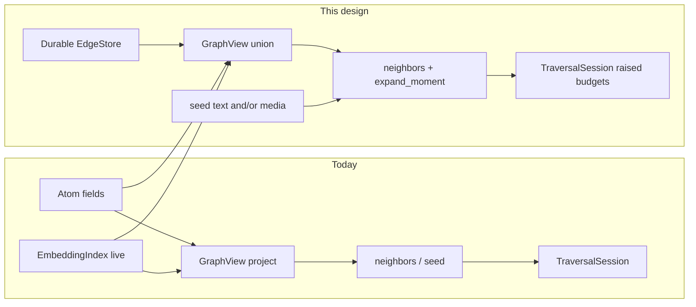
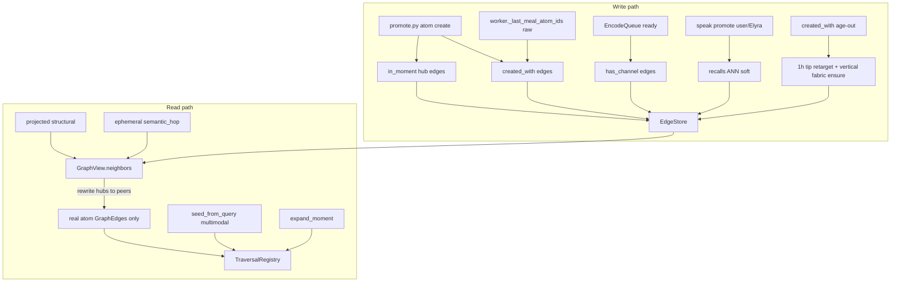
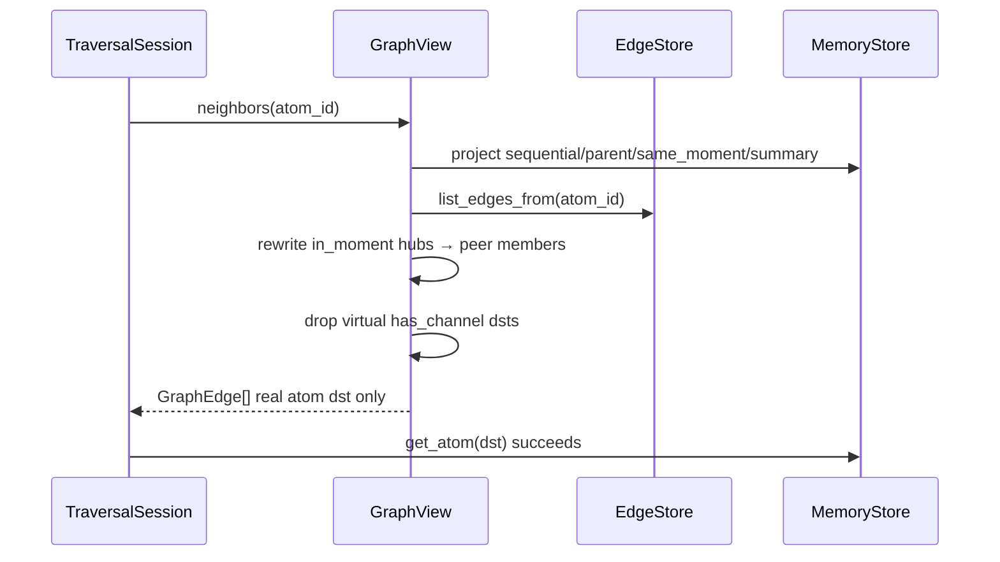
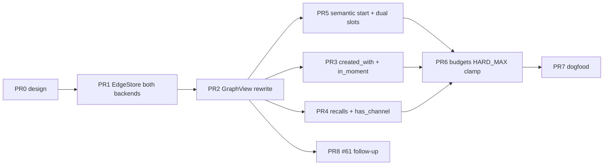

# Design: Edge enrichment + traversal extension

| Field | Value |
|-------|--------|
| **Class** | DESIGN |
| **Document** | Durable edge fabric + pure semantic start + raised traversal budgets |
| **Product** | project-elyra |
| **Author** | Grok Build (design agent) |
| **Date** | 2026-08-05 |
| **Status** | **Draft** — operator + OQ locks closed (2026-08-05); R1 review fixes + R2 OQ lock |
| **Revision** | **R2 (OQ lock 2026-08-05)** — empty meal → zero created_with; tool/ledger not created_with dsts (still walkable); recalls score→newest-5 + Phase3 comment; sibling EdgeStore; PR6 hard maxes; seed auto + skill semantic_only nudge; retarget 1h tip + vertical ladder fabric ensure |
| **OQ lock** | OQ-E1–E7 **Closed** 2026-08-05 (see Open Questions) |
| **Topic branch (later)** | `feature/memory-edges-and-traversal` (from `working`; stack to `working` only after hermetic green) |
| **PR base** | `working` (house branch law: `main` ← `working` ← `feature/*`) |
| **Depends on** | Phase 1–2a **code shipped**; MM embed loop [#124](https://github.com/jtwolfe/project-elyra/issues/124) code-complete (dogfood optional); continuous encode (embed-async) |
| **Related issues** | [#98](https://github.com/jtwolfe/project-elyra/issues/98) source/context edges; [#120](https://github.com/jtwolfe/project-elyra/issues/120) C14 edges dogfood; [#103](https://github.com/jtwolfe/project-elyra/issues/103) semantic seed timeout; [#105](https://github.com/jtwolfe/project-elyra/issues/105) frontier cache + dual start; [#61](https://github.com/jtwolfe/project-elyra/issues/61) visual graph (**follow-up**, not core PRs); [#117](https://github.com/jtwolfe/project-elyra/issues/117) Phase 3 (**prep only**) |
| **v0.1 maps** | Meal construction (C13/#119 + #103/#104); Edges (C14/#120 + #98) — see [docs/goal/v0.1.md](../../goal/v0.1.md) |
| **Architecture priors** | [architecture/phase-2a-directed-traversal.md](../../state/memory/architecture/phase-2a-directed-traversal.md), [architecture/phase-2-semantic.md](../../state/memory/architecture/phase-2-semantic.md), [design-database-choices.md](design-database-choices.md) |
| **Normative priors** | [design-phase-2a-implementation.md](design-phase-2a-implementation.md) (shipped 2a), [design-mm-embed-buildout.md](design-mm-embed-buildout.md) (MM loop), [design-context-meal-composition.md](design-context-meal-composition.md), [design-phase-3-procedural.md](design-phase-3-procedural.md) (later) |
| **Engineering** | [engineering-principles.md](../../dev/engineering-principles.md), [branch-law.md](../../dev/branch-law.md) |

> **Operator locked decisions (normative):** durable-first edges; `created_with` vs `recalls` split; moment membership durable + `expand_moment`; one-atom multi-channel via `has_channel` (Option B); per-atom ~150 edge budget with kind windows + created_with retarget to ladder; pure semantic start; raised traverse budgets; #61 full visual free-browse deferred. Do not reopen lightly.

---

## Overview

Today the memory weave is mostly **projected** from atom fields (`prev`/`next`, `parent_atom_id`, `moment_id`, summary meta lists) plus **ephemeral** `semantic_hop` ANN at expand time (`elyra/memory/graph.py`). That is enough for sequential walks and soft “reminds me of,” but it does **not** reify create-time context, speak-time recall, moment membership as a first-class edge, or modality channels as durable graph structure. Traversal start still **falls through to temporal strip** when semantic seed is cold/timeout (#103), and product defaults for depth/frontier/expand-per-step are tight for dogfood (#105).

This design ships **together** (fit over pure layering):

1. **Durable edge store** + write paths for new kinds: `created_with`, `recalls`, `in_moment`, `has_channel` (plus keep projecting structural kinds).
2. **Per-atom kind budgets** with FIFO window for `created_with` and **retarget-to-ladder** on age-out.
3. **`expand_moment`** so one seed can materialize all moment co-members without O(n) soft same_moment caps alone.
4. **Pure semantic start** for traverse (text and/or media-as-query via existing MM encode/search) wired into `memory_traverse_start` / skill — addresses cold/timeout collapse.
5. **Raised traverse product defaults** + session/tool overrides with **safety clamps** (settings hard maxes), aligned with new expand kinds.
6. **Glass / API honesty** for new edge kinds (legend + neighbors); full free-browse visual graph (#61) is **sketch + follow-up PR**, not a gate for edge dogfood.

Feature flags remain **default-off** where they change product behaviour (edges write + raised budgets can land behind one master flag or reuse `directed_traversal_enabled` + new `durable_edges_enabled`). **Gate B default-on is a non-goal.**

---

## Background & Motivation

### Why now

| Driver | Evidence |
|--------|----------|
| v0.1 edges bar | C14/#120 + #98 — “comprehensive edge creation + quantification (for traversal)” |
| v0.1 meal/traversal bar | C13/#119; #103 seed timeout; #105 frontier/dual start |
| Operator sequence | MM embed loop first (code-complete #124) → **edges** → traversal polish |
| Architecture debt | `design-database-choices.md` called for edge table; Phase 2a KD-A3 deferred durable edges and used projected + ephemeral only |
| Dogfood pain | Cold encoder / 80 ms start budget → empty semantic seeds → temporal-only start; `same_moment` k=4 too thin for moment membership; no “I was created with this context” fabric |

### Current-state map (code truth, 2026-08-05)

#### Graph expand (projected + ephemeral)

| Kind | Source | Durable? | File |
|------|--------|----------|------|
| `sequential` | `Atom.prev_atom_id` / `next_atom_id` | Projected | `graph.py` `_project_sequential`; written in `promote._link_and_put` |
| `parent_of` / `child_of` | `parent_atom_id` + reverse | Projected | `graph.py` |
| `same_moment` | Shared `moment_id`, cap `traverse_same_moment_k` (default **4**) | Projected soft | `graph.py` `_project_same_moment` |
| `summary_child` / `summary_source` / `supersedes` | Summary `meta.*` lists | Projected | `graph.py` + `ladder.py` write-time `source_atom_ids` |
| `semantic_hop` | Live `EmbeddingIndex.search` | **Ephemeral** | `graph.py` `_project_semantic_hop` |

Constants live in `elyra/memory/weights.py` (`EDGE_KINDS`, base weights). **No edge table** exists on `MemoryStore` (`store.py` Protocol is atom-only). Graph docstring: *“No durable edge table.”*

#### Traversal start path

`TraversalRegistry.start` (`traverse.py` ~L731+):

1. Explicit `seed_atom_ids` (free of expand_ms).
2. **Semantic** `graph.seed_from_text(query)` under `traverse_start_expand_max_ms` (0 → same as `traverse_expand_max_ms` default **80 ms**).
3. **Temporal** fill to `traverse_max_seeds` (always free) — so cold/timeout semantic **collapses to live temporal strip** (#103).

`seed_from_text` is **text-only** encode (`embedder.encode_text`); media-as-query exists for Vectors glass (`POST /api/memory/vectors/neighbors`) but is **not** wired into traverse start.

Budget overrides clamp **down only** today: `min(settings_product_default, request)` (`traverse.py` ~L772–776). Tools only pass `max_steps` / `max_nodes` / `max_depth` / `max_keep`.

#### Product budgets today

| Knob | Default | Hard max (`config.py`) |
|------|---------|------------------------|
| `traverse_max_depth` | 3 | 6 |
| `traverse_max_nodes` | 48 | 128 |
| `traverse_max_steps` | 8 | 16 |
| `traverse_max_seeds` | 8 | 16 |
| `traverse_frontier_max` | 16 | 32 |
| `traverse_max_expand_per_step` | 3 | 8 |
| `traverse_keep_max` | 16 | 32 |
| `traverse_expand_max_ms` | 80 | 500 |
| `traverse_same_moment_k` | 4 | 16 |

#### Multimodal channels (bonded, not graph)

- Channels: `text` / `image` / `audio` / `video` / `joint` (`embed/types.py`).
- One atom, multi-vector columns on Lance (`emb_*`); **not** split sibling atoms.
- Encode-ready via `EncodeQueue` → `upsert_vectors` + `embedding_status=ready`; partial ready allowed (MM M3).
- **No** durable `has_channel` edges yet.

#### Meal vs edges

Meal packs temporal / episodic / semantic / directed_keep / glass_tail into the **prompt** (`meal.py`). That is **not** a durable graph. Stuffing more into meal instead of edges is a **non-goal**. Create-time context for `created_with` must use a **process-local raw meal atom-id list** captured at `rebuild_outer` — **not** the glass `last_meal_snapshot` inspect DTO (which caps multi-atom `atom_ids` at 24 and is UI-shaped).

#### Step expand drop of missing dst (implementability trap)

`TraversalRegistry.step` (`traverse.py` ~L1032–1034) does `store.get_atom(e.dst_atom_id)` and **skips** when None. Virtual destinations (`moment:…`, `{atom}:channel`) would be silently dropped unless expand **rewrites** them to real atom ids before the session considers them. This design’s expand contract (§3) is written against that code fact.



---

## Goals & Non-Goals

### Goals

1. **Durable edges** for create-time / speak-time / membership / modality facts that must survive restarts and feed traversal ranking (not project-only ephemera).
2. **Two spoken-adjacent kinds** with distinct semantics:
   - `created_with` — atoms present in meal/context at **create** time.
   - `recalls` — on **user or Elyra speak only**: ANN over **spoken** atoms, top ~15 by similarity, durable edges to **newest ~5** → “I remember this recently.” Soft-fail under encode pressure.
3. **Moment membership durable** + **`expand_moment(atom_id|moment_id)`** for cacheable full-moment expansion from one seed; **default step expand materializes co-members** without a separate tool call (§3 Option A).
4. **Option B multi-channel:** durable `has_channel` from atom → stable channel ids (`{atom_id}:text` etc.) when each emb channel becomes ready; do **not** split sibling atoms by default; **omit from default expand**.
5. **Per-atom edge budget ~150** with kind windows and `created_with` **retarget** to the **youngest 1h ladder tip** for the dropped target, plus **ensure vertical ladder fabric** (existing `summary_child` / projected hierarchy) up coarser tips that contain that 1h — edges only, never invent summaries; fail-soft per missing scale.
6. **Pure semantic start** for graph traversal (multimodal-capable seed) wired into memory-traverse skill + tools; honest reasons when semantic unavailable; dual-start with **reserved temporal seed slots**.
7. **Raise product defaults** for frontier / hops / branches with safety clamps that allow tool overrides **up to hard max** (not only down to product default).
8. **Glass/API honesty** for new kinds + repair full legend (including already-shipped summary kinds).

### Non-goals

| Non-goal | Notes |
|----------|-------|
| Phase 3 procedural weight learning polish (#117) | Prep only: durable kinds + timestamps for later `phase3_multiplier` |
| Gate B / product default-on | Flags stay off until dogfood signed |
| Unlimited edges | Hard per-atom ~150 |
| Multi-try multi-channel ranking fusion | Single-resolve media-as-query path only (existing MM) |
| Stuffing more into meal instead of edges | Meal stays prompt packaging |
| Full free-browse visual node graph (#61) | Follow-up PR8; reuse neighbors API |
| lance-graph Cypher requirement | Python adjacency first; Cypher optional later behind same façade |
| Replacing projected sequential/parent/summary fabric | Projection stays; durable table is additive for new kinds |
| Using glass `last_meal_snapshot` for `created_with` | Forbidden — UI DTO caps and shapes wrong |

---

## Proposed Design

### Architecture summary



### 1. Durable EdgeStore

#### 1.1 Record model

```text
DurableEdge
  edge_id: str          # "e_" + uuid hex (or deterministic hash for idempotent kinds)
  src_atom_id: str
  dst_atom_id: str      # real atom id OR virtual hub id (storage only; see §3 expand rewrite)
  edge_kind: str        # created_with | recalls | in_moment | has_channel | …
  weight: float         # optional cache only; NOT authority at expand (see §1.5)
  created_at: str       # ISO-Z; FIFO window key for created_with
  updated_at: str
  reason: str           # short machine reason
  meta: dict            # cosine, channel, retarget_from, …
  schema_version: int   # 1
```

**Direction convention (v1):**

| Kind | Direction | Meaning |
|------|-----------|---------|
| `created_with` | **new atom → context atom** (real atom only) | “I was born with this in context” |
| `recalls` | **speak atom → recalled atom** (real atom only) | “This speak reminds me of that past speak” |
| `in_moment` | **atom → `moment:{moment_id}`** (virtual hub, storage) | Membership index; **not** a walk destination |
| `has_channel` | **atom → `{atom_id}:{channel}`** (virtual, storage) | Modality ready bond; **not** default walk destination |

**Virtual ids never enter `TraversalSession.considered`.** Expand always materializes real atom ids (or omits the edge). See §3.

Bidirectional expand for **real-atom** durable kinds: `GraphView` projects outgoing stored edges and incoming via reverse index (dst→src). Reverse edges are **not** stored as duplicate rows. For `in_moment` hubs, reverse lookup is `list_edges_to("moment:…")` / kind+moment filter used by `expand_moment` only.

#### 1.2 Persistence

| Backend | Layout |
|---------|--------|
| **Lance** (when `memory.backend=lance`) | Table `edges` under `data/memory/lance/` alongside `atoms`. Columns: string scalars + `meta_json` + float weight. Index: `src_atom_id`, `dst_atom_id`, `edge_kind`, `created_at`. |
| **JSONL** (when `memory.backend=jsonl`) | `data/memory/edges.jsonl` + in-memory maps by src/dst. Compact on idle like atoms. |
| **Protocol** | Sibling `EdgeStore` Protocol + `open_edge_store(paths, settings)` injected next to atom store. Methods: `put_edge`, `delete_edge`, `list_edges_from`, `list_edges_to`, `list_edges_for_atom`, `count_edges_for_atom` (outgoing by kind), `replace_edges_of_kind` / budget helpers. |

**PR1 completeness (normative):** Both **jsonl and lance** implement Protocol parity for put/list/delete/count used by budget ops. No “lance stub only.” If a backend cannot open, `durable_edges_enabled` writes **fail-soft** with reason `edge_backend_unavailable` (atom promote still succeeds). Dogfood path is lance atoms + lance edges — split brain (lance atoms, missing edge table) is not acceptable after PR1.

**Atom schema_version stays 1.** Edge table has its own `schema_version` / meta.json key `edge_schema_version: 1`.

**Idempotency:**

| Kind | Identity key |
|------|----------------|
| `created_with` | `(src, dst, kind)` unique; re-promote no-ops; update is still **one** budget slot |
| `recalls` | `(src, dst, kind)` unique; newer `meta.cosine` may update row |
| `in_moment` | `(src, dst="moment:{id}", kind)` unique |
| `has_channel` | `(src, dst="{src}:{channel}", kind)` unique |

#### 1.3 Edge kinds vocabulary (normative)

Extend `elyra/memory/weights.py`:

```text
# Existing (projected / ephemeral)
EDGE_SEQUENTIAL, EDGE_PARENT_OF, EDGE_CHILD_OF, EDGE_SAME_MOMENT,
EDGE_SEMANTIC_HOP, EDGE_SUMMARY_CHILD, EDGE_SUMMARY_SOURCE, EDGE_SUPERSEDES

# New durable
EDGE_CREATED_WITH = "created_with"
EDGE_RECALLS = "recalls"
EDGE_IN_MOMENT = "in_moment"
EDGE_HAS_CHANNEL = "has_channel"
```

| Kind | Durable? | Base weight (proposed v1) | Notes |
|------|----------|---------------------------|-------|
| `created_with` | Yes | **0.72** | Context co-presence; moderate prior |
| `recalls` | Yes | **0.78** | Speak-time memory; cosine at expand via `semantic_factor` |
| `in_moment` | Yes | **0.60** | Membership scaffold (hub storage; expand rewrites to peers) |
| `has_channel` | Yes | **0.50** | Structural modality; excluded from default expand |
| `semantic_hop` | Ephemeral | 0.70 | Unchanged — live ANN only |
| projected structural | Projected | existing | Unchanged |

**`DEFAULT_EXPAND_KINDS` (normative — not `EDGE_KINDS` wholesale):**

```text
DEFAULT_EXPAND_KINDS = EDGE_KINDS - {EDGE_HAS_CHANNEL}
# When traverse_expand_channels=true OR kinds explicitly includes has_channel:
#   add EDGE_HAS_CHANNEL (still rewrite virtual dst per §3 — usually skip walk into channel stubs)

# kinds is None → use DEFAULT_EXPAND_KINDS (or DEFAULT + has_channel if flag)
# kinds is explicit list → intersection with EDGE_KINDS; empty → no edges
```

Glass debug / Vectors-style neighbors may pass `kinds` including `has_channel`. Session step default uses `DEFAULT_EXPAND_KINDS`.

**`same_moment` vs `in_moment`:** Keep projected `same_moment` as a soft capped hop. Durable hub + expand rewrite (§3 Option A) is authoritative for full membership. On expand after rewrite, peer `in_moment` edges and projected `same_moment` may both appear; dedupe by `(dst, kind)` then by dst preferring durable kind priority.

#### 1.4 Per-atom edge budget (~150)

Hard max **~150** edges **outgoing from src** (atom is `src_atom_id`). Incoming recalls from many speaks **do not** consume the target’s budget (KD-E14).

| Kind | Budget | Policy |
|------|--------|--------|
| `created_with` | **≤ 100** | Sliding window FIFO by `(created_at ASC, edge_id ASC)` — stable when timestamps equal |
| `recalls` | **≤ 5–10** (product default **8**, clamp max **10**) | Drop oldest by same key when over |
| `in_moment` | **1** per atom (hub) | Idempotent replace |
| `has_channel` | **≤ #channels (~5)** | At most one per channel name |
| sequential/structural projected | **1–2** | Not counted (not table rows) |
| Headroom | remainder to 150 | Future durable kinds |

**Arithmetic:** 100 + 8 + 1 + 5 = **114** under kind caps → ~36 headroom inside 150.

**Retarget replacement is net-zero for budget:** delete edge src→T, then put src→S (if S new). Unique `(src,dst,kind)` update does **not** add a second slot.

**Global settings:** `edge_max_per_atom: int = 150`, `edge_created_with_max: int = 100`, `edge_recalls_max: int = 8`, `edge_recalls_ann_k: int = 15`, `edge_recalls_keep: int = 5`.

##### Retarget algorithm (OQ-E7 closed — 1h tip + vertical fabric ensure)

When `created_with` FIFO drops target `T` from src `S_atom`:

**Invariant:** Retarget **never creates summary atoms or summary body text**. It only writes/replaces **edges** to **existing** ladder tips. Missing tip at a scale → skip that scale (fail-soft).

```text
# Phase A — retarget created_with to youngest 1h tip for T
1. Parse T.t_start (fail-soft: drop edge only if missing/unparseable).
2. w1h = window_bounds("1h", T.t_start)
3. tips_1h = store.list_summaries("1h", overlapping=w1h, tips_only=True, limit=small)
4. Prefer tip where T.atom_id ∈ tip.meta.source_atom_ids when present;
   else the sole/youngest tip for that window (if any).
5. If tip_1h found:
     put_edge created_with S_atom → tip_1h
       meta.retarget_from=T.atom_id, reason="retarget_1h_tip"
     (unique key: replaces any prior created_with to same tip; net-zero vs deleted T edge)
   Else:
     fail-soft drop; optional edge_repair_needed for idle tick
     (STOP vertical ensure — no 1h anchor)

# Phase B — ensure vertical ladder fabric for tip_1h's lineage (existing tips only)
# Scales fine→coarse write-era: 1h → 1d → 1w → 1m → 1y  (PERIOD_SCALE_ORDER_WRITE)
6. If tip_1h is None: done.
7. For each coarser scale in (1d, 1w, 1m, 1y) whose window CONTAINS tip_1h.window_start:
     tip_c = list_summaries(scale, overlapping=window_bounds(scale, tip_1h.window_start),
                            tips_only=True, limit=small)
     if tip_c is None: continue  # do not invent
     # Prefer reusing fabric ladder already wrote:
     #   - projected EDGE_SUMMARY_CHILD when coarser.meta.from_children and
     #     tip_1h (or intermediate) ∈ child_atom_ids
     #   - EDGE_SUMMARY_SOURCE only at 1h→raw (already used for membership of T)
     #   - EDGE_SUPERSEDES is version lineage, not scale climb — do not misuse
     # If product already projects summary_child between consecutive tips, GraphView
     # can walk without durable rows. Optional durable ensure (edge_retarget_ensure_vertical):
     #   when from_children lists are incomplete for walk, write a durable
     #   summary_child-equivalent only if we introduce EDGE_* durable mirror —
     #   v1 DEFAULT: rely on projected summary_child/source from atom meta;
     #   retarget path only VERIFIES tips exist and records meta.retarget_vertical
     #   debug ids. Do NOT invent a third graph kind.
8. Examples:
   - T from ~3 weeks ago → created_with → that period's 1h tip;
     1d/1w/1m tips that contain that 1h (if present) remain walkable via
     projected summary_child fabric.
   - T from ~40 weeks ago → 1h tip + 1y (and any intermediate tips) same rule.
9. Do NOT retarget recalls in v1.
```

**Implementation notes:**

| Step | Cost / where |
|------|----------------|
| Phase A 1h tip | O(1) windowed `list_summaries` — OK **synchronous** on FIFO drop |
| Phase B coarser tips | 4 cheap tip lookups — prefer **same drop path** if &lt; ~5 ms total; else idle retarget tick (≤ 20 ms / 32 edges) |
| Vertical links | **Reuse** existing projected `summary_child` / `summary_source` / ladder meta (`child_atom_ids`, `from_children`). Retarget does not invent hierarchy edges unless a tip is missing meta that ladder should have fixed — then fail-soft + optional ladder repair, not retarget invention |
| Reverse index | Still **not** required (windowed tips only) |

**Walk after retarget:** `S_atom --created_with--> tip_1h --summary_child*--> coarser tips` (projected) and `tip_1h --summary_source--> raw` so aged context remains multi-scale navigable without stuffing raw T forever.

#### 1.5 Weight model at expand (normative — Option 1 recompute)

**Store components, recompute at expand** (Phase 3 prep):

| At write | At expand / neighbors |
|----------|------------------------|
| Persist `meta.cosine` for `recalls` (and any cosine-bearing kind) | Call `edge_weight(kind, dst_t_start=…, now=…, cosine=meta.get("cosine"))` |
| Persist `weight` field as **optional cache** of last computed value (may be stale) | **Ignore stored weight as authority** for ranking |
| Kind base from `weights.base_weight` | Temporal decay applied at expand |
| | Extend `semantic_factor` so **`EDGE_RECALLS` multiplies cosine** the same way as `EDGE_SEMANTIC_HOP` (missing cosine → 0.0 / drop) |
| | `created_with` / `in_moment` / `has_channel`: cosine=None → factor 1.0 |

**Do not** store `prior * cosine` as final authority and then multiply cosine again. Write path may set `weight=` recomputed value for debug/glass only.

Unit tests: recalls expand weight parity with semantic_hop cosine handling; changing base table changes expand weight without re-write of edges.

---

### 2. Write paths

#### 2.1 `created_with` (create-time context)

**When:** After successful promote of experience atoms — see promote coverage table §2.5 (default: `observation`, `speak`, `model`).

**Context snapshot (normative wire path):**

| Layer | Contract |
|-------|----------|
| **Authoritative** | Process-local `PresenceWorker._last_meal_atom_ids: list[str]` (or equivalent host field) |
| **Filled when** | End of `rebuild_outer` / `compose_meal` success: `_atom_ids_in_meal_items(package.items)` **union** open-moment spine atom ids present in that package — **raw ids, uncapped for promote** (may still cap at `edge_created_with_write_cap` at edge write) |
| **Passed as** | `PromoteContext.context_atom_ids` into **all** promote entry points that write experience atoms |
| **Forbidden** | `worker._record_last_meal_snapshot` / `meal_package_to_inspect` / glass `last_meal_snapshot` — UI DTO, multi-atom cap 24, wrong shape |
| **Empty / missing** | If `context_atom_ids` is **empty or missing** → write **zero** `created_with` edges. **No** open-moment fallback. **No** invented context. (OQ-E1 closed: only really relevant at Elyra init; later moments accumulate meal-backed edges.) |

**Rules:**

- Exclude self; exclude `parcel` / `moment_meta` destinations.
- **Exclude `tool` and `ledger` destinations** (OQ-E2 closed). Tool/ledger atoms are **not** orphaned: they remain walkable via projected **sequential**, durable/projected **`in_moment` / `same_moment` / `expand_moment`** (membership lists **include** tool/ledger kinds when present in the moment), and the normal promote tape. They are simply not *create-time provenance* targets.
- Cap write set at `edge_created_with_write_cap` (default **32** per create; window max still 100 over life).
- Soft-fail entire edge batch on store error — atom create still succeeds.
- Feature flag: `durable_edges_enabled` (default **false**).
- First-ever moments may be **sparse** on `created_with`; that is accepted.

**Wire points:** `promote._link_and_put` / `_link_and_put_with_parcels` after `put_atom` success; every public promote entry that uses them must accept optional `PromoteContext`.

#### 2.2 `recalls` (speak-time only)

**When:** See §2.5 — `_promote_speak` (Elyra) and `promote_wake_observation` (user chat) only.

**Algorithm:**

```text
1. Soft-gate: if not durable_edges_enabled or not semantic_enabled → skip
2. Soft-gate: if embedder cold OR index null OR encode pressure high
   (gate not warm OR EncodeQueue depth ≥ edge_recalls_skip_queue_depth
    OR ANN wall > edge_recalls_max_ms)
   → skip (no edges rather than block speak)
3. Query from spoken text only (strip tool JSON); media-only speak may
   use media-as-query when warm (same MM path)
4. ANN search k = edge_recalls_ann_k (~15); filter kinds speak|observation;
   exclude tool/ledger/summary/parcel; optional exclude open moment
5. Rank: score top edge_recalls_ann_k (~15) by similarity among spoken hits;
   then take newest edge_recalls_keep (~5) by dst.t_start among those 15.
   # IMPLEMENTATION REQUIREMENT: comment at ranking site that this is v1 policy;
   # later improve with weighted sim×recency (Stretch 2 Phase 3 / #117 adjacent).
6. put_edge recalls with meta.cosine=<score>; weight field = optional cache
   of edge_weight(kind, cosine=score) — not double-applied later
7. Enforce recalls outgoing budget on src (≤ 8)
```

**v1 ranking policy (OQ-E3 closed):** sim filter first, then recency among survivors — not a fused score. Phase 3 may replace with weighted sim×recency without changing edge kind.

#### 2.3 `in_moment` + `expand_moment`

**Membership model (v1 — moment hub storage):**

- Synthetic id: `moment:{moment_id}` is **not** an Atom row.
- Durable edge `in_moment`: `src=atom_id`, `dst_atom_id="moment:{moment_id}"` — **index only**.
- On promote into a moment: write one hub edge (idempotent).

**`expand_moment(atom_id | moment_id)`:**

```text
1. Resolve moment_id from arg or get_atom(atom_id).moment_id
2. Prefer EdgeStore membership for hub moment:{id}
   (list_edges_to hub or list_by_kind+moment meta)
3. Fallback: store.list_by_moment(moment_id); optional idle backfill of hub edges
4. Return GraphEdge list with real atom destinations only
   (src = seed atom or virtual hub label in meta; dst = member atom_id).
   Membership includes **all experience kinds in the moment** (speak, observation,
   tool, ledger, model, …) subject only to existing list_by_moment filters —
   so tool/ledger remain cacheable/walkable even though they are not
   created_with destinations (OQ-E2).
5. Populate session.moment_member_cache[moment_id]
```

#### 2.4 `has_channel` (Option B)

**When:** Encode path marks a channel vector present after upsert.

**Channel id:** `{atom_id}:{channel}` with `channel ∈ {text,image,audio,video,joint}`.

**Rules:**

- One edge per ready channel; delete if channel cleared (rare).
- Do **not** create sibling atoms for modalities.
- **Storage only for graph fabric / glass debug** under default settings.
- Default `neighbors` **omits** via `DEFAULT_EXPAND_KINDS` (§1.3).
- If explicitly expanded, §3 rewrite: do **not** add virtual channel ids to `considered`; optional meta-only annotation on the atom node.

#### 2.5 Promote entry points → edge kinds (normative)

| Promote entry | created_with | in_moment | recalls | Notes |
|---------------|:------------:|:---------:|:-------:|-------|
| `_promote_speak` | yes | yes | **yes** | Elyra speak |
| `promote_wake_observation` (user chat / wait_reply text) | yes | yes | **yes** | User speech |
| `promote_view_observation` | yes | yes | **no** | View/media note — not speak |
| tool / ledger promote paths | **no** (src may write none; **never dst** of created_with) | yes | **no** | Still walkable via sequential + expand_moment (OQ-E2) |
| model promote (if any) | yes | yes | **no** | |
| parcel children | no | yes (same moment) | no | Membership only |
| interjection / non-chat host paths | per kind | yes if moment | **no** | Not “speak” |

---

### 3. GraphView expand changes (virtual nodes — Option A)

**Normative expand contract (fixes silent step drop):**

1. Projected structural (existing) — real atoms only.
2. Durable edges from EdgeStore.
3. **Rewrite / materialize before return:**
   - **`in_moment` hub edges** (`dst` starts with `moment:`): do **not** emit the hub as a neighbor. Inline **`expand_moment`** (or equivalent peer materialization) and emit **peer member edges** as `GraphEdge(src=seed, dst=member_atom_id, edge_kind=in_moment, …)` capped by `expand_moment` k / settings. Product intent: **step expand from a moment member reaches co-members without a separate tool call**.
   - **`has_channel` edges:** if kind allowed, either omit destinations that fail `get_atom` **or** attach channel names in `meta.channels` on a self/no-op edge — **never** put `{atom}:channel` into session considered.
4. Ephemeral `semantic_hop` (existing).
5. `TraversalRegistry.step` continues to `get_atom(dst)` — safe because returned edges have real atom dsts only.



**Dedupe:** key `(dst_atom_id, edge_kind)` highest weight wins (existing).

**Kind filters:** `kinds is None` → `DEFAULT_EXPAND_KINDS` (§1.3), **not** full `EDGE_KINDS`.

**Public API:**

```python
def expand_moment(
    self,
    atom_id: str | None = None,
    *,
    moment_id: str | None = None,
    k: int | None = None,
    exclude_ids: AbstractSet[str] | None = None,
) -> list[GraphEdge]:
    """Moment members as edges with real atom destinations only."""
```

Session **frontier cache** (#105): `session.moment_member_cache[moment_id] = [atom_ids…]` after first expand_moment / rewrite. Moments are append-mostly; optional one refresh if cache miss on new atoms mid-walk.

**Hermetic tests:** step expand from member A reaches co-member B with only `memory_traverse_step(expand_ids=[A])` (no separate expand_moment tool); virtual ids never appear in considered.

---

### 4. Pure semantic start (multimodal) — #103

#### 4.1 Problem

`start` always temporal-fills after weak/failed semantic under 80 ms → model thinks “recent strip is the memory.”

#### 4.2 Design

Add **`GraphView.seed_from_query`** (generalizes `seed_from_text`):

| Input | Encode path |
|-------|-------------|
| `query: str` | `encode_text` (existing) |
| `media_ids: Sequence[str]` | MM media-as-query (same resolve as `POST /api/memory/vectors/neighbors`) |
| both | Existing single-resolve fusion — **no** multi-try ranking beyond MM buildout |

Parameters: `k`, `exclude_moment_id`, `expand_deadline_ms`, `channel` (auto default).

**Never cold-load torch on start** — preserve `encoder_cold` when embedder not warm (existing GraphView contract).

**`TraversalRegistry.start` changes:**

```text
seed_mode: "auto" | "semantic_only" | "temporal_only" | "explicit_only"

dual_n = 2 if (traverse_dual_start and seed_mode == "auto") else 0
# RESERVE dual_n slots before semantic fill so anchors cannot be starved

1) explicit seed_atom_ids (consume seed slots freely; do not count against dual reserve)
2) semantic_room = max_seeds - len(seed_order) - dual_n
   if semantic_room > 0 and seed_mode in {auto, semantic_only}:
     seed_from_query(..., k=semantic_room)
3) if dual_n > 0 and seed_mode == auto and semantic_hits >= 1:
     append up to dual_n temporal anchors (not full strip)
   elif seed_mode == auto and semantic empty (or never ran):
     temporal STRIP fill to max_seeds  # collapse path — honest tags
   elif seed_mode == temporal_only:
     temporal strip fill
   elif seed_mode == semantic_only:
     NEVER temporal fill — empty frontier is OK
4) payload seed_sources: {explicit, semantic, temporal}
   + semantic_reason, expand_truncated, start_ms_budget, start_ms_spent
```

**Slot reservation example:** `max_seeds=10`, `dual_n=2` → semantic may take at most **8**; then **2** temporal anchors always attach when semantic non-empty. Hermetic: high semantic k + dual_start → `seed_sources.temporal in (1,2)` and `semantic > 0`.

| Mode | Semantic | Temporal strip fill | Dual anchors (1–2) |
|------|----------|---------------------|---------------------|
| auto (default) | try (room after reserve) | if semantic empty | if semantic non-empty |
| semantic_only | try | never | never |
| temporal_only | skip | yes | n/a |
| explicit_only | skip | no | no |

**Product default `seed_mode=auto`**. Raise `traverse_start_expand_max_ms` default to **250 ms** (clamp max 500). This improves warm-path #103; it does **not** claim cold CPU Nemotron is fixed — cold still returns `encoder_cold` and dual/strip behaviour above.

**Orthogonal budgets:** meal `semantic_select_max_ms=50` / `encode_query_max_ms=30` are **unchanged** and separate from traverse start.

#### 4.3 Tool / skill surface

`memory_traverse_start` args (additive):

```json
{
  "goal": "…",
  "seed_query": "optional text",
  "seed_atom_ids": ["a_…"],
  "seed_media_ids": ["att_…"],
  "seed_mode": "auto",
  "budgets": {
    "max_steps": 12,
    "max_nodes": 80,
    "max_depth": 5,
    "max_keep": 20,
    "frontier_max": 24,
    "max_expand_per_step": 5,
    "neighbor_k": 16
  }
}
```

**Budget clamp (normative — replaces down-only min):**

```text
session_value = clamp(request if request is not None else product_default, lo=1, hi=HARD_MAX)
# HARD_MAX from config.py TRAVERSE_*_MAX (raised in §5.1)
# NOT min(product_default, request)
```

Example: product default nodes=80, hard max=160, tool requests 100 → **100**.

Skill `skills/bundled/memory-traverse/SKILL.md`:
- Product default `seed_mode=auto` (OQ-E6).
- **Nudge:** prefer `seed_mode=semantic_only` when the agent **already knows what it is looking for** (focused traversal / named topic) — not only after meal semantic timeout. Auto remains correct for open-ended digs and dual temporal anchors.
- Dual-start honesty; inspect before keep; moment co-members via normal step expand (hub rewrite).

---

### 5. Raised traversal budgets (#105)

#### 5.1 Proposed product defaults and hard maxes

| Knob | Old default | **New default** | **New hard max** | Rationale |
|------|-------------|-----------------|------------------|-----------|
| `traverse_max_depth` | 3 | **5** | **8** (was 6) | created_with → summary → source hops |
| `traverse_max_nodes` | 48 | **80** | **160** (was 128) | Denser fabric |
| `traverse_max_steps` | 8 | **12** | **24** (was 16) | More steered expands |
| `traverse_max_seeds` | 8 | **10** | **16** | Dual reserve + semantic top |
| `traverse_frontier_max` | 16 | **24** | **48** (was 32) | New edge kinds |
| `traverse_max_expand_per_step` | 3 | **5** | **10** (was 8) | Branches per step |
| `traverse_keep_max` | 16 | **20** | **32** | Slightly richer directed_keep |
| `traverse_expand_max_ms` | 80 | **120** | **500** | Durable reads + light ANN |
| `traverse_start_expand_max_ms` | 0 (=80) | **250** | **500** | Semantic start headroom |
| `traverse_same_moment_k` | 4 | **8** | **24** (was 16) | Soft peer until moment rewrite |
| `traverse_semantic_k` | 8 | **10** | **16** | Align denser graph |
| **`traverse_neighbor_k`** | **12 hardcoded** | **16** | **32** | Step expand + GraphView default k |
| `traverse_session_ttl_s` | 900 | **900** | 3600 | Unchanged idle TTL (KD-A18) |
| `traverse_dual_start_n` | n/a | **2** | **4** | Reserved temporal anchors |

Hard maxes: `config.py` `TRAVERSE_*_MAX` + settings validation in `settings.py`.

#### 5.2 Frontier cache (#105)

```text
moment_member_cache: dict[moment_id, list[atom_id]]
```

Populate on expand_moment / in_moment rewrite. Glass may expose `moment_cache_size` only.

#### 5.3 Branch / expand policy

1. Expand up to `max_expand_per_step` selected ids.
2. Each expand returns ≤ `traverse_neighbor_k` (default **16**) edges after kind filter + min weight.
3. Kind priority for ties:

```text
sequential > recalls > created_with > in_moment > parent/child >
summary_* > same_moment > semantic_hop > has_channel
```

#### 5.4 PR6 budget clamp acceptance checklist (atomic)

PR6 is incomplete unless **all** of:

1. Hard max constants raised as §5.1 table (`config.py`).
2. Product defaults raised on `MemorySettings`.
3. Settings validation bands updated (`settings.py`).
4. Registry clamp uses **HARD_MAX** ceiling, not product default: `clamp(request or default, 1, HARD_MAX)`.
5. Tools accept budget keys: `max_steps`, `max_nodes`, `max_depth`, `max_keep`, **`frontier_max`**, **`max_expand_per_step`**, **`neighbor_k`**.
6. Hermetic test: request `max_nodes=100` with hard 160 and product default 80 → session **100**.

---

### 6. Observability & Glass

| Surface | Change |
|---------|--------|
| `edge_kind_legend()` | **Rebuild** from single table covering **all** `EDGE_KINDS`: projected sequential/parent/child/same_moment, **summary_child / summary_source / supersedes** (already shipped but missing from legend today), durable created_with/recalls/in_moment/has_channel, ephemeral semantic_hop. Labels + `structural` + base_weight. |
| `GET /api/memory/graph/neighbors` | New kinds; real atom dsts only; `meta.retarget_from`, `cosine`, `channel` |
| Graph overview health | `edge_count`, `edges_by_kind`, `durable_edges_enabled` |
| Session tool payload | `seed_sources`, `semantic_reason`, dual_n, budgets including frontier/neighbor_k |
| #61 free-browse UI | Follow-up PR8 |

Minimum honesty: no stub legend; if EdgeStore empty, neighbors still work via projection.

---

### 7. Feature flags & settings

```text
# MemorySettings additions (defaults safe)
durable_edges_enabled: bool = False
edge_max_per_atom: int = 150
edge_created_with_max: int = 100
edge_created_with_write_cap: int = 32
edge_recalls_max: int = 8
edge_recalls_ann_k: int = 15
edge_recalls_keep: int = 5
edge_recalls_max_ms: int = 40
edge_recalls_skip_queue_depth: int = 64
edge_retarget_enabled: bool = True
edge_retarget_ensure_vertical: bool = True  # Phase B: verify coarser tips exist for tip_1h window
traverse_dual_start: bool = True
traverse_dual_start_n: int = 2
traverse_expand_channels: bool = False  # add has_channel to DEFAULT_EXPAND
traverse_default_seed_mode: str = "auto"
traverse_neighbor_k: int = 16
# + raised traverse_* defaults and HARD_MAX constants as §5.1
```

`directed_traversal_enabled` remains master for tools. Edges may write when `durable_edges_enabled` even if traversal off.

---

### 8. Security & Privacy

| Risk | Severity | Mitigation |
|------|----------|------------|
| Context edges leak meal contents across users | **High** | Edges only between store atoms; multi-user isolation follows atom rules; no cross-user promote context until #118 |
| Recall ANN surfaces sensitive past speaks | **Med** | Same as meal semantic; directed_keep model-gated |
| Channel ids expose modality of private media | **Low** | Local graph; glass already shows media |
| Edge store growth / disk | **Med** | Per-atom 150 + FIFO; idle compact; Lance optimize |
| Speak blocked by ANN | **High** if mishandled | Soft-fail recalls — **never** block promote/speak |
| Glass snapshot under-count used as truth | **Med** | Forbidden for created_with — raw worker list only |

---

### 9. Observability

- Log counters (rate-limited): `edges_written{kind}`, `edges_dropped{kind,reason}`, `recalls_skipped{reason}`, `retarget_ok|fail`, `semantic_start{reason}`, `edge_backend_unavailable`.
- Edge health: counts by kind, last write error.
- Traverse surface: `expand_truncated`, `semantic_reason`, `seed_sources`.
- No raw 2048-d dumps in glass.

---

### 10. Test plan (hermetic first)

| Layer | Tests |
|-------|-------|
| Unit EdgeStore | put/get/list/delete **on jsonl and lance**; unique keys; budget FIFO; 101st created_with drops oldest; retarget net-zero ≤100; inbound recalls no dst budget; edge_id tie-break on equal created_at |
| Unit retarget | Known 1h tip with T → created_with retarget; missing 1h → fail-soft; coarser tips present → vertical walk via projected summary_child (no invented summaries); empty context_atom_ids → zero created_with |
| Unit weights | recalls cosine via semantic_factor; recompute at expand; no double cosine |
| Unit GraphView | DEFAULT_EXPAND_KINDS omits has_channel; hub rewrite → peer atoms; expand_moment; reverse for real kinds |
| Unit promote | created_with from PromoteContext raw ids; forbid dependence on inspect snapshot; coverage table kinds |
| Unit speak recalls | mock index; newest 5 of top 15; soft-skip cold; never raises |
| Unit encode | has_channel on ready channels only |
| Unit traverse start | slot reserve: semantic high + dual → temporal 1\|2; semantic_only empty frontier; no torch load; encoder_cold |
| Unit budgets | clamp request 100 → 100 when hard 160 default 80; new keys frontier/expand/neighbor_k |
| Tools | memory_traverse_start new args |
| Integration | jsonl + lance edge backends; start→step co-member without expand_moment tool |
| Glass API | legend membership for **all** EDGE_KINDS including summary_* |
| **Not in PR1** | Live Nemotron dogfood (#120) |

---

### 11. Risks

| Risk | Severity | Mitigation |
|------|----------|------------|
| Promote latency from edge writes | Med | Batch put; write_cap 32; flag off default |
| Retarget wrong summary | Med | 1h window tip only first; fail-soft |
| Budget off-by-one | Med | Outgoing-src; tests §10 |
| Virtual nodes leak into considered | **High** if mishandled | §3 rewrite mandatory; tests |
| Raised defaults cost CPU | Med | Hard maxes; expand_ms soft wall |
| Double-count same_moment + in_moment peers | Low | Dedupe + kind priority |
| #103 only on warm GPU | Med | start_ms 250 + dual reserve + honest reasons; cold still encoder_cold |
| Lance edges missing under lance atoms | High | PR1 dual-backend parity |

---

## API / Interface Changes

### Python

| API | Change |
|-----|--------|
| `elyra/memory/edges.py` (new) | `DurableEdge`, sibling `EdgeStore`, jsonl **and** lance impls, budget helpers, retarget 1h tip + vertical ensure |
| `elyra/memory/weights.py` | New kinds/bases; `semantic_factor` includes recalls; `DEFAULT_EXPAND_KINDS` export |
| `elyra/memory/graph.py` | Durable expand + **hub rewrite**; `expand_moment`; `seed_from_query`; default kinds |
| `elyra/memory/promote.py` | `PromoteContext`; created_with / in_moment / recalls per §2.5 |
| `elyra/presence/worker.py` (or host) | `_last_meal_atom_ids` raw fill at rebuild_outer; pass into promote |
| `elyra/memory/embed/queue.py` | has_channel on ready channels |
| `elyra/memory/traverse.py` | seed_mode; dual slot reserve; moment cache; clamp to HARD_MAX; neighbor_k |
| `elyra/memory/config.py` | Flags, budgets, hard max constants including TRAVERSE_NEIGHBOR_K_MAX |
| `elyra/settings.py` | Validation bands for new/raised knobs |
| `elyra/tools/builtin/memory_traverse.py` | New start args + budget keys |
| `elyra/memory/inspect.py` | Full legend rebuild |
| `skills/bundled/memory-traverse/SKILL.md` | Playbook updates |

### HTTP (minimum)

| Endpoint | Change |
|----------|--------|
| `GET /api/memory/graph` overview | edge counts / flag |
| `GET /api/memory/graph/neighbors` | new kinds; real dsts |
| Optional `GET /api/memory/edges?atom_id=` | debug (can wait) |

### Tools

- `memory_traverse_start`: `seed_media_ids`, `seed_mode`, budgets including `frontier_max`, `max_expand_per_step`, `neighbor_k`.
- `memory_traverse_step`: normal expand sufficient for co-members (§3); optional `expand_moment_ids` remains as explicit force-refresh of cache.

---

## Data Model Changes

### Edge table (Lance / JSONL)

```text
edges (
  edge_id: string,
  src_atom_id: string,
  dst_atom_id: string,
  edge_kind: string,
  weight: float64,       # cache only
  created_at: string,
  updated_at: string,
  reason: string,
  meta_json: string,     # cosine, retarget_from, channel, …
  schema_version: int64
)
```

### Virtual ids (storage / index only)

| Pattern | Meaning | Enters considered? |
|---------|---------|--------------------|
| `moment:{moment_id}` | Moment hub for `in_moment` | **Never** |
| `{atom_id}:text` etc. | Channel node for `has_channel` | **Never** |

### Atom

No required new fields.

---

## Alternatives Considered

### A. Project-only edges (meta lists on atoms) — rejected

- **Pros:** No new table; similar to `source_atom_ids`.
- **Cons:** Atom rows balloon; FIFO/retarget painful; reverse index O(n); Phase 3 weight updates rewrite atoms.

### A2. Durable only for recalls; project `created_with` from atom.meta — rejected

- **Pros:** Smaller EdgeStore for one kind.
- **Cons:** Split budget systems; no unified reverse index / FIFO; Phase 3 and glass counts diverge; implementers re-learn two fabrics.

### B. Split sibling atoms per modality — rejected (operator Option B)

### C. Ephemeral-only recalls — rejected for product bar (#98/#120)

### D. Full meal stuffing instead of created_with — rejected

### E. lance-graph Cypher first — deferred

### F. Peer N² in_moment edges — rejected (hub + expand rewrite)

### G. Expand emits virtual hubs; teach step to special-case prefixes — rejected as primary

- Viable (review Option B) but spreads virtual-id knowledge into session. **Option A (rewrite in GraphView)** keeps session atom-only and matches current `get_atom` step loop with one chokepoint.

---

## Rollout Plan

1. Land design on `feature/memory-edges-and-traversal` via ordered PRs.
2. Hermetic green → merge to `working`.
3. Operator dogfood: `durable_edges_enabled=true`, `directed_traversal_enabled=true`, lance + semantic + warm embedder.
4. Do **not** flip factory defaults on until dogfood signed.
5. #61 visual free-browse as PR8 after edge honesty.
6. Phase 3 (#117) later.

---

## Open Questions

**All OQ-E1–E7 closed 2026-08-05 (operator lock). Do not reopen lightly.**

| ID | Decision (final) | Where applied |
|----|------------------|---------------|
| **OQ-E1** | **Empty meal → zero `created_with`**. No open-moment fallback; no invented context. Sparse first moments OK; later moments accumulate. | §2.1 |
| **OQ-E2** | **Exclude tool/ledger from `created_with` destinations**. Still walkable via sequential + `in_moment`/`expand_moment` (membership includes tool/ledger kinds) + promote tape. | §2.1, §2.3, §2.5 |
| **OQ-E3** | **Score top ~15 by sim among spoken, then newest ~5 by `t_start`.** Code comment at ranking site: v1 policy; later weighted sim×recency (Phase 3 / #117 adjacent). | §2.2, PR4 |
| **OQ-E4** | **Sibling `EdgeStore`** (`open_edge_store`), not methods bolted only onto atom Protocol. | §1.2, PR1 |
| **OQ-E5** | **Yes** — raise hard maxes with product defaults in PR6; full §5.4 atomic checklist. | §5.1, §5.4, PR6 |
| **OQ-E6** | **Default `seed_mode=auto`.** Skill **nudge** `semantic_only` when the agent knows what it is looking for (focused traversal), not only after timeout. | §4.2–4.3, PR5 skill |
| **OQ-E7** | **Retarget to youngest 1h tip** for dropped target; **ensure vertical fabric** by verifying coarser existing tips (1d→1y) whose windows contain that 1h and relying on projected `summary_child`/`summary_source` — never invent summary atoms. | §1.4 retarget, PR3 |

### Follow-ups (not open design questions)

| Item | Notes |
|------|-------|
| recalls ranking fusion | Weighted sim×recency — Phase 3 / #117 prep; comment-required in v1 code |
| Durable reverse index | Optional optimization after dogfood |
| Durable mirror of summary_child | Only if projected fabric proves insufficient; not v1 retarget invent |

---

## Key Decisions

| ID | Decision | Rationale |
|----|----------|-----------|
| **KD-E1** | Durable EdgeStore for create/speak/membership/channel | Restart-stable weave; #98/#120 |
| **KD-E2** | `created_with` ≠ `recalls` | Distinct semantics |
| **KD-E3** | recalls soft-fail; never block speak | Product safety |
| **KD-E4** | Moment hub storage + GraphView rewrite to peer atoms (Option A) | Fixes step get_atom drop; co-members on normal expand |
| **KD-E5** | Option B `has_channel`; virtual ids never considered | Align MM; no walk noise |
| **KD-E6** | Outgoing ~150; created_with ≤100 FIFO + **retarget to 1h tip + vertical ladder fabric ensure** (projected summary_*; no invent summaries) | OQ-E7; multi-scale walk after age-out |
| **KD-E7** | recalls: score top ~15 spoken → newest ~5 by t_start; comment for future sim×recency | OQ-E3 |
| **KD-E8** | Projected structural + ephemeral semantic_hop remain | No 2a rewrite |
| **KD-E9** | Pure semantic start + **reserved dual temporal slots** | #103/#105; anchors not starved |
| **KD-E10** | Raised defaults + hard maxes; clamp `request or default` to HARD_MAX | Dogfood raise without toml |
| **KD-E11** | `DEFAULT_EXPAND_KINDS` excludes `has_channel` | Not full EDGE_KINDS |
| **KD-E12** | #61 deferred; PR8 reuses neighbors + legend | Scope |
| **KD-E13** | Flags default off; no Gate B | Factory safety |
| **KD-E14** | Outgoing-src budget; inbound free | Popular memories not punished |
| **KD-E15** | Python EdgeStore first; **jsonl+lance parity in PR1** | Dogfood lance path |
| **KD-E16** | Weight **recompute at expand** from kind + meta.cosine + decay | No double cosine; Phase 3 prep |
| **KD-E17** | created_with from **raw `_last_meal_atom_ids`**, never glass inspect; **empty → zero edges** (no open-moment invent) | OQ-E1; UI decoupling |
| **KD-E18** | `traverse_neighbor_k` default 16 / hard 32 | Replace hardcoded 12 |
| **KD-E19** | tool/ledger **not** created_with destinations; still walkable via sequential + expand_moment | OQ-E2 |
| **KD-E20** | Sibling EdgeStore; PR6 hard maxes with defaults; seed default auto + skill semantic_only nudge for focused goals | OQ-E4, E5, E6 |

---

## PR Plan

Ordered stack on `feature/memory-edges-and-traversal`. Prefer merge order below; **PR5 owns dual-start slot reserve + `traverse_max_seeds` default 10 + start_ms 250** so #103/#105 seed path is not blocked on PR6. PR6 still owns remaining budget raises + HARD_MAX clamp atomic checklist + frontier cache + neighbor_k wiring end-to-end. If PR5 slips, PR6 may land first (independent merge) with dual_start behind flag off.

### PR0 — Design + catalogue

| | |
|--|--|
| **Scope** | This doc + README catalogue **Draft** |
| **Issues** | Documents #98/#120/#103/#105 |
| **Tests** | n/a |

### PR1 — EdgeStore both backends + kinds + weights

| | |
|--|--|
| **Scope** | `edges.py` Protocol + **jsonl and lance** full put/list/delete/count; `weights.py` kinds/bases + semantic_factor(recalls); settings flags; budget FIFO helpers |
| **Issues** | #98 foundation; #120 prep |
| **Out** | promote writes, GraphView, traverse |
| **Tests** | `tests/test_memory_edges.py` both backends |
| **Acceptance** | Dogfood-capable edge table under `backend=lance`; fail-soft `edge_backend_unavailable` only on open failure |

### PR2 — GraphView union + hub rewrite + expand_moment + full legend

| | |
|--|--|
| **Scope** | Durable expand; **Option A rewrite**; `expand_moment`; `DEFAULT_EXPAND_KINDS`; inspect legend **rebuild including summary_***; graph API honesty |
| **Issues** | #98 read path; #105 moment cache hook |
| **Depends** | PR1 |
| **Tests** | `test_memory_graph.py`, `test_memory_graph_api.py`; legend membership all EDGE_KINDS |

### PR3 — Write path: created_with + in_moment + retarget

| | |
|--|--|
| **Scope** | `PromoteContext`; **worker raw `_last_meal_atom_ids`**; created_with (empty→zero; no tool/ledger dsts); in_moment hubs; **OQ-E7 retarget** (1h tip + vertical fabric ensure, no invent summaries); promote coverage table |
| **Issues** | #98 core; #120 fabric |
| **Depends** | PR1–2 |
| **Tests** | empty context_atom_ids → 0 created_with; tool/ledger not destinations; retarget to 1h tip; coarser tips walkable via projected summary_child; no glass snapshot dependency |

### PR4 — Write path: recalls + has_channel

| | |
|--|--|
| **Scope** | Speak-time recalls soft-fail; score→newest-5 ranking + **v1 policy code comment** (future sim×recency / #117); encode has_channel; budgets; §2.5 call sites only |
| **Issues** | #98 / #120 |
| **Depends** | PR1–2 |
| **Tests** | recalls mock ranking order; encode channel edges; exclude view/tool |

### PR5 — Pure semantic start + dual slot reserve + tool/skill (#103/#105 seed)

| | |
|--|--|
| **Scope** | `seed_from_query`; `seed_mode` default **auto**; skill nudge **`semantic_only` when goal is focused**; **dual_n slot reservation**; `traverse_max_seeds` default **10**; `traverse_start_expand_max_ms` **250**; tools/skill; start never cold-loads |
| **Issues** | **#103**, **#105** (seed half) |
| **Depends** | PR2 recommended |
| **Acceptance** | cold → `encoder_cold` + semantic_only empty frontier; warm mock hits; dual_start + high semantic k → temporal 1\|2 and semantic > 0; no torch load in start |
| **Tests** | `test_memory_traverse.py`, `test_memory_traverse_tools.py` |

### PR6 — Raised budgets + HARD_MAX clamp + frontier cache + neighbor_k

| | |
|--|--|
| **Scope** | Remaining §5.1 defaults/hard maxes; **§5.4 atomic clamp checklist**; `traverse_neighbor_k`; moment cache; kind priority; tool budget keys |
| **Issues** | **#105** (budget/frontier half) |
| **Depends** | PR2; PR5 preferred for dual_start synergy (not hard if dual behind flag) |
| **Acceptance** | Full §5.4 checklist green |
| **Tests** | budget clamp 100 with hard 160; frontier cache |

### PR7 — Operator dogfood checklist + glass polish (no Gate B)

| | |
|--|--|
| **Scope** | STATE checklist #120/#103/#105; overview edge counts; residuals |
| **Issues** | **#120**, residual #98 |
| **Depends** | PR3–6 |

### PR8 — Follow-up: visual free-browse graph (#61)

| | |
|--|--|
| **Scope** | Node-link canvas: **reuse** `GET /api/memory/graph/neighbors` + `edge_kind_legend`; no new graph DB; optional sticky session overlay from existing graph session API; not required for edge claim |
| **Issues** | **#61** |
| **Depends** | PR2+ |



**Issue mapping**

| Issue | Primary PRs |
|-------|-------------|
| #98 | PR1–4 |
| #120 | PR3–4, PR7 |
| #103 | PR5 |
| #105 | PR5 (seed dual) + PR6 (frontier/budgets) |
| #61 | PR8 |
| #117 | out of scope |

---

## References

- Code: `elyra/memory/graph.py`, `weights.py`, `traverse.py`, `promote.py`, `config.py`, `types.py`, `store.py`, `lance_store.py`, `meal.py`, `inspect.py`, `embed/types.py`, `embed/queue.py`, `tools/builtin/memory_traverse.py`, `skills/bundled/memory-traverse/SKILL.md`, `runtime/api.py` (vectors media-as-query), `presence/worker.py` (meal snapshot)
- Designs: phase-2a implementation + architecture; MM embed buildout; database-choices; phase-3 procedural (later)
- Goals: `docs/goal/v0.1.md` C13/C14
