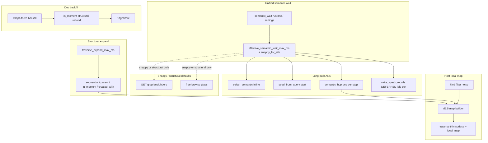
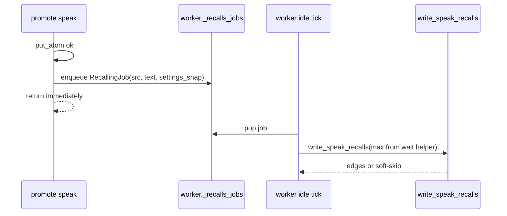
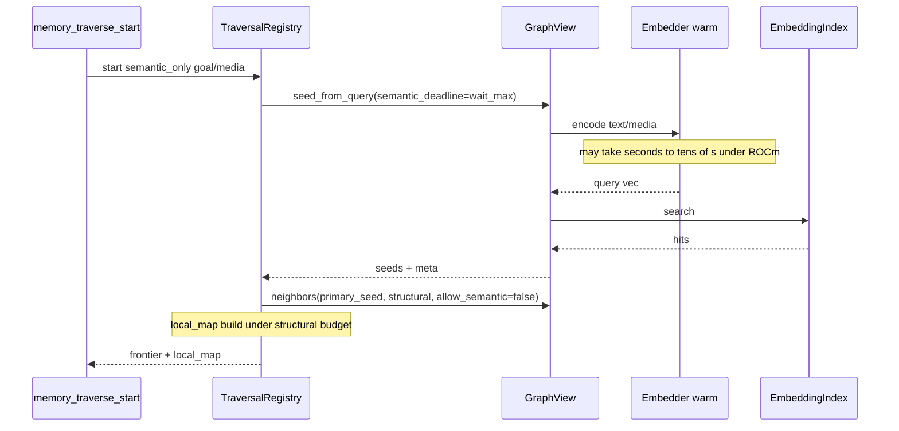
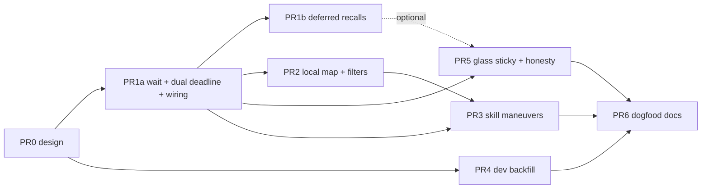

# Design: Edge enrichment polish 1 (dogfood residuals → product polish)

| Field | Value |
|-------|--------|
| **Class** | DESIGN |
| **Document** | Unified semantic wait + host d≈2.5 local map + walk maneuvers + dev edge backfill + glass honesty |
| **Product** | project-elyra |
| **Author** | design-doc-writer (Elyra) |
| **Audience** | Implementers |
| **Date** | 2026-08-05 |
| **Status** | **Shipped (code; dogfood partial)** — PR0–PR6 landed; merged to `working` and `main` @ `161a820` (2026-08-05). Hermetic memory suite green. **Live dogfood partial** (not full checklist sign-off). **`durable_edges_enabled` factory default remains `false`.** **Not** Gate B. |
| **Revision** | **R3 (docs touch 2026-08-05)** — land honesty after merge + partial dogfood; polish2 residuals → [#125](https://github.com/jtwolfe/project-elyra/issues/125). R2 locks retained. |
| **Normative?** | No for product default-on — prefer code on `working`; body is contract/archaeology for polish1 |
| **Topic branch (history)** | `feature/edge-enrichment-polish1` (from `feature/edge-enrichment` @ ~e672367); stack tip landed |
| **Landed tip** | `working` / `main` @ `161a820` (branch law: `main` ← `working` ← `feature/*`) |
| **Prior shipped design** | [design-memory-edges-and-traversal.md](design-memory-edges-and-traversal.md) (PR0–PR8 on edge-enrichment; **Shipped code**) |
| **Dogfood (STATE)** | [edges-traversal-dogfood.md](../../state/memory/edges-traversal-dogfood.md) — live dogfood **partial** 2026-08-05; **not** Gate B |
| **Follow-up** | [#125](https://github.com/jtwolfe/project-elyra/issues/125) edges **polish2** (cold `semantic_only`, start `local_map` budget, recalls on expand) |
| **Depends on** | Edges stack code-complete; warm encoder path optional for quality claims |
| **Related issues** | [#98](https://github.com/jtwolfe/project-elyra/issues/98), [#120](https://github.com/jtwolfe/project-elyra/issues/120), [#103](https://github.com/jtwolfe/project-elyra/issues/103), [#105](https://github.com/jtwolfe/project-elyra/issues/105); glass last-session; expand honesty; **#125 polish2** |
| **Normative priors** | Edges design KD-E*; Phase 2a architecture; [engineering-principles.md](../../dev/engineering-principles.md) §10, [branch-law.md](../../dev/branch-law.md) |

> **Charter (one line):** *One semantic wait max for all embed work; every traverse focus is a host-built filtered ~d2.5 map; Graph can force dev backfill so history joins the fabric; skill teaches named walk handles.*

> **Ship honesty (2026-08-05):** PR0–PR6 code is on `working`/`main`. Operator dogfood proved long-path wait, deferred `recalls` counts, multi-hop `created_with`/`in_moment`, sticky last walk, and force backfill — **not** full checklist sign-off. Residuals filed on **#125** (polish2). Body PR plan below is **archaeology** — do not re-open polish1 as unfixed. **Do not** flip Gate B / `durable_edges_enabled` factory default-on from this ship alone.

> **Factory defaults honesty:** `durable_edges_enabled` / `directed_traversal_enabled` / `semantic_enabled` / `embed_enabled` remain **factory default off** except where this design **explicitly** changes product defaults for **timeouts / wait ceilings** (not Gate B flag-on). Dev edge-backfill UI flag is **ON for dogfood era** (toggleable; marked dev).
---

## Overview

Live dogfood (2026-08-05) proved durable EdgeStore fabric, moment membership expand, directed keep tray, and warm Nemotron encode paths are **real**. It also proved that several **millisecond islands** and a **depth-1 star** model surface make multi-hop walk and speak-time `recalls` practically unusable under ROCm Nemotron latency, while history atoms lack `in_moment` fabric and Graph glass drops the last finished walk.

This design polishes the edges+traversal product without re-opening Gate B:

1. **Unified semantic wait ceiling** — one operator-visible max (`semantic_wait.max_ms`, band 1s–120s) for **long-path** embed/ANN work (meal select, traverse start seed, traverse step `semantic_hop` under a **per-step** bound, deferred speak `recalls`, opt-in media-as-query). Kill secret islands (`edge_recalls_max_ms=40`, ANN portion starved under `traverse_expand_max_ms=120` / start 250). **HTTP/glass free-browse stays snappy or structural-default** — long wait is not free-browse default.
2. **Host-assembled ~d2.5 local map** on every traverse focus move — node + edges/weights + filtered ring + far-side compass; default filter of noisy kinds (tool / ledger / raw model).
3. **Walk maneuvers + stronger skill** — named handles over graph physics so the model prefers meaningful fabric under slow embedder honesty.
4. **Dev force edge backfill** on Memory → Graph — idempotent structural-first rebuild for history (at least `in_moment`), progress visible, flag on for dogfood.
5. **Glass honesty** — last finished walk sticky across moment close; expand skip-reason / budget metrics honest when ANN uses the long wait.

---

## Background & Motivation

### Live dogfood evidence (2026-08-05)

**Works:**

| Area | Evidence |
|------|----------|
| `view_media` path | att_id perception true; expand_next_hop; force re-outer |
| Durable EdgeStore | ~584 edges — `created_with` ~448, `has_channel` ~90, `in_moment` ~46 |
| Encode warm | Nemotron; `media_encode` true; image vectors ~55 |
| Keep tray | Populated after temporal walk finish; meal saw `keep_ids_in=8` (deduped into glass_tail) |
| Neighbors expand | `membership_source: edge_store` for `in_moment` peers |

**Broken / weak:**

| # | Symptom | Code root (2026-08-05) |
|---|---------|------------------------|
| 1 | **`recalls` count = 0** despite warm encoder + ready speak atoms | `write_speak_recalls` wall `edge_recalls_max_ms` default **40** (`config.py` `EDGE_RECALLS_MAX_MS_DEFAULT`; `edges.py` ~L977–1013) soft-skips under live ANN; called **inline** from promote (`promote.py` `_maybe_write_speak_recalls`) |
| 2 | **Semantic traverse start** (`semantic_only` + seed_media): `semantic_reason=timeout`, empty frontier; session `expand_ms_budget: 120` vs `expand_ms_spent_last: ~1766` | Start uses `traverse_start_expand_max_ms` product **250** (`traverse.py` seed_from_query `expand_deadline_ms=start_ms`); still starves ROCm encode |
| 3 | **Expand always truncated** at `traverse_expand_max_ms: 120` with elapsed ~1.7–1.8s; walk summary “edges: none”; multi-hop durable fabric barely used | Step passes remaining of 120ms into `graph.neighbors` (`traverse.py` ~L1161–1187); structural+ANN share one soft wall |
| 4 | **Temporal strip noise** | Tool/ledger seeds with raw JSON labels; keep summaries polluted (`_clip(body)` labels) |
| 5 | **Meal semantic junk** after “continue” | `seed_source=glass_tail` → time-check observations rank high (`meal.py` glass_tail seed path) |
| 6 | **Graph glass lost last walk** | `has_last_session=false` despite finish + keep tray — `on_moment_close` **clears** `_last_session` (`traverse.py` ~L1411–1424) while tray survives |
| 7 | **Coverage skew** | `in_moment` only on post-flag promotes; pre-flag / pre-edge history not backfilled |
| 8 | **Depth-1 star** | Model gets flat frontier neighbor list (`to_thin_surface` frontier only), not a local atlas with edges/weights + far-side compass |

### Current-state map (code truth)

#### Semantic wait (exists, meal-scoped only)

| Surface | Behavior |
|---------|----------|
| Settings | `semantic_wait_for_select=True`, `semantic_wait_max_ms=15_000` default; band `[1000, 120000]` (`config.py`) |
| Runtime | `data/runtime/semantic_wait.json` via `elyra/runtime/semantic_wait.py`; glass/API `set_semantic_wait`; status block `semantic_wait.{enabled,max_ms,effective_select_max_ms}` |
| Meal | `select_semantic` uses wait ceiling when enabled (`meal.py` ~L1289–1332); worker overlays runtime onto `mem_cfg` only in `rebuild_outer` (~L2807–2815) |
| **Not wired today** | `write_speak_recalls`, `GraphView.seed_from_query` / `_project_semantic_hop`, traverse start/step deadlines, `graph_view()` factory (`worker.py` ~L1710+ uses bare `self.settings.memory`), tools (`memory_traverse.py` binds `ctx.settings.memory` without runtime wait) |

#### Millisecond islands (independent ANN ceilings to kill on long paths)

| Knob | Default | Max (validation) | Used by | Polish1 fate |
|------|---------|------------------|---------|--------------|
| `edge_recalls_max_ms` | **40** | 500 | `write_speak_recalls` | **Deprecated no-op** for live ANN ceiling (see §1.4) |
| `encode_query_max_ms` | 30 | (settings) | meal snappy sub-budget | **Kept** for wait-off snappy encode discard |
| `semantic_select_max_ms` | 50 | (settings) | meal snappy total | **Kept** for wait-off snappy |
| `traverse_expand_max_ms` | **120** | HARD 500 | step structural + GraphView default | **Kept** as structural soft wall |
| `traverse_start_expand_max_ms` | **250** | HARD 500 | start (today misused as ANN cap) | **Kept** for non-ANN start work / reporting only |

Operator dogfood set **semantic wait to 120s** — correct for meal/traverse/recalls long paths; polish1 makes that the **shared ANN ceiling** on those paths only. Free-browse / default HTTP neighbors stay snappy or structural (§1.2 call-site table).

#### Traverse surface today

- Tools: `memory_traverse_start|step|inspect|finish|abandon` (`elyra/tools/builtin/memory_traverse.py`)
- Thin surface: frontier + keep_set + budgets (`TraversalSession.to_thin_surface`) — **no** edge list, **no** kind filter, **no** d2 map
- Skill (`skills/bundled/memory-traverse/SKILL.md`): strong on tool loop; **weak** on edge preference, noisy kinds, depth strategy, media seed, timeout≠empty under slow embedder
- Product `traverse_max_expand_per_step` default **5** — multi-id step can amplify ANN cost if unbounded

#### Last session lifecycle (today → dogfood loss)

```text
finish  → _last_session = frozen; tray.merge_confirm; _active = None
abandon → sticky last_session retained
moment_close → abandon active; _last_session = None   ← dogfood loss
```

Tray (`directed_keep`) persists to disk; glass last walk does **not**. Glass GET does not filter by `moment_id` (`api.py`), so process-life sticky is sufficient for Graph.

---

## Goals & Non-Goals

### Goals

1. **One semantic wait max** for every **long-path** embed/ANN site (meal, traverse start/step ANN, deferred recalls, opt-in HTTP); no secret ms islands on those paths.
2. **Scheduling differs by site**: meal inline; traverse tool ANN inline under wait + **per-step bound**; speak recalls **deferred (product default)**; HTTP/glass snappy or structural by default.
3. **Cold encoder still never torch-loads on traverse start**; warm + work gets the long wait on long paths only.
4. **Host-built ~d2.5 local map** on start and every focus move; concrete caps; filter noise by default.
5. **Named walk maneuvers** in skill + short tool/schema hints.
6. **Dev force edge backfill** on Graph glass (flag on now); structural-first (`in_moment` at minimum); idempotent; progress visible.
7. **Glass last finished walk sticky** across moment boundaries; expand metrics honest.
8. Update dogfood checklist; hermetic tests for wait plumbing, map filter, backfill, stickiness, deferred recalls.

### Non-goals

| Non-goal | Notes |
|----------|-------|
| **Gate B** / factory default-on of `durable_edges_enabled` | Carry forward |
| Free-browse rewrite | PR8 already landed visual graph; polish only for backfill button / session badge / semantic checkbox default honesty |
| Inventing summaries for retarget | Edges design OQ-E7 unchanged |
| Phase 3 procedural learning | Still later |
| Replacing projected sequential/parent/summary fabric | Additive |
| Full meal semantic re-ranking redesign | Only light honesty / seed hygiene if cheap; glass_tail junk is residual OQ if not foldable |
| Raising structural expand HARD_MAX to 120s | Structural projection stays snappy; **ANN** uses semantic wait band, not `TRAVERSE_EXPAND_MAX_MS_MAX=500` |
| Always-inline 120s on every ANN consumer | Rejected — promote and default HTTP must not share tool-walk latency |

---

## Key Decisions

Normative locks (operator 2026-08-05 + review R1). **Not open questions.**

| ID | Decision | Rationale |
|----|----------|-----------|
| **KD-P0 / KD-P3** | **Unified semantic wait ceiling** for long-path embed/ANN sites. Ceiling source: runtime `semantic_wait` when process has it, else `MemorySettings.semantic_wait_max_ms`, clamped `[SEMANTIC_WAIT_MAX_MS_MIN, SEMANTIC_WAIT_MAX_MS_MAX]` (1s–120s). Operator dogfood 120s is a **good** max; product default remains **15_000** until operator/runtime raises it — the *identity* of the ceiling is unified. | Embedder (Nemotron ROCm) is still slow; faster embeds return earlier under the same cap. Meal already has the right knob. |
| **KD-P0-sched** | Ceiling unified; **scheduling differs by site** (normative table §1.2). Speak `recalls` are **product-default deferred** (not “prefer”): promote never waits for ANN (KD-E3). Inline recalls only behind tests / explicit `edge_recalls_inline=true` (or equivalent) for hermetic suites. | Speak hop latency must not be worst-case wait. |
| **KD-P0-defer** | **Named path:** post-promote enqueue on **presence worker deferred recalls queue**, drained on **worker idle tick** (same process as encode-queue pressure awareness). Job key = `src_atom_id` (+ spoken text snapshot). Uses `effective_semantic_wait_max_ms` when run. Soft-skip on cold / encode_pressure / flag off. Metrics: `recalls_deferred_queued`, `recalls_deferred_ok`, `recalls_skipped{reason}`. | Closes OQ-P1 as product decision; implementable in PR1b. |
| **KD-P0-cold** | Cold encoder: still **no torch cold-load** on traverse start (or backfill). Warm + work gets long wait on long paths. | Preserve #103 honesty / start safety. |
| **KD-P0-structural** | `traverse_expand_max_ms` / `traverse_start_expand_max_ms` remain soft walls for **structural** expand gather and thrash control — **not** the ANN/embed ceiling. Expand pipeline: structural first under expand_ms; seed ANN / step semantic under semantic deadlines from call-site table. | Dogfood spent 1.7s under a 120ms “budget” that was the wrong budget class. |
| **KD-P0-step-ann** | **One shared semantic ANN budget per `memory_traverse_step`**, equal to `effective_semantic_wait_max_ms` when wait on (not N × wait for N expand_ids). Structural work still under remaining `expand_ms_budget` across expand_ids. Additionally: **at most one `semantic_hop` ANN call per step by default** (first expand_id that still has ANN budget); further expand_ids are structural-only. | Prevents 5 × 120s mid-step hang; skill cannot interrupt multi-ANN loop already running. |
| **KD-P0-http** | `GET /api/memory/graph/neighbors` and free-browse default: **structural-only or snappy semantic** — **not** dogfood 120s wait. Long wait only with explicit `semantic_wait=1` (or equivalent) query/body flag. Dual-deadline defaults must not silently promote every `GraphView.neighbors` caller to full wait. | Operability / DoS under glass free-browse with semantic checked. |
| **KD-P0-deprec** | `edge_recalls_max_ms` is a **deprecated no-op** for live ANN ceiling when wait plumbing is live. Do not export it as the live ceiling in status. Validation may keep the field for toml compat but docs mark ignored; effective ceiling comes from wait helper only. | Island killed; avoid 40 vs 120_000 dual authority. |
| **KD-P1** | Model tools remain `memory_traverse_*`. Graph physics handles named in skill: sequential, same_moment/in_moment, created_with, recalls, parent/child/summary_*, semantic_hop, has_channel (usually non-walkable dst). Seed modes: auto / semantic_only / temporal_only / explicit_only. Skill gains **named walk maneuvers** (below). | Skill strong on loop, weak on *how* to walk. |
| **KD-P2** | **Host-assembled** ~d2.5 local map on start and when traverse **moves** to next focus. Not model-stitched d1. Default **filter noisy kinds**. Concrete caps §2.5. Prefer speak / observation / summary for keep and primary map nodes. | Depth-1 star is poor. |
| **KD-P-backfill** | Dev button on **Memory → Graph** forces edge backfill. Marked **dev feature**, toggleable; **ON for now**. V1: structural-first `in_moment` (+ optional `has_channel`). No `created_with`/`recalls` reconstruction. Idempotent; synchronous POST like ladder rebuild; progress = last result on glass. | Coverage skew; history fabric. |
| **KD-P-glass** | Last finished walk **sticky** across moment close (process-life). Moment close abandons **active** only. Tray/meal path **unchanged** (KD-A16: directed_keep on next compose only). `clear_confirmed_keep(clear_glass=True)` remains operator escape. Expand surfaces report structural vs semantic spent/budget. | Dogfood `has_last_session=false` after finish. |

### Named walk maneuvers (KD-P1 normative names)

| Maneuver | Intent | Preferred edges / seeds |
|----------|--------|-------------------------|
| **Moment bloom** | Co-members of a moment | `in_moment` / expand_moment rewrite; soft `same_moment` fallback |
| **Context fan** | What was in context when this was born | `created_with` out; reverse in for “who was born with me” |
| **Time spine** | Narrative before/after | `sequential` prev/next; temporal seeds |
| **Associative enter** | Jump into neighborhood by meaning | `semantic_only` start / `semantic_hop` / durable `recalls` when present |
| **Anchor+dig** | Dual temporal anchors then dig inward | `auto` dual_n + structural expand; avoid thrashing ANN every step |

Skill text must state: **`timeout` / `expand_truncated` ≠ empty memory** under a slow warm embedder — retry with structural maneuvers or wait; do not invent atoms. Skill must **not** promise disk-sticky last walk (process-life only).

---

## Proposed Design

### Architecture summary



### 1. Unified semantic wait plumbing (KD-P0 / KD-P3)

#### 1.1 Single helper

Add helpers in `elyra/memory/config.py` (or thin adjacent module):

```text
effective_semantic_wait_max_ms(settings, *, runtime_state=None) -> int
  # when wait enabled: clamp(runtime.max_ms or settings.semantic_wait_max_ms)
  # when wait disabled: not used for long path — callers use snappy_for_site

semantic_wait_enabled(settings, *, runtime_state=None) -> bool

snappy_ann_max_ms(settings, site: Literal["meal","traverse","recalls","http"]) -> int
  # when wait disabled only — see table below
```

##### Snappy table (wait **disabled**)

| Site | Snappy ANN budget | Behavior if exceeded / cold |
|------|-------------------|-----------------------------|
| **meal** | `semantic_select_max_ms` (encode sub: `encode_query_max_ms`) | Existing select_semantic snappy omit/timeout |
| **traverse** (start seed / step hop) | `min(traverse_expand_max_ms, semantic_select_max_ms)` | Soft-skip ANN; structural walk continues; honest `timeout` / `encoder_cold` |
| **recalls** (deferred job) | **0 = skip ANN** (product default when wait off) | Soft-skip; no edges; never blocks promote. Implementer note: a brief `min(semantic_select_max_ms, 100)` snappy attempt is allowed only if tests need non-zero ANN under wait-off; do not ship that as product default. |
| **http / free-browse** | `min(traverse_expand_max_ms, semantic_select_max_ms)` when `allow_semantic` | Fail-fast partial; no long hang |

##### Wait **enabled**

| Site | ANN ceiling | Notes |
|------|-------------|-------|
| meal | `effective_semantic_wait_max_ms` | Existing |
| traverse start seed | same | Not start_expand 250 |
| traverse step `semantic_hop` | same, **shared per step** (KD-P0-step-ann) | One ANN call max by default |
| recalls deferred job | same | After promote returns |
| http/free-browse | **Not** full wait unless `semantic_wait=1` | Default snappy or structural-only (KD-P0-http) |

**Normative:** no long-path call site hardcodes 40 / 120 / 250 as the ANN ceiling.

#### 1.1.1 Runtime wait wiring checklist (required for PR1a green)

Today only `rebuild_outer` overlays runtime `SemanticWaitState` onto meal settings. Implementers **must** complete all of:

| # | Call site | Required wiring |
|---|-----------|-----------------|
| 1 | **Helper** | Accepts optional `runtime_state: SemanticWaitState`; if omitted and `data_dir`/worker available, may `load_semantic_wait_runtime`; tests pass explicit state |
| 2 | **`PresenceWorker.graph_view()`** | Overlay wait onto GraphView settings snapshot **or** store `self._semantic_wait` and have GraphView/registry read via deadline args only — either way, bare `self.settings.memory` must not be the sole ANN ceiling source for traverse |
| 3 | **`TraversalRegistry.start/step`** | Every call computes `semantic_deadline_ms` via helper using **runtime** wait (worker injects state at registry construct or per-call). Tools that only pass `ctx.settings.memory` are **insufficient** unless worker rebinds settings after glass `set_semantic_wait` |
| 4 | **Tools `memory_traverse_*`** | Obtain graph/registry from worker path that already carries wait; do not invent a second MemorySettings without overlay |
| 5 | **Promote / deferred recalls** | Enqueue job with settings snapshot that includes wait max from worker; job calls `write_speak_recalls` with that ceiling |
| 6 | **Status** | `semantic_wait.applies_to`: `["meal_select", "traverse_start", "traverse_step_semantic", "speak_recalls_deferred", "http_neighbors_opt_in"]` once wired; omit sites not yet live during partial PR landings |
| 7 | **Vectors media-as-query** | Use helper when encoding query; default snappy unless explicit wait flag (parity with graph neighbors) |

Recommended single path: worker method `_memory_settings_with_wait() -> MemorySettings` (replace + overlay `semantic_wait_for_select` / `semantic_wait_max_ms` from `self._semantic_wait`), used by `rebuild_outer`, `graph_view`, promote enqueue, and tool host bindings.

#### 1.2 Call-site table: structural vs semantic deadlines (normative)

`GraphView.neighbors` / `seed_from_query` gain:

```text
expand_deadline_ms     → structural soft wall
semantic_deadline_ms   → ANN/embed wall for THIS call
allow_semantic         → existing
```

**Default when args omitted** (critical — do not promote all consumers to 120s):

| Caller | `expand_deadline_ms` default | `semantic_deadline_ms` default | `allow_semantic` default |
|--------|------------------------------|--------------------------------|---------------------------|
| `TraversalRegistry.start` seed_from_query | structural start ms (product `traverse_start_expand_max_ms` or expand_ms) | **effective wait** if wait on else snappy traverse | true if mode wants semantic |
| `TraversalRegistry.step` neighbors | remaining session `expand_ms_budget` | **remaining step ANN budget** (starts at effective wait; shared across expand_ids) | true only for **first** expand_id that still has ANN budget; false after |
| `GET /api/memory/graph/neighbors` | `traverse_expand_max_ms` | snappy http budget; **or omit ANN** if `allow_semantic=0` | query `allow_semantic` (today default 1 — change product default to **0** for structural-first glass **or** keep 1 but force snappy deadline; **normative polish1: default `allow_semantic=0` on free-browse checkbox unchecked; API default `allow_semantic=0`**; explicit `allow_semantic=1` uses snappy; `semantic_wait=1` + allow_semantic uses full wait) |
| Free-browse glass | same as API | same | checkbox **unchecked** by default (change from current checked-if-present dogfood hazard) |
| Vectors neighbors | existing | snappy unless wait flag | existing |

Pipeline order inside `neighbors`:

1. Project structural kinds under **structural** deadline.
2. If `allow_semantic` and warm and `semantic_deadline_ms > 0`: ANN under **semantic** deadline.
3. `last_expand_meta`: `structural_ms_budget` / `structural_ms_spent` / `semantic_ms_budget` / `semantic_ms_spent` / `semantic_reason` / `structural_truncated` / `semantic_truncated`.

#### 1.2.1 Per-step ANN bound (KD-P0-step-ann)

```text
step_semantic_budget_ms = effective_wait if wait_on else snappy_traverse
ann_calls_this_step = 0
for src_id in expand_ids[:expand_per]:
  structural neighbors(..., expand_deadline_ms=remaining_struct,
                       allow_semantic=False)  # always gather structural first
  if ann_calls_this_step == 0 and step_semantic_budget_ms > 0 and warm:
    # Optional second pass or single pass with allow_semantic=True only on first id
    neighbors semantic_hop only with semantic_deadline_ms=step_semantic_budget_ms
    ann_calls_this_step += 1
    step_semantic_budget_ms consumed (not reused for further ids)
```

**Not** N × full wait. Dogfood: multi-expand under wait still gets full structural multi-id expand + **one** associative hop.

#### 1.3 Speak recalls — deferred product default (KD-P0-defer)

Today: `promote._maybe_write_speak_recalls` → inline `write_speak_recalls` after speak put.

**Polish1 product default:**



| Rule | Detail |
|------|--------|
| Enqueue site | After successful speak put, when durable_edges + semantic enabled; same gates as today for “would have called recalls” |
| Queue | Process-local deque on `PresenceWorker` (name sketch: `_deferred_recalls_jobs`); cap depth (e.g. 32); drop oldest or skip new on overflow with metric `recalls_deferred_dropped` |
| Drain | Idle tick / end of do-loop tick when not mid-hop critical path (same spirit as encode worker pressure) |
| Ceiling | `effective_semantic_wait_max_ms` from job’s settings snapshot |
| Inline | Only if `edge_recalls_inline=true` (settings, default **false**) or hermetic test helper |
| KD-E3 | Promote **never** waits; never raises |

`write_speak_recalls` itself: replace `edge_recalls_max_ms` read with wait helper / explicit `max_ms` arg from job.

#### 1.4 Product defaults for timeouts (explicit change)

| Knob | Action |
|------|--------|
| `semantic_wait_max_ms` | Unchanged product default **15_000**; operator/runtime may set up to **120_000** |
| `edge_recalls_max_ms` | **Deprecated no-op** for live ceiling; stop presenting as authority in status; validation may leave field for toml noise or freeze band |
| `edge_recalls_inline` | **New**, default **false** |
| `traverse_expand_max_ms` | Remains **120** structural soft wall |
| `traverse_start_expand_max_ms` | Non-ANN start work / reporting; **not** ANN seed cap |
| `TRAVERSE_EXPAND_MAX_MS_MAX=500` | Clamps **structural** only |
| Graph neighbors API / free-browse | Default **no** full wait; see §1.2 |

**Not Gate B:** feature flags stay off by default.

#### 1.5 Sequence (traverse start under warm encoder)



### 2. Host-assembled ~d2.5 local map (KD-P2)

#### 2.1 Shape

```text
LocalMap
  focus: { atom_id, kind, label, preview }
  edges: [ { dst, edge_kind, weight, reason, dst_kind, dst_label, bridge_noisy?: bool } ]
  ring:  [ { atom_id, kind, label, depth, weight } ]   # filtered primary nodes
  compass: {
    sequential: { prev?, next? },
    moment_peers: [ … ],
    ladder: { parent_summary?, child_tips? },
    associative: [ … ]   # only if semantic/recalls computed this call
  }
  filters: { noisy_kinds_omitted: [...], include_noisy: bool }
  meta: { structural_*, semantic_*, membership_source?, map_truncated?: bool }
```

**“~d2.5” meaning:**

- Depth 1: primary edges from focus after kind filter.
- Depth 2: for a **capped** set of best d1 nodes, one more **structural-only** hop for compass (no nested ANN for map build).
- Not a free 3-hop session expand; not model-stitched.

#### 2.2 Kind filter (default) — precise bridge rule

| Kind class | Primary ring / keep | Edges listed? |
|------------|---------------------|---------------|
| `speak`, `observation` | **Yes** | Yes |
| `summary` | **Yes** | Yes |
| `model` | **No** unless `include_noisy` | Sequential bridge only: include edge with `bridge_noisy=true`, **omit** dst from `ring` unless include_noisy |
| `tool`, `ledger` | **No** unless `include_noisy` | Same: **only** `edge_kind == sequential` bridges kept with short label; other edge kinds to noisy dst **omitted** from map edges list |
| `parcel` | Prefer parent in map | Existing parent body label |
| `has_channel` virtual | Never walkable | Never |

Tool override: `include_noisy_kinds: bool` (default false).

#### 2.3 Label hygiene (noise)

Noisy bridge labels: `tool:{name}`, `ledger:{name}`, `ok`/`fail` — **not** raw JSON body clip. Prefer `meta.tool_name` / promote preview.

#### 2.4 Start-time map cost

After seeds are chosen:

1. Pick **primary focus** = first seed in seed_order (or sole semantic seed if any).
2. Build `local_map` via **one** `neighbors(focus, allow_semantic=False, expand_deadline_ms=structural)` plus compass d2 structural fanout under the same structural budget (or remaining start structural ms).
3. **Do not** re-run seed ANN for the map. Associative compass may include durable `recalls` edges from EdgeStore (cheap) and any `semantic_hop` **only if** already computed on this start (seed path) — do not double-encode.
4. Map build failure/truncation → `meta.map_truncated=true`; still return frontier.

#### 2.5 Normative caps (PR2 must implement)

| Cap | Value | Notes |
|-----|-------|-------|
| `edges` list | ≤ **16** | After filter + weight sort |
| `ring` nodes | ≤ **12** | Primary kinds only |
| `compass.moment_peers` | ≤ **8** | |
| `compass.associative` | ≤ **5** | |
| `compass.ladder` child tips | ≤ **4** | |
| d2 fanout per chosen d1 | ≤ **3** nodes | Structural only |
| d1 nodes expanded to d2 | ≤ **4** (best by weight) | |
| focus `label` / map node label | `traverse_label_chars` (80) | Same as session |
| focus `preview` | `traverse_preview_chars` (400) | |
| Map JSON | **Not** counted against inspect body caps | Separate structured field |
| `local_maps[]` on step | ≤ **3** | First expanded ids in order |

#### 2.6 Step / start response shape (locked)

**Start thin surface (additive fields):**

```json
{
  "ok": true,
  "frontier": [ ... ],
  "keep_set": [],
  "budget": { ... },
  "local_map": { ... },
  "local_maps": null
}
```

**Step thin surface:**

```json
{
  "ok": true,
  "newly_expanded": ["id1", "id2", ...],
  "local_map": { "... focus = first successfully expanded id ..." },
  "local_maps": [
    { "focus_id": "id1", "map": { ... } },
    { "focus_id": "id2", "map": { ... } }
  ],
  "frontier": [ ... ],
  "budget": {
    "expand_ms_budget": 120,
    "expand_ms_spent_last": ...,
    "semantic_ms_budget_step": ...,
    "semantic_ms_spent_last": ...,
    "semantic_ann_calls_last": 0|1
  }
}
```

Rules:

- `local_map` = map for **first** successfully expanded id (or primary seed on start); always present key (may be null if no focus).
- `local_maps` = optional array, length ≤ 3, only when >1 expand succeeded; may omit or null if single.
- Depth-1 star alone is **non-compliant** after PR2.

### 3. Skill + tool docs (KD-P1)

Update `skills/bundled/memory-traverse/SKILL.md`:

1. Graph physics handles table (kinds, walkable?, prefer when).
2. Maneuvers section with **one worked tool-args example per maneuver**.
3. Noise policy: do not keep tool/ledger/raw model unless goal demands.
4. Timeout honesty: `semantic_reason=timeout` with warm encoder ≠ empty memory.
5. Media seed: `seed_media_ids` + `semantic_only`; long wait under unified ceiling on **start**.
6. `local_map`: read host map before blind expand.
7. **Do not** claim last walk survives process restart (process-life glass only).
8. Multi-expand: expect at most one semantic_hop per step; prefer structural multi-id.

Tool schemas: document `include_noisy_kinds`; surface fields `local_map` / `local_maps`.

### 4. Dev force edge backfill (KD-P-backfill)

#### 4.1 Scope v1

| Kind | Backfill v1? | Notes |
|------|--------------|-------|
| `in_moment` | **Yes** | Missing hub edge for atoms with `moment_id` |
| `has_channel` | Optional | Ready emb channels missing edges — cheap |
| `created_with` | **No** | Cannot reconstruct meal honestly |
| `recalls` | **No** | ANN expensive |

#### 4.2 Algorithm sketch (normative)

```text
backfill_durable_edges(max_atoms=2000, max_ms=30_000, kinds=("in_moment",)):
  require durable_edges_enabled and edge_backfill_dev_enabled
  t0 = now
  scanned = written = skipped = 0
  # newest-first via list_atoms / global walk with limit
  for atom in store.list_atoms(... newest first ...):
    if scanned >= max_atoms or elapsed >= max_ms: truncated=true; break
    scanned += 1
    if not atom.moment_id: skipped++; continue
    # optional: skip kind=parcel|moment_meta if desired; default INCLUDE all kinds with moment_id
    # (tool/ledger still get membership — matches promote write_in_moment=True)
    hub = moment_hub_id(atom.moment_id)
    existing = edge_store.list_edges_from(atom.atom_id, kinds=["in_moment"], limit=4)
    if any(e.dst_atom_id == hub for e in existing):
      skipped++; continue   # cheap re-run: written≈0
    _write_in_moment_edge(..., retarget=False)  # same path as promote; put_edge_with_budget
    written += 1
  return {ok, scanned, written_by_kind, skipped, elapsed_ms, truncated}
```

Notes:

- Wrong hub if `moment_id` changed is rare; v1 only ensures edge to **current** `moment_id` hub; does not delete stale hubs.
- Budget FIFO on other kinds under 150 is shared path; document fail-soft.
- **Synchronous POST** like ladder rebuild; blocks API worker up to `max_ms` (document; Med risk OK).
- Process-RAM **last result** on glass status line (no pollable job v1).

#### 4.3 API / UI

| Piece | Sketch |
|-------|--------|
| Flag | `MemorySettings.edge_backfill_dev_enabled: bool = True` (dogfood ON) |
| Worker | `backfill_durable_edges(...)` |
| HTTP | `POST /api/memory/graph/edges/backfill` |
| Glass | Button only if dev flag true; writes still require `durable_edges_enabled` |
| Pattern | Mirror `POST /api/memory/ladder/rebuild` |

### 5. Glass last-session stickiness + expand honesty (KD-P-glass)

#### 5.1 Stickiness (KD-A19 reinterpretation)

Change `TraversalRegistry.on_moment_close`:

- Abandon **active** session for the moment (unchanged).
- **Do not** clear `_last_session` on moment close.
- Clear `_last_session` only on: `reset()`, process death, newer `finish` replaces, or optional wall TTL (not required polish1), or operator `clear_confirmed_keep(clear_glass=True)` / equivalent glass clear.

**SOT split (explicit):**

| Surface | Source | Moment-close | Process restart |
|---------|--------|--------------|-----------------|
| Meal directed_keep | Registry tray (disk) | Retained | Survives (disk) |
| Glass last walk | `_last_session` RAM | **Retained** (polish1) | Lost |
| Active walk | `_active` | Abandoned | Lost |

KD-A16 unchanged: keep-set enters meal on **next** `compose_meal` only.

#### 5.2 Expand honesty

Surfaces report `semantic_ms_budget` / `semantic_ms_spent` / `semantic_ann_calls_last` / structural counterparts. Walk summary: avoid “edges: none” when structural edges existed but were filtered — prefer honest zero walked vs filtered when meta available.

### 6. Meal glass_tail semantic junk (residual fold)

**Not a locked KD.** Light mitigations if cheap; else OQ-P4 follow-up.

---

## API / Interface Changes

### Python

| Module | Change |
|--------|--------|
| `elyra/memory/config.py` | Helpers; snappy table; `edge_backfill_dev_enabled`; `edge_recalls_inline`; deprecate `edge_recalls_max_ms` meaning |
| `elyra/memory/edges.py` | `write_speak_recalls` max from helper/arg; optional `backfill_in_moment_edges` |
| `elyra/memory/graph.py` | Dual deadlines; **defaults snappy/structural when omitted**; expand_meta split |
| `elyra/memory/traverse.py` | Start/step deadlines; per-step ANN bound; `local_map`/`local_maps`; kind filter; moment_close stickiness |
| `elyra/memory/promote.py` | Enqueue deferred recalls; no inline wait |
| `elyra/presence/worker.py` | `_memory_settings_with_wait`; deferred recalls queue + idle drain; `backfill_durable_edges`; `graph_view` overlay |
| `elyra/runtime/semantic_wait.py` | Status `applies_to` |
| `elyra/runtime/api.py` | Neighbors query defaults; `semantic_wait=1`; backfill POST |
| `elyra/runtime/web/app.js` + `index.html` | Free-browse semantic checkbox default **off**; backfill button; session badge |
| `elyra/tools/builtin/memory_traverse.py` | `include_noisy_kinds`; `local_map` surface; wait-aware host settings |
| `skills/bundled/memory-traverse/SKILL.md` | Maneuvers + examples + timeout honesty |
| `elyra/settings.py` | New flags; deprecation policy |

### HTTP

| Endpoint | Change |
|----------|--------|
| `GET /api/memory/graph/neighbors` | Default `allow_semantic=0`; snappy if 1; full wait only `semantic_wait=1` |
| `GET /api/memory/graph` / `session` | Sticky `has_last_session`; optional backfill last result |
| `POST /api/memory/graph/edges/backfill` | **New** |
| Status `semantic_wait` | `applies_to`; no live `edge_recalls_max_ms=40` authority |

### Tools

| Tool | Change |
|------|--------|
| `memory_traverse_start` | `include_noisy_kinds?`; `local_map` |
| `memory_traverse_step` | `local_map` + `local_maps`; budget semantic fields |
| finish/abandon | Stickiness benefits glass |

---

## Data Model Changes

- No EdgeStore schema bump for `in_moment` backfill.
- No atom schema change.
- Deferred recalls queue is process-RAM only.
- Last session remains process-RAM (policy change only).

### Migration / backfill

Operator clicks Graph **Force edge backfill** with `durable_edges_enabled=true`. Idempotent. Does not invent `created_with` / `recalls`.

---

## Alternatives Considered

### A. Raise `traverse_expand_max_ms` / start / recalls to 120s as separate knobs — rejected

- **Pros:** Minimal code.
- **Cons:** Secret islands; HARD_MAX 500 blocks 120s; confuses structural thrash with ANN wait.

### B. Keep 40ms recalls; only fix traverse start — rejected

- **Cons:** Residual #1 remains.

### C. Model-stitched d2 — rejected as primary

- **Cons:** KD-P2 requires host map; thrash.

### D. Persist last_session to disk — deferred

- Process-life sticky fixes dogfood moment_close loss.

### E. Full historical created_with from glass — rejected

- Dishonest reconstruction.

### F. Disable semantic_hop on step entirely — deferred option

- Prefer one hop per step + durable fabric.

### G. Always inline full wait on every ANN site (promote + default HTTP + tools) — rejected

- **Pros:** Single code path.
- **Cons:** Promote blocks speak for up to 120s (KD-E3 / KD-P0-sched violation); free-browse becomes multi-minute ROCm encode; operability failure. Strengthens deferred recalls + KD-P0-http.

### H. Full wait per expand_id in one step — rejected

- 5 × 120s unbounded mid-step hang; skill cannot interrupt.

---

## Security & Privacy Considerations

| Risk | Severity | Mitigation |
|------|----------|------------|
| Long ANN wait blocks speak | **High** if mishandled | **Deferred recalls product default**; promote never waits |
| Long wait blocks tool hop | **Med** | Operator chose traverse; per-step one ANN; cold fail-fast |
| Default HTTP/glass 120s hang | **High** if mishandled | KD-P0-http: structural/snappy default; opt-in full wait |
| Backfill writes many edges | **Med** | Flags + caps; sync max_ms |
| Local map leaks tool JSON | **Med** | Kind filter + label hygiene |
| Cross-user edges | **High** existing | Unchanged atom isolation |

---

## Observability

| Signal | Where |
|--------|-------|
| `recalls_deferred_queued` / `ok` / `dropped` | worker |
| `recalls_skipped{reason}` | cold, pressure, timeout, flag_off |
| `semantic_start{reason}` | + budget split |
| `expand_meta` structural_* / semantic_* | graph + tools |
| `edge_backfill{scanned,written,truncated}` | API + log |
| Status `semantic_wait.applies_to` | after wiring |
| Glass | last session badge; backfill last result; free-browse semantic default off |

---

## Rollout Plan

1. Land design + PRs on **`feature/edge-enrichment-polish1`** only.
2. Hermetic green per PR; no merge to `main`.
3. Operator dogfood: wait max 120s, edges+traversal+semantic+embed on, warm Nemotron.
4. Polish1 checklist; update STATE.
5. Merge to `working` only after operator decision.
6. **No** factory default-on of durable edges / Gate B.

### Rollback

| Change | Rollback |
|--------|----------|
| Unified wait | Revert wiring; islands return (undesired) or lower wait max |
| Deferred recalls | Emergency `edge_recalls_inline=true` only for debug; prefer keep defer |
| local_map | `traverse_local_map_enabled` off → frontier-only |
| Backfill | Hide button / flag off; edges remain |
| Stickiness | Restore moment_close clear (regress dogfood) |
| HTTP semantic default | Re-check free-browse box (not recommended under 120s wait) |

---

## Dogfood / verification plan

Extend [edges-traversal-dogfood.md](../../state/memory/edges-traversal-dogfood.md) (or `edges-polish1-dogfood.md`).

### Prep

- [ ] Tip of `feature/edge-enrichment-polish1`
- [ ] Flags as edges dogfood + `semantic_wait.max_ms` **120000**
- [ ] Nemotron warm for ANN claims

### Unified wait

- [ ] Status `semantic_wait.applies_to` lists meal + traverse + deferred recalls (+ http opt-in)
- [ ] Speak → promote returns quickly; EdgeStore `recalls` > 0 within idle tick (not 40ms skip)
- [ ] `memory_traverse_start` `semantic_only`: non-timeout seeds when index has hits
- [ ] Step: multi expand_ids → structural multi-id; **at most one** semantic_hop; durable edges in map/counts
- [ ] Free-browse default: no multi-minute hang; semantic checkbox off; with `allow_semantic=1` still snappy unless `semantic_wait=1`
- [ ] Cold encoder: `encoder_cold`; no torch load on start
- [ ] Glass `set_semantic_wait` changes traverse start ceiling without process restart

### Local map + skill

- [ ] Start/step include `local_map` with caps respected
- [ ] Default map omits tool/ledger primary nodes; sequential bridges short labels
- [ ] Skill: one example per maneuver; process-life last walk only

### Backfill

- [ ] Button visible when dev flag on
- [ ] Force backfill raises `in_moment` for historical atoms; re-run `written≈0`
- [ ] Edges flag off / dev flag off: honest failure; button hidden if dev off

### Glass stickiness

- [ ] Finish → has_last_session
- [ ] After moment boundary: **still** has_last_session until process reset
- [ ] Tray still packs directed_keep next meal (KD-A16)

### Non-goals

- [ ] Factory `durable_edges_enabled` still false
- [ ] Not Gate B

### Hermetic suites

| Suite | Role |
|-------|------|
| `tests/test_semantic_wait.py` / settings | Helper; snappy table; applies_to |
| `tests/test_memory_recalls_has_channel.py` | Deferred enqueue; promote does not block; wait ceiling |
| `tests/test_memory_traverse.py` | semantic ≠ expand_ms; one ANN per step; local_map; stickiness |
| `tests/test_memory_graph.py` | dual deadline; default omit full wait |
| `tests/test_memory_graph_api.py` | neighbors defaults; backfill; session sticky |
| `tests/test_settings.py` | flags; deprecations |
| `tests/test_presence_worker.py` | deferred drain; settings_with_wait |

---

## Open Questions

Only true residuals. **OQ-P1 and OQ-P2 closed as Key Decisions (KD-P0-defer, KD-P0-step-ann).** OQ-P5 closed as §2.6 response shape. OQ-P6 closed as snappy table §1.1.

| ID | Question | Default if unresolved |
|----|----------|----------------------|
| **OQ-P3** | Persist last_session to disk? | **No** in polish1; process-life sticky only |
| **OQ-P4** | Meal glass_tail time-check junk filter now? | Best-effort if ≤ small PR; else follow-up |
| **OQ-P7** | Deferred queue depth / drop policy (32 vs 64)? | **32** drop-new with metric (implementer may tune) |
| **OQ-P8** | Free-browse: change checkbox default only vs also API `allow_semantic` default 0? | **Both** (KD-P0-http); confirm if any client relies on API default 1 |

---

## Risks

| Risk | Severity | Mitigation |
|------|----------|------------|
| 120s wait makes traverse hop feel hung | Med | Per-step one ANN; skill stop; operator lowers max |
| Deferred recalls never drain | Med | Idle tick; queue metrics; overflow drop |
| local_map token bloat | Med | Normative caps §2.5 |
| Backfill blocks API thread | Med | max_ms; sync like ladder; documented |
| Stickiness confuses multi-moment glass | Low | Badge finished_at + session_id |
| Dual deadline bugs | Med | Tests structural complete + semantic timeout partial |
| HTTP default change breaks clients | Low | Document; query params explicit |

---

## PR Plan

All PRs stack onto **`feature/edge-enrichment-polish1`**.

> **SOT:** Per-PR **Depends** tables below are authoritative. The mermaid is illustrative only — if diagram and tables disagree, **tables win**.



Suggested parallel landings after PR0: **PR1a** critical path; **PR4** fully parallel; after PR1a: **PR1b ‖ PR2** (and PR3 stubbed or after PR2); **PR5** after PR1a (PR1b not required).

### PR0 — Design + catalogue

| Field | Value |
|-------|--------|
| **Deliverable** | This document under `docs/design/memory/design-memory-edges-polish1.md` |
| **Depends** | Edges stack shipped |

### PR1a — Unified wait helper + dual deadlines + call-site wiring

| Field | Value |
|-------|--------|
| **Files** | `config.py` helpers + snappy table, `graph.py` dual deadlines + safe defaults, `traverse.py` start/step deadlines + **per-step ANN bound**, `worker.py` `_memory_settings_with_wait` + `graph_view` overlay, tools host settings, `api.py` neighbors defaults + `semantic_wait=1`, `semantic_wait.py` `applies_to`, `settings.py`, tests (traverse, graph, graph_api, semantic_wait, settings, presence overlay) |
| **Depends** | PR0 |
| **Description** | Single ceiling identity; structural vs semantic deadlines; wiring checklist complete for meal/traverse/http; **no** deferred recalls yet (inline recalls still 40ms or temporary snappy — do not enable full wait inline on promote in this PR). Kill traverse 250/120 as ANN caps. Free-browse/API snappy defaults. |
| **Note** | Promote must **not** get full wait inline in PR1a — either leave recalls on old 40ms island until PR1b or force skip/snappy on promote path only. |

### PR1b — Deferred speak recalls + deprecation

| Field | Value |
|-------|--------|
| **Files** | `promote.py` enqueue, `worker.py` queue + idle drain, `edges.py` max from helper, `edge_recalls_inline` flag, deprecation of `edge_recalls_max_ms` authority, tests recalls + presence |
| **Depends** | PR1a (helper + wait overlay on job settings) |
| **Description** | Product-default deferred recalls; promote never blocks; job uses effective wait; metrics; inline only for tests/flag. |

### PR2 — Host d2.5 local map + kind filters

| Field | Value |
|-------|--------|
| **Files** | `traverse.py` map builder, caps, response shape; tools; tests |
| **Depends** | PR1a (honest expand meta / structural neighbors) |
| **Description** | Caps §2.5; bridge rules §2.2; start map cost §2.4; `local_map`/`local_maps` §2.6. |

### PR3 — Skill + tool schema for walk maneuvers

| Field | Value |
|-------|--------|
| **Files** | `SKILL.md`, tool descriptions |
| **Depends** | PR1a recommended; **PR2 for local_map docs** — if PR3 lands first, stub “local_map when available” |
| **Description** | Maneuvers with **one worked example each**; handles; timeout≠empty; process-life glass only; one semantic_hop per step. |

### PR4 — Dev backfill API + Graph button

| Field | Value |
|-------|--------|
| **Files** | edges/promote helper reuse, worker, api, config flag, app.js, index.html, tests |
| **Depends** | **PR0 only** (parallel with PR1a) — structural, no wait dependency |
| **Description** | Algorithm §4.2; sync POST; cheap skip if hub exists; button gated on dev flag. |

### PR5 — Glass last-session stickiness + expand honesty

| Field | Value |
|-------|--------|
| **Files** | `traverse.py` on_moment_close, api/inspect session, app.js badge, walk summary honesty |
| **Depends** | PR1a (meta fields); PR1b optional |
| **Description** | Sticky last session; SOT table §5.1; budget honesty on glass. |

### PR6 — Docs / STATE dogfood update

| Field | Value |
|-------|--------|
| **Files** | dogfood checklist, memory README cross-link |
| **Depends** | PR1a–PR5 as applicable |
| **Description** | Polish1 boxes; not Gate B; hermetic evidence table. |

---

## References

- [design-memory-edges-and-traversal.md](design-memory-edges-and-traversal.md) — shipped edges + traversal (KD-E*, PR0–PR8)
- [edges-traversal-dogfood.md](../../state/memory/edges-traversal-dogfood.md) — live dogfood partial 2026-08-05
- [architecture/phase-2a-directed-traversal.md](../../state/memory/architecture/phase-2a-directed-traversal.md)
- [architecture/phase-2-semantic.md](../../state/memory/architecture/phase-2-semantic.md)
- Code: `elyra/memory/config.py`, `edges.py`, `traverse.py`, `graph.py`, `meal.py`, `promote.py`, `elyra/runtime/semantic_wait.py`, `elyra/runtime/api.py`, `elyra/runtime/web/app.js`, `elyra/presence/worker.py`, `skills/bundled/memory-traverse/SKILL.md`
- [branch-law.md](../../dev/branch-law.md) — `main` ← `working` ← `feature/*`
- [engineering-principles.md](../../dev/engineering-principles.md)
