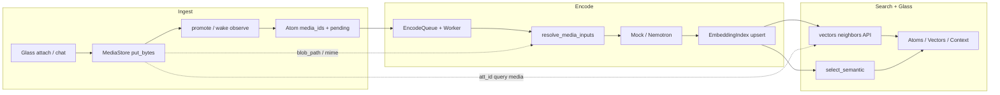
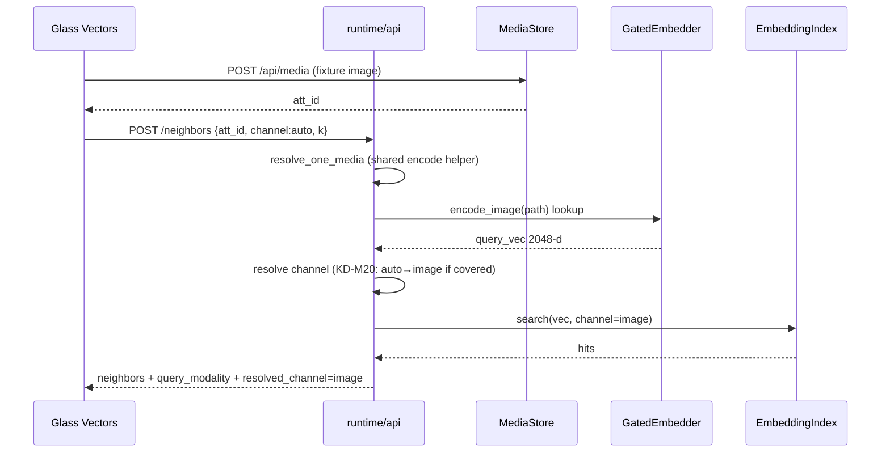

# Design: Multimodal semantic memory buildout (ingest → encode → search → glass)

| Field | Value |
|-------|--------|
| **Class** | DESIGN |
| **Document** | Complete multimodal product loop for Phase 2 semantic / embedding memory |
| **Product** | project-elyra |
| **Author** | Grok Build (design agent) |
| **Date** | 2026-08-05 |
| **Status** | **Shipped (code)** — PR0–PR7 landed on `feature/mm-embed-buildout` (2026-08-05); **ready for merge to `working`**. Hermetic tests green. **Operator live dogfood still pending** (checklist recorded, not signed). **Not** Gate B / product default-on. |
| **Topic branch** | `feature/mm-embed-buildout` (from `working`) |
| **PR base** | `working` (integration tip; house branch law) |
| **Depends on** | Phase 2 PR1–PR9 + rectification PR-R1–R5 + continuous encode (embed-async PR1–PR4) **shipped in code** |
| **Related issues** | Umbrella **[#124](https://github.com/jtwolfe/project-elyra/issues/124)** (this buildout); [#80](https://github.com/jtwolfe/project-elyra/issues/80) (semantic dogfood residual), [#114](https://github.com/jtwolfe/project-elyra/issues/114) (busy encode dogfood), [#115](https://github.com/jtwolfe/project-elyra/issues/115) (GPU packaging — peer, not blocking image path on CPU/mock) |
| **OQ lock** | M1 pin in `memory-embed`; **M2 multimodal-as-query required** (image/audio/video); M3 partial `ready`; M4 umbrella issue |
| **Architecture (as-shipped)** | [architecture/phase-2-semantic.md](../../state/memory/architecture/phase-2-semantic.md) |
| **Operator dogfood (STATE)** | [mm-embed-dogfood.md](../../state/memory/mm-embed-dogfood.md) — checklist open; code-complete claim only |
| **Normative priors** | [design-phase-2-implementation.md](design-phase-2-implementation.md) (historical), [design-phase-2-rectification.md](design-phase-2-rectification.md), [design-nemotron-runtime.md](design-nemotron-runtime.md), [design-embed-async-encode-worker.md](../embed/design-embed-async-encode-worker.md), [design-glass-multimodal-attachments.md](../glass/design-glass-multimodal-attachments.md) |
| **Engineering** | [engineering-principles.md](../../dev/engineering-principles.md) |
| **Out of scope** | Hyperedge formation product (#98-class); Phase 2a traversal polish; Phase 3 procedural; product default-on Gate B for all installs |

> **Ship honesty (2026-08-05):** The **ingest → encode → search → glass** multimodal loop is **complete in code** (MediaStore resolve via `blob_path`/`read_bytes`; durable `embed_media_skipped` + `media_encode` health; media-as-query neighbors API; Atoms/Vectors/Context glass honesty; image + audio/video hermetic matrix). Body sections below retain **design-time gap analysis** as archaeology — do not re-open PR1 as unfixed. **Do not** claim live operator dogfood complete or flip Gate B defaults without signed checklist evidence.

> **Terminology (locked):** This design completes the **multimodal product loop** for Phase 2 **vector ANN / bonded multi-channel embeddings**. It does **not** own hypergraph edge formation or directed traversal product polish. Those follow **after** this buildout (operator sequence: MM → edges → traversal).

---

## Overview

Phase 2 already ships the **plumbing** for multimodal semantic memory:

- Bonded channels `text` / `image` / `audio` / `video` / `joint` (~2048-d) in `elyra/memory/embed/types.py`.
- Promote marks embeddable atoms `pending`; `EncodeWorker` + `EmbedderGate` drain continuously when flags are on (`elyra/memory/embed/worker.py`, `gate.py`, presence wiring).
- `encode_atom` (`elyra/memory/embed/encode.py`) resolves `media_ids` via a MediaStore-like object under a MIME matrix; Nemotron/mock implement per-mod + joint APIs.
- Lance stores `emb_*`; search uses `auto` / joint-primary after rectification; meal semantic + Vectors glass exist.

What is **not** product-complete is the **closed loop operators can trust**:

1. Glass / chat media reliably becomes atom `media_ids` (mostly true via promote + wake paths — **audit residual only**).
2. Encode actually produces **real media channels** when blobs exist (today broken by a **MediaStore path contract gap**).
3. Search / meal can surface media-backed atoms under honest channel selection; **Vectors supports media-as-query**.
4. Glass **Atoms / Vectors / Context** show the same truth as the backend (status, skip reasons, per-channel counts, media previews, query modality).

This design is the **vertical slice** to finish that loop, with **image-first** as the hard gate and audio/video on the same pipeline with tighter caps. Work lands on **`feature/mm-embed-buildout`**, stacked to `working` only after hermetic suite green. **No auto-promote to `main`.**

---

## Background & Motivation

### Why now

- Operator sequence agreed: polish multimodal semantic memory **before** hyperedge formation and traversal depth work.
- Architecture and designs already describe the target; residual is **integrity + dogfood + glass honesty**, not a new embedding theory.
- Dogfood flags can be on (`elyra.toml`: lance + semantic + nemotron) while factory defaults stay safe (off).

### Current state (verified in code, 2026-08-05)

#### Ingest / promote

| Step | Where | Behaviour today |
|------|-------|-----------------|
| Glass attach | `runtime/web/app.js` + `POST /api/media` | Durable `MediaStore`; chat attachments rendered via `/api/media/{id}` |
| Wake media | `presence/worker.py` `_media_ids_from_wake` | Prefers payload `media_ids` / `attachment_ids`; falls back to glass row attachments |
| Promote wake | `promote_wake_observation` | Accepts media-only when text empty |
| Promote beat | `memory/promote.py` `_media_ids_from_beat` | Pulls `media_ids` / `attachment_ids` from beat meta or speak JSON |
| Media-only atoms | promote | Allowed when text empty and media present |
| Fingerprint | `embed/encode.py` `content_fingerprint` | Text + sorted media ids |

#### Encode — critical gap

| Step | Where | Behaviour today |
|------|-------|-----------------|
| Media resolve | `embed/encode.py` `resolve_media_inputs` | First image/audio/video only; oversize / unknown / missing soft-skip into `EncodeResult.meta["embed_media_skipped"]` |
| **MediaStore path gap (verified, blocking)** | `encode.py` L115–142 vs `media/store.py` + `media/types.py` | Resolve looks for `att.path` / `att.local_path` **or** store `resolve_path` / `path_for`. Live **`Attachment` has neither** (`id`, `mime`, `sha256`, `filename`, `kind`, …). Truth is **`sha256` + `MediaStore.blob_path(sha256)`** / `read_bytes(att_id)`. Product path: `get(mid)` succeeds → `path` is `None` → **`{mid}:no_path`** even when blob exists. |
| Existing unit test hides the bug | `tests/test_memory_embed_nemotron.py` `test_resolve_media_matrix_mime_and_oversize` | Uses a fake `_Store.path_for` — **never exercises real MediaStore** |
| MIME field mismatch | encode vs Attachment | Encode reads `mime_type` / `content_type`; Attachment field is **`mime`** |
| Drain wire | `presence/worker.py` | Passes `MediaStore(self.paths)` into drain (correct object; wrong resolve contract) |
| Meta on atom | `embed/queue.py` | Persists `embed_error`, `embed_channels`, `embed_content_fp`, attempts — **does not copy `embed_media_skipped` from `EncodeResult.meta`** |
| Mock | `embed/mock.py` | Full channel contract for CI; `health()` **omits `media_encode`** |
| Nemotron | `embed/runtime.py` | `health()["media_encode"]` when loaded; media needs `qwen_omni_utils.process_mm_info`; without it media soft-skipped; text continues; media-only → `skipped` |
| Deps | `pyproject.toml` `memory-embed` | torch / transformers / torchvision / accelerate / Pillow — **no `qwen-omni-utils` pin** |
| Health surface | `inspect.encoder_health_block` | Does **not** promote `media_encode` from embedder.health() into the Vectors JSON |

#### Search / meal

| Step | Where | Behaviour today |
|------|-------|-----------------|
| Channel resolve | `index.resolve_search_channel` | `auto` → joint-primary when healthy (rectification) |
| Joint-for-single | KD-R1 | Text-only still gets `emb_joint` copy |
| Neighbors API | `GET /api/memory/vectors/neighbors` | `atom_id` **or** free-text `q=` only — **no media query** |
| Query encode | `api.py` ~L1472–1494 | `GatedEmbedder.encode_text` only (lookup priority) |
| Meal semantic | `meal.select_semantic` | Text seed encode + ANN under hard ms budget; hits may include media-backed atoms if joint populated |
| Cross-modal | product intent | Text query hits image atoms **only if** joint is true multimodal (or search channel is image and image vectors exist) |

#### Glass

| Surface | Today | Gap for MM |
|---------|-------|------------|
| Chat | Attachments tray, `/api/media`, markdown `attachment:` | Mostly in place ([design-glass-multimodal-attachments.md](../glass/design-glass-multimodal-attachments.md)) |
| Atoms list/detail | `embedding_status` chip; `media_count` on list row; detail is `atom_to_dict` (has `media_ids`) | No media chips/thumbs, no `embed_channels` / `embed_error` / `embed_media_skipped` UI, no inventory |
| Vectors health | encoder + index + worker + gate | No `media_encode` line; skip-reason summary absent |
| Vectors atoms | status filter + channels column on rows | Need media chip + optional media-backed filter |
| Vectors neighbors | atom id **or free-text q** | **No media-as-query attach/pick** (OQ-M2) |
| Context meal | semantic omit notes + `semantic_select_meta` | Need media marker when hits are media-backed atoms |

### Pain points

1. **Media path contract break (highest severity)** — encode resolve does not speak MediaStore’s blob/sha256 API; media channels may never populate in product despite correct promote. Existing hermetic test uses a path-only double that **masks** the bug.
2. **Silent demotion** — media soft-skip (`mm_utils` missing, MIME, oversize, `no_path`) can leave text-only ready atoms that look “fine” while `emb_image` stays empty; skip list is **not durable** on atom meta from queue.
3. **Glass lag** — operators cannot see `media_encode`, skip reasons, or which channels are populated without reading Lance internals.
4. **No fixed smoke fixtures** under `tests/fixtures/mm_embed/` — hard to claim MM green without a reproducible image→neighbor path.
5. **No media-as-query** — OQ-M2 locked as required; API and glass are text-only for neighbor seed.
6. **Audio/video second class only in practice** — matrix exists but dogfood energy is text-biased.
7. **Open residuals** (#80, #114) can still mask MM truth if text path is flaky under busy PE.

### What must not regress

- Continuous encode invariants (KD-E*): hop never blocks on bulk encode; gate lookup priority for meal/API.
- Rectification channel law: no false `ann_index_built`; joint-for-single; honest meal omit reasons.
- Never store a text-only pool under `emb_image` / `emb_audio` / `emb_video` (Nemotron fail-closed / soft-skip policy).
- Hermetic CI: mock always; no mandatory torch / GPU / real media deps.
- Engineering: modular packages, tests-as-feature, narrow APIs, docs in same change, branch law (`feature/*` → `working`, no casual `main`).

---

## Goals & Non-Goals

### Goals

1. **Closed multimodal product loop** for semantic memory: media on atom → encode channels → searchable → glass-visible.
2. **Image-first hard gate** with contract tests against **real MediaStore** + operator smoke checklist.
3. **Honest encode outcomes**: durable, inspectable reasons for skip/fail/partial media (including `mm_utils_unavailable`).
4. **Search honesty**: neighbors/meal work for media-backed atoms under `auto`/joint; **Vectors query supports text and media-as-query** (image / audio / video attach or pick → encode query vector → neighbors).
5. **Glass parity**: Atoms, Vectors, Context (and chat attach if gaps) match backend capabilities and failure modes.
6. **Deps clarity**: pin `qwen-omni-utils` inside `memory-embed` (soft import); document in README — never hard-fail text-only installs.
7. **Architecture honesty**: update Phase 2 STATE note when loop is dogfood-green; leave default-on to a later Gate B.

### Non-goals

| Non-goal | Deferred to |
|----------|-------------|
| Hyperedge / source-context edge formation product | Follow-on after this branch |
| Directed traversal polish / Graph hypergraph UI | Phase 2a residual issues (#103/#105) |
| Phase 3 success weights | Phase 3 |
| Product default-on `semantic_enabled` for all installs | Gate B + operator sign-off after dogfood |
| PDF / arbitrary document embedding as image | Later |
| Long-form video / streaming audio encode | Out of v1 matrix |
| Full ROCm/Tensile packaging matrix | #115 peer |
| Replacing Grok chat with Nemotron | Never |
| Multi-image bag encode (all images on one atom) | First-wins + skip `channel_full` only (KD-M12) |
| New ANN algorithm / multi-channel fusion ranking | Keep rectification joint-primary |

---

## Product target (locked behaviour)

### Loop

```text
Glass/chat/tool media
  → MediaStore (durable att_id, sha256 blob)
  → promote_beat / wake observe (atom.media_ids + optional text)
  → embedding_status=pending (semantic on)
  → EncodeWorker drain + MediaStore resolve (blob_path / read_bytes)
  → emb_text? emb_image? emb_audio? emb_video? emb_joint?
  → EmbeddingIndex upsert (Lance)
  → meal select_semantic / Vectors neighbors / tools
  → Glass Atoms + Vectors + Context show status + media truth
```



### Modality matrix (v1 product)

| Channel | Accept | Encode rule |
|---------|--------|-------------|
| **text** | `content_text` non-empty | Always when present |
| **image** | png / jpeg / webp (+ best-effort other `image/*`) | First resolvable id under size cap |
| **audio** | wav / mp3 | First under size cap; duration probe optional later (`embed_media_max_seconds` reserved) |
| **video** | mp4 | First under size cap; short clips only (bytes cap) |
| **joint** | ≥1 modality | Multi-mod: true joint encode when model allows; single-mod: joint = copy (KD-R1) |

**First resolvable wins per channel** (already coded). Multiple images on one atom: document as “first image encodes; others listed in skip `channel_full:{mod}`” — multi-image bags are non-goal (KD-M12).

**Size caps:** settings `memory.embed_media_max_bytes` default **8_000_000**; `embed_media_max_seconds` default **30** (documented; v1 enforces bytes only in resolve).

### Readiness semantics

| Outcome | Meaning |
|---------|---------|
| `ready` | Index holds vectors satisfying KD20 (joint or sole non-joint) |
| `pending` | Queued / retryable (including `media_unresolved`) |
| `skipped` | Permanent for this content (kind, empty, mm utils + media-only, …) |
| `failed` | Encode/upsert failed after attempts |

**Partial media** (text ready, image skipped for mm utils) is **allowed** (OQ-M3 / KD20): atom may be `ready` with `embed_channels=["text","joint"]` and durable meta listing media skip reasons. Glass **must** show partial, not “fully multimodal.”

### Search product defaults

| Surface | Default |
|---------|---------|
| Product search channel (text / meal / atom seed) | `auto` (joint-primary when joint healthy — rectification KD-R2) |
| Meal seed | Text seed from meal composition (unchanged); hits may be media-backed atoms via joint |
| Free-text neighbors API | Existing `GET …?q=` path (kept); query vec = `encode_text`; search channel via `resolve_search_channel` as today |
| **Media-as-query** (OQ-M2 locked) | Vectors (and API) accept **image / audio / video** query inputs: upload or existing `att_id` → encode query vector → ANN. **Required for MM complete** — not deferred. |
| **Query-vector ↔ search-channel pairing** | See **KD-M20** (normative). Media-only `auto` prefers the **matching modality channel** when healthy; not naïve joint-primary for sole media seeds. |

### Operator dogfood bar (“MM green”)

With `backend=lance`, `semantic_enabled`, `embed_enabled`, and (for real media) Nemotron + MM utils:

1. Attach a fixture image in Glass → atom shows `media_ids` + pending→ready.
2. Vectors health: `media_encode=true` (or honest false with reason). When backend is mock (including Nemotron→mock fallback), `media_encode=true` means mock accepts media inputs — **not** “Nemotron omni utils ready” (see Health section).
3. `vectors_by_channel.image ≥ 1` (or joint populated from true multi-mod when text+image).
4. Text query related to image content returns the image atom in neighbors under `auto` (or documented channel) when true multi-mod joint or joint-copy path allows it.
5. **Media-as-query (mock hermetic):** fixture image-only atom with KD-R1 joint-copy; image query under `channel=auto` resolves to **`image`** (or joint when image channel empty but joint has coverage) and returns the atom.
6. **Media-as-query (live multi-mod, optional):** text+image true joint fusion — prefer joint query (`q`+`att_id`) + joint search; sole `encode_image` vs fused joint is **not** required to hit (document expectation, do not claim cross-alignment).
7. Meal Context either packs semantic hit or shows honest omit reason (not silent empty).
8. Atoms detail shows media chip + channels + last encode error/skip if any.
9. Confirm no `no_path` / no extensionless-blob `unknown_type` on product MediaStore after PR1.

Mock-only CI proves contract shape; live Nemotron proves real media.

---

## Key Decisions

| ID | Decision | Rationale |
|----|----------|-----------|
| **KD-M1** | **Image-first hard gate**; audio/video same pipeline, secondary acceptance | Highest product value; already in MIME matrix and glass vision path |
| **KD-M2** | **Do not invent a new encoder**; finish Nemotron/mock contract + MediaStore wire | Plumbing exists; risk is integrity and honesty |
| **KD-M3** | **Persist encode diagnostics** on atom meta (`embed_media_skipped`, stable `embed_error` codes) and expose via inspect/API | Glass cannot lie less without data |
| **KD-M4** | **Surface `media_encode` in encoder health** (from `NemotronEmbedder.media_encode_available` / mock `true`; promote in `encoder_health_block`) | Operators diagnose soft-skip without reading logs |
| **KD-M5** | **Pin `qwen-omni-utils` inside `memory-embed`** (OQ-M1); soft import at runtime; never required for hermetic install | Today soft-skip is easy to miss; pin makes install path honest |
| **KD-M6** | **One fixed fixture pack** under `tests/fixtures/mm_embed/` (tiny png + optional wav/mp4) + hermetic tests; live smoke marked `@pytest.mark.memory_embed` / `gpu` | Tests-as-feature; deterministic CI |
| **KD-M7** | **Glass parity in same stack**, not a follow-up epic | “Code works but UI dark” fails definition of done |
| **KD-M8** | **Factory defaults stay off**; operator `elyra.toml` may enable | Gate B not this design |
| **KD-M9** | **#80 / #114 are prerequisites or parallel dogfood**, not re-implemented here | Link and re-verify; do not reopen rectification |
| **KD-M10** | **Branch law**: `feature/mm-embed-buildout` → PR(s) into `working`; hermetic `pytest -m 'not llm and not live_grok'` green before merge; no auto `main` | House process |
| **KD-M11** | **No silent allow of text vectors under media channel names** (keep current fail-closed) | Trust invariant |
| **KD-M12** | **Multi-image bag encode deferred**; first-wins + skip reason is v1 | Avoid scope explosion |
| **KD-M13** | Hyperedges / traversal **explicitly sequenced after** this buildout | Prevents walk polish on weak MM substrate |
| **KD-M14** | **MediaStore is the path authority** — encode resolve uses `get` + `blob_path(sha256)` (or one store helper `resolve_blob_path(att_id)`); prefer **filesystem path** for Nemotron packing when file exists, else **bytes** via `read_bytes`; do **not** require `Attachment.path` | Verified gap; keeps media package cohesive |
| **KD-M15** | **Vectors multimodal-as-query is in scope** (image, audio, video ± optional text) via gated embedder + existing ANN; glass must offer attach/pick UX | OQ-M2 locked 2026-08-04 |
| **KD-M16** | **Prefer `att_id` for media query** after existing `POST /api/media` upload; optional multipart on neighbors is secondary convenience | Reuses size/MIME jail; avoids second upload codepath |
| **KD-M17** | **POST preferred for media-as-query**; keep GET for atom_id / free-text q (backward compatible) | Multipart + large bodies on GET are hostile; glass can use POST |
| **KD-M18** | **Hermetic tests must use real `MediaStore`** for resolve contract (not path_for doubles alone) | Existing test hid PR1 bug |
| **KD-M19** | **Classify modality from `att.mime` (primary) + `att.filename` / `att.kind` (secondary); blob path extension is not reliable** | `blob_path` is `…/blobs/<sha[:2]>/<sha>` with **no extension** — path-only classify → `unknown_type` after path fix |
| **KD-M20** | **Media-as-query channel pairing (positive policy):** media-only seed + `channel=auto` → prefer matching modality channel when `vectors_by_channel[mod] > 0`; else joint if covered; else first sole with coverage. `q`+`att_id` → joint query vec + joint/`auto` joint-primary. Explicit `channel=` always wins. No multi-try (A5 / KD-R16). | Naïve auto→joint misaligns `encode_image` vs true multi-mod fused `emb_joint`; modality-first keeps mock image-only + live image corpus honest |
| **KD-M21** | **One shared media resolve helper** for drain encode and neighbors `att_id` (export from `embed/encode.py`, e.g. `resolve_one_media` / improved `resolve_media_inputs`); API is thin parse → helper → search | Engineering §1 reuse; prevent god-module encode logic in `api.py` |
| **KD-M22** | **Size-check before `read_bytes`**: use `att.byte_size` and/or `stat` on blob path; only load bytes when under `embed_media_max_bytes` and path unavailable | Upload cap 64 MiB ≫ encode 8 MiB; avoid RAM blow on oversize blobs |

---

## Proposed Design

### Modules (touch set — keep narrow)

| Module | Role in buildout |
|--------|------------------|
| `elyra/memory/embed/encode.py` | **PR1 critical:** shared resolve (`resolve_media_inputs` + exportable `resolve_one_media`); blob/sha256; **MIME/filename classify**; size-before-bytes (KD-M14/M19/M21/M22) |
| `elyra/media/store.py` | Thin helper only if needed (e.g. `resolve_blob_path(att_id) -> Path \| None`); no redesign |
| `elyra/memory/promote.py` | Audit per checklist below; fix only proven gaps |
| `elyra/memory/index.py` | Optionally wire `seed_channels` into `resolve_search_channel` for media-auto (today unused / `del seed_channels`); keep pure resolve-once |
| `elyra/memory/embed/queue.py` | Persist `embed_media_skipped` from `EncodeResult.meta` on all outcomes that carry it |
| `elyra/memory/embed/runtime.py` / `mock.py` | `media_encode` in health (mock always true when open); soft-skip consistency |
| `elyra/memory/inspect.py` | `encoder_health_block.media_encode`; atom detail embed diagnostics + media inventory; vector row media fields |
| `elyra/runtime/api.py` | **Thin only:** parse body → shared resolve + gated encode + shared `_neighbors_search(...)` helper for GET/POST — **no** duplicated MIME/path/size logic |
| `elyra/runtime/web/*` | Atoms / Vectors / Context honesty + Vectors media query UX |
| `tests/test_memory_embed_*` + `tests/fixtures/mm_embed/` | Contract + integration; real MediaStore; extensionless blob classify |
| `docs/state/memory/architecture/phase-2-semantic.md` | Honesty banner update at closeout |
| `pyproject.toml` + README | Pin + document `qwen-omni-utils` in `memory-embed` |

**Non-touch (unless bug found):** `loop/`, tool thrash, graph traversal session logic, Phase 3 weights, STT/TTS redesign.

### Shared media resolve (KD-M21 — normative)

**Single implementation** used by:

1. Corpus drain (`encode_atom` → `resolve_media_inputs` for all `media_ids`).
2. Neighbors media-as-query (`att_id` → one resolved input + modality).

Suggested public shapes in `elyra/memory/embed/encode.py` (names flexible):

```python
def resolve_one_media(
    media_store: Any,
    att_id: str,
    *,
    max_bytes: int = _DEFAULT_MEDIA_MAX_BYTES,
) -> dict[str, Any]:
    """Resolve one attachment to {modality, path_or_bytes, mime, skipped_reason?}.

    Shared by encode drain and neighbors. Never raises for missing/oversize —
    returns skipped_reason tokens matching embed_media_skipped style.
    """

def resolve_media_inputs(atom, media_store, *, max_bytes, max_seconds) -> dict:
    """Compose resolve_one_media over atom.media_ids (first-wins per channel)."""
```

`api.py` **must** call this helper (or a one-liner wrapper in `inspect`), not re-implement store/`mime`/caps.

Prefer extracting **`_neighbors_search(...)`** (or module-level function in `inspect` / small `memory/vectors_query.py` if api growth is painful) used by both GET and POST so omit-reason logic is not forked.

### PR1: MediaStore resolve contract (normative algorithm)

Replace path discovery in `resolve_media_inputs` / `resolve_one_media` with MediaStore-native resolution.

**Critical:** content-addressed blob paths have **no extension**. Classification **must not** depend on `Path(blob).suffix`.

```text
for mid in atom.media_ids:
  att = media_store.get(mid)
  if att is None → skip {mid}:missing

  mime = att.mime (primary) or legacy mime_type/content_type
  filename = att.filename or ""
  kind = att.kind  # soft hint only when mime/ext ambiguous

  # --- size BEFORE any full read (KD-M22) ---
  size = att.byte_size if known else None
  path = None
  if store.blob_path and att.sha256:
      candidate = store.blob_path(att.sha256)
      if candidate is file:
          path = candidate
          if size is None: size = path.stat().st_size
  # else legacy path_for / att.path for test doubles (same size/stat rules)

  if size is not None and max_bytes > 0 and size > max_bytes:
      skip {mid}:oversize_bytes:{size}   # do NOT read_bytes
      continue

  # --- classify: mime + filename FIRST; path string secondary ---
  classify_name = filename or (path name only if it has a useful suffix) or ""
  modality = _classify_modality(classify_name, mime)
  if modality is None and kind in (image, audio, video):
      modality = kind   # soft fallback
  if modality is None:
      skip {mid}:unknown_type
      continue

  # --- encode input ---
  if path is file:
      use path_s as encode input (preferred for Nemotron packing)
  elif store has read_bytes:
      data = store.read_bytes(mid)   # only after size check passed
      use bytes as encode input
  else:
      skip {mid}:no_path
```

**Preferred store helper (optional thin method on MediaStore):**

```python
def resolve_blob_path(self, att_id: str) -> Path | None:
    """Return blob filesystem path when meta + blob exist; else None."""
    att = self.get(att_id)
    if att is None or not att.sha256:
        return None
    p = self.blob_path(att.sha256)
    return p if p.is_file() else None
```

**Do not** add `path` / `local_path` fields to `Attachment` unless a separate media design requires them — encode is a consumer of store APIs (KD-M14).

**`_classify_modality` call-site rule (KD-M19):** pass a **display/filename string** (and mime), never rely on extensionless sha path alone. Implementers may extend `_classify_modality` to accept `filename=` explicitly when `path` is content-addressed.

**Hermetic test (PR1 must include):** put real PNG bytes via `MediaStore.put_bytes(..., filename="shot.png")`; assert blob path has **no** `.png` suffix; resolve still yields `image` via `att.mime` / `filename` — no `no_path`, no `unknown_type`.

### Promote / wake ingest audit checklist (PR1)

Ingest is “mostly true”; PR1 **must run this checklist** and only touch promote/presence if a step fails. Exit **“no fix if green.”**

| # | Scenario | Inspect |
|---|----------|---------|
| A1 | Glass chat: attach image → `POST /api/media` → send message with `attachment_ids` | Message row has attachments; wake payload carries `media_ids` / `attachment_ids` |
| A2 | `_media_ids_from_wake` → `promote_wake_observation` | Atom has `media_ids`; media-only (empty text) still promotes when semantic on |
| A3 | Speak / tool beat with `attachment_ids` or `media_ids` in content/meta | `_media_ids_from_beat` → atom `media_ids` |
| A4 | Bound attachment re-send / second wake | Dedupe does not drop media fingerprint incorrectly (`_media_fp`) |
| A5 | Tool-produced media (if product path exists) | Same media_ids → pending path |

**Optional hermetic integration:** attach fixture via MediaStore → synthetic wake/promote → assert `atom.media_ids` non-empty. Only required if any checklist step fails or is untested.

**Code anchors:** `presence/worker.py` `_media_ids_from_wake`, `promote_wake_observation` call site; `promote.py` `_media_ids_from_beat`, `_media_ids_from_wake` consumers; glass `app.js` send with `attachment_ids`.

### Encode diagnostics persistence (queue)

In `EncodeQueue.drain` after `encode_atom`:

```python
# when result.meta has embed_media_skipped, always copy into atom meta updates
skipped = (result.meta or {}).get("embed_media_skipped")
if skipped:
    updates["embed_media_skipped"] = list(skipped)
```

Apply on **ready, failed, skipped, and media_unresolved pending** paths so glass can always read the last skip inventory. Do not clear `embed_media_skipped` on success unless empty (partial success keeps the list).

### Health: `media_encode`

**Definition (normative):** `media_encode` means *this embedder instance can accept media inputs without hard-failing the encode path* (mock hashes media; Nemotron only when `qwen_omni_utils` is loaded). It does **not** mean “production Nemotron multimodal packing is configured.”

| Backend | Rule |
|---------|------|
| `MockEmbedder` | `health()["media_encode"] = True` when open |
| `NemotronEmbedder` | already sets when loaded (`bool(self._mm_info_fn)`); before load may be `None` |
| Mock-fallback wrapper (`open_encoder` when Nemotron unavailable) | Inner is mock → `media_encode=true`, `backend=mock`; keep/forward `requested_backend` / notes so glass can show “mock fallback (media via mock, not omni utils)” |
| `encoder_health_block` | Copy `media_encode` from health when present; else derive: mock backend → true; nemotron without key → false / null with honest error path. Always expose `backend` (existing) next to `media_encode` |

**Optional (not required for Done):** secondary note field `media_encode_note` e.g. `"mock"` vs `"nemotron_mm_utils"` for tooltips.

Glass Vectors health row:

- `media_encode=yes|no|unknown`
- Tooltip when **false**: “install qwen-omni-utils; text-only continues”
- Tooltip when **true** and `backend=mock` (including Nemotron fallback): “Mock accepts media inputs (deterministic hash) — not Nemotron omni packing”
- Tooltip when **true** and `backend=nemotron`: “Nemotron multimodal packing available”

### Media-as-query (API)

#### Keep

`GET /api/memory/vectors/neighbors?atom_id=…|q=…&channel=auto&k=12`

#### Add

`POST /api/memory/vectors/neighbors` with JSON body (preferred) **or** multipart:

**JSON body schema:**

```json
{
  "q": "optional free-text",
  "att_id": "att_…",
  "channel": "auto",
  "k": 12,
  "atom_id": null
}
```

Rules:

| Input combination | Query vector | Search channel when request is `auto` (KD-M20) |
|-------------------|--------------|------------------------------------------------|
| `atom_id` only | Stored emb for resolved channel (existing) | Existing `resolve_search_channel` (joint-primary when healthy) |
| `q` only | `GatedEmbedder.encode_text` | Existing auto (joint-primary) |
| `att_id` only | `encode_{modality}` via shared `resolve_one_media` | Prefer **modality channel** if `vectors_by_channel[mod] > 0`; else joint if covered; else first sole with coverage; reason e.g. `auto_seed_image` / `auto_joint_seed_fallback` |
| `q` + `att_id` | Joint query: `encode_joint` / `encode_atom_inputs` with text+media when `media_encode`; if media unavailable → fail closed (no silent text-only) | Prefer **joint** when healthy; else existing auto sole-modality fallback |
| neither | — | `400` `query_required` |
| Explicit `channel=image` etc. | As above for seed type | **Always** that concrete channel (`explicit`) — no override |

**Channel resolve implementation notes (KD-M20):**

- Product paths remain **resolve-once** (KD-R16); never multi-try search (A5).
- Preferred hook: pass `seed_channels=(modality,)` into `resolve_search_channel` (parameter already reserved, currently `del seed_channels` in `elyra/memory/index.py`) **or** a thin pure helper `resolve_media_query_channel(request, modality, vectors_by_channel, joint_repair_remaining)` next to it that implements the table without breaking text/meal auto semantics.
- When `joint_repair_remaining > 0`, media-auto still avoids locking onto incomplete joint: prefer modality channel if covered, else text/sole as repair policy — document reason string honestly.
- **Dogfood expectation:** mock image-only atoms use KD-R1 joint-copy (`emb_joint == emb_image`); searching **image** or joint both work. Live true multi-mod fusion: sole image query is **not** guaranteed cosine-aligned with fused joint — use modality channel or joint query (`q`+`att_id`) for cross-modal claims.

**Resolution steps for `att_id`:**

1. Validate `att_id` shape (`validate_att_id`); malformed → **400** `invalid_att_id`.
2. Shared `resolve_one_media(store, att_id, max_bytes=…)` (KD-M21) — missing meta → **200** + `omitted_reason=media_missing` (no neighbors); oversize → **400** `media_oversize`; unknown type → **400** `media_unsupported_type`; no blob → **200** + `media_unresolved` or `media_missing`.
3. Ensure gated embedder (`_ensure_embedder` consumer). If None → `omitted_reason=encoder`.
4. If modality is media and not `media_encode` (from health): **fail closed** — `omitted_reason=media_encode_unavailable`, **never** silently run empty text search.
5. Call gated `encode_{modality}` (lookup priority; gate timeout → `encode_failed`).
6. Resolve search channel **once** per KD-M20; `index.search` on concrete channel; same response shape as GET plus query modality fields.

**Response `query` block (extended):**

```json
{
  "atom_id": null,
  "q": "optional text",
  "att_id": "att_abc",
  "query_modality": "image",
  "channel": "auto",
  "resolved_channel": "image",
  "channel_reason": "auto_seed_image",
  "k": 12,
  "source": "media"
}
```

`source` enum: `atom` | `text` | `media` | `text+media`.

**Structured omit / error codes (neighbors):**

| Code | When | HTTP |
|------|------|------|
| `query_required` | no atom_id / q / att_id | **400** |
| `invalid_att_id` | fails `validate_att_id` | **400** |
| `media_missing` | well-formed att_id not in store / no meta | **200** + empty neighbors + `omitted_reason` (glass soft style; match `encoder` / `no_index`) |
| `media_unsupported_type` | modality None after resolve | **400** |
| `media_oversize` | over `embed_media_max_bytes` (checked before load) | **400** |
| `media_encode_unavailable` | media query but media_encode false | **200** + omit (no fake neighbors) |
| `encoder` | no gated embedder | **200** + omit |
| `encode_failed` | gate timeout / encode exception | **200** + omit |
| `no_index` | index None | **200** + omit |
| `no_hits` | search ran empty | **200** + omit |
| `no_vector` | atom seed missing channel | **200** + omit |

**HTTP policy (locked residual OQ-M5):** operational unavailability → **200 + `omitted_reason`**; client input errors → **400**. Do **not** use 404 for missing attachment on neighbors (avoids glass throw paths); 404 remains only for “atom not found” on atom_id seed if already used that way.

**Multipart option (optional convenience in same PR):** `file` field + optional `q` → internal `put_bytes` then same as `att_id` path. Size limited by `MAX_MEDIA_REQUEST_BYTES` (upload) and then embed cap (size-before-read). Prefer documenting JSON+`att_id` as primary (KD-M16).

### Glass requirements (normative)

#### Atoms

- **List row:** existing `embed=` status; show **media count / type chips** when `media_count > 0` or `media_ids` present (API already has `media_count` on list rows).
- **Detail:**  
  - media inventory: for each id, call or include meta (`id`, `kind`, `mime`, `filename`, `url=/api/media/{id}`); image thumbnail via existing serve.  
  - `embed_channels` badges.  
  - `embed_error` if present.  
  - `embed_media_skipped` list if present (partial honesty).  
- Soft-refresh only; do not full-rebuild selection (poll hygiene).

**Inspect enrichment (API):** extend `atom_to_detail` or API wrapper:

```python
# optional media inventory when MediaStore available
detail["embed_channels"] = meta.get("embed_channels") or []
detail["embed_error"] = meta.get("embed_error")
detail["embed_media_skipped"] = meta.get("embed_media_skipped") or []
detail["media"] = [ {id, kind, mime, filename, url}, ... ]  # best-effort
```

Keep secrets out (no blob bytes in JSON).

#### Vectors

- **Health card:** add **`media_encode: yes/no/unknown`**; keep backend, device, queue, worker, gate, `vectors_by_channel` (zeros visible for image/audio/video).
- **Atoms-by-status:** media chip + channels column (channels already partly present).
- **Neighbors:**  
  - keep atom id + free-text.  
  - add **attach/pick** for image/audio/video (reuse chat upload → `POST /api/media` → `att_id`, then POST neighbors).  
  - show active `query_modality`, `resolved_channel`, `channel_reason`, `omitted_reason` (especially `media_encode_unavailable`).  
  - empty states must name media-related reasons.

#### Context

- Semantic section: if item/atom payload includes `media_ids` or meal meta media, show a small media marker on the card.
- No new meal channel name.

#### Chat

- Re-verify attach → message → wake `media_ids` → promote against glass multimodal attachments design using the **PR1 promote/wake audit checklist**; **fix only proven gaps** (no STT/TTS redesign).

### Sequence: media-as-query



---

## API / Interface Changes

### Atom meta (additive)

| Key | Type | When | Glass |
|-----|------|------|-------|
| `embed_error` | str | fail/skip/unresolved (existing) | Atoms detail, Vectors list |
| `embed_channels` | list[str] | success (existing) | Channel badges |
| `embed_media_skipped` | list[str] | **persist** from EncodeResult (new durability) | Atoms detail + optional Vectors summary |
| `embed_content_fp` | str | success (existing) | debug |
| `embed_attempts` | int | existing | debug |
| `embed_encode_ok` | bool | existing | debug |
| `embed_model` / `embed_encoded_at` | str | existing | debug |

### Encode outcome codes (normalize)

Stable tokens for `embed_error` and skip list entries:

| Token | Where |
|-------|--------|
| `kind_skipped` | encode_atom kind filter |
| `no modalities` | empty text + no media resolved |
| `media_unresolved` | media_ids present, none resolved (retryable pending) |
| `media_mm_utils_unavailable` / `*:mm_utils_unavailable` | Nemotron soft-skip / media-only skip |
| `{mid}:missing` | no meta |
| `{mid}:no_path` | **should become rare** after PR1; keep for true blob-missing |
| `{mid}:unreadable` | path not a file |
| `{mid}:oversize_bytes:{n}` | size cap |
| `{mid}:unknown_type` | modality None |
| `{mid}:channel_full:{mod}` | second image/audio/video |
| `{mid}:error` | unexpected resolve exception |
| `encode_failed` | model/forward failure |
| `index_upsert_failed` | upsert false/exception |
| `queue_overflow` | enqueue backpressure |

Prefer reusing existing strings; only add when glass/tests need a stable code. Document in architecture closeout (PR7).

### Encoder health JSON (additive fields)

```json
{
  "ok": true,
  "embed_enabled": true,
  "semantic_enabled": true,
  "backend": "mock",
  "media_encode": true,
  "device": "cpu",
  "dim": 2048,
  "queue_depth": 0,
  "encode_worker": { "...": "..." }
}
```

### Neighbors POST — request/response

See [Media-as-query (API)](#media-as-query-api). Response mirrors GET and adds `query.query_modality`, `query.att_id`, `query.source`.

---

## Data Model Changes

| Layer | Change | Migration |
|-------|--------|-----------|
| Atom scalar schema | **None** — meta is free-form JSON | Additive keys only |
| Lance emb columns | **None** | Existing `emb_*` |
| Attachment | **None** required; optional store helper only | No meta rewrite |
| Settings | **None** required; caps already exist | Document |

No online migration job. Old atoms without `embed_media_skipped` simply show no skip list until re-encode.

---

## Alternatives Considered

### A1. Add `path` field to `Attachment`

| | |
|--|--|
| **Idea** | Persist absolute path on meta so encode’s current getattr works |
| **Pros** | Minimal encode.py diff |
| **Cons** | Breaks content-addressed model; paths move on ELYRA_HOME change; duplicates blob_path; wrong abstraction |
| **Decision** | **Reject** — MediaStore remains path authority (KD-M14) |

### A2. Always pass bytes from `read_bytes` into encode (never paths)

| | |
|--|--|
| **Idea** | Resolve only via `read_bytes`; drop filesystem path |
| **Pros** | Simple; works for any store |
| **Cons** | Large media doubles RAM; Nemotron/`process_mm_info` often prefers paths; video worse |
| **Decision** | **Prefer path when blob file exists; bytes fallback** |

### A3. Defer media-as-query to a later epic

| | |
|--|--|
| **Idea** | Ship encode integrity only; text query for neighbors |
| **Pros** | Smaller PR4/PR5 |
| **Cons** | Violates OQ-M2 lock; MM loop incomplete for operators |
| **Decision** | **Reject** — OQ-M2 required |

### A4. Nested optional extra `memory-embed-mm` for qwen-omni-utils

| | |
|--|--|
| **Idea** | Keep torch extra free of omni utils |
| **Pros** | Smaller install for text-only GPU |
| **Cons** | Operators still miss media dep; OQ-M1 locked pin-inside |
| **Decision** | **Reject** — pin inside `memory-embed` (OQ-M1); soft import remains |

### A5. Multi-try channel search for media queries

| | |
|--|--|
| **Idea** | If image channel empty, fall back to joint then text (multiple searches) |
| **Pros** | More hits in sparse corpora |
| **Cons** | Violates rectification single-resolve law (KD-R16); confuses glass channel honesty |
| **Decision** | **Reject** multi-try. **Instead** use single-resolve **seed-aware auto** (KD-M20): media-only seeds prefer modality channel when healthy, without a second search. Operator may still set explicit `channel=`. |

### A6. Always search joint for media-as-query under auto

| | |
|--|--|
| **Idea** | Keep today’s joint-primary auto for media seeds; rely on KD-R1 joint-copy for image-only |
| **Pros** | Zero change to `resolve_search_channel`; works for mock image-only joint-copy |
| **Cons** | `encode_image` vs true multi-mod fused `emb_joint` is not cosine-safe; silent wrong neighbors on live multi-mod corpus |
| **Decision** | **Reject as default** — KD-M20 modality-first for media-only seeds; joint remains correct for `q`+`att_id` and text-only auto |

---

## Security & Privacy Considerations

| Threat / concern | Mitigation |
|------------------|------------|
| Path traversal via att_id | Existing `validate_att_id` + meta_path jail; encode only opens store-returned blob paths |
| Huge upload as query | Existing `MAX_MEDIA_REQUEST_BYTES` (64 MiB) on POST /api/media; encode/neighbors cap 8 MiB |
| **Oversize blob loaded into RAM** | **KD-M22:** check `att.byte_size` / `stat(blob_path)` **before** `read_bytes`; skip `oversize_bytes` without loading; never `read_bytes` then filter |
| Serving media in atom detail | Only `/api/media/{id}` URLs already path-jailed; no base64 dump in inspect JSON |
| Secrets in health / meta | No model weights paths beyond existing health; no API keys; skip reasons are local codes |
| Auth | Glass is operator console; no new public unauthenticated surface beyond existing runtime API |
| Prompt injection via media | Out of scope for embed (encode only); chat vision path already separate |
| Sandbox RO media | Unchanged; encode reads host MediaStore, not guest paths |

Severity of residual: **low** if PR1 uses store helpers + size-before-read; **medium** if encode ever accepts arbitrary client path strings or reads full blobs before caps (do not).

---

## Observability

| Signal | Where | Notes |
|--------|-------|-------|
| `embed_media_skipped` on atom meta | queue drain | Primary operator/glass truth |
| `media_encode` in encoder health | inspect + Vectors API | Boolean / null |
| Encode worker counters | existing `encode_worker_health_block` | drain_ok_total, etc. |
| `vectors_by_channel` | index health | image/audio/video counts |
| Log: media resolve failures | encode.py debug | Keep; no spam on skip path |
| Structured neighbors omit | API `omitted_reason` | Glass shows without log diving |

**Metrics (process-local is enough for v1):** optional counters later — `encode_media_resolved_total`, `encode_media_skipped_total{reason}`, `neighbors_media_query_total` — not required for MM green if health + meta exist.

**Alerting:** none automated; dogfood checklist is the gate.

---

## Testing strategy

| Layer | Content | Location |
|-------|---------|----------|
| **Unit** | `resolve_one_media` / `resolve_media_inputs` with **real MediaStore** + tiny PNG; **extensionless blob path** + mime/filename classify; oversize **without** read; channel_full; missing blob | `tests/test_memory_embed_*.py` (**PR1**) |
| **Unit** | fingerprint; joint policy; mock `media_encode` | existing + extend (**PR2**) |
| **Contract** | queue persists `embed_media_skipped` on ready/partial; inspect keys; health `media_encode` | **PR2** |
| **Integration** | promote/wake checklist; optional attach → `atom.media_ids`; mock **drain** → ready + channels + meta | **PR1** (ingest) / **PR3** (drain) |
| **API** | POST neighbors att_id; KD-M20 channel_reason; media_missing=200 omit; media_encode false; media_oversize=400 | **PR4** |
| **Hermetic suite** | All of the above under `not llm and not live_grok` | CI |
| **Optional live** | `@pytest.mark.memory_embed` / `gpu`: Nemotron image encode when deps+weights present; skip cleanly otherwise | **PR3** |
| **Regression** | Never place text vector under image channel; **path_for-only doubles insufficient for PR1 done** (KD-M18) | |

**Fixtures:** `tests/fixtures/mm_embed/tiny.png` owned by **PR1** (valid minimal PNG, ≪ 8 MiB); optional `tiny.wav` / short mp4 in **PR6**. No large binaries in git.

**Done criterion for PR1 tests:**

1. `encode_atom(MockEmbedder(), atom, media_store=real_MediaStore)` with stored PNG yields `image` channel **without** `no_path`.
2. Blob path under MediaStore has **no** image extension; classify still succeeds via `mime`/`filename` (no `unknown_type`).
3. Oversized meta (`byte_size` or blob stat > cap) skips with `oversize_bytes` **without** requiring a full successful `read_bytes` of the oversize payload (prefer not calling `read_bytes` at all).

---

## Rollout Plan

| Stage | Action |
|-------|--------|
| Branch | `feature/mm-embed-buildout` from current `working` |
| PR0–PR7 | Linear (or Graphite) stack; each hermetic-green; PR base `working` |
| Feature flags | No new flags; use existing `semantic_enabled` / `embed_enabled` / `backend=lance` |
| Dogfood | Operator enables flags in `elyra.toml`; run MM checklist |
| Rollback | Revert PR(s) on `working`; encode soft-skip paths remain safe; no schema migration to undo |
| Main | **Not** this design — promote later with full suite + human approve |
| Gate B | Separate decision after dogfood |

---

## Risks & mitigations

| Risk | Severity | Mitigation |
|------|----------|------------|
| `qwen_omni_utils` / transformers multimodal brittle | Medium | Soft-skip + health flag; hermetic mock path; optional live only |
| GPU flaky on operator box | Medium | CPU/mock first-class; #115 separate |
| Scope creep into edges/traversal | High if unmanaged | KD-M13; explicit non-goals; refuse expansion |
| Large media binaries in git | Low | Tiny fixtures only; size caps at encode |
| Glass poll flash | Low | Reuse existing soft-refresh patterns |
| Partial encode misread as full MM | Medium | Glass shows channels + skip list (KD-M3/M7) |
| Media-as-query API size / multipart | Low | Prefer att_id after upload; size caps |
| Existing path_for tests give false confidence | High | KD-M18 real MediaStore tests; keep path_for as dual for unit doubles only |
| MIME field mismatch (`mime` vs `mime_type`) | Medium | Read `mime` first (KD-M19) |
| Extensionless blob → `unknown_type` after path-only fix | High | Classify via mime/filename (KD-M19); PR1 extensionless hermetic test |
| `encode_image` vs fused joint misalignment | Medium | KD-M20 modality-first auto for media-only seeds; joint query for text+media |
| Oversize `read_bytes` RAM | Medium | KD-M22 size-before-load |
| Duplicate resolve in `api.py` | Medium | KD-M21 shared helper; thin API |
| Mock fallback misread as Nemotron MM | Low | Health tooltip + backend field next to `media_encode` |

---

## Open questions

### Locked 2026-08-04 (do not re-open)

| ID | Question | Decision |
|----|----------|----------|
| **OQ-M1** | Pin `qwen-omni-utils` inside `memory-embed` vs nested extra? | **Yes — inside `memory-embed`**, soft import; document in README |
| **OQ-M2** | Media-as-query in Vectors? | **Yes — image, audio, and video** as query modalities. API + glass in PR4/PR5 |
| **OQ-M3** | Partial media (text ready, image skipped) keep `ready`? | **Yes** (KD20); glass must show partial channels + skip reasons |
| **OQ-M4** | Open umbrella GitHub issue? | **Yes** — **[#124](https://github.com/jtwolfe/project-elyra/issues/124)** |

### Residual (non-blocking; resolve during implement)

| ID | Question | Default (now locked for implementers) |
|----|----------|--------------------------------------|
| **OQ-M5** | Neighbors media-missing HTTP? | **200 + `omitted_reason=media_missing`** for missing/unresolved well-formed ids; **400** for malformed `att_id` / unsupported type / oversize; **no 404** on neighbors media path |
| **OQ-M6** | Exact PyPI name/version for `qwen-omni-utils`? | Soft import module name is `qwen_omni_utils`. **PR2 Done requires** a concrete `pyproject.toml` entry (version pin **or** explicit lower-bound with README note “unpinned upper bound / soft import”). Do not merge PR2 with zero mention of the package |

---

## Definition of done (branch)

1. PR0–PR7 merged to `working` (or PR6 explicitly deferred with note on umbrella #124).
2. Hermetic suite green on tip (`pytest -m 'not llm and not live_grok'`).
3. Dogfood checklist MM section completed or filed with evidence.
4. Architecture / design status updated (not aspirational).
5. Issues updated (#80/#114 comments; umbrella closed or residual-only).
6. **Not** required: promote to `main`, Gate B default-on, edges, traversal.

---

## Sequencing after this branch (context only)

```text
feature/mm-embed-buildout  →  hyperedge formation  →  traversal polish
     (this design)              (#98-class)            (#103/#105, Graph)
```

Do not start edge/traversal product work on this branch except to fix a hard blocker discovered in MM dogfood.

---

## Dogfood checklist (operator)

**Canonical STATE checklist (PR7):** [docs/state/memory/mm-embed-dogfood.md](../../state/memory/mm-embed-dogfood.md).

Items remain **unchecked** until an operator signs live evidence. Code-complete claim is hermetic suite + architecture honesty, **not** live dogfood.

---

## References

- [engineering-principles.md](../../dev/engineering-principles.md)
- [docs/state/memory/README.md](../../state/memory/README.md)
- [mm-embed-dogfood.md](../../state/memory/mm-embed-dogfood.md) — operator checklist (open)
- [architecture/phase-2-semantic.md](../../state/memory/architecture/phase-2-semantic.md)
- [design-phase-2-rectification.md](design-phase-2-rectification.md)
- [design-nemotron-runtime.md](design-nemotron-runtime.md)
- [spikes/nemotron-runtime.md](spikes/nemotron-runtime.md)
- [design-embed-async-encode-worker.md](../embed/design-embed-async-encode-worker.md)
- [design-glass-multimodal-attachments.md](../glass/design-glass-multimodal-attachments.md)
- [known-bugs.md](../../state/known-bugs.md) BUG-mem-p2-01, BUG-mem-gpu-01
- Code anchors: `elyra/memory/embed/encode.py`, `queue.py`, `runtime.py`, `mock.py`, `gate.py`; `elyra/media/store.py`, `types.py`; `elyra/memory/promote.py`, `inspect.py`, `meal.py`; `elyra/runtime/api.py` vectors endpoints; `elyra/runtime/web/*`; `pyproject.toml` extras

---

## PR Plan

Base: `working`. Topic branch: **`feature/mm-embed-buildout`**. Prefer linear stack or small Graphite stack; each PR hermetic-green before merge to `working`.

```text
PR0  supersede design-mm-embed-buildout.md (implementation-ready)
  │
  ▼
PR1  MediaStore resolve + shared resolve_one_media + promote audit
  │
  ▼
PR2  encode diagnostics + media_encode health + qwen-omni-utils pin
  │
  ▼
PR3  queue drain → ready + joint text+image + optional live
  │
  ├────────────┐
  ▼            ▼
PR4 search/meal + media-as-query API (KD-M20 pairing)
  │
  ▼
PR5 glass — optional split PR5a (health/Atoms) / PR5b (neighbors UX)
  │
  ▼
PR6  audio/video corpus matrix dogfood
  │
  ▼
PR7  docs architecture closeout + dogfood checklist + issue comments
```

### Dependency summary

| PR | Depends on | Parallel? |
|----|------------|-----------|
| PR0 | — | |
| PR1 | PR0 (or together if design already on branch) | |
| PR2 | PR1 | |
| PR3 | PR2 | |
| PR4 | PR3 | includes media-as-query API + KD-M20 |
| PR5 / PR5a | PR2 (health/Atoms); full PR5 or PR5b needs PR4 | PR5a can land before PR4 |
| PR5b | PR4 | neighbors media UX |
| PR6 | PR3 | after PR4/PR5 preferred for full dogfood |
| PR7 | PR4+PR5 (+PR6 if claimed) | |

---

### PR0 — Supersede design (implementation-ready)

| | |
|--|--|
| **PR title** | `docs(memory): supersede MM embed buildout design to implementation-ready (#124)` |
| **Files/components** | `docs/design/memory/design-mm-embed-buildout.md` (**replace** existing 2026-08-04 OQ-locked draft); `docs/design/README.md` catalogue entry if present |
| **Dependencies** | — |
| **Description** | Repo already has a draft design. This PR **supersedes** it with the implementation-ready revision. Delta highlights: MediaStore path gap + real-MediaStore tests (KD-M14/M18); MIME/filename classify on extensionless blobs (KD-M19); size-before-`read_bytes` (KD-M22); shared resolve (KD-M21); media-as-query channel pairing (KD-M20); neighbors POST schema + HTTP omit policy; alternatives A1–A6; promote audit checklist; PR ownership split PR1 vs PR3. No behaviour code changes. |
| **Tests** | n/a |
| **Done** | Updated design on branch / merged; umbrella #124 references design path |

---

### PR1 — MediaStore resolve + shared helper + promote audit

| | |
|--|--|
| **PR title** | `fix(memory): resolve media via MediaStore blob_path for encode (#124)` |
| **Files/components** | `elyra/memory/embed/encode.py` (`resolve_one_media`, `resolve_media_inputs`); optional `elyra/media/store.py` thin `resolve_blob_path`; `elyra/memory/promote.py` only if audit finds gaps; **`tests/fixtures/mm_embed/tiny.png`** (PR1 owns fixture); real-MediaStore tests |
| **Dependencies** | PR0 |
| **Description** | (1) Shared resolve via `get` + `blob_path` / size-before-`read_bytes` (KD-M14, M21, M22). (2) Classify via `att.mime` + `filename` / kind — never extensionless sha path alone (KD-M19). (3) Keep path_for for test doubles only. (4) Run promote/wake audit checklist; fix only proven gaps. (5) Hermetic tests: real MediaStore + PNG → image channel; extensionless blob path; oversize without full read (KD-M18). |
| **Out** | Queue drain readiness polish (PR3); glass; Nemotron weights; health UI; neighbors API |
| **Owns** | Fixture PNG; **resolve + encode_atom** real-MediaStore regression |
| **Done** | `encode_atom` + real MediaStore image → image channel; no `no_path`; no `unknown_type` on extensionless blob; oversize soft-skip without loading full oversize bytes; audit checklist green or fixes landed |

---

### PR2 — Encode diagnostics + deps + health

| | |
|--|--|
| **PR title** | `feat(memory): persist embed_media_skipped + media_encode health (#124)` |
| **Files/components** | `elyra/memory/embed/queue.py`; `elyra/memory/embed/mock.py` health; `elyra/memory/inspect.py` (`encoder_health_block`, `atom_to_detail` / vector rows); `pyproject.toml` `memory-embed` + README for `qwen-omni-utils` |
| **Dependencies** | PR1 |
| **Description** | Persist `embed_media_skipped` on all drain outcomes that produce it; surface `media_encode` (+ backend honesty for mock fallback tooltips); expose embed meta + optional media inventory on atom detail; **list `qwen-omni-utils` in `memory-embed`** (OQ-M1 / KD-M5 / OQ-M6) with pin or documented lower-bound; soft import unchanged. |
| **Out** | UI rendering (API only) |
| **Done** | Unit/contract tests for meta + health keys; **`pyproject.toml` contains the package string**; README documents soft import + “text-only continues without it”; hermetic install still works without installing `memory-embed` |

---

### PR3 — Image-first drain / joint / optional live

| | |
|--|--|
| **PR title** | `test(memory): image-first MM drain, joint, optional live encode (#124)` |
| **Files/components** | tests extending PR1 fixture usage; queue drain → ready path; text+image joint mock; optional live Nemotron under markers |
| **Dependencies** | PR2 |
| **Description** | **Does not re-own** fixture PNG / resolve regression (PR1). Owns: mock **queue drain** → `ready` + durable `embed_channels` + skip list; text+image joint contract; optional live Nemotron image test marked skippable. |
| **Out** | Full glass; neighbors API |
| **Done** | Hermetic drain ready with image channel; live test skips clean without deps |

---

### PR4 — Search / meal honesty + media-as-query API

| | |
|--|--|
| **PR title** | `feat(memory): media-as-query neighbors API + MM search contracts (#124)` |
| **Files/components** | `elyra/memory/embed/encode.py` (consume shared resolve only); `elyra/memory/index.py` or helper for KD-M20 seed-aware auto; **thin** `elyra/runtime/api.py` POST + shared `_neighbors_search` with GET; inspect DTOs if needed; tests |
| **Dependencies** | PR3 |
| **Description** | (1) Corpus: neighbors/`auto` find media-backed mock vectors; meal select safe on media atoms. (2) **Media-as-query (OQ-M2, KD-M15–M17, M20–M21):** POST neighbors with `att_id` and/or `q`; **must** call shared `resolve_one_media`; gated encode; **KD-M20 channel pairing**; fail closed `media_encode_unavailable`; `media_missing` → 200 omit; never silent empty-text search. Keep GET for atom_id/q. No duplicated MIME/path/size logic in `api.py`. |
| **Out** | New ANN algorithm; Graph tab; glass chrome |
| **Done** | Contract tests: text→media-atom; image-query→neighbors with `resolved_channel`/`channel_reason` per KD-M20; audio/video query smoke with mock; error paths (`media_encode` false, missing att, oversize 400) |

---

### PR5 — Glass parity + Vectors media query UX

| | |
|--|--|
| **PR title** | `feat(glass): MM honesty on Atoms/Vectors/Context + media query UX (#124)` |
| **Files/components** | `elyra/runtime/web/index.html`, `app.js`, `style.css` |
| **Dependencies** | PR2 + PR4 (full PR5); **optional split** below |
| **Description** | Atoms media chips + detail inventory + channels/error/skips; Vectors `media_encode` + mock-fallback tooltip + channel counts; Context media marker; **Vectors neighbor panel: text + attach/pick image/audio/video** wired to media-as-query API; show query modality, resolved channel, omit reasons. Reuse MediaStore upload patterns from chat. Soft-refresh only. |
| **Optional split (recommended if PR size hurts review)** | **PR5a** — Atoms honesty + Vectors health `media_encode` (depends **PR2 only**; can merge before PR4). **PR5b** — Neighbors media attach/pick UX (depends **PR4**). Same Done checklist overall. |
| **Out** | Graph tab redesign; STT/TTS product work |
| **Done** | Manual checklist on dogfood + any pure UI tests if present; health/Atoms usable even if 5b follows |

---

### PR6 — Audio / video matrix

| | |
|--|--|
| **PR title** | `test(memory): audio/video MM encode + query matrix (#124)` |
| **Files/components** | fixtures (tiny wav / short mp4 if cheap); encode resolve matrix tests; glass type labels if missing; optional live marks |
| **Dependencies** | PR3 (PR4/PR5 preferred first for full UX) |
| **Description** | Fixture/smoke for wav (and mp4 if cheap); same diagnostics; glass type labels for non-image media; query path already covered in PR4/5. |
| **Out** | Long media, streaming, multi-track |
| **Done** | Hermetic mock paths; live optional |

---

### PR7 — Closeout

| | |
|--|--|
| **PR title** | `docs(memory): MM embed buildout closeout + architecture honesty (#124)` |
| **Files/components** | `docs/state/memory/architecture/phase-2-semantic.md`; memory README; this design Status → **Shipped (code)** / ready for `working` merge; [mm-embed-dogfood.md](../../state/memory/mm-embed-dogfood.md); `docs/design/README.md`; issue comments on #80/#114/#124 |
| **Dependencies** | PR4+PR5 (+PR6 claimed on tip) |
| **Description** | Update architecture Phase 2 honesty banner + memory README for MM loop **code complete** (MediaStore resolve, media-as-query, glass, diagnostics); record dogfood checklist (unchecked — no live sign-off claimed); mark design **Shipped** for merge-to-working. |
| **Out** | Gate B default-on flip (separate decision); claiming live dogfood complete without evidence |
| **Done (PR7)** | Docs honesty matches code; design catalog **Shipped**; dogfood STATE file present with open boxes |

---

## Appendix A — Design-time code anchors (pre-PR1, 2026-08-05)

> **Archaeology only.** Rows describe the gap inventory at design lock. After PR1–PR5 those “broken” surfaces are fixed in code — see architecture Phase 2 MM close-out. Do not re-open as open bugs.

| Claim (design-time) | Anchor |
|-------|--------|
| Attachment has no path | `elyra/media/types.py` `Attachment` fields |
| Store blob authority | `MediaStore.blob_path`, `read_bytes`, `get` |
| Blob path extensionless | `blob_relpath` → `blobs/<sha[:2]>/<sha>` |
| Broken resolve (**fixed PR1**) | was `encode.resolve_media_inputs` path/`path_for` only |
| MIME field name (**fixed PR1**) | Attachment.`mime` (+ filename classify) |
| Skip list not durable (**fixed PR2**) | was `queue.py` omit of `embed_media_skipped` |
| Nemotron health has media_encode | `runtime.py` health dict |
| Mock health lacks media_encode (**fixed PR2**) | was `mock.py` health |
| Health block omits media_encode (**fixed PR2**) | was `inspect.encoder_health_block` |
| Neighbors text-only (**fixed PR4**) | was GET-only; POST media-as-query now |
| Gated media encode exists | `GatedEmbedder.encode_image/audio/video` |
| Wake media_ids | `presence/worker.py` `_media_ids_from_wake` |
| Caps | `memory/config.py` embed_media_max_bytes; `media/upload.py` MAX_MEDIA_REQUEST_BYTES |

---

## Appendix B — Implementation sketch: shared resolve (target)

Illustrative only — **prose algorithm + tests are the source of truth**. Sketch matches size-before-load, MIME/filename classify, and bytes fallback (KD-M19/M22).

```python
def _attachment_mime(att: Any) -> str:
    return str(
        getattr(att, "mime", None)
        or getattr(att, "mime_type", None)
        or getattr(att, "content_type", None)
        or ""
    ).lower()


def resolve_one_media(
    media_store: Any,
    att_id: str,
    *,
    max_bytes: int = _DEFAULT_MEDIA_MAX_BYTES,
) -> dict[str, Any]:
    """Shared by encode drain and neighbors. Returns modality + path_or_bytes or skip."""
    get_att = getattr(media_store, "get", None) or getattr(
        media_store, "get_attachment", None
    )
    if not callable(get_att):
        return {"modality": None, "input": None, "skipped": f"{att_id}:error"}
    att = get_att(att_id)
    if att is None:
        return {"modality": None, "input": None, "skipped": f"{att_id}:missing"}

    mime = _attachment_mime(att)
    filename = str(getattr(att, "filename", None) or "")
    kind = str(getattr(att, "kind", None) or "")
    size: int | None = None
    try:
        if getattr(att, "byte_size", None) is not None:
            size = int(att.byte_size)
    except (TypeError, ValueError):
        size = None

    path_s: str | None = None
    # Product: content-addressed blob (extensionless).
    sha = getattr(att, "sha256", None) or ""
    blob_path_fn = getattr(media_store, "blob_path", None)
    if callable(blob_path_fn) and sha:
        try:
            p = Path(blob_path_fn(sha))
            if p.is_file():
                path_s = str(p)
                if size is None:
                    size = p.stat().st_size
        except (TypeError, ValueError, OSError):
            pass
    # Test doubles / legacy path fields...
    if path_s is None:
        legacy = getattr(att, "path", None) or getattr(att, "local_path", None)
        get_path = getattr(media_store, "resolve_path", None) or getattr(
            media_store, "path_for", None
        )
        if legacy and Path(str(legacy)).is_file():
            path_s = str(legacy)
        elif callable(get_path):
            p = get_path(att_id)
            if p and Path(str(p)).is_file():
                path_s = str(p)
        if path_s is not None and size is None:
            try:
                size = Path(path_s).stat().st_size
            except OSError:
                pass

    # KD-M22: cap BEFORE read_bytes
    if size is not None and max_bytes > 0 and size > max_bytes:
        return {
            "modality": None,
            "input": None,
            "skipped": f"{att_id}:oversize_bytes:{size}",
        }

    # KD-M19: classify from mime + filename; not extensionless sha path
    classify_name = filename
    if not classify_name and path_s and Path(path_s).suffix:
        classify_name = path_s
    modality = _classify_modality(classify_name, mime)
    if modality is None and kind in ("image", "audio", "video"):
        modality = kind
    if modality is None:
        return {"modality": None, "input": None, "skipped": f"{att_id}:unknown_type"}

    if path_s is not None:
        return {"modality": modality, "input": path_s, "skipped": None, "mime": mime}

    read_bytes = getattr(media_store, "read_bytes", None)
    if callable(read_bytes):
        try:
            data = bytes(read_bytes(att_id))
        except FileNotFoundError:
            return {"modality": None, "input": None, "skipped": f"{att_id}:no_path"}
        if not data:
            return {"modality": None, "input": None, "skipped": f"{att_id}:no_path"}
        # Defense in depth if byte_size was missing/wrong
        if max_bytes > 0 and len(data) > max_bytes:
            return {
                "modality": None,
                "input": None,
                "skipped": f"{att_id}:oversize_bytes:{len(data)}",
            }
        return {"modality": modality, "input": data, "skipped": None, "mime": mime}

    return {"modality": None, "input": None, "skipped": f"{att_id}:no_path"}
```

`resolve_media_inputs` loops `atom.media_ids`, calls `resolve_one_media`, applies first-wins per channel + `channel_full` skips.

---

*End of design. Supersede `docs/design/memory/design-mm-embed-buildout.md` via PR0; execute PR1–PR7 on `feature/mm-embed-buildout`.*
