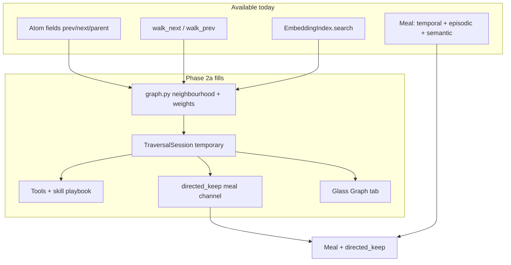
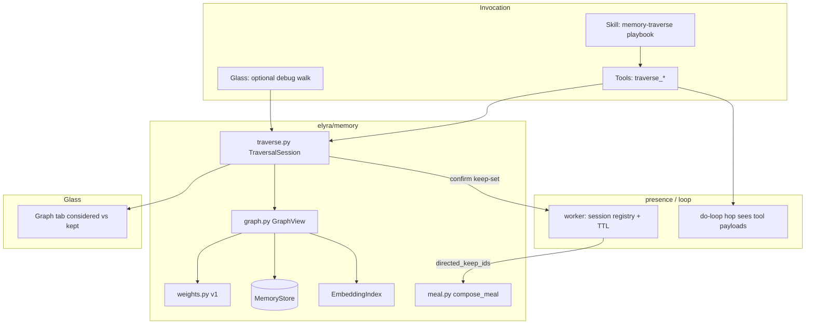
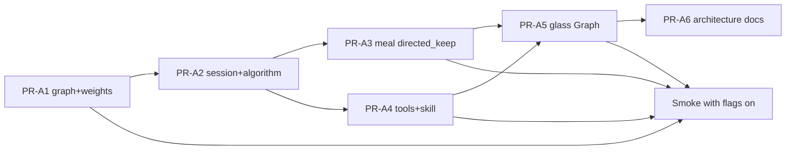

# Stretch 2 Phase 2a — Directed Traversal (Implementation Design + PR Plan)

| Field | Value |
|-------|--------|
| **Class** | DESIGN |
| **Document** | Implementation-ready design + PR plan |
| **Product** | project-elyra |
| **Author** | _(design agent)_ |
| **Date** | 2026-07-29 |
| **Status** | **Ready for `/execute-plan`** (2026-07-29) — OQ-A1–A7 operator-locked; design R2 |
| **Branch** | `grok-improvement-memory` |
| **Depends on** | Phase 1 **Done**; Phase 2 code rectified (PR-R1–R5) with **rectified seeds** (vector ANN + temporal neighbourhood). Operator smoke dogfood of Phase 2 preferred before default-on of 2a, not a hard code gate for PR-A1 types. |
| **Philosophy** | [`docs/memory-atoms.pdf`](../../memory-atoms.pdf) |
| **Baseline** | [`inspiration-activity-model-and-storage.md`](inspiration-activity-model-and-storage.md) |
| **Prior sketch** | [`design-phase-2a-directed-traversal.md`](design-phase-2a-directed-traversal.md) — **superseded for implementation by this doc** |
| **Meal channel** | [`design-context-meal-composition.md`](design-context-meal-composition.md) (directed-keep) |
| **Seeds / Phase 2** | [`architecture/phase-2-semantic.md`](../../stretch-2/architecture/phase-2-semantic.md), [`design-phase-2-rectification.md`](design-phase-2-rectification.md) |
| **Boundary** | Phase 3 procedural weights later ([`design-phase-3-procedural.md`](design-phase-3-procedural.md)); not 2a core |
| **Storage** | [`design-database-choices.md`](design-database-choices.md) — graph behind `elyra/memory/graph.py` |

This document is the **normative implementation design** for Phase 2a. The short sketch (`design-phase-2a-directed-traversal.md`) remains an intent pointer only. Soft influences from `philosophical-soft-guidance.md` inform judgment only; they are not deliverables.

---

## Overview

Phase 2 ships **associative retrieval** as a one-shot vector top-k supporting meal channel (`select_semantic`). That is similarity neighbourhood — not a model-managed walk of the weave. Phase **2a** adds the **only intentional split-brain for retrieval**: a **model-guided, multi-step, budgeted graph traversal** that:

1. **Seeds** from Phase 2 vector search and/or temporal neighbourhood (rectified product path).
2. **Expands** typed edges (structural + soft semantic hops) under deterministic weights.
3. **Chooses** next steps via a thin decision surface (goal, budget remaining, frontier labels + edge reasons, tiny scratchpad) — not a second full meal rewrite mid-walk.
4. **Keeps** a confirmed keep-set of durable atom ids (± optional adjacent structural neighbours).
5. **Emits** a natural-language walk summary plus keep-set for the meal as form:  
   `[I walked through memories about X…] [atom…]`.
6. **Discards** temporary session state on abandon / timeout / budget exhaustion without polluting ladder, temporal spine, or durable meal channels.

Traversal material is **temporary until confirm**. Confirmed keeps enter the meal only via the **`directed_keep`** channel, deduped against open moment, episodic, and semantic.

Glass **Graph** tab becomes the operator observability surface: considered vs kept, walk summary, budgets spent. Feature flags default **off**. Phase 3 success-path weights are extension points only.

---

## Background & Motivation

### Why now

- Essay / inspiration §3.5 requires **bounded multi-hop walk**, temporary candidate buffer, promote keep-set / discard temporary.
- Meal composition already reserves a **directed-keep** supporting channel ([design-context-meal-composition.md](design-context-meal-composition.md)); no code path fills it.
- Phase 2 vector search is **1-hop ANN** into the meal under 50ms — useful but not model-steered exploration of the weave.
- Graph tab is an honest **stub** (`tabs.graph: {stub: true, phase: "2a"}` in `elyra/runtime/api.py`; UI copy in `elyra/runtime/web/index.html`).
- Phase 3 needs real trajectories over real walks; shipping 2a on **empty joint seeds** would amplify noise — rectification (PR-R1–R5) closed the joint-empty product path in code.

### Current-state map (code truth, 2026-07-29)

#### Graph data available today

| Structure | Where | Notes |
|-----------|--------|--------|
| Sequential weave | `Atom.prev_atom_id` / `Atom.next_atom_id` | Written by `promote.py` via `store.update_links`; optional `link_across_moments` |
| Parcel / parent | `Atom.parent_atom_id`; children `kind=parcel` | `parcel.py` + promote; parcels excluded from moment tail / temporal raw fill |
| Sequential walks | `MemoryStore.walk_next` / `walk_prev`; `temporal.walk_forward` / `walk_backward` | Pure chain follow; no weights |
| Temporal range / moment | `list_range`, `list_by_moment`, `moment_tail`, `global_tail` | Primary scaffold for seeds and structural expand |
| Semantic soft neighbourhood | `EmbeddingIndex.search` + `resolve_search_channel` | Rectified `auto` / joint-for-single / Lance-native; meal `select_semantic` may omit (`timeout` / `deduped` / `no_hits` / …) |
| Summary ladder | `ladder.collect_window_sources` | Prefers child summaries else raw non-`summary`/`parcel`/`moment_meta` |

#### Missing for 2a product

| Gap | Impact |
|-----|--------|
| No `elyra/memory/graph.py` | Database-choices interface rule unfulfilled; no neighbourhood API |
| No first-class `Edge` / edge table | Only fields on `Atom`; no typed weight column; Phase 3 cannot yet online-update |
| No traversal session / keep-set / temporary buffer | No isolation or discard path |
| No model decision loop for multi-hop | Only one-shot ANN packing |
| No `directed_keep` meal channel | Composition doc only |
| Graph glass stub | No considered-vs-kept observability |
| No traverse tools / skill | Model cannot invoke walk |
| No edge-weight model | Cannot rank frontier by temporal/structural prior |



### Pain points

| ID | Pain | Severity |
|----|------|----------|
| P1 | Semantic is one-shot; model cannot steer multi-hop relevance under budget | High (product intent) |
| P2 | No temporary hygiene story — risk of ladder/meal contamination if implemented naively | High if wrong |
| P3 | Graph UX empty — operator cannot see weave use | Med |
| P4 | Phase 3 has no session/edge surface to hang success weights on | Med (program order) |
| P5 | Building 2a before rectified seeds | High if ignored — **do not start on empty joint search** (README) |

---

## Goals & Non-Goals

### Goals

1. **Model-guided multi-step traversal** as a skill + thin tools over `elyra/memory/graph.py` and a temporary `TraversalSession`.
2. **Seeds** from rectified Phase 2 vector search **and** temporal neighbourhood (sequential / moment / range).
3. **Expand → choose → budget → keep/discard** loop with hard caps (depth, nodes, tokens of decision surface, **idle TTL**, **per-step expand_ms**, tool-step cap — KD-A18; no multi-hop session wall-clock).
4. **Temporary context hygiene**: session-scoped; discard on abandon/timeout; never enter `collect_window_sources` / ladder / durable unlabeled meal.
5. **Meal `directed_keep` channel**: confirmed keep-set only; dedupe vs open moment / episodic / semantic; labeled `[context:directed-keep]`.
6. **Edge weight model v1**: deterministic temporal + structural (+ semantic-hop score); extension hooks for Phase 3 success multipliers.
7. **Thin decision surface** for mid-walk model calls (or tool-return payloads the hop model already sees) — not a full meal rewrite.
8. **Glass Graph tab**: considered vs kept, walk summary, budgets spent, last session snapshot.
9. **Flags default off**; hermetic tests; architecture note as done gate.
10. **JSONL-capable structural walks**; semantic hops require Lance/index (same as Phase 2).

### Non-goals

| Non-goal | Notes |
|----------|--------|
| Phase 3 continuous weight learning / trajectories as product default | Extension points only |
| Process-ANN / second vector index for procedures | Explicitly not 2a (Phase 3 terminology) |
| Rewriting Phase 1 temporal substrate or Phase 2 encode/ANN core | Reuse as seeds |
| Product default-on of heavy traversal | Flag + skill opt-in |
| Full hypergraph UI / force-directed layout polish | Observability-first Graph tab |
| lance-graph Cypher as hard dependency | Optional later; Python adjacency is v1 authority |
| Materialized durable semantic edge graph as meal authority | Live search remains Phase 2 meal authority for `semantic` channel |
| Fat moment→hops recording of every expand as experience atoms | Isolation: temporary until keep |
| Automatic hop-path traversal every rebuild_outer | Not default; model/tool (or explicit operator) invokes |
| Multi-channel RRF fusion for seeds | Reuse Phase 2 single-channel resolve |

---

## Concept mapping (essay ↔ structures)

| Essay / planning term | Phase 2a structure |
|----------------------|-------------------|
| Weave / connections | `GraphView` neighbourhood over projected edges + soft semantic hops |
| Active use of memory | Directed expand + keep tools / skill playbook |
| Edge strength (v1) | Deterministic weight function on edge kind + temporal distance + optional cosine |
| Temporary candidate buffer | `TraversalSession` in-process (not ladder sources, not durable atoms) |
| Keep-set | Ordered list of durable `atom_id`s confirmed by model/operator |
| Walk narrative | `walk_summary_nl` string for meal + glass |
| Context hygiene | Session status `active` → `confirmed` \| `abandoned` \| `timed_out`; discard drops session |
| Directed-keep meal channel | `MealItem.channel == "directed_keep"`; label `directed-keep` |
| Semantic “reminds me of” | Soft hop via `EmbeddingIndex.search` (ephemeral edge kind `semantic_hop`) |
| Sequential time scaffold | Edge kind `sequential` from prev/next fields |
| Parcel bond | Edge kinds `parent_of` / `child_of` from `parent_atom_id` |
| Procedural prior (later) | Phase 3 multiplies / adds `success` edge kind — **not** required for 2a correctness |
| Split-brain retrieval | Only intentional mid-walk decision surface separate from full meal |

**Critical mapping choice (KD-A1):** keep-set references **existing durable atoms**. Temporary state is the **session** (frontier, considered, scratchpad, budget counters) — we do **not** write temporary Atom rows into the store. That avoids ladder contamination by construction and matches “temporary until keep” without dual-class atom hygiene bugs.

---

## Proposed Design

### High-level architecture



### Ownership (modules)

| Module | Role |
|--------|------|
| `elyra/memory/graph.py` | **New.** Neighbourhood expand, edge projection, soft semantic hops; **no** torch/Lance scatter into loop |
| `elyra/memory/weights.py` | **New.** Pure weight functions + Phase 3 extension hooks |
| `elyra/memory/traverse.py` | **New.** `TraversalSession`, budgets, start/step/keep/finish/abandon, NL summary helper |
| `elyra/memory/meal.py` | `select_directed_keep` + budget slice; order episodic → semantic → **directed_keep** → temporal (see KD-A8) |
| `elyra/memory/tokens.py` | `split_memory_budget_v3` or extend v2 with `directed_keep_cap` when flag on |
| `elyra/memory/config.py` + `elyra/settings.py` | Flags + budget knobs validated |
| `elyra/memory/inspect.py` | Graph/session DTOs for glass |
| `elyra/memory/ladder.py` | **Invariant only:** never read sessions; no kind change required if no temp atoms |
| `elyra/presence/worker.py` | Session registry (by moment / global active), TTL sweep idle, pass keep-set into `compose_meal` |
| `elyra/tools/builtin/memory_traverse.py` (+ `tools/bundled/…`) | Thin tools |
| `skills/bundled/memory-traverse/SKILL.md` | Playbook: when to walk, budgets, stop conditions |
| `elyra/runtime/api.py` + web | Graph tab live; `tabs.graph.stub=false` |

**Presence vs skill:**

| Concern | Owner |
|---------|--------|
| Who **invokes** traversal | **Model** via tools (primary), guided by skill playbook; optional glass debug start |
| Who **stores** session | Presence worker (process-local registry) — single-writer friendly |
| Who **decides** expand/keep | Model (thin surface in tool results / hop chain) — **not** an automatic second brain every rebuild |
| When automatic? | **Not** by default. Optional later: operator flag for “suggest traverse” is out of 2a core |
| Meal inclusion | Worker **`last_confirmed_keep`** (thin keep ids) on **next** `compose_meal` only (KD-A16) |
| Glass last walk | Worker **`last_session`** full finished session DTO (KD-A19); independent of meal thin snapshot |
| GraphView factory | `worker.graph_view()`; tools via `ctx.extras["graph_view"]` + `["traversal"]` |

### Edge model v1

#### Edge kinds (normative)

| `edge_kind` | Source | Durable? | Weight inputs v1 |
|-------------|--------|----------|------------------|
| `sequential` | `prev_atom_id` / `next_atom_id` (both directions as two directed edges or undirected pair) | Projected from atoms | Recency of `dst.t_start`, sequential adjacency bonus |
| `parent_of` / `child_of` | `parent_atom_id` (+ reverse algorithm below) | Projected | Fixed structural prior (high within parcel family) |
| `same_moment` | Shared `moment_id` (optional expand, capped) | Projected soft | Temporal distance within moment |
| `semantic_hop` | Live `EmbeddingIndex.search` from node | **Ephemeral** (not written) | Cosine score (resolved channel) |
| `success` / procedural | Phase 3 | Future table | Reserved — weight multiplier hook returns 1.0 in 2a |

#### Parcel / parent projection algorithm (v1 — no new store index)

`MemoryStore` has **no** `list_children(parent_id)`. PR-A1 must not invent an unbounded O(n)
full-table scan. Normative projection:

| Direction | Algorithm | Cost |
|-----------|-----------|------|
| **`child_of`** (child → parent) | If atom has `parent_atom_id`, emit edge to parent after `get_atom` validates parent exists | O(1) |
| **`parent_of`** (parent → children) | **(1)** Prefer parcel meta: if `meta.first_parcel_id` (and optional `meta.parcel_count`), walk sequential parcel chain from first child via `walk_next` / `next_atom_id`, stop at `parcel_count` or cap `traverse_parcel_child_cap` (default **32**). **(2)** Else if atom has `moment_id`, `list_by_moment(moment_id)` and filter `parent_atom_id == parent` (cap same). **(3)** Else **omit** `parent_of` edges (document in edge reason `parent_of_unavailable`). | O(chain) or O(moment) |
| Non-parcel parents | Same (2)/(3); no reverse index in 2a | |

Tests: parent with `first_parcel_id` yields children; child always links parent; moment-filter path;
omit path when no meta and no moment. JSONL cost of moment scan is acceptable at dogfood N.

#### Projected edge record (logical)

```python
@dataclass(frozen=True)
class GraphEdge:
    src_atom_id: str
    dst_atom_id: str
    edge_kind: str          # sequential | parent_of | child_of | same_moment | semantic_hop
    weight: float           # [0, 1] after clamp
    reason: str             # short label for frontier UI / model
    meta: dict[str, Any]    # e.g. cosine, dt_hours, direction
```

No schema migration required for v1 projection. **Optional** later: Lance `edges` table for Phase 3 online weight updates — behind the same `graph.py` façade (database-choices interface rule).

#### Weight model v1 (pure)

```text
weight = clamp01(
    base(edge_kind)
    * temporal_decay(dst.t_start, now, half_life_hours)
    * structural_bonus(edge_kind)
    * semantic_factor(cosine)   # only for semantic_hop; else 1.0
    * phase3_multiplier(...)    # always 1.0 in 2a
)
```

| Parameter | Default | Notes |
|-----------|---------|-------|
| `base(sequential)` | 0.85 | Strong time scaffold |
| `base(parent_of/child_of)` | 0.90 | Parcel family |
| `base(same_moment)` | 0.55 | Weaker than sequential chain |
| `base(semantic_hop)` | 0.70 | Multiplied by cosine in [0,1] |
| `temporal_half_life_hours` | 72 | Exponential decay on age of **destination** |
| `min_expand_weight` | 0.05 | Drop edges below |

**Extension point (Phase 3):** `phase3_multiplier(src, dst, edge_kind, trajectory_ctx) -> float` injected or no-op. Do not implement success learning in 2a.

### GraphView API

```python
# elyra/memory/graph.py
class GraphView:
    def __init__(
        self,
        store: MemoryStore,
        *,
        index: EmbeddingIndex | None = None,
        embedder: Any | None = None,  # warm only for semantic; None ⇒ structural-only
        settings: MemorySettings | None = None,
        now: datetime | str | None = None,
    ): ...

    def neighbors(
        self,
        atom_id: str,
        *,
        kinds: Sequence[str] | None = None,  # edge kinds filter
        k: int = 12,
        exclude_ids: AbstractSet[str] | None = None,
        allow_semantic: bool = True,
        expand_deadline_ms: int | None = None,  # default settings.traverse_expand_max_ms
    ) -> list[GraphEdge]:
        """1-hop expand sorted by weight desc.

        Semantic hops only if index present AND embedder warm AND allow_semantic.
        Reuse resolve_search_channel + index.search — do not reimplement channel policy.
        On expand_deadline_ms exceed: return structural edges gathered so far + partial
        semantic if any; caller sets expand_truncated.
        """
        ...

    def seed_from_text(
        self,
        query: str,
        *,
        k: int = 8,
        exclude_moment_id: str | None = None,
        expand_deadline_ms: int | None = None,
    ) -> list[tuple[str, float, str]]:
        """Vector seeds → (atom_id, score, reason).

        Empty reasons: no_index | encoder_cold | timeout | no_hits.
        """
        ...

    def seed_temporal(
        self,
        *,
        around_atom_id: str | None = None,
        moment_id: str | None = None,
        k: int = 8,
    ) -> list[tuple[str, float, str]]:
        """Sequential neighbourhood and/or moment sample."""
        ...
```

**JSONL:** structural seeds + expands work; semantic hops/`seed_from_text` return empty with
reason `no_index` (parity with Phase 2 `NullEmbeddingIndex`).

#### Semantic hop latency + cold encoder (normative)

| Condition | Behaviour |
|-----------|-----------|
| `index` is Null / missing | Structural only; reason `no_index` |
| `embedder` None or not warm | Structural only; reason `encoder_cold` — **never** cold-load torch in tools |
| Warm + index | `resolve_search_channel` (same as meal/glass) → `index.search(concrete)` |
| Per-step wall | Entire expand (all selected nodes' neighbors in one step) soft-capped by `traverse_expand_max_ms` |
| **Start seed wall** | **`seed_from_text` only** under one `traverse_expand_max_ms` (or `traverse_start_expand_max_ms` if set; default = same). Temporal + explicit seeds uncapped by expand_ms. Truncate → `expand_truncated` / reason `timeout` |
| Meal semantic omit | **Irrelevant** (KD-A13) — GraphView does not call `select_semantic` |

#### Who constructs GraphView (wiring contract — PR-A2 / PR-A4)

| Surface | Contract |
|---------|----------|
| Presence worker | `worker.graph_view() -> GraphView` builds with `store`, warm `embedder` if already loaded, `index` from `_ensure_embedding_index()` when semantic/embed flags allow. **No** top-level torch import. |
| Tool context | `_build_tool_context` injects `ctx.extras["graph_view"]` (callable or instance) and `ctx.extras["traversal"]` port for session registry. Pattern matches existing `ctx.extras["skills"]`. |
| Glass API | Same factory as worker; fail closed if memory store unhealthy |
| Unit tests | Construct `GraphView(store, index=Null\|Memory, embedder=mock\|None)` directly |

PR-A4 acceptance: tools with Null index return structural walks; mock warm path returns semantic hops; missing extras → `traverse_unavailable` error_reason.

### Traversal algorithm

```mermaid
sequenceDiagram
  participant M as Model (hop)
  participant T as traverse tools
  participant S as TraversalSession
  participant W as Worker registry
  participant G as GraphView
  participant Meal as compose_meal

  M->>T: traverse_start(goal, seed hints)
  T->>S: create active session, budgets
  T->>G: seed_from_text + seed_temporal
  G-->>S: seed nodes → frontier
  T-->>M: thin surface (frontier, budget, scratchpad)

  loop while budget and model continues
    M->>T: traverse_step(expand_ids[] | keep_ids[] | scratchpad)
    T->>G: neighbors(each expand)
    G-->>S: new edges; update considered
    T-->>M: updated frontier + spent
  end

  M->>T: traverse_finish(keep_ids, summary_hint?)
  T->>S: status=confirmed; walk_summary_nl
  T->>W: store last_session full DTO + last_confirmed_keep meal ids
  Note over W,Meal: Glass reads last_session; meal uses keep ids only
  Meal->>W: last_confirmed_keep.keep_ids on next compose_meal
```

#### Steps (normative)

1. **Start**  
   - Inputs: `goal` (short string), optional `seed_query`, optional `seed_atom_ids`, optional budget overrides (clamped to settings max).  
   - Create `TraversalSession` with status `active`, empty keep-set, scratchpad `""`.  
   - Seeds = union of:
     - explicit seed atom ids (validated exist) — **no expand budget** (point lookups only),
     - `seed_from_text(seed_query or goal)` if semantic available — under **one**
       shared deadline `traverse_expand_max_ms` (same default 80 as a step; optional
       settings alias `traverse_start_expand_max_ms` defaulting to **same value**, not 2×,
       unless operator raises it — document reason codes on truncate),
     - `seed_temporal` around open-moment tail / first seed — **free** (structural only; not
       under expand_ms).  
   - Cap seeds at `traverse_max_seeds` (default 8). Mark seeds as **considered**.  
   - Build initial **frontier** = seed nodes with synthetic reason `seed` (+ previews).  
   - Start payload includes `seed_reasons[]` (e.g. `explicit`, `temporal`, `semantic`,
     `encoder_cold`, `no_index`, `timeout` / `expand_truncated`) and `expand_ms_spent`.  
   - On seed encode/search timeout: return structural/explicit seeds that completed; do **not**
     fail the whole start; surface `expand_truncated=true` when semantic leg aborted.

2. **Expand (tool step)**  
   - Model selects up to `traverse_max_expand_per_step` frontier node ids.  
   - For each: `GraphView.neighbors` excluding already-considered (optional re-visit never).  
   - Add destinations to considered; merge into frontier ranked by weight.  
   - Cap frontier size `traverse_frontier_max` (drop lowest weight).  
   - Increment depth metric = max path hops from any seed (session tracks parent pointer for walk tree).

3. **Keep (partial)**  
   - Model may mark atom ids as provisional keep any step (must be in considered).  
   - Keep-set is ordered, deduped; max `traverse_keep_max` (default 16).

4. **Finish**  
   - Active session status → `confirmed`.  
   - Build `walk_summary_nl` (template first — see below).  
   - Optional: expand keep-set with adjacent sequential ±1 if `traverse_keep_adjacent` (default true) and budget allows — still durable ids only.  
   - **Worker dual snapshot (KD-A9 + KD-A19):**  
     1. **`last_session`** — retain the **full** finished `TraversalSession` DTO for glass
        (considered map summary, keep_ids, budgets spent, frontier emptied or frozen,
        walk_summary_nl, status=`confirmed`). This is the Graph tab / `GET …/session` source
        for “last walk.”  
     2. **`last_confirmed_keep`** — **meal-thin** slice: `{keep_ids, walk_summary_nl,
        session_id, goal, finished_at, moment_id}` only.  
   - Both replace any previous counterparts for this moment on finish.  
   - Clear `active_session` after promoting to `last_session` (or keep pointer equivalent).  
   - Glass Graph reads **`active_session` if present else `last_session`** immediately.  
   - Meal packs from **`last_confirmed_keep`** on the **next** `compose_meal` only (KD-A16).

5. **Abandon / idle TTL (active only)**  
   - Applies to the **`active`** session: status → `abandoned` or `timed_out`.  
   - Clears **that session's** provisional keep_set; does **not** clear `last_confirmed_keep`
     or **`last_session`** (last finished walk stays visible on Graph).  
   - Optionally stash abandoned active as glass-only `last_abandoned` (non-goal); v1 may
     drop abandoned active without promoting to `last_session`.  
   - Idle worker GC drops **active** sessions older than `traverse_session_ttl_s` without
     touching confirmed meal or last finished glass session.  
   - Explicit `memory_traverse_clear_keep` clears **meal** snapshot; optional flag
     `clear_glass=true` also drops `last_session` (default false — keep observability).

6. **New start mid-moment (normative)**  
   - At most one **`active`** session per moment.  
   - If an active session exists, new start **abandons active only** (provisional walk discarded).  
   - **`last_confirmed_keep` retained** (meal sticky).  
   - **`last_session` retained** until the next **finish** replaces it (glass still shows
     the walk that fed the meal while a new active walk is in progress — show both:
     “active” + “last finished”).  
   - Second `finish` **replaces both** `last_session` and `last_confirmed_keep` (last finish wins).

#### Thin decision surface (payload shape)

Tool results must stay small (token budget for *surface*, not full atom bodies):

```json
{
  "session_id": "tr_…",
  "status": "active",
  "goal": "…",
  "budget": {
    "nodes_remaining": 40,
    "depth_remaining": 2,
    "steps_remaining": 5,
    "keep_slots_remaining": 10,
    "expand_ms_budget": 80,
    "expand_ms_spent_last": 12
  },
  "frontier": [
    {
      "atom_id": "a_…",
      "label": "≤80 char snippet",
      "preview": "≤400 char body preview for newly expanded nodes",
      "kind": "observation",
      "edge_kind": "semantic_hop",
      "weight": 0.72,
      "reason": "cosine=0.72 via joint"
    }
  ],
  "keep_set": ["a_…"],
  "scratchpad": "≤200 chars model-owned",
  "considered_count": 17,
  "walk_hint": "optional short path labels"
}
```

**Invariant:** mid-walk tools do **not** call `compose_meal` or rebuild outer.

**Content for keep decisions (KD-A17 — normative in v1):**

1. **Frontier `preview`** — every **newly expanded** destination in a `step` result includes
   `preview` ≤ `traverse_preview_chars` (default **400**) of `content_text` (parcel→parent
   body). Seeds on `start` also get previews. Labels stay ≤80 for dense frontier lists.
2. **`memory_traverse_inspect`** — normative tool (not optional). Args: `atom_ids[]`
   (≤ `traverse_inspect_max_ids`). Returns body slices ≤ `traverse_inspect_chars_per_id`
   each, total ≤ `traverse_inspect_max_total_chars`. Fail closed on unknown ids.
3. Skill **must** say: inspect (or rely on preview) **before** keep when the 80-char label
   is insufficient. Do not keep blind ids.
4. Caps are enforced in the tool host; tests required. No unbounded body dumps in `step`
   (respects `loop.tool_result_max_chars` by design of caps).

Meal directed_keep still packs full (budgeted) bodies **after** confirm on subsequent
`compose_meal` — that is for later context, not a substitute for inspect mid-walk.

#### NL walk summary (template v1)

Deterministic template (no extra LLM required for v1):

```text
I walked through memories about {goal_short}.
Considered {n_considered} atoms across {n_steps} steps
(seeds: {seed_kinds}; edges: {edge_kind histogram}).
Kept {n_kept}: {short labels…}.
```

Optional model-provided `summary_hint` (≤240 chars) is appended if present. Meal packing:

```text
[context:directed-keep]
I walked through memories about …
[a_… snippet]
…
```

### Temporary context hygiene

| Rule | Mechanism |
|------|-----------|
| No temporary atoms in store | Session-only state (KD-A1) |
| Ladder isolation | `collect_window_sources` only reads store kinds; no session touch |
| Meal isolation | Only worker **`last_confirmed_keep`** feeds `select_directed_keep` (not active provisional keeps; not full session) |
| Glass last walk | **`last_session`** full DTO (considered vs kept + budgets) until moment end / next finish (KD-A19) |
| Abandon discards | Abandon/TTL clears **active** only; does **not** clear `last_confirmed_keep` or `last_session` |
| New start mid-moment | Abandons active only; meal + last finished glass walk sticky until next finish (KD-A9) |
| Idle TTL | `traverse_session_ttl_s` (default 900); sweeps **active** only |
| Moment end | Abandon **active**; **clear** `last_confirmed_keep` **and** `last_session` |
| Promote / write hooks | Unaffected; keep does not re-promote |
| Semantic meal | Independent; directed_keep does not require semantic channel fill |
| Flags off | Tools **and** glass POST fail closed `traverse_disabled`; meal omits channel |

### Meal directed-keep integration

#### When meal sees keeps (KD-A16 — normative)

`rebuild_outer` → `compose_meal` runs at **moment open** and on **budget re-outer** inside
`enforce_in_turn_budget`. Default `regather_every_n_hops = 0` does **not** re-meal every hop.

| Surface | Timing after `traverse_finish` |
|---------|--------------------------------|
| Glass Graph | **Immediate** — reads `active_session` or **`last_session`** (full walk); meal ids from `last_confirmed_keep` |
| Outer meal `directed_keep` | **Next `compose_meal` only** — next re-outer, moment boundary, or hop if regather N>0 |
| Soft re-outer on finish | **Non-goal** for v1 (not automatic) |

**Skill must teach:** confirmed keeps appear in the **outer** package on the next outer rebuild,
not necessarily the same hop's chain after the tool result. Use `memory_traverse_inspect` for
same-turn body access. Success criteria and PR-A3 match this frequency.

**PR-A3 wiring (worker):** inside existing `rebuild_outer` closure, pass
`directed_keep_ids=self._last_confirmed_keep_ids()` (and summary) into `compose_meal` /
`select_directed_keep`. No new rebuild trigger required for correctness.

#### Budget — `split_memory_budget_v3` (normative math)

| Knob | Default | Role |
|------|---------|------|
| `directed_keep_fraction` | **`0.08`** | Of residual after system+orient when channel active |
| Cut order under temporal floor | semantic → directed_keep → episodic | Protect spine |

```text
# Pure math (tokens.py). All caps integers; residual R = max(0, budget - fixed).

def split_memory_budget_v3(
    budget_tokens, *, system_text, orient_text,
    semantic_enabled, directed_keep_active,  # active ⇒ flag on AND last_confirmed non-empty
    semantic_fraction=0.12,
    directed_keep_fraction=0.08,
    episodic_fraction=0.20,                  # Phase 1 / semantic-off
    episodic_fraction_with_semantic=0.18,
    temporal_min_fraction=0.55,
) -> (fixed, semantic_cap, directed_keep_cap, episodic_cap, temporal_cap):

  fixed = est(system) + est(orient)
  R = max(0, budget - fixed)

  # --- Golden 1: bit-identical v2 when directed_keep inactive ---
  if not directed_keep_active:
    f, s, e, t = split_memory_budget_v2(...)  # existing
    return f, s, 0, e, t

  # --- directed_keep active ---
  if semantic_enabled:
    s = int(R * semantic_fraction)
    d = int(R * directed_keep_fraction)
    e = int(R * episodic_fraction_with_semantic)
  else:
    # semantic off, directed_keep on: use Phase-1 episodic fraction
    s = 0
    d = int(R * directed_keep_fraction)
    e = int(R * episodic_fraction)
  t = R - s - d - e

  # Temporal floor (same spirit as KD20 / v2): deficit cut order
  #   semantic → directed_keep → episodic  (never steal from temporal below floor while R allows)
  floor = int(R * temporal_min_fraction)
  if t < floor:
    deficit = floor - t
    for pool in ("s", "d", "e"):  # semantic first, then dk, then epi
      take = min(deficit, pool_cap)
      pool_cap -= take; deficit -= take
    t = R - s - d - e
    if t < floor:  # fractions impossible: all residual to temporal
      s = d = e = 0; t = R

  assert s + d + e + t == R
  return fixed, s, d, e, t
```

**Golden cases (tests required):**

| Case | Expectation |
|------|-------------|
| flags / empty keep | bit-identical to `split_memory_budget_v2` (incl. semantic on/off) |
| defaults both on, R large | s≈0.12R, d≈0.08R, e≈0.18R, t≈0.62R ≥ 0.55R — **no floor cut** |
| floor pressure | cut s first, then d, then e; t reaches floor before supports starve temporal |
| semantic off, dk on | s=0; e uses `episodic_fraction` (0.20); d from `directed_keep_fraction` |
| R=0 | all caps 0 |

**Rationale for 0.08 (not 0.10):** keeps default support sum 0.12+0.08+0.18=0.38 under the 0.45
implicit support headroom above `temporal_min_fraction=0.55`, so dogfood with semantic+directed_keep
both on does not immediately floor-cut the new channel.

#### Selection `select_directed_keep`

1. Read confirmed keep atom ids from worker/session snapshot.  
2. Load atoms; map parcel hits → parent (same as semantic KD21).  
3. Dedupe: drop ids already in open-moment temporal, episodic, or semantic packed sets.  
4. Pack under `directed_keep_cap` tokens; order = keep-set order.  
5. Prepend single summary `MealItem` (`atom_id=None`, channel `directed_keep`, label `directed-keep/summary`) then atom lines (`label=directed-keep`).  
6. Omit reasons: `disabled` / `empty` / `deduped` / `budget` — surface on `MealPackage.directed_keep_meta` (mirror semantic meta pattern).

#### Message order

**system → episodic → semantic → directed_keep → temporal → orient** (chain by doloop).

Rationale: directed_keep is supporting curated recall, not open-moment spine; place after automatic supports, before temporal so “now” remains last memory block before orient/chain.

#### Dedup priority

| Priority | Channel | Wins |
|----------|---------|------|
| 1 | temporal (open moment) | Always |
| 2 | episodic | Over supports |
| 3 | semantic | Over directed_keep if same id |
| 4 | directed_keep | Lowest among memory channels |

(If operator wants keep to force inclusion even when in semantic, that is a future flag — default dedupe.)

### Budgets (session) — three clocks, not one

**Normative split (KD-A18).** Product traversal is model-stepped across do-loop hops
(`tool → model → tool`). Waiting for the model (or the operator) **must not** burn
graph-compute wall-clock. Three independent budgets:

| Budget class | Knob | Default | Hard max | What it measures |
|--------------|------|---------|----------|------------------|
| **Idle TTL** | `traverse_session_ttl_s` | 900 | 3600 | Wall time since last tool touch; GC / abandon active if idle too long |
| **Per-step expand compute** | `traverse_expand_max_ms` | 80 | 500 | Wall time **inside one** `neighbors` / seed expand (structural + semantic hops); reset each step |
| **Tool-step cap** | `traverse_max_steps` | 8 | 16 | Number of model tool steps (start counts as 0; each `step` +1) |

**Not a session wall-clock.** There is **no** `traverse_wall_clock_ms` session budget.
`wall_ms_remaining` must **not** appear on the thin surface as a multi-hop countdown.
Per-step surface field: `expand_ms_budget` / last step `expand_ms_spent` only.

| Budget | Default | Hard max (settings clamp) |
|--------|---------|---------------------------|
| `traverse_max_depth` | 3 | 6 |
| `traverse_max_nodes` | 48 | 128 |
| `traverse_max_steps` | 8 | 16 |
| `traverse_max_seeds` | 8 | 16 |
| `traverse_frontier_max` | 16 | 32 |
| `traverse_max_expand_per_step` | 3 | 8 |
| `traverse_keep_max` | 16 | 32 |
| `traverse_expand_max_ms` | 80 | 500 |
| `traverse_label_chars` | 80 | 160 |
| `traverse_preview_chars` | 400 | 800 |
| `traverse_inspect_chars_per_id` | 800 | 2000 |
| `traverse_inspect_max_ids` | 4 | 8 |
| `traverse_inspect_max_total_chars` | 2400 | 6000 |
| `traverse_scratchpad_chars` | 200 | 400 |
| `traverse_session_ttl_s` | 900 | 3600 |
| `traverse_semantic_k` | 8 | 16 |
| Decision surface tokens | soft via frontier / preview / inspect caps | — |

Exceed step/node/depth caps → stop further **expand** (finish with partial keep still allowed).
Exceed `traverse_expand_max_ms` mid-step → return partial neighbors for that step with
`expand_truncated=true`; do **not** kill the whole session. Same cap applies to **start**
`seed_from_text` (one budget for the whole seed encode+search); temporal/explicit seeds
are free. Idle TTL expiry → abandon **active** only (`last_confirmed_keep` + `last_session`
retained — KD-A9 / KD-A19).

### Skill vs tools (product shape)

Aligned with [tools-and-skills.md](../../tools-and-skills.md):

| Piece | Form |
|-------|------|
| **Skill** `memory-traverse` | Playbook: when to traverse vs rely on meal semantic; start → inspect → step → finish; stop conditions; meal timing honesty (KD-A16) |
| **Tools** (thin) | `memory_traverse_start`, `memory_traverse_step`, `memory_traverse_inspect`, `memory_traverse_finish`, `memory_traverse_abandon`, optional `memory_traverse_status` / `memory_traverse_clear_keep` |
| **Kind** | `read` (no durable mutation except session registry + meal snapshot) |

Tools registered under `tools/bundled/` with host entry `elyra.tools.builtin.memory_traverse`.
Context: `ctx.extras["graph_view"]` + `ctx.extras["traversal"]` (worker injection; same pattern as skills).

**Not** automatic every hop. Model loads skill when goal needs multi-hop recall; tools fail if
`directed_traversal_enabled` false.

#### Skill discoverability (PR-A4 normative copy)

Catalog shows **name + description only** until `load_skill`. Frontmatter **must** include a sharp
description so the model knows when to load, e.g.:

```yaml
name: memory-traverse
description: >-
  Model-guided multi-hop memory walk when one-shot meal semantic is not enough.
  Use for finding related past atoms under budget; not for ordinary chat.
```

Playbook structure (mirror `web-research` / `browse`):

1. **When to use** — multi-hop / ambiguous recall; meal semantic empty or thin; operator asks to dig.
2. **First tool call (mandatory)** — `memory_traverse_start` with goal (+ optional seed_query).
3. **Loop** — `step` with expand ids; **`inspect` before keep** when preview insufficient; update scratchpad.
4. **Stop conditions** — enough keeps; budgets exhausted; goal answered; abandon if no signal.
5. **After finish** — glass shows keeps immediately; **outer meal** on next rebuild (not guaranteed same hop).
6. **Do not** — rewrite full meal mid-walk; thrash start without finish; keep blind ids.

Optional orient skill-bias line: **non-goal** for 2a (not automatic invocation).

---

## API / Interface Changes

### Python

```python
# traverse.py (public session API)
def start_traversal(...) -> TraversalSession: ...
def step_traversal(session_id, *, expand_ids, keep_ids, scratchpad) -> TraversalView: ...
def inspect_atoms(atom_ids: Sequence[str], *, caps...) -> list[AtomPreview]: ...
def finish_traversal(session_id, *, keep_ids, summary_hint=None) -> TraversalView: ...
def abandon_traversal(session_id) -> TraversalView: ...  # active only; keeps last_confirmed + last_session
def clear_confirmed_keep(*, moment_id: str | None = None, clear_glass: bool = False) -> None: ...
def get_traversal(session_id) -> TraversalSession | None: ...
def get_last_confirmed_keep(moment_id: str | None = None) -> ConfirmedKeepSnapshot | None: ...
def get_last_session(moment_id: str | None = None) -> TraversalSession | None: ...
def get_graph_session_view(moment_id: str | None = None) -> GraphSessionView:
    """Prefer active_session if any; else last_session. For GET /api/memory/graph/session."""
    ...

@dataclass
class ConfirmedKeepSnapshot:
    """Meal-only thin slice — NOT the glass last-walk source."""
    session_id: str
    goal: str
    keep_ids: tuple[str, ...]
    walk_summary_nl: str
    finished_at: str
    moment_id: str | None

@dataclass
class ConsideredNodeSummary:
    atom_id: str
    kind: str | None
    label: str  # ≤ label_chars
    via_edge_kind: str | None
    depth: int
    weight: float | None

@dataclass
class TraversalSession:
    session_id: str
    goal: str
    status: Literal["active", "confirmed", "abandoned", "timed_out"]
    seed_ids: tuple[str, ...]
    considered: dict[str, ConsideredNode]  # full while active; glass may serialize summary list
    frontier: list[FrontierItem]
    keep_ids: list[str]
    scratchpad: str
    walk_summary_nl: str | None
    budgets: BudgetState  # steps/nodes/depth spent+remaining, expand_ms last/budget; NO session wall
    created_at: str
    updated_at: str  # last tool touch (idle TTL basis)
    finished_at: str | None  # set on finish
    moment_id: str | None

# On finish: deep-copy session → worker.last_session (status confirmed);
# derive ConfirmedKeepSnapshot → worker.last_confirmed_keep (keep_ids only for meal).
```

### HTTP (glass Graph)

| Endpoint | Purpose |
|----------|---------|
| `GET /api/memory/graph` | Overview: flag state, has_active / has_last_session, meal keep count, edge-kind legend |
| `GET /api/memory/graph/session` | **`get_graph_session_view`**: active if present else **`last_session`** — considered vs kept, budgets spent (steps/nodes/depth/expand_ms), walk summary. Never meal-thin-only. Query `?which=active\|last\|meal` optional. |
| `GET /api/memory/graph/neighbors?atom_id=` | 1-hop structural (+ optional semantic) for explorer |
| `POST /api/memory/graph/traverse` | Optional operator debug start/step/finish/inspect (same validation + budgets as tools; local trust model) |

Response must **not** dump full atom bodies unbounded; snippets/previews only (same as Vectors).

**Flag fail-closed (PR-A5 acceptance):** when `directed_traversal_enabled` is false, POST returns
the same disabled contract as tools (`ok: false` / `traverse_disabled`); **no** budget bypass.
When flags on, POST uses the same session registry + expand caps as tools. Tests required:
flags-off POST; flags-on budget enforcement parity.

`GET /api/memory` tabs:

```json
"graph": {"stub": false, "phase": "2a"}
```

### Settings (`MemorySettings`)

| Flag / knob | Default |
|-------------|---------|
| `directed_traversal_enabled` | `false` |
| `directed_keep_enabled` | `false` (may auto-follow traversal flag — KD-A10 / OQ-A1) |
| `directed_keep_fraction` | **`0.08`** |
| `traverse_expand_max_ms` | `80` (per-step compute; **not** session wall) |
| All other `traverse_*` budgets | as Budgets table (no session `traverse_wall_clock_ms`) |
| `traverse_keep_adjacent` | `true` |
| `traverse_allow_semantic_hops` | `true` (no-ops without index / cold encoder) |
| `traverse_parcel_child_cap` | `32` |

All validated in `elyra/settings.py` allowlists/ranges.

---

## Data Model Changes

| Change | Migration |
|--------|-----------|
| No Atom schema change for core 2a | schema_version stays 1 |
| No required new Lance columns | Projection from existing fields |
| Optional future `edges` table | Phase 3 / later; not 2a gate |
| In-process session registry | Worker (moment-scoped): **`active_session`** + **`last_session`** (full finished DTO for glass, KD-A19) + **`last_confirmed_keep`** (meal-thin ids only) |
| Optional JSONL debug log | Under `data/memory/traverse/` **off by default**. Operator-local only; may contain **goal text + atom ids/snippets**; GC with session TTL and/or `reset_runtime_state` — treat like other `ELYRA_HOME` logs, not secrets store |
| `MealPackage.directed_keep_meta` | Additive optional field |
| `MealItem.channel` includes `directed_keep` | String channel; no enum break |

Restart: `active_session`, `last_session`, and `last_confirmed_keep` all **lost** (OQ-A2). Within a live process: meal thin snapshot + glass last walk stick until moment end / clear / next finish.

---

## Glass Graph UX

| Element | Behaviour |
|---------|-----------|
| **Session card** | status (active vs last finished), goal; budgets: **steps/nodes/depth remaining+spent**, **expand_ms last/budget**, **idle age** (since `updated_at`) — **no multi-hop wall-clock countdown** (KD-A18) |
| **Walk summary** | `walk_summary_nl` or “no walk yet” |
| **Considered list** | from active or **last_session**: atom_id, kind, snippet, via edge_kind/weight, depth |
| **Kept list** | highlighted subset; order stable (from same session view) |
| **Frontier** | current expand candidates (**active only**; empty/frozen on last finished) |
| **Dual badge** | When both active walk and last finished exist, show “walking…” + “last finished (meal)” |
| **Neighbors probe** | pick atom_id → 1-hop like Vectors neighbors but multi-kind |
| **Empty / disabled** | Honest: flag off, no session, JSONL no semantic hops |
| **Not in scope** | Fancy force layout, Cypher console, edit edges |

Visual treatment: two-tone considered vs kept (CSS classes); reuse Vectors list patterns in `app.js` / `style.css`.

---

## Alternatives Considered

### A1 — Automatic multi-hop inside `select_semantic` / rebuild_outer

| Pros | Cons |
|------|------|
| No tools | Violates “model-guided”; latency on every hop; not temporary isolation; not split-brain intentional skill |

**Reject** as product path. Meal semantic stays one-shot ANN.

### A2 — Write temporary atoms to store with `temporary=true`

| Pros | Cons |
|------|------|
| Queryable history of walks | Ladder contamination risk; promote/hooks complexity; storage churn |

**Reject** for v1 (KD-A1). Session-only.

### A3 — Full lance-graph Cypher first

| Pros | Cons |
|------|------|
| Matches long-term storage doc | Maturity/deps; blocks 2a; structural graph is already field-projectable |

**Reject as gate.** Python `GraphView` first; Cypher optional later behind same façade.

### A4 — Keep-set only via glass operator, no model tools

| Pros | Cons |
|------|------|
| Simple | Misses model-guided goal; not the product skill |

**Reject** as sole path; glass debug optional.

### A5 — Materialize all semantic neighbors as durable edges on encode

| Pros | Cons |
|------|------|
| Fast expand | Graph explosion; stale edges; conflicts with live ANN authority |

**Reject.** Soft hops at expand time only.

### Chosen

**Skill + thin tools + in-process TraversalSession + projected GraphView + directed_keep meal channel + Graph glass observability.**

---

## Security & Privacy

| Topic | Stance |
|-------|--------|
| Tools | Read-only against durable store; session is process-local |
| Glass Graph | Same local operator trust model as Vectors; no raw 2048-d dumps |
| Prompt injection | Retrieved atom text is prior experience; labels mark channel; keep-set is model-selected (same class as semantic) |
| Secrets | Do not put secrets in atom text; traversal does not bypass secret store |
| Session persistence | Default off-disk; if debug log enabled, under `ELYRA_HOME` only (goal + atom ids/snippets; TTL/reset GC) |
| Glass POST | Same flags + budgets as tools; fail closed when disabled (no second brain) |
| Budget abuse | Hard step/node/depth/expand-ms/inspect caps prevent unbounded expand / tool thrash |

---

## Observability

| Signal | Where |
|--------|-------|
| Session status / budgets | Graph tab + tool payloads + worker logs |
| `directed_keep_meta` | MealPackage → inspect → Context muted line |
| Expand counts by edge_kind | Session stats |
| Omit reasons | empty / deduped / disabled / budget |
| Metrics (soft) | INFO logs: start/finish/abandon/timeout; no new telemetry backend |

Alerting: none for single-operator dogfood; fail-soft.

---

## Failure modes

| Failure | Severity | Behaviour |
|---------|----------|-----------|
| Flag off | Low | Tools `traverse_disabled`; meal omits directed_keep |
| No index / JSONL | Low | Structural walk OK; semantic hops empty; seed_from_text empty |
| Cold embedder | Low | Skip semantic hops; structural seeds only |
| Seed empty | Low | Start returns empty frontier + reason; model abandons |
| Per-step expand ms exceed | Low | Partial neighbors + `expand_truncated`; session stays active |
| Idle TTL on active | Low | Abandon **active** only; `last_confirmed_keep` retained |
| Invalid atom id expand | Low | Ignore id + note in payload |
| Worker restart mid-walk | Med | Active + confirmed snapshot lost; model must restart (document) |
| Meal dedupe all keeps | Low | Omit directed_keep with `deduped` |
| Tool thrash many starts | Med | One **active** per moment; new start abandons active **only** (confirmed sticky) |
| Second finish | Low | Replaces `last_confirmed_keep` (last finish wins) |
| Cold embedder / no index | Low | Structural-only seeds/hops + reason codes |
| Ladder regression | High if regressed | Tests: session never in collect_window_sources |
| Flags off glass POST | Low | `traverse_disabled` — same as tools |

---

## Rollout Plan



| Stage | Action |
|-------|--------|
| Merge | Flags **off** |
| Dogfood | Enable `directed_traversal_enabled` + `directed_keep_enabled` with Lance + semantic for full path; JSONL for structural-only |
| Rollback | Flags false → tools fail closed; meal channel empty; Graph shows disabled honesty |
| Default-on | **Not** this design’s gate — after dogfood quality |

Depends on Phase 2 **rectified seeds** for semantic hops; structural path can land and test without semantic.

---

## Tests Strategy (hermetic)

| Area | Tests |
|------|-------|
| Edge projection | sequential both dirs; parent/child; same_moment cap |
| Weights | pure unit: decay, clamp, semantic factor, phase3 no-op |
| Neighbors | exclude_ids; kind filter; k cap; order by weight |
| Session | start→step→finish; abandon active only; idle TTL; one active per moment |
| Confirmed sticky | finish → last_confirmed **and** last_session; new start keeps meal + last glass walk; second finish replaces both; clear_keep |
| Glass after finish | GET session after finish returns considered+kept+budgets from last_session; after new start still returns last finished until next finish |
| Budget clocks | steps/nodes/depth stop expand; expand_max_ms partial on step **and start seed**; **no** session wall timeout across hops |
| Start seed | temporal free; seed_from_text under one expand_ms; timeout → expand_truncated + partial seeds |
| Inspect / preview | preview on expand; inspect caps per id / total; skill path tested via tool |
| Hygiene | keep not in ladder sources; flags off meal parity |
| Parent edges | child_of O(1); parent_of via first_parcel_id chain; moment filter; omit path |
| Meal | directed_keep pack/dedupe/omit meta; **v3 golden cases** (bit-identical v2; both on; floor cut order; semantic-off+dk) |
| Meal timing | compose_meal reads last_confirmed; no auto re-outer on finish unit |
| Tools | disabled; happy path; invalid ids; cold embedder structural-only |
| Graph API | stub→live; session DTO; **flags-off POST disabled**; flags-on budget parity with tools |
| Wiring | extras graph_view/traversal; Null index; mock warm semantic hop |
| Integration | flags off Phase 1/2 golden; structural JSONL + semantic hop with Memory index |

Files (expected):  
`tests/test_memory_graph.py`, `test_memory_weights.py`, `test_memory_traverse.py`, `test_memory_meal_directed_keep.py`, `test_memory_traverse_tools.py`, `test_memory_graph_api.py`, extend `test_settings.py`, `test_memory_flag_fallback.py`.

No torch/GPU/network in CI. Lance tests skip-if-unavailable.

---

## Risks & Mitigations

| Risk | Severity | Mitigation |
|------|----------|------------|
| Mid-walk model costs / thrash | High | Step caps; one active session; skill stop conditions; tool thrash policy existing |
| Empty seeds (semantic not dogfooded) | Med | Structural seeds always; honest empty; README: prefer rectified smoke first |
| Decision surface bloat | Med | Hard frontier/label/preview/inspect/scratchpad caps; tests |
| Confirmed wipe on restart walk | High if regressed | KD-A9 tests: new start must not clear last_confirmed |
| Glass loses considered after finish | High if regressed | KD-A19: last_session full DTO; meal thin separate |
| Session wall-clock false timeout | High if regressed | KD-A18: no multi-hop wall; only expand_ms + idle TTL |
| Dedup removes all keeps | Low | Omit reason; skill teaches seed outside open moment |
| Session loss on restart | Low | Document; temporary by design |
| Phase 3 scope creep into weights | Med | phase3_multiplier no-op; explicit non-goals |
| Glass scope → full graph viz | Low | Observability-only acceptance |
| Contaminating ladder via “helpful” temp atoms | High if wrong | KD-A1 session-only; tests |

---

## Key Decisions

| ID | Decision | Rationale |
|----|----------|-----------|
| **KD-A1** | Temporary state is **session-only**; keep-set = durable atom ids; **no temporary Atom rows** | Ladder/meal contamination avoided by construction; simplest hygiene |
| **KD-A2** | Invocation is **model tools + skill playbook**, not automatic rebuild_outer walks | Matches “model-guided”; only intentional split-brain |
| **KD-A3** | `GraphView` projects structural edges from Atom fields; **semantic_hop** is live ANN, not durable edge write | Reuses Phase 1/2; no premature edge table |
| **KD-A4** | Edge weights v1 are **deterministic** temporal + structural (+ cosine for soft hops); Phase 3 multiplier hook = 1.0 | Locked priors; eval later |
| **KD-A5** | Thin decision surface (ids, labels, weights, reasons, scratchpad) + **preview/inspect for bodies** (KD-A17) | Avoid second full meal mid-walk; still enable responsible keeps |
| **KD-A6** | NL summary is **template-first** with optional model hint | Hermetic, cheap; good enough for meal label |
| **KD-A7** | Meal channel **`directed_keep`**; default fraction **0.08**; floor cut order semantic → directed_keep → episodic | Aligns meal doc; avoids immediate floor-cut when semantic also on |
| **KD-A8** | Message order: episodic → semantic → **directed_keep** → temporal | Curated supports after automatic ANN, before open-moment spine |
| **KD-A9** | One **active** per moment; **`last_confirmed_keep`** (meal) + **`last_session`** (glass) sticky until moment end / clear / next finish; new start abandons **active only**; abandon/TTL never wipe either | Fixes thrash vs meal; last finish wins |
| **KD-A19** | Glass / `GET …/session` use **full `last_session`** (considered vs kept + budgets); meal uses **thin** `last_confirmed_keep` only — never collapse glass to keep ids alone | Graph tab purpose survives finish |
| **KD-A10** | Flags default **off**; `directed_keep_enabled` may default-follow traversal flag but both false out of box | Safe rollback; Phase 2 pattern |
| **KD-A11** | Graph glass is **observability** (considered vs kept), not full hypergraph editor | Scope; matches Vectors honesty pattern |
| **KD-A12** | lance-graph Cypher **not** required for 2a | Python walk is authority; façade ready for later |
| **KD-A13** | 2a **must not depend** on meal semantic packing success | Seeds via GraphView/index directly; meal semantic may omit |
| **KD-A14** | Parcel hits map to **parent** for keep display (same as semantic); **parent_of** reverse via meta chain / moment filter only | Experience chain; no new store index in 2a |
| **KD-A15** | Architecture note required for done (`architecture/phase-2a-directed-traversal.md`) | Stretch 2 documentation obligation |
| **KD-A16** | Finish → glass immediate; outer meal on **next `compose_meal` only**; no soft re-outer on finish in v1 | Matches real `rebuild_outer` frequency; skill teaches honesty |
| **KD-A17** | Normative **`memory_traverse_inspect`** + expand **preview** (400) before keep | Model must not keep blind 80-char labels |
| **KD-A18** | Budgets = **idle TTL** + **per-step expand_ms** + **tool steps** — no multi-hop session wall-clock | Waiting for model must not time out the walk |

---

## Open Questions

Operator locks **2026-07-29**. No further forks for implement — all recommended defaults accepted.

| # | Question | Resolution |
|---|----------|------------|
| **OQ-A1** | Should `directed_keep_enabled` auto-enable when `directed_traversal_enabled` is true? | **Resolved (operator 2026-07-29):** **Yes** — single operator knob for dogfood; still both default false |
| **OQ-A2** | Persist last confirmed keep-set across worker restart within a moment? | **Resolved (operator 2026-07-29):** **No for v1** — temporary; in-process sticky only until moment end |
| **OQ-A3** | Allow glass POST traverse for operators without model? | **Resolved (operator 2026-07-29):** **Yes** read+debug POST under same flags + budgets (local trust); fail closed when off; not a second product brain |
| **OQ-A4** | Include `same_moment` soft edges in v1 expand? | **Resolved (operator 2026-07-29):** **Yes capped** (k≤4) — helps without ANN; disable via kinds filter if noisy |
| **OQ-A5** | Model-call cap vs tool-step cap naming | **Resolved (operator 2026-07-29):** **Tool steps** (`traverse_max_steps`) + per-step `traverse_expand_max_ms`; no session wall; no nested LLM in tools |
| **OQ-A6** | Should finish auto-generate summary via LLM? | **Resolved (operator 2026-07-29):** **No** — template + optional hint only |
| **OQ-A7** | Soft re-outer immediately after finish? | **Resolved (operator 2026-07-29):** **No for v1** (KD-A16) — next natural `compose_meal` only |

---

## Success criteria / definition of done

- [ ] Expand → inspect/preview → keep/discard cycle implemented and hermetically tested  
- [ ] Temporary session cannot enter ladder / `collect_window_sources`  
- [ ] Confirmed keep sticky across new start; abandon does not wipe meal snapshot  
- [ ] **`last_session`** retains considered vs kept + budgets after finish; GET session works without active  
- [ ] No multi-hop session wall-clock; idle TTL + expand_ms + steps only; start seed under expand_ms  
- [ ] Meal labels distinguish directed-keep summary + atoms; omit reasons honest; v3 golden math  
- [ ] Meal packs keeps on next compose_meal (not soft re-outer); glass immediate  
- [ ] Graph tab live (`stub: false`); considered vs kept + budgets + walk summary  
- [ ] Tools + inspect + skill playbook (sharp description); flags default off; flags-off golden parity  
- [ ] Glass POST fail-closed when flags off (parity with tools)  
- [ ] Edge weight v1 + parent reverse algorithm + Phase 3 extension no-op documented  
- [ ] Architecture note `docs/stretch-2/architecture/phase-2a-directed-traversal.md` with structure/activity/invariants/failure maps  
- [ ] README Phase 2a status updated; sketch concept map = session-only (no “temporary flag” atoms)  
- [ ] Dogfood path documented (Lance + semantic for full hops; JSONL structural-only)

---

## Relationship to Phase 2 rectification and Phase 3

| Phase | Relation |
|-------|----------|
| **Phase 2 rectification** | Provides **seeds** (joint-for-single, auto channel, Lance-native search). 2a GraphView.semantic_hop and seed_from_text call the same resolve+search path. Do **not** reimplement ANN. Prefer operator smoke of rectified path before claiming 2a product-complete. |
| **Phase 2 meal semantic** | Remains one-shot supporting channel; **orthogonal** to directed_keep. 2a does not require semantic meal items to be non-empty (KD-A13). |
| **Phase 3** | Adds trajectories + success edge weights; multiplies `phase3_multiplier` / durable edge table. 2a sessions are natural trajectory scaffolding but Phase 3 remains eval-first and out of this stack. |
| **Program order** | Rectification code → dogfood → Gate B (semantic default-on separate) → **2a** → Phase 3 |

```text
Phase 1 temporal  ──done──► Phase 2 semantic (+ rectification)
                                │
                                ▼ seeds
                            Phase 2a directed traversal  (this doc)
                                │
                                ▼ walks + edges surface
                            Phase 3 procedural (eval-first)
```

---

## References

- [design-phase-2a-directed-traversal.md](design-phase-2a-directed-traversal.md) — intent sketch (superseded for implement)  
- [README.md](../../stretch-2/README.md) — program status / next steps  
- [design-phase-2-rectification.md](design-phase-2-rectification.md) — rectified seeds  
- [architecture/phase-2-semantic.md](../../stretch-2/architecture/phase-2-semantic.md) — shipped semantic  
- [design-context-meal-composition.md](design-context-meal-composition.md) — directed-keep channel  
- [design-phase-3-procedural.md](design-phase-3-procedural.md) — weights later  
- [inspiration-activity-model-and-storage.md](inspiration-activity-model-and-storage.md) — §3.5 activities  
- [design-database-choices.md](design-database-choices.md) — `graph.py` interface rule  
- [tools-and-skills.md](../../tools-and-skills.md) — skill vs tool split  
- Code: `elyra/memory/{store,types,meal,tokens,index,ladder,temporal,inspect,config}.py`, `elyra/presence/worker.py`, `elyra/runtime/api.py`, `elyra/runtime/web/*`, `elyra/tools/builtin/skills_tools.py`, `elyra/skills/catalog.py`

---

## PR Plan

Ordered, independently reviewable/mergeable PRs. Flags remain default **off** until dogfood.

### PR-A1 — GraphView + edge projection + weights v1

| Field | Value |
|-------|--------|
| **Title** | `feat(memory): GraphView neighbourhood, edge projection, weight model v1` |
| **Depends on** | Phase 1 store + Phase 2 index (optional for semantic hops) |
| **Files** | `elyra/memory/graph.py` (new), `elyra/memory/weights.py` (new), `elyra/memory/config.py` (read-only knobs if needed), `tests/test_memory_graph.py`, `tests/test_memory_weights.py` |
| **Description** | Implement projected `sequential` / `child_of` / `parent_of` (**normative reverse**: first_parcel_id chain → moment filter → omit) / optional `same_moment` edges; pure weight functions; `neighbors` sorted by weight with `expand_deadline_ms`; optional `semantic_hop` via injected index + warm embedder (empty reasons: no_index/encoder_cold/timeout). Reuse `resolve_search_channel`. No worker/meal/tools. Hermetic structural tests on JSONL + parent reverse cases. |

### PR-A2 — TraversalSession algorithm + budgets + hygiene

| Field | Value |
|-------|--------|
| **Title** | `feat(memory): TraversalSession start/step/finish/abandon with budgets` |
| **Depends on** | PR-A1 |
| **Files** | `elyra/memory/traverse.py` (new), `elyra/memory/config.py` + `elyra/settings.py` (`directed_traversal_enabled`, `traverse_*` knobs incl. expand_ms / start expand / inspect caps — **no session wall_clock**), `elyra/presence/worker.py` (`active_session` + **`last_session`** + `last_confirmed_keep` + idle TTL + moment-close + `graph_view()` factory), `tests/test_memory_traverse.py`, `tests/test_settings.py` |
| **Description** | Full session state machine; seed union (start expand_ms policy); expand/keep; template NL summary; KD-A9 dual sticky snapshots; **KD-A19 last_session for glass**; KD-A18 three clocks; one active per moment; no store temp atoms; flags default off. No meal channel yet. |

**Acceptance (merge checklist):** start→step→finish; abandon active only; new start retains last_confirmed **and** last_session; finish → GET-equivalent view has considered+kept+budgets; idle TTL; expand_ms partial on step and start; settings validation; flags-off inert.

**Optional split if review friction:** **A2a** pure `traverse.py` + unit tests (no worker); **A2b** worker registry + `graph_view()` + moment close + TTL. Same design; renumber only if needed for review — not a product fork.

### PR-A3 — Meal directed_keep channel

| Field | Value |
|-------|--------|
| **Title** | `feat(memory): directed_keep meal channel with budget and dedup` |
| **Depends on** | PR-A2 (confirmed keep-set source) |
| **Files** | `elyra/memory/meal.py`, `elyra/memory/tokens.py` (v3 split), `elyra/presence/worker.py` (`compose_meal` passes keep-set), `elyra/memory/inspect.py` (meta), minimal Context line in `app.js`, `tests/test_memory_meal_directed_keep.py`, flags-off golden |
| **Description** | `select_directed_keep` from worker `last_confirmed_keep`; wire `compose_meal(..., directed_keep_ids=...)` inside existing `rebuild_outer` (KD-A16 — no soft re-outer); `split_memory_budget_v3` with golden cases; dedupe; labels; omit meta; floor cut order; Phase 1/2 parity when flags off or empty keep. |

### PR-A4 — Tools + memory-traverse skill

| Field | Value |
|-------|--------|
| **Title** | `feat(memory): traverse tools and memory-traverse skill playbook` |
| **Depends on** | PR-A2; meal PR-A3 optional for E2E dogfood but tools can finish without meal |
| **Files** | `elyra/tools/builtin/memory_traverse.py`, `tools/bundled/memory_traverse_*/` (start/step/inspect/finish/abandon), `skills/bundled/memory-traverse/SKILL.md`, presence `_build_tool_context` extras injection, `tests/test_memory_traverse_tools.py` |
| **Description** | Thin tools over session API + **inspect**; inject `graph_view`/`traversal` extras; fail closed when disabled; cold encoder structural-only; skill with **sharp description**, First tool call, inspect-before-keep, KD-A16 meal timing, stop conditions. No automatic hop wiring in doloop beyond normal tool execute. |

### PR-A5 — Glass Graph tab + APIs

| Field | Value |
|-------|--------|
| **Title** | `feat(glass): Memory Graph tab — session, considered vs kept, neighbors` |
| **Depends on** | PR-A1–A2; PR-A3 for meal linkage display optional |
| **Files** | `elyra/runtime/api.py`, `elyra/memory/inspect.py`, `elyra/runtime/web/index.html`, `app.js`, `style.css`, `tests/test_memory_graph_api.py` |
| **Description** | Replace Graph stub; endpoints for overview/session/neighbors; session view from **active else last_session** (considered vs kept after finish — KD-A19); tabs.graph stub false; honesty for disabled/empty; optional debug POST with **flags-off fail-closed + budget parity tests** (same as tools). Session card shows expand_ms/steps/nodes/depth/idle age — not multi-hop wall-clock. |

### PR-A6 — Architecture note + program docs

| Field | Value |
|-------|--------|
| **Title** | `docs(memory): Phase 2a directed traversal architecture note` |
| **Depends on** | PR-A3–A5 APIs stable |
| **Files** | `docs/stretch-2/architecture/phase-2a-directed-traversal.md` (new), `docs/stretch-2/README.md` status, pointer updates on sketch + meal doc if needed |
| **Description** | Structure/activity maps, invariants (session hygiene, ladder isolation, KD-A9/A16/A18), failure modes, glossary, concept mapping as shipped. Update intent sketch concept map to **TraversalSession / no temp Atom rows** (drop “temporary flag”). Satisfies Stretch 2 documentation obligation. |

### Packaging vs Stretch 2 phases

```text
Phase 1     temporal — SHIPPED
Phase 2     semantic + rectification — code landed; dogfood pending
Phase 2a    PR-A1–A6 directed traversal — THIS DOCUMENT
Phase 3     procedural / success-path — eval-first; uses edges/sessions later
```

**Out of this stack:** Phase 3 weight learning, lance-graph requirement, default-on traversal, full hypergraph layout, rewriting Phase 1/2 cores, process-ANN.

---

### Revision R1 (2026-07-29) — design review

Addressed review Issues 1–12: wall-clock vs idle TTL vs expand_ms (KD-A18); sticky
`last_confirmed_keep` vs active abandon (KD-A9); normative inspect + preview (KD-A17);
meal timing next-compose only (KD-A16); parent_of reverse algorithm; budget v3 math +
fraction 0.08; GraphView wiring + semantic hop latency; skill discoverability; PR-A2
optional split; debug log privacy; glass POST fail-closed; sketch concept-map pointer for A6.

### Revision R2 (2026-07-29) — residual review

- **KD-A19:** full `last_session` for Graph UX / GET session after finish; meal stays thin
  `last_confirmed_keep`.
- Goals + Session card: drop stale multi-hop “wall-clock” wording (KD-A18).
- Start seed: one `traverse_expand_max_ms` for `seed_from_text`; temporal free; truncate reasons.
- Sequence diagram: meal reads Worker `last_confirmed_keep`, not session object.
- PR-A2: trailing table pipe removed; acceptance includes last_session glass view.

*End of design document. Status: **Ready for `/execute-plan`** (2026-07-29) — OQ-A1–A7 operator-locked.*
