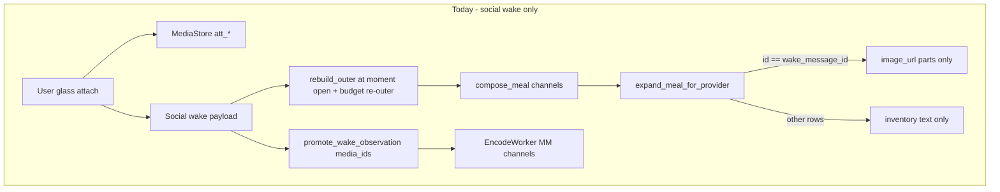
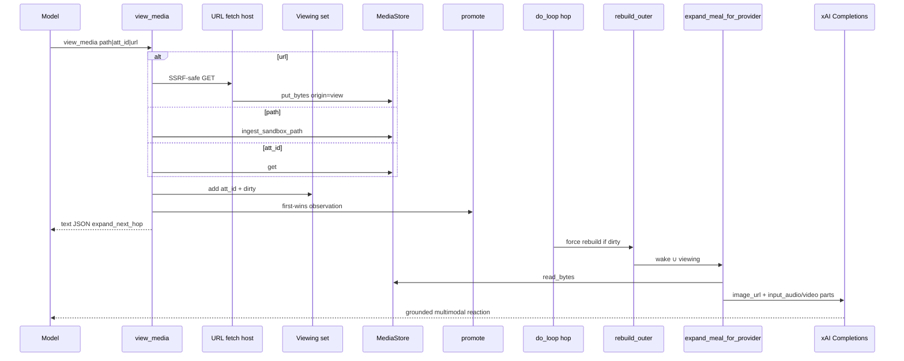
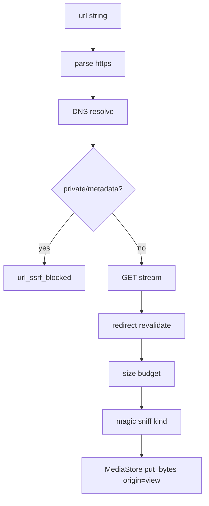
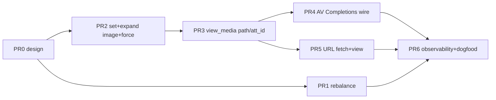

# Design: Multimodal view + outer meal rebalance

| Field | Value |
|-------|--------|
| **Class** | DESIGN |
| **Document** | Host `view_media` + moment viewing set + expand (wake ∪ viewing) for **image/audio/video** Completions perception + force re-outer + URL fetch/view + conservative outer meal rebalance |
| **Product** | project-elyra |
| **Author** | Grok Build (design agent) |
| **Date** | 2026-08-05 |
| **Status** | Draft (rev 3 — OQ-V5/V6 user lock) |
| **Topic branch** | Prefer `feature/view-media-meal-rebalance` off `working` tip after `feature/mm-embed-buildout` merges; may stack on `feature/mm-embed-buildout` if still open |
| **PR base** | `working` (house branch law: `main` ← `working` ← `feature/*`) |
| **Depends on** | Glass multimodal attachments (MediaStore, speak ingest, `expand_meal_for_provider`); MM encode buildout (#124) for breadcrumb encode path (`media_encode` true after qwen-omni-utils) |
| **Normative priors** | [design-glass-multimodal-attachments.md](../glass/design-glass-multimodal-attachments.md), [design-mm-embed-buildout.md](design-mm-embed-buildout.md), [design-instance-continuity-glass-tail-directed-keep.md](design-instance-continuity-glass-tail-directed-keep.md), [design-context-meal-composition.md](design-context-meal-composition.md) |
| **Engineering** | [engineering-principles.md](../../dev/engineering-principles.md), [branch-law.md](../../dev/branch-law.md) |
| **Out of scope** | Product UI "viewing tray"; primary `mode=describe`; multi-moment full-pixel retention; auto-expand all historical media every hop; lowering total meal fraction below 0.5; Responses API rewrite as default chat path; same-hop chain vision inject (v1) |

---

## Overview

Elyra can already **receive** media on social wakes (glass attach → MediaStore → wake image expand) and **send** media via `speak` path ingest. What she cannot do is **pick up and look at** media mid-moment from a sandbox path, prior `att_*`, or a **URL**, get **real Completions multimodal perception** (image **and** audio/video) on the **next model hop**, leave **durable breadcrumbs** for later recall, and keep a **richer long-horizon outer meal** so recent glass and prior-moment media reactions stay in context.

This design adds a host **`view_media` tool** (not a skill) that:

1. Resolves **`path` | `att_id` | `url`** into MediaStore (URL fetch is product-essential; SSRF-aware).
2. Adds `att_id` to a **moment-scoped viewing set** (host working set; not durable identity).
3. Promotes a thin observation atom with `media_ids` when memory write is on (breadcrumb).
4. Sets a moment-local **viewing dirty** flag so the do-loop **forces `rebuild_outer()` before the next `chat_completion`** (KD-V13).
5. Expands **wake ∪ viewing set** to Completions multimodal parts for **image, audio, and video** under caps (KD-V10 / KD-V17) — fail-closed with explicit reason when provider/caps block an item (no fake success).
6. Leaves **memory encode** to the shipped MM pipeline (Nemotron channels) separately from chat perception.

Soft product guidance: prefer short clips; **~10 seconds of video** is the reliable perception/embed horizon (KD-V18). Soft warnings in tool results + TOOL.md; hard duration/size caps on expand and URL fetch.

In parallel, a **conservative outer meal rebalance** thickens glass-tail and episodic horizon without cutting the 250k meal fraction or temporal floor.

Tool results remain text-only JSON; multimodal bytes travel only on the Completions wire via expand after a forced re-outer.

---

## Background & Motivation

### Product failure that motivated this work

Recent dogfood: animal image downloaded to sandbox → model asked to describe it → admitted **no vision tool** and fell back to filename theater. Root causes, verified in code:

| Gap | Code truth |
|-----|------------|
| No mid-moment "look" tool | Tools are disk packages under `tools/bundled/`; no `view_media` |
| Full expand is wake-only and **image-only** | `elyra/media/prompt.py`: `image_url` parts only when `msg["id"] == wake_message_id`; no audio/video Completions parts |
| Tool payloads cannot carry media bytes | Tool chain is text-only JSON `ToolResult` |
| Glass_tail alone ≠ perception | Glass-tail packs user/assistant text; expand still wake-only |
| Re-outer is rare | `doloop.py` calls `rebuild_outer` only at moment open and under in-turn budget pressure; `regather_every_n_hops` defaults to 0 |
| No URL→MediaStore→view path | Open-ended internet learning blocked |
| Long-horizon thin | `EPISODIC_MAX_PRIOR_MOMENTS=12`, glass_tail 4–16 msgs / 0.08 residual, speak/obs keep_last=2 under pressure |

### Current architecture (verified 2026-08-05)



**Meal pipeline** (`elyra/presence/worker.py` builds `rebuild_outer` once per moment; `elyra/loop/doloop.py` invokes it):

```text
# When rebuild_outer runs:
compose_meal / assemble_outer_meal
  → expand_meal_for_provider | expand_memory_meal_for_provider
  → strip_meal_wire_fields
  → state.outer_prefix

# When rebuild_outer does NOT run (typical hop):
# outer_prefix is reused; viewing-set changes are invisible.
```

Channel order (`elyra/memory/meal.py` `compose_outer_messages`):

```text
system → episodic → semantic → directed_keep → glass_tail → temporal → orient
```

**Media expand today** (`elyra/media/prompt.py`):

- Caps: `MAX_VISION_IMAGES=4`, `MAX_VISION_IMAGE_BYTES_TOTAL=20 MiB`.
- Provider gate: xAI + `ELYRA_MEDIA` + `ELYRA_VISION` (local fail-closed inventory notice).
- Non-wake rows: inventory only (`format_inventory_block`: att_id, filename, kind, mime, byte_size, sandbox_relpath).
- **No** Completions audio/video parts implemented in-repo (image_url only).

**Ingest / size** (`elyra/media/upload.py`, `ingest.py`):

- image 20 MiB, audio 25 MiB, file/video 48 MiB; request 64 MiB.
- Encode: `embed_media_max_bytes=8_000_000`, `embed_media_max_seconds=30` (`MemorySettings`) — chat perception uses tighter video guidance (~10s product).

**ToolContext today** (`PresenceWorker._build_tool_context`): injects `wake`, `wake_kind`, `identity`, `users`, `skills`, `graph_view`, `traversal` only — **no** `memory_store` or viewing port.

### Pain points

1. Perception is not a first-class mid-moment host capability.
2. Inventory theater for non-wake media (and today for all AV).
3. No URL fetch → view for open-ended learning.
4. No force re-outer → viewing set would be invisible even if filled.
5. Outer meal tip thin for MM continuity.

### What must not regress

- Text-only / local provider: fail-closed for multimodal expand (inventory + host notices).
- Soft-fail `media_encode` when utils missing (encode ≠ chat perception).
- No base64 in JSONL / glass store; base64 only on Completions wire, then stripped.
- Continuous encode invariants (hop never blocks on bulk encode).
- Hermetic suite: `pytest -m 'not llm and not live_grok'`.

---

## Goals & Non-Goals

### Goals

1. **`view_media` host tool** — resolve **`path` | `att_id` | `url`**; add to moment viewing set; structured errors; clear/drop ops; soft warnings for large/long media.
2. **Moment viewing set** — process-local; lifetime = open moment; multi-modality; clear on finalize.
3. **Guaranteed delivery** — force re-outer before next completion when viewing dirty (KD-V13).
4. **True Completions perception for image, audio, and video** on wake ∪ viewing expand (KD-V10/V17), fail-closed per item.
5. **URL fetch + view** with SSRF-aware host fetch (KD-V18); essential for open-ended learning.
6. **Soft ~10s video guidance** + hard caps so perception/embed stay reliable.
7. **Breadcrumbs** — first-wins promote with `media_ids`; encode via existing queue; recall → re-view.
8. **Conservative outer rebalance** — keep meal fraction 0.5 and `temporal_min_fraction` 0.55.
9. **Security** — path jail, size/duration caps, SSRF controls, no base64 in JSONL, provider gates.
10. **Observability, tests, incremental PRs.**

### Non-goals

| Non-goal | Rationale |
|----------|-----------|
| Product UI "viewing tray" | Host moment set is enough |
| Primary `mode=describe` | Real provider perception when allowed |
| Multi-moment full media parts | Pixels/AV parts moment-local; breadcrumbs + re-view |
| Second durable media keep-tray | Durable id is `att_*` + MediaStore |
| Auto-expand all historical media every hop | Cap explosion; wake ∪ viewing only |
| Lower total meal to ~50k | Keep 0.5 × window |
| Skill-as-capability for perception | Tool is the capability |
| Default rewrite to Responses API | Stay on Completions expand path; may use proven OpenAI-compatible part shapes |
| Long-form video/stream perception | Soft ~10s product horizon; hard duration cap |
| Same-hop chain inject in v1 | Force re-outer (A7 / KD-V13) |

---

## Key Decisions

| ID | Decision | Rationale |
|----|----------|-----------|
| **KD-V1** | **Tool not skill** for perception | Host owns MediaStore, path jail, expand wire, promote, URL fetch. |
| **KD-V2** | **No primary `mode=describe`** | Real provider perception when allowed. |
| **KD-V3** | **No product UI viewing tray** | Moment viewing set is host working set. |
| **KD-V4** | **Expand = wake ∪ viewing set** | Glass_tail alone insufficient for media parts. |
| **KD-V5** | **Tray ≠ durable identity** | Durable id is `att_*` + MediaStore. |
| **KD-V6** | **Media parts moment-local** | Do not multi-moment keep full parts; breadcrumbs + re-view. |
| **KD-V7** | **All modalities: image, audio, video** | Membership, expand, breadcrumbs, encode for all three. |
| **KD-V8** | **Conservative meal rebalance** | Keep meal 0.5 and temporal_min 0.55; modest tip bumps. |
| **KD-V9** | **Tool results stay text-only** | Bytes only on Completions wire after forced re-outer expand. |
| **KD-V10** | **True multimodal Completions perception (image + audio + video)** | v1 product intent: real perception for all three on expand when provider allows. Per-item **fail-closed** if provider/caps/wire block (inventory + explicit reason; never fake success). Chat perception ≠ memory encode. |
| **KD-V11** | **View promote is first-wins observation** | No update-in-place on re-view. |
| **KD-V12** | **Clear viewing set on moment finalize** | No cross-moment media-part leak. |
| **KD-V13** | **Delivery = force re-outer when viewing dirty** | Dirty flag → `rebuild_outer()` before next `chat_completion`. |
| **KD-V14** | **Multi-source resolution: allow combinations; conflict → ambiguous_source** | path / att_id / url; same durable media ok; different media → error. |
| **KD-V15** | **Attachment origin `"view"`** for path/url ingest via view_media | Speak keeps `"speak"`. |
| **KD-V16** | **View observation must not stamp `wake_message_id`** | Avoid wake correlation pollution. |
| **KD-V17** | **AV Completions wire is required product work** | Image proven (`image_url` data URLs). Audio/video wire shapes require **spike + expand extension** if not yet proven against live xAI Completions; ship only after hermetic builders + live dogfood green. Prefer OpenAI-compatible part shapes xAI accepts. |
| **KD-V18** | **URL fetch + view is essential; soft large-media caution; ~10s video horizon** | Host SSRF-aware fetch into MediaStore then same viewing path. Soft warnings in TOOL.md/tool JSON. Hard caps: video expand/perception **≤10s** (product); encode settings may allow up to 30s but chat expand uses 10s. Size caps align with MediaStore (image 20 / audio 25 / video 48 MiB) with optional tighter URL download budget. |

Do **not** reopen KD-V1–V18 lightly.

---

## Proposed Design

### Architecture (target)



### Corrected live-look flow (normative)

```text
view_media (path | att_id | url)
  → resolve to MediaStore att_id (fetch if url)
  → add to moment viewing set + viewing_dirty
  → first-wins promote observation with media_ids (if write_atoms)
  → next hop: force rebuild_outer if dirty
      → expand wake ∪ viewing → Completions parts (image/audio/video under caps)
      → clear dirty
  → enforce_in_turn_budget
  → model grounded work
  → encode path independent (Nemotron); recall → re-view
```

---

### 1. `view_media` tool

#### Package layout

```text
tools/bundled/view_media/
  TOOL.md
  schema.json
  runner.json   → elyra.tools.builtin.media_view:view_media
```

Handler: **`elyra/tools/builtin/media_view.py`**.

#### Schema (v1) — `url` first-class

```json
{
  "type": "object",
  "properties": {
    "path": {
      "type": "string",
      "description": "Sandbox-relative path to ingest and view (e.g. tmp/animal.png)."
    },
    "att_id": {
      "type": "string",
      "description": "Existing MediaStore attachment id (att_*)."
    },
    "url": {
      "type": "string",
      "description": "HTTPS URL to fetch into MediaStore and view. Prefer short clips (~10s video). Large/long media may be rejected or truncated with an explicit reason."
    },
    "op": {
      "type": "string",
      "enum": ["view", "list", "drop", "clear"],
      "description": "view (default): resolve and add. list: current set. drop: remove one att_id. clear: empty set."
    },
    "note": {
      "type": "string",
      "description": "Optional short caption used only on first promote of this att_id this moment (not a describe mode)."
    }
  },
  "additionalProperties": false
}
```

#### Resolution rules (KD-V14 extended for url)

Sources: `path`, `att_id`, `url` (any non-empty combination).

| Input | Behaviour |
|-------|-----------|
| Single `path` | `ingest_sandbox_path` origin=`view` → att_id |
| Single `att_id` | `MediaStore.get` must exist |
| Single `url` | Host fetch → `put_bytes` origin=`view` → att_id (KD-V18) |
| Two or three sources | Resolve each that is present. **Same durable media** (same att_id or matching sha256) → use that att. **Different durable media** → `ambiguous_source`. If only one resolves → use it. |
| No sources | `missing_source` |
| `op=list` / `drop` / `clear` | unchanged (drop requires att_id) |
| No open moment | `no_open_moment` |

**Soft large-media guidance** (always when view succeeds on audio/video, or size > soft thresholds):

```json
"soft_warnings": [
  "Prefer short media: video perception is reliable around ≤10 seconds; longer clips may be truncated or skipped for Completions expand.",
  "Large downloads cost time and tokens; prefer sandbox paths when already local."
]
```

TOOL.md must include the same guidance.

#### Success result examples

**Image (wire perception):**

```json
{
  "ok": true,
  "op": "view",
  "att_id": "att_…",
  "kind": "image",
  "mime": "image/png",
  "byte_size": 12345,
  "source": "path",
  "viewing": ["att_…"],
  "viewing_count": 1,
  "expand_next_hop": true,
  "viewing_dirty": true,
  "presentation": "image_url",
  "perception": true,
  "note": "Host will force-rebuild outer before next completion and expand this image on the Completions wire. Tool payload has no media bytes."
}
```

**Audio/video (wire perception when expand path enabled and under caps):**

```json
{
  "ok": true,
  "att_id": "att_…",
  "kind": "video",
  "mime": "video/mp4",
  "byte_size": 900000,
  "duration_s": 8.2,
  "source": "url",
  "presentation": "input_video",
  "perception": true,
  "soft_warnings": ["Prefer ≤10s video for reliable perception."],
  "note": "Host will expand this video on Completions wire after force re-outer (subject to duration/size caps)."
}
```

**Fail-closed partial (over cap / provider block) — still ok:true for set membership if att stored:**

```json
{
  "ok": true,
  "att_id": "att_…",
  "kind": "video",
  "presentation": "inventory",
  "perception": false,
  "skip_reason": "duration_over_cap",
  "duration_s": 45.0,
  "expand_cap_s": 10,
  "notice": "Video stored and in viewing set; Completions expand skipped (duration 45s > 10s cap). Re-view a shorter clip or trim. Encode may still process under embed caps."
}
```

Never claim `perception: true` when wire parts will not be built.

#### Error reasons (stable)

| reason | When |
|--------|------|
| `missing_source` | no path/att_id/url |
| `ambiguous_source` | sources resolve to different durable media |
| `invalid_att_id` | malformed |
| `not_found` | att or path missing |
| `path_escape` / `is_directory` / `file_too_large` | ingest |
| `unsupported_kind` | tts_cache etc. |
| `url_invalid` | bad scheme/parse |
| `url_ssrf_blocked` | private IP, non-https (if https-only), blocked host |
| `url_redirect_blocked` | too many redirects or redirect to disallowed target |
| `url_timeout` | fetch timeout |
| `url_too_large` | download over budget |
| `url_content_type_rejected` | not media-like after sniff |
| `url_fetch_failed` | HTTP error / network |
| `no_open_moment` | … |
| `media_disabled` | ELYRA_MEDIA=0 |
| `invalid_op` / `os_error:*` | … |

#### Caps (membership + soft thresholds)

| Cap | Default | Notes |
|-----|---------|-------|
| `MAX_VIEWING_SET` | **8** | FIFO by first-add |
| Size (ingest) | image 20 / audio 25 / video|file 48 MiB | existing `max_bytes_for_kind` |
| URL download budget | **min(kind max, 48 MiB)** streaming | abort when exceeded |
| Video expand duration | **10 s** hard for Completions perception | product lock KD-V18 |
| Audio expand duration | **30 s** hard (align encode default; soft warn >15 s) | adjustable in constants |
| Soft warn size | e.g. audio/video > 8 MiB | tool JSON soft_warnings |
| Vision images | 4 / 20 MiB total | shared wake+viewing |
| AV wire counts | **MAX_VISION_AUDIO=2**, **MAX_VISION_VIDEO=1** | keep Completions body sane |

FIFO re-view: no reorder; always dirty on successful `op=view`.

---

### 2. Moment viewing set — state & injection

Unchanged from rev 2 in structure:

- `PresenceWorker._moment_viewing` / `_viewing_dirty`
- `elyra/media/viewing.py` helpers
- `ctx.extras["moment_viewing"]` + `ctx.extras["memory_store"]` in `_build_tool_context`
- Snapshot under lock; expand lock-free
- Clear on finalize

`ViewingEntry` may carry optional `duration_s` when known (probe on ingest/fetch; best-effort).

---

### 3. Vision delivery trigger (KD-V13) — force re-outer

Unchanged: dirty → `rebuild_outer()` before `chat_completion`; clear after success; then `enforce_in_turn_budget`.

Carrier + multimodal parts are post-compose expand costs; accept extra re-outer under pressure.

---

### 4. Expand policy — image + audio + video (KD-V10 / KD-V17)

#### API

```python
def expand_meal_for_provider(
    messages,
    *,
    glass_by_id=None,
    wake_message_id=None,
    viewing_att_ids=None,
    media_store=None,
    provider="xai",
    ...
) -> list[dict]:
```

Both memory and legacy meal paths pass `viewing_att_ids`.

#### Full-expand membership

`full_expand_ids = {wake_message_id, viewing_carrier_id}` — synthetic carrier before orient when viewing non-empty (same as rev 2).

#### Wire shapes (Completions)

**In-repo proven today:** image only:

```python
{"type": "image_url", "image_url": {"url": f"data:{mime};base64,{b64}"}}
```

**Target OpenAI-compatible shapes for AV** (to prove against live xAI Completions in PR4 spike; adjust if xAI docs differ — single adapter module):

```python
# Audio (OpenAI chat.completions multimodal input_audio)
{
  "type": "input_audio",
  "input_audio": {
    "data": "<base64>",
    "format": "wav" | "mp3"  # from mime/filename
  }
}

# Video — prefer data URL if provider accepts (image_url-like);
# alternate shape if Completions documents video_url / input_video:
{
  "type": "video_url",  # or "input_video" after spike locks name
  "video_url": {"url": f"data:{mime};base64,{b64}"}
}
```

| Kind | Builder | Caps | Fail-closed reasons |
|------|---------|------|---------------------|
| image | `_build_image_parts` (existing) | 4 images / 20 MiB | size, read fail, provider |
| audio | `_build_audio_parts` (new) | MAX 2; byte ≤25 MiB; duration ≤30 s | `duration_over_cap`, `byte_over_cap`, `provider_av_unsupported`, read fail |
| video | `_build_video_parts` (new) | MAX 1; byte ≤48 MiB; **duration ≤10 s** | same family |
| file | tier-A extract on full-expand rows | existing | `not_inlined` |

**Provider gates:**

- Multimodal expand requires xAI + `ELYRA_MEDIA`.
- Images additionally require `ELYRA_VISION` (existing).
- AV: `ELYRA_MEDIA` + feature/env `ELYRA_AV_EXPAND` default **on after PR4 ships and spike green**; if off or provider rejects, inventory + notice (fail-closed).
- Local provider: no data URLs; inventory + host notice for all modalities.

**Duration probe:** best-effort (e.g. container headers / minimal parse; optional mutagen later — no hard new dep for v1 if probe is best-effort). If duration unknown: allow expand under **byte** caps only; soft_warn `duration_unknown`.

#### Expand algorithm (normative)

```text
function expand_meal_for_provider(...):
  if viewing_att_ids:
    messages, glass = inject_viewing_carrier(...)
  full_ids = {wake_id, carrier_id} - {None}

  # Collect attachments per full-expand row; ordered wake then carrier
  # Shared budgets:
  image_budget = (4, 20MiB)
  audio_budget = (2, max_audio_bytes, 30s)
  video_budget = (1, max_video_bytes, 10s)

  ordered = unique_atts_wake_first(full_ids)  # dedupe att_id

  parts_by_row = defaultdict(list)
  for att in ordered:
    if image: try allocate image part → assign to owning row
    elif audio: try allocate audio part or mark skip_reason
    elif video: try allocate video part or mark skip_reason
    # skips: append host notice lines on owning row text

  for msg in messages:
    atts = ...
    text = inventory + extracts (full rows) + skip notices
    if msg.id in full_ids:
      content = [{"type":"text","text": text}, *parts_by_row[msg.id]]
      # if no parts: text only (+ notices)
    else:
      content = inventory-only text
  return messages
```

**Memory encode remains separate** (`elyra/memory/embed/*`); expand never claims encode success.

#### Spike requirement (PR4-pre or PR4 first commit)

Live xAI Completions smoke (operator, not hermetic CI gate):

1. Image data URL (regression).
2. Short wav/mp3 as `input_audio` (or documented xAI equivalent).
3. Short ≤10s mp4 as video part shape under test.

Lock the winning JSON shapes in `elyra/media/prompt.py` constants + unit builders with fixtures under `tests/fixtures/`. If a modality is rejected by provider, ship fail-closed notices for that modality without blocking image path.

---

### 5. URL fetch + view (KD-V18)

#### Module

**`elyra/media/fetch.py`** (new) — pure host fetch used only by `view_media` (and tests).

```python
def fetch_url_to_media(
    url: str,
    *,
    paths: ElyraPaths,
    origin: str = "view",
    uploader_user_id: str | None = "operator",
    timeout_s: float = 20.0,
    max_redirects: int = 3,
    max_bytes: int | None = None,
) -> Attachment:
    """SSRF-aware HTTPS fetch → MediaStore.put_bytes. Raises FetchError(reason)."""
```

#### Security controls (normative)

| Control | Rule |
|---------|------|
| Scheme | **HTTPS only** (http → `url_invalid` / upgrade reject) |
| Host | Resolve DNS; **block** loopback, link-local, private RFC1918, metadata IPs (169.254.169.254), IPv6 unique-local |
| Redirects | Max 3; **re-validate** each hop (scheme + IP); no open redirect to internal |
| Timeout | Connect+read total ~20s default |
| Size | Stream to temp; abort at min(kind max after sniff, **URL_MAX_BYTES=48MiB**) |
| Content-Type | Initial allow: `image/*`, `audio/*`, `video/*`, and common binaries; final **magic sniff** via existing `sniff_mime_and_kind` after download head/body |
| Filename | From URL path or `Content-Disposition`; `safe_filename` |
| Auth | No cookies; no forwarding operator secrets; no arbitrary headers from model |
| SSRF | No file://, gopher, etc. |



#### Soft warnings after URL view

Always include soft_warnings when `kind in (audio, video)` or `byte_size > 8_000_000` or `duration_s > 10` (video) / `> 15` (audio).

#### Duration after fetch

Best-effort probe; store in ViewingEntry / attachment `extra` if cheap; used for expand caps and tool JSON.

---

### 6. Breadcrumbs

Unchanged first-wins promote (`meta.view=true`, `source=view_media`, **no** `wake_message_id`). Optional `meta.source_url` when origin was URL (audit only; not required for expand).

---

### 7. Outer meal rebalance

Unchanged from rev 2 (gt 0.10 / floor 6 / max 20; epi 0.24 / 0.22; prior 18; keep_last 3; temporal_min 0.55; meal fraction 0.5).

v4 cut order: `semantic → directed_keep → episodic → glass_tail_soft`. Worked R=100k example stands.

**No new glass_tail settings validators in v1.**

---

### 8. Worker / file integration map

| File | Change |
|------|--------|
| `elyra/media/viewing.py` | ViewingEntry, FIFO, dirty |
| `elyra/media/fetch.py` | URL fetch SSRF-safe |
| `elyra/media/prompt.py` | viewing_att_ids, carrier, shared image+AV budgets, builders |
| `elyra/media/types.py` | origin `"view"` |
| `elyra/tools/builtin/media_view.py` | tool handler |
| `tools/bundled/view_media/*` | schema + TOOL.md (soft 10s + URL caution) |
| `elyra/memory/meal.py` | forward viewing; rebalance constants |
| `elyra/memory/config.py` | rebalance defaults |
| `elyra/memory/promote.py` | promote_view_observation |
| `elyra/presence/worker.py` | maps, extras, dirty fns, snapshot |
| `elyra/loop/doloop.py` | force re-outer |
| tests | see Tests |

---

## API / Interface Changes

### Tool

`view_media` with path | att_id | url | op | note.

### Expand

`viewing_att_ids` + audio/video part builders.

### Fetch

`fetch_url_to_media` host-only.

### Do-loop

`viewing_dirty_fn` / `clear_viewing_dirty_fn` optional.

### Promote

`promote_view_observation` first-wins; no `wake_message_id`.

---

## Data Model Changes

| Store | Change |
|-------|--------|
| MediaStore | Unchanged API; origin `"view"` for path/url view ingest |
| `ATTACHMENT_ORIGINS` | Add `"view"` |
| atoms | view observations; optional `meta.source_url` |
| runtime | no viewing tray file |

---

## Alternatives Considered

A1–A7 from rev 2 stand (skill-only, expand-all, base64 tool, durable tray, 50k meal, grok-build body, force-reouter vs inject vs regather).

### A8. AV inventory-only until “later”

- **Reject.** User lock: true Completions perception for audio/video is required (KD-V10/V17).

### A9. URL permanently deferred / separate design forever

- **Reject.** User lock: URL fetch+view essential (KD-V18); specify SSRF here; implement as sequenced PR.

### A10. Responses API for AV only

- **Defer as escape hatch.** Prefer Completions part shapes first; if live spike proves Completions cannot take AV, document pivot to Responses for AV-only expand without rewriting whole loop (out of default path).

---

## Security & Privacy Considerations

| Threat | Severity | Mitigation |
|--------|----------|------------|
| Path escape | High | Existing sandbox jail |
| URL SSRF | **High** | HTTPS-only, DNS/IP blocklist, redirect revalidation, timeouts, size cap |
| Huge download DoS | Medium | Stream + max_bytes abort |
| Base64 persistence | Medium | Wire-only; strip before store |
| Cross-moment media leak | Medium | Finalize clear set+dirty |
| Fake perception | Medium | Fail-closed skip_reason; never perception:true without parts |
| Provider cost | Medium | Caps 4 images / 2 audio / 1 video; 10s video; dirty-only re-outer |
| View without re-outer | **Critical** | KD-V13 + hermetic test |

---

## Observability

- Logs: view/fetch/expand skips with skip_reason, force re-outer, SSRF blocks (no full URL query secrets).
- Meal snapshot `viewing_att_ids` / `viewing_count`.
- Honesty: tool states expand_next_hop; `perception` boolean; AV over-cap notices.

---

## Rollout Plan

```text
main ← working ← feature/view-media-meal-rebalance
```

Flags: `ELYRA_MEDIA`, `ELYRA_VISION`, post-PR4 `ELYRA_AV_EXPAND` (default on when shipped).

Staged: image path dogfood first (PR2–3) → AV wire (PR4) → URL (PR5) → observability (PR6).

---

## Open Questions

| ID | Question | Status |
|----|----------|--------|
| **OQ-V1** | Same-hop chain inject? | **Closed for v1** — force re-outer (KD-V13). |
| **OQ-V2** | Origin view vs tool? | **Closed** — `"view"` (KD-V15). |
| **OQ-V3** | Promote update on re-view? | **Closed** — first-wins (KD-V11). |
| **OQ-V4** | Full expand glass_tail rows? | **Closed for v1** — carrier only. |
| **OQ-V5** | Completions AV perception? | **Closed** — **YES**: true audio/video Completions perception required (KD-V10, KD-V17). Spike locks wire shapes; fail-closed per item. |
| **OQ-V6** | URL fetch + view? | **Closed** — **YES**: essential; SSRF-aware host fetch; soft large-media caution; ~10s video hard expand cap (KD-V18). |

No open product OQs remain for this design. Implementation spikes may refine JSON part field names only.

---

## Tests

### Hermetic

| Area | PR |
|------|-----|
| Rebalance goldens + cut order | PR1 |
| Viewing set FIFO, dirty, force re-outer next hop vision (image) without budget pressure | PR2 |
| Finalize clear; dual meal path; shared image cap 3+3→4 | PR2 |
| view_media path/att_id ops, dual-source, promote first-wins, extras wiring | PR3 |
| Audio/video part builders unit (fixtures); duration/byte skip_reason; inventory when AV expand off | PR4 |
| URL parse/ssrf blocklist/redirect/size; happy path mock urlopen → MediaStore | PR5 |
| Soft warning fields in tool JSON | PR3–5 |

### Dogfood (live)

- [ ] Image path → next hop grounded describe (pixels).
- [ ] Short audio → next hop grounded reaction (not filename).
- [ ] ≤10s video → next hop grounded reaction.
- [ ] >10s video → explicit skip_reason; no fake perception.
- [ ] `view_media(url=https://…)` image and short video; private IP URL blocked.
- [ ] att_id re-view; moment end clears set.
- [ ] Encode soft-fail does not break Completions expand.
- [ ] Meal rebalance subjective continuity.

---

## References

- Code: `elyra/media/prompt.py`, `upload.py` (caps), `ingest.py`, `xai_files.py`, `presence/worker.py`, `loop/doloop.py`, `memory/meal.py`, `memory/tokens.py`, `memory/config.py` (`embed_media_max_seconds=30`)
- OpenAI-compatible multimodal: `image_url` data URLs (in-repo); `input_audio` `{data, format}` (OpenAI/vLLM-compatible — prove on xAI)
- Designs: glass multimodal, mm-embed-buildout, instance continuity, context meal
- Branch law, mm-embed dogfood STATE

---

## PR Plan

Incremental mergeable slices. Image dogfood first; AV wire and URL are **required** product PRs (not optional handwaves).



---

### PR0 — Design land

| | |
|--|--|
| **Title** | `docs: design view_media + meal rebalance` |
| **Files** | `docs/design/memory/design-view-media-meal-rebalance.md`, `docs/design/README.md` |
| **Depends on** | — |
| **Description** | Normative design only. |

---

### PR1 — Outer meal rebalance constants + goldens

| | |
|--|--|
| **Title** | `memory: conservative outer meal rebalance (glass_tail + episodic)` |
| **Files** | `elyra/memory/config.py`, `meal.py`, `tokens.py` defaults if any; `tests/test_settings.py`, meal/glass_tail/directed_keep budget tests |
| **Depends on** | PR0 informational |
| **Description** | Fraction/message/prior/keep_last bumps; assert floor **and** cut order. No view_media. |

---

### PR2 — Viewing set + image expand wake∪viewing + force re-outer

| | |
|--|--|
| **Title** | `media: viewing set, expand wake∪viewing images, force re-outer when dirty` |
| **Files** | `elyra/media/viewing.py`, `prompt.py` (viewing_att_ids + shared image budget + carrier), `meal.py` forward, `worker.py`, `doloop.py`, image expand tests, `test_doloop` / viewing reouter tests |
| **Depends on** | — (∥ PR1) |
| **Description** | Image path only for full wire parts. Acceptance: next hop includes `image_url` without budget pressure. Empty set ≡ status quo. |

---

### PR3 — `view_media` tool (path + att_id) + promote

| | |
|--|--|
| **Title** | `tools: add view_media host capability (path, att_id)` |
| **Files** | `tools/bundled/view_media/*`, `media_view.py`, `types.py` origin view, `promote.py`, worker extras, `test_view_media.py` |
| **Depends on** | **PR2** (green force-reouter image test) |
| **Description** | Schema includes `url` field for forward-compat; if PR5 not merged, `url` returns **`url_not_yet_wired`** (temporary) or implement stub — **must not** claim permanent unsupported. Soft warnings copy for large media. Path/att_id full. TOOL.md 10s video guidance. |

---

### PR4 — Completions audio/video wire expand (required)

| | |
|--|--|
| **Title** | `media: Completions audio/video expand for wake ∪ viewing` |
| **Files** | `elyra/media/prompt.py` (`_build_audio_parts`, `_build_video_parts`, duration caps 30s/10s), fixtures, hermetic builder tests; optional `ELYRA_AV_EXPAND`; spike notes in PR description / short STATE note |
| **Depends on** | PR2 (expand plumbing); preferably PR3 for end-to-end tool dogfood |
| **Description** | **Live spike** first commit or pre-PR: prove xAI Completions accepts chosen audio/video part shapes. Implement builders + shared AV budgets. Fail-closed skip_reason. Image path must not regress. Dogfood short wav + ≤10s mp4. |

---

### PR5 — URL fetch + view (required)

| | |
|--|--|
| **Title** | `media: SSRF-safe URL fetch for view_media` |
| **Files** | `elyra/media/fetch.py`, wire into `media_view.py`, origin view, tests with injectable urlopen (ssrf, redirect, size, happy path) |
| **Depends on** | PR3 |
| **Description** | HTTPS-only fetch → MediaStore → same viewing set. Soft warnings. Duration probe best-effort. Remove temporary `url_not_yet_wired`. |

---

### PR6 — Observability + dogfood checklist

| | |
|--|--|
| **Title** | `media: viewing observability + multimodal view dogfood checklist` |
| **Files** | meal snapshot fields, logging polish, `docs/state/memory/` dogfood notes |
| **Depends on** | PR3; ideally PR4+PR5 and PR1 |
| **Description** | Operator honesty; full live checklist (image/AV/URL); no Gate B flip. |

---

### Optional later — same-hop inject

Only if force-reouter latency fails dogfood. Not blocking AV/URL.

---

## Revision history

| Date | Note |
|------|------|
| 2026-08-05 | Initial draft |
| 2026-08-05 | Rev 2: review pass — force re-outer, cut order, injection, expand algorithm |
| 2026-08-05 | Rev 3: **OQ-V5/V6 user lock** — true AV Completions perception (KD-V10/V17); URL fetch+view with SSRF + ~10s video (KD-V18); PR4/PR5 required; soft warnings |
