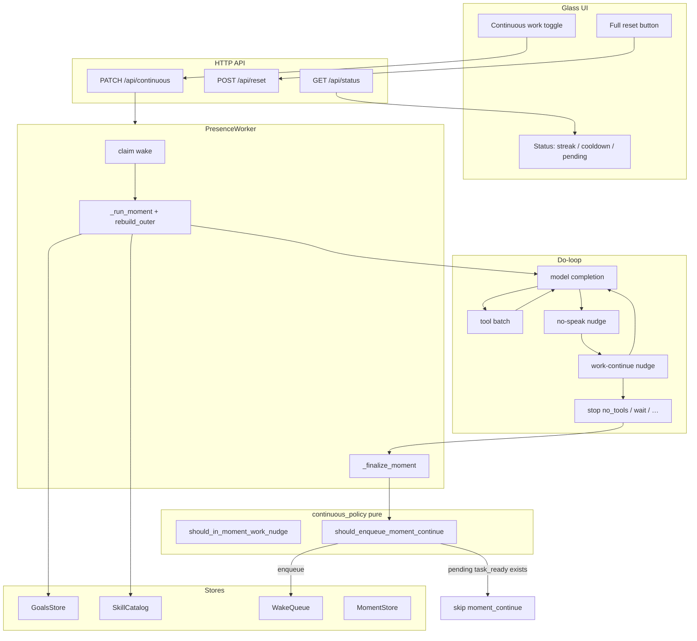

# Hybrid Continuous Work + Orient/Ledger Completion + Full Reset + Self/Prompts

| Field | Value |
|-------|-------|
| **Class** | DESIGN |
| **Author** | TBD |
| **Date** | 2026-07-22 |
| **Status** | Shipped (mostly) |
| **Product** | project-elyra (Stretch 1 on main) |
| **Workspace** | `/home/jim/Workspace/project-elyra` |

---

## Overview

Stretch 1 shipped presence → moment → multi-hop do-loop, speak-only glass, tools, skills on disk, create-tool gates, and sampling hygiene. Live sessions with local Gemma-4-12B show the model **cannot work continuously** on open-ended asks: every turn's orient meal leaves goals and skills blank; the model cannot create or list ledger items; and after a speak+stop with no wait/timer/`task_ready`, presence idles forever.

This design specifies a **hybrid continuous policy (Option 6)** plus the prerequisites that make continuous work non-empty:

1. **Wire orient** — skill catalog, soft skill bias, goals/tasks slice into every outer meal.
2. **Complete ledger tools** — model-facing `create_goal`, `create_task`, `list_goals` / `get_goal` / `get_task` (store already has create/list; tools do not).
3. **Continuous policy** — in-moment work-continue HOST nudge + gated on-close `moment_continue` wake, under one Glass toggle, with preference for *already-pending* `task_ready` (never synthesizing new ready wakes).
4. **Self + HOST prompt text** — richer durable teammate intent; exact boring HOST strings (no Stretch-2 ceremony).
5. **Full reset** — operator dogfood button to clear moments/chat/goals/wakes/sandbox work while preserving identity, users, and settings.

Continuous work multiplies *empty-brain* moments if (1) and (2) are skipped. Those land first; continuous policy second; reset and self/prompts can ship in parallel tracks where noted.

---

## Background & Motivation

### Current runtime shape (as shipped)

```text
presence (single worker)
  claim wake (band priority heap)
       │
       ▼
  open MOMENT → rebuild_outer → run_do_loop
       │
       ▼
  close moment · mark wake done
       │
       ▼
  phase = waiting | idle
  (no automatic re-entry unless another wake exists)
```

**Anchors (code, not aspiration):**

| Component | Path | Reality today |
|-----------|------|----------------|
| Presence worker | `elyra/presence/worker.py` | `_run_moment` → `assemble_outer_meal(...)` with `self_digest`, `user_digest`, `why_now`, wake content only — **no** `goals`, `skill_catalog`, `skill_bias` |
| Outer meal | `elyra/loop/context.py` | `fill_orient` / `assemble_outer_meal` accept goals/skills; comment: *"goals/skills land in later PRs"*; empty string placeholders |
| Do-loop | `elyra/loop/doloop.py` | Social hop-0 speak pin; one `NO_SPEAK_NUDGE` on social `no_tools`; 8-min **time** continue via `continue_policy.py` |
| Time continue | `elyra/loop/continue_policy.py` | **Different concept** — wall idle within one moment; must not be conflated with continuous work |
| Wake queue | `elyra/presence/queue.py` | Bands: `user_message`/`wait_reply` 0, `wait_timeout` 1, `timer` 2, `task_ready` 3, `background` 4. No `moment_continue` |
| Goals store | `elyra/goals/store.py` | Full CRUD: `create_goal`, `create_task`, `list_goals`, `get_*`, `update_*`; `on_task_ready` hook |
| Ledger tools | `elyra/tools/builtin/ledger.py` | **Only** `update_task` / `update_goal`; explicit OOS: create tools |
| Skill catalog | `elyra/skills/catalog.py` | `catalog()` → name+description; never injected into orient |
| System / self | `prompts/system.md`, `prompts/seeds/identity/self.md` | Laws-only system (~210 tokens); minimal teammate self |
| Glass | `elyra/runtime/web/*`, `elyra/runtime/api.py` | Chat, goals list, moments, tools, identity, status — no continuous toggle, no full reset |
| Seed copy | `elyra/config.py` `ensure_data_dirs` | Seeds only if **missing** — existing homes keep old `self.md` |

### Live pain points

1. **Empty orient every turn.** Model never sees skill names (`talk`, `do-work`, `create-tool`, …) or open goals. Skills say "open goals" but discovery and ledger create do not work for the model.
2. **Asymmetric ledger.** API `POST /api/goals` and store `create_*` exist; model can only patch. Talk skill step 3 ("open or update a goal") is unsatisfiable without free-text fiction.
3. **One-shot presence.** Real lifecycle is wake → moment → close → idle. After speak+stop with no `wait`/`timer`/`task_ready`, nothing re-enters. In-moment recovery is only: (a) 8-min idle HOST continue, (b) social no-speak nudge once.
4. **Thin self.** No durable drive like "when free, learn and improve capabilities" — continuous idle wakes would have nothing honest to act on beyond empty rest.
5. **Dogfood friction.** Restarting experiments requires hand-deleting `data/moments`, `messages.jsonl`, goals, wakes — easy to leave half-state and confuse recovery.

### Why hybrid (Option 6), not blind always-wake

| Approach | Failure mode |
|----------|--------------|
| Always enqueue on close | Flood of empty moments; pure "hello" thrash; burns GPU; fights `rest` skill |
| In-moment only | Fixes short multi-step but not multi-moment life (plan → do → review across closes) |
| Outer only | Multi-step tool chains still die on early `no_tools` free-text |
| **Hybrid** | In-moment nudge for short arcs; gated outer re-wake for multi-moment; prefer *pending* `task_ready` only (never synthesize); user always preempts |

---

## Goals & Non-Goals

### Goals

1. Every outer meal includes **skill catalog** (name + description), **soft skill bias**, and a **token-budgeted goals/tasks slice**.
2. Model can **create and list** goals/tasks via tools; skills text match real tool names.
3. **Continuous work toggle** (default OFF for safety of existing dogfood) enabling:
   - Budgeted in-moment work-continue HOST inject on premature `no_tools` stop.
   - Gated `moment_continue` wake after finalize when policy allows.
   - Prefer *already-pending* `task_ready` over `moment_continue` (never re-arm ready tasks).
4. Glass shows continuous status; toggle OFF cancels pending continues.
5. Exact HOST / why_now / bias strings that stay boring and honest (no reflection ceremony).
6. Enriched self seed (+ migration path for existing homes).
7. **Full reset** API + Glass with confirm UX, safe vs running worker.
8. Modular PRs; each independently reviewable; tests as definition of done.
9. Live-eval scenarios for multi-moment continuous + ledger create path where feasible.

### Non-Goals

- Stretch 2 hypergraph / sleep / dream / monologue ceremony.
- Product-wide `tool_choice=required` (social hop-0 speak pin only, already shipped).
- Free-text as glass (speak-only remains law).
- Multi-worker / subagents.
- Changing band priority of user/wait (0–1 always win).
- Auto-creating goals from every chat message without model action.
- Making continuous ON by default for all installs (opt-in via settings + Glass).
- Merging goals store into wake queue.
- Replacing `continue_policy.py` time-idle inject with continuous policy (they coexist with different triggers).
- Glass create-task UI (model ledger tools only for this plan).
- Outer continuous re-entry with empty ledger (`require_open_work` is always true; no opt-out mode).
- Clearing `skills/local` on full reset.

---

## Key Decisions

| # | Decision | Rationale |
|---|----------|-----------|
| K1 | **Hybrid Option 6** (in-moment work nudge + gated `moment_continue`) under one toggle | Fixes short multi-step and multi-moment life without blind always-wake |
| K2 | **Orient + ledger tools ship before continuous default use** | Continuous multiplies empty-brain moments if catalog/goals missing |
| K3 | **New wake kind `moment_continue` at priority band 3** (same as `task_ready`; FIFO by `created_at`) | Below user/wait/timer; does not starve social; coexists with `task_ready` |
| K4 | **Prefer *pending* `task_ready` only — never synthesize** | If a pending `task_ready` already exists for any ready task, skip `moment_continue`. Continuous **must not** call `enqueue_task_ready` / re-arm ready tasks on finalize. Ready wakes are created only by ledger transitions (`GoalsStore.on_task_ready` / create-as-ready), never by continuous policy |
| K5 | **Pure policy module** `elyra/loop/continuous_policy.py` | Engineering principles: no god modules; pure functions testable without presence |
| K6 | **Do not conflate** with `continue_policy.py` (time-idle HOST) | Different trigger (minutes idle vs work recovery / outer re-entry); keep names distinct |
| K7 | **In-moment work nudge at most once per moment** before accepting `no_tools` | Avoid HOST spam if model free-texts again; never inject after a flood free-text hop |
| K8 | **Social no-speak nudge wins first** on social wakes; work-continue only after spoke or non-social | Preserve Stage 5 social reliability; do not replace speak pin |
| K9 | **Default continuous OFF** | Safe for current dogfood; operator enables when orient/ledger ready |
| K10 | **Full reset is worker-owned** under `PresenceWorker._lock` while idle; rejects busy/in_moment; clears TimerService + WakeQueue memory + disk | Avoid mid-write corruption and zombie timer re-fires from stale in-memory maps |
| K11 | **Reset preserves** identity/self, users, continuous runtime JSON, model paths, **`skills/local` always**, `tools/local` by default; **clears** moments, messages, goals, wakes/timers/waits, sandbox contents, tool drafts; never bundled tools/skills | Dogfood restart without wiping identity, create-skill, or create-tool investments |
| K12 | **Ledger: tools + orient slice** (not orient-only full dump) | Stretch 1 contract: depth via tools; orient short |
| K13 | **Self enrichment via seed + append-only migrate** (hash-gated; never full rewrite of customized self) | `ensure_data_dirs` never overwrites; version marker + seed-v1 hash only |
| K14 | **`moment_continue` on recover_claimed: re-enqueue** (like `task_ready`/`timer`) | Durable work intent survives crash; toggle-off cancel only affects pending `moment_continue`, not recover path for other kinds |
| K15 | **Outer continue requires non-speak progress** | `tools_ran OR ledger_mutated` where **`tools_ran` means ≥1 successful non-speak tool** (`counts_as_speak == False`), not any tool batch. Speak alone sets `spoke` only — never `tools_ran` |
| K16 | **Continuous never invents work wakes** the ledger/hook would not have created | No finalize backstop `task_ready`; model must leave ready tasks or host uses `moment_continue` only when tool/ledger progress already happened |
| K17 | **Toggle API is `PATCH /api/continuous`**; persist `data/runtime/continuous.json` | Single path; frozen `Settings` stays defaults; worker holds mutable runtime flag |
| K18 | **`require_open_work=True` only** — no outer continue without open goals/tasks | User decision 2026-07-22; empty-ledger continuous thrash out of scope |
| K19 | **Full reset never clears `skills/local`** | User decision 2026-07-22; preserve create-skill investments (drafts still clearable) |

---

## Proposed Design

### Architecture



### Lifecycle with continuous ON

```mermaid
sequenceDiagram
  participant U as User / Glass
  participant Q as WakeQueue
  participant W as PresenceWorker
  participant D as DoLoop
  participant P as continuous_policy
  participant G as GoalsStore

  U->>Q: user_message
  Q->>W: claim
  W->>D: run_do_loop (orient: catalog+goals+bias)
  Note over D: hop0 speak pin if social
  D->>D: tools / speak / ledger create
  alt free-text no_tools, work-ish, continuous ON
    D->>P: should_in_moment_work_nudge
    P-->>D: true (budgeted once)
    D->>D: HOST work-continue inject
    D->>D: model again
  end
  D-->>W: DoLoopResult(stop, spoke, tools_ran, …)
  W->>W: close moment, mark_done
  alt stop==wait
    W->>W: phase=waiting (no moment_continue)
  else continuous ON and gates pass
    W->>Q: any pending task_ready?
    alt pending task_ready exists
      Note over W: skip moment_continue; existing pending wake owns work (no re-arm)
    else
      W->>P: should_enqueue_moment_continue
      Note over P: requires non-speak tools_ran or ledger_mutated (speak alone insufficient)
      P-->>W: true
      W->>Q: enqueue moment_continue
    end
  end
  Note over U: user message always band 0 — preempts continue
```

---

## A. Orient Wiring

### Problem

`PresenceWorker._run_moment` → nested `rebuild_outer()`:

```python
return assemble_outer_meal(
    glass_history=glass,
    settings=self.settings,
    paths=self.paths,
    self_digest=self_digest,
    user_digest=user_digest,
    why_now=why,
    wake_content=wake_content_s,
    wake_message_id=wake_message_id_s,
)
# missing: goals=, skill_catalog=, skill_bias=
```

`prompts/orient.md` still has `{{GOALS}}`, `{{SKILL_CATALOG}}`, `{{SKILL_BIAS}}` — filled empty every turn.

### Design

Add a small pure formatter module (or functions in `elyra/loop/context.py` / `elyra/loop/orient_slice.py`) so presence stays orchestration-only:

| Function | Responsibility |
|----------|----------------|
| `format_skill_catalog(catalog: list[dict]) -> str` | Bullet lines: ``- {name}: {description}`` |
| `format_goals_slice(goals: list[dict], *, max_tokens: int) -> str` | Open goals + ready/in_progress tasks, truncated |
| `skill_bias_for_wake(kind: str, *, continuous: bool = False) -> str` | Soft one-line bias |

**Call site:** both initial outer and every `rebuild_outer` under budget pressure must pass the same three fields. **Normative:** re-read goals + catalog on every rebuild (ledger/skill edits mid-moment must appear). Do not format once at moment open and reuse stale strings.

```python
def rebuild_outer() -> list[dict[str, Any]]:
    glass = list_messages(limit=80, paths=self.paths)
    self_digest = self._identity.self_digest()
    user_digest = ...
    # Worker holds SkillCatalog like GoalsStore (_ensure_skills).
    catalog = self._ensure_skills().catalog()  # fresh short list each rebuild
    goals_doc = self._ensure_goals().list_goals()  # filter in formatter
    continuous = self._continuous_enabled()
    return assemble_outer_meal(
        ...,
        why_now=why,
        goals=format_goals_slice(goals_doc, max_tokens=loop.orient_goals_max_tokens),
        skill_catalog=format_skill_catalog(catalog),
        skill_bias=skill_bias_for_wake(wake.kind, continuous=continuous),
    )
```

### Skill catalog format

From `SkillCatalog.catalog()` (already name + description only):

```text
- create-skill: Write a new skill package playbook on disk.
- create-tool: Draft → verify → promote a tool package. …
- do-work: Execute the next ready task with tools. …
- plan-work: Break a goal into tasks with acceptance criteria. …
- rest: Idle honestly when there is nothing useful to do. …
- review-work: …
- talk: Social presence — reply to people, open goals when useful. …
```

Rules:

- Sorted by name (catalog already sorts).
- Default budget: **~400 tokens** for catalog (`LoopSettings.orient_skill_catalog_max_tokens = 400`).
- **YAGNI drop rule (v1):** bundled catalog is ~7 skills and fits under 400 tokens. Do **not** implement relevance ranking until catalog growth forces it.
- **If over budget later:** keep the bias-named set (parse skill name tokens after `Prefer skill:` — split on `/`, `or`, commas, parentheses) **plus** fill remaining slots alphabetically until the token cap. Never drop a name that appears in the bias string.
- Hold `SkillCatalog` on the worker (like `GoalsStore`); call `catalog()` on **every** `rebuild_outer` (do not cache format strings only at moment open). After `install_skill` / growth tools, call `catalog.reload()` then re-format on next rebuild.

### Soft skill bias rules

Exact strings (soft — not hard gates):

| Wake kind / context | `SKILL_BIAS` text |
|---------------------|-------------------|
| `user_message`, `wait_reply` | `Prefer skill: talk (social reply first; speak before wait).` |
| `task_ready` | `Prefer skill: do-work (act on the ready task).` |
| `timer` with task/goal in payload | `Prefer skill: do-work or plan-work for the linked work.` |
| `moment_continue` | `Prefer skill: do-work or plan-work; use create-tool/create-skill only if capability is the bottleneck. Load rest if nothing honest remains.` |
| `background` | `Prefer skill: rest unless orient shows ready work.` |
| `wait_timeout` | `Prefer skill: talk if user owed a follow-up; else do-work/rest from ledger.` |

Continuous ON does **not** change social bias on `user_message` (talk still first).

### Goals / tasks slice format

Include:

- Goals with `status in {open, review}` (exclude closed/cancelled).
- Nested tasks with `status in {ready, in_progress, blocked}` (optionally `pending` if space).
- Fields: goal id, title, status, acceptance (truncated); task id, title, status, notes (truncated).

Example:

```text
Goal g_abc123 [open]: Organize sandbox docs
  acceptance: README lists layout; no orphan files
  - t_def456 [ready] Draft README outline
  - t_ghi789 [in_progress] Move notes into sandbox/notes/
Goal g_xyz [review]: …
  - t_… [ready] …
(no open goals)
```

Token budget default: **~600 tokens** (`orient_goals_max_tokens = 600`). Drop oldest-updated goals first; always keep goal/task ids referenced in wake payload (`task_ready` / timer).

### Settings knobs

```toml
[loop]
orient_skill_catalog_max_tokens = 400
orient_goals_max_tokens = 600
```

### Risks

| Risk | Severity | Mitigation |
|------|----------|------------|
| Orient bloat pushes history out of sliding window | Med | Hard token caps; drop history first (existing); measure with estimate_tokens |
| Stale catalog after install_skill mid-moment | Low | `rebuild_outer` / catalog.reload on growth tools already partial; optional reload before format |
| Goals lock contention during format | Low | `list_goals` is short RLock; OK on rebuild |

---

## B. Ledger Tools + Content

### Gap

| Surface | create_goal | create_task | list/get | update |
|---------|-------------|------------|----------|--------|
| `GoalsStore` | yes | yes | yes | yes |
| API glass | POST goals | no | GET goals | no |
| Model tools | **no** | **no** | **no** | yes |

Skills (`talk`, `plan-work`, `do-work`) reference opening goals and loading ledger — model cannot.

### New tools (disk packages + builtins)

Add under `tools/bundled/` and handlers in `elyra/tools/builtin/ledger.py` (or `ledger_read.py` if file grows — prefer extend ledger.py while scope stays ledger-only):

| Tool | Args | Behavior |
|------|------|----------|
| `create_goal` | `title` (req), `acceptance?`, `status?` default open | `GoalsStore.create_goal`; return goal dict; **must** call `mark_task_changed` on success |
| `create_task` | `goal_id`, `title` (req), `status?` default pending, `notes?` | `create_task`; if status ready → existing ready path; **must** call `mark_task_changed` |
| `list_goals` | `status?` optional filter | Return compact list (id, title, status, task counts / short task summaries). Read-only — **does not** call `mark_task_changed` |
| `get_goal` | `goal_id` | Full goal + tasks. Read-only — no `mark_task_changed` |
| `get_task` | `task_id` | Task dict + parent goal_id. Read-only — no `mark_task_changed` |

### `mark_task_changed` / `ledger_mutated` (normative)

Today only `update_task` calls `ctx.mark_task_changed` (`elyra/tools/builtin/ledger.py`); `update_goal` does **not**. Continuous progress gates depend on this hook.

| Tool | On success |
|------|------------|
| `create_goal`, `create_task`, `update_goal`, `update_task` | **Must** call `ctx.mark_task_changed()` when present |
| `list_goals`, `get_goal`, `get_task` | Must **not** (read-only) |

Do-loop `_install_activity_hooks` wrapper (extend existing):

```python
def mark_task_changed() -> None:
    state.last_activity = now()       # existing: time-idle continue
    state.ledger_mutated = True       # NEW: continuous outer progress
    if host_task is not None:
        host_task()
```

Idle time-continue semantics unchanged (still resets activity). Unit test: successful `create_goal` → `DoLoopResult.ledger_mutated is True`.

**Out of scope for this design:** delete APIs; hard-close gate changes; graph links.

### Dual `task_ready` emission (unchanged law)

Keep current recommendation: composition root wires **one** durable enqueue path (`GoalsStore(on_task_ready=…)`) as primary; tool-layer `enqueue_wake` only when hook unset. Presence already dedupes via `enqueue_task_ready` replace.

`create_task(status=ready)` / `update_task`→ready already fires `_fire_task_ready` in store. Continuous finalize:

- If a **pending** `task_ready` exists → skip `moment_continue` (avoid double work wake).
- If a task is still `ready` in the ledger but **no** pending wake remains after a no-progress moment → **do nothing** (no backstop re-arm). The model must re-transition or use `moment_continue` only when tool/ledger progress gates pass.

### Skill text alignment

Update bundled skills to name real tools:

| Skill | Change |
|-------|--------|
| `talk` | "open a goal with `create_goal` / `create_task` after speak when useful; `list_goals` to inspect" |
| `plan-work` | "persist with `create_goal` / `create_task` / `update_goal` / `update_task`" (not "as available") |
| `do-work` | "read via orient or `get_task` / `list_goals`; update with `update_task`" |
| `rest` | unchanged intent; may mention empty orient goals slice |

### API (optional small)

`POST /api/goals/{id}/tasks` for glass parity is nice-to-have, not required for continuous. Model path is tools.

---

## C. Continuous Policy Module

### Module placement

**New:** `elyra/loop/continuous_policy.py`

```text
Scope: pure decisions for continuous work (in-moment nudge + outer re-wake).
In scope: gates, HOST string builders, MomentContinueDecision dataclass.
Out of scope: wake enqueue I/O, do-loop scheduling, time-idle continue_policy.
```

**Do not** put this in `continue_policy.py` — name collision with 8-minute idle inject.

### Settings

```python
@dataclass(frozen=True)
class ContinuousSettings:
    enabled: bool = False
    # In-moment
    in_moment_work_nudge_max: int = 1  # per moment
    # Outer chain
    max_continue_streak: int = 8       # consecutive moment_continue claims without user wake
    cooldown_seconds: int = 30         # min wall time between moment_continue enqueues
    max_pending_continues: int = 1     # dedupe: at most one pending moment_continue
    require_progress: bool = True      # tools_ran (non-speak) OR ledger_mutated — NOT spoke/speak-tool
    require_open_work: bool = True     # user-confirmed: always require open work; no empty-ledger outer continue
    skip_pure_social: bool = True      # social wake + no tools/ledger → no outer continue
    # Flood / thrash (inputs from DoLoopResult)
    # stop allowlist is fixed in policy (not a free-form "careful" list)
```

Load defaults via new `Settings.continuous: ContinuousSettings` and optional `elyra.toml`:

```toml
[continuous]
enabled = false
max_continue_streak = 8
cooldown_seconds = 30
require_open_work = true
```

### Toggle API + persistence (normative — closes path ambiguity)

| Layer | Source of truth |
|-------|-----------------|
| Defaults | Frozen `ContinuousSettings` / `elyra.toml` `[continuous]` |
| Operator override | `data/runtime/continuous.json` → `{ "enabled": bool, "updated_at": iso }` |
| Live flag | `PresenceWorker` mutable `ContinuousRuntimeState.enabled` |

**Load order at worker start:** toml/defaults → JSON override (if file exists) → in-memory runtime state.

**API (single path):** `PATCH /api/continuous` with body `{ "enabled": true|false }`.

- Creates `data/runtime/` if needed (`ensure_data_dirs` should include `runtime`).
- Does **not** mutate frozen `Settings` objects after load.
- Toggle **OFF**: set `enabled=False`, persist JSON, **cancel only pending `moment_continue`** wakes (`reason=continuous_disabled`). Does **not** cancel `task_ready`, timers, user messages, or waits.
- Toggle **ON**: set enabled, persist; does not invent wakes.

Glass and mermaid diagrams use this path only (not `/api/settings/continuous`).

### Runtime state (worker-owned)

```python
@dataclass
class ContinuousRuntimeState:
    enabled: bool
    streak: int = 0                 # consecutive moment_continue moments completed
    last_enqueue_at: datetime | None = None
    last_continue_wake_id: str | None = None
    last_source_moment_id: str | None = None
    last_skip_reason: str | None = None
    resetting: bool = False         # set during full reset; API may 503/409
```

Reset streak when a **user-band** wake (`user_message`, `wait_reply`) is claimed. Increment streak when a claimed wake was `moment_continue` and the moment finalizes. **`task_ready` does not increment continue streak** and continuous **does not** re-arm `task_ready` (K4/K16).

### Pure functions

```python
@dataclass(frozen=True)
class InMomentNudgeDecision:
    inject: bool
    reason: str  # injected | disabled | budget | not_workish | social_nudge_first | flood | …


@dataclass(frozen=True)
class MomentContinueDecision:
    enqueue: bool
    reason: str
    # True only when a *pending* task_ready already exists — host must NOT synthesize one
    skip_for_pending_task_ready: bool = False


def should_in_moment_work_nudge(
    *,
    continuous_enabled: bool,
    social_wake: bool,
    spoke: bool,
    no_speak_nudge_pending_or_needed: bool,
    work_nudge_sent: int,
    max_nudges: int,
    tools_ran: bool,              # NON-SPEAK progress only (same definition as outer)
    ledger_mutated: bool,
    work_context: bool,           # social: tools_ran|ledger_mutated only (speak does not qualify)
    last_hop_was_flood: bool,      # hygiene flood on the free-text hop about to stop
) -> InMomentNudgeDecision:
    ...


def should_enqueue_moment_continue(
    *,
    continuous_enabled: bool,
    stop_reason: str,
    wake_kind: str,
    tools_ran: bool,                 # NON-SPEAK progress only (see definitions)
    ledger_mutated: bool,
    has_pending_wait: bool,
    pending_task_ready_count: int,   # pending wakes of kind task_ready (not "tasks ready in ledger")
    has_open_work: bool,             # open/review goals or ready/in_progress tasks in ledger
    pending_moment_continues: int,
    streak: int,
    max_streak: int,
    seconds_since_last_enqueue: float | None,
    cooldown_seconds: int,
    model_beats: int,
    flood_beats: int,
    last_stop_hop_was_flood: bool,
    require_open_work: bool,
    require_progress: bool,
) -> MomentContinueDecision:
    ...
```

### Progress signal definitions (normative — K15)

| Signal | Definition | Set when |
|--------|------------|----------|
| `spoke` | Existing social flag | Successful tool result with `counts_as_speak is True` (typically `speak`) |
| `tools_ran` | **Non-speak tool progress** | At least one tool in this moment returned a result with **`counts_as_speak is False`** and preferably `ok is True` (failed non-speak tools may count as progress for outer re-entry only if product wants retry; **v1: require `ok is True`**) |
| `ledger_mutated` | Ledger write | `mark_task_changed` fired (create/update goal/task) |

**Do not** set `tools_ran` from tool **name** strings in the loop — use `ToolResult.counts_as_speak` already available at execute time (`elyra/tools/types.py`, speak builtin sets it).

**Implications:**

- Pure social hello (`speak` only) → `spoke=True`, `tools_ran=False`, `ledger_mutated=False`.
- `list_dir` / `create_goal` / sandbox tools → `tools_ran=True` (when ok).
- Outer progress: `tools_ran OR ledger_mutated` — **never** `spoke` alone.
- Social in-moment `work_context`: same — speak does **not** qualify.

```python
# In _handle_tool_batch / execute path (conceptual):
if tr.ok and not tr.counts_as_speak:
    state.tools_ran = True
if tr.ok and tr.counts_as_speak:
    state.spoke = True  # existing path via mark_spoke
```

### Flood rule (single normative formula for v1)

Skip outer continue when **either**:

```text
(flood_beats >= 1 and flood_beats * 2 >= model_beats)   # majority of model beats flooded
OR last_stop_hop_was_flood                                 # free-text stop hop was a flood
```

Where `last_stop_hop_was_flood` is the same flag used for in-moment hard-stop (hygiene on the completion that produced no tool_calls).

**One formula only** — do not implement a separate “`flood_beats >= 1 and not tools_ran`” short-circuit as an alternate accepted rule (that is not equivalent to majority and caused dual-implementation risk).

`DoLoopResult` carries `model_beats` and `channel_flood_beats` counted whenever a model beat is appended (`hygiene.any_flood` / flood on the beat). Pass `last_stop_hop_was_flood` into `should_enqueue_moment_continue` from finalize (from result or last free-text hygiene).

### Gates for `moment_continue` (normative)

Enqueue only if **all** pass:

1. **Toggle ON** (`ContinuousRuntimeState.enabled`).
2. **`stop_reason` allowlist (v1 closed):** `no_tools` | `time_continue_declined` | `max_hops` only.  
   **Deny:** `wait`, `error`, `interrupted`, `policy`, `wall_clock`, `blocked` (blocked almost unused in shipped tools; revisit after dogfood — not v1).
3. **Not while pending wait** (durable `STATUS_PENDING` wait exists).
4. **At most one pending** `moment_continue` in queue (`max_pending_continues=1`); if one exists, skip (do not stack).
5. **Streak** `< max_continue_streak`.
6. **Cooldown** since last `moment_continue` enqueue ≥ `cooldown_seconds`.
7. **Non-speak progress** when `require_progress` (default True): **`tools_ran OR ledger_mutated`**.  
   **`tools_ran` excludes speak** (see progress definitions). **`spoke` alone is never sufficient** for outer re-entry (prevents glass "still working…" monologue storms on `moment_continue` / `task_ready` / `timer` chains).
8. **`skip_pure_social`:** if wake was `user_message`/`wait_reply` and **no** `tools_ran` and **no** `ledger_mutated` → **do not** re-wake. A speak-only hello has `spoke=True` but `tools_ran=False`, so this gate **fires** and idle is correct.
9. **Prefer *pending* `task_ready` only (no backstop):**  
   - If `pending_task_ready_count > 0` → set `skip_for_pending_task_ready=True`, **do not** enqueue `moment_continue`.  
   - **Never** call `enqueue_task_ready` / re-arm a still-ready ledger task from continuous finalize.  
   - Rationale: `on_task_ready` fires only on **transition into** ready. After a `task_ready` moment is claimed and marked done, re-arming the same task would infinite-storm with no streak protection. Continuous must not invent wakes the ledger hook would not create (K16).  
   - **Deferred complement (not solved here):** wakes already queued can still fire after the task is `done` / the arc finished in-moment (model double-chained `schedule_wake` + ready transitions). See [known-bugs.md](../../state/known-bugs.md) **BUG-wake-01** — low urgency now; moment/timer history bloat later.
10. **Open work (`require_open_work=True` only — user confirmed 2026-07-22):** `has_open_work` must be true at finalize (any goal `open|review`, or task `ready|in_progress|blocked`). **No outer `moment_continue` without open work.** No alternate continuous mode for empty ledger. If the model closes the last goal/tasks mid-moment, finalize does **not** re-enqueue.
11. **Flood thrash:** apply the single flood formula (majority OR last_stop_hop_was_flood); on skip, set `last_skip_reason=flood` and start cooldown as if an enqueue attempt occurred (rate-limit thrash).

Toggle OFF:

- Do not enqueue.
- **Cancel only** pending `moment_continue` wakes (`queue.cancel(id, "continuous_disabled")`).
- Reset streak on disable.
- Leave `task_ready` / timer / user wakes untouched.

### In-moment work-continue gates

Inject HOST work-continue **once** when:

1. Continuous ON.
2. Model returned **no tool_calls** (path about to `stop_for_no_tools`).
3. **`last_hop_was_flood` is false** — if the free-text hop just completed was a channel flood, **stop hard** (no work-continue HOST; floods must not be re-fueled).
4. **Social path first:** if `social_wake and not spoke and not no_speak_nudge_sent` → existing no-speak nudge only (no work-continue yet).
5. `work_nudge_sent < max` and `work_context`:
   - **Social wakes** (`user_message` / `wait_reply`): `work_context = tools_ran OR ledger_mutated` only.  
     **Not** pre-existing open goals alone (avoids HOST push after "hi" when leftover goals exist).
   - **Non-social wakes:** `tools_ran OR ledger_mutated OR wake_kind in {task_ready, moment_continue, timer} OR open goals slice non-empty`.
6. Do **not** inject if last chain message is already a work-continue HOST (dedupe).
7. After inject, continue loop (same as no-speak nudge). If model free-texts again → **stop** (accept `no_tools`); outer policy may still enqueue `moment_continue` only if gates 1–11 pass (including non-speak progress — so a pure free-text after nudge without tools will **not** outer-continue).

### Priority band

```python
KIND_PRIORITY: dict[str, int] = {
    "user_message": 0,
    "wait_reply": 0,
    "wait_timeout": 1,
    "timer": 2,
    "task_ready": 3,
    "moment_continue": 3,  # NEW — same band as task_ready; FIFO by created_at
    "background": 4,
}
```

`RE_ENQUEUE_ON_RECOVER` adds `moment_continue` (durable work intent).

`KNOWN_KINDS` updates; tests in `tests/test_wake_queue.py` extended.

`_why_now` in worker:

```python
if kind == "moment_continue":
    src = payload.get("source_moment_id") or "?"
    return f"continue work (from moment {src})"
```

Payload:

```json
{
  "source_moment_id": "...",
  "source_wake_kind": "user_message",
  "source_stop_reason": "no_tools",
  "streak": 2
}
```

### Call sites

| Site | Change |
|------|--------|
| `elyra/loop/doloop.py` | Before `no_tools` finish: evaluate work nudge (flood-aware); count `model_beats` / `channel_flood_beats`; set `tools_ran` only on successful **non-speak** tool results (`not counts_as_speak`); track `ledger_mutated`, `work_continue_injects` |
| `DoLoopResult` | Additive fields below (incl. flood counters) |
| `PresenceWorker._finalize_moment` | After close + mark_done + phase; if continuous: **never** `enqueue_task_ready`; compute `should_enqueue_moment_continue`; enqueue or skip; update streak/cooldown |
| `PresenceWorker.status_snapshot` | Include continuous fields |
| `mark_task_changed` wrapper | Set `state.last_activity` **and** `state.ledger_mutated = True` |
| Ledger tools | `create_*` + `update_*` call `mark_task_changed` (read tools do not) |
| `WakeQueue` | Helper `cancel_all_pending_of_kind("moment_continue", reason)` for toggle-off |

### Interaction with time-based continue

- Time continue (`continue_policy.py`) still fires after 8 minutes idle **inside** a long moment.
- Work-continue fires on **premature stop** (seconds-scale free-text exit).
- Both may appear in one moment in theory; budgets independent. If time continue already at max and declined → stop `time_continue_declined` → outer `moment_continue` may still apply if allowlisted.

### User always preempts

- Claiming `user_message` / `wait_reply` resets streak.
- Pending `moment_continue` stays in queue at band 3; user at band 0 always runs first.
- `wait_user` stop → no `moment_continue`; wait arc is human-owned until reply/timeout.

---

## D. Prompts for Wake/Continue (exact text)

### In-moment work-continue HOST

Constant in `continuous_policy.py` (loaded string, not buried multi-page prompt — single line OK; multi-line host injects remain `HOST:` prefix for `_is_host_inject`):

```text
HOST: work still open — call tools to continue (load_skill / ledger / sandbox), speak if the user needs an update, or stop if truly done.
```

Rationale: boring, action-oriented, lists tool classes without inventing ceremony, does not order monologue/reflection.

**Beat kind:** `obs` / `kind: work_continue` (distinct from `continue` time-idle and `no_speak_nudge`). Keep this distinction in PR5 tests.

**Tests:** constant lives in `continuous_policy.py`; unit test asserts the inject string is classified by `_is_host_inject` / starts with `HOST:`; never passed to `SpeakTransport` (chain-only via `_obs_user_message`).

### Social no-speak (unchanged)

```text
HOST: no speak tool used — if the user needs a reply, call speak; otherwise stop.
```

Order of operations on social free-text exit:

1. No speak yet → no-speak nudge (once).
2. After speak succeeded earlier, then free-text exit with work_context → work-continue (once).
3. Else stop.

### `moment_continue` why_now

```text
continue work (from moment {source_moment_id})
```

Optional richer payload line only inside orient WHY_NOW if we pass custom why:

```text
continue work from prior moment — streak {n}; re-enter tools if unfinished; load rest if nothing honest remains
```

Prefer short form in `_why_now`; put soft guidance in `SKILL_BIAS` for `moment_continue` (section A).

### Soft bias for moment_continue (exact)

```text
Prefer skill: do-work or plan-work; use create-tool/create-skill only if capability is the bottleneck. Load rest if nothing honest remains.
```

### Avoid HOST spam

- Max 1 work-continue inject per moment.
- If model responds with free-text again → stop; do not re-inject.
- Time-idle continue still capped by `continue_max_injects` (3).
- Outer streak + cooldown prevent close/open thrash.

### System.md delta (minimal)

Add one bullet under Hard walls or Style (keep thin):

```markdown
- When continuous work is active and orient shows open goals or a continue wake, prefer tools over silent free-text exits; use `rest` when nothing honest remains.
```

This bullet is inert when continuous is OFF (no behavioral host change). Live-eval stages with continuous disabled remain valid baselines.

Do **not** bloat system into a second skill catalog.

---

## E. Self Identity Enrichment

### Current seed (`prompts/seeds/identity/self.md`)

Minimal teammate walls only — no idle drive.

### Proposed seed body

```markdown
# Self

I am Elyra — a digital teammate that shares work with people, not a fused persona with any one user.

## Walls

- I keep self and user stores separate. User prefs never go into self; self never overwrites a user profile.
- I do not invent a biography or private memories I was not given.
- Free-text is not glass — only `speak` reaches the user.

## How I work

- I use tools for real work (sandbox, ledger, skills). I do not pretend a tool ran.
- On social wakes I speak first with a real reply, then plan or open work if useful.
- I prefer small honest steps. If blocked, I say so and wait or ask.

## Drive (when I have free capacity)

- When idle with free capacity, I want to learn, explore the sandbox, and improve capabilities via `create-tool` / `create-skill` when that is useful — not busywork for its own sake.
- I use the goals/tasks ledger for durable commitments; I open goals when work should outlive one moment.
- When continuous work re-enters me without a user message, I check orient (goals, skills, why-now) and either make one concrete tool step or rest. I do not monologue at the user without something worth speaking.
```

### Migration for existing homes

`ensure_data_dirs` **never overwrites** existing `data/identity/self.md`.

**Chosen migrate policy (append-only, hash-gated):**

1. If file contains `<!-- elyra-self-v2 -->` → no-op.
2. Else if content hash equals **seed v1** (canonical minimal self currently in repo / prior seed) → **append** Drive section + version marker (do not rewrite full file).
3. Else (customized self) → **no automatic change**. Optional later: `POST /api/identity/reseed` with explicit confirm for operators who want the new seed.

Never full-rewrite when marker absent and hash ≠ seed v1. Update `IdentityStore` scope header if migrate helper lives there (read + one-shot append).

Full reset **preserves** self (does not reseed unless `reseed_self_if_default` flag and hash matches v1).

### Continuous + self without spam monologue

- Self states drive; **host policy** is authoritative: outer continue requires non-speak `tools_ran OR ledger_mutated` (speak/`spoke` alone never re-arms).
- `moment_continue` bias includes "load rest if nothing honest remains".
- Speak still required for glass when social obligation exists; silent tool work OK on non-social continues (`do-work` already allows silent exit on pure `task_ready`).
- Self prose alone is insufficient to prevent monologue storms — gates K15 enforce it.

---

## F. Full Reset Button

### Purpose

Dogfood restarts: clear ephemeral work product without reinstalling the model or wiping teammate identity.

### Clear vs preserve

| Clear | Preserve |
|-------|----------|
| `data/moments/**` (index + tapes) | `data/identity/self.md` |
| `data/messages.jsonl` | `data/users/**` |
| `data/goals/**` | `data/runtime/continuous.json` (toggle preference) |
| `data/wakes/**` (events, timers, waits) | `elyra.toml` / model paths |
| `data/sandbox/**` contents (recreate empty dir) | `tools/local/**` promoted tools |
| `tools/drafts/**` (default **yes** clear drafts) | **`skills/local/**` always** (create-skill investments; user decision 2026-07-22) |
| In-memory: queue fold reload, continuous streak | Bundled tools/skills |

**Normative:** full reset **never** deletes `skills/local` or bundled skills/tools. There is **no** `clear_local_skills` flag.

**Optional flags** on API (defaults in bold):

- `clear_sandbox`: **true**
- `clear_drafts`: **true**
- `clear_local_tools`: false (default preserve promoted local tools)
- `reseed_self_if_default`: false

### Confirm UX

Glass Status (or rail foot) button **"Full reset…"**:

1. Opens modal: checklist of what will be deleted; type `RESET` to enable confirm.
2. POST `/api/reset` with `{ "confirm": "RESET", ...flags }`.
3. On success: toast; refresh all panels; continuous streak zeroed; phase idle.

### API

```http
POST /api/reset
Content-Type: application/json

{
  "confirm": "RESET",
  "clear_sandbox": true,
  "clear_drafts": true
}

Note: no `clear_local_skills` — local skills are always preserved.

```

Responses:

- `200 {"ok": true, "cleared": ["moments", "messages", "goals", "wakes", "sandbox", "drafts"]}`
- `400` missing confirm
- `409 {"ok": false, "error": "worker_busy", "phase": "in_moment"}` if unsafe
- `503 {"ok": false, "error": "resetting"}` if a reset is already in progress
- `500` partial_reset body (see below)

### Safe order of operations (worker-owned port)

**Normative owner:** `PresenceWorker.reset_runtime_state(flags) -> dict` orchestrates under `self._lock`. Disk helpers may live in `elyra/runtime/reset.py` (paths-only clear functions) but **must not** run without the worker port holding exclusion.

**Precondition:** `not self._busy` and `self._phase != PHASE_IN_MOMENT`. Else return error for API `409 worker_busy`.

**Concurrent API:** while `ContinuousRuntimeState.resetting` (or `worker.resetting`) is True, `resolve_user_input` / enqueue paths return failure surfaced as HTTP `503` or `409` with `error=resetting` (prefer `503` for temporary). Clear flag in `finally`.

**Lock protocol:**

```text
acquire PresenceWorker._lock
  assert idle
  resetting = True
  # WakeQueue and TimerService methods take their own locks internally;
  # never acquire worker lock *from* queue callbacks while holding queue lock.
  # Order for reset: worker lock outermost; then call queue/timer methods that
  # take their locks briefly and return.
  ... clear steps ...
  assert no claimed wakes remain (queue.claimed() empty)
  assert no pending waits (or waits file empty + timer memory clear)
  resetting = False
release worker lock
```

**Steps (each section try/except; accumulate `cleared` / `errors` for partial response):**

```text
1. Reject if busy / in_moment
2. Under worker._lock, resetting=True:
   a. Cancel all pending wakes (iterate pending → cancel) OR truncate events.jsonl
      then queue.reload()
   b. Clear waits.json + timers.json on disk AND clear TimerService in-memory maps
      (add TimerService.clear_all() or rehydrate-from-empty after write)
   c. Close any open moments as interrupted (should be none if idle); then
      delete moment tapes + index; recreate empty moments dir / empty index
   d. Unlink/truncate messages.jsonl
   e. Write goals.json = {"goals": []}
   f. Clear sandbox directory contents (keep dir)
   g. Clear tools/drafts/* packages (if flag)
   h. ContinuousRuntimeState: streak=0, last_*=None (preserve enabled flag)
   i. queue.reload() from empty/truncated events; assert claimed()==[] and pending()==[]
   j. Assert phase idle; pending_wait is None
3. finally: resetting=False
4. Return {ok, cleared[], errors[]?}
```

**In-memory completeness (must not skip):**

| Component | Disk | Memory |
|-----------|------|--------|
| WakeQueue | empty/truncate events.jsonl | `reload()` fold |
| TimerService | empty timers.json + waits.json | **clear maps** then optional rehydrate |
| MomentStore | delete tapes + index | no long-lived moment cache today; do not leave open meta |
| GoalsStore | rewrite goals.json | next `_load` is fresh (no process-wide cache beyond lock) |
| Continuous | keep JSON enabled | zero streak fields |

**Restart-safe:** files deleted on disk; next process start folds empty wakes, no open moments. Live reset does not require process restart if steps above run.

**Implementation modules:**

- `elyra/runtime/reset.py` — path clears (moments, messages, goals, sandbox, drafts) with absolute-path guards under `ElyraPaths`
- `PresenceWorker.reset_runtime_state` — lock, queue/timer ports, continuous zero, asserts
- `TimerService.clear_all()` (or equivalent) — **required new method** for memory
- `WakeQueue.cancel_all_pending(reason)` optional helper
- API `POST /api/reset` → worker method only

### Partial failure response

```json
{
  "ok": false,
  "error": "partial_reset",
  "cleared": ["messages", "goals"],
  "errors": [{"step": "moments", "detail": "..."}]
}
```

HTTP 500 for partial; 200 only when all requested steps succeed.

### Risks

| Risk | Severity | Mitigation |
|------|----------|------------|
| Delete during claim race | High | Require idle; hold worker lock for whole reset; resetting flag blocks enqueue |
| Stale TimerService re-fire | High | clear_all memory + disk together |
| Operator loses local tools accidentally | Med | Default preserve local tools/skills; modal lists actions |
| Half-clear on exception | Med | Per-step try/except; partial response shape |
| Nested lock deadlock | Med | Worker lock outermost only; never lock worker from inside queue fold callbacks |

---

## G. Engineering Principles Compliance

| Principle | Application |
|-----------|-------------|
| Modular, no gods | `continuous_policy` pure; `orient_slice` formatters; `reset` module; presence orchestrates only |
| Small units + scope headers | Every new file gets scope / in / out block |
| Tests with feature | Unit tests for gates; contract tests for tools; worker tests for enqueue; API tests for reset/toggle |
| Disk AI text | HOST strings short constants; skill updates on disk; self seed on disk |
| Config defaults | Continuous OFF; toml + small runtime JSON; no env var sprawl |
| Stretch discipline | No hypergraph/sleep; no monologue stages |
| Speak-only glass | Unchanged; free-text never glass |
| Fail-closed create-tool | Unchanged; continuous may *bias* toward create-tool, never skip verify |

---

## API / Interface Changes

### DoLoopResult (additive)

```python
@dataclass(frozen=True)
class DoLoopResult:
    stop_reason: str
    hop_count: int
    arm_wait: WaitArm | None = None
    spoke: bool = False
    moment_id: str = ""
    reouter_count: int = 0
    continue_injects: int = 0          # time-idle injects (existing)
    work_continue_injects: int = 0     # NEW
    tools_ran: bool = False            # NEW: ≥1 ok non-speak tool (counts_as_speak=False); speak alone leaves this False
    ledger_mutated: bool = False       # NEW: mark_task_changed fired
    model_beats: int = 0               # NEW: count of type=model beats
    channel_flood_beats: int = 0       # NEW: model beats with hygiene flood
    error: str | None = None
```

`last_hop_was_flood` for in-moment nudge is derived at the free-text stop site from the just-sanitized completion (`hygiene.any_flood`), not only from cumulative counters.

### Wake kind

- Register `moment_continue` in `KIND_PRIORITY` / `KNOWN_KINDS` / recover set.

### Status snapshot (additive fields)

```json
{
  "continuous": {
    "enabled": false,
    "streak": 0,
    "max_streak": 8,
    "cooldown_seconds": 30,
    "last_enqueue_at": null,
    "last_skip_reason": null,
    "pending_moment_continues": 0
  }
}
```

### New / changed endpoints

| Method | Path | Purpose |
|--------|------|---------|
| GET | `/api/status` | Include `continuous` block |
| PATCH | `/api/continuous` | `{ "enabled": true }` — set runtime + persist; cancel pending on false |
| POST | `/api/reset` | Full reset with confirm |

### Glass UI

- Chat header or Status panel: toggle **Continuous work** + short status (`streak 2/8 · cooldown 12s`).
- Status panel: Full reset button + modal.
- Pills optional: `autopilot` pill when continuous enabled and pending continue > 0.

---

## Data Model Changes

| Store | Change |
|-------|--------|
| `data/wakes/events.jsonl` | New kind in item payloads; no schema version bump required (fold ignores unknown ops; kinds validated on enqueue) |
| `data/runtime/continuous.json` | NEW optional `{enabled, updated_at}`; dir created by ensure/reset |
| `data/goals/goals.json` | Unchanged schema; model can fill via new tools |
| Moments meta | Optional: tag `wake_kind` already via why_now; no required schema change |
| Messages | Unchanged |

### Migration

- No destructive migration for goals/moments.
- Self v2 append as in E.
- Old processes without `moment_continue` in code cannot claim new kind — deploy code before enabling toggle.

---

## Alternatives Considered

### Alt 1 — Blind always-on-close wake (`background` or hard-coded requeue)

- **Pros:** Trivial implementation.
- **Cons:** Hello thrash; empty orient waste; fights rest; no gates; user cannot tell work from spin.
- **Reject** in favor of gated hybrid.

### Alt 2 — In-moment only (raise hop incentives / tool_choice=required)

- **Pros:** No new wake kind.
- **Cons:** Product-wide required tools rejected by constraint; still no multi-moment life; free-text exits remain.
- **Reject** as sole solution; hop-0 speak pin stays social-only.

### Alt 3 — Outer only `moment_continue` without in-moment work nudge

- **Pros:** Smaller do-loop diff.
- **Cons:** Multi-step "list dir then …" still dies mid-moment on free-text; more moment open/close overhead.
- **Partial** — we take outer **and** in-moment (hybrid).

### Alt 4 — Orient-only ledger dump, no create tools

- **Pros:** Fewer tools.
- **Cons:** Model still cannot open goals; skills lie; continuous plans cannot be persisted.
- **Reject** as sufficient; do both tools + slice.

### Alt 5 — Continuous as skill only (`rest` / new `continue-work` skill) without host policy

- **Pros:** Model-driven.
- **Cons:** Gemma will not reliably re-schedule itself; host must own wake economics.
- **Reject** as sole mechanism; skills still guide behavior inside moments.

### Alt 6 — Ledger-driven only (no `moment_continue` wake kind)

Rely on `create_task(status=ready)` / `update_task`→ready → existing `task_ready` wakes, plus in-moment work-continue nudge only.

- **Pros:** No new wake kind; no continuous outer storm surface; multi-moment life only when model honestly leaves ready work; reuses store hook + `enqueue_task_ready` dedupe as-is.
- **Cons:** Free-text exit after partial tool work **without** a ledger ready transition still dies forever; plan-without-ready-task arcs cannot continue; Gemma often forgets to mark ready before stopping.
- **Why hybrid still needs `moment_continue`:** unfinished multi-step tool work (e.g. listed dir, mid-edit) that did progress tools/ledger but did not leave a ready task still needs a gated re-entry. Hybrid keeps `moment_continue` **progress-gated** (tools/ledger only) and **never** synthesizes `task_ready`.

---

## Security & Privacy Considerations

| Topic | Approach |
|-------|----------|
| Reset auth | Local operator glass (Stretch 1 single-user assumption); confirm string prevents misclick; no remote multi-tenant |
| Continuous toggle | Local only; cannot escalate privileges; may increase tool use / sandbox writes — same sandbox boundaries |
| create_goal spam | Continuous streak/cooldown limits moment rate; ledger growth acceptable; optional future cap on goals count |
| Path safety | Reset uses `ElyraPaths` roots only; refuse to delete outside home |
| Tool drafts clear | Avoids leaving half-verified drafts callable (they were never callable) |

Threat model remains local-trusted operator + untrusted model inside sandbox/tool policy.

---

## Observability

| Signal | Where |
|--------|-------|
| `work_continue` obs beats | Moment tape |
| `moment_continue` enqueue / skip reason | Log + `last_skip_reason` in status |
| Streak / cooldown | `/api/status` continuous block |
| Reset events | Log line with cleared list |
| Flood counters | `DoLoopResult.model_beats` / `channel_flood_beats`; skip reason `flood` in status |
| Metrics (optional counters) | `continuous_enqueues`, `continuous_skips{reason=}`, `work_nudges`, `goal_close_without_review` (existing) |

Alerting: not required for S1 dogfood; watch streak hit max repeatedly (cooldown log).

---

## Rollout Plan

1. **PR track 1 — Orient + ledger tools** (no behavior change to wake economics). Dogfood: confirm catalog appears in moment beats / debug.
2. **PR track 2 — Self seed + skill text** (safe).
3. **PR track 3 — Continuous policy pure + do-loop nudge + wake kind + finalize** behind default OFF.
4. **PR track 4 — Glass toggle + status**.
5. **PR track 5 — Full reset**.
6. Enable continuous on dogfood home; run live-eval continuous scenarios.
7. Rollback: set continuous false (cancels pending); revert PRs independently; reset if state messy.

Feature flag: `continuous.enabled` default false.

---

## Eval Plan

Extend `scripts/live_eval/scenarios.yaml` (new stage or S-cont scenarios):

| ID | Intent | Prompt / setup | Expect |
|----|--------|----------------|--------|
| S-cont-ledger | Model creates goal | "Create a goal to inventory the sandbox and add a ready task." | `create_goal`/`create_task` tools; speak summary |
| S-cont-multistep | In-moment work nudge | "List sandbox, then write a short NOTES.md summarizing it, speak when done." continuous ON | tools across free-text risk; speak |
| S-cont-outer | Multi-moment | Continuous ON; multi-step work that uses tools but may not leave ready; open goal present | `moment_continue` only after tools/ledger progress; second moment tools |
| S-cont-task-ready | Pending ready owns work | Pre-seed ready task + pending/claimed task_ready path; continuous ON | After no-progress moment, **no** re-armed task_ready storm; no infinite loop |
| S-cont-social-no-loop | Hello does not thrash | "Hi" continuous ON (even with leftover open goals) | `speak` only → `spoke=True`, `tools_ran=False`; **no** moment_continue; **no** in-moment work HOST |
| S-cont-speak-only | Glass monologue storm | Continuous ON; stub/scripted speak-only on moment_continue | After speak-only stop (`tools_ran=False`), **no** further moment_continue |
| S-cont-create-tool | Growth path | "Add a tiny sandbox tool that returns 42; verify and promote." | install_tool_draft → verify → promote (existing gates) |

Harness notes: raise poll timeout for multi-moment; detect kinds via wakes events or status.

Prior stages (S-social / S-tools / S-mono) remain regression gate; continuous OFF should not change them.

---

## Risks Summary

| Risk | Sev | Mitigation |
|------|-----|------------|
| Empty-brain continuous | High | Ship orient+ledger first; default OFF; `require_open_work=True` |
| Hello thrash | High | skip_pure_social; social work_context ignores leftover goals |
| Speak-only glass storm | High | Outer require non-speak tools_ran\|ledger_mutated; speak does not set tools_ran |
| task_ready re-arm storm | High | No finalize backstop; pending-only prefer |
| Channel flood re-fuel | High | No work nudge after flood hop; outer flood majority gate |
| HOST spam | Med | One work nudge; stop on second free-text |
| Priority inversion | Low | User band 0 unchanged |
| Conflating time continue vs work continue | Med | Separate module + beat kinds + docs |
| Reset mid-moment / zombie timers | High | Worker-owned reset; TimerService.clear_all; resetting flag |
| Self overwrite | Med | Hash-gated append only |
| Gemma ignores HOST | Med | Known; outer re-entry + catalog improve odds; not tool_choice=required |

---

## Open Questions

**Superseded exit gap:** honest idle under continuous ON (audit then `no_tools` still re-woke) is addressed by Option A in [design-continuous-work-refine.md](design-continuous-work-refine.md) (#130) — not a re-open of the rows below.

All product questions for this design are **closed**. Implementers follow the decisions below; do not re-open without a new design revision.

| # | Topic | Decision | Closed |
|---|--------|----------|--------|
| 1 | Continuous toggle persistence | `data/runtime/continuous.json` + toml defaults; API `PATCH /api/continuous` (K17) | Design review |
| 2 | Outer stop allowlist | Allow only `no_tools \| time_continue_declined \| max_hops`; deny `wall_clock` | Design review |
| 3 | `blocked` outer-continue | **Deny** for v1 | Design review |
| 4 | Clear `skills/local` on full reset? | **No.** Preserve `skills/local` (create-skill investments). Reset does not clear local skills; bundled skills untouched. Drafts may still clear. | **User 2026-07-22** |
| 5 | Glass create-task UI? | **Out of scope** for this plan. Model tools + existing goals list are sufficient. | **User 2026-07-22** |
| 6 | Orient token budget numbers | Knobs only (`orient_*_max_tokens`); defaults 400/600; tune after live meal dump without changing gate logic | Design review (non-blocking) |
| 7 | Continuous without open goals/tasks | **`require_open_work=True` only** (default). **No** outer `moment_continue` without open work (`has_open_work` at finalize). No alternate mode for empty-ledger continuous. | **User 2026-07-22** |

---

## References

- `docs/state/stretch-1.md` — runtime contract (orient includes goals/skills; wake ⟂ goals)
- `docs/dev/engineering-principles.md` — modularity, disk prompts, stretch discipline
- `docs/state/tools-and-skills.md` — ledger tool list (update today; create pending this design)
- `docs/design/stretch-1/design-stretch-1-implementation.md` — original S1 implementation plan
- `docs/live-eval.md` / `scripts/live_eval/` — eval harness
- Code anchors listed in Background

---

## PR Plan

Incremental, independently reviewable PRs. **Merge order = dependency order.**

### PR1 — Orient slice formatters + worker wiring

- **Title:** `feat(orient): inject skill catalog, bias, and goals slice into outer meal`
- **Files/components:**  
  - NEW `elyra/loop/orient_slice.py`  
  - `elyra/presence/worker.py` (`rebuild_outer`, hold `SkillCatalog` via `_ensure_skills`)  
  - `elyra/settings.py` (token budget knobs)  
  - `tests/test_loop_context.py`, `tests/test_presence_worker.py`, NEW orient_slice tests  
- **Depends on:** none
- **Description:** Pass `skill_catalog`, `skill_bias`, `goals` into every `assemble_outer_meal` / rebuild (re-read each rebuild). YAGNI catalog drop until over budget. Bias table includes `moment_continue` string early (dead path until PR6).

### PR2 — Ledger create/list tools + mark_task_changed completeness

- **Title:** `feat(tools): create_goal, create_task, list_goals, get_goal, get_task`
- **Files/components:**  
  - `elyra/tools/builtin/ledger.py` — create/list/get + **`update_goal` also calls `mark_task_changed`**  
  - `tools/bundled/create_goal|create_task|list_goals|get_goal|get_task/`  
  - `tests/test_tools_ledger.py` (create → mark_task_changed / ledger_mutated when loop-wrapped)  
  - `docs/state/tools-and-skills.md`; skill text talk/plan-work/do-work  
- **Depends on:** none (parallel with PR1)
- **Description:** Model-facing ledger complete; normative mark_task_changed on all mutating ledger tools.

### PR3 — Self seed enrichment + system one-liner

- **Title:** `feat(prompts): richer self drive + continuous-aware system bullet`
- **Files/components:**  
  - `prompts/seeds/identity/self.md`  
  - `prompts/system.md`  
  - migrate helper (hash-gated append + `<!-- elyra-self-v2 -->`)  
  - tests for migrate no-op on customized self  
- **Depends on:** none (parallel)
- **Description:** Ship new seed; append-only migrate for seed-v1 only. System bullet has **no behavior change when continuous disabled** (eval OFF baselines safe).

### PR4 — Wake kind + pure continuous_policy (no finalize enqueue)

- **Title:** `feat(presence): moment_continue wake kind and continuous_policy gates`
- **Files/components:**  
  - `elyra/presence/queue.py` — KIND_PRIORITY, RE_ENQUEUE_ON_RECOVER, `cancel_all_pending_of_kind`  
  - NEW `elyra/loop/continuous_policy.py` — pure gates, HOST constants, flood rule  
  - `elyra/settings.py` ContinuousSettings (`require_open_work=True` default)  
  - `elyra/presence/worker.py` — `_why_now`, load continuous runtime stub, status fields  
  - `tests/test_wake_queue.py`, NEW `tests/test_continuous_policy.py`  
- **Depends on:** none hard; PR1 recommended before dogfood ON
- **Acceptance (DoD):** unit table for gates including:  
  - reject backstop / no synthesize task_ready  
  - speak-only (`spoke=True`, `tools_ran=False`) → no enqueue  
  - pure social hello → no enqueue / tools_ran stays False  
  - flood majority → no enqueue  
  - pending task_ready → skip_for_pending_task_ready  
  - allowlist only `no_tools|time_continue_declined|max_hops`  
- **Non-goal for PR4:** do **not** enqueue from `_finalize_moment` (PR6 owns that).

### PR5 — In-moment work-continue nudge + DoLoopResult flood counters

- **Title:** `feat(loop): budgeted in-moment work-continue HOST nudge`
- **Files/components:**  
  - `elyra/loop/doloop.py` — nudge path, flood hard-stop, counters  
  - `elyra/loop/continuous_policy.py` — `should_in_moment_work_nudge`, HOST constant  
  - `DoLoopResult` additive fields  
  - `tests/test_doloop.py` — host inject classification; no SpeakTransport; social work_context ignores open goals alone; flood hop no nudge; **`speak`-only → `tools_ran is False` and `spoke is True`; `list_dir`/`create_goal` → `tools_ran is True`**  
- **Depends on:** PR4
- **Description:** Social no-speak first; work nudge once; flood free-text → stop hard; progress signals use `counts_as_speak` not tool names.

### PR6 — Finalize enqueue + streak/cooldown (no task_ready re-arm)

- **Title:** `feat(presence): enqueue moment_continue on finalize (progress-gated)`
- **Files/components:**  
  - `elyra/presence/worker.py` — `_finalize_moment`, claim streak reset on user wakes, toggle-off cancel helper  
  - tests: no task_ready re-arm storm; prefer pending only; streak/cooldown  
- **Depends on:** PR4, PR5 (tools_ran/ledger_mutated/flood fields); PR2 improves dogfood  
- **Non-goals:** **no** `enqueue_task_ready` from continuous finalize; no double implementation of pure gates (call PR4 functions only).

### PR7 — API + Glass continuous toggle and status

- **Title:** `feat(ui): continuous work toggle and status fields`
- **Files/components:**  
  - `elyra/runtime/api.py` — `PATCH /api/continuous` only  
  - `data/runtime/continuous.json` persistence helper  
  - `elyra/config.py` ensure `runtime` dir  
  - web UI toggle; cancel pending moment_continue on OFF (queue helper from PR4)  
  - tests  
- **Depends on:** PR6 (runtime state + cancel path)

### PR8 — Full reset (worker-owned) + Glass confirm

- **Title:** `feat(runtime): full reset endpoint and Glass confirm UX`
- **Files/components:**  
  - `elyra/runtime/reset.py` — path clears  
  - `PresenceWorker.reset_runtime_state` — lock protocol, resetting flag  
  - `TimerService.clear_all` (or equivalent memory wipe)  
  - API + Glass modal  
  - `tests/test_reset.py` — busy 409; timer memory cleared (no re-fire); queue empty; concurrent post 503/409 while resetting; partial failure shape  
- **Depends on:** ideally PR7 for Status panel UX; **hard-depends on worker reset port** (this PR introduces it). Do not ship file-only reset without TimerService/WakeQueue memory clear.

### PR9 — Live-eval continuous scenarios + docs

- **Title:** `test(eval): continuous multi-moment scenarios and design docs`
- **Files/components:** scenarios + docs updates  
- **Depends on:** PR1–PR7 for meaningful ON runs  
- **Description:** S-cont-* including speak-only and task_ready non-storm; continuous OFF preserves S-social/tools/mono.

### Suggested parallel tracks

```text
Track A: PR1 → (feeds) PR5/PR6 dogfood quality
Track B: PR2
Track C: PR3
Track D: PR4 → PR5 → PR6 → PR7
Track E: PR8 (worker reset port; after/with PR7 for UI)
Track F: PR9 last
```

---

## Appendix: Call-site checklist (implementer)

- [ ] `worker._run_moment.rebuild_outer` passes goals/catalog/bias; re-reads each rebuild  
- [ ] `SkillCatalog` held on worker (like goals); `catalog()` per rebuild  
- [ ] `run_do_loop` accepts continuous / work-nudge knobs  
- [ ] Social nudge priority over work nudge  
- [ ] Flood free-text hop: no work-continue inject  
- [ ] `DoLoopResult.tools_ran` is **non-speak** only (`ok and not counts_as_speak`); speak-only leaves it False  
- [ ] `DoLoopResult.ledger_mutated` / `model_beats` / `channel_flood_beats`  
- [ ] `mark_task_changed` sets last_activity **and** ledger_mutated  
- [ ] All mutating ledger tools call `mark_task_changed` (`update_goal` included)  
- [ ] `_finalize_moment` continuous block after phase/wait arming  
- [ ] Finalize **never** `enqueue_task_ready` for continuous  
- [ ] Outer continue requires non-speak tools_ran|ledger_mutated (not spoke / not speak-tool)  
- [ ] Toggle OFF cancels **only** pending `moment_continue`  
- [ ] User claim resets streak  
- [ ] `KIND_PRIORITY` + recover + tests  
- [ ] `PATCH /api/continuous` + `data/runtime/continuous.json`  
- [ ] Reset via `worker.reset_runtime_state`; TimerService memory cleared; 409 if busy  
- [ ] No `tool_choice=required` product-wide  
- [ ] No Stretch 2 imports or sleep product  

## Revision history

| Date | Change |
|------|--------|
| 2026-07-22 | Initial draft |
| 2026-07-22 | Review fix: remove task_ready backstop storm; speak-only outer gate; flood DoLoopResult inputs; worker-owned reset + TimerService; ledger_mutated coverage; API path; require_open_work default; Alt 6; closed OQ gate allowlist |
| 2026-07-22 | Residual review: `tools_ran` = non-speak progress via `counts_as_speak`; single flood formula; PATCH-only continuous API table |
| 2026-07-22 | User closed OQs: never clear skills/local on reset; glass create-task OOS; require_open_work=True only (no empty-ledger continue) |

