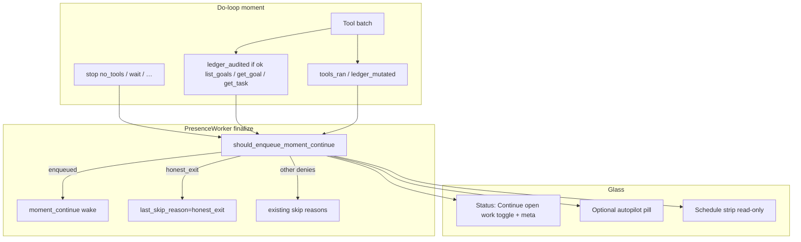

# Design: Continuous work refine (Status move + honest exit A + experiment docs)

| Field | Value |
|-------|-------|
| **Class** | DESIGN |
| **Author** | Design writer (Grok Build) |
| **Date** | 2026-08-07 |
| **Status** | Active |
| **Product** | project-elyra |
| **Workspace** | `/home/jim/Workspace/project-elyra` |
| **Primary issue** | [#130](https://github.com/jtwolfe/project-elyra/issues/130) (rewrite/expand for this package) |
| **Parallel only** | [#117](https://github.com/jtwolfe/project-elyra/issues/117) (Phase 3 procedural — not this package) |
| **Base tip** | `working` @ ~`ec0ffab` |
| **Land branch** | `feature/refine-continious-work` (spelling intentional; git branch name has typo) |
| **Predecessor** | [design-continuous-work-orient-ledger-reset.md](design-continuous-work-orient-ledger-reset.md) (Shipped mostly) |

---

## Overview

Continuous work is **shipped** and useful: hybrid in-moment work-continue HOST + gated outer `moment_continue`, Glass toggle, `PATCH /api/continuous`, pure policy in `elyra/loop/continuous_policy.py`. Operator dogfood and issue #130 surface a product honesty gap, not a greenfield rebuild.

**Package (operator-locked):**

1. **UI:** Move the continuous control from the left rail into the **Status** page; show honesty meta; reframe copy as **"Continue open work"** (progress-gated chain on open ledger work), not "always alive."
2. **Honest exit — Option A (normative):** When continuous is ON and the moment stops with `no_tools` **after a successful ledger audit** (`list_goals` / `get_goal` / `get_task`), **do not enqueue** `moment_continue` even if open goals remain and non-speak tools ran earlier. Skip reason visible in continuous meta.
3. **HOST rewrite:** Teach the real exit contract (audit then idle; bare stop after tools without audit may re-wake; `wait_user` still pauses the chain).
4. **Skills (thin):** Align `rest` (+ continuity guidance) with Option A under continuous ON.
5. **Docs:** STATE continuous exit table + Option A; **Draft** proactive/autotelic experiment mode catalog entry (not wired).
6. **Issues / tests:** Expand #130; unit tests for the new gate; light Glass Status wiring assertions.

**Landing law:** All implementation lands on `feature/refine-continious-work` (spawned from `working`). Intermediate PRs stack onto that feature branch only. **Single final land** feature → `working` when the package is complete. Do **not** merge intermediate slices to `main`/`working`.

---

## Background & Motivation

### What continuous does today (code truth)

| Surface | Path | Behavior |
|---------|------|----------|
| Pure outer gate | `should_enqueue_moment_continue` in `elyra/loop/continuous_policy.py` | Gates 1–11: toggle, stop allowlist, pending wait, dedupe, streak, cooldown, progress (`tools_ran` **or** `ledger_mutated`), pure_social, pending `task_ready`, open work, flood |
| Outer stop allowlist | `MOMENT_CONTINUE_STOP_ALLOWLIST` | `{no_tools, time_continue_declined, max_hops}` only |
| In-moment nudge | `should_in_moment_work_nudge` + `WORK_CONTINUE_HOST` | Budgeted HOST before accepting `no_tools` when work-ish |
| Finalize I/O | `PresenceWorker._maybe_enqueue_moment_continue_unlocked` | Reads `DoLoopResult.tools_ran` / `ledger_mutated` / flood counters; enqueues `moment_continue` or sets `last_skip_reason` |
| Progress definition | `elyra/loop/doloop.py` ~L1662–1664 | `tools_ran = True` on **successful non-speak** tool (`tr.ok and not tr.counts_as_speak`) |
| Ledger mutation | `mark_task_changed` → `ledger_mutated` | Set by create/update ledger tools only; **read tools do not** (`ledger.py` header) |
| Runtime toggle | `data/runtime/continuous.json` + `PATCH /api/continuous` | Default OFF; OFF cancels pending `moment_continue` only |
| Status payload | `continuous_status_block` | `enabled`, `streak`, `max_streak`, `cooldown_seconds`, `last_enqueue_at`, `last_skip_reason`, `pending_moment_continues` |
| Glass toggle | Rail `#continuous-toggle-rail` in `index.html` | Single control; Status shows **read-only** summary (`#continuous-summary`); Schedule strip is also read-only (#126) |
| Settings | `ContinuousSettings` in `elyra/settings.py` | streak=8, cooldown=30s, require_progress=True, require_open_work=True (K18 no opt-out) |

### Honest exits today (outer)

| Skip / stop path | `last_skip_reason` / mechanism | Notes |
|------------------|-------------------------------|-------|
| Toggle OFF | `disabled` (not written to last_skip when OFF idle) | No enqueue; cancels pending continues |
| Non-allowlist stop | `stop_reason` | Includes `wait` (wait_user arms wait → no outer continue) |
| Pending wait | `pending_wait` | Durable wait present |
| Dedupe | `dedupe` | Already one pending `moment_continue` |
| Streak exhausted | `streak` | Default max 8 consecutive continues |
| Cooldown | `cooldown` | Default 30s since last enqueue (or flood tick) |
| No non-speak progress | `no_progress` | No successful non-speak tool **and** no ledger mutation |
| Pure social | `pure_social` | Social wake + no tools/ledger |
| Prefer pending task_ready | `pending_task_ready` | Never synthesize task_ready (K4/K16) |
| Empty ledger | `no_open_work` | K18 |
| Flood thrash | `flood` | Majority flood formula; starts cooldown |
| In-moment only | (no outer skip) | Work-continue HOST once; thrash recovery suppresses re-nudge |

### The gap (why Option A)

**Productive moment + open goals + `no_tools` always outer-chains** when progress and open work hold.

Sequence that feels wrong:

1. Continuous ON; open goals exist.
2. Model does real work (sandbox / updates / research) → `tools_ran=True`.
3. Model decides "enough for now" and free-texts stop without tools (or after a thrash recovery) with **no ledger re-inspect**.
4. Outer policy: allowlist `no_tools` ✓, progress ✓, open work ✓ → **enqueue `moment_continue`**.
5. Presence re-wakes; model is nudged to keep working. `rest` skill says honest idle is correct when nothing useful remains — but the outer gate never heard "I looked at the ledger and stopped."

Operator decision (normative Option A):

> As long as the model has actually checked if there is any more work, it can stop.

Trust Grok not to game with empty inspects. **Do not** require "no ready tasks" (stricter hybrid — OUT). **Do not** require audit only on the last hop for v1 (optional later).

### UI friction

- Continuous switch lives in the **rail** (`#continuous-toggle-rail`) next to session/effort — always visible, framed as autopilot.
- Status already has honesty meta (`enabled`, streak, cooldown, pending, last skip) but **no toggle**.
- Copy "Continuous work" / "autopilot" overclaims: product is a **progress-gated open-work chain**, not always-alive presence.

### Related shipped surfaces

- Schedule continuous strip (#126) on Memory → Schedule: read-only meta only — **keep**; not the control surface for this package.
- Autopilot pill (`pill-autopilot`): optional to keep when continuous ON; useful busy signal for pending continues.

---

## Goals & Non-Goals

### Goals

1. **Honest exit A:** After successful ledger audit tools this moment, `stop_reason=no_tools` does **not** enqueue `moment_continue`.
2. **Visible skip reason:** e.g. `honest_exit` (canonical) in `last_skip_reason` / Status / Schedule meta / logs.
3. **HOST string** accurately teaches continuous ON contract and honest halt path.
4. **Glass:** Toggle + full honesty meta on **Status**; remove rail control as primary switch; copy **"Continue open work"**.
5. **Skills:** Thin `rest` (+ continuity) guidance under continuous ON: prefer audit-then-idle over bare `no_tools` after tool thrash without looking.
6. **Docs:** STATE continuous section / note with exit table + Option A; Draft catalog entry for proactive/autotelic experiment mode.
7. **#130:** Rewrite/expand body to this package (acceptance = this design's PR plan).
8. **Tests:** Policy unit tests for new gate; **doloop flag plumbing**; **presence finalize** honest_exit; light Glass Status wiring.
9. **Land** only via `feature/refine-continious-work` → `working` final PR.

### Non-Goals (OUT)

| Item | Why out |
|------|---------|
| Proactive switch wired / scanners / auto goals | Explicit; Draft docs only |
| Continuous policy redesign beyond A + HOST | streak/cooldown/flood math stay |
| Drop continuous | Product keeps hybrid continuous |
| Multi-user #127–129 | Separate package |
| Phase 3 procedural memory implementation | Parallel #117 only |
| Require "no ready tasks" for exit | Stricter hybrid rejected |
| Last-hop-only audit requirement | Optional later; v1 = any successful audit in moment |
| Empty-ledger outer continue | K18 remains |
| Synthesize / re-arm `task_ready` | K4/K16 remain |
| Change `stop_reason` away from `no_tools` for honest idle | Option A keeps `no_tools`; outer gate changes |
| Move Schedule strip control | Schedule stays read-only meta (title copy may align; no toggle) |
| Default continuous ON | Stay default OFF |
| Reorder honest_exit before streak/cooldown | Deferred OQ6; v1 documents masking |

---

## Proposed Design

### Architecture (delta only)



### Normative Option A — outer gate

**Invariant:** Keep model stop as `no_tools` for honest idle. Change only the **outer continue** decision.

#### New input: `ledger_audited: bool`

Meaning: **≥1 successful model tool-batch call** this moment to any tool in the closed audit set:

```python
# Single source of truth: elyra/loop/continuous_policy.py
# doloop imports this frozenset; do not redefine in worker or ledger.py.
LEDGER_AUDIT_TOOLS = frozenset({"list_goals", "get_goal", "get_task"})
```

Success = `ToolResult.ok is True` (same bar as `tools_ran` success path). **Only** set when that condition holds on a real tool result in the do-loop tool batch.

**Does set the flag:** `tr.ok and tc.name in LEDGER_AUDIT_TOOLS` after a normal execute path.

**Does NOT set the flag (normative negatives):**

| Source | Why not audit |
|--------|----------------|
| Failed inspects (`ok=False`: `task_not_found`, `goal_not_found`, `goals_not_configured`, bad args) | No successful check |
| Thrash **skip-identical** synthetic results (`ok=False`, ~doloop L1517–1536) | Not a successful inspect |
| **Orient goals slice** (`format_goals_slice` / host `list_goals()` into meal) | Host inject, not a model tool call |
| **`_has_open_work()`** finalize re-read of the ledger | Host I/O for open-work gate; not model audit |
| Free-text “I checked goals” with no audit tool | No tool evidence |
| Mutating ledger tools alone (`create_*` / `update_*`) | Set `ledger_mutated` / progress only; **not** idle-intent audit |

**Not in audit set (v1):** `create_goal`, `create_task`, `update_goal`, `update_task` — those set `ledger_mutated` and count as progress, but do **not** alone prove "I checked remaining work for idle." (Mutations can still leave open work; Option A requires an explicit **read** audit tool.)

**Scope of audit:** **Any hop in the moment** (not last-hop-only). Once `ledger_audited` is true, it stays true for that moment's `DoLoopResult`.

**Dogfood note:** A model that relies on orient's goals slice alone and bare-stops will **still re-wake** under continuous ON + open work (expected). Honest rest requires calling an audit tool.

#### Gate placement in `should_enqueue_moment_continue` (**normative single order**)

Insert as **gate 7b immediately after progress (gate 7), before pure_social (gate 8)**. No alternate placement. Full order:

```text
1  toggle
2  stop_reason allowlist
3  pending_wait
4  dedupe pending moment_continue
5  streak
6  cooldown
7  require_progress → no_progress
7b NEW: if stop_reason == "no_tools" AND ledger_audited → deny reason="honest_exit"
8  pure_social
9  pending_task_ready
10 open work
11 flood
```

**Masking note (v1 accepted):** Because 7b sits **after** streak / cooldown / dedupe, an audited idle during streak exhaustion, active cooldown, or an already-pending `moment_continue` yields `last_skip_reason` of `streak` | `cooldown` | `dedupe` — **not** `honest_exit`. Product outcome (no enqueue) is the same when those gates deny; only the **observable reason** differs. Dogfood D2 must use streak headroom, clear cooldown, and no pending MC so Status shows `honest_exit`. Moving 7b earlier (after wait, before streak) is deferred — not v1.

**Normative rule (Option A):**

```text
IF continuous_enabled
AND stop_reason == "no_tools"
AND ledger_audited is True
AND gates 1–7 have already passed
THEN enqueue = False, reason = "honest_exit"
(even if tools_ran, ledger_mutated, has_open_work would otherwise pass later gates)
```

**Does not apply** when:

| Condition | Behavior |
|-----------|----------|
| `stop_reason` is `time_continue_declined` or `max_hops` | Existing allowlist path; audit does **not** auto-exit (v1). Model did not choose idle free-text stop. |
| `ledger_audited` False | Existing rules (progress + open_work → still enqueue) |
| `stop_reason` is `wait` | Already denied by allowlist / wait path |
| Continuous OFF | `disabled` |
| Gates 1–6 deny first | `last_skip_reason` is that earlier gate (see masking note) |

**Canonical skip reason string:** `honest_exit`  
(Alias `work_audited_idle` may appear in docs as prose; code/API/status use **`honest_exit` only** to avoid dual strings in Glass.)

#### Tracking implementation (do-loop)

Mirror `tools_ran` / `ledger_mutated` pattern:

| Site | Change |
|------|--------|
| `_LoopState` | `ledger_audited: bool = False` |
| Tool batch after result (next to `tools_ran` ~L1662–1664) | `if tr.ok and tc.name in LEDGER_AUDIT_TOOLS: state.ledger_audited = True` — import set from `continuous_policy` |
| `DoLoopResult` | Additive `ledger_audited: bool = False` on **all five** constructions that already pass `tools_ran` / `ledger_mutated` (~L884, L931, L979, L1014, L1967) |
| `PresenceWorker._maybe_enqueue_moment_continue_unlocked` | `ledger_audited=bool(result.ledger_audited) if result else False`; pass into policy; log includes `ledger_audited=%s` |
| `should_enqueue_moment_continue` | New kwarg `ledger_audited: bool = False` + gate 7b |
| `continuous_policy` module | Export `LEDGER_AUDIT_TOOLS` frozenset (**only** definition site) |

**Trust note:** Loop today says "never tool names" for speak/ends_moment — that is about **ToolResult flags**. Audit detection is an explicit **policy allowlist of read ledger tool names**, co-located with continuous policy constants — acceptable because continuous already special-cases wake kinds and social kinds by string.

**No change** to: flood formula, streak/cooldown math, `require_open_work` K18, in-moment nudge inject decision (optional later: suppress work-continue HOST when ledger already audited this moment — **OUT of v1** unless dogfood forces it; HOST rewrite alone may suffice).

### HOST string rewrite

**Current** (`WORK_CONTINUE_HOST` in `continuous_policy.py`):

```text
HOST: work still open — call tools to continue (load_skill / ledger / sandbox), speak if the user needs an update, or stop if truly done.
```

**Problems:** "stop if truly done" is vague; does not teach audit-then-idle vs bare stop re-wake; does not mention wait pauses chain.

**Proposed normative string** (single constant; keep boring HOST tone):

```text
HOST: continue open work is ON — call tools if useful (load_skill / ledger / sandbox); speak if the user needs an update. To halt honestly: inspect ledger (list_goals / get_goal / get_task) then stop with no tools. wait_user also pauses the chain. Bare stop after tools without a ledger check may re-wake.
```

Constraints:

- Must start with `HOST:` (do-loop `_is_host_inject` classifier — prefix-only check).
- Must stay **one inject line** (no multi-paragraph ceremony).
- Length ~300 chars vs current ~137 — **acceptable default** for v1; still one line. Reviewers may tighten (OQ5) if dogfood shows the halt contract is diluted mid-prompt.
- **Thrash HOST remains distinct** — tool-thrash recovery HOST must **not** echo this work-continue wording (existing thrash policy comments; new text already drops “call tools to continue” / “stop if truly done” monologues).
- Tests that assert exact equality / substrings in `tests/test_continuous_policy.py` update to new string.
- Product language: **"continue open work"** not "always alive" / "autopilot forever."

### In-moment path (unchanged math; copy-aligned)

In-moment work-continue still injects once when gates pass. After inject, second free-text → accept `no_tools`. Outer then applies Option A:

| Moment path | Outer result under continuous ON + open work |
|-------------|-----------------------------------------------|
| Tools (no audit) → free-text stop | Enqueue (progress + open work) — **may re-wake** |
| Tools + audit → free-text stop | **`honest_exit`** — no enqueue (when gates 1–6 pass; see masking note) |
| Audit only (no other tools) → free-text stop | **Progress yes** (`tools_ran=True` from audit reads) → outer **`honest_exit`** (not `no_progress`) |
| wait_user | `stop_reason` deny / pending_wait |
| Pure free-text, no tools | `no_progress` |
| Orient goals visible, no audit tool → free-text stop | Same as no audit — **may re-wake** (orient ≠ audit) |

**Important interaction:** Successful `list_goals` / `get_goal` / `get_task` are non-speak tools → they already set **`tools_ran=True`**. Therefore audit-only idle **has progress**; without Option A the progress gate would pass and open work would re-chain. **Option A (`honest_exit`) is what allows exit** despite progress + open work. Without Option A, audit-then-idle would **always** re-chain — the rest skill's preferred path is broken under continuous ON.

### Skills (thin)

#### `skills/bundled/rest/SKILL.md` — exact sections to amend (PR3)

Do **not** only append a buried Process bullet. Edit these sections:

| Section | Change |
|---------|--------|
| **When to use** | Replace/clarify the line “Continuous/auto work is off or nothing honest remains”: under Continue open work **ON**, “nothing honest remains” requires a **ledger audit tool** then idle — orient slice alone is not enough. When continuous is **OFF**, bare no_tools idle remains correct. |
| **First action** | Today: “if nothing useful, **stop with no tools**.” Amend: if Continue open work is **ON**, first call `list_goals` (and/or `get_goal` / `get_task` for the active id) **then** stop with no tools. If continuous is **OFF** (or why-now is pure empty background with no open-work chain), bare stop with no tools remains correct. |
| **Process** | Keep anti-avoidance (do not rest away a clear ready task). Add: do not bare-stop after a toolful moment without looking if you intend to rest under continuous ON — that may re-enqueue `moment_continue`. `wait_user` still ends outer continue. |
| **Out of scope / quality** | Optional one-line: continuous ON + open work + bare no_tools without audit is not honest rest. |

Keep existing anti-avoidance hard rules (social → talk; clear ready task → do-work).

#### `skills/local/continuity-loop/SKILL.md`

| Section | Change |
|---------|--------|
| **Process step 7** (“If nothing useful remains → rest / honest idle…”) | Cross-link: under continuous ON, “nothing useful remains” means **audited** idle (rest First action: ledger inspect then no_tools), not silent free-text after thrash while goals stay open. Point at `rest` for the halt path. |
| **Anti-patterns** | Optional: bare free-text stop after tools without ledger inspect while continuous ON. |

No new skill packages. No bundled skill rename.

### Glass UI

#### Move control: rail → Status

| Element | Today | After |
|---------|-------|-------|
| `#continuous-toggle-rail` / `.rail-continuous` / `#continuous-status-rail` | Primary toggle + rail meta | **Remove** from rail HTML entirely (not merely hide) |
| `#continuous-summary` Status card | Read-only badge + detail | **Add toggle** (`#continuous-toggle-status`, class `continuous-toggle`) + keep full meta via `#continuous-detail` |
| Schedule `#schedule-continuous` | Read-only strip; title **"Continuous"** | Stay **meta-only** (no toggle). **PR4:** retitle card to **"Continue open work"** (or short "Open work") so Status/Schedule framing match — still not a second control |
| Autopilot pill | Optional ON indicator | **Keep** if useful (pending continue busy) |
| Label copy | "Continuous work" | **"Continue open work"** (+ short helper: progress-gated chain on open ledger work) |

#### Status card content (required honesty meta)

Show (from existing `continuous` status object — no API field changes required except skip reason values):

| Field | Source |
|-------|--------|
| enabled | `continuous.enabled` |
| streak / max_streak | `streak` / `max_streak` |
| cooldown_seconds | `cooldown_seconds` |
| pending_moment_continues | `pending_moment_continues` |
| last_skip_reason | includes new `honest_exit` |
| last_enqueue_at | existing |

Optional helper line (static copy, not API):

> Continue open work: when ON, presence may chain moments after progress if open goals remain — unless you audit the ledger then stop, or wait.

#### Wiring patterns to reuse

- `continuousToggles` query already selects `.continuous-toggle` excluding usage/dev-speed/semantic-wait — add Status toggle with class `continuous-toggle` and id `continuous-toggle-status` so the existing change listener + `setContinuousEnabled` still work.
- `setContinuousEnabled` / `renderContinuous` / `formatContinuousMeta` stay; update selectors:
  - **`continuousMetaEls`:** today hardcodes `[$("#continuous-status-rail")]`. After rail removal this is empty (null-safe). PR4 must **drop** that assignment (or re-point only if a Status compact meta el is added). Status honesty detail is already driven by `#continuous-detail` / `#continuous-badge` inside `renderContinuous` — not via `continuousMetaEls`.
  - Tests in `tests/test_api_glass.py` currently assert rail present / status toggle absent / `"Continuous work"` — **invert** (see Appendix C).
- CSS: reuse `.continuous-control` / `.toggle-label` / `.toggle-track` already used by Status siblings (dev speed, semantic wait); remove unused `.rail-continuous` rules if nothing else depends on them (or leave dead CSS — prefer delete with HTML).

#### API

**No contract break.** `PATCH /api/continuous` and `GET` status `continuous` block unchanged in shape. New skip reason is a string value only.

### Docs

#### STATE continuous honesty

Update **`docs/state/stretch-1.md` §11 Continuous work** (and/or a short subsection under known continuous exits) to include:

1. Product framing: Continue open work (not always-alive).
2. Exit table (honest exits + Option A).
3. HOST contract one-liner.
4. Pointer to this design for Option A decision archaeology.
5. Link #130.
6. **Live-eval note:** `S-cont-*` scenarios that allow outer continue when open work remains may see **fewer continues** if the model calls `list_goals` / audit tools before stop (Option A → `honest_exit`). Continuous live stage remains operator-gated; no scenario rewrite required in v1 unless a harness asserts enqueue. Document expected drift only.

Optionally a small dedicated note if stretch-1 section grows too large: `docs/state/` continuous slice — prefer **in-place §11 expand** to avoid doc sprawl unless author chooses a sibling file.

#### DESIGN catalog — proactive experiment **Draft**

Add under `docs/design/` (suggested path):

`docs/design/stretch-1/design-proactive-autotelic-experiment-mode.md`  
**Status: Draft** — **not wired**, not continuous, not claims.

Content outline (non-claims):

| Section | Intent |
|---------|--------|
| Motivation | Autotelic / proactive agency beyond open-ledger chains |
| Relationship | Parallel to Stretch 2 Phase 3 / **#117** only — **not** a continuous policy extension |
| Surfaces (speculative) | Optional future scanner, soft goal proposals, operator experiment flag |
| Explicit non-implementation | No switch, no scanners, no auto goals in this package or v0.1 continuous path |
| Open questions | Trigger sources, safety, multi-user, interaction with rest |

Register in `docs/design/README.md` catalog as **Draft**.

#### Predecessor design

Do **not** rewrite the full shipped continuous design. Add a one-line "superseded exit gap: see design continuous refine Option A" only if a cross-link is needed from the shipped doc's open questions — optional.

### Issues

#### #130 (primary) — rewrite/expand

Replace thin "re-evaluate" body with this package:

- Title suggestion: `Continue open work: Status toggle + honest exit A + docs` (or keep title, rewrite body).
- IN: Option A gate, HOST, Status move, skills thin, STATE exit table, Draft proactive catalog, tests.
- OUT: copy Non-Goals table from this design.
- Acceptance: checkboxes mapped to PR slices + dogfood matrix (ON × audit-idle × bare-stop re-wake × wait × OFF).
- Branch note: lands via `feature/refine-continious-work`.

#### Optional deferred issue — proactive experiment

- Open only if operator wants a tracker separate from Draft design.
- Link **#117 as parallel only** (Phase 3 procedural memory ≠ proactive continuous).
- Do not block #130 on it.

### Observability

| Signal | Where |
|--------|-------|
| `last_skip_reason=honest_exit` | Status / Schedule meta / continuous status API — only when gates 1–6 pass before 7b (see masking note) |
| `last_skip_reason=streak\|cooldown\|dedupe` on audited idle | Expected when earlier gates fire first; **no enqueue** still holds; do not treat missing `honest_exit` as Option A failure if streak/cooldown/dedupe explain it |
| Log line | Existing `moment_continue skip reason=%s` in worker (already logs reason, tools_ran, ledger_mutated) — add `ledger_audited=%s` to that log line |
| Moment tape | Existing tool beats already record `list_goals` etc.; no new beat type required |

---

## API / Interface Changes

| API | Change |
|-----|--------|
| `PATCH /api/continuous` | **None** (still `{enabled: bool}`) |
| `GET /api/status` → `continuous` | **None** in keys; `last_skip_reason` may be `honest_exit` |
| `GET /api/schedule` → `continuous` | Same block; no key change |
| Python policy API | `should_enqueue_moment_continue(..., ledger_audited: bool = False)` |
| `DoLoopResult` | Additive field `ledger_audited: bool = False` |
| HOST constant | String replace only |

Backward compatible for external clients: new skip reason is additive vocabulary.

---

## Data Model Changes

| Store | Change |
|-------|--------|
| `data/runtime/continuous.json` | **None** (still `enabled` + `updated_at`) |
| Goals ledger | **None** |
| Wake payload for `moment_continue` | **None** |
| Settings / `elyra.toml` `[continuous]` | **None** for Option A (no new knobs v1) |

Optional later (OUT): `require_ledger_audit_for_idle` setting — not needed; Option A is always-on when continuous is ON.

---

## Alternatives Considered

### A. Option A — audit then `no_tools` skips outer continue (**CHOSEN**)

- **Pros:** Matches operator rationale; keeps stop_reason vocabulary; rest skill aligns; minimal code (flag + one gate + HOST).
- **Cons:** Model could "game" with empty `list_goals` — operator accepts for v1; failed inspects do not count.

### B. Stricter hybrid — require no ready tasks for exit (**REJECTED**)

- **Pros:** Stronger "nothing executable remains."
- **Cons:** Operator OUT; blocked/in_progress goals with no ready tasks still legitimate multi-moment arcs; forces ledger status semantics into continue gate; rest becomes "close or clear ready" thrash.

### C. New stop_reason `honest_idle` / `rest` (**REJECTED for v1**)

- **Pros:** Explicit tape semantics.
- **Cons:** Touches do-loop stop taxonomy, skills, glass, live-eval; larger surface than outer-gate-only fix; Option A achieves product outcome without new stop.

### D. Last-hop-only audit (**DEFERRED**)

- **Pros:** Prevents early-moment list_goals then hours of thrash then bare stop from counting as audited.
- **Cons:** Operator OUT for v1; more complex hop indexing; revisit if dogfood shows gaming.

### E. Drop outer continue; in-moment only (**REJECTED**)

- **Pros:** No re-wake surprises.
- **Cons:** Breaks multi-moment open-work product; continuous design K1 hybrid.

### F. Leave toggle in rail; Status meta only (**REJECTED**)

- **Pros:** Zero layout risk.
- **Cons:** Operator package requires Status as control home; rail autopilot framing mis-sells product.

---

## Security & Privacy

| Concern | Assessment |
|---------|------------|
| New tools / network | None |
| Privilege | Toggle remains operator Glass / API only |
| Ledger reads | Already model-callable; audit flag uses existing tool results |
| Skip reason leakage | `honest_exit` is operational meta, not user PII |
| Gaming audit | Accepted risk; no auth change |

Severity if model games empty `list_goals` every moment: **Low–Med** (wastes less than infinite re-wake; streak/cooldown still bound thrash). Mitigation: dogfood; optional last-hop audit later.

---

## Observability

Covered above. Success metrics for dogfood:

1. Audit-then-idle moments (with streak headroom / cooldown clear / no pending MC): `last_skip_reason=honest_exit`, no new `moment_continue`.
2. Productive work without audit + open goals: still enqueues.
3. Status shows toggle + skip reason including `honest_exit` under D2 preconditions.
4. `wait_user` still quiet (no continue).
5. OFF still cancels pending continues only.
6. Audited idle under streak/cooldown/dedupe: no enqueue; reason may be the earlier gate (not a regression).

---

## Rollout Plan

### Branch law (execute-plan critical)

**`docs/dev/branch-law.md` defaults PR base to `working`.** This package **overrides** that habit for intermediate slices:

```text
working (~ec0ffab)
    └── feature/refine-continious-work   ← ALL intermediate PR bases (PR1–PR4)
            ├── PR1 docs/issues
            ├── PR2 policy + HOST + tests
            ├── PR3 skills
            ├── PR4 Glass Status
            └── PR5 final land → working only
```

**Bootstrap checklist (do first, before any PR):**

1. `git checkout working && git pull` (tip ~`ec0ffab` or current working tip).
2. **`git checkout -b feature/refine-continious-work`** — create feature branch if missing (spelling **`continious`**).
3. Every execute-plan PR **`base_branch` / merge target = `feature/refine-continious-work`** until PR5.
4. **Only PR5** opens against **`working`**.
5. Do **not** merge intermediate slices to `main`/`working`.

- Git branch spelling: **`continious`** (typo preserved). Prose: "continuous" / "Continue open work."

### Risk table

| Risk | Severity | Mitigation |
|------|----------|------------|
| Exact HOST string tests / live-eval golden | Low | Update unit asserts; HOST ~300 chars acceptable; thrash HOST stays distinct |
| `S-cont-*` continue frequency after Option A | Low | Models that `list_goals` before stop get `honest_exit`; note in PR1 STATE only; no scenario rewrite unless harness asserts enqueue |
| DoLoopResult field missed / worker forgets pass-through | **Med–High** | Appendix B checklist + **required** doloop + presence finalize tests (not policy-only) |
| Glass tests assert rail / "Continuous work" | Low | Full Appendix C assert flip |
| Model never audits → still re-wakes | Expected | HOST + rest First action teach path; not a bug |
| Model always audits empty → exits early | Low–Med | Dogfood; deferred last-hop audit |
| Orient-only “I saw goals” treated as audited | Med if mis-implemented | KD21 + negatives table; flag only from tool batch |
| Status panel scroll bugs (known-bugs) | Med UX | Toggle must be above fold or within scrollable status; don't invent full status scroll fix unless blocking |
| Execute-plan opens PR1 against `working` by habit | Med process | Bold bootstrap checklist; PR0/PR1 depends_on feature branch exists |

### Dogfood matrix (operator)

| # | Setup | Expect |
|---|-------|--------|
| D1 | Continuous ON, open goal, tools without audit, free-text stop | `moment_continue` enqueued |
| D2 | Continuous ON, open goal, `list_goals` ok then free-text stop; **preconditions:** streak &lt; max, cooldown elapsed (or never enqueued), no pending `moment_continue` | no enqueue; **`last_skip_reason=honest_exit`** |
| D2b | Same as D2 but streak exhausted or cooldown active | no enqueue; `last_skip_reason` may be `streak`/`cooldown` (masking OK) |
| D3 | Continuous ON, `wait_user` | no continue |
| D4 | Continuous ON, close all goals mid-moment | `no_open_work` |
| D5 | Continuous OFF | no continue; pending cancelled |
| D6 | Status toggle ON/OFF + meta streak/skip | matches API |
| D7 | Schedule strip | still read-only meta; title aligned to Continue open work |
| D8 | Orient shows goals, no audit tool, free-text stop + open work | still enqueues (orient ≠ audit) |

---

## Open Questions

| # | Question | Default if unresolved |
|---|----------|----------------------|
| OQ1 | Suppress in-moment work-continue HOST once `ledger_audited` already true this moment? | **No for v1** — outer gate only |
| OQ2 | Should `time_continue_declined` / `max_hops` honor audit for skip? | **No for v1** — only `no_tools` |
| OQ3 | Open deferred GitHub issue for proactive Draft now? | Optional; Draft file alone OK |
| OQ4 | Rename autopilot pill copy to "open work"? | Optional polish in Glass PR; pill may stay "autopilot" for brevity |
| OQ5 | Exact HOST wording micro-edit at review? | Use proposed string as default (~300 chars OK); reviewers may tighten length if dogfood shows dilution |
| OQ6 | Move `honest_exit` before streak/cooldown for better Status observability? | **No for v1** — document masking; product deny is enough |

---

## References

| Ref | Path / URL |
|-----|------------|
| Shipped continuous design | `docs/design/stretch-1/design-continuous-work-orient-ledger-reset.md` |
| Policy | `elyra/loop/continuous_policy.py` |
| Do-loop progress | `elyra/loop/doloop.py` (`tools_ran`, `ledger_mutated`, HOST inject; five `DoLoopResult` sites) |
| Finalize | `elyra/presence/worker.py` (`_maybe_enqueue_moment_continue_unlocked`, `set_continuous_enabled`) |
| Settings | `elyra/settings.py` `ContinuousSettings` |
| Ledger tools | `elyra/tools/builtin/ledger.py`; packages `tools/bundled/{list_goals,get_goal,get_task}/` |
| Glass | `elyra/runtime/web/{index.html,app.js,style.css}` |
| API | `elyra/runtime/api.py` `_patch_continuous` |
| Tests | `tests/test_continuous_policy.py`, `tests/test_api_glass.py`, `tests/test_presence_worker.py` (`_progress_result` / `_finalize_direct`), `tests/test_doloop.py` if used for flag plumbing |
| Skills | `skills/bundled/rest/SKILL.md`, `skills/local/continuity-loop/SKILL.md` |
| Live-eval | `scripts/live_eval/scenarios.yaml` `S-cont-*` (operator-gated) |
| STATE stretch-1 §11 | `docs/state/stretch-1.md` |
| Branch law | `docs/dev/branch-law.md` (default base `working`; this package stacks on feature) |
| #130 | https://github.com/jtwolfe/project-elyra/issues/130 |
| #117 | https://github.com/jtwolfe/project-elyra/issues/117 (parallel only) |
| #126 Schedule strip | already on `working` |

---

## Key Decisions

| # | Decision | Rationale |
|---|----------|-----------|
| KD1 | **Option A only** for honest exit: audit + `no_tools` → no outer enqueue | Operator lock; minimal surface |
| KD2 | **Keep stop_reason `no_tools`** | Avoid stop taxonomy churn; outer gate owns product exit |
| KD3 | **Audit set** = `{list_goals, get_goal, get_task}` with **`ToolResult.ok is True` only** | Explicit "checked remaining work"; mutations alone insufficient; failed inspects and thrash skip-identical (`ok=False`) never set the flag |
| KD3b | **`LEDGER_AUDIT_TOOLS` exported only from `continuous_policy`**; doloop imports it | Single source of truth; no second frozenset in worker/ledger |
| KD4 | **Any-hop audit** (moment-scoped sticky flag), not last-hop | Operator OUT for last-hop v1 |
| KD5 | **Skip reason string** `honest_exit` only (no dual alias in API) | Glass/meta simplicity |
| KD6 | **Gate applies only when `stop_reason == no_tools`** | Declined time-continue / max_hops stay progress-gated |
| KD7 | **HOST rewrite** teaches audit-then-idle + wait pause + bare-stop re-wake | Align model incentives with Option A |
| KD8 | **Toggle home = Status**; remove rail primary control | Operator package; honesty meta co-located with control |
| KD9 | **Copy: "Continue open work"** | Progress-gated open-ledger chain, not always-alive |
| KD10 | **Autopilot pill optional keep** | Useful pending-continue signal; not the control |
| KD11 | **Schedule strip stays read-only**; **title string aligned** to Continue open work in PR4 | #126 meta-only; avoid dual toggle; avoid stale "Continuous" label |
| KD12 | **No new ContinuousSettings knobs** for Option A | Always on when continuous enabled |
| KD13 | **Skills thin only** (rest + continuity); **must edit First action / When to use**, not only Process bullets | Playbook alignment; bare-idle First action is the failure mode |
| KD14 | **Proactive = Draft docs only**; link #117 parallel, not dependency | Explicit OUT for wiring |
| KD15 | **All intermediate PRs base on `feature/refine-continious-work`**; **only PR5 → `working`** | Overrides branch-law default PR base for this short-lived stack |
| KD16 | **Primary tracker #130** rewrite for this package | Existing issue expanded, not replaced by silent work |
| KD17 | **`ledger_audited` on DoLoopResult** parallel to `tools_ran` / `ledger_mutated` | Same finalize plumbing pattern |
| KD18 | **Trust model not to game empty inspects** for v1 | Operator explicit; deferred last-hop if needed |
| KD19 | **K4/K15/K16/K18 continuous laws unchanged** | Only add exit honesty; don't re-litigate hybrid design |
| KD20 | **In-moment nudge math unchanged** in v1 | HOST string + outer gate sufficient first cut |
| KD21 | **`ledger_audited` only from successful model tool-batch audit tools** — never orient slice, `_has_open_work`, free-text, or mutations alone | Prevent host ledger I/O or meal goals from faking honest exit |
| KD22 | **Gate order fixed: 7b after progress (7), before pure_social (8)** — no alternate placement | Avoid implementer drift; Appendix A is normative |
| KD23 | **v1 accepts streak/cooldown/dedupe masking of `honest_exit` reason** | Minimal gate reorder risk; dogfood D2 preconditions document when reason is visible |
| KD24 | **PR2 tests must cover doloop flag set + presence finalize plumbing**, not policy kwargs alone | Prevent green CI with silent no-op product |

---

## PR Plan

**All intermediate PRs base on / merge into `feature/refine-continious-work` only.**  
**PR5 alone targets `working`.**  
Create the feature branch from `working` **before PR1** (bootstrap checklist above).  
Do **not** open PR1–PR4 against `working` even though branch-law default is `working`.

### PR1 — Docs + #130 notes + proactive experiment Draft

| Field | Value |
|-------|-------|
| **Title** | `docs: continuous refine Option A notes + #130 package + proactive Draft` |
| **Base branch** | **`feature/refine-continious-work`** (not `working`) |
| **Depends on** | feature branch exists from `working` |
| **Files** | `docs/state/stretch-1.md` (§11 expand: exit table + Option A + framing + **S-cont live-eval continue-frequency note**); optional cross-link in `docs/design/stretch-1/design-continuous-work-orient-ledger-reset.md`; `docs/design/stretch-1/design-proactive-autotelic-experiment-mode.md` (**Draft**); `docs/design/README.md` catalog row; issue #130 body rewrite (gh); this design may be copied in-repo if desired as `docs/design/stretch-1/design-continuous-work-refine.md` (**Active**) |
| **Description** | Document exit table and Option A before code. Catalog Draft proactive/autotelic experiment mode (non-claims, parallel #117, not continuous, not wired). Expand #130 acceptance to this package. Note `S-cont-*` may see fewer continues when models audit before stop. No runtime behavior change. |
| **Tests** | None / doc-only |
| **Risk** | Low |

### PR2 — Policy honest_exit gate + HOST string + unit tests

| Field | Value |
|-------|-------|
| **Title** | `feat(continuous): honest_exit on ledger audit + no_tools; rewrite WORK_CONTINUE_HOST` |
| **Base branch** | **`feature/refine-continious-work`** |
| **Depends on** | PR1 (docs first preferred; code-only OK if parallel) |
| **Files** | `elyra/loop/continuous_policy.py` (`LEDGER_AUDIT_TOOLS`, `WORK_CONTINUE_HOST`, `should_enqueue_moment_continue` + `ledger_audited`); `elyra/loop/doloop.py` (`_LoopState.ledger_audited`, set next to `tools_ran`, all five `DoLoopResult` paths); `elyra/presence/worker.py` (pass flag; log `ledger_audited=`); `tests/test_continuous_policy.py`; `tests/test_presence_worker.py` (finalize); `tests/test_doloop.py` and/or targeted doloop unit for flag set |
| **Description** | Implement Option A. Export audit tool set from continuous_policy only. Sticky `ledger_audited` on successful list_goals/get_goal/get_task tool results only. Outer gate 7b: `no_tools` + audited → `honest_exit` no enqueue. Rewrite HOST. Gate order fixed per Appendix A. |
| **Tests (required) — three layers** | **(A) Pure policy** (`test_continuous_policy.py`): 1) `ledger_audited=True` + `no_tools` + progress + open work → `enqueue=False`, `reason=honest_exit`; 2) `ledger_audited=False` + progress + open work + `no_tools` → still `enqueued`; 3) `wait` / non-allowlist unchanged; 4) `no_open_work` unchanged; 5) audit + `time_continue_declined` does **not** force honest_exit; 6) HOST starts with `HOST:`, mentions ledger inspect + re-wake; 7) policy-level `ledger_audited=False` path. **(B) Do-loop flag plumbing:** successful `list_goals` / `get_goal` / `get_task` → `result.ledger_audited is True`; failed (`ok=False`, e.g. `task_not_found` / `goals_not_configured`) → False; mutating ledger tools alone do **not** set it; thrash skip-identical does not set it. **(C) Presence finalize** (extend `_progress_result` + `_finalize_direct` in `test_presence_worker.py`): continuous ON + open goal + `_progress_result(tools_ran=True, ledger_audited=True)` + `no_tools` → **no** `moment_continue`, `last_skip_reason == "honest_exit"`; same with `ledger_audited=False` still enqueues. Optional: log format includes `ledger_audited=` (or call-site review against Appendix B). |
| **Risk** | Med–High if tests are policy-only — **must ship (B)+(C)** |

### PR3 — Skills rest / continuity thin updates

| Field | Value |
|-------|-------|
| **Title** | `skills: rest/continuity prefer audit-then-idle under continuous ON` |
| **Base branch** | **`feature/refine-continious-work`** |
| **Depends on** | PR2 (behavior exists so skill text is true) |
| **Files** | `skills/bundled/rest/SKILL.md` (**When to use**, **First action**, Process); `skills/local/continuity-loop/SKILL.md` (**Process step 7**, optional anti-patterns) |
| **Description** | Amend First action + When to use so continuous ON teaches audit tools then no_tools (not bare idle). Cross-link continuity step 7 to audited idle. Keep anti-avoidance. No process redesign beyond those sections. |
| **Tests** | None or skill catalog smoke if already tests skill files exist |
| **Risk** | Low — residual risk is under-editing First action; checklist sections in design Skills section |

### PR4 — Glass: move continuous to Status + copy

| Field | Value |
|-------|-------|
| **Title** | `feat(glass): Continue open work control on Status; remove rail toggle` |
| **Base branch** | **`feature/refine-continious-work`** |
| **Depends on** | PR2 (skip reason `honest_exit` visible); PR3 optional |
| **Files** | `elyra/runtime/web/index.html` (remove rail continuous block; Status card toggle + helper copy); `elyra/runtime/web/app.js` (`renderContinuous`, **drop/re-point `continuousMetaEls`**, Status toggle wiring via `continuous-toggle` class, Schedule title `"Continue open work"` in `renderScheduleContinuous`, labels); `elyra/runtime/web/style.css` (rail cleanup / Status control spacing); `tests/test_api_glass.py` (full Appendix C) |
| **Description** | Status is control + honesty meta home. Copy framing Continue open work. Keep autopilot pill optional. Schedule strip remains read-only but title/meta prefix aligned. PATCH path unchanged. |
| **Tests** | See Appendix C — rail ids gone; status toggle present; "Continue open work"; schedule strip retained; PATCH continuous tests unchanged |
| **Risk** | Low–Med UX (status scroll known issue — place control near top of continuous card) |

### PR5 — Final land: feature → working

| Field | Value |
|-------|-------|
| **Title** | `chore: land feature/refine-continious-work into working` |
| **Base branch** | **`working`** (only land PR) |
| **Depends on** | PR1–PR4 merged into feature; dogfood D1–D8 smoke |
| **Files** | Merge only; optional STATE note "landed" + close/update #130 checkboxes |
| **Description** | **Single final land** of the package to `working`. Do not land intermediate slices separately. No further feature work in this PR. |
| **Tests** | CI green on feature tip before merge |
| **Risk** | Low process; integration risk covered by prior PRs |

### Suggested implementation order (execute-plan)

```text
1. git checkout working && git pull
2. git checkout -b feature/refine-continious-work   # REQUIRED before any PR; spelling continious
3. PR1 docs + #130          → base: feature/refine-continious-work  (NOT working)
4. PR2 policy + HOST + tests → base: feature/…  ← critical path (policy + doloop + finalize tests)
5. PR3 skills               → base: feature/…
6. PR4 Glass                → base: feature/…
7. Operator dogfood matrix (D1–D8)
8. PR5 land feature → working ONLY
```

### Out of PR plan (explicit)

- Proactive switch / scanners / auto goals
- Phase 3 procedural (#117)
- Multi-user issues
- Last-hop-only audit
- Continuous default ON
- Streak/cooldown/flood redesign
- Moving `honest_exit` before streak/cooldown (OQ6 deferred)
- Live-eval scenario rewrites (notes only unless harness asserts enqueue)

---

## Appendix A — Outer gate pseudocode after Option A (**normative order**)

```python
def should_enqueue_moment_continue(..., ledger_audited: bool = False) -> MomentContinueDecision:
    if not continuous_enabled:
        return deny("disabled")
    if stop_reason not in {"no_tools", "time_continue_declined", "max_hops"}:
        return deny("stop_reason")
    if has_pending_wait:
        return deny("pending_wait")
    if pending_moment_continues >= max_pending_continues:
        return deny("dedupe")
    if streak >= max_streak:
        return deny("streak")
    if cooldown not elapsed:
        return deny("cooldown")
    if require_progress and not (tools_ran or ledger_mutated):
        return deny("no_progress")
    # --- Option A (gate 7b): fixed after progress, before pure_social ---
    if stop_reason == "no_tools" and ledger_audited:
        return deny("honest_exit")
    # ----------------------------------------------------------------
    if skip_pure_social and wake_kind in SOCIAL and not tools_ran and not ledger_mutated:
        return deny("pure_social")
    if pending_task_ready_count > 0:
        return deny("pending_task_ready", skip_for_pending_task_ready=True)
    if not has_open_work:
        return deny("no_open_work")
    if flood_majority_or_last_stop(...):
        return deny("flood")  # start_cooldown
    return allow("enqueued")  # start_cooldown
```

## Appendix B — Plumbing checklist (PR2) — prevent silent no-op

### B1. DoLoopResult sites (all five that thread `tools_ran` / `ledger_mutated`)

In `elyra/loop/doloop.py`, pass `ledger_audited=state.ledger_audited` (or `False` if state not available) on:

| Approx line | Context |
|-------------|---------|
| ~L884 | Early/normal return path |
| ~L931 | Uncaught RuntimeError path |
| ~L979 | Provider timeout path |
| ~L1014 | Other error return |
| ~L1967 | Normal finish / stop path |

Prefer explicit field on `DoLoopResult` dataclass; do not rely solely on worker `getattr` fallback.

### B2. Flag set site

Next to `tools_ran` (~L1662–1664):

```python
if tr.ok and not tr.counts_as_speak:
    state.tools_ran = True
if tr.ok and tc.name in LEDGER_AUDIT_TOOLS:  # from continuous_policy
    state.ledger_audited = True
```

### B3. Worker finalize

`_maybe_enqueue_moment_continue_unlocked` (~L3798–3840 today): read `ledger_audited` from result; pass into `should_enqueue_moment_continue`; extend skip log with `ledger_audited=%s`.

### B4. Tests that prove B1–B3

See PR2 tests layers (A)/(B)/(C). Policy-only green is **not** sufficient.

## Appendix C — Glass test assert flip (PR4)

Today (`tests/test_api_glass.py`):

```python
assert "continuous-toggle" in html
assert "Continuous work" in html          # ~L967 — rename breaks this
assert "continuous-toggle-rail" in html   # ~L1027
assert "rail-continuous" in html          # ~L1028
assert "continuous-status-rail" in html   # ~L1029
assert "continuous-toggle-status" not in html  # ~L1032
assert 'id="schedule-continuous"' in html
```

After PR4 (required asserts):

```python
assert "continuous-toggle-status" in html
assert "continuous-toggle-rail" not in html
assert "rail-continuous" not in html
assert "continuous-status-rail" not in html
assert "Continue open work" in html
# Optional: legacy phrase gone
assert "Continuous work" not in html  # if fully renamed; if helper still mentions "continuous" carefully scope
assert 'id="schedule-continuous"' in html
# Status wiring: class continuous-toggle still present for PATCH path
assert 'id="continuous-toggle-status"' in html
assert "continuous-toggle" in html
```

**app.js cleanup checklist:** remove rail continuous DOM; drop `continuousMetaEls = [$("#continuous-status-rail")]` (or empty); Status uses `#continuous-detail`; `continuousToggles` NodeList still includes Status control; `renderScheduleContinuous` title → Continue open work.