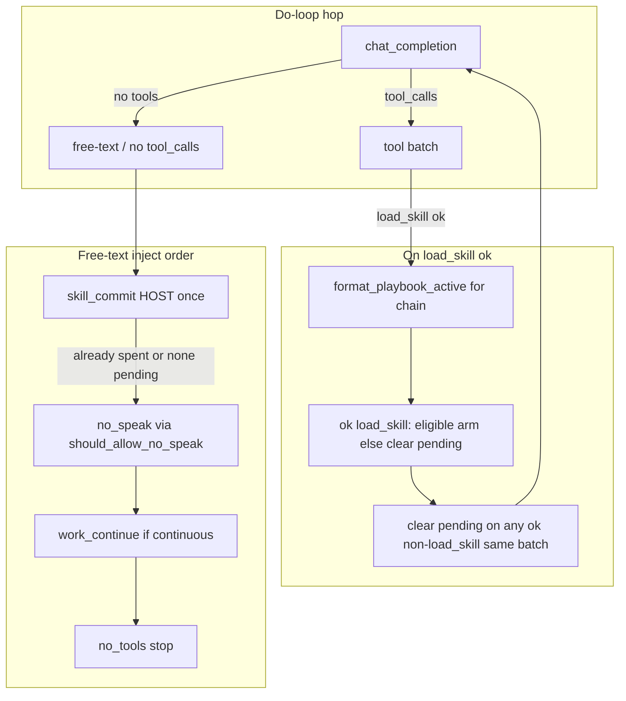

# Post-skill commitment + growth path clarity + skill/tool instruction pass

| Field | Value |
|-------|-------|
| **Class** | DESIGN |
| **Author** | Design (Grok Build) |
| **Date** | 2026-07-22 |
| **Status** | Shipped / historical |
| **Product** | project-elyra (main; continuous work shipped) |
| **Workspace** | `/home/jim/Workspace/project-elyra` |
| **Live ref** | Operator dogfood moment id `bbb468c0-5d8e-4162-acef-464bbe01b64a` (not a repo fixture; may be absent under `data/moments/`) |
| **Prior art** | `docs/design/stretch-1/design-continuous-work-orient-ledger-reset.md`, `docs/design/stretch-1/design-gemma-sampling-hygiene-staged.md` |

---

## Overview

Growth-path prompting now gets the model to call `load_skill` (e.g. `plan-work`). The **next hop** often fails: the playbook arrives as a dense JSON tool blob (`ok`, `name`, `body`, …); the model free-texts / channel-floods instead of checklist step 1; social `no_speak` fires mid-playbook; then thrash (`list_goals` → flood → `no_tools`, `spoke=false`). In-moment `work_continue` does not recover because flood free-text hard-stops that path.

This design ships **Phase A (items 1–4)** as host recovery + instruction clarity on the **existing** wake → moment → do-loop spine:

1. **Skill-commit HOST nudge** after a successful **commit-eligible** `load_skill` when the next hop has no tool_calls.
2. **Playbook-framed** model-facing `load_skill` result (still one tool; clearer pragmatics).
3. **De-conflict** social no-speak vs just-loaded **work** skill (structural free-text branch uses pure predicates).
4. **Bundled skill/tool instruction pass** — first-action sections + growth tool copy aligned with playbooks (`rest` specialized; see K16).

**Item 5** (`tool_choice` required once after `load_skill`) is **optional / evidence-gated**: design the lever + hermetic tests; **default OFF**; enable only if live/eval shows A alone insufficient.

No second skill runner. No skill subprocess. Speak-only glass remains law. Fail-closed create-tool gates unchanged.

---

## Background & Motivation

### What already works

| Piece | Path | Role |
|-------|------|------|
| Growth path in system | `prompts/system.md` § Skills and growth | Catalog → `load_skill` → create-tool / create-skill |
| Orient footer | `prompts/orient.md` | Catalog-only + `load_skill` / draft→verify→promote |
| Soft bias | `elyra/loop/orient_slice.py` | Always names `load_skill("…")` |
| `load_skill` handler | `elyra/tools/builtin/skills_tools.py` | Full body + `ctx.skills_used` append |
| Social hop-0 speak pin | `doloop.social_first_hop_tool_choice` | `tool_choice` function pin speak once |
| Social no-speak | `doloop.NO_SPEAK_NUDGE` | Structural free-text inject before work_continue (K8) |
| Work-continue | `continuous_policy.WORK_CONTINUE_HOST` | Budgeted HOST; **blocked on flood** |
| Create-tool gates | `elyra/tools/builtin/growth.py` + verify/promote | Fail-closed; unchanged |

### Live thrash (operator dogfood ref `bbb468c0`)

Narrative evidence from operator home (file may not exist in this workspace’s `data/moments/`):

```text
hop1  load_skill("plan-work")  ok → JSON tool message with full body
hop2  free-text, tool_calls=[], reasoning flood, finish=length
      → HOST no_speak (social)   ← wrong priority mid work playbook
hop3  list_goals               (partial recovery, not checklist step 1)
hop4  free-text flood again
stop  no_tools  spoke=false  tools_ran=true  work_continue_injects=0
```

**Failure chain (code-path validated; hop transcript is dogfood narrative):**

1. **JSON playbook blob** invites rumination (“I have the skill…”) instead of “step 1 = tool_call”.
2. **No post-skill host recovery** — only no_speak (social) and work_continue (flood-blocked).
3. **no_speak mid-playbook** steers toward glass speech or stop, not ledger/create-tool tools.
4. Skill bodies say “Steps” but lack an explicit **first action** list (tools for work; honest stop for rest).

Local Gemma thrash residual stays in scope as **host recovery only** — not a claim that generation is cured.

### Constraint reminder

- Single spine: presence → moment → `run_do_loop` multi-hop.
- Modular pure policy preferred (same family as `continuous_policy` / `continue_policy`).
- Do not dual-write conflicting growth procedures in system/orient/skills — **align**.

---

## Goals & Non-Goals

### Goals

1. After successful **commit-eligible** `load_skill`, if the next completion has **no tool_calls**, inject **one** skill-commit HOST (even when the free-text hop is a channel flood — this is the live recovery hole). **`rest` is not commit-eligible** (K16).
2. Model-facing `load_skill` success content reads as an **active playbook**, not a raw result object.
3. Product rule: work-skill load this moment **de-prioritizes** no-speak until commit is spent or pending is cleared by a non-`load_skill` tool (exact predicates below). Structural free-text branch **must** call `should_allow_no_speak`.
4. Bundled skills ship a first-action section (work/talk: mandatory tool_call list; **rest: honest no-tool stop**); growth tools’ TOOL.md stay consistent with playbooks.
5. Optional post-`load_skill` `tool_choice` lever designed, tested hermetically, **default OFF**.
6. Small PRs; pure predicates unit-tested without presence.

### Non-Goals

- Second skill engine / automatic checklist interpreter / step index state machine.
- Product-wide `tool_choice=required` (still never the default).
- Free-text as glass; speak-only remains law.
- Changing create-tool fail-closed gates, verify hash, or promote rules.
- Claiming channel-flood generation is fixed (hygiene stays boundary defense).
- Merging skill-commit into outer `moment_continue` (in-moment only for Phase A).
- Rewriting continuous work architecture or `continue_policy` time-idle.
- Auto-`load_skill` by the host (model still chooses the skill).
- Multi-skill commit budget > 1 per moment in Phase A (residual risk acknowledged; see OQ4).

---

## Proposed Design

### Architecture (same spine)



### Classification: work vs social vs no-commit

Exact sets (normalize with `normalize_skill_name` / casefold). Single source in `skill_commit_policy.py`:

```python
WORK_SKILLS = frozenset({
    "plan-work",
    "do-work",
    "create-tool",
    "create-skill",
    "review-work",
})
SOCIAL_SKILLS = frozenset({"talk", "rest"})
# rest: social for talk-handoff semantics, but NEVER skill-commit arm (honest idle).
NO_COMMIT_SKILLS = frozenset({"rest"})


def is_work_skill(name: str) -> bool:
    """True if name is a known work playbook (normalized)."""
    key = normalize_skill_name(name)
    return key in {normalize_skill_name(s) for s in WORK_SKILLS}


def is_social_skill(name: str) -> bool:
    key = normalize_skill_name(name)
    return key in {normalize_skill_name(s) for s in SOCIAL_SKILLS}


def is_commit_eligible_skill(name: str) -> bool:
    """True if a successful load_skill should arm pending_skill_commit.

    rest is never eligible (honest no-tool stop). Known work skills and talk
    are eligible. Local / unknown names default to eligible (treated as work).
    Empty / invalid names are not eligible — ok load_skill with such a name
    (should not happen after handler validation) clears pending, does not arm.
    """
    key = normalize_skill_name(name)
    if not key:
        return False
    if key in {normalize_skill_name(s) for s in NO_COMMIT_SKILLS}:
        return False
    return True


def is_work_skill_or_unknown(name: str) -> bool:
    """Work set OR local/unknown (not social). Used for no_speak suppress."""
    key = normalize_skill_name(name)
    if not key:
        return False
    if is_social_skill(name):
        return False
    return True  # known work or local unknown
```

| Class | Names | Intent after load | Arm skill-commit? |
|-------|-------|-------------------|-------------------|
| **Work** | `plan-work`, `do-work`, `create-tool`, `create-skill`, `review-work` | First action is a checklist **tool** | Yes |
| **Talk** | `talk` | First tool is `speak` | Yes |
| **Rest** | `rest` | Honest **stop with no tools** when idle | **No** (K16) |
| **Local / unknown** | not in SOCIAL | Treat as work | Yes (OQ2) |

---

### 1. Host “commit after skill” nudge

#### Exact HOST string (single Phase A string)

One HOST for all commit-eligible skills (work + talk). Rest never arms, so the laundry list is never shown after `rest`. Parenthetical is “as the playbook says” — First tool call in the body wins over the list.

```text
HOST: skill {name} is loaded — execute its next checklist step with tools now
(update_task / create_task / install_tool_draft / verify_tool / promote_tool /
install_skill / speak as the playbook says). Do not re-plan in free-text.
```

Constant builder (normative):

```python
def skill_commit_host_message(name: str) -> str:
    return (
        f"HOST: skill {name} is loaded — execute its next checklist step with tools now "
        f"(update_task / create_task / install_tool_draft / verify_tool / promote_tool / "
        f"install_skill / speak as the playbook says). Do not re-plan in free-text."
    )
```

- Must start with `HOST:` so `_is_host_inject` classifies it (chain-only; never SpeakTransport).
- Beat: `{"type": "obs", "kind": "skill_commit", "content": host_line, "skill": name}`.
- PR2 test: skill_commit obs does **not** create assistant glass via SpeakTransport (mirror work_continue / no_speak tests).

#### State (loop-local only)

Add to `_LoopState` in `elyra/loop/doloop.py`:

| Field | Type | Meaning |
|-------|------|---------|
| `pending_skill_commit` | `str \| None` | Commit-eligible skill name after successful `load_skill`. Cleared when: (a) commit HOST injected, (b) any **successful** non-`load_skill` tool in same or later batch, or (c) successful `load_skill` of a **non-eligible** name (e.g. `rest`) — **replace, not sticky**. Never optional. |
| `skill_commit_sent` | `bool` | At most one commit HOST per moment. Set **only** when the HOST is injected — **not** when pending is cleared by non-load tool or non-eligible load. |

#### Arm / clear rules (normative; closes OQ1 + rest supersede)

In `_handle_tool_batch`, for **each** tool in order (or equivalently at end of batch with the same semantics). On ok `load_skill`, pending is always **replaced** (eligible → arm; non-eligible → clear). Never leave a prior work arm sticky after an explicit rest (or other non-eligible) load.

```text
# After each successful tool result:
if tr.ok and tc.name == "load_skill":
    name = prefer payload["name"] (catalog meta) else args["name"]
    # normalize / validate before eligibility
    if is_commit_eligible_skill(name):
        state.pending_skill_commit = payload["name"]  # canonical catalog name (replace)
    else:
        # rest / empty / not eligible: supersede prior arm — do NOT leave work pending sticky
        state.pending_skill_commit = None
    # never reset skill_commit_sent (only inject sets it)

if tr.ok and tc.name != "load_skill":
    # Same batch OR later: model already committed to a non-load tool.
    state.pending_skill_commit = None
    # do NOT set skill_commit_sent = True  (only inject sets that flag)
```

**Same-batch example:** `load_skill("plan-work")` + `list_goals` in one batch → after `list_goals` ok, `pending_skill_commit is None`. Later free-text must **not** inject skill-commit.

**Rest supersede example:** `load_skill("plan-work")` then `load_skill("rest")` → after rest ok, `pending_skill_commit is None`. Free-text must **not** inject a plan-work skill-commit (honest idle wins).

**Re-`load_skill` eligible alone:** replaces pending with the new name; does not reset `skill_commit_sent`.

**Failed tools:** `tr.ok is False` does not clear pending and does not arm (including failed rest load — prior work pending stays).

**Arm name source:** prefer `tr.payload["name"]` after ok load (handler returns catalog meta name); fall back to parsed args `name`. Always validate with `is_valid_skill_name` / normalize before eligibility check.

#### Pure decision

**New module** `elyra/loop/skill_commit_policy.py` (prefer over growing `continuous_policy.py` into a god module). Scope: skill sets, helpers above, HOST builder, framing, commit/no-speak de-conflict predicates. Item 5 `post_load_skill_tool_choice` may live here too.

```python
@dataclass(frozen=True)
class SkillCommitNudgeDecision:
    inject: bool
    reason: str  # injected | none_pending | already_sent | not_eligible | …


def should_skill_commit_nudge(
    *,
    pending_skill_name: str | None,
    skill_commit_sent: bool,
) -> SkillCommitNudgeDecision:
    """Inject once when a commit-eligible skill is pending and free-text hop has no tools.

    Intentionally does NOT gate on flood, continuous_enabled, or social_wake.
    Flood is the live failure mode; continuous OFF must still recover mid-playbook.
    rest must never appear as pending if arm path is correct; belt-and-suspenders
    rejects non-eligible names here too.
    """
    if skill_commit_sent:
        return SkillCommitNudgeDecision(False, "already_sent")
    if not pending_skill_name:
        return SkillCommitNudgeDecision(False, "none_pending")
    if not is_commit_eligible_skill(pending_skill_name):
        return SkillCommitNudgeDecision(False, "not_eligible")
    return SkillCommitNudgeDecision(True, "injected")
```

#### Free-text hop order (normative)

Verified current order in `elyra/loop/doloop.py` (~758–822): structural no_speak → work_continue → stop. Extend to:

When `not result.tool_calls`:

1. **skill_commit** if `should_skill_commit_nudge(...).inject` → append HOST, `skill_commit_sent=True`, `pending_skill_commit=None`, `skill_commit_injects += 1`, obs beat, `continue`.
2. **no_speak** if **`should_allow_no_speak(...)`** (replaces bare `if social_wake and not spoke and not no_speak_nudge_sent`) → inject `NO_SPEAK_NUDGE`, set `no_speak_nudge_sent=True`, `continue`.
3. **work_continue** (existing continuous policy; still flood-hard-stop via `last_hop_was_flood`).
4. **stop** `no_tools`.

**Critical:** the structural no_speak branch must **call** `should_allow_no_speak` — not leave a bare social `if` above the pure predicate. Predicates alone do not apply if the structural branch bypasses them.

Update `run_do_loop` docstring: free-text order is skill_commit → no_speak (via `should_allow_no_speak`) → work_continue → stop; social no-speak no longer “always wins first” over post-skill commit.

Skill-commit does **not** consume work_continue budget. Independent of `continuous_enabled`.

---

### 2. Reshape `load_skill` model-facing result

#### Today

`serialize_tool_result` → JSON:

```json
{"ok": true, "name": "plan-work", "description": "…", "source": "bundled", "body": "---\n…"}
```

Chain and tape both see this blob. Models ruminate on structure instead of executing steps.

#### Target model-facing content (chain + tape snippet)

Plain text (not JSON envelope). Commit-eligible skills (work + talk):

```text
PLAYBOOK ACTIVE: plan-work
source: bundled
Follow steps in order. Next action must be a tool_call implementing step 1
(see "First tool call (mandatory)" in the body). Do not narrate the plan in free-text.

## Playbook

{raw SKILL.md body}
```

**`rest` framing** (same helper; specialized follow-line — honest idle must not demand tools):

```text
PLAYBOOK ACTIVE: rest
source: bundled
Follow the playbook. Prefer honest stop with no tools when idle
(see "First action" in the body). Do not invent busywork.

## Playbook

{raw SKILL.md body}
```

Exact builder (pure; unit-tested):

```python
def format_playbook_active(
    *,
    name: str,
    body: str,
    source: str | None = None,
    description: str | None = None,
) -> str:
    lines = [f"PLAYBOOK ACTIVE: {name}"]
    if source:
        lines.append(f"source: {source}")
    if description:
        lines.append(f"catalog: {description}")
    if normalize_skill_name(name) == "rest":
        follow = (
            "Follow the playbook. Prefer honest stop with no tools when idle "
            '(see "First action" in the body). Do not invent busywork.'
        )
    else:
        follow = (
            "Follow steps in order. Next action must be a tool_call implementing step 1 "
            '(see "First tool call (mandatory)" in the body). Do not narrate the plan in free-text.'
        )
    lines.extend(["", follow, "", "## Playbook", "", body.rstrip(), ""])
    return "\n".join(lines)
```

#### Where the transform runs

| Layer | Behavior |
|-------|----------|
| **Handler** `load_skill` | **Unchanged** structured `ToolResult.payload`: `name`, `description`, `source`, `body`. Tests keep asserting payload fields. |
| **Wire** `tool_result_to_content` | If `tool_name == "load_skill"` and `tr.ok` and `body` present → return `truncate(format_playbook_active(...))`. Errors stay JSON (`ok: false`, `error_reason`). Default `tool_name=None` → existing JSON path (other tools + direct unit calls). |
| **Chain** | Framed text only (role=tool content). |
| **Beat tape** | Existing `content[:500]` of framed text (shows `PLAYBOOK ACTIVE:` in ops). |
| **Host / registry tests** | Still read `result.payload["body"]` markdown. |

Signature change (additive):

```python
def tool_result_to_content(
    tr: ToolResult,
    max_chars: int,
    *,
    tool_name: str | None = None,
) -> str: ...
```

`_handle_tool_batch` passes `tool_name=tc.name`.

**Truncation:** Existing `loop.tool_result_max_chars` (default 8000) still applies. Bundled bodies + header fit today; header is first so partial truncate keeps framing.

**PR1 tests (normative):**

1. Ok `load_skill` chain/tool beat content starts with `PLAYBOOK ACTIVE:`.
2. Error path still JSON (`ok` / `error_reason`).
3. Existing `payload["body"]` assertions in `test_skills_catalog.py` unchanged.
4. `tool_name=None` keeps JSON for non-load tools / direct calls.
5. `rest` framed content uses honest-stop follow-line (not “must be a tool_call”).

---

### 3. De-conflict speak-first vs loaded work skill

#### Product rule

**After a successful `load_skill` of a work (or local-unknown) skill this moment, suppress social no-speak while `pending_skill_commit` is set and `skill_commit_sent` is False.**

Equivalently: suppress while a work/unknown skill is still pending commit. Clearing pending via same-batch non-load tool **re-allows** no_speak without setting `skill_commit_sent` (model already used tools; if social and !spoke, no_speak may still fire on a later free-text hop).

Speak-only glass remains law — free-text is never glass; we only defer the no_speak HOST one hop so skill-commit can fire.

For **talk**: skill-commit still arms/fires if free-text; parenthetical includes `speak`; no_speak may fire **after** commit spent if still silent.

For **rest**: never arms → free-text can go straight to no_speak (if social) or stop (honest idle). No forced tools.

#### Predicate

```python
def should_allow_no_speak(
    *,
    social_wake: bool,
    spoke: bool,
    no_speak_nudge_sent: bool,
    pending_skill_name: str | None,
    skill_commit_sent: bool,
) -> bool:
    """Whether the free-text path may inject NO_SPEAK_NUDGE this hop.

    Embeds the legacy structural gates (social / !spoke / !sent) so the free-text
    branch can replace the bare if with this single call.
    """
    if not social_wake or spoke or no_speak_nudge_sent:
        return False
    # Work (or local-unknown) skill pending and commit HOST not yet sent →
    # skill_commit owns this hop. talk/rest pending: talk is social skill so
    # is_work_skill_or_unknown is False → no_speak allowed after skill_commit
    # order runs first when pending; if pending still set without commit
    # (should not happen for talk if order correct), no_speak not suppressed.
    if (
        pending_skill_name
        and is_work_skill_or_unknown(pending_skill_name)
        and not skill_commit_sent
    ):
        return False
    return True
```

**Semantics note (non-load clear):** clearing `pending_skill_commit` on non-load success does **not** set `skill_commit_sent`. That keeps OQ4 re-load semantics clean: only an actual HOST inject spends the moment budget. If the model already ran tools, pending is None → no_speak allowed under normal social rules.

#### Interaction table

| Situation | skill_commit | no_speak | work_continue |
|-----------|--------------|----------|---------------|
| load work skill → free-text (incl. flood) | yes (once) | suppressed this hop | n/a (commit continues) |
| load work + non-load tool same batch → free-text | no (pending cleared) | if social & !spoke | existing |
| after commit spent, free-text, social, !spoke | no | yes (once) | after speak or need_spoke |
| load `talk` → free-text | yes (once; says speak) | after commit if still !spoke | existing K8 |
| load `rest` alone → free-text | **never** | if social & !spoke | existing |
| load work then `rest` → free-text | **no** (rest clears pending) | if social & !spoke | existing |
| continuous OFF | yes (if eligible pending) | existing | no |
| flood free-text, no pending skill | no | existing | **no** (existing hard stop) |

**PR2 regression (required):** social + `load_skill("plan-work")` + free-text (including flood free-text) → obs `skill_commit`, **not** `no_speak_nudge`, on that hop.

---

### 4. Skill bodies + growth tool instruction pass

#### Bundled skills — first-action section

For each of:

`skills/bundled/{talk,plan-work,do-work,review-work,rest,create-tool,create-skill}/SKILL.md`

Place a short section **before** long Steps (survives truncation; framing header points at it).

**Work + talk** shared template:

```markdown
## First tool call (mandatory)

After this playbook loads, your **next** completion must include a `tool_calls` entry from the list below (pick the first that applies). Do not answer with free-text only.

- …
```

**Rest specialized template** (no mandatory tool_calls — K16):

```markdown
## First action

Honest idle is success: if why-now shows nothing useful, **stop with no tools**.
Do not invent busywork or open empty goals.

- If this wake is social by mistake: `load_skill("talk")` then `speak`.
- Never treat free-text planning as work when rest is correct.
```

**Per-skill first-tool lists (normative copy):**

| Skill | First action / tool options (ordered) |
|-------|----------------------------------------|
| **talk** | `speak` (required first on social wakes); then optionally `create_goal` / `create_task` / `list_goals` / `load_skill` for handoff |
| **plan-work** | `list_goals` or `get_goal` / `get_task`; then `create_task` / `update_task` / `update_goal` |
| **do-work** | `list_goals` or `get_task`; then sandbox tools / `update_task`; if capability missing → `load_skill("create-tool")` |
| **review-work** | `get_goal` / `list_goals`; then `read_file` / `list_dir` / `grep` for evidence; then `update_goal` |
| **rest** | Prefer **stop with no tools** when idle is honest; if social by mistake → `load_skill("talk")` then `speak`; never invent busywork |
| **create-tool** | `install_tool_draft` (after naming); then `verify_tool`; then `promote_tool`; never skip verify |
| **create-skill** | `install_skill` (after name/description/body ready); then `load_skill` to confirm |

Keep existing Hard rules / Steps / Out of scope; **do not** invent a second procedure that conflicts with system/orient growth bullets.

#### Growth tools — light consistency pass

| Package | Adjust |
|---------|--------|
| `tools/bundled/load_skill/TOOL.md` | Note: success is returned as **PLAYBOOK ACTIVE** framed text on the wire; follow First tool call / First action in the body. |
| `install_tool_draft`, `verify_tool`, `promote_tool` | One-line cross-link: use via `load_skill("create-tool")` checklist order. |
| `install_skill` | Cross-link `load_skill("create-skill")`. |
| schemas | No semantic change required unless descriptions drift; keep `load_skill.name` description listing all seven skills. |

#### Prompts — pointer-only (no dual procedure)

| File | Change |
|------|--------|
| `prompts/system.md` | **One pointer bullet** under Skills and growth: after `load_skill`, follow the playbook’s First tool call / First action — not free-text re-plan. **No** ordered create-tool checklist duplicated here beyond the existing draft→verify→promote one-liner already present. |
| `prompts/orient.md` | Optional half-line pointer only: “After load_skill, follow First tool call in the playbook.” |
| `prompts/seeds/identity/self.md` | Avoid a third full procedure. |
| Ordered checklists | **Only** in `SKILL.md` (and create-tool skill body). TOOL.md cross-links; system/orient point. |

PR3 is one copy-edit pass so system / orient / TOOL.md / SKILL.md do not drift into four procedures. Keep `tests/test_prompts_loader.py` assertions **loose** (phrase presence, not full paragraph freeze).

---

### 5 (optional / evidence-gated). Bounded `tool_choice` after load_skill

#### Lever design (ship code; default OFF)

Mirror hop-0 speak pin pattern in `doloop.py`:

```python
def post_load_skill_tool_choice(
    *,
    enabled: bool,
    skill_commit_armed: bool,  # pending set, commit not sent, skill commit-eligible
) -> str | dict | None:
    """When enabled, pin tool_choice=required for the single hop after load_skill.

    Default enabled=False. Never product-default required for all hops.
    """
    if enabled and skill_commit_armed:
        return "required"
    return None
```

Wire in `_run_loop_body` **after** social hop-0 pin resolution:

```text
tool_choice = social_first_hop_tool_choice(...)
if tool_choice is None:
    tool_choice = post_load_skill_tool_choice(
        enabled=settings.loop.post_load_skill_tool_choice_required,
        skill_commit_armed=(
            bool(state.pending_skill_commit)
            and not state.skill_commit_sent
            and is_commit_eligible_skill(state.pending_skill_commit or "")
        ),
    )
```

**Hop-0 conflict is theoretical:** `pending_skill_commit` is armed only after a tool batch, so it cannot be set before hop 0 completes. Wire order “speak pin wins if both apply” is defense-in-depth only; hermetic tests lock speak pin when `social_wake and hop==0` without needing a dual-arm scenario.

#### Settings

```python
# LoopSettings (generation lever) — default False
post_load_skill_tool_choice_required: bool = False
```

Evidence-gated; enable only after Phase A live gate fails. Never ON in default settings or dogfood profiles until then.

#### Hermetic tests (ship with lever)

- Flag OFF → `tool_choice is None` after simulated load_skill arm.
- Flag ON + pending eligible skill → `tool_choice == "required"` on next completion call (stub client records kwargs).
- Flag ON + after commit spent / non-load clear → `None` again.
- Flag ON + pending `rest` impossible if arm correct; if forced, still `None` / not eligible.
- Social hop-0 speak pin when `social_wake and hop==0` (independent of arm state).

#### Live gate (when to flip ON)

Enable only if after Phase A merge, a **3-attempt** live scenario still shows:

`load_skill` → free-text (no tools) → skill_commit HOST → free-text again → stop  
without executing First tool call, on ≥2/3 attempts.

If failure is **specifically** second skill load (e.g. plan-work → create-tool handoff) with no second HOST, prefer **raising commit budget per distinct skill** (OQ4) before enabling Item 5 globally.

Until then leave OFF.

---

## API / Interface Changes

| Surface | Change |
|---------|--------|
| HTTP / Glass | **None** |
| Tool schemas | Description polish only for growth tools if needed |
| `ToolResult` / `load_skill` payload | **Unchanged** structured fields |
| `tool_result_to_content` | Optional `tool_name=`; framing branch for ok `load_skill` |
| `DoLoopResult` | Additive: `skill_commit_injects: int = 0` |
| Settings | `LoopSettings.post_load_skill_tool_choice_required: bool = False` (item 5) |
| Moment beats | New obs kind `skill_commit` |

No wake kinds, no registry discovery changes, no promote/verify API changes.

---

## Data Model Changes

None durable. Loop-local state only (`pending_skill_commit`, `skill_commit_sent`). `ctx.skills_used` already tracks loads for moment meta — unchanged.

---

## Alternatives Considered

### A. Auto-execute checklist (host skill runner)

Host parses SKILL.md and forces step tools. **Rejected:** second skill engine; violates single do-loop spine; brittle markdown DSL.

### B. Only prompt/skill text changes (no HOST)

Cheaper, but live evidence shows model already loads skill and still floods. Text alone insufficient for Gemma residual; HOST recovery is in-family with no_speak / work_continue.

### C. Fold skill-commit into work_continue HOST / continuous toggle

**Rejected:** work_continue is flood-blocked and continuous-gated; live thrash is flood + continuous may be OFF. Skill commitment must work whenever a commit-eligible playbook loaded.

### D. Always `tool_choice=required` after any tool

Too aggressive; fights rest / honest stop; conflicts with “never product-default required.” Item 5 is a **one-hop** pin only, default OFF.

### E. Frame playbook inside handler payload as sole string body

Would break tests expecting `payload["body"]` markdown and blur host vs model views. Wire-time framing preserves structured payload.

### F. Suppress no_speak for entire moment after any skill load

Too broad (talk + multi-hop social still needs glass). Suppress only while work/unknown pending and commit not sent.

### G. Specialize skill-commit HOST per skill (work vs talk)

Deferred: single HOST + “as the playbook says” for Phase A after rest exclusion (K16). Revisit only if talk dogfood shows laundry-list latch.

### H. Arm skill-commit for rest with specialized HOST (“stop honestly”)

**Rejected** in favor of **no arm for rest**: free-text → honest `no_tools` is the success path; a HOST hop would delay idle and risk busywork.

---

## Security & Privacy

- Skill bodies remain **instructions only** — no new host power from prose.
- Framing cannot escalate privileges; still sandboxed tools under existing policy.
- create-tool path unchanged: drafts not callable; verify hash-bound; no force promote.
- HOST injects are chain-only (`role=user` content starting `HOST:`); never glass.
- Local skill install still jailed to `skills/local/`; bundled read-only for model.

---

## Observability

| Signal | Where |
|--------|-------|
| `obs.kind == "skill_commit"` | Moment tape |
| `DoLoopResult.skill_commit_injects` | Finalize / tests |
| Tool beat content prefix `PLAYBOOK ACTIVE:` | Ops grep |
| Existing hygiene / flood flags | Unchanged |
| Optional setting flag for item 5 | Settings / logs when ON |

No new metrics backend required for Stretch 1.

---

## Rollout Plan

1. Land pure policy + framing + doloop order **with continuous both ON and OFF** dogfood.
2. Land skill/tool markdown pass same or next PR (content-only risk); one copy-edit pass.
3. Live scenario: social “continue the plan” / growth path with open goal → expect `load_skill` → tool step 1 (or skill_commit → tool), **not** no_speak-first thrash.
4. Compare to dogfood pattern `bbb468c0`: skill_commit injects ≥1 when free-text follows eligible load; work_continue may still be 0 on flood; rest load never skill_commits.
5. Item 5 stays OFF until evidence gate fails after A.
6. **Residual risk (OQ4):** one commit HOST per moment may under-serve `plan-work` → `create-tool` handoff free-text on the second skill. If live failures cluster there, raise budget per distinct skill **before** enabling Item 5 globally.

---

## Open Questions

| # | Question | Resolution |
|---|----------|------------|
| OQ1 | Clear pending on non-load tool — same batch or later only? | **Closed:** clear on any successful non-`load_skill` tool in the **same batch or later**. Also clear on ok non-eligible `load_skill` (rest) — replace-not-sticky. Inject also clears. Clears do **not** set `skill_commit_sent`. |
| OQ2 | Local unknown skills: treat as work (commit) or never commit? | **Closed:** commit-eligible (default work). |
| OQ3 | Item 5 settings home: `LoopSettings` vs `ContinuousSettings`? | **Closed:** `LoopSettings` (generation lever). |
| OQ4 | Second distinct skill load after commit spent — second HOST? | **Phase A: no** (`skill_commit_sent` stays True). Residual risk for growth handoff; prefer per-distinct-skill budget before Item 5 ON if live fails there. |

---

## References

- Live thrash narrative (operator dogfood, not repo fixture): moment id `bbb468c0-5d8e-4162-acef-464bbe01b64a`
- `elyra/tools/builtin/skills_tools.py` — `load_skill`
- `elyra/loop/doloop.py` — `tool_result_to_content`, `NO_SPEAK_NUDGE`, `social_first_hop_tool_choice`, free-text inject order (~758–822)
- `elyra/loop/continuous_policy.py` — work_continue HOST family; flood hard-stop
- `elyra/loop/orient_slice.py` — soft bias `load_skill(...)` strings
- `prompts/system.md`, `prompts/orient.md`
- `skills/bundled/*/SKILL.md`
- `tools/bundled/{load_skill,install_skill,install_tool_draft,verify_tool,promote_tool}/`
- Tests: `tests/test_doloop.py`, `tests/test_skills_catalog.py`, `tests/test_create_tool_gates.py`, `tests/test_continuous_policy.py`, `tests/test_prompts_loader.py`
- Prior designs: `docs/design/stretch-1/design-continuous-work-orient-ledger-reset.md` (K7/K8 HOST family), `docs/design/stretch-1/design-gemma-sampling-hygiene-staged.md` (tool_choice discipline)

---

## Key Decisions

| # | Decision | Rationale |
|---|----------|-----------|
| K1 | **Phase A = items 1–4; item 5 default OFF** | Host recovery + clarity first; generation pin only if evidence fails |
| K2 | **New pure module `skill_commit_policy.py`** | Avoid god `doloop` / overloading `continuous_policy`; testable without presence |
| K3 | **Skill-commit injects even on flood free-text** | Live hole: work_continue flood-hard-stops; commit must recover |
| K4 | **Skill-commit independent of `continuous_enabled`** | Playbook commitment is not continuous-work product feature |
| K5 | **At most one skill_commit HOST per moment** | Same spam discipline as work_continue / no_speak |
| K6 | **Wire-time playbook framing; structured payload preserved** | Model pragmatics without breaking host/tests |
| K7 | **Work/unknown skills suppress no_speak while pending and commit not sent** | De-conflict social speak-first vs mid-playbook tools |
| K8 | **Free-text order: skill_commit → no_speak → work_continue → stop**; structural no_speak **calls** `should_allow_no_speak` | Explicit priority; no bare social `if` bypass |
| K9 | **Work set:** plan-work, do-work, create-tool, create-skill, review-work; **Social:** talk, rest; **local unknown ⇒ work** | Matches catalog + OQ2 |
| K10 | **First tool call (mandatory) on work+talk; First action (honest stop) on rest** | Explicit step-1; rest must not demand tools |
| K11 | **No dual-write growth path** — system/orient pointer-only; ordered checklists in SKILL.md | One procedure |
| K12 | **Item 5 = one-hop `tool_choice=required` after load_skill, default OFF** | Same family as hop-0 speak pin; hop-0 dual-arm is theoretical |
| K13 | **Fail-closed create-tool gates unchanged** | Instruction pass only for growth tools |
| K14 | **Speak-only glass remains law** | HOST never glass; talk still requires speak for user-visible reply |
| K15 | **DoLoopResult.skill_commit_injects additive** | Ops/test parity with work_continue_injects |
| K16 | **`rest` is never skill-commit armed** (`NO_COMMIT_SKILLS` / `is_commit_eligible_skill`) | Honest no-tool stop is rest success; HOST would force thrash/busywork |
| K17 | **Pending is replace-not-sticky on every ok `load_skill`:** eligible → arm name; non-eligible (`rest` / empty) → `pending = None`. Also clear on any successful non-`load_skill` (same or later batch). Clears do **not** set `skill_commit_sent` | Avoid stale work-commit after tools **or** after explicit switch to rest; only inject spends budget |
| K18 | **Single Phase A HOST string** for all commit-eligible skills | Minimal change after rest exclusion; “as the playbook says” |

---

## PR Plan

Small, ordered, independently reviewable. **Max 4 PRs.**

### PR1 — Playbook framing for `load_skill` wire content (framing-only)

- **Title:** `feat(skills): PLAYBOOK ACTIVE framing on load_skill tool messages`
- **Files:**
  - NEW `elyra/loop/skill_commit_policy.py` — **only** `format_playbook_active`, `WORK_SKILLS` / `SOCIAL_SKILLS` / `NO_COMMIT_SKILLS`, `is_work_skill` / `is_social_skill` / `is_commit_eligible_skill` / `is_work_skill_or_unknown` (name helpers). **No** nudge inject predicates or HOST inject in this PR.
  - `elyra/loop/doloop.py` — `tool_result_to_content(..., tool_name=)`; pass `tc.name` from `_handle_tool_batch`
  - `tests/test_doloop.py` — ok load_skill content starts with `PLAYBOOK ACTIVE:`; error JSON; rest follow-line; `tool_name=None` JSON path
  - `tests/test_skills_catalog.py` — payload body unchanged
  - Optional pure tests for `format_playbook_active` / name sets
- **Depends on:** none
- **Description:** Model chain sees playbook framing; structured ToolResult preserved. **No** HOST inject, **no** free-text order change, **no** `_LoopState` pending fields yet.

### PR2 — Skill-commit HOST + no_speak de-conflict + same-batch clear

- **Title:** `feat(loop): post-load_skill commit HOST and work-skill no_speak deferral`
- **Files:**
  - `elyra/loop/skill_commit_policy.py` — add `should_skill_commit_nudge`, `should_allow_no_speak`, `skill_commit_host_message` (sets already in PR1)
  - `elyra/loop/doloop.py` — `_LoopState` pending/sent; ok `load_skill` **replace-not-sticky** (eligible → arm; non-eligible → clear); **same-batch** clear on ok non-`load_skill`; free-text order; **replace bare no_speak `if` with `should_allow_no_speak`**; `DoLoopResult.skill_commit_injects`; update `run_do_loop` docstring (order + K8 extension)
  - `tests/test_doloop.py`:
    - load_skill work → free-text → skill_commit obs → tools
    - flood free-text still gets commit
    - social + plan-work free-text → skill_commit **not** no_speak on that hop
    - load_skill + list_goals same batch → free-text does **not** skill_commit
    - load rest alone → free-text → **no** skill_commit
    - plan-work then rest then free-text → **no** skill_commit (non-eligible load clears prior arm)
    - failed rest load does **not** clear prior work pending
    - non-load clear does not set skill_commit_sent (reload second skill: still no second HOST if sent was never true vs was true — cover inject-spent case)
    - skill_commit does not touch SpeakTransport
    - **Update existing K8 tests** (`test_social_no_speak_wins_before_work_continue`, flood hard-stop tests): expectations change only when a work skill was just loaded; otherwise preserve K8 vs work_continue order
  - `tests/test_skill_commit_policy.py` — pure predicate table
- **Depends on:** PR1
- **Description:** Closes dogfood recovery hole without continuous ON and without flood block; freezes rest exclusion + same-batch clear.

### PR3 — Bundled skill first-action + growth tool/prompt align (one copy pass)

- **Title:** `docs(skills): First tool call / First action sections + growth path copy pass`
- **Files:**
  - `skills/bundled/*/SKILL.md` (all seven; rest uses First action, not mandatory tool_calls)
  - `tools/bundled/load_skill/TOOL.md` (+ light pass on install_skill / install_tool_draft / verify_tool / promote_tool)
  - `prompts/system.md`, optionally `prompts/orient.md` — **pointer-only** post-load lines
  - `tests/test_skills_catalog.py` / `tests/test_stretch1_donewhen.py` / `tests/test_prompts_loader.py` — loose phrase asserts
  - `docs/state/tools-and-skills.md` — short note on framing + first action
- **Depends on:** none hard; parallel with PR1
- **Description:** Instruction clarity only. Ordered checklists live in SKILL.md; system/orient point. Single copy-edit pass to avoid four procedures.

### PR4 — Optional post-load_skill `tool_choice` lever (default OFF)

- **Title:** `feat(loop): optional tool_choice=required after load_skill (default off)`
- **Files:**
  - `elyra/settings.py` — `LoopSettings.post_load_skill_tool_choice_required: bool = False`
  - `elyra/loop/skill_commit_policy.py` — `post_load_skill_tool_choice`
  - `elyra/loop/doloop.py` — wire after social hop-0 pin
  - `tests/test_doloop.py` — hermetic flag ON/OFF matrix; speak pin hop-0 still holds
- **Depends on:** PR2 (arm state)
- **Description:** Dead-code-ready evidence lever. Do **not** enable in default settings or dogfood profiles until live gate fails after Phase A.

### Suggested merge order

```text
PR1 (framing + name sets) ──┬──► PR2 (commit HOST + order) ──► PR4 (optional tool_choice OFF)
PR3 (markdown, parallel) ───┘
```

### Out of scope for this plan

- Outer `moment_continue` changes
- Continuous default ON
- Grammar / GBNF tool forcing
- Multi-skill commit budget > 1 per moment (Phase A; see OQ4 residual)
