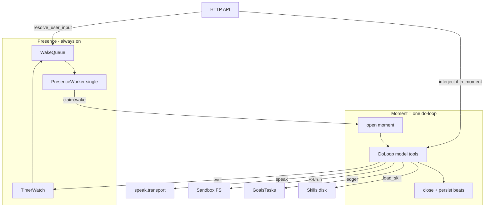
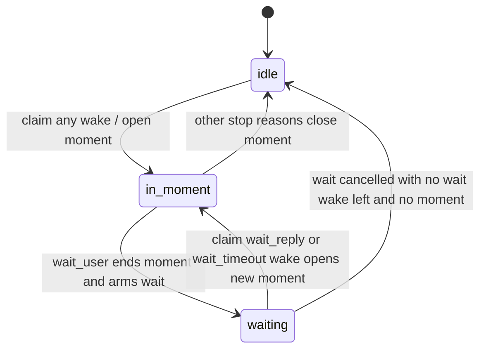
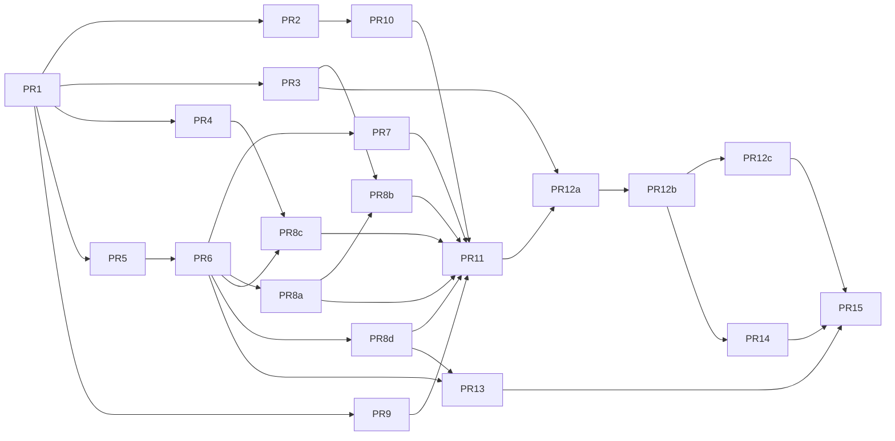

# Design: Implement Project Elyra Stretch 1 to Completion

| Field | Value |
|-------|--------|
| **Class** | DESIGN |
| **Document** | Stretch 1 runtime completion |
| **Author** | _(implementer)_ |
| **Date** | 2026-07-21 |
| **Status** | **Stretch 1 shipped** (rev 3 design + PR1–PR15); freeze still `docs/stretch-1.md` |
| **Product root** | `/home/jim/Workspace/project-elyra` |
| **Build freeze** | `docs/stretch-1.md` |
| **Supersedes** | Archive research notes under `docs/archive/` (not law) |

---

## Overview

Project Elyra is a greenfield rebuild of a communal digital teammate: always-on **presence**, a **wake queue**, and **moments** that are full multi-hop **do-loops** (model ↔ tools) rather than single-shot chat. The scaffold already runs `elyra start` (llama-server + HTTP API + glass UI + a minimal presence worker that does one completion per user message). Stretch 1 is **not** complete until that worker becomes a real harness with tools, skills, goals/tasks, sandbox, speak/wait, interjections, time-based continue, moment/beat persistence, and fail-closed create-tool/create-skill.

This design specifies the full path from the current **~1.1k LOC** scaffold under `elyra/` (~1123 Python lines) to Stretch 1 “done when” criteria in `docs/stretch-1.md` §11–Done. Stretch 2 (memory hypergraph, opaque sleep, Lance graph) is explicitly out of scope except as migration hooks (JSON-shaped stores, no graph schema). We deliberately **do not** port elyra2’s fat `mind_loop` (~12.6k-line `cycle.py` at `aurimago/project-elyra2/elyra/mind_loop/cycle.py`, organs, dual engines, monologue ceremony).

---

## Background & Motivation

### Current state (scaffold)

| Area | Exists today | Gap |
|------|--------------|-----|
| CLI / supervisor | `elyra/cli.py`, `elyra/runtime/supervisor.py` | No wake persistence, timers, goals |
| LLM | `elyra/llm/*` — server cmd, gate, HTTP/stub client | No OpenAI-style `tools` / `tool_calls` parsing |
| Worker | `elyra/loop/worker.py` — one-shot chat; embeds `SYSTEM_PROMPT` in Python (debt vs eng-principles §4) | No multi-hop, tools, skills, interjections |
| Messages | `elyra/messages.py` JSONL | Chat glass only; not moment tape; bare content written as assistant |
| Data dirs | `data/` is **gitignored**; `moments/`, `wakes/` empty shells | No stores/schemas; seeds must not live only under `data/` |
| Packages | — | Missing: `presence/`, `moment/`, `tools/`, `skills/`, `goals/`, `identity/`, `users/`, `speak/`, `sandbox/`, prompts loader, settings |
| Disk AI text | — | No `skills/`, `tools/`, `prompts/` packages |
| UI | Chat + status glass | No goals, moments, tools catalog, identity digests |
| Tests | `tests/test_config.py`, `tests/test_messages.py` | Need package-mirrored suite per engineering principles |
| API | Always `enqueue_user_message` | No interject path |

### Pain points the rebuild must avoid

1. **elyra2 god cycle** — mixed organs, rhythm, reflection, tool arcs. Stretch 1 keeps do-loop orchestration small (~200 lines); domains own logic.
2. **Fused wake/goals** — durable *what* ≠ *what starts the next loop*.
3. **Ceremony stages** — no monologue / attention / organ pre-stages; skills load mid-loop.
4. **Full KV packing** — `-c 86000` is ceiling only; sliding meals target ~24k (`DEFAULT_SLIDING_INPUT_TOKENS`).
5. **Draft tools as callable** — create-tool fail-closed at runtime, not only in skill prose.
6. **Free-text glass bypass** — scaffold writes bare `result.content` to messages; product path must use `speak` only.

### Why now

The start stack proves process shape (serialize llama, glass, presence thread). Completing Stretch 1 unlocks dogfoodable work without Stretch 2 memory product.

---

## Goals & Non-Goals

### Goals

1. Continuous **single-worker** presence: wake queue → open moment → do-loop → close moment → next wake.
2. Full **multi-hop tool loop** with base tools, skill load mid-loop, sliding context, reasoning store-not-refeed.
3. **Moments + beats** persisted (restart-safe); tags per freeze.
4. **Wake queue separate from goals/tasks**; band priority: user/interjection > wait timeout > timer > task ready > background.
5. **One persistent sandbox**; FS tools + `run` only inside it.
6. **Speak** with transport failure feedback; **wait** (~2 min) multi-choice + free text; timeout → independent decision.
7. **Interjections** mid-moment at next safe point; idle user messages → new wake.
8. **Time-based continue** inject after N minutes idle; absolute wall-clock backstop.
9. Base **skills** and **tools** on disk; `create-skill` / `create-tool` fail-closed dogfood path.
10. Lean glass extensions for goals, identity digests, moments, tools catalog.
11. Inference: reuse elyra2 model tree via `model/` symlink; document `-c` vs sliding fill; generous generation.
12. Implementable as **ordered, independently mergeable PRs** with tests per module.

### Non-Goals (Stretch 1)

| Non-goal | Note |
|----------|------|
| Hypergraph / opaque sleep / day strain product | Stretch 2 |
| LanceDB graph schema | Migratable JSON/JSONL hooks only |
| Subagents / multi-worker minds | Single worker |
| Organs, monologue ceremony, dual engines | elyra2 anti-patterns |
| Free-text assistant chat bypassing `speak` | Only `speak` transport writes user-visible assistant glass rows |
| Draft tools callable or auto-promote without verify | Fail-closed |
| Filling full KV every call | Sliding under ceiling |
| Host shell `run` outside sandbox | Policy |
| Port elyra2 `mind_loop` or step-profile zoo | Ideas only |
| Multi-sandbox | One sandbox |
| `patch_identity` / rich reflect product | Thin read-only digests in S1 |
| Cloud LLM default | Local llama.cpp Vulkan + Gemma |
| **Human ack UI on promote** | Freeze §9 item 5 optional; **out of scope for S1** (runtime gates only) |
| **Resume mid-moment after crash** | Always interrupt open moments; no resume machine |
| Container/network namespace isolation | Process-level cwd jail only |

---

## Proposed Design

### Architecture

```text
elyra start (supervisor)
  ├── llama-server (optional; stub path for tests)
  ├── HTTP API + static glass
  └── PresenceWorker (single thread)
        │
        ├── WakeQueue (event-sourced durable + in-memory index)
        ├── Timer service (wait timeouts, schedule_wake)
        │
        └── open Moment
              └── DoLoop
                    model (tools schema + sliding meal)
                      ↔ ToolRegistry.execute(ctx)
                      ↔ SkillLoader (mid-loop)
                    stop / wait / blocked / policy / time-continue / wall_clock
              close Moment → beat tape on disk
```



### Package layout and dependency rules

Align with `docs/dev/engineering-principles.md` §1.

```text
elyra/
  config.py              # ELYRA_HOME, ElyraPaths, ensure_data_dirs + seed copy
  settings.py            # load optional elyra.toml; defaults; CLI merge
  cli.py
  messages.py            # chat glass JSONL (speak transport writes here)

  presence/
    queue.py             # WakeItem, event-sourced persist, claim
    worker.py            # orchestration only: enqueue/interject/busy/status
    timers.py
    interject.py
    user_input.py        # resolve_user_input single state machine

  moment/                # open/close, tape/beats
  loop/                  # doloop, context, continue_policy, stop
  tools/                 # registry, runners, verify/promote, builtin wrappers
  skills/                # catalog + load
  goals/                 # goals + tasks ledger
  identity/              # self store (read + seed)
  users/                 # per-user stores (read + seed)
  speak/                 # transport + thin tool façade (owns delivery)
  sandbox/               # one persistent workspace
  llm/                   # keep; tools on client
  runtime/               # supervisor, api, web — wiring only
  prompts/loader.py

prompts/                 # versioned: system, orient, seeds/
skills/bundled/          # shipped with repo (code tree)
tools/bundled/           # shipped with repo (code tree)
# local/drafts under ELYRA_HOME (see Tools/skills root resolution)
data/                    # runtime-only (gitignored)
```

**One-way dependency rules (enforce in review):**

| Layer | May import | Must not import |
|-------|------------|-----------------|
| `sandbox`, `identity`, `users`, `goals`, `messages` | `config`, stdlib | `runtime`, `loop`, `presence`, `cli` |
| `speak` | `messages`, `config` | `presence`, `loop`, `runtime` |
| `skills`, `tools` | domains above, `sandbox`, `speak` (transport iface) | `runtime`, `cli`, `presence.worker` |
| `loop` | `tools`, `skills`, `moment`, `llm`, domains | `runtime`, `cli`, `presence` (ctx injected) |
| `presence` | `loop`, `moment`, `goals` (hooks), queue/timers | `runtime.web`, tool internals beyond registry iface |
| `runtime` / `cli` | everything as wiring | — (composition root) |

**Speak ownership:** `elyra/speak/transport.py` owns glass delivery; `elyra/tools/builtin/social.py` is a thin wrapper that calls transport. Do not duplicate write paths.

**Worker public API only:** `enqueue_wake`, `enqueue_user_message`, `interject`, `busy`, `active_moment_id`, `pending_wait`, `status_snapshot` fields. `presence/worker.py` must not import API/web. `loop/doloop.py` must not grow registry/sandbox/goal *logic* — only call injected ports.

**Deprecation:** move off `elyra/loop/worker.py` into `presence/worker.py` + `loop/doloop.py`; delete one-shot worker in final cutover PR.

### Tools/skills root resolution

`ElyraPaths` already defines `skills_dir = home/skills`, `tools_dir = home/tools`, `prompts_dir = home/prompts` (`elyra/config.py`).

| Kind | Location | Rule |
|------|----------|------|
| **Bundled tools** | Code/project tree: prefer `Path(__file__).parents[…]/tools/bundled` **or** `$ELYRA_HOME/tools/bundled` if present; ship defaults in **repo** `tools/bundled/` when `ELYRA_HOME` is project root | Read-only at runtime; never overwritten by promote |
| **Local tools** | `$ELYRA_HOME/tools/local/<name>/` | Promoted model/operator tools; callable |
| **Draft tools** | `$ELYRA_HOME/tools/drafts/<name>/` | Never callable |
| **Bundled skills** | Repo `skills/bundled/` (same resolution rule as tools) | Shipped playbooks |
| **Local skills** | `$ELYRA_HOME/skills/local/<name>/` | `install_skill` writes here only |
| **Prompts** | Repo `prompts/` when home is project root; else `$ELYRA_HOME/prompts` with fallback to package-shipped defaults | Loader tries home then package resources |

**Priority for callable tools:** local name wins over bundled same name (log once); never load drafts. **Tests:** `tmp_path` as `ELYRA_HOME` with fixtures under that home’s `tools/` + inject bundled path.

**S1 packaging decision (ship/layout):** Live `pyproject.toml` only package-data’s `elyra/runtime/web/**/*`. For Stretch 1 we **do not** require non-editable wheel installs of bundled tools/skills.

| Mode | Bundled resolution |
|------|-------------------|
| **Editable / repo-root** (`ELYRA_HOME` = project root, default dogfood) | `BUNDLED_TOOLS_ROOT = <project>/tools/bundled`, `BUNDLED_SKILLS_ROOT = <project>/skills/bundled` |
| **Non-default `ELYRA_HOME`** | Still resolve bundled from **code tree next to package** (walk up from `elyra/__file__` to project root when running editable) or from explicit settings override |
| **Non-editable install** | **Out of scope for S1** — startup asserts bundled roots exist; fail with message to use editable install or set `bundled_tools_root` in `elyra.toml` |

PR6: assert `BUNDLED_*` exists at registry init; optional later PR may move trees under `elyra/bundled_{tools,skills}/` + package-data (not required for S1 done-when).

### Presence and wake queue

#### WakeItem

```python
# elyra/presence/queue.py
@dataclass(frozen=True)
class WakeItem:
    id: str
    kind: str          # user_message | wait_reply | wait_timeout | timer | task_ready | background
    priority: int      # band ordinal; lower = sooner
    created_at: str    # UTC ISO
    payload: dict
    # user_message / wait_reply: {user_id, content, message_id, wait_id?}
    # wait_timeout: {wait_id, moment_id, choices_offered, prompt, wait_elapsed_s}
    # timer: {wake_at, reason, goal_id?, task_id?}
    # task_ready: {task_id, goal_id}
```

**Priority bands** (lower first; FIFO within band):

| Band | Kind | Priority |
|------|------|----------|
| 0 | user_message, wait_reply | 0 |
| 1 | wait_timeout | 1 |
| 2 | timer / schedule_wake due | 2 |
| 3 | task_ready | 3 |
| 4 | background | 4 |

Interjections are **not** wake-queue items; they go to `InterjectionBuffer` while `phase == in_moment`.

#### Wake persistence (event-sourced, not in-place JSONL mutate)

**Scheme A (chosen):** append-only **status-transition events** + fold on load.

File: `data/wakes/events.jsonl`

```json
{"ts":"…Z","wake_id":"W1","op":"enqueue","item":{…full WakeItem…}}
{"ts":"…Z","wake_id":"W1","op":"claimed","moment_id":"M1"}
{"ts":"…Z","wake_id":"W1","op":"done"}
{"ts":"…Z","wake_id":"W1","op":"cancelled","reason":"wait_superseded"}
{"ts":"…Z","wake_id":"W2","op":"enqueue","item":{…}}
```

**Fold rules on startup / after append:**

- Latest op per `wake_id` wins for lifecycle; full item body taken from last `enqueue` (or first enqueue if only status ops).
- Terminal states: `done`, `cancelled` — not claimable.
- **Claim protocol:** worker atomically appends `claimed` then opens moment. In-process index marks claimed so another poll does not double-claim (single worker makes this simple).
- **Crash while claimed:** on restart, any `claimed` without `done`/`cancelled` whose `moment_id` is still open → close moment `stop_reason=interrupted`; wake op → `cancelled` with `reason=interrupted_redelivery` **or** re-`enqueue` clone with new id only if kind is `timer`/`task_ready` (at-least-once for durable work). **User messages already in glass are not re-enqueued** (avoid double social bout); interrupted is enough. Prefer: **user_message/wait_*** → cancel wake + interrupt moment; **timer/task_ready** → re-enqueue if still relevant.
- **Delivery:** at-least-once for timers/task_ready; at-most-once social content after glass append.

In-process: priority heap of pending ids rebuilt from fold. Lance later can ingest the same event stream.

**Idle presence:** timer watch runs without opening a moment. Worker only opens a moment when a wake is claimed.

#### `task_ready` emission

On `update_task` transition **to** `status=ready`:

1. **Always** durable-enqueue `task_ready` (append `enqueue` event), even if worker is busy.
2. **Dedupe:** if a pending (not done/cancelled) `task_ready` for the same `task_id` exists, append `cancelled` on the old id with `reason=replaced`, then enqueue the new one (or no-op if payload identical — prefer replace to refresh `created_at`).
3. Worker claims when idle per band priority; busy moments finish first; task is not stranded.

### Moments and beats

#### Moment metadata (`data/moments/index.jsonl`)

```json
{
  "schema_version": 1,
  "id": "uuid",
  "started_at": "…Z",
  "ended_at": "…Z|null",
  "why_now": "user_message:…",
  "user_id": "operator|null",
  "goal_ids": [],
  "task_ids": [],
  "skills_used": ["talk"],
  "stop_reason": "no_tools|wait|blocked|policy|time_continue_declined|wall_clock|interrupted|error|max_hops",
  "wake_id": "…",
  "hop_count": 0
}
```

#### Beats (`data/moments/<id>.jsonl`)

| `type` | Fields |
|--------|--------|
| `model` | `content`, `reasoning`, `tool_calls[]`, `ts` |
| `tool` | `name`, `args`, `result`, `ok`, `ts` |
| `speak` | `user_id`, `text`, `transport_ok`, `reason?` |
| `obs` | host inject text, `kind` (continue\|interjection\|no_speak_nudge\|…) |
| `ledger` | patch summary |
| `skill_load` | `name` |
| `stop` | `reason` |

**Restart:** open moments → `interrupted`; no mid-moment resume (see Alternatives).

### Presence phase machine

**Definition:** `phase` is a single enum on the worker. A moment is open **iff** `phase == in_moment`. `waiting` means: no open moment, but a durable pending wait exists for some user. Queue may be non-empty in `idle` or `waiting` without changing phase until claim.



| Phase | Meaning | User input behavior |
|-------|---------|---------------------|
| `idle` | No open moment; no pending wait (or wait already resolved) | `resolve_user_input` → enqueue `user_message`; worker claims when ready → `in_moment` |
| `in_moment` | Moment open (do-loop running) | Interject buffer only |
| `waiting` | No open moment; durable `pending_wait` set | User reply (chat or `/api/wait/reply`) → cancel timer, enqueue `wait_reply`, phase stays **waiting** until claim → `in_moment`. Timeout → enqueue `wait_timeout`, still `waiting` until claim → `in_moment`. Host cancel of wait with no wake → `waiting → idle` |

**Claim is the only path into `in_moment`.** Successful wait resolution is always `waiting → in_moment` via claiming `wait_reply` or `wait_timeout` (never `waiting → idle` then separate open). `waiting → idle` only if the wait is **cancelled** without enqueueing a wait-* wake (rare host/admin path).

`/api/status` reports `phase` plus `pending_wait` independently so glass can show wait UI while phase is `waiting`.

### Do-loop contracts

#### Types

```python
@dataclass(frozen=True)
class ToolCall:
    id: str
    name: str
    arguments: dict[str, Any]  # parsed JSON object; {} if parse failed flagged below

@dataclass(frozen=True)
class ToolResult:
    ok: bool
    payload: dict[str, Any]    # model-visible JSON-serializable body
    error_reason: str | None = None
    # Loop control (set only by host builtins that end the moment):
    ends_moment: bool = False
    stop_reason: str | None = None   # wait | blocked | policy
    arm_wait: WaitArm | None = None  # if stop_reason == wait
    # Social tracking — set only by speak builtin (not by name hardcode in loop):
    counts_as_speak: bool = False

@dataclass(frozen=True)
class WaitArm:
    wait_id: str
    timeout_seconds: int
    prompt: str
    choices: list[str]
    user_id: str

@dataclass
class ToolContext:
    paths: ElyraPaths
    settings: Settings
    moment_id: str
    wake: WakeItem
    user_id: str | None
    goals: GoalsStore
    skills: SkillLoader
    speak: SpeakTransport
    sandbox: Sandbox
    registry: ToolRegistry          # for promote reload
    enqueue_wake: Callable[..., str]
    cancel_wait: Callable[[str], None]
    mark_spoke: Callable[[], None]
    mark_task_changed: Callable[[], None]
    skills_used: list[str]          # mutable bag for moment meta
```

Detection of wait/stop is **not** by hardcoding tool name alone in the loop: builtins set `ToolResult.ends_moment` + `stop_reason`. Loop trusts only those flags from execute() (registry forces `ends_moment=False` for unknown/sandbox_python tools unless allowlisted control tools).

#### Multi-hop algorithm

```text
# Outer prefix = system + sliding glass history + orient (rebuilt only on re-outer)
outer_prefix = assemble_outer_meal(...)   # once at moment start; refreshed on re-outer
chain_messages = []  # assistant+tool (+ inject) rows for this moment's chain
hop = 0
spoke_this_moment = False   # set only via ToolResult.counts_as_speak / mark_spoke()
last_speak_or_task_change = now()
continue_injects = 0
no_speak_nudge_sent = False

loop:
  # Host pre-checks (before model)
  if wall_clock exceeded: stop wall_clock
  if hop >= max_tool_hops: stop max_hops
  if idle_since(last_speak_or_task_change) >= continue_idle
     and continue_injects < continue_max:
       inject obs HOST continue into chain; continue_injects += 1; last_* = now()
  elif continue_injects >= continue_max and still idle: stop time_continue_declined

  enforce_in_turn_budget(outer_prefix, chain_messages)  # see In-turn token budget
  messages = outer_prefix + chain_messages

  result = llm.chat_completion(messages, tools=registry.openai_tools())
  append model beat (content, reasoning, tool_calls)
  hop += 1

  if result.tool_calls:
     chain_messages.append(assistant_with_tool_calls(result))
     for tc in result.tool_calls:          # serial
        args, parse_ok = parse_args(tc)
        if not parse_ok:
           tr = ToolResult(ok=False, payload={}, error_reason="invalid_json_arguments")
        else:
           tr = registry.execute(tc.name, args, ctx)
        # Truncate tool payload before append (see budget policy)
        content = truncate_tool_payload(tr)
        append tool beat
        chain_messages.append({
          "role": "tool",
          "tool_call_id": tc.id,
          "content": content,
        })
        if tr.counts_as_speak and tr.ok:
           spoke_this_moment = True
           mark_spoke()   # also updates last_speak_or_task_change
        if tr.ends_moment:
           # Remaining tool_calls in this batch are NOT executed.
           # Skills (talk/wait): prefer speak-then-wait ordering.
           if tr.arm_wait: arm timer
           stop tr.stop_reason
     # Tool errors (ok=False): continue — model sees error
     drain_interjections_at_safe_point(chain_messages)
     continue

  else:
     orphan content → model beat only, never glass
     if social_wake and not spoke_this_moment and not no_speak_nudge_sent:
        inject obs HOST no-speak nudge once; no_speak_nudge_sent=True
        chain_messages.append(user_obs); continue
     stop no_tools

  # on exit: overflow interject buffer → enqueue wakes (see Interjections)
```

#### In-turn token budget (required — hop backstop is not enough)

**Problem:** Outer meals use `sliding_input_tokens` (~24k), but an untrimmed `chain_messages` across many hops (with tool payloads up to FS/run caps) can blow prefill/VRAM the same way elyra2 large linear bands did.

**Policy (settings-driven):**

| Knob | Default | Role |
|------|---------|------|
| `sliding_input_tokens` | 24000 | Cap for **full** request: `estimate(outer_prefix + chain_messages)` |
| `in_turn_max_tokens` | same as sliding (or equal by default) | Alias; may lower independently later |
| Tool payload truncate | 8k chars / ~2k tokens per tool message | Applied at append time (stricter than raw 256 KiB disk read) |
| Re-outer threshold | when chain alone > 60% of budget after trim attempt | Rebuild outer |

**`enforce_in_turn_budget(outer_prefix, chain_messages)` before each model call:**

1. Truncate any oversized **tool** `content` strings in the chain to the per-message cap (keep a short suffix marker `"…[truncated]"`).
2. While `estimate(outer_prefix + chain) > sliding_input_tokens`:
   - Drop **oldest complete assistant+tool_calls batch pairs** from the front of `chain_messages` (one assistant message with its following `role=tool` rows).
   - **Never drop:** the latest incomplete/current batch (assistant + tools just produced this hop if any), the most recent HOST continue / no-speak / interjection user inject, or `outer_prefix` itself.
3. If still over budget after dropping all droppable chain history: **re-outer**
   - Clear `chain_messages` to only: last tool batch tails (up to last 2 assistant+tool groups) + any pending inject not yet answered.
   - Rebuild `outer_prefix = assemble_outer_meal(...)` from glass history + **beat tape summary** (recent tool names/results truncated) + fresh orient.
4. `max_tool_hops` remains a thrash backstop only; it does **not** replace this budget.

**Terminology:**

| Term | Meaning |
|------|---------|
| **In-turn hop** | Model call while continuing the same chain (after tools); budget enforced every hop |
| **Re-outer** | Clear/rebuild `outer_prefix` + compress chain mid-moment when trim is insufficient |
| **Next moment** | Chain discarded entirely; new outer meal |

#### In-turn vs outer reassembly

| Event | Behavior |
|-------|----------|
| Tool batch then next model call | Keep chain; run `enforce_in_turn_budget`; may keep provider reasoning on chain assistant rows |
| Budget pressure | Drop oldest assistant+tool pairs; else re-outer |
| After stop, next moment | Full new outer meal; empty chain |
| Time-continue inject | At safe points (before model after tool batch or when chain empty); appended into chain as user/obs; not mid-HTTP |
| Interjection drain | Safe points only: after full tool batch (if no `ends_moment`), or before exit on no-tools |
| Reasoning strip | Outer meal build never puts reasoning into history; chain may retain provider-required fields on assistant rows |

#### Stop reason decision table

| Condition | `stop_reason` |
|-----------|---------------|
| Model returns no `tool_calls` (after optional no-speak nudge) | `no_tools` |
| `wait_user` returns `ends_moment` + `arm_wait` | `wait` |
| Builtin sets `ends_moment` + `blocked` (e.g. explicit blocked tool path if added; ledger may set task blocked without ending moment — **blocked stop only if a control tool requests it**) | `blocked` |
| Host policy abort (disallowed tool name, draft call attempt, sandbox escape caught at policy layer with fatal flag) | `policy` |
| Wall-clock exceeded | `wall_clock` |
| Continue max injects exhausted while still idle | `time_continue_declined` |
| `hop >= max_tool_hops` | `max_hops` |
| Process restart / open moment cleanup | `interrupted` |
| Uncaught exception in loop | `error` |

**Tool failure default:** `ok=false` → model-visible tool message; **continue** loop. Host sets `ends_moment` only for control outcomes (wait) or fatal policy.

**`blocked` production:** `update_task(status=blocked)` does **not** end the moment by itself. Stop `blocked` is reserved if we add a control result or if do-loop observes repeated identical tool failures (optional later). For S1 minimal: document `blocked` as **available** on `ToolResult` for future/host; primary producers are explicit control tools if any; otherwise moments use `no_tools` / `wait`. Ledger “blocked” is task state, not moment stop — avoid conflating names in UI (task status vs moment stop_reason).

#### Wire format example (2–3 hops)

```json
[
  {"role": "system", "content": "…laws…"},
  {"role": "user", "content": "Please list sandbox files and say hi"},
  {"role": "user", "content": "ORIENT:\nNOW: …\nSELF: …\n…"},
  {
    "role": "assistant",
    "content": null,
    "tool_calls": [
      {
        "id": "call_1",
        "type": "function",
        "function": {"name": "list_dir", "arguments": "{\"path\": \".\"}"}
      }
    ]
  },
  {
    "role": "tool",
    "tool_call_id": "call_1",
    "content": "{\"ok\": true, \"entries\": [\"notes.txt\"]}"
  },
  {
    "role": "assistant",
    "content": null,
    "tool_calls": [
      {
        "id": "call_2",
        "type": "function",
        "function": {"name": "speak", "arguments": "{\"text\": \"Hi — I see notes.txt.\"}"}
      }
    ]
  },
  {
    "role": "tool",
    "tool_call_id": "call_2",
    "content": "{\"ok\": true}"
  },
  {"role": "assistant", "content": null, "tool_calls": []}
]
```

Notes:

- `arguments` on the wire are a **string**; client parses to dict for `ToolCall.arguments`.
- Content + tool_calls together: store both on beat; pass both through on assistant message if provider returns both.
- Empty tool_calls + non-empty content: treat as **no tools** path (orphan content → beat only).
- Invalid arguments JSON: tool result error, continue.

#### Content without `speak` (host policy)

1. **Only** `speak` transport writes user-visible assistant rows to `messages.jsonl` / glass chat.
2. Model `content` is always stored on the **model beat** (and optional debug in moments panel), never auto-promoted to glass.
3. **Social wakes** (`user_message`, `wait_reply`, interjection-driven continuation): if moment would stop with `no_tools` and `speak` was never successfully used this moment, host injects **once**:

   ```text
   HOST: no speak tool used — if the user needs a reply, call speak; otherwise stop.
   ```

   Then allow one more model turn. If still no speak → exit `no_tools` (silent glass is allowed after nudge; model chose not to speak).
4. **Pure work wakes** (`task_ready`, `timer` without user): no nudge; silent exit is fine (skill `do-work` / `rest`).

This replaces scaffold behavior in `elyra/loop/worker.py` that appends bare `result.content` as assistant.

### Context assembly

**Files:** `elyra/loop/context.py` + `prompts/system.md`, `prompts/orient.md`.

**Meal order (matches freeze intent: orient near decision):**

1. Thin system (`prompts/system.md`)
2. Sliding recent history (glass user/assistant via speak + user only; **no reasoning**; current-moment chain if outer build includes summarized prior beats as needed)
3. Orient near the end (`prompts/orient.md`): NOW, SELF, optional one USER, why-now, goals/tasks, skill catalog, soft skill bias

Freeze lists orient as “near the end”; putting sliding history before orient is intentional and consistent with `time-and-identity.md`.

**Dedupe triggering user message:** if the wake’s content is already the last `user` row in glass history (API appended before enqueue — current scaffold pattern), do **not** inject a second copy in the sliding window. Orient still carries why-now. Same check as today’s worker (`messages[-1].content != item.content` guard), extended to wake payload `message_id` when present.

**Token accounting:** `len(text)//4`; drop oldest history first; never drop orient or the single triggering user text if it is the only copy.

### Time-based continue, wait, interjections (closed edges)

| Knob | Default | Config |
|------|---------|--------|
| Idle since last **speak** or **task change** | 8 min | `continue_idle_minutes` |
| Moment wall-clock | 45 min | `moment_wall_clock_minutes` |
| Max continue injects | 3 | `continue_max_injects` |
| Thrash backstop | 200 hops | `max_tool_hops` |
| Interjection buffer | 8 messages or 16k chars | first limit hit wins |

**Continue vs thrash:** tool spam without speak/task change **does** fire continue on idle timer (wall clock of last speak/task change). Independently, `max_tool_hops` can stop earlier. Continue inject resets idle timer so the model gets room to answer the HOST line.

**Wait arm (durable):**

```json
// data/wakes/waits.json (snapshot) or events in timers store
{
  "wait_id": "…",
  "moment_id": "…",
  "user_id": "operator",
  "prompt": "…",
  "choices": ["A", "B"],
  "deadline_utc": "…",
  "status": "pending|answered|timed_out|cancelled"
}
```

On startup: rehydrate pending waits; if `deadline` past → enqueue `wait_timeout`; else arm in-process timer. `pending_wait` on worker/status comes from this store, not only RAM.

**`resolve_user_input(content, user_id, choice=None, *, from_wait_api=False)`** — single function used by `POST /api/messages` and `POST /api/wait/reply` (under PresenceState.lock):

```text
if phase == in_moment:
  buffer interjection (cap); return {routed: interject}

if pending_wait for user_id and (from_wait_api or phase == waiting):
  # Explicit wait answer (wait API or free text while phase==waiting)
  cancel timer; mark wait answered; enqueue wait_reply (priority 0)
  # phase stays waiting until worker claims → in_moment
  return {routed: wait_reply}

if phase == waiting and not from_wait_api:
  # Should not happen if above matched; defensive
  ...

if phase == idle:
  # Supersede any stale pending wait for that user (race / cancel path)
  if pending_wait for user_id:
    cancel wait; no wait_timeout wake; phase already idle or set idle
  enqueue user_message
  return {routed: user_message}
```

**Wait cancel / supersede:** `POST /api/messages` while `phase==waiting` is treated as **wait_reply** (free-text answer). To cancel without answering, operator would need empty/cancel UX later; for S1, free-text during wait **is** the answer. If a wait is cancelled by host/admin path, phase → `idle` with no wait-* wake. Explicit `/api/wait/reply` always sets `from_wait_api=True` → `wait_reply`.

**Interjection overflow:** when buffer hits cap, further messages get `{ok: false, reason: "interjection_buffer_full"}` and are **enqueued as wakes** for after the moment closes (glass notice). Do not drop silently.

### Sandbox (security detail)

**Root:** `$ELYRA_HOME/data/sandbox/` (persistent; never auto-cleared in S1).

**Path resolve algorithm:**

```python
def resolve(root: Path, user_path: str) -> Path:
    # reject absolute paths that are not under root
    candidate = (root / user_path).resolve()
    root_r = root.resolve()
    candidate.relative_to(root_r)  # raises ValueError → tool error
    # if candidate is symlink, resolve target and relative_to again
    if candidate.is_symlink():
        target = candidate.resolve()
        target.relative_to(root_r)
    return candidate
```

**`run` tool:**

- Prefer `command` as **argv array**.
- If string: `argv = shlex.split(command)` and `subprocess.run(argv, shell=False, cwd=sandbox_root, …)`.
- Never `shell=True` with model string on host shell.
- Env: minimal `PATH`, `HOME` pointing at sandbox optional, drop secrets.
- Timeout default 60s; kill process group on timeout.
- **Network:** no container isolation in S1 — document trust boundary (local operator). Optional future: block via policy; do not claim namespace isolation we do not have.
- Resource limits: timeout + stdout/stderr cap (e.g. 256 KiB each); no cgroups in S1.

### create-tool fail-closed (airtight)

Companion tools (not in freeze name list §10; **documented extensions** for dogfood):

| Tool | Role |
|------|------|
| `install_tool_draft` | Write/update files only under `tools/drafts/<name>/` |
| `install_skill` | Write only `skills/local/<name>/SKILL.md` (no draft/verify gate for skills) |
| `verify_tool` | Run package tests in sandbox; write `.verify.json` |
| `promote_tool` | drafts → local only if verify hash matches |

**Standardize naming:** always `install_skill` (not `install_skill_draft`).

#### `install_tool_draft` path jail

- Args: `name` (normalized `[a-z0-9_][a-z0-9_-]*`), `files`: map of **relative** paths → content.
- Each key: reject if absolute, if any `..` segment, if normpath escapes `tools/drafts/<name>/`.
- **Reserved paths (always reject):** `.verify.json`, any key whose final component starts with `.` and is a control sidecar (`.verify.*`, `.promote.*`). Clients must not plant verify records.
- Write only under `paths.tools_dir / "drafts" / name`.
- Apply files map first; **then always delete** `.verify.json` if present (invalidate after writes, even if a bug skipped reserved check).

#### `verify_tool` execution algorithm

```text
1. Resolve draft dir = tools/drafts/<name>/; fail if missing or incomplete package.
2. Validate runner.kind ∈ {sandbox_shell, sandbox_python}; schema.json parses; tests/ exists.
3. Stage: copy draft tree (excluding .verify.json) into
     data/sandbox/.verify/<name>/   # wipe/recreate staging dir first
4. Run allowlisted command only:
     argv = [sys.executable, "-m", "pytest", "tests/", "-q", "--tb=short"]
     cwd  = staged root
     env  = scrubbed (same as sandbox run)
     timeout = 120s (settings.verify_timeout_seconds)
   Host-installed project pytest is OK as the *binary*, but tests run with cwd=sandbox
   stage — **not** against repo tests/. No network. No `shell=True`.
5. Pass ⇔ exit code 0.
6. On pass: content_hash = sha256 over **drafts tree** files (not stage copy),
   excluding .verify.json; write tools/drafts/<name>/.verify.json
   {tool_name, verified_at, content_hash, passed:true, log: tail of output}.
7. On fail: do not write passed verify (optional .verify.json with passed:false for glass);
   return log to model. Promote still requires passed:true + hash match.
```

Model-promoted packages **must** pass this sandbox-staged path. Bundled builtins may use host `tests/` in CI separately; that is not the promote gate.

#### Verify record

```json
{
  "tool_name": "my_tool",
  "verified_at": "…Z",
  "content_hash": "sha256 of sorted (relpath, bytes) over package files excluding .verify.json",
  "passed": true,
  "log": "…"
}
```

`promote_tool`:

1. Load draft tree; compute hash; require `.verify.json` with `passed=true` and **hash equality**.
2. Refuse if name exists in bundled or local (case-normalized).
3. **No `force` flag** — removed. To re-promote after change: edit draft → verify again → promote.
4. Move/copy draft → `tools/local/<name>/`; remove draft; **registry.reload()** so tool is callable mid-process (same moment may use it on next hop).
5. Human ack: **S1 non-goal** (Key Decision).

#### Runner validation

At verify and promote:

- `runner.json` `kind` ∈ {`sandbox_shell`, `sandbox_python`} for **model-created** drafts.
- **`kind: builtin` forbidden for drafts/local promote** — only shipped bundled packages may use builtin handlers. Prevents inventing host handler names.
- `schema.json` must parse as JSON object with JSON-Schema shape (`type: object` parameters).
- Package must include `TOOL.md`, `schema.json`, `runner.json`, `tests/`.

#### Registry refresh

`ToolRegistry.reload()` rescans bundled + local after successful promote (and on worker start). Drafts never scanned into callable set.

---

## API / Interface Changes

### LLM client

```python
def chat_completion(
    self,
    messages: list[dict[str, Any]],
    *,
    max_tokens: int = 4096,
    reasoning: bool = True,
    temperature: float | None = None,
    tools: list[dict[str, Any]] | None = None,
    tool_choice: str | dict[str, Any] | None = None,
) -> ChatCompletionResult: ...

@dataclass(frozen=True)
class ChatCompletionResult:
    content: str
    reasoning_content: str
    raw_json: str
    tool_calls: list[ToolCall]
    finish_reason: str | None = None
```

### Presence worker public API

```python
class PresenceWorker:
    def enqueue_wake(self, item: WakeItem) -> str: ...
    def enqueue_user_message(...) -> str: ...
    def interject(...) -> None: ...
    def resolve_user_input(...) -> dict: ...
    def status_snapshot(self) -> dict: ...  # for /api/status
    @property
    def busy(self) -> bool: ...
    @property
    def active_moment_id(self) -> str | None: ...
    @property
    def pending_wait(self) -> dict | None: ...
```

`status_snapshot` includes: `phase`, `active_moment_id`, `hop_count`, `last_tool`, `continue_injects`, `queue_depth_by_band`, `pending_wait`, `worker_error`.

### Cross-thread safety (API vs worker)

Scaffold: `ThreadingHTTPServer` (many API threads) + **one** presence worker thread (`elyra/runtime/supervisor.py`). Shared mutable state: phase, interjection buffer, wake fold index, wait snapshot, event JSONL.

**Rule:** one `threading.RLock` (`PresenceState.lock`) guards all mutations of phase, interject buffer, in-process wake index, wait snapshot, and wake/wait durable appends.

| Actor | May do |
|-------|--------|
| API threads | Call only public worker methods (`resolve_user_input`, `enqueue_*`, `interject`, `status_snapshot`) which take the lock for the critical section |
| Worker thread | Claim wakes, run do-loop, phase transitions, drain interjects — under same lock for state edges; may release lock during long LLM HTTP (hold a “busy/moment” flag already set) so API can still interject into the buffer |
| JSONL / waits.json | **Single-writer under lock** for append/replace; no lock-free multi-append |

**Optional stricter variant (also acceptable):** API only enqueues thread-safe commands on a `queue.Queue` to the worker; worker is sole mutator of phase/fold/waits. Slightly higher latency; best if lock contention appears. S1 default: **RLock on public methods** + release during LLM call with buffer still lock-protected on interject.

Double-claim prevention: claim under lock (append `claimed` + remove from pending index atomically).

### HTTP API

| Method | Path | Purpose |
|--------|------|---------|
| GET | `/api/status` | Extended snapshot above |
| GET/POST | `/api/messages` | POST → `resolve_user_input` |
| GET | `/api/moments`, `/api/moments/{id}` | Meta + beats |
| GET/POST | `/api/goals` | Ledger |
| GET | `/api/identity`, `/api/users/{id}` | Digests |
| GET | `/api/tools`, `/api/skills` | Catalogs |
| POST | `/api/wait/reply` | `{content?, choice?, user_id}` → same `resolve_user_input` |

### Config / settings loader

**Module:** `elyra/settings.py` (or extend `elyra/config.py` carefully — prefer separate to keep paths pure).

- Defaults in code matching freeze-friendly table.
- Optional `$ELYRA_HOME/elyra.toml` via stdlib `tomllib`.
- CLI flags override toml (existing: `--context-tokens`, `--api-host`, …).
- Env: only `ELYRA_HOME` required.

```toml
[loop]
continue_idle_minutes = 8
moment_wall_clock_minutes = 45
continue_max_injects = 3
max_tool_hops = 200
sliding_input_tokens = 24000
in_turn_max_tokens = 24000
tool_result_max_chars = 8000
generation_max_tokens = 8192

[wait]
default_timeout_seconds = 120

[tools]
verify_timeout_seconds = 120

[goals]
# soft | hard — S1 ships soft
close_gate = "soft"
```

Wire `sliding_input_tokens` / `in_turn_max_tokens` / `generation_max_tokens` into context assembly, do-loop budget enforcement, and client calls (not only constants module).

---

## Data Model Changes

| Store | Path | Format |
|-------|------|--------|
| Chat glass | `data/messages.jsonl` | existing |
| Moments index | `data/moments/index.jsonl` | + `schema_version` |
| Moment tapes | `data/moments/<id>.jsonl` | beats |
| Wake events | `data/wakes/events.jsonl` | event-sourced |
| Waits snapshot | `data/wakes/waits.json` | pending waits rehydrate |
| Goals | `data/goals/goals.json` | goals + tasks |
| Self / users | `data/identity/self.md`, `data/users/<id>/profile.md` | seeded from templates |
| Sandbox | `data/sandbox/**` | persistent FS |
| Tools/skills | bundled in repo; local/drafts under ELYRA_HOME | packages |

### Seed templates (gitignored `data/` fix)

Versioned templates (committed):

```text
prompts/seeds/identity/self.md
prompts/seeds/users/operator/profile.md
```

`ElyraPaths.ensure_data_dirs()`:

1. Create runtime dirs.
2. If `data/identity/self.md` missing → copy from seed template.
3. If `data/users/operator/profile.md` missing → copy seed.
4. Never overwrite existing runtime digests.

`data/` remains runtime-only per `.gitignore`.

### Goals / tasks + review-before-close

Soft gate (Decision): `update_goal` to `closed` from `open` without having been in `review` returns warning in tool result:

```json
{"ok": true, "warning": "prefer review-work before close; set status=review first or pass force=true", "goal": {…}}
```

- Skill `review-work` body: **must** say do not close without review.
- Integration test: assert warning text present.
- Metric/counter: `goal_close_without_review` in status snapshot.
- `force: true` still allowed under soft gate; hard gate is open for post-dogfood only (`close_gate` config reserved).

Default `user_id` for glass/API: **`operator`** only in S1 UI; API accepts other ids for multi-user fields readiness.

### Identity walls

Self ≠ user stores; orient at most one USER digest; no fused patch tools in S1.

---

## Full Tool Inventory and Contracts

_(Base tools unchanged in spirit; growth tightened above.)_

#### Sandbox: `read_file`, `list_dir`, `grep`, `search_replace`, `run`

As prior design; path jail + run argv policy as Sandbox section.

#### Ledger: `update_task`, `update_goal`

- `update_task` → `ready` always durable-enqueues `task_ready` (deduped).
- `update_goal` soft review warning; `force` only on goal close soft-bypass, **not** on promote.

#### Social: `speak`, `schedule_wake`, `wait_user`

- `speak` → transport; `ToolResult(ok=…, counts_as_speak=True on success)`; loop never checks tool name.
- `wait_user` → `ToolResult(ends_moment=True, stop_reason="wait", arm_wait=…)`. If batched with other calls, **later calls in that assistant message are not run** — skill `talk` must order **speak then wait_user**.
- `schedule_wake` → durable timer event.

#### Skills: `load_skill`

Full body as tool result; append `skills_used`.

#### Growth: `install_tool_draft`, `verify_tool`, `promote_tool`, `install_skill`

See create-tool section. **No promote `force`.**

#### Optional late: `search_tools`, `use_tool` — deferred until catalog bloats.

---

## Full Skill Inventory

| Skill | Job |
|-------|-----|
| `talk` | Social; **speak before wait_user** if both needed; may open goals; never silent on social wakes (host nudge backs this) |
| `plan-work` | Goal → tasks + acceptance |
| `do-work` | Act on task |
| `review-work` | Check claims; set review then closed; **do not close without review** |
| `rest` | Idle honestly |
| `create-skill` | Via `install_skill` → `skills/local/` |
| `create-tool` | Checklist: name → `install_tool_draft` → verify → promote; never skip verify |

---

## Inference

Unchanged defaults: `-c` 86000 ceiling, sliding 24k, generation generous (settings-driven max_tokens), gate serializes, model via symlink. Document chosen `-c` if lowered.

---

## UI (glass)

Chat, Status (richer), Goals, Moments (beats; collapse reasoning), Tools, Identity. Wait choice buttons → `/api/wait/reply`. Show interjection buffer full notice if API returns it.

---

## Alternatives Considered

### 1. Port elyra2 mind_loop + trim — **Reject**

God cycle / language debt / dual engines.

### 2. In-process tools only (no disk packages) — **Reject**

Breaks dogfood; contradicts tools-and-skills.md.

### 3. SQLite for all stores day one — **Reject for S1 default**

JSONL events + small JSON snapshots simpler; SQLite optional later if contention hurts.

### 4. Hard hop-max as primary stop — **Reject**

Freeze §4; thrash backstop only.

### 5. Multi-worker — **Reject**

Freeze single worker.

### 6. Resume mid-moment after crash — **Reject**

| Pros | Cons |
|------|------|
| Less lost work | Half-applied tool state, complex idempotency |
| | Stretch 1 simplicity |

**Accept:** interrupt + durable sandbox/ledger as-is; re-wake for timers/task_ready.

### 7. Auto-speak from assistant content — **Reject**

| Pros | Cons |
|------|------|
| Feels chatty with Gemma | Violates speak-as-product-act; free-text bypass |

**Accept:** strict speak tool + social no-speak nudge once.

### 8. Single unified JSONL for beats + wakes + messages — **Reject**

| Pros | Cons |
|------|------|
| One stream | Mixed retention/query; harder glass vs tape |

**Accept:** separate stores; event-sourced wakes; messages glass; moment tapes.

### 9. Hard goal-close gate — **Defer (soft default)**

| Soft (S1) | Hard |
|-----------|------|
| Prefer review; force escape | Runtime refuses close without review status |
| Matches freeze “prefer” | May block legitimate cancel paths |

Ship soft + warning test + metric; config hook for hard later.

### 10. In-place JSONL status field for wakes — **Reject**

Self-contradictory with append-only. **Accept event-sourced ops** (Scheme A).

---

## Security & Privacy Considerations

| Threat | Severity | Mitigation |
|--------|----------|------------|
| Path escape FS tools | High | resolve + relative_to + symlink re-check |
| Host shell | High | sandbox cwd; shell=False; shlex argv |
| Draft execution | High | registry excludes drafts |
| Stale verify promote | High | content hash must match |
| Draft builtin runners | High | forbid kind=builtin for promote |
| Draft path traversal | High | jail file map keys |
| Overwrite bundled | High | promote refuse |
| Cross-user leak | Medium | one USER digest |
| Local API no auth | Medium | 127.0.0.1 default |
| No container network isolation | Medium | documented trust model |

---

## Observability

- Logging: moment open/close, stop_reason, hop_count, tool name on error.
- `/api/status`: `phase`, `active_moment_id`, `hop_count`, `last_tool`, `continue_injects`, `goal_close_without_review`, queue depths.
- Correlation: `wake_id` on moment meta; `moment_id` on messages when speak; beats carry moment file id.
- `schema_version` on moment index lines.
- No external APM in S1.

---

## Rollout Plan

Greenfield always-on features; `--stub-llm` for CI; lower `--context-tokens` if VRAM fails; git revert for code; forward-compatible fields with `schema_version`; no flag forest.

---

## Test Strategy

| Area | Tests |
|------|-------|
| Do-loop | Scripted stub: 2-hop list_dir+speak; invalid JSON args continue; tool ok=false continue; wait ends; remaining batch tools skipped after ends_moment; no-speak via counts_as_speak; max_hops; **chain over budget drops oldest pairs**; re-outer when still over |
| Wake queue | Event fold; claim under lock; crash claimed → interrupt; task_ready dedupe |
| create-tool | path jail `..`; reject `.verify.json` key; hash invalidate on rewrite; promote without verify fail; builtin kind reject; reload callable; verify stages under sandbox/.verify |
| Sandbox | symlink escape; shell=False |
| resolve_user_input | idle/waiting/in_moment matrix |
| Goals | warning on close without review |
| Settings | toml + CLI override |
| Seeds | ensure_data_dirs copies templates once |

Mark `@pytest.mark.llm` for real GPU optional.

---

## Risks

| Risk | Severity | Mitigation |
|------|----------|------------|
| Gemma tool_calls format | High | Fixtures; client adapter |
| VRAM prefill | High | Sliding 24k |
| Thrash loops | Med | max_hops + continue |
| Soft review ignored | Med | warning test + metric + skill text |
| God-module growth | Med | import rules + PR splits + size review |
| Wait races | Med | resolve_user_input + durable waits |
| PR13 slips past “done” | Med | PR15 cannot close create-tool checkbox without PR13 |

---

## Open Questions

1. **Hard goal-close gate after dogfood?** — Soft is decided for S1; revisit if metric `goal_close_without_review` is high.
2. **Tokenizer vs char//4** — stay heuristic until mis-trim hurts.
3. **Whether `search_tools` / `use_tool` ever needed in S1** — defer trigger: catalog > ~20 tools.
4. **Multi-user glass** — fields ready; UI stays operator-only until needed.

_(Resolved into Key Decisions: bare content policy, verify hash, no promote force, human ack OOS, install_* companions, event-sourced wakes, soft review, default user operator, no mid-moment resume.)_

---

## Key Decisions

| # | Decision | Rationale |
|---|----------|-----------|
| 1 | Greenfield modular packages; no mind_loop port | Avoid god cycle; match freeze language |
| 2 | Moment = full do-loop | Freeze §1–2 |
| 3 | Wake queue ⟂ goals/tasks | Separate stores; pointer links |
| 4 | Skills mid-loop via `load_skill` | No pre-stage ceremony |
| 5 | Sliding ~24k under 86k `-c` | VRAM lessons |
| 6 | Reasoning stored, not re-fed on outer meals | Glass + tape |
| 7 | Time-based continue; hop-max backstop only | Freeze §4 |
| 8 | One persistent sandbox | Freeze §7 |
| 9 | JSONL/JSON + event-sourced wakes; no Lance | Stretch 2 hooks only |
| 10 | Disk packages; builtins behind runner.json | Dogfood |
| 11 | Fail-closed drafts; **hash-bound verify**; **no promote force** | Freeze §9 airtight |
| 12 | **Only speak writes glass**; social no-speak nudge once; orphan content on beats only | Freeze non-goal free-text bypass |
| 13 | Interjections into same moment when busy; buffer cap → overflow wakes | Single worker |
| 14 | **Soft review-before-close** + warning + skill text + metric | Freeze “prefer”; hard gate deferred |
| 15 | Extend glass, don’t rewrite | Existing chat/status |
| 16 | Serialize llama via gate | Stability |
| 17 | Companion tools `install_tool_draft` + `install_skill` (extensions, not freeze name list) | Keep sandbox jail |
| 18 | Defer search_tools/use_tool | Small catalog |
| 19 | **Human ack on promote out of scope S1** | Optional in freeze; runtime gates enough |
| 20 | **No mid-moment resume**; interrupt on crash | Simplicity |
| 21 | **Wake events append-only (ops)**; fold on load | True durability |
| 22 | **Always enqueue task_ready** (dedupe); never drop when busy | Don’t strand work |
| 23 | **Draft/local cannot promote `builtin` runners** | No host power invention |
| 24 | **Bundled from code tree; local/drafts under ELYRA_HOME** | Non-default home works |
| 25 | **Seeds from `prompts/seeds/` into gitignored data/** | Fix data/ gitignore |
| 26 | **Default user_id=`operator`** in S1 UI | Simple glass |
| 27 | **One-way package imports**; speak transport owns delivery | No god modules |
| 28 | Tool errors model-visible, loop continues unless ends_moment | Honest tool loop |
| 29 | **In-turn chain budget** ≤ sliding (~24k); truncate tool payloads; drop oldest pairs; re-outer if needed | Prevent VRAM/prefill blowups mid-moment |
| 30 | **Phase:** waiting = no moment + pending wait; claim wait-* → in_moment only | Fix routing; no dual claim semantics |
| 31 | **RLock** (or worker mailbox) for API/worker shared state | ThreadingHTTPServer safety |
| 32 | **S1 editable/repo bundled only**; assert roots at startup | Matches current package-data |
| 33 | **`counts_as_speak` on ToolResult**; no loop name hardcode for speak | Consistent with ends_moment flags |
| 34 | **`ends_moment` aborts rest of tool batch** | Predictable; skills order speak then wait |

---

## References

- `/home/jim/Workspace/project-elyra/docs/stretch-1.md`
- `/home/jim/Workspace/project-elyra/docs/dev/engineering-principles.md`
- `/home/jim/Workspace/project-elyra/docs/overview.md`
- `/home/jim/Workspace/project-elyra/docs/tools-and-skills.md`
- `/home/jim/Workspace/project-elyra/docs/time-and-identity.md`
- `/home/jim/Workspace/project-elyra/docs/inference.md`
- Scaffold: `elyra/runtime/supervisor.py`, `elyra/loop/worker.py`, `elyra/llm/*`, `elyra/messages.py`, `elyra/config.py`, `elyra/runtime/web/*`
- Prior art pitfalls: `aurimago/project-elyra2/elyra/mind_loop/cycle.py` (12664 lines)

---

## PR Plan

Ordered, independently reviewable.

**Critical path (complete):**  
`PR1 → (PR2→PR10 ∥ PR9 ∥ PR5→PR6→PR7→PR8*) → PR11 → PR12* → PR15`  
with **PR13 required before** the create-tool done-when checkbox in PR15.

PR11 must not start until **PR7 + PR8\* + PR9 + PR10** (PR10 needs PR2) are merged. Prose path that skips PR9/PR10 is incomplete.

### PR1 — Paths, settings, seeds, identity/users stores

- **Title:** `chore: paths, settings loader, seed templates, identity/users stores`
- **Files:** `elyra/config.py`, `elyra/settings.py`, `elyra/prompts/loader.py`, `elyra/identity/*`, `elyra/users/*`, `prompts/system.md`, `prompts/orient.md`, `prompts/seeds/**`, `tests/test_config.py`, `tests/test_settings.py`, `tests/test_identity_users.py`, `tests/test_prompts_loader.py`
- **Deps:** none
- **Changes:** `ensure_data_dirs` + seed copy; `elyra.toml` load + CLI merge; thin digest readers; no patch tools.

### PR2 — Moment store + beat tape

- **Title:** `feat(moment): persist moments and beat tapes`
- **Files:** `elyra/moment/*`, `tests/test_moment_store.py`
- **Deps:** PR1
- **Changes:** open/close, beats, `schema_version`, interrupt open moments on recover.

### PR3 — Wake queue events + timers

- **Title:** `feat(presence): event-sourced wake queue and timers`
- **Files:** `elyra/presence/queue.py`, `timers.py`, `tests/test_wake_queue.py`, `tests/test_timers.py`
- **Deps:** PR1
- **Changes:** event ops, fold, claim, rehydrate waits, schedule due.

### PR4 — Goals/tasks ledger

- **Title:** `feat(goals): goals and tasks ledger store`
- **Files:** `elyra/goals/*`, `tests/test_goals.py`
- **Deps:** PR1
- **Changes:** CRUD; soft close warning; **task_ready enqueue hook** (injectable callable) with dedupe contract.

### PR5 — Sandbox FS + shell

- **Title:** `feat(sandbox): persistent sandbox jail and run`
- **Files:** `elyra/sandbox/*`, `tests/test_sandbox.py`
- **Deps:** PR1
- **Changes:** resolve/symlink policy; shlex run; caps.

### PR6 — Tool registry + sample package

- **Title:** `feat(tools): registry, schema load, runner dispatch`
- **Files:** `elyra/tools/registry.py`, `schema.py`, `runner.py`, `policy.py`, `tools/bundled/read_file/` (sample), test double handler, `tests/test_tool_registry.py`
- **Deps:** PR5
- **Changes:** discover bundled+local; exclude drafts; name isolation; sample package with test double until PR7 real handlers; **assert `BUNDLED_TOOLS_ROOT` exists** (editable/repo-root S1); document non-editable OOS.

### PR7 — Base FS + run tools

- **Title:** `feat(tools): read_file list_dir grep search_replace run`
- **Files:** `elyra/tools/builtin/files.py`, `run_cmd.py`, remaining bundled packages, `tests/test_tools_fs.py`
- **Deps:** PR6
- **Changes:** Full sandbox tool group.

### PR8a — Speak transport + speak tool

- **Title:** `feat(speak): transport and speak tool`
- **Files:** `elyra/speak/*`, `elyra/tools/builtin/social.py` (speak only), bundled `speak`, `tests/test_speak.py`
- **Deps:** PR6
- **Changes:** Only speak writes glass assistant rows.

### PR8b — wait_user + schedule_wake + timer integration

- **Title:** `feat(tools): wait_user and schedule_wake`
- **Files:** social builtins, `presence` timer wiring hooks, tests
- **Deps:** PR3, PR8a
- **Changes:** WaitArm, durable wait, schedule_wake.

### PR8c — Ledger tools

- **Title:** `feat(tools): update_task and update_goal`
- **Files:** `elyra/tools/builtin/ledger.py`, bundled packages, `tests/test_tools_ledger.py`
- **Deps:** PR4, PR6
- **Changes:** Ledger tools + task_ready enqueue + close warning.

### PR8d — Skills catalog/load + bundled skill bodies

- **Title:** `feat(skills): catalog load_skill and bundled playbooks`
- **Files:** `elyra/skills/*`, `elyra/tools/builtin/skills_tools.py`, `skills/bundled/*/SKILL.md`, tests
- **Deps:** PR6
- **Changes:** Catalog + load_skill + base skill markdown.

### PR9 — LLM client tool_calls

- **Title:** `feat(llm): tools parameter and tool_calls parsing`
- **Files:** `elyra/llm/client.py`, fixtures, `tests/test_llm_client_tools.py`
- **Deps:** none (after PR1 optional)
- **Changes:** Protocol/HTTP/stub; parse arguments string; scripted stub sequences.

### PR10 — Context assembly + continue policy

- **Title:** `feat(loop): sliding context meal and time-based continue`
- **Files:** `elyra/loop/context.py`, `continue_policy.py`, `stop.py`, tests
- **Deps:** PR1, PR2, identity/users from PR1
- **Changes:** Meal order; dedupe wake message; settings-driven budgets; continue inject.

### PR11 — Do-loop multi-hop (**critical path**)

- **Title:** `feat(loop): multi-hop do-loop with ToolResult contracts`
- **Files:** `elyra/loop/doloop.py`, `tests/test_doloop.py`
- **Deps:** PR7, PR8a–d, **PR9**, **PR10** (via PR2)
- **Changes:** Full contracts: ToolContext, stop table, no-speak via `counts_as_speak`, in-turn **token budget** + re-outer, ends_moment aborts batch, hop backstop. Keep file small; no registry logic inline.

### PR12a — Presence worker skeleton

- **Title:** `feat(presence): worker claims wakes and runs do-loop`
- **Files:** `elyra/presence/worker.py`, `user_input.py`, supervisor wire, tests with stub loop
- **Deps:** PR3, PR11
- **Changes:** Phase machine; public API only; still may keep old worker until 12c.

### PR12b — API routing interject + resolve_user_input

- **Title:** `feat(api): interject and wait reply routing`
- **Files:** `elyra/runtime/api.py`, `presence/interject.py`, tests
- **Deps:** PR12a
- **Changes:** resolve_user_input; status hop_count/last_tool; wait reply.

### PR12c — Remove one-shot worker

- **Title:** `refactor: delete loop/worker one-shot chat path`
- **Files:** delete/thin `elyra/loop/worker.py`, update imports/tests
- **Deps:** PR12b
- **Changes:** Single path; no bare content to glass.

### PR13 — create-tool / create-skill gates (**done-when required**)

- **Title:** `feat(tools): install_tool_draft verify promote install_skill`
- **Files:** growth builtins, verify.py, promote.py, create-* skills, `tests/test_create_tool_gates.py`
- **Deps:** PR6, PR8d
- **Changes:** Hash verify, path jail, no force, no builtin promote, registry.reload.

### PR14 — Glass panels

- **Title:** `feat(ui): goals moments tools identity + wait choices`
- **Files:** `elyra/runtime/web/*`, API endpoints if needed
- **Deps:** PR12b
- **Changes:** Lean panels; wait UI; moments debug for stuck loops.

### PR15 — Done-when checklist and docs

- **Title:** `chore: Stretch 1 done-when checklist and docs`
- **Files:** README, `docs/stretch-1.md`, inference notes, `tests/test_stretch1_donewhen.py`
- **Deps:** PR12c, **PR13**, PR14
- **Changes:** Walk freeze Done list (all checked); **create-tool box requires PR13** (`test_create_tool_gates` + runtime verify/promote — gates already exist, not re-implemented as “hardening”); document `pytest -m llm` / sliding 24k vs `-c`.



**Parallelism:** PR4 ∥ PR5 ∥ PR9 after PR1. PR8a–d parallel after their deps. PR13 ∥ PR12\* but **must** merge before PR15 done-when.

**Merge checklist (every PR):** one-sentence module description; import rules; tests named by behaviour; no new god file; prompts/skills/tools on disk if AI-facing.

---

*End of design document (rev 3).*
