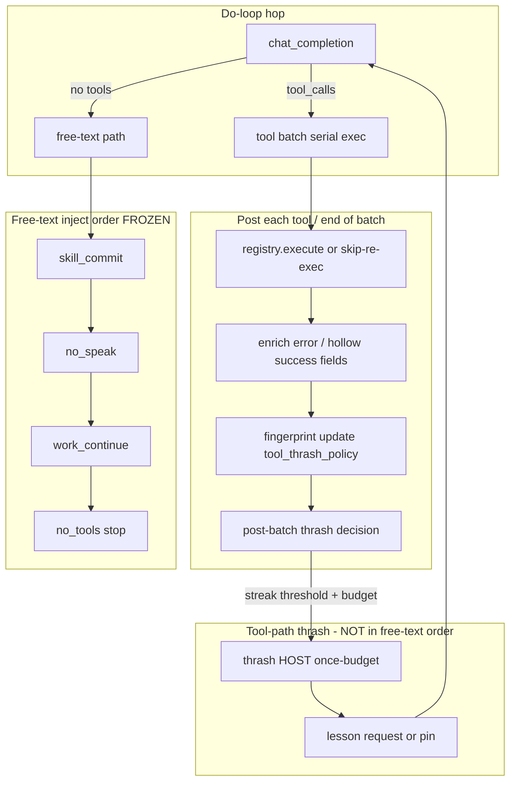
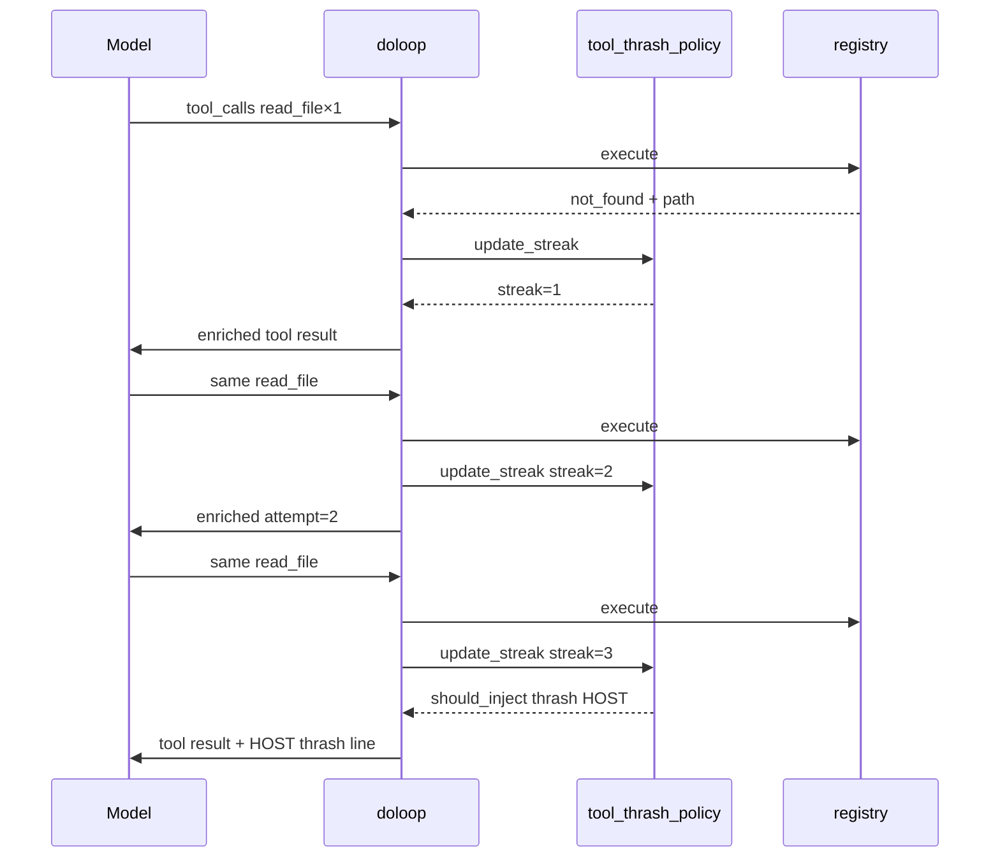
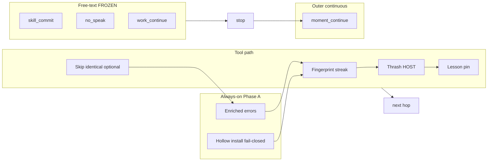

# Tool thrash recovery + model-visible host structure

| Field | Value |
|-------|-------|
| **Class** | DESIGN |
| **Author** | Design (Grok Build) |
| **Date** | 2026-07-22 |
| **Status** | Shipped / historical |
| **Product** | project-elyra (main; continuous work + skill-commit shipped) |
| **Workspace** | `/home/jim/Workspace/project-elyra` |
| **Live refs** | Moment `cbbb29b9-7b08-4e3c-8bc0-8400d5c57521` (Create Search Tool thrash); outer re-wake `9d95001c-2b5f-46f6-a067-c912c1b961c9` |
| **Prior art** | `docs/design/stretch-1/design-post-skill-commitment.md`, `docs/design/stretch-1/design-continuous-work-orient-ledger-reset.md`, `docs/dev/engineering-principles.md`, `docs/state/stretch-1.md` |

---

## Overview

Local Gemma sessions show two thrash families the current host does not interrupt honestly:

1. **Tool-path thrash** — identical failing (or hollow-success) tool calls repeat for dozens of hops. Existing HOST recovery (`skill_commit`, `no_speak`, `work_continue`) only runs on the **free-text** path; a model that keeps calling tools never sees them.
2. **Opaque tool errors / hollow successes** — `read_file` returns bare `not_found` with no path; `install_tool_draft` with an empty `files` map returns `ok: true, written: []`, which the model treats as progress. Intention says "rest"; action keeps calling tools.

This design ships a **thin, phased lattice**: enriched model-visible tool results (always-on honesty), a pure post-batch thrash policy with a once-budget thrash HOST, optional first-person lessons that survive **in-turn re-outer / chain compress** (moment-scoped, not durable identity; reset on new outer `moment_continue`), and optional skip-re-exec of identical failing calls. Free-text inject order stays **frozen**. Hard hop/wall ceilings remain safety nets only.

**Glossary (normative):**

| Term | Meaning |
|------|---------|
| **re-outer** | In-turn budget compress / `rebuild_outer` inside one moment (`enforce_in_turn_budget`). Same `_LoopState`. |
| **moment_continue** | New outer wake → new moment → fresh `_LoopState` (thrash counters and lessons **reset**). |

**Product philosophy this design honors:** Elyra must understand what is going on; no invisible constraints; soft nudge first; reflection/first-person lesson is **included** (not rejected) but kept thin and labeled; compromises vs pure "boring HOST / no ceremony" are stated explicitly.

---

## Background & Motivation

### What already works

| Piece | Path | Role |
|-------|------|------|
| Free-text inject order | `elyra/loop/doloop.py` | `skill_commit → no_speak → work_continue → stop` (frozen) |
| Skill-commit HOST | `elyra/loop/skill_commit_policy.py` | Once after commit-eligible `load_skill` on free-text |
| Work-continue HOST | `elyra/loop/continuous_policy.py` | Budgeted free-text nudge; flood hard-stop |
| Outer `moment_continue` | `continuous_policy.should_enqueue_moment_continue` | Re-wake when `tools_ran` / ledger progress + open work |
| Playbook framing | `format_playbook_active` + `tool_result_to_content` | Model-facing `load_skill` as PLAYBOOK ACTIVE |
| Create-tool gates | `elyra/tools/builtin/growth.py`, verify/promote | Fail-closed drafts; not callable until promote |
| Hop / wall backstops | `stop.py`, `LoopSettings.max_tool_hops=200` | Safety nets only (not product thrash strategy) |
| Speak-only glass | Stretch 1 | HOST is chain-only (`_is_host_inject`); never SpeakTransport |

### Dogfood evidence (workspace moments)

#### Create Search Tool thrash — `cbbb29b9-7b08-4e3c-8bc0-8400d5c57521`

Tape facts (340 beats; stop `no_tools`, hop_count **169**, spoke=true, tools_ran=true):

| Signal | Count / value |
|--------|----------------|
| `read_file` | **158** (all `error_reason: not_found`) |
| `install_tool_draft` | 3 (2× `missing_name`, 1× **ok with `written: []`**) |
| `verify_tool` | 1 (`incomplete_package:missing_TOOL.md`) |
| `load_skill("create-tool")` | 1 ok (playbook framed) |
| `speak` | 3 |
| skill_commit injects | 1 |
| work_continue injects | 1 |
| time-idle `continue` injects | **2** (pre-complete path; did not break tool spam) |
| Package bytes on disk | **none** under `tools/drafts/search_web/` (empty dir created by hollow install mkdir) |

Critical wire moments:

```text
install_tool_draft ok → {"ok": true, "name": "search_web", "written": [], "verify_invalidated": false}
verify_tool fail     → incomplete_package:missing_TOOL.md
read_file ×158       → {"ok": false, "error_reason": "not_found"}   # no path, no attempt#, no next_actions
```

Reasoning repeatedly claims intent to rest / call rest, while the action stream keeps `read_file`. Model never free-texts long enough for thrash-specific guidance after tools dominate. Time-idle `continue` HOST also fired during this long thrash session and did **not** interrupt tool-path spam — further evidence that recovery must sit **post-batch on the tool path**, not only on free-text / pre-complete lattices.

#### Outer continuous amplifier — `9d95001c-2b5f-46f6-a067-c912c1b961c9`

**Separate evidence from hollow install** (do not conflate with `cbbb29b9`):

| Fact | `9d95001c` tape |
|------|-----------------|
| Hollow `ok` + `written:[]` install | **No** — installs failed (`missing_files`, `invalid_file_content`) |
| Why `tools_ran=true` | Ok **`load_skill`** + ok **`list_dir`** (non-speak successes) |
| In-moment recovery | work_continue once; hop_count **6**; stop `no_tools`, spoke=false |
| Outer gate lesson | Non-speak ok tools (including load_skill / sandbox exploration) count as progress **even when growth failed** |

Continuous outer re-woke related work after prior thrash because gate 7 (`require_progress`) treats those ok non-speak tools as progress. Residual for Phase D is **load_skill / exploration progress**, not hollow-ok install (that root is `cbbb29b9` + Phase A).

#### Greeting thrash (operator narrative)

7× `speak` with the same text; reasoning says rest; still speaks. Free-text path may get no_speak / work_continue, but **identical successful speaks** are also thrash — softer priority than fail-streak, but fingerprints must cover ok results for speak-repeat policy (Phase B/C optional speak streak; Phase A honesty alone does not stop it).

### Failure chain (code-path validated)

```text
1. install_tool_draft(files={}) → ok, written:[]     # hollow success (growth.py lines 188–212)
2. verify fails missing_TOOL.md                       # honest fail, but no directive next_actions
3. read_file wrong path → not_found without path      # files.py FileNotFoundError → bare reason
4. Model retries identical read_file (fingerprint stable)
5. Free-text HOSTs never fire while tools keep coming
6. Hop budget (200) is only hard stop; product "strategy" is missing
7. tools_ran=true → moment_continue may re-open thrash
```

### Constraint reminder

- Single spine: presence → moment → `run_do_loop` multi-hop.
- Modular pure policy preferred (peer to `skill_commit_policy` / `continuous_policy`).
- Prefer deleting flags over stacking recovery lattices — thrash protection is justified; **keep lattice thin**.
- Free-text inject order **frozen** — thrash HOST is **not** inserted into that order.
- Soft nudge first; hard block only when model-visible and budgeted.

---

## Goals & Non-Goals

### Goals

1. **Honesty always-on:** tool errors and hollow successes are model-visible directives (reason + attempt# + args echo + short next_actions / do_not / facts_known when available).
2. **Close the free-text-only HOST gap:** post-batch thrash policy can inject a thrash HOST when identical tool fingerprints streak, without touching free-text order.
3. **Elyra understands structure:** if host skips re-exec, blocks a duplicate, injects thrash HOST, or forces a reflection form, the **wire says so** (tool result and/or HOST obs).
4. **Thin first-person lessons:** moment-scoped FAILURE/TRIED/WHY/NEXT (or 1–3 free sentences); re-feed as HOST pin surviving **in-turn re-outer** (not outer `moment_continue`); hybrid model-authored preferred, HOST-synthesized labeled.
5. **Keep principles mostly right:** modular pure policy; thin doloop wire; short HOST constants in Python; speak-only glass; soft first; hop/wall as safety nets only; work_continue suppressed after thrash HOST (K15).
6. **Tests as feature:** pure table tests + doloop integration for inject/skip/enrich paths.
7. **Phased ship:** A (honesty) → B (tool thrash HOST + K15) → C lessons → C-optional skip (PR3b) → D (outer progress, may defer).

### Non-Goals

- Full Reflexion product / durable lessons in `self.md` / cross-moment identity training.
- Second skill engine or automatic checklist interpreter.
- Changing free-text inject order or merging thrash into skill_commit/work_continue slots.
- Product-default `tool_choice=required` or product-default skip-exec ON without evidence.
- Treating max_tool_hops / wall clock as the thrash *product* strategy.
- Multi-worker / dual tool engines.
- Prompt-only "don't repeat" as the sole fix.
- Silent host constraints (invisible skip, invisible budget).
- Stretch 2 monologue ceremony or reflection-as-product-phase.

---

## Compromises & honesty

This section is mandatory product honesty — not an apology buried in risks.

| Ideal (pure Stretch / continuous) | Compromise in this design | Why justified | How we stay honest on the wire |
|-----------------------------------|---------------------------|---------------|--------------------------------|
| Boring HOST only; no reflection ceremony | First-person lesson form (FAILURE/TRIED/WHY/NEXT) after thrash | Dogfood intention–action gap: model *reasons* "rest" while *acting* tools; a short authored lesson re-anchors next hops | Lesson is HOST-requested or labeled `HOST-synthesized:`; never written as fake self-voice in self.md |
| Prefer deleting flags over recovery lattices | New thrash policy + small budget knobs | Free-text lattice cannot see tool thrash; one peer module is thinner than growing doloop conditionals | Defaults over flag forests; thrash settings few; prefer fixed constants |
| Soft nudge only | Optional skip-re-exec of identical fail after N | 158× identical `not_found` wastes hops and GPU; soft HOST alone may not break local Gemma loops | Synthetic result: `skipped_identical` / `blocked_duplicate` + prior error + lesson pin; **never silent** |
| No moment-local memory beyond chain | Lesson pin survives **in-turn re-outer** | Chain compress can drop old tool batches that held lesson text; inject-kind HOST already kept by compress, but lesson must not live only in dropped tool results | Compact HOST pin in chain; last L=1–2; moment-scoped; **reset on `moment_continue`** |
| `tools_ran` = any honest non-speak progress | Phase D may exclude load_skill / exploration-only from outer progress | Outer re-wake after failed growth (ok load_skill + list_dir) multiplies thrash | Document residual; D2/D3 if measured; hollow-ok install fixed in Phase A (separate root) |
| work_continue: "call tools to continue" | Thrash HOST copy ≠ that line **and** suppress work_continue after thrash HOST (K15) | Dogfood: work_continue after tools_ran *amplifies* tool spam on first free-text | Pure-policy gate: `thrash_host_sent > 0` → no work_continue for remainder of moment; model-visible thrash/lesson HOSTs already explain why |

**What we refuse:** invisible constraints. If the host does anything the model did not ask for (skip, block, force form, synthesize lesson), the model-visible channel states it in plain language starting with clear machine fields and/or `HOST:`.

---

## Proposed Design

### Architecture



### Phase A — Honesty always-on (root + amplifier)

Ship first; value alone even if thrash HOST never lands.

#### A1. Enriched tool errors (error-as-directive)

**Where:** prefer enrich at the **wire** layer so handlers stay simple and pure, with selective handler payload improvements for path/facts.

| Layer | Change |
|-------|--------|
| Handlers (FS) | `read_file` / `list_dir` / `grep` / `search_replace` include `path` (and pattern when relevant) on **all** failures, especially `not_found` — today `files.py` returns empty payload on `FileNotFoundError` |
| Handlers (growth) | Keep machine `error_reason`; add structured `missing` / `written` / `required` when incomplete |
| Wire | Optional shared enricher `enrich_tool_result_for_model(tr, *, tool_name, args, attempt_n, facts_known)` called from `_handle_tool_batch` before `tool_result_to_content` |

**Target model-visible error shape (full bar; omit empty). Fields arrive in phases — see PR1 DoD vs PR2:**

```json
{
  "ok": false,
  "error_reason": "not_found",
  "path": "tools/drafts/search_web/TOOL.md",
  "attempt": 3,
  "args_echo": {"path": "tools/drafts/search_web/TOOL.md"},
  "next_actions": [
    "list_dir tools/drafts/search_web",
    "install_tool_draft with non-empty files including TOOL.md"
  ],
  "do_not": [
    "repeat the same read_file path without writing the file first"
  ],
  "facts_known": {
    "draft_name": "search_web",
    "last_growth_error": "incomplete_package:missing_TOOL.md"
  }
}
```

Example notes: path-bearing `not_found` after a **failed** verify (post-A2 empty install never returns `ok` with `written:[]`). `last_install_written: []` is **pre-A2 residual** only — do not treat hollow-ok as a live success shape after Phase A.

Rules:

- `error_reason` remains the primary machine key (existing tests keep working).
- `attempt` = streak count for this fingerprint **after** this call (1-based) — **PR2** with thrash state.
- `args_echo` = canonical subset of args (truncate large file contents to hashes/lengths — never re-dump full TOOL.md bodies in every error).
- `next_actions` / `do_not` short (≤3 each); tool-family templates in pure module or thin maps — not multi-page prose in Python. Optional cheap templates in PR1; full enrich in PR2.
- `facts_known` only when thrash state or batch context has something true (e.g. last growth error_reason) — **PR2**.
- **`ToolResult` is frozen** — never mutate in place. Enrich via `dataclasses.replace(tr, payload={**tr.payload, ...})` or merge at `serialize_tool_result` / pre-`tool_result_to_content`.

**Especially required families:**

| Family | Reasons | Must include |
|--------|---------|--------------|
| FS | `not_found`, `path_escape`, `is_directory` | `path` (PR1) |
| Growth install | `missing_files`, `missing_name`, `invalid_file_content`, `empty_files`, `path_jail` | which key / path (PR1 for empty_files) |
| Growth verify | `incomplete_package:*` | missing file names when available |
| Hollow success | see A2 — **eliminated** as ok path | fail-closed before mkdir |

#### A2. Hollow success honesty — `install_tool_draft`

**Today** (`growth.install_tool_draft`): `files={}` validates, plans zero writes, returns:

```python
ToolResult(ok=True, payload={"name": name, "draft_dir": ..., "written": [], "verify_invalidated": False})
```

Dogfood treated this as checklist success → verify → thrash.

**Decision (K4): fail-closed empty write set — validate → reject → no side effects.**

| Case | Behavior |
|------|----------|
| `files` missing / null | keep `missing_files` (already) |
| `files` non-dict | keep `invalid_files` |
| `files` empty dict `{}` | **`ok=False`**, `error_reason="empty_files"`; **no mkdir**, no draft dir touch |
| `files` non-empty but all writes somehow skipped | should not happen; if it does, fail not ok |
| Successful writes | `ok=True` with non-empty `written` |

**Normative order in handler:**

```text
1. validate name
2. validate files present / dict / planned non-empty relative keys + string values
3. if planned empty → return empty_files  (STOP — do not mkdir tools/drafts/<name>/)
4. mkdir draft root + write loop
5. invalidate verify; return ok with written
```

Today mkdir runs before the write loop, so `files={}` still creates empty `tools/drafts/search_web/`. PR1 **must** fail before mkdir. Matches create-tool fail-closed and keeps draft tree honest.

Rationale: create-tool is fail-closed end-to-end; an empty install is not a meaningful draft step. Soft-warn-with-ok was considered and rejected — dogfood proves the model skips past soft signals when `ok: true`.

Optional additive warning fields on **partial** installs (future): not required for empty dict if hard-fail.

**Also enrich** `missing_name` / `invalid_file_content` with `args_echo` keys present so the model sees what was parsed (PR1 optional; at least `empty_files` hard-fail is mandatory).

#### A3. Attempt counter source + Phase A minimum bar

Attempt# for enrich comes from thrash state updated **per executed call** (Phase B / PR2).

**PR1 DoD (Phase A minimum — do not overbuild):**

1. FS failures include `path` on `not_found` / `path_escape` / `is_directory` (and `pattern` for grep when relevant).
2. Empty `files` → `empty_files`, **no mkdir**.
3. Optional thin `next_actions` templates for FS/growth only if cheap.
4. **Defer** `attempt`, `facts_known`, full `args_echo` thrash merge to **PR2**.

A alone ships path honesty + hollow fail-closed; that is the root amplifier fix.

---

### Phase B — Tool-path thrash policy

#### B1. Pure module

**New:** `elyra/loop/tool_thrash_policy.py`  
Peer to `skill_commit_policy.py` / `continuous_policy.py`. No I/O. No glass.

Scope: fingerprints, streak updates, thrash HOST decision, skip-re-exec decision, lesson pin builders, enrich field helpers that need streak.

#### B2. Fingerprint

```python
def canonical_args(args: Mapping[str, Any]) -> str:
    """Stable JSON: sort keys, normalize paths, redact/truncate large string values.

    File bodies (install_tool_draft files values): fingerprint as
    {path: {"len": N, "sha256_16": "..."}} so content edits break the streak
    correctly without hashing megabytes every hop in the message — hash is for
    fingerprint only.
    """

def tool_fingerprint(tool_name: str, args: Mapping[str, Any]) -> str:
    return f"{tool_name}|{canonical_args(args)}"
```

- `tool_name` casefold/strip.
- Speak thrash: fingerprint includes normalized text (whitespace-collapsed) so 7× identical speak is one streak.
- Different args ⇒ different fingerprint ⇒ streak resets for that key; track **last fingerprint** streak primarily (current thrash focus), with optional map of recent keys for lesson `tried[]`.

#### B3. State (`_LoopState` additions)

| Field | Type | Meaning |
|-------|------|---------|
| `thrash_last_fp` | `str \| None` | Last tool fingerprint (**v1: single last-fp only**) |
| `thrash_streak` | `int` | Consecutive identical fp (ok or fail — both count; skip policy may require fail) |
| `thrash_last_ok` | `bool \| None` | Whether last fp call was ok — set from `ThrashUpdate.ok` |
| `thrash_last_error` | `str \| None` | Last error_reason for that fp — set from `ThrashUpdate.error_reason` |
| `thrash_last_tool` | `str \| None` | Last tool name (for HOST builders; non-empty when streak active) |
| `thrash_host_sent` | `int` | Thrash HOST injects this moment |
| `thrash_tried` | `list[str]` | Compact tried fingerprints (cap ~8) |
| `lessons` | `list[str]` | Moment-scoped lessons (last L=1–2) |
| `lesson_request_sent` | `bool` | Lesson form HOST already asked |
| `lesson_captured` | `bool` | Model-authored or HOST-synthesized lesson stored this moment |
| `lesson_pin_message` | `str \| None` | Sticky HOST pin content for in-turn re-outer |
| `skip_exec_count` | `int` | Synthetic skips this moment (budget) |

Reset: **new moment only** (`moment_continue` / new wake → fresh `_LoopState`).  
**In-turn re-outer must not clear** thrash counters, lessons, or `lesson_pin_message` (see C + glossary).

**v1 batch semantics (closes OQ8):** evaluate post-batch inject from **end-of-batch last streak only**. Mixed batch `[read_file (would be streak 3), list_dir]` ends with list_dir’s streak and **can miss** thrash HOST — known limit. Dogfood `cbbb29b9` was almost entirely single-tool hops, so last-fp is sufficient for the primary failure. No per-batch threshold latch in v1 (avoids extra state; revisit only if multi-tool mixed thrash appears in dogfood).

#### B4. Update after each tool (or synthetic skip)

**Normative pure API** (single source of truth — API section must match):

```python
@dataclass(frozen=True)
class ThrashUpdate:
    fingerprint: str
    streak: int
    repeated: bool  # streak >= 2
    ok: bool
    error_reason: str | None
    tool_name: str

def update_thrash_streak(
    *,
    prev_fp: str | None,
    prev_streak: int,
    tool_name: str,
    args: Mapping[str, Any],
    ok: bool,
    error_reason: str | None,
) -> ThrashUpdate:
    """Compute next fingerprint streak and echo ok/error for state wiring."""
    ...
```

**Wire step in `_handle_tool_batch` after each tool result (or synthetic skip)** — pure function does not mutate state; doloop applies:

```text
upd = update_thrash_streak(
    prev_fp=state.thrash_last_fp,
    prev_streak=state.thrash_streak,
    tool_name=tc.name,
    args=parsed_args,
    ok=tr.ok,
    error_reason=tr.error_reason,
)
state.thrash_last_fp = upd.fingerprint
state.thrash_streak = upd.streak
state.thrash_last_ok = upd.ok
state.thrash_last_error = upd.error_reason
state.thrash_last_tool = upd.tool_name
# append compact fp to thrash_tried (cap 8)
# then enrich payload with attempt=upd.streak before tool_result_to_content (PR2)
```

Pure-table tests must cover: same fp increments streak; args change resets streak to 1; `ThrashUpdate.ok` / `error_reason` pass through for state.

#### B5. Post-batch thrash HOST (not mid-batch, not free-text order)

After `_handle_tool_batch` finishes the full batch without `ends_moment`, consult **end-of-batch last streak** (B3):

```python
@dataclass(frozen=True)
class ThrashHostDecision:
    inject: bool
    reason: str  # injected | below_threshold | budget | disabled | no_tool | ...
    kind: str    # thrash_repeat | thrash_fail_streak | thrash_speak_repeat | ""

def should_inject_thrash_host(
    *,
    streak: int,
    last_ok: bool | None,
    thrash_host_sent: int,
    tool_name: str | None,
    max_thrash_hosts: int = 1,
    fail_streak_threshold: int = 3,
    ok_streak_threshold: int = 5,
) -> ThrashHostDecision:
    """tool_name None or blank → inject=False, reason=no_tool.
    Builders require non-empty tool_name when inject=True.
    """
    ...
```

**Defaults (thin lattice):**

| Knob | Default | Notes |
|------|---------|-------|
| `fail_streak_threshold` | **3** | After 3 identical fails → thrash HOST |
| `ok_streak_threshold` | **5** | Identical ok (e.g. speak) — softer |
| `max_thrash_hosts` | **1** | Once per moment (HOST budget small) |
| `max_lesson_pins` | **2** | L=1–2 |
| `skip_identical_after` | **5** | Phase C; default **OFF** via `skip_identical_enabled=False` |
| `max_skips_per_moment` | **8** | Cap synthetic results |

Settings: prefer constants in `tool_thrash_policy.py` with optional `LoopSettings` later only if dogfood needs tuning — **do not** invent a flag forest on day one. If settings land, nest under `loop` or a tiny `thrash` section with ≤4 knobs.

**Inject placement:** after tool batch, **before** next `chat_completion` — same structural pattern as free-text HOST (`chain_messages.append(_obs_user_message(...))` + obs beat), but on the **tool path continue** branch:

```text
# end of _handle_tool_batch, after drain_interjections, before return None:
decision = should_inject_thrash_host(...)
if decision.inject:
    host_line = thrash_host_message(...)
    state.chain_messages.append(_obs_user_message(host_line))
    state.thrash_host_sent += 1
    append obs beat kind=tool_thrash
    # optionally arm lesson request (Phase C) in same or next inject
return None  # continue loop → next completion sees HOST
```

**Not** inserted into free-text order. Free-text **order** stays frozen; work_continue **eligibility** is gated after thrash (B7 / K15) — not a new free-text slot.

#### B6. Thrash HOST copy (normative)

Must **not** echo `WORK_CONTINUE_HOST` ("call tools to continue"). Must name the pattern, demand change, clarify rest:

```text
HOST: tool thrash — repeated {tool_name} ×{streak} with same args
({summary_error_or_ok}). Do not repeat that call. Change tool or arguments,
or stop with free-text (no tools). Rest means load_skill("rest") or honest
no-tool stop — rest is not a tool name. If blocked, write a one-line lesson
then change approach.
```

Builder:

```python
THRASH_HOST = (
    "HOST: tool thrash — repeated {tool_name} ×{streak} with same args "
    "({detail}). Do not repeat that call. Change tool or arguments, "
    "or stop with free-text (no tools). Rest means load_skill(\"rest\") "
    "or honest no-tool stop — rest is not a tool name."
)

def thrash_host_message(*, tool_name: str, streak: int, detail: str) -> str:
    return THRASH_HOST.format(tool_name=tool_name, streak=streak, detail=detail)
```

- Starts with `HOST:` for `_is_host_inject`.
- Beat: `{"type": "obs", "kind": "tool_thrash", "content": host_line, "fingerprint": fp, "streak": n}`.
- Never SpeakTransport / glass.

#### B7. Interaction with skill_commit / work_continue / continuous

| Mechanism | Interaction |
|-----------|-------------|
| Free-text order | **Slots unchanged** — thrash does not insert a free-text slot |
| skill_commit | Independent; may still fire if free-text after load_skill |
| **work_continue** | **K15: suppress when `thrash_host_sent > 0`** for the remainder of the moment (see below) |
| Continuous outer | tools_ran still set on successful non-speak; Phase D may nuance load_skill/exploration progress |
| max_hops / wall | Unchanged safety nets |
| Flood free-text | Unrelated; thrash is tool-path |
| Time-idle `continue` | Unchanged pre-complete path; not thrash-specific (dogfood showed it fails to stop tool spam) |

**K15 — work_continue must not re-amplify thrash (normative):**

Dogfood risk: after thrash HOST the first free-text hop still has `tools_ran=true` and continuous on → `work_continue` injects “call tools to continue…”, undoing thrash recovery.

Prefer a **pure-policy** extension over ad-hoc doloop branches:

```python
# continuous_policy.should_in_moment_work_nudge — add parameter:
thrash_host_sent: int = 0,
# early gate:
if thrash_host_sent > 0:
    return InMomentNudgeDecision(inject=False, reason="thrash_recovery")
```

Wire: pass `state.thrash_host_sent` from free-text branch. Free-text **order** remains skill_commit → no_speak → work_continue → stop; work_continue simply never injects after thrash HOST. Thrash / lesson HOSTs already explain the constraint (no invisible suppress without prior thrash visibility).

Tests: after thrash HOST, free-text with continuous ON + tools_ran → `work_continue_injects` stays 0, reason path `thrash_recovery` (unit on pure policy + doloop integration).



---

### Phase C — Reflection (included, not rejected)

#### C1. First-person lesson (thin, model-visible)

##### Normative wire algorithm (implementable)

```text
# After thrash HOST inject (or when streak hits threshold and thrash HOST
# budget already spent this moment — still arm lesson once):
if not state.lesson_request_sent:
    append thrash_lesson HOST request
    state.lesson_request_sent = True
    obs kind=thrash_lesson
    continue to next completion   # do not stop

# On free-text hop (no tool_calls), BEFORE frozen free-text inject order:
if state.lesson_request_sent and not state.lesson_captured:
    content = (result.content or "").strip()
    if content and not hop_was_flood:   # any non-empty free-text counts as lesson
        lesson = compact_lesson(content)  # keep 1–3 sentences or structured fields
        state.lessons = (state.lessons + [lesson])[-2:]
        state.lesson_captured = True
        state.lesson_pin_message = lesson_pin_host_message(lesson)
        append lesson_pin HOST (or ensure sticky pin)
        obs kind=lesson_pin
        # Recovery hop: do NOT auto-stop. Fall through remaining free-text order
        # (skill_commit / no_speak / work_continue-suppressed / stop) so the model
        # can change approach on a following hop. Lesson free-text alone is not
        # glass; if no further inject fires, stop no_tools is allowed (honest stop
        # after lesson is OK).
    # empty free-text: do not capture; continue free-text order as usual

# On tool path, if lesson_request_sent and not lesson_captured:
# after each thrash update, if streak of identical fails since request >= K (default 3)
# and no free-text lesson yet → synthesize once (C2), set lesson_captured, pin.
```

**Lesson recognition:** any non-empty free-text content after `lesson_request_sent` and before `lesson_captured`, including structured FAILURE/TRIED/WHY/NEXT lines **or** 1–3 free sentences. No strict parser required for v1; optional light extract of labeled fields when present. Flood free-text does **not** count as a lesson (same flood hard-stop family as work_continue).

**Stop vs continue after lesson:** prefer **recovery hop** — capturing a lesson does **not** force stop and does **not** force tools. Free-text order still runs; work_continue suppressed if thrash HOST was sent (K15). Honest `no_tools` stop after lesson is allowed.

**Request HOST copy:**

```text
HOST: thrash lesson — reply in free-text only (1–3 sentences) OR structured:
FAILURE: …
TRIED: …
WHY: …
NEXT: …
Then change tool/args on a following hop (or honest no-tool stop). Do not repeat the thrashing call.
```

**Pin HOST (in-turn only):**

```text
HOST: moment lesson pin — {compact lesson text}
```

**Sticky pin vs compress:** `enforce_in_turn_budget` / re-outer compress **already keeps HOST inject spans**. Sticky re-append of `lesson_pin_message` after compress is belt-and-suspenders when the lesson lived only in tool-result text of a **dropped** batch, or when pin was never injected as HOST. Prefer: always materialize pin as a `HOST:` inject once so compress keeps it; sticky re-append only if pin row is missing after compress.

**Outer `moment_continue`:** new moment → new `_LoopState` → lessons **reset**. Pins do **not** survive across outer continuous re-wakes (by design; thin moment-scoped memory).

#### C2. Hybrid HOST-synthesized lesson

If the model never free-texts after lesson request (keeps tool thrashing):

**When:** after **K=3** additional identical **fail** streak updates with `lesson_request_sent and not lesson_captured` (tool path), inject once:

```python
def synthesize_lesson(*, tried: Sequence[str], last_error: str | None, tool_name: str) -> str:
    return (
        f"HOST-synthesized lesson: failed repeating {tool_name} "
        f"({last_error or 'ok_spam'}); tried={list(tried)[-4:]}; "
        f"next=change args or stop — not a first-person claim."
    )
```

- **Must** be labeled `HOST-synthesized` — never fake "I learned…" self-voice.
- Store into `lessons`, set `lesson_captured=True`, set `lesson_pin_message`, inject pin as HOST (model-visible).
- Still moment-scoped; not written to `data/identity/self.md`.
- Do **not** wait until moment finalize only — pin must be available for remaining hops.

#### C3. Optional skip-re-exec (default OFF)

After identical **fail** streak ≥ `skip_identical_after` (default 5) **and** `skip_identical_enabled` (default False):

1. Do **not** call registry handler.
2. Return synthetic `ToolResult`:

```python
ToolResult(
    ok=False,
    error_reason="skipped_identical",
    payload={
        "blocked_duplicate": True,
        "prior_error_reason": prev_error,
        "attempt": streak + 1,
        "args_echo": ...,
        "next_actions": ["change tool or arguments", "or free-text stop / thrash lesson"],
        "do_not": ["repeat this exact call"],
        "lesson_pin": latest_lesson_or_none,
        "host_note": "HOST skipped re-exec of identical failing call — visible by design",
    },
)
```

3. Still update streak / tried; still may inject thrash HOST if budget remains.
4. **Never** `ends_moment` by default.
5. Observability beat: `kind=tool_skip_identical`.

Default OFF until Phase B dogfood shows HOST alone insufficient (same evidence gate as post-load `tool_choice`).

---

### Phase D — Continuous outer (separate PR if needed)

**Residuals (split — do not conflate moments):**

| Residual | Source moment | Mechanism |
|----------|---------------|-----------|
| Hollow-ok install as false progress | **`cbbb29b9`** | `install_tool_draft` `ok` + `written:[]` sets `tools_ran` and empty draft dir |
| Growth failed but outer still re-wakes | **`9d95001c`** | Ok **`load_skill`** + ok **`list_dir`** set `tools_ran=true` while installs fail (`missing_files` / `invalid_file_content`); hop_count 6, work_continue once |

Gate 7 uses `tools_ran OR ledger_mutated` where `tools_ran` = ≥1 successful non-speak tool (`doloop` continuous K15).

**Options:**

| Option | Change | Ship? |
|--------|--------|-------|
| D0 | Document residual only | Always in this design |
| D1 | Empty install no longer `ok` (Phase A) → removes hollow progress root (`cbbb29b9`) | Ships with A |
| D2 | Tag `substantial_progress` (ledger mutate OR non-exploration growth with real writes) for outer gate | Separate PR |
| D3 | Exclude pure `load_skill` (and maybe pure list_dir exploration) from outer progress | Separate PR; careful — may block legitimate re-entry |

**Recommendation:** D1 with PR1. Defer D2/D3 unless post-A/B dogfood still re-wakes thrash-like loops via load_skill/exploration-only progress (`9d95001c` pattern). Measured risk: **medium** for outer after D1 (load_skill path remains); **high** if D1 not shipped.

---

### HOST map (complete host-visible injects after this design)

| kind (obs beat) | Path | Budget | Trigger |
|-----------------|------|--------|---------|
| `skill_commit` | free-text | 1/moment | pending commit-eligible skill |
| `no_speak_nudge` | free-text | 1/moment | social, !spoke |
| `work_continue` | free-text | `in_moment_work_nudge_max` | continuous + work_context; **suppressed if thrash_host_sent > 0 (K15)** |
| `continue` | pre-complete | `continue_max_injects` | time idle (not thrash-specific; dogfood showed insufficient alone) |
| `tool_thrash` | **post-batch** | `max_thrash_hosts` (1) | end-of-batch last fingerprint streak |
| `thrash_lesson` | post-batch after thrash HOST | 1 request | after thrash |
| `lesson_pin` | sticky / **in-turn** re-outer | L≤2 | stored lessons (reset on new moment) |
| `tool_skip_identical` | tool result (not HOST line only) | max_skips | optional PR3b |

Max thrash-related HOST injects per moment (steady state): **1 thrash + 1 lesson request + ≤2 pin refreshes** (pins are re-asserts of same content, not spam). Total thrash HOST budget small by design.

---

### Interaction diagram (full moment)



---

## API / Interface Changes

### New pure module (normative surface)

```python
# elyra/loop/tool_thrash_policy.py
# Normative — matches §B4/B5 (single signature; no drift).

@dataclass(frozen=True)
class ThrashUpdate:
    fingerprint: str
    streak: int
    repeated: bool  # streak >= 2
    ok: bool
    error_reason: str | None
    tool_name: str

@dataclass(frozen=True)
class ThrashHostDecision:
    inject: bool
    reason: str  # injected | below_threshold | budget | disabled | no_tool | ...
    kind: str

@dataclass(frozen=True)
class SkipIdenticalDecision:
    skip: bool
    reason: str  # skip | disabled | below_threshold | budget | last_was_ok | ...

def canonical_args(args: Mapping[str, Any]) -> str: ...
def tool_fingerprint(tool_name: str, args: Mapping[str, Any]) -> str: ...

def update_thrash_streak(
    *,
    prev_fp: str | None,
    prev_streak: int,
    tool_name: str,
    args: Mapping[str, Any],
    ok: bool,
    error_reason: str | None,
) -> ThrashUpdate: ...

def should_inject_thrash_host(
    *,
    streak: int,
    last_ok: bool | None,
    thrash_host_sent: int,
    tool_name: str | None,
    max_thrash_hosts: int = 1,
    fail_streak_threshold: int = 3,
    ok_streak_threshold: int = 5,
) -> ThrashHostDecision:
    """None/blank tool_name → inject=False, reason=no_tool.
    thrash_host_message requires non-empty tool_name when inject=True.
    """
    ...

def thrash_host_message(*, tool_name: str, streak: int, detail: str) -> str: ...
# tool_name must be non-empty (builder invariant)

def should_skip_identical(
    *,
    enabled: bool,
    streak: int,
    last_ok: bool | None,
    skip_count: int,
    skip_after: int = 5,
    max_skips: int = 8,
) -> SkipIdenticalDecision: ...

def lesson_request_host_message() -> str: ...
def lesson_pin_host_message(lesson: str) -> str: ...
def compact_lesson(content: str) -> str: ...  # 1–3 sentences / structured trim
def synthesize_lesson(*, tried: Sequence[str], last_error: str | None, tool_name: str) -> str: ...

def enrich_error_payload(
    payload: dict[str, Any],
    *,
    tool_name: str,
    args: Mapping[str, Any],
    attempt: int,
    error_reason: str | None,
    facts_known: Mapping[str, Any] | None = None,
) -> dict[str, Any]: ...
```

**continuous_policy additive (PR2):**

```python
def should_in_moment_work_nudge(
    ...,
    thrash_host_sent: int = 0,  # NEW: >0 → inject=False, reason="thrash_recovery"
) -> InMomentNudgeDecision: ...
```

### Handler changes

| File | Change |
|------|--------|
| `elyra/tools/builtin/files.py` | On failures, include `path` (and relevant args) in payload |
| `elyra/tools/builtin/growth.py` | Empty `files` → `empty_files` **before mkdir**; no draft dir side effects |
| `elyra/loop/doloop.py` | Thrash state apply from `ThrashUpdate`; post-batch inject; K15 pass thrash_host_sent; optional skip; enrich via replace; lesson wire (PR3); DoLoopResult counters |
| `elyra/loop/continuous_policy.py` | thrash_recovery gate on work_continue (PR2) |

### DoLoopResult additions

```python
thrash_host_injects: int = 0
thrash_skips: int = 0
# stop beat may include thrash_host_injects for ops
```

### Settings (minimal; prefer constants first)

If knobs are needed after dogfood:

```python
# Optional later — not required for PR1
@dataclass(frozen=True)
class ThrashSettings:
    fail_streak_threshold: int = 3
    ok_streak_threshold: int = 5
    max_thrash_hosts: int = 1
    skip_identical_enabled: bool = False
    skip_identical_after: int = 5
```

Until then, constants in `tool_thrash_policy.py` match continuous design's "defaults over flag forests."

---

## Data Model Changes

| Store | Change |
|-------|--------|
| Moment tape beats | New obs kinds: `tool_thrash`, `thrash_lesson`, `lesson_pin`; tool beats may show enriched content[:500] |
| `data/identity/self.md` | **No change** — lessons are not durable identity |
| `data/runtime/continuous.json` | **No change** in Phases A–C |
| Draft packages | Empty install **must not mkdir** (`empty_files` before any draft-tree side effect) |

**Migration:** none. Fail-closed empty install is behavior change; tests + create-tool skill already require non-empty package files.

---

## Alternatives Considered

### 1. Hard max identical tools only (reject as main strategy)

| Pros | Cons |
|------|------|
| Simple counter; stops 158× read_file | Silent or opaque blocks violate "model must understand"; no recovery guidance; fights soft-nudge product |
| Low code | Becomes flag lattice of per-tool caps |

**Verdict:** OK as **optional** skip-re-exec behind visibility (Phase C), **not** the main strategy. Hop ceiling remains last-resort safety net.

### 2. Prompt-only "don't repeat"

| Pros | Cons |
|------|------|
| Zero code | Weak on local Gemma; dogfood already has playbook + skill-commit and still thrashed |
| No lattice | Free-text prompts never seen on pure tool thrash path |

**Verdict:** Keep playbook clarity; **insufficient alone**.

### 3. Full Reflexion / durable self lessons

| Pros | Cons |
|------|------|
| Deep learning across sessions | Ceremony vs continuous design "no reflection ceremony"; Stretch 2 smell; self.md pollution |
| Richer memory | Overfit thrash narratives into identity |

**Verdict:** Reject as product. **Thin moment-scoped lessons** are the middle path (this design).

### 4. Skip-exec default ON vs OFF

| ON | OFF |
|----|-----|
| Faster stop of GPU burn | May block legitimate "retry after external change" (rare in sandbox) |
| Risk of over-block before model adapts | Dogfood may still thrash if HOST ignored |

**Verdict:** Default **OFF**; enable after Phase B live gate. Always model-visible when ON.

### 5. Put thrash into free-text order

| Pros | Cons |
|------|------|
| One inject pipeline | Freezes/complicates skill_commit→no_speak→work_continue; thrash is tool-path phenomenon |

**Verdict:** Reject. Post-batch inject is the correct seam.

### 6. Soft-warn empty install (`ok=true` + warning field)

| Pros | Cons |
|------|------|
| Less breaking for odd callers | Dogfood: model ignored `written:[]` while `ok:true` |

**Verdict:** Reject. Fail-closed empty_files.

---

## Security & Privacy Considerations

| Topic | Note |
|-------|------|
| Args echo | Truncate/redact large file contents and secrets-shaped values in `args_echo`; full bodies never re-attached on every error |
| Path disclosure | Sandbox-relative paths only (already path-jailed); do not leak host absolute paths beyond existing `draft_dir` behavior — prefer relative in enrich |
| Lesson storage | Moment tape only; no cross-user leak; not in self.md |
| Skip-exec | Does not elevate privileges; only withholds re-exec of model-requested call |
| HOST inject | Chain-only; never SpeakTransport — glass unchanged |

Threat model: model is semi-trusted; host must not invent successful tool side effects on skip; synthetic results are clearly failed/blocked.

---

## Risks

| Risk | Severity | Mitigation |
|------|----------|------------|
| Thrash HOST ignored like other HOSTs | High (local Gemma) | Phase A honesty + optional skip-exec (PR3b); clarify rest ≠ tool name |
| work_continue re-amplifies thrash on free-text | High (in-moment) | **K15 suppress** when thrash_host_sent > 0; pure policy reason thrash_recovery |
| Mixed multi-tool batch misses thrash HOST | Low–Medium | v1 last-fp only; known limit; dogfood mostly single-tool hops |
| Fingerprint too coarse (collides) | Medium | Canonical JSON + content hashes for file maps |
| Fingerprint too fine (never streaks) | Medium | Normalize paths/whitespace; tests on dogfood shapes |
| Lesson ceremony creep | Medium | L≤2, moment-scoped, labeled synthesize, no self.md; wire algorithm fixed |
| Empty install fail breaks a legitimate "touch draft dir" workflow | Low | create-tool requires files; mkdir-only is not a product need |
| In-turn re-outer drops lesson living only in tool text | Medium | Materialize lesson as HOST pin (compress keeps injects); sticky belt-and-suspenders |
| Outer moment_continue thrash replay | Medium after D1 | D1 hollow fix; residual load_skill/list_dir progress (9d95001c); D2/D3 if measured |
| God-module growth in doloop | Medium | Pure policy module; thin wire only |
| Flag forest | Medium | Constants first; ≤4 knobs if any |

---

## Observability

| Signal | Where |
|--------|-------|
| `obs.kind=tool_thrash` | Moment tape + chain |
| `obs.kind=thrash_lesson` / `lesson_pin` | Moment tape |
| Tool beat content | Enriched error JSON prefix in `content[:500]` |
| `DoLoopResult.thrash_host_injects` / `thrash_skips` | Finalize / tests |
| Stop beat optional fields | `thrash_host_injects`, `thrash_skips` |
| Logs | `_LOG.info` on thrash inject / skip (moment_id, fp, streak) |
| Glass status | Optional later (`thrash_host_injects` on status) — not required for Phase A/B |

Alerting: not productized; operator reads moment tape / live-eval scorecards.

---

## Rollout / Eval Plan

### PR-independent dogfood cells

| Cell | Setup | Pass criteria |
|------|-------|---------------|
| **A-empty-install** | Ask create search tool; model attempts empty install | Wire shows `empty_files`; **no** new empty draft dir under `tools/drafts/` |
| **A-not-found-path** | Force read missing sandbox path | Error JSON includes `path` |
| **B-read-thrash** | After missing package, thrash read_file | By attempt 3: thrash HOST; obs `tool_thrash` |
| **B-work-continue-suppress** | Continuous ON; thrash HOST already sent; free-text | work_continue does **not** inject |
| **B-no-free-text-regression** | Social hello | skill_commit/no_speak/work_continue **order** unchanged |
| **C-lesson** (PR3) | After thrash HOST | Lesson request; free-text stores lesson; pin survives **in-turn** re-outer; not across moment_continue |
| **C-skip** (PR3b, flag ON) | 5+ identical fails | `skipped_identical` on wire; not silent |
| **D-outer** | Continuous ON after thrash stop | Measure re-wake on load_skill/list_dir-only; residual documented |

### Hermetic tests (definition of done)

**PR1:**

1. `install_tool_draft` empty files → not ok, `empty_files`; draft root not created.
2. `read_file` / list_dir / search_replace not_found (and path_escape / is_directory) payload has `path`.

**PR2:**

3. Pure table tests: fingerprint stability; streak reset on args change; `ThrashUpdate` carries ok/error_reason; host decision thresholds; no_tool when tool_name None; work_continue thrash_recovery gate.
4. Doloop: three identical fail tools → one thrash HOST; fourth does not second-inject if budget 1.
5. Thrash HOST never on SpeakTransport / glass list.
6. Free-text order tests unchanged; after thrash_host_sent, work_continue suppressed.
7. attempt# present on enriched fail after streak update.

**PR3 / PR3b:**

8. Lesson free-text capture + pin; synthesize label contains `HOST-synthesized`; flood free-text does not capture.
9. Skip path (when enabled) returns model-visible reason.

### Live-eval

Extend `scripts/live_eval` scenarios when stable: create-tool happy path + intentional missing file thrash (short hop cap). Score: thrash HOST fired; hop_count ≪ 169; package eventually non-empty or honest stop.

---

## Open Questions

| # | Question | Resolution |
|---|----------|------------|
| OQ1 | Exact fail_streak_threshold 3 vs 4? | **Resolved (user 2026-07-22): accept default** — **3** |
| OQ2 | Count ok-streak thrash (speak×7) in v1? | **Resolved (user 2026-07-22): accept default** — Yes at threshold **5**; lower priority than fail streak |
| OQ3 | Sticky lesson pin vs enrich-only facts_known? | **Resolved (user 2026-07-22): accept default** — **Materialize HOST pin** (compress keeps injects); sticky re-append belt-and-suspenders only |
| OQ4 | Ship skip-identical with lessons or later? | **Resolved (user 2026-07-22): accept default** — **Later / PR3b**, default OFF — do not block lessons or thrash HOST |
| OQ5 | `empty_files` vs `no_files_written` reason string? | **Resolved (user 2026-07-22): accept default** — `empty_files` |
| OQ6 | Should `load_skill` alone count as outer progress? | **Resolved (user 2026-07-22): accept default** — Defer (Phase D / D3); document residual (`9d95001c`) |
| OQ7 | ThrashSettings in elyra.toml now or constants only? | **Resolved (user 2026-07-22): accept default** — **Constants only** until dogfood needs tuning |
| OQ8 | Multi-tool batch any-fp latch vs last-fp? | **Resolved (user 2026-07-22): accept default** — last-fp end-of-batch only (v1); mixed-batch miss known limit |

---

## Key Decisions

| # | Decision | Rationale |
|---|----------|-----------|
| K1 | **Phased A→B→C→D**, not full lattice at once | Principles: thin lattice; honesty alone fixes hollow success root |
| K2 | **Pure `tool_thrash_policy.py`** peer module | No god doloop; matches skill_commit / continuous pattern |
| K3 | **Post-batch thrash HOST**; free-text order frozen | Tool thrash never hits free-text injects; order is product law |
| K4 | **Empty `install_tool_draft` fail-closed before mkdir** | Dogfood `written:[]` as ok + empty dir; soft-warn insufficient |
| K5 | **FS errors include path** | Bare `not_found` is invisible constraint on what failed |
| K6 | **Thrash HOST copy ≠ work_continue** | Must demand change/stop; clarify rest ≠ tool name |
| K7 | **First-person lessons included thin** | Not rejected; moment-scoped; hybrid labeled; not self.md |
| K8 | **No invisible skip/block** | Synthetic results + HOST always explicit |
| K9 | **Skip-identical default OFF** | Evidence-gated; safety when HOST ignored |
| K10 | **max thrash HOST = 1 / moment** | Small budget; avoid HOST spam |
| K11 | **Hard hops/wall stay safety nets only** | Product thrash strategy is policy+honesty, not hop cap |
| K12 | **Outer D2/D3 deferred**; D1 with A | Hollow root ≠ load_skill residual; measure before outer gates |
| K13 | **Fingerprint = tool_name + canonical args** | Stable streak detection; file bodies hashed by path |
| K14 | **Speak-only glass unchanged** | Thrash is chain obs, never transport |
| K15 | **Suppress work_continue when thrash_host_sent > 0** | Prevents free-text re-amplification of tool spam after thrash HOST |
| K16 | **v1 thrash inject = end-of-batch last-fp only** | Thin state; mixed-batch miss accepted |
| K17 | **ThrashUpdate carries ok + error_reason** | Single contract for streak metadata wiring |

---

## PR Plan

Independently mergeable; each has tests as feature.

### PR1 — Phase A honesty (root)

**Scope (minimum bar — do not overbuild):**

- `files.py`: `path` on `not_found` / `path_escape` / `is_directory` (pattern for grep when relevant).
- `growth.py`: empty `files` → `empty_files` **before mkdir** (no draft dir side effects).
- Optional thin `next_actions` only if cheap.
- Tests: `test_tools_fs.py`, create-tool / growth gates.
- Docs: note in this design status.

**Out of scope:** thrash HOST, attempt#/facts_known enrich, lessons, skip, work_continue gate.

**Merge criteria:** hermetic green; dogfood A-empty-install (no empty dir) + A-not-found-path.

### PR2 — Phase B thrash policy + post-batch HOST + K15

**Scope:**

- New `elyra/loop/tool_thrash_policy.py` + `tests/test_tool_thrash_policy.py` (incl. `ThrashUpdate` ok/error fields).
- `doloop._LoopState` thrash fields; apply update after each tool; post-batch inject from **last-fp**; obs `tool_thrash`.
- Wire attempt# into enriched errors using streak (`dataclasses.replace` / merge — frozen ToolResult).
- `should_in_moment_work_nudge(..., thrash_host_sent=...)` → thrash_recovery suppress (K15).
- `DoLoopResult.thrash_host_injects`.
- Integration tests (glass exclusion + work_continue suppress after thrash).

**Out of scope:** lesson ceremony, skip-exec, outer continuous progress redefinition.

**Merge criteria:** pure tables + integration; free-text order tests still pass; B-read-thrash + B-work-continue-suppress.

### PR3 — Phase C lessons (ceremony only)

**Scope:**

- Lesson request HOST + capture wire algorithm (C1) + store last L=1–2.
- HOST pin survives **in-turn re-outer**; reset on new moment.
- `synthesize_lesson` after K further fail streak without free-text; labeled HOST-synthesized.
- Tests for capture, flood non-capture, pin stickiness, no auto-stop forced by lesson alone.

**Out of scope:** durable self lessons; skip-exec (see PR3b).

### PR3b — Skip-identical (optional, independently mergeable)

**Scope:**

- `should_skip_identical` + synthetic model-visible result; constant/flag default **False**.
- Tests for visibility; never silent; never ends_moment by default.

**Why split:** skip is the GPU-burn brake when HOST is ignored; lessons are the ceremony compromise. Do not block the brake on lesson wire, or delay lessons for skip.

### PR4 — Phase D outer progress (only if needed)

**Scope:**

- Measure post-PR1/PR2 continuous re-wake rate (esp. load_skill/list_dir-only progress like `9d95001c`).
- If still bad: D2 substantial_progress and/or D3 exclude load_skill-only from outer progress.
- Update `continuous_policy` + tests; design note in continuous doc.

**Defer** if outer calm after D1 + thrash HOST.

### Suggested calendar dependency

```text
PR1 (A) ──► PR2 (B + K15) ──► PR3 (lessons)
                    │              └──► PR3b (skip) optional parallel after PR2
                    └──► PR4 (D) only if measured
```

---

## References

| Doc | Why |
|-----|-----|
| [`docs/dev/engineering-principles.md`](../../dev/engineering-principles.md) | Modular packages; tests as feature; defaults over flags; prefer deleting recovery lattices; honest tool errors |
| [`docs/state/stretch-1.md`](../../state/stretch-1.md) | Single worker; do-loop; speak-only; skills on load; hop not main stop law |
| [`docs/design/stretch-1/design-continuous-work-orient-ledger-reset.md`](design-continuous-work-orient-ledger-reset.md) | work_continue HOST; moment_continue; tools_ran definition; flood gates |
| [`docs/design/stretch-1/design-post-skill-commitment.md`](design-post-skill-commitment.md) | Free-text order; skill_commit pure policy pattern; playbook framing |
| [`docs/inference.md`](../../inference.md) | Gemma-4-12B local; sliding meal; generation headroom |
| [`docs/state/tools-and-skills.md`](../../state/tools-and-skills.md) | create-tool fail-closed; drafts not callable |
| [`docs/live-eval.md`](../../live-eval.md) | Eval harness for dogfood cells |
| Code: `elyra/loop/doloop.py` | Free-text inject; tool batch; serialize_tool_result |
| Code: `elyra/loop/skill_commit_policy.py` | Peer pure policy shape |
| Code: `elyra/loop/continuous_policy.py` | work_continue + outer gates |
| Code: `elyra/tools/builtin/growth.py` | install_tool_draft hollow ok today |
| Code: `elyra/tools/builtin/files.py` | bare not_found |
| Skill: `skills/bundled/create-tool/SKILL.md` | Checklist model should follow |
| Live: `data/moments/cbbb29b9-…jsonl` | 158× not_found thrash |
| Live: `data/moments/9d95001c-…jsonl` | Outer continuous thrash re-entry |

---

## Revision Summary

| Rev | Date | Notes |
|-----|------|-------|
| 0 | 2026-07-22 | Initial draft |
| 1 | 2026-07-22 | Review pass: unified `ThrashUpdate` API; v1 last-fp batch policy; Phase C lesson wire algorithm; K15 work_continue suppress; split 9d95001c residual; empty install no-mkdir; PR1 enrich bar + frozen ToolResult; re-outer glossary; A1 example post-A2; dogfood time-idle continue; PR3/PR3b split; tool_name no_tool |
| 2 | 2026-07-22 | User accepted OQ defaults (OQ1–OQ8 marked Resolved) |
