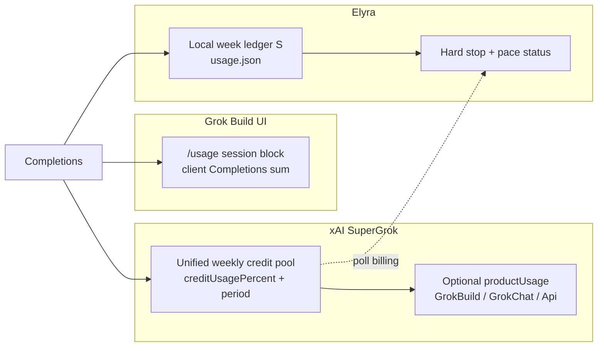
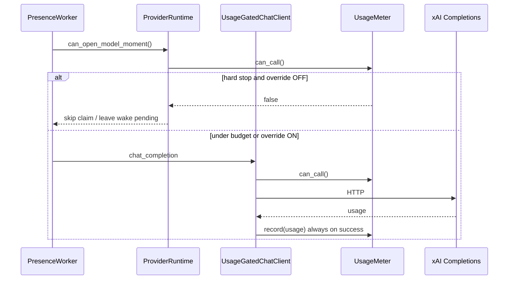
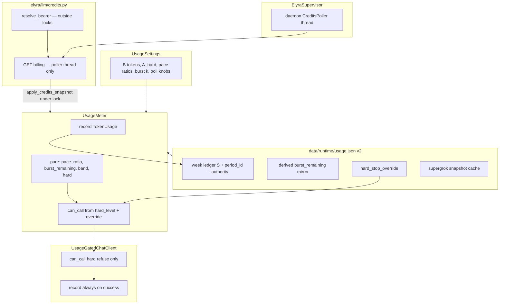

# Design: Improve Elyra Usage Tracking + SuperGrok Weekly Limit Pacing

| Field | Value |
|-------|--------|
| **Class** | DESIGN |
| **Document** | Usage tracking + SuperGrok weekly pacing (keep hard-stop override) |
| **Author** | Design (Grok Build) |
| **Date** | 2026-07-27 |
| **Status** | Shipped |
| **Product** | project-elyra |
| **Branch base** | `grok-improvement` |
| **Workspace** | `/home/jim/Workspace/project-elyra` |
| **Real goal** | Align Elyra metering with SuperGrok’s **unified weekly pool**, replace pure linear day/hour hard gates with **week-cumulative ledger + pace-aware throttle + burst**, keep **hard_stop_override** |
| **Related docs** | [`docs/design/grok-improvement-plan/phase-0.md`](../grok-improvement-plan/phase-0.md), [`docs/design/grok-improvement-plan/phase-0-execution.md`](../grok-improvement-plan/phase-0-execution.md), [`docs/dev/engineering-principles.md`](../../dev/engineering-principles.md) |
| **Primary code today** | `elyra/llm/usage.py`, `elyra/llm/client.py` (`UsageGatedChatClient`), `elyra/llm/auth.py`, `elyra/settings.py` (`UsageSettings`), `elyra/runtime/provider_runtime.py`, `elyra/runtime/api.py`, `elyra/runtime/web/{app.js,index.html}` |
| **Billing probe** | Externally validated 2026-07-27 against live `auth.json` (field names not yet in-repo fixtures) |

---

## Overview

Phase 0 shipped a solid **hierarchical token meter** (week / day / hour hard stops), atomic `data/runtime/usage.json`, `UsageGatedChatClient`, Glass usage card + **hard-stop override** toggle, and Grok Build `auth.json` credential resolution. That system is **local and token-absolute**: a fixed `weekly_allowed_tokens` (default 5M) with derived day/hour ceilings, ISO-week window ids, and binary hard stop.

Live SuperGrok billing (validated 2026-07-27 against `GET https://cli-chat-proxy.grok.com/v1/billing?format=credits` with Build session bearer) reveals a different product reality:

1. SuperGrok has a **unified weekly credit pool** (`config.creditUsagePercent`, period `start`/`end`), not a separate “Elyra tokens” budget.
2. Grok Build’s `/usage` session block is a **client-side Completions sum** — not the SuperGrok pie.
3. Elyra Completions land under the **Api** product slice when product pie is shown; we must **not** invent an “Elyra” product label without xAI support.
4. Pure linear pacing `S ≤ f·(t/H)·W` and pure day/hour hard bricks punish early burst and leave the rest of the week dead — operators rejected that shape.

This design evolves the meter into:

| Layer | Role |
|-------|------|
| **Week ledger (local)** | Source of truth for Elyra cumulative spend this SuperGrok week (`S`) |
| **SuperGrok sync (server)** | Read-only account weekly % + period bounds (`creditUsagePercent`, `start`/`end`) |
| **Hard budget** | Stop when Elyra week spend `S ≥ B` (token budget) **or** account weekly `% ≥ A_hard` |
| **Pace bands** | green / yellow / red — **status / throttle advice only**, not brick after one binge |
| **Burst capacity** | Fixed overshoot cushion `BurstMax`; Glass remaining = `max(0, BurstMax−over)`; **does not raise hard `B`** |
| **Override** | Existing Glass `hard_stop_override`: ON → calls continue; **record always continues** |

**One-sentence product outcome:** Elyra spends against a **week-cumulative local ledger** paced so SuperGrok weekly budget lasts the period, surfaces pace honestly, hard-stops only at real weekly ceilings — and the operator can still flip **hard-stop override** when dogfooding requires it.

---

## Background & Motivation

### Two meters (normative product understanding)



| Meter | What it is | What it is **not** |
|-------|------------|---------------------|
| **Grok Build session block** | Client-side sum of Completions for that Build session (tokens, cached, cost estimate) | SuperGrok pie; Elyra’s ledger |
| **SuperGrok weekly pool** | Server `creditUsagePercent` + period start/end; unified across products | Per-product hard gate for Elyra |
| **Elyra local ledger** | Cumulative Completions tokens Elyra recorded this week | Claim of server-side “Elyra” product |

**Gates care about:** overall weekly limit + cumulative Elyra spend. Product pie (Build/Chat/Api) is **display-only / diagnostic**, never a hard gate label.

### Validated billing API (live probe with auth.json)

> **Provenance:** Field names and sample values below were **externally validated on 2026-07-27** with a live SuperGrok session. They are **not** yet asserted by in-repo fixtures. PR4 must capture a **redacted** JSON fixture under `tests/fixtures/` and parse against it. If live schema drifts, parser fails soft (`credits_status=error`) and tokens-only mode continues.

| Item | Value |
|------|--------|
| Endpoint | `GET https://cli-chat-proxy.grok.com/v1/billing?format=credits` |
| Auth | Bearer from `~/.grok/auth.json` (works with or without `X-XAI-Token-Auth: xai-grok-cli` for this GET) |
| Key fields | `config.creditUsagePercent` (e.g. 20.0); `config.currentPeriod.type` = `USAGE_PERIOD_TYPE_WEEKLY`; `config.currentPeriod.start` / `end`; `config.isUnifiedBillingUser` = true; `config.productUsage` e.g. GrokBuild / GrokChat / Api; `billingPeriodStart` / `billingPeriodEnd` mirror period |
| User endpoint | `GET …/v1/user?include=subscription` (tier, `hasGrokCodeAccess`) — optional later for Glass tier badge; **out of PR4 scope** |
| Inference | Elyra Completions still land as **Api** in pie |
| Token lifetime | Hours; **refresh is Grok Build’s job**; Elyra only **reads** `auth.json` today (no OAuth product) |
| `api_key` source | **Experimental**: try billing once with API-key bearer; on 401/403/404 mark `credits_status=unsupported` and stay tokens-only (do not assume forever-unsupported without trying) |

### Current architecture (verified in tree)

**Meter** — [`elyra/llm/usage.py`](../../../elyra/llm/usage.py):

- `TokenUsage` / `parse_token_usage` (prompt / completion / total / reasoning; **no** `cached_tokens` yet).
- `UsageMeter`: ISO `week_id` (`YYYY-Www`), `day_id`, `hour_id`; counters; atomic `usage.json`; `hard_stop_override` default **false** on missing/corrupt.
- Hard stop precedence today: **week > day > hour** when used ≥ limit.
- `compute_limits`: day = week//7, hour = day//blocks — **pure linear partition**.
- `weekly_allowed_fraction` is **informational only** ([`UsageSettings`](../../../elyra/settings.py) docstring; tests assert it does not affect math).

**Gate path:**



Key files:

| File | Role |
|------|------|
| [`elyra/llm/usage.py`](../../../elyra/llm/usage.py) | Meter + snapshot + override (never imports client) |
| [`elyra/llm/client.py`](../../../elyra/llm/client.py) `UsageGatedChatClient` | Pre-call refuse → `UsageHardStopError`; post-success `record` |
| [`elyra/runtime/provider_runtime.py`](../../../elyra/runtime/provider_runtime.py) | `usage_status_block`, `can_open_model_moment`, rebuild stack |
| [`elyra/runtime/api.py`](../../../elyra/runtime/api.py) | `PATCH /api/usage` `{hard_stop_override: bool}` only |
| [`elyra/runtime/web/app.js`](../../../elyra/runtime/web/app.js) | Usage bars, banner, override toggle |
| [`elyra/llm/auth.py`](../../../elyra/llm/auth.py) | Load/resolve grok_build bearer (no refresh, no billing) |
| [`elyra/loop/doloop.py`](../../../elyra/loop/doloop.py) | `UsageHardStopError` → `STOP_POLICY` / `usage_hard_stop:…` |
| Live dogfood | `data/runtime/usage.json` already at multi-million tokens with day hard-stop + override ON |
| `data/runtime/glass_session.json` | `{ "user_id": "…" }` only — **not** a usage session UUID |

### Pain points

1. **Day/hour hard bricks** — linear 1/7 and 1/24 of week punish concentrated work sessions (current dogfood: day exhausted while week still has headroom).
2. **`weekly_allowed_fraction` inert for SuperGrok** — product intent is “~50% of SuperGrok week” but enforcement never sees account %.
3. **ISO week ≠ SuperGrok period** — meter rolls on ISO `YYYY-Www`; billing period may not align.
4. **No account-level awareness** — Chat/Build usage elsewhere can exhaust the pool while Elyra thinks it has budget.
5. **No pace modes** — only green (can call) vs red (hard stop); no yellow soft signal.
6. **Cached tokens ignored** — Build-style accounting shows cached; we drop `prompt_tokens_details.cached_tokens`.
7. **Session UI slice** deferred this design (see §Session) — week ledger remains sole cumulative truth.

---

## Goals & Non-Goals

### Goals

1. **Two-meter honesty** in code + Glass: SuperGrok weekly pool (server) vs Elyra week ledger (local); never conflate with Build session pie.
2. **Week-cumulative local ledger** as source of truth for Elyra spend across restarts.
3. **Hard weekly budgets**: token budget `B = weekly_allowed_tokens` **and** account `creditUsagePercent` hard cap — not pure day/hour bricks as primary gate.
4. **Pace-aware status** with **green / yellow / red** bands and a **burst cushion** so early binge does not immediately paint the week red.
5. **Poll SuperGrok credits** fail-soft (401/expired/network); never block Completions solely because billing poll failed.
6. **Parse cached tokens** when present; keep total/billable honest.
7. **Keep `hard_stop_override`** Glass toggle + `PATCH /api/usage` contract (extend status payload; do not remove override).
8. **STT/TTS accounting policy** — remote call counters only (see §STT/TTS).
9. **Tests** for pace/burst/override/period sync/first-adoption; engineer-ready PR plan.
10. **First SuperGrok period adoption does not wipe live mid-week `S`.**

### Non-goals

| Non-goal | Why |
|----------|-----|
| Separate OAuth login product for Elyra | Future optional; Build owns refresh |
| Claiming server-side “Elyra” product slice | Completions land as Api; pie is diagnostic only |
| Exact dollar parity with Build session cost table | Optional later; tokens/% first |
| Bulk docs freeze rewrites | Touch only usage-relevant docs |
| Auto model switch / hop-delay throttle in v1 | Status bands first; flags reserved, consumers later |
| Session subtotal in v1 meter/schema | Defer until process UUID decision (see §Session) |
| Multi-process shared `usage.json` writers | One supervisor per `ELYRA_HOME` (operability constraint) |
| Pre-claim throttle of non-model wakes | Timers/social still fire; only model moments gated |
| Silent token refresh inside Elyra | Still “re-login / grok login” |
| Multiplying `f` into existing `weekly_allowed_tokens` | Would silently cut dogfood 5M→2.5M |

---

## Proposed Design

### Architecture



### Normative policy — symbols

| Symbol | Meaning | Source / formula |
|--------|---------|------------------|
| `B` | Elyra **hard** weekly token budget | `UsageSettings.weekly_allowed_tokens` (default 5_000_000). **Not** `f·W` on day one |
| `f` | Intended SuperGrok share (policy/display) | `weekly_allowed_fraction` (default 0.50). Glass label only; **not** multiplied into `B` |
| `S` | Elyra local spend this week (billable tokens) | `week_used_tokens` |
| `H` | Period length (hours) | `(period_end − period_start)` when server period known; else **168** |
| `t` | Hours elapsed in period | `now − period_start` (or ISO week start offline), clamped to `[ε, H]` with `ε = 1/60` hour (1 minute) |
| `A` | Account weekly used fraction | `credit_usage_percent / 100` when snapshot ok and not stale; else **unavailable** (no account hard) |
| `A_hard` | Account hard cap (fraction) | `account_hard_stop_percent / 100` (default **0.95**) |
| `k` | Burst capacity in hours of average pace | `burst_hours` (default **4**) |
| `p` | Pace ratio | `pace_ratio(S, B, H, t) = (S / t) / (B / H) = S·H / (B·t)` |
| `BurstMax` | Burst **capacity** (constant cushion size) | `k · (B / H)` — recomputed from settings + `H` |
| `over` | Spend above linear schedule | `max(0, S − (B/H)·t)` |
| `burst_remaining` (display) | How much cushion is left | **`max(0, BurstMax − over)`** — **derived**, not a draining counter |

**Conceptual `B = f·W`:** only if absolute pool tokens `W_tokens` become known later and operator enables future `derive_budget_from_fraction` (default **false**, not in v1 settings surface). Until then operators set `B` in tokens.

### Dual budget modes

| Mode | When | `B` | Period for `H`/`t` | Account gate |
|------|------|-----|--------------------|--------------|
| **A. Tokens-primary** | Always baseline | `weekly_allowed_tokens` | See §Windows | N/A until poll ok+fresh |
| **B. Percent-aware** | Snapshot `status=ok` and not stale | same | SuperGrok `start`/`end` | Hard if `A ≥ A_hard` |
| **C. Fail-soft offline** | Poll fail / 401 / stale / unsupported | same | Last good server period if still active by wall clock; else ISO week | **No** account hard from stale `A` |

---

### Windows, period authority, and ledger rolls (normative)

**Authority flag** persisted as `period_authority`: `"iso"` | `"supergrok"`.

| State | How entered | What zeros `week_used_tokens` (`S`) |
|-------|-------------|-------------------------------------|
| **ISO-authoritative** | Fresh install, v1 migrate, or never successfully applied a server period | ISO `week_id` change (current Phase 0 behavior) |
| **SuperGrok-authoritative** | After first **successful** apply of a parseable billing period | **Only** a later change of server `period_id` to a **new real billing period** |

**Labels always updated (never alone zero `S` when SuperGrok-authoritative):**

- `week_id`, `day_id`, `hour_id` — UTC calendar labels for soft day/hour metrics and display.
- Day counters zero on `day_id` change; hour counters zero on `hour_id` change — **soft metrics only** unless hard flags enabled.

**What a “real period roll” zeros:** `week_used_tokens`, `week_cached_tokens`, `week_stt_calls`, `week_tts_calls`. **Preserves:** `hard_stop_override`. Burst capacity is not a ledger counter — `BurstMax` recomputes from `B,H,k` after roll (`S=0` ⇒ `over=0` ⇒ full remaining).

#### First SuperGrok period adoption (must not wipe live mid-week `S`)

Live dogfood can hold multi-million `week_used_tokens` under ISO `week_id` (e.g. `2026-W30`). First successful billing poll produces `period_id = "{start}/{end}"`, which **always differs** from provisional ISO-shaped ids.

**Normative adoption rule (KD18):**

```text
apply_credits_snapshot(snap) when snap has parseable period_start/end:

  new_id = canonical_period_id(start, end)   # e.g. f"{start}/{end}"

  if period_authority == "iso" OR period_id is provisional ISO-shaped:
      # FIRST ADOPTION — rewrite identity only
      period_id = new_id
      period_authority = "supergrok"
      store period_start/end on supergrok cache
      # RETAIN: S, day/hour counters, override, media counters
      # Do NOT zero week_used_tokens
      # NOTE: H/t basis switches to SuperGrok period → p/over/band may jump
      # even though S is unchanged (expected; see dogfood checklist).
      log INFO "usage.period_adopted" old=… new=…

  elif period_authority == "supergrok" AND new_id != period_id:
      # TRUE ROLL — SuperGrok week boundary
      zero week ledger fields (S, cached, stt, tts)
      period_id = new_id
      update period_start/end
      preserve hard_stop_override
      log INFO "usage.period_rolled" …

  else:
      # same period — refresh percent / product_usage / fetched_at only
```

**Provisional ISO-shaped `period_id`:** any id that equals current or migrated `week_id` form `YYYY-Www`, or explicitly tagged `period_authority="iso"`.

**Migration v1→v2:** copy all counters; set `period_id = week_id`, `period_authority = "iso"`, keep `hard_stop_override` (missing → false). **Do not invent** a SuperGrok period. Optional persisted `burst_remaining_tokens` is **derived on read** (see §Load defaults) — not required for correctness.

**Unparseable period dates on a poll:** do **not** change `period_id` / authority; do **not** roll; update `supergrok.status=error` (or keep last good snapshot — see §Corrupt nested supergrok).

---

### Single normative pace / burst algorithm (model A — capacity + derived remaining)

Replace all prior table/sketch/token-bucket-drain variants. **One** definition.

**Chosen model (KD20 / KD25):** Burst is a **constant capacity** `BurstMax`, not a draining token bucket.

| Quantity | Formula | Persist? |
|----------|---------|----------|
| `BurstMax` | `k · (B / H)` | No — recompute |
| `over` | `max(0, S − (B/H)·t)` | No — recompute |
| `burst_remaining` (Glass / status) | **`max(0, BurstMax − over)`** | Optional cache only; always rewrite from formula on snapshot |
| Band cushion test | `over ≤ BurstMax` (≡ `burst_remaining > 0` or `over == 0` with full remaining) | — |

**Do not** implement consume-on-record, refill_burst that only increases a stored `R`, or a persisted `R` that is expected to move independently of `S`/`t`. Calling this a “token bucket” is **forbidden in code comments** — call it **burst capacity / overshoot cushion**.

#### Pure functions (no I/O)

```text
ε = 1/60  # hours (1 minute floor for t)

def period_hours(period_start, period_end) -> H:
    if both parseable and end > start:
        return max(1.0, hours_between(start, end))
    return 168.0

def elapsed_hours(now, period_start, H) -> t:
    if period_start parseable:
        raw = hours_between(period_start, now)
    else:
        raw = hours_since_iso_week_start(now)  # offline fallback
    return clamp(raw, ε, H)

def pace_ratio(S, B, H, t) -> p:
    # B >= 1, t >= ε, H >= 1 by construction
    return (S * H) / (B * t)

def burst_max(B, H, k) -> BurstMax:
    return max(0.0, k * (B / H))

def linear_schedule(B, H, t) -> float:
    return (B / H) * t

def effective_overshoot(S, B, H, t) -> float:
    return max(0.0, S - linear_schedule(B, H, t))

def burst_remaining(S, B, H, t, k) -> float:
    """THE Glass/status numerator — single formula."""
    return max(0.0, burst_max(B, H, k) - effective_overshoot(S, B, H, t))

def compute_band(S, B, H, t, k, yellow, red) -> "green"|"yellow"|"red":
    """
    Cumulative overshoot vs fixed capacity — THE band algorithm.

    1. p = pace_ratio(S, B, H, t)
    2. over = effective_overshoot(S, B, H, t)
    3. BurstMax = burst_max(B, H, k)
    4. If over <= BurstMax:  GREEN   (cushion absorbs; even if p >= 1)
    5. Else:                 # overshoot exceeds capacity — pace thresholds
         if p < yellow: GREEN
         elif p < red:  YELLOW
         else:          RED

    yellow default 1.0, red default 1.5; require red > yellow at settings load.
    """

def hard_level(...) -> None | "account"|"week"|"day"|"hour":
    # Precedence: account > week > day > hour  (KD17/KD19)
    if account_snapshot_usable and A >= A_hard:
        return "account"
    if S >= B:
        return "week"
    if day_hard_stop_enabled and day_used >= day_limit:
        return "day"
    if hour_hard_stop_enabled and hour_used >= hour_limit:
        return "hour"
    return None
```

#### State transitions

**On any path that needs band/hard (`record`, `snapshot`, `can_call`, `apply_credits_snapshot`):**

```text
under lock:
  refresh day/hour labels (zero day/hour counters if those ids changed)
  # week S zeroing only per §Windows — NOT on ISO week_id when SuperGrok-authoritative
  H, t = from period authority
  BurstMax = burst_max(B, H, k)
  over = effective_overshoot(S, B, H, t)
  remaining = max(0, BurstMax - over)   # derived; may write through to
                                        # burst_remaining_tokens for compat only
  evaluate hard_level / compute_band(S, B, H, t, k, yellow, red)
```

**On `record(tokens)` after success** (`tokens = billable ≥ 0`):

```text
under lock:
  refresh windows as above
  S += tokens
  day_used += tokens
  hour_used += tokens
  if cached_tokens on usage: week_cached_tokens += cached_tokens
  # No burst drain step. Band/remaining recompute from S, B, H, t, k only.
  sync hard_stop fields
  persist  # optional: store derived burst_remaining_tokens for human-readable JSON
```

**Interpretation:** Under linear schedule (`over == 0`), remaining = BurstMax, band green. Spike raises `over`; while `over ≤ BurstMax`, band stays **green**. Time alone lowers `over` as schedule `(B/H)·t` catches up — remaining **grows back** without a separate refill counter. When `over > BurstMax`, band follows pace yellow/red.

**Hard stop** ignores burst: `S ≥ B` is hard even if `burst_remaining > 0`.

**Worked example (PR3 test):** `B=7000`, `H=168`, `k=4` ⇒ `BurstMax ≈ 166.67`. At `t` such that schedule = 1000 and `S = 1000 + 0.5·BurstMax`, expect `burst_remaining ≈ 0.5·BurstMax`, band **green**.

#### Defaults

| Knob | Default |
|------|---------|
| `pace_yellow_ratio` | 1.0 |
| `pace_red_ratio` | 1.5 |
| `burst_hours` (`k`) | 4.0 |
| `day_hard_stop_enabled` | **false** |
| `hour_hard_stop_enabled` | **false** |
| `account_hard_stop_percent` | 95.0 |

#### `can_call` / override

```text
can_call:
  if not usage.enabled: True
  if hard_stop_override: True
  return hard_level() is None

# Soft yellow/red NEVER make can_call False.
# pace_band() for Glass:
  if hard_level() is not None: "hard"   # would-be; still shown when override ON
  else: compute_band(...)
```

#### Hard-stop level precedence (KD19)

When multiple conditions fire, **display / `UsageHardStopError.level` precedence:**

**`account` > `week` > `day` > `hour`**

| Level | Reason string pattern |
|-------|----------------------|
| `account` | `account weekly budget nearly exhausted ({percent}/{cap}%)` |
| `week` | `week budget exhausted ({S}/{B} tokens)` |
| `day` | `day budget exhausted (...)` (only if flag on) |
| `hour` | `hour budget exhausted (...)` (only if flag on) |

Rationale: account is the real SuperGrok ceiling shared with Chat/Build; local `B` next; optional day/hour last.

---

### Credits poller lifecycle (normative host)

**Chosen host: `ElyraSupervisor`** owns a **daemon** timer thread for credits polling. `ProviderRuntime` does **not** start its own long-lived poller thread (avoids dual writers).

| Concern | Spec |
|---------|------|
| **Start** | After meter load + provider runtime construction in `supervisor.start()` |
| **Stop** | On supervisor shutdown: set stop event; thread is `daemon=True` so process exit cannot hang |
| **No-op when** | `usage.enabled=false` **or** `credits_poll_enabled=false` **or** meter is None — do not start thread (or start and immediately idle) |
| **HTTP** | **Outside** meter lock: `resolve_bearer` → `credits.fetch_billing(...)` → build `CreditsSnapshot` |
| **Apply** | `meter.apply_credits_snapshot(snap)` under meter lock; may adopt/roll period; atomic `usage.json` write |
| **Interval** | `credits_poll_interval_s` default **300**; first poll **soon after start** (e.g. 0–2s delay) |
| **Status GET debounce** | `usage_status_block` / GET `/api/status` may **signal** a poll (set `poll_requested` / notify poller event) if `now - last_attempt >= min(interval, 60s)` — never more frequent than 30s floor. **Normative (KD26): status path MUST NOT run billing HTTP or await the poller.** API thread returns immediately from last applied snapshot; poller thread alone performs `fetch_billing`. |
| **rebuild_chat_stack** | Does **not** restart poller; does **not** hold poller; credential repair benefits next poll via fresh `resolve_bearer` |
| **Thread safety** | One poll in flight (lock/flag); skip overlapping ticks |
| **Timeout** | 5s connect/read |
| **401/403** | `status=auth_failed`; WARNING with 10m log cooldown; **do not** set chat `credential_ok=false` solely from this |
| **5xx/network** | `status=error`; keep last good snapshot until `credits_stale_after_s` |
| **api_key** | Try once (or each interval until terminal); 401/403/404 → `unsupported` for rest of process **or** until credential_source changes |
| **URL** | `{credits_base_url}/v1/billing?format=credits`; `credits_base_url` must be origin only (`https://host[:port]`, no path/query/fragment) |

**Module split:**

| PR | `elyra/llm/credits.py` contents |
|----|----------------------------------|
| **PR3** | **`CreditsSnapshot` dataclass only** (+ maybe `canonical_period_id` pure helpers). **No HTTP.** `usage.py` imports `CreditsSnapshot` for `apply_credits_snapshot` type hints / isinstance. |
| **PR4** | Add `fetch_billing(...)` / parse from JSON body; supervisor daemon uses it. |

Do **not** define a second snapshot shape in `usage.py` or tests-only duck types. Supervisor (or thin `runtime/credits_poller.py` helper) owns the thread.

---

### TokenUsage + cached tokens

```python
@dataclass(frozen=True)
class TokenUsage:
    prompt_tokens: int = 0
    completion_tokens: int = 0
    total_tokens: int = 0
    reasoning_tokens: int = 0
    cached_tokens: int = 0  # prompt_tokens_details.cached_tokens
```

- Parse `prompt_tokens_details.cached_tokens` if dict; also top-level `cached_tokens` if present.
- **Billable for `S`:** `total_tokens` if > 0 else `prompt+completion` — **unchanged**. **Do not subtract** cached from billable.
- Optionally accumulate `week_cached_tokens` on record (informational).

---

### STT / TTS accounting (honest scope)

| Surface | Policy |
|---------|--------|
| Chat Completions | In ledger `S` (primary) |
| **Remote** STT success | `week_stt_calls += 1` |
| **Remote** TTS synthesize success | `week_tts_calls += 1` |
| TTS **cache hit** (`read_cache` hit inside `get_or_synthesize`) | **+0** (no SuperGrok spend) |
| Rate-limit / HTTP failure / credential refuse | **+0** |
| Files / image | Out of ledger v1 |

**Named hook sites (PR7):**

| Call site (tree names) | When to count |
|------------------------|----------------|
| `elyra/media/stt.py` — `transcribe` network success (HTTP 200 + parse ok) | +1 stt |
| `elyra/media/tts.py` — `synthesize(...)` network success | +1 tts |
| `elyra/media/tts.py` — `get_or_synthesize`: early return after `read_cache` hit | **+0** (no remote spend) |
| `elyra/media/tts.py` — `get_or_synthesize` path that calls `synthesize` | +1 via `synthesize` only (do not double-count) |
| Glass/API handlers that only proxy the above | do not double-count; count once at media layer |

**Meter wiring without import cycles:** runtime/API constructs optional callback or passes `UsageMeter` into media helpers from supervisor/provider — **`usage.py` does not import media or client**. Prefer:

```python
# media layer accepts optional on_remote_success: Callable[[str], None]
# runtime binds: lambda kind: meter.record_media_call(kind)
```

---

### Soft throttle (v1 = status only)

**v1 ship:** expose `pace_band`, `pace_ratio`, `burst_*`, and stable `throttle_advice` on status. **No** auto model change. **No** hop-delay multiplication in PR5.

```python
def throttle_advice(self) -> dict[str, Any]:
    """Stable schema for Glass/CLI; consumers may ignore until later PRs."""
    return {
        "band": self.pace_band(),           # green|yellow|red|hard
        "pace_ratio": float,                # p
        "suggest_economy_model": bool,      # True iff band in {yellow, red} and auto_throttle_model settings flag — still False in v1 ops unless flag on
        "delay_factor": 1.0,                # always 1.0 in v1; reserved
    }
```

| Flag | Default | v1 behavior |
|------|---------|-------------|
| `auto_throttle_model` | **false** | Ignored by runtime (no model rewrite) |
| `throttle_model` | None | Stored only |

Later PR (out of this plan): wire `auto_throttle_model` in `ProviderRuntime` if product wants it. **PR5 scope = gate correctness only.**

---

### hard_stop_override (unchanged contract)

| Rule | Behavior |
|------|----------|
| Default | OFF; missing/corrupt usage.json → false |
| ON | `can_call` true; moments open; Completions run |
| Record | Always on success |
| API | `PATCH /api/usage` `{ "hard_stop_override": bool }` **only** mutate field |
| Glass | Existing toggle + copy: “When ON, model calls continue past budget limits. Usage is still recorded.” |
| Banner | Would-be hard stop still shown when override ON (including `account`) |

---

### Glass status fields and UI

#### Status JSON (`usage` block)

| Field | Notes |
|-------|-------|
| `enabled`, `override_active` | keep |
| `hard_stop` / `hard_stop_reason` | levels: `account` \| `week` \| `day` \| `hour` \| null |
| `week_used_tokens`, `week_limit_tokens` (=B), `week_remaining_fraction` | **primary Elyra meter** |
| `day_*` / `hour_*` | **soft diagnostics**; still returned for compat |
| `day_hard_stop_enabled`, `hour_hard_stop_enabled` | booleans so UI knows not to treat bars as hard |
| `day_soft_exhausted` | `day_used >= day_limit` (informational) |
| `hour_soft_exhausted` | similar |
| `pace_band`, `pace_ratio` | new |
| `burst_remaining_tokens` | **derived** `max(0, BurstMax − over)` (int tokens) |
| `burst_max_tokens` | `BurstMax` (int) |
| `elyra_week_budget_tokens` | alias of B for clarity |
| `weekly_allowed_fraction` | policy display `f` |
| `throttle_advice` | object above |
| `supergrok` | `{ credit_usage_percent, period_start, period_end, period_id, period_authority, product_usage?, status, fetched_at, stale }` |
| `week_cached_tokens` | optional informational |
| `week_stt_calls` / `week_tts_calls` | after PR7 |

**Not in v1 status/schema:** `session_id`, `session_used_tokens` (deferred).

#### UI layout (PR6 acceptance)

**Primary (always visible):**

1. **Elyra week** — `S / B` bar + remaining % (hard-budget semantics; drives badge with account).
2. **SuperGrok account** — `credit_usage_percent` bar (or “— · poll …” if unavailable/stale).
3. **Pace badge** — green / yellow / red / hard.
4. **Burst** — text `burst {burst_remaining_tokens}/{burst_max_tokens}` where remaining = **`max(0, BurstMax − over)`** (not a stored drain counter).
5. **Hard-stop override** toggle — **unchanged copy and PATCH contract**.

**Secondary (details / demoted):**

- Day and hour meters **relabeled** e.g. “Day (soft)” / “Hour (soft)”.
- Use muted styling; **do not** set usage badge to `stop · day` when only soft-exhausted and hard flags off.
- If `day_soft_exhausted` and not hard: detail line “day pace high (soft)” — not hard-stop banner.
- `product_usage` collapsed under `<details>`.

**Badge rules:**

| Condition | Badge |
|-----------|-------|
| !enabled | off |
| hard_stop && !override | `stop · {level}` |
| hard_stop && override | override |
| else | ok (pace shown separately) |

**Hard-stop banner:** only when `hard_stop != null` (true hard levels), not for soft day/hour alone.

---

### Session subtotal (deferred)

`data/runtime/glass_session.json` is only `{user_id}` today — not a usage session UUID.

**Decision for this design:** **defer** `session_id` / `session_used_tokens` entirely. Week ledger `S` is the sole cumulative truth across restarts. A future micro-design may use **process UUID regenerated on supervisor start** (simplest). Do not block PR3/PR6 on session.

---

### Corrupt / partial nested `supergrok` (fail-soft)

| Case | Behavior |
|------|----------|
| usage.json unreadable / not object | Zero ledger; override false; no supergrok (existing) |
| Root ok but `supergrok` missing | Treat as no snapshot; ISO authority continues |
| `supergrok` not a dict / wrong types | **Ignore** nested blob; keep previous in-memory snapshot if any; do not persist garbage; log WARNING once |
| `period_start`/`end` unparseable on new poll | Do **not** adopt or roll period; set attempt status error; retain prior ok snapshot until stale |
| Stale (`fetched_at` older than `credits_stale_after_s`) | `stale=true`; **no** account hard stop from that `A` |

---

### Import / module boundaries

```text
settings.py                 UsageSettings + field validation
llm/auth.py                 bearer only (no billing)
llm/credits.py              NEW: CreditsSnapshot (PR3); fetch_billing (PR4); no ChatClient
llm/usage.py                meter, pure pace/burst, ledger, apply_credits_snapshot
llm/client.py               UsageGatedChatClient (imports usage)
runtime/supervisor.py       starts/stops CreditsPoller daemon
runtime/provider_runtime.py status block; may signal poll (never HTTP)
runtime/api.py              status fields; PATCH usage unchanged
runtime/web/*               Glass primary/secondary meters
media/stt.py|tts.py         on_remote_success at transcribe/synthesize/get_or_synthesize (PR7)
```

**Import rule preserved:** `usage.py` never imports `client.py`. `credits.py` never imports `client.py`.

---

## API / Interface

### Python (UsageMeter)

```python
class UsageMeter:
    def can_call(self) -> bool:
        """True if disabled, hard_level is None, or hard_stop_override ON.
        Soft yellow/red does NOT make this False.
        """

    def hard_stop_level(self) -> str | None:
        """account | week | day | hour | None — precedence account>week>day>hour."""

    def pace_band(self) -> str:
        """green | yellow | red | hard."""

    def throttle_advice(self) -> dict[str, Any]:
        """{band, pace_ratio, suggest_economy_model, delay_factor} — see Soft throttle."""

    def record(self, usage: TokenUsage | None, *, estimated_if_missing: int = 0) -> UsageSnapshot:
        ...

    def record_media_call(self, kind: str) -> UsageSnapshot:
        """kind in {stt, tts}; +1 week counter; PR7. Not in PR3."""

    def set_hard_stop_override(self, active: bool) -> UsageSnapshot: ...

    def apply_credits_snapshot(self, snap: CreditsSnapshot) -> None:
        """Merge percent; first-adopt vs true-roll per §Windows."""

    def snapshot(self) -> UsageSnapshot: ...
```

### CreditsSnapshot (home module)

**Defined in `elyra/llm/credits.py` starting in PR3** (dataclass + period id helpers only; **no HTTP**). PR4 adds `fetch_billing`. `usage.apply_credits_snapshot` accepts this type. Tests inject constructed instances.

```python
# elyra/llm/credits.py (PR3: types only)
@dataclass(frozen=True)
class CreditsSnapshot:
    ok: bool
    credit_usage_percent: float | None
    period_start: str | None
    period_end: str | None
    period_type: str | None
    is_unified: bool | None
    product_usage: dict[str, float] | None
    fetched_at: str
    status: str  # ok | auth_failed | error | unsupported | stale
    detail: str | None = None
```

### HTTP

| Method | Path | Change |
|--------|------|--------|
| GET | `/api/status` | Expanded `usage` (old fields remain) |
| PATCH | `/api/usage` | **Still only** `{hard_stop_override: bool}`; response `usage` expanded |

### UsageSettings + validation (PR2)

```python
@dataclass(frozen=True)
class UsageSettings:
    enabled: bool = True
    weekly_allowed_tokens: int = 5_000_000
    weekly_allowed_fraction: float = 0.50
    hour_block_minutes: int = 60
    day_allowed_tokens: int | None = None
    hour_allowed_tokens: int | None = None
    day_hard_stop_enabled: bool = False
    hour_hard_stop_enabled: bool = False
    account_hard_stop_percent: float = 95.0
    pace_yellow_ratio: float = 1.0
    pace_red_ratio: float = 1.5
    burst_hours: float = 4.0
    credits_poll_enabled: bool = True
    credits_base_url: str = "https://cli-chat-proxy.grok.com"
    credits_poll_interval_s: float = 300.0
    credits_stale_after_s: float = 3600.0
    auto_throttle_model: bool = False
    throttle_model: str | None = None
```

Validation in `_replace_section` (raise `ValueError` like today):

| Field | Predicate | Error match (example) |
|-------|-----------|------------------------|
| `weekly_allowed_fraction` | `(0, 1]` | existing |
| `weekly_allowed_tokens` | `> 0` | existing |
| `hour_block_minutes` | `≥ 1` | existing |
| `account_hard_stop_percent` | `(0, 100]` | `account_hard_stop_percent` |
| `pace_yellow_ratio` | `> 0` | `pace_yellow_ratio` |
| `pace_red_ratio` | `> pace_yellow_ratio` | `pace_red_ratio` |
| `burst_hours` | `≥ 0` | `burst_hours` |
| `credits_poll_interval_s` | `≥ 30` | `credits_poll_interval_s` |
| `credits_stale_after_s` | `≥ credits_poll_interval_s` | `credits_stale_after_s` |
| `credits_base_url` | absolute origin URL only: scheme `http`/`https`, host required, **path empty or `/` only**, no query/fragment | `credits_base_url` |
| `day_hard_stop_enabled` / `hour_hard_stop_enabled` / `credits_poll_enabled` / `auto_throttle_model` | bool | type check |
| `throttle_model` | `None` or non-empty str | `throttle_model` |

---

## Data Model

### `data/runtime/usage.json` schema_version **2**

```json
{
  "schema_version": 2,
  "period_id": "2026-W30",
  "period_authority": "iso",
  "week_id": "2026-W30",
  "day_id": "2026-07-27",
  "hour_id": "2026-07-27T15",
  "week_used_tokens": 1200000,
  "day_used_tokens": 80000,
  "hour_used_tokens": 5000,
  "week_cached_tokens": 100000,
  "week_stt_calls": 0,
  "week_tts_calls": 0,
  "burst_remaining_tokens": 50000,
  "last_record_at": "2026-07-27T15:01:02Z",
  "last_hard_stop": null,
  "last_hard_stop_reason": null,
  "hard_stop_override": false,
  "supergrok": {
    "credit_usage_percent": 20.0,
    "period_start": "2026-07-21T00:00:00Z",
    "period_end": "2026-07-28T00:00:00Z",
    "period_type": "USAGE_PERIOD_TYPE_WEEKLY",
    "is_unified": true,
    "product_usage": {"GrokBuild": 16.0, "GrokChat": 3.0, "Api": 1.0},
    "fetched_at": "2026-07-27T15:00:00Z",
    "status": "ok"
  }
}
```

`burst_remaining_tokens` in the file is a **convenience mirror** of `max(0, BurstMax − over)` at last persist; load paths must recompute from `S,B,H,t,k` and must not treat a stale stored value as authoritative for bands.

After first SuperGrok adoption, example: `"period_id": "2026-07-21T…/2026-07-28T…", "period_authority": "supergrok"` with **same** `week_used_tokens`.

**No `session_id` / `session_used_tokens` in v2 schema for this design.**

#### Load defaults (partial / hand-edited v2) — PR3

On `_apply_loaded` / migrate (never invent `hard_stop_override=true`):

| Field missing / invalid | Default |
|-------------------------|---------|
| `period_authority` | If `period_id` matches `YYYY-Www` **or** equals `week_id` → `"iso"`. Else if `period_id` looks like `start/end` (contains `/` and parseable ISO ends) → `"supergrok"`. Else → `"iso"` (safe: prefer retain-S adoption path over accidental roll). |
| `period_id` | `week_id` if present, else current ISO week |
| `burst_remaining_tokens` / any `burst_updated_at` | **Ignore for band math**; recompute `burst_remaining` via formula. May rewrite on next persist. |
| `week_cached_tokens`, `week_stt_calls`, `week_tts_calls` | `0` |
| Nested `supergrok` bad | See §Corrupt nested supergrok |

**Reset policy:** full reset **preserves** `usage.json` (Phase 0 invariant).

**Operability:** **one supervisor process per `ELYRA_HOME`**. Process-local `threading.Lock` + atomic replace is sufficient for API + presence + poller threads in that process. Multi-process multi-writer is a **non-goal** (optional file lock later).

---

## Alternatives Considered

| Alternative | Why rejected / deferred |
|-------------|-------------------------|
| Pure linear hard gate `S ≤ f·(t/H)·W` | Hour-1 lockout; operator rejected |
| Consume-on-record / draining token-bucket for burst | Misleading; **model A**: fixed `BurstMax`, remaining = `max(0, BurstMax−over)` |
| Persist authoritative draining `R` without drain rule | Remaining never moved; Glass lied — rejected |
| Keep day/hour hard as primary | Dogfood pain; week + account are real constraints |
| Gate on Api product pie only | Shared pool; overall % matters more |
| Invent “Elyra” server product | Requires xAI |
| Token-refresh OAuth in Elyra | Non-goal |
| Wipe `S` on first SuperGrok period map | Destroys live dogfood ledger; re-opens full B mid-week |
| ISO week_id still zeros `S` under SuperGrok authority | Desync mid-billing-period |
| STT/TTS fake token weights | No formula; remote call counters only |
| Count TTS cache hits | Inflates calls without spend |
| Auto economy model / hop delay in v1 | Surprises dogfood; status first |
| Session subtotal in PR3 | Blocked on UUID source; defer |

---

## Security

| Risk | Mitigation |
|------|------------|
| Bearer in billing poll | Same resolve as Completions; never log; never in status |
| `credits_base_url` SSRF | Origin-only validation; operator toml only |
| Status leakage | Percents/product_usage OK; no secrets |
| Override left ON | Banner + badge; corrupt → false |
| Poll + record races | Meter lock on mutate; HTTP outside lock |
| Multi-process writers | Document one supervisor per home |

---

## Observability

| Signal | Level | Notes |
|--------|-------|-------|
| hard_stop transitions | INFO | Glass sticky notice |
| `usage.period_adopted` | INFO | first SuperGrok map; S retained |
| `usage.period_rolled` | INFO | true week boundary; S zeroed |
| Credits poll ok | DEBUG | percent + period_id |
| Credits 401 | WARNING | 10m cooldown |
| Pace green→red | INFO | transition only |
| Nested supergrok corrupt | WARNING | once |
| Missing completion usage | DEBUG | existing |

CLI `format_usage_posture`: e.g. `week 80% · pace green · sg 20% · burst 90%`.

---

## Rollout Plan

1. **Schema + meter math** (`usage.enabled` unchanged). Day/hour hard **off** by default **relaxes** Phase 0 day brick — intentional. Operators who want day brick: `day_hard_stop_enabled=true`.
2. **First SuperGrok poll adopts period without wiping `S`** — dogfood checklist item; unit test mandatory.
3. Credits poll fail-soft; offline token `B` unchanged. Status GET never blocks on poll HTTP.
4. Glass primary = Elyra week + SuperGrok %; soft day/hour demoted; burst remaining = derived formula.
5. Dogfood one SuperGrok week: adoption, true roll at boundary, override, account near-cap.
6. Auto throttle later (out of plan).

#### Dogfood checklist (operator / PR8)

- [ ] First successful credits poll: `period_authority=supergrok`, **`week_used_tokens` unchanged** vs pre-poll.
- [ ] After first poll, **pace badge may change even though `S` is unchanged** — expected (`H`/`t` basis switches from ISO week to SuperGrok `period_start`).
- [ ] Day soft-exhausted with week under `B` and hard flags off: badge **ok** (or pace), not hard-stop; override not required.
- [ ] Override ON/OFF still works; PATCH only `hard_stop_override`.
- [ ] Burst text moves with overshoot (`max(0, BurstMax−over)`), not a stuck full bucket.
- [ ] Status panel stays responsive (no multi-second hitch on poll).

**Risks & mitigations:**

| Risk | Mitigation |
|------|------------|
| Relaxing day hard increases burn | Week `B` + `A_hard` still hard; pace yellow/red visible |
| First period adoption bugs wipe S | Explicit adopt path + test + checklist; never roll on ISO→server id alone |
| Pace jump on first adopt | Documented expected; S retained by design |
| Dual writers | One supervisor per home |
| Poll schema drift | Redacted fixture; fail-soft parse |
| Status blocked on billing HTTP | KD26: signal-only from API thread |

---

## Open Questions

1. Does billing ever expose **absolute** remaining credits (not only %)? Future `derive B = f·W_tokens` only if yes.
2. SuperGrok week boundary timezone — always trust server `start`/`end` strings as returned.
3. `A_hard` default 95% vs 100%? **Ship 95%**; operator can set 100 in toml.
4. ~~Session UUID source~~ → **deferred** (process UUID when revisited).
5. Override ON + account 100%: still critical banner? **Yes.**
6. ~~Multi-process~~ → **non-goal**; one supervisor per `ELYRA_HOME`.

---

## References

- Code: `elyra/llm/usage.py`, `elyra/llm/client.py`, `elyra/llm/auth.py`, `elyra/settings.py`, `elyra/runtime/provider_runtime.py`, `elyra/runtime/supervisor.py`, `elyra/runtime/api.py`, `elyra/runtime/web/app.js`, `elyra/runtime/web/index.html`, `elyra/media/stt.py`, `elyra/media/tts.py`
- Tests: `tests/test_llm_usage.py`, `tests/test_provider_api.py`, `tests/test_presence_usage_gate.py`, `tests/test_llm_provider_client.py`
- Phase 0: `docs/design/grok-improvement-plan/phase-0-execution.md`
- Live probe 2026-07-27: `GET https://cli-chat-proxy.grok.com/v1/billing?format=credits`
- Smoke: `scripts/prototype_xai_grok_auth_smoke.py` (auth/Completions only)
- PR4 fixture target: `tests/fixtures/billing_credits_redacted.json` (to be captured)

---

## Key Decisions

| ID | Decision | Rationale |
|----|----------|-----------|
| **KD1** | Two meters: SuperGrok pool vs Elyra ledger; Build session out of band | Product honesty |
| **KD2** | Gates: overall weekly + local `S`; pie diagnostic only | No false “Elyra” product |
| **KD3** | Reject pure linear hard gate; pace + burst for bands only | Avoid hour-1 lockout |
| **KD4** | Hard: `S≥B` or `A≥A_hard`; day/hour hard flags default **off** | Dogfood day brick pain |
| **KD5** | `B = weekly_allowed_tokens`; `f` policy/display only | No silent double-apply of 0.5 on 5M |
| **KD6** | Burst = overshoot cushion for **bands only**; never raises hard `B` | Spikes ≠ extra budget |
| **KD7** | Soft bands do not set `can_call` false | Throttle signal, not brick |
| **KD8** | Keep hard_stop_override + PATCH contract | Phase 0 + user request |
| **KD9** | Credits poll fail-soft; never sole chat blocker | 401 common |
| **KD10** | SuperGrok period authoritative for `S` roll after adoption; ISO labels only then | Prevent mid-period ISO wipe |
| **KD11** | cached_tokens parsed; not subtracted from billable | Honesty |
| **KD12** | STT/TTS remote call counters only; cache hit +0 | Honest spend proxy |
| **KD13** | `usage`/`credits` ↛ `client` | Cycle-free |
| **KD14** | schema v2; v1 migrate fail-soft | Dogfood homes |
| **KD15** | auto model throttle default off; **no hop-delay in this plan** | Predictable dogfood |
| **KD16** | No Elyra OAuth refresh product | Build owns session |
| **KD17** | hard_stop level includes `account` | Observability |
| **KD18** | **First SuperGrok period adoption retains `S`** (identity rewrite only); true roll only on later server period change | Protect live mid-week ledger |
| **KD19** | Hard-stop display precedence **account > week > day > hour** | SuperGrok ceiling first |
| **KD20** | **Single band algorithm:** `over ≤ BurstMax → green`, else pace thresholds; **no** consume-on-record | One implementable spec |
| **KD21** | Poller host = **Supervisor daemon thread**; HTTP outside locks | One lifecycle |
| **KD22** | Session subtotals **deferred** | glass_session has no UUID |
| **KD23** | One supervisor per `ELYRA_HOME` | Multi-writer non-goal |
| **KD24** | Glass primary meters = Elyra week + SuperGrok %; day/hour soft/secondary | UX matches soft default |
| **KD25** | Burst **capacity** model A: `BurstMax = k·(B/H)`; **Glass remaining = `max(0, BurstMax − over)`** (derived); do not persist authoritative draining `R` | Fixes stuck “full bucket” / false token-bucket |
| **KD26** | Status GET may only **signal** poller; **never** billing HTTP or await on API thread | Keep Glass/status latency independent of cli-chat-proxy |
| **KD27** | `CreditsSnapshot` lives in `elyra/llm/credits.py` from PR3 (types only); PR4 adds fetch | One type across PR3 inject tests and PR4 HTTP |

---

## PR Plan

Ordered, each independently testable on `grok-improvement`.

### PR1 — TokenUsage cached_tokens + parse tests

| | |
|--|--|
| **Title** | `feat(usage): parse prompt_tokens_details.cached_tokens` |
| **Files** | `elyra/llm/usage.py`, `tests/test_llm_usage.py` |
| **Description** | Extend `TokenUsage`; parse details; billable unchanged. |
| **Tests** | present/absent/malformed; billable regression |
| **Depends** | — |

### PR2 — UsageSettings pacing knobs + validation

| | |
|--|--|
| **Title** | `feat(settings): usage pace/burst/account caps and soft day-hour defaults` |
| **Files** | `elyra/settings.py`, `tests/test_settings.py` |
| **Description** | Add fields; **field-by-field validation** per table above; defaults day/hour hard **false**. No meter behavior change. |
| **Tests** | each predicate; red > yellow; origin URL reject path injection |
| **Depends** | — (∥ PR1) |

### PR3 — Schema v2 + single pace/burst algorithm + hard levels (slim)

| | |
|--|--|
| **Title** | `feat(usage): schema v2 week ledger with pace bands and burst cushion` |
| **Files** | `elyra/llm/usage.py`, `elyra/llm/credits.py` (**CreditsSnapshot dataclass only**), `tests/test_llm_usage.py` |
| **In scope** | v1→v2 migrate + **partial v2 load defaults**; `period_id` + `period_authority`; pure `pace_ratio` / `burst_max` / `burst_remaining` / `compute_band` / `hard_level` (**model A**); first-adoption retain S via `apply_credits_snapshot` with **injected** `CreditsSnapshot` (no HTTP); true roll zeros S; ISO week zeros S only when authority=iso; day/hour hard flags; override; expand `UsageSnapshot` (derived burst fields; no session; no media API) |
| **Out of scope** | `record_media_call`, session subtotals, HTTP poller, Glass, auto throttle, `fetch_billing` |
| **Tests** | under-pace green + remaining=BurstMax; spike `over=0.5·BurstMax` → remaining≈half, green; `over>BurstMax` → yellow/red by pace; hard at S≥B with remaining>0; account hard from injected snap; **first adoption retains S**; true roll zeros S; **day over / week under / hard flags off → can_call true**; override; corrupt → override false; missing `period_authority` defaults; ISO week roll when authority=iso; ISO week_id change does **not** zero S when authority=supergrok |
| **Depends** | PR1, PR2 |

### PR4 — credits fetch + Supervisor poller

| | |
|--|--|
| **Title** | `feat(llm): SuperGrok billing credits poll fail-soft` |
| **Files** | `elyra/llm/credits.py` (add fetch/parse), `elyra/runtime/supervisor.py` (daemon), optional poller helper, `tests/test_llm_credits.py`, `tests/fixtures/billing_credits_redacted.json` |
| **Description** | Parse fixture; `fetch_billing`; supervisor timer; HTTP **only** on poller thread; apply snapshot; adoption vs roll; api_key try→unsupported; status path **signals** poll only (never awaits HTTP). |
| **Tests** | mock 200/401/500; fixture parse; stale; first adoption non-wipe; true period change roll; **status GET returns quickly while transport delayed 5s+** |
| **Depends** | PR3 |

### PR5 — Gate on new hard levels only

| | |
|--|--|
| **Title** | `feat(llm): gate on week/account hard stop` |
| **Files** | `elyra/llm/client.py`, `elyra/runtime/provider_runtime.py`, `tests/test_llm_provider_client.py`, `tests/test_presence_usage_gate.py` |
| **Description** | `can_call` / `UsageHardStopError.level` include `account`; soft bands never refuse. **No** auto model, **no** hop-delay, **no** session_id plumbing. Account hard tested with **injected** snapshot (works without PR4 live poll; PR4 supplies production `A`). |
| **Tests** | override; account hard; yellow still calls; multi-condition precedence account>week |
| **Depends** | **PR3 only** (not PR4) |

### PR6 — Status API + Glass primary/secondary meters

| | |
|--|--|
| **Title** | `feat(glass): SuperGrok pool + Elyra pace UI; keep hard-stop override` |
| **Files** | `provider_runtime.py`, `api.py`, `web/app.js`, `index.html`, `style.css`, `tests/test_provider_api.py`, `tests/test_api_glass.py` |
| **Description** | Expand usage block; primary Elyra week + SuperGrok bars; pace badge; burst text; soft day/hour labels; **preserve override toggle text + PATCH**; banner for true hard only; CLI posture. |
| **Tests** | status shape; **PATCH hard_stop_override contract regression** (from `test_provider_api.py`); glass override copy string; primary labels present; soft day does not alone set stop badge |
| **Depends** | PR3, PR5 (PR4 for live sg bar nice-to-have; show unavailable without) |

### PR7 — STT/TTS remote call counters

| | |
|--|--|
| **Title** | `feat(usage): record remote STT/TTS week call counters` |
| **Files** | `elyra/llm/usage.py` (`record_media_call`), media stt/tts success hooks + runtime callback bind, Glass detail, tests |
| **Description** | Hook `transcribe` / `synthesize` / `get_or_synthesize` (`read_cache` hit +0); network success +1; failures +0; period roll zeros; no tokens in S. |
| **Tests** | network +1; `get_or_synthesize` cache hit 0; period roll zeros |
| **Depends** | PR3, PR6 (display) |

### PR8 — Docs + dogfood checklist (light)

| | |
|--|--|
| **Title** | `docs: usage tracking + SuperGrok pacing` |
| **Files** | short section under `docs/grok-improvement-plan/` or pointer from `docs/inference.md` |
| **Description** | Two meters, adoption rule, model A burst remaining, override, one-supervisor constraint; include full dogfood checklist (first poll retains S, **pace may jump on adopt**, day soft, override, burst formula, non-blocking status). |
| **Depends** | PR6 |

### Merge order

```text
PR1 ──┐
PR2 ──┼→ PR3 → PR4 ──┐
         │           ├→ PR6 → PR7 → PR8
         └→ PR5 ─────┘
```

PR4 and PR5 may proceed in parallel after PR3.

### Test matrix (cross-cutting)

| Case | Expected |
|------|----------|
| Under B, over=0 | green; remaining=BurstMax; can_call |
| over = 0.5·BurstMax | green; remaining ≈ 0.5·BurstMax |
| over ≤ BurstMax | green, can_call |
| over > BurstMax, p in [yellow, red) | yellow, can_call |
| over > BurstMax, p≥red | red, can_call |
| S≥B, remaining>0, override OFF | hard week, !can_call |
| S≥B, override ON | can_call; record increases S |
| A≥A_hard, S&lt;B | hard account |
| S≥B and A≥A_hard | level **account** (precedence) |
| Day over, week under, day_hard off | **can_call true** (Phase 0 regression) |
| First ISO→SuperGrok adoption | period_authority=supergrok; **S unchanged** (band may jump) |
| True server period change | S=0; override preserved |
| SuperGrok authority + ISO week_id change | S **unchanged** |
| Partial v2 missing period_authority | default iso/supergrok per load rules; no wipe |
| Poll 401 | auth_failed; token B still enforces |
| Status GET + delayed billing | returns fast; no await HTTP |
| Nested supergrok corrupt | ignore; no roll |
| cached_tokens in response | stored; S uses total |
| TTS network ×3 | week_tts_calls=3; S unchanged |
| get_or_synthesize cache hit | week_tts_calls unchanged |
| Corrupt usage.json | zero + override false |
| PATCH override | contract unchanged |

---

## Appendix A — Current vs target hard stop

| | Phase 0 today | Target |
|--|---------------|--------|
| Week | hard if S≥weekly_allowed_tokens | hard if S≥B (same field) |
| Day | hard if S_day≥week//7 | soft default; optional hard |
| Hour | hard if S_hour≥day//24 | soft default; optional hard |
| Account | none | hard if %≥A_hard (fresh snapshot) |
| Pace | none | green/yellow/red via overshoot vs BurstMax |
| Burst | none | fixed capacity; remaining = max(0, BurstMax−over) |
| Override | yes | **yes (keep)** |
| Period | ISO week zeros S | SuperGrok after adopt; first adopt retains S |

## Appendix B — Example operator toml

```toml
[usage]
enabled = true
weekly_allowed_tokens = 5_000_000
weekly_allowed_fraction = 0.50
day_hard_stop_enabled = false
hour_hard_stop_enabled = false
account_hard_stop_percent = 95.0
pace_yellow_ratio = 1.0
pace_red_ratio = 1.5
burst_hours = 4.0
credits_poll_enabled = true
credits_base_url = "https://cli-chat-proxy.grok.com"
credits_poll_interval_s = 300
auto_throttle_model = false
```
