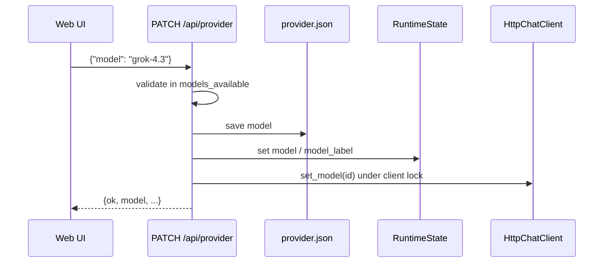
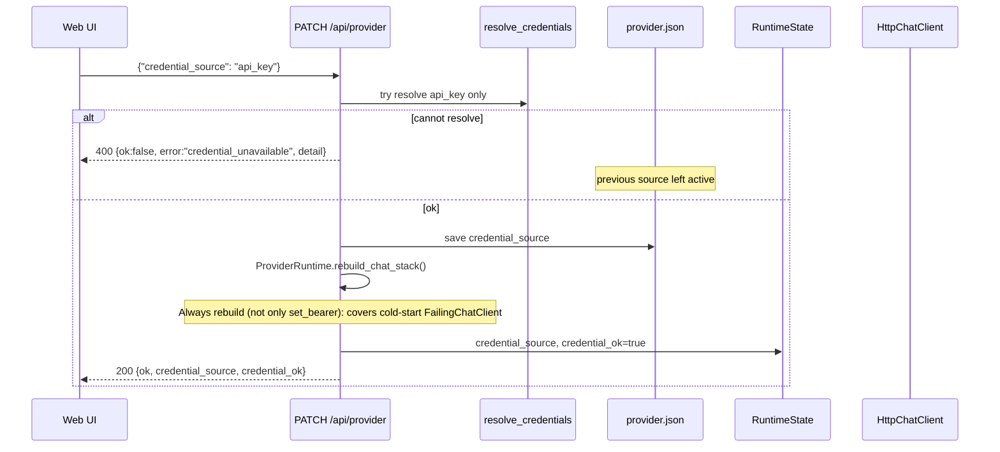

# Phase 0 Execution Design — Grok Provider Path, Credentials, Usage Meter, Status/UI

| Field | Value |
|-------|--------|
| **Document** | Phase 0 detailed execution plan (Grok path) |
| **Author** | (implementation) |
| **Date** | 2026-07-24 |
| **Status** | Implementation complete (PR stack 1–7) · Live smoke checklist ready for operator (not claimed green in-repo until operator-run against xAI) |
| **Integration branch** | **`grok-improvement`** (not `main`) |
| **Work branches** | All PR/feature branches **fork from and stack on** current `grok-improvement` |
| **Land target** | Every PR is **pushed and merged back into `grok-improvement`**; do **not** merge Phase 0 PRs to `main` until the operator promotes the whole branch later |
| **Supersedes (execution detail)** | `docs/grok-improvement-plan/phase-0.md` §§10–14 implementation steps (product decisions remain authoritative) |
| **Audience** | Senior engineers implementing stacked work on `grok-improvement` |

This document is the **implementable** source of truth for Phase 0: file-level map, interfaces, wire contracts, test plan, and ordered PR slices. Product decisions in the concept docs are treated as fixed.

### Branch & merge policy (normative)

| Rule | Detail |
|------|--------|
| **Base** | Create every Phase 0 work branch from the tip of **`grok-improvement`** (after fetch). Never base a Phase 0 PR on `main` or on an unrelated long-lived branch. |
| **Naming** | Prefer stack-friendly names, e.g. `grok-improvement/phase-0-pr1-settings`, `execute-plan/…` off `grok-improvement`, or Graphite-style stacked branches whose merge base is `grok-improvement`. |
| **Push** | Push each work branch to `origin` so review/CI can run. |
| **Merge target** | Open PRs with **base = `grok-improvement`**. Merge only into `grok-improvement` (merge commit, squash, or stack restack — any is fine as long as the result lands on that branch). |
| **End state** | When Phase 0 work is done, **all** PR branches for this effort are pushed, reviewed, and **merged down onto `grok-improvement`**. The integration branch tip is the single shippable Phase 0 result. |
| **Not in scope yet** | Promoting `grok-improvement` → `main` is a **separate** operator decision after Phase 0 success criteria hold. Do not auto-merge Phase 0 slices to `main`. |
| **Restack** | If `grok-improvement` moves (other commits), rebase/restack open Phase 0 PR branches onto the new tip before merge. |

---

## Overview

Project Elyra today is local-only: `ElyraSupervisor` starts `llama-server`, injects `GatedChatClient(HttpChatClient(LlamaServerConfig))` into `PresenceWorker`, and the glass shows llama-centric pills. There is no provider abstraction, no credential resolver, no usage meter, and no model/credential controls in the Web UI.

Phase 0 makes `elyra start` boot by default against **xAI Grok** using the **Grok Build session** at `~/.grok/auth.json`, with default model product-label **Grok 4.5 Fast** (wire id **`grok-4.5`**, decided), a hierarchical **usage meter** with hard stops (`weekly_allowed_tokens=5_000_000` ship default), an operator **hard-stop override** (default OFF), and glass controls for model + credential source + optional API key paste — without changing do-loop / presence / moment semantics, without turning continuous work on, and without implementing MC, `grok_build`, memory, TTS, or remote Glass.

**Solution shape:** thin adapters on the existing `ChatClient` protocol:

1. **Config** — `ProviderSettings` + `UsageSettings` in `elyra/settings.py`; runtime prefs under `data/runtime/`.
2. **UsageMeter** — pure hierarchy + atomic persist `data/runtime/usage.json`; wrap completions.
3. **Auth** — resolve active source only (`grok_build` | `api_key`); fail closed; never put secrets in status.
4. **HttpChatClient** — factories `for_local` / `for_xai`; bearer + `model` for xAI; omit Gemma-only wire fields when provider ≠ local.
5. **Supervisor** — skip llama for `xai`; build client stack; populate `RuntimeState`; share `ProviderRuntime` with API.
6. **API + SPA** — extend `/api/status` (live `meter.snapshot()`); `PATCH /api/provider`; `PUT`/`DELETE` API key; Status panel cards + provider pill.

---

## Background & Motivation

### Current state (codebase)

| Area | Reality |
|------|---------|
| LLM client | `elyra/llm/client.py`: `ChatClient` protocol, `HttpChatClient` (no `Authorization`, no `model` field), `GatedChatClient` (serializes via `LlamaServerGate`), `StubChatClient`. `ChatCompletionResult` has **no** `usage` field. |
| LLM config | `elyra/llm/config.py`: `LlamaServerConfig` → `http://{host}:{port}/v1/chat/completions`; Gemma sampling defaults (`top_p`/`top_k`/`thinking_budget_tokens`). |
| Supervisor | `elyra/runtime/supervisor.py`: always wants llama when `start_llama_server` (RuntimeConfig default **True** today); injects client into `PresenceWorker`. |
| Runtime state | `elyra/runtime/state.py`: only `llama_pid` / `llama_ready` / `llama_error` / `uptime_s`. |
| API status | `elyra/runtime/api.py` `GET /api/status` merges `RuntimeState.snapshot()` + `PresenceWorker.status_snapshot()` + home/gate/api URL. Continuous block already present. Handler has `do_GET` / `do_POST` / `do_PATCH` only — **no `do_PUT` / `do_DELETE` yet**. |
| Settings | `elyra/settings.py`: loop/wait/tools/goals/continuous + api_host/port/context_tokens. **No provider/usage sections.** Continuous default `enabled=False`. |
| CLI | `elyra/cli.py`: `--no-llama`, `--stub-llm`, api host/port, context-tokens. No provider/model flags. **Does not call `load_settings` today** — wiring settings into CLI/start is **new** Phase 0 work (PR1/PR5a). |
| Web UI | `elyra/runtime/web/{app.js,index.html,style.css}`: rail continuous toggle; pills `pill-llama` / worker / phase / autopilot; Status = continuous card + raw JSON. |
| Runtime prefs pattern | `data/runtime/continuous.json` via `load_continuous_runtime` / `save_continuous_enabled` in `elyra/loop/continuous_policy.py`. |
| Auth prototype | `scripts/prototype_xai_grok_auth_smoke.py` — proven path: `~/.grok/auth.json` → Bearer → `https://api.x.ai/v1`. Paths are `{API_BASE}/models` and `{API_BASE}/chat/completions` (**no second `/v1`**). Live models include `grok-4.5`; response `usage` includes `prompt_tokens` / `completion_tokens` / `total_tokens` / reasoning detail. **This script is the in-repo verification artifact for the default wire id.** |
| Prompts | `prompts/system.md` / `orient.md` already fitness-passed (usage-limit rest note present). **No further prompt work in Phase 0.** |
| Data gitignore | `data/` is gitignored — secrets and usage state stay local. |
| Do-loop errors | `run_do_loop` outer `except Exception` → always `stop_reason=error` (`STOP_ERROR`). Any hard-stop catch must be **before** that handler (or at the `chat_completion` call site inside the try body). |
| Continuous allowlist | `MOMENT_CONTINUE_STOP_ALLOWLIST` = `{no_tools, time_continue_declined, max_hops}` — excludes `policy` and `error`. |

### Pain points

1. Cannot run presence/do-loop against Grok without forking supervisor/client ad hoc.
2. No subscription protection if Grok path is added without a meter.
3. Glass cannot show or control provider/model/credentials; llama pill is wrong for xai default.
4. No reusable credential story for headless (`XAI_API_KEY`) vs operator session (`auth.json`) vs UI-pasted key.

### Why Phase 0 first

Engineering principles (`docs/dev/engineering-principles.md`): modular packages, small units, tests with the feature, defaults first. Concept plan: meter before sophistication; do-loop unchanged; continuous stays OFF.

---

## Goals & Non-Goals

### Goals

1. **Default `elyra start`** → provider `xai`, model Grok 4.5 Fast (wire id from config), credential source `grok_build`, continuous OFF, usage meter ON, no llama-server.
2. **Local path preserved** via `--provider local` / config (existing llama start + Gemma payload behaviour).
3. **Hierarchical usage hard stops** (week / day / 1-hour) with persistence; refuse new model work; stop mid-moment hops cleanly — **unless** operator hard-stop override is ON (default OFF).
4. **Credential sources** with active selection, no silent fallback; UI API key store; env headless path.
5. **Model selection** UI + config/CLI; persists; applies to subsequent completions only. Default wire id **`grok-4.5`** (label Grok 4.5 Fast) — decided.
6. **Honest glass**: provider/model/credential/usage/hard-stop/**override**/continuous visible; no secrets in status.
7. **Hermetic tests** per PR + live smoke checklist.
8. **Ship default `weekly_allowed_tokens = 5_000_000`** as the allowed-week ceiling (product intent ≈ 50% of real SuperGrok week). Dogfood may re-tune later as a process note — not a Phase 0 open question.
9. **Operator hard-stop override** (default OFF) so dogfood is not permanently bricked after a budget stop.

### Non-goals (Phase 0)

- MC implementation (naming only — see `metacognition.md`)
- `grok_build` tool, self-mod continuity, atomized memory
- Continuous policy changes (do not enable continuous as a side effect)
- Mid-moment multi-model routing
- Full browser OAuth / token refresh inside Elyra
- TTS/STT, remote Glass
- Expanding `STOP_REASONS` unless strictly required (use existing `policy`)
- Prompt rewrites unless live behaviour forces a follow-up
- **Orient-slice exposure of usage budgets** (concept optional; Phase 0 glass/status only — not injected into orient)
- Separate product mode for env credentials (env feeds `api_key` material only)
- Auto-enabling hard-stop override (must be explicit operator action; default OFF)

**Note:** Concept `phase-0.md` listed “no emergency override” as a non-goal. **Superseded** by operator decision: Phase 0 ships an explicit **hard-stop override** control (default OFF). Not a silent bypass — glass must show `usage.override_active`.

---

## Proposed Design

### High-level architecture

```text
                    ┌─────────────────────────────────────────────┐
                    │              ElyraSupervisor                 │
                    │  merge config; resolve creds; build stack    │
                    │  ProviderRuntime → API; skip llama if xai    │
                    └───────────────┬─────────────────────────────┘
                                    │
          ┌─────────────────────────┼─────────────────────────┐
          ▼                         ▼                         ▼
   RuntimeState              PresenceWorker              HTTP API
   provider/model            client: ChatClient          /api/status
   credential_*              model_available hook        PATCH /api/provider
   (no live usage cache)     run_do_loop(...)            PUT/DELETE api-key
          │                         │                         │
          └─────────────────────────┴────────────┬────────────┘
                                                 ▼
                                          Web glass SPA
```

**Client stack (xai, production):**

```text
PresenceWorker / do-loop
        │ chat_completion(...)
        ▼
UsageGatedChatClient          # can_call → inner → record(usage)  [elyra/llm/client.py]
        │
        ▼
HttpChatClient.for_xai(...)   # Bearer + model; xai payload shape
        │
        ▼
https://api.x.ai/v1/chat/completions
```

**Client stack (local):**

```text
UsageGatedChatClient
  → GatedChatClient(LlamaServerGate)     # serialize local llama HTTP
    → HttpChatClient.for_local(...)      # no Auth; Gemma fields
```

Meter wraps **all** real providers; when `usage.enabled=false`, gate is a no-op pass-through. `--stub-llm` uses `StubChatClient` (optionally usage-wrapped for tests).

**Import layout (cycle-free, normative):**

| Module | Owns | Imports |
|--------|------|---------|
| `elyra/llm/usage.py` | `TokenUsage`, `parse_token_usage`, `UsageMeter`, `UsageSnapshot`, `UsageHardStopError` | settings only — **never** imports `client` |
| `elyra/llm/client.py` | `ChatClient`, results, `HttpChatClient`, `GatedChatClient`, `StubChatClient`, `FailingChatClient`, **`UsageGatedChatClient`** | imports `TokenUsage` / `parse_token_usage` / `UsageMeter` / `UsageHardStopError` from `usage` |

Gate lives in `client.py` so it can type against `ChatClient` / `ChatCompletionResult` without `usage.py` importing `client.py`.

**Do-loop / presence:** `run_do_loop` gains a **dedicated** `except UsageHardStopError` before the broad `except Exception`. `PresenceWorker` gains optional `model_available` pre-claim hook (“safe to open a model-using moment”). Moment / wake / tool semantics otherwise unchanged.

### Config merge order (normative)

Single merge function used by CLI and supervisor:

```text
defaults  <  elyra.toml  <  data/runtime/provider.json  <  explicit CLI flags
```

Rules:

1. Start from `default_settings()`.
2. Apply `load_settings(home)` (toml).
3. Apply `load_provider_prefs(data_dir)` for `model` and `credential_source` only (non-secret runtime UI prefs). **Does not** override `provider.name` / base_url unless we later add those keys to prefs (Phase 0: model + credential_source only).
4. Apply **explicit** CLI flags only where argparse value is not `None` (`default=None` for optional overrides; do not use argparse defaults that clobber prefs).
5. Derive `start_llama_server = (provider.name == "local") and not stub_llm and not no_llama`.

`provider.json` never overrides an explicit CLI `--model` / `--credential-source`. UI writes only update `provider.json` (and live mutators); next process start reloads via step 3 unless CLI flags are passed.

### Sequence: cold start (`elyra start`)

```mermaid
sequenceDiagram
  participant CLI as cli.main
  participant Pref as provider.json
  participant Sup as ElyraSupervisor
  participant Auth as llm.auth
  participant Meter as UsageMeter
  participant PR as ProviderRuntime
  participant State as RuntimeState
  participant API as start_api_server
  participant W as PresenceWorker

  CLI->>CLI: settings = defaults < toml
  CLI->>Pref: load provider.json (model, credential_source)
  CLI->>CLI: merge prefs then explicit CLI flags only
  CLI->>Sup: RuntimeConfig(merged)
  Sup->>Auth: resolve(active_source only)
  alt provider=xai and not credential_ok
    Sup->>State: provider=xai, credential_ok=false, detail=...
    Sup->>Meter: UsageMeter.load(usage.json) still (budgets track when repaired)
    Sup->>Sup: client = FailingChatClient(detail)
    Note over Sup: Do not start llama. API still up. rebuild_chat_stack can repair later.
  else provider=xai and credential_ok
    Sup->>Meter: UsageMeter.load(usage.json)
    Sup->>Sup: UsageGatedChatClient(HttpChatClient.for_xai(...), meter)
    Sup->>State: provider/model/credential_* (no usage cache)
  else provider=local
    Sup->>Sup: start llama-server if start_llama_server
    Sup->>Sup: UsageGatedChatClient(GatedChatClient(HttpChatClient.for_local(...)))
  end
  Sup->>PR: ProviderRuntime(meter, clients, prefs, worker holder, ...)
  Sup->>W: PresenceWorker(client=..., model_available=PR.can_open_model_moment)
  Note over W: can_open = credential_ok and meter.can_call (xai); not meter-only
  Sup->>API: start_api_server(..., provider=PR)
  CLI->>CLI: print posture lines
```

### Sequence: live credential repair (FailingChatClient → real stack)

```mermaid
sequenceDiagram
  participant UI as Web UI
  participant API as PUT key / PATCH source
  participant PR as ProviderRuntime
  participant Auth as resolve_bearer
  participant W as PresenceWorker

  UI->>API: paste key and/or select api_key / grok_build
  API->>PR: put_api_key / apply_credential_source
  PR->>Auth: resolve active source
  alt still not ok
    PR->>PR: FailingChatClient; credential_ok=false
    API-->>UI: 400 or ok with credential_ok=false
  else ok
    PR->>PR: rebuild_chat_stack()
    Note over PR: ensure meter; HttpChatClient.for_xai; UsageGatedChatClient
    PR->>W: worker.client = new stack; model_available still PR.can_open_model_moment
    PR->>PR: refresh_models()
    API-->>UI: 200 credential_ok=true
  end
  Note over W: In-flight moment keeps old client ref until moment ends;<br/>next moment / next hop after rebuild uses worker.client
```

### Sequence: chat completion with meter gate

```mermaid
sequenceDiagram
  participant Loop as run_do_loop
  participant Gate as UsageGatedChatClient
  participant Meter as UsageMeter
  participant HTTP as HttpChatClient
  participant API as xAI / llama

  Loop->>Gate: chat_completion(messages, tools=...)
  Gate->>Meter: can_call()  # under meter lock
  alt hard_stop active and override OFF
    Meter-->>Gate: False + reason
    Gate-->>Loop: raise UsageHardStopError(reason, level=...)
    Note over Loop: except UsageHardStopError BEFORE except Exception
    Loop->>Loop: stop beat stop_reason=policy (STOP_POLICY)
  else allowed (under budget OR override ON)
    Gate->>HTTP: chat_completion(...)
    HTTP->>API: POST {base}/chat/completions
    API-->>HTTP: body + usage
    HTTP-->>Gate: ChatCompletionResult(usage=...)
    Gate->>Meter: record(usage)  # always; even when override ON
    Gate-->>Loop: result
  end
```

### Sequence: model switch



**Pickup rule:** active model/bearer read under a small lock at **request build time**. Next hop only; no worker restart. UI helper: “Applies to the next model call.”

### Sequence: credential switch



### Sequence: hard stop

```mermaid
sequenceDiagram
  participant Meter as UsageMeter
  participant Gate as UsageGatedChatClient
  participant W as PresenceWorker
  participant Loop as run_do_loop
  participant UI as GET /api/status

  Note over Meter: record() crosses hour/day/week ceiling; persist atomic
  alt in-flight hop
    Loop->>Gate: chat_completion
    Gate-->>Loop: UsageHardStopError
    Loop->>Loop: stop_reason=policy (dedicated except)
  else idle worker poll
    W->>Meter: model_available() / can_call()
    Meter-->>W: false
    W->>W: skip claim; wakes remain pending (never cancel)
  end
  UI->>Meter: snapshot() after refresh_windows()
  Note over UI: live usage.hard_stop non-null; glass shows limit / queue paused
```

---

## Exact config / CLI / runtime preference surface

### TOML — `elyra.toml` (optional sections)

```toml
[provider]
name = "xai"                              # "xai" | "local" — product default xai
model = "grok-4.5"                        # wire id; product label "Grok 4.5 Fast"
model_label = "Grok 4.5 Fast"             # UI display string
base_url = "https://api.x.ai/v1"          # OpenAI-compat root INCLUDING /v1 (smoke-compatible)
credential_source = "grok_build"          # "grok_build" | "api_key"
# Optional explicit path override (tests):
# grok_auth_path = "/home/me/.grok/auth.json"
# request_timeout_s = 120

[usage]
enabled = true
# weekly_allowed_tokens IS the Phase 0 enforcement ceiling for the allowed week
# (product intent = 50% of real SuperGrok weekly quota).
# Ship default 5_000_000 (decided). Dogfood may re-tune later as a process note.
weekly_allowed_tokens = 5_000_000
# weekly_allowed_fraction is POLICY DOCUMENTATION only — not used in enforcement math.
# Kept so elyra.toml can record the product target (0.50) next to the absolute ceiling.
weekly_allowed_fraction = 0.50
hour_block_minutes = 60
# Optional tighter dogfood:
# day_allowed_tokens = null   # default = weekly_allowed_tokens // 7
# hour_allowed_tokens = null  # default = day // (1440 // hour_block_minutes)
# hard_stop_override is NOT a toml ship-default ON — runtime flag only (default OFF).

[continuous]
enabled = false                           # unchanged product default
```

### Settings dataclasses (new)

```python
# elyra/settings.py (additions)

@dataclass(frozen=True)
class ProviderSettings:
    name: str = "xai"  # xai | local
    model: str = "grok-4.5"
    model_label: str = "Grok 4.5 Fast"
    base_url: str = "https://api.x.ai/v1"
    credential_source: str = "grok_build"  # grok_build | api_key
    grok_auth_path: str | None = None  # None → ~/.grok/auth.json
    request_timeout_s: float = 120.0

@dataclass(frozen=True)
class UsageSettings:
    enabled: bool = True
    # Enforcement ceiling (allowed week). Ship default decided: 5_000_000.
    weekly_allowed_tokens: int = 5_000_000
    # Informational only — product policy target (50% of real). Not multiplied
    # into ceilings until an external real-quota hook exists.
    weekly_allowed_fraction: float = 0.50
    hour_block_minutes: int = 60
    day_allowed_tokens: int | None = None
    hour_allowed_tokens: int | None = None
    # Note: hard_stop_override is a *runtime* preference (usage prefs / usage.json),
    # not a Settings ship default — always starts/ persists default False unless operator turns it ON.

@dataclass(frozen=True)
class Settings:
    loop: LoopSettings = ...
    wait: WaitSettings = ...
    tools: ToolsSettings = ...
    goals: GoalsSettings = ...
    continuous: ContinuousSettings = ...
    provider: ProviderSettings = field(default_factory=ProviderSettings)
    usage: UsageSettings = field(default_factory=UsageSettings)
    api_host: str = "127.0.0.1"
    api_port: int = 8787
    context_tokens: int | None = None
```

Validation in `_replace_section`:

- `provider.name` ∈ `{xai, local}`
- `provider.credential_source` ∈ `{grok_build, api_key}`
- `usage.weekly_allowed_fraction` in `(0, 1]` (stored for documentation; not used by meter math)
- `usage.weekly_allowed_tokens` > 0
- `usage.hour_block_minutes` ≥ 1

Wire `_apply_mapping` to handle `provider` and `usage` keys like `continuous`.

### CLI flags (`elyra start`)

| Flag | Effect |
|------|--------|
| `--provider {xai,local}` | Explicit override of `provider.name` (argparse default `None` → unset) |
| `--model ID` | Explicit override of wire model id |
| `--credential-source {grok_build,api_key}` | Explicit override of active source |
| `--no-usage-meter` | Force `usage.enabled=false` (debug) |
| `--no-llama` | Forces `start_llama_server=False` only. **Does not** force stub. When `provider=xai`, llama is already not started — emit a one-line stderr note: `note: --no-llama ignored (provider=xai does not start llama)`. |
| `--stub-llm` | Force `StubChatClient` (only flag that forces stub) |
| Existing `--api-host` / `--api-port` / `--context-tokens` | Unchanged |

**Breaking clarification vs today:** current code does `use_stub_llm = stub_llm or no_llama`. Phase 0 changes that coupling: `use_stub_llm = stub_llm` only. Operators who used `--no-llama` to get a stub without llama must pass `--stub-llm` (or `--provider local --no-llama --stub-llm` for the old local+stub posture). Update CLI help strings in PR5a.

**Startup print (example):**

```text
Elyra home:  /path
Web UI:      http://127.0.0.1:8787/
Provider:    xai  (model=grok-4.5 · source=grok_build · credential_ok=true)
Continuous:  off
Usage:       week 100% · day 100% · hour 100% remaining
```

If credential fails:

```text
Provider:    xai  (model=grok-4.5 · source=grok_build · credential_ok=false)
Credential:  missing auth.json — run `grok login` or paste API key in Status
```

### Runtime preference files under `data/runtime/`

| File | Owner | Contents | Notes |
|------|-------|----------|-------|
| `continuous.json` | existing | `{enabled, updated_at}` | Unchanged |
| `provider.json` | new | `{model?, credential_source?, updated_at}` | UI runtime prefs; **no secrets**; loses to explicit CLI |
| `usage.json` | new | meter counters **and** `hard_stop_override` (see schema) | Atomic write; survives full reset; override default `false` |

### Secret file (not under status)

| Path | Mode | Contents |
|------|------|----------|
| `data/secrets/xai_api_key` | `0600` file, dir `0700` | single-line raw API key |

Also accept env **`XAI_API_KEY`** when resolving `api_key` source if file missing (headless). Env is process material, not written by Elyra unless operator uses UI Save.

**Full reset (closed decision):** **preserve** `data/secrets/`, `data/runtime/provider.json`, `data/runtime/usage.json`, and `data/runtime/continuous.json`. Reset helpers today clear moments/messages/goals/wakes/sandbox/drafts and **must not** wipe `data/runtime/` wholesale (document invariant; add tests if missing). Update Status reset checklist HTML will-keep list accordingly.

---

## Module / file map

### New files

| Path | Responsibility |
|------|----------------|
| `elyra/llm/usage.py` | `TokenUsage`, `parse_token_usage`, `UsageMeter`, `UsageSnapshot`, `UsageHardStopError`, atomic load/save — **no client imports** |
| `elyra/llm/auth.py` | `load_grok_build_session`, `resolve_bearer`, `CredentialResolution`, API key file R/W/D (atomic secret write) |
| `elyra/llm/provider_prefs.py` | load/save `data/runtime/provider.json` |
| `elyra/llm/models.py` | curated allowlist, `list_remote_models`, label map, default wire id constants |
| `elyra/runtime/provider_runtime.py` | `ProviderRuntime` façade: rebuild_chat_stack, can_open_model_moment, shared by supervisor + API |
| `tests/test_llm_usage.py` | meter concurrency/atomic/corrupt recovery; import smoke with client |
| `tests/test_llm_auth.py` | credential resolve, no silent fallback, atomic secret perms |
| `tests/test_llm_provider_client.py` | payload shape, exact URL, usage parse, factories, **UsageGatedChatClient** |
| `tests/test_provider_api.py` | status live usage + PATCH/PUT/DELETE + **rebuild after Failing cold start** |
| `tests/test_presence_usage_gate.py` | hard-stop **and** !credential_ok pre-claim leave wake pending |

### Modified files

| Path | Changes |
|------|---------|
| `elyra/settings.py` | `ProviderSettings`, `UsageSettings`; load/merge |
| `elyra/llm/client.py` | `usage` on `ChatCompletionResult`; factories; mutator lock; `FailingChatClient`; **`UsageGatedChatClient`**; imports TokenUsage/parse/meter from `usage` only |
| `elyra/llm/config.py` | `XaiClientConfig` with correct path join |
| `elyra/runtime/config.py` | provider/usage fields; `start_llama_server` derived |
| `elyra/runtime/state.py` | provider/model/credential fields (**not** a live usage cache) |
| `elyra/runtime/supervisor.py` | provider branch; client stack; ProviderRuntime; skip llama |
| `elyra/runtime/api.py` | status merge; `do_PUT`/`do_DELETE`; provider routes; bind `ProviderRuntime` |
| `elyra/cli.py` | **new** `load_settings` + prefs + flag merge; posture print; `--no-llama` semantics |
| `elyra/presence/worker.py` | `model_available` constructor param; pre-claim check |
| `elyra/loop/doloop.py` | dedicated `except UsageHardStopError` → `STOP_POLICY` **before** `except Exception` |
| `elyra/runtime/web/*` | provider pill, Status cards, reset will-keep lines |
| `elyra/config.py` | ensure `data/secrets` on `ensure_data_dirs` |
| `tests/test_settings.py`, `test_doloop.py`, `test_api_glass.py` | as needed |

### Public APIs (signatures)

```python
# elyra/llm/usage.py  — leaf-ish meter module: NEVER import elyra.llm.client
# Cycle-free: client.py → usage.py only (one direction).

@dataclass(frozen=True)
class TokenUsage:
    prompt_tokens: int = 0
    completion_tokens: int = 0
    total_tokens: int = 0
    reasoning_tokens: int = 0

    @property
    def billable_tokens(self) -> int:
        """Prefer total_tokens; else prompt+completion; else 0."""
        ...

def parse_token_usage(raw: Any) -> TokenUsage | None:
    """Parse OpenAI-style response['usage'] dict; None if missing/unusable."""
    ...

@dataclass(frozen=True)
class UsageSnapshot:
    enabled: bool
    week_remaining_fraction: float
    day_remaining_fraction: float
    hour_remaining_fraction: float
    hard_stop: str | None          # None | "hour" | "day" | "week"
    # When override_active, hard_stop still reports the *would-be* level (glass honesty)
    # but can_call() returns True. hard_stop_reason may note "overridden".
    hard_stop_reason: str | None
    override_active: bool          # operator hard-stop override (default False)
    last_record_at: str | None
    week_used_tokens: int
    day_used_tokens: int
    hour_used_tokens: int
    week_limit_tokens: int
    day_limit_tokens: int
    hour_limit_tokens: int

class UsageHardStopError(RuntimeError):
    def __init__(self, reason: str, *, level: str) -> None:
        self.reason = reason
        self.level = level
        super().__init__(reason)

class UsageMeter:
    """Thread-safe hierarchical meter.

    All public methods take self._lock.
    Persist via write-temp + os.replace only.
    hard_stop_override (default False) is persisted in usage.json and survives restarts.
    """

    def __init__(
        self,
        path: Path,
        settings: UsageSettings,
        *,
        clock: Callable[[], datetime] | None = None,
    ) -> None: ...

    @classmethod
    def load(cls, data_dir: Path, settings: UsageSettings, **kwargs) -> UsageMeter:
        """Load usage.json. On missing file: zeroed windows, override_active=False.
        On corrupt/unreadable JSON: log WARNING, start zeroed windows,
        override_active=False (fail-soft; never invent override ON).
        """
        ...

    def can_call(self) -> bool:
        """True if meter disabled, or under budget, or hard_stop_override is ON.
        Override does NOT skip credential checks (those are can_open_model_moment).
        """
        ...

    def hard_stop_reason(self) -> str | None:
        """Would-be stop reason from budgets, even if override allows calls.
        None when under all ceilings.
        """
        ...

    def is_over_budget(self) -> bool:
        """True when any window is at/over ceiling (ignores override)."""
        ...

    def set_hard_stop_override(self, active: bool) -> UsageSnapshot:
        """Persist hard_stop_override to usage.json (atomic). Default path: False.
        Never silently defaults to True.
        """
        ...

    def record(self, usage: TokenUsage | None, *, estimated_if_missing: int = 0) -> UsageSnapshot:
        """Always records tokens when usage present — even if override_active.
        Recording is never disabled by override.
        """
        ...

    def refresh_windows(self) -> None: ...
    def snapshot(self) -> UsageSnapshot:
        """refresh_windows + immutable snapshot including override_active.
        Safe for /api/status.
        """
        ...


# elyra/llm/auth.py
@dataclass(frozen=True)
class CredentialResolution:
    ok: bool
    source: str
    token: str | None               # never log / never put in status
    detail: str | None
    expires_at: str | None
    email: str | None
    api_key_configured: bool

def default_grok_auth_path() -> Path: ...
def load_grok_build_session(path: Path | None = None) -> tuple[str, dict]: ...
def read_stored_api_key(data_dir: Path) -> str | None: ...
def write_stored_api_key(data_dir: Path, api_key: str) -> Path:
    """Atomic: write temp in same dir, os.chmod 0o600, os.replace onto final path."""
    ...
def delete_stored_api_key(data_dir: Path) -> bool: ...
def resolve_bearer(
    *,
    source: str,
    data_dir: Path,
    grok_auth_path: Path | None = None,
    env: Mapping[str, str] | None = None,
) -> CredentialResolution: ...


# elyra/llm/provider_prefs.py
@dataclass
class ProviderPrefs:
    model: str | None = None
    credential_source: str | None = None

def load_provider_prefs(data_dir: Path) -> ProviderPrefs: ...
def save_provider_prefs(data_dir: Path, prefs: ProviderPrefs) -> Path: ...


# elyra/llm/models.py
DEFAULT_XAI_MODEL = "grok-4.5"
DEFAULT_XAI_MODEL_LABEL = "Grok 4.5 Fast"
CURATED_XAI_MODELS: tuple[str, ...] = (
    "grok-4.5",
    "grok-4.3",
    "grok-4.20-0309-non-reasoning",
)
MODEL_LABELS: dict[str, str] = {"grok-4.5": "Grok 4.5 Fast", ...}

def list_remote_models(base_url: str, token: str, *, timeout: float = 30.0) -> list[str]:
    """GET {base_url.rstrip('/')}/models  — NOT /v1/models when base already ends in /v1."""
    ...

def models_for_picker(listed: list[str] | None, *, fallback: Sequence[str] = CURATED_XAI_MODELS) -> list[str]: ...
def label_for_model(model_id: str) -> str: ...


# elyra/llm/client.py
from elyra.llm.usage import (
    TokenUsage,
    UsageHardStopError,
    UsageMeter,
    parse_token_usage,
)  # usage.py must NOT import this module

@dataclass(frozen=True)
class ChatCompletionResult:
    content: str
    reasoning_content: str
    raw_json: str
    tool_calls: list[ToolCall] = field(default_factory=list)
    finish_reason: str | None = None
    usage: TokenUsage | None = None

class HttpChatClient:
    """Prefer factories — avoid inconsistent config+kwargs combos."""

    def __init__(self, *, profile: str, ...) -> None:
        """Internal. profile in {'local','xai'}."""
        self._lock = threading.Lock()  # guards model/bearer + request build
        ...

    @classmethod
    def for_local(cls, config: LlamaServerConfig | None = None) -> HttpChatClient: ...

    @classmethod
    def for_xai(
        cls,
        config: XaiClientConfig | None = None,
        *,
        model: str,
        bearer_token: str,
    ) -> HttpChatClient: ...

    def set_model(self, model: str) -> None:
        """Thread-safe; next chat_completion uses new model."""
        ...

    def set_bearer_token(self, token: str | None) -> None:
        """Thread-safe; never log token."""
        ...

    def chat_completion(...) -> ChatCompletionResult:
        # Under self._lock only for reading model/bearer into local vars, then
        # release before HTTP I/O (do not hold lock across network).
        # xai: Authorization Bearer; body includes model; omit top_k /
        # thinking_budget_tokens / reasoning wire keys.
        # local: existing Gemma payload behaviour.
        # Parse usage via parse_token_usage.
        # On HTTPError: raise RuntimeError with body slice; NEVER include
        # Authorization header values in the message.
        ...

class UsageGatedChatClient:
    """ChatClient wrapper in client.py (not usage.py) — cycle-free layout.

    refuse when !meter.can_call → raise UsageHardStopError
      (can_call is True when override_active even if over budget);
    on success → meter.record(result.usage) always (override does not skip record).
    When meter disabled / None, pass through.
    """

    def __init__(self, inner: ChatClient, meter: UsageMeter) -> None: ...
    def chat_completion(self, messages, **kwargs) -> ChatCompletionResult: ...

class FailingChatClient:
    """Required when provider=xai and credentials cannot resolve.

    chat_completion always raises RuntimeError with a stable, non-secret
    message (includes credential_detail). Never echoes user content.
    Live repair: ProviderRuntime.rebuild_chat_stack() replaces worker.client.
    """

    def __init__(self, detail: str) -> None: ...
    def chat_completion(self, messages, **kwargs) -> ChatCompletionResult:
        raise RuntimeError(f"llm unavailable: {self.detail}")


# elyra/runtime/provider_runtime.py
@dataclass
class ProviderRuntime:
    """Shared live handles for API + supervisor (not serialized to status)."""

    meter: UsageMeter | None
    http_client: HttpChatClient | None  # None if Failing/Stub only
    chat_client: ChatClient             # outermost client currently on worker
    worker: PresenceWorker              # for rebinding worker.client after rebuild
    usage_settings: UsageSettings
    xai_config: XaiClientConfig | None
    prefs_path: Path
    data_dir: Path
    provider_name: str
    model: str
    model_label: str
    credential_source: str
    credential_ok: bool
    credential_detail: str | None
    credential_expires_at: str | None
    credential_email: str | None
    api_key_configured: bool
    models_available: list[str]
    base_url: str
    grok_auth_path: Path | None
    _lock: threading.Lock = field(default_factory=threading.Lock)

    def status_provider_fields(self) -> dict[str, Any]:
        """Non-secret provider block for /api/status."""
        ...

    def usage_status_block(self) -> dict[str, Any]:
        """Live meter.snapshot() or disabled placeholder. Called every GET."""
        ...

    def can_open_model_moment(self) -> bool:
        """Pre-claim gate: safe to open a model-using moment.

        provider=xai: credential_ok and (meter.can_call() if meter enabled else True
          when usage disabled; if meter missing treat as False until rebuild loads it).
          meter.can_call() is True when under budget OR hard_stop_override ON.
        provider=local: meter.can_call() if enabled else True (llama readiness is
          separate; worker still needs a real client).
        Never opens moments that would only hit FailingChatClient noise.
        """
        ...

    def set_hard_stop_override(self, active: bool) -> dict[str, Any]:
        """Delegate to meter.set_hard_stop_override; return usage status block."""
        ...

    def rebuild_chat_stack(self) -> None:
        """Normative live repair / rebind after credential or model material changes.

        1. resolve_bearer(active source); update credential_* fields.
        2. If not ok: chat_client = FailingChatClient(detail); http_client = None;
           credential_ok=False; bind worker.client; return.
        3. Ensure meter: UsageMeter.load if self.meter is None.
        4. Build HttpChatClient.for_xai(model=self.model, bearer=token) (or local path).
        5. Outer = UsageGatedChatClient(http, meter) when usage.enabled else http.
        6. Under short critical section: set self.http_client, self.chat_client,
           self.worker.client = self.chat_client.
           model_available stays bound to self.can_open_model_moment (method;
           no rebind needed if worker holds the bound method / callable on PR).
        7. refresh_models() best-effort.

        In-flight moment: do-loop may still hold the previous client reference for
        the current moment — intentional. Next moment (and worker.client for new
        run_do_loop calls) sees the rebuilt stack. Matches model pickup rules.
        """
        ...

    def refresh_models(self) -> list[str]: ...
    def apply_model(self, model: str) -> None:
        """Validate, persist prefs, set_model on http_client if present,
        else rebuild_chat_stack if credential_ok."""
        ...
    def apply_credential_source(self, source: str) -> CredentialResolution:
        """Resolve target first; on ok persist + rebuild_chat_stack(); on fail leave previous."""
        ...
    def put_api_key(self, api_key: str) -> None:
        """write_stored_api_key (atomic); api_key_configured=True;
        if active source is api_key (or becomes selectable): rebuild_chat_stack().
        Does not auto-switch source (product rule) — but if source already api_key,
        rebuild so cold-start Failing path becomes live."""
        ...
    def delete_api_key(self) -> None:
        """Delete file; if active source api_key and no env: rebuild → Failing."""
        ...
```

**`XaiClientConfig` (in `elyra/llm/config.py`) — URL join rules (normative):**

```python
@dataclass(frozen=True)
class XaiClientConfig:
    # OpenAI-compatible root INCLUDING /v1 (matches smoke API_BASE).
    base_url: str = "https://api.x.ai/v1"
    # Paths are RELATIVE TO base_url — do NOT repeat /v1.
    chat_path: str = "/chat/completions"
    models_path: str = "/models"
    connect_timeout: float = 10.0
    read_timeout: float = 120.0
    temperature: float = 0.7
    top_p: float | None = None
    top_k: int | None = None  # always omit for xai even if set
    use_reasoning: bool = False

    @staticmethod
    def _join(base: str, path: str) -> str:
        return base.rstrip("/") + (path if path.startswith("/") else f"/{path}")

    @property
    def chat_url(self) -> str:
        # → https://api.x.ai/v1/chat/completions
        return self._join(self.base_url, self.chat_path)

    @property
    def models_url(self) -> str:
        # → https://api.x.ai/v1/models
        return self._join(self.base_url, self.models_path)

    @property
    def request_timeout(self) -> float:
        return max(self.connect_timeout, self.read_timeout)
```

Hermetic test **must** assert exact URL `https://api.x.ai/v1/chat/completions` (and models URL without doubled `/v1`).

Keep `LlamaServerConfig` unchanged for local regression.

---

## Credential storage design

### Sources

| Source id | Material | Resolve path |
|-----------|----------|--------------|
| `grok_build` | OIDC access token | `~/.grok/auth.json` (or `provider.grok_auth_path`): same shape as smoke — root dict of entries; first entry or flat; `key` or `access_token` |
| `api_key` | xAI API key | 1) `data/secrets/xai_api_key` if non-empty; 2) else env `XAI_API_KEY` |

Env is **not** a separate product source id (matches concept: same material as `api_key`).

### Resolution rules (normative)

1. Read **active source** from merged config: `defaults < toml < provider.json < explicit CLI`.
2. Resolve **only** that source. **No silent fallback** to the other source or to local.
3. If fail: `credential_ok=false`, `credential_detail` set (e.g. `missing_auth_json`, `token_expired`, `missing_api_key`), log at WARNING, status honest, use **`FailingChatClient`** (never stub-echo).
4. If `grok_build` and `expires_at` parseable and in the past → not ok, detail `token_expired`. Phase 0 does **not** implement refresh with `refresh_token`.
5. Switching source via API: resolve target first; only persist if ok.
6. Optional: `GET /api/status` may re-check expiry time (no re-read of token body required if `expires_at` cached on `ProviderRuntime`); if past, set `credential_ok=false` in the response fields (update ProviderRuntime under lock).

### What is / is not written

| Write | Path | When |
|-------|------|------|
| Yes | `data/secrets/xai_api_key` | PUT API key from UI |
| Yes | `data/runtime/provider.json` | model / credential_source changes |
| Yes | `data/runtime/usage.json` | meter records (atomic) |
| No | `auth.json` | Elyra never writes Grok Build session |
| No | status / logs (info) | raw tokens or keys |
| No | request logs for api-key routes | never log PUT body |

### Status fields (never secrets)

```json
{
  "credential_source": "grok_build",
  "credential_ok": true,
  "credential_detail": null,
  "credential_expires_at": "2026-07-24T01:39:59Z",
  "credential_email": "user@example.com",
  "api_key_configured": false
}
```

`credential_email` is PII acceptable for local glass only. `api_key_configured` = file non-empty **or** env set (boolean only).

### Permissions (atomic secret write — normative)

Same durability pattern as `usage.json` (not “when possible”):

```python
secrets_dir = data_dir / "secrets"
secrets_dir.mkdir(mode=0o700, parents=True, exist_ok=True)
final = secrets_dir / "xai_api_key"
tmp = secrets_dir / "xai_api_key.tmp"
# exclusive create when feasible; write payload
tmp.write_text(key.strip() + "\n", encoding="utf-8")
os.chmod(tmp, 0o600)
os.replace(tmp, final)  # atomic on POSIX
# final mode 0o600 (replace preserves tmp mode on most systems; chmod final too)
os.chmod(final, 0o600)
```

Tests assert mode on POSIX and that readers never observe a partial key file under concurrent write (replace is atomic).

---

## Model selection design

### Defaults

| Layer | Value |
|-------|--------|
| Product label | Grok 4.5 Fast |
| Default wire id | `grok-4.5` — verified via `scripts/prototype_xai_grok_auth_smoke.py` against live `GET /v1/models` (2026-07-24) |
| Config field | `provider.model` / `provider.model_label` |

Single constant in `elyra/llm/models.py`; config-owned for drift.

### `models_available` population

1. If `provider=xai` and `credential_ok`: `GET {base_url.rstrip("/")}/models` with Bearer (i.e. `XaiClientConfig.models_url`).
2. Filter non-chat ids: contains `image`, `tts`, `stt`, `voice`, `imagine`.
3. If empty/fail: fall back to `CURATED_XAI_MODELS`.
4. Ensure current `model` is in the list (prepend if missing).
5. `provider=local`: single entry `"local"`; picker disabled/hidden.

Refresh: supervisor start; successful `rebuild_chat_stack` / credential switch / API key save when credential_ok.

### PATCH semantics

`PATCH /api/provider` — at least one of `model` / `credential_source`.

- Unknown model (not in `models_available`) → **400** `unknown_model`.
- Credential switch fail → **400** `credential_unavailable`; previous source remains.
- On success: persist prefs and call **`rebuild_chat_stack()`** (or `set_model` only when `http_client` already exists **and** only model changed — still acceptable to always rebuild for simplicity). Never only `set_bearer` when `http_client is None` (Failing cold start).
- Response never echoes secrets.

### Mutator concurrency

API threads may call `set_model` / `set_bearer_token` while the worker is between hops. `HttpChatClient` uses a lock around mutators and around **copying** model/bearer into locals at request build; HTTP I/O proceeds without holding the lock. Single-writer is not assumed; lock is required.

---

## Usage meter algorithm

### Policy math (enforcement)

```text
allowed_week = usage.weekly_allowed_tokens
               # THIS is the allowed-week ceiling (product intent ≈ 50% of real).
               # weekly_allowed_fraction is NOT multiplied here.

allowed_day  = day_allowed_tokens if set else (allowed_week // 7)
allowed_hour = hour_allowed_tokens if set else (
                 allowed_day // max(1, 1440 // hour_block_minutes)
               )
               # hour_block_minutes=60 → day/24
```

Hard stop after `refresh_windows` when any used ≥ limit. Display precedence: week > day > hour.

`weekly_allowed_fraction` remains on the settings surface as **policy documentation** so operators can record the 0.50 product target next to the absolute ceiling. Meter code must not read it for math. Docstring + settings comment make this explicit. When an external real-quota hook lands later, fraction can become operational.

### Token attribution

Prefer response `usage` via `parse_token_usage` (proven on xAI). Missing usage → record `estimated_if_missing` (default **0**); DEBUG log once. SuperGrok protection relies on real xAI usage fields.

### Persistence schema `data/runtime/usage.json`

```json
{
  "schema_version": 1,
  "week_id": "2026-W30",
  "day_id": "2026-07-24",
  "hour_id": "2026-07-24T14",
  "week_used_tokens": 12000,
  "day_used_tokens": 3000,
  "hour_used_tokens": 500,
  "last_record_at": "2026-07-24T14:22:01Z",
  "last_hard_stop": null,
  "last_hard_stop_reason": null,
  "hard_stop_override": false
}
```

Window ids UTC: ISO week, calendar day, hour block (`YYYY-MM-DDTHH` for 60m).

`hard_stop_override` defaults **false** when missing (backward-compatible load). Never load-missing as true.

### Hard-stop override (operator control — decided)

| Rule | Detail |
|------|--------|
| Default | **OFF** (`hard_stop_override=false`). No silent ON. |
| Persist | `data/runtime/usage.json` field `hard_stop_override` (with meter counters). Survives restarts. |
| When OFF | `can_call()` false if any window over ceiling → gate raises; pre-claim skips. |
| When ON | `can_call()` true even if over budget. **Recording continues** (`record` always runs). |
| Status | Always expose `usage.override_active` (bool) and still expose would-be `hard_stop` / `hard_stop_reason` when over budget so glass stays honest. |
| API | `PATCH /api/usage` body `{ "hard_stop_override": true\|false }` (dedicated contract; not mixed into provider model PATCH). |
| UI | Explicit toggle on Usage budget card; default unchecked; clear “budget override” labeling. |
| Full reset | **Preserve** `usage.json` including override flag (same as counters). |
| Does not affect | credential_ok, continuous, secrets |

### Concurrency & durability (normative)

| Rule | Detail |
|------|--------|
| Lock | `threading.Lock` inside `UsageMeter` covers `can_call`, `record`, `snapshot`, `refresh_windows`, `set_hard_stop_override`, load helpers that mutate |
| Atomic persist | Write `usage.json.tmp` then `os.replace` to `usage.json` |
| Corrupt load | WARNING log; start **zeroed** windows (fail-soft); **override_active=False**. Do not invent hard_stop or override ON. |
| Cross-thread | Presence thread records; API thread snapshots / override toggle — lock serializes |

### Hard-stop behaviour vs moments / wakes

| Situation | Behaviour |
|-----------|-----------|
| Idle + `!can_open_model_moment` | Do **not** claim. Covers **usage hard stop (override OFF)** and **`!credential_ok`**. Wakes stay **pending** (never cancel). Timers still rehydrate via `_fire_due_unlocked`. Log skip at most once/minute (reason: usage vs credential). |
| Idle + over budget + **override ON** | `can_call` true → claims proceed; usage still recorded; status shows hard_stop would-be level + `override_active=true`. |
| In-flight next hop (usage, override OFF) | Gate raises `UsageHardStopError` |
| In-flight next hop (override ON) | Completions allowed; still `record` |
| do-loop | See catch placement below → `stop_reason=policy` when gate raises |
| Graceful tool finish | May finish in-flight tool batch without new completion; cannot issue another completion if override OFF and hard-stopped |
| Hard-stop override | **Operator control, default OFF** (see above). Not automatic. |
| Cold start FailingChatClient | Pre-claim blocks via `!credential_ok` — **no noise error moments** on every glass message. Status shows `credential_ok=false`. After UI repair + `rebuild_chat_stack`, claims resume. |

#### PresenceWorker constructor (normative)

```python
class PresenceWorker:
    def __init__(
        self,
        *,
        paths: ElyraPaths,
        client: ChatClient,
        stop_event: threading.Event,
        poll_seconds: float = 0.1,
        settings: Settings | None = None,
        queue: WakeQueue | None = None,
        timers: TimerService | None = None,
        moments: MomentStore | None = None,
        registry: ToolRegistry | None = None,
        sandbox: Sandbox | None = None,
        speak: SpeakTransport | None = None,
        goals: GoalsStore | None = None,
        skills: SkillCatalog | None = None,
        run_do_loop_fn: RunDoLoopFn | None = None,
        model_available: Callable[[], bool] | None = None,  # NEW
    ) -> None:
        self.client = client  # rebindable: ProviderRuntime.rebuild_chat_stack sets this
        self._model_available = model_available or (lambda: True)
```

In `_claim_and_open`: if not `self._model_available()`, return `None` without calling claim (wakes untouched).

**Supervisor wiring of the hook (normative):**

```python
# Always prefer ProviderRuntime.can_open_model_moment for provider=xai
worker = PresenceWorker(
    ...,
    client=provider_runtime.chat_client,
    model_available=provider_runtime.can_open_model_moment,
)
```

`can_open_model_moment` is **not** `meter.can_call` alone. Definition:

```text
provider=xai:
  credential_ok
  AND (not usage.enabled OR meter is not None and meter.can_call())
  # can_call is true when under budget OR hard_stop_override ON
provider=local:
  (not usage.enabled OR meter.can_call())
  # optional: also require llama_ready — out of scope if existing stub path remains
```

Glass:

- non-null `usage.hard_stop` **and** `override_active=false` → **queue paused for budget**
- non-null `usage.hard_stop` **and** `override_active=true` → banner “over budget — override ON”; queue **not** paused
- `credential_ok=false` → **auth paused** (override does not help)

Hermetic tests:

1. Hard-stopped meter + pending wake → no claim, wake still pending.
2. `credential_ok=false` + pending wake → no claim, wake still pending (no error moment tape).
3. After rebuild makes credential_ok true → claim proceeds on next poll.

#### do-loop catch placement (normative)

Verified: `run_do_loop` ends with:

```python
try:
    return _run_loop_body(...)  # name illustrative
except Exception as exc:
    # → STOP_ERROR
```

**Required shape** (either equivalent):

**Option A (preferred):** outer handler split:

```python
try:
    return _run_loop_body(...)
except UsageHardStopError as exc:
    _append_beat(moments, moment_id, {
        "type": "stop",
        "stop_reason": STOP_POLICY,  # elyra.loop.stop.STOP_POLICY == "policy"
        "error": f"usage_hard_stop:{exc.level}:{exc.reason}",
    })
    return DoLoopResult(stop_reason=STOP_POLICY, hop_count=..., error=str(exc), ...)
except Exception as exc:
    # existing STOP_ERROR path
```

**Option B:** at the `client.chat_completion` call site inside the body, catch `UsageHardStopError`, append stop beat, return `DoLoopResult(stop_reason=STOP_POLICY, ...)` so it never hits the outer handler.

Import `UsageHardStopError` from `elyra.llm.usage` and `STOP_POLICY` from `elyra.loop.stop`. Hermetic test: scripted/gated client raises → `stop_reason == "policy"` (not `"error"`).

Continuous will not auto-chain (`policy` ∉ allowlist).

### Hook for real remaining (later)

Out of Phase 0 code. Local absolute ceiling only.

---

## Supervisor wiring

### Decision table

| Condition | llama-server | Client |
|-----------|--------------|--------|
| `provider=xai` and not stub and credential_ok | **Do not start** | `UsageGatedChatClient(HttpChatClient.for_xai(...), meter)` |
| `provider=xai` and not credential_ok | **Do not start** | **`FailingChatClient(detail)` required** (never stub-echo). Still load **meter**. `model_available` false until repair. Live UI repair calls **`rebuild_chat_stack()`** — no process restart required. |
| `provider=local` and start_llama and ready | Start + health | `UsageGatedChatClient(GatedChatClient(HttpChatClient.for_local(...), gate), meter)` |
| `provider=local` and llama fail | — | Existing: warn + StubChatClient |
| `--stub-llm` | no llama if also no start | StubChatClient |

### `RuntimeConfig` extensions

```python
@dataclass
class RuntimeConfig:
    api_host: str = "127.0.0.1"
    api_port: int = 8787
    start_llama_server: bool = False  # True only when provider=local and not --no-llama and not pure stub path
    llama: LlamaServerConfig = field(default_factory=LlamaServerConfig)
    llama_health_timeout: float = 180.0
    context_tokens: int | None = None
    provider_name: str = "xai"
    model: str = "grok-4.5"
    model_label: str = "Grok 4.5 Fast"
    base_url: str = "https://api.x.ai/v1"
    credential_source: str = "grok_build"
    usage: UsageSettings = field(default_factory=UsageSettings)
```

### ProviderRuntime ownership

Supervisor always constructs `UsageMeter.load` (even when `credential_ok` is false, so repair keeps window state), builds the initial client stack (Failing or gated Http), constructs `ProviderRuntime` with a reference to `PresenceWorker` (set `worker` immediately after worker construction if needed), and passes it to `start_api_server(..., provider=runtime)`.

`RuntimeState` holds stable provider/credential labels for debugging but **must not** be the sole source of usage fractions. Secrets never land on `RuntimeState`.

**Live repair contract:** any successful transition that makes `credential_ok` true after it was false **must** call `rebuild_chat_stack()` so `worker.client` is no longer `FailingChatClient`. Operators can paste a key + select source **without** restarting `elyra`.

### Merge gate (supervisor default)

**No PR may set product default `provider=xai` in supervisor/CLI without `UsageGatedChatClient` on the stack.** PR5a checklist item; PR1 settings defaults alone do not change runtime behaviour until supervisor wires them.

---

## API contracts

### `start_api_server` extension

```python
def start_api_server(
    config: RuntimeConfig,
    *,
    paths: ElyraPaths,
    gate: LlamaServerGate,
    state: RuntimeState,
    worker: PresenceWorker,
    provider: ProviderRuntime | None = None,  # NEW
    goals: GoalsStore | None = None,
    moments: MomentStore | None = None,
    identity: IdentityStore | None = None,
    users: UsersStore | None = None,
    tools: ToolRegistry | None = ...,
    skills: SkillCatalog | None = ...,
) -> tuple[ThreadingHTTPServer, threading.Thread]:
```

Handler binds `provider` like `worker` / `state`. When `provider is None` (legacy tests), status omits new fields or fills safe defaults.

### Handler methods

Add:

```python
def do_PUT(self) -> None:   # /api/provider/api-key
def do_DELETE(self) -> None:  # /api/provider/api-key
```

Keep existing `do_PATCH` for `/api/provider` and `/api/continuous`.

**Logging:** api-key routes must never log request bodies. Handler `log_message` already no-ops; do not add body dumps. HTTP error paths must not include `Authorization` values.

### `GET /api/status` (additive fields)

```json
{
  "provider": "xai",
  "model": "grok-4.5",
  "model_label": "Grok 4.5 Fast",
  "models_available": ["grok-4.5", "grok-4.3"],
  "credential_source": "grok_build",
  "credential_ok": true,
  "credential_detail": null,
  "credential_expires_at": "…",
  "credential_email": "…",
  "api_key_configured": false,
  "llama_ready": false,
  "llama_error": null,
  "llama_busy": false,
  "usage": {
    "enabled": true,
    "week_remaining_fraction": 0.99,
    "day_remaining_fraction": 0.95,
    "hour_remaining_fraction": 0.90,
    "hard_stop": null,
    "hard_stop_reason": null,
    "override_active": false,
    "last_record_at": "…",
    "week_used_tokens": 12000,
    "day_used_tokens": 3000,
    "hour_used_tokens": 500
  },
  "continuous": { "enabled": false, "…": "…" },
  "phase": "idle"
}
```

**Usage freshness (normative):** every `GET /api/status` merges:

```python
snap = self.state.snapshot()
snap.update(self.worker.status_snapshot())
if self.provider is not None:
    snap.update(self.provider.status_provider_fields())
    snap["usage"] = self.provider.usage_status_block()  # → meter.snapshot()
```

Do **not** rely on worker write-through of remaining % into `RuntimeState`. Hard-stop appearance on glass does not require a separate state refresh path.

**Invariant:** response must not contain secrets / bearer. Tests scan for configured test key.

### `PATCH /api/provider`

Body: `{ "model"?: string, "credential_source"?: "grok_build"|"api_key" }` — at least one required.

**200** `{ok, model, model_label, credential_source, credential_ok, ...}`  
**400** `unknown_model` | `invalid_credential_source` | `credential_unavailable` | `model or credential_source required`  
**503** `resetting` when applicable

### `PUT /api/provider/api-key`

Body: `{ "api_key": "..." }` — non-empty. Atomic write 0600. Do not auto-switch source. If **active** source is already `api_key`, call `rebuild_chat_stack()` so a cold-start Failing client becomes live. Response `{ok: true, api_key_configured: true, credential_ok: ...}` only (no secret).

### `DELETE /api/provider/api-key`

Remove file. If active source `api_key` and no env → `rebuild_chat_stack()` → `credential_ok=false` + FailingChatClient; **do not** silent-switch to `grok_build`. Response includes `api_key_configured` / `credential_ok`.

### `PATCH /api/usage`

Body:

```json
{ "hard_stop_override": true }
```

- Only field: `hard_stop_override` (bool, required).
- Calls `meter.set_hard_stop_override(value)` → atomic persist in `usage.json`.
- Does **not** reset counters; does **not** change credential_source.
- Response **200**:

```json
{
  "ok": true,
  "usage": { "...": "full usage status block including override_active, hard_stop, fractions" }
}
```

- **400** if missing/non-bool: `hard_stop_override required` / `hard_stop_override must be a boolean`
- **503** if meter unavailable / resetting when applicable

Default at first boot: override false (no body needed).

### Error codes (summary)

| HTTP | error | When |
|------|-------|------|
| 400 | `model or credential_source required` | empty PATCH provider |
| 400 | `unknown_model` | model not available |
| 400 | `invalid_credential_source` | bad enum |
| 400 | `credential_unavailable` | switch fails resolve |
| 400 | `api_key required` | empty PUT |
| 400 | `hard_stop_override required` | empty/missing PATCH usage |
| 400 | `hard_stop_override must be a boolean` | bad type |
| 404 | `not found` | unknown path |
| 503 | `resetting` | full reset in progress |

---

## Web UI changes

Files: `elyra/runtime/web/{index.html,app.js,style.css}` only.

### Rail pills

Keep id `pill-llama` for less churn; **display** provider-aware text:

- xai + ok + under budget (or override ON) → `xai ready` / `xai busy`
- xai + !ok → `xai auth`
- xai + hard_stop + override OFF → `xai limit` (queue paused)
- xai + hard_stop + override ON → `xai ovrd` or `xai limit*` (busy-capable; distinct from auth)
- local + ready → llama ready/busy
- stub → `stub llm`

Worker / phase / continuous pills unchanged. When `usage.hard_stop` non-null and override OFF, pending queue is paused (Status banner). When override ON, banner warns “over budget — override ON”.

### Status panel cards

1. **Provider / model** — text + model select + credential source select + API key password/Save/Clear  
   Helper: “Model applies to next call. API key save does not switch source until you select it.”
2. **Usage budget** — week/day/hour %; hard-stop banner; **Hard-stop override** toggle (default OFF)  
   Helper: “When ON, model calls continue past budget limits. Usage is still recorded. Default OFF.”
3. **Continuous** — existing; visible at OFF
4. Raw JSON

### Reset checklist (required HTML edit)

Add will-keep lines:

- `data/secrets/` (API key)
- `data/runtime/provider.json` (model / credential source prefs)
- `data/runtime/usage.json` (usage meter + hard-stop override flag — subscription protection)
- existing continuous / identity / skills/local lines

Confirm copy does **not** claim runtime dir is wiped.

### JS

- `refreshStatus` renders live usage + `override_active` from each poll
- PATCH/PUT/DELETE provider wiring; clear password field after save
- `PATCH /api/usage` on override toggle (same in-flight guard pattern as continuous)
- Notice on hard_stop transition; notice when override turns ON

---

## Test plan

### Hermetic unit / integration

| Test file | Coverage |
|-----------|----------|
| `tests/test_settings.py` | defaults; toml; fraction informational; merge helpers |
| `tests/test_llm_usage.py` | accumulate; rollover; hard stop; **override default false**; **override ON → can_call true when over budget**; **record still increments under override**; **lock safety**; **atomic replace**; **corrupt load → zeroed + override false + WARNING**; disabled always allows; restart persistence of override |
| `tests/test_llm_auth.py` | nested/flat auth; no cross-source fallback; **atomic** secret write 0600; expire |
| `tests/test_llm_provider_client.py` | **exact** chat URL; factories; usage parse; **UsageGatedChatClient** in client; FailingChatClient; `import elyra.llm.client; import elyra.llm.usage` smoke (no cycle) |
| `tests/test_provider_api.py` | live meter snapshot; no secret leak; PATCH/PUT/DELETE provider; **PATCH /api/usage hard_stop_override**; status `override_active`; **Failing cold start → rebuild**; continuous OFF |
| `tests/test_doloop.py` | `UsageHardStopError` → `stop_reason == "policy"` not `error` |
| `tests/test_presence_usage_gate.py` | hard-stop + pending wake → no claim; **override ON → claim proceeds when over budget**; **`!credential_ok` + pending wake → no claim**; after rebuild claims resume; timers still fire |
| Local regression | existing client/supervisor paths |

### Live smoke checklist

**Audience:** operator with a real SuperGrok / Grok Build session and (optionally) an xAI API key.  
**In-repo claim:** Phase 0 **implementation is complete**; this checklist is **ready for operator** execution. Do **not** record “live smoke passed” in docs unless the steps below were actually run against xAI.

| # | Check | Pass criteria |
|---|--------|----------------|
| 1 | Auth pathfinding | `scripts/prototype_xai_grok_auth_smoke.py` succeeds against live xAI |
| 2 | **Ship defaults** | `elyra start` (no flags): provider **xai**, model **`grok-4.5`** / **Grok 4.5 Fast**, credential_source **`grok_build`**, continuous **off**, usage meter live in status, **llama-server not started**, **`weekly_allowed_tokens=5_000_000`** |
| 3 | Social + tools | Social moment succeeds; tool-using moment succeeds on Grok |
| 4 | Model switch | UI/CLI model change applies to the **next** completion only |
| 5 | Credential live repair | Start without valid creds (or rename `auth.json`) → `credential_ok=false`, messages do **not** open error moments (queue paused). Paste API key + select **`api_key`** → `credential_ok=true`, next message on real stack. Switch back to **`grok_build`** when session valid. No process restart required. |
| 6 | Hard stop | Tiny temporary budget (or force record) → hard stop in UI; claims skipped; continuous remains off; **override OFF by default** |
| 7 | **Override path** | Turn hard-stop override **ON** → model calls resume; status `override_active=true`; counters still climb. Turn **OFF** → stop re-enforced if still over budget |
| 8 | **Local override** | `--provider local` boots llama path (existing Gemma behaviour) |
| 9 | **`--no-llama` non-footgun** | With default xai, `--no-llama` does **not** force stub (still real client if creds ok); one-line stderr note that the flag is ignored for xai |
| 10 | Secret hygiene | No bearer / API key material in `/api/status` JSON or routine logs |
| 11 | Defaults re-check | Confirm wire id `grok-4.5`, label Grok 4.5 Fast, `weekly_allowed_tokens=5_000_000` (dogfood re-tune later is process-only, not a ship blocker) |

---

## Key Decisions

| Decision | Rationale |
|----------|-----------|
| **Default provider `xai`** | Product decision; SuperGrok target; local remains override. |
| **Primary credential Grok Build `auth.json`** | Matches operator access; smoke-proven. |
| **No silent credential fallback** | Honest glass; no surprise billing path. |
| **API key secondary + selectable** | Paste does not auto-switch source. |
| **Default wire id `grok-4.5`** | **Decided.** Product label Grok 4.5 Fast; smoke-verified; config-owned if catalog drifts later. |
| **Ship `weekly_allowed_tokens = 5_000_000`** | **Decided** provisional allowed-week ceiling (≈50% policy intent). Dogfood re-tune is process-only. |
| **Meter first; merge gate** | No default-xai supervisor without UsageGatedChatClient. |
| **Usage gate in `client.py`; meter types in `usage.py`** | Cycle-free: `client → usage` only. |
| **Hard stop → `STOP_POLICY` with dedicated except** | Avoids vocab migration; must not fall into outer `STOP_ERROR`. |
| **Operator hard-stop override (default OFF)** | **Decided.** Explicit UI + `PATCH /api/usage`; persists in `usage.json`; allows calls past budget without disabling recording; glass shows `override_active`. Supersedes earlier “no emergency override” non-goal. |
| **Pre-claim skip + gate** | Avoids empty failed moments; stops mid-moment hops (unless override ON). |
| **Live `meter.snapshot()` on every status GET** | Glass budgets + override stay fresh. |
| **Config merge: defaults < toml < provider.json < CLI** | CLI always wins when explicit; UI prefs survive restarts. |
| **URL join: base `/v1` + path `/chat/completions`** | Matches smoke; prevents `/v1/v1/...`. |
| **`--no-llama` does not force stub** | Removes default-xai footgun; only `--stub-llm` stubs. |
| **`FailingChatClient` required for xai misconfig** | Stub-echo would hide broken auth. |
| **`rebuild_chat_stack` on credential repair** | UI paste/select works without process restart; rebinds `worker.client`. |
| **`can_open_model_moment` = creds + budget** | Pre-claim skips both hard-stop (override OFF) and !credential_ok noise moments. |
| **Atomic secret write (temp + replace)** | Same durability as usage.json. |
| **`weekly_allowed_tokens` enforces; fraction is docs-only** | Executable policy without fake math on unknown real quota. |
| **Atomic meter persist + lock** | API + worker concurrency safe. |
| **Corrupt usage.json → fail-soft zeroed, override false** | Prefer recoverable startup; never invent override ON. |
| **Preserve secrets/usage/prefs on full reset** | Subscription protection + operator prefs (including override flag). |
| **No orient budget slice in Phase 0** | Glass is enough; avoid prompt churn. |
| **Continuous default OFF** | Product decision. |
| **All work branches on `grok-improvement`; merge back there** | Phase 0 is an integration-branch effort. Stack PR slices on `grok-improvement`, push, and merge down onto it; do not land Phase 0 PRs on `main` until the operator promotes the whole branch. |

---

## Alternatives Considered

### 1. Separate `XaiChatClient` vs factories on `HttpChatClient`

| | Factories on one class (chosen) | Parallel full class |
|--|----------------------------------|---------------------|
| Pros | One parse path; clear init via `for_local`/`for_xai` | Stronger type separation |
| Cons | Internal profile flag | Duplicate parse/error handling |

**Choice:** factories + single implementation; reject overloaded `config | kwargs` constructor.

### 2. Meter wrapper vs checks inside do-loop

**Choice:** `UsageGatedChatClient` in **`client.py`** (imports `UsageMeter` from `usage.py`; `usage.py` never imports `client`) + dedicated do-loop except for policy stop.

### 3. Absolute weekly tokens vs live `/usage` API

**Choice:** absolute `weekly_allowed_tokens` for Phase 0 (ship default **5_000_000**, decided); fraction informational until external hook.

### 4. `policy` vs new `usage_limit` stop reason

**Choice:** `policy` + beat detail; continuous already excludes it.

### 4b. Hard-stop override vs permanent brick vs no override

| | Explicit override default OFF (chosen) | No override | Auto-clear on new week only |
|--|----------------------------------------|-------------|------------------------------|
| Pros | Dogfood unbricks without restart/delete files; honest glass | Strictest protection | Natural rollover |
| Cons | Operator can burn past 50% if they choose | Bricks until window rollover or file edit | Still stuck inside the window |

**Choice:** operator toggle, default OFF, recording continues, status shows `override_active`.

### 5. Secret storage location

| | `data/secrets/` file 0600 (chosen) | OS keyring | Env-only |
|--|-------------------------------------|------------|----------|
| Pros | Simple; gitignored via `data/`; UI paste works offline | OS-managed | No disk secret |
| Cons | File on disk | Extra dep; poor headless UX | No UI paste persistence |

**Choice:** file under data home + env fallback for `api_key` source. Keyring out of scope.

### 6. Pre-claim skip vs claim-then-fail empty moment

| | Pre-claim skip (chosen) | Claim then fail immediately |
|--|-------------------------|----------------------------|
| Pros | No empty moments/tapes; wakes stay ready | Simpler worker (no hook) |
| Cons | Needs `model_available` hook | Noise moments, stop beats, worse glass |

**Choice:** pre-claim + completion gate. Pre-claim covers **both** usage hard-stop (when override OFF) and `!credential_ok` via `can_open_model_moment` (not meter-only).

### 7. Meter outside vs inside `GatedChatClient` (local)

| | Outside (chosen): Usage → Gate → Http | Inside Gate |
|--|----------------------------------------|-------------|
| Pros | Same stack shape for xai/local; meter sees all calls | — |
| Cons | Two wrappers | Couples meter to llama gate |

**Choice:** always outer usage gate when enabled.

### 8. Hard stop `interrupted` vs `policy`

`interrupted` is reserved for process restart recovery. **Choice:** `policy` (host budget policy).

---

## Security & Privacy Considerations

| Threat | Mitigation |
|--------|------------|
| API key / bearer in status or logs | Never; tests scan; info logs must not print secrets |
| API key in glass DOM | Password input; clear after save |
| File theft | `0600` / `0700`; `data/` gitignored |
| PUT body logging | api-key routes: **never log request bodies** |
| Error messages leaking auth | HTTP errors: body slice only; **never** include `Authorization` header values |
| Sandbox exfil | Sandbox jail is `data/sandbox` only; secrets outside |
| Token expiry hammering | credential_ok false; no tight retry loop |
| Local API no auth | Existing assumption; shared-machine paste is residual risk (out of scope) |
| credential_email PII | Local glass only |
| Hard-stop override abuse / surprise ON | Default OFF; never silent ON on corrupt load; status `override_active` always visible; no auto-enable when hard stop triggers |

---

## Observability

| Signal | Where |
|--------|-------|
| Startup posture | stdout |
| Credential failure | WARNING + status detail |
| Usage hard stop | WARNING once per transition; live status |
| Hard-stop override toggle | INFO log on change; status `override_active` |
| Corrupt usage.json | WARNING; zeroed meter; override false |
| `--no-llama` with xai | stderr note |
| Chat HTTP errors | existing path; no auth headers in messages |
| Metrics | status poll only (no Prometheus) |

DEBUG: billable tokens per completion optional.

---

## Rollout Plan

1. ~~Branch every PR off **`grok-improvement`**; open PRs with base **`grok-improvement`**.~~ (done for PR stack)
2. ~~Land PRs **in order onto `grok-improvement`**; enforce merge gate (no default xai without usage gate).~~ (implementation PRs 1–7 complete)
3. ~~Ship with `weekly_allowed_tokens=5_000_000`; optional dogfood re-tune later (process note).~~ (default landed)
4. **Operator:** run live smoke on `grok-improvement` tip (checklist above) — includes `--no-llama` non-footgun, override ON/OFF, local override, defaults 5M / `grok-4.5` / `grok_build`. **Not claimed green in-repo until operator-run.**
5. Ensure **all** Phase 0 work branches are **pushed and merged down** onto `grok-improvement` (no orphaned PR branches left only remote-unmerged).
6. ~~Flip phase-0.md status; README row on `grok-improvement`.~~ (this docs PR)
7. **Optional later:** promote `grok-improvement` → `main` as a separate step after live smoke is green (not automatic with this docs PR).
8. Rollback: `--provider local` or revert on `grok-improvement`; delete `provider.json` to reset prefs; keep `usage.json` (or clear override by PATCH false).

---

## Risks

| Risk | Severity | Mitigation |
|------|----------|------------|
| Token burn before meter ships | **High** | Merge gate; meter+gate before default xai |
| Double `/v1` URL | **High** | Normative join + hermetic exact-URL test |
| CLI lost to provider.json | High | Documented merge; argparse None defaults |
| Stale usage in glass | High | Live `meter.snapshot()` every GET |
| Hard stop lands as `error` | High | Dedicated except before outer handler + test |
| `--no-llama` stubs xai | High | Redefined; only `--stub-llm` stubs |
| Meter races / torn JSON | High | Lock + atomic replace + corrupt tests |
| Wrong weekly ceiling | Medium | Ship 5M decided; process may re-tune; override unbricks dogfood |
| Override left ON burns quota | Medium | Default OFF; glass honesty; INFO log; easy toggle OFF |
| Tool calling on Grok | Medium | Minimal payload; early live tool smoke |
| Session expiry | Medium | credential_ok; re-login outside Elyra |
| Scope creep | Medium | Non-goals enforced |

---

## Open Questions

1. ~~**weekly_allowed_tokens**~~ — **closed: ship default `5_000_000`** (allowed-week ceiling). Dogfood re-tune is a process note, not a design open question.
2. ~~**Default wire model id**~~ — **closed: `grok-4.5`** (label Grok 4.5 Fast). Re-check catalog only if xAI renames (config-owned constant).
3. ~~FailingChatClient vs Stub~~ — **closed: FailingChatClient required** for xai + !credential_ok.
4. ~~Full reset vs usage.json~~ — **closed: preserve** secrets, provider prefs, usage.json (incl. override flag).
5. ~~Emergency / hard-stop override~~ — **closed: explicit operator override, default OFF** (`PATCH /api/usage`, status `override_active`, recording continues).
6. **Real Grok Build `/usage` API** shape — out of Phase 0 implementation (still open for later phases).

---

## References

- `docs/grok-improvement-plan/README.md`
- `docs/grok-improvement-plan/phase-0.md`
- `docs/grok-improvement-plan/metacognition.md`
- `docs/dev/engineering-principles.md`
- `scripts/prototype_xai_grok_auth_smoke.py` (default model id + URL join reference)
- `elyra/llm/client.py`, `elyra/loop/doloop.py` (outer `except Exception`), `elyra/runtime/api.py`, `elyra/loop/continuous_policy.py`

---

## PR Plan

Ordered, independently reviewable slices. **Meter → auth/client → supervisor → API → UI.**

**Branching (required for every PR below):**

- **Create from:** tip of `grok-improvement` (or previous Phase 0 PR branch in a Graphite/stack if stacking).
- **PR base:** always **`grok-improvement`** (or the prior stack PR if using stacked PRs that ultimately retarget into `grok-improvement`).
- **Push:** yes — every work branch to `origin`.
- **Merge:** into **`grok-improvement`** only. End of Phase 0 = all of these PRs merged down onto `grok-improvement`.
- **Do not** open Phase 0 PRs against `main`.

### PR 1 — Provider & usage settings surface

- **Title:** `feat(settings): add provider and usage config sections (defaults xai, meter on)`
- **Base branch:** `grok-improvement`
- **Files:** `elyra/settings.py`, `tests/test_settings.py`; optional `elyra/llm/models.py` defaults
- **Dependencies:** none
- **Description:** Frozen `ProviderSettings` / `UsageSettings`. Document `weekly_allowed_fraction` as informational. Wire toml load. **No supervisor behaviour change** (CLI still local/llama until PR5a). Continuous OFF.

### PR 2 — Usage meter module + persistence

- **Title:** `feat(llm): hierarchical UsageMeter with locked atomic usage.json`
- **Files:** `elyra/llm/usage.py` (`TokenUsage`, `parse_token_usage`, meter, `UsageHardStopError`, `set_hard_stop_override` — **no** `UsageGatedChatClient`), `tests/test_llm_usage.py`
- **Dependencies:** PR 1
- **Description:** Hierarchy math, lock, atomic replace, corrupt fail-soft (override false). **Ship weekly_allowed_tokens=5_000_000.** Override default OFF; `can_call` honors override; `record` always counts. Module must not import `elyra.llm.client`. No supervisor wiring.

### PR 3 — Credential resolver + API key store

- **Title:** `feat(llm): Grok Build auth.json + API key secret store (fail-closed)`
- **Files:** `elyra/llm/auth.py`, `elyra/llm/provider_prefs.py`, `tests/test_llm_auth.py`, `elyra/config.py` secrets dir
- **Dependencies:** PR 1
- **Description:** Smoke-compatible auth parse; active-source-only resolve; **atomic** temp+replace 0600 key file; env for api_key only.

### PR 4 — HttpChatClient xAI factories + UsageGatedChatClient

- **Title:** `feat(llm): HttpChatClient.for_xai/for_local, UsageGatedChatClient, FailingChatClient`
- **Files:** `elyra/llm/client.py`, `elyra/llm/config.py` (`XaiClientConfig` join rules), `elyra/llm/models.py`, `tests/test_llm_provider_client.py`
- **Dependencies:** PR 2 (TokenUsage/parse/meter), PR 3 optional for integration
- **Description:** Correct URLs (hermetic exact assert); xai payload; local regression; **`UsageGatedChatClient` in client.py**; FailingChatClient; mutator lock; import-cycle smoke test.

### PR 5a — Supervisor + CLI: default xai, client stack, merge order

- **Title:** `feat(runtime): provider-aware supervisor/CLI with meter-gated xai default`
- **Files:** `elyra/runtime/supervisor.py`, `elyra/runtime/config.py`, `elyra/runtime/state.py`, `elyra/runtime/provider_runtime.py` (`rebuild_chat_stack`, `can_open_model_moment`), `elyra/cli.py`, tests for merge order / client selection / Failing path
- **Dependencies:** PR 2, PR 3, PR 4
- **Description:** **New** `load_settings` + prefs + explicit CLI merge. Default xai; skip llama; UsageGatedChatClient required. Load meter even when !credential_ok. `--no-llama` ≠ stub. Posture print. ProviderRuntime holds worker for later rebuild.  
  **Merge checklist:** UsageGatedChatClient on stack when ok; Failing when not; no silent stub; URL join tests green; `can_open_model_moment` wired.

### PR 5b — Worker pre-claim + do-loop UsageHardStop → policy

- **Title:** `feat(presence,loop): model-moment pre-claim and STOP_POLICY catch`
- **Files:** `elyra/presence/worker.py`, `elyra/loop/doloop.py`, `tests/test_doloop.py`, `tests/test_presence_usage_gate.py`
- **Dependencies:** PR 2 (errors); PR 5a for `can_open_model_moment` wiring
- **Description:** `model_available` hook; rebindable `worker.client`; dedicated `except UsageHardStopError` before outer `except Exception`; tests for policy stop + pending wake on hard-stop **and** !credential_ok.

### PR 6 — Status API + provider + usage override endpoints

- **Title:** `feat(api): live usage status; PATCH provider; PUT/DELETE api-key; PATCH usage override; rebuild stack`
- **Files:** `elyra/runtime/api.py` (`do_PUT`/`do_DELETE`, `PATCH /api/usage`, `provider=` bind), `tests/test_provider_api.py`
- **Dependencies:** PR 5a (ProviderRuntime with rebuild); PR 2 (meter override)
- **Description:** Live `meter.snapshot()` every GET including `override_active`; secret-safe endpoints; **`PATCH /api/usage` `{hard_stop_override}`**; no body logging on api-key routes; **successful credential/key paths call `rebuild_chat_stack()`**; hermetic Failing→repair + override default-off / on-can-call tests.

### PR 7 — Web UI Status controls + provider pill + override toggle + reset checklist

- **Title:** `feat(web): provider pill, model/credential/usage controls, hard-stop override toggle`
- **Files:** `elyra/runtime/web/{app.js,index.html,style.css}`, glass HTML assertions
- **Dependencies:** PR 6
- **Description:** Cards + controls; hard_stop banner; **override toggle (default OFF)** wired to `PATCH /api/usage`; preserve secrets/usage/prefs in reset checklist.

### PR 8 — Live smoke docs + phase-0 status flip

- **Title:** `docs(grok): Phase 0 smoke checklist + mark complete`
- **Files:** `docs/grok-improvement-plan/phase-0.md`, `docs/grok-improvement-plan/README.md`, this execution doc status
- **Dependencies:** PR 5a–7 implementation landed (live smoke remains operator-run)
- **Description:** Mark Phase 0 **implementation complete**; finalize live smoke checklist (defaults 5M tokens, `grok-4.5`, `grok_build` auth, override path, `--no-llama` non-footgun, local override). **Do not claim live smoke passed** unless actually run against xAI — prefer “implementation complete; live smoke checklist ready for operator.”

### PR dependency graph

```text
grok-improvement (integration tip)
    │
    ▼  all PRs branch from / merge into grok-improvement
PR1
 ├── PR2 (meter + TokenUsage; no client import)
 ├── PR3 (auth/prefs; atomic secrets)
 └──► PR4 (client factories)  [needs PR2 types]
        └──► PR5a (supervisor/CLI default xai)  [needs 2+3+4]
               ├── PR5b (worker pre-claim + doloop policy catch)
               └──► PR6 (API)
                      └──► PR7 (UI)
                             └──► PR8 (docs)
                                    │
                                    ▼
                         grok-improvement tip = Phase 0 complete
                         (promote to main only later, separately)
```

**End-of-work checklist:** every Phase 0 PR branch is on `origin`, every PR is merged into `grok-improvement`, local `grok-improvement` is fast-forwarded/synced with `origin/grok-improvement`, and no Phase 0 code lives only on an unmerged side branch.

---

## Appendix A — Default posture after Phase 0

```text
elyra start
→ provider=xai
→ model=grok-4.5 (Grok 4.5 Fast)
→ credential_source=grok_build (~/.grok/auth.json)
→ continuous=off
→ usage meter on (week/day/hour hard stops; live status; override OFF)
→ weekly_allowed_tokens=5_000_000 (ship default)
→ llama-server not started
→ Web UI shows provider / model / credential / usage / override / continuous
```

## Appendix B — Consistency with concept docs

- Product decisions from `phase-0.md` §§1–9 held **except** “no emergency override,” which is **superseded** by operator hard-stop override (default OFF) — see Goals/Non-goals.
- Env is not a separate source id (folded into `api_key`).
- Real account `/usage` deferred; local absolute ceiling **5_000_000** decided.
- No orient budget slice (explicit non-goal).
- Default model **`grok-4.5`** decided; smoke script remains verification artifact.
- MC naming only.

This document is the execution source of truth at `docs/grok-improvement-plan/phase-0-execution.md`.
