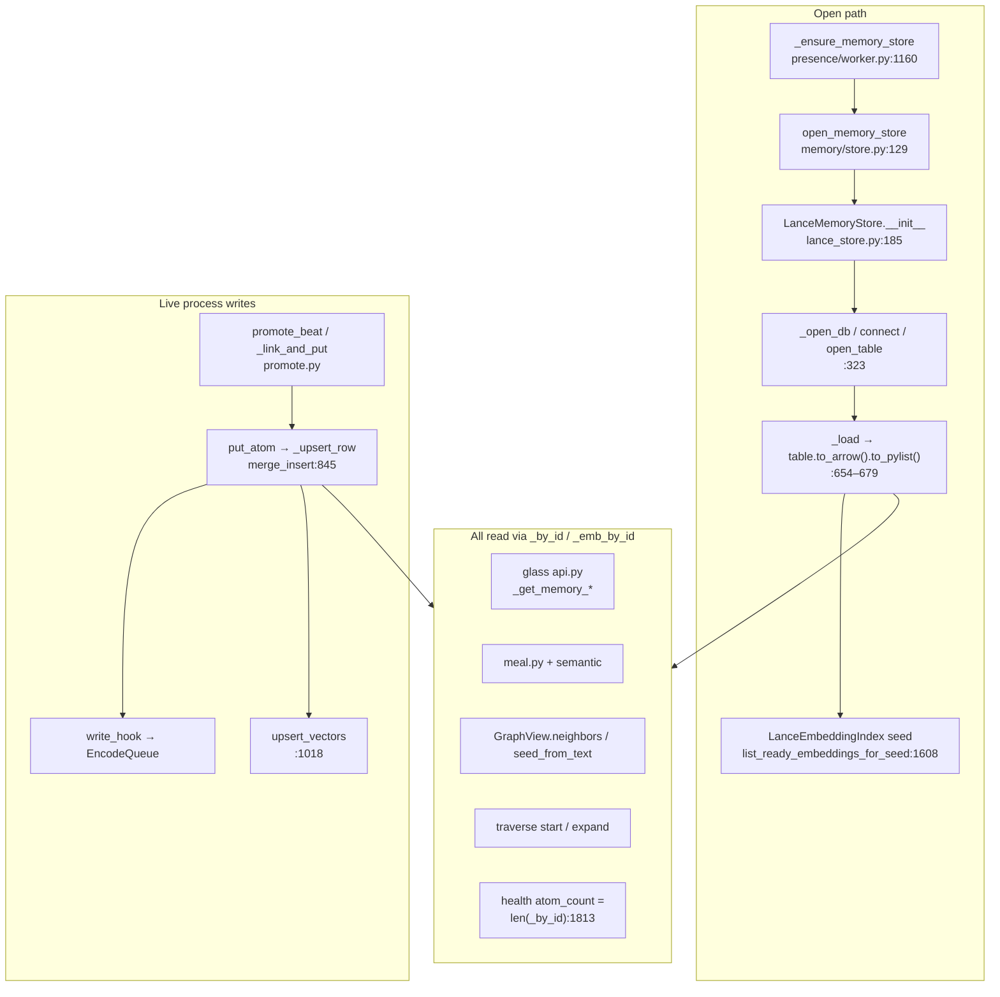

# Code path map (inspection target)

**Worktree pins:** grepped on branch `execute-plan/60b09de2-pr-1-scaffold-lance-debug1-package` (2026-07-29). Re-run `scripts/caller_grep_report.py` or re-grep when tree moves.

**Inspection only:** cite and read `elyra/memory/**`; do not patch.

---

## Open sequence



1. Worker `_ensure_memory_store` (`elyra/presence/worker.py` **L1160**) when `write_atoms` or `enabled`.
2. `open_memory_store(paths, mem_cfg)` (`elyra/memory/store.py` **L129–156**) → import lancedb → `LanceMemoryStore(paths, cfg)`.
3. `__init__` (`lance_store.py` **L185–223**): `_ensure_layout` (**L259**) → `_open_db` (**L323**) → `_load` (**L654**) → optional `repair_joint_copies` (**L1170**).
4. `_install_encode_hooks` + `_ensure_embedding_index` → `LanceEmbeddingIndex` open policy seeds from `list_ready_embeddings_for_seed` (**L1608–1635**) — **process maps only**.

**Safety:** steps 3–4 that construct the store are **W1** (meta + joint repair may write). See [SAFETY.md](SAFETY.md).

---

## Layer table

| Layer | Path | Role |
|-------|------|------|
| Factory | `elyra/memory/store.py` `open_memory_store` **L129** | `backend=lance` → `LanceMemoryStore`; soft fall-back to jsonl on ImportError / open failures |
| Store | `elyra/memory/lance_store.py` | Durable Lance under `data/memory/lance/`; in-memory `_by_id`, `_by_moment`, `_ladder`, `_emb_by_id` |
| Load | `LanceMemoryStore._load` **L654–679** | **`rows = self._table.to_arrow().to_pylist()`** then rebuild indexes |
| Write | `put_atom` **L973** / `_upsert_row` **L841–849** | `merge_insert("atom_id").when_matched_update_all().when_not_matched_insert_all().execute([row])` |
| Vectors | `upsert_vectors` **L1018+** | Co-row emb columns; requires atom already in `_by_id` |
| Seed | `list_ready_embeddings_for_seed` **L1608–1635** | Scans `_emb_by_id` ∩ ready — **not disk** |
| Health | `health()` **L1794–1826** | `atom_count = len(self._by_id)` — **not disk truth** |
| Worker | `presence/worker.py` `_ensure_memory_store` **L1160** | Single open per process; install encode hooks + embedding index |
| Promote | `memory/promote.py` `_link_and_put` **L318** | `moment_tail` / `global_tail` then `put_atom` + `update_links` |
| Index | `memory/index.py` `LanceEmbeddingIndex` | Open policy: full search below threshold; seed from store ready; IVF skip `below_ivf_min` (default 256) |
| Graph | `memory/graph.py` `GraphView` | Structural edges from atom fields; semantic via index (`neighbors` **L568**, `seed_from_text` **L691**) |
| Traverse | `memory/traverse.py` | Temporal seeds free; `seed_from_text` under `expand_ms` |
| Glass | `runtime/api.py` `_get_memory_*` + `memory/inspect.py` | Serialize store/index health and atom lists for UI |
| Deps | `pyproject.toml` | `lancedb>=0.20,<0.21`, `pyarrow>=14` — dogfood: **lancedb 0.20.0**, **lance 0.23.2** |

---

## Critical load path (primary bug candidate)

```654:679:elyra/memory/lance_store.py
    def _load(self) -> None:
        """Rebuild in-memory indexes from the Lance table."""
        self._by_id.clear()
        self._by_moment.clear()
        self._ladder.clear()
        self._emb_by_id.clear()
        if self._table is None:
            return
        try:
            rows = self._table.to_arrow().to_pylist()
        except Exception:
            _LOG.exception("lance load failed")
            raise
        for row in rows:
            # ... atom_from_row, hydrate, index ...
        self._rebuild_secondary_indexes()
```

```1810:1814:elyra/memory/lance_store.py
            out: dict[str, Any] = {
                "ok": True,
                "backend": "lance",
                "atom_count": len(self._by_id),
```

---

## Read APIs that only see `_by_id` / `_emb_by_id`

- `get_atom` (**L988**), `list_atoms` (**L1578**), `list_range`, `list_summaries`, `moment_tail` (**L1702**), `global_tail` (**L1721**), `walk_next` / `walk_prev`
- `list_ready_embeddings_for_seed` (**L1608**), `get_vectors` (via emb map)
- Glass atoms/vectors lists via `inspect.py` helpers (`list_atoms_for_glass` **L197**, hard cap `_ATOM_LIST_HARD_CAP=200` **L40**)
- Graph structural edges (atom fields); semantic search uses index built from process vectors
- Meal episodic / ladder / semantic packaging (`meal.py` `compose_meal` **L1499**)
- Traverse temporal seeds and neighbor expand

---

## Write APIs (live process)

- `put_atom` (**L973**) → `_upsert_row` (`merge_insert` **L841+**)
- `update_links` → same upsert path (KD19 emb preserve via `_emb_by_id`)
- `upsert_vectors` (**L1018**) (atom must exist in `_by_id`)
- Promote `_link_and_put` (**promote.py L318**) chains tails then put
- Open-time `repair_joint_copies` (**L1170**) — W1 side effect

---

## Other full-table `to_arrow` risk sites

| Location | Line | Purpose | Risk if H1 true |
|----------|------|---------|-----------------|
| `_atoms_table_is_empty` | **L378–388** | Fallback empty check after `count_rows` | Prefer `count_rows` first (already); bare `to_arrow` fallback weak |
| `_promote_staging_table` | **L449–452** | Staging → atoms | Staging promote may copy only default-limit rows |
| `_migrate_vector_schema` | **L489–518** | Phase 1→2 recreate+copy | **Future rewrite from partial rows** (H10 residual) |
| `_load` | **L654–663** | Rebuild indexes | **Primary restart bug path** |
| `search_vectors` result builder | **L1478–1481** | Search hits materialization | Search result shape (`limit(fetch_k)`); separate from full-table load |

**Not using bare `to_arrow` for full load:** `_upsert_row` (merge_insert), `delete`, search path (lance native / python cosine). Empty check prefers `count_rows`.

Full matrix: [TO-ARROW-CALLERS.md](TO-ARROW-CALLERS.md).

---

## Glass entry points (`elyra/runtime/api.py`)

| Method | Approx line | Store access |
|--------|-------------|--------------|
| `_get_memory_overview` | L655 | health / overview |
| `_get_memory_context` | L674 | meal / context |
| `_get_memory_atoms` | L827 | list via inspect |
| `_get_memory_atom` | L902 | single atom |
| `_get_memory_vectors` | L975 | vectors health |
| `_get_memory_vectors_atoms` | L1087 | vector atom list |
| `_get_memory_vectors_neighbors` | L1165 | neighbors |
| `_get_memory_graph` | L1406 | graph |
| `_get_memory_graph_session` | L1469 | session |
| `_get_memory_graph_neighbors` | L1577 | graph neighbors |

Most call `worker._ensure_memory_store()` then inspect helpers — process-truth only.

---

## Re-pin checklist

```bash
rg -n "to_arrow|count_rows|_load|merge_insert" elyra/memory/lance_store.py
rg -n "def _ensure_memory_store|open_memory_store" elyra/presence/worker.py elyra/memory/store.py
python docs/investigations/lance-debug1/scripts/caller_grep_report.py
```
