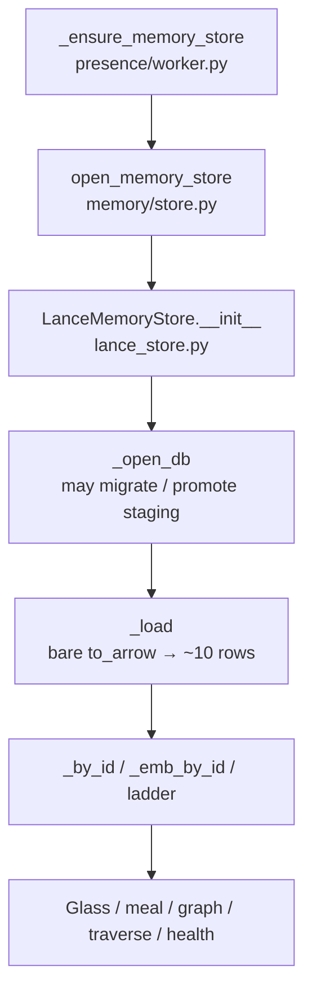
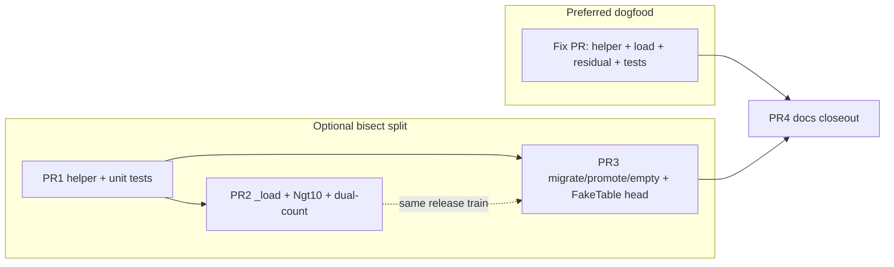

# Design: Resolve LanceMemoryStore full-load bug (bare `to_arrow` default limit)

| Field | Value |
|-------|--------|
| **Document** | Lance memory load bug — product fix |
| **Author** | Design (Grok Build) |
| **Date** | 2026-07-29 |
| **Status** | **Implemented** (rev.2; product fix landed `fcb5130`; docs closeout BUG-mem-lance-01) |
| **Product** | project-elyra |
| **Branch base** | `grok-improvement-memory` / project-elyra |
| **Workspace** | `/home/jim/Workspace/project-elyra` |
| **Primary code** | `elyra/memory/lance_store.py` |
| **Sealed root cause** | [`docs/lance-debug1/BUG-DOSSIER.md`](docs/lance-debug1/BUG-DOSSIER.md) |
| **Evidence run** | `docs/lance-debug1/evidence/2026-07-29-run-01/` |
| **Inspection package** | `docs/lance-debug1/` (inspection complete; this design authorizes the **product** fix) |
| **Review** | `/tmp/grok-1000/grok-design-review-9dfd5919.md` |

---

## Overview

After process restart, `LanceMemoryStore` rebuilds in-memory indexes from a **thin** Lance materialization (~**10** atoms) while the on-disk `atoms` table holds the full corpus (sealed dogfood: **386** atoms). Glass Memory, vectors, context meal, graph, and directed traversal all operate on that thin process world.

**Root cause (sealed):** bare `lancedb.Table.to_arrow()` under **lancedb 0.20.0** / **lance 0.23.2** is a **default-limit query of 10 rows**, not a full-table scan. Product `_load` misuses it as full materialization:

```python
# elyra/memory/lance_store.py — LanceMemoryStore._load (today)
rows = self._table.to_arrow().to_pylist()
```

Disk writes (`merge_insert` / promote) are intact. Version archaeology is monotonic. The fault is **wrong full-scan API** → thin process indexes.

**This design** specifies a minimal, well-tested product fix:

1. A single **explicit full-read helper** pinned to APIs proven full on 0.20.x (`count_rows` + `head(n)` primary; `to_lance().to_table()` fallback).
2. Wire the helper into **all full-table-intent call sites** (`_load` critical; migrate / staging promote residual; empty-check fallback) in the **same release train**.
3. **Parity assert** on materialize (`len(rows) == count_rows` when known).
4. **Fail closed** on materialize failure everywhere — including migrate (no `rows = []` wipe).
5. **Regression tests** with **N > 10** (existing reopen tests use N=1 and cannot catch this bug).
6. **Required** dual-count health fields for ops visibility.
7. Incremental PR plan and docs closeout.

**One-sentence outcome:** After restart, process `atom_count` matches disk `count_rows`; glass/meal/traverse see the full corpus, not the table-order prefix of 10.

---

## Background & Motivation

### Sealed quantitative picture (run `2026-07-29-run-01`)

Absolute N is run-specific; the **relations** are the contract.

| Measure | Value | Relation |
|---------|-------|----------|
| `n_full` (`count_rows`) | **386** | disk truth |
| `n_head` (`head(n_full)`) | **386** | full public API |
| `n_arrow` (bare `to_arrow`) | **10** | default limit |
| `n_lance` (`to_lance`) | **386** | corroboration |
| process `health.atom_count` | **10** | **==** n_arrow ≪ n_full |
| H1a | true | arrow ids order-equal `head(10)` |
| H1b path | `head_n_full` | primary public full proof on 0.20.0 |
| skip-corrupt | **0** | not mass-drop |

### Why promote looked fine

- Live `put_atom` → `_upsert_row` uses `merge_insert` (no full scan).
- Mid-session process maps include atoms just written.
- **Restart** reloads only the default-limit prefix → hundreds of durable rows vanish from process indexes without any disk loss.

### Code path (open → thin world)



**Open order (verified):** `__init__` → `_ensure_layout` → `_open_db` (**may call** `_migrate_vector_schema` / `_promote_staging_table` / recover) → **`_load`**. Migrate/promote run **before** load. Shipping a full `_load` while migrate still uses bare `to_arrow` is safe only for stores **already on Phase-2** (dogfood today). For **Phase-1 scalar tables with N>10**, first open would still **rewrite disk from a thin snapshot** — see §5 and **KD17**.

| Layer | Path | Role today |
|-------|------|------------|
| Factory | `elyra/memory/store.py` `open_memory_store` | `backend=lance` → `LanceMemoryStore`; soft fall-back to jsonl on open failure |
| Load | `LanceMemoryStore._load` ~L654–679 | **Bug site:** bare `to_arrow().to_pylist()` |
| Health | `health()` ~L1794 | `atom_count = len(self._by_id)` — process truth only |
| Write | `put_atom` / `_upsert_row` | `merge_insert` — OK |
| Search result | `search_vectors` builder `to_arrow` | **Bounded** via `limit(fetch_k)` — out of scope |

Call matrix (authoritative inventory): [`docs/lance-debug1/TO-ARROW-CALLERS.md`](docs/lance-debug1/TO-ARROW-CALLERS.md).

### Local API probe (design verification, Python 3.12.8 + lancedb 0.20.0)

Synthetic 25-row table:

| API | Rows |
|-----|------|
| `count_rows()` | 25 |
| bare `to_arrow()` | **10** |
| `head(25)` | **25** (`pyarrow.Table`, supports `.to_pylist()`) |
| `to_lance().to_table()` | **25** |

**Python note:** prefer **3.12** for lancedb wheels. Native connect on **3.14** has a known segfault class (tests already probe connect in a subprocess and skip).

### Adjacent non-roots (do not expand scope)

| ID | Relation |
|----|----------|
| **BUG-wake-02** | Consumer of residual glass/meal after restart; not Lance row-loss root |
| **expand_ms honesty** | Budget/perf adjacency |
| **BUG-mem-gpu-01** | ROCm/CPU embed path; not missing-row root |

Fix glass alone would not restore disk atoms into process maps.

---

## Goals & Non-Goals

### Goals

1. **Correct full load:** on open, rebuild `_by_id` / emb maps / secondary indexes from **all** table rows.
2. **Single helper:** one explicit full-read API path used by every full-table-intent site.
3. **Never** use bare `table.to_arrow()` for full-scan intent under lancedb 0.20.x.
4. **Parity guard:** hard-fail when `len(materialized) != count_rows` (when count known).
5. **Fail closed on materialize failure** at load **and** migrate/promote — never treat failure as empty corpus.
6. **Regression tests:** table with **>10** rows → open → process `atom_count == N` (clean fixtures) and id-set parity.
7. **H10 same release train as `_load`:** migrate + staging promote + empty-check fallback use the helper before any environment that may still open Phase-1 tables ships the load fix alone.
8. **Minimal surface:** keep `MemoryStore` Protocol stable; additive health fields only.
9. **Required dual-count health** (`disk_atom_count`, `atom_count_parity`) on open store.
10. **Pin behavior** within `lancedb>=0.20,<0.21` (`pyproject.toml` extra `memory-lance`).

### Non-goals

| Non-goal | Why |
|----------|-----|
| Redesign LanceMemoryStore off full in-process load | Full process maps are the existing architecture; this bug is wrong API, not scale redesign |
| Lazy / paged process indexes; column-projected load | Out of scope; separate product decision if corpora grow large (see §8 peak memory) |
| Change glass caps, meal policy, traverse budgets | Adjacent consumers; cascade heals when load is full |
| Fix BUG-wake-02 / BUG-mem-gpu-01 / expand_ms | Separate known-bugs entries |
| Compaction / version growth policy | Ops hygiene; not this correctness bug |
| Feature flag for the fix | Pure correctness; restart required to take effect |
| Public `table.query()` requirement | Absent on sync `LanceTable` 0.20.0; not needed (`head` / `to_lance` proven) |
| Alter write path (`merge_insert`) | Already correct |
| Change bounded `search_vectors` result materialization | Not full-table intent; `builder.limit(fetch_k)` then `to_list`/`to_arrow` — leave alone |

---

## Proposed Design

### 1. Full-read helper (exact shape)

Add **module-level** helpers in `elyra/memory/lance_store.py` (next to `_require_lancedb` / schema helpers) so they work for both `self._table` and staging tables without a live `LanceMemoryStore` instance (unit-testable with fakes).

```python
# Suggested names — lock these in PR1 / Fix PR
from elyra.memory.errors import MemoryUnavailable

_LANCEDB_DEFAULT_TO_ARROW_LIMIT = 10  # documented library behavior on 0.20.x; not a product cap

def _table_row_count(table: Any) -> int | None:
    """Best-effort cardinality via count_rows; None if unavailable."""
    ...

def _materialize_table_arrow(table: Any, *, purpose: str) -> Any:
    """Return a full pyarrow.Table for *table* (all rows).

    Never uses bare table.to_arrow() — that is a default-limit query (~10)
    on lancedb 0.20.x (see docs/lance-debug1/BUG-DOSSIER.md).

    Strategy (stop at first successful full materialize):
      1. n = count_rows() when available
      2. table.head(n)  → primary on 0.20.0 (H1b sealed path)
      3. table.to_lance().to_table()  → fallback / corroboration
      4. If public query().limit(n) appears in a future pin, optional prefer —
         do not require it on 0.20.x

    Raises MemoryUnavailable if no full path works or if materialized
    row count != n when n is known. Chain the underlying exception as
    ``__cause__`` when applicable. Do not return a thin prefix.
    """
    ...

def _materialize_table_rows(table: Any, *, purpose: str) -> list[dict[str, Any]]:
    """Full table as list[dict] via _materialize_table_arrow(...).to_pylist()."""
    arrow = _materialize_table_arrow(table, purpose=purpose)
    return arrow.to_pylist()
```

#### Exception type (**KD18**)

- **Raise `MemoryUnavailable`** (from `elyra/memory.errors`) for full-materialize failure and parity mismatch.
- Wrap/chain underlying library errors: `raise MemoryUnavailable(...) from exc`.
- **Rationale:** product already uses `MemoryUnavailable` for open/unusable store; log classification stays consistent. Factory `open_memory_store` still soft-falls on any `Exception` (including `MemoryUnavailable`) with a loud warning → jsonl; that interaction is intentional and unchanged.
- Call-site re-raise after logging is fine; do not convert to bare `RuntimeError`.

#### Algorithm detail (`_materialize_table_arrow`)

```text
input: table, purpose (for logs)

n = count_rows(table) if hasattr else None   # int, may be 0

if n == 0:
    # Prefer empty arrow with table.schema when available; else head(0)
    return empty pyarrow.Table

errors = []

# Path A — head(n) [PRIMARY]
if hasattr(table, "head") and n is not None:
    try:
        arrow = table.head(int(n))
        if arrow.num_rows == n:
            log debug purpose path=head n=n
            return arrow
        errors.append(f"head_row_mismatch got={arrow.num_rows} want={n}")
    except Exception as e:
        errors.append(...)

# Path B — to_lance().to_table() [FALLBACK]
if hasattr(table, "to_lance"):
    try:
        ds = table.to_lance()
        arrow = ds.to_table()  # full dataset read (all columns)
        if n is None or arrow.num_rows == n:
            log debug purpose path=to_lance n=arrow.num_rows
            return arrow
        errors.append(f"to_lance_row_mismatch got={arrow.num_rows} want={n}")
    except Exception as e:
        errors.append(...)

# Path C — public query().limit(n) if present (future-proof; optional)
# Do NOT fall through to bare to_arrow()

raise MemoryUnavailable(
    f"lance full materialize failed purpose={purpose} n={n} errors={errors}"
)
```

**Empty table:** `head(0)` returns an empty `pyarrow.Table` (verified). Prefer that over bare `to_arrow`.

**Logging:** at INFO once per open for `_load` success (`purpose=load rows=N path=head`); WARNING/ERROR on path fallback or mismatch.

**Why not bare `to_arrow` even as last resort?** A silent thin load reintroduces the production bug. Loud failure is better than a 10-atom world that looks healthy. Factory soft fall-back to jsonl already logs; operators must not trust a thin lance open as success.

#### Why module-level, not only instance methods

- `_promote_staging_table` opens `staging_tbl` separately from `self._table`.
- Unit tests can pass fake tables without constructing a full store (mirrors existing `test_memory_index.py` recovery fakes).
- Single enforcement point for the “no bare to_arrow full scan” rule.

#### Optional thin wrapper on the store

```python
def _full_rows(self, table: Any | None = None) -> list[dict[str, Any]]:
    t = self._table if table is None else table
    if t is None:
        return []
    return _materialize_table_rows(t, purpose="store")
```

Nice-to-have; not required if call sites invoke the module helpers directly with clear `purpose=` strings.

---

### 2. Call-site change matrix

From [`TO-ARROW-CALLERS.md`](docs/lance-debug1/TO-ARROW-CALLERS.md) + live grep of `elyra/memory/lance_store.py`.

| # | Site | ~Line | Today | Full-table intent? | Action | PR |
|---|------|-------|-------|--------------------|--------|-----|
| 1 | `_load` | 663 | `self._table.to_arrow().to_pylist()` | **Yes — critical** | `_materialize_table_rows(self._table, purpose="load")` + parity | Fix PR / PR2 |
| 2 | `_migrate_vector_schema` | 518 | `self._table.to_arrow().to_pylist()` in `try/except → rows=[]` | **Yes — H10; Phase-1 disk rewrite** | helper; **remove** silent `rows=[]` (**KD16**) | Residual / PR3 — **same release train as #1** |
| 3 | `_promote_staging_table` | 452 | `staging_tbl.to_arrow()` (Arrow for `create_table`) | **Yes — H10 residual** | `_materialize_table_arrow(staging_tbl, purpose="promote_staging")` | Residual / PR3 — same train |
| 4 | `_atoms_table_is_empty` fallback | 388 | `len(self._table.to_arrow()) == 0` | Cardinality only | Prefer `count_rows` (already); fallback → `head(1).num_rows == 0` — **never** bare `to_arrow` | Residual / PR3 — same train |
| 5 | `search_vectors` builder | 1480–1481 | `builder.to_arrow()` after `limit(fetch_k)` | **No** (bounded search) | **No change** — keep allowlist comment near path | — |
| 6 | `_upsert_row` / delete | 841+ | `merge_insert` / filter delete | No | **No change** | — |
| 7 | `health` | 1813 | `len(self._by_id)` | Process truth | **Required** dual-count fields (below) | Fix PR / PR2 |

**Grep acceptance after fix:**

```bash
rg -n "to_arrow" elyra/memory/lance_store.py
# Allowed leftovers:
#   - search_vectors builder path only (bounded; keep a one-line comment:
#       "# bounded search materialize — not full-table intent")
#   - comments / docstring warnings about bare to_arrow
# Forbidden: bare self._table.to_arrow() or staging_tbl.to_arrow() for full intent
```

Optional automated guard (nit, PR3): a tiny unit test that reads `lance_store.py` source and fails if `self._table.to_arrow` or `staging_tbl.to_arrow` appear outside comments / the search builder block. Not required for correctness; recommended to prevent reintroduction.

#### `_load` (normative after)

```python
def _load(self) -> None:
    """Rebuild in-memory indexes from the Lance table (full table)."""
    self._by_id.clear()
    self._by_moment.clear()
    self._ladder.clear()
    self._emb_by_id.clear()
    if self._table is None:
        return
    try:
        rows = _materialize_table_rows(self._table, purpose="load")
    except Exception:
        _LOG.exception("lance load failed")
        raise  # MemoryUnavailable from helper; factory may soft-fall to jsonl
    # Defensive parity (helper already checks when count_rows known):
    n_disk = _table_row_count(self._table)
    if n_disk is not None and len(rows) != n_disk:
        raise MemoryUnavailable(
            f"lance load parity failure materialized_rows={len(rows)} disk_rows={n_disk}"
        )
    # Optional: cache for health dual-count without re-count
    self._disk_atom_count_at_load = n_disk if n_disk is not None else len(rows)
    skip = 0
    for row in rows:
        try:
            atom = self._atom_from_row(row)
            atom = self._hydrate_content(atom)
        except (TypeError, ValueError):
            skip += 1
            _LOG.warning("skipping corrupt lance row atom_id=%r", row.get("atom_id"))
            continue
        self._by_id[atom.atom_id] = atom
        if self._vector_schema_ok:
            emb_map = self._emb_map_from_row(row)
            if emb_map is not None:
                self._emb_by_id[atom.atom_id] = emb_map
    self._rebuild_secondary_indexes()
    if skip:
        _LOG.warning("lance load skipped_corrupt=%d loaded=%d", skip, len(self._by_id))
    else:
        _LOG.info("lance load complete atoms=%d", len(self._by_id))
```

**Corrupt-skip vs parity:**

| Check | Against | Meaning |
|-------|---------|---------|
| Materialize parity | `len(rows) == count_rows` | Raw Arrow/pylist row count; helper + `_load` guard |
| Process health | `len(_by_id)` | May be **&lt;** raw if corrupt rows skipped (H5-class) |

Acceptance tests use clean `put_atom` fixtures (skip=0) so process `atom_count == N == count_rows`. Helper unit tests assert **materialized** len == n. Do not treat process-vs-disk under corrupt skip as the sealed H1 failure mode (sealed run had skip=0, gap 376).

#### `_promote_staging_table`

```python
rows_rec = _materialize_table_arrow(staging_tbl, purpose="promote_staging")
# create_table(_ATOMS_TABLE, rows_rec) unchanged
```

On materialize failure: raise (or let `MemoryUnavailable` propagate). **Do not** promote an empty/partial table when staging had rows. Existing `_recover_interrupted_migration` outer `try/except` may log and try bak restore next — that is correct fail-closed ordering.

#### `_migrate_vector_schema` (**KD16** — fail closed; no empty wipe)

**Today (dangerous soft path):**

```python
try:
    rows = self._table.to_arrow().to_pylist()
except Exception:
    rows = []  # would bak+recreate empty atoms — FORBIDDEN after this design
```

**Normative after:**

```python
# Inside the existing migrate try body — NO local swallow to []
rows = _materialize_table_rows(self._table, purpose="migrate_vector_schema")
# existing new_rows / bak / staging / drop+create flow uses `rows` only after success
```

| Rule | Behavior |
|------|----------|
| Materialize succeeds, N rows | Proceed with bak + staging + replace as today |
| Materialize raises | **Do not** set `rows = []`. Let exception reach the **outer** migrate `except`, which already sets `_vector_error`, leaves scalar path usable / attempts recovery — **must not** drop `atoms` or write empty bak as “success” |
| Unit test | Materialize failure with prior N>0 must **not** leave `atoms` at 0 rows |

Implementer note: if the outer handler currently assumes `rows` is always a list, audit the full `try/except` of `_migrate_vector_schema` so failure cannot fall through into `create_table` with empty data. Fail before any `drop_table(_ATOMS_TABLE)`.

#### `_atoms_table_is_empty`

```python
def _atoms_table_is_empty(self) -> bool:
    if self._table is None:
        return True
    try:
        if hasattr(self._table, "count_rows"):
            return int(self._table.count_rows()) == 0
    except Exception:
        pass
    try:
        # Fallback: explicit head(1), never bare to_arrow
        if hasattr(self._table, "head"):
            return int(self._table.head(1).num_rows) == 0
    except Exception:
        pass
    return False  # fail closed: assume non-empty if unknown
```

---

### 3. Health / observability (**required** in Fix PR / PR2)

`MemoryStore.health()` contract today (`store.py`):

```text
{ok, backend, atom_count?, error?}
```

`LanceMemoryStore.health()` already returns extra keys (`vectors`, `vectors_ready`, …). **Protocol stays stable**; additive keys are fine.

**Required in the same PR as `_load` (KD9 / KD19):**

| Key | Meaning |
|-----|---------|
| `atom_count` | **Unchanged:** `len(self._by_id)` — process truth (glass / consumers) |
| `disk_atom_count` | Best-effort `count_rows()` (or cached `_disk_atom_count_at_load`); **omit** if unavailable |
| `atom_count_parity` | `true` when both known and equal; `false` on mismatch; **omit** if disk unknown |

```python
# Open (not closed) path:
n_disk = None
try:
    if self._table is not None and hasattr(self._table, "count_rows"):
        n_disk = int(self._table.count_rows())
except Exception:
    # fall back to load-time cache if present
    n_disk = getattr(self, "_disk_atom_count_at_load", None)
out["atom_count"] = len(self._by_id)
if n_disk is not None:
    out["disk_atom_count"] = n_disk
    out["atom_count_parity"] = out["atom_count"] == n_disk
    if not out["atom_count_parity"]:
        _LOG.warning(
            "lance health atom_count_parity=false process=%s disk=%s",
            out["atom_count"],
            n_disk,
        )
```

**Closed store:** keep today’s fixed dict (`ok=False`, `atom_count=0`, `error="closed"`). **Omit** `disk_atom_count` / `atom_count_parity` when closed (table may be None; dual-count is meaningless).

**Do not** redefine `atom_count` as disk-only — glass and tests already mean process. Dual-count makes future regressions visible without re-running lance-debug1 scripts.

---

### 4. Tests

#### 4.1 Unit — helper alone (no full store open required)

**File:** `tests/test_memory_store_lance.py` (prefer existing lance suite for skip markers).

**Primary fake (Path A — head):**

```python
class _FakeTable:
    """to_arrow intentionally thin; head returns full prefix of n."""

    def __init__(self, full_rows: list[dict], *, arrow_limit: int = 10):
        self._full = full_rows
        self._limit = arrow_limit
        self.to_arrow_calls = 0

    def count_rows(self) -> int:
        return len(self._full)

    def head(self, n: int):
        import pyarrow as pa
        return pa.Table.from_pylist(self._full[: int(n)])

    def to_arrow(self):
        self.to_arrow_calls += 1
        import pyarrow as pa
        return pa.Table.from_pylist(self._full[: self._limit])  # thin!
```

**Fallback fake (Path B — to_lance; no head):**

```python
class _FakeLanceDataset:
    def __init__(self, full_rows: list[dict]):
        self._full = full_rows

    def to_table(self):
        import pyarrow as pa
        return pa.Table.from_pylist(self._full)


class _FakeTableLanceOnly:
    """Omits head so Path B is exercised; to_arrow still thin if mis-called."""

    def __init__(self, full_rows: list[dict], *, arrow_limit: int = 10):
        self._full = full_rows
        self._limit = arrow_limit
        self.to_arrow_calls = 0

    def count_rows(self) -> int:
        return len(self._full)

    # no head attribute

    def to_lance(self) -> _FakeLanceDataset:
        return _FakeLanceDataset(self._full)

    def to_arrow(self):
        self.to_arrow_calls += 1
        import pyarrow as pa
        return pa.Table.from_pylist(self._full[: self._limit])
```

Cases:

| Test | Setup | Assert |
|------|-------|--------|
| `test_materialize_uses_head_not_to_arrow` | `_FakeTable` N=25 | result len 25; `to_arrow_calls == 0` |
| `test_materialize_empty` | N=0 | empty list / empty table |
| `test_materialize_parity_mismatch_raises` | `head` returns wrong N | raises **`MemoryUnavailable`** |
| `test_materialize_to_lance_fallback` | `_FakeTableLanceOnly` N=25 (**no `head`**) | result len 25; `to_arrow_calls == 0`; path uses `to_lance().to_table()` |
| `test_materialize_to_lance_fallback_when_head_raises` | optional: `head` raises, `to_lance` works | same full result |
| `test_materialize_never_returns_default_limit_when_full_available` | N=25 | not 10 |
| `test_materialize_no_path_raises_memory_unavailable` | no `head`, no `to_lance` | raises `MemoryUnavailable` |

#### 4.2 Integration — reopen with N > 10 (the bug catcher)

Existing `test_restart_reloads_indexes` uses **N=1** — **does not catch H1**.

Add:

```python
def test_restart_loads_all_rows_above_default_to_arrow_limit(paths):
    """Regression: bare to_arrow default limit is 10; load must exceed it."""
    N = 25  # > 10
    store = open_memory_store(paths, MemorySettings(backend="lance", write_atoms=True))
    try:
        ids = []
        for i in range(N):
            a = store.put_atom(_atom(
                t=f"2026-07-28T10:00:{i:02d}Z",
                text=f"row-{i}",
                atom_id=f"loadfix_{i:03d}",
                moment_id="m_load",
            ))
            ids.append(a.atom_id)
        assert store.health()["atom_count"] == N
    finally:
        store.close()

    store2 = open_memory_store(paths, MemorySettings(backend="lance"))
    try:
        h = store2.health()
        # Clean put_atom fixture → process == disk == N (no corrupt skip)
        assert h["atom_count"] == N
        assert h["disk_atom_count"] == N          # required dual-count
        assert h["atom_count_parity"] is True
        assert store2.get_atom(ids[-1]) is not None
        assert store2.get_atom(ids[10]) is not None  # first past default limit
        listed = store2.list_by_moment("m_load")
        assert len(listed) == N
        assert {a.atom_id for a in listed} == set(ids)
    finally:
        store2.close()
```

**Also strengthen** (optional same PR): reopen after upsert_vectors with N>10 already partially covered by `test_lance_vectors_survive_reopen` — ensure vector maps reload for ids beyond prefix if cheap.

#### 4.3 Residual site tests (PR3) — **including FakeTable prerequisite**

**Hard prerequisite (Issue 1):** existing recovery fakes in `tests/test_memory_index.py` implement only `to_arrow` / `count_rows` / `schema` — **no `head`, no `to_lance`**. After promote switches to `_materialize_table_arrow`, those tests **raise `MemoryUnavailable`** unless updated.

| Work item | Required? | Detail |
|-----------|-----------|--------|
| Update **all** existing `_FakeTable`s used by promote/recover/migrate unit tests | **Yes — PR3 blocker** | Implement `head(self, n)` → full arrow of `min(n, num_rows)` from the fake’s complete data. Keep thin `to_arrow` so tests prove the helper does **not** call it (optional `to_arrow_calls` counter). |
| Prefer `head` over `to_lance` on fakes | Yes | Matches production primary path; simpler |
| Optional `to_lance` on fakes | No | Only if a test specifically wants Path B |
| Promote staging with **>10** rows | Yes (new/extended) | Staging holds **15** rows; after promote `count_rows == 15`; thin `to_arrow` still returns ≤10 if called |
| Phase-1 migrate with **>10** scalar rows | Yes | Extend `test_lance_phase1_scalar_table_migrates` (or sibling) seed **15** rows; after open/migrate process + disk == 15 |
| Materialize failure must not wipe atoms | Yes | Force helper failure (or inject) during migrate; assert `atoms` not replaced with 0 rows when prior N>0 |

**PR3 Files must list:** `tests/test_memory_index.py` (update existing `_FakeTable` classes at promote/recover tests — currently ~L386–398 and siblings) **as mandatory edits**, not only “extend for N=15.”

#### 4.4 Hermetic / debug-package reuse (optional)

- `docs/lance-debug1/scripts/fixtures/build_tiny_atoms.py` builds 25 rows for **api_matrix** plumbing — incomplete Atom schema (not enough for full `LanceMemoryStore._load`).
- **Prefer** `put_atom` loop for product tests (real schema + emb columns).
- Optional: after fix, re-run sealed R1/R2 recipes on quarantine and attach notes under lance-debug1 evidence as **post-fix verification** (not blocking merge if unit/integration green).

#### 4.5 Skip policy

Reuse existing `_lancedb_connect_works()` subprocess probe + `pytest.importorskip("lancedb")` so CI without a working lance wheel still runs JSONL suite; lance suite skips cleanly on 3.14 segfault class.

---

### 5. Migration / staging paths

Open order means migrate/promote can **mutate disk before `_load` runs**.

| Path | Failure mode if left bare after only `_load` is fixed |
|------|--------------------------------------------------------|
| `_migrate_vector_schema` | **Destructive on first open** for Phase-1 tables with N>10: thin snapshot → bak/staging → **drop+recreate `atoms`** → permanent disk loss; full `_load` then reloads the destroyed corpus |
| `_promote_staging_table` | Crash recovery would promote only ~10 staging rows into `atoms` |
| `_atoms_table_is_empty` fallback | May mis-detect empty/non-empty if `count_rows` fails |

**Phase-2 dogfood (current sealed corpus):** already migrated; PR2-alone heals process thinness on restart **without** re-entering migrate. That is **not** a general license to ship PR2 weeks before PR3.

**Release constraint (**KD17**):**

- Do **not** ship Fix PR (`_load`) to environments that may still open **Phase-1** tables without residual migrate/promote sites fixed in the **same release train**.
- Preferred: **PR1 → (PR2 + PR3 same train / no multi-week lag)**; or squash helper+load+residual into one ship unit for dogfood.
- If PR2 lands alone on a branch used only by already-Phase-2 dogfood, residual PR3 must still land **before** any Phase-1 operator data is opened with that binary.

No operator data migration step is required for Phase-2 corpora: **restart with new code** reloads full disk as-is.

**Disk already correct for Phase-2** — no backfill job, no re-promote, no re-encode required for scalar atoms. Vectors already on disk co-row; full load rehydrates `_emb_by_id` for ready rows.

---

### 6. API / interface changes

| Surface | Change |
|---------|--------|
| `MemoryStore` Protocol | **None required** |
| `open_memory_store` | **None** (still constructs `LanceMemoryStore`; soft-falls on `MemoryUnavailable`) |
| `LanceMemoryStore.health()` | **Required** additive `disk_atom_count`, `atom_count_parity` when open and disk known; omit when closed |
| Public exports `__all__` | Do **not** export helpers (private `_` module functions) |
| `pyproject.toml` | Keep `lancedb>=0.20,<0.21`; no bump required for fix |
| Glass HTTP | No schema break; extra health keys pass through if UI already dumps health dict |
| Exception | Full materialize / parity → **`MemoryUnavailable`** |

---

### 7. Data model changes

**None.** Lance table schema, `meta.json`, Atom dataclass, emb columns unchanged.

---

### 8. Dependency / runtime constraints

| Constraint | Guidance |
|------------|----------|
| lancedb | Pin range already `>=0.20,<0.21`; behavior validated on **0.20.0** |
| Python | Prefer **3.12** for dogfood/worker; document 3.14 native segfault class (unchanged) |
| pyarrow | Already `>=14`; `head` returns `pyarrow.Table` |
| Steady-state memory | Full process load of all atoms + vectors was **always intended**; fix restores intended behavior. Dogfood ~386 atoms is small. Large-corpus paging is a future design. |

#### Peak memory during materialize (transient)

`_materialize_table_arrow` → `to_pylist()` is a **full-column** read: scalar fields **plus** all `emb_*` fixed-size lists (`EMBED_DIM = 2048`, five channels: text/image/audio/video/joint) before `_emb_map_from_row` rebuilds process maps.

Rough peak order-of-magnitude (not a hard budget):

```text
peak ≈ size(Arrow table full columns) + size(Python pylist of same) + size(_by_id + _emb_by_id)
     ≈ 2× full-column footprint + steady-state maps  (Arrow released after pylist build)
```

For N≈400, 5×2048 float32 channels ≈ 400 × 5 × 2048 × 4 ≈ **16 MiB** of vector payload alone (plus Python object overhead in pylist — often several×); still modest on dogfood hardware. This is **not** a new steady-state class vs mid-session process that already held maps for promoted atoms; it is a **transient double buffer** at open.

| Note | Detail |
|------|--------|
| No column projection in this fix | `head(n)` / `to_table()` load all columns; acceptable at dogfood scale |
| Future optimization (out of scope) | Project scalar cols for atom rebuild; emb on demand / batch — only if corpora grow large |
| Lazy redesign | Remains non-goal |

---

## Alternatives Considered

### A. `head(count_rows)` only (no helper, inline in `_load`)

| Pros | Cons |
|------|------|
| Tiny diff | Easy to forget migrate/promote; no shared assert; harder to test once |

**Reject as sole fix** — residual H10 remains (and is disk-destructive for Phase-1). Acceptable only as interim emergency patch; this design still centralizes.

### B. `to_lance().to_table()` only as primary

| Pros | Cons |
|------|------|
| True dataset API; independent of query limit | Slightly more coupling to lance native; H1b sealed primary was `head_n_full` |

**Accept as fallback**, not exclusive primary. Prefer public `Table.head` first.

### C. `query().limit(n_full).to_arrow()` 

| Pros | Cons |
|------|------|
| Explicit limit | **Public `query` absent** on sync LanceTable 0.20.0 |

**Optional future path** inside helper if `hasattr(table, "query")`; not required now.

### D. Raise product limit / configure lancedb default

| Pros | Cons |
|------|------|
| — | No stable public “unlimited to_arrow” knob documented for product; still misuses limited API |

**Reject.**

### E. Fix glass / meal only to “show more”

| Pros | Cons |
|------|------|
| UI sugar | Does not put atoms into `_by_id`; vectors/meal/graph remain myopic |

**Reject** (dossier explicit).

### F. Redesign to lazy disk-backed reads (no full process index)

| Pros | Cons |
|------|------|
| Scales larger | Large redesign; out of product constraints (“minimal, well-tested”) |

**Defer** to a separate scale design if ever needed.

### G. Soft-warn on thin load without changing API

| Pros | Cons |
|------|------|
| Zero behavior risk | Leaves bug live |

**Reject.**

**Chosen:** Alternative **A+B hybrid** as a shared helper (`head` primary, `to_lance` fallback), applied to all full-intent sites in one release train, with tests N>10.

---

## Security & Privacy

| Topic | Notes |
|-------|-------|
| Data access | Fix only changes **how many** durable atoms enter process memory — same trust domain as today |
| Quarantine / live | Implementation tests use `tmp_path`; dogfood verification may use existing lance-debug1 quarantine rules (`SAFETY.md`) — never compact/delete operator lance |
| Secrets | No new secret surfaces; atom content already process-resident by design |
| Soft fall-back | Load hard-fail still routes factory to jsonl with loud warning — operators must not dual-write; unchanged policy |
| Migrate fail-closed | Prevents accidental empty-corpus rewrite on materialize failure |

---

## Observability

| Signal | Before | After |
|--------|--------|-------|
| `health.atom_count` | Process thin (~10 post-restart) | Process full (≈ disk) on clean load |
| `disk_atom_count` / `atom_count_parity` | Absent | **Required** when open + disk known; omit when closed |
| Logs | `lance load failed` only on exception | `lance load complete atoms=N`; parity / materialize → `MemoryUnavailable` |
| Glass Memory overview | Thin count | Full count after restart |
| lance-debug1 `load_parity` | H2 thin tracks arrow | Post-fix: process ≈ n_full (H2 inverted — expected) |

**Acceptance logging check:** one INFO line per open with full N on dogfood restart.

---

## Rollout Plan

1. Land code in order: helper → `_load` + dual-count → residual full-intent sites → docs. **PR2 and PR3 must ship in the same release train** (see KD17); no multi-week lag on the memory branch if Phase-1 corpora may open.
2. **Preferred squash for dogfood:** single **Fix PR** = helper + `_load` + residual sites + tests (PR1+PR2+PR3 content). Split only when bisect value outweighs ceremony; pure-dead-code PR1 is optional.
3. **No feature flag** — pure correctness.
4. **Restart required:** long-lived process keeps thin maps until reopen; rolling restart of presence worker / glass host is sufficient.
5. **No data migration** for Phase-2 corpora — disk already full.
6. Dogfood verify (operator):
   - Confirm store is Phase-2 (`vectors` / `vector_schema_version`) **or** ship residual migrate fix in the same binary.
   - Restart with fix.
   - Glass Memory `atom_count` ≈ pre-restart disk / prior full mid-session count (not ~10); dual-count parity true.
   - Atoms tab shows kinds beyond table-order prefix (tool/speak/etc., not only first-10 summary/tool mix).
   - Optional: re-run `load_parity.py` on quarantine — expect `process_atom_count ≈ n_full`, `thin_vs_full=false`.
7. Python 3.12 worker recommended; do not validate solely on 3.14.

### Risks

| Risk | Severity | Mitigation |
|------|----------|------------|
| Helper uses wrong API on future lancedb minor | Med | Pin `<0.21`; parity assert; tests N>10 |
| Load raises → factory soft-falls to jsonl | Med | Loud warning already; document “if open falls to jsonl after upgrade, check logs for MemoryUnavailable” |
| **PR2 without PR3 on Phase-1 N>10** | **High** | **KD17:** same release train; do not open unmigrated corpora on load-only binary |
| Migrate swallows failure as `rows=[]` | **High** | **KD16:** remove soft empty; fail before drop |
| Existing FakeTable lacks `head` → red CI | Med | **PR3 prerequisite:** update all promote/recover fakes |
| Peak RSS at open (Arrow + pylist + maps) | Low | Dogfood N~10²–10³; documented §8; no projection this fix |
| Fake tests pass but real lance differs | Low | Integration test with real lancedb connect (subprocess skip probe) |
| Mid-session process without restart still thin if opened pre-fix | Low | Restart-required documented |
| Dual-count `count_rows` cost every health poll | Low | count_rows is metadata-cheap; optional cache `_disk_atom_count_at_load` |

---

## Acceptance Criteria

| # | Criterion | How verified |
|---|-----------|--------------|
| A1 | Materialize parity: `len(materialized) == count_rows` when known; for **clean** put_atom fixtures after restart, `health.atom_count == N == disk_atom_count` | Helper unit tests + integration N=25 |
| A2 | Process id set equals full materialize id set (modulo corrupt-skip) | Integration id-set assert |
| A3 | Glass Atoms not limited to table-order prefix-10 | Dogfood / list_by_moment full N |
| A4 | Atoms with index ≥10 resolvable via `get_atom` | Test uses `ids[10]` / `ids[-1]` |
| A5 | Vectors co-row rehydrate for loaded ready atoms beyond prefix | Existing reopen vector test + optional N>10 |
| A6 | No bare full-intent `to_arrow` in `lance_store.py` | Grep gate + optional source-scan unit test in residual PR |
| A7 | Migrate / promote use helper; **migrate never treats materialize failure as empty corpus** | Residual tests + fail-closed unit test |
| A8 | Traverse/meal **can** seed beyond thin haiku temporal chain when corpus has more | Dogfood qualitative; not unit-forced (meal policy unchanged) |
| A9 | CI: lance suite skip-safe without wheel; green with 3.12+lancedb | Existing markers |
| A10 | Dual-count present on open health after Fix PR; omitted when closed | Integration assert `disk_atom_count` / `atom_count_parity`; closed-path unit assert keys absent |
| A11 | Existing promote/recover FakeTables implement `head` and stay green | `tests/test_memory_index.py` after residual PR |
| A12 | Phase-1 migrate N>10 does not thin disk | Real lance migrate test with 15 scalar rows |

---

## Open Questions

| # | Question | Status |
|---|----------|--------|
| Q1 | Fail closed (raise) vs soft-empty on materialize failure? | **Resolved → KD16 / KD18:** raise `MemoryUnavailable`; migrate must not use `rows=[]` |
| Q2 | Dual-count health in same PR as `_load` or follow-on? | **Resolved → KD9 / KD19:** **required** in Fix PR / PR2 |
| Q3 | Export helper for debug scripts? | **No** — scripts keep their own R1 probes; product helper stays private |
| Q4 | Should `list_atoms` hard cap 200 change? | **No** — separate UI concern; full `_by_id` still holds all |
| Q5 | Known-bugs ID for this issue? | Add **BUG-mem-lance-01** as Fixed pointing at this design + fix PRs |
| Q6 | Ship PR2 before PR3? | **Resolved → KD17:** same release train; no Phase-1 open on load-only binary |

---

## References

- [`docs/lance-debug1/BUG-DOSSIER.md`](docs/lance-debug1/BUG-DOSSIER.md) — sealed root cause
- [`docs/lance-debug1/TO-ARROW-CALLERS.md`](docs/lance-debug1/TO-ARROW-CALLERS.md) — call matrix
- [`docs/lance-debug1/CODE-PATH-MAP.md`](docs/lance-debug1/CODE-PATH-MAP.md) — open/load/consumer map
- [`docs/lance-debug1/API-COMPARISON.md`](docs/lance-debug1/API-COMPARISON.md) — H1/H1a/H1b/H2 numbers
- [`docs/lance-debug1/evidence/2026-07-29-run-01/`](docs/lance-debug1/evidence/2026-07-29-run-01/) — sealed bag
- [`elyra/memory/lance_store.py`](elyra/memory/lance_store.py) — `_load`, migrate, promote, health
- [`elyra/memory/store.py`](elyra/memory/store.py) — Protocol + factory
- [`elyra/memory/errors.py`](elyra/memory/errors.py) — `MemoryUnavailable`
- [`elyra/memory/embed/types.py`](elyra/memory/embed/types.py) — `EMBED_DIM = 2048`
- [`tests/test_memory_store_lance.py`](tests/test_memory_store_lance.py) — lance suite (extend)
- [`tests/test_memory_index.py`](tests/test_memory_index.py) — migration recovery fakes (**must gain `head`**)
- [`pyproject.toml`](pyproject.toml) — `memory-lance = ["lancedb>=0.20,<0.21", "pyarrow>=14"]`
- [`docs/known-bugs.md`](docs/known-bugs.md) — BUG-wake-02, BUG-mem-gpu-01 adjacency

---

## Key Decisions

| ID | Decision | Rationale |
|----|----------|-----------|
| **KD1** | Root cause is bare `Table.to_arrow()` default limit (~10) misused as full scan; disk intact | Sealed H1/H1a/H1b/H2 in run `2026-07-29-run-01` |
| **KD2** | Primary full-read API: `table.head(n)` with `n = table.count_rows()` | Sealed H1b path `head_n_full` on lancedb 0.20.0; returns full `pyarrow.Table` |
| **KD3** | Fallback full-read: `table.to_lance().to_table()` | Corroborated full; used when `head` missing/mismatches |
| **KD4** | **Never** use bare `to_arrow()` for full-table intent; no silent thin fallback | Thin load is the production bug; loud fail is safer |
| **KD5** | Centralize in module-level `_materialize_table_arrow` / `_materialize_table_rows` with `purpose=` | One enforcement point; works for staging tables; unit-testable |
| **KD6** | Parity: materialized rows must equal `count_rows` when known; raise on mismatch | Catches future library regressions |
| **KD7** | Change sites: `_load` (critical), `_migrate_vector_schema`, `_promote_staging_table`, `_atoms_table_is_empty` fallback; **not** search builder | Matches TO-ARROW-CALLERS risk matrix |
| **KD8** | Keep `MemoryStore` Protocol unchanged; `atom_count` remains process truth | Glass/tests already depend on process count |
| **KD9** | Health dual-count **required** in Fix PR: `disk_atom_count` + `atom_count_parity` when open; **omit** when closed | Ops visibility; must not be dropped under time pressure |
| **KD10** | Regression tests **must** use **N > 10** (recommend 25) | N≤10 cannot detect default-limit bug; existing reopen test is N=1 |
| **KD11** | Prefer `put_atom` fixtures over incomplete `build_tiny_atoms` schema for store tests | Real Phase-2 schema + emb columns |
| **KD12** | No feature flag; restart-required rollout; no disk migration for Phase-2 corpora | Pure correctness; disk already full when already migrated |
| **KD13** | Stay on `lancedb>=0.20,<0.21`; dogfood/verify on Python 3.12 | Pin range already correct; 3.14 segfault class |
| **KD14** | Out of scope: glass redesign, wake-02, GPU embed, expand_ms, lazy indexes, column-projected load | Adjacent or larger redesigns |
| **KD15** | Docs closeout: known-bugs entry + lance-debug1 status after product fix lands | Inspection package remains historical evidence |
| **KD16** | Migrate must **never** treat materialize failure as empty corpus (`rows=[]` forbidden); fail before `drop_table(atoms)` | Silent empty bak+recreate is disk wipe; worse than open failure |
| **KD17** | Ship residual full-intent sites (migrate/promote/empty) in the **same release train** as `_load`; do not open Phase-1 N>10 corpora on a load-only binary | Open order runs migrate **before** load; bare migrate is **destructive**, not merely residual UX |
| **KD18** | Full materialize / parity failures raise **`MemoryUnavailable`** (chain cause); not bare `RuntimeError` | Matches product open/unusable errors; factory soft-fallback still applies |
| **KD19** | Dual-count health is **mandatory** for Fix PR acceptance (A10), not optional follow-on | Prevents silent re-thin regressions without debug package |
| **KD20** | All existing promote/recover/migrate **FakeTables must implement `head(n)`** (full rows) before residual wiring lands; keep thin `to_arrow` for non-use proof | Current fakes lack `head`/`to_lance` and will raise under the helper |
| **KD21** | Preferred packaging: squash helper+`_load`+residual into one dogfood Fix PR when practical; else PR1 optional, PR2+PR3 same train | Reduces dead-code/lint ceremony and Phase-1 landmine window |

---

## PR Plan

Ordered for bisect when split; **preferred dogfood ship is a squashed Fix PR** (KD21). All work targets the memory improvement branch line (`grok-improvement-memory` / current stack base).

### Preferred packaging (default for dogfood)

| Field | Value |
|-------|--------|
| **Title** | `memory(lance): full-table load + migrate/promote (no bare to_arrow)` |
| **Contents** | Helper + unit tests + `_load` + dual-count health + migrate/promote/empty + FakeTable `head` updates + N>10 reopen + Phase-1 N>15 migrate test |
| **Rationale** | Single review cycle; no Phase-1 landmine window; no unused-helper lint noise |

If the branch strongly values bisect, use the split below **with the hard constraint that PR2 and PR3 land in the same release train** (no multi-week lag).

### PR1 — Full-read helper + unit tests *(optional split; prefer squash into Fix PR)*

| Field | Value |
|-------|--------|
| **Title** | `memory(lance): add full-table materialize helper (no bare to_arrow)` |
| **Depends on** | — |
| **Files** | `elyra/memory/lance_store.py` (add `_table_row_count`, `_materialize_table_arrow`, `_materialize_table_rows` + docstring citing BUG-DOSSIER; raise `MemoryUnavailable`); `tests/test_memory_store_lance.py` (Path A + Path B fakes; see §4.1) |
| **Description** | Introduce the only approved full-scan path for lancedb 0.20.x. Unit-test thin `to_arrow` vs full `head` / `to_lance`. **Prefer squashing into PR2** (KD21) unless bisect is required. If split, expect temporary unused-symbol lint suppress or immediate PR2. |
| **Risk** | Low if squashed; low–noise if split (dead code) |
| **Verify** | `pytest tests/test_memory_store_lance.py -k materialize` on Python 3.12 + lancedb |

### PR2 — `_load` fix + reopen regression (N>10) + dual-count health

| Field | Value |
|-------|--------|
| **Title** | `memory(lance): load full table on open (fix default-limit to_arrow)` |
| **Depends on** | PR1 (or includes PR1 content) |
| **Must ship with** | **PR3 in same release train** (KD17) — do not deploy alone to Phase-1-capable environments |
| **Files** | `elyra/memory/lance_store.py` (`_load`, `health`); `tests/test_memory_store_lance.py` (`test_restart_loads_all_rows_above_default_to_arrow_limit` **requires** dual-count asserts) |
| **Description** | Replace `_load` bare `to_arrow().to_pylist()` with `_materialize_table_rows(..., purpose="load")` and parity guard (`MemoryUnavailable`). **Required** `disk_atom_count` / `atom_count_parity` on open health; omit when closed. Integration test N=25. **User-visible restart fix for Phase-2 corpora.** |
| **Risk** | Med (open path); **High if PR3 lags on Phase-1** — mitigated by KD17 |
| **Verify** | Full `tests/test_memory_store_lance.py`; dogfood restart after **PR2+PR3** (or squashed Fix PR) |
| **Rollout note** | Restart presence/glass to rebuild maps |

### PR3 — Residual full-intent sites (H10) + FakeTable updates

| Field | Value |
|-------|--------|
| **Title** | `memory(lance): full materialize in migrate/promote/empty-check` |
| **Depends on** | PR1 (or Fix PR includes all); **same release train as PR2** |
| **Files** | `elyra/memory/lance_store.py` (`_migrate_vector_schema` — **remove** `rows=[]` soft path, `_promote_staging_table`, `_atoms_table_is_empty`); **`tests/test_memory_index.py`** (**mandatory:** add `head(n)` to existing `_FakeTable` classes used by promote/recover; keep thin `to_arrow`); `tests/test_memory_store_lance.py` (Phase-1 N>10 migrate; migrate fail-closed does not wipe); optional source-scan grep unit test |
| **Description** | Eliminate remaining bare full-scan `to_arrow` uses. Empty-check fallback uses `head(1)`. Grep allowlist: only bounded search-builder `to_arrow` remains (with comment). **Existing fakes without `head` are a hard prerequisite fix** — not optional polish. |
| **Risk** | Med for migrate (rewrite path); High if left bare with PR2 alone — this PR removes that landmine |
| **Verify** | `tests/test_memory_index.py` recovery tests green; lance suite; `rg to_arrow elyra/memory/lance_store.py` review; N=15 migrate |

### PR4 — Docs closeout

| Field | Value |
|-------|--------|
| **Title** | `docs: close lance load bug (BUG-mem-lance-01) + lance-debug1 status` |
| **Depends on** | Fix PR / (PR2+PR3) landed |
| **Files** | `docs/known-bugs.md` (add **BUG-mem-lance-01** Status=Fixed, link design + fix SHAs); `docs/lance-debug1/README.md` (status: inspection complete, **product fix landed** in elyra/memory); optional short note on `BUG-DOSSIER.md` header; optional post-fix evidence note |
| **Description** | Do not rewrite the sealed evidence bag. Point operators at restart-required fix. Cross-link BUG-wake-02 / BUG-mem-gpu-01 as still-open adjacency. |
| **Risk** | None (docs) |
| **Verify** | Doc review only |

### Explicitly out of PR scope

- Glass UI beautify (BUG-mem-ui-*)
- BUG-wake-02 sanitation
- BUG-mem-gpu-01 ROCm
- expand_ms budget redesign
- lancedb major upgrade / unpin
- Lazy or sharded memory store / column-projected open load

### Suggested merge order diagram



---

## Implementation checklist (for the implementing engineer)

- [ ] Add helpers with docstring referencing sealed dossier + “never bare to_arrow”; raise **`MemoryUnavailable`**
- [ ] Unit tests: Path A (`head`) + Path B (`to_lance` only, no `head`); thin `to_arrow` not called; N=25
- [ ] Switch `_load`; keep corrupt-row skip; parity on **materialized** rows
- [ ] **Required** dual-count health on open; omit when closed
- [ ] Integration reopen N=25 with dual-count asserts
- [ ] Switch migrate / promote / empty fallback
- [ ] **Remove** migrate `try/except → rows = []`; fail closed before drop
- [ ] **Update existing** `_FakeTable` in `tests/test_memory_index.py` with `head(n)` (full rows)
- [ ] Phase-1 migrate test N>10; migrate failure does not wipe atoms
- [ ] Grep clean for full-intent `to_arrow`; optional source-scan unit test
- [ ] Comment on `search_vectors` builder: bounded, not full-table
- [ ] Run lance suite on Python 3.12
- [ ] Ship residual with load (same train / squashed Fix PR)
- [ ] Dogfood restart: atom_count full; dual-count parity; sample get_atom beyond prefix
- [ ] Docs / known-bugs closeout

---

*End of design (rev.2). Normative for product fix PRs; inspection package `docs/lance-debug1` remains evidence, not the fix implementation.*
