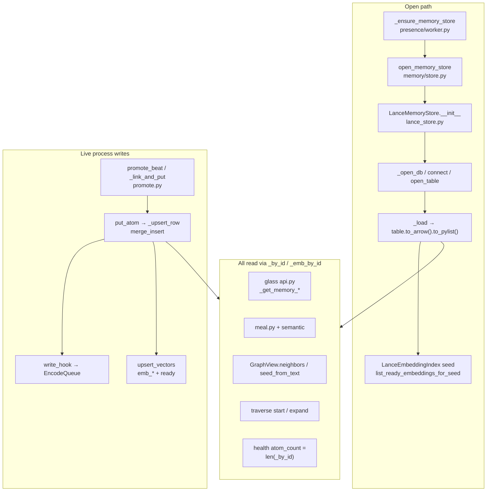

# Design: Lance Memory Truncation Fault Isolation (Inspection-Only)

| Field | Value |
|-------|--------|
| **Document** | Lance memory system deep inspection plan |
| **Author** | Grok Build (design); execution owner TBD (operator + memory engineer) |
| **Review owners** | Memory / stretch-2 owners; operator dogfood host |
| **Date** | 2026-07-29 |
| **Status** | Draft (revised post-review) |
| **Branch / dogfood** | `grok-improvement-memory` / project-elyra |
| **Work product (when executed)** | Isolated report package under `docs/lance-debug1/` only |
| **Intent** | Inspection and fault isolation — **no product fix** in primary scope |
| **Audience** | Senior engineers familiar with stretch-2 memory |

---

## Overview

Live dogfood on project-elyra shows a **disk vs process discrepancy** in the Lance-backed memory store: the on-disk `atoms.lance` dataset holds a **large** corpus (hundreds of atoms, majority `embedding_status=ready`), while after process restart the in-process `LanceMemoryStore` rebuilds indexes from a **thin** row set (~10–13 atoms). Glass Memory (Atoms / Vectors / Context meal) and directed traversal then operate on that thin world — not because promote failed, and not because disk lost data, but because **load reconstructs reality from a subset of rows**.

**Primary mechanism candidate (to confirm in P01):** under **lancedb 0.20.0** / **lance 0.23.2**, bare `Table.to_arrow()` materializes only a **default-limit query of 10 rows** (async path: `to_arrow` → `query().to_arrow()` with query-builder default limit 10) — not mysterious fragment truncation. Reviewer dogfood re-measure (2026-07-29): `count_rows=386`, `head(10000)=386`, bare `to_arrow().num_rows=10`; full recovery via public sync `head(n)` / `to_lance().to_table()` (and, where available, inner async `query().limit(n)`). The 10 rows match the **prefix** of `head(20)`. **Note:** sync `LanceTable` in 0.20.0 has **no** public `.query()` (`hasattr(table, "query") is False`); do not write probes that assume `table.query().limit(...)`. `LanceMemoryStore._load()` uses bare `to_arrow().to_pylist()` — i.e. **full-table load via a limited query API** — so restart systematically materializes only that prefix. Absolute row counts in this design are **snapshots** (see OBSERVED-FACTS); procedures use **relative** equality (`to_arrow ≪ count_rows`, process ≈ `to_arrow`).

This design defines a rigorous **inspection-only** plan: hypotheses, fault buckets, offline and in-process probes, version archaeology, evidence templates, and a closed doc package under `docs/lance-debug1/`. Execution produces a definitive bug dossier suitable for a later fix design. It does **not** implement the fix, change production memory defaults, or mix findings into stretch-2 product docs until deliberately promoted.

---

## Background & Motivation

### Current architecture (code map)



| Layer | Path | Role |
|-------|------|------|
| Factory | `elyra/memory/store.py` `open_memory_store` | `backend=lance` → `LanceMemoryStore`; soft fall-back to jsonl on ImportError / open failures |
| Store | `elyra/memory/lance_store.py` | Durable Lance under `data/memory/lance/`; in-memory `_by_id`, `_by_moment`, `_ladder`, `_emb_by_id` |
| Load | `LanceMemoryStore._load` L654–679 | **`rows = self._table.to_arrow().to_pylist()`** then rebuild indexes |
| Write | `put_atom` / `_upsert_row` L841–849 | `merge_insert("atom_id").when_matched_update_all().when_not_matched_insert_all().execute([row])` |
| Vectors | `upsert_vectors` L1018+ | Co-row emb columns; requires atom already in `_by_id` |
| Seed | `list_ready_embeddings_for_seed` L1608–1635 | Scans `_emb_by_id` ∩ ready — **not disk** |
| Health | `health()` L1794–1826 | `atom_count = len(self._by_id)` — **not disk truth** |
| Worker | `presence/worker.py` `_ensure_memory_store` | Single open per process; install encode hooks + embedding index |
| Promote | `memory/promote.py` `_link_and_put` | `moment_tail` / `global_tail` then `put_atom` + `update_links` |
| Index | `memory/index.py` `LanceEmbeddingIndex` | Open policy: full search below threshold; seed from store ready; IVF skip `below_ivf_min` (default 256) |
| Graph | `memory/graph.py` `GraphView` | Structural edges from atom fields; semantic via index |
| Traverse | `memory/traverse.py` | Temporal seeds free; `seed_from_text` under `expand_ms` |
| Glass | `runtime/api.py` `_get_memory_*` + `memory/inspect.py` | Serialize store/index health and atom lists for UI |
| Deps | `pyproject.toml` | `lancedb>=0.20,<0.21`, `pyarrow>=14` — dogfood: **lancedb 0.20.0**, **lance 0.23.2** |

### Observed bug facts (authoritative)

> **Snapshot labeling:** Absolute counts below are **dogfood snapshots at stated times**, not pass/fail constants. Every evidence run re-measures into `evidence/.../meta.json` and compares **relative** relations (`to_arrow` ≈ 10 default limit; full APIs ≫ that; process ≈ thin set).

1. **Disk vs process discrepancy**
   - **Snapshot A (design-time dogfood, earlier 2026-07-29):** full-table views ~**361** atoms (304 dated 2026-07-29; kinds tool/speak/obs/ledger/model/summary; ~**327** `embedding_status=ready`).
   - **Snapshot B (reviewer re-measure, 2026-07-29 later):** `count_rows=**386**`, `head(10000)=386`, bare `to_arrow().num_rows=**10**`; full via `head` / `to_lance().to_table()` (and optional private async `limit`); `_versions` manifests **1607**. Sync `LanceTable` has no public `.query()`.
   - `Table.count_rows()` reports full cardinality while bare `to_arrow()` returns **10** — **limited-query full-scan misuse** (primary H1 mechanism), not “disk lost data.”
   - Live `to_arrow` kind mix on snapshot B: **summary×6 + tool×4** (table **order prefix** / first 10 of `head`), **not** a haiku-only selection. Haiku dominance in glass/meal/traverse is a **consumer ordering / residual** effect on the thin `_by_id` set (and BUG-wake-02 adjacency), separate from which 10 rows `to_arrow` returns.

2. **LanceMemoryStore load path**
   - `_load()` uses `to_arrow().to_pylist()` exclusively (inherits default limit unless proven otherwise).
   - After restart, glass `atom_count` ~13; Atoms tab ~4 haiku tool atoms (newest-first among loaded); Context meal = episodic ladder + haiku prior-moment; Vectors `vectors_ready: 4`, ANN not built (`below_ivf_min`), meal semantic `no_index`.

3. **Promote still works in a live process**
   - Live `put_atom` upserts to disk; moment tapes (France riots, graphing tool, continuity, …) left hundreds of atoms on disk.
   - After restart those atoms remain on disk but are **absent from `_by_id`** if load only materializes the default-limit prefix (plus any rows put after open in that process).

4. **Directed traversal dogfood (non-visual impact)**
   - Moment `4fb55533…`: `memory_traverse_start` → only **6 temporal** seeds (current speak/obs + haiku tools); `expand_ms_budget=80` but `expand_ms_spent_last` ~94s / ~45s with `expand_truncated=true`; finish kept 4 haiku browser tools.
   - Model correctly chose haiku among the only candidates it saw (selection is rational on a truncated universe).
   - Graph sticky `last_session` cleared on moment close (by design) — secondary.

5. **Related but distinct**
   - **BUG-wake-02**: post-restart `wait_timeout` steers into haiku from residual glass/sandbox/meal (consumer of thin memory + other residue).
   - **BUG-mem-gpu-01**: ROCm/GPU embed path (adjacent performance; inflate expand_ms).
   - Semantic expand budget vs CPU Nemotron latency (adjacent; not root of missing atoms).

### Pain points

| Pain | Why it matters |
|------|----------------|
| Glass under-reports corpus size | Operator cannot trust Memory overview after restart (`atom_count` = process only) |
| Semantic / ANN starved | `vectors_ready` ≪ disk ready; `below_ivf_min` forever on thin loaded set |
| Directed traversal myopic | Temporal seeds + graph edges only over loaded atoms |
| Promote weave fractures across restart | Live process links against live `_by_id`; post-restart tails/links only among survivors |
| Migration/recovery also use `to_arrow` | `_migrate_vector_schema`, `_promote_staging_table` can inherit **same default limit** on full-table reads (future rewrite risk even when disk is currently full) |
| Version growth | Dogfood `atoms.lance/_versions` ~**1600+** manifests (snapshot B: **1607**) — write amplification; demote as root until default-limit H1a/H1b are resolved |

---

## Goals & Non-Goals

### Goals

1. **Fault-isolation inspection plan** with explicit hypotheses, experiments, and an evidence matrix mapping observations → fault buckets A–G.
2. **Concrete procedures** runnable offline (scripts against a copy or read-only open of `data/memory/lance`) and against a running Elyra instance (glass/API/logs) **without permanently mutating product defaults**.
3. **Doc package layout** under `docs/lance-debug1/` with named artifacts, templates, and “what each must prove.”
4. **Clear fault buckets** (A–G) so later fix work has a single primary root cause (or a ranked set) with confidence.
5. **Reproduction recipes** with expected observations at each step.
6. **Safety**: read-only preferred; write experiments only on **sandbox/copy** of data dir; never destroy operator Lance.
7. **Exit criteria**: evidence sufficient for a definitive bug description suitable as input to a fix design (not the fix itself), using **relative** multi-API equality — not a fixed atom total.
8. **Disambiguate** default query limit (H1a/H1b) before elevating version/fragment theories (H4/P08).

### Non-Goals

- Implementing the fix for truncated load / bare `to_arrow` (e.g. switching `_load` to `head` / `limit(n)` / `to_lance`) — including emergency operator patches **inside** lance-debug1 PRs.
- Implementing **BUG-wake-02** product hygiene (referenced only as a consumer/amplifier).
- Changing default product docs under `docs/stretch-2/**` beyond optional one-way cross-links **from** `docs/lance-debug1/`.
- Production feature work for Phase 2a (traversal, graph UX polish, etc.).
- Changing `MemorySettings` defaults, encode queue behavior, or ANN thresholds in production code paths.
- Whole-filesystem forensics outside the workspace data dir unless operator explicitly expands scope.
- Treating merge of `BUG-DOSSIER.md` as authorization to change `_load`.

---

## Proposed Design

### Design principle

Treat this as a **forensic investigation** with a sealed evidence bag:

- All inspection artifacts live under **`docs/lance-debug1/`**.
- Scripts are **hermetic helpers** colocated with that package (`docs/lance-debug1/scripts/`) so they never look like product entrypoints and are easy to drop after the investigation.
- Production modules under `elyra/memory/**` are **read and cited**, not patched, in the inspection PRs.
- Optional tests may assert **probe script behavior** on synthetic fixtures; they must not change LanceMemoryStore load semantics.

### Folder tree for `docs/lance-debug1/`

When the plan is executed (via PR plan below), operators/engineers populate:

```text
docs/lance-debug1/
├── README.md                          # Index: purpose, safety, how to run, status board
├── SAFETY.md                          # Read-only rules, quarantine copy protocol, forbidden ops
├── OBSERVED-FACTS.md                  # Frozen dogfood facts (this design's facts + updates)
├── HYPOTHESES.md                      # H1–Hn with status, confidence, linked evidence
├── FAULT-BUCKETS.md                   # A–G definitions, primary vs secondary, interactions
├── CODE-PATH-MAP.md                   # Open/load/write/consumer call graph + line refs
├── TO-ARROW-CALLERS.md                # Matrix: every to_arrow / head / scanner / count_rows site
├── API-COMPARISON.md                  # Results: to_arrow vs head vs to_table vs scanner vs count_rows
├── VERSION-ARCHAEOLOGY.md             # Sampling plan + results across Lance versions
├── REPRO-RECIPES.md                   # Step-by-step repros (offline + live process)
├── EVIDENCE-MATRIX.md                 # Observation × hypothesis × bucket → pass/fail
├── procedures/
│   ├── P01-offline-api-matrix.md      # Out-of-process lancedb/lance API matrix
│   ├── P02-load-path-parity.md        # Open LanceMemoryStore vs native counts
│   ├── P03-inprocess-vs-oop.md        # Running Elyra health vs offline probes
│   ├── P04-write-path-sandbox.md      # Promote/upsert on quarantine copy only
│   ├── P05-embed-index-adjacency.md   # Seed, vectors_ready, below_ivf_min chain
│   ├── P06-graph-traverse-meal.md     # Consumers under truncated vs full corpus
│   ├── P07-glass-serialization.md     # Glass atom_count / tabs vs store.health
│   ├── P08-version-sampling.md        # Safe historical version reads
│   └── P09-promote-weave-links.md     # Sequential link integrity disk vs process
├── evidence/
│   ├── _template-run.md               # Per-run template (env, versions, commands, outputs)
│   ├── _template-api-row.md           # Single API measurement row
│   ├── YYYY-MM-DD-run-NN/             # One directory per investigation run
│   │   ├── meta.json                  # host, git sha, lancedb/lance/py versions, data path
│   │   ├── api-matrix.json            # structured API comparison
│   │   ├── load-parity.json
│   │   ├── glass-snapshots/           # optional JSON from /api/memory/*
│   │   ├── notes.md
│   │   └── severity.md                # per-finding severity + confidence
│   └── ...
├── scripts/
│   ├── README.md                      # How to invoke; PYTHONPATH; quarantine env vars
│   ├── env_check.py                   # Print package versions, paths, backend settings
│   ├── api_matrix.py                  # Read-only API comparison (primary probe)
│   ├── load_parity.py                 # Open store (copy URI) vs native counts
│   ├── version_sample.py              # Sample historical versions safely
│   ├── caller_grep_report.py          # Optional: regenerate TO-ARROW-CALLERS from repo
│   ├── quarantine_copy.sh             # Copy full memory root (lance + meta + blobs/ladder)
│   ├── consumer_compare.py            # Optional P06: GraphView over head vs to_arrow row sets
│   └── fixtures/                      # Optional tiny synthetic tables for CI probes
│       └── README.md
├── adjacency/
│   ├── embed-queue.md
│   ├── graph-traverse.md
│   ├── meal-semantic.md
│   └── glass-api.md
└── BUG-DOSSIER.md                     # Final consolidated bug description (exit artifact)
```

**Isolation rule:** nothing under `docs/lance-debug1/` is a stretch-2 architecture normative doc. Optional footer in `README.md` may link *to* `docs/stretch-2/architecture/phase-2-semantic.md` and `docs/known-bugs.md` for context; stretch-2 docs are not updated until a deliberate promotion PR after the dossier is accepted.

### Quarantine layout (mandatory for store open)

`LanceMemoryStore` does **not** open a bare Lance URI alone. Open path uses:

| Path helper | Layout |
|-------------|--------|
| `ElyraPaths.data_dir` | e.g. `/tmp/lance-q-…/data` |
| `memory_root` | `{data_dir}/memory` |
| `lance_root` | `{data_dir}/memory/lance` (lancedb connect URI) |
| `memory_meta_path` | `{data_dir}/memory/meta.json` (**sibling** of `lance/`, not inside it) |
| blobs | `{data_dir}/memory/atoms/` (content_ref hydration) |
| ladder (optional) | `{data_dir}/memory/ladder/` — may be empty |

`quarantine_copy.sh` **must** copy at least:

1. `data/memory/lance/` (entire tree, including `_versions` / data fragments)
2. `data/memory/meta.json`
3. `data/memory/atoms/` if present (blob spill)
4. `data/memory/ladder/` if present (or create empty `ladder/` for layout parity)

into a quarantine tree with **one canonical marker rule** (KD15):

```text
$QUARANTINE_ROOT/                          # e.g. /tmp/lance-q-20260729
  .lance-debug1-quarantine                 # CANONICAL marker — only this path
  data/                                    # ELYRA_DATA_DIR / LANCE_DEBUG_DATA_DIR
    memory/                                # memory root (copy target of data/memory)
      meta.json
      lance/                               # lancedb URI → …/data/memory/lance
      atoms/                               # optional blobs
      ladder/                              # optional / empty
```

| Name | Canonical path | Used by |
|------|----------------|---------|
| **Quarantine root** | `$QUARANTINE_ROOT` | marker parent |
| **Marker (only)** | `$QUARANTINE_ROOT/.lance-debug1-quarantine` | `quarantine_copy.sh` (writes), `load_parity.py` (requires) |
| **data_dir** | `$QUARANTINE_ROOT/data` | `ElyraPaths`, `LANCE_DEBUG_DATA_DIR` |
| **memory root** | `$QUARANTINE_ROOT/data/memory` | copy source layout destination |
| **Lance URI** | `$QUARANTINE_ROOT/data/memory/lance` | `api_matrix.py --uri`, `LANCE_DEBUG_URI` |

**Canonical marker algorithm (implement exactly this — no alternate locations):**

1. `quarantine_copy.sh` always creates/updates **`$QUARANTINE_ROOT/.lance-debug1-quarantine`** (JSON or one-line stamp: source path, UTC time, optional writer PID, `possibly_torn` bool).
2. `load_parity.py` resolves `data_dir` from `--data-dir` / `LANCE_DEBUG_DATA_DIR`, then requires:
   `Path(data_dir).resolve().parent / ".lance-debug1-quarantine"`  
   i.e. **`{data_dir}/../.lance-debug1-quarantine`** with `data_dir` ending in `…/data`. Refuse with a clear error listing the expected absolute path if missing.
3. Do **not** accept markers at `data/.lance-debug1-quarantine`, `data/memory/.lance-debug1-quarantine`, or the memory-root parent alone.

`load_parity.py` builds `ElyraPaths` with that `data_dir`, `MemorySettings(backend="lance", …)`. **Do not** pass only `--uri …/lance` without the parent memory layout.

**Store open is W1**, even for “read parity”: `__init__` runs `_ensure_layout` (may write `meta.json`) and may `repair_joint_copies` (`merge_insert` on loaded rows).

### Key Decisions (summary; full section below)

1. Inspection-only; work product is `docs/lance-debug1/**`.
2. Scripts colocated under `docs/lance-debug1/scripts/` (not top-level `scripts/lance-debug1/`).
3. Quarantine = **full memory root**; store open is **W1** (meta + joint repair may write).
4. Primary H1 mechanism candidate: **`to_arrow()` = limited query (default 10)**, not mysterious fragment tip — confirm with H1a/H1b before weighting H4.
5. Preferred full-read probe order: `count_rows` → `head(n)` → bare `to_arrow` → H1a → **H1b fallback chain** (below) → `to_lance` → optional subprocess native.
6. Concurrent live copy / dual-connect on live URI is restricted (see SAFETY).
7. Still prove / disprove adjacent buckets so the dossier is not under-specified for fix design.
8. PR plan = scaffolding → probes → adjacency → dossier (docs/scripts only); early-exit when H1a+H2 high-confidence.

---

## Fault Buckets

Each finding in evidence runs must tag one or more buckets. Primary root cause may be A alone with B as the direct product impact path.

### Bucket A — lancedb client API (incl. **wrong API for full scan**)

**Scope:** Incomplete full-table materialization via lancedb 0.20.x `Table` methods — primarily **API misuse of a limited query**, secondarily true client defects.

| Signal | Interpretation |
|--------|----------------|
| `count_rows()` ≫ `len(to_arrow())` and `len(to_arrow()) == 10` | **Default query limit** (leading hypothesis) or other partial materialization |
| `to_arrow` row ids/order == `head(10)` **prefix** | Default-limit / table-order prefix — **not** random fragment tip / haiku filter |
| H1b fallback succeeds: full materialize via public API while bare `to_arrow` stays ~10 | Confirms limit/wrong-API throttle; full scan available without bare `to_arrow` |
| `head(N)` / `to_lance().to_table()` full while bare `to_arrow` thin | Method semantics differ; product must not use bare `to_arrow` for full load |
| Source: async `to_arrow` → `query().to_arrow()` default limit 10; sync `head(n)` is limit(n) under the hood | Library contract, not undocumented fragment magic |
| Sync `LanceTable` has no public `.query()` on 0.20.0 | H1b must not depend solely on `table.query()` |
| Only after H1a/H1b fail: no public full materialize path at all | True wrapper defect (secondary branch) |
| Reproducible on quarantine with same package versions | Not process-local memory corruption |

**Code touchpoints (read-only analysis):** all `to_arrow` sites in `lance_store.py` (see matrix). Fix direction for product (dossier only): stop using bare `to_arrow()` for full-table load; use `head(n)` / `limit(n)` / `to_lance().to_table()` with explicit full cardinality.

### Bucket B — LanceMemoryStore load / index rebuild

**Scope:** `_load`, secondary indexes, health reporting.

| Signal | Interpretation |
|--------|----------------|
| Disk full, `len(_by_id)` thin after open | Load path materializes subset |
| `health()["atom_count"]` matches thin set | Health is process-truth only (by design today — still a product footgun) |
| `_emb_by_id` only for loaded rows | Vector seed inherits load truncation |
| Corrupt-row skip path does not explain gap | Skip logs would need ~350 warnings |

**Critical code:**

```654:679:elyra/memory/lance_store.py
    def _load(self) -> None:
        """Rebuild in-memory indexes from the Lance table."""
        self._by_id.clear()
        self._by_moment.clear()
        self._ladder.clear()
        self._emb_by_id.clear()
        if self._table is None:
            return
        try:
            rows = self._table.to_arrow().to_pylist()
        except Exception:
            _LOG.exception("lance load failed")
            raise
        for row in rows:
            # ... atom_from_row, hydrate, index ...
        self._rebuild_secondary_indexes()
```

```1810:1814:elyra/memory/lance_store.py
            out: dict[str, Any] = {
                "ok": True,
                "backend": "lance",
                "atom_count": len(self._by_id),
```

### Bucket C — Write path / versioning / compaction

**Scope:** `merge_insert` upserts, version explosion, fragment layout. **Only elevated after H1a/H1b (default-limit) are tested.**

| Signal | Interpretation |
|--------|----------------|
| ~1 version per put × hundreds of atoms → ~1600+ versions | Expected under merge_insert-per-row; may stress readers / ops |
| Historical version N has non-decreasing row counts | Writes are durable; not silent drop |
| `to_arrow` prefix == `head(10)` **and** H1b chain recovers full (`head(n_full)` / `to_lance`) | **Demotes** “latest fragment only” / random fragment theories for bare `to_arrow` |
| Only if H1b fails: compaction/fragment layout still needed | Layout/read interaction remains open |
| Quarantine compact-then-read changes behavior | Compaction-related (still client/layout) — **never** compact live operator data |

**Note:** Write path working in live process is **already observed**; bucket C is about whether write *shape* contributes to read behavior, not whether promote fails mid-session. Version archaeology (P08) runs **after** default-limit disambiguation.

### Bucket D — Embed / index adjacency

**Scope:** Encode queue, `upsert_vectors`, `LanceEmbeddingIndex` seed/optimize, `below_ivf_min`.

| Signal | Interpretation |
|--------|----------------|
| Disk ready ~327, process `vectors_ready` ~4 | Load truncation (B) cascading to D — secondary |
| ANN notes `below_ivf_min:emb_joint:4` | Correct given thin corpus; not independent root |
| Encode queue backlog after restart for missing ids | Atoms not in `_by_id` → cannot upsert_vectors |
| BUG-mem-gpu-01 slow encode | Explains expand_ms overruns, **not** missing atoms |

Default knobs (`elyra/memory/config.py`): `ann_ivf_min_vectors=256`, `ann_full_search_below=2000`, `ann_recent_buffer_max=256`.

### Bucket E — GraphView / traverse / meal consumers

**Scope:** Behavior when store is thin; expand budgets; semantic omit reasons.

| Signal | Interpretation |
|--------|----------------|
| Temporal seeds only current + haiku tools | Consumers correctly reflect `_by_id` |
| `expand_truncated` + expand_ms_spent ≫ budget | Encoder latency (GPU/CPU) — **distinct** from truncation |
| Meal episodic haiku prior-moment | Meal reads store/ladder over thin set |
| `no_index` semantic | Index/seed empty relative to product expectations |

**Conclusion form:** E is almost always **downstream** of B unless a consumer bypasses store incorrectly (prove with full vs thin corpus comparison).

### Bucket F — Glass API serialization

**Scope:** `runtime/api.py` `_get_memory_*`, `inspect.py` list caps.

| Signal | Interpretation |
|--------|----------------|
| Glass `atom_count` matches `store.health()` thin count | Glass honest about process; not an extra truncation |
| List hard caps (`_ATOM_LIST_HARD_CAP=200`) | Cannot alone explain 13 vs 361 |
| Context meal snapshot stale vs recompose | Snapshot vs live compose nuance — document if present |

### Bucket G — Promote sequential weave / links

**Scope:** `_link_and_put` using `moment_tail` / `global_tail` over `_by_id`; link integrity after restart.

| Signal | Interpretation |
|--------|----------------|
| Disk has atoms with prev/next pointing outside loaded set | Weave broken in-process after thin load |
| Live promote continues linking among full live `_by_id` | G healthy during session |
| After restart, new promotes attach to thin tail only | Cascading weave fracture (secondary of B) |

---

## Hypotheses

Status values used in `HYPOTHESES.md` when executed: `untested` | `supported` | `refuted` | `partial` | `blocked`.

| ID | Hypothesis | Primary bucket | Priority |
|----|------------|----------------|----------|
| **H1** | Bare `lancedb.Table.to_arrow()` returns a thin subset (~**default limit 10**) while full-read APIs (`count_rows`, `head(n)`, `to_lance().to_table()`, H1b chain) return full corpus — product uses wrong full-scan API | A | P0 |
| **H1a** | Bare `to_arrow` rows equal **`head(10)` prefix** (same atom_ids / order), not a random or haiku-filtered subset | A | P0 (sub) |
| **H1b** | Full row count is recoverable without bare `to_arrow`, proving the thin read is a **limit/API choice**, not missing data. **Pass if any step of the H1b fallback chain** (P01) yields `num_rows == n_full`. Prefer recording which path worked. Library note: bare `to_arrow` uses default-limit query; sync `head(n_full)` is an accepted primary public proof on 0.20.0 | A | P0 (sub) |
| **H2** | `LanceMemoryStore._load` inherits H1 and builds `_by_id` from that subset; `health.atom_count` reflects process only | B | P0 |
| **H3** | Live `put_atom` / `merge_insert` correctly appends/updates disk (disk grows; promote works) | C (healthy) | P0 disconfirm |
| **H4** | Version growth / multi-fragment layout contributes to bare `to_arrow` thinness **beyond** default limit (e.g. only latest fragment) | A+C | P1 **after** H1a/H1b; demote if both hold |
| **H5** | Row skip/corrupt path in `_load` drops hundreds of rows | B | P1 disconfirm |
| **H6** | Embed queue / `upsert_vectors` independently lose vectors for atoms **present in `_by_id`** while disk emb ready | D | P1 disconfirm |
| **H7** | Glass serialization further truncates beyond store | F | P1 disconfirm |
| **H8** | Graph/traverse/meal have independent filtering that hides non-haiku atoms even when store is full | E | P1 disconfirm |
| **H9** | Post-restart promote weave only links among survivors, amplifying haiku skew for subsequent sessions | G | P2 cascade |
| **H10** | Migration path (`_migrate_vector_schema` / staging promote using bare `to_arrow`) is a **residual future risk** and only explains **historical** disk collapse if version archaeology shows non-monotonic row-count drop. **Does not** explain today’s full disk vs thin process when full APIs already show large corpus | A+B+C | P1 residual / historical |
| **H11** | Expand_ms overruns are primarily BUG-mem-gpu-01 / CPU Nemotron, not load truncation | D (adj.) | P2 separate |
| **H12** | BUG-wake-02 is a consumer of residual glass + thin meal, not the cause of missing Lance rows | E/F adj. | P2 separate |

**Sequencing:** Run H1a → H1b → H2 first. If H1a+H1b+H2 are high-confidence, draft a **provisional root-cause** statement immediately; demote H4/P08 to optional polish; adjacency (H6–H9, H11–H12) still documents cascade for the dossier but must not block that provisional statement.

---

## Code Path Map (inspection target)

### Open sequence

1. Worker `_ensure_memory_store` (`elyra/presence/worker.py` ~1160) when `write_atoms` or `enabled`.
2. `open_memory_store(paths, mem_cfg)` → import lancedb → `LanceMemoryStore(paths, cfg)`.
3. `__init__`: `_ensure_layout` → `_open_db` → `_load` → optional `repair_joint_copies`.
4. `_install_encode_hooks` + `_ensure_embedding_index` → `LanceEmbeddingIndex` open policy seeds from `list_ready_embeddings_for_seed` (process maps only).

### Read APIs that only see `_by_id` / `_emb_by_id`

- `get_atom`, `list_atoms`, `list_range`, `list_summaries`, `moment_tail`, `global_tail`, `walk_next` / `walk_prev`
- `list_ready_embeddings_for_seed`, `get_vectors` (via emb map)
- Glass atoms/vectors lists via inspect helpers
- Graph structural edges (atom fields); semantic search uses index built from process vectors
- Meal episodic / ladder / semantic packaging
- Traverse temporal seeds and neighbor expand

### Write APIs (live process)

- `put_atom` → `_upsert_row` (`merge_insert`)
- `update_links` → same upsert path (KD19 emb preserve via `_emb_by_id`)
- `upsert_vectors` (atom must exist in `_by_id`)
- Promote `_link_and_put` chains tails then put

### `to_arrow` / related call matrix (seed for `TO-ARROW-CALLERS.md`)

Line numbers are design-time pins against current tree; **re-grep when PR1 writes CODE-PATH-MAP.md**.

| Location | Approx line | Purpose | Risk if H1 (default limit) true |
|----------|-------------|---------|--------------------------------|
| `_atoms_table_is_empty` | ~388 | Fallback empty check after `count_rows` | Prefer `count_rows` first (already); bare `to_arrow` fallback weak |
| `_promote_staging_table` | ~452 | Staging → atoms | Staging promote may copy only default-limit rows |
| `_migrate_vector_schema` | ~518 | Phase 1→2 recreate+copy | **Future rewrite from partial rows** (H10 residual); historical only if P08 collapse |
| `_load` | ~663 | Rebuild indexes | **Primary restart bug path** |
| `search_vectors` result builder | ~1480 | Search hits materialization | Search result shape; separate from full-table load |

**Not using bare `to_arrow` for full load:** `_upsert_row` (merge_insert), `delete`, search path (lance native / python cosine). Empty check prefers `count_rows`.

---

## Procedures

Each procedure is a markdown file under `docs/lance-debug1/procedures/` with: purpose, prerequisites, safety class, exact commands, expected observations, evidence capture path, pass/fail criteria for hypotheses.

### Safety classes

| Class | Meaning | Allowed |
|-------|---------|---------|
| **R0** | Pure read of code / docs | Always |
| **R1** | Read-only **client** probes (`count_rows`, `head`, bare `to_arrow`, `to_lance`, H1b chain, `list_versions`) — no store open, no put/delete/migrate/compact | Quarantine preferred; live URI only when writer idle **or** explicitly accepted as concurrent-read risk (P03 exception) |
| **R2** | Read of running process via glass HTTP / logs | Live instance |
| **W1** | Any path that may write: **`LanceMemoryStore` open**, joint repair, put, migrate, meta ensure | Quarantine **data_dir** under marked `$QUARANTINE_ROOT` only |
| **FORBIDDEN** | `drop_table`, migrate on live, `delete` rows, `compact_files`, `cleanup_old_versions`, `optimize` (table), force compact live, delete operator `_versions` | Never in this investigation |

#### SAFETY.md rules (concrete)

1. **Quarantine default:** copy **full memory root** into `$QUARANTINE_ROOT/data/memory/` before W1; never open product store against live tree for parity probes.
2. **Concurrent writer / rsync:** Prefer **stop or pause Elyra** (or wait until idle — no promote/encode writes) before quarantine copy. Live `merge_insert` creates ~1 version per put; concurrent `rsync`/`cp -a` of multi-file `atoms.lance` can yield a **torn** snapshot (partial `_versions` / data fragments). If concurrent copy is unavoidable: record writer PID, uptime, and “possibly torn” in marker + evidence; do not treat torn counts as definitive H1b failures without a clean idle copy.
3. **P03 dual-connect:** Prefer **R2 glass** + **R1 on quarantine snapshot taken just after restart** (before heavy promote). Dual `lancedb.connect` on the **live** URI while the writer is open is **discouraged**; only with explicit operator accept and documented multi-connect hazard.
4. **Script allowlist (read probes):** `connect`, `open_table`, `table_names`, `count_rows`, `head`, bare `to_arrow`, `to_lance` (+ dataset `to_table`/`count_rows` read-only), `list_versions`, `checkout` (read-only if non-mutating), schema inspection; **optional** private/async query-limit only inside H1b chain step 2 (documented, not primary).
5. **Script deny-list:** `merge_insert`, `add`, `delete`, `drop_table`, `create_table` (except fixture builders under `fixtures/`), `compact_files`, `cleanup_old_versions`, `optimize`, any migrate helper that rewrites tables on operator paths.
6. **Marker (canonical only):** W1 scripts require  
   `Path(data_dir).resolve().parent / ".lance-debug1-quarantine"`  
   i.e. **`$QUARANTINE_ROOT/.lance-debug1-quarantine`** when `data_dir=$QUARANTINE_ROOT/data`. Optional override: `ELYRA_LANCE_ALLOW_WRITE=1` **and** the same marker path still present (marker is never optional for W1). Refuse otherwise with the expected absolute path in the error.
7. **`version_sample.py`:** use `Table.list_versions` / read-only checkout only — **never** `optimize` / `compact_files` / `cleanup_old_versions`.

### P01 — Offline API matrix (R1)

**Prove / disprove:** H1, H1a, H1b, A (and demote H4 if H1a+H1b hold)

**Script:** `docs/lance-debug1/scripts/api_matrix.py`

Against Lance URI (prefer quarantine `…/memory/lance`; live only if idle/accepted):

**Preferred probe order (safe full-read first):**

| Priority | API | Record |
|----------|-----|--------|
| 1 | `table.count_rows()` | n_full |
| 2 | `table.head(n_full)` if n_full ≤ cap else `head(10000)` — prefer **full** when feasible | n_head, first 20 atom_ids |
| 3 | `table.head(10)` → atom_ids | prefix_10 |
| 4 | bare `table.to_arrow()` → num_rows + atom_ids | n_arrow, arrow_ids |
| 5 | **H1a:** `arrow_ids == head(10) atom_ids` (order-sensitive) | bool |
| 6 | **H1b fallback chain** (stop at first success; record `h1b_path`) | see below |
| 7 | `table.to_lance().count_rows()` / `to_table().num_rows` (may also satisfy H1b step 3) | n_lance |
| 8 | `table.list_versions()` length / sample (read-only) | n_versions |
| 9 | Optional: `lance.dataset(...).count_rows` / `to_table` in **subprocess** | only if to_lance insufficient |
| 10 | `scanner` | **only if** `hasattr(table, "scanner")` — **not** on sync `LanceTable` 0.20.0; skip with note |
| — | Schema includes emb_*? | bool |
| — | Kind + embedding_status hist on **full** path | hist_full |
| — | Kind hist on bare `to_arrow` path | hist_arrow = **table-order prefix**, not haiku skew |

##### H1b fallback chain (implement exactly; do **not** assume public `table.query()`)

On **lancedb 0.20.0**, sync `LanceTable` has **`hasattr(table, "query") is False`**. Naive `table.query().limit(n)` → `AttributeError` must **not** mark H1b blocked if a later step succeeds.

| Step | Probe | When to use | Success criterion |
|------|-------|-------------|-------------------|
| **H1b-1** | `getattr(table, "query", None)` then `table.query().limit(n_full).to_arrow()` | Only if public `query` exists (future lancedb) | `num_rows == n_full` |
| **H1b-2** | Optional: asyncio path on private inner table if exposed, e.g. `table._table.query().limit(n_full).to_arrow()` (read-only; wrap try/except; **not** required for pass) | Dogfood discovery / library confirmation only | `num_rows == n_full` |
| **H1b-3** | **Primary public proof on 0.20.0:** `table.head(n_full).num_rows == n_full` **and** bare `to_arrow` stays thin (~10) **and** evidence notes that bare `to_arrow` is default-limit query while `head(n)` is the explicit full/limited read API | Always available on sync Table | bool true |
| **H1b-4** | `table.to_lance().to_table().num_rows == n_full` (or `to_lance().count_rows()`) | If head path contested or for corroboration | `== n_full` |

**H1b overall pass:** any of H1b-1…H1b-4 succeeds **while** `n_arrow ≪ n_full` (typically `n_arrow == 10`). Write into `api-matrix.json`:

```json
"h1b": { "ok": true, "path": "head_n_full", "n_full": 386, "n_arrow": 10, "attempts": ["query_public_missing", "head_n_full"] }
```

**Also record:** package versions; cite installed lancedb sources when useful (`to_arrow` → default-limit query; `head` → `limit(n)` under the hood on async stack).

**Expected if H1 + H1a + H1b supported:**

- `n_arrow == 10` (or documented default limit)
- `n_full == n_head` (when head used full) and/or `to_lance` full; **do not** hardcode 361/386
- H1a true (prefix equality)
- H1b true via **recorded** fallback path (on 0.20.0 expect `path=head_n_full` and/or `to_lance`)
- `hist_arrow` matches first 10 of full table order — **haiku skew is not required for H1**

**If H1a+H1b hold:** mark H4 **demoted** unless other evidence re-opens fragment theories.

**Evidence:** `evidence/YYYY-MM-DD-run-NN/api-matrix.json` + notes.

### P02 — Load path parity (**W1** on quarantine memory root)

**Prove / disprove:** H2, H5, B

**Class W1** (not pure R1): store open may write meta + joint repair.

1. Run `quarantine_copy.sh` when writer idle (or accept torn risk) → creates `$QUARANTINE_ROOT/.lance-debug1-quarantine`.
2. Build `ElyraPaths(data_dir=$QUARANTINE_ROOT/data)` + `MemorySettings(backend="lance")`; require marker at `{data_dir}/../.lance-debug1-quarantine` only.
3. Construct `LanceMemoryStore` / `open_memory_store`.
4. Compare:
   - `store.health()["atom_count"]` vs `n_arrow` vs `n_full`
   - `store.health()["vectors_ready"]`
   - set of atom_ids in `_by_id` vs `to_arrow` ids vs full `head` ids
5. Count “skipping corrupt lance row” log lines (H5) — expect ≪ gap.

**Expected if H2:** `atom_count ≈ n_arrow` (≈ 10); `n_full ≫ process`; skip count ≪ gap.

### P03 — In-process vs out-of-process (R2 + R1 on snapshot)

**Prove / disprove:** process-specific vs pure client (H1 universal)

1. With Elyra running **just after restart**, before heavy promote: capture glass `GET /api/memory`, `/api/memory/atoms?limit=200`, `/api/memory/vectors`.
2. Take **quarantine snapshot** (idle preferred) and run P01 on the **snapshot**, not dual-connect on live URI.
3. Compare glass `atom_count` / vectors to snapshot `n_arrow` / `n_full`.

**Expected:** glass matches thin process (~`n_arrow` order); snapshot `n_full` still large → not glass-only; load already thin at open.

**Discouraged:** concurrent offline `connect` to live `data/memory/lance` while writer active — only with operator accept + “multi-connect / possibly torn” tag.

### P04 — Write path sandbox (W1 only)

**Prove / disprove:** H3, H4 partially, C healthy

On quarantine copy only:

1. Snapshot API matrix.
2. `put_atom` one synthetic atom via LanceMemoryStore (or thin harness).
3. Re-run API matrix: disk counts +1 on full paths; process `_by_id` +1.
4. Optional: many puts to grow versions; re-check whether `to_arrow` truncation ratio changes.
5. **Never** run against live operator dir.

### P05 — Embed / index adjacency (R1/R2)

**Prove / disprove:** H6, H11 secondary

1. From full materialization: count ready on disk.
2. From process health: `vectors_ready`, `vectors_by_channel`, index notes (`below_ivf_min`, `ann_index_built`, `no_index`).
3. Confirm `list_ready_embeddings_for_seed` length ≤ process ready.
4. Document encode queue depth if exposed; do not require GPU.

**Expected:** D symptoms are **numerically explained** by B (thin load). H6 only if ready vectors missing for ids **inside** `_by_id` while disk row has emb columns.

### P06 — Graph / traverse / meal (R2 + optional offline harness)

**Prove / disprove:** H8, H11, H12

1. Replay or inspect moment `4fb55533…` tape / traverse session JSON if logged.
2. With thin store: temporal seeds ⊆ loaded atoms; structural neighbors only among loaded.
3. **No patched product `_load`.** Optional script `docs/lance-debug1/scripts/consumer_compare.py` (PR4):
   - Materialize row set A = bare `to_arrow` (thin).
   - Materialize row set B = `head(n_full)` or `to_lance().to_table()` (full; same as H1b public paths).
   - Build two ephemeral in-memory / Jsonl stores (or minimal dict-backed fakes implementing get/list neighbors need).
   - Run `GraphView.neighbors` / seed listing over A vs B; record seed counts and whether non-haiku atoms appear only on B.
4. Document glass newest-first list among `_by_id` may surface haiku tools even when thin set’s table-order prefix was summary-heavy (split expectation A/B/C under adjacency notes).

### P07 — Glass serialization (R2)

**Prove / disprove:** H7

Compare `store.health()` fields embedded in glass payload vs process truth. List endpoint caps (`_ATOM_LIST_HARD_CAP=200`) vs reported atom_count ~10–13 — cap cannot be root. Separate **list order** (newest-first haiku tools) from **raw to_arrow prefix** kinds.

### P08 — Version archaeology (R1, careful; **after** H1a/H1b)

**Prove / disprove:** H3 (historical growth), H4 (only if still open), H10 (historical collapse only)

Dogfood observation: `_versions` ~**1600+** manifests (snapshot B: 1607); counts grow over time under merge_insert.

**When to run:** Prefer **after** P01 confirms or refutes default-limit. If H1a+H1b hold, P08 is **optional polish** (ops interest + H10 residual), not on the critical path to a provisional dossier.

**Safe sampling plan:**

1. Prefer `Table.list_versions` / read-only `checkout` (lancedb 0.20.0 exposes `list_versions`) — **never** cleanup/compact/optimize.
2. Prefer `to_lance` row counts over in-process `lance.dataset` when possible.
3. If using `lance.dataset`, run in a **subprocess** with timeout (segfault class).
4. Sample versions: first, 25%, 50%, 75%, latest — record `version_id`, row count, max `t_start` if cheap.
5. **H10 supported only if** non-monotonic **collapse** in historical row counts; if latest full APIs already show large corpus, H10 is **not** the active process-thin bug — residual risk for **future** migrate/reopen using bare `to_arrow`.
6. Do not delete old versions; do not compact live data.

### P09 — Promote weave / links (R1)

**Prove / disprove:** H9, G

On full materialization of disk rows:

1. Build graph of prev/next.
2. Count edges where endpoint atom_id missing from thin `to_arrow` set.
3. Identify “islands” and whether thin set is a recent contiguous tip or random sample.

**Expected if load is “latest fragment / tip only”:** thin set may be recent-by-version tip; if random, different client bug.

---

## Evidence Matrix

| Observation | Supports | Refutes | Bucket |
|-------------|---------|---------|--------|
| `count_rows` ≫ `to_arrow` (~10); full APIs large | H1 | | A |
| `to_arrow` ids/order == `head(10)` prefix | H1a | H4 “random/latest fragment only” as sole explanation | A |
| H1b chain: `head(n_full)` and/or `to_lance` full while bare `to_arrow` ~10 | H1b | “impossible full materialize via lancedb” | A |
| `hasattr(table, "query") is False` on 0.20.0 sync Table | (impl note) | treating missing `table.query` as H1b failure | A |
| Library: bare `to_arrow` default-limit query; `head(n)` explicit full read | H1 / H1b | mysterious undocumented fragment magic as primary | A |
| `_load` uses bare `to_arrow` only | H2 | | B |
| Post-restart glass atom_count ~ process thin set | H2 | H7 alone | B, F |
| Disk retains France riots / continuity atoms (full APIs) | H3 | “promote never wrote” | C healthy |
| Live promote during session works | H3 | | C healthy |
| `vectors_ready` tiny, `below_ivf_min` | H2→D cascade | H6 as primary | D secondary |
| Traverse few temporal seeds; keep set haiku tools | H2→E | H8 as primary | E secondary |
| Glass newest-first shows haiku tools among thin `_by_id` | consumer order | “to_arrow selects haiku” (H1a fails if assumed) | E/F |
| Raw `to_arrow` kinds summary+tool prefix (not haiku-only) | H1a table order | haiku-required for P01 pass | A |
| expand_ms_spent ≫ 80ms | H11 | “truncation causes 94s” | D adj |
| wait_timeout → haiku after restart | H12 | as root of Lance gap | wake adj |
| Corrupt skip count ~0 | | H5 | B |
| Glass list cap 200, count ~10–13 | | H7 | F |
| Version history row counts non-decreasing to large N | H3; H10 not active now | H10 as explanation of **current** thin process | C |
| Version history sudden collapse then partial | H10 historical | | A+C |
| Missing emb only for ids **in** `_by_id` with disk ready | H6 | H6 if none such | D |

---

## Reproduction Recipes

### Recipe R1 — Offline smoking gun (primary)

**Prereq:** venv with `elyra[memory-lance]`; dogfood under `data/memory/`.

```bash
# Canonical layout: QUARANTINE_ROOT, data_dir, marker, lance URI
QROOT=/tmp/lance-q-$(date +%Y%m%d)
# Args: SRC_MEMORY_ROOT  QUARANTINE_ROOT
# Copies src → $QROOT/data/memory/ and writes $QROOT/.lance-debug1-quarantine
./docs/lance-debug1/scripts/quarantine_copy.sh data/memory "$QROOT"

export LANCE_DEBUG_DATA_DIR="$QROOT/data"
export LANCE_DEBUG_URI="$QROOT/data/memory/lance"

python docs/lance-debug1/scripts/api_matrix.py \
  --uri "$LANCE_DEBUG_URI" \
  --out docs/lance-debug1/evidence/$(date +%Y-%m-%d)-run-01/api-matrix.json

# Later W1 (PR3): load_parity requires marker at $QROOT/.lance-debug1-quarantine
# python docs/lance-debug1/scripts/load_parity.py --data-dir "$LANCE_DEBUG_DATA_DIR" ...
```

**Expect:** bare `to_arrow_rows` ≈ 10; `count_rows` / `head(n_full)` / `to_lance` agree on large N; H1a prefix equality; H1b `ok` with `path` recorded (on 0.20.0 typically `head_n_full`). **Absolute N is run-specific.**

### Recipe R2 — Process restart thin world

1. Ensure backend `lance`, memory write enabled; corpus already large on disk (or use dogfood data).
2. Restart Elyra process.
3. Immediately: glass Memory overview → note `atom_count`, Vectors `vectors_ready`, Atoms tab (newest-first among loaded — may show haiku tools).
4. Idle copy + R1 on quarantine (not dual live connect).
5. **Expect:** glass ≈ thin process; quarantine full APIs large; glass kind skew ≠ required raw `to_arrow` kind mix.

### Recipe R3 — Live promote still writes disk

1. In a live process (even if started thin — **or** mid-session before restart): perform work that promotes many atoms.
2. Offline full count increases; process `atom_count` increases in-session.
3. Restart → process collapses to ~default-limit thin again; disk stays large.

### Recipe R4 — Directed traversal dogfood shape

1. After thin restart, run `memory_traverse_start` in a moment with recent haiku tools in store.
2. Observe seed list size/kinds; expand_truncated; finish keep set.
3. Record session JSON into evidence (no product change).

### Recipe R5 — Consumer residual (BUG-wake-02) — do not confuse with H1

1. After restart, allow `wait_timeout` to fire.
2. Note model rationale referencing haiku/sandbox.
3. File under adjacency notes; link known-bugs BUG-wake-02; **do not** treat as Lance root without R1 (H1a/H1b).

---

## API / Interface Changes

**None in product.** Inspection scripts may expose a small CLI interface:

```text
api_matrix.py --uri PATH --table atoms --out PATH.json [--subprocess-native]
load_parity.py --paths-root PATH --out PATH.json
version_sample.py --dataset PATH --samples 5 --out PATH.json
env_check.py
```

Optional future fix (out of scope) would change `_load` and migration readers — only described in BUG-DOSSIER “recommended fix direction,” not implemented.

---

## Data Model Changes

**None.** Inspection may **document** physical layout:

- Table: `atoms` under `data/memory/lance/`
- Dataset dir: `atoms.lance/` with `_versions`, `_transactions`, `_deletions`, `data`
- Columns: scalar `_STRING_COLS` + `schema_version` + `emb_{text,image,audio,video,joint}` + `embed_model` + `encoded_at`
- meta.json: `backend`, `vector_schema_version`, `emb_dim`, …

Migration strategy for fixes is **out of scope**; H10 may recommend “verify no truncated migration rewrite” as a pre-fix checklist.

---

## Recommended Scripts (behavior)

### `quarantine_copy.sh`

```text
Usage: quarantine_copy.sh <SRC_MEMORY_ROOT> <QUARANTINE_ROOT>
Example: quarantine_copy.sh data/memory /tmp/lance-q-20260729
```

- Source: **`data/memory`** (memory root), not lance-only.
- Creates `$QUARANTINE_ROOT/data/memory/` and copies src → that path (`meta.json`, `lance/`, `atoms/`, `ladder/` as present).
- **Always** writes marker **only** at `$QUARANTINE_ROOT/.lance-debug1-quarantine` (never under `data/` or `memory/`).
- Refuse if `$QUARANTINE_ROOT` resolves under live workspace `data/`.
- Warn if Elyra PID appears to hold the live path (best-effort); recommend idle/stop.
- Print for copy-paste:
  - `LANCE_DEBUG_DATA_DIR=$QUARANTINE_ROOT/data`
  - `LANCE_DEBUG_URI=$QUARANTINE_ROOT/data/memory/lance`
  - `MARKER=$QUARANTINE_ROOT/.lance-debug1-quarantine`

### `api_matrix.py` (core)

- Connect lancedb; run preferred probe order including **H1b fallback chain** (public `query` if present → optional private async → **`head(n_full)` primary on 0.20.0** → `to_lance`).
- Emit H1a bool + H1b `{ok, path, attempts}`; never hardcode expected full count; never require public `table.query()`.
- Native `lance.dataset` only behind `--subprocess-native`.
- **Deny-list enforcement:** no `merge_insert` / `delete` / `drop_table` / `add` / `compact_files` / `cleanup_old_versions` / `optimize`.

### `load_parity.py`

- Args: `--data-dir` / `LANCE_DEBUG_DATA_DIR` (must be `…/data`).
- **Marker check (sole rule):** `marker = Path(data_dir).resolve().parent / ".lance-debug1-quarantine"`. Refuse with absolute path if missing.
- Build `ElyraPaths` with that `data_dir` so `memory/lance` + `memory/meta.json` resolve; `backend=lance`.
- Classify as **W1**; open `LanceMemoryStore`; dump health + id set hash + count.
- Compare to api_matrix `n_full` / `n_arrow`.
- Exit non-zero if process count ≈ `n_arrow` and process ≪ `n_full` (H1+H2 signature) — useful for CI **fixture**, not absolute operator counts.

### `version_sample.py`

- `list_versions` + read-only row-count sampling; **never** compact/optimize/cleanup.
- Emit JSON for VERSION-ARCHAEOLOGY.md.

### `consumer_compare.py` (optional, PR4)

- Offline GraphView / seed comparison over thin vs full row sets (P06); no product imports that open live data by default.

### `caller_grep_report.py`

- Regenerate TO-ARROW-CALLERS.md from repo (+ optional note to inspect installed lancedb `table.py`/`query.py` for default limit).

### Fixtures

- Tiny synthetic multi-version table under `docs/lance-debug1/scripts/fixtures/` **for tests only** — optional PR2.

---

## Alternatives Considered

### Alt 1 — Fix first (change `_load` to `head` / `limit(n)` / `to_lance`), inspect later

| Pros | Cons |
|------|------|
| Faster operator relief if H1b already known | Migration paths still use bare `to_arrow`; risk incomplete fix; skips sealed evidence |
| Small code change | Violates inspection-only mandate |

**Rejected for this design’s primary intent.** Preferred fix *direction* (dossier only, after H1a/H1b): replace full-table bare `to_arrow()` with **`head(n)` / explicit `limit(n)` / `to_lance().to_table()`** after reading `count_rows` — not “work around mysterious truncation.” Emergency operator mitigation remains **strictly out-of-band** (private branch / local patch), **never** in `docs/lance-debug1/` PRs and **never** authorized by merging the dossier.

### Alt 2 — Instrument production store with dual-count health and ship

| Pros | Cons |
|------|------|
| Ongoing detection | Changes production behavior/metrics surface; still not root proof |
| Low cost | Scope creep; not isolated under lance-debug1 |

**Deferred** to fix design; investigation may **recommend** dual-count health as fix follow-on.

### Alt 3 — Full product redesign (query Lance per request, drop in-memory indexes)

| Pros | Cons |
|------|------|
| Avoids load truncation class | Huge Phase redesign; latency/locking; out of scope |

**Rejected** for this investigation.

### Alt 4 — This design: sealed forensic package + read-only probes

| Pros | Cons |
|------|------|
| Isolates docs/scripts; safe; complete evidence for fix + possible upstream bug | Operator still lives with bug until fix PR |
| Separates A vs B vs consumers | More upfront writing |

**Selected.**

---

## Security & Privacy Considerations

| Topic | Handling |
|-------|----------|
| Atom content | Evidence scripts default to **ids, kinds, timestamps, counts** — not full `content_text`. Optional `--include-snippets` behind explicit flag; never commit large private text without operator review |
| Quarantine dirs | Keep under `/tmp` or operator-private path; do not push quarantine data to remote |
| Secrets | Memory atoms may contain tool outputs; treat evidence like dogfood logs |
| Process attack surface | Scripts are offline tools; do not open network ports |
| Destructive / mutate ops | **Deny-list** in all probe scripts: `merge_insert`, `add`, `delete`, `drop_table`, `compact_files`, `cleanup_old_versions`, `optimize`, migrate rewrite helpers. W1 only with **marker** `.lance-debug1-quarantine` (and optional `ELYRA_LANCE_ALLOW_WRITE=1` under allowlisted prefix) |
| Concurrent copy | Torn multi-file dataset risk; see SAFETY rules — prefer stop/idle writer |

Threat model for inspection: **accidental data loss / torn snapshot misread** > confidentiality of counts. Highest severity risk is operator running write/compact experiments on live Lance.

---

## Observability

### During investigation

- Script JSON artifacts under `evidence/…`
- Optional: capture Elyra logs around open (`lance load failed`, corrupt skips, emb migration warnings)
- Glass snapshots as JSON files

### Recommended metrics for later fix design (not implemented here)

| Metric | Why |
|--------|-----|
| `memory.lance.disk_row_count` vs `memory.lance.process_atom_count` | Detect H1/H2 regression |
| `memory.lance.load_source` (to_arrow / head / scanner) | After fix, know which path |
| Alert if `disk - process > 0` after open | Dogfood safety |

### Severity rubric for evidence notes

| Severity | Meaning |
|----------|---------|
| **S0** | Data loss or unrecoverable live destroy (must not happen) |
| **S1** | Corpus invisible after restart (this bug class) |
| **S2** | Consumer wrong answers with full corpus (independent) |
| **S3** | Perf / expand_ms / GPU |
| **S4** | Cosmetic glass |

Confidence: `high` / `medium` / `low` per finding.

---

## Rollout Plan (for inspection PRs)

| Stage | Content | Flag / risk |
|-------|---------|-------------|
| PR1 | Scaffold `docs/lance-debug1/` tree + SAFETY + templates + caller_grep | Docs only |
| PR2 | `api_matrix` (H1a/H1b) + `env_check` + quarantine_copy (full memory root) + P01 | No product behavior change; may confirm H1 early |
| PR3 | `load_parity` (W1 + marker) + `version_sample` (read-only) + P02/P08 | Never open live store |
| PR4 | Adjacency writeups + `consumer_compare` optional + P03–P07/P09 | R2 docs; non-blocking for provisional dossier |
| PR5 | Evidence fill + BUG-DOSSIER; **no `_load` authorization** | Still docs only |

**Early-exit:** after PR2–PR3 dogfood evidence, provisional root-cause allowed if H1a+H1b+H2 high-confidence.

**Rollback:** delete or revert docs PRs; no runtime rollback needed.

**Feature flags:** none for product. Scripts may use env:

- `LANCE_DEBUG_URI` — override Lance table URI (`…/memory/lance`)
- `LANCE_DEBUG_DATA_DIR` — quarantine `data_dir` for `load_parity`
- `LANCE_DEBUG_SUBPROCESS_NATIVE=1` — native lance in subprocess
- `ELYRA_LANCE_ALLOW_WRITE=1` — only with canonical marker still present under `$QUARANTINE_ROOT`

---

## Risks

| Risk | Severity | Mitigation |
|------|----------|------------|
| Native `lance` / `lancedb.connect` **segfault** (uncatchable; `open_memory_store` docs already warn) | High | Prefer `to_lance` / table APIs; subprocess for native dataset; never destructive recovery mid-segfault |
| Joint repair / open writes mutate data | High on live | Store open = **W1**; quarantine memory root + marker; never live open for parity |
| Concurrent rsync while writer active → **torn** dataset | High | Stop/idle writer; tag evidence “possibly torn”; re-copy when idle |
| Dual live connect multi-connect hazards | Med | P03 prefers glass + snapshot, not dual live connect |
| Operator compact/optimize “to help versions” | High | Deny-list in scripts; FORBIDDEN on live |
| Mis-attributing BUG-wake-02 / GPU / haiku glass list as H1 | Med | H1a prefix test; H11/H12; split expectations |
| H10 historical collapse | Med (only if non-monotonic history) | P08 after H1a/H1b; if disk full now, H10 residual for future migrate only |
| Over-running P08 archaeology after H1 already proven | Low | Early-exit ramp: provisional dossier when H1a+H1b+H2 high-confidence |
| Committing sensitive atom text | Med | Snippet policy; review before push |

---

## Exit Criteria

The inspection is complete when `docs/lance-debug1/BUG-DOSSIER.md` can state all of the following with evidence links:

1. **Primary root cause bucket(s)** with confidence ≥ high for A and/or B (or explicit refutation with alternative). Prefer naming mechanism: **default-limit / wrong full-scan API** if H1a+H1b hold.
2. **Quantitative relative table** from at least one dogfood run: `n_full`, `n_arrow`, `n_head`, H1b `{ok, path}`, process `atom_count`, H1a bool — **not** a fixed expected total of 361/386.
3. **H3:** proof promote/disk still durable on full-read APIs (disk large and non-decreasing under use). **H10** separately: only claim historical rewrite if P08 shows collapse; otherwise document residual migrate risk without making H10 mutually exclusive with “disk full now.”
4. **Consumer cascade** explained (glass, vectors, meal, traverse) as secondary to load, or independent bugs filed separately — including split of raw `to_arrow` prefix vs glass newest-first haiku.
5. **Adjacent bugs** (BUG-wake-02, BUG-mem-gpu-01, expand budget) labeled non-root with one-paragraph justification each.
6. **Recommended fix directions** (non-normative, **not authorized by merging dossier**): replace bare `to_arrow()` full load with `head`/`limit`/`to_lance`; dual-count health; audit migration `to_arrow` sites; optional upstream issue only if true defect remains after limit clarification — **not implemented in this workstream**.
7. **Reproduction R1+R2** reproducible by a second engineer following REPRO-RECIPES.md.
8. No production code behavior change required for dossier acceptance. **Merging BUG-DOSSIER does not authorize `_load` change.**

### Early-exit ramp (investigation timebox)

If **P01** establishes H1a+H1b high-confidence and **P02** establishes H2 (process ≈ `n_arrow` ≪ `n_full`), engineers **may draft a provisional root-cause section** of the dossier immediately (after PR2–PR3 evidence). PR4 adjacency polish and optional P08 must not block that provisional statement. Full exit still wants cascade writeups, but critical path is H1a/H1b/H2 + H3 durability.

---

## Open Questions

| # | Question | Default if undecided | Owner |
|---|----------|----------------------|-------|
| Q1 | Always quarantine before any script, or allow R1 against live URI when idle? | **Quarantine by default**; live R1 only when idle + accepted; no dual live connect for P03 | Operator |
| Q2 | Commit filled `evidence/YYYY-MM-DD-run-*/` JSON to git, or keep local-only? | Commit **counts/ids only**; keep snippets local | Engineer + operator |
| Q3 | Is native lance segfault environment-specific (Python 3.14 vs 3.12)? | Record both in env_check; prefer `to_lance` first; 3.12 for native if needed | Engineer |
| Q4 | File upstream lancedb issue once H1 confirmed? | Only if something remains defective **beyond** documented default limit misuse; otherwise product-bug dossier is enough | Engineer |
| Q5 | Emergency operator mitigation (patch `_load` to `head`/`limit`) before fix design? | Strictly out of band; never in lance-debug1 PRs | Operator |
| Q6 | Include moment tape cross-check for H10? | Yes if version archaeology shows collapse | Engineer |
| Q7 | Path for scripts: `docs/lance-debug1/scripts/` vs `scripts/lance-debug1/`? | **docs colocated** (KD2) | — |
| Q8 | Which H1b path works on operator Python/lancedb build? | On 0.20.0 expect **no** public `table.query`; pass via **`head(n_full)`** and/or **`to_lance`**; log optional private async if tried. Discovery only — not a blocker | Engineer |

---

## Key Decisions

| ID | Decision | Rationale |
|----|----------|-----------|
| **KD1** | Inspection-only; no product fix in this work stream | Preserve clean evidence; avoid incomplete patch; mandate matches dogfood isolation need |
| **KD2** | All work product under `docs/lance-debug1/`; scripts colocated in `docs/lance-debug1/scripts/` | Isolation from stretch-2 product docs and top-level product scripts; easy to archive |
| **KD3** | Quarantine = **full memory root** under `$QUARANTINE_ROOT/data/memory/`; marker required | Store open needs `ElyraPaths` memory layout; bare lance URI is insufficient |
| **KD4** | Primary smoking-gun path is bare `to_arrow` → `_load` (H1→H2); **mechanism candidate = default query limit 10** (H1a/H1b first) | Reviewer dogfood + library path; avoids over-weighting fragment/version theories |
| **KD5** | Preferred full-read probe order: `count_rows` → `head` → bare `to_arrow` → H1a → **H1b fallback chain** → `to_lance` → optional subprocess native; **do not require public `table.query()`** | Sync LanceTable 0.20.0 has no `.query()`; `head(n_full)` is the public full-read proof |
| **KD6** | Evidence defaults to counts/ids/kinds/timestamps, not full atom bodies | Privacy + smaller git surface |
| **KD7** | PR plan is docs/scripts only; optional hermetic tests of scripts on fixtures | Independently reviewable; zero production memory behavior change |
| **KD8** | Consumers (glass, meal, graph, traverse) documented as cascade unless disproven | Matches architecture (all read `_by_id`) |
| **KD9** | BUG-wake-02 and BUG-mem-gpu-01 stay in known-bugs; cross-linked, not re-homed | Distinct root causes; dossier references only |
| **KD10** | Exit artifact is `BUG-DOSSIER.md` with fix *directions*, not fix PR; **merge does not authorize `_load` change** | Clear handoff to later design |
| **KD11** | Store open classified **W1** even for load parity | `_ensure_layout` + `repair_joint_copies` can write |
| **KD12** | Concurrent live copy / dual live connect restricted; prefer idle stop + glass(R2) + snapshot(R1) | Torn multi-file dataset + multi-connect hazards |
| **KD13** | Script deny-list includes compact/optimize/cleanup/drop/delete/merge; version sampling is read-only | Prevent footguns on 0.20.0 Table mutation APIs |
| **KD14** | Early-exit when H1a+H1b+H2 high-confidence; P08/H4 demoted if default-limit proven | Prevent archaeology over-run; provisional dossier allowed |
| **KD15** | Canonical marker **only** at `$QUARANTINE_ROOT/.lance-debug1-quarantine` ≡ `{data_dir}/../.lance-debug1-quarantine` | Prevent copy vs load_parity path mismatch; single rule for all scripts |

---

## References

| Doc / code | Use |
|------------|-----|
| `elyra/memory/lance_store.py` | Load, upsert, health, migration, to_arrow sites |
| `elyra/memory/store.py` | `open_memory_store` factory / soft fall-back |
| `elyra/memory/index.py` | Seed, optimize, `below_ivf_min`, health |
| `elyra/memory/embed/` | Queue, runtime, types (adjacency) |
| `elyra/memory/meal.py` | Context meal packaging |
| `elyra/memory/graph.py` | GraphView neighbors / seed_from_text |
| `elyra/memory/traverse.py` | Directed traversal budgets / seeds |
| `elyra/memory/inspect.py` | Glass serialization helpers |
| `elyra/memory/promote.py` | Sequential weave `_link_and_put` |
| `elyra/presence/worker.py` | `_ensure_memory_store`, encode hooks |
| `elyra/runtime/api.py` | `_get_memory_*` glass endpoints |
| `docs/known-bugs.md` | BUG-wake-02, BUG-mem-gpu-01 |
| `docs/stretch-2/architecture/phase-2-semantic.md` | Semantic architecture (reference only) |
| `docs/stretch-2/architecture/spikes/lance-emb-migration.md` | Migration also uses `to_arrow` |
| `pyproject.toml` | `lancedb>=0.20,<0.21` |

---

## PR Plan

Inspection-only, incremental, independently mergeable. **No production memory behavior changes.** All script paths under `docs/lance-debug1/scripts/`.

### PR1 — Scaffold `docs/lance-debug1/` package

| Field | Value |
|-------|--------|
| **Title** | docs(lance-debug1): scaffold inspection package layout and safety rules |
| **Files** | `docs/lance-debug1/README.md`, `SAFETY.md` (idle copy, W1 open, deny-list, dual-connect), `OBSERVED-FACTS.md` (snapshot-labeled facts + H1 mechanism candidate), `HYPOTHESES.md` (H1/H1a/H1b–H12 untested), `FAULT-BUCKETS.md`, `CODE-PATH-MAP.md` (fresh grep line pins), `TO-ARROW-CALLERS.md`, `docs/lance-debug1/scripts/caller_grep_report.py` (optional helper) + `scripts/README.md`, empty `procedures/` stubs, `evidence/_template-*.md` |
| **Dependencies** | None |
| **Description** | Create isolated folder tree; document safety classes R0–W1/FORBIDDEN; freeze snapshot facts (not absolute pass constants); define buckets A–G and hypotheses including H1a/H1b. |

### PR2 — Read-only API matrix probe

| Field | Value |
|-------|--------|
| **Title** | docs(lance-debug1): add api_matrix + env_check read-only probes |
| **Files** | `docs/lance-debug1/scripts/env_check.py`, `docs/lance-debug1/scripts/api_matrix.py`, `docs/lance-debug1/scripts/quarantine_copy.sh`, `docs/lance-debug1/procedures/P01-offline-api-matrix.md`, `docs/lance-debug1/REPRO-RECIPES.md` (R1), optional `tests/test_lance_debug1_api_matrix_fixture.py` + `docs/lance-debug1/scripts/fixtures/` |
| **Dependencies** | PR1 |
| **Description** | Implement preferred probe order including **H1a prefix** and **H1b fallback chain** (`head(n_full)` primary on 0.20.0; no hard dependency on public `table.query()`); `to_lance` corroboration; quarantine_copy writes canonical marker only; deny-list compact/optimize/cleanup. May already **confirm H1** on dogfood. No `elyra/memory/**` changes. |

### PR3 — Load parity + version archaeology scripts

| Field | Value |
|-------|--------|
| **Title** | docs(lance-debug1): load_parity and version_sample procedures |
| **Files** | `docs/lance-debug1/scripts/load_parity.py`, `docs/lance-debug1/scripts/version_sample.py`, `docs/lance-debug1/procedures/P02-*.md`, `P08-*.md`, `docs/lance-debug1/VERSION-ARCHAEOLOGY.md`, `docs/lance-debug1/API-COMPARISON.md` template |
| **Dependencies** | PR2 |
| **Description** | W1 open against full memory-root quarantine; marker check **only** `{data_dir}/../.lance-debug1-quarantine`; compare health/ids to api_matrix. Version sample via `list_versions` only (no compact). P08 optional if H1a+H1b already proven. Capture H2/H5/H10 procedure text (H10 residual framing). |

### PR4 — Adjacency consumers + in-process procedures

| Field | Value |
|-------|--------|
| **Title** | docs(lance-debug1): adjacency procedures for embed, graph, meal, glass |
| **Files** | `docs/lance-debug1/procedures/P03–P07,P09`, `docs/lance-debug1/adjacency/*.md`, `docs/lance-debug1/EVIDENCE-MATRIX.md`, optional `docs/lance-debug1/scripts/consumer_compare.py`, glass curl notes |
| **Dependencies** | PR3 (or PR2 if early-exit provisional dossier already drafted) |
| **Description** | Document cascade to vectors/ANN/meal/traverse/glass/promote weave; split to_arrow prefix vs glass haiku order; disconfirm H6–H9, H11–H12. No elyra runtime changes. Does not block provisional H1a+H2 statement. |

### PR5 — Dogfood evidence fill + bug dossier

| Field | Value |
|-------|--------|
| **Title** | docs(lance-debug1): dogfood evidence run and BUG-DOSSIER |
| **Files** | `docs/lance-debug1/evidence/YYYY-MM-DD-run-NN/**` (counts/ids), filled comparison docs, `HYPOTHESES.md` statuses, `BUG-DOSSIER.md`, `README.md` status → Complete |
| **Dependencies** | PR4 preferred; **minimum** PR2+PR3 evidence if early-exit |
| **Description** | Execute R1–R3 (R4 if available); write definitive bug description with fix **directions** only. **Acceptance: merging this PR does not authorize `_load` or any product memory change.** No production code. Optional `known-bugs.md` one-line pointer only if operator requests (still no fix). Emergency mitigations stay out-of-band. |

### Explicit non-PRs (later workstreams)

| Future | Notes |
|--------|-------|
| Fix design for `_load` / full-scan API | New design doc after dossier |
| Product patch: bare `to_arrow` → `head`/`limit`/`to_lance` | Depends on fix design — **not** lance-debug1 |
| Upstream lancedb issue | Only if defect remains beyond default-limit misuse |
| BUG-wake-02 / BUG-mem-gpu-01 fixes | Separate designs |

---

## Appendix A — Mermaid: fault cascade (supported path if H1a+H1b+H2)

```mermaid
sequenceDiagram
  participant Disk as atoms.lance (n_full large)
  participant LDB as lancedb Table
  participant Load as LanceMemoryStore._load
  participant Idx as _by_id / _emb_by_id
  participant Glass as glass / meal / traverse

  Note over Disk,LDB: count_rows=n_full, head=n_full, to_arrow=limit 10
  Load->>LDB: to_arrow().to_pylist()
  Note over LDB: query() default limit 10
  LDB-->>Load: ~10 rows (head prefix)
  Load->>Idx: rebuild indexes from subset
  Idx-->>Glass: atom_count≈10–13, vectors_ready small
  Note over Glass: thin world; newest-first may show haiku; ANN below_ivf_min
```

## Appendix B — What “definitive” looks like (dossier skeleton)

```markdown
# BUG — LanceMemoryStore._load uses Table.to_arrow() default limit (draft title)

## Summary
## Environment (lancedb 0.20.0, lance 0.23.2, …)
## Quantitative evidence table (relative: n_full, n_arrow, H1a/H1b)
## Root cause (default-limit / wrong full-scan API → process indexes)
## Why promote appeared fine
## Consumer impact (glass list order vs raw prefix; vectors; meal; traverse)
## Non-causes (wake-02, gpu-01, fragment-only if H1a/H1b hold, …)
## H10 residual (migrate sites still use bare to_arrow)
## Recommended fix directions (non-normative; merge does not authorize code change)
## Reproduction
## Evidence index
```

## Appendix C — Revision note (post-review)

Revised to: (1) H1 default-limit / wrong full-scan API with H1a/H1b; (2) full memory-root quarantine + W1; (3) concurrent copy / dual-connect; (4) haiku expectation split; (5) `to_lance`/`list_versions`; (6) snapshot-relative counts; (7) PR early-exit; (8) KD11–KD15; (9) H10 residual; (10) script deny-list; (11) dossier non-authorization of `_load`; (12) **H1b fallback chain without public `table.query()`**; (13) **single canonical marker path**.

---

*End of design document.*
