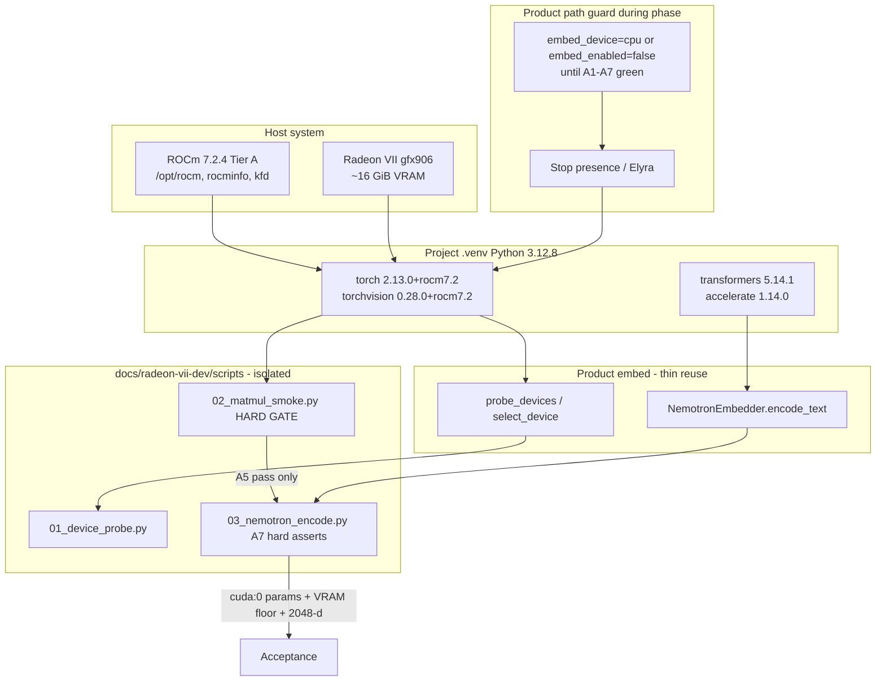
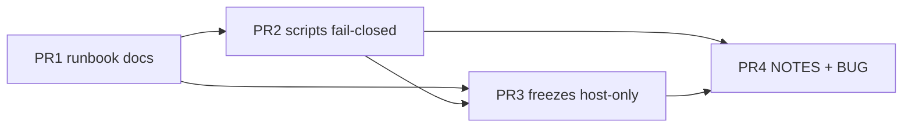

# Design: Project venv ROCm torch + Radeon VII Nemotron smoke (outside Elyra runtime)

| Field | Value |
|-------|--------|
| **Status** | Design (rev 2 — review hardening) — implement on branch `grok-improv-radeonvii` |
| **Date** | 2026-07-29 |
| **Revision** | 3 — post-swap pytest `-m "not gpu"`; uncommitted elyra.toml pin; H12 pin-before-uninstall |
| **Audience** | Senior engineers / operator (LuxPrimata) |
| **Branch** | `grok-improv-radeonvii` |
| **Related** | [`docs/radeon-vii-dev/STACK-INVENTORY.md`](docs/radeon-vii-dev/STACK-INVENTORY.md), [`docs/known-bugs.md`](docs/known-bugs.md) **BUG-mem-gpu-01**, [`docs/design/memory/design-nemotron-runtime.md`](docs/design/memory/design-nemotron-runtime.md), [`docs/design/memory/spikes/nemotron-runtime.md`](docs/design/memory/spikes/nemotron-runtime.md), product path [`elyra/memory/embed/runtime.py`](elyra/memory/embed/runtime.py), operator [`elyra.toml`](elyra.toml) |
| **Host** | Arch/Omarchy LuxPrimata; Radeon VII **gfx906**; host ROCm **7.2.4** Tier A |
| **Scope phase** | Dev-focused: venv HIP torch + standalone encode smoke. **Not** full meal/presence/worker integration as *acceptance*. **Note:** operator `elyra.toml` already enables nemotron+auto — ROCm swap **will arm product path** unless pinned (see §3.0). |

---

## Overview

Replace the project `.venv` CUDA PyTorch stack (`torch==2.13.0+cu130`, `torchvision==0.28.0+cu130`, plus a full `nvidia-*` / `cuda-toolkit` residual tree) with **ROCm 7.2 wheels** that match host ROCm 7.2.4, then prove that **Omni-Embed-Nemotron-3B** can load and produce a **2048-d** embedding on the Radeon VII **without** going through the presence worker, encode queue, or meal path **for the smoke scripts**.

Product code already has a portable ROCm contract (`probe_devices` / `select_device` / `NemotronEmbedder` map ROCm → `torch` device string `"cuda"` when `torch.version.hip` is set). Today that path never fires because the venv wheel is a CUDA build with no HIP and no usable GPU (`cuda.is_available=False`, `hip=None` → `select_device(auto)→cpu`).

**Critical operator fact (not inert):** live [`elyra.toml`](elyra.toml) already has:

```toml
semantic_enabled = true
embed_enabled = true
embed_backend = "nemotron"
embed_device = "auto"
```

Presence (`elyra/presence/worker.py` → `_ensure_embedder` → `open_encoder`) will therefore open **real Nemotron on ROCm** as soon as HIP torch reports `rocm=True`. This phase’s *acceptance* remains standalone scripts, but the runbook **must** stop presence during the swap and pin product embed to CPU (or disable embed) until A1–A7 pass — otherwise mid-swap / post-swap OOM or ISA errors hit live dogfood accidentally.

This design:

1. Defines a **safe, reversible venv switch procedure** with freeze artifacts, **nvidia residual cleanup**, and an **exclusive** rollback path (freeze alone is insufficient).
2. Documents **host prerequisites** and a **product-path arming** control plan (`elyra.toml` / presence stop).
3. Specifies **standalone smoke/bench scripts** under `docs/radeon-vii-dev/scripts/` that reuse product `NemotronEmbedder` with **non-gameable GPU asserts** (param device + VRAM floor; not health-only).
4. Isolates Radeon-VII policy under **`docs/radeon-vii-dev/` only** for this phase (no product-tree `dev_shims`).
5. Sets **acceptance criteria** that close the “can we even run on GPU?” half of **BUG-mem-gpu-01** without requiring meal/traverse dogfood, and without claiming the bug is fixed.
6. Makes **A5 (matmul / gfx906 kernels) a hard stop** before any model-load debugging.



---

## Background & Motivation

### Current baseline (inventory 2026-07-29 + live cross-check)

| Layer | State |
|-------|--------|
| GPU | Radeon VII, ISA **gfx906**, ~15.98 GiB VRAM, seen by `rocminfo` |
| Host ROCm | **7.2.4** Tier A at `/opt/rocm` (`ROCM_PATH` set); tools work |
| Host Tier B | rocBLAS / MIOpen **not** installed (OK until wheel dlopen fails) |
| System PyTorch | `python-pytorch-rocm` **not** installed (correct — system Python is **3.14**) |
| Project venv | Python **3.12.8**; `torch==2.13.0+cu130`; `torch.version.hip is None`; `cuda.is_available() is False` |
| CUDA residual | Full tree: `cuda-toolkit`, `cuda-bindings`, `nvidia-cublas`, `nvidia-cuda-runtime`, `nvidia-cudnn-cu13`, …, `triton==3.7.1` (live `pip list`) |
| Elyra probe | `probe_devices` → `cuda=False, rocm=False, cpu=True`; `select_device(auto)→cpu` |
| Operator config | `elyra.toml`: `embed_enabled=true`, `embed_backend=nemotron`, `embed_device=auto` — **will select ROCm after HIP install** |
| Model weights | `~/.cache/huggingface/hub/models--nvidia--omni-embed-nemotron-3b` ≈ **8.8 GiB** already local |
| Product extras | `pyproject.toml` `memory-embed`: version-OK, **backend wrong** |
| Bug | **BUG-mem-gpu-01** Open — Nemotron/embed not on ROCm GPU; meal latency later |

### Why venv swap, not system packages

- Product and tests target **Python 3.12** (venv is 3.12.8).
- Arch `python-pytorch-rocm` tracks **system Python 3.14** — must not mix into `.venv`.
- Official index `https://download.pytorch.org/whl/rocm7.2` has **cp312** wheels: `torch-2.13.0+rocm7.2`, `torchvision-0.28.0+rocm7.2`.
- Host ROCm 7.2.4 ↔ wheel tag `rocm7.2` is the intended major.minor match.

### Why standalone scripts (not worker dogfood first)

- Worker / meal / queue paths add presence I/O, atom store, and budget noise.
- BUG-mem-gpu-01 root for this phase is **torch build + device visibility + model load on gfx906**.
- Design constraint (locked): **do not** require full Elyra integration for *acceptance* of this phase.
- **However:** because operator toml already enables embed, successful ROCm install is *not* product-inert — control that with §3.0, not by pretending product stays on CPU.

### Product code already ROCm-aware (no redesign required for probe)

From [`elyra/memory/embed/runtime.py`](elyra/memory/embed/runtime.py):

| Symbol | Behaviour relevant here |
|--------|-------------------------|
| `_torch_backend_flags` | If `torch.version.hip` truthy → `(cuda_nvidia=False, rocm=cuda_avail)` |
| `select_device("auto")` | CUDA → ROCm → CPU → unavailable |
| `_torch_device_string("rocm")` | Returns `"cuda"` (PyTorch ROCm uses CUDA device namespace) |
| `NemotronEmbedder._load` | On cuda/rocm tries attn: `flash_attention_2` → `sdpa` → `eager` → bare; dtype fp16 → bf16 → f32; `model.to(device)` |
| `NemotronEmbedder.health()` | Self-report: `backend` always `"nemotron"`; `device` is constructor arg — **not** post-load param placement |
| `_to_unit_list` | Always `.cpu()` before Python list — **output vector never proves GPU** |
| `try_open_nemotron` / `open_encoder` | Lazy load; mock fallback when deps/device missing |

**Nuance (code comment vs code):** `_load` comment says “prefer flash_attention_2 when CUDA” but the same attn list applies to **rocm** as well — flash-first noise on AMD is expected.

**Known product friction for gfx906 (not blocking this design’s success criteria):**

- Product attn order prefers `flash_attention_2` first on GPU. Fail-soft to sdpa/eager is already implemented. **This phase does not change product attn order** (KD9 / isolation).

---

## Goals & Non-Goals

### Goals

1. **Venv HIP torch:** `.venv` runs `torch==2.13.0+rocm7.2` and matching `torchvision==0.28.0+rocm7.2`; `torch.version.hip` non-empty; `torch.cuda.is_available()` True; `get_device_name(0)` identifies Radeon VII; **CUDA residual packages purged** from venv.
2. **Host checklist** + **product-path guard** during switch/smoke (stop presence; pin `embed_device=cpu` or disable embed until A1–A7).
3. **Standalone GPU encode** scripts under `docs/radeon-vii-dev/scripts/` with **hard A7 asserts** (param `cuda:0` + non-trivial VRAM).
4. **Isolation:** all Radeon-VII notes, freezes, helpers under `docs/radeon-vii-dev/` only for this phase.
5. **Rollback** that actually works: **explicit cu130 recipe is primary**; freeze is secondary and **never sufficient alone** for torch.
6. **BUG-mem-gpu-01 partial evidence** only — bug stays Open; language forbids “GPU embed fixed.”

### Non-Goals

| Non-goal | Rationale |
|----------|-----------|
| Full meal / traverse / presence worker GPU encode as *acceptance* | Explicitly deferred; BUG still open |
| Claiming product path stays on CPU after ROCm install without pinning | False — toml already enables nemotron+auto |
| ANN / LanceDB changes | Unrelated |
| System `python-pytorch-rocm` | Wrong Python |
| Flash-Attn / CK AUR required | Product fails soft |
| Quant / bf16/f32 as VRAM recovery for acceptance | fp16 only for acceptance (see §4.3) |
| Multimodal smoke as must-pass | Text-only |
| Pinning HF revision in product code | NOTES/spike after success |
| ROCm pins in `pyproject.toml` | Backend-agnostic extras |
| CUDA+ROCm in one venv | Single build |
| Product-tree `elyra/memory/embed/dev_shims/` this phase | Isolation — helpers stay in docs scripts |
| Product ROCm attn reorder this phase | Separate design after GPU proven |

---

## Proposed Design

### 1. Layout (isolation — docs only this phase)

```text
docs/radeon-vii-dev/
  STACK-INVENTORY.md          # exists — update after swap
  README.md                   # purpose, non-goals, product-path arming warning
  VENV-ROCM-SWITCH.md         # runbook: stop presence, pin toml, switch, verify, rollback
  freezes/
    pre-rocm-pip-freeze.txt   # BEFORE uninstall (cu130 + nvidia tree baseline)
    post-rocm-pip-freeze.txt  # AFTER successful ROCm install (LuxPrimata/ROCm-only)
    torchn-rocm7.2-pins.txt   # exact torch/torchvision install lines
    README.md                 # freeze is NOT sufficient rollback for torch
  scripts/
    README.md                 # prereqs, exit codes, A7 assert list (copy-paste)
    01_device_probe.py
    02_matmul_smoke.py        # HARD GATE before 03
    03_nemotron_encode.py     # hard A7 asserts
    _common.py                # shared GPU-proof helpers (param device, VRAM) — docs only
  NOTES-DOGFOOD.md
```

**Not in this phase:**

```text
# DEFERRED — do not create under product package for this work:
elyra/memory/embed/dev_shims/   # invite coupling; helpers go in scripts/_common.py instead
```

**Rule:** `open_encoder` / presence **must not** import docs scripts. Scripts may import product runtime one-way.

### 2. Host prerequisites checklist

| # | Check | Command / action | Required? |
|---|--------|------------------|-----------|
| H1 | `rocminfo` lists gfx906 / Radeon VII | `rocminfo \| grep -A2 'Marketing Name'` | **Yes** |
| H2 | `rocm-smi` works | `rocm-smi` | **Yes** |
| H3 | `/opt/rocm` present; `ROCM_PATH` set | `echo $ROCM_PATH`; `ls /opt/rocm` | **Yes** |
| H4 | `/dev/kfd` accessible | `ls -l /dev/kfd` | **Yes** |
| H5 | User in `render` + `video` | `groups`; `sudo usermod -aG render,video $USER` + re-login | **Recommended** |
| H6 | No dual OpenCL stack | opencl-amd AUR not installed | Preferred |
| H7 | Tier A packages present | inventory list | **Yes** |
| H8 | Tier B | **Only** on `librocblas` / MIOpen dlopen errors — **never** cargo-cult for ISA misses | Conditional |
| H9 | Project venv activated, Python **3.12.8** | `source .venv/bin/activate && python -V` | **Yes** — never system 3.14 |
| H10 | Disk for wheels | ~2–4 GiB + model already cached | **Yes** |
| H11 | **No concurrent presence / pytest / encode** during swap | stop Elyra; no other venv consumers | **Yes** |
| H12 | Product path pin ready | edit `elyra.toml` per §3.0 **before uninstall/install** (required). “Immediately after HIP works” is **emergency recovery only** if pin was forgotten **and** presence remains stopped — never rely on post-install pin as the primary plan | **Yes** |

```bash
export ROCM_PATH=/opt/rocm
# HSA_OVERRIDE_GFX_VERSION — last resort only; Radeon VII is native gfx906 — do not set by default
```

### 3. Venv switch procedure

#### 3.0 Product-path arming control (mandatory)

**On LuxPrimata, successful ROCm install changes the effective product embed device** because `elyra.toml` already has `embed_backend=nemotron` and `embed_device=auto`. After HIP+`is_available`, `select_device("auto")` → `"rocm"` and the presence worker will load Nemotron on GPU on the next `_ensure_embedder` call.

**Before any uninstall** (order is normative — pin before HIP becomes usable in the product path):

1. **Stop all Elyra / presence processes** using this `.venv` (no mid-swap encode queue).
2. **Do not run** `pytest`, notebooks, or other tools that import torch during the swap window.
3. **Pin product embed away from GPU** **before** uninstall/install. Preferred temporary change in `elyra.toml` (pick one):

   ```toml
   # Temporary during ROCm bring-up — LOCAL ONLY; do not commit (see below)
   embed_device = "cpu"
   # OR stronger:
   # embed_enabled = false
   ```

   **Commit hygiene (normative):** `elyra.toml` is **tracked**. The temporary pin is **local / uncommitted** unless the operator deliberately records a bring-up policy change in a dedicated commit with explicit intent. Do **not** land freezes/docs PRs that accidentally include `embed_device=cpu` or `embed_enabled=false` from swap safety. NOTES may state that the pin was applied without embedding the pin in the committed toml. Before merge of unrelated branch work, restore the intended dogfood values (`auto` / `rocm` / prior state) if the pin was only for swap safety.

4. After A1–A7 green, operator **chooses explicitly**:
   - **Keep pin** (`embed_device=cpu`) until a planned worker-path dogfood session — still **uncommitted** unless intentional; or
   - **Intentional product dogfood:** set `embed_device = "rocm"` (or `auto`) and accept GPU load in presence — still **does not** close BUG-mem-gpu-01 alone; record as separate NOTES entry with “product worker path: exercised.” Only commit if that is the deliberate branch dogfood policy.

5. Runbook must state in bold: *This phase’s acceptance is scripts-only; product path arming is a side effect that must be controlled, not ignored.*

#### 3.1 Preflight (read-only)

```bash
cd /home/jim/Workspace/project-elyra
source .venv/bin/activate
python -V   # expect 3.12.8
python -c "import torch; print(torch.__version__, torch.version.cuda, torch.version.hip, torch.cuda.is_available())"
# expect today: 2.13.0+cu130  13.0  None  False
pip list | rg -i 'nvidia|cuda|rocm|torch|triton' | tee docs/radeon-vii-dev/freezes/pre-rocm-gpu-stack.txt
```

Confirm presence stopped and `elyra.toml` pin applied **before uninstall** (§3.0 / H12). Confirm pin is **not** staged for commit unless intentional.

#### 3.2 Capture freeze (partial rollback artifact)

```bash
mkdir -p docs/radeon-vii-dev/freezes
pip freeze > docs/radeon-vii-dev/freezes/pre-rocm-pip-freeze.txt
```

**Limitation (normative):** `pip freeze` shows `torch==2.13.0` **without** the `+cu130` local label. Restoring with `pip install -r pre-rocm-pip-freeze.txt` alone will **not** reliably restore a CUDA (or HIP) wheel and may pull a generic/CPU-oriented build. Freezes are for **forensics and non-torch package versions**, not for torch backend restore.

#### 3.3 Uninstall CUDA torch family **and residual NVIDIA stack** (default path)

```bash
# Core torch family
pip uninstall -y torch torchvision torchaudio

# CUDA-oriented triton (ROCm torch will re-pull a compatible build if needed)
pip uninstall -y triton

# Residual NVIDIA / CUDA pip packages (live venv as of 2026-07-29 — best-effort full purge)
pip uninstall -y \
  cuda-toolkit cuda-bindings cuda-pathfinder \
  nvidia-cublas nvidia-cuda-cupti nvidia-cuda-nvrtc nvidia-cuda-runtime \
  nvidia-cudnn-cu13 nvidia-cufft nvidia-cufile nvidia-curand \
  nvidia-cusolver nvidia-cusparse nvidia-cusparselt-cu13 \
  nvidia-nccl-cu13 nvidia-nvjitlink nvidia-nvshmem-cu13 nvidia-nvtx \
  2>/dev/null || true

# Catch stragglers by name (best-effort; re-run until empty)
pip list | rg -i '^(nvidia-|cuda-)' || true
# If any remain: pip uninstall -y <name>
```

**Default, not “only if fails.”** Leaving the full `nvidia-*` tree after ROCm install confuses diagnostics, bloats freezes, and can cause mixed-library failures that look like “gfx906 broken.”

Capture post-cleanup listing:

```bash
pip list | rg -i 'nvidia|cuda|rocm|torch|triton' | tee docs/radeon-vii-dev/freezes/mid-swap-gpu-stack.txt
# expect: essentially empty (no torch yet)
```

#### 3.4 Install ROCm 7.2 pair (pinned)

```bash
pip install --upgrade pip
pip install torch==2.13.0 torchvision==0.28.0 \
  --index-url https://download.pytorch.org/whl/rocm7.2
```

Pins file:

```text
# docs/radeon-vii-dev/freezes/torchn-rocm7.2-pins.txt
# Install (only valid after uninstall of cu130 + nvidia residual):
#   pip install torch==2.13.0 torchvision==0.28.0 --index-url https://download.pytorch.org/whl/rocm7.2
torch==2.13.0+rocm7.2
torchvision==0.28.0+rocm7.2
```

**Do not** soft-upgrade with `--extra-index-url` alone — pip may keep cu130 under `==2.13.0`.

#### 3.5 Re-assert HF stack

```bash
pip install 'transformers>=4.51' 'accelerate>=0.33' safetensors tokenizers
# known-good: transformers==5.14.1, accelerate==1.14.0
```

#### 3.6 Post-install verification (venv gate → A1–A4 + inline matmul)

```bash
python - <<'PY'
import torch
print("version", torch.__version__)
print("hip", torch.version.hip)
print("cuda_meta", torch.version.cuda)
print("is_available", torch.cuda.is_available())
assert torch.version.hip, "hip not set — not a ROCm build"
assert torch.cuda.is_available(), "cuda.is_available False"
print("name", torch.cuda.get_device_name(0))
x = torch.randn(1024, 1024, device="cuda", dtype=torch.float16)
y = x @ x
torch.cuda.synchronize()
print("matmul_ok", float(y[0, 0]))
PY

python -c "from elyra.memory.embed.runtime import probe_devices, select_device; print(probe_devices()); print(select_device('auto')); print(select_device('rocm'))"
# expect: rocm=True; with embed_device pin still cpu for product; auto→rocm if not pinned via ELYRA_EMBED_DEVICE
# Note: select_device('auto') ignores elyra.toml — only MemorySettings/open_encoder reads toml.
# Product worker uses open_encoder → MemorySettings.embed_device from elyra.toml pin.

pip list | rg -i 'nvidia|cuda|rocm|torch|triton' | tee docs/radeon-vii-dev/freezes/post-rocm-gpu-stack.txt
pip freeze > docs/radeon-vii-dev/freezes/post-rocm-pip-freeze.txt
```

| Check | Expected |
|-------|----------|
| `torch.__version__` | contains `rocm7.2` / hip-capable from that index |
| `torch.version.hip` | non-`None` string |
| `torch.cuda.is_available()` | `True` |
| `get_device_name(0)` | Radeon VII marketing name |
| residual `nvidia-*` | **absent** (or only packages ROCm wheel re-pulled intentionally — document if any) |
| product pin | `elyra.toml` still `embed_device=cpu` (or embed off) until A1–A7 |

Update [`STACK-INVENTORY.md`](docs/radeon-vii-dev/STACK-INVENTORY.md) §3/§6 after success.

#### 3.6b Hard gate A5 before model work

Run `02_matmul_smoke.py` (or equivalent). **A5 is a hard process gate:**

- If matmul fails with **ISA / “no binary for gfx906” / arch not supported**:
  1. **STOP.** Do not run `03_nemotron_encode.py`.
  2. Do **not** install Tier B as a cargo-cult fix for ISA misses.
  3. Write `NOTES-DOGFOOD.md` + BUG-mem-gpu-01 evidence (torch+hip versions, exact error).
  4. Optional **only after documenting 7.2 failure:** try `rocm7.1` / `rocm7.0` indexes as experiment.
  5. Source build deferred (Alt 2); leave BUG open.

#### 3.7 Failure ladder

| Symptom | Severity | Action |
|---------|----------|--------|
| Wheel not found for cp312 | High | Confirm index; exact wheel URL; last resort older index |
| dlopen missing `librocblas` / MIOpen | Med | Tier B packages only |
| `is_available` False after HIP build | High | groups, kfd, `ROCM_PATH`; no `HSA_OVERRIDE` first |
| **ISA / gfx906 unsupported on matmul** | **High — hard stop** | NOTES + BUG evidence; no model load; no Tier B for ISA |
| Matmul OK, model OOM at fp16 | Med | Exit 5 with VRAM; no CPU fallback; no bf16/f32 “recovery” for acceptance |
| Want CUDA torch again | — | **Exclusive rollback §3.9** |

#### 3.8 Dual-use / mid-swap / second venv

| Concern | Rule |
|---------|------|
| Mid-swap (no torch) | **H11:** no presence, pytest, or encode. Hermetic tests that branch on `torch_available()` will change behaviour if run mid-swap — do not run them then. |
| Post-swap ABI / import gate | Gate: hip one-liner + `probe_devices` + **non-GPU** pytest only (see **§3.8a**). This is **not** A7 acceptance and must not load Nemotron weights. |
| This host CUDA compute | Already non-functional for `is_available`; ROCm is the only useful discrete GPU stack |
| `post-rocm-pip-freeze.txt` | **LuxPrimata / ROCm-specific** — **must not** be applied on NVIDIA CI or other machines as a full env restore |
| Long dual experimentation | Escape hatch: second venv (e.g. `.venv-rocm`) — document activation in runbook if rollback churn is high; **not** default |

#### 3.8a Post-swap pytest gate (must exclude `gpu`)

There is **no** `addopts = -m "not gpu"` in `pyproject.toml`. After ROCm works on LuxPrimata, `test_nemotron_encode_text_gpu` (`@pytest.mark.gpu`) becomes **runnable** (not skipped): `_gpu_ready()` true, HF cache ~8.8 GiB present. That test uses `open_encoder(..., embed_device="auto")` → real Nemotron load/encode on ROCm — multi‑GiB wall time, possible OOM soft-skip, **bypasses G1–G9**, and **ignores** the temporary `elyra.toml` pin.

**Normative post-swap command** (import/ABI / mock-path regression only):

```bash
# From repo root, activated .venv — excludes real GPU encode (test_nemotron_encode_text_gpu)
pytest tests/test_memory_embed_*.py -q -m "not gpu"
```

| Do | Do not |
|----|--------|
| Use `-m "not gpu"` for the post-swap / checklist gate | `pytest tests/test_memory_embed_*.py -q` alone (collects and may **run** full model load) |
| Prefer excluding **only** `gpu` | `-m "not gpu and not memory_embed"` — too aggressive; skips useful open-without-load `memory_embed` checks |
| Treat Gate B / `@pytest.mark.gpu` encode as **optional later**, **not** a substitute for `03_nemotron_encode.py` G1–G9 | Claim pytest GPU green = A7 acceptance |

**Why not “no gpu marker required”:** that phrase was misread as “GPU tests optional to pass.” Without deselect, they still **collect and run** when the environment is ready.

#### 3.9 Rollback (ordered and exclusive)

**Never document `pip install -r pre-rocm-pip-freeze.txt` as sufficient alone.**

| Priority | Action |
|----------|--------|
| **1 — Preferred** | Explicit cu130 recipe (restores torch backend): ```bash<br>pip uninstall -y torch torchvision torchaudio<br>pip install torch==2.13.0 torchvision==0.28.0 --index-url https://download.pytorch.org/whl/cu130<br>``` CUDA torch will re-pull the `nvidia-*` residual tree as dependencies. |
| **2 — Secondary** | Restore **non-torch** packages from freeze if versions drifted (transformers, etc.) — **exclude** torch/torchvision lines or override with step 1. |
| **3 — Forbidden as sole method** | `pip install -r pre-rocm-pip-freeze.txt` alone for torch backend restore |

If nvidia residual was purged and you rollback to cu130 on an **NVIDIA** machine later, step 1’s index install must re-pull runtime libs; verify with `pip list | rg nvidia`.

Restore product pin intentionally when leaving bring-up (document in NOTES).

### 4. GPU load path for Nemotron (outside Elyra)

#### 4.1 Reuse product embedder (acceptance path)

```python
from elyra.memory.embed.runtime import (
    DEFAULT_NEMOTRON_MODEL_ID,
    NemotronEmbedder,
    probe_devices,
    select_device,
)
from elyra.memory.embed.types import EMBED_DIM  # 2048
```

- Construct **`NemotronEmbedder(device="rocm", dtype_name="float16", ...)` only**.
- **Forbid `open_encoder` on the acceptance path** (mock fallback + toml `auto` can false-pass or hide pin state).
- Do not reimplement AutoModel pooling (Alt 3 rejected as primary).

#### 4.2 Isolation: no product-tree shim this phase

| Approach | Status |
|----------|--------|
| **A — product fail-soft as-is** | **Default for this phase** |
| Helpers in `docs/radeon-vii-dev/scripts/_common.py` | OK for GPU-proof + report |
| `elyra/memory/embed/dev_shims/` | **Out of scope this phase** |
| Product `runtime.py` ROCm attn reorder | **Separate design** after smoke; scope would be “all ROCm,” not Radeon-VII-only |

#### 4.3 Script contracts

##### Shared prerequisites (`scripts/README.md`)

```text
- Activated project .venv only (Python 3.12.8) — never system Python 3.14
- cwd = repo root (/home/jim/Workspace/project-elyra)
- PYTHONPATH=.
- ROCM_PATH=/opt/rocm (and host checklist)
- Presence stopped; elyra.toml embed_device=cpu (or embed off) during bring-up
```

##### Exit codes (all scripts)

| Code | Meaning |
|------|---------|
| 0 | Pass |
| 2 | ROCm / device missing |
| 3 | Load or kernel failure (or ISA — treat as hard fail) |
| 4 | Encode / dim / assert fail |
| 5 | OOM |
| 6 | Anti-game / GPU-proof assert fail (A7 hard checks) |

##### `01_device_probe.py`

| Item | Spec |
|------|------|
| Purpose | HIP torch + product probe agree |
| Steps | print version/hip/is_available/name; `probe_devices()`; `select_device("rocm")` and `"auto"`; exit 0 iff rocm visible |
| Runtime | < 10 s |

##### `02_matmul_smoke.py` — **HARD GATE**

| Item | Spec |
|------|------|
| Purpose | Prove gfx906 compute kernels |
| Steps | fp16 matmul on `cuda:0`; synchronize; time ms |
| Fail | ISA errors → exit 3; **do not proceed to 03** |
| Runtime | < 30 s |

##### `03_nemotron_encode.py` — acceptance encode

| Item | Spec |
|------|------|
| Purpose | Real embedding on GPU without worker |
| Model | `nvidia/omni-embed-nemotron-3b` or `--model-path` |
| Construct | **`NemotronEmbedder(device="rocm")` only** — no `open_encoder` |
| Dtype | **fp16 only for acceptance**. On OOM → exit 5 with VRAM stats. Optional `--dtype` is **experimental / non-acceptance**. Do **not** retry bf16/f32 as VRAM recovery (same or worse size). |
| Encode | `encode_text` A; optional B + cosine |
| Not used | EncodeQueue, presence worker, meal, Lance |

###### Normative A7 / anti-game asserts (must-fail → exit 6 or 4)

Implement as a single helper in `_common.py`, e.g. `assert_gpu_nemotron(embedder) -> dict`, called after `ensure_loaded()` and after encode. Reviewers must be able to grep for these checks.

| # | Assert | Why hard |
|---|--------|----------|
| G1 | `torch.version.hip` is truthy **inside script 03** | Not only in 01 |
| G2 | `select_device("rocm") == "rocm"` **before** construct | Backend visible |
| G3 | Construct path is `NemotronEmbedder(device="rocm")` only | No mock via `open_encoder` |
| G4 | After load: `health()["loaded"] is True`, `health()["error"] is None`, `health()["backend"]=="nemotron"` | Load succeeded (health alone insufficient for device) |
| G5 | **Hard GPU proof:** parameter device is CUDA index 0 — see §4.3.1 access path | health `device` is constructor-only |
| G6 | **Hard VRAM floor:** `torch.cuda.max_memory_allocated(0) >= VRAM_FLOOR_BYTES` | mock/CPU ≈ 0; real 3B fp16 multi‑GiB |
| G7 | `len(vec)==EMBED_DIM` (2048); L2 norm ≈ 1.0 (±1e-3) | Contract |
| G8 | Reject if requested device was ever `"cpu"` or any silent CPU placement of params | Anti-fallback |
| G9 | Reset peak memory before load (`torch.cuda.reset_peak_memory_stats(0)`) so floor measures this run | Avoid stale peaks |

**VRAM floor:** default `VRAM_FLOOR_BYTES = 1_000_000_000` (1 GiB). Must be far above matmul-only noise; **tune upward after first real load** (expect multi‑GiB for 3B fp16) and record actual peak in NOTES. Floor is a **gate**, not a target.

**Weak signals (insufficient alone — do not use as sole pass):**

- `health()["backend"]=="nemotron"` (always true for class)
- `health()["device"]=="rocm"` (constructor self-report)
- dim + L2 alone (mock and CPU satisfy)
- vector device (always `.cpu()`’d in `_to_unit_list`)

**A8 (no worker/meal)** is a **design invariant**, not a falsifiable acceptance criterion — removed from pass table as a scored item.

###### §4.3.1 Parameter device access path (no product API wait)

`NemotronEmbedder` does **not** expose a public `parameter_device`. For this phase, scripts use **documented private access** after `ensure_loaded()`:

```python
# docs/radeon-vii-dev/scripts/_common.py
def parameter_device_str(embedder) -> str:
    """Return str(device) of first parameter. Operator-script only.
    # noqa: SLF001 — NemotronEmbedder has no public param-device accessor.
    """
    model = embedder._model
    if model is None:
        raise RuntimeError("model not loaded")
    dev = next(model.parameters()).device
    return str(dev)  # expect "cuda:0"

def assert_params_on_cuda0(embedder) -> None:
    dev = next(embedder._model.parameters()).device  # noqa: SLF001
    if dev.type != "cuda" or (dev.index not in (0, None) and dev.index != 0):
        # index None can mean current device 0 depending on torch build — normalize:
        if dev.type != "cuda":
            raise AssertionError(f"params not on cuda: {dev!r}")
        # Prefer explicit index 0 when present
        if dev.index not in (0, None):
            raise AssertionError(f"expected cuda:0, got {dev!r}")
```

- Prefer `_common.py` wrapper so 03 stays readable.
- **Do not** weaken A7 waiting for a product public API.
- Optional later product helper is a separate PR (out of scope).

##### Example invocation

```bash
cd /home/jim/Workspace/project-elyra
source .venv/bin/activate   # 3.12.8 only
export PYTHONPATH=.
export ROCM_PATH=/opt/rocm
python docs/radeon-vii-dev/scripts/01_device_probe.py
python docs/radeon-vii-dev/scripts/02_matmul_smoke.py   # HARD GATE
# only if exit 0:
python docs/radeon-vii-dev/scripts/03_nemotron_encode.py \
  --text-a "passage: a red cube on a table" \
  --text-b "passage: a blue sphere in space"
```

#### 4.4 VRAM / OOM expectations

| Item | Estimate / rule |
|------|-----------------|
| Weights fp16 | multi‑GiB class for ~3–4.7B lineage; disk cache 8.8 GiB ≠ runtime |
| Radeon VII VRAM | ~16 GiB |
| Acceptance dtype | **fp16 only**; OOM → exit 5, no CPU fallback |
| `max_length=8192` in product | Hardcoded in `_embed_messages` with `padding: True` (**boolean**). In HF processors, boolean `padding=True` typically pads to **batch max length**, not to 8192; `padding="max_length"` would force 8192. **Short-text smoke OOM, if any, is likely weights + fragmentation + attn workspace**, not full 8192 padded activations. Still do **not** fork pooling logic this phase. |
| OOM attribution | Record whether failure is at `from_pretrained` / `to(device)` vs forward; log `max_memory_allocated` |

#### 4.5 Sequence diagram

```mermaid
sequenceDiagram
  participant Op as Operator
  participant Pin as elyra.toml pin
  participant S1 as 01_device_probe
  participant S2 as 02_matmul_smoke
  participant S3 as 03_nemotron_encode
  participant RT as NemotronEmbedder
  participant T as torch ROCm
  participant GPU as Radeon VII

  Op->>Pin: stop presence; embed_device=cpu
  Op->>S1: run
  S1->>T: hip / is_available
  S1-->>Op: rocm=True
  Op->>S2: run HARD GATE
  S2->>T: fp16 matmul
  alt ISA fail
    S2-->>Op: exit 3 STOP no model load
  else A5 pass
    Op->>S3: run
    S3->>RT: NemotronEmbedder(device=rocm)
    S3->>RT: ensure_loaded + encode_text
    RT->>T: to(cuda) + forward
    T->>GPU: load + compute
    S3->>S3: G5 param cuda:0 + G6 VRAM floor
    S3-->>Op: JSON report
  end
```

### 5. Acceptance criteria (this phase)

All must pass on LuxPrimata with project `.venv`:

| # | Criterion | How verified |
|---|-----------|--------------|
| A1 | `torch.version.hip` set | 01 + **again in 03 (G1)** |
| A2 | `torch.cuda.is_available()` True | 01 / 03 |
| A3 | `get_device_name(0)` identifies Radeon | 01 |
| A4 | `probe_devices()["rocm"]` and `select_device("rocm")=="rocm"` | 01 + 03 G2 |
| A5 | Tiny GPU matmul succeeds (**hard gate** before 03) | 02; ISA fail → phase stop |
| A6 | Text encode → **2048** floats, L2 ≈ 1.0 | 03 G7 |
| A7 | **GPU proof:** G1–G9 all pass (param `cuda:0` + VRAM floor + no mock/`open_encoder`/CPU) | 03; health/dim alone **insufficient** |
| A9 | Freeze artifacts + runbook under `docs/radeon-vii-dev/` (incl. product-path arming + exclusive rollback) | PR review |
| A10 | BUG-mem-gpu-01 dogfood note with required fields; **bug remains Open**; no “GPU embed fixed” language | PR5 template |

**Design invariant (not scored as A8):** smoke scripts do not call presence worker / EncodeQueue / meal / Lance. Enforce by code review (imports), not a runtime self-attestation.

**Explicitly not required:**

- Image/audio/video encode  
- EncodeQueue / idle worker / intentional product GPU dogfood  
- Semantic meal channel on  
- ANN rebuild  
- flash_attention_2 success  
- Tier B if wheels work  
- CI GPU job (none exists — do not block merge on GPU CI)

### 6. Documentation & bug hygiene

| Doc | Action |
|-----|--------|
| `docs/radeon-vii-dev/STACK-INVENTORY.md` | Update after swap |
| `docs/radeon-vii-dev/VENV-ROCM-SWITCH.md` | Full runbook: §3.0 arming, nvidia purge, exclusive rollback, A5 hard stop |
| `docs/radeon-vii-dev/NOTES-DOGFOOD.md` | Measurements |
| `docs/known-bugs.md` **BUG-mem-gpu-01** | Dogfood subsection only; keep **Open** |
| Spike Gate B | Check “ROCm attempt…” when smoke passes; record revision if encode succeeds |

#### PR5 / BUG-mem-gpu-01 dogfood template (required fields)

```markdown
### Dogfood — venv ROCm smoke (YYYY-MM-DD)

| Field | Value |
|-------|--------|
| Status of BUG-mem-gpu-01 | **Still Open** (script path only / product worker: not exercised) |
| torch_version | |
| hip_version | |
| device_name | |
| A1–A7 pass/fail | each listed |
| load_ms | |
| encode_ms | |
| vram_peak_bytes | |
| attn_impl if known | |
| product worker path | **not exercised** (or separate session notes) |
| Notes | no language: "GPU embed fixed" |
```

---

## API / Interface Changes

| Surface | Change in this phase? |
|---------|------------------------|
| `probe_devices` / `select_device` | **No** code change; behaviour flips with HIP torch |
| `NemotronEmbedder` public API | **No** required change; scripts use private `_model` with documented `# noqa: SLF001` |
| `open_encoder` | **No** change; **forbidden on acceptance path** |
| `pyproject.toml` | **No** ROCm pins |
| `elyra.toml` | **Operator temporary pin** `embed_device=cpu` (or embed off) during bring-up — **local/uncommitted** unless deliberate dogfood policy; not a product default flip via freezes/docs PRs |
| Product package tree | **No** `dev_shims` this phase |
| CLI | **None** |

Product ROCm attn reorder / public `parameter_device` accessor: **out of scope**; separate design if needed after smoke.

---

## Data Model

**No durable store writes.** Ephemeral report JSON:

```json
{
  "ok": true,
  "torch_version": "2.13.0+rocm7.2",
  "hip_version": "7.2.x",
  "device_kind": "rocm",
  "device_name": "AMD Radeon VII",
  "param_device": "cuda:0",
  "dtype": "float16",
  "model_id": "nvidia/omni-embed-nemotron-3b",
  "dim": 2048,
  "l2_norm": 1.0,
  "load_ms": 0,
  "encode_ms": 0,
  "cosine_ab": null,
  "vram_peak_bytes": 0,
  "vram_floor_bytes": 1000000000,
  "backend": "nemotron",
  "path": "standalone_script",
  "used_open_encoder": false
}
```

---

## Alternatives Considered

### Alternative 1 — System `python-pytorch-rocm`

**Rejected.** System Python 3.14; violates venv policy.

### Alternative 2 — Build PyTorch from source for gfx906

**Deferred** until A5 ISA failure on wheels is proven.

### Alternative 3 — Standalone AutoModel without `NemotronEmbedder`

**Rejected as primary** (drift). Emergency diagnostic only.

### Alternative 4 — Second venv (`.venv-rocm`)

**Not default** on this AMD-only host. **Promoted to runbook escape hatch** if rollback churn is high or long dual experiments needed.

### Alternative 5 — Full product integration as acceptance

**Rejected** for success criteria. Product arming still controlled via §3.0 because toml already enables embed.

### Alternative 6 — Trust health()/dim only for A7

**Rejected.** Gameable; see G1–G9.

### Chosen approach

**In-place `.venv` ROCm 7.2 wheels + nvidia residual purge + product-path pin during bring-up + docs-isolated scripts reusing `NemotronEmbedder` with hard param-device/VRAM asserts + exclusive cu130 rollback.**

---

## Security & Privacy

| Topic | Guidance |
|-------|----------|
| Model license | Research/dev only; re-check before product default-on |
| Trust remote code | Cached model; pin revision after success |
| Network | Prefer `HF_HUB_OFFLINE=1` after warm cache |
| Secrets | No API keys in scripts |
| Device nodes | Prefer render/video groups over world-RW kfd long-term |
| Supply chain | torch only from pytorch.org ROCm index; freeze listings in NOTES |
| Prompt data | Public smoke strings in committed NOTES |

---

## Observability

| Signal | Where |
|--------|--------|
| HIP / device / param_device / vram_peak | scripts + NOTES |
| `probe_devices` | 01 / 03 |
| load_ms / encode_ms | 03 |
| Product logs | `LOGLEVEL=DEBUG` for attn fail-soft noise |
| Host | `rocm-smi` during encode (manual) |
| CI | **No** gfx906 job — do not block on GPU CI |

---

## Rollout Plan

1. **Docs PR** — runbook with §3.0 arming, nvidia purge, exclusive rollback, A5 hard stop, A7 assert list in scripts/README (can merge before freezes).
2. **Scripts PR** (may land **before** freezes) — 01/02/03 + `_common.py`; **fail closed** on current cu130 (exit 2); include hard A7 asserts so review greps them without hardware.
3. **Operator switch** on LuxPrimata — presence stopped, **toml pin before uninstall (local, uncommitted)**, uninstall+purge+install → A1–A5 hard gate.
4. **Post-swap gate:** hip one-liner + `probe_devices` + `pytest tests/test_memory_embed_*.py -q -m "not gpu"` only (§3.8a).
5. **Freezes + inventory update PR** — host-only artifacts labeled LuxPrimata/ROCm; **not CI-verifiable**; do **not** commit temporary `elyra.toml` pin in that PR.
6. **Run 03 only after A5 green** — NOTES sample; optional merge NOTES with freezes PR or scripts dogfood session. Optional later: intentional `@pytest.mark.gpu` Gate B — **not** A7 substitute.
7. **No product attn / dev_shims PR** in this phase unless a follow-on design reopens it.
8. **BUG-mem-gpu-01 update** with template fields; bug stays Open; **no** default flip of embed_enabled/semantic in product defaults (operator toml pin is temporary local control).

**Rollback:** §3.9 exclusive order only.

**Swap window:** 10–30+ minutes + wheel download; **no concurrent pytest/presence**.

---

## Risks

| ID | Risk | Severity | Likelihood | Mitigation |
|----|------|----------|------------|------------|
| R1 | `rocm7.2` wheels lack **gfx906** kernels | **High** | Med | **A5 hard stop**; no 03; no Tier B for ISA; NOTES+BUG |
| R2 | Model VRAM OOM at fp16 | **High** | Med | Exit 5; no CPU/bf16 “recovery”; record load vs forward |
| R3 | Tier A missing BLAS/MIOpen | **Med** | Low–Med | Tier B only on dlopen |
| R4 | Freeze applied on NVIDIA CI / wrong machine | **Med** | Med | Label freezes ROCm-only; exclusive rollback |
| R5 | flash-first noisy on ROCm | **Low** | High | Fail-soft; no product reorder this phase |
| R6 | pip keeps cu130 | **Med** | Med | Uninstall first; verify hip |
| R7 | nvidia residual mixed libs | **Med** | Med | **Default purge** §3.3 |
| R8 | Lance/pyarrow unrelated break | **Low** | Low | Optional import smoke |
| R9 | False accept via health/dim | **High** (process) | Med if sloppy | **G1–G9 mandatory** |
| R10 | render/video groups | **Low** | Med | usermod |
| R11 | trust_remote_code | **Med** | Low | Cached pin |
| R12 | **Product path auto-arms on ROCm** via elyra.toml | **High** | **High** after swap | §3.0 stop presence + pin cpu/disable embed |
| R13 | Mid-swap no-torch breaks concurrent work | **Med** | High if ignored | H11; no pytest/presence during swap |
| R14 | Post-swap pytest without `-m "not gpu"` loads full Nemotron via `test_nemotron_encode_text_gpu` | **Med** | High after ROCm+cache | §3.8a mandatory deselect; not A7 substitute |
| R15 | Accidental commit of temporary `elyra.toml` cpu pin | **Low** | Med | §3.0 commit hygiene; freezes/docs PRs exclude pin |

---

## Open Questions

| # | Question | Default until answered |
|---|----------|------------------------|
| OQ1 | Do rocm7.2 wheels include gfx906 kernels? | Unknown until A5; **hard gate** |
| OQ2 | Tier B required? | No until dlopen |
| OQ3 | Short-text OOM? | Measure; likely weights not full 8192 pad |
| OQ4 | Product ROCm attn order later? | Defer after smoke |
| OQ5 | Pin HF revision after green? | Yes in NOTES/spike |
| OQ6 | Keep ROCm in `.venv` long-term? | Yes for Radeon dogfood; pin product until intentional |
| OQ7 | Second venv? | Escape hatch if churn high |
| OQ8 | Raise VRAM floor after first load? | Yes — record peak, set floor below peak with margin |

---

## References

| Path | Why |
|------|-----|
| `docs/radeon-vii-dev/STACK-INVENTORY.md` | Hardware / baseline |
| `docs/known-bugs.md` BUG-mem-gpu-01 | Partial evidence only |
| `elyra/memory/embed/runtime.py` | probe, select, Nemotron, health self-report, `_to_unit_list` cpu |
| `elyra/memory/embed/types.py` | `EMBED_DIM=2048` |
| `elyra.toml` | embed already on + auto |
| `elyra/presence/worker.py` | `_ensure_embedder` → product path arms |
| `pyproject.toml` | memory-embed agnostic |
| Spike / design-nemotron-runtime | Gate B, contract |
| `https://download.pytorch.org/whl/rocm7.2` | wheels |

---

## Key Decisions

| ID | Decision | Rationale |
|----|----------|-----------|
| **KD1** | ROCm torch in project `.venv` 3.12.8 only | System 3.14 forbidden |
| **KD2** | `torch==2.13.0` + `torchvision==0.28.0` from `rocm7.2` index | Match host 7.2.4; cp312 confirmed |
| **KD3** | Uninstall cu130 **and purge nvidia-*/cuda-toolkit residual** before install | Live venv has full CUDA tree; default cleanup |
| **KD4** | Exclusive rollback: **cu130 index recipe first**; freeze never sufficient alone for torch | Freeze lacks `+cu130` label |
| **KD5** | Acceptance via docs scripts, not worker/meal | Locked scope |
| **KD6** | `NemotronEmbedder(device="rocm")` only; **forbid `open_encoder` on acceptance** | Mock/toml false-pass |
| **KD7** | **G1–G9 hard asserts** including param `cuda:0` + VRAM floor ≥ 1 GiB (tune after first load) | health/dim/L2 gameable; vectors always `.cpu()` |
| **KD8** | Radeon-VII isolation = **`docs/radeon-vii-dev/` only**; no product `dev_shims` this phase | Avoid package-tree coupling |
| **KD9** | Product attn order unchanged this phase | Fail-soft A; reorder is separate “all ROCm” design |
| **KD10** | Acceptance dtype **fp16 only**; OOM exits 5; no bf16/f32 VRAM recovery | bf16≈fp16 size; f32 worse |
| **KD11** | Tier B only on linker errors; **never for ISA** | Cargo-cult waste |
| **KD12** | No pyproject ROCm pins | CI/portability |
| **KD13** | BUG stays Open; required dogfood fields; forbid “GPU embed fixed” | Gate B honesty |
| **KD14** | No `HSA_OVERRIDE_GFX_VERSION` by default | Native gfx906 |
| **KD15** | No Lance/meal/ANN scope | Blast radius |
| **KD16** | **Stop presence + pin `embed_device=cpu` (or disable embed) before uninstall**; pin is **local/uncommitted** unless deliberate | elyra.toml already arms nemotron+auto → ROCm; tracked file commit hygiene |
| **KD21** | Post-swap embed tests: **`pytest … -m "not gpu"` only**; never bare embed suite as “hermetic” gate | Avoids `test_nemotron_encode_text_gpu` full load; not A7 substitute |
| **KD22** | H12 pin **before uninstall/install**; post-HIP pin only emergency if presence still stopped | Close arming window; align with §3.0 |
| **KD17** | **A5 hard stop** before model load / 03 | gfx906 feasibility cliff |
| **KD18** | Private `_model` access for param device via `_common.py` | No product API wait; do not weaken A7 |
| **KD19** | `post-rocm-pip-freeze.txt` is LuxPrimata/ROCm-only | Prevent wrong-machine restore |
| **KD20** | Scripts PR may land before freezes if fail-closed | Review A7 without hardware |

---

## PR Plan

Slightly consolidated vs rev1; host freezes operator-gated; scripts may precede freezes.

### PR1 — Runbook + isolation docs (squash-friendly with early skeleton)

| Field | Value |
|-------|--------|
| **Intent** | README, VENV-ROCM-SWITCH (arming, purge, exclusive rollback, A5 gate), freezes/README limitations, scripts/README with A7 list + exit codes |
| **Files** | `docs/radeon-vii-dev/**` docs only |
| **CI** | N/A |
| **Risk** | Low |
| **Note** | Can squash “skeleton + full runbook” if review prefers fewer PRs |

### PR2 — Standalone smoke scripts (may merge **before** freezes)

| Field | Value |
|-------|--------|
| **Intent** | 01/02/03 + `_common.py` with G1–G9 |
| **Acceptance** | On cu130 host scripts **fail closed** (exit 2); greppable asserts present; no product package changes |
| **Risk** | Low to product |
| **Note** | **No CI GPU job** — do not block merge on hardware green |

### PR3 — Operator switch artifacts (host-only; not CI-verifiable)

| Field | Value |
|-------|--------|
| **Intent** | After A1–A5 on LuxPrimata: freezes, inventory update, mid/post gpu-stack listings |
| **Gate** | A5 hard stop; if ISA fail, commit NOTES failure only — no 03 |
| **Risk** | Med local env |
| **Label** | Artifacts are machine-specific ROCm freezes |

### PR4 — Encode dogfood NOTES + BUG-mem-gpu-01 (merge with PR3 if same session)

| Field | Value |
|-------|--------|
| **Intent** | A6–A7 results, spike Gate B checkbox, known-bugs dogfood template fields |
| **Acceptance** | Required fields filled; bug **Open**; product worker: not exercised |
| **Skip PR split** | May combine with PR3 NOTES |

### PR5 — Deferred only (not this phase unless reopened)

| Field | Value |
|-------|--------|
| **Was** | Optional product shim / attn reorder |
| **Now** | **Out of scope** for this design’s PR train; reopen only after smoke green + separate design (“all ROCm” attn, not Radeon-only package shim) |

### Dependency graph



Scripts (PR2) do **not** require freezes (PR3) to merge. Freezes do not require scripts to exist, but operator should use scripts for A5/A7 once present.

**Out of scope follow-ons:** worker GPU dogfood, intentional `embed_device=rocm` productization, max_length config, multimodal, closing BUG-mem-gpu-01, product attn PR.

---

## Implementation checklist (operator)

```text
[ ] H1–H12 (incl. stop presence, no concurrent pytest)
[ ] elyra.toml: embed_device=cpu OR embed_enabled=false  **BEFORE uninstall** (local, do not commit)
[ ] pre-rocm freeze + pre-rocm-gpu-stack listing
[ ] pip uninstall torch/vision/audio + triton + nvidia-*/cuda-* residual
[ ] pip install torch/vision from rocm7.2 index
[ ] A1–A4 green; residual nvidia gone
[ ] A5 matmul HARD GATE — stop on ISA
[ ] post-rocm freeze + stack listing
[ ] post-swap: pytest tests/test_memory_embed_*.py -q -m "not gpu"   # NEVER omit -m "not gpu"
[ ] 03 only if A5 green → A6–A7 (G1–G9)   # not pytest @gpu
[ ] NOTES + BUG template (bug still Open)
[ ] Decide: keep product pin OR intentional worker dogfood (separate notes); pin still uncommitted unless deliberate
[ ] Optional: usermod render,video
[ ] Tier B only on dlopen — never for ISA
```

---

## Revision Summary (rev 2)

| Review issue | Change in design |
|--------------|------------------|
| **1 Product path arms** | New **§3.0**: stop presence; pin `embed_device=cpu` / disable embed; document elyra.toml already nemotron+auto; R12; KD16; H12 |
| **2 A7 anti-game** | Normative **G1–G9**: hip in 03, select_device, no open_encoder, loaded health, **param cuda:0**, **VRAM floor ≥ 1 GiB**, no CPU; A8 demoted to invariant; exit 6 |
| **3 nvidia residual** | §3.3 default full purge of live `nvidia-*` / `cuda-toolkit` tree + listings; KD3 |
| **4 freeze-restore** | §3.9 exclusive rollback; freeze secondary for non-torch only; never sole method; KD4, KD19 |
| **5 mid-swap / non-GPU work** | H11, post-swap hermetic pytest gate, R13, Alt4 escape hatch in runbook |
| **6 private API access** | §4.3.1 `_common.py` + `# noqa: SLF001` on `_model`; no API wait; KD18 |
| **7 dev_shims isolation** | Removed product-tree shim from this phase; helpers only under docs scripts; PR5 deferred; KD8 |
| **8 PR fragmentation** | Scripts before freezes OK; squash-friendly; PR4 optional product shim removed from train; KD20 |
| **9 dtype OOM** | fp16 only for acceptance; no bf16/f32 VRAM recovery; KD10 |
| **10 max_length padding** | Clarified boolean `padding=True` ≈ batch max not forced 8192; OOM likely weights/workspace |
| **11 gfx906 hard stop** | A5 hard gate before 03; no Tier B for ISA; KD17 |
| **12 BUG language** | Required dogfood template; “not exercised”; no “GPU embed fixed”; KD13 |
| **13 script packaging** | scripts/README prereqs, exit codes, venv 3.12.8 only |
| **14 claims nuance** | Documented flash-first applies to rocm; health/`_to_unit_list` limitations in background |

---

## Revision Summary (rev 3)

| Re-review issue | Change in design |
|-----------------|------------------|
| **1 major: post-swap pytest not hermetic** | New **§3.8a**: normative `pytest tests/test_memory_embed_*.py -q -m "not gpu"`; bare suite would run `test_nemotron_encode_text_gpu` after ROCm+cache; `@gpu` is not A7 substitute; **KD21**, **R14**; checklist + Rollout + §3.8 table updated |
| **2 nit: temporary elyra.toml pin commit hygiene** | §3.0: pin **local/uncommitted**; freezes/docs PRs must not land pin; NOTES may record without committing toml; **R15**; API row + checklist |
| **3 nit: H12 pin timing vs §3.0** | H12: pin **before uninstall/install**; post-HIP pin emergency only if presence still stopped; **KD22**; preflight confirms pin before uninstall |

---

*End of design rev 3. Success = HIP torch in `.venv` (clean of CUDA residual) + real 2048-d Nemotron text embedding on Radeon VII via standalone script with param-device + VRAM proof, presence stopped and toml pinned **before** swap (local pin), post-swap pytest deselects `gpu`, without claiming product GPU dogfood or BUG closure.*