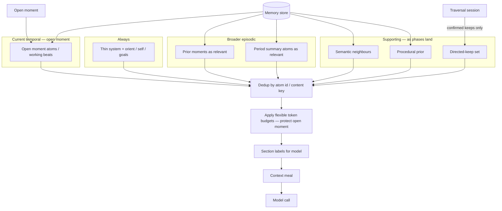
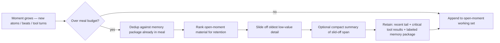

# Design: Context meal composition & in-moment slide-off

**Status:** Provisional design (percentages illustrative, not normative)
**Branch:** `grok-improvement-memory`
**Related:** [design-phase-1-temporal.md](design-phase-1-temporal.md), [inspiration-activity-model-and-storage.md](inspiration-activity-model-and-storage.md), [philosophical-soft-guidance.md](philosophical-soft-guidance.md)

## Purpose

Describe how the **context meal** for a model call is assembled once atomized memory exists, and how **slide-off** manages growth *inside* an open moment without deleting durable memory.

Stretch 1 used a sliding recent window. Stretch 2 evolves that into a **composed, labeled package**: temporal spine plus supporting channels, deduplicated, with retrieval provenance at least partially visible to the model.

This document is for **in-implementation reasoning and tuning**. Channel shares below are a starting sketch — measure and adjust with real token accounting; allow **flex** during testing. Do not hard-code illustrative ratios as product law.

---

## Principles

1. **Temporal spine first** — the **open moment** (its atoms / working beats) dominates so “what is happening now” is not lost.
2. **Broader episodic is prior experience** — other moments and their summaries, included as they fit and as they are relevant — not a second copy of the current moment.
3. **Supporting channels add; they do not replace** — semantic, procedural, and directed-keep ride on top of temporal structure.
4. **Deduplicate** — the same atom must not appear multiple times via different channels.
5. **Label sources** — the model should see *why* a block is present (`temporal`, `episodic`, `semantic`, `procedural`, `directed-keep`, `orient`, etc.).
6. **Slide-off is meal management, not forgetting** — durable atoms stay in the store; only the working set for the call shrinks or folds.
7. **Under pressure, cut supports before the spine** — protect the open-moment tail and essential temporal package before coarser episodic or semantic fill.
8. **Re-gather on boundaries** — context is re-composed between moments; within a long moment, optionally re-gather every *N* hops so the meal stays coherent without waiting for moment close.

---

## Moments and atoms (meal-facing view)

- A **moment** is a **group of atoms** (and any still-ephemeral working beats not yet promoted) bound to one do-loop / presence interval.
- An **atom** is the durable instance unit in the store.
- **Current temporal** ≈ atoms and working material of the *open* moment (plus any sequential glue still in that moment).
- **Broader episodic** ≈ *other* moments and period-summary atoms (15m → 1m ladder), selected by relevance and remaining budget — “what else has been going on that still matters.”

Promotion of beats → atoms remains a Phase 1 implementation detail; the meal must tolerate both.

---

## Illustrative channel mix (non-normative)

Token shares of the *memory-related* portion of the meal (excluding thin system instructions). Ranges need not sum to a neat 100%; treat them as **relative flex targets** refined in testing.

| Channel | Illustrative share | What it is | When it appears |
|---------|-------------------|------------|-----------------|
| **Current temporal** | ~40–50% | Open moment: its atoms / working beats | Phase 1+ |
| **Broader episodic** | ~10%+ as fits | Prior moments and summaries of moments (ladder), relevance-filtered | Phase 1+ |
| **Semantic** | ~10–15% | ANN / similarity neighbours (bonded channels as available) | Phase 2+ |
| **Procedural** | ~5–10% | Success-path / process prior in subspace | Phase 3+ |
| **Directed-keep / curated** | ~10% | Model-selected keeps from traversal (durable only after confirm) | Phase 2a+ |
| **Orient / self / goals** | fixed residual | Identity, active goals, thin orient | Always |

Phase 1 ships current temporal + broader episodic (as budget allows) + orient; empty later channels are omitted, not zero-filled with noise.

---

## Construction flow



### When the meal is rebuilt

| Trigger | Behaviour |
|---------|-----------|
| **New moment** | Full re-gather: orient + open moment (empty or seeding) + broader episodic + any active supports |
| **Every N hops** (optional, long moment) | Re-gather supporting and broader episodic slices; slide-off may run on the open-moment working set |
| **Budget pressure** | Slide-off path (below) without waiting for moment close |

*N* and exact triggers are tuned in implementation; start simple (moment boundaries + budget) before hop-periodic re-gather.

### Dedup

- Prefer a single inclusion per `atom_id` (or stable content key for non-atom beats).
- If an atom qualifies for multiple channels, keep **one** copy and optionally note secondary reasons in the label (e.g. `temporal+semantic`) rather than repeating body text.
- Directed-keep already in the open moment should not be pasted twice.

### Source labels

Lightweight, stable section markers the model can learn, for example:

```text
[context:temporal/moment]
...
[context:episodic/summary 1h]
...
[context:episodic/prior-moment]
...
[context:semantic]
...
[context:directed-keep]
```

Exact markup is an implementation choice; clarity to the model matters more than format fashion.

---

## In-moment slide-off

As a **moment** (one do-loop, a group of atoms over time) grows, the meal can exceed budget even when durable memory is stable. Slide-off manages the **open-moment working set** inside the meal.



### Retention bias (open moment)

Prefer to keep:

- Latest user/operator intent
- Recent assistant commitments
- Failed/successful tool results still relevant to the open goal
- Anything already durable as atoms (prefer reference by id over full replay when already in episodic package)

Prefer to slide off:

- Verbose intermediate tool noise already reflected in a later atom or summary
- Repeated identical errors
- Early exploration that was superseded

### What slide-off must not do

- Delete or rewrite durable atoms in the store
- Drop the labeled memory package before open-moment noise
- Promote temporary traversal candidates into durable context
- Silently merge inferred gaps into memory as facts

### Optional compact of slid-off span

When a contiguous early span slides off, a short **in-moment compact summary** may replace it inside the meal only. That summary is working-set glue, not a period-ladder summary atom (unless a separate consolidation path deliberately writes one).

---

## Relation to external `/compact` patterns

Agent CLIs (including Grok Build’s auto-compact / recap-style flows, and similar `/compact` commands elsewhere) typically:

- summarize older transcript,
- keep a recent tail,
- rehydrate critical instructions or skills.

**Elyra mapping:** treat that as inspiration for **in-moment slide-off + optional compact**, then **re-inject** the structured, labeled memory package (open moment + broader episodic + supports). Do not replace the whole meal with one opaque narrative that erases provenance.

**Follow-up:** when integrating Grok Build, inspect local compact behaviour (trigger threshold, preservation rules, prompt) and record concrete lessons here or in an architecture note. Public notes indicate auto-compact, `/recap`/`/summarize`, and iterative compaction prompt tuning — useful parallels, not a spec to copy blindly.

---

## Phase rollout

| Phase | Meal behaviour |
|-------|----------------|
| **1** | Open-moment temporal + broader episodic as relevant; slide-off; re-gather on moment boundary (optional N-hop later); drop-in path for current sliding meal |
| **2** | Add semantic channel; extend dedup; see [design-nemotron-runtime.md](design-nemotron-runtime.md) |
| **2a** | Add directed-keep channel; temporary traversal buffer never enters meal as durable unlabeled history |
| **3** | Add procedural prior; keep share small and scoped |

`elyra/memory/meal.py` (or equivalent) should own composition; `loop/context.py` consumes the package.

---

## Open questions

- Default meal token budget and flex bands under live accounting
- Trigger: token threshold vs turn count vs both; default *N* for hop re-gather
- Whether compact of slid-off spans is template-only or LLM-assisted
- How glass/UI surfaces meal composition for the operator
- How much secondary-reason labeling (`temporal+semantic`) helps vs clutters
- Lessons from local Grok Build compact source when available

---

## Non-goals for this design note

- Fixed universal percentages
- Implementing Φ-based ranking of meal sections
- Automatic promotion of model inferences into durable atoms during compact

---

*Provisional. Refine with spikes and live token accounting; keep open-moment-first and labeled.*
