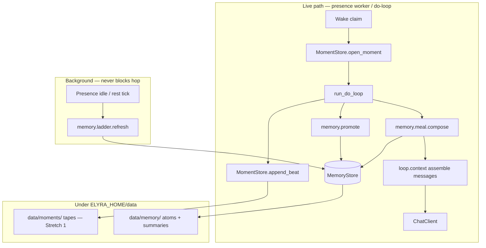
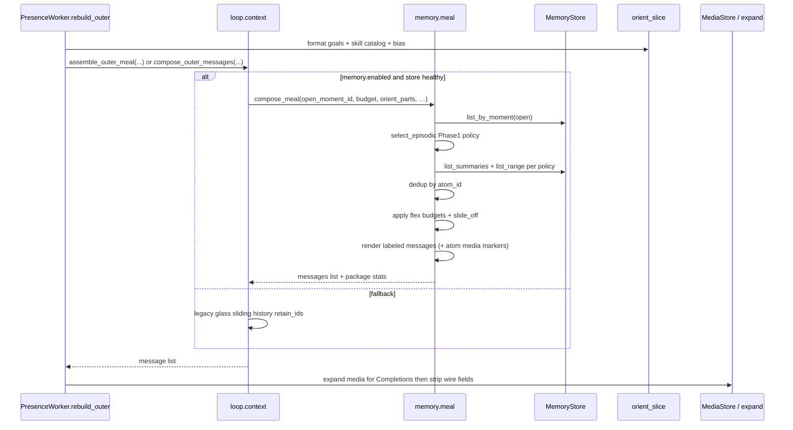
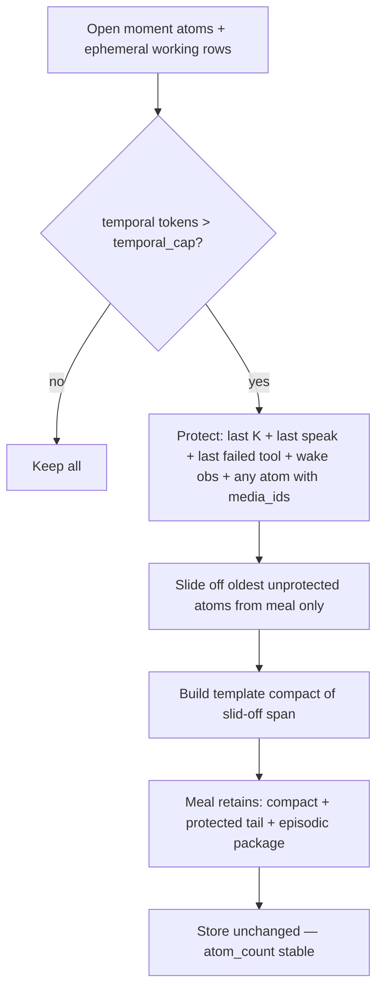
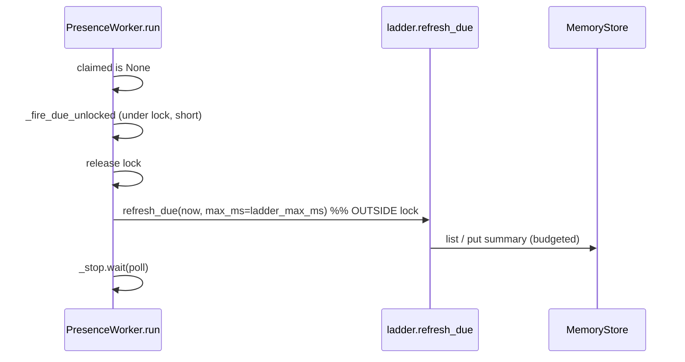

# Stretch 2 Phase 1 — Temporal / Episodic Memory

| Field | Value |
|-------|--------|
| **Document** | Implementation-ready design + plan |
| **Product** | project-elyra |
| **Author** | _(design agent)_ |
| **Date** | 2026-07-28 |
| **Status** | **Done** (2026-07-28) — PR1–PR9 shipped; see [architecture/phase-1-temporal.md](architecture/phase-1-temporal.md), residual [design-phase-1-remaining-pr8-pr9.md](design-phase-1-remaining-pr8-pr9.md), [README.md](README.md) close-out + [known-bugs.md](../known-bugs.md) caveats |
| **Branch** | `grok-improvement-memory` (planning); runtime product work typically lands via `grok-improvement` |
| **Philosophy** | [`docs/memory-atoms.pdf`](../docs/memory-atoms.pdf) |
| **Baseline** | [`docs/stretch-2/inspiration-activity-model-and-storage.md`](../docs/stretch-2/inspiration-activity-model-and-storage.md) |
| **Prior sketches** | [`design-phase-1-temporal.md`](../docs/stretch-2/design-phase-1-temporal.md), [`design-context-meal-composition.md`](../docs/stretch-2/design-context-meal-composition.md), [`design-database-choices.md`](../docs/stretch-2/design-database-choices.md) |

This document **supersedes the short phase outline** for implementation purposes. Where it resolves open questions from `design-phase-1-temporal.md`, the resolutions appear under **Key Decisions** with rationale. Soft influences from `philosophical-soft-guidance.md` inform judgment only; they are not deliverables.

---

## Overview

Stretch 1’s do-loop builds each model call as:

```text
thin system + sliding glass history + orient
```

implemented in `elyra/loop/context.py::assemble_outer_meal`, driven by presence’s `rebuild_outer` (`elyra/presence/worker.py`), with in-turn chain trimming in `elyra/loop/doloop.py::enforce_in_turn_budget`. Moments and beats already persist under `data/moments/` (`MomentStore`), but **there is no durable episodic structure beyond tapes**, no period consolidation, and no labeled multi-channel meal.

Phase 1 introduces:

1. **Atoms** — durable, time-ordered instance records promoted from selected beats / social ingress.
2. **Moments as groups of atoms** — the existing do-loop / presence interval becomes a first-class membership key on atoms (moments remain open/close in `MomentStore`; atoms reference `moment_id`).
3. **Sequential weave (temporal only)** — `prev_atom_id` / `next_atom_id` links.
4. **Period summary ladder** — rolling template summaries at 15m → 1h → 6h → 1d → 1w → 1m.
5. **Labeled meal composition** — current temporal (open moment) + broader episodic (prior moments / ladder) + orient; **slide-off** under the product meal budget (**50k** sliding tokens; glass model-window denominator **500k**).

Phase 1 **must stand alone** without Nemotron, ANN, directed traversal, or success-path weights. Storage is behind a narrow `MemoryStore` interface (JSONL backend for hermetic CI; LanceDB preferred production backend when available). `loop/` and `presence/` orchestrate; they never import raw Lance.

---

## Background & Motivation

### Current state (code)

| Concern | Today | Pain |
|---------|-------|------|
| Outer meal | `assemble_outer_meal` drops oldest glass user/assistant rows under `LoopSettings.sliding_input_tokens` (default **50_000** = `DEFAULT_SLIDING_INPUT_TOKENS`) | Glass history is not structured episodic memory; no provenance labels; no period compression |
| In-turn chain | `enforce_in_turn_budget` drops oldest assistant+tool batches; may re-outer | Chain compression is opaque to the model; not durable |
| Moment tape | `MomentStore.append_beat` — model / tool / obs / stop (and typed `speak`) | Append-only debug/product tape; not queryable as temporal graph; dense under wake storms (**BUG-wake-01**) |
| Glass | `elyra/messages.py::list_messages` (rebuild reads `limit=80`) | Cross-moment social surface, not atom store |
| Token math | `estimate_tokens = len//4`; glass rail via `context_meter.record_meal` | Heuristic only; meal budget ≠ model window |
| Constants | `elyra/llm/constants.py`: meal **50k**, model window **500k**, legacy `CONTEXT_WINDOW_TOKENS=86_000` for older meal-math docs | Easy to conflate three numbers |

### Why change

The memory-atoms philosophy treats memory as **organized experience** (instances + time scaffold + consolidation), not a warehouse of facts. Phase 1 is the temporal scaffold:

- **Primary temporal context** for the do-loop without embeddings.
- **Consolidation** via a rolling ladder so long history remains loadable under 50k.
- **Slide-off** as working-set management (meal only) — **never** store deletion.
- A clean seam for Phase 2 semantic / 2a directed-keep / 3 procedural channels without rewiring the loop.

### Constraints (hard)

- Single presence worker (single-writer friendly).
- Background jobs never starve the do-loop.
- Feature-flag / clean fallback if store unavailable.
- Docs: planning under `docs/stretch-2/`; architecture manuals under `docs/stretch-2/architecture/` when shipping.
- No Stretch 2 hypergraph / success-path machinery in Phase 1.
- Align with engineering principles: modular packages, tests as feature, narrow public API, `ELYRA_HOME` defaults.

---

## Goals & Non-Goals

### Goals

1. Durable **Atom** records with normative **beat → atom promotion**.
2. Moments queryable as **groups of atoms** (by `moment_id`).
3. Sequential linking within (and optionally across) moments.
4. **Period summary ladder** refreshed on rest/idle/timers (template-first).
5. **Meal package** API consumed by `loop/context.py` with labeled sections.
6. **Slide-off** under `sliding_input_tokens` (50k default) without deleting atoms.
7. Swappable `MemoryStore` (JSONL required for tests; Lance optional extra).
8. Feature flag `memory.enabled` (default **off** until meal path dogfood-ready; see KD).
9. Unit + integration tests; zero Nemotron dependency.
10. **Concept-mapping architecture note** (structure map + activity map + invariants + failure modes) as part of done.

### Non-goals (Phase 1)

| Non-goal | Deferred to |
|----------|-------------|
| Nemotron multi-embeddings / ANN | Phase 2 |
| Directed multi-hop traversal / keep-set | Phase 2a |
| Success-path / trajectory weights | Phase 3 |
| Native hyperedges beyond sequential + period membership | Later |
| Fixed universal channel percentages as product law | Tuning (flex only) |
| LLM-generated ladder summaries as default | Optional later; Phase 1 = template |
| Automatic pruning/deletion of fine atoms under summaries | Deliberate later (archive policy) |
| Full historical backfill of all past moments as day-1 requirement | Optional tool / offline job; not gate |
| Glass UI redesign for meal channels | Thin meter fields only if cheap |
| Fixing BUG-wake-01 root cause | Separate; Phase 1 **mitigates density** via promotion filters |

---

## Proposed Design

### High-level architecture



**Ownership:**

| Module | Owns | Does not own |
|--------|------|--------------|
| `elyra/memory/*` | Atom types, store, promote, ladder, meal, slide-off | Do-loop policy, wakes, glass transport |
| `elyra/loop/context.py` | Message assembly, token estimate, system/orient | Persistence of atoms |
| `elyra/loop/doloop.py` | Hop orchestration; hooks promote on beats; consumes outer meal | Store schema |
| `elyra/presence/worker.py` | `rebuild_outer`, moment open/close, ladder tick on idle | Atom field layout |
| `elyra/moment/` | Moment meta + beat tapes (unchanged authority for tapes) | Atom CRUD |

---

### Module layout

```text
elyra/memory/
  __init__.py          # public re-exports (narrow)
  types.py             # Atom, AtomKind, PeriodScale, MealSection, pure data
  errors.py            # MemoryStoreError, MemoryUnavailable
  store.py             # MemoryStore Protocol + factory open_memory_store()
  jsonl_store.py       # hermetic backend (tests + default without lancedb)
  lance_store.py       # optional LanceDB backend (import guarded)
  promote.py           # beat/event → atom rules + sequential link
  temporal.py          # range queries, sequential walk helpers
  ladder.py            # period windows + template summary refresh
  meal.py              # compose labeled package + slide-off + render messages
  tokens.py            # re-export/adapt estimate_tokens; section budgeting
  config.py            # MemorySettings helpers / path roots

tests/
  test_memory_types.py
  test_memory_store.py          # Protocol contract over jsonl (+ lance if extra)
  test_memory_promote.py
  test_memory_temporal.py
  test_memory_ladder.py
  test_memory_meal.py
  test_memory_context_integration.py
  test_memory_flag_fallback.py

docs/stretch-2/architecture/
  phase-1-temporal.md           # post-ship concept map (done criterion)
```

Optional later (not Phase 1 required): `elyra/memory/graph.py` reserved by database design for Phase 2a.

**Data directory:**

```text
{ELYRA_HOME}/data/memory/
  meta.json                 # schema_version, backend, created_at
  atoms.jsonl               # jsonl backend: one atom per line (latest wins by atom_id)
  atoms/                    # optional content blobs if content too large for line
    {atom_id[:2]}/{atom_id}.txt
  ladder/
    state.json              # last refresh per scale + window keys
  # lance backend alternative:
  lance/                    # directory table root when backend=lance
```

`config.ensure_data_dirs` gains `"memory"` alongside `moments`, `wakes`, …

---

### Data model

#### Logical Atom (Phase 1)

```python
# elyra/memory/types.py — conceptual shape (normative fields)

AtomKind = Literal[
    "observation",  # user / host / interjection ingress that is experience
    "speak",        # product speak act
    "tool",         # tool result (or notable tool call summary)
    "model",        # rare: durable free-text model content (not reasoning)
    "ledger",       # goal/task state change worth remembering
    "summary",      # period or moment compact summary
    "parcel",       # oversized content split (stub OK Phase 1)
    "moment_meta",  # optional: moment open/close envelope as atom
]

PeriodScale = Literal["15m", "1h", "6h", "1d", "1w", "1m"]

@dataclass(frozen=True)
class Atom:
    atom_id: str                 # "a_" + uuid hex
    t_start: str                 # UTC ISO Z
    t_end: str | None            # optional; summaries use window
    moment_id: str | None        # group membership; null for pure period summaries
    kind: AtomKind
    content_ref: str             # storage locator ONLY: "inline" | "blob:{relpath}"
    content_text: str            # meal/render body (always filled; capped at write)
    media_ids: tuple[str, ...]   # Stretch 1 media content ids (not glass message ids)
    prev_atom_id: str | None
    next_atom_id: str | None
    parent_atom_id: str | None   # parcel-of / summary-of link
    scale: PeriodScale | None    # set for kind=summary ladder atoms
    window_start: str | None     # period window
    window_end: str | None
    source_beat_ts: str | None   # provenance to moment tape
    source_beat_type: str | None
    embedding_status: str        # Phase 1: always "none"
    qualia: None                 # stub reserved
    meta: dict[str, Any]         # tool name, ok, hop, why_now, wake_message_id, …
    schema_version: int          # 1
```

**Content field rules (normative):**

| Field | Role |
|-------|------|
| `content_text` | **Always** what meal/ladder/tests render. Cap at write: `atom_max_chars`. Never leave empty when body exists. |
| `content_ref` | Storage locator only: `"inline"` when body is in the row; `"blob:{relpath}"` when spilled under `data/memory/atoms/…`. Not a second prose channel for callers. |

On `put_atom`: if `len(content_text) > MEMORY_INLINE_MAX_CHARS` (default 8000), write full text to blob, set `content_ref=blob:…`. Live index keeps full `content_text` for meal speed after load/get. Meal code **must not** parse `content_ref` for display.

**Invariants:**

1. `kind=summary` with `scale` set ⇒ `window_start`/`window_end` required; `moment_id` usually null (period). Default meal compact does **not** write an atom.
2. Sequential chain: at most one open `next_atom_id is None` tail per moment for live promotion (global tail also tracked for cross-moment sequence).
3. `embedding_status="none"` until Phase 2; never null-ambiguous. **No** similarity/ANN ranking in Phase 1 meal selection.
4. **Warehouse anti-pattern:** do not collapse many instances into one “fact row”; summaries **point at** children via `meta.child_atom_ids` (capped list) and/or window query.

#### Physical storage

**JSONL backend (default for CI / no optional deps):**

- Append-only log with periodic compaction of latest-by-`atom_id` (single-writer).
- Indexes in memory on open: `by_id`, `by_moment`, `by_time` sorted list, `ladder_by_scale_window`.
- Content spill: blob under `atoms/{id[:2]}/{id}.txt` when over inline max; row keeps `content_ref`.
- **Link updates:** each promote may append a new atom line **and** an update line for `prev.next_atom_id` (two appends). Compaction merges latest-by-id.
- **Compaction timing:** only when **not** in-moment — idle path shared with ladder, or when dirty line count exceeds `MEMORY_JSONL_COMPACT_DIRTY` **and** worker is idle. **Never** compact mid-hop.
- **Restart cost:** open rebuilds the full JSONL into memory indexes (O(lines)). Acceptable under single-writer / dogfood volume; a long tool-heavy moment before idle can leave a large dirty log until the next idle compact. State this in the architecture note.

**Lance backend (optional `elyra[memory]` extra when spiked):**

- Table `atoms` with columns matching logical fields; `content_text` as string column.
- No vector columns required in Phase 1 (prefer omit until Phase 2).
- Factory selects backend from settings / meta.json.

#### Moment relationship

- `MomentStore` remains the **authoritative** open/close + beat tape (glass debugging, hop_count, stop_reason).
- Memory does **not** replace tapes in Phase 1.
- Query “atoms for moment X” = `store.list_by_moment(moment_id)`.
- Optional `moment_meta` atom on open/close for ladder coverage of empty moments — **default off** for no-op rest moments (BUG-wake-01 density).

---

### Normative beat → atom promotion rules

Promotion is the core Phase 1 product rule. Implement in `elyra/memory/promote.py`. All promotion is **best-effort**: failures log + metric; **never raise into the do-loop**.

**Purity boundary:** `promote_beat(store, moment_id, beat, *, settings, moment_tool_counts=None)` is pure w.r.t. GoalsStore / wake claim policy. It only sees the beat dict + moment_id + settings + optional in-moment counters passed by the caller. No `why_now` GoalsStore staleness checks inside promote (see R6).

#### Source events

| Source | Where emitted today | Promote? |
|--------|---------------------|----------|
| Social wake user content | presence moment open (not always a tape beat) | **Yes** via `promote_wake_observation` → `observation` |
| Media-only social wake | glass KD19 / user_input | **Yes** if `media_ids` non-empty even when text empty |
| Non-social wake (`timer`, `task_ready`, `moment_continue`, …) | presence open | **No** wake observation atom |
| Interjection | `doloop` obs `kind=interjection` | **Yes** → `observation` (+ media if any) |
| Model beat | `doloop` `type=model` | **Conditional** (R5) |
| Tool beat | `doloop` `type=tool` | **Conditional** (R4 density policy) |
| Speak product act | tool `name=speak` (beat is **`type=tool`**, not `type=speak`) | **Yes** → `kind=speak` |
| Host continue / no_speak / answer_speak / work_continue / skill_commit | `type=obs` | **No** (R1) |
| `tool_skip_identical` | `type=obs` | **No** (R1) |
| Thrash HOST / lesson | `type=obs` `kind=tool_thrash` \| `thrash_lesson` | **No** (R1) |
| Ledger mutations | tool beats for ledger tool names | **Yes** → single `kind=ledger` one-liner (R4) |
| skill_load / stop | tape | **No** by default |
| Optional `moment_meta` | never auto in Phase 1 | **Default off** |

#### Normative rules (must implement as pure functions + tests)

```text
R1. Control-plane exclusion (exact live kinds)
    Never promote type=obs when is_control_obs_kind(kind) is True.

    def is_control_obs_kind(kind: str | None) -> bool:
        if not kind:
            return False
        if kind in CONTROL_OBS_KINDS:  # exact set below
            return True
        if kind.startswith("thrash"):  # belt-and-suspenders
            return True
        return False

    Never promote reasoning_content (strip if present on model beats).

R2. Speak (live beat shape is type=tool, name=speak)
    Input beat fields (tests MUST use this shape, not fictional type=speak):
      {"type": "tool", "name": "speak", "ok": bool, "content": str,
       "tool_call_id": str, "error_reason": ...}
    If name == "speak" and ok is True → Atom(kind=speak,
      content_text=spoken text truncated to atom_max_chars,
      media_ids from beat/meta attachments or speak delivery ids if present).
    Failed speak → still kind=speak with short error body; meta.transport_ok=False.

R3. User observation (wake + interjection)
    A. promote_wake_observation(...) — called once at social moment open (worker),
       NOT from promote_beat. See “Wake observation API” below.
    B. type=obs kind=interjection → kind=observation; content + optional media_ids.
    Dedup: same moment_id + content_hash(text) + media_ids fingerprint within 2s
      → skip second atom (covers glass-already-appended + wake promote).

R4. Tool results — density policy (KD16)
    Speak handled by R2 (do not double-emit as generic tool).
    Ledger tool names (exact) → kind=ledger ONE atom only (not tool+ledger):
      create_goal, create_task, update_goal, update_task
      (list_goals / get_goal / get_task are read-only: treat as normal tools below)
    One-liner template from ok payload when parseable, else truncated content:
      "goal {id}: {title} [{status}]" / "task {id} → {status}: {title}"
    Parse best-effort from tool content JSON/text; never store secret values.

    For other type=tool beats:
      - Skip if content empty after trim.
      - If ok is False → promote full truncated body (atom_max_chars);
        meta={tool_name, ok, error_reason, hop, truncated?}.
      - If ok is True → promote with content_text truncated to
        TOOL_OK_PREVIEW_CHARS (default 240); meta.preview=True.
      - Soft cap: per moment, at most MAX_TOOL_ATOMS_PER_MOMENT (default 48)
        non-speak non-ledger tool atoms. Beyond cap: promote only ok=False
        (failures still memorable); skip further ok=True tools.
    Caller may pass moment_tool_counts for the cap; promote_beat updates a
    returned counter or mutates a small PromoteState held by doloop for the moment.
    NON_MEMORABLE_TOOLS remains available (default empty) for future denylist.

R5. Model free-text
    Promote type=model only when:
      - no tool_calls (or empty), AND
      - content strip non-empty, AND
      - content is not identical to a just-injected HOST line, AND
      - len(content) >= MODEL_PROMOTE_MIN_CHARS (default 40)
    kind=model. Never store reasoning field on the atom body.

R6. Empty moments & BUG-wake-01 (simplified — no GoalsStore)
    (1) Default: if no R2–R5 / wake rule fires, the moment has zero atoms.
        Empty rest / stale timer / stale task_ready moments that produce no
        memorable beats need NO special promote case and NO moment_meta atom.
    (2) moment_meta atoms: default OFF (do not auto-write on open/close).
    (3) Non-social wakes must NOT call promote_wake_observation
        (timer / task_ready / moment_continue / wait_timeout / …).
    (4) Stale task_ready “done at claim” detection is NOT part of promote;
        it belongs to BUG-wake-01 wake-claim policy (follow-up). PR2 tests
        stay on beat shapes only — no GoalsStore fixtures.

R7. Sequential linking
    On successful create inside a moment:
      prev = store.moment_tail(moment_id) or store.global_tail()
      new.prev_atom_id = prev.atom_id if prev else None
      if prev: update prev.next_atom_id = new.atom_id
    Cross-moment: first atom of new moment links prev to last atom of previous
    moment when MEMORY_LINK_ACROSS_MOMENTS=True (default True).

R8. Idempotency
    Optional source key: (moment_id, source_beat_ts, kind, content_hash).
    Second promote with same key is no-op. Protects re-outer / retry paths.
    Wake observation key: (moment_id, "wake", wake_message_id or content_hash).

R9. Timing
    Promote synchronously after append_beat in doloop / wake promote at open
    in worker — wrapped try/except; target <5ms for jsonl append on SSD.
    If store unavailable (flag off or open failed): no-op.

R10. Dual-write policy (transition)
    Phase 1 always keeps MomentStore beats. Atoms are additive.
    Meal path under flag uses atoms (+ ephemeral chain); glass history path
    remains fallback. No dual meal composition forever — see integration section.
```

#### Wake observation API (normative)

```python
def promote_wake_observation(
    store: MemoryStore,
    moment_id: str,
    *,
    content: str | None,
    message_id: str | None,
    media_ids: Sequence[str] = (),
    why_now: str = "",
    settings: MemorySettings,
) -> Atom | None:
    """
    Call once from PresenceWorker after open_moment for social wakes only.
    - Promote when content strip non-empty OR media_ids non-empty (media-only OK).
    - meta.wake_message_id = message_id (for meal wake protection + media expand).
    - media_ids = Stretch-1 media content ids from wake/glass attachments.
    - Returns None on dedupe / empty / write_atoms false / errors (errors logged).
    """
```

Worker resolves attachments from the wake payload / glass row for `message_id` (same sources used today for `wake_content` / `wake_message_id` inject). Interjections that carry media use the same `media_ids` field on the observation atom.

#### Content hash

```python
def content_hash(text: str) -> str:
    return hashlib.sha256(text.encode("utf-8")).hexdigest()[:16]
```

#### Non-memorable defaults (aligned with live `doloop` kinds)

```python
# promote.py — exact kinds emitted by elyra/loop/doloop.py today
CONTROL_OBS_KINDS = frozenset({
    "continue",
    "no_speak_nudge",
    "answer_speak_nudge",
    "work_continue",
    "skill_commit",
    "tool_skip_identical",
    "tool_thrash",      # thrash HOST inject
    "thrash_lesson",    # thrash lesson request (+ any future thrash_*)
})
# Also reject kind.startswith("thrash") in is_control_obs_kind.

LEDGER_TOOL_NAMES = frozenset({
    "create_goal",
    "create_task",
    "update_goal",
    "update_task",
})
# Read-only ledger tools (list_goals, get_goal, get_task) use normal R4 tool path.

MODEL_PROMOTE_MIN_CHARS = 40
MEMORY_ATOM_MAX_CHARS = 8000
TOOL_OK_PREVIEW_CHARS = 240
MAX_TOOL_ATOMS_PER_MOMENT = 48  # non-speak, non-ledger; failures exempt after cap
```

Unit tests for R1 must include **each** live control kind above (including `tool_thrash`, `thrash_lesson`, `tool_skip_identical`). Speak tests use `type=tool` beats.

---

### Store interface (concrete Python API)

```python
# elyra/memory/store.py
from __future__ import annotations

from datetime import datetime
from typing import Any, Protocol, Sequence, runtime_checkable

from elyra.memory.types import Atom, AtomKind, PeriodScale


@runtime_checkable
class MemoryStore(Protocol):
    """Swappable atom persistence. Single-writer assumed (presence worker)."""

    def put_atom(self, atom: Atom) -> Atom:
        """Insert or replace by atom_id. Returns stored atom."""
        ...

    def get_atom(self, atom_id: str) -> Atom | None:
        ...

    def update_links(
        self,
        atom_id: str,
        *,
        prev_atom_id: str | None = ...,
        next_atom_id: str | None = ...,
    ) -> Atom:
        """Patch sequential links only."""
        ...

    def list_by_moment(
        self,
        moment_id: str,
        *,
        kinds: Sequence[AtomKind] | None = None,
        limit: int | None = None,
    ) -> list[Atom]:
        """Atoms in moment order (t_start asc, then atom_id)."""
        ...

    def list_range(
        self,
        t_start: datetime | str,
        t_end: datetime | str,
        *,
        kinds: Sequence[AtomKind] | None = None,
        exclude_moment_id: str | None = None,
        limit: int = 200,
    ) -> list[Atom]:
        """Half-open [t_start, t_end) by t_start; oldest first."""
        ...

    def list_summaries(
        self,
        scale: PeriodScale,
        *,
        overlapping: tuple[datetime | str, datetime | str] | None = None,
        limit: int = 50,
    ) -> list[Atom]:
        ...

    def moment_tail(self, moment_id: str) -> Atom | None:
        """Latest atom in moment by time/chain."""
        ...

    def global_tail(self) -> Atom | None:
        ...

    def walk_next(self, atom_id: str, *, n: int = 20) -> list[Atom]:
        """Follow next_atom_id up to n steps (including start)."""
        ...

    def walk_prev(self, atom_id: str, *, n: int = 20) -> list[Atom]:
        ...

    def delete_atom(self, atom_id: str) -> bool:
        """Phase 1: optional; meal must not call this. Admin/tests only."""
        ...

    def health(self) -> dict[str, Any]:
        """{ok, backend, atom_count?, error?} — for glass/status."""
        ...

    def close(self) -> None:
        ...


def open_memory_store(paths: ElyraPaths, settings: MemorySettings) -> MemoryStore:
    """
    Factory. backend=jsonl always available.
    backend=lance requires optional dependency; fall back to jsonl + log if missing.
    """
    ...
```

**JSONL implementation notes:**

- `threading.RLock` per store instance (mirror `GoalsStore`).
- `put_atom` appends JSON line; in-memory maps updated under lock.
- Compaction: rewrite latest-by-id when file exceeds `MEMORY_JSONL_COMPACT_BYTES` (e.g. 8 MiB) or atom_count dirty ratio — **only on idle ladder tick**, never mid-hop.
- `health()` returns counts from memory index (O(1)).

**Lance implementation notes (Phase 1 optional):**

- Guarded import: `try: import lancedb except ImportError`.
- Same Protocol; no calls from loop code.
- Spike checklist remains in `design-database-choices.md` before making Lance default-on.

---

### Meal composition & integration with context / do-loop

#### Package shape

```python
# elyra/memory/meal.py

@dataclass(frozen=True)
class MealItem:
    atom_id: str | None          # None for ephemeral beat/chain rows
    channel: str                 # temporal | episodic | orient | system | chain
    label: str                   # e.g. "temporal/moment", "episodic/summary 1h"
    role: str                    # user | assistant | system
    content: str
    token_estimate: int
    t_start: str | None = None
    meta: dict[str, Any] = field(default_factory=dict)


@dataclass(frozen=True)
class MealPackage:
    items: tuple[MealItem, ...]
    total_tokens: int
    slid_off_count: int
    compact_text: str | None     # in-meal only glue for slid-off span
    channels_present: tuple[str, ...]
    open_moment_id: str | None
```

#### Construction flow



#### Broader episodic selection (Phase 1 normative — no embeddings)

Phase 1 has **no** ANN/similarity. “As relevant” in the meal sketch is **not** implementable here; use this deterministic policy. True relevance ranking is Phase 2+.

```text
EPISODIC_HORIZON_HOURS = 24          # H default; settings.memory.episodic_horizon_hours
EPISODIC_MAX_PRIOR_MOMENTS = 12      # soft cap when scanning raw atoms by moment

select_episodic(store, now, open_moment_id, episodic_cap_tokens) -> list[MealItem]:
  1. SUMMARY PASS (prefer structure over raw spam)
     For each scale in order [1m, 1w, 1d, 6h, 1h, 15m]:  # coarse first for packing
       load summary atom for the *current open window* at that scale (if any)
       and the immediately previous closed window at that scale (if any)
     Accumulate newest/coarsest first until episodic_cap * 0.7 (summary budget share)
     Skip nulls; dedup by atom_id.

  2. RAW FILL (remainder of episodic_cap)
     atoms = store.list_range(now - H, now, exclude_moment_id=open_moment_id,
                              kinds=non-summary, limit=500)
     Group by moment_id; take up to EPISODIC_MAX_PRIOR_MOMENTS most recent moments
     Within each moment, newest-last for render (chronological)
     Add atoms newest-moment-first until token cap
     Prefer kinds: speak, observation, ledger, failed tool (meta.ok is False);
       then other tools/model as space allows

  3. UNDER PRESSURE (when still over episodic_cap after estimate)
     Drop order (first to drop):
       a. raw tool/model atoms (oldest first)
       b. raw speak/observation beyond last 2 per prior moment
       c. finer summaries (15m then 1h then 6h…) before coarser (1d/1w/1m)
     Never drop the single most recent 1h or 1d summary if present until last resort

  4. LABELS
     summary → [context:episodic/summary {scale}]
     raw prior moment block → [context:episodic/prior-moment {moment_id_short}]
```

Golden tests: over-budget shrink order (3a→3c); empty store; only summaries; horizon excludes older raw. **Do not** use the words “similar” / “embedding” / “nearest” in PR4/PR6 meal code or tests.

#### Message order (normative Phase 1)

```text
1. system          — prompts/system.md (thin laws)
2. episodic block  — zero or more user-role labeled sections (broader)
3. temporal block  — open moment atoms (oldest→newest), labeled
4. [optional] in-moment compact — if slide-off produced one
5. orient          — prompts/orient.md filled (unchanged)
```

In-turn **chain** (tool hops) remains owned by `doloop` and is concatenated after outer prefix exactly as today. Meal package is the **outer** replacement for glass sliding history when enabled.

#### Labels (model-visible)

```text
[context:episodic/summary 1h]
…summary body…

[context:episodic/prior-moment {moment_id_short}]
…prior atoms or moment one-liner…

[context:temporal/moment {moment_id_short}]
…open moment atoms as dialogue-ish lines…

[context:temporal/compact]
…optional slid-off glue…
```

Render helper formats atoms as:

```text
[{t_start relative or HH:MM}] ({kind}) {content_text}
```

Speak atoms as assistant-role rows when isolated improves model adherence; Phase 1 may keep **all memory sections as `role=user` host blocks** (simpler, matches orient) — **decision: host-block user role for labeled memory sections** (KD). Glass speak rows are not double-injected when memory meal is on (see dual-write end-state).

#### Budget math (align with existing constants)

| Knob | Source | Default |
|------|--------|---------|
| Meal budget | `LoopSettings.sliding_input_tokens` | **50_000** |
| In-turn cap | `LoopSettings.in_turn_max_tokens` | **50_000** |
| Model window (glass rail denominator) | `LoopSettings.model_context_window_tokens` | **500_000** |
| Legacy math ceiling | `CONTEXT_WINDOW_TOKENS` | 86_000 (docs/tests only) |
| Token estimate | `estimate_tokens` / `estimate_content_tokens` in `context.py` | `len//4` |

**Phase 1 vs multi-channel meal sketch:** `design-context-meal-composition.md` illustrates temporal ~40–50% and episodic ~10%+ of the *memory-related* portion **with room for later semantic/procedural/directed channels**. Phase 1 allocates the **full post-orient residual to temporal + episodic only**; those larger temporal/episodic shares are intentional until Phase 2+ channels exist. Percentages remain **non-normative flex** (tune under dogfood).

| Channel | Phase 1 flex of remaining after system+orient |
|---------|--------------------------------------------------|
| Current temporal | ~70–85% (`1 - episodic_fraction`) |
| Broader episodic | ~15–30% (`episodic_fraction` default **0.20**) |
| Semantic / procedural / directed | 0 — **omit**, do not zero-fill |

Implementation:

```python
fixed = estimate_tokens(system) + estimate_tokens(orient)
remaining = max(0, budget - fixed)
episodic_cap = int(remaining * settings.memory.episodic_fraction)  # default 0.20
temporal_cap = remaining - episodic_cap
# Under pressure: shrink episodic first (policy §select_episodic step 3),
# then slide-off temporal head
```

`context_meter.record_meal` continues to publish **total outer+chain** heuristic tokens vs meal budget and model window — unchanged contract for glass.

#### Slide-off (in-moment)



Rules:

1. **Never** call `delete_atom` from slide-off. Tests assert store `atom_count` unchanged across slide-off.
2. Prefer dropping early `tool` noise already superseded by later atoms.
3. **Protect** (never slide off while budget allows any drop of others): last `protect_tail_atoms` (default 12); latest `kind=speak`; latest failed tool (`meta.ok is False`); wake observation (`meta.wake_message_id` set); **any atom with non-empty `media_ids`** (media continuity).
4. Compact template (meal-only, not ladder atom):

```text
[{n} earlier steps in this moment slid from meal | {t0}–{t1}]
- {kind}: {first 80 chars}
- …
```

5. Compact capped at `MEMORY_COMPACT_MAX_TOKENS` (default 400).
6. Re-gather: **full** meal rebuild on every `rebuild_outer` (moment boundary and re-outer). **Hop-periodic N:** default **off** (`memory.regather_every_n_hops = 0`).

#### Media continuity under memory meal (normative — blocks PR6 without tests)

Today `rebuild_outer` always runs:

```text
assemble_outer_meal(..., retain_ids=True)
  → expand_meal_for_provider(meal, glass_by_id=index_glass(glass), wake_message_id=…)
  → strip_meal_wire_fields
```

Vision/PDF expand is keyed off **glass message ids** on history rows (KD20/KD25 in media path). When `memory.enabled` excludes sliding glass history, that path breaks unless replaced.

**Normative replacement:**

1. **Promote-time media stamping**
   - `promote_wake_observation`: copy Stretch-1 media content ids from wake/glass attachments into `Atom.media_ids`; set `meta.wake_message_id`.
   - Interjection observations: same when interjection carries attachments.
   - Speak atoms: media ids from speak delivery / tool payload attachments when present.

2. **Compose-time markers**
   - When rendering a temporal (or wake) atom with `media_ids`, stamp the outer message with a host-only field the expand layer understands, e.g. `msg["_memory_media_ids"] = list(media_ids)` and, for wake obs, `msg["id"] = meta.wake_message_id` when set (so legacy `expand_meal_for_provider` can still resolve glass attachments for the wake row).

3. **Expand path (required in `rebuild_outer` when memory meal is on)**

```python
# presence/worker.py rebuild_outer — conceptual
meal = compose_outer_messages(...)  # labeled memory; may set id on wake obs row
glass = list_messages(limit=80, paths=self.paths)  # still read for expand index
expanded = expand_memory_meal_for_provider(
    meal,
    glass_by_id=index_glass(glass),
    wake_message_id=wake_message_id_s,
    media_store=MediaStore(self.paths),
    provider=self.settings.provider.name,
)
return strip_meal_wire_fields(expanded)
```

   `expand_memory_meal_for_provider` (in `elyra/memory/meal.py` or thin wrapper in `elyra/media/prompt.py`):

   - For messages with `id == wake_message_id`: **same behaviour as today** via `expand_meal_for_provider` (inventory + wake vision) — requires either the wake observation row to carry that `id`, **or** a hybrid inject of **only** the protected wake glass row(s) (not full sliding history) solely for expand correlation.
   - For messages with `_memory_media_ids` only: resolve each id through `MediaStore`, append inventory text (and wake-tier vision only if this row is the wake observation). Reuse `_enrich_attachment` / inventory helpers from `media/prompt.py` — do not reimplement MIME policy.
   - Hybrid fallback (acceptable Phase 1): if wake observation atom is missing but `wake_message_id` is set, inject **one** glass row (the wake message) into the meal before expand, then strip after — **never** reintroduce full `limit=80` sliding glass.

4. **Slide-off**: atoms with `media_ids` are protected (rule 3 above).

5. **PR6 acceptance tests (hard gate)**
   - Image-bearing social wake + `memory.enabled=True` → Completions-bound messages include inventory and/or image parts equivalent to legacy path.
   - Media-only wake (empty text, non-empty attachments) → observation atom exists; expand still runs.
   - `write_atoms` without `enabled` → legacy glass expand unchanged.

#### Ending dual-write of meals (not tapes)

| Phase | Tapes (`MomentStore`) | Atoms | Outer meal source |
|-------|----------------------|-------|-------------------|
| 1a flags off | Yes | No | Glass history (legacy) |
| 1b `write_atoms` only | Yes | Yes | **Still glass** (dogfood persistence; KD3 gradual mode) |
| 1c `enabled` (+ write) | Yes | Yes | Memory meal (+ media expand above) |
| Future | Yes (debug) or GC | Yes | Memory meal only |

**Decision:** support split flags:

- `memory.enabled` — meal path uses memory when store healthy.
- `memory.write_atoms` — promote path writes (can be true while meal still glass for dogfood).

Default ship: both **false** until PR stack greens; dogfood enables `write_atoms` first, then `enabled`.

Glass history is **not** deleted; when `memory.enabled`, outer meal **does not** include full sliding glass rows (avoid duplicate social transcript). Wake trigger: prefer wake observation atom; if missing, inject `wake_content` once and/or hybrid single glass wake row for media (see above).

---

### Period summary ladder

#### Scales

| Scale | Duration | Child scale | Refresh posture |
|-------|----------|-------------|-----------------|
| 15m | 15 minutes | raw atoms | Frequent; idle + every ladder tick |
| 1h | 1 hour | 15m summaries (+ raw if gaps) | Idle |
| 6h | 6 hours | 1h | Idle / coarse |
| 1d | calendar UTC day | 6h | Idle |
| 1w | ISO week UTC | 1d | Idle |
| 1m | calendar month UTC | 1w | Idle |

#### Window keys

```python
def window_bounds(scale: PeriodScale, t: datetime) -> tuple[datetime, datetime]:
    # 15m: floor to 15-min UTC grid
    # 1h: floor hour
    # 6h: floor to 00,06,12,18 UTC
    # 1d: UTC midnight → next
    # 1w: Monday 00:00 UTC → +7d
    # 1m: first of month → first of next
```

#### Template-first generation (normative Phase 1)

```text
[summary {scale} | {window_start} → {window_end}]
moments: {n_moments} | atoms: {n_atoms} | speaks: {n_speak} | tools: {n_tool}
goals touched: {goal_ids short list or —}
highlights:
- {t} {kind}: {truncated content}
- …
(open threads: {why_now of last moment in window if any})
```

- Max highlights: 12 for 15m, 16 for 1h, 20 for coarser.
- Prefer include: speak, observation, ledger, failed tools; sample other tools.
- `meta.child_atom_ids`: up to 64 ids (or child summary ids for coarser scales).
- Replace-in-place: one summary atom per `(scale, window_start)`; `put_atom` overwrites same id derived as:

```python
summary_id = "as_" + sha256(f"{scale}|{window_start.isoformat()}").hexdigest()[:20]
```

#### When to refresh — concrete placement in `PresenceWorker.run`

Live idle loop (`worker.py` ~936–945): if `claimed is None`, fire due timers under lock, then `wait(poll)`. Ladder must plug in here without blocking claims.



**Normative placement rules:**

1. Call `ladder.refresh_due` **outside** `self._lock`, only when **not** in-moment (`claimed is None` path), **after** `_fire_due_unlocked`.
2. **Never** call from inside `run_do_loop` / hop / `rebuild_outer`.
3. Also: once in `_finalize_moment` **after** `close_moment` (still outside long critical sections) refresh the **15m** window containing `ended_at` only (cheap single window).
4. Continuous `moment_continue` wakes: ladder still runs only between moments (when claim is None); that is correct — do not ladder during the continue moment.
5. Cap: `memory.ladder_max_ms_per_tick` default 50; at most one scale’s due windows per tick (round-robin). If work remains, next idle tick continues.
6. Optional: JSONL compact check on same idle tick (not mid-moment).

#### Child selection for coarser scales

- Prefer existing finer summaries in window.
- If finer missing (early life / flag just enabled), fall back to raw atoms with higher highlight bar.

#### LLM summaries

**Out of default path.** Optional future `memory.summary_mode = template | llm` — not Phase 1 ship.

---

### Integration points (file-level)

| File | Change |
|------|--------|
| `elyra/config.py` | `ensure_data_dirs` → create `data/memory` |
| `elyra/settings.py` | `MemorySettings` on `Settings`; `_apply_mapping` `[memory]` branch; backend/fraction validation |
| `elyra/loop/context.py` | Keep `estimate_*` public; optional thin helper to fill orient when meal composes system+orient |
| `elyra/loop/doloop.py` | `run_do_loop(..., memory_store=None, memory_settings=None)`; single `_record_beat` hook all append sites |
| `elyra/presence/worker.py` | Lazy/open store; social `promote_wake_observation`; idle ladder; finalize 15m; rebuild_outer meal+media expand |
| `elyra/media/prompt.py` | Reuse helpers from memory expand wrapper (prefer not fork MIME policy) |
| `elyra/loop/context_meter.py` | Optional channel breakdown — nice-to-have |
| `elyra/runtime/api.py` | Status `memory` health (can land PR5 or PR6; see PR plan) |
| `pyproject.toml` | optional `memory = ["lancedb>=…"]` when Lance path lands |

#### PR5 wire checklist (normative — incomplete wiring is a bug)

1. **`run_do_loop(..., memory_store: MemoryStore | None = None, memory_settings: MemorySettings | None = None)`** — optional kwargs; default `None` preserves all existing tests.
2. **Single internal recorder** — replace direct `_append_beat` call pattern with one function used by **all** sites (model, tool batch, continue/no_speak/answer_speak/work_continue/skill_commit, thrash, thrash_lesson, interjection drain, stop/error):

```python
def _record_beat(
    moments, moment_id, beat, *, memory_store=None, memory_settings=None, promote_state=None
) -> None:
    if moments is not None and moment_id:
        try:
            moments.append_beat(moment_id, beat)
        except Exception:
            _LOG.exception("append_beat failed …")
            return
    if (
        memory_store is not None
        and memory_settings is not None
        and memory_settings.write_atoms
    ):
        try:
            from elyra.memory.promote import promote_beat
            promote_beat(
                memory_store, moment_id, beat,
                settings=memory_settings,
                moment_tool_counts=promote_state,
            )
        except Exception:
            _LOG.exception("memory promote failed")  # never raises to caller
```

3. **Worker constructs store once** (startup or first use); on open failure set `self._memory = None` and log once.
4. **Social moment open:** after `open_moment`, if social wake and `write_atoms`, call `promote_wake_observation(...)` with content, `message_id`, `media_ids`.
5. **Idle:** when `claimed is None`, after `_fire_due_unlocked`, **outside lock**, `ladder.refresh_due` if store and `ladder_enabled` and (`write_atoms` or `enabled`).
6. **Close:** `_finalize_moment` → 15m window refresh (budgeted, outside lock).
7. **Pass-through:** `_run_moment` → `_run_do_loop` → `run_do_loop(memory_store=self._memory, memory_settings=self.settings.memory)`.
8. **Tests:** promote I/O failure must not change `DoLoopResult.stop_reason` / hop_count; thrash/obs control kinds never create atoms; flags default off ⇒ zero behavioural change.
9. **PR5 does not enable meal** — `rebuild_outer` stays on legacy `assemble_outer_meal` until PR6.

**`rebuild_outer` sketch (PR6):**

```python
def rebuild_outer() -> list[dict[str, Any]]:
    # … digests, goals, catalog as today …
    glass = list_messages(limit=80, paths=self.paths)
    if self._memory is not None and self.settings.memory.enabled:
        from elyra.memory.meal import compose_outer_messages, expand_memory_meal_for_provider
        meal = compose_outer_messages(
            store=self._memory,
            paths=self.paths,
            settings=self.settings,
            open_moment_id=moment_id,
            self_digest=...,
            user_digest=...,
            why_now=why,
            goals=...,
            skill_catalog=...,
            skill_bias=...,
            wake_content=wake_content_s,
            wake_message_id=wake_message_id_s,
        )
        expanded = expand_memory_meal_for_provider(
            meal,
            glass_by_id=index_glass(glass),
            wake_message_id=wake_message_id_s,
            media_store=MediaStore(self.paths),
            provider=self.settings.provider.name,
        )
        return strip_meal_wire_fields(expanded)
    # legacy path unchanged
    meal = assemble_outer_meal(..., glass_history=glass, retain_ids=True, ...)
    return strip_meal_wire_fields(expand_meal_for_provider(meal, ...))
```

---

### Historical moments (migration / backfill)

| Option | Phase 1 stance |
|--------|----------------|
| Auto backfill all `data/moments/*.jsonl` on startup | **Non-goal** (can stall startup; wake-storm density) |
| Offline CLI `elyra memory backfill --since …` | **Should-have** late PR or follow-up |
| Opportunistic: when meal needs broader episodic and store empty | Seed from recent N closed moments via one-shot adapter | **Optional** |

**Deliberate non-goal for day-1 done:** complete historical parity. Path:

1. `elyra/memory/backfill.py` pure functions: `beats_to_atoms(moment_meta, beats) -> list[Atom]` reusing promote rules.
2. CLI or script under `scripts/` later.
3. Architecture note documents “atoms exist from flag-on time; older life is glass/tapes until backfill.”

---

### Feature flags & settings

```python
_MEMORY_BACKENDS = frozenset({"jsonl", "lance"})

@dataclass(frozen=True)
class MemorySettings:
    enabled: bool = False              # meal path
    write_atoms: bool = False          # promote path
    backend: str = "jsonl"             # jsonl | lance
    episodic_fraction: float = 0.20    # of remaining after system+orient
    episodic_horizon_hours: float = 24.0
    ladder_enabled: bool = True        # runs if write_atoms or enabled
    ladder_max_ms_per_tick: int = 50
    regather_every_n_hops: int = 0     # 0 = off
    atom_max_chars: int = 8000
    compact_max_tokens: int = 400
    link_across_moments: bool = True
    model_promote_min_chars: int = 40
    protect_tail_atoms: int = 12
    tool_ok_preview_chars: int = 240
    max_tool_atoms_per_moment: int = 48
```

**Settings integration (required — flags are dead without this):**

```python
# elyra/settings.py
@dataclass(frozen=True)
class Settings:
    loop: LoopSettings = field(default_factory=LoopSettings)
    # ... existing sections ...
    usage: UsageSettings = field(default_factory=UsageSettings)
    memory: MemorySettings = field(default_factory=MemorySettings)  # NEW
    api_host: str = "127.0.0.1"
    api_port: int = 8787

# _apply_mapping:
if "memory" in data and isinstance(data["memory"], Mapping):
    kwargs["memory"] = _replace_section(settings.memory, data["memory"], "memory")

# _replace_section path checks (alongside provider.name, goals.close_gate):
# - memory.backend must be in _MEMORY_BACKENDS
# - memory.episodic_fraction in [0.0, 1.0]
# - memory.episodic_horizon_hours > 0
# - memory.ladder_max_ms_per_tick >= 0
# - memory.max_tool_atoms_per_moment >= 0
```

Toml:

```toml
[memory]
enabled = false
write_atoms = false
backend = "jsonl"
episodic_fraction = 0.20
episodic_horizon_hours = 24
max_tool_atoms_per_moment = 48
```

Few new env vars — **none required**; all under `elyra.toml` + defaults (engineering principle). Tests: `tests/test_settings.py` covers defaults, toml merge, invalid backend/fraction rejection.

---

### Failure modes

| Failure | Severity | Behaviour |
|---------|----------|-----------|
| Store open fails | Med | Log once; `memory=None`; meal falls back to glass; promote no-op |
| `put_atom` I/O error | Low | Log; drop that atom; loop continues |
| Ladder timeout | Low | Partial refresh; next idle continues |
| Corrupt JSONL line | Low | Skip line; log count in health |
| Lance import missing | Low | Fall back jsonl if backend=lance requested |
| Meal over budget with only protected rows | Low | Same as today: keep protected; may exceed slightly (document) |
| Dual systems diverge (glass vs atoms) | Med | When enabled, full glass not in outer meal; chain still live; operator uses tapes for forensics |
| Wake storm (BUG-wake-01) | Med later | R6: zero atoms unless promote fires; no moment_meta; non-social wakes skip wake obs |
| Media expand missing under enabled | High | Media continuity path + hybrid wake row; PR6 gate tests |
| Tool spam density | Med | R4/KD16 preview + per-moment cap |

---

### Observability

| Signal | Where |
|--------|-------|
| `memory.promote.ok` / `.error` counts | logging + optional status counters |
| `memory.atoms_total` | `store.health()` |
| `memory.ladder.last_refresh.{scale}` | `ladder/state.json` + health |
| `memory.meal.slid_off_count` | debug log on compose; optional meter field |
| `memory.meal.channels` | optional list in context_meter |
| WARNING on promote/ladder failures | `_LOG.exception` pattern like `_append_beat` |

Glass status (`GET /api/status`):

```json
"memory": {
  "enabled": false,
  "write_atoms": false,
  "backend": "jsonl",
  "ok": true,
  "atom_count": 0
}
```

No secrets. Align with existing context rail fields.

---

### Tests (required)

| Test file | Covers |
|-----------|--------|
| `test_memory_types.py` | validation, summary id stability, window bounds |
| `test_memory_store.py` | put/get/list_range/list_by_moment/links/walk; compaction; concurrent RLock smoke |
| `test_memory_promote.py` | R1–R10 with **live beat shapes**; each `CONTROL_OBS_KINDS` kind; speak as `type=tool`; ledger tool names; tool cap/preview; wake API text/media-only/dedupe; **no** GoalsStore |
| `test_memory_ladder.py` | 15m→1h rollup; replace same window; child preference; max_ms budget |
| `test_memory_meal.py` | labels; **episodic selection golden** (horizon, shrink order 3a→3c); slide-off non-delete (`atom_count` stable); media_ids protect; compact cap |
| `test_memory_context_integration.py` | flag on/off; 50k budget; orient last; **image wake + enabled expand parity**; media-only wake |
| `test_memory_flag_fallback.py` | store None; open failure; promote never raises / never changes DoLoopResult |
| `test_settings.py` (extend) | `[memory]` merge; invalid backend/fraction |

Hermetic: **no** network, **no** lancedb required for default CI. Optional `@pytest.mark.memory_lance` if backend present.

Regression: existing `test_loop_context.py` / `test_doloop.py` remain green with flags default off. PR6 descriptions must not introduce similarity/embedding language.

---

### Concept-mapping architecture note (done obligation)

**Shipped:** [`docs/stretch-2/architecture/phase-1-temporal.md`](architecture/phase-1-temporal.md) containing:

1. **Structure map**

| Essay / planning term | Implementation |
|----------------------|----------------|
| Memory atom | `elyra.memory.types.Atom` + `MemoryStore.put_atom` |
| Moment as lived interval | `MomentStore` meta + `Atom.moment_id` group |
| Context (time) | `t_start`/`t_end`, period `window_*`, moment membership |
| Consolidation | `ladder.py` summary atoms |
| Weave (temporal) | `prev_atom_id` / `next_atom_id` |
| Warehouse anti-pattern | No fact rows; instances retained under summaries |
| Working vs durable | `meal.py` slide-off vs store |

2. **Activity map** (§3 inspiration)

| Activity | Live? | Module |
|----------|-------|--------|
| Create atom from beat | Yes (flag) | promote + doloop `_record_beat` |
| Create atom from social wake | Yes (flag) | `promote_wake_observation` at open |
| Sequential link | Yes | promote |
| Time-range query | Yes | temporal/store |
| Refresh period summary | Yes (idle) | ladder |
| Compose labeled meal | Yes (flag) | meal + context |
| Slide-off | Yes | meal |
| Embeddings / ANN | No | Phase 2 |
| Directed traversal | No | Phase 2a |

3. **Invariants** — slide-off non-delete; control-plane non-promote; temporary future traversal never in summaries (forward-looking); single-writer.

4. **Failure modes** — table above.

5. **Glossary** — beat vs atom vs moment vs summary vs meal vs slide-off.

---

### Risks

| Risk | Severity | Mitigation |
|------|----------|------------|
| Dual systems (glass + atoms) confuse operators | Med | Split flags; docs; when meal on, exclude full glass from outer |
| Store lag / lost atoms under load | Med | Best-effort promote; tapes remain source of truth for forensics; optional backfill |
| Summary thrash (rewrite every idle) | Med | Stable summary ids; only refresh if child set hash changed or window open |
| Wake-storm bloat (BUG-wake-01) | Med | R6 zero-atoms default; no moment_meta; non-social skip wake obs |
| **Tool-atom density** under long work moments | Med | **KD16**: ok-tool 240-char preview + 48/moment cap; failures/speak/ledger always |
| **Media regression** under `memory.enabled` | **High** | Media continuity subsection; protect `media_ids`; PR6 hard-gate tests |
| Token accounting mismatch glass vs true tokens | Low | Keep heuristic; meal uses same `estimate_tokens` as today |
| Lance maturity / dep weight | Med | jsonl default; Protocol boundary |
| Meal loses wake trigger | High | `promote_wake_observation` + inject/hybrid if missing; tests |
| Promote blocks hop | High | try/except; jsonl append only; no ladder/compact in hop |
| In-turn chain vs outer temporal overlap | Med | Outer = durable atoms, chain = live hop; OK Phase 1 |
| Secrets in tool atoms | Med | Reuse redacted beat content / never raw secret args |

---

### Alternatives Considered

#### A1. moments.jsonl-only (no atom store)

- **Pros:** Zero new storage; extend beat schema only.
- **Cons:** No sequential graph API; ladder summaries pollute tapes; meal composition stays ad hoc; contradicts atomized philosophy and Phase 2 readiness.
- **Reject** as primary design; tapes remain complementary.

#### A2. Lance-only from day one

- **Pros:** One physical future-proof store.
- **Cons:** Optional native dep breaks hermetic CI default; spike incomplete; heavier for Phase 1 temporal-only.
- **Reject** as sole backend; accept as optional backend behind Protocol.

#### A3. LLM ladder summaries in Phase 1

- **Pros:** Higher quality narrative.
- **Cons:** Cost, latency, non-determinism in tests, can invent facts (warehouse/shadow risk), blocks do-loop if mishooked.
- **Reject** as default; template-first (KD).

#### A4. Permanent dual meal (glass + atoms always both)

- **Pros:** Gradual.
- **Cons:** Token waste, duplication, incoherent provenance.
- **Reject** long-term; short dual-write of **persistence** only; single meal source via flags.

#### A5. Promote every beat including model reasoning

- **Pros:** Perfect fidelity.
- **Cons:** Density explosion; reasoning must not re-enter meal; BUG-wake-01 becomes catastrophic.
- **Reject**; use R1–R6 filters.

#### A6. Replace MomentStore with atoms immediately

- **Pros:** One system.
- **Cons:** Breaks glass, tests, hop forensics, stop_reason index; out of Phase 1 risk budget.
- **Reject** for Phase 1.

#### A7. Glass sliding meal forever + atom store only for ladder/offline

- **Pros:** Zero risk to multimodal expand / social transcript; still get durable atoms and summaries for later phases or tools.
- **Cons:** Model never sees ladder/episodic structure in-context; Phase 1 meal success criteria unmet if permanent.
- **Disposition:** This **is** the chosen gradual dogfood mode via `write_atoms=true` + `enabled=false` (KD3) — not a reject. It is the default intermediate, not the Phase 1 end-state. End-state remains memory meal when `enabled=true`.

---

### Security & Privacy

| Topic | Handling |
|-------|----------|
| Secrets | Existing rule: secrets never in model context or tapes. Promote must reuse the same redacted body the loop already stores on tool beats (`tool_result_to_content` / secrets scrub paths) — **never** re-parse raw tool arguments. For `secrets_*` tools, store only `ok` / `error_reason` / tool name, not values. |
| User data | Atoms live under `ELYRA_HOME/data/memory` — same trust boundary as moments/glass. |
| Auth | No new network surface. |
| Media | `media_ids` references only; blobs stay in media store. |
| Threat: prompt injection via labeled memory | Same as glass history; system prompt remains first; no elevation. |
| Backup | Copy `data/memory/` with `data/moments/`. |

---

### Rollout Plan

1. **PR stack** (below) on `grok-improvement-memory` → merge to product line when ready.
2. Defaults: `enabled=false`, `write_atoms=false`.
3. Dogfood stage A: `write_atoms=true` only — inspect atoms on disk / health.
4. Dogfood stage B: `enabled=true` — meal path; watch glass context rail + behaviour.
5. Rollback: set flags false (immediate legacy meal); atoms remain on disk inert.
6. Lance: only after spike checklist; still flag `backend=lance`.
7. Promote to main only after operator sign-off (Stretch 2 working rules).

---

### Open Questions

| ID | Question | Phase 1 default if unresolved |
|----|----------|--------------------------------|
| OQ1 | Exact highlight ranking for ladder | Prefer speak > observation > ledger > failed tool > other |
| OQ2 | Whether ledger tools get dual atoms (tool+ledger) | **Resolved:** one ledger atom only for mutators |
| OQ3 | Calendar timezone for 1d/1w/1m | **UTC** grids |
| OQ4 | Glass UI channel breakdown | Status JSON only; UI polish later |
| OQ5 | Backfill CLI in Phase 1 stack or follow-up | Follow-up OK if architecture note documents path |
| OQ6 | `CONTEXT_WINDOW_TOKENS` 86k vs meal 50k narrative cleanup | Out of scope unless tests force; do not change values in memory PRs |
| OQ7 | Hybrid single wake glass row vs pure atom expand only | Prefer stamp `id=wake_message_id` on wake obs atom first; hybrid inject if atom missing |

---

### References

- `docs/memory-atoms.pdf` — philosophy
- `docs/stretch-2/README.md` — phase overview, done criteria
- `docs/stretch-2/inspiration-activity-model-and-storage.md` — activities + logical prototype
- `docs/stretch-2/design-context-meal-composition.md` — meal + slide-off
- `docs/stretch-2/design-phase-1-temporal.md` — short phase outline
- `docs/stretch-2/design-database-choices.md` — Lance direction + interface rule
- `docs/stretch-2/philosophical-soft-guidance.md` — soft influences
- `docs/dev/engineering-principles.md` — modularity, tests, config
- `docs/stretch-1.md` — moment = do-loop; sliding meal contract
- `docs/known-bugs.md` — BUG-wake-01 density risk
- Code: `elyra/loop/context.py`, `elyra/loop/doloop.py`, `elyra/loop/context_meter.py`, `elyra/moment/store.py`, `elyra/presence/worker.py`, `elyra/settings.py`, `elyra/llm/constants.py`

---

## Implementation sequence (engineer checklist)

1. Land `types` + `MemoryStore` Protocol + jsonl + tests (content_ref rules; compaction idle-only).
2. Land `promote` pure rules + wake API + KD16 density + live thrash kinds (tests on real beat shapes).
3. Land `ladder` template + idle-callable `refresh_due` (no presence hook yet).
4. Land `meal` + **select_episodic** + slide-off pure; golden shrink + media protect tests.
5. Wire settings (`Settings.memory`, `_apply_mapping`, validation) + factory + `ensure_data_dirs`.
6. Wire write path (PR5 checklist): `_record_beat`, social wake promote, idle ladder outside lock.
7. Wire meal drop-in + **media expand parity** (PR6 hard gate).
8. Architecture note + status health + dogfood flags.
9. Optional lance backend PR.
10. Optional backfill script.

---

## Key Decisions

| ID | Decision | Rationale |
|----|----------|-----------|
| **KD1** | Template-first ladder summaries (not LLM) | Deterministic tests, zero hop cost, no invented facts; matches Phase 1 “stand alone” and open-question bias |
| **KD2** | JSONL default backend; Lance optional behind Protocol | Hermetic CI; honors `design-database-choices` swappable store rule without blocking Phase 1 |
| **KD3** | Split flags `write_atoms` vs `enabled`; write-only is intentional dogfood mode (A7) | Dogfood persistence before switching meal; avoids dual-meal forever; gradual alternative kept |
| **KD4** | Normative promote filters R1–R10 with **live** control kinds + density policy | Controls density; thrash kinds from doloop; no GoalsStore in promote |
| **KD5** | Meal budget = existing `sliding_input_tokens` (50k); model window 500k display-only | No third competing budget; glass rail stays meaningful |
| **KD6** | Slide-off never deletes store atoms; in-moment compact is meal-only | Philosophy + meal composition doc; compact ≠ ladder summary |
| **KD7** | Host-block `role=user` labeled sections for memory (not fake multi-turn glass) | Simpler assembly; clear provenance; avoids fighting provider tool-call message shapes |
| **KD8** | When `enabled`, exclude **full** sliding glass; keep media expand via atom `media_ids` + optional single wake glass row | Ends dual meal without breaking multimodal (Issue 1) |
| **KD9** | Ladder on presence idle (outside lock, after fire-due) / moment-close 15m only; never in-hop | Do-loop non-starvation; matches real `worker.run` loop |
| **KD10** | Sequential links across moments default on | Temporal scaffold continuity for “what happened before this moment” |
| **KD11** | Historical backfill is non-gating; offline path documented | Avoid startup stalls and wake-storm atom floods |
| **KD12** | Empty moments need no special R6 GoalsStore logic; `moment_meta` default off; non-social wakes skip wake obs | BUG-wake-01 density; pure promote boundary |
| **KD13** | UTC grids for all period windows | Deterministic, no local TZ config surface |
| **KD14** | `MomentStore` remains authoritative for tapes/open-close | Minimal risk; migratable later without Phase 1 rewrite |
| **KD15** | Same `len//4` heuristic for meal math as Stretch 1 | Consistency with `context_meter` and existing tests |
| **KD16** | Tool density: ok tools → 240-char preview; max 48 non-ledger tool atoms/moment; always promote speak, ledger one-liners, failed tools | Prevents calculator/`run_cmd` store bloat while keeping failures memorable |
| **KD17** | Phase 1 episodic selection is deterministic (summaries + 24h raw fill); no embeddings/relevance | Implementable without Phase 2; golden-testable |
| **KD18** | `content_text` is always the render field; `content_ref` is locator only | Avoid dual-body confusion across backends |

---

## PR Plan

Ordered stack for `/execute-plan`. Each PR independently reviewable; defaults keep product behaviour unchanged until flags flip.

### PR1 — Memory types + store Protocol + JSONL backend

| Field | Value |
|-------|--------|
| **Title** | `feat(memory): Atom types and JSONL MemoryStore` |
| **Depends on** | none |
| **Files** | `elyra/memory/__init__.py`, `types.py`, `errors.py`, `store.py` (Protocol + factory), `jsonl_store.py`, `config.py` (paths helper), `elyra/config.py` (`data/memory` dir), `tests/test_memory_types.py`, `tests/test_memory_store.py` |
| **Description** | Introduce pure data model and swappable store with hermetic JSONL implementation (put/get/range/moment/links/walk/health). No loop wiring. Schema v1 + meta.json. |

### PR2 — Promote rules (pure) + unit tests

| Field | Value |
|-------|--------|
| **Title** | `feat(memory): normative beat→atom promotion rules` |
| **Depends on** | PR1 |
| **Files** | `elyra/memory/promote.py`, `tests/test_memory_promote.py` |
| **Description** | R1–R10 pure: `is_control_obs_kind` with live thrash kinds; `promote_beat` + `promote_wake_observation`; R4/KD16 tool density; ledger one-liners for named tools; speak as `type=tool`; **no** GoalsStore; sequential link + idempotency. No doloop hook yet. |

### PR3 — Period ladder (template) + temporal helpers

| Field | Value |
|-------|--------|
| **Title** | `feat(memory): period summary ladder (template-first)` |
| **Depends on** | PR1 |
| **Files** | `elyra/memory/ladder.py`, `elyra/memory/temporal.py`, `tests/test_memory_ladder.py`, `tests/test_memory_temporal.py` |
| **Description** | Window bounds (15m…1m), template render, replace-stable summary ids, `refresh_due(..., max_ms=)`, child-summary preference. No presence hook yet (call from tests). |

### PR4 — Meal composition + slide-off + episodic policy

| Field | Value |
|-------|--------|
| **Title** | `feat(memory): labeled meal package, episodic policy, slide-off` |
| **Depends on** | PR1, PR3 (summaries for episodic fill; mocks OK) |
| **Files** | `elyra/memory/meal.py`, `elyra/memory/tokens.py`, `tests/test_memory_meal.py` |
| **Description** | `compose_meal` / `compose_outer_messages`; **normative `select_episodic`** (no embeddings); flex budgets; slide-off + compact; media_ids protect; labels. Golden shrink-order tests. Pure w.r.t. store mock. No similarity language. |

### PR5 — Settings, flags, write path (promote + ladder; meal still legacy)

| Field | Value |
|-------|--------|
| **Title** | `feat(memory): settings + write path (promote, idle ladder)` |
| **Depends on** | PR2, PR3 |
| **Files** | `elyra/settings.py` (`MemorySettings`, `_apply_mapping`, validation), `elyra/loop/doloop.py` (`run_do_loop` kwargs + `_record_beat` all sites), `elyra/presence/worker.py` (store open, social wake promote, idle ladder outside lock, finalize 15m), `elyra/runtime/api.py` (optional health; may defer to PR6), `tests/test_settings.py`, `tests/test_memory_flag_fallback.py`, targeted doloop/presence tests |
| **Description** | **Does not enable meal.** Checklist: (1) settings merge, (2) `_record_beat` all append sites, (3) `promote_wake_observation` on social open only, (4) idle `refresh_due` outside lock after fire-due, (5) promote failures never change `DoLoopResult`. Defaults off. |

### PR6 — Meal drop-in + media continuity (`memory.enabled`)

| Field | Value |
|-------|--------|
| **Title** | `feat(memory): context meal drop-in + media expand parity` |
| **Depends on** | PR4, PR5 |
| **Files** | `elyra/memory/meal.py` (`expand_memory_meal_for_provider`), `elyra/presence/worker.py` (`rebuild_outer`), `elyra/media/prompt.py` (reuse only if needed), `tests/test_memory_context_integration.py` |
| **Description** | When `enabled` + store healthy: memory outer meal (**no** full sliding glass). **Must** implement media continuity (atom `media_ids` + wake id / hybrid single glass wake row) and pass **image-bearing wake** + **media-only wake** tests. Fallback to legacy assemble+expand when flag off or store down. **Does not** add ANN/graph/semantic ranking. Status health if not in PR5. |

### PR7 — Architecture note + operator docs

| Field | Value |
|-------|--------|
| **Title** | `docs(memory): Phase 1 concept-mapping architecture note` |
| **Depends on** | PR6 (or parallel once APIs stable; must merge before phase “done”) |
| **Files** | `docs/stretch-2/architecture/phase-1-temporal.md`, light touch `docs/stretch-2/README.md` / `design-phase-1-temporal.md` status pointers |
| **Description** | Structure map, activity map, invariants, failure modes, glossary, restart/compaction notes. Satisfies Stretch 2 documentation obligation. |

### PR8 — Lance backend (recommended foundation before Phase 2)

| Field | Value |
|-------|--------|
| **Title** | `feat(memory): optional LanceDB MemoryStore backend` |
| **Depends on** | PR1 (Protocol); practically stacks after PR7 on `grok-improvement-memory` |
| **Files** | `elyra/memory/lance_store.py`, factory switch in `store.py`, `pyproject.toml` optional extra (e.g. `elyra[memory-lance]`), `tests/test_memory_store_lance.py` (skip if no dep), short spike/architecture note if install quirks |
| **Description** | **Storage only.** Implement `MemoryStore` Protocol on Lance for Phase 1 fields (put/get/range/moment/links/walk/health; sequential prev/next). Factory `backend=lance` with JSONL hermetic default for CI. **No** vector columns, ANN, graph product surface, meal/promote rewrites, or glass UI. Goal: prove install/restart/perf on the operator box so Phase 2 can add embeddings without rewriting persistence. |

### PR9 — Glass Memory page (context inspector + viz stubs)

| Field | Value |
|-------|--------|
| **Title** | `feat(glass): Memory page — live context meal inspector + Vectors/Graph stubs` |
| **Depends on** | PR6 (meal + status health); ideally after PR8 if status should report backend=lance, but **not blocked** on Lance |
| **Files** | `elyra/runtime/web/` (nav + `Memory` panel), `elyra/runtime/api.py` (read-only inspect endpoints), thin helpers under `elyra/memory/` if needed (e.g. last-meal snapshot for glass), tests for API shape |
| **Description** | Operator page parallel to **Moments**, focused on **what the model is fed** and store health — not a second Moments tape browser. |

#### PR9 in scope (ship)

1. **Nav + shell** — left-rail or panel tab **Memory** next to Moments; does not replace Moments.
2. **Context (primary, rich enough to dogfood)** — inspect the **current / last constructed outer meal**:
   - Channel sections with labels (`episodic/*`, `temporal/*`, orient/system as applicable).
   - Token estimates (same heuristic as meal / context rail).
   - Open-moment id, flags (`write_atoms`, `enabled`), store health/backend, atom counts if cheap.
   - Readable atom/snippet list per channel (not raw JSON only).
3. **Atoms (lightweight)** — filterable list/timeline of recent atoms (kind, moment, t_start, truncated text); drill-down to one atom. Enough to verify promote density without opening `atoms.jsonl`.
4. **Vectors tab (stub)** — empty/disabled state with short copy: *Phase 2 — embeddings + ANN browser*. No fake scatterplot.
5. **Graph tab (stub)** — empty/disabled state: *Phase 2a+ — typed edges / hypergraph walk*. Optional Phase 1 **read-only sequential strip** (prev/next chain for one moment) only if it stays trivial; do not brand it as the hypergraph browser.
6. **APIs** — read-only, no secrets; fail closed if store unavailable. Prefer snapshot of last `compose_meal` / rebuild_outer package over re-running heavy composition on every poll when possible.

#### PR9 out of scope

- Full vector-space projection, similarity search UI, embedding heatmaps.
- Hypergraph layout, multi-hop walk UI, keep-set editor (Phase 2a product).
- Editing/deleting atoms from glass (v1 read-only).
- Historical glass→atom backfill.
- Lance install (PR8) or Nemotron (Phase 2).

#### Why this packaging

| Piece | Why not earlier / later |
|-------|-------------------------|
| Context inspector in PR9 | Phase 1 data already exists; answers “what did the model see?” (e.g. glass still shows Neil, meal does not). Highest operator value now. |
| Lance in PR8, not PR9 | Keep storage reviewable; glass must not depend on Lance. |
| Rich Vectors / Graph after Phase 2 / 2a | Without embeddings and typed edges, rich browsers are theater. Stubs reserve UX real estate. |

### Packaging vs Stretch 2 phases (normative sequencing)

```text
PR1–PR7     Phase 1 core — SHIPPED on grok-improvement-memory
PR8         Lance MemoryStore (Protocol parity; optional extra)
PR9         Glass Memory page: context inspector + atom list + Vectors/Graph stubs
            │
            ▼
Phase 2     Semantic / Nemotron / multi-embeddings / ANN
            → fill **Vectors** tab (projection, neighbor inspect, semantic meal channel)
            → vector columns + index live on Lance (PR8 foundation)
            │
            ▼
Phase 2a    Directed traversal / keep-set
            → fill **Graph** tab (typed edges, walk, temporary vs durable)
            │
            ▼
Phase 3     Procedural / success-path (small meal channel; eval-first)
```

**Phase 1 “core done”** remains: PR1–PR7 + dogfoodable flags + architecture note.  
**Phase 1 “operator complete”** (recommended before deep Phase 2 coding): **PR8 + PR9** as above.  
**Not** Phase 1: rich vector browser, rich hypergraph browser, backfill CLI, BUG-wake-01 root fix, LLM ladder summaries, atom GC/archive.

**Out of stack (still follow-ups):** glass↔atom historical backfill (explicitly low value if not needed); BUG-wake-01 claim-time staleness; LLM summaries; atom GC/archive.

---

*End of design document.*
