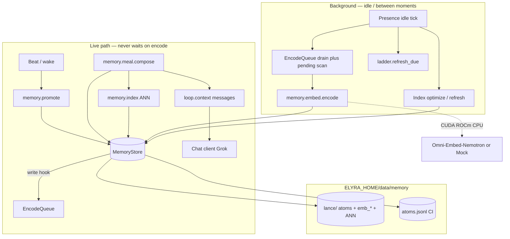
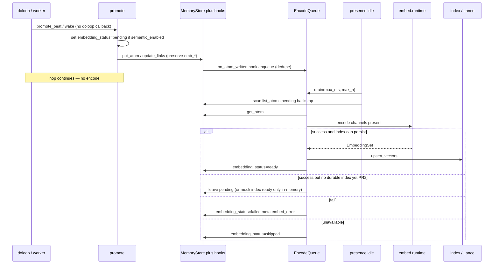
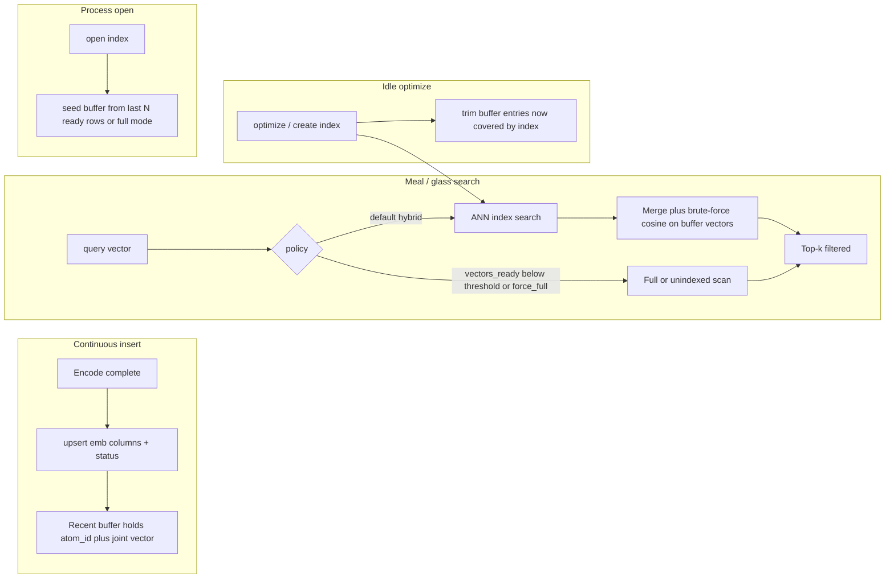
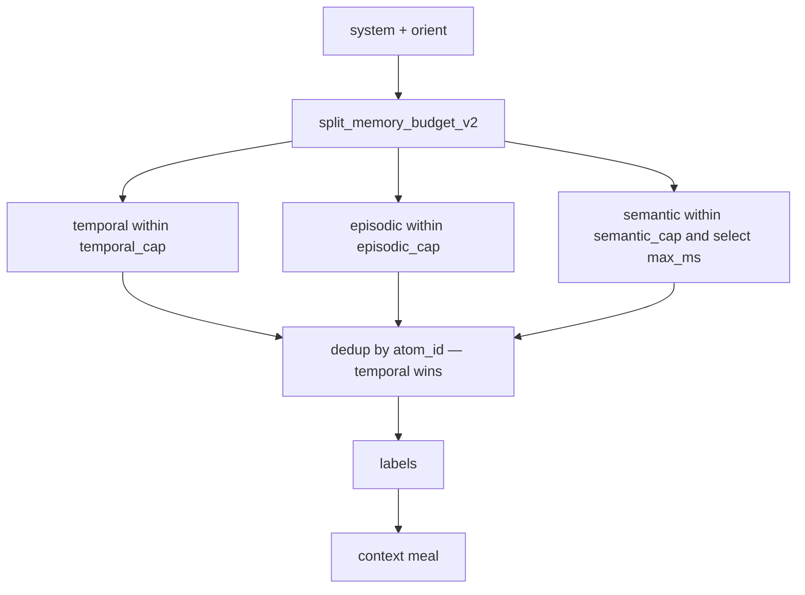

# Stretch 2 Phase 2 — Semantic Memory (Implementation Design)

| Field | Value |
|-------|--------|
| **Document** | Implementation-ready design + plan |
| **Product** | project-elyra |
| **Author** | _(design agent)_ |
| **Date** | 2026-07-28 |
| **Status** | **Ready for `/execute-plan`** (2026-07-28) |
| **Review** | Design-doc review loop approved — **0 open issues**; operator accepted all OQ defaults (2026-07-28) |
| **Branch** | `grok-improvement-memory` |
| **Depends on** | Phase 1 **Done** (2026-07-28): atoms, promote, ladder, meal, Lance optional, glass Memory stubs |
| **Philosophy** | [`docs/memory-atoms.pdf`](../memory-atoms.pdf) |
| **Baseline** | [`inspiration-activity-model-and-storage.md`](inspiration-activity-model-and-storage.md) |
| **Prior sketches** | [`design-phase-2-semantic.md`](design-phase-2-semantic.md), [`design-nemotron-runtime.md`](design-nemotron-runtime.md), [`design-database-choices.md`](design-database-choices.md), [`design-context-meal-composition.md`](design-context-meal-composition.md) |
| **Phase 1 patterns** | [`design-phase-1-implementation.md`](design-phase-1-implementation.md), [`architecture/phase-1-temporal.md`](architecture/phase-1-temporal.md) |
| **Boundary** | Phase 2a directed traversal is **out of scope** ([`design-phase-2a-directed-traversal.md`](design-phase-2a-directed-traversal.md)) |

> **Historical:** this document is the Phase 2 **PR1–PR9** ship design. Product-path rectification (joint-for-single, `auto` channel, Lance-native search, meal/Vectors honesty) is owned by **[design-phase-2-rectification.md](design-phase-2-rectification.md)** — do not rewrite this file for R1–R5 behaviour; update [architecture/phase-2-semantic.md](architecture/phase-2-semantic.md) instead.

This document **supersedes the short Phase 2 outline** (`design-phase-2-semantic.md`) for the original implementation stack. Where it resolves open questions from that sketch and the Nemotron runtime note, resolutions appear under **Key Decisions** with rationale. Soft influences from `philosophical-soft-guidance.md` inform judgment only; they are not deliverables.

Deferred polish bugs in [`docs/known-bugs.md`](../known-bugs.md) (glass beautify, system prompt soften, status bugs, etc.) are **not** Phase 2 scope unless they block semantic work.

---

## Overview

Phase 1 ships a durable temporal/episodic substrate that runs **without** embeddings: atoms, sequential weave, period ladder, labeled meal (temporal + episodic + orient), optional Lance backend, and a glass Memory page with Vectors/Graph **stubs**.

Phase 2 adds **associative / semantic** structure as a *supporting* context channel (“this reminds me of…”):

1. **Portable multi-embedding encode** via Omni-Embed-Nemotron (CUDA / ROCm / CPU; mock in CI).
2. **Per-modality + joint vectors** (~2048-d) bonded to each atom (internal channels, not separate warehouse facts).
3. **Parcels** for oversized content with parent/sequential links.
4. **ANN query with filters** (time, moment, kind) on Lance, plus a documented **index freshness** policy under continuous insert.
5. **Meal semantic channel** — budgeted, cut before the temporal spine, deduped against temporal/episodic.
6. **Vectors glass tab** filled (neighbor inspect + encode status; not full hypergraph — Graph remains Phase 2a).
7. **Architecture note** update (concept map + activities).

**Hard invariants carried forward:**

- Phase 1 remains correct with semantic off or model unavailable (empty semantic channel; no ANN required for temporal/episodic).
- **Corpus encode** (atom → vectors) **never** runs on the hop path; async/queue on idle only; graceful omit if model missing.
- **Meal-time query encode + ANN search** may run inside `rebuild_outer` (in-moment) but only under a hard total wall clock `semantic_select_max_ms` (default 50ms); on exceed, omit the semantic channel (`semantic_omitted_reason=timeout`) — never block the hop unbounded.
- Background index optimize never starves the hop path.
- `loop/` and `presence/` orchestrate; they never import raw Lance or torch at module top-level.
- Scalar `put_atom` / `update_links` **must preserve** existing `emb_*` / `embed_model` / `encoded_at` columns (see KD19 / Lance preserve contract).

---

## Background & Motivation

### Current state (code, Phase 1 done)

| Concern | Today | Gap for Phase 2 |
|---------|-------|-----------------|
| Atom record | `elyra/memory/types.py::Atom` — `embedding_status` always `"none"` on write | Need status transitions + vector storage |
| Store Protocol | `MemoryStore` in `store.py` — CRUD/range/moment/links/walk | Need vector write/ANN behind `index` interface; Protocol stays temporal-first |
| Lance backend | `lance_store.py` — **scalar columns only** (`_STRING_COLS`; comment: “no vector / ANN”) | Schema migration for `emb_*` columns + indexes |
| JSONL backend | CI/default; full Protocol | Stays hermetic; **no real ANN** (semantic meal empty or mock-only) |
| Promote | `promote.py` — beat→atom; `embedding_status` passed through as `"none"` | Mark `pending` when semantic on; parcels before truncate; enqueue via store hooks |
| Meal | `meal.py` — temporal + episodic only; `split_memory_budget` residual → episodic+temporal | Add semantic channel + three-way budget split |
| Tokens | `tokens.py::split_memory_budget` | Extend for `semantic_fraction` |
| Worker | `presence/worker.py` — store open, idle ladder, meal drop-in | Write hooks; idle encode drain + pending scan + index optimize; meal semantic under hard ms budget |
| Glass | Memory Context/Atoms live; Vectors/Graph stubs (`index.html`, `api.py` tabs) | Fill Vectors; Graph stays stub |
| Settings | `MemorySettings` — no semantic knobs | Flags + encode/ANN budgets |
| Deps | `elyra[memory-lance]` = lancedb+pyarrow | Optional `memory-embed` extra for torch/transformers; mock always available |

### Why change

The essay’s associative weave is not temporal sequence. Semantic memory should:

- Surface **related past instances** by content similarity (text/media/joint), not only “what happened recently.”
- Remain **supporting**: open moment and broader episodic stay primary ([meal composition](design-context-meal-composition.md)).
- Stay **portable** on operator hardware without hard CUDA imports in core ([Nemotron runtime](design-nemotron-runtime.md)).
- Use Lance as the vector authority ([database choices](design-database-choices.md)) without breaking JSONL CI.

### Constraints (hard)

- Single presence worker (single-writer friendly); encode queue drained on **idle / between moments**.
- Feature-flag / clean fallback if model or Lance unavailable.
- Hermetic CI: mock encoder; no GPU; no mandatory torch.
- Operator dogfood: `memory.backend=lance` + optional real Nemotron.
- No Stretch 2 Phase 2a/3 machinery (directed keep-set, success weights).
- Engineering principles: modular packages, tests as feature, narrow public API, `ELYRA_HOME` defaults.

---

## Goals & Non-Goals

### Goals

1. **Multi-embeddings** per atom: text / image / audio / video / joint as present (~2048-d, L2-normalized).
2. **Portable encode path** (device select CUDA → ROCm → CPU → unavailable); mock in CI; real weights optional.
3. **Parcels** for oversized text (and media-length policy); sequential + parent links; encode parcels.
4. **ANN top-k** with filters (time window, moment_id, kind) on Lance joint (and optional channel) indexes.
5. **Documented + implemented ANN freshness** (recent buffer + scheduled optimize).
6. **Meal semantic channel**: budgeted; cut supports before spine; dedup by `atom_id`.
7. **Async encode**: never blocks do-loop; queue; graceful omit if model unavailable.
8. **Vectors glass tab** — encode status, neighbor inspect, simple projection optional; not theater scatter without data.
9. **Architecture note** `docs/stretch-2/architecture/phase-2-semantic.md` (structure + activity map + invariants + failure modes).
10. **Phase 1 regression**: flags off / mock missing → identical temporal/episodic behaviour.

### Non-goals (Phase 2)

| Non-goal | Deferred to |
|----------|-------------|
| Success-path / trajectory weights | Phase 3 |
| Full directed traversal product / keep-set | Phase 2a |
| Fine-tuning Nemotron | Never (out of product) |
| Historical glass→atom backfill | Follow-up (unchanged from Phase 1) |
| Replacing Grok chat with Nemotron | Never (embed-only) |
| Full hypergraph / Graph tab product UI | Phase 2a |
| LLM ladder summaries as default | Still optional later |
| Materialized full semantic edge graph as meal authority | Prefer live ANN; light optional edges only if cheap |
| Guaranteed ROCm parity day one | Spike-documented best-effort |
| Default-on semantic without spike checklist | Dogfood flags first |
| Known-bugs glass/status polish | Parallel / not Phase 2 gate |

---

## Proposed Design

### High-level architecture



**Ownership:**

| Module | Owns | Does not own |
|--------|------|--------------|
| `elyra/memory/embed/*` | Device select, load/unload, encode APIs, mock | Meal policy, do-loop |
| `elyra/memory/index.py` | Vector write helpers, ANN query, freshness, optimize schedule | Temporal CRUD Protocol surface for loop |
| `elyra/memory/parcel.py` | Split oversized → parcel chain | Media blob storage (Stretch 1 media store) |
| `elyra/memory/meal.py` | Semantic channel select + budget + dedup | Encode runtime |
| `elyra/memory/lance_store.py` | Physical vector columns + filtered vector search | Torch imports |
| `elyra/presence/worker.py` | Install store write hooks; idle drain + pending scan + optimize | Encode math |
| `elyra/loop/doloop.py` | Unchanged promote hook (best-effort) | No encode calls |
| Glass `runtime/web` + `api.py` | Vectors tab + read APIs | Mutations / re-encode admin optional later |

---

### Module layout

```text
elyra/memory/
  # Phase 1 (unchanged contracts unless noted)
  types.py              # extend EmbeddingStatus; EmbeddingSet pure data optional
  store.py              # MemoryStore Protocol — temporal CRUD + list_atoms + write hooks
  jsonl_store.py        # no vectors; health reports vectors=false; list_atoms
  lance_store.py        # + emb columns, filtered ANN primitives (internal)
  promote.py            # set pending when semantic_enabled (enqueue via store hooks)
  meal.py               # + select_semantic + budget
  tokens.py             # + split_memory_budget_v2 (semantic_fraction)
  config.py             # MemorySettings semantic/encode knobs
  inspect.py            # + vector/neighbor serialisation

  # Phase 2 new
  embed/
    __init__.py         # narrow public: open_encoder, encode_atom_inputs
    types.py            # EmbeddingSet, EncodeResult, DeviceKind, channel names
    runtime.py          # device select, load, unload, health (guarded imports)
    encode.py           # modality + joint encode; parcel batching helpers
    mock.py             # deterministic fake 2048-d vectors for CI
    queue.py            # EncodeQueue: pending atom_ids, drain(max_ms/n)
  index.py              # EmbeddingIndex façade over Lance; freshness policy
  parcel.py             # split_oversized_text → list[Atom] parcels + parent

tests/
  test_memory_embed_types.py
  test_memory_embed_mock.py
  test_memory_embed_queue.py
  test_memory_index.py              # mock vectors + lance if available
  test_memory_parcel.py
  test_memory_meal_semantic.py
  test_memory_semantic_integration.py
  test_memory_vectors_api.py
  # optional:
  test_memory_embed_nemotron.py     # @pytest.mark.gpu / memory_embed

docs/stretch-2/architecture/
  phase-2-semantic.md               # post-ship concept map (done criterion)
  spikes/                           # optional spike notes (Nemotron, ANN freshness)
```

Optional extra in `pyproject.toml`:

```toml
# Hermetic CI never requires these.
memory-embed = [
  # Pin at implement/spike time — illustrative only here:
  # "torch>=2.2",
  # "transformers>=4.44",
  # "accelerate>=0.33",
]
# Keep memory-lance as today for Lance/ANN storage.
```

Core imports of `elyra.memory` **must not** pull torch. `open_encoder()` lazy-imports runtime.

---

### Concept mapping (essay ↔ Phase 2)

| Essay / planning term | Phase 2 structure |
|----------------------|-------------------|
| Associative connection | ANN neighbours over joint (and optional channel) embeddings; optional soft semantic edge rows later |
| Multimodal instance | `EmbeddingSet` channels bonded to one `atom_id` |
| Recombination | Channel-level match + parent atom / parcel identity in meal labels |
| Supporting vs primary context | `channel=semantic` budgeted under temporal/episodic; cut first under pressure |
| Parcel | `kind=parcel` atoms with `parent_atom_id`; sequential among parcels |
| Consolidation (unchanged) | Ladder still temporal; **does not** require embeddings |
| Weave (semantic) | Query-time ANN (+ light edges optional); full typed graph product is Phase 2a |

---

### Data model

#### Embedding status (normative)

Extend `EmbeddingStatus` in `types.py`:

```python
EmbeddingStatus = Literal[
    "none",     # semantic off, or never requested (Phase 1 writes stay valid)
    "pending",  # enqueued or awaiting encode
    "ready",    # at least required channels written (see KD)
    "failed",   # encode attempted and failed (retry policy below)
    "skipped",  # no content/modalities, or encoder unavailable permanently for this atom
]
```

| Transition | When |
|------------|------|
| `none` → `pending` | Promote/put with `semantic_enabled` and atom is embeddable |
| `pending` → `ready` | Encode success for required channels |
| `pending` → `failed` | Encode exception / invalid output shape |
| `pending` → `skipped` | Empty body and no media; or encoder disabled mid-flight |
| `failed` → `pending` | Retry after backoff (idle, max N attempts in `meta.embed_attempts`) |
| any → `none` | **Not** used to erase vectors; admin re-encode may set pending |

Phase 1 atoms already on disk with `embedding_status="none"` remain valid. Migration is **lazy**: no bulk backfill required for Phase 2 done; optional idle “catch-up pending” for recent atoms when semantic first enabled (bounded).

#### EmbeddingSet (pure)

```python
# elyra/memory/embed/types.py
CHANNELS = ("text", "image", "audio", "video", "joint")
EMBED_DIM = 2048  # verify against pinned Nemotron revision at spike

@dataclass(frozen=True)
class EmbeddingSet:
    """Bonded multi-channel vectors for one atom (or parcel)."""
    atom_id: str
    dim: int = EMBED_DIM
    emb_text: tuple[float, ...] | None = None
    emb_image: tuple[float, ...] | None = None
    emb_audio: tuple[float, ...] | None = None
    emb_video: tuple[float, ...] | None = None
    emb_joint: tuple[float, ...] | None = None
    model_id: str = ""          # pinned id/revision
    encoded_at: str = ""        # UTC Z
    channels_present: tuple[str, ...] = ()
```

**Ready rule (KD20):** `embedding_status=ready` **only when** the active `EmbeddingIndex` holds the required vectors for that atom — i.e. `emb_joint` present **or** (single-modality atom and that modality vector present) **and** durable upsert succeeded (Lance columns or in-memory index for CI). Joint is **eager** when ≥2 modalities present at encode time.

**PR boundary for status:** PR2 (queue + mock, no durable vectors) may transition only to `pending` / `failed` / `skipped`. Status **`ready` is introduced with PR3** when `index.upsert` persists vectors. Glass/tests must not treat `ready` as meaningful before PR3.

#### Atom field changes

- Keep scalar `Atom` as today (no float vectors on the dataclass — avoids JSONL bloat and Protocol weight).
- Vectors live in Lance columns (and in-memory index maps inside `LanceMemoryStore` / `EmbeddingIndex`).
- `meta` may hold: `embed_attempts`, `embed_error`, `embed_model`, `parcel_index`, `parcel_count`.
- `parent_atom_id` already exists for parcel-of / summary-of.
- **Protocol growth (Phase 2):** add optional query helper (not used by meal hop path):

```python
# MemoryStore extension (both backends)
def list_atoms(
    self,
    *,
    embedding_status: str | None = None,
    kinds: Sequence[AtomKind] | None = None,
    limit: int = 50,
    newest_first: bool = True,
) -> list[Atom]:
    """Glass/admin listing. Hard-capped (callers clamp limit ≤ 200).
    Implementation may scan in-memory indexes (jsonl/lance both keep by_id).
    """
```

Glass Vectors status filter uses this with `limit` default **50**, max **200**. Full-table scan is acceptable at dogfood scale; no secondary index required in v1.

#### Lance physical schema (Phase 2)

Extend `atoms` table (additive migration):

| Column | Type | Notes |
|--------|------|-------|
| (all Phase 1 string cols) | utf8 | unchanged |
| `emb_text` | `list<float32>[2048]` or fixed-size list | null if absent |
| `emb_image` | same | |
| `emb_audio` | same | |
| `emb_video` | same | |
| `emb_joint` | same | primary ANN |
| `embed_model` | utf8 | optional denorm of pin |
| `encoded_at` | utf8 | |

**Vector column preserve contract (normative — KD19):**

Today `LanceMemoryStore._upsert_row` builds a **scalar-only** row via `_row_for_disk` and `merge_insert("atom_id").when_matched_update_all()`. Phase 1 `_link_and_put` always `put_atom(new)` then `update_links(prev, next_atom_id=…)`. After emb columns exist, a scalar-only `when_matched_update_all` **nulls vectors** on the prev atom every promote.

**Required behaviour after PR3:**

1. **Scalar path** (`put_atom`, `update_links`, status-only patches): must **not** clear `emb_*` / `embed_model` / `encoded_at`. Implement as one of:
   - **Read-merge-write (default choice):** load existing row (or in-memory atom + side vector map), copy emb fields into the upsert dict before `merge_insert`, **or**
   - **Column-scoped update** if pinned lancedb supports updating a subset of columns without nulling others, **or**
   - **Side vector map in process + delayed emb write** — still must re-attach emb columns on every scalar disk upsert.
2. **Vector path:** dedicated `upsert_vectors(atom_id, EmbeddingSet)` / `EmbeddingIndex.upsert` that patches emb columns + `embedding_status` **without** requiring a full scalar rewrite from promote. Prefer this over piggy-backing vectors onto promote's `put_atom`.
3. **In-memory indexes** (`_by_id`) stay scalar `Atom` only; vectors live in Lance columns and/or `EmbeddingIndex` maps.
4. **Acceptance test (PR3 gate):** encode atom A → `ready` with non-null `emb_joint` → promote atom B that links A as prev → assert A still has vectors and `embedding_status=ready`.

**Chosen default for implementers:** keep co-row emb columns (not a separate side table) + **read-merge-write on every scalar `_upsert_row`** + dedicated `upsert_vectors` for encode path. Side table is an acceptable fall-back only if merge-preserve proves unsafe in the migration spike — document in spike note if switched.

**Migration strategy (PR3 — not spike-optional for merge):**

Operator dogfood already has Phase 1 Lance tables under `data/memory/lance/` with fixed `_STRING_COLS` schema and **no** additive migration code today.

1. **Pre-PR3 spike note (merge gate for PR3):** under `docs/stretch-2/architecture/spikes/lance-emb-migration.md` name the exact LanceDB API for pinned `lancedb>=0.20,<0.21` (e.g. `table.add_columns` / schema evolve / recreate+copy), open-time steps, and measured behaviour on a copy of dogfood data.
2. **Open-time migration algorithm (normative skeleton; spike fills API names):**
   1. Connect to `lance/`; open `atoms` if present.
   2. Inspect schema; if all emb columns present and `meta.json.vector_schema_version >= 1` → continue.
   3. Else: ensure backup recommendation logged once (`copy data/memory/lance` before upgrade); apply additive columns with null defaults for existing rows; do **not** drop scalar columns.
   4. Write `meta.json` fields: `vector_schema_version=1`, `emb_dim=2048`, `embed_model` (configured pin or `""`), `backend=lance`.
   5. Existing rows: null vectors; `embedding_status` unchanged (`none` until queued).
3. **Fail closed:** if migration throws → log exception; `index.health()["ok"]=false` with `error=migration_failed`; **scalar** `MemoryStore` path must still serve Phase 1 meal/promote if the table remains readable. If the table is unreadable, fall back per existing factory rules (do not corrupt files).
4. **Test gate:** fixture = Phase 1 table (scalar-only rows) → open with Phase 2 store → migration → `get_atom` round-trip unchanged → `upsert_vectors` → reload process → vectors present.
5. **No automatic dual-write to JSONL.** Switching `backend=jsonl` after Lance dogfood does not preserve vectors.
6. ANN index: Lance IVF-PQ / auto index on `emb_joint` (and optionally `emb_text`) — exact type from ANN spike; create after first N ready vectors or on optimize job.

**`meta.json` epoch fields (nit → required):**

```json
{
  "schema_version": 1,
  "backend": "lance",
  "vector_schema_version": 1,
  "emb_dim": 2048,
  "embed_model": "nvidia/omni-embed-nemotron-3b",
  "created_at": "…",
  "vector_migrated_at": "…"
}
```

Logical `Atom.schema_version` stays **1** (vectors are not on the dataclass). Physical vector layout is tracked only via `vector_schema_version` / `emb_dim` in `meta.json`.

#### JSONL behaviour

| Capability | JSONL |
|------------|--------|
| `embedding_status` field | Yes (transitions for tests) |
| Store float vectors | **No** (optional tiny fixture path: skip) |
| ANN | **No** — `index.search` returns `[]` |
| Semantic meal channel | Empty when backend cannot ANN |
| CI | Full unit coverage via mock encoder + fake `EmbeddingIndex` in-memory for pure meal tests |

Meal semantic tests inject a **fake index** Protocol, not production JSONL ANN.

---

### Encode pipeline



#### Enqueue wiring (normative — KD16 / issue resolution)

Almost all experience atoms are written via **`doloop._record_beat` → `promote_beat`** with no hook surface today; wakes use **`promote_wake_observation`** from the worker. Threading callbacks through `run_do_loop` is fragile and easy to miss.

**Chosen wiring (store hooks + pending scan backstop — no `doloop.py` change required):**

1. **Promote sets status only:** when `settings.semantic_enabled` and atom is embeddable, new atoms are written with `embedding_status="pending"` (both `promote_beat` and `promote_wake_observation`). When semantic off, keep `"none"`. **No** embedder import in `promote.py`.
2. **Store write hooks (primary enqueue path):** after `open_memory_store`, worker installs a thin hook on the store instance:

```python
# Conceptual — implementation may be a small wrapper or store.set_write_hook
class MemoryWriteHooks:
    def on_atom_written(self, atom: Atom) -> None:
        """Called after successful put_atom (and after update_links if status changed).
        Best-effort; must never raise to callers.
        """
```

   - Hook enqueues `atom_id` when `semantic_enabled` and status is `pending` (or content hash changed — see re-put rules).
   - Covers **all** writers: promote_beat (via doloop), promote_wake_observation, ladder summary puts (summaries: enqueue if embeddable), parcel children, admin tools.
   - **`doloop.py` is not modified** for encode wiring.

3. **Idle pending scan (backstop):** each drain tick also `list_atoms(embedding_status="pending", limit=encode_max_items_per_tick * 4)` and enqueues any missing ids (covers process restart, missed hooks, hook failures).

4. **Re-put / idempotency:**
   - If atom already `ready` or `pending` and **content_text + media_ids fingerprint unchanged** → **no re-enqueue** (hook no-op; scan skips).
   - If content changed (rare replace) → set `pending`, clear vectors via `upsert` null or re-encode, enqueue.
   - Idempotent promote (same source key, no write) → no hook fire.

5. **Rejected alternative for v1:** threading `on_atom_written` through `run_do_loop` / `_record_beat` (would require `doloop.py` in every encode PR and miss non-doloop writers).

#### Embedder contract (`design-nemotron-runtime.md`)

```python
# elyra/memory/embed/runtime.py — conceptual

class Embedder(Protocol):
    def health(self) -> dict[str, Any]:
        """{ok, device, model_id, dim, backend: mock|nemotron, error?}"""
        ...

    def encode_text(self, text: str) -> list[float]:
        ...

    def encode_image(self, path_or_bytes: ...) -> list[float]:
        ...

    def encode_audio(self, path_or_bytes: ...) -> list[float]:
        ...

    def encode_video(self, path_or_bytes: ...) -> list[float]:
        ...

    def encode_joint(self, parts: ModalityParts) -> list[float]:
        ...

    def close(self) -> None:
        ...
```

**Device policy (preference order):** CUDA → ROCm → CPU → unavailable.

Rules:

- No import-time hard failure if torch missing when `semantic_enabled=false`.
- Config under `MemorySettings` / `ELYRA_HOME` model path; few env vars (optional `ELYRA_EMBED_DEVICE` only if spike requires escape hatch — prefer toml).
- Mock embedder: stable hash → unit vector in 2048-d (deterministic tests); dim matches `EMBED_DIM`.

#### What gets encoded

| Atom kind | Text channel | Media channels | Joint |
|-----------|--------------|----------------|-------|
| observation, speak, model, ledger | `content_text` | resolve `media_ids` via MediaStore | if text+media |
| tool | preview/full body as stored | media if any | if multi |
| summary | summary body | rare | text-only typical |
| parcel | parcel slice text | inherited/none | text |
| moment_meta | skip / skipped | — | — |

**Skip encode** when: kind in `{moment_meta}` (default); empty text and empty media; `semantic_enabled=false`.

#### Media resolution for encode (normative)

`encode.py` / drain owns media resolution — **not** meal expand:

1. Obtain `MediaStore(paths)` (construct per drain tick or inject on worker; same class as `rebuild_outer` uses today).
2. For each `media_id` on the atom, resolve to a filesystem path + MIME/extension via MediaStore APIs used by Stretch 1 media expand (fail soft if missing).
3. **v1 supported matrix** (extend later as Nemotron spike proves modalities):

| Modality | Accept (examples) | Encode path |
|----------|-------------------|-------------|
| image | `image/png`, `image/jpeg`, `image/webp`, `.png/.jpg/.jpeg/.webp` | `encode_image` |
| audio | `audio/wav`, `audio/mpeg`, `.wav/.mp3` | `encode_audio` (if spike green; else skip) |
| video | `video/mp4`, `.mp4` | `encode_video` (if spike green; else skip) |
| other / unknown | — | skip channel |

4. Caps: `embed_media_max_bytes` (default **8_000_000**), `embed_media_max_seconds` (default **30**) — oversize → skip that media item + `meta.embed_media_skipped=true` (list reasons), **still encode text**.
5. Missing media id / unreadable file → **text-only**, not `failed` (status can still become `ready` on text/joint-from-text).
6. Multimodal joint (KD5): only modalities that successfully loaded participate; if only text loads, treat as single-modality text (no joint required).

#### Queue

```python
# elyra/memory/embed/queue.py
class EncodeQueue:
    """In-process FIFO of atom_ids; single-writer (presence)."""

    def enqueue(self, atom_id: str) -> None:
        """Dedupe: if atom_id already queued, no-op. If at encode_queue_max,
        drop oldest pending id → mark skipped (best-effort) + metric."""
        ...

    def drain(
        self,
        store: MemoryStore,
        embedder: Embedder,
        index: EmbeddingIndex,
        *,
        max_ms: int,
        max_items: int,
        media_store: MediaStore | None = None,
    ) -> dict[str, int]:  # {ok, failed, skipped, remaining, dropped}
        ...
```

**Backpressure (normative):**

| Knob | Default | Behaviour |
|------|---------|-----------|
| `encode_queue_max` | **1024** | Max distinct atom_ids in FIFO |
| enqueue dedupe | always | Same id not queued twice |
| overflow | drop oldest | Oldest id removed; best-effort set `embedding_status=skipped` with `meta.embed_error=queue_overflow`; log + `memory.embed.queue_dropped` |

**Placement (mirror ladder KD9):**

1. Call `drain` **outside** `self._lock`, only when **not** in-moment (`claimed is None`), after `_fire_due_unlocked` / alongside ladder.
2. **Never** from inside hop / `rebuild_outer` / `promote_beat` (corpus encode).
3. Caps: `memory.encode_max_ms_per_tick` (default **100**), `encode_max_items_per_tick` (default **4**).
4. Enqueue via store hook + pending scan; if semantic off, hooks no-op and scan skipped.

Cold model load: first `drain` may load weights — still only on idle; if load exceeds `max_ms`, stop after load attempt and continue next tick (do not hold hop). Optional: explicit `embedder.ensure_loaded()` on worker startup when `semantic_enabled` and `embed_preload=true` (default **false** — avoid slowing boot).

---

### Parcels

Phase 1 truncates in **two** places today: `promote._truncate` / `atom_max_chars` and store `_prepare_for_put` (same cap), plus blob spill at `inline_max_chars` (4000). Parcels must run **before** either truncate loses text.

#### Ownership (normative — single call site)

**`parcel.py` is invoked inside promote** (both `promote_beat` and `promote_wake_observation` / oversized body builders) **before** `_truncate` / any store put, **only when** `parcels_enabled` is true.

**Default / parity (normative — KD23):** `parcels_enabled` defaults **`False`**. With all Phase 2 flags at defaults (`semantic_enabled=false`, `embed_enabled=false`, `parcels_enabled=false`), promote uses the Phase 1 single-atom truncate path only — **zero behaviour change** for writes (Goal 10 / rollout step 2). Operators turn parcels on for semantic dogfood (typically with `semantic_enabled=true`). Enabling `semantic_enabled` does **not** auto-enable parcels; set `parcels_enabled=true` explicitly (toml) when desired.

```text
raw_text = beat body (full, pre-cap)
if parcels_enabled and len(raw_text) > parcel_threshold_chars:  # threshold default 8000 = atom_max_chars
    parent, children = split_into_parcels(raw_text, ...)
    put parent + each child via _link_and_put rules below
else:
    existing single-atom truncate path  # Phase 1 parity when parcels_enabled=false
```

**Golden test (PR5 / flag parity):** `semantic_enabled=false`, `parcels_enabled=false`, body longer than `atom_max_chars` → **one** atom, truncated (no parcel children); atom_count +1 only.

Store `_prepare_for_put` truncate remains a **safety net only** (should no-op if promote already ≤ cap). Blob spill still applies **per atom body** after parcel split (each parcel/parent body should be ≤ `parcel_threshold_chars` ≤ `atom_max_chars`; spill if body > `inline_max_chars`).

#### Split result

1. **Parent** keeps original experience `kind` (observation/speak/…); body = **first chunk** (meal-readable without expanding children) — KD.
2. **Children:** `kind=parcel`, `parent_atom_id=parent`, `meta.parcel_index` / `meta.parcel_count`; **sequential prev/next among parcels only** (parcel chain), not mixed into parent’s experience neighbours beyond parent→first-parcel optional link in `meta`.
3. **Experience sequential weave:** only the **parent** participates in moment/global tail chain (`moment_tail` / `_CHAIN_EXCLUDE_KINDS` already excludes `parcel`). Parcels are **not** moment_tail members and are excluded from temporal meal raw fill (already in `_RAW_EXCLUDE_KINDS`).
4. Encode **each** of parent + parcels (each gets `pending` + hook enqueue).
5. **ANN → meal mapping** lands in **PR6** (`select_semantic`): hit on parcel → include **parent** atom; label may note `semantic/parcel→parent`; dedup by parent id. PR5 ships split + links + unit tests only.

Natural split boundaries: paragraph (`\n\n`), then line, then hard char cut. No semantic splitter model.

**PR5 tests:** oversized body → N parcels + parent; no silent truncation of middle text; `moment_tail` is parent; store atom_count includes parcels; promote path only (no worker post-promote alternate).

---

### ANN index & freshness



#### EmbeddingIndex interface

```python
# elyra/memory/index.py
@runtime_checkable
class EmbeddingIndex(Protocol):
    def upsert(self, embedding_set: EmbeddingSet) -> bool:
        """Persist vectors; return True only when vectors are held (KD20 ready)."""
        ...

    def search(
        self,
        query: Sequence[float],
        *,
        k: int = 12,
        channel: str = "joint",  # joint | text | image | ...
        t_start: datetime | str | None = None,
        t_end: datetime | str | None = None,
        moment_id: str | None = None,
        kinds: Sequence[str] | None = None,
        exclude_atom_ids: AbstractSet[str] | None = None,
        exclude_moment_id: str | None = None,
    ) -> list[ScoredAtom]:
        """Return scored hits; empty if unavailable."""
        ...

    def optimize(self, *, max_ms: int | None = None) -> dict[str, Any]: ...

    def health(self) -> dict[str, Any]:
        """{ok, backend, vectors_ready, index_stale, recent_buffer, last_optimize?}"""
        ...
```

`LanceEmbeddingIndex` wraps `LanceMemoryStore` (same process, same lock discipline — call under store lock or re-entrant RLock).

`NullEmbeddingIndex` / `MemoryEmbeddingIndex` (dict of vectors) for JSONL and pure tests.

#### Freshness policy (normative — KD4)

**Recent-buffer is a correctness mechanism**, not best-effort telemetry: under hybrid mode, meal/glass search **must not miss** ready atoms that are still unindexed by Lance ANN after continuous insert. Soft latency targets never justify dropping buffer candidates without falling back to full search.

**Buffer entry shape (in-process only):**

```python
@dataclass(frozen=True)
class RecentBufferEntry:
    atom_id: str
    channel: str              # primary "joint" (v1); optional per-channel later
    vector: tuple[float, ...] # 2048-d copy from successful upsert
    encoded_at: str           # UTC Z
    # optional filter denorm for cheap prefilter without store hit:
    t_start: str
    moment_id: str | None
    kind: str
```

| Topic | Rule |
|-------|------|
| **Populate** | On every successful `EmbeddingIndex.upsert`, push/replace entry for that `atom_id` (joint vector required for hybrid; if only text channel ready, buffer that channel and search may use `channel=text`) |
| **Cap** | `ann_recent_buffer_max` default **256**; eviction = oldest `encoded_at` first |
| **Persistence** | **In-process only** — not written to disk as a separate log |
| **On open / restart** | (1) If `vectors_ready < ann_full_search_below` (default **2000**) → **full/unindexed search mode** until above threshold and index built. (2) Else **seed buffer** from last N ready rows ordered by `encoded_at` desc (N = `ann_recent_buffer_max`) by reading emb columns (budgeted; may complete across idle ticks). (3) Schedule idle optimize if `index_stale` or no ANN index exists. |
| **Hybrid search** | Main ANN top-k **union** brute-force cosine over all buffer vectors; merge by score; apply time/moment/kind/exclude filters to both legs |
| **Full search** | When `vectors_ready < ann_full_search_below` or `ann_force_full=true` or buffer seed incomplete after restart and index known stale: Lance search that includes unindexed rows if API allows; else scan ready rows with vectors (capped) |
| **Optimize** | Idle only: `index.optimize` / create vector index per spike; `ann_optimize_every_n_encodes` (default **64**) or `ann_optimize_interval_s` (default **300**); never mid-hop; after optimize, drop buffer entries older than optimize watermark when safe |
| **Staleness signal** | `health()["index_stale"]=True` when buffer non-empty **or** encodes since last optimize exceed threshold **or** seed incomplete; glass badge; hybrid/full still serve correctness |

**Restart acceptance test (PR4):** encode N>buffer_threshold atoms without optimize → kill process → reopen → `search` still returns a recently encoded atom (via full mode or seeded buffer + hybrid). Document measured p95; soft target ≤40ms for ANN leg alone under dogfood corpus — **hard** cap is `semantic_select_max_ms` for the whole meal semantic select.

#### Filters

Push to Lance SQL / prefilter where possible:

- `t_start >= … AND t_start < …`
- `moment_id = …` / `moment_id != open`
- `kind IN (…)`, exclude `parcel` from meal **or** map parcel→parent before dedup
- Always `embedding_status = 'ready'` for ANN candidates

Default semantic query window: last `semantic_horizon_hours` (default **168** = 7d) — wider than episodic 24h raw fill (associative recall is longer-range).

---

### Meal: semantic channel

#### Budget split (extends Phase 1)

Phase 1 `compose_meal` uses **independent** episodic/temporal caps from `split_memory_budget` and does **not** post-merge multi-channel cut. Phase 2 preserves that model: **per-channel caps are authoritative**.

When `semantic_enabled` is false: call existing `split_memory_budget` unchanged (Phase 1 parity — golden test).

When `semantic_enabled` is true, use `split_memory_budget_v2`:

```python
def split_memory_budget_v2(
    budget_tokens: int,
    *,
    system_text: str = "",
    orient_text: str = "",
    semantic_enabled: bool = False,
    semantic_fraction: float = 0.12,
    episodic_fraction: float = 0.20,              # Phase 1 path
    episodic_fraction_with_semantic: float = 0.18,
    temporal_min_fraction: float = 0.55,
) -> tuple[int, int, int, int]:
    """Returns (fixed, semantic_cap, episodic_cap, temporal_cap)."""
    fixed = estimate_tokens(system_text) + estimate_tokens(orient_text)
    remaining = max(0, int(budget_tokens) - fixed)
    if not semantic_enabled or remaining == 0:
        # Delegate to Phase 1 math exactly:
        # episodic_cap = int(remaining * episodic_fraction)
        # temporal_cap = remaining - episodic_cap
        # semantic_cap = 0
        ...
    # Clamp fractions to [0, 1] first.
    sem_f = clamp(semantic_fraction)
    epi_f = clamp(episodic_fraction_with_semantic)
    t_min = clamp(temporal_min_fraction)

    semantic_cap = int(remaining * sem_f)
    episodic_cap = int(remaining * epi_f)
    temporal_cap = remaining - semantic_cap - episodic_cap

    # Floor enforcement — who loses first when temporal would go below floor:
    # 1) reduce semantic_cap
    # 2) then reduce episodic_cap
    # 3) never reduce temporal_cap below floor while remaining allows
    floor = int(remaining * t_min)
    if temporal_cap < floor:
        deficit = floor - temporal_cap
        take = min(deficit, semantic_cap)
        semantic_cap -= take
        deficit -= take
        take = min(deficit, episodic_cap)
        episodic_cap -= take
        deficit -= take
        temporal_cap = remaining - semantic_cap - episodic_cap
        # If still under floor (t_min + fractions impossible), give all
        # residual to temporal; semantic_cap=episodic_cap=0.
        if temporal_cap < floor:
            semantic_cap = 0
            episodic_cap = 0
            temporal_cap = remaining
    return fixed, semantic_cap, episodic_cap, temporal_cap
```

**Invariant:** `semantic_cap + episodic_cap + temporal_cap == remaining` after clamp.

Illustrative shares of *memory-related* meal (non-normative): semantic ~10–15%. Defaults leave temporal dominant.

#### Construction flow



**Cut / pressure model (normative):**

1. **Per-channel packing is authoritative.** Each of `select_episodic`, `select_semantic`, and temporal/slide-off already respects its own cap (Phase 1 episodic already shrinks inside its cap; temporal uses `slide_off_temporal` against `temporal_cap`).
2. **No global post-merge token rebalance is required** when caps are applied correctly and `split_memory_budget_v2` enforces the temporal floor.
3. **If residual accounting drifts** (e.g. label overhead): drop in order **semantic (lowest score first) → episodic raw tool/model → episodic fine summaries → temporal slide-off** — same priority as meal composition “supports before spine,” but this is a safety net, not the primary allocator.
4. Unit tests: floor clamp when `semantic_fraction + episodic_fraction_with_semantic > 1 - temporal_min_fraction`; Phase 1 parity when `semantic_enabled=false`.

#### `select_semantic` (normative)

```text
select_semantic(store, index, embedder, open_moment_atoms, open_moment_id,
                cap_tokens, settings, *, deadline_ms=semantic_select_max_ms):
  t0 = now_ms()
  def over() -> bool: return now_ms() - t0 > deadline_ms  # default 50

  1. Build query text from open-moment seed:
     - prefer latest observation/speak/model bodies (concat, cap 2k chars)
     - if seed empty → return []  (omitted_reason=empty_seed)
  2. Query encode (allowed inside rebuild_outer under total budget — KD2/KD12):
     - ONLY if embedder.health().ok and embedder already loaded (no cold load here)
     - encode_text(seed) must finish within remaining deadline and
       encode_query_max_ms (default 30) sub-budget
     - on exceed → return [] (omitted_reason=timeout)
  3. index.search(...) must finish within remaining deadline; on exceed → []
     (omitted_reason=timeout). Search itself should prefer hybrid/full policy
     but cancel/return partial if wall clock exceeded (fake index tests inject sleep).
  4. Drop hits with score < semantic_min_score when score is not None
     (default semantic_min_score=0.0 = off)
  5. Map parcel hits → parent atoms (PR6)
  6. Pack by score until cap_tokens; format host blocks
  7. Labels: [context:semantic] or [context:semantic score=0.83]
```

**Hard budgets:**

| Knob | Default | Scope |
|------|---------|--------|
| `semantic_select_max_ms` | **50** | Entire select (encode + search + pack) inside rebuild_outer |
| `encode_query_max_ms` | **30** | Sub-budget of the above for query encode only |

Corpus encode remains idle-only. Warm query encode inside `rebuild_outer` is **explicitly allowed** under these budgets (not accidental).

**Dedup:** if atom already in temporal or episodic, do not re-include body; silent drop of semantic duplicate (KD11).

**Unit test:** fake index that sleeps > `semantic_select_max_ms` → empty semantic channel + `semantic_omitted_reason=timeout`; hop path still returns meal.

#### Message order (Phase 2)

```text
1. system
2. episodic block
3. semantic block          # NEW — after episodic, before open moment
4. temporal block
5. optional temporal/compact
6. orient
```

Rationale: broader context (episodic + associative) before “what is happening now,” matching Phase 1 “broader then open moment” and avoiding semantic interrupting the live spine.

#### Ranking fusion (resolves open question)

**KD: joint-primary.** Query uses `emb_joint` when available for corpus; query vector from `encode_text` or joint if meal seed has media. No multi-channel RRF in v1. Optional later: if query is image-only, search `emb_image`. Document extension point in `index.search(channel=…)`.

---

### Integration points (file-level)

| File | Change |
|------|--------|
| `elyra/memory/types.py` | `skipped` status; validate |
| `elyra/memory/config.py` | semantic/encode/ANN settings + paths (`models/` optional) |
| `elyra/settings.py` | validation ranges for all new knobs (see below) |
| `elyra/memory/promote.py` | set `pending` when semantic_enabled; **parcel split before truncate**; no embedder import |
| `elyra/memory/meal.py` | `select_semantic`, `split_memory_budget_v2` usage, parcel→parent mapping |
| `elyra/memory/tokens.py` | `split_memory_budget_v2` pure math |
| `elyra/memory/lance_store.py` | emb columns; **preserve on scalar upsert**; `upsert_vectors`; migration; list_atoms (if not already from PR2) |
| `elyra/memory/jsonl_store.py` | status field only; no vectors; list_atoms (PR2) |
| `elyra/memory/store.py` | Protocol + `list_atoms` (PR2) + write-hook registration |
| `elyra/memory/embed/*` | new package |
| `elyra/memory/index.py` | EmbeddingIndex, recent buffer, hybrid search |
| `elyra/memory/parcel.py` | pure split helpers called from promote |
| `elyra/memory/inspect.py` | vectors inspect DTOs |
| `elyra/presence/worker.py` | install write hooks; queue+embedder+index; idle drain+optimize+pending scan; meal passes index/embedder |
| `elyra/loop/doloop.py` | **unchanged** for encode wiring (promote via existing `_record_beat`) |
| `elyra/runtime/api.py` | `/api/memory/vectors/*`; overview tabs.vectors live |
| `elyra/runtime/web/*` | Vectors tab UI |
| `pyproject.toml` | `memory-embed` optional; pytest markers `gpu`, `memory_embed` |
| Architecture | `phase-2-semantic.md` + migration spike note |

**Write-hook install (worker, after store open):**

```python
# presence/worker.py — conceptual
store = open_memory_store(paths, mem_cfg)
queue = EncodeQueue(maxsize=mem_cfg.encode_queue_max)
def _on_written(atom: Atom) -> None:
    if not mem_cfg.semantic_enabled:
        return
    if atom.embedding_status != "pending":
        return
    queue.enqueue(atom.atom_id)
store.set_write_hook(_on_written)  # or MemoryStoreWrapper
```

Promote remains pure w.r.t. GoalsStore and has **no** enqueue callback parameter. Ladder/parcel/promote puts all hit the same hook.

---

### Feature flags & settings

```python
@dataclass(frozen=True)
class MemorySettings:
    # --- Phase 1 (existing defaults as shipped) ---
    enabled: bool = True
    write_atoms: bool = True
    backend: str = "jsonl"
    episodic_fraction: float = 0.20  # when semantic off
    episodic_horizon_hours: float = 24.0
    ladder_enabled: bool = True
    ladder_max_ms_per_tick: int = 50
    # ... existing density knobs ...

    # --- Phase 2 ---
    semantic_enabled: bool = False       # meal channel + pending writes; default off
    embed_enabled: bool = False          # allow load real/mock encoder; default off
    embed_backend: str = "mock"          # mock | nemotron
    embed_model_id: str = "nvidia/omni-embed-nemotron-3b"  # pin revision in spike
    embed_model_path: str = ""           # optional local path under ELYRA_HOME
    embed_device: str = "auto"           # auto | cuda | rocm | cpu
    embed_preload: bool = False
    embed_media_max_bytes: int = 8_000_000
    embed_media_max_seconds: int = 30
    encode_max_ms_per_tick: int = 100
    encode_max_items_per_tick: int = 4
    encode_max_attempts: int = 3
    encode_queue_max: int = 1024
    encode_query_max_ms: int = 30        # sub-budget of semantic_select_max_ms
    semantic_select_max_ms: int = 50     # total encode+search+pack in rebuild_outer
    parcels_enabled: bool = False      # default off — Phase 1 write parity until operator enables
    parcel_threshold_chars: int = 8000
    semantic_fraction: float = 0.12      # of remaining when semantic on
    episodic_fraction_with_semantic: float = 0.18
    temporal_min_fraction: float = 0.55
    semantic_horizon_hours: float = 168.0
    semantic_top_k: int = 12
    semantic_min_score: float = 0.0      # 0 = off; dogfood may raise after Nemotron
    ann_recent_buffer_max: int = 256
    ann_full_search_below: int = 2000
    ann_optimize_every_n_encodes: int = 64
    ann_optimize_interval_s: int = 300
    ann_optimize_max_ms: int = 200
```

**Settings validation (PR1 — mirror Phase 1 `_replace_section` style):**

| Path | Rule |
|------|------|
| `memory.embed_backend` | ∈ `{"mock", "nemotron"}` |
| `memory.embed_device` | ∈ `{"auto", "cuda", "rocm", "cpu"}` |
| `memory.semantic_fraction`, `episodic_fraction_with_semantic`, `temporal_min_fraction` | ∈ `[0.0, 1.0]` |
| `memory.semantic_min_score` | ∈ `[0.0, 1.0]` (cosine / similarity class) |
| `memory.semantic_horizon_hours`, `embed_media_max_seconds` | `> 0` |
| `memory.encode_*_ms*`, `semantic_select_max_ms`, `ann_optimize_*`, `encode_queue_max`, `encode_max_items_per_tick`, `semantic_top_k`, `ann_recent_buffer_max`, `ann_full_search_below`, `parcel_threshold_chars`, `embed_media_max_bytes` | `>= 0` (0 allowed where “off/unlimited” is safe; queue_max minimum **1** if semantic on — validate `>= 1`) |

Toml sketch:

```toml
[memory]
backend = "lance"          # operator dogfood
semantic_enabled = false
embed_enabled = false
embed_backend = "mock"     # flip to nemotron after spike
```

**Flag matrix:**

| write_atoms | enabled | semantic_enabled | embed_enabled | Behaviour |
|-------------|---------|------------------|---------------|-----------|
| on | on | off | off | Phase 1 only (current) |
| on | on | on | off | Atoms may be marked `pending` and enqueued; **drain does not run** (`embed_enabled` stops load/drain) so they **remain `pending`** until embed is enabled (or operator clears); semantic meal empty |
| on | on | on | on (mock) | CI/dogfood without GPU; **durable ANN only if `backend=lance`**. Hermetic meal semantic tests inject a **fake `EmbeddingIndex`**, not JSONL ANN |
| on | on | on | on (nemotron) | Full path on Lance |
| * | * | on | * | Without Lance ANN and without injected index, semantic search empty (log once) |

Rollback: `semantic_enabled=false` (immediate empty channel; no new pending); `embed_enabled=false` stops load/drain (existing `pending` stays pending until re-enabled or idle catch-up when embed returns); vectors remain on disk inert.

---

### Glass — Vectors tab

Replace stub in `index.html` / `app.js` with read-only UI:

1. **Encoder health** — device, model_id, ok/mock, queue depth, last drain stats.
2. **Index health** — vectors_ready, index_stale, recent_buffer size, last optimize.
3. **Atom embedding status** — filter atoms by `embedding_status`; show channels present.
4. **Neighbor inspect** — pick seed atom_id or free-text query → top-k list (score, kind, snippet, moment).
5. **Optional 2D projection** — only if cheap (e.g. server returns 2 PCA/UMAP coords for ≤500 points); **not** a Phase 2 gate — skip if costly; neighbor table is the gate.

APIs (read-only, no secrets):

| Endpoint | Purpose |
|----------|---------|
| `GET /api/memory/vectors` | Overview: encoder + index health; tabs.vectors live |
| `GET /api/memory/vectors/atoms?status=pending\|ready\|…&limit=50` | Status list via `store.list_atoms(embedding_status=…, limit=)` (default 50, max 200) |
| `GET /api/memory/vectors/neighbors?atom_id=…` or `?q=…` | Top-k (may no-op if encode query not loaded) |
| `GET /api/memory/overview` | `tabs.vectors: {stub:false, phase:"2"}` |

Graph tab remains stub (`phase: "2a"`).

---

### Spike checklist

Record under `docs/stretch-2/architecture/spikes/` (or linked notes).

#### Gate A — before **PR3 merge** (Lance emb migration)

- [ ] Name exact LanceDB API for pinned `lancedb>=0.20,<0.21` additive columns
- [ ] Open Phase 1 table fixture → migrate → round-trip scalar atoms unchanged
- [ ] Prove scalar `put_atom`/`update_links` **preserve** emb columns after vectors written
- [ ] Fail-closed path: migration error → index not ok; scalar store still usable when possible
- [ ] Write `docs/stretch-2/architecture/spikes/lance-emb-migration.md`

#### Gate B — before **default-on** (`semantic_enabled=true` as product default)

**Nemotron ([design-nemotron-runtime.md](design-nemotron-runtime.md))**

- [ ] Load pinned revision on CUDA; encode text → 2048-d L2-norm
- [ ] Image / short audio / short video smoke as available
- [ ] Joint multimodal encode smoke
- [ ] CPU fallback correctness (may be slow)
- [ ] ROCm attempt on operator AMD; document outcome
- [ ] Memory footprint notes (fp16 / quant experiments)
- [ ] Mock encoder for `pytest -m 'not gpu'`

**ANN ([design-database-choices.md](design-database-choices.md))**

- [ ] Insert N synthetic atoms with ≥2 vector columns; filtered ANN by time window
- [ ] Continuous append + optimize behaviour measured
- [ ] Hybrid recent-buffer correctness vs full scan baseline + **restart acceptance**
- [ ] Wheel install on operator Linux + CI CPU (lancedb already partially spiked in PR8)

**Default-on gate:** Gate A+B green + dogfood ≥ few days with flags on + no hop latency regression (`semantic_select_max_ms` respected).

---

### Failure modes

| Failure | Severity | Behaviour |
|---------|----------|-----------|
| Torch / model missing | Low | `embed_backend` falls to mock or encoder ok=false; pending→skipped; semantic omit |
| Cold load timeout on idle | Low | Partial drain; next tick continues; hop unaffected |
| Encode exception | Low | `failed` + meta.embed_error; retry up to `encode_max_attempts` |
| Meal semantic select slow (encode or search) | Med | Exceed `semantic_select_max_ms` (or encode sub-budget) → omit channel; `semantic_omitted_reason=timeout` |
| Lance without vector cols yet | Med | Migration on open; if fail, index ok=false; Phase 1 meal still works |
| ANN index stale | Low | Hybrid buffer; glass badge; optimize idle |
| JSONL + semantic_enabled | Low | No ANN; semantic empty; statuses may still move with mock for tests |
| Vector upsert fails | Low | Leave pending/failed; log; do not corrupt scalar atom |
| OOM on GPU | High | Catch, unload, mark unavailable, skip semantic; never crash worker |
| Store write hook / enqueue raises | Low | Log; atom may stay `pending` until idle scan backstop |
| Parcel split bugs | Med | Fall back to Phase 1 truncate; tests on boundaries |
| Dual backend (jsonl vs lance) operator switch | Med | Document vectors only on Lance path; no auto-migrate vectors |

---

### Observability

| Signal | Where |
|--------|-------|
| `memory.embed.queue_depth` | worker status / vectors API |
| `memory.embed.queue_dropped` | overflow drops (encode_queue_max) |
| `memory.embed.encode_ok/fail/skip` | counters + logs |
| `memory.embed.device` / `model_id` | health |
| `memory.index.vectors_ready` | index.health |
| `memory.index.stale` | index.health + glass badge |
| `memory.meal.semantic_count` / tokens | meal snapshot inspect |
| `memory.meal.semantic_omitted_reason` | none \| encoder \| timeout \| empty_seed \| no_index \| min_score |
| WARNING on encode/optimize failures | `_LOG.exception` pattern |

Status block extension (`/api/status` memory):

```json
"memory": {
  "enabled": true,
  "write_atoms": true,
  "backend": "lance",
  "semantic_enabled": false,
  "embed": {"ok": false, "backend": "mock", "queue_depth": 0},
  "index": {"ok": false, "vectors_ready": 0, "index_stale": false}
}
```

---

### Tests (required)

| Test file | Covers |
|-----------|--------|
| `test_memory_embed_types.py` | EmbeddingSet dim; status enum including skipped |
| `test_memory_embed_mock.py` | Deterministic vectors; L2 norm; joint path |
| `test_memory_embed_queue.py` | enqueue/drain caps; dedupe; queue_max overflow → skipped; never raises out; PR2 no `ready` without index |
| `test_memory_index.py` | Fake index + lance (skip if no dep); filters; hybrid merge; **preserve emb after update_links**; restart seed/full search |
| `test_memory_parcel.py` | Split before truncate; parent in chain; parcels excluded from tail; full text preserved; **default off** → long body single truncated atom |
| `test_memory_meal_semantic.py` | `split_memory_budget_v2` floor clamp; Phase 1 parity; dedup; timeout omit; min_score; parcel→parent |
| `test_memory_semantic_integration.py` | Flags off = Phase 1 parity; semantic on + mock + **injected** fake index |
| `test_memory_vectors_api.py` | Overview + neighbors + list_atoms status filter; fail closed |
| extend `test_memory_types.py` | skipped status validation |
| extend `test_settings.py` | new knobs validation |
| optional `test_memory_embed_nemotron.py` | `@pytest.mark.gpu` |

Hermetic CI: **no** torch, **no** GPU, **no** network. Lance tests remain skip-if-unavailable (existing pattern in `test_memory_store_lance.py`).

---

### Security & Privacy

| Topic | Handling |
|-------|----------|
| Secrets | Encode only redacted `content_text` already safe for tapes; never re-parse secret tool args |
| Model weights | Local path under operator control; no mandatory cloud embed API |
| User media | Encode via MediaStore paths; same filesystem trust as meal expand |
| Glass APIs | Read-only; no raw 2048-d dumps by default (optional `?include_vector=1` off) |
| Prompt injection | Semantic neighbours are still untrusted history; system prompt first; no elevation |
| Supply chain | Pin model revision + optional deps; document license at pin time |

---

### Rollout Plan

1. Land PR stack on `grok-improvement-memory` (below).
2. Defaults: `semantic_enabled=false`, `embed_enabled=false` — zero behaviour change.
3. **Dogfood A:** `embed_enabled=true`, `embed_backend=mock`, `backend=lance` (needs PR3+) — status + queue + durable mock vectors without real model.
4. **Dogfood B:** real Nemotron (PR8) after Nemotron spike; still `semantic_enabled=false` — vectors fill offline (needs PR3–4 + PR8).
5. **Dogfood C:** `semantic_enabled=true` (PR6+) — meal channel; watch latency (`semantic_select_max_ms`) + quality (`semantic_min_score`).
6. Default-on only after **Gate B** spike checklist + operator sign-off (Stretch 2 working rules).
7. **Rollback:** flags false; Phase 1 meal restored; vectors inert on disk.
8. Promote to main after live smoke (not before).

---

### Architecture note obligation (done criterion)

Ship `docs/stretch-2/architecture/phase-2-semantic.md` containing:

1. **Structure map** — EmbeddingSet, ANN, parcels, semantic meal ↔ essay terms.
2. **Activity map** — §3.1 multi-embeddings, §3.4 semantic activities live vs not.
3. **Invariants** — corpus encode idle-only; meal semantic under `semantic_select_max_ms`; emb preserve on scalar upsert; Phase 1 without vectors; temporary Phase 2a excluded from ladder; slide-off non-delete; supports cut before spine.
4. **Failure modes** — table above.
5. **Glossary** — joint embedding, parcel, recent buffer, index stale, bonded channels.
6. **Spike results summary** — device matrix + ANN freshness measurements.

Update activity rows in Phase 1 architecture note with “see Phase 2” pointers or supersede semantic rows in the new manual only (prefer **new Phase 2 manual** + light Phase 1 cross-link).

---

## Alternatives Considered

### A1. External vector DB (Qdrant/Chroma) beside Lance atoms

- **Pros:** Mature ANN ops; clear separation.
- **Cons:** Second server/process; violates single-directory `ELYRA_HOME` simplicity; filter joins harder; contradicts database-choices decision.
- **Reject.**

### A2. Embed only at meal time (no stored vectors)

- **Pros:** No index freshness problem; simpler schema.
- **Cons:** Cannot scale associative recall; repeated encode cost; no Vectors browser; fails activity model §3.4.
- **Reject** as primary; meal-time **query** encode of short seed is allowed when model warm.

### A3. Separate sub-atoms per modality (warehouse of bonded rows)

- **Pros:** Explicit recombination rows.
- **Cons:** Multiplies atom count; confuses temporal spine; essay “bonded channels” maps better to columns on one instance.
- **Reject** for v1; parcels remain the only split of *content size*, not modality.

### A4. Synchronous encode in promote

- **Pros:** Always ready before next hop.
- **Cons:** Blocks do-loop; GPU load risk; violates non-starvation and Nemotron runtime contract.
- **Reject.**

### A5. Materialized semantic edges as sole retrieval

- **Pros:** Nice for Phase 2a graph UI.
- **Cons:** Stale edges under continuous insert; write amplification; ANN already provides neighbours.
- **Reject** as sole path; optional later edge materialization for 2a, not Phase 2 meal authority.

### A6. Default semantic_on when Phase 2 merges

- **Pros:** Faster dogfood of channel.
- **Cons:** Unspiked model/ANN can degrade operator box; Phase 1 proved flag discipline works.
- **Reject**; flags default off until gate.

### A7. Lazy joint only (never precompute joint)

- **Pros:** Save encode cost for multi-modal.
- **Cons:** Meal ranking needs a primary channel; joint is the product’s cross-modal space.
- **Reject** as default; **eager joint when ≥2 modalities** (KD).

---

## Key Decisions

| ID | Decision | Rationale |
|----|----------|-----------|
| **KD1** | Semantic is **supporting only**; budget default 12% residual; temporal floor 55% | Meal composition principles; Phase 1 spine must remain primary |
| **KD2** | **Corpus encode** idle-only; **meal query encode + ANN** allowed in `rebuild_outer` under hard `semantic_select_max_ms` (default 50); omit channel on timeout | Do-loop non-starvation; rebuild_outer is in-moment — budget is the guardrail |
| **KD3** | Vectors authoritative on **Lance**; JSONL has no ANN; CI meal tests inject fake index | Matches PR8 foundation + hermetic CI; database-choices |
| **KD4** | **Hybrid ANN freshness is correctness**: buffer holds **vectors**; restart seeds or full-searches; idle optimize | OSS Lance append staleness; must not miss recent ready atoms |
| **KD5** | **Eager joint** when ≥2 modalities load; single-modality ready without joint | Resolves design-phase-2 open question; simpler meal ranking |
| **KD6** | **Joint-primary ranking**; no multi-channel fusion in v1 | Simplicity; `channel=` extension point for later |
| **KD7** | Bonded channels as **columns / EmbeddingSet**, not per-modality atoms | Avoid warehouse fragmentation; parcels only for size |
| **KD8** | `EmbeddingStatus` adds **`skipped`**; keep **`none`**; **`ready` only when index holds vectors** | Clear states; no false ready in PR2 |
| **KD9** | `semantic_enabled` / `embed_enabled` **default false** until Gate B | Safe merge; dogfood ladder like Phase 1 flags |
| **KD10** | Meal order: system → episodic → **semantic** → temporal → compact → orient | Broader associative context before open-moment spine |
| **KD11** | Dedup: temporal/episodic win; semantic duplicate **dropped** (no dual labels v1) | Simpler meal; avoids clutter |
| **KD12** | Query encode only if model **already loaded**; sub-budget `encode_query_max_ms` inside `semantic_select_max_ms` | Avoid cold-load in rebuild_outer |
| **KD13** | No torch/lancedb ANN in core import path; factory/lazy open | Portability; engineering modularity |
| **KD14** | Phase 2a Graph / directed-keep / success weights **out of scope** | Stretch discipline |
| **KD15** | Historical embedding backfill non-gating; lazy pending + optional bounded catch-up | Same philosophy as Phase 1 backfill |
| **KD16** | Enqueue via **store write hooks + pending scan**; **no `doloop.py` changes**; promote only sets `pending` | Covers all writers; preserves promote purity / GoalsStore boundary |
| **KD17** | Same `len//4` token heuristic for semantic blocks | Consistency with Phase 1 / context_meter |
| **KD18** | Vectors glass gate = health + neighbor table; 2D projection optional non-gate | Useful operator surface without ML viz theater |
| **KD19** | Scalar `put_atom`/`update_links` **preserve emb_*** (read-merge-write); vectors via dedicated `upsert_vectors` | Prevents Phase 1 link updates from nulling embeddings |
| **KD20** | Per-channel meal caps authoritative via `split_memory_budget_v2`; temporal floor clamp cuts semantic then episodic | Matches Phase 1 independent-cap model; no vague global cut |
| **KD21** | Parcels: **promote-time before truncate**; parent on experience chain; parcels excluded from tail | Avoid dual-truncate loss; keep temporal spine clean |
| **KD22** | `encode_queue_max` + dedupe + drop-oldest→skipped backpressure | Bounded memory under slow CPU encode |
| **KD23** | `parcels_enabled` defaults **false**; not auto-enabled by `semantic_enabled` | Preserve Phase 1 write parity until operator opts in |

---

## Open Questions

All items below are **Resolved (operator 2026-07-28 — accept defaults)**. No further operator input required for `/execute-plan`; implementers use the locked decisions.

| ID | Question | Resolution |
|----|----------|------------|
| OQ1 | Exact Nemotron HF revision pin + quant scheme | **Resolved (operator 2026-07-28 — accept defaults):** Pin at spike; fp16 first; document |
| OQ2 | ROCm support level | **Resolved (operator 2026-07-28 — accept defaults):** Best-effort ROCm; CPU fallback; no blocker |
| OQ3 | Whether meal should pass secondary_reason labels (`temporal+semantic`) | **Resolved (operator 2026-07-28 — accept defaults):** No secondary_reason dual labels in v1 (KD11) |
| OQ4 | Bounded catch-up: how many historical `none` atoms to enqueue on first enable | **Resolved (operator 2026-07-28 — accept defaults):** Catch-up last **7 days** or **500** atoms max per process life |
| OQ5 | Store light `edge_type=semantic` rows for top-1 neighbour | **Resolved (operator 2026-07-28 — accept defaults):** No light semantic edge rows in Phase 2; re-evaluate in 2a |

---

## Risks

| Risk | Severity | Mitigation |
|------|----------|------------|
| GPU OOM / host thrash | **High** | Idle-only load; batch size 1 default; unload on failure; flags off |
| Hop latency from semantic select in rebuild_outer | **High** | Hard `semantic_select_max_ms`; omit channel; slow fake index tests |
| Lance schema migration data loss | **High** | **Gate A spike before PR3 merge**; preserve contract tests; backup note |
| Scalar upsert wiping emb columns | **High** | KD19 read-merge-write + acceptance test encode→link→vectors remain |
| Semantic noise pollutes meal | Med | Low fraction; `semantic_min_score` (default 0); dogfood raise; cut semantic first if drift |
| Mock vs real embedding distribution mismatch | Med | Integration tests on structure not quality; live dogfood for quality |
| Queue backlog grows unbounded | Med | `encode_queue_max=1024`; dedupe; drop oldest → skipped + metric |
| Operator on JSONL expects Vectors | Low | UI copy: Lance required for ANN; health explains |
| Dual-path lance/jsonl confusion | Med | Phase 1 already documents; extend for vectors |
| License / model terms | Med | Check card at pin; document in architecture note |
| Scope creep into Graph/2a | Med | Explicit non-goals; Graph stub remains |

---

## References

- `docs/memory-atoms.pdf` — philosophy
- `docs/stretch-2/README.md` — phase overview, Phase 1 close-out
- `docs/stretch-2/inspiration-activity-model-and-storage.md` — activities §3.4 + logical emb_* columns
- `docs/stretch-2/design-phase-2-semantic.md` — short Phase 2 sketch
- `docs/stretch-2/design-nemotron-runtime.md` — portable encode contract
- `docs/stretch-2/design-database-choices.md` — Lance ANN, interface rule, freshness
- `docs/stretch-2/design-context-meal-composition.md` — supporting channel + cut order
- `docs/stretch-2/design-phase-1-implementation.md` — patterns, PR packaging, KDs
- `docs/stretch-2/architecture/phase-1-temporal.md` — shipped Phase 1
- `docs/stretch-2/design-phase-2a-directed-traversal.md` — boundary
- `docs/dev/engineering-principles.md` — modularity, tests, config
- Code: `elyra/memory/*`, `elyra/presence/worker.py`, `elyra/settings.py`, `elyra/runtime/api.py`, `elyra/runtime/web/*`, `tests/test_memory_*`

---

## Implementation sequence (engineer checklist)

1. Land embed types + mock encoder + status enum (`skipped`) + settings knobs + validation (defaults off).
2. Land EncodeQueue (backpressure) + promote `pending` + store write hooks + **`list_atoms` Protocol** + idle drain/scan (mock; **no ready without vectors**).
3. **Gate A spike** → Lance emb columns + migration + preserve-on-scalar-upsert + `EmbeddingIndex.upsert/search`.
4. Land hybrid freshness (buffer vectors, restart seed/full) + optimize idle job + health signals.
5. Land parcels inside promote before truncate.
6. Land meal `select_semantic` + `split_memory_budget_v2` + parcel→parent + timeout budget tests.
7. Land Vectors glass APIs + tab (`list_atoms` status filter).
8. Land real Nemotron runtime (parallelizable after PR2 once spikes allow).
9. Architecture note + README status pointers.
10. Dogfood ladder A→C; default-on only after Gate B.

---

## PR Plan

Ordered stack for `/execute-plan`. Each PR independently reviewable; defaults keep product behaviour unchanged until flags flip.

### PR1 — Embedding types, mock encoder, settings knobs

| Field | Value |
|-------|--------|
| **Title** | `feat(memory): embed types, mock encoder, semantic settings` |
| **Depends on** | none (Phase 1 complete) |
| **Files** | `elyra/memory/types.py` (`skipped`), `elyra/memory/embed/types.py`, `embed/mock.py`, `embed/runtime.py` (device stub + open_encoder mock path), `embed/__init__.py`, `elyra/memory/config.py`, `elyra/settings.py` (validation table), `tests/test_memory_embed_types.py`, `tests/test_memory_embed_mock.py`, `tests/test_settings.py` |
| **Description** | Pure contract + deterministic mock 2048-d vectors + `MemorySettings` semantic/embed knobs default **off** with validation allowlists/ranges. No worker/meal wiring. No torch required. |

### PR2 — Encode queue + store hooks + list_atoms + idle drain (no false ready)

| Field | Value |
|-------|--------|
| **Title** | `feat(memory): async encode queue, store write hooks, list_atoms, idle drain` |
| **Depends on** | PR1 |
| **Files** | `elyra/memory/embed/queue.py`, `elyra/memory/embed/encode.py` (text path; media resolve stub OK), `elyra/memory/promote.py` (`pending` when semantic_enabled; both beat + wake; **parcels still off by default**), `elyra/memory/store.py` (Protocol `list_atoms` + write-hook registration), `elyra/memory/jsonl_store.py` (`list_atoms` scan of `_by_id`), `elyra/memory/lance_store.py` (`list_atoms` only — no emb columns yet), `elyra/presence/worker.py` (install hook, queue, idle drain + pending scan outside lock), `tests/test_memory_embed_queue.py`, `tests/test_memory_store.py` / lance list filter, promote/worker tests |
| **Description** | **No `doloop.py` changes.** Store hooks enqueue on any `put_atom`; promote sets `pending`; **`list_atoms(embedding_status=…)` on Protocol + both backends** (pure scalar scan; no vectors) so idle pending scan is real. Drain on idle with ms/item/`encode_queue_max` backpressure when `embed_enabled`. Status may become `failed`/`skipped` or stay `pending` — **not `ready`** until PR3 index can persist vectors (in-memory `MemoryEmbeddingIndex` may mark ready **only** when tests inject it; production JSONL leaves pending). Corpus encode never in hop. |

### PR3 — Lance vector columns + preserve contract + EmbeddingIndex

| Field | Value |
|-------|--------|
| **Title** | `feat(memory): Lance emb columns, migration, EmbeddingIndex` |
| **Depends on** | PR2 (`list_atoms` already present); **Gate A migration spike note must land with or before this PR** |
| **Files** | `elyra/memory/lance_store.py` (migration, preserve emb on scalar upsert, `upsert_vectors`), `elyra/memory/index.py`, `elyra/memory/jsonl_store.py` (health vectors=false only if needed), `docs/stretch-2/architecture/spikes/lance-emb-migration.md`, `tests/test_memory_index.py`, extend `test_memory_store_lance.py` |
| **Description** | Additive schema migration for existing Phase 1 tables; `meta.json` `vector_schema_version`; dedicated vector upsert; **acceptance: encode → promote link prev → prev vectors intact**; filtered search primitives; `NullEmbeddingIndex` / `MemoryEmbeddingIndex` for CI. `ready` means index has vectors. No meal channel yet. |

### PR4 — ANN freshness policy + optimize job

| Field | Value |
|-------|--------|
| **Title** | `feat(memory): ANN hybrid recent-buffer and idle optimize` |
| **Depends on** | PR3 |
| **Files** | `elyra/memory/index.py`, `elyra/presence/worker.py` (optimize tick), tests for hybrid merge, buffer vectors, **restart seed/full search**, stale health |
| **Description** | Buffer holds vectors; hybrid correctness mode; open/restart policy; optimize schedule; document continuous-ingest search mode. |

### PR5 — Parcels for oversized content

| Field | Value |
|-------|--------|
| **Title** | `feat(memory): parcel split for oversized atoms` |
| **Depends on** | PR1; practically after PR2 so parcels enqueue pending |
| **Files** | `elyra/memory/parcel.py`, `elyra/memory/promote.py` (**only** call site, before truncate), `tests/test_memory_parcel.py` |
| **Description** | Split oversized text into parent + `kind=parcel` children when **`parcels_enabled=true`** (default false — golden: flags off → Phase 1 single truncated atom). Parent on experience chain; parcels excluded from tail. **Does not** implement ANN→parent meal mapping (PR6). Encode queue picks each via hooks. |

### PR6 — Meal semantic channel

| Field | Value |
|-------|--------|
| **Title** | `feat(memory): semantic meal channel with budget and dedup` |
| **Depends on** | PR3–PR4 (search); PR2 (embedder); PR5 optional but parcel→parent mapping included here |
| **Files** | `elyra/memory/meal.py`, `elyra/memory/tokens.py` (`split_memory_budget_v2`), `elyra/presence/worker.py` (`compose_*` passes index/embedder), `tests/test_memory_meal_semantic.py`, `tests/test_memory_semantic_integration.py` |
| **Description** | `select_semantic` with `semantic_select_max_ms` + encode sub-budget; floor clamp; Phase 1 parity when semantic off; parcel→parent; `semantic_min_score`; timeout unit test. |

### PR7 — Glass Vectors tab + APIs

| Field | Value |
|-------|--------|
| **Title** | `feat(glass): Memory Vectors tab — health, status, neighbors` |
| **Depends on** | PR2 (`list_atoms`); PR3–PR4 (index health); PR6 nice for meal counts |
| **Files** | `elyra/runtime/api.py`, `elyra/memory/inspect.py`, `elyra/runtime/web/index.html`, `app.js`, `style.css`, `tests/test_memory_vectors_api.py` |
| **Description** | Replace Vectors stub with live health + embedding status list (`list_atoms`) + neighbor inspect. Graph remains stub. |

### PR8 — Nemotron real runtime (optional extra; parallelizable)

| Field | Value |
|-------|--------|
| **Title** | `feat(memory): Omni-Embed-Nemotron portable runtime` |
| **Depends on** | PR1–PR2 only (can land **in parallel** with PR3–PR7 once Nemotron spike allows); Gate B before default-on |
| **Files** | `elyra/memory/embed/runtime.py`, `encode.py` (full media matrix), `pyproject.toml` (`memory-embed` extra), optional `tests/test_memory_embed_nemotron.py` (`@pytest.mark.gpu`), spike note under `docs/stretch-2/architecture/spikes/` |
| **Description** | Device select CUDA/ROCm/CPU; load pinned model; wire `embed_backend=nemotron`. Graceful fail → mock/unavailable. **Does not** flip default flags on. Dogfood B (vectors fill offline) needs PR3–4 + this PR before quality meal dogfood. |

### PR9 — Architecture note + program docs

| Field | Value |
|-------|--------|
| **Title** | `docs(memory): Phase 2 semantic architecture note` |
| **Depends on** | PR6–PR7 (APIs stable); PR8 if Nemotron landed, else document mock-first |
| **Files** | `docs/stretch-2/architecture/phase-2-semantic.md`, light `docs/stretch-2/README.md` status, pointer from `design-phase-2-semantic.md` |
| **Description** | Structure/activity maps, invariants (preserve emb, select timeout, hooks), failure modes, glossary, freshness + migration as shipped. Satisfies Stretch 2 documentation obligation. |

### Packaging vs Stretch 2 phases

```text
Phase 1     PR1–PR9 temporal — SHIPPED
            │
Phase 2     PR1–PR9 semantic (this document)
            → fill Vectors tab; meal semantic channel; Nemotron portable
            │
Phase 2a    Directed traversal → fill Graph tab
            │
Phase 3     Procedural / success-path (eval-first)
```

**Out of this stack:** known-bugs polish, historical glass backfill, Graph product, success weights, default-on without spikes.

---

*End of design document.*
