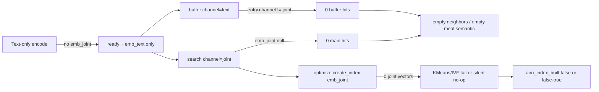
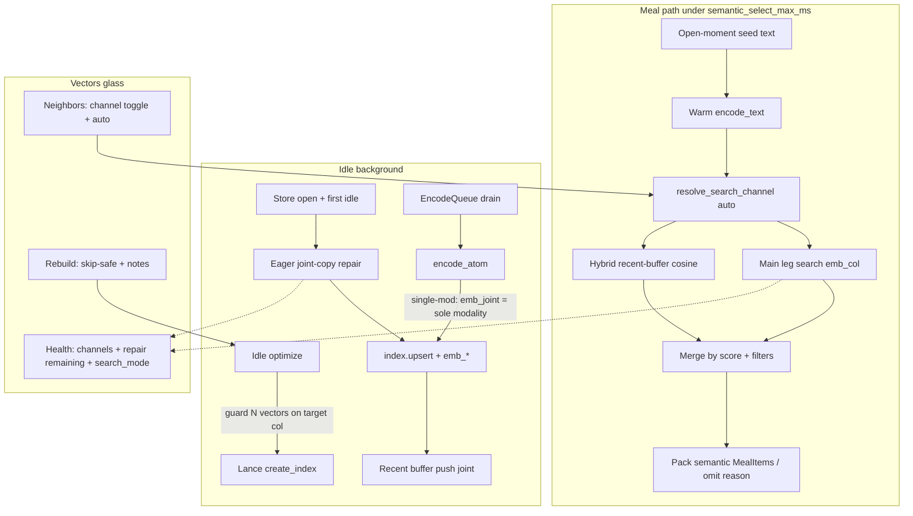
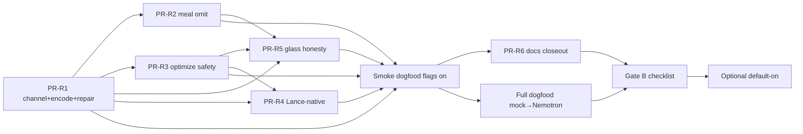

# Phase 2 Rectification — Implementation Design + PR Plan

| Field | Value |
|-------|--------|
| **Document** | Phase 2 product-intent rectification (code fix design) |
| **Product** | project-elyra |
| **Author** | _(design agent)_ |
| **Date** | 2026-07-29 |
| **Status** | **Ready for `/execute-plan`** — operator OQs resolved 2026-07-29 (revision R2 + OQ lock) |
| **Branch** | `grok-improvement-memory` |
| **Depends on** | Phase 2 execute-plan stack shipped (PR1–PR9, 2026-07-28); Phase 1 Done |
| **Program status** | [README.md](README.md) Phase 2 honesty close-out — **Partial / rectification needed** |
| **Bug trackers** | [known-bugs.md](../known-bugs.md) **BUG-mem-p2-01** (core), **BUG-mem-gpu-01** (hardware — ownership below) |
| **Historical design** | [design-phase-2-implementation.md](design-phase-2-implementation.md) — do **not** rewrite; this doc owns the fix plan |
| **Architecture (as shipped)** | [architecture/phase-2-semantic.md](architecture/phase-2-semantic.md) — update after implement |
| **Boundary** | **Not** Phase 2a ([design-phase-2a-directed-traversal.md](design-phase-2a-directed-traversal.md)); **not** Phase 3 ([design-phase-3-procedural.md](design-phase-3-procedural.md)) |
| **Revision** | R2 + OQ lock (2026-07-29) — review issues closed; operator OQ-R1/R4/R6 resolved |

> **Terminology (locked):** Phase 2 **vector ANN / vector search** = similarity over embedding channels. It is **not** procedure modeling, not a process-ANN, and not Phase 2a keep-set walks. Phase 3 solid core is trajectories + edge-weight priors.

---

## Overview

Phase 2’s execute-plan stack (encode queue, multi-channel `emb_*`, hybrid index façade, meal `select_semantic`, Vectors glass) is **operator-complete as plumbing** but **not product-complete**. Dogfood on `grok-improvement-memory` (2026-07-28) showed a dead semantic surface: default `channel=joint` against a text-only corpus, empty neighbors, empty meal semantic, and ANN rebuild/optimize aimed at empty `emb_joint`. The product path also leans on **in-process Python cosine** (`LanceMemoryStore.search_vectors` over `_emb_by_id`) rather than **Lance-native vector search** as the long-term ANN authority.

This document plans the **code rectification** only: restore locked product intent (Lance-native primary search + filters; reliable channel selection with joint-primary when multi-modal; trustworthy meal semantic under hard ms budget; honest Vectors glass; safe index rebuild). Flags stay **default off** until rectification + Gate B + operator sign-off. Order of program work remains: **rectification → dogfood → Gate B → 2a → 3**.

---

## Background & Motivation

### Why rectify now

- [README Phase 2 honesty](README.md) marks Phase 2 **Partial / rectification needed** — “execute-plan complete ≠ product target.”
- **BUG-mem-p2-01** records live dogfood: `vectors_ready≈32`, neighbors `channel=joint` → 0 hits; `channel=text` → real cosine hits; meal channels episodic+temporal only; `ann_index_built=false`, `search_mode=full`, `last_optimize=null`.
- Phase **2a** directed traversal depends on **rectified seeds**; shipping 2a on empty joint search amplifies noise (README working rule 8).
- Architecture manual claims of full Lance ANN / joint-primary meal are **partially aspirational** until this pass ([architecture/phase-2-semantic.md](architecture/phase-2-semantic.md) honesty banner).

### Current state (code truth, 2026-07-29)

Verified against `elyra/memory/` and glass wiring:

#### Encode → durable vectors

| Step | Code | Behaviour |
|------|------|-----------|
| Promote marks `pending` | `promote.py` when `semantic_enabled` | No encode on hop |
| Idle drain | `presence/worker.py::_idle_memory_encode` → `embed/queue.py` | Caps: `encode_max_ms_per_tick` / `encode_max_items_per_tick` |
| Encode | `embed/encode.py::encode_atom` → mock / Nemotron | Text from `content_text`; media best-effort |
| Joint policy | **`embed/mock.py` and `embed/runtime.py`** both use `do_joint = want_joint if … else len(present) >= 2` | **Text-only atoms get `emb_text` only — no `emb_joint`** (policy duplicated — drift risk) |
| Ready rule | `embed/types.py::embeddings_are_ready` (KD20) | Ready if joint **or** exactly one non-joint modality |
| Persist | `LanceMemoryStore.upsert_vectors` | Writes all `emb_*` columns (nulls allowed); status `ready` |

#### Search / index

| Surface | Code | Behaviour |
|---------|------|-----------|
| Façade | `index.py::EmbeddingIndex` (`Null` / `Memory` / `Lance`) | Protocol: `upsert` / `search` / `optimize` / `health` |
| Default channel | `search(..., channel="joint")` | Hard default **joint**; **`channel not in CHANNEL_SET` → `[]`** (`CHANNEL_SET` has no `auto`) |
| Main leg (Lance) | `LanceEmbeddingIndex._search_main` → `LanceMemoryStore.search_vectors` | **Brute-force Python cosine** over in-memory `_emb_by_id[channel]`; **not** `table.search(...)` |
| Hybrid buffer | `_RecentBuffer` + `_search_buffer` | Buffer stores **one** primary channel (joint preferred, else sole modality). Buffer hit **requires `entry.channel == channel`** — text-buffered rows are invisible when search is `joint` |
| Full vs hybrid | `_FreshnessState.use_full_search` | Full when `vectors_ready < ann_full_search_below` (2000) **or** ANN not built |
| Optimize | `LanceEmbeddingIndex.optimize` | Best-effort `create_index` on **`emb_joint` only**; sets `ann_built=True` if `create_index` **does not throw** — **no pre-count of non-null joint vectors** (false success + buffer trim risk on empty/sparse joint) |
| Health | `health()` | `vectors_ready`, `search_mode`, `ann_index_built`, `index_stale`, `last_optimize` |

#### Meal semantic

| Surface | Code | Behaviour |
|---------|------|-----------|
| Select | `meal.py::select_semantic` | Hard wall clock `semantic_select_max_ms` (50); warm embedder only (KD12) |
| Channel | **hardcoded `channel="joint"`** | No fallback when joint empty |
| Filters | horizon `semantic_horizon_hours` (168h), exclude open moment + temporal/episodic ids | kind/time filters supported by index API |
| Omit reasons | `encoder` / `timeout` / `empty_seed` / `no_index` / `min_score` | **No reason for “channel empty / no hits”** — returns `([], None)` → looks like “semantic off” in Context |
| Budget | `tokens.split_memory_budget_v2` | Semantic cut first under temporal floor |

#### Glass Vectors

| Endpoint | Behaviour |
|----------|-----------|
| `GET /api/memory/vectors` | Encoder + index health |
| `GET /api/memory/vectors/atoms` | Status list via `list_atoms` |
| `GET /api/memory/vectors/neighbors` | Default **`channel=joint`**; glass UI does **not** pass channel → always joint |
| Query vector for atom | `inspect.query_vector_for_atom` iterates `(requested, joint, text, …)` — code comment says “prefer joint” but **requested is first**; query can resolve text while **corpus search** still scans joint → empty neighbors |
| `POST /api/memory/vectors/rebuild` | Calls `worker.rebuild_vector_index` → `index.optimize` (longer budget); 200 even when `optimized:false`; single `note` field today |
| Context meal | Surfaces `semantic_omitted_reason` in inspect DTO when set; empty channel with `None` reason is invisible |

#### Root-cause chain (dogfood)



### Pain points (severity)

| ID | Pain | Severity | Owner |
|----|------|----------|--------|
| P1 | Default joint vs text-only corpus → empty product surface | **High** | Rectification core |
| P2 | Meal semantic empty/unreliable; no “considered/omitted” visibility | **High** | Rectification core |
| P3 | Python cosine as sole Lance path; not product Lance-native ANN | **Med–High** | Rectification core |
| P4 | Optimize/rebuild on empty joint; unsafe IVF **or false `ann_index_built`** | **Med** | Rectification core |
| P5 | Vectors glass: no channel control; weak empty-state honesty | **Med** | Rectification core |
| P6 | Radeon VII / ROCm Nemotron always CPU (**BUG-mem-gpu-01**) | **Med** (High later) | **Defer** — Gate B / runtime; not blocking channel fix |

---

## Goals & Non-Goals

### Goals

1. **Reliable channel selection** for meal + glass + index search: explicit policy with a recommended default (`auto`) and joint-primary when multi-modal material is present.
2. **Encode alignment**: single-modality atoms produce a **searchable primary channel** so joint-primary is not a dead default (see KD-R1).
3. **Eager joint-copy repair** so mid-migration mixed corpora cannot leave `auto→joint` with incomplete joint coverage (see KD-R2 / KD-R11).
4. **Lance-native vector search** as the product path for main-leg retrieval (filters: kind, modality/channel, time, exclude open moment / ids); keep hybrid recent-buffer as **correctness**, not as the only engine.
5. **Meal semantic** trustworthy under `semantic_select_max_ms`: non-empty when data exists; omit gracefully with **honest reasons** (including no-hits / channel / dedup).
6. **Vectors glass honesty**: show channel used, score meaning, omit reasons, rebuild/optimize notes; safe rebuild when index/channel empty; small-N full scan is not framed as failure.
7. **Optimize safety**: never KMeans/IVF on 0 vectors; never claim `ann_index_built` or trim buffer on skip/false success.
8. **Tests + docs**: hermetic coverage for channel/repair/Lance path; architecture note + README status after ship; BUG-mem-p2-01 resolution path; early pointer from program docs to this design.
9. **Preserve** Phase 1 parity with flags off; idle-only corpus encode; meal hard timeout; KD19 emb preserve; JSONL never calls Lance search/index.

### Non-goals

| Non-goal | Notes |
|----------|--------|
| Phase 2a directed traversal / Graph tab / keep-set | Out of scope; depends on rectified seeds |
| Phase 3 trajectories / success weights / process ANN | Out of scope; terminology: not vector ANN |
| Rewriting Phase 1 temporal substrate | Unchanged |
| Product default-on of `semantic_enabled` / `embed_enabled` | Gate B + sign-off **after** rectification dogfood |
| Full philosophical redesign of Stretch 2 | Living docs stay; this is product-path fix |
| Multi-channel RRF / fusion ranking | Still deferred (joint-primary only; no multi-try search) |
| Full ROCm / Radeon Nemotron product path | **BUG-mem-gpu-01** — document ownership; optional health honesty only |
| Optional 2D vector projection polish | Still non-gate (historical KD18) |
| Known-bugs glass polish (BUG-glass-*, BUG-mem-ui-*) | Parallel; not rectification gates |

---

## Proposed Design

### Target architecture



**Ownership (unchanged modules, tightened contracts):**

| Module | Rectification ownership |
|--------|-------------------------|
| `elyra/memory/embed/types.py` | Shared `should_write_joint` + `joint_vector_for_modalities` (copy vs encode_joint); ready-rule note |
| `elyra/memory/embed/mock.py` + **`embed/runtime.py`** | KD-R1: n==1 joint **copy**, n≥2 `encode_joint` via shared helpers (no drift) |
| `elyra/memory/embed/encode.py` | Call path only; no local joint policy |
| `elyra/memory/index.py` | `resolve_search_channel`; `auto` **before** `CHANNEL_SET`; buffer match; optimize guards; health fields |
| `elyra/memory/lance_store.py` | Joint-copy repair; vector counts; Lance-native `search_vectors`; safe index create |
| `elyra/memory/meal.py` | Pass `semantic_search_channel`; richer omit reasons; **`semantic_select_meta` on MealPackage** |
| `elyra/memory/inspect.py` + `runtime/api.py` + web | Glass channel, honesty DTOs; query vector aligned to resolved channel |
| `elyra/memory/config.py` + **`elyra/settings.py`** | New knobs + allowlist/range validation |
| `elyra/presence/worker.py` | Idle repair continue; rebuild notes; no hop-path encode |

### Channel selection & fallback policy (normative)

#### Definitions

| Term | Meaning |
|------|---------|
| **Channel** | One of `text` \| `image` \| `audio` \| `video` \| `joint` (bonded columns on one atom) |
| **Search channel request** | Caller-supplied: explicit channel **or** `auto` |
| **Resolved channel** | Concrete column used for main + buffer legs of one search |
| **Primary search key** | Product ranking key: **joint** once joint column is complete (post-repair); else sole modality while repair still pending (see KD-R2 safety) |
| **CHANNEL_SET** | `{text, image, audio, video, joint}` — does **not** include `auto` |
| **Request set** | `CHANNEL_SET ∪ {auto}` |

#### Encode policy (KD-R1 — amend historical KD5)

**Single-modality atoms must still write `emb_joint`.**

| Case | Write |
|------|--------|
| ≥2 modalities successfully encoded | True multi-modal `emb_joint` via `encode_joint` (unchanged KD5 eager joint) |
| Exactly one modality (typical dogfood: text) when `embed_joint_for_single_modality=true` (default) | Write that modality vector **and** set `emb_joint = tuple(sole_vector)` — **byte-identical L2 unit copy**. Product invariant: **non-null `emb_joint` whenever newly marked ready**, and **`emb_joint == emb_{sole}`** (elementwise) |
| Zero modalities | `skipped` / no vectors |

**How joint is produced (normative — not only whether):**

| `len(present)` | Joint production |
|----------------|------------------|
| `0` | No vectors |
| `1` | **`emb_joint = copy(sole modality vector)`**. **Do not** call `encode_joint`. Mock today seeds `encode_joint` differently from `encode_text` (`"joint|text|…"` vs `"text|…"`) — calling joint encode would desync free-text query (`encode_text`) from corpus joint and diverge from the repair path (which always copies). |
| `≥2` | `emb_joint = encode_joint(parts)` (true multi-modal fusion) |

Repair path (KD-R11) and new single-mod encode path **must produce the same joint = copy invariant**, so partial dogfood never mixes two joint geometries for text-only atoms.

**Shared helpers (normative — avoid mock/runtime drift):**

```python
# elyra/memory/embed/types.py (or encode helpers)
def should_write_joint(
    present: Sequence[str],
    *,
    want_joint: bool | None = None,
    single_modality_joint: bool = True,
) -> bool:
    """Whether to populate emb_joint at all (not how)."""
    if want_joint is not None:
        return bool(want_joint)
    n = len(present)
    if n >= 2:
        return True
    if n == 1 and single_modality_joint:
        return True
    return False

def joint_vector_for_modalities(
    *,
    present: Sequence[str],
    modality_vectors: Mapping[str, Sequence[float]],  # non-joint only
    encode_joint_fn: Callable[..., Sequence[float]],
    parts: Any,
    single_modality_joint: bool = True,
) -> tuple[float, ...] | None:
    """How to produce emb_joint. Single-mod → copy; multi-mod → encode_joint."""
    if not should_write_joint(
        present, single_modality_joint=single_modality_joint
    ):
        return None
    if len(present) == 1:
        sole = present[0]
        vec = modality_vectors[sole]
        return tuple(float(x) for x in vec)  # copy — never encode_joint
    return tuple(encode_joint_fn(parts))
```

Both `embed/mock.py` and `embed/runtime.py` **must** use these helpers (or equivalent inlined rules with the same tests). Do not re-inline `len(present) >= 2` alone, and **never** `encode_joint` when `n==1`.

Rationale:

- Restores **joint-primary** as a real default without multi-channel fusion.
- Text-only corpora: free-text / meal `encode_text` query matches corpus `emb_joint` (copy of text) under cosine.
- Multi-modal joint remains a true fused embedding when ≥2 modalities load.
- Repair and new-encode stay in one joint geometry for single-mod rows.
- **New encodes** after KD-R1: `embeddings_are_ready` **requires joint** when `embed_joint_for_single_modality=true` (**OQ-R4 resolved**). Legacy ready rows without joint remain accepted until joint-copy repair fills them.

**Flags-off inertness:** KD-R1 is inert when `semantic_enabled` / `embed_enabled` are false — drain does not run; Phase 1 atom rows and golden meal tests unchanged. Default `embed_joint_for_single_modality=true` does **not** mutate atoms until encode runs.

#### Mid-migration contract (KD-R2 + KD-R11 — Option A, normative)

**Chosen contract: single-channel resolve + mandatory eager joint-copy repair.**  
**Rejected for product path:** multi-try search (joint then text on empty hits) and coverage-threshold resolve — both add latency/complexity under the 50ms meal budget and weaken joint-primary as a stable key.

**Unsupported state:** partial joint column (some ready rows have joint, some only text) **without** repair completing. Product search must not claim healthy joint-primary while `joint_repair_remaining > 0`.

Normative rules:

1. **Repair is required for mixed-corpus correctness**, not optional polish.
2. Resolve stays **single-channel** (one concrete column per search).
3. **Until repair complete**, `auto` must **not** lock onto sparse joint:
   - If `joint_repair_remaining > 0` → `auto` resolves to best sole modality that has full ready coverage (normally **`text`**, reason `auto_text_repair_pending`).
   - If `joint_repair_remaining == 0` and `vectors_by_channel.joint > 0` → `auto` → **`joint`** (`auto_joint`).
   - If repair complete but joint count is 0 and text > 0 → `auto` → **`text`** (`auto_text`) — should only happen if joint-for-single is disabled.
4. **No** “try joint, if zero hits retry text” on the product path.
5. Explicit `channel=joint` still searches joint only (may return empty mid-repair — operator/debug); glass should show channel + repair remaining.

#### Cheap joint-copy repair algorithm (normative — PR-R1 must ship this)

**Ownership:** `LanceMemoryStore` (durable emb columns) + `LanceEmbeddingIndex` / worker idle (schedule). `MemoryEmbeddingIndex` CI path: same logical repair over in-memory emb maps so meal tests are not Lance-only.

**Eligibility:** atom `embedding_status == "ready"` **and** `emb_joint` is null **and** exactly one non-joint modality vector is non-null → set `emb_joint = copy(that_vector)` (same L2 unit vector). No encoder / torch call.

**Where / when:**

| Trigger | Behaviour |
|---------|-----------|
| **Store open** (`LanceMemoryStore` open after vector schema OK) | Run repair in **bounded batches** (see caps). At dogfood N≈32, a full scan of ready rows is acceptable in one open pass. |
| **First idle tick** after open (and subsequent idle while remaining > 0) | Continue repair; **never mid-hop / never inside `select_semantic`** |
| **Not** first `index.search` | Search must not block on repair |
| **Not** glass rebuild | Rebuild optimizes ANN; may *report* repair remaining but does not own repair |

**Bounds (defaults):**

| Knob | Default | Notes |
|------|---------|-------|
| `joint_repair_max_per_open` | `500` | Cap rows repaired during open (dogfood finishes in one pass) |
| `joint_repair_max_per_tick` | `64` | Idle continue; independent of `encode_max_items_per_tick` |
| Interaction with catch-up | Orthogonal | `embed_catchup_*` is none→pending; repair is ready+text-only→fill joint. Do not double-count budgets |

**Durability (per repaired atom):**

1. Build `EmbeddingSet` with existing modality + `emb_joint=copy`.
2. `upsert_vectors` (or equivalent read-merge write) → refresh `_emb_by_id` + disk columns; keep `embedding_status=ready`.
3. Update `meta.embed_channels` to include `joint`.
4. **Buffer:** if index buffer has entry for `atom_id`, **re-push** with `channel=joint` and joint vector (or drop entry and let next seed/upsert repopulate). Stale `channel=text` buffer entries must not survive repair for that id.

**Idempotency:** rows with non-null joint are skipped. Re-open is no-op when complete.

**Health fields:**

```json
{
  "vectors_by_channel": {"text": 32, "joint": 32, "image": 0, "audio": 0, "video": 0},
  "joint_repair_remaining": 0,
  "joint_repair_last_batch": 0
}
```

`joint_repair_remaining > 0` ⇒ index/product health may still be `ok` for scalar meal, but Vectors UI and `search_mode` notes should show **repair pending** (not “search broken”).

**Tests (PR-R1 gate):** ready text-only fixture → open/repair → `emb_joint` filled **without** encoder calls → `search(..., channel="joint")` and `channel="auto"` return hits; buffer entry channel is joint.

#### Search resolve policy (KD-R2)

```text
# Normative sequence for every search entry point (index.search, meal, glass):
# 1. Validate request ∈ CHANNEL_SET ∪ {"auto"}; else return [] / error.
# 2. If request == "auto": resolve → concrete channel.
# 3. Search concrete channel only (never pass "auto" into column lookup).
# 4. NEVER apply CHANNEL_SET check to the raw request before resolving auto.

resolve_search_channel(
    request,
    *,
    vectors_by_channel: Mapping[str, int],
    joint_repair_remaining: int = 0,
    seed_channels: Sequence[str] | None = None,  # optional hint only
) -> (channel, reason)

if request in {text, image, audio, video, joint}:
    return request, "explicit"

# request == "auto"
if joint_repair_remaining > 0:
    # Safety: do not lock onto incomplete joint column
    if vectors_by_channel.get("text", 0) > 0:
        return "text", "auto_text_repair_pending"
    for ch in ("image", "audio", "video"):
        if vectors_by_channel.get(ch, 0) > 0:
            return ch, f"auto_{ch}_repair_pending"
    return "joint", "auto_empty_repair_pending"

if vectors_by_channel.get("joint", 0) > 0:
    return "joint", "auto_joint"
if vectors_by_channel.get("text", 0) > 0:
    return "text", "auto_text"
for ch in ("image", "audio", "video"):
    if vectors_by_channel.get(ch, 0) > 0:
        return ch, f"auto_{ch}"
return "joint", "auto_empty"   # search returns []; honest omit reason
```

**Implement footgun (must not regress):** today `if channel not in CHANNEL_SET: return []` would treat `"auto"` as empty. Implementations **must** special-case `auto` (resolve first). Unit test: `search(..., channel="auto")` with text-only (post-repair joint or repair-pending text path) **does not** early-return `[]` when vectors exist.

**Protocol default:** `EmbeddingIndex.search` may keep default `channel="joint"` for back-compat unit tests that pass explicit vectors on joint. Meal and glass **must** pass `settings.semantic_search_channel` (default `"auto"`). Do not rely on Protocol default for product paths.

**Product defaults:**

| Caller | Default request | Notes |
|--------|-----------------|-------|
| `select_semantic` | `settings.semantic_search_channel` → `"auto"` | Resolves per meal compose |
| Glass neighbors | `"auto"` if UI/API omits channel | Explicit select still allowed |
| Tests / debug | explicit channel | Keep extension point |

**Buffer matching (bugfix):** after KD-R1 + repair, buffer always stores **joint** when joint present. Search on resolved channel `C` accepts `entry.channel == C`. During `auto_text_repair_pending`, buffer entries may still be text for unrepaired rows and joint for new rows — buffer leg only matches entries for the **resolved** channel (text during repair); main leg scans text column for unrepaired + repaired-as-text-copy rows. After repair completes and buffer re-pushed, joint search sees full hybrid.

#### Multi-channel ranking

**Still out of scope:** RRF / weighted fusion; multi-try channel fallback on empty hits. Operators who need image-only query pass `channel=image`. Extension point remains `index.search(channel=…)`.

### Lance-native search plan

#### Today vs target

| Layer | Today | Target |
|-------|--------|--------|
| Main search | Python cosine over `_emb_by_id` in `search_vectors` | Prefer **Lance/LanceDB native** vector query on column `emb_{channel}` when `ann_search_backend=lance_native` |
| Filters | Manual Python loops | Push down **only when proven safe**; **all** filter semantics must still hold after post-filter (ready-only, kind, time, moment_id, exclude_atom_ids, exclude_moment_id) |
| Small N | Full scan Python | After PR-R4: **`search_mode=full_lance`** (Lance brute / unindexed vector search) when `ann_search_backend=lance_native` and N is below IVF / hybrid threshold — **operator lock OQ-R6**. Python full scan only when `ann_search_backend=python` or lance fails (fallback). Hybrid/ANN when index built and N large enough. Report mode honestly. |
| Hybrid buffer | Python cosine | Unchanged (in-process correctness for unindexed recent) |
| ANN index | Best-effort `create_index` on `emb_joint` only | Per `ann_index_channels` (default joint only); skip if n=0 or n < `ann_ivf_min_vectors` |

**Docstring hygiene:** update `search_vectors` docstring — hybrid buffer already lives in `index.py`; this method is main-leg only. Do not drop exclude filters when switching engines.

#### API shape

```python
# lance_store.py — replace body of search_vectors; keep signature
def search_vectors(
    self,
    query: Sequence[float],
    *,
    k: int = 12,
    channel: str = "joint",  # concrete only — never "auto" at this layer
    t_start: datetime | str | None = None,
    t_end: datetime | str | None = None,
    moment_id: str | None = None,
    kinds: Sequence[str] | None = None,
    exclude_atom_ids: Sequence[str] | None = None,
    exclude_moment_id: str | None = None,
) -> list[tuple[str, float]]:
    """Return (atom_id, score) desc. Concrete channel only.

    When ann_search_backend=lance_native: table.search on emb_{channel}.
    When python or lance fails: in-process cosine over _emb_by_id.
    Filter semantics identical on both paths.
    """
```

Implementation sketch (lancedb 0.20.x, aligned with [spikes/lance-emb-migration.md](architecture/spikes/lance-emb-migration.md)):

1. Assert channel ∈ CHANNEL_SET (concrete). Unknown / schema missing → `[]`.
2. If no non-null vectors for column (count cache) → `[]` immediately.
3. If `ann_search_backend == "python"` → existing Python cosine path (all filters).
4. Else try Lance:

```python
q = table.search(list(query), vector_column_name=col).metric("cosine").limit(fetch_k)
# .where(sql) only if spike-proven for pinned lancedb; else post-filter in Python
rows = q.to_list()  # atom_id + _distance
```

5. **Score formula (pin in PR-R4 + architecture note):** if Lance returns cosine **distance** `d` in `[0, 2]`, product score = `1.0 - d` (clamp to finite). If library returns similarity already, use as-is. **Acceptance:** parity fixture vs python cosine on fixed mock vectors.
6. Apply **all** filters not pushed down (must match python path semantics).
7. On Lance failure: log once; **fallback** to Python scan. Controlled **only** by `ann_search_backend` (no second flag).

#### PR-R4 acceptance criteria (normative)

1. **Parity fixture:** fixed mock vectors; same top-k `atom_id` set (or Jaccard ≥ 0.9 with documented ties) for `ann_search_backend=python` vs `lance_native` with **kind + time + exclude_atom_ids + exclude_moment_id + ready-only** applied.
2. **Score formula** documented in architecture note and tested (ordering vs python cosine on fixture).
3. **Fallback path** preserves every existing filter semantic.
4. **`search_mode` honesty:** one of `full_python` | `full_lance` | `hybrid` | `hybrid_python_fallback` — never claim hybrid IVF when using full scan.
5. At N < `ann_full_search_below` (and/or below IVF min): with `ann_search_backend=lance_native`, default is **`full_lance`** (OQ-R6) — correct full scan without IVF; not a product error. `full_python` only for `ann_search_backend=python` or emergency fallback after lance failure. Parity fixture still required so `full_lance` scores/order match python closely enough (Jaccard gate).
6. `backend=jsonl` / `NullEmbeddingIndex`: never calls `table.search` or `create_index`.

#### Index create / optimize (KD-R3)

```text
optimize(channel targets = ann_index_channels, default ("joint",)):
  notes = []
  any_built = False
  for each target column:
    n = count non-null ready vectors on column
    if n == 0:
      notes.append("no_vectors:{col}")
      continue   # do NOT call create_index; do NOT set ann_built
    if n < ann_ivf_min_vectors:
      notes.append("below_ivf_min:{col}:{n}")
      continue   # full scan remains correct — not a product error
    try:
      create_index(metric=cosine, vector_column_name=col, replace=True)
      # Optional: verify index metadata / non-empty column before trust
      any_built = True
      notes.append("built:{col}:{n}")
    except Exception as exc:
      notes.append(f"error:{col}:{exc}")
      # do NOT claim ann_index_built for this attempt

  if any_built:
    ann_index_built = True
    trim buffer (mark_optimized)
    optimized = True
  else:
    # CRITICAL: leave ann_index_built UNCHANGED; do NOT trim buffer
    optimized = False
  return {optimized, notes, ann_index_built, vectors_by_channel, ...}
```

**False-success class (must fix):** today `create_index` non-throw on empty/sparse joint can set `ann_index_built=true` and trim buffer. PR-R3 acceptance:

- n=0 → `optimized=false`, **`ann_index_built` unchanged**, buffer **not** trimmed, `notes` includes `no_vectors:emb_joint`.
- n < IVF min → same non-claim behaviour with `below_ivf_min:…`.
- Rebuild API migrates single `note` → **`notes: list[str]`** (keep optional `note` as `"; ".join(notes)` for one release if needed).

**Never** call IVF/KMeans when `n=0` for that column.

Health additions:

```json
{
  "vectors_ready": 32,
  "vectors_by_channel": {"text": 32, "joint": 32, "image": 0, "audio": 0, "video": 0},
  "joint_repair_remaining": 0,
  "search_mode": "full_lance",
  "ann_index_built": false,
  "ann_index_channels": [],
  "last_optimize_notes": ["below_ivf_min:emb_joint:32"]
}
```

### Meal semantic reliability under budget

#### Behavioural target

| Condition | Result |
|-----------|--------|
| Flags off | Phase 1 meal only (unchanged) |
| Encoder cold | Omit `semantic_omitted_reason=encoder` |
| Empty seed | `empty_seed` |
| No index / JSONL | `no_index` |
| Timeout | `timeout` (never block hop) |
| Resolved channel has no candidates | **`no_hits`** (new) — distinct from silent empty |
| Hits only below min_score | `min_score` (existing) |
| Hits all deduped vs temporal/episodic | **`deduped`** (new) — Context shows “matched but already in temporal/episodic” |
| Packed ≥1 item | Items + reason `None`; labels include score |

#### Select path changes (`select_semantic`)

1. Load `vectors_by_channel` + `joint_repair_remaining` from index/store health.
2. Call pure `resolve_search_channel(settings.semantic_search_channel, …)` → `(concrete, channel_reason)` (see **channel_reason ownership** below).
3. `index.search(query, channel=concrete, …)` — product path passes **concrete** channel, not `"auto"`.
4. Track counters: `raw_hits`, `below_min`, `deduped`, `packed`, plus `channel` / `channel_reason` from step 2.
5. Map empty pack → omit reason priority: timeout > encoder > no_index > empty_seed > min_score > deduped > no_hits.
6. **Pin observability on MealPackage** (not inspect-only):

```python
@dataclass(frozen=True)
class MealPackage:
    items: tuple[MealItem, ...]
    # ... existing fields ...
    semantic_omitted_reason: str | None = None
    semantic_select_meta: dict[str, Any] | None = None  # NEW — additive default None
```

Example meta:

```python
semantic_select_meta = {
  "channel": "joint",
  "channel_reason": "auto_joint",
  "raw_hits": 5,
  "deduped": 2,
  "packed": 3,
  "elapsed_ms": 12,
  "joint_repair_remaining": 0,
}
```

Thread through `meal_package_to_inspect` / Context DTO. Context shows **one muted line** using reason + channel (even when items empty). Keep packing logic independent of glass. Not a full Context beautify (BUG-mem-ui-01 separate).

#### Budget invariants (unchanged)

- Hard `semantic_select_max_ms` (default 50); sub-budget `encode_query_max_ms` (30).
- Supporting only; cut before temporal spine; temporal floor 0.55.
- Query encode only if warm.

### Vectors glass honesty + rebuild safety

| Surface | Change |
|---------|--------|
| Neighbors API default | `channel=auto`; response echoes requested, **`resolved_channel`**, `channel_reason` |
| Glass UI | Channel `<select>`: auto / joint / text / image / audio / video; badge score = cosine |
| Empty neighbors | Show `omitted_reason` + “searched channel X (reason)” — never blank without explanation when query ran |
| Health card | `vectors_by_channel`, `joint_repair_remaining`, `ann_index_built`, `last_optimize_notes`, device requested vs effective if available |
| Rebuild button | Warn when 0 vectors on all target channels **or** N < IVF min (copy: “ANN IVF not built — corpus small; full scan still used” vs “search broken”); response `optimized` + `notes[]` |
| Atoms list | Show `embed_channels` chips — joint vs text visible |

#### Query vector alignment (neighbors)

| Mode | Query vector rule |
|------|-------------------|
| **Explicit channel** | Vector from that channel only; if missing → `omitted_reason=no_vector`. **Never** soft-fallback to another channel. |
| **`auto`** | First resolve search channel (same KD-R2 inputs as corpus search). Load query vector for **that resolved channel** only. For free-text `q=`, `encode_text` then search the **resolved** channel (after repair complete, typically joint; joint=copy for single-mod is fine). |
| Atom-id + auto | Prefer stored vector on resolved channel; if missing and resolved is joint with only text on disk mid-repair, resolve should already have chosen text — do not independently fall through a different channel than corpus search. |

Fix stale comment in `query_vector_for_atom` when touching that code.

### Encode / index freshness (preserved + tightened)

| Topic | Rule after rectification |
|-------|--------------------------|
| Corpus encode | Idle-only (KD2); inert when embed/semantic off |
| Joint repair | Open + idle only; never hop path |
| Recent buffer | Still correctness for continuous insert; re-push on repair |
| Full search below 2000 / below IVF min | Correctness via full scan; **not** a product error |
| Optimize schedule | Unchanged triggers; body gains zero-vector + false-success guards |
| Restart | Repair + seed buffer; full mode when small |
| KD19 | Scalar put still preserves emb |
| JSONL | `NullEmbeddingIndex`; no `table.search` / `create_index` |

### Config knobs (additive)

| Setting | Default | Type / validation |
|---------|---------|-------------------|
| `semantic_search_channel` | `"auto"` | ∈ `{auto, joint, text, image, audio, video}` |
| `ann_search_backend` | `"lance_native"` | ∈ `{lance_native, python}` — **sole** rollback knob for search engine (no `ann_force_python`) |
| `ann_ivf_min_vectors` | `256` | int ≥ 0 |
| `ann_index_channels` | `("joint",)` | list/tuple of channel names ⊂ CHANNEL_SET; toml: `ann_index_channels = ["joint"]` |
| `embed_joint_for_single_modality` | `true` | bool |
| `joint_repair_max_per_open` | `500` | int ≥ 0 |
| `joint_repair_max_per_tick` | `64` | int ≥ 0 |

No new env vars; all under `MemorySettings` / settings.toml.

**Settings validation (required):** every new field must be allowlisted and coerced in `elyra/settings.py` `_coerce_section` (and related path lists) the same way existing `memory.ann_*` / `memory.semantic_*` knobs are. Add/extend `tests/test_settings.py` for invalid channel/backend/range rejection.

**Toml shape example:**

```toml
[memory]
semantic_search_channel = "auto"
ann_search_backend = "lance_native"
ann_ivf_min_vectors = 256
ann_index_channels = ["joint"]
embed_joint_for_single_modality = true
joint_repair_max_per_open = 500
joint_repair_max_per_tick = 64
```

---

## API / Interface Changes

### Python

```python
# index.py — pure helper (single authority for channel policy)
def resolve_search_channel(
    request: str,
    *,
    vectors_by_channel: Mapping[str, int],
    joint_repair_remaining: int = 0,
    seed_channels: Sequence[str] | None = None,
) -> tuple[str, str]:
    """Return (concrete_channel, reason). Raises or returns safe empty reason on bad request."""
    ...

# EmbeddingIndex.search — still returns list[ScoredAtom] only (no reason in return type).
# Implementations MAY accept channel="auto" for convenience tests (resolve internally,
# then search concrete; ScoredAtom.channel = concrete). There is NO required
# last_resolve_meta / stash on the index.
```

#### `channel_reason` ownership (normative — KD-R16)

**Pure `resolve_search_channel` is the single authority.** Product paths that need `channel_reason` **must not** depend on an unspecified index stash.

| Caller | Pattern |
|--------|---------|
| **Meal `select_semantic`** | health → `resolve_search_channel(...)` → `search(channel=concrete)` → put `(channel, channel_reason)` in `semantic_select_meta` |
| **Glass neighbors API** | health → resolve (request default `auto`) → query vector for **concrete** → `search(channel=concrete)` → response `query.resolved_channel` + `query.channel_reason` from **that same** resolve call |
| **Convenience / unit tests** | May call `search(channel="auto")` without reading reason |

Rules:

1. Do **not** change `EmbeddingIndex.search` return type to carry reason.
2. Do **not** require `last_resolve_meta` on the index for product correctness.
3. Meal and glass **must** call resolve with the **same** health snapshot used for that request (avoid re-resolve with stale `joint_repair_remaining` between meta and search).
4. `ScoredAtom.channel` is the **concrete** channel only (not a reason string).

`MealPackage.semantic_select_meta: dict[str, Any] | None = None` (additive).

### HTTP (glass)

| Endpoint | Change |
|----------|--------|
| `GET .../neighbors?channel=` | Default `auto`; API resolves once; response `query.channel` (request), `query.resolved_channel`, `query.channel_reason` from that resolve |
| `GET .../vectors` | Index block: `vectors_by_channel`, `joint_repair_remaining`, `search_mode`, `last_optimize_notes` |
| `POST .../rebuild` | Always 200 with `optimized` bool + **`notes: list[str]`**; never silent fake success |

### Settings

`MemorySettings` + `elyra/settings.py` allowlist/coercion as above. Defaults safe (semantic still off).

---

## Data Model Changes

| Change | Migration |
|--------|-----------|
| No new Lance columns | Schema epoch stays `vector_schema_version=1` |
| Ready rows gain non-null `emb_joint` via encode or **eager joint-copy repair** | Open + idle bounded batches; durable via `upsert_vectors` |
| Health meta only | In-process counts + repair remaining |
| `MealPackage.semantic_select_meta` | Additive optional field; inspect DTO threads it |

No dual-write to JSONL. JSONL remains no production ANN (`NullEmbeddingIndex` only).

---

## Alternatives Considered

### A1 — Glass/meal default `channel=text` only (no encode change)

| Pros | Cons |
|------|------|
| One-line fix for dogfood | Abandons joint-primary product intent; multi-modal future regresses; buffer still awkward |
| Fast | Does not fix optimize-on-empty-joint |

**Reject as sole fix.** May be temporary emergency operator workaround (`?channel=text`) before R1 merges.

### A2 — Always search all channels and RRF-fuse / multi-try auto

| Pros | Cons |
|------|------|
| Maximal recall mid-migration without repair | Latency under 50ms; complexity; weakens joint-primary |

**Reject for product path.** Mid-migration uses **eager repair + auto_text_repair_pending**, not multi-try search.

### A3 — Keep Python cosine forever; document as product

| Pros | Cons |
|------|------|
| Already works at N≈32; simple | Violates locked Lance-native intent; does not scale |

**Reject as end state.** Accept as **`ann_search_backend=python`** fallback and recommended small-N full path.

### A4 — Force full re-embed of all ready atoms after KD-R1

| Pros | Cons |
|------|------|
| Clean joint column | Slow on CPU Nemotron; dogfood pain (**BUG-mem-gpu-01**); unnecessary if joint=copy |

**Reject.** Eager joint-copy repair + idle re-encode only for true multi-modal holes.

### A5 — Coverage-threshold auto (joint only if joint/ready ≥ 0.95)

| Pros | Cons |
|------|------|
| Soft mid-migration without full repair | Magic threshold; still leaves holes; harder to explain |

**Reject.** Option A (eager repair + repair-pending resolve) is simpler and complete.

### Chosen combination

**KD-R1 joint-for-single + eager repair (KD-R11) + KD-R2 single-channel auto (with repair-pending safety) + KD-R3 safe optimize (no false success) + Lance-native main path with `ann_search_backend` python fallback.**

---

## Security & Privacy Considerations

| Topic | Stance |
|-------|--------|
| Vectors / neighbors APIs | Remain read-only; no raw 2048-d dumps by default |
| Rebuild | Local operator action only (existing glass trust model); no remote admin |
| Embed model path | Still under `ELYRA_HOME`; no new network pull requirements in core |
| Prompt injection via semantic neighbors | Same as Phase 2 ship — retrieved bodies are prior experience; meal already labels `semantic` |
| Secrets | Unchanged — do not put secrets in atom text if avoidable |

Threat model unchanged from Phase 2 architecture note.

---

## Observability

| Signal | Where |
|--------|-------|
| `semantic_omitted_reason` + `semantic_select_meta` | MealPackage → inspect → Context muted line |
| Index health: `vectors_by_channel`, `joint_repair_remaining`, `search_mode`, `last_optimize_notes` | Vectors tab + logs |
| Optimize skip / false-success prevention | `optimize` return `notes[]` + INFO log |
| Encode joint-for-single | `meta.embed_channels` includes `joint` |
| Metrics (soft) | Existing worker logs; no new telemetry backend |

Alerting: none for single-operator dogfood; fail-soft only.

---

## Tests Strategy

Hermetic CI (no torch/GPU/network) remains mandatory.

| Area | Tests (new or extend) |
|------|------------------------|
| Channel resolve | auto→joint when joint>0 and repair_remaining=0; auto→text when repair_remaining>0; auto→text when joint=0 text>0; explicit lock; bad request |
| **`channel="auto"` not early-empty** | MemoryEmbeddingIndex + Lance: auto with text vectors must not hit `CHANNEL_SET` early-return |
| Encode single-mod joint | Mock **and** runtime: text-only → `emb_joint` non-null **and** `emb_joint == emb_text` elementwise; **must not** call `encode_joint` for n==1; `should_write_joint` / `joint_vector_for_modalities` unit tests |
| Cheap joint repair | Ready text-only → open/repair → joint filled **without encoder**; joint equals sole modality; buffer channel joint |
| Search joint after repair | Memory + Lance (skip-if-no-lance): joint + auto return hits |
| Buffer channel match | After repair, joint search sees buffer; mid-repair text resolve matches text buffer entries |
| Optimize guards | n=0 → optimized=false, ann_index_built **unchanged**, buffer size unchanged, notes has `no_vectors` |
| IVF below min | n=32 < 256 → skip, notes `below_ivf_min`, search still hits via full mode |
| Meal omit reasons | `no_hits`, `deduped`; meta on MealPackage / inspect |
| Meal timeout | Unchanged regression |
| Lance-native vs python | Parity fixture top-k + filters; `ann_search_backend=python` forces python |
| Vectors API | Default auto; resolved channel; rebuild notes[] |
| **Flags off** | Phase 1 parity / golden meal; no emb mutation; `test_flags_off_*` still green |
| **JSONL** | Null index empty search; no Lance APIs invoked |
| Settings validation | Invalid channel/backend/ivf min rejected (`tests/test_settings.py`) |

Files likely touched: `tests/test_memory_index.py`, `test_memory_meal_semantic.py`, `test_memory_vectors_api.py`, `test_memory_embed_mock.py`, `test_settings.py`, `test_memory_semantic_integration.py`, `test_memory_flag_fallback.py`, new `test_memory_channel_resolve.py` if cleaner.

---

## Rollout Plan



| Stage | Action |
|-------|--------|
| Merge | Flags remain **off** by default |
| **Smoke dogfood** | As soon as **R1** (+ ideally R2/R3/R5) merges: operator enables `backend=lance`, `embed_enabled`, `semantic_enabled` — validate channel/meal/repair on live corpus **before** R6 claims product truth |
| Ongoing / full dogfood | Continues through R4+; mock then Nemotron ladder |
| Rollback search | **`ann_search_backend=python`** or `semantic_enabled=false` |
| Rollback encode | `embed_joint_for_single_modality=false` (debug only; not recommended) |
| Feature flags | No global kill beyond existing semantic/embed flags |
| **PR-R6** | After smoke dogfood is enough to write honest architecture/README status (depends on R1–R5 + smoke, not “docs then dogfood”) |
| Gate B | Only after rectified dogfood + [design-nemotron-runtime.md](design-nemotron-runtime.md) checklist |
| Default-on | Separate operator decision — **not** this design’s ship gate |

**PR-R5 does not wait on PR-R4** — glass honesty works on python cosine after R1+R3 (+R2 for meal meta).

**Dogfood is not gated on R6** — R6 documents smoke-dogfood truth; operators should dogfood recovery as soon as R1 lands.

### Early docs pointer (before PR-R6)

During implement, operators need to find this plan. **PR-R1** (or a tiny stacked docs commit) should add one-liner pointers:

- [README.md](README.md) Phase 2 honesty “Rectification” row → `design-phase-2-rectification.md` (status Draft / in progress)
- [known-bugs.md](../known-bugs.md) BUG-mem-p2-01 “Fix ownership” → same link

Full architecture re-verify and Done status remain **PR-R6**.

### BUG-mem-gpu-01 ownership

| In rectification scope | Out of scope (defer) |
|------------------------|----------------------|
| Encoder health honesty: requested vs effective device | ROCm wheel matrix / quant shim product |
| Docs cross-link Gate B portability | Blocking meal on GPU |
| Never hard-fail presence if GPU missing | Requiring CUDA |

---

## Risks

| Risk | Severity | Mitigation |
|------|----------|------------|
| Lance `table.search` score orientation differs from Python cosine | Med | Parity fixture; pin formula; `ann_search_backend=python` |
| Joint=copy for single-mod confuses multi-mod theory | Low | Document: joint is primary search key; multi-mod joint is true fusion |
| **Text query vs true multi-mod joint** quality | Low–Med | Accept for v1; free-text always encodes text; multi-mod image queries use explicit `channel=image` later |
| Repair incomplete + auto→joint would miss old rows | High if regressed | **Normative:** repair-pending forces auto→text; tests for remaining>0 |
| Buffer not re-pushed after repair | Med | Repair algorithm step 4 mandatory; test |
| 50ms budget tighter with Lance + filters | Med | Small-N `full_lance`; measure; rollback `ann_search_backend=python` |
| IVF min → forever full scan at dogfood N | Low | Expected; glass distinguishes “IVF not built (small corpus)” vs search broken |
| `create_index` no-throw false success | Med | PR-R3: n-guard before create; no trim/claim on skip |
| Glass scope creep into BUG-mem-ui beautify | Low | Honesty-only lines; no full redesign |
| Settings knobs load without validation | Med | `elyra/settings.py` + test_settings in R1/R3/R4 |
| `channel=auto` early-return empty | High if regressed | Resolve before CHANNEL_SET; unit test |

---

## Key Decisions

| ID | Decision | Rationale |
|----|----------|-----------|
| **KD-R1** | Single-modality encode writes **`emb_joint = copy(sole vector)`** — never `encode_joint` when n==1; shared `should_write_joint` + `joint_vector_for_modalities`; mock + **runtime.py** both use them | Restores joint-primary; free-text query matches corpus joint; encode≡repair geometry |
| **KD-R16** | Product paths that need `channel_reason` call pure **`resolve_search_channel` then `search(concrete)`**; no search return-type change; no required index stash | One authority; meal/glass cannot disagree or re-resolve with stale health |
| **KD-R2** | Product default search channel is **`auto`** with **single-channel** resolve; while `joint_repair_remaining > 0`, auto prefers **text** (`auto_text_repair_pending`); after repair, auto→joint when joint>0. **No multi-try** fallback | Mixed-corpus correctness without multi-try latency; repair is mandatory |
| **KD-R3** | Optimize **skips** n=0 / below IVF min; **never** set `ann_index_built` or trim buffer on skip; `notes[]` | Fixes crash **and** false-success classes |
| **KD-R4** | **Lance-native** when `ann_search_backend=lance_native` including small-N **`full_lance`** (OQ-R6); **sole** rollback is `ann_search_backend=python` (no `ann_force_python`) | One knob; product path is Lance sooner after R4 |
| **KD-R5** | Hybrid recent-buffer remains **correctness**, not product ANN story | Continuous insert must not miss ready atoms (historical KD4) |
| **KD-R6** | Meal omit reasons include **`no_hits`** and **`deduped`**; **`semantic_select_meta` pinned on MealPackage** | Operator trust; no inspect-only fork |
| **KD-R7** | Glass neighbors default **`auto`**; query vector channel **aligned** to resolved search channel | Stops query/corpus mismatch |
| **KD-R8** | No multi-channel RRF / multi-try in rectification | Scope; historical KD6 |
| **KD-R9** | Flags stay default **off**; no product default-on in this stack | Gate B after dogfood |
| **KD-R10** | **BUG-mem-gpu-01** is Gate B / runtime; rectification only device honesty | Avoid blocking search fix on ROCm |
| **KD-R11** | **Eager joint-copy repair** (open + idle, bounded) is required in PR-R1; preferred over Nemotron re-embed | Dogfood speed; mid-migration correctness |
| **KD-R12** | Phase 2a/3 remain out of scope; vector ANN ≠ procedure | Program order + honesty docs |
| **KD-R13** | Resolve **`auto` before CHANNEL_SET**; Protocol default may stay `joint`; product callers pass settings | Prevent silent empty search footgun |
| **KD-R14** | Small-N / below IVF: full scan is **success path** (`full_lance` under lance_native); glass must not frame as failure | Honesty at dogfood N≈32; OQ-R6 |
| **KD-R15** | All new knobs validated in **`elyra/settings.py`** | Codebase pattern; avoid silent ignore |

---

## Open Questions

Operator locks **2026-07-29**. No further forks for implement.

| # | Question | Resolution |
|---|----------|------------|
| OQ-R1 | IVF minimum vector count default? | **Resolved (operator 2026-07-29):** default **`ann_ivf_min_vectors=256`** (or library-documented minimum if higher). Full scan below min is OK / success path — not a product error. |
| OQ-R2 | Index `emb_text` in addition to `emb_joint`? | **Resolved (design default):** joint only after repair; dual index not needed under Option A. |
| OQ-R3 | Score mapping Lance distance → cosine similarity | **Resolved (design default):** pin in PR-R4 via parity fixture; document in architecture note (recommend `score = 1 - d` if distance). |
| OQ-R4 | Should `embeddings_are_ready` **require** joint after KD-R1? | **Resolved (operator 2026-07-29):** **Yes for new encodes** when `embed_joint_for_single_modality=true`. Legacy ready without joint accepted until joint-copy repair. |
| OQ-R5 | Embed preload default? | **Resolved (design default):** keep `embed_preload=false`; optional operator on. |
| OQ-R6 | Small-N default engine: `full_python` vs `full_lance`? | **Resolved (operator 2026-07-29):** prefer **`full_lance` earlier** — after PR-R4 lands, small-N / pre-IVF path uses Lance scan when `ann_search_backend=lance_native`. Do **not** re-default to full_python after parity. Python remains rollback via `ann_search_backend=python` (or lance-failure fallback). |

---

## Docs update plan

| When | Doc | Update |
|------|-----|--------|
| **PR-R1 (or tiny docs commit)** | [README.md](README.md), [known-bugs.md](../known-bugs.md) | One-liner: rectification plan = `design-phase-2-rectification.md` (Draft / in progress) |
| **PR-R6** | [architecture/phase-2-semantic.md](architecture/phase-2-semantic.md) | Remove fixed aspirational caveats; document KD-R1–R15; Lance-native; channel auto; repair; omit reasons; health fields; score formula |
| **PR-R6** | [README.md](README.md) | Phase 2 status after dogfood truth; next steps Gate B → 2a |
| **PR-R6** | [design-phase-2-semantic.md](design-phase-2-semantic.md) | Honesty banner → rectification design landed |
| **PR-R6** | [design-phase-2-implementation.md](design-phase-2-implementation.md) | Historical; one-line pointer only |
| **PR-R6** | [known-bugs.md](../known-bugs.md) **BUG-mem-p2-01** | Fixed / residual with commit; GPU bug open |
| **PR-R6** | Activity map | Confirm filtered search + meal semantic under dogfood truth |

---

## References

- [docs/stretch-2/README.md](README.md) — program honesty, next steps order
- [docs/known-bugs.md](../known-bugs.md) — BUG-mem-p2-01, BUG-mem-gpu-01
- [architecture/phase-2-semantic.md](architecture/phase-2-semantic.md) — shipped map
- [design-phase-2-implementation.md](design-phase-2-implementation.md) — historical KDs / PR1–9
- [design-phase-2-semantic.md](design-phase-2-semantic.md) — short sketch
- [design-phase-2a-directed-traversal.md](design-phase-2a-directed-traversal.md) — boundary
- [design-phase-3-procedural.md](design-phase-3-procedural.md) — boundary / terminology
- [design-database-choices.md](design-database-choices.md) — Lance ANN policy
- [design-nemotron-runtime.md](design-nemotron-runtime.md) — Gate B
- [architecture/spikes/lance-emb-migration.md](architecture/spikes/lance-emb-migration.md) — Lance APIs
- Code: `elyra/memory/index.py`, `lance_store.py`, `meal.py`, `embed/mock.py`, `embed/runtime.py`, `embed/types.py`, `inspect.py`, `config.py`, `elyra/settings.py`, `presence/worker.py`, `runtime/api.py`, `runtime/web/app.js`

---

## PR Plan

Ordered, independently reviewable/mergeable PRs. Each keeps flags default off and Phase 1 parity.

### PR-R1 — Channel policy + single-modality joint encode + eager repair

| Field | Value |
|-------|--------|
| **Title** | `memory(phase2): auto channel resolve + joint for single-modality + eager repair` |
| **Files / components** | `elyra/memory/embed/types.py` (`should_write_joint`), **`embed/mock.py`**, **`embed/runtime.py`**, `embed/encode.py` (call path only), `elyra/memory/index.py` (`resolve_search_channel`, auto-before-CHANNEL_SET, buffer match), `elyra/memory/lance_store.py` (repair + `vectors_by_channel` counts), `elyra/memory/config.py`, **`elyra/settings.py`** + `tests/test_settings.py`, `elyra/memory/meal.py` (pass `semantic_search_channel`), `elyra/presence/worker.py` (idle repair continue), optional README/known-bugs one-liner pointer, tests: `test_memory_embed_mock.py`, `test_memory_index.py`, channel resolve, repair without encoder, flags-off parity |
| **Depends on** | None |
| **Description** | Ship **complete** dogfood recovery slice: KD-R1 encode joint-for-single as **copy** (shared helpers; never single-mod `encode_joint`), KD-R2 auto resolve with repair-pending safety, **eager joint-copy repair** (open + idle — do **not** split to later PR), meal resolves via pure helper then `search(concrete)`, settings validation. Stacked commits OK (e.g. pure resolve helper first) but **one mergeable PR** — encode-without-repair, joint-via-encode_joint for n==1, or auto-without-CHANNEL_SET fix is **not** mergeable. |

**PR-R1 merge checklist (description must mirror):**

- [ ] Text-only mock encode → non-null `emb_joint` **and** `emb_joint == emb_text` (elementwise copy, not `encode_joint`)
- [ ] Runtime path: same copy rule for n==1; multi-mod still uses `encode_joint`; shared helpers (not duplicated ≥2-only rule)
- [ ] Ready text-only fixture repaired on open/idle without encoder; repaired joint equals sole modality
- [ ] `search(channel="auto")` does not early-return `[]` when vectors exist
- [ ] After repair, joint + auto neighbors/meal path return hits (MemoryEmbeddingIndex hermetic)
- [ ] Flags off: Phase 1 golden / flag-fallback tests green
- [ ] Settings: `semantic_search_channel`, `embed_joint_for_single_modality`, repair caps validated

### PR-R2 — Meal semantic omit reasons + Context visibility

| Field | Value |
|-------|--------|
| **Title** | `memory(phase2): semantic omit reasons no_hits/deduped + MealPackage meta` |
| **Files / components** | `elyra/memory/meal.py` (`semantic_select_meta` on MealPackage), `elyra/memory/inspect.py` (thread meta), minimal Context render in `elyra/runtime/web/app.js`, tests: `test_memory_meal_semantic.py` |
| **Depends on** | PR-R1 (channel resolution for accurate no_hits / meta.channel) |
| **Description** | Add `no_hits` / `deduped`; pin `semantic_select_meta` on MealPackage via **caller-side** `resolve_search_channel` then `search(concrete)` (KD-R16 — do not invent index stash); inspect + one muted Context line (reason + channel). Keep budget/timeout behaviour. |

### PR-R3 — Optimize / rebuild safety for empty channels

| Field | Value |
|-------|--------|
| **Title** | `memory(phase2): skip ANN create_index when channel has no vectors; no false success` |
| **Files / components** | `elyra/memory/index.py` (`LanceEmbeddingIndex.optimize`), `elyra/memory/lance_store.py` (vector counts / optional `create_vector_index`), `elyra/presence/worker.py` (`rebuild_vector_index`), `elyra/runtime/api.py` rebuild `notes[]`, `elyra/memory/config.py` + **`elyra/settings.py`** (`ann_ivf_min_vectors`, `ann_index_channels`), tests: `test_memory_index.py`, `test_settings.py` |
| **Depends on** | PR-R1 (counts-by-channel / joint populated); may stack after R1 |
| **Description** | KD-R3: never IVF on n=0; never claim `ann_index_built` or trim buffer on skip; `below_ivf_min` notes; rebuild honesty. Acceptance: n=0 leaves `ann_index_built` unchanged. |

### PR-R4 — Lance-native primary vector search

| Field | Value |
|-------|--------|
| **Title** | `memory(phase2): Lance-native vector search as primary path` |
| **Files / components** | `elyra/memory/lance_store.py` (`search_vectors`), `elyra/memory/index.py` (`search_mode` reporting), `elyra/memory/config.py` + **`elyra/settings.py`** (`ann_search_backend` only), tests: Lance-marked parity fixture (filters + top-k), python backend force |
| **Depends on** | PR-R1 (joint column); PR-R3 recommended first |
| **Description** | KD-R4 + OQ-R6: main leg `table.search` when backend lance_native; small-N default **`full_lance`** (not full_python); **sole** rollback `ann_search_backend=python`; filter parity; score formula pinned; `search_mode` honest. Meet PR-R4 acceptance criteria section. |

### PR-R5 — Vectors glass honesty (channel control + empty states)

| Field | Value |
|-------|--------|
| **Title** | `glass(memory): Vectors channel auto/toggle + honest empty/rebuild UX` |
| **Files / components** | `elyra/runtime/web/index.html`, `app.js`, `elyra/runtime/api.py` neighbors/health defaults, `elyra/memory/inspect.py` (query vector aligned to resolved channel) |
| **Depends on** | **PR-R1** (auto resolve); **PR-R3** (rebuild notes); **PR-R2** optional for meal meta consistency. **Does not depend on PR-R4** |
| **Description** | Default channel auto; UI select; API **resolves once** (KD-R16) then searches concrete; response carries that `channel_reason`; cosine badge + omit reasons; `vectors_by_channel` + repair remaining; glass copy distinguishes “IVF not built (small corpus)” vs search broken. No Graph/2a work. |

### PR-R6 — Docs closeout + BUG-mem-p2-01 status

| Field | Value |
|-------|--------|
| **Title** | `docs(stretch-2): Phase 2 rectification architecture + README status` |
| **Files / components** | `docs/stretch-2/architecture/phase-2-semantic.md`, `docs/stretch-2/README.md`, `docs/stretch-2/design-phase-2-semantic.md`, `docs/known-bugs.md`, optional pointer in historical implementation design |
| **Depends on** | PR-R1–R5 landed **and smoke-dogfooded** enough to state truth (dogfood starts after R1, not after R6) |
| **Description** | Re-verify architecture claims against code; mark product-intent done or residual; keep BUG-mem-gpu-01 open. Complements early R1 pointer. Documents smoke-dogfood truth — does not gate starting dogfood. |

### Optional follow-ups (not rectification gates)

| Title | Notes |
|-------|--------|
| Encoder device honesty polish | Requested vs effective device in Vectors health (links BUG-mem-gpu-01) |
| `embed_preload` operator default experiment | Dogfood convenience only |
| Gate B Nemotron default-on package | Separate decision after rectified dogfood |

---

## Success criteria (rectification done)

- [ ] Text-only corpus: neighbors and meal semantic return hits under default settings when flags on and encoder warm
- [ ] Single-mod encode: `emb_joint == emb_text` (copy); free-text query over joint returns sensible hits under mock
- [ ] Eager repair: existing ready text-only rows gain `emb_joint` without Nemotron; `joint_repair_remaining` reaches 0
- [ ] Mid-migration: while repair remaining > 0, `auto` does not silently search incomplete joint only
- [ ] `channel=auto` documented; product paths resolve then `search(concrete)`; reason in meal meta / glass from same resolve; explicit channel still works
- [ ] Optimize/rebuild never crashes; never claims `ann_index_built` or trims buffer on n=0 skip; `notes[]` explain
- [ ] At N < `ann_ivf_min_vectors` (default **256**), rebuild reports skip reason; **search still returns hits** via **`full_lance`** (or python only if backend=python) — not a product error
- [ ] Main search path is Lance-native when configured (`full_lance` at small N after R4); tested `ann_search_backend=python` rollback; filters preserved
- [ ] New encodes with `embed_joint_for_single_modality=true`: `embeddings_are_ready` requires joint; legacy ready-without-joint accepted until repair
- [ ] Context/Vectors show omit/empty reasons (no silent dead semantic); MealPackage carries `semantic_select_meta`
- [ ] Hermetic tests cover channel, repair, auto-not-empty, optimize guard, meal reasons, settings validation, flags-off, JSONL null index
- [ ] Architecture note + README updated; BUG-mem-p2-01 resolved or residual-listed
- [ ] Phase 1 parity with flags off; Phase 2a still not started on broken seeds

---

*End of design. Status: **Ready for `/execute-plan`** — 2026-07-29 (revision R2 + operator OQ lock).*
